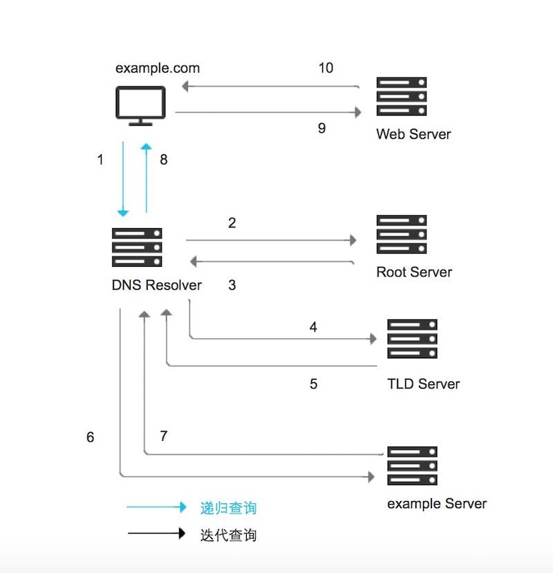
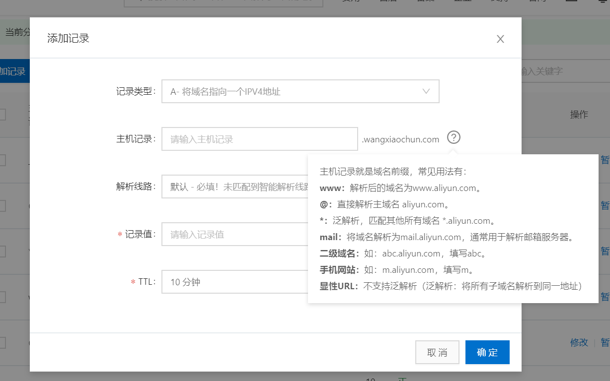

# 1 名称解析介绍和DNS

当前TCP/IP网络中的设备之间进行通信，是利用和依赖于IP地址实现的。但数字形式的IP地址是很难记 忆的。

当网络设备众多，想要记住每个设备的IP地址，可以说是"不可能完成的任务"。那么如何解决这 一难题呢？我们可以给每个网络设备起一个友好的名称，如：www.wanglei.org，这种由文字组成的名 称，显而易见要更容易记忆。但是计算机不会理解这种名称的，我们可以利用一种名字解析服务将名称 转化成（解析）成IP地址。从而我们就可以利用名称来直接访问网络中设备了。除此之外还有一个重要 功能，利用名称解析服务可以实现主机和IP的解耦，即：当主机IP变化时，只需要修改名称服务即可， 用户仍可以通过原有的名称进行访问而不受影响。

实现此服务的方法是多样的。如下面所述：

本地名称解析配置文件：hosts

```bash
Linux: /etc/hosts
windows: %WINDIR%/system32/drivers/etc/hosts

#格式
122.10.117.2 www.wang.org. www
93.46.8.89   www.google.com. google
```

DNS：Domain Name System 域名系统,应用层协议,是互联网的一项服务。它作为将域名和IP地址相互 映射的一个分布式数据库，能够使人更方便地访问互联网,基于C/S架构，服务器端：53/udp, 53/tcp

BIND：Bekerley Internet Name Domain,由 ISC （www.isc.org）提供的DNS软件实现DNS域名结构


- 根域: 全球根服务器节点只有13个,10个在美国，1个荷兰，1个瑞典，1个日本

- 一级域名：Top Level Domain: tld

  三类：组织域、国家域(.cn, .ca, .hk, .tw)、反向域

  com, edu, mil, gov, net, org, int,arpa

- 二级域名：wang.org

- 三级域名：study.wang.org

- 最多可达到127级域名

ICANN（The Internet Corporation for Assigned Names and Numbers）互联网名称与数字地址分配 机构，负责在全球范围内对互联网通用顶级域名（gTLD）以及国家和地区顶级域名（ccTLD）系统的管 理、以及根服务器系统的管理.。

## 1.2 DNS服务工作原理


**13个根服务器地址和所在地区**

```http
https://www.toutiao.com/a7033024151724130823/?
log_from=53294f6dcaec9_1643288102998
```


**根服务器的安全**

```http
2004年4月由于顶级域名.ly瘫痪,导致利比亚从互联网消失了3天
```


**雪人计划**

```http
在与现有IPv4根服务器体系架构充分兼容基础上，"雪人计划"于2016年在美国、日本、印度、俄罗斯、德
国、法国等全球16个国家完成25台IPv6根服务器架设，其中1台主根和3台辅根部署在中国，事实上形成了13
台原有根加25台IPv6根的新格局
```

## 1.3 DNS查询类型

```http
https://help.aliyun.com/document_detail/102237.html
```



- 递归查询：

  是指DNS服务器在收到用户发起的请求时，必须向用户返回一个准确的查询结果。如果DNS服务器 本地没有存储与之对应的信息，则该服务器需要询问其他服务器，并将返回的查询结构提交给用户。

  一般客户机和本地DNS服务器之间属于递归查询，即当客户机向DNS服务器发出请求后,若DNS服 务器本身不能解析，则会向另外的DNS服务器发出查询请求，得到最终的肯定或否定的结果后转交 给客户机。此查询的源和目标保持不变,为了查询结果只需要发起一次查询.

  递归算法:客户端向LocalDNS发起域名查询-->localDNS不知道域名对应的IP-->但它知道谁知道->他 代为帮客户端去查找-->最后再返回最终结果

- 迭代查询：

  是指DNS服务器在收到用户发起的请求时，并不直接回复查询结果，而是告诉另一台DNS服务器的 地址，用户再向这台DNS服务器提交请求，这样依次反复，直到返回查询结果。

  一般情况下(有例外)本地的DNS服务器向其它DNS服务器的查询属于迭代查询,如：若对方不能返回 权威的结果，则它会向下一个DNS服务器(参考前一个DNS服务器返回的结果)再次发起进行查询， 直到返回查询的结果为止。此查询的源不变,但查询的目标不断变化,为查询结果一般需要发起多次查询

  迭代算法︰客户端向LocalDNS发起域名查询-->localDNS不知道域名对应的IP-->但它知道谁知道并 推荐客户端应该找谁-->客户端自己去找它

- DNS缓存: 

  DNS缓存是将解析数据存储在靠近发起请求的客户端的位置，也可以说DNS数据是可以缓存在任意 位置，最终目的是以此减少递归查询过程，可以更快的让用户获得请求结果。

## 1.4 名称服务器

Name Server,域内负责解析本域内的名称的DNS服务器

IPv4的根名称服务器：全球共13个负责解析根域的DNS服务器，美国10个，荷兰1，瑞典1，日本1

IPv6的根名称服务器：全球共25个，中国1主3从，美国1主2从

## 1.5 解析类型

- FQDN --> IP 正向解析

- IP --> FQDN 反向解析

  注意：正反向解析是两个不同的名称空间，是两棵不同的解析树

## 1.6 完整的查询请求经过的流程

```bash
client--> hosts文件---> client DNS Service Local cache -->DNS Server(recursion递归)--> DNS Server Cache -->DNS iteration(迭代) --> 根--> 顶级域名DNS-->二级域名DNS…
```

范例: Windows 客户端DNS缓存

```bash
C:\Users\wanglei>ping www.redhat.com

正在 Ping e3396.ca2.s.tl88.net [223.111.102.32] 具有 32 字节的数据:
来自 223.111.102.32 的回复: 字节=32 时间=32ms TTL=55
来自 223.111.102.32 的回复: 字节=32 时间=33ms TTL=55
来自 223.111.102.32 的回复: 字节=32 时间=35ms TTL=55
来自 223.111.102.32 的回复: 字节=32 时间=33ms TTL=55

223.111.102.32 的 Ping 统计信息:
    数据包: 已发送 = 4，已接收 = 4，丢失 = 0 (0% 丢失)，
往返行程的估计时间(以毫秒为单位):
    最短 = 32ms，最长 = 35ms，平均 = 33ms
    
C:\Users\Administrator>ipconfig/displaydns | findstr  redhat
    www.redhat.com
    记录名称. . . . . . . : www.redhat.com
    CNAME 记录  . . . . . : ds-www.redhat.com.edgekey.net
    记录名称. . . . . . . : ds-www.redhat.com.edgekey.net
    CNAME 记录  . . . . . : ds-www.redhat.com.edgekey.net.globalredir.akadns.net
    记录名称. . . . . . . : ds-www.redhat.com.edgekey.net.globalredir.akadns.net

#刷新本地dns缓存
C:\Users\wanglei>ipconfig/flushdns

Windows IP 配置

已成功刷新 DNS 解析缓存。
```

# 2 DNS 服务相关概念和技术

## 2.1 DNS服务器的类型

- 主DNS服务器
- 从DNS服务器
- 缓存DNS服务器（转发器）

### 2.1.1 主DNS服务器

管理和维护所负责解析的域内解析库的服务器

### 2.1.2 从DNS服务器

从主服务器或从服务器"复制"（区域传输）解析库副本

- 序列号：解析库版本号，主服务器解析库变化时，其序列递增
- 刷新时间间隔：从服务器从主服务器请求同步解析的时间间隔
- 重试时间间隔：从服务器请求同步失败时，再次尝试时间间隔
- 过期时长：从服务器联系不到主服务器时，多久后停止服务
- 通知机制：主服务器解析库发生变化时，会主动通知从服务器

## 2.2 区域传输

- 完全传输：传送整个解析库
- 增量传输：传递解析库变化的那部分内容 

### 2.3 解析形式

- 正向：FQDN（ Fully Qualified Domain Name） --> IP
- 反向: IP --> FQDN

## 2.4 负责本地域名的正向和反向解析库

- 正向区域
- 反向区域

## 2.5 解析答案

- 肯定答案：存在对应的查询结果
- 否定答案：请求的条目不存在等原因导致无法返回结果
- 权威答案：直接由存有此查询结果的DNS服务器（权威服务器）返回的答案
- 非权威答案：由其它非权威服务器返回的查询答案

## 2.6 各种资源记录

区域解析库：由众多资源记录RR(Resource Record)组成

记录类型：A, AAAA, PTR, SOA, NS, CNAME, MX

- SOA：Start Of Authority，起始授权记录；一个区域解析库有且仅能有一个SOA记录，必须位于解 析库的第一条记录

- A：internet Address，作用，FQDN --> IP

- AAAA：FQDN --> IPv6

- PTR：PoinTeR，IP --> FQDN

- NS：Name Server，专用于标明当前区域的DNS服务器

- CNAME ： Canonical Name，别名记录

- MX：Mail eXchanger，邮件交换器

- TXT：对域名进行标识和说明的一种方式，一般做验证记录时会使用此项，如：SPF（反垃圾邮 件）记录，https验证等，如下示例：

  ```http
  _dnsauth TXT 2012011200000051qgs69bwoh4h6nht4n1h0lr038x
  ```

### 2.6.1 资源记录定义的

```http
name [TTL] IN rr_type value
```

注意：

1. TTL可从全局继承
2. 使用 "@" 符号可用于引用当前区域的域名
3. **同一个名字可以通过多条记录定义多个不同的值；此时DNS服务器会以轮询方式响应**
4.  同一个值也可能有多个不同的定义名字；通过多个不同的名字指向同一个值进行定义；此仅表示通 过多个不同的名字可以找到同一个主机

面试题：

```http
1. 我的网站域名需要更改，如何使其更快的生效？
2. 更改TTL值为多少比较合适呢？是如何生效的？
```

### 2.6.2 SOA记录

name: 当前区域的名字，例如"wang.org."

value: 有多部分组成

注意：

- 当前区域的主DNS服务器的FQDN，也可以使用当前区域的名字，只是注释功能，可以不需要配置 对应的NS记录和A记录
- 当前区域管理员的邮箱地址；但地址中不能使用@符号，一般用.替换，例如：admin.wang.org
- 主从服务区域传输相关定义以及否定的答案的统一的TTL

范例：

```http
wang.org. 86400 IN SOA ns.wang.org. nsadmin.wang.org. (
         2015042201 ;序列号
         2H         ;刷新时间
         10M ;重试时间
         1W ;过期时间
         1D ;否定答案的TTL值
         )

```

### 2.6.3 NS记录

name: 当前区域的名字

value: 当前区域的某DNS服务器的名字，例如: ns.wang.org.

注意：

-  相邻的两个资源记录的name相同时，后续的可省略
- 对NS记录而言，任何一个ns记录后面的服务器名字，都应该在后续有一个A记录
- 一个区域可以有多个NS记录

范例：

```http
wang.org. IN NS ns1.wang.org.
wang.org. IN NS ns2.wang.org.
```

### 2.6.4 MX记录

name: 当前区域的名字

value: 当前区域的某邮件服务器(smtp服务器)的主机名

注意：

1. 一个区域内，MX记录可有多个；但每个记录的value之前应该有一个数字(0-99)，表示此服务器的 优先级；数字越小优先级越高
2. 对MX记录而言，任何一个MX记录后面的服务器名字，都应该在后续有一个A记录

范例：

```http
wang.org. IN MX 10 mx1.wang.org.
          IN MX 20 mx2.wang.org.
mx1          A   10.0.0.100
mx2          A   10.0.0.200
```

### 2.6.5 A记录

name: 某主机的FQDN，例如：www.wang.org.

value: 主机名对应主机的IP地址

避免用户写错名称时给错误答案，可通过泛域名解析进行解析至某特定地址

范例：

```http
www.wang.org. IN A 1.1.1.1
www.wang.org. IN A 2.2.2.2
mx1.wang.org. IN   A 3.3.3.3
mx2.wang.org. IN   A 4.4.4.4
$GENERATE 1-254 HOST$   IN A 1.2.3.$
*.wang.org. IN A 5.5.5.5
wang.org. IN   A 6.6.6.6

#注意：如果有和DNS的IP相同的多个同名的A记录，优先返回DNS的本机IP
```

范例：阿里云



### 2.6 6 AAAA记录

```bash
name: FQDN
value: IPv6
```

### 2.6.7 PTR记录

```http
name: IP，有特定格式，把IP地址反过来写，1.2.3.4，要写作4.3.2.1；而有特定后缀：inaddr.arpa.，所以完整写法为：4.3.2.1.in-addr.arpa.
value:
FQDN
```

注意：网络地址及后缀可省略；主机地址依然需要反着写

例如：

```bash
4.3.2.1.in-addr.arpa. IN PTR www.wang.org.
#如1.2.3为网络地址，可简写成：
4 IN PTR www.wang.org. 
```

### 2.6.8 CNAME别名记录

```http
name: 别名的FQDN
value: 真正名字的FQDN
```

例如：

```http
www.wang.org. IN CNAME   websrv.wang.org.
```

## 2.7 子域授权

每个域的名称服务器，都是通过其上级名称服务器在解析库进行授权,类似根域授权tld

glue record：粘合记录，父域授权子域的记录

范例：

```bash
.com. IN NS ns1.com.
.com. IN   NS ns2.com.
ns1.com. IN A 2.2.2.1
ns2.com. IN A 2.2.2.2

#wang.org. 在.com的名称服务器上，解析库中添加资源记录
wang.org. IN NS ns1.wang.org.
wang.org. IN NS ns2.wang.org.
wang.org. IN NS ns3.wang.org.
ns1.wang.org. IN A 3.3.3.1
ns2.wang.org. IN A 3.3.3.2
ns3.wang.org. IN A 3.3.3.3
```

## 2.8 互联网域名

### 2.8.1  域名注册

代理商：万网, 新网, godaddy

### 2.8.2 注册完成以后，想自己用专用服务来解析

管理后台：把NS记录指向的服务器名称，和A记录指向的服务器地址


范例：阿里云DNS管理后台界面


## 2.9 whois

范例: whois 查询域名信息

```bash
root@ubutun2204-1:~# apt install whois
root@ubutun2204-1:~# whois wanglei.com
   Domain Name: WANGLEI.COM
   Registry Domain ID: 90228366_DOMAIN_COM-VRSN
   Registrar WHOIS Server: whois.bizcn.com
   Registrar URL: http://www.bizcn.com
   Updated Date: 2024-06-05T10:09:44Z
   Creation Date: 2002-09-13T01:44:27Z
   Registry Expiry Date: 2025-09-13T01:45:26Z
   Registrar: Bizcn.com, Inc.
   Registrar IANA ID: 471
   Registrar Abuse Contact Email: contact@bizcn.com
   Registrar Abuse Contact Phone: +86.5922179566
   Domain Status: clientDeleteProhibited https://icann.org/epp#clientDeleteProhibited
   Domain Status: clientTransferProhibited https://icann.org/epp#clientTransferProhibited
   Name Server: DNS.BIZCN.COM
   Name Server: DNS.CNMSN.NET
   DNSSEC: unsigned
   URL of the ICANN Whois Inaccuracy Complaint Form: https://www.icann.org/wicf/
>>> Last update of whois database: 2025-01-06T07:23:33Z <<<

For more information on Whois status codes, please visit https://icann.org/epp

NOTICE: The expiration date displayed in this record is the date the
registrar's sponsorship of the domain name registration in the registry is
currently set to expire. This date does not necessarily reflect the expiration
date of the domain name registrant's agreement with the sponsoring
registrar.  Users may consult the sponsoring registrar's Whois database to
view the registrar's reported date of expiration for this registration.

TERMS OF USE: You are not authorized to access or query our Whois
database through the use of electronic processes that are high-volume and
automated except as reasonably necessary to register domain names or
modify existing registrations; the Data in VeriSign Global Registry
Services' ("VeriSign") Whois database is provided by VeriSign for
information purposes only, and to assist persons in obtaining information
about or related to a domain name registration record. VeriSign does not
guarantee its accuracy. By submitting a Whois query, you agree to abide
by the following terms of use: You agree that you may use this Data only
for lawful purposes and that under no circumstances will you use this Data
to: (1) allow, enable, or otherwise support the transmission of mass
unsolicited, commercial advertising or solicitations via e-mail, telephone,
or facsimile; or (2) enable high volume, automated, electronic processes
that apply to VeriSign (or its computer systems). The compilation,
repackaging, dissemination or other use of this Data is expressly
prohibited without the prior written consent of VeriSign. You agree not to
use electronic processes that are automated and high-volume to access or
query the Whois database except as reasonably necessary to register
domain names or modify existing registrations. VeriSign reserves the right
to restrict your access to the Whois database in its sole discretion to ensure
operational stability.  VeriSign may restrict or terminate your access to the
Whois database for failure to abide by these terms of use. VeriSign
reserves the right to modify these terms at any time.

The Registry database contains ONLY .COM, .NET, .EDU domains and
Registrars.
Domain name: wanglei.com
Registry Domain ID: 90228366_DOMAIN_COM-VRSN
Registrar WHOIS Server: whois.bizcn.com
Registrar URL: http://www.bizcn.com
Updated Date: 2024-06-05T10:09:44Z
Creation Date: 2004-08-25T01:45:26Z
Registrar Registration Expiration Date: 2025-09-13T01:45:26Z
Registrar: Bizcn.com,Inc.
Registrar IANA ID: 471
Registrar Abuse Contact Email: abuse@bizcn.com
Registrar Abuse Contact Phone: +86.5922577888
Reseller: 
Domain Status: clientDeleteProhibited (http://www.icann.org/epp#clientDeleteProhibited)
Domain Status: clientTransferProhibited (http://www.icann.org/epp#clientTransferProhibited)
Registry Registrant ID: REDACTED FOR PRIVACY 
Registrant Name: REDACTED FOR PRIVACY 
Registrant Organization: REDACTED FOR PRIVACY 
Registrant Street: REDACTED FOR PRIVACY 
Registrant City: REDACTED FOR PRIVACY 
Registrant State/Province: Fujian
Registrant Postal Code: REDACTED FOR PRIVACY 
Registrant Country: cn
Registrant Phone: REDACTED FOR PRIVACY 
Registrant Phone Ext: REDACTED FOR PRIVACY 
Registrant Fax: REDACTED FOR PRIVACY 
Registrant Fax Ext: REDACTED FOR PRIVACY 
Registrant Email: please send email to whois@bizcn.com to request the domain whois 
Name Server: dns.bizcn.com
Name Server: dns.cnmsn.net
DNSSEC: unsignedDelegation
URL of the ICANN WHOIS Data Problem Reporting System: http://wdprs.internic.net/
>>> Last update of WHOIS database: 2025-01-06T07:23:44Z
For more information on Whois status codes, please visit https://www.icann.org/resources/pages/epp-status-codes-2014-06-16-en

The data in this whois database is provided to you for information
purposes only, that is, to assist you in obtaining information about or
related to a domain name registration record. We make this information
available "as is," and do not guarantee its accuracy. By submitting a
whois query, you agree that you will use this data only for lawful
purposes and that, under no circumstances will you use this data to: (1)
enable high volume, automated, electronic processes that stress or load
this whois database system providing you this information; or (2) allow,
enable, or otherwise support the transmission of mass unsolicited,
commercial advertising or solicitations via direct mail, electronic
mail, or by telephone.  The compilation, repackaging, dissemination or
other use of this data is expressly prohibited without prior written
consent from us.  We reserve the right to modify these terms at any time.
By submitting this query, you agree to abide by these terms.

```

可以从网站查询信息,查询链接

```http
https://www.toolnb.com/domaininfo/wanglei.com.html
```


## 2.10 HttpDNS

### 2.10.1 HttpDNS 定义

HttpDNS是使用HTTP协议向DNS服务器的80端口进行请求，代替传统的DNS协议向DNS服务器的53端 口进行请求。也就是使用Http协议去进行DNS解析请求，DNS服务器返回的解析结果（域名对应的服务 器IP），直接向该IP发起对应的API服务请求，代替使用域名。

### 2.10.2 HttpDNS工作原理


HttpDNS的原理非常简单，主要有两步：

- 客户端直接访问HttpDNS接口，获取业务在域名配置管理系统上配置的访问延迟最优的IP。（基于容 灾考虑，还是保留次选使用运营商LocalDNS解析域名的方式）
- 客户端向获取到的IP后就向直接往此IP发送业务协议请求。以Http请求为例，通过在header中指定 host字段，向HttpDNS返回的IP发送标准的Http请求即可。

### 2.10.3 HttpDNS优势

从原理上来讲，HttpDNS只是将域名解析的协议由DNS协议换成了Http协议，并不复杂。但是这一微小 的转换，却带来了很多的收益：

- A、根治域名解析异常：由于绕过了运营商的LocalDNS，用户解析域名的请求通过Http协议直接透传到 了HttpDNS服务器IP上，用户在客户端的域名解析请求将不会遭受到域名解析异常的困扰。
- B、调度精准：HttpDNS能直接获取到用户IP，通过结合IP地址库以及测速系统，可以保证将用户引导的 访问最快的IDC节点上。
- C、实现成本低廉：接入HttpDNS的业务仅需要对客户端接入层做少量改造，无需用户手机进行root或 越狱；而且由于Http协议请求构造非常简单，兼容各版本的移动操作系统更不成问题；另外HttpDNS的 后端配置完全复用现有权威DNS配置，管理成本也非常低。总而言之，就是以最小的改造成本，解决了 业务遭受域名解析异常的问题，并满足业务精确流量调度的需求。
- D、扩展性强：HttpDNS提供可靠的域名解析服务，业务可将自有调度逻辑与HttpDNS返回结果结合， 实现更精细化的流量调度。比如指定版本的客户端连接请求的IP地址，指定网络类型的用户连接指定的 IP地址等。

# 3 DNS软件 bind

DNS服务器软件：bind，powerdns，dnsmasq，unbound，coredns

## 3.1 BIND（Berkeley Internet Name Domain）相关程 序包

yum list all bind*

- bind：服务器
- bind-utils: 客户端
- bind-libs：相关库,依赖关系自动安装
- bind-chroot: 安全包，将dns相关文件放至 /var/named/chroot/

范例：安装bind软件

```bash
root@ubutun2204-1:~# apt -y install bind9 bind9-utils
```

## 3.2 BIND包相关文件

- BIND主程序：/usr/sbin/named

- 服务脚本和Unit名称：/etc/rc.d/init.d/named，/usr/lib/systemd/system/named.service

- 主配置文件：/etc/named.conf, /etc/named.rfc1912.zones, /etc/rndc.key

- 管理工具：/usr/sbin/rndc：remote name domain controller，默认与bind安装在同一主机，且 只能通过127.0.0.1连接named进程，提供辅助性的管理功能；953/tcp

- 解析库文件：/var/named/ZONE_NAME.ZONE

  注意：

  (1) 一台物理服务器可同时为多个区域提供解析

  (2) 必须要有根区域文件；named.ca

  (3) 应该有两个（如果包括ipv6的，应该更多）实现localhost和本地回环地址的解析库

### 3.3 主配置文件

- 全局配置：options {};

- 日志子系统配置：logging {};

- 区域定义：本机能够为哪些zone进行解析，就要定义哪些zone

  zone "ZONE_NAME" IN {};

注意：

- 任何服务程序如果期望其能够通过网络被其它主机访问，至少应该监听在一个能与外部主机通信的 IP地址上
- 缓存名称服务器的配置：监听外部地址即可
- dnssec: 建议关闭dnssec，设为no

# 4 实现主DNS服务器

## 4.1 主DNS服务器配置

1. 在主配置文件中定义区域

```bash
vim /etc/named.conf             
#注释掉下面两行
// listen-on port 53 { 127.0.0.1; };
// allow-query     { localhost; };

zone "ZONE_NAME" IN {
   type {master|slave|hint|forward};
   file "ZONE_NAME.zone";
}
```

2. 定义区域解析库文件

   内容包括 :

   - 宏定义
   - 资源记录 

范例：区域数据库

```bash
$TTL 86400
$ORIGIN wang.org.
@ IN SOA ns1.wang.org. admin.wang.org (
     2015042201
     1H
     5M
     7D
     1D )
  IN NS ns1
  IN NS ns2
  IN MX 10 mx1
  IN MX 20 mx2
  
ns1 IN A 172.16.100.11
ns2 IN A 172.16.100.12
mx1 IN A 172.16.100.13
mx2 IN A 172.16.100.14
websrv IN A 172.16.100.11
websrv IN A 172.16.100.12
www IN CNAME websrv  
```

范例：抓包观察查询过程

```bash
[root@centos8 ~]#tcpdump -i eth0 udp port 53 -nn
tcpdump: verbose output suppressed, use -v or -vv for full protocol decode
listening on eth0, link-type EN10MB (Ethernet), capture size 262144 bytes
11:37:38.458363 IP 10.0.0.7.42201 > 10.0.0.8.53: 44928+ A? www.baidu.com. (31)
11:37:38.458896 IP 10.0.0.7.54285 > 10.0.0.8.53: 44928+ A? www.baidu.com. (31)
11:37:38.460038 IP 10.0.0.7.42053 > 10.0.0.8.53: 30536+ A? 
www.baidu.com.wangxiaochun.com. (48)
11:37:38.460884 IP 10.0.0.7.37739 > 10.0.0.8.53: 30536+ A? 
www.baidu.com.wangxiaochun.com. (48)

[root@centos7 ~]#telnet 10.0.0.8 53
Trying 10.0.0.8...
telnet: connect to address 10.0.0.8: Connection refused
```

## 4.2 主配置文件语法检查

```bash
named-checkconf
```

## 4.3 解析库文件语法检查

```http
named-checkzone "wang.org" /var/named/wang.org.zone
```

## 4.4 配置生效

```bash
#三种方式
#rndc reload 
#systemctl reload named
#service named reload
```

## 4.5 DNS 测试和管理工具

### 4.5.1 dig 命令

dig只用于测试dns系统，不会查询hosts文件进行解析

命令格式：

```http
dig [-t type] name [@SERVER] [query options]
query options：
   +[no]trace：跟踪解析过程 : dig +trace wang.org
   +[no]recurse：进行递归解析
```

范例：

```bash
#测试反向解析
dig -x IP = dig –t ptr reverseip.in-addr.arpa
#模拟区域传送
dig -t axfr ZONE_NAME @SERVER
dig -t axfr wang.org @10.10.10.11
dig –t axfr 100.1.10.in-addr.arpa @172.16.1.1
dig -t NS . @114.114.114.114
dig -t NS . @a.root-servers.net
```

### 4.5.2 host命令

命令格式：

```http
host [-t type] name [SERVER]
```

范例

```http
host -t NS wang.org 172.16.0.1
host -t soa wang.org
host -t mx wang.org
host -t axfr wang.org
host 1.2.3.4
```

### 4.5.3 nslookup命令

nslookup 可以支持交互和非交互式两种方式执行

命令格式：

```http
nslookup [-option] [name | -] [server]
```

交互式模式：

```bash
nslookup>
server IP: 指明使用哪个DNS server进行查询
set q=RR_TYPE: 指明查询的资源记录类型
NAME: 要查询的名称
```

### 4.5.4 rndc 命令

利用rndc工具可以实现管理DNS功能

rndc 监听端口: 953/tcp 

命令格式:

```bash
rndc COMMAND
COMMAND:
     status: 查看状态
     reload: 重载主配置文件和区域解析库文件
     reload zonename: 重载区域解析库文件
     retransfer zonename: 手动启动区域传送，而不管序列号是否增加
     notify zonename: 重新对区域传送发通知
     reconfig: 重载主配置文件
     querylog: 开启或关闭查询日志文件/var/log/message
     trace: 递增debug一个级别
     trace LEVEL: 指定使用的级别
     notrace：将调试级别设置为 0
     flush：清空DNS服务器的所有缓存记录
```

```bash
root@ubutun2204-1:~# rndc status
version: BIND 9.18.28-0ubuntu0.22.04.1-Ubuntu (Extended Support Version) <id:>
running on localhost: Linux x86_64 5.15.0-112-generic #122-Ubuntu SMP Thu May 23 07:48:21 UTC 2024
boot time: Mon, 06 Jan 2025 07:41:32 GMT
last configured: Mon, 06 Jan 2025 07:41:32 GMT
configuration file: /etc/bind/named.conf
CPUs found: 2
worker threads: 2
UDP listeners per interface: 2
number of zones: 103 (98 automatic)
debug level: 0
xfers running: 0
xfers deferred: 0
soa queries in progress: 0
query logging is OFF
recursive clients: 0/900/1000
tcp clients: 0/150
TCP high-water: 0
server is up and running
```

## 4.6 实战案例：实现DNS正向主服务器

### 4.6.1 实验目的

```http
搭建DNS正向主服务器，实现web服务器基于FQDN的访问
```

### 4.6.2 环境要求

```bash
需要三台主机
DNS服务端：192.168.159.104
web服务器：192.168.159.105
DNS客户端：192.168.159.103
```

### 4.6.3 前提准备

```bash
关闭防火墙
时间同步
```

### 4.6.4 实现步骤

#### 4.6.4.1 在DNS服务端安装bind

```bash
root@ubutun2204-1:~# apt -y install bind9 bind9-utils
```

### 4.6.4.2 修改bind 配置文件

```bash
root@ubutun2204-1:~# cat /etc/bind/named.conf
......
include "/etc/bind/named.conf.options";
include "/etc/bind/named.conf.local";
include "/etc/bind/named.conf.default-zones";

# 修改/etc/bind/named.conf.options
root@ubutun2204-1:~# cat /etc/bind/named.conf.options 
options {
	directory "/var/cache/bind";

	// If there is a firewall between you and nameservers you want
	// to talk to, you may need to fix the firewall to allow multiple
	// ports to talk.  See http://www.kb.cert.org/vuls/id/800113

	// If your ISP provided one or more IP addresses for stable 
	// nameservers, you probably want to use them as forwarders.  
	// Uncomment the following block, and insert the addresses replacing 
	// the all-0's placeholder.
     // option配置文件路径为 /etc/bind/named.conf.options， 去掉文件中forwarders的注释。forwarders节点配置的是转发器，所有非本域的和在缓存中无法找到的域名查询都将转发到设置的DNS转发器上，由这台DNS来完成解析工作并做缓存。转发器设置两个常用的DNS服务器即可：
	forwarders {
	     8.8.8.8;
	};

	//========================================================================
	// If BIND logs error messages about the root key being expired,
	// you will need to update your keys.  See https://www.isc.org/bind-keys
	//========================================================================
	dnssec-validation auto;
	listen-on-v6 { any; };
        auth-nxdomain no;
        listen-on port 53 {192.168.159.104;}; //这一项是填写自己的DNS服务器IP地址
        allow-transfer {any; };
        allow-query{ any; };
        
};


# 配置正向解析
root@ubutun2204-1:~# vim /etc/bind/named.conf.local
root@ubutun2204-1:~# cat  /etc/bind/named.conf.local 
//
// Do any local configuration here
//

// Consider adding the 1918 zones here, if they are not used in your
// organization
//include "/etc/bind/zones.rfc1918";

#添加以下内容
zone "wang.org" IN {
   type master;
   file "/etc/bind/wang.org.zone";
};


```

#### 4.6.4.3 DNS区域数据库文件

```bash
root@ubutun2204-1:~# cat  /etc/bind/wang.org.zone
$TTL 604800
$ORIGIN wang.org.
@	IN	SOA	wang.org. admin.wang.org. (
			      1		; Serial
			 604800		; Refresh
			  86400		; Retry
			2419200		; Expire
			 604800 )	; Negative Cache TTL
;

        IN       NS     master
master  IN       A     192.168.159.104
www     IN       A     192.168.159.105 
```

#### 4.6.4.4 检查配置文件和数据库文件格式，并启动服务

```bash
root@ubutun2204-1:~# named-checkconf
root@ubutun2204-1:~# named-checkzone wang.org /etc/bind/wang.org.zone 
zone wang.org/IN: loaded serial 1
OK

root@ubutun2204-1:~# rndc reload
server reload successful
```

#### 4.6.4.5 实现WEB服务

```bash
root@web:~# apt install nginx
root@web:~# echo "wanglei" > /var/www/html/index.html
```

#### 4.6.4.6 在客户端实现测试

```bash
root@ubutun2204-1:~# cat  /etc/netplan/00-installer-config.yaml
# This is the network config written by 'subiquity'
network:
  ethernets:
    ens33:
      addresses:
      - 192.168.159.103/24
      gateway4: 192.168.159.2
      nameservers: 
        addresses: [192.168.159.104]
  version: 2


#重启网卡，看到以下内容成功
root@ubutun2204-1:~# netplan apply
root@ubutun2204-1:~# nslookup www.wang.org
Server:		192.168.159.104
Address:	192.168.159.104#53

Name:	www.wang.org
Address: 192.168.159.105

root@ubutun2204-1:~# curl www.wang.org
wanglei
```

## 4.7 允许动态更新

动态更新：可以通过远程更新区域数据库的资源记录

实现动态更新，需要在指定的zone语句块中：

```http
Allow-update {any;};
```

## 4.8 启用DNS客户端缓存功能

在高并发的服务器场景中,对DNS的服务器查询性能有较高的要求,如果在客户端启用DNS缓存功能,可以 大幅减轻DNS服务器的压力,同时也能提高DNS客户端名称解析速度

### 4.8.1 CentOS 启用DNS客户端缓存

CentOS 默认没有启用DNS客户端缓存,安装nscd（Name Service Cache Daemon,名称服务缓存守护进 程）包可以支持DNS缓存功能

减少DNS服务器压力,提高DNS查询速度

```bash
[root@centos7 ~]#yum -y install nscd
[root@centos7 ~]#systemctl enable --now nscd

#查看缓存统计信息
[root@centos7 ~]#nscd -g
nscd configuration:
......
services cache:
            yes cache is enabled
            yes cache is persistent
            yes cache is shared
            211 suggested size
         216064 total data pool size
              0 used data pool size
          28800 seconds time to live for positive entries
             20 seconds time to live for negative entries
              0 cache hits on positive entries
              0 cache hits on negative entries
              0 cache misses on positive entries
              0 cache misses on negative entries
              0% cache hit rate
              0 current number of cached values
              0 maximum number of cached values
              0 maximum chain length searched
              0 number of delays on rdlock
              0 number of delays on wrlock
              0 memory allocations failed
            yes check /etc/services for changes
......

#清除DNS客户端缓存
[root@centos7 ~]#nscd -i hosts
```

### 4.8.2 Ubuntu 启用DNS客户端缓存

ubuntu 默认会启用DNS客户端缓存

```bash
root@ubutun2204-1:~# systemctl status systemd-resolved.service 
● systemd-resolved.service - Network Name Resolution
     Loaded: loaded (/lib/systemd/system/systemd-resolved.service; enabled; vendor preset: enabled)
     Active: active (running) since Mon 2025-01-06 08:53:02 UTC; 9min ago
       Docs: man:systemd-resolved.service(8)
             man:org.freedesktop.resolve1(5)
             https://www.freedesktop.org/wiki/Software/systemd/writing-network-configuration-managers
             https://www.freedesktop.org/wiki/Software/systemd/writing-resolver-clients
   Main PID: 852 (systemd-resolve)
     Status: "Processing requests..."
      Tasks: 1 (limit: 2176)
     Memory: 9.0M
        CPU: 86ms
     CGroup: /system.slice/systemd-resolved.service
             └─852 /lib/systemd/systemd-resolved

Jan 06 08:53:02 ubutun2204-1 systemd[1]: Starting Network Name Resolution...
Jan 06 08:53:02 ubutun2204-1 systemd-resolved[852]: Positive Trust Anchors:
Jan 06 08:53:02 ubutun2204-1 systemd-resolved[852]: . IN DS 20326 8 2 e06d44b80b8f1d39a95c0b0d7c65d08458e880409bbc683457104237c7f8ec8d
Jan 06 08:53:02 ubutun2204-1 systemd-resolved[852]: Negative trust anchors: home.arpa 10.in-addr.arpa 16.172.in-addr.arpa 17.172.in-addr.arpa 18.172.in-addr.arpa 19.172.in-addr.arpa 20.172.in-addr.arpa 21.172.in-addr.arpa 22.172.in-addr.arpa 23.>
Jan 06 08:53:02 ubutun2204-1 systemd-resolved[852]: Using system hostname 'ubutun2204-1'.
Jan 06 08:53:02 ubutun2204-1 systemd[1]: Started Network Name Resolution.

#清空缓存
root@ubutun2204-1:~#systemd-resolve --flush-caches
root@ubutun2204-1:~#systemd-resolve --statistics
DNSSEC supported by current servers: no
Transactions
Current Transactions: 0
 Total Transactions: 53
Cache
 Current Cache Size: 0
         Cache Hits: 2
       Cache Misses: 52
DNSSEC Verdicts
             Secure: 0
           Insecure: 0
               Bogus: 0
       Indeterminate: 0
```

# 5 实现反向解析区域

## 5.1 反向解析配置

反向区域：即将IP反向解析为FQDN

区域名称：网络地址反写.in-addr.arpa

示例：

```http
172.16.100. --> 100.16.172.in-addr.arpa.
```

(1) 定义区域

```http
zone "ZONE_NAME" IN {
 type {master|slave|forward}；
 file "网络地址.zone"
};
```

(2) 定义区域解析库文件

注意：不需要A记录,以PTR记录为主

范例：

```bash
$TTL 86400
$ORIGIN 16.172.in-addr.arpa.
@ IN SOA ns1.wang.org. admin.wang.org. (
         2015042201
         1H
         5M
         7D
         1D )
 IN NS ns1.wang.org.
1.2 IN PTR www.wang.org.
3.4 IN PTR mx1.wang.org.

#实现以下解析
172.16.2.1 www.wang.org.
172.16.4.3 mx1.wang.org.
```

## 5.2 实战案例: 反向解析

```bash
root@ubutun2204-1:~# cat /etc/bind/named.conf
......
include "/etc/bind/named.conf.options";
include "/etc/bind/named.conf.local";
include "/etc/bind/named.conf.default-zones";

# 修改/etc/bind/named.conf.options
root@ubutun2204-1:~# cat /etc/bind/named.conf.options 
options {
	......
     // option配置文件路径为 /etc/bind/named.conf.options， 去掉文件中forwarders的注释。forwarders节点配置的是转发器，所有非本域的和在缓存中无法找到的域名查询都将转发到设置的DNS转发器上，由这台DNS来完成解析工作并做缓存。转发器设置两个常用的DNS服务器即可：
	forwarders {
	     8.8.8.8;
	};

	//========================================================================
	// If BIND logs error messages about the root key being expired,
	// you will need to update your keys.  See https://www.isc.org/bind-keys
	//========================================================================
	dnssec-validation auto;
	listen-on-v6 { any; };
        auth-nxdomain no;
        listen-on port 53 {192.168.159.104;}; //这一项是填写自己的DNS服务器IP地址
        allow-transfer {any; };
        allow-query{ any; };
        
};

root@ubutun2204-1:~# cat  /etc/bind/named.conf.local 
......
zone "159.168.192.in-addr.arpa" {
   type master;
   file "/etc/bind/192.168.159.zone";
};


root@ubutun2204-1:~# cat /etc/bind/192.168.159.zone
$TTL 604800
@	IN	SOA	ns1.wang.org. admin.wang.org. (
			      1		; Serial
			 604800		; Refresh
			  86400		; Retry
			2419200		; Expire
			 604800 )	; Negative Cache TTL
;

       IN   NS        ns1.wang.org.  #NS记录必须以点结束，否则配置A记录才可以启动
105    IN   PTR       blog.wanglei.com.


root@ubutun2204-1:~# named-checkzone 159.168.192.in-addr.arpa /etc/bind/192.168.159.zone 
zone 159.168.192.in-addr.arpa/IN: loaded serial 1
OK

root@ubutun2204-1:~# systemctl restart named.service 


# 测试
root@ubutun2204-1:~# host 192.168.159.105
105.159.168.192.in-addr.arpa domain name pointer blog.wanglei.com.
```

# 6 实现从服务器

只有一台主DNS服务器，存在单点失败的问题，可以建立主DNS服务器的备份服务器，即从服务器来实 现DNS服务的容错机制。从服务器可以自动和主服务器进行单向的数据同步，从而和主DNS服务器一 样，也可以对外提供查询服务，但从服务器不提供数据更新服务。

## 6.1 DNS从服务器

- 应该为一台独立的名称服务器
- 主服务器的区域解析库文件中必须有一条NS记录指向从服务器
- 从服务器只需要定义区域，而无须提供解析库文件；解析库文件应该放置于/var/named/slaves/目 录中
- 主服务器得允许从服务器作区域传送
- 主从服务器时间应该同步，可通过ntp进行
-  bind程序的版本应该保持一致；否则，应该从高，主低

## 6.2 定义从区域

格式：

```bash
zone "ZONE_NAME" IN {
 type slave;
 masters { MASTER_IP; };
 file "slaves/ZONE_NAME.zone";
};
```

## 6.3 实战案例：实现DNS从服务器

### 6.3.1 实验目的

```bash
搭建DNS主从服务器架构，实现DNS服务冗余
```

### 6.3.2 环境要求

```http
需要四台主机
DNS1服务端：192.168.159.104
DNS2服务端：192.168.159.106
web服务器：192.168.159.105
DNS客户端：192.168.159.103
```

### 6.3.3 前提准备

```bash
关闭防火墙
时间同步
```

### 6.3.4 实现步骤

#### 6.3.4.1 主DNS服务端配置(参看前面案例)

```bash

root@ubutun2204-1:~# apt -y install bind9 bind9-utils
root@ubutun2204-1:~# cat /etc/bind/named.conf
......
include "/etc/bind/named.conf.options";
include "/etc/bind/named.conf.local";
include "/etc/bind/named.conf.default-zones";

# 修改/etc/bind/named.conf.options
root@ubutun2204-1:~# cat /etc/bind/named.conf.options 
options {
	directory "/var/cache/bind";

	// If there is a firewall between you and nameservers you want
	// to talk to, you may need to fix the firewall to allow multiple
	// ports to talk.  See http://www.kb.cert.org/vuls/id/800113

	// If your ISP provided one or more IP addresses for stable 
	// nameservers, you probably want to use them as forwarders.  
	// Uncomment the following block, and insert the addresses replacing 
	// the all-0's placeholder.
     // option配置文件路径为 /etc/bind/named.conf.options， 去掉文件中forwarders的注释。forwarders节点配置的是转发器，所有非本域的和在缓存中无法找到的域名查询都将转发到设置的DNS转发器上，由这台DNS来完成解析工作并做缓存。转发器设置两个常用的DNS服务器即可：
	forwarders {
	     8.8.8.8;
	};

	//========================================================================
	// If BIND logs error messages about the root key being expired,
	// you will need to update your keys.  See https://www.isc.org/bind-keys
	//========================================================================
	dnssec-validation auto;
	listen-on-v6 { any; };
        auth-nxdomain no;
        listen-on port 53 {192.168.159.104;}; //这一项是填写自己的DNS服务器IP地址
        # #只允许从服务器进行区域传输
        allow-transfer {192.168.159.106; };  // 从服务器ip
        allow-query{ any; };
        
};

root@ubutun2204-1:~# cat /etc/bind/named.conf.local 
zone "wang.org" IN {
   type master;
   file "/etc/bind/wang.org.zone";
};

root@ubutun2204-1:~# cat  /etc/bind/wang.org.zone
$TTL 604800
$ORIGIN wang.org.
@	IN	SOA	wang.org. admin.wang.org. (
			      1		; Serial
			 604800		; Refresh
			  86400		; Retry
			2419200		; Expire
			 604800 )	; Negative Cache TTL
;

        IN       NS     master
        IN       NS     slave
master  IN       A     192.168.159.104
slave   IN       A     192.168.159.106
www     IN       A     192.168.159.105


root@ubutun2204-1:~# systemctl restart named.service
```

#### 6.3.4.2 从DNS服务器配置

```bash
root@ubutun2204-1:~# apt -y install bind9 bind9-utils
root@ubutun2204-1:~# cat  /etc/bind/named.conf.options 
options {
	directory "/var/cache/bind";
	dnssec-validation auto;
    listen-on port 53 {192.168.159.106;};
    #不允许其它主机进行区域传输
    allow-transfer {none; };
	listen-on-v6 { any; };
	allow-query{ any; };
};


root@ubutun2204-1:~# cat  /etc/bind/named.conf.local 
zone "wang.org" {
    type slave;
    masters { 192.168.159.104; };
    file "/etc/bind/wang.org.slave";
};


root@ubutun2204-1:~# systemctl restart named.service

#查看区域数据库文件是否生成

```

#### 6.3.4.3 客户端测试主从DNS服务架构

```bash
#验证从DNS服务器是否可以查询
dig www.wang.org @192.168.159.106
```

# 7 实现子域

## 7.1 子域委派授权

将子域委派给其它主机管理，实现分布式DNS数据库

正向解析区域子域方法

范例：定义两个子域区域

```http
shanghai.wang.org. IN NS ns1.ops.wang.org.
shanghai.wang.org. IN NS ns2.ops.wang.org.
shenzhen.wang.org. IN NS ns1.shenzhen.wang.org.
shenzhen.wang.org. IN NS ns2.shenzhen.wang.org.
ns1.shanghai.wang.org. IN A 1.1.1.1
ns2.shanghai.wang.org. IN A 1.1.1.2
ns1.shenzhen.wang.org. IN A 1.1.1.3
ns2.shenzhen.wang.org. IN A 1.1.1.4
```

## 7.2 范例：实现DNS父域和子域服务

### 7.2.1 实验目的


```bash
搭建DNS父域和子域服务器
```

### 7.2.2 环境要求

```http
需要五台主机
DNS父域服务器：10.0.0.8
DNS子域服务器：10.0.0.18
父域的web服务器：10.0.0.7，www.wang.org
子域的web服务器：10.0.0.17,www.shanghai.wang.org
DNS客户端：10.0.0.6
```

### 7.2.3 前提准备

```bash
关闭SElinux
关闭防火墙
时间同步
```

### 7.2.4 实现步骤

#### 7.2.4.1 在父域DNS服务器上实现主wang.org域的主DNS服务

```bash
yum install bind -y

vim /etc/named.conf
#注释掉下面两行
// listen-on port 53 { 127.0.0.1; };
// allow-query     { localhost; };

#只允许从服务器进行区域传输
allow-transfer { 从服务器IP;}; 

#建议关闭加密验证
dnssec-enable no; 
dnssec-validation no;

vim /etc/named.rfc1912.zones    
#加上这段
zone "wang.org" {
   type master;
   file  "wang.org.zone";
};

cp -p /var/named/named.localhost /var/named/wang.org.zone
#如果没有-p，需要改权限。chgrp named wang.org.zone

vim /var/named/wang.org.zone 
$TTL 1D
@ IN SOA master admin.wang.org. (
         1 ; serial
         1D ; refresh
         1H ; retry
         1W ; expire
         3H ) ; minimum
           NS master
shanghai   NS   shanghains
master     A    10.0.0.8
shanghains A    10.0.0.18 
www         A    10.0.0.7  

rndc reload
```

#### 7.2.4.2 实现子域的DNS服务器

```bash
yum install bind -y

vim /etc/named.conf             
#注释掉下面两行
// listen-on port 53 { 127.0.0.1; };
// allow-query     { localhost; };
allow-transfer { none;}

vim /etc/named.rfc1912.zones
zone "shanghai.wang.org" {
   type master;
   file "shanghai.wang.org.zone";
};

cp -p /var/named/named.localhost /var/named/shanghai.wang.org.zone
#如果没有-p，需要改权限。chgrp named wang.org.zone

vim /var/named/shanghai.wang.org.zone 

$TTL 1D
@   IN SOA master admin.wang.org. (
                    2019042214 ; serial
                   1D ; refresh
                   1H ; retry
                   1W ; expire
                   3H )   ; minimum
           NS   master
master     A    10.0.0.18
www       A    10.0.0.17

systemctl start named 
```

#### 7.2.4.4 在父域和子域的web服务器上安装httpd服务

```bash
#父域的web服务器利用上面案例（略）
#在子域的web服务器上安装http服务
yum install httpd                        
#配置主页面
echo www.shanghai.wang.org > /var/www/html/index.html
#启动服务
systemctl start httpd     
```

7.2.4.5 客户端测试

```bash
dig www.shanghai.wang.org
```

# 8 实现 DNS 转发（缓存）服务器

## 8.1 DNS转发

利用DNS转发，可以将用户的DNS请求，转发至指定的DNS服务，而非默认的根DNS服务器，并将指定 服务器查询的返回结果进行缓存，提高效率。

注意：

1. 被转发的服务器需要能够为请求者做递归，否则转发请求不予进行

2. 在/etc/named.conf的全局配置块中，关闭dnssec功能

   ```http
   dnssec-enable no;
   dnssec-validation no;
   ```

## 8.2 转发方式

### 8.2.1 全局转发

对非本机所负责解析区域的请求，全转发给指定的服务器

在全局配置块中实现：

```bash
Options {
   forward first|only;
   forwarders { ip;};
};
```

### 8.2.2 特定区域转发

仅转发对特定的区域的请求，比全局转发优先级高

```bash
zone "ZONE_NAME" IN {
 type forward;
 forward first|only;
 forwarders { ip;};
};
```

first：先转发至指定DNS服务器，如果无法解析查询请求，则本服务器再去根服务器查询

only: 先转发至指定DNS服务器，如果无法解析查询请求，则本服务器将不再去根服务器查询

## 8.3 实战案例：实现DNS forward（缓存）服务器

### 8.3.1 实验目的

```bash
搭建DNS转发（缓存）服务器
```

### 8.3.2 环境要求

```bash
需要四台主机
DNS只缓存服务器：10.0.0.8
DNS主服务器:10.0.0.18
web服务器：10.0.0.7
DNS客户端：10.0.0.6
```

### 8.3.3 前提准备

```bash
关闭SElinux
关闭防火墙
时间同步
```

### 8.3.4 实现步骤

#### 8.3.4.1 实现转发（只缓存）DNS服务器

```bash
yum install bind -y

vim /etc/named.conf             
#注释掉两行
// listen-on port 53 { 127.0.0.1; };
// allow-query     { localhost; };

forward first;
forwarders { 10.0.0.18;}; 

#关闭dnsec功能
dnssec-enable no;
dnssec-validation no;

systemctl start named          #第一次启动服务
rndc reload                    #不是第一次启动服务 
```

#### 8.3.4.2 实现主DNS服务器

```bash
yum install bind -y


vim /etc/named.conf             
#注释掉两行
// listen-on port 53 { 127.0.0.1; };
// allow-query     { localhost; };


vim /etc/named.rfc1912.zones    
#加上下面这段
zone "wang.org" {
   type master;
   file  "wang.org.zone";
};


cp -p /var/named/named.localhost /var/named/wang.org.zone
#如果没有-p，需要改权限。chgrp named wang.org.zone


vim /var/named/wang.org.zone

$TTL 1D
@   IN SOA master admin.wang.org. (
                    2019042214 ; serial
                   1D ; refresh
                   1H ; retry
                   1W ; expire
                   3H )   ; minimum
           NS   master
master     A    10.0.0.18
websrv     A    10.0.0.7                          
www       CNAME websrv

systemctl start named          #第一次启动服务
rndc reload                    #不是第一次启动服务
```

#### 8.3.4.3 web服务器配置（参看前面案例，略）

#### 8.3.4.4 在客户端测试

```bash
#客户端配置（参看前面案例，略）
dig www.wang.org    
curl www.wang.org
```

# 9 实现智能 DNS


## 9.1 GSLB

GSLB：Global Server Load Balance全局负载均衡

GSLB 是对服务器和链路进行综合判断来决定由哪个地点的服务器来提供服务，实现异地服务器群服务 质量的保证 

GSLB主要的目的是在整个网络范围内将用户的请求定向到最近的节点（或者区域）

GSLB分为基于DNS实现、基于重定向实现、基于路由协议实现，其中最通用的是基于DNS解析方式

范例：在北京查询VIP使用网宿的CDN服务

```bash
[root@centos6 ~]#dig www.vip.com

; <<>> DiG 9.8.2rc1-RedHat-9.8.2-0.68.rc1.el6 <<>> www.vip.com
;; global options: +cmd
;; Got answer:
;; ->>HEADER<<- opcode: QUERY, status: NOERROR, id: 44153
;; flags: qr rd ra; QUERY: 1, ANSWER: 2, AUTHORITY: 5, ADDITIONAL: 0

;; QUESTION SECTION:
;www.vip.com. IN A

;; ANSWER SECTION:
www.vip.com. 180 IN CNAME www.vip.com.wscdns.com.#wscdn 网宿服务商
www.vip.com.wscdns.com. 60 IN A 111.206.176.92

;; AUTHORITY SECTION:
wscdns.com. 172800 IN NS dns2.wscdns.info.
wscdns.com. 172800 IN NS dns3.wscdns.org.
wscdns.com. 172800 IN NS dns4.wscdns.info.
wscdns.com. 172800 IN NS dns5.cdn30.org.
wscdns.com. 172800 IN NS dns1.wscdns.org.

;; Query time: 1290 msec
;; SERVER: 10.0.0.18#53(10.0.0.18)
;; WHEN: Wed Feb 12 18:05:17 2020
;; MSG SIZE rcvd: 200
```

范例: 在郑州查询VIP使用网宿的CDN服务

```bash
[root@centos8 ~]#dig www.vip.com

; <<>> DiG 9.11.13-RedHat-9.11.13-3.el8 <<>> www.vip.com
;; global options: +cmd
;; Got answer:
;; ->>HEADER<<- opcode: QUERY, status: NOERROR, id: 41846
;; flags: qr rd ra; QUERY: 1, ANSWER: 2, AUTHORITY: 5, ADDITIONAL: 1

;; OPT PSEUDOSECTION:
; EDNS: version: 0, flags:; udp: 4096
; COOKIE: c64336bd04f5165946e2a4115f5ec84d89fb312a09571ab0 (good)
;; QUESTION SECTION:
;www.vip.com. IN A

;; ANSWER SECTION:
www.vip.com. 121 IN CNAME www.vip.com.wscdns.com.
www.vip.com.wscdns.com. 2 IN A 111.6.176.42

;; AUTHORITY SECTION:
wscdns.com. 172742 IN NS dns5.cdn30.org.
wscdns.com. 172742 IN NS dns3.wscdns.org.
wscdns.com. 172742 IN NS dns2.wscdns.info.
wscdns.com. 172742 IN NS dns1.wscdns.org.
wscdns.com. 172742 IN NS dns4.wscdns.info.

;; Query time: 0 msec
;; SERVER: 127.0.0.1#53(127.0.0.1)
;; WHEN: Mon Sep 14 09:33:01 CST 2020
;; MSG SIZE rcvd: 239
```

## 9.2 CDN （Content Delivery Network）内容分发网络


### 9.2.1 CDN工作原理

1.  用户向浏览器输入www.a.com这个域名，浏览器第一次发现本地没有dns缓存，则向网站的DNS服 务器请求
2. 网站的DNS域名解析器设置了CNAME，指向了www.a.tbcdn.com,请求指向了CDN网络中的智能 DNS负载均衡系统 
3.  智能DNS负载均衡系统解析域名，把对用户响应速度最快的IP节点返回给用户；
4. 用户向该IP节点（CDN服务器）发出请求
5.  由于是第一次访问，CDN服务器会通过Cache内部专用DNS解析得到此域名的原web站点IP，向原 站点服务器发起请求，并在CDN服务器上缓存内容 
6. 请求结果发给用户

范例: CDN工作原理就近返回服务器地址

```bash
[root@centos6 ~]#cat /etc/resolv.conf
# Generated by NetworkManager
search localdomain
nameserver 54.252.183.4 
[root@centos6 ~]#ping www.jd.com -c1
PING jd-abroad.cdn20.com (163.171.197.13) 56(84) bytes of data.
64 bytes from 163.171.197.13: icmp_seq=1 ttl=128 time=266 ms
--- jd-abroad.cdn20.com ping statistics ---
1 packets transmitted, 1 received, 0% packet loss, time 739ms
rtt min/avg/max/mdev = 266.711/266.711/266.711/0.000 ms

[root@centos6 ~]#cat /etc/resolv.conf
# Generated by NetworkManager
search localdomain
nameserver 223.6.6.6
nameserver 180.76.76.76

[root@centos6 ~]#ping www.jd.com -c1
PING img2x-v6-sched.jcloudedge.com (123.6.29.3) 56(84) bytes of data.
64 bytes from hn.kd.ny.adsl (123.6.29.3): icmp_seq=1 ttl=128 time=3.04 ms
--- img2x-v6-sched.jcloudedge.com ping statistics ---
1 packets transmitted, 1 received, 0% packet loss, time 22ms
rtt min/avg/max/mdev = 3.044/3.044/3.044/0.000 ms
[root@centos6 ~]#
```

### 9.2.2 CDN服务商

- 服务商：阿里，腾讯，蓝汛，网宿，帝联等
- 智能DNS: dnspod dns.la

范例: 浪潮使用网宿的CDN服务

```bash
[root@centos8 ~]#dig www.inspur.com

; <<>> DiG 9.11.13-RedHat-9.11.13-3.el8 <<>> www.inspur.com
;; global options: +cmd
;; Got answer:
;; ->>HEADER<<- opcode: QUERY, status: NOERROR, id: 24043
;; flags: qr rd ra; QUERY: 1, ANSWER: 2, AUTHORITY: 0, ADDITIONAL: 0

;; QUESTION SECTION:
;www.inspur.com. IN A

;; ANSWER SECTION:
www.inspur.com. 43 IN CNAME www.inspur.com.wscdns.com.
www.inspur.com.wscdns.com. 43 IN A 111.206.179.204

;; Query time: 8 msec
;; SERVER: 223.6.6.6#53(223.6.6.6)
;; WHEN: Tue Jan 05 22:25:03 CST 2021
;; MSG SIZE rcvd: 84

```

范例: 工商银行使用网宿的CDN服务

```bash
root@ubuntu2004:~# dig www.icbc.com.cn

; <<>> DiG 9.16.1-Ubuntu <<>> www.icbc.com.cn
;; global options: +cmd
;; Got answer:
;; ->>HEADER<<- opcode: QUERY, status: NOERROR, id: 14891
;; flags: qr rd ra; QUERY: 1, ANSWER: 2, AUTHORITY: 0, ADDITIONAL: 1

;; OPT PSEUDOSECTION:
; EDNS: version: 0, flags:; udp: 65494
;; QUESTION SECTION:
;www.icbc.com.cn. IN A

;; ANSWER SECTION:
www.icbc.com.cn. 15 IN CNAME www.icbc.com.cn.wscdns.com.
www.icbc.com.cn.wscdns.com. 14 IN A 111.206.186.250

;; Query time: 8 msec
;; SERVER: 127.0.0.53#53(127.0.0.53)
;; WHEN: Wed Jan 20 08:24:01 UTC 2021
;; MSG SIZE rcvd: 100
```

### 9.2.3 CDN 案例

#### 9.2.3.1 正常访问

上传图片到网站,对应链接如下

```bash
www.wangxiaochun.com/testdir/wangxiaochun.jpg
```

使用以下链接测试访问上面图片链接

```bash
https://tool.chinaz.com/speedtest
```

观察到如下显示解析IP是一样的,并注意总耗时


#### 9.2.3.2 利用CDN加速后再访问

以七牛云为例,注册上传图片


点复制链接,生成链接地址如下

```bash
http://rafv8i4k3.hb-bkt.clouddn.com/wangxiaochun.jpg
```

使用以下链接测试访问

```bash
https://tool.chinaz.com/speedtest
```

观察到如下显示解析IP是不一样的,并注意总耗时


## 9.3 智能DNS相关技术

### 9.3.1 bind中ACL

ACL：把一个或多个地址归并为一个集合，并通过一个统一的名称调用

注意：只能先定义后使用；因此一般定义在配置文件中，处于options的前面

格式：

```bash
acl acl_name {
 ip;
 net/prelen;
 ……
};
```

范例：

```http
acl beijingnet {
 172.16.0.0/16;
 10.10.10.10;
};
```

### 9.3.2 bind有四个内置的acl

- none 没有一个主机
- any 任意主机
- localhost 本机
- localnet 本机的IP同掩码运算后得到的网络地址

### 9.3.3 访问控制的指令

- allow-query {}： 允许查询的主机；白名单
- allow-transfer {}：允许区域传送的主机；白名单
- allow-recursion {}: 允许递归的主机,建议全局使用
- allow-update {}: 允许更新区域数据库中的内容

#### 9.3.4 view 视图

#### 9.3.4.1 View：视图，将ACL和区域数据库实现对应关系，以实现智能DNS

- 一个bind服务器可定义多个view，每个view中可定义一个或多个zone
- 每个view用来匹配一组客户端
- 多个view内可能需要对同一个区域进行解析，但使用不同的区域解析库文件

注意：

- 一旦启用了view，所有的zone都只能定义在view中
- 仅在允许递归请求的客户端所在view中定义根区域
- 客户端请求到达时，是自上而下检查每个view所服务的客户端列表

#### 9.3.4.2 view 格式

```http
view VIEW_NAME {
 match-clients { beijingnet; };
 zone "wang.org" {
 type master;
 file "wang.org.zone.bj"; 
 };
 include "/etc/named.rfc1912.zones";
};

view VIEW_NAME {
 match-clients { shanghainet; };
 zone "wang.org" {
 type master;
 file "wang.org.zone.sh"; 
 };
 include "/etc/named.rfc1912.zones";
};
```

## 9.4 实战案例：利用view实现智能DNS

### 9.4.1 实验目的

```bash
搭建DNS主从服务器架构，实现DNS服务冗余
```

### 9.4.2 环境要求

```http
需要五台主机
DNS主服务器和web服务器1：10.0.0.8/24，172.16.0.8/16
web服务器2：10.0.0.7/24
web服务器3：172.16.0.7/16
DNS客户端1：10.0.0.6/24 
DNS客户端2：172.16.0.6/16
```

### 9.4.3 前提准备

```http
关闭SElinux
关闭防火墙
时间同步
```

### 9.4.4 实现步骤

#### 9.4.4.1 DNS 服务器的网卡配置

```bash
#配置两个IP地址
#eth0：10.0.0.8/24
#eth1: 172.16.0.8/16
ip a
1: lo: <LOOPBACK,UP,LOWER_UP> mtu 65536 qdisc noqueue state UNKNOWN group 
default qlen 1000
   link/loopback 00:00:00:00:00:00 brd 00:00:00:00:00:00
   inet 127.0.0.1/8 scope host lo
       valid_lft forever preferred_lft forever
   inet6 ::1/128 scope host 
       valid_lft forever preferred_lft forever
2: eth0: <BROADCAST,MULTICAST,UP,LOWER_UP> mtu 1500 qdisc mq state UP group 
default qlen 1000
   link/ether 00:0c:29:f9:8d:90 brd ff:ff:ff:ff:ff:ff
   inet 10.0.0.8/24 brd 10.0.0.255 scope global noprefixroute eth0
       valid_lft forever preferred_lft forever
   inet6 fe80::20c:29ff:fef9:8d90/64 scope link 
       valid_lft forever preferred_lft forever
3: eth1: <BROADCAST,MULTICAST,UP,LOWER_UP> mtu 1500 qdisc mq state UP group 
default qlen 1000
   link/ether 00:0c:29:f9:8d:11 brd ff:ff:ff:ff:ff:ff
   inet 172.16.0.8/16 brd 172.16.0.255 scope global noprefixroute eth1
       valid_lft forever preferred_lft forever
   inet6 fe80::20c:29ff:fe11:8d90/64 scope link 
       valid_lft forever preferred_lft forever
```

#### 9.4.4.2 主DNS服务端配置文件实现view

```bash
yum install bind -y

vim /etc/named.conf
#在文件最前面加上下面行
acl beijingnet {
    10.0.0.0/24;
};
acl shanghainet {
    172.16.0.0/16;
};
acl othernet {
    any;
};

#注释掉下面两行
// listen-on port 53 { 127.0.0.1; };
// allow-query { localhost; };

#其他略

#创建view
view beijingview {
     match-clients { beijingnet; };
     include "/etc/named.rfc1912.zones.bj"
};
view shanghaiview {
     match-clients { shanghainet; };
     include "/etc/named.rfc1912.zones.sh"
};
view otherview {
     match-clients { othernet; };
     include "/etc/named.rfc1912.zones.other"
};
include "/etc/named.rfc1912.zones.other";
include "/etc/named.root.key";
```

#### 9.4.4.3 实现区域配置文件

```bash
vim /etc/named.rfc1912.zones.bj
zone "." IN {
	type hint;
	file "name.ca";
};
zone "wang.org" {
	type master;
	file "wang.org.zone.bj";
};

vim /etc/named.rfc1912.zones.sh
zone "." IN {
	type hint;
	file "name.ca";
};
zone "wang.org" {
	type master;
	file "wang.org.zone.sh";
};

vim /etc/named.rfc1912.zones.other
zone "." IN {
	type hint;
	file "name.ca";
};
zone "wang.org" {
	type master;
	file "wang.org.zone.other";
};

chgrp named /etc/named.rfc1912.zones.bj
chgrp named /etc/named.rfc1912.zones.sh
chgrp named /etc/named.rfc1912.zones.other
```

#### 9.4.4.4 创建区域数据库文件

```bash
vim /var/named/wang.org.zone.bj
$TTL 1D
@   IN SOA master admin.wang.org. (
                    2019042214 ; serial
                   1D ; refresh
                   1H ; retry
                   1W ; expire
                   3H )   ; minimum
                  NS   master
master            A    10.0.0.8
websrv            A    10.0.0.7                          
www               CNAME websrv

vim /var/named/wang.org.zone.sh
$TTL 1D
@   IN SOA master admin.wang.org. (
                    2019042214 ; serial
                   1D ; refresh
                   1H ; retry
                   1W ; expire
                   3H )   ; minimum
           NS   master
master     A    10.0.0.8
websrv     A    172.16.0.7                          
www       CNAME websrv


vim /var/named/wang.org.zone.other
$TTL 1D
@   IN SOA master admin.wang.org. (
                    2019042214 ; serial
                   1D ; refresh
                   1H ; retry
                   1W ; expire
                   3H )   ; minimum
           NS   master

master     A    10.0.0.8
websrv     A    127.0.0.1                          
www       CNAME websrv

chgrp named /var/named/wang.org.zone.bj
chgrp named /var/named/wang.org.zone.sh
chgrp named /var/named/wang.org.zone.other

systemctl start named          #第一次启动服务
rndc reload                    #不是第一次启动服务
```

#### 9.4.4.5 实现位于不同区域的三个WEB服务器

```bash
#分别在三台主机上安装http服务
#在web服务器1：10.0.0.8/24实现
yum install httpd
echo www.wang.org in Other > /var/www/html/index.html
systemctl start httpd 
#在web服务器2：10.0.0.7/16
echo www.wang.org in Beijing > /var/www/html/index.html
systemctl start httpd 
#在web服务器3：172.16.0.7/16
yum install httpd                        
echo www.wang.org in Shanghai > /var/www/html/index.html
systemctl start httpd
```

#### 9.4.4.6 客户端测试

```bash
#分别在三台主机上访问
#DNS客户端1：10.0.0.6/24 实现，确保DNS指向10.0.0.8
curl www.wang.org
www.wang.org in Beijing 
#DNS客户端2：172.16.0.6/16 实现，确保DNS指向172.16.0.8
curl www.wang.org
www.wang.org in Shanghai
#DNS客户端3：10.0.0.8 实现，，确保DNS指向127.0.0.1
curl www.wang.org
www.wang.org in Other
```

# 10 DNS排错

DNS 服务常见故障如下

- SERVFAIL：The nameserver encountered a problem while processing the query. 

  可使用dig +trace排错，可能是网络和防火墙导致

- NXDOMAIN：The queried name does not exist in the zone.

  可能是CNAME对应的A记录不存在导致

- REFUSED：The nameserver refused the client's DNS request due to policy restrictions.

  可能是DNS策略导致

范例：

```bash
dig A example.com


; <<>> DiG 9.9.4-RedHat-9.9.4-14.el7 <<>> A example.com
;; global options: +cmd
;; Got answer:
;; ->>HEADER<<- opcode: QUERY, status: NOERROR, id: 30523
...
```

# 11 实战案例：综合案例实现 Internet 的 DNS 服务架构

## 11.1 实验目的


```http
搭建DNS实现internet dns架构
```

## 11.2 环境要求

```http
需要8台主机
DNS客户端：10.0.0.6/24 
本地DNS服务器（只缓存）：10.0.0.8/24
转发目标DNS服务器：10.0.0.18/24
根DNS服务器：10.0.0.28/24
org域DNS服务器：10.0.0.38/24
wang.org域主DNS服务器：10.0.0.48/24
wang.org域从DNS服务器：10.0.0.58/24
www.wang.org的WEB服务器：10.0.0.68/24
```

## 11.3 前提准备

```bash
关闭SElinux
关闭防火墙
时间同步
```

## 11.4 实现步骤

### 11.4.1 各种主机的网络配置（参看上面的环境要求）

```bash
#在客户端配置DNS服务器地址
vim /etc/sysconfig/network-scripts/ifcfg-ens33
NAME=eth0
DEVICE=eth0
BOOTPROTO=static
IPADDR=10.0.0.6
NETMASK=255.255.255.0
DNS1=10.0.0.8
ONBOOT=yes

service network restart
```

### 11.4.2 实现WEB服务

```bash
#在web服务器10.0.0.68/24上实现
yum install httpd                        
echo www.wang.org > /var/www/html/index.html
systemctl start httpd 
```

### 11.4.3 实现wang.org域的主DNS服务器

```bash
#在wang.org域主DNS服务器10.0.0.48/24上实现
yum install bind -y

vim /etc/named.conf
#注释掉下面两行
// listen-on port 53 { 127.0.0.1; };
// allow-query     { localhost; };

#只允许从服务器进行区域传输
allow-transfer { 从服务器IP;}; 

vim /etc/named.rfc1912.zones
#加上这段
zone "wang.org" {
   type master;
   file  "wang.org.zone";
};

vim /var/named/wang.org.zone 
$TTL 1D
@ IN SOA master admin.wang.org. (
             1 ; serial
             1D ; refresh
             1H ; retry
             1W ; expire
             3H ) ; minimum
           NS master
           NS slave
master     A    10.0.0.48
slave       A    10.0.0.58
www       A    10.0.0.68

chgrp named /var/named/wang.org.zone 

systemctl start named          #第一次启动服务
rndc reload                    #不是第一次启动服务
```

### 11.4.4 实现wang.org域的从DNS服务器配置

```bash
#在wang.org域从DNS服务器10.0.0.58/24上实现
yum install bind -y

vim /etc/named.conf
// listen-on port 53 { 127.0.0.1; };
// allow-query     { localhost; };
#不允许其它主机进行区域传输
allow-transfer { none;};

vim /etc/named.rfc1912.zones
zone "wang.org" {
   type slave;
   masters { 主服务器IP;};                                                       
         
   file "slaves/wang.org.slave";
};

systemctl start named          #第一次启动服务
rndc reload                    #不是第一次启动服务 
ls /var/named/slaves/wang.org.slave #查看区域数据库文件是否生成
```

### 11.4.5 实现 org 域的主DNS服务器

```bash
#在org域的主DNS服务器10.0.0.38/24上实现
yum install bind -y

vim /etc/named.conf             
#注释掉两行
// listen-on port 53 { 127.0.0.1; };
// allow-query     { localhost; };
vim /etc/named.rfc1912.zones    
#加上这段
zone "org" {
   type master;
   file  "org.zone";
};

vim /var/named/org.zone
$TTL 1D
@   IN SOA master admin.wang.org. ( 1 1D 1H 1W 3D )
           NS   master
magedu     NS mageduns1
magedu     NS mageduns2
master     A 10.0.0.38
mageduns1 A 10.0.0.48
mageduns2 A 10.0.0.58

chgrp named /var/named/org.zone

systemctl start named          #第一次启动服务
rndc reload                    #不是第一次启动服务
```

### 11.4.6 实现根域的主DNS服务器

```bash
#在根域的主DNS服务器10.0.0.28/24上实现
yum install bind -y
vim /etc/named.conf             
#注释掉两行，第13行和第21行
// listen-on port 53 { 127.0.0.1; };
// allow-query     { localhost; };

#将下面行改为：
zone "." IN {
       type master;
       file "root.zone";
};

vim /var/named/root.zone
$TTL 1D
@   IN SOA master admin.wang.org. ( 1 1D 1H 1W 3D )
            NS   master
org         NS   orgns
master     A 10.0.0.28
orgns     A 10.0.0.38


#安全加固
chgrp named /var/named/root.zone 
chmod 640 /var/named/root.zone

systemctl start named   #第一次启动
rndc reload             #不是第一次启动

```

### 11.4.6 实现转发目标的DNS服务器

```bash
#在转发目标的DNS服务器10.0.0.18/24上实现
yum install bind -y

vim /etc/named.conf             
#注释掉两行，第13行和第21行
// listen-on port 53 { 127.0.0.1; };
// allow-query     { localhost; };
dnssec-enable no;
dnssec-validation no

vim /var/named/named.ca
.                       518400 IN     NS     a.root-servers.net.
a.root-servers.net.     3600000 IN     A       10.0.0.28

systemctl start named   #第一次启动
rndc reload             #不是第一次启动
```

### 11.4.7 实现本地只缓存DNS服务器

```bash
#在转发目标的DNS服务器10.0.0.8/24上实现
yum install bind -y

vim /etc/named.conf             
#注释掉两行，第13行和第21行
// listen-on port 53 { 127.0.0.1; };
// allow-query     { localhost; };
forward only;
forwarders { 10.0.0.18;};

dnssec-enable no;
dnssec-validation no

systemctl start named   #第一次启动
rndc reload             #不是第一次启动
```

### 11.4.8 客户端测试

```bash
cat /etc/resolv.conf 
nameserver 10.0.0.8

dig www.wang.org
; <<>> DiG 9.9.4-RedHat-9.9.4-61.el7 <<>> www.wang.org
;; global options: +cmd
;; Got answer:
;; ->>HEADER<<- opcode: QUERY, status: NOERROR, id: 40755
;; flags: qr rd ra; QUERY: 1, ANSWER: 1, AUTHORITY: 2, ADDITIONAL: 3

;; OPT PSEUDOSECTION:
; EDNS: version: 0, flags:; udp: 4096
;; QUESTION SECTION:
;www.wang.org. IN A

;; ANSWER SECTION:
www.wang.org. 86181 IN A 10.0.0.68

;; AUTHORITY SECTION:
wang.org. 86181 IN NS ns2.wang.org.
wang.org. 86181 IN NS ns1.wang.org.

;; ADDITIONAL SECTION:
ns2.wang.org. 86181 IN A 10.0.0.48
ns1.wang.org. 86181 IN A 10.0.0.58

;; Query time: 1 msec
;; SERVER: 10.0.0.8#53(10.0.0.8)
;; WHEN: Fri May 10 17:28:39 CST 2019
;; MSG SIZE rcvd: 127       成功

curl www.wang.org 
www.wang.org
```

# 12 面试题

- DNS工作原理
- 递归和迭代查询的区别
- DNS 什么时候使用端口号 53/tcp 和 53/udp
- CDN工作原理
- 上家公司域名解析是怎么解析的，哪个平台解析的 


