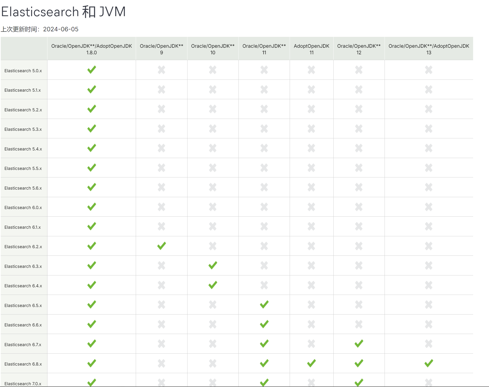
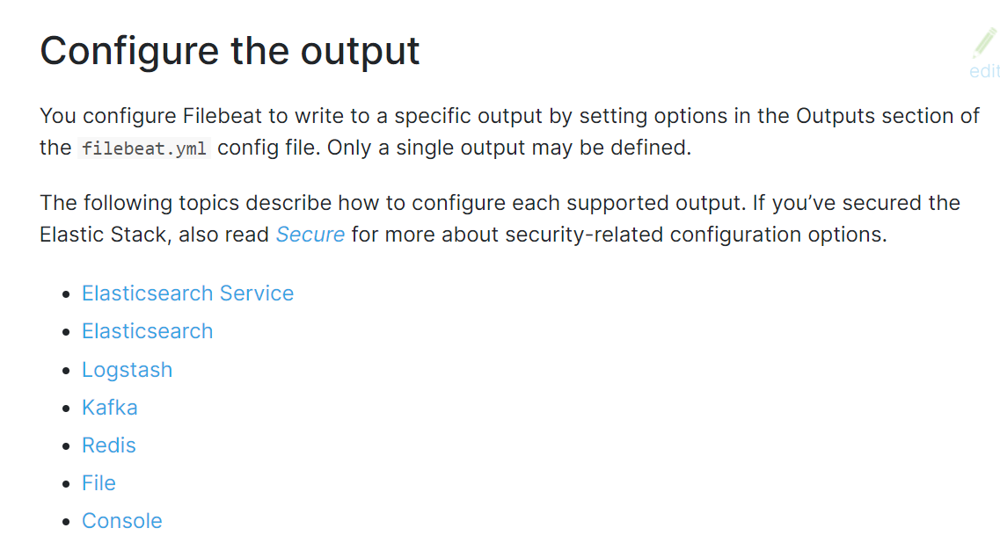
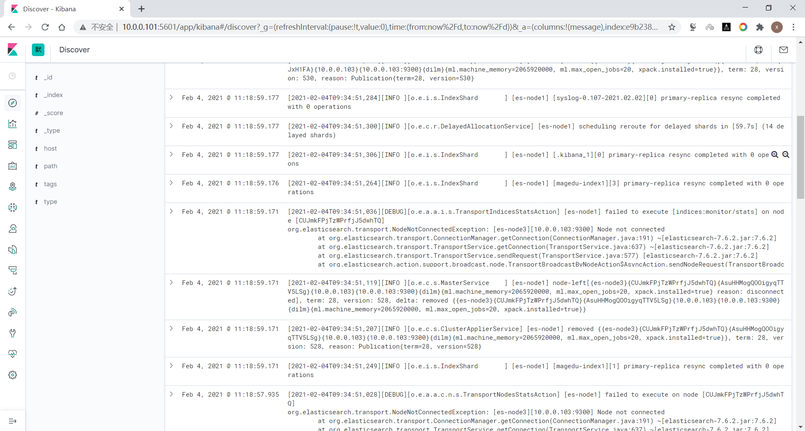
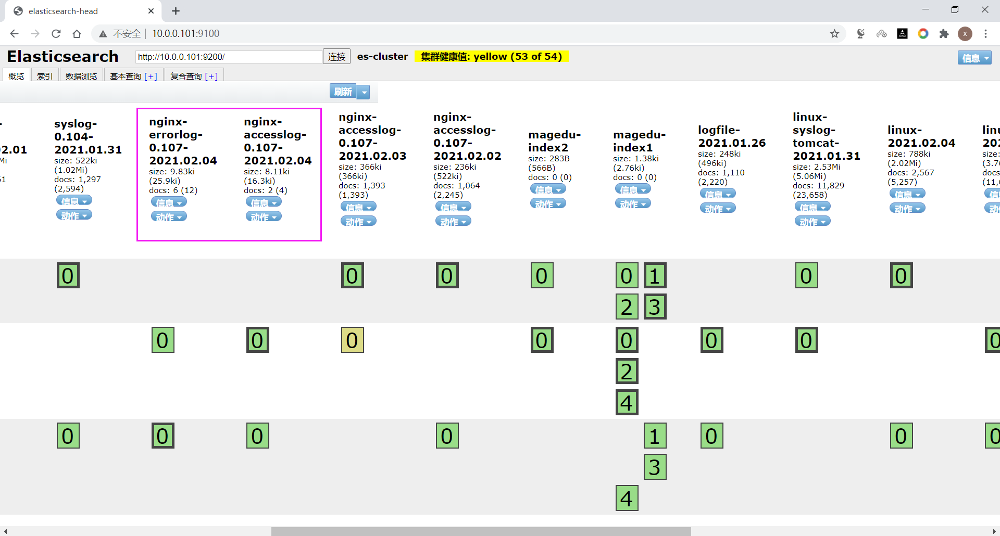
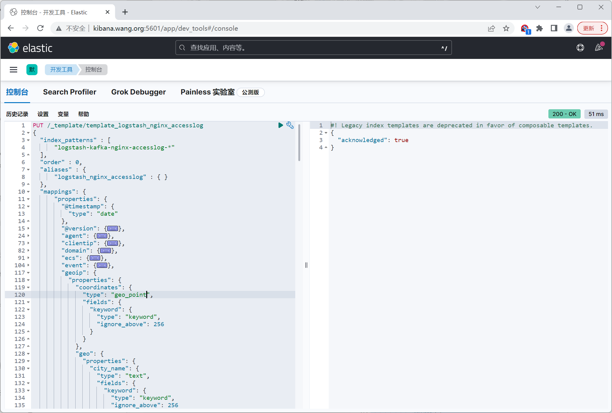

# 1：ELK概述

## 1.1：ELK介绍

### 1.1.1：什么是ELK

早期IT架构中的系统和应用的日志分散在不同的主机和文件，如果应用出现问题，开发和运维人员想排 查原因，就要先找到相应的主机上的日志文件再进行查找和分析，所以非常不方便，而且还涉及到权限 安全问题，ELK的出现就很好的解决这一问题。

ELK是由一家Elastic公司开发的三个开源项目的首字母缩写，即是三个相关的项目组成的系统。


这三个项目分别是：Elasticsearch、Logstash 和 Kibana。三个项目各有不同的功能

- Elasticsearch是一个实时的全文搜索，存储库和分析引擎
- Logstash 是数据处理的管道，能够同时从多个来源采集数据，转换数据，然后将数据发送到诸如  Elasticsearch 等存储库中。
- Kibana 则可以让用户在 Elasticsearch 中使用图形和图表对数据进行可视化。

之后又增加了许多新项目，于是从5.x版本后改名为Elastic Stack

Elastic Stack 是一套适用于数据采集、扩充、存储、分析和可视化的免费开源工具。

人们通常将 Elastic Stack 称为 ELK Stack（代指 Elasticsearch、Logstash 和 Kibana）

目前 Elastic Stack 包括一系列丰富的轻量型数据采集代理，这些代理统称为 Beats，可用来向  Elasticsearch 发送数据。

ELK 版本演进: 0.X,1.X,2,X,5.X,6,X,7.X,8.X ....

官网：  https://www.elastic.co/

ELK官方介绍：https://www.elastic.co/cn/what-is/elk-stack

ELK 下载链接：https://www.elastic.co/cn/downloads/

ELK 说明: https://www.elastic.co/guide/cn/index.html

ELK 权威指南: https://www.elastic.co/guide/cn/elasticsearch/guide/current/index.html

ELK stack的主要优点：

- 功能强大：Elasticsearch 是实时全文索引，具有强大的搜索功能
- 配置相对简单：Elasticsearch 全部其于 JSON，Logstash使用模块化配置，Kibana的配置都比较简 单。
- 检索性能高效：基于优秀的设计，每次查询可以实时响应，即使百亿级数据的查询也能达到秒级响 应。
- 集群线性扩展：Elasticsearch 和 Logstash都可以灵活线性扩展
- 前端操作方便：Kibana提供了比较美观UI前端，操作也比较简单

官方下载

```http
https://www.elastic.co/cn/downloads/
```

EFK 由ElasticSearch、Fluentd和Kibana三个开源工具组成。

Fluented是一个实时开源的数据收集器，和logstash功能相似，这三款开源工具的组合为日志数据提供了分 布式的实时搜集与分析的监控系统。

Fluented官网和文档：

```http
https://www.fluentd.org/
https://docs.fluentd.org/
```

### 1.1.2: Elasticsearch

#### 1.1.2.1: Elasticsearch介绍


官方介绍

```http
https://www.elastic.co/cn/what-is/elasticsearch
```

```http
https://db-engines.com/en/ranking
```


Elasticsearch是一个分布式的免费款开源搜素和分析引擎，适用于包括文本，数字，地理空间，结构化和非结构化数据在内的所有类型的数据。Elasticsearch 在 Apache Lucene 的基础上开发而成，由  Elasticsearch N.V.（即现在的 Elastic）于 2010 年首次发布。Elasticsearch以其简单的REST风格API，分布式特性，速度和可扩展性而闻名， Elastic Stack 的核心组件

Elasticsearch支持数据的实时全文搜索，支持分布式和高可用，提供API接口，可以处理大规模的各种日志数据的处理，的实时全文搜索搜索、支持分布式和高可用、提供API接口，可以处理大规模的 各种日志数据的处理，比如: Nginx、Tomcat、系统日志等功能。

Elasticsearch 基于 Java 语言开发，利用全文搜索引擎 Apache Lucene 实现

为何使用 Elasticsearch？

- **Elasticsearch很快。**由于Elasticsearch 是在 Lucene 基础上构建而成的，所以在全文本搜索方面表现十分出色。Elasticsearch同时还是个近实时的搜索平台，这意味着从文档索引操作到文档变成可搜索状态之间的延时很短，一般只有1秒。因此，Elasticsearch非常适用于对时间有严格要求的用例，例如安全分析和基础设施监测。
- **Elasticsearch具有分布式的本质特征。**Elasticsearch 中存储的文档分布在不同的容器中，这些容器称为分片，可以进行复制以提供数据冗余副本，以防止发生硬件故障。Elasticsearch的分布式特性使得它可以扩展数百台（甚至数千台）服务器，并处理PB量级的数据。
- **Elasticsearch 包含一系列广泛的功能。**除了速度、可扩展性和弹性等优势以外，Elasticsearch 还 有大量强大的内置功能（例如数据汇总和索引生命周期管理），可以方便用户更加高效地存储和搜 索数据。
- **Elastic Stack 简化了数据采集、可视化和报告过程。**过与 Beats 和 Logstash 进行集成，用户能 够在向 Elasticsearch 中索引数据之前轻松地处理数据。同时，Kibana 不仅可针对 Elasticsearch 数据提供实时可视化，同时还提供 UI 以便用户快速访问应用程序性能监测 (APM)、日志和基础设 施指标等数据。

Elasticsearch在速度和可扩展性方面表现出色，而且还能够索引多种类型的内容，可用于多种场景：

- 应用程序搜索
- 网站搜索
- 企业搜索
- 日志处理和分析
- 基础设施指标和容器监测
- 应用程序性能监测
- 地理空间数据分析和可视化
- 安全分析、
- 业务分析

#### 1.1.2.2： 原理

原始数据会从多个来源（包括日志，系统指标和网络应用程序）输入到Elasticsearch中。数据采集指在Elasticsearch中进行索引之前解析，标准化并充实这些原始数据的过程。这些数据在Elasticsearch中索引完成之后，用户便可针对它们的数据进行复杂的查询，并使用聚合来检索自身数据的复杂汇总。在Kibana中，用户可以基于自己的数据创建强大的可视化，分享仪表盘，并对Elastic Stack进行管理。

Elaticsearch索引指相互关联的文档集合。Elasticsearch会以JSON文档的形式存储数据。每个文档都 会在一组键（字段或属性的名称）和它们对应的值（字符串、数字、布尔值、日期、数组、地理位置或 其他类型的数据）之间建立联系。

Elasticsearch使用的是一种名为倒排索引的数据结构，这一结构的设计可以允许十分快速的进行全文本搜索。倒排索引会列出在所有文档中出现的每个特有词汇，并且可以找到包含每个词汇的全部文档。

在索引过程中，Elasticsearch会存储文档并构建倒排索引，这样用户便可以近乎实时地对文档数据进行搜索。索引过程是在索引 API 中启动的，通过此 API 您既可向特定索引中添加 JSON 文档，也可更改特 定索引中的 JSON 文档。

#### 1.1.2.3；基本概念

**Near Realtime(NRT) 几乎实时**

Elasticsearch是一个几乎实时的搜索平台。意思是，从索引一个文档到这个文档可被搜索只需要一点点的延迟，这个时间一般毫秒级。

**Cluster 集群**

集群是一个或多个节点（服务器）的集合， 这些节点共同保存整个数据，并在所有节点上提供联合索引 和搜索功能。一个集群由一个唯一的集群ID确定，并指定一个集群名（默认为Elasticsearch）。该集群名非常重要，因为节点可以通过这个集群名加入集群，一个节点只能是集群的一部分。

确保在不同的环境中不要使用相同的集群名称，否则可能会导致连接错误的集群节点。

**Node 节点**

节点是单个服务器实例，它是集群的一部分，可以存储数据，并参与集群的索引和搜索功能。就像一个 集群，节点的名称默认为一个随机的通用唯一标识符（UUID），确定在启动时分配给该节点。如果不希 望默认，可以定义任何节点名。这个名字对管理很重要，目的是要确定网络服务器对应于ElasticSearch 群集节点。

我们可以通过集群名配置节点以连接特定的集群。默认情况下，每个节点设置加入名为“elasticSearch” 的集群。这意味着如果启动多个节点在网络上，假设他们能发现彼此都会自动形成和加入一个名为 “elasticsearch”的集群。

在单个群集中，您可以拥有尽可能多的节点。此外，如果“elasticsearch”在同一个网络中，没有其他节 点正在运行，从单个节点的默认情况下会形成一个新的单节点名为"elasticsearch"的集群。

**Index 索引**

索引是具有相似特性的文档集合。例如，可以为客户数据提供索引，为产品目录建立另一个索引，以及为订单数据建立另一个索引。索引由名称（必须全部为小写）标识，该名称用于在对其中的文档执行索 引、搜索、更新和删除操作时引用索引。在单个群集中，您可以定义尽可能多的索引。

**注意: 索引名不支持大写字母**

**Type**

在索引中，可以定义一个或多个类型。类型是索引的逻辑类别/分区，其语义完全取决于您。一般来说， 类型定义为具有公共字段集的文档。例如，假设你运行一个博客平台，并将所有数据存储在一个索引 中。在这个索引中，您可以为用户数据定义一种类型，为博客数据定义另一种类型，以及为注释数据定 义另一类型。

Elasticsearch 版本对 type 概念的演变情况如下：

 在 5.X 版本中，一个 index 下可以创建多个 type 

在 6.X 版本中，一个 index 下只能存在一个 type 

在 7.X 版本中，默认可以支持 type ,但可以禁用

 在 8.X 版本中，直接就删除 type,即 index 不再支持 type

**Document 文档**

文档是可以被索引的信息的基本单位。例如，您可以为单个客户提供一个文档，单个产品提供另一个文 档，以及单个订单提供另一个文档。本文件的表示形式为JSON（JavaScript Object Notation）格式，这 是一种非常普遍的互联网数据交换格式。

在索引/类型中，您可以存储尽可能多的文档。请注意，尽管文档物理驻留在索引中，文档实际上必须索 引或分配到索引中的类型。

**Shards & Replicas 分片与副本**

索引可以存储大量的数据，这些数据可能超过单个节点的硬件限制。例如，十亿个文件占用磁盘空间 1TB的单指标可能不适合对单个节点的磁盘, 或者仅从单个节点的搜索请求服务可能太慢

为了解决这一问题，Elasticsearch提供细分指标分成多个块称为分片的能力。当创建一个索引，可以简 单地定义想要的分片数量。每个分片本身是一个全功能的、独立的“指数”，可以托管在集群中的任何节 点。

Shards分片的重要性主要体现在以下两个特征：

- 分片允许您水平拆分或缩放内容的大小
- 分片允许你分配和并行操作的碎片（可能在多个节点上）从而提高性能/吞吐量

这个机制中的碎片是分布式以及其吻技安汇总到搜索请求是完全由Elasticsearch管理，对用户来说是透明的。

在同一个集群网络或云环境上，故障时任何时候都会出现的，拥有一个故障转移机制以防止分片和节点因为某些原因离线是非常有用的，并且被强烈推荐。为此，Elasticsearch允许你创建一个或多个副本，索引分片进入所谓的副本或称作复制品的分片，简称Replicas。

**注意：ES的副本指不包括主分片的其它副本,即只包括备份，这与Kafka是不同的**

Replicas的重要性主要体现在以下两个特征：

- 副本为分片或节点失败提供了高可用性。需要注意的是，一个副本的分片不会分配在同一个节点作 为原始的或主分片，副本是从主分片那里复制过来的。
- 副本允许用户扩展你的搜索量或吞吐量，因为搜索可以在所有副本上并行执行。

**相关概念在关系型数据库和ElasticSearch中的对应关系**


| 关系型数据库    | Elasticsearch                                                |
| --------------- | ------------------------------------------------------------ |
| 数据库 Database | 索引 Index，支持全文检索                                     |
| 表 Table        | 类型 Type（废弃）                                            |
| 数据行 Row      | 文档 Document，但不需要固定结构，不同文档可以具有不同字段集合 |
| 数据列 Column   | 字段 Field                                                   |

| 概念           | 说明                                                         |
| -------------- | ------------------------------------------------------------ |
| 索引库 indices | indices是index的复数，代表许多的索引，                       |
| 类型 type      | 类型是模拟mysql中的table概念，一个索引库下可以有不同类型的索引，比如商品 索引，订单索引，其数据格式不同。不过这会导致索引库混乱，因此未来版本中会 移除这个概念 |
| 文档 document  | 存入索引库原始的数据。比如每一条商品信息，就是一个文档       |
| 字段 field     | 文档中的属性                                                 |

### 1.1.3： Logstash

```http
https://www.elastic.co/cn/what-is/elasticsearch
```


Logstash 是 Elastic Stack 的核心产品之一，可用来对数据进行聚合和处理，并将数据发送到  Elasticsearch。Logstash 是一个基于Java实现的开源的服务器端数据处理管道，允许您在将数据索引到  Elasticsearch 之前同时从多个来源采集数据，并对数据进行过滤和转换。

可以通过插件实现日志收集和转发，支持日志过滤，支持普通log，自定义json格式的日志解析。

### 1.1.4：Kibana

Kibana 是一款适用于 Elasticsearch 的基于Javascript语言实现的数据可视化和管理工具，可以提供实时 的直方图、线形图、饼状图和地图。Kibana 同时还包括诸如 Canvas 和 Elastic Maps 等高级应用程序； Canvas 允许用户基于自身数据创建定制的动态信息图表，而 Elastic Maps 则可用来对地理空间数据进 行可视化。

官方文档

```http
https://www.elastic.co/cn/what-is/kibana
```

主要是通过接口调用elasticsearch的数据，并进行前端数据的可视化的展现。

Kibana 与 Elasticsearch 和更广意义上的 Elastic Stack 紧密的集成在一起，这一点使其成为支持以下场 景的理想选择：

- 搜索、查看并可视化 Elasticsearch 中所索引的数据，并通过创建柱状图、饼图、表格、直方图和 地图对数据进行分析。仪表板视图能将这些可视化元素组织到一起，然后通过浏览器进行分享，以 提供对海量数据的实时分析视图，所支持的用例如下：

  ```http
  1. 日志处理和分析
  2. 基础设施指标和容器监测
  3. 应用程序性能监测 (APM)
  4. 地理空间数据分析和可视化
  5. 安全分析
  6. 业务分析  
  ```

- 借助网络界面来监测和管理 Elastic Stack 实例并确保实例的安全

- 针对基于 Elastic Stack 开发的内置解决方案（面向可观测性、安全和企业搜索应用程序），将其访 问权限集中到一起


## 1.2: ELK 应用场景

运维主要的应用场景：

- 将分布在不同主机的日志统一收集,并进行转换，通过集中的Web UI 进行查询和管理
- 通过查看汇总的日志,找到故障的根本原因
- Web 展示和报表功能
- 实现安全和事件等管理

大数据运维主要应用场景：

- 查询聚合, 大屏分析
- 预测告警, 网络指标，业务指标安全指标
- 日志查询，问题排查，基于API可以实现故障恢复和自愈
- 用户行为，性能,业务分析

## 1.3: ELK应用架构


# 2: Elasticsearch部署和管理

Elasticsearch是一个分布式的免费开源搜索和分析引擎，适用于包括文本、数字、地理空间、结构化和 非结构化数据等在内的所有类型的数据  Elasticsearch 基于 Java 语言实现。

## 2.1：Elasticsearch安装说明

官方文档：

```http
https://www.elastic.co/guide/en/elastic-stack/index.html
https://www.elastic.co/guide/en/elasticsearch/reference/master/installelasticsearch.html
```

部署方式

- 包安装
- 二进制安装
- Docker部署
- Ansible批量部署

ES支持操作系统版本和 Java 版本官方说明

```httpo
https://www.elastic.co/cn/support/matrix
```


## 2.2: Elasticsearch 安装前准备

### 2.2.1:  安装前环境初始化

```http
CPU 2C 
内存4G或更多
操作系统: Ubuntu22.04,Ubuntu20.04
操作系统盘50G
生产环境建议准备单独的数据磁盘
```

```bash
# 各服务器配置自己的主机名
root@ubutun2204-1:~# hostnamectl set-hostname es-node1
root@ubutun2204-1:~# hostnamectl set-hostname es-node2
root@ubutun2204-1:~# hostnamectl set-hostname es-node3

# 各服务器配置本地域名解析
root@es-node1:~# cat  /etc/hosts
192.168.159.101 es-node1
192.168.159.102 es-node2
192.168.159.103 es-node3
```

#### 2.2.1.1: 优化资源限制配置

##### 2.2.1.1.1： 修改内核参数

内核参数 vm.max_map_count 用于限制一个进程可以拥有的VMA(虚拟内存区域)的数量

使用默认系统配置，二进制安装时会提示下面错误，包安装会自动修改此配置


```bash
# 查看默认值
root@es-node1:~# sysctl -a |grep vm.max_map_count 
vm.max_map_count = 65530

# 修改配置
root@es-node1:~# echo "vm.max_map_count = 262144" >> /etc/sysctl.conf

#设置系统最大打开的文件描述符数
[root@es-node1 ~]#echo "fs.file-max = 1000000" >> /etc/sysctl.conf
[root@es-node1 ~]#sysctl -p 
vm.max_map_count = 262144

#Ubuntu22.04默认值已经满足要求
root@es-node1:~# sysctl fs.file-max
fs.file-max = 9223372036854775807
```

##### 2.2.1.1.2: 修改资源限制配置(可选)

```bash
root@es-node1:~# cat  /etc/security/limits.conf
#*               soft    core            0
#root            hard    core            100000
#*               hard    rss             10000
#@student        hard    nproc           20
#@faculty        soft    nproc           20
#@faculty        hard    nproc           50
#ftp             hard    nproc           0
#ftp             -       chroot          /ftp
#@student        -       maxlogins       4
```

### 2.2.2: 安装 Java 环境 (可选)

Elasticsearch是基于java的应用，所以依赖于JDK环境

**注意：安装7.X以后的版本官方建议要安装集成JDK的包，所以无需在安装JDK**

关于JDK环境说明

```http
1.x 2.x 5.x 6.x都没有集成JDK的安装包，也就是需要自己安装java环境
7.x 版本的安装包分为带JDK和不带JDK两种包，带JDK的包在安装时不需要再安装java，如果不带JDK的包
仍然需要自己去安装java
8.X 版本内置JDK，不再支持自行安装的JDK
```

**如果安装no-jdk的包,才需要安装java环境**

官网JAVA版本支持说明

```http
https://www.elastic.co/cn/support/matrix#matrix_jvm
```



因为 Elasticsearch 服务运行需要 Java环境，如果要安装没有JDK的包，需要提前安装JAVA环境，可以使 用以下方式安装

```shell
[root@es-node1 ~]#apt update;apt -y install openjdk-8-jdk
```

## 2.3: Elasticsearch 安装

有两种包：包含jdk和no-jdk的包

**注意：官方提示no-jdk的包将要被淘汰，建议使用包含JDK的包**

下载地址：

```http
# 包含JDK的版本下载
https://www.elastic.co/downloads/elasticsearch
https://mirrors.tuna.tsinghua.edu.cn/elasticstack/
# 不包含JDK的版本下载
https://www.elastic.co/cn/downloads/elasticsearch-no-jdk
```

### 2.3.1: 包安装 Elasticsearch

#### 2.3.1.1: 安装 Elasticsearch 包

下载链接

```http
https://www.elastic.co/cn/downloads/elasticsearch
https://mirrors.tuna.tsinghua.edu.cn/elasticstack/
```

范例：安装elasticsearch-8

```bash
root@es-node1:~# wget https://mirrors.tuna.tsinghua.edu.cn/elasticstack/apt/8.x/pool/main/e/elasticsearch/elasticsearch-8.14.1-amd64.deb

# 安装
root@es-node1:~# dpkg -i elasticsearch-8.14.1-amd64.deb

# 内置java
root@es-node1:~# /usr/share/elasticsearch/jdk/bin/java -version
openjdk version "22.0.1" 2024-04-16
OpenJDK Runtime Environment (build 22.0.1+8-16)
OpenJDK 64-Bit Server VM (build 22.0.1+8-16, mixed mode, sharing)

# JVM优化
root@es-node1:~# vim /etc/elasticsearch/jvm.options
## -Xms4g
-Xms512m
## -Xmx4g
-Xmx512m

root@es-node1:~# systemctl enable --now elasticsearch.service
root@es-node1:~# ss -ntl
State                         Recv-Q                        Send-Q                                                    Local Address:Port                                               Peer Address:Port                       Process                       
LISTEN                        0                             128                                                             0.0.0.0:22                                                      0.0.0.0:*                                                        
LISTEN                        0                             4096                                                      127.0.0.53%lo:53                                                      0.0.0.0:*                                                        
LISTEN                        0                             128                                                           127.0.0.1:6010                                                    0.0.0.0:*                                                        
LISTEN                        0                             4096                                                 [::ffff:127.0.0.1]:9300                                                          *:*                                                        
LISTEN                        0                             4096                                                                  *:9200                                                          *:*                                                        
LISTEN                        0                             128                                                               [::1]:6010                                                       [::]:*                                                        
LISTEN                        0                             4096                                                              [::1]:9300                                                       [::]:*                                                        
LISTEN                        0                             128                                                                [::]:22                                                         [::]:*     

# 默认8.x开启xpack安全，导致无法直接访问
root@es-node1:~# curl 127.0.0.1:9200
curl: (52) Empty reply from server

#关闭xpack安全功能
root@es-node1:~# vim /etc/elasticsearch/elasticsearch.yml
xpack.security.enabled: false  #默认值为true

root@es-node1:~# systemctl restart elasticsearch.service
root@es-node1:~# curl 127.0.0.1:9200
{
  "name" : "es-node1",
  "cluster_name" : "elasticsearch",
  "cluster_uuid" : "r3OfjxqzRSGeW-qJJw4FNw",
  "version" : {
    "number" : "8.14.1",
    "build_flavor" : "default",
    "build_type" : "deb",
    "build_hash" : "93a57a1a76f556d8aee6a90d1a95b06187501310",
    "build_date" : "2024-06-10T23:35:17.114581191Z",
    "build_snapshot" : false,
    "lucene_version" : "9.10.0",
    "minimum_wire_compatibility_version" : "7.17.0",
    "minimum_index_compatibility_version" : "7.0.0"
  },
  "tagline" : "You Know, for Search"
}
```

#### 2.3.1.2: 编辑服务配置文件

参考文档：

```http
https://www.ibm.com/support/knowledgecenter/zh/SSFPJS_8.5.6/com.ibm.wbpm.main.do
c/topics/rfps_esearch_configoptions.html
https://www.elastic.co/guide/en/elasticsearch/reference/index.html
https://www.elastic.co/guide/en/elasticsearch/reference/master/settings.html
https://www.elastic.co/guide/en/elasticsearch/reference/master/importantsettings.html
```

**配置文件说明**

```bash
root@es-node1:~# grep "^[a-Z]" /etc/elasticsearch/elasticsearch.yml 
# ELK集群名称，单节点无需配置，同一个集群内每个节点的此项必须相同，新加集群的节点此项和其他节点相同即可加入集群，而无需在验证
cluster.name: ELK-Cluster 

#当前节点在集群内的节点名称，同一集群中每个节点要确保此名称唯一
node.name: es-node1 

# ES 数据保存目录，包安装默认路径：/var/lib/elasticsearch/
path.data: /data/es-data 

# ES 日志保存目录，包安装默认路径：/var/log/elasticsearch/
path.logs: /data/es-logs

#服务启动的时候立即分配(锁定)足够的内存，防止数据写入swap,提高启动速度,但是true会导致启动失败，需要优化
bootstrap.memory_lock: true

#指定该节点用于集群的监听IP，默认监听在127.0.0.1:9300，集群模式必须修改此行，单机默认即可
network.host: 0.0.0.0 

#监听端口
http.port: 9200 

#发现集群的node节点列表，可以添加部分或全部节点IP
#在新增节点到已有集群时,此处需指定至少一个已经在集群中的节点地址
discovery.seed_hosts: ["192.168.159.101","192.168.159.102","192.168.159.103"]

#集群初始化时指定希望哪些节点可以被选举为 master,只在初始化时使用,新加节点到已有集群时此项可不配置
cluster.initial_master_nodes: ["192.168.159.101","192.168.159.102","192.168.159.103"]

#一个集群中的 N 个节点启动后,才允许进行数据恢复处理，默认是1,一般设为为所有节点的一半以上,防止出现脑裂现象
#当集群无法启动时,可以将之修改为1,或者将下面行注释掉,实现快速恢复启动
gateway.recover_after_nodes: 2

#设置是否可以通过正则表达式或者_all匹配索引库进行删除或者关闭索引库，默认true表示必须需要明确指定索引库名称，不能使用正则表达式和_all，生产环境建议设置为 true，防止误删索引库。
action.destructive_requires_name: true

#如果不参与主节点选举设为false,默认值为true
node.master: false

#存储数据,默认值为true,此值为false则不存储数据而成为一个路由节点
#如果将原有的true改为false,需要先执行/usr/share/elasticsearch/bin/elasticsearch-node repurpose 清理数据
node.data: true

#7.x以后版本下面指令已废弃，在2.x 5.x 6.x 版本中用于配置节点发现列表
discovery.zen.ping.unicast.hosts: ["192.168.159.101","192.168.159.102","192.168.159.103"]

#8.X版后默认即开启Xpack功能，可以修改为false禁用
xpack. security. enabled : true

#开启跨域访问支持，默认为false
http.cors.enabled: true
# 跨域访问允许的域名地址，(允许所有域名)以上使用正则
http.cors.allow-origin: "*"
```

范例：8.X单机配置

```bash
#8.X版,修改配置文件一行即可
root@es-node1:~# grep "^[a-Z]" /etc/elasticsearch/elasticsearch.yml 
path.data: /var/lib/elasticsearch
path.logs: /var/log/elasticsearch
xpack.security.enabled: false  #只需要修改此行true为false即可,其它行默认即可
xpack.security.enrollment.enabled: true
xpack.security.http.ssl:
xpack.security.transport.ssl:
cluster.initial_master_nodes: ["es-node1"] #默认此行不做修改
http.host: 0.0.0.0


root@es-node1:~# systemctl restart elasticsearch.service
#查看9200和9300端口
root@es-node1:~# ss -ntlp |grep -E '9200|9300'
LISTEN 0      4096   [::ffff:127.0.0.1]:9300            *:*    users:(("java",pid=2815,fd=444))         
LISTEN 0      4096                    *:9200            *:*    users:(("java",pid=2815,fd=449))         
LISTEN 0      4096                [::1]:9300         [::]:*    users:(("java",pid=2815,fd=443)) 

root@es-node1:~# curl 127.0.0.1:9200
{
  "name" : "es-node1",
  "cluster_name" : "elasticsearch",
  "cluster_uuid" : "r3OfjxqzRSGeW-qJJw4FNw",
  "version" : {
    "number" : "8.14.1",
    "build_flavor" : "default",
    "build_type" : "deb",
    "build_hash" : "93a57a1a76f556d8aee6a90d1a95b06187501310",
    "build_date" : "2024-06-10T23:35:17.114581191Z",
    "build_snapshot" : false,
    "lucene_version" : "9.10.0",
    "minimum_wire_compatibility_version" : "7.17.0",
    "minimum_index_compatibility_version" : "7.0.0"
  },
  "tagline" : "You Know, for Search"
}
```

范例：8.X集群配置

```bash
#默认配置文件需要修改以下六行
root@es-node1:~# vim /etc/elasticsearch/elasticsearch.yml
cluster.name: ELK-Cluster # ELK集群名称，单节点无需配置，同一个集群内每个节点的此项必须相同
node.name: node-1 #修改此行，每个节点不同
path.data: /var/lib/elasticsearch
path.logs: /var/log/elasticsearch
network.host: 0.0.0.0                #集群模式必须修改此行，默认是127.0.0.1:9300,否则集群节点无法通过9300端口通信每个节点相同
discovery.seed_hosts: ["192.168.159.101","192.168.159.102","192.168.159.103"] #修改此行，每个节点相同
cluster.initial_master_nodes: ["192.168.159.101","192.168.159.102","192.168.159.103"] #修改此行，每个节点相同
xpack.security.enabled: false                                   #修改此行，每个节点相同
xpack.security.enrollment.enabled: true
xpack.security.http.ssl:
 enabled: true
 keystore.path: certs/http.p12
xpack.security.transport.ssl:
  enabled: true
 verification_mode: certificate
 keystore.path: certs/transport.p12
 truststore.path: certs/transport.p12

# cluster.initial_master_nodes: ["es-node1"]    #将此行注释
http.host: 0.0.0.0
root@es-node1:~# systemctl restart elasticsearch.service
```

范例：7.X单节点配置

```bash
#7.X版之前
[root@ubuntu2004 ~]#grep -v '#' /etc/elasticsearch/elasticsearch.yml
path.data: /var/lib/elasticsearch
path.logs: /var/log/elasticsearch
node.name: node-1
network.host: 0.0.0.0
discovery.seed_hosts: ["10.0.0.100"]
cluster.initial_master_nodes: ["node-1"]
```

范例: 7.X 集群配置

```bash
[root@es-node1 ~]#grep -Ev '^$|#' /etc/elasticsearch/elasticsearch.yml 
cluster.name: es-cluster
node.name: es-node1
path.data: /data/es-data
path.logs: /data/es-logs
bootstrap.memory_lock: true
network.host: 0.0.0.0
discovery.seed_hosts: ["10.0.0.101","10.0.0.102","10.0.0.103"]
cluster.initial_master_nodes: ["10.0.0.101","10.0.0.102","10.0.0.103"]
gateway.recover_after_nodes: 2
action.destructive_requires_name: true
```

#### 2.3.1.3: 优化ELK资源配置

##### 2.3.1.3.1：开启bootstrap.memory_lock优化

**开启 `bootstrap.memory_lock: true `可以优化性能，但会导致无法启动的错误解决方法**

注意：开启 bootstrap.memory_lock: true 需要足够的内存，建议4G以上，否则内存不足，启动会很 慢 官方文档:

```http
https://www.elastic.co/guide/en/elasticsearch/reference/current/setupconfiguration-memory.html#bootstrap-memory_lock
https://www.elastic.co/guide/en/elasticsearch/reference/current/setting-systemsettings.html#systemd
```


```bash
root@es-node1:~# vim /etc/elasticsearch/elasticsearch.yml
#开启此功能导致无法启动
bootstrap.memory_lock: true
root@es-node1:~# systemctl restart elasticsearch.service 

root@es-node1:~# tail -f /var/log/elasticsearch/elasticsearch.log
...
[2024-06-17T22:21:13,934][ERROR][o.e.b.Bootstrap         ] [node-1] node 
validation exception
[1] bootstrap checks failed. You must address the points described in the 
following [1] lines before starting Elasticsearch.
bootstrap check failure [1] of [1]: memory locking requested for elasticsearch 
process but memory is not locked
...

# 方法：新建文件
root@es-node1:~# systemctl edit elasticsearch
### Editing /etc/systemd/system/elasticsearch.service.d/override.conf
### Anything between here and the comment below will become the new contents of the file
#加下面两行，注意加在中间位置
[Service]
LimitMEMLOCK=infinity


### Lines below this comment will be discarded

root@es-node1:~# cat /etc/systemd/system/elasticsearch.service.d/override.conf 
[Service]
LimitMEMLOCK=infinity

root@es-node1:~# systemctl restart elasticsearch.service 
```

##### 2.3.1.3.2： 内存优化

官方文档：

```http
https://www.elastic.co/guide/en/elasticsearch/reference/current/importantsettings.html#heap-size-settings
```

推荐使用宿主机物理内存的一半，ES的heap内存最大不超过30G,26G是比较安全的

官方文档：

```bash
https://www.elastic.co/guide/en/elasticsearch/reference/master/advancedconfiguration.html#set-jvm-heap-size
The
 heap size should be based on the available RAM:
Set Xms and Xmx to no more than 50% of your total memory. Elasticsearch requires 
memory for purposes other than the JVM heap. For example, Elasticsearch uses offheap
 buffers for efficient network communication and relies on the operating 
system’s filesystem cache for efficient access to files. The JVM itself also 
requires some memory. It’s normal for Elasticsearch to use more memory than the 
limit configured with the Xmx setting.
When running in a container, such as Docker, total memory is defined as the 
amount of memory visible to the container, not the total system memory on the 
host.
Set Xms and Xmx to no more than the threshold for compressed ordinary object 
pointers (oops). The exact threshold varies but 26GB is safe on most systems and 
can be as large as 30GB on some systems. To verify you are under the threshold, 
check the Elasticsearch log for an entry like this:

堆大小应基于可用 RAM：
将 Xms 和 Xmx 设置为不超过总内存的 50%。 Elasticsearch 需要内存用于 JVM 堆以外的用途。 例
如，Elasticsearch 使用堆外缓冲区来实现高效的网络通信，并依靠操作系统的文件系统缓存来高效地访问
文件。 JVM 本身也需要一些内存。 Elasticsearch 使用比 Xmx 设置配置的限制更多的内存是正常的。
在容器（例如 Docker）中运行时，总内存定义为容器可见的内存量，而不是主机上的总系统内存。
将 Xms 和 Xmx 设置为不超过压缩普通对象指针 (oops) 的阈值。 确切的阈值会有所不同，但在大多数系
统上 26GB 是安全的，在某些系统上可能高达 30GB。 要验证您是否低于阈值，请检查 Elasticsearch 
日志中的条目，如下所示：
```

**内存优化建议：**

为了保证性能，每个ES节点的JVM内存设置具体要根据存储的数据量来估计，建议符合以下约定：

- 在内存和数据量有一个建议的比例：对于一般日志类文件，1G 内存能存储48G~96GB数据
- JVM 堆内存最大不要超过30GB
- 单个分片控制在30-50GB，太大查询会比较慢，索引恢复和更新时间越长；分片太小，会导致索引 碎片化越严重，性能也会下降

范例：

```bash
#假设总数据量为1TB，3个node节点，1个副本；那么实际要存储的大小为2TB
每个节点需要存储的数据量为:2TB / 3 = 700GB，每个节点还需要预留20%的空间，所以每个node要存储
大约 700*100/80=875GB 的数据；每个节点按照内存与存储数据的比率计算：875GB/48GB=18，即需要
JVM内存为18GB,小于30GB
因为要尽量控制分片的大小为30GB；875GB/30GB=30个分片,即最多每个节点有30个分片
```

范例：指定heap内存最小和最大内存限制

```bash
#建议将heap内存设置为物理内存的一半且最小和最大设置一样大,但最大不能超过30G
[root@es-node1 ~]# vim /etc/elasticsearch/jvm.options 
-Xms30g
-Xmx30g

#每天产生1TB左右的数据量的建议服务器配置，还需要定期清理磁盘
16C 64G 6T硬盘 共3台服务器
```

范例： 修改service文件，做优化配置

```bash
[root@es-node1 ~]# vim /usr/lib/systemd/system/elasticsearch.service #修改内存限制
LimitNOFILE=1000000  #修改最大打开的文件数，默认值为65535
LimitNPROC=65535   #修改打开最大的进程数，默认值为4096
LimitMEMLOCK=infinity #无限制使用内存，以前旧版需要修改，否则无法启动服务，当前版本无需修改
```

#### 2.3.1.4: 目录权限更改

在各个ES服务器创建数据和日志目录并修改目录权限为elasticsearch

```bash
#此步可选,可以不用创建下面目录es-data和es-logs，系统可以自动创建
[root@es-node1 ~]# mkdir -p /data/es-{data,logs}

[root@es-node1 ~]# ll /data/
total 0
drwxr-xr-x 2 root root 6 Apr 18 18:44 es-data
drwxr-xr-x 2 root root 6 Apr 18 18:44 es-logs

#必须分配权限，否则服务无法启动
[root@es-node1 ~]# chown -R elasticsearch.elasticsearch /data/ 

[root@es-node1 ~]# ll /data/
total 0
drwxr-xr-x 2 elasticsearch elasticsearch 6 Apr 18 18:44 es-data
drwxr-xr-x 2 elasticsearch elasticsearch 6 Apr 18 18:44 es-logs
```

#### 2.3.1.5: 验证端口监听成功

```bash
#9200端口集群访问端口,9300集群同步端口
[root@es-node1 ~]#ss -ntlp|grep java
LISTEN   0         128                       *:9200                   *:*       
users:(("java",pid=2372,fd=225))               
LISTEN   0         128                       *:9300                   *:*       
users:(("java",pid=2372,fd=211))  
```

#### 2.3.1.6: 通过浏览器访问 Elasticsearch 服务端口

```bash
#显示如下信息，表示服务启动，但不意味着集群是健康的
[root@es-node1 ~]#curl 127.0.0.1:9200
{
  "name" : "es-node1",
  "cluster_name" : "es-cluster",
  "cluster_uuid" : "_na_",
  "version" : {
    "number" : "7.6.2",
    "build_flavor" : "default",
    "build_type" : "deb",
    "build_hash" : "ef48eb35cf30adf4db14086e8aabd07ef6fb113f",
    "build_date" : "2024-06-17T06:34:37.794943Z",
    "build_snapshot" : false,
    "lucene_version" : "8.4.0",
    "minimum_wire_compatibility_version" : "6.8.0",
    "minimum_index_compatibility_version" : "6.0.0-beta1"
 },
  "tagline" : "You Know, for Search"
}

#显示如下信息表示集群是健康的
[root@node1 ~]#curl http://127.0.0.1:9200/_cat/health
1682481515 03:58:35 my-application green 3 3 0 0 0 0 0 0 - 100.0%
```

### 2.3.2: 二进制安装 Elasticsearch

官方文档

```http
https://www.elastic.co/guide/en/elasticsearch/reference/master/targz.html
```

#### 2.3.2.1: 下载二进制文件

```http
https://www.elastic.co/cn/downloads/elasticsearch
```

范例： 基于二进制包含JDK文件安装

```bash
root@ubutun2204-1:~# wget https://artifacts.elastic.co/downloads/elasticsearch/elasticsearch-8.14.1-linux-x86_64.tar.gz
root@ubutun2204-1:~# tar xf elasticsearch-8.14.1-linux-x86_64.tar.gz -C /usr/local/
root@ubutun2204-1:~# ln -sv /usr/local/elasticsearch-8.14.1/ /usr/local/elasticsearch
root@ubutun2204-1:~# ls /usr/local/elasticsearch
bin  config  jdk  lib  LICENSE.txt  logs  modules  NOTICE.txt  plugins  README.asciidoc

# 修改内存配置
root@es-node1:~# echo "vm.max_map_count = 262144" >> /etc/sysctl.conf
root@es-node1:~# sysctl -p
vm.max_map_count = 262144
```

#### 2.3.2.2: 编辑服务配置文件

```bash
root@es-node1:~# grep -v "#" /usr/local/elasticsearch/config/elasticsearch.yml
cluster.name: es-cluster
node.name: node-1             #在其它节点改为唯一的标识,如es-node2,es-node3
path.data: /data/es-data
path.logs: /data/es-logs
network.host: 0.0.0.0
http.port: 9200
discovery.seed_hosts: ["192.168.159.101", "192.168.159.102","192.168.159.103"]
cluster.initial_master_nodes: ["192.168.159.101", "192.168.159.102","192.168.159.103"]
xpack.security.enabled: false


# 复制配置文件到其他节点
root@es-node1:~# scp /usr/local/elasticsearch/config/elasticsearch.yml es-node2:/usr/local/elasticsearch/config/
root@es-node1:~# scp /usr/local/elasticsearch/config/elasticsearch.yml es-node3:/usr/local/elasticsearch/config/

#在其它节点也修改配置文件
root@es-node2:~# grep -v "#" /usr/local/elasticsearch/config/elasticsearch.yml
cluster.name: es-cluster
node.name: node-2                 #只修改此行即可
path.data: /data/es-data
path.logs: /data/es-logs
network.host: 0.0.0.0
http.port: 9200
discovery.seed_hosts: ["192.168.159.101", "192.168.159.102","192.168.159.103"]
cluster.initial_master_nodes: ["192.168.159.101", "192.168.159.102","192.168.159.103"]
xpack.security.enabled: false

root@es-node3:~# grep -v "#" /usr/local/elasticsearch/config/elasticsearch.yml
cluster.name: es-cluster
node.name: node-3                #只修改此行即可
path.data: /data/es-data
path.logs: /data/es-logs
network.host: 0.0.0.0
http.port: 9200
discovery.seed_hosts: ["192.168.159.101", "192.168.159.102","192.168.159.103"]
cluster.initial_master_nodes: ["192.168.159.101", "192.168.159.102","192.168.159.103"]
xpack.security.enabled: false
```

#### 2.3.2.3: 修改 ELK 内存配置

修改ELK内存配置，推荐使用宿主机物理内存的一半，最大不超过30G

官方文档：

```http
https://www.elastic.co/guide/en/elasticsearch/reference/current/importantsettings.html#heap-size-settings
```

范例：

```bash
root@es-node1:~# vim /usr/local/elasticsearch/config/jvm.options
-Xms2g
-Xmx2g
```

#### 2.3.2.4: 创建用户

从ES7.X以后版不允许以root启动服务，需要委创建专用的用户

在所有节点上创建用户

```bash
root@es-node1:~# useradd -r elasticsearch
```

#### 2.3.2.5: 目录权限更改

在所有节点上创建数据和日志目录并修改目录权限为elasticsearch

```bash
#可以不用创建下面目录es-data和es-logs，系统可以自动创建
root@es-node1:~# mkdir /data/es-{data,logs} -p

#必须分配权限，否则服务无法启动
root@es-node1:~# chown -R elasticsearch.elasticsearch /data/
root@es-node1:~# ls -l /data/
total 8
drwxr-xr-x 2 elasticsearch elasticsearch 4096 Jun 17 09:27 es-data
drwxr-xr-x 2 elasticsearch elasticsearch 4096 Jun 17 09:27 es-logs

#修改elasticsearch安装目录权限
root@es-node1:~# chown -R elasticsearch.elasticsearch /usr/local/elasticsearch/
```

#### 2.3.2.6: 启动 Elasticsearch服务

在所有节点上配置并启动

```bash
root@es-node1:~# echo 'PATH=/usr/local/elasticsearch/bin:$PATH' > /etc/profile.d/elasticsearch.sh
root@es-node1:~# . /etc/profile.d/elasticsearch.sh

#不能以root用户运行，切换用户
root@es-node1:~# su - elasticsearch
$ elasticsearch

```

#### 2.3.2.7: 验证端口监听成功

```bash
root@es-node1:/data# ss -ntlp|grep java
LISTEN 0      4096               *:9300            *:*    users:(("java",pid=3896,fd=443))         
LISTEN 0      4096               *:9200            *:*    users:(("java",pid=3896,fd=445))
```

#### 2.3.2.8: 通过浏览器访问 Elasticsearch 服务端口

在所有节点上验证访问9200/tcp端口

```bash
root@es-node1:/data# curl 192.168.159.101:9200
{
  "name" : "node-1",
  "cluster_name" : "es-cluster",
  "cluster_uuid" : "MygM0ixtTrezat6Z3rDY8w",
  "version" : {
    "number" : "8.14.1",
    "build_flavor" : "default",
    "build_type" : "tar",
    "build_hash" : "93a57a1a76f556d8aee6a90d1a95b06187501310",
    "build_date" : "2024-06-10T23:35:17.114581191Z",
    "build_snapshot" : false,
    "lucene_version" : "9.10.0",
    "minimum_wire_compatibility_version" : "7.17.0",
    "minimum_index_compatibility_version" : "7.0.0"
  },
  "tagline" : "You Know, for Search"
}

root@es-node1:/data# curl 192.168.159.101:9200/_cluster/health?pretty=true
{
  "cluster_name" : "es-cluster",
  "status" : "green",
  "timed_out" : false,
  "number_of_nodes" : 3,
  "number_of_data_nodes" : 3,
  "active_primary_shards" : 0,
  "active_shards" : 0,
  "relocating_shards" : 0,
  "initializing_shards" : 0,
  "unassigned_shards" : 0,
  "delayed_unassigned_shards" : 0,
  "number_of_pending_tasks" : 0,
  "number_of_in_flight_fetch" : 0,
  "task_max_waiting_in_queue_millis" : 0,
  "active_shards_percent_as_number" : 100.0
}
```

#### 2.3.2.9:  创建 service 文件

```bash
root@es-node1:~# cat   /lib/systemd/system/elasticsearch.service
[Unit]
Description=Elasticsearch
Documentation=http://www.elastic.co
Wants=network-online.target
After=network-online.target
[Service]
RuntimeDirectory=elasticsearch
PrivateTmp=true
Environment=PID_DIR=/var/run/elasticsearch
WorkingDirectory=/usr/local/elasticsearch
User=elasticsearch
Group=elasticsearch
ExecStart=/usr/local/elasticsearch/bin/elasticsearch -p ${PID_DIR}/elasticsearch.pid --quiet
# StandardOutput is configured to redirect to journalctl since
# some error messages may be logged in standard output before
# elasticsearch logging system is initialized. Elasticsearch
# stores its logs in /var/log/elasticsearch and does not use
# journalctl by default. If you also want to enable journalctl
# logging, you can simply remove the "quiet" option from ExecStart.
# Specifies the maximum file descriptor number that can be opened by this process
LimitNOFILE=65535
# Specifies the maximum number of processes
LimitNPROC=4096
# Specifies the maximum size of virtual memory
LimitAS=infinity
# Specifies the maximum file size
LimitFSIZE=infinity
# Disable timeout logic and wait until process is stopped
TimeoutStopSec=0
# SIGTERM signal is used to stop the Java process
KillSignal=SIGTERM
# Send the signal only to the JVM rather than its control group
KillMode=process
# Java process is never killed
SendSIGKILL=no
# When a JVM receives a SIGTERM signal it exits with code 143
SuccessExitStatus=143
[Install]
WantedBy=multi-user.target
```

## 2.4: Elasticsearch 访问

官方文档

```http
https://www.elastic.co/guide/en/elasticsearch/reference/master/rest-apis.html
```

Elasticsearch 支持各种语言使用 RESTful API 通过端口 9200 与之进行通信，可以用你习惯的 web 客户 端访问 Elasticsearch 

可以用三种方式和 Elasticsearch进行交互

- curl 命令和其它浏览器: 基于命令行,操作不方便
- 插件: 在node节点上安装head,Cerebro 等插件,实现图形操作,查看数据方便
- Kibana: 需要java环境并配置,图形操作,显示格式丰富

### 2.4.1: shell命令

```http
https://www.elastic.co/guide/en/elasticsearch/reference/current/query-dsl-matchquery.html
https://nasuyun.com/docs/api/
```

Elasticsearch 提供了功能十分丰富、多种表现形式的查询 DSL(Domain Specific Language领域特定 语言)语言

DSL 查询使用 JSON 格式的请求体与 Elasticsearch 交互，可以实现各种各样的增删改查等功能

#### 2.4.1.1: 查看 ES 集群状态

访问ES

```bash
#查看支持的指令
curl http://127.0.0.1:9200/_cat

#查看es集群状态
curl http://127.0.0.1:9200/_cat/health
curl 'http://127.0.0.1:9200/_cat/health?v'

#查看集群分健康性,获取到的是一个json格式的返回值，那就可以通过python等工具对其中的信息进行分析
#注意：status 字段为green才是正常状态
curl http://127.0.0.1:9200/_cluster/health?pretty=true


#查看所有的节点信息
curl 'http://127.0.0.1:9200/_cat/nodes?v'

# 查看master节点
curl http://127.0.0.1:9200/_cat/master


#列出所有的索引 以及每个索引的相关信息
curl 'http://127.0.0.1:9200/_cat/indices?v'
```

#### 2.4.1.2：创建和查看索引

```http
https://www.elastic.co/guide/en/elasticsearch/reference/current/indices-createindex.html
```

范例：

```bash
#elasticsearch 7.X 默认创建1个分片1个副本,之前版本默认5分版1副本

#创建索引index1,简单输出
root@es-node1:~# curl -XPUT '127.0.0.1:9200/index1'
{"acknowledged":true,"shards_acknowledged":true,"index":"index1"}

#创建索引index2,格式化输出
root@es-node1:~# curl -XPUT '127.0.0.1:9200/index2?pretty'
{
  "acknowledged" : true,
  "shards_acknowledged" : true,
  "index" : "index2"
}

#查看所有索引
root@es-node1:~# curl 'http://127.0.0.1:9200/_cat/indices?v'
health status index  uuid                   pri rep docs.count docs.deleted store.size pri.store.size dataset.size
green  open   index1 KILsh4sWTpGZX7aEFTimYw   1   1          0            0       454b           227b         227b
green  open   index2 f7ZZTJY_S0G04xRZXs2UwQ   1   1          0            0       454b           227b         227b

root@es-node1:~# curl '127.0.0.1:9200/index1?pretty'
{
  "index1" : {
    "aliases" : { },
    "mappings" : { },
    "settings" : {
      "index" : {
        "routing" : {
          "allocation" : {
            "include" : {
              "_tier_preference" : "data_content"
            }
          }
        },
        "number_of_shards" : "1",
        "provided_name" : "index1",
        "creation_date" : "1718619193171",
        "number_of_replicas" : "1",
        "uuid" : "KILsh4sWTpGZX7aEFTimYw",
        "version" : {
          "created" : "8505000"
        }
      }
    }
  }
}

#创建3个分片和2个副本的索引
root@es-node1:~# curl -XPUT '127.0.0.1:9200/index3' -H 'Content-Type: application/json' -d '{
  "settings": {
    "index": {
      "number_of_shards": 3,  
      "number_of_replicas": 2
    }
  }
}'
{"acknowledged":true,"shards_acknowledged":true,"index":"index3"}


#调整副本数为1,但不能调整分片数
root@es-node1:~# curl -XPUT '127.0.0.1:9200/index3/_settings' -H 'Content-Type: application/json' -d '{"index":{"number_of_replicas":1}}'
{"acknowledged":true}

#说明：KILsh4sWTpGZX7aEFTimYw表示索引ID
#/data/es-data/indices/索引ID/分片ID
root@es-node1:~# ll /data/es-data/indices/
total 16
drwxr-xr-x 4 elasticsearch elasticsearch 4096 Jun 17 10:23 ./
drwxr-xr-x 5 elasticsearch elasticsearch 4096 Jun 17 10:33 ../
drwxr-xr-x 5 elasticsearch elasticsearch 4096 Jun 17 10:31 E7l5trbdTsW2cB1TK_oqXg/
drwxr-xr-x 4 elasticsearch elasticsearch 4096 Jun 17 10:13 KILsh4sWTpGZX7aEFTimYw/

```

#### 2.4.1.3: 插入文档

范例：

```bash
#创建文档时不指定_id，会自动生成
#8.X版本后因为删除了type,所以索引操作：{index}/{type}/需要修改成PUT {index}/_doc/
#index1是索引数据库,book是type
#8.X版本之后
root@es-node1:~#  curl -XPOST http://127.0.0.1:9200/index1/_doc/ -H 'Content-Type: application/json' -d '{"name":"linux", "author": "wanglei", "version": 
"1.0"}' 

#7.X之前
root@es-node1:~# curl -XPOST http://127.0.0.1:9200/index1/book/ -H 'Content-Type: application/json' -d '{"name":"linux", "author": "wanglei", "version": 
"1.0"}' 

root@es-node1:~# curl -XPOST 'http://127.0.0.1:9200/index1/_doc?pretty' -H 'Content-Type: application/json' -d '{"name":"python", "author": "dawang", 
"version": "1.0"}'
{
  "_index" : "index1",
  "_id" : "IuzHJZABLC9FmTfVdukN",
  "_version" : 1,
  "result" : "created",
  "_shards" : {
    "total" : 2,
    "successful" : 2,
    "failed" : 0
  },
  "_seq_no" : 1,
  "_primary_term" : 1
}

#创建文档时指定_id为3
root@es-node1:~# curl -XPOST 'http://127.0.0.1:9200/index1/_doc/3?pretty' -H 'Content-Type: application/json' -d '{"name":"golang", "author": "zhang", 
"version": "1.0"}' 
{
  "_index" : "index1",
  "_id" : "3",
  "_version" : 1,
  "result" : "created",
  "_shards" : {
    "total" : 2,
    "successful" : 2,
    "failed" : 0
  },
  "_seq_no" : 2,
  "_primary_term" : 1
}

#数据存放的磁盘位置
root@es-node1:~# tree /data/es-data/ -d
/data/es-data/
├── indices
│   ├── E7l5trbdTsW2cB1TK_oqXg
│   │   ├── 0
│   │   │   ├── index
│   │   │   ├── _state
│   │   │   └── translog
│   │   ├── 1
│   │   │   ├── index
│   │   │   ├── _state
│   │   │   └── translog
│   │   └── _state
│   └── KILsh4sWTpGZX7aEFTimYw
│       ├── 0
│       │   ├── index
│       │   ├── _state
│       │   └── translog
│       └── _state
├── snapshot_cache
└── _state
```

#### 2.4.1.4: 查询文档

范例：

```bash
#查询索引的中所有文档
root@es-node1:~# curl 'http://127.0.0.1:9200/index1/_search?pretty'
{
  "took" : 59,
  "timed_out" : false,
  "_shards" : {
    "total" : 1,
    "successful" : 1,
    "skipped" : 0,
    "failed" : 0
  },
  "hits" : {
    "total" : {
      "value" : 3,
      "relation" : "eq"
    },
    "max_score" : 1.0,
    "hits" : [
      {
        "_index" : "index1",
        "_id" : "IezGJZABLC9FmTfVQelR",
        "_score" : 1.0,
        "_source" : {
          "name" : "linux",
          "author" : "wanglei",
          "version" : "1.0"
        }
      },
      {
        "_index" : "index1",
        "_id" : "IuzHJZABLC9FmTfVdukN",
        "_score" : 1.0,
        "_source" : {
          "name" : "python",
          "author" : "dawang",
          "version" : "1.0"
        }
      },
      {
        "_index" : "index1",
        "_id" : "3",
        "_score" : 1.0,
        "_source" : {
          "name" : "golang",
          "author" : "zhang",
          "version" : "1.0"
        }
      }
    ]
  }
}

#指定ID查询
#8.X版: curl -XGET ‘http://127.0.0.1:9200/{index}/_/{id}’
#新版本
root@es-node1:~# curl 'http://127.0.0.1:9200/index1/_doc/3?pretty'
{
  "_index" : "index1",
  "_id" : "3",
  "_version" : 1,
  "_seq_no" : 2,
  "_primary_term" : 1,
  "found" : true,
  "_source" : {
    "name" : "golang",
    "author" : "zhang",
    "version" : "1.0"
  }
}


#按条件进行查询,两种方式
#新版
root@es-node1:~# curl 'http://127.0.0.1:9200/index1/_search?q=name:linux&pretty'
{
  "took" : 102,
  "timed_out" : false,
  "_shards" : {
    "total" : 1,
    "successful" : 1,
    "skipped" : 0,
    "failed" : 0
  },
  "hits" : {
    "total" : {
      "value" : 1,
      "relation" : "eq"
    },
    "max_score" : 0.9808291,
    "hits" : [
      {
        "_index" : "index1",
        "_id" : "IezGJZABLC9FmTfVQelR",
        "_score" : 0.9808291,
        "_source" : {
          "name" : "linux",
          "author" : "wanglei",
          "version" : "1.0"
        }
      }
    ]
  }
}


```

#### 2.4.1.5: 更新文档

```bash
#8.X
root@es-node1:~# curl -XPOST 'http://127.0.0.1:9200/index1/_doc/3?pretty' -H 'Content-Type: application/json' -d '{"version": "2.0","name":"golang","author": "zhang"}' 
{
  "_index" : "index1",
  "_id" : "3",
  "_version" : 2,
  "result" : "updated",
  "_shards" : {
    "total" : 2,
    "successful" : 2,
    "failed" : 0
  },
  "_seq_no" : 3,
  "_primary_term" : 1
}

# 查看是否update
root@es-node1:~# curl 'http://127.0.0.1:9200/index1/_doc/3?pretty'
{
  "_index" : "index1",
  "_id" : "3",
  "_version" : 2,
  "_seq_no" : 3,
  "_primary_term" : 1,
  "found" : true,
  "_source" : {
    "version" : "2.0",
    "name" : "golang",
    "author" : "zhang"
  }
}
```

#### 2.4.1.6: 删除文档

```http
#8.X版本
curl -XDELETE http://kibana服务器:9200/<索引名称>/_doc/<文档id>
#7.X版本前
curl -XDELETE http://kibana服务器:9200/<索引名称>/type/<文档id>
```

范例：删除文档

```bash
#8.X
root@es-node1:~# curl -XDELETE 'http://127.0.0.1:9200/index1/_doc/3'
{"_index":"index1","_id":"3","_version":3,"result":"deleted","_shards":{"total":2,"successful":2,"failed":0},"_seq_no":4,"_primary_term":1}

#确认已删除
root@es-node1:~# curl 'http://127.0.0.1:9200/index1/_doc/3?pretty'
{
  "_index" : "index1",
  "_id" : "3",
  "found" : false
}
```

#### 2.4.1.7： 删除索引

范例:删除指定索引

```bash
root@es-node1:~# curl -XDELETE http://127.0.0.1:9200/index2
{"acknowledged":true}

#查看索引是否删除
root@es-node1:~# curl 'http://127.0.0.1:9200/_cat/indices?pretty'

#删除多个指定索引
curl -XDELETE 'http://127.0.0.1:9200/index_one,index_two

#删除通配符多个索引,需要设置action.destructive_requires_name: false
curl -XDELETE 'http://127.0.0.1:9200/index_*'
```

范例: 删除所有索引

```bash
#以下需要设置action.destructive_requires_name: false
[root@es-node1 ~]#curl -X DELETE "http://127.0.0.1:9200/*"
*"

#以下无需配置
[root@es-node1 ~]#for i in `curl 'http://127.0.0.1:9200/_cat/indices?v'|awk '{print $3}'`;do curl -XDELETE http://127.0.0.1:9200/$i;done
```

### 2.4.2: Python 脚本：集群健康性检查

```bash
root@es-node1:~# apt -y install python3
root@es-node1:~# cat els-cluster-monitor.py 
#!/usr/bin/python3
#coding:utf-8
from email.mime.text import MIMEText
from email.utils import formataddr
import smtplib
import subprocess
import json
body = ""
false="false"
#用另外一个进程运行curl返回结果从stdout中读取
obj = subprocess.Popen(("curl -sXGET http://10.0.0.101:9200/_cluster/health?
pretty=true"),shell=True, stdout=subprocess.PIPE) # 
data = obj.stdout.read()
#print(type(data)) # 应该是字符串类型或bytes类型
#print(data) # 确认返回的json形式的
es_dict = json.loads(data) if data else {}  # 把json字符串解析为字典
status = es_dict.get("status") # 通过字典查找status
if status == "green":
  print("OK")
else:
  print("Not OK")
```

## 2.5: Elasticsearch 插件

通过使用各种插件可以实现对 ES 集群的状态监控, 数据访问, 管理配置等功能

ES集群状态:

- green 绿色状态:表示集群各节点运行正常，而且没有丢失任何数据，各主分片和副本分片都运行正 常
- yellow 黄色状态:表示由于某个节点宕机或者其他情况引起的，node节点无法连接、所有主分片都 正常分配,有副本分片丢失，但是还没有丢失任何数据
- red 红色状态:表示由于某个节点宕机或者其他情况引起的主分片丢失及数据丢失,但仍可读取数据 和存储

监控下面两个条件都满足才是正常的状态

- 集群状态为 green
- 所有节点都启动

### 2.5.1: Head 插件

#### 2.5.1.1: Head 介绍

Head 是一个 ES 在生产较为常用的插件，目前此插件更新较慢，还是2018年4月的版本

git地址：https://github.com/mobz/elasticsearch-head


三种安装方法：

- 编译安装
- Docker 
- 浏览器插件

#### 2.5.1.2: 浏览器安装插件

下面以离线安装为例。

下载地址：

```http
https://codeload.github.com/mobz/elasticsearch-head/zip/refs/tags/v5.0.0
```

下载完，先解压。

**注意：要打开开发者模式**


#### 2.5.1.3： 利用 Head 插件观察状态

**head 插件中集群状态说明**

**状态颜色说明:**

- 绿色:索引数据完整,副本满足,所有条件都满足
- 黄色:索引数据完整,副本不满足,即数据没有丢失,但副本丢失,可能会影响容错功能
- 红色:有索引数据不完整的情况,即数据丢失
- 紫色:有数据分片正在同步过程中

0 表示分片的片shard编号

粗体线框为主分片,细体线框为副本分片

星表示主master节点,圆点表示slave工作节点


```bash
root@es-node3:~# systemctl stop elasticsearch.service
```


index3数据库是3分片1副本


### 2.5.2: Cerebro 插件

#### 2.5.2.1: Cerebro介绍


Cerebro 是开源的 elasticsearch 集群 Web 管理程序，此工具应用也很广泛，此项目升级比 Head 频繁

github链接：

```http
https://github.com/lmenezes/cerebro
```

#### 2.5.2.2： 包安装

注意：安装cerebro内存建议大于3G以上

```bash
#依赖JDK
root@ubutun2204-1:~# apt -y install openjdk-11-jdk

#下载包,官方提供了DEB和RPM包
root@ubutun2204-1:~# wget https://github.com/lmenezes/cerebro/releases/download/v0.9.4/cerebro_0.9.4_all.deb


#安装
root@ubutun2204-1:~# dpkg -i cerebro_0.9.4_all.deb

#启动
root@ubutun2204-1:~# systemctl start cerebro.service

#默认服务无法启动，端口无法打开
ss -ntlp|grep 9000

#默认无法启动,查看日志,可以看到以下提示,原因是默认cerebro.db文件所有目录没有权限导致
root@ubutun2204-1:~# journalctl -u cerebro
Jun 17 11:58:03 ubutun2204-1 cerebro[3883]: Caused by: java.sql.SQLException: opening db: './cerebro.db': Permission denied

# #修改配置文件
root@ubutun2204-1:~# vim /etc/cerebro/application.conf
data.path: "/var/lib/cerebro/cerebro.db" #取消此行注释
#data.path = "./cerebro.db" #注释此行，默认路径是/usr/share/cerebro/cerebro.db

#此目录自动生成
root@ubutun2204-1:~# ll -d /var/lib/cerebro
drwxr-xr-x 2 cerebro cerebro 4096 Jun 17 12:00 /var/lib/cerebro/

root@ubutun2204-1:~# systemctl restart cerebro.service
root@ubutun2204-1:~# ss -ntl | grep 9000
LISTEN 0      100                *:9000            *:* 

#访问下面链接地址
http://<cerebro-address>:9000
#在Node address输入框中输入任意ES集群节点的地址
http://192.168.159.101:9200
```

三节点集群显示如下，实心的五角星表示Master节点


如果数据丢失，会显示红色


### 2.5.3: 利用插件管理索引

#### 2.5.3.1：利用 cerebro 插件创建索引


建议shard分片数配置为ELK服务器的数量,副本为1表示对数据有一个备份


再创建一个索引，不指定分片信息，默认为一分片一副本


#### 2.5.3.2 利用cerebro插件验证分片

E S 7.0 以上版 本 默 认分片为1个 ， 并 且 只 有 1 个 副 本

ES6.x版本默认分 片 为 5 个 副 本 1 个

#### 2.5.3.3: 利用 head 插件验证


#### 2.5.3.4:利用 head 插件删除索引


## 2.6: Elasticsearch 集群工作原理

官方说明

```http
https://www.elastic.co/guide/en/elasticsearch/reference/current/index.html
```

单机节点 ES 存在单点可用性和性能问题,可以实现Elasticsearch多机的集群解决

Elasticsearch 支持集群模式

- 能够提高Elasticsearch可用性，即使部分节点停止服务，整个集群依然可以正常服务
- 能够增大Elasticsearch的性能和容量，如内存、磁盘，使得Elasticsearch集群可以支持PB级的数据

### 2.6.1: ES 节点分类

Elasticsearch 集群的每个节点的角色有所不同,但都会保存集群状态Cluster State的相关的数据信息

- 节点信息：每个节点名称和地址
- 索引信息：所有索引的名称，配置，数据等

ES的节点有下面几种

- Master 节点

  ES集群中只有一个 Master 节点，用于控制和管理整个集群的操作 

  Master 节点负责增删索引,增删节点,分片shard的重新分配 

  Master 主要维护Cluster State，包括节点名称,节点连接地址,索引名称和配置信息等

   Master 接受集群状态的变化并推送给所有其它节点,集群中各节点都有一份完整的集群状态信息， 

  都由master node负责维护 

  Master 节点不需要涉及到文档级别的变更和搜索等操作

   协调创建索引请求或查询请求，将请求分发到相关的node上。 

  当Cluster State有新数据产生后， Master 会将数据同步给其他 Node 节点

  Master节点通过超过一半的节点投票选举产生的 

  可以设置node.master: true 指定为是否参与Master节点选举, 默认true

- Data 节点

  存储数据的节点即为 data 节点 

  当创建索引后，索引的数据会存储至某个数据节点 

  Data 节点消耗内存和磁盘IO的性能比较大 

  配置node.data: true, 就是Data节点，默认为 true,即默认所有节点都是 Data 节点类型

- Coordinating 节点(协调)

  处理请求的节点即为 coordinating 节点，该节点类型为所有节点的默认角色，不能取消 

  coordinating 节点主要将请求路由到正确的节点处理。比如创建索引的请求会由 coordinating 路 由到 master 节点处理 

  当配置 node.master:false、node.data:false 则只充当 Coordinating 节点 

  Coordinating 节点在 Cerebro 等插件中数据页面不会显示出来 

- Master-eligible 初始化时有资格选举Master的节点

  集群初始化时有权利参于选举Master角色的节点

   只在集群第一次初始化时进行设置有效，后续配置无效 

   由 cluster.initial_master_nodes 配置节点地址

### 2.6.2: ES 集群选举

ES集群的选举是由master-eligble（有资格充当的master节点）发起

当该节点发现当前节点不是master，并且该节点通过ZenDiscovery模块ping其他节点，如果发现超过 mininum_master_nodes个节点无法连接master时，就会发起新的选举

选举时,优先选举ClusterStateVersion最大的Node节点，如果ClusterStateVersion相同，则选举ID最小 的Node

ClusterStateVersion是集群的状态版本号，每一次集群选举ClusterStateVersion都会更新，因此最大的 ClusterStateVersion是与原有集群数据最接近或者是相同的，这样就尽可能的避免数据丢失。

Node的ID是在第一次服务启动时随机生成的，直接选用最小ID的Node，主要是为了选举的稳定性，尽 量少出现选举不出来的问题。

每个集群中只有一个Master节点

**每个集群中损坏的节点不能超过集群一半以上,否则集群将无法提供服务**

### 2.6.3: ES 集群分片 Shard 和副本 Replication

#### 2.6.3.1: 分片 Shard

ES 中存储的数据可能会很大,有时会达到PB级别，单节点的容量和性能可以无法满足

 基于容量和性能等原因,可以将一个索引数据分割成多个小的分片 

再将每个分片分布至不同的节点,从而实现数据的分布存储,实现性能和容量的水平扩展 

在读取时,可以实现多节点的并行读取,提升性能 

除此之外,如果一个分片的主机宕机,也不影响其它节点分片的读取 

横向扩展即增加服务器，当有新的Node节点加入到集群中时，集群会动态的重新进行均匀分配和负载

例如原来有两个Node节点，每个节点上有3个分片，即共6个分片,如果再添加一个node节点到集群中， 集群会动态的将此6个分片分配到这三个节点上，最终每个节点上有2个分片。

7,X 默认每个索引只有一个分片

#### 2.6.3.2: 副本 Replication

将一个索引分成多个数据分片,仍然存在数据的单点问题,可以对每一个分片进行复制生成副本,即备份,实 现数据的高可用

ES的分片分为主分片（primary shard）和副本分片（复制replica shard），而且通常分布在不同节点

主分片实现数据读写,副本分片只支持读

在索引中的每个分片只有一个主分片,而对应的副本分片可以有多个,一个副本本质上就是一个主分片的备 份 

每个分片的主分片在创建索引时自动指定且后续不能人为更改 

ES 7.X 默认每个索引只有一个主分片和一个副本分片

#### 2.6.3.3: 默认分片配置

默认情况下，elasticsearch将分片相关的配置从配置文件中的属性移除了，可以借助于一个默认的模板 接口将索引的分片属性更改成我们想要的分片效果。

```bash
#配置5分片和1副本
]#curl -XPUT 'http://127.0.0.1:9200/_template/template_http_request_record' -H 
'Content-Type: application/json' -d '{"index_patterns": ["*"],"settings": 
{"number_of_shards": 5,"number_of_replicas": 1}}'
{"acknowledged":true}
 
#属性解析：
接口地址：_template/template_http_request_record
索引类型：index_patterns
分片数量：number_of_shards
副本数量：number_of_replicas
```

#### 2.6.3.4: 数据同步机制

Elasticsearch主要依赖Zen Discovery协议来管理集群中节点的加入和离开，以及选举主节点（master  node）。Zen Discovery是Elasticsearch自带的一个协议，不依赖于任何外部服务。

然而，Elasticsearch对于一致性的处理与传统的一致性协议（如Raft或Paxos）有所不同。它采取了一 种“最终一致性”（eventual consistency）的模型。

每个索引在Elasticsearch中被分成多个分片（shard），每个分片都有一个主分片和零个或多个副本分 片。主分片负责处理所有的写操作，并将写操作复制到其副本分片。当主分片失败时，一个副本分片会 被提升为新的主分片。

Elasticsearch为了提高写操作的性能，允许在主分片写入数据后立即确认写操作，而不需要等待数据被 所有副本分片确认写入。这就意味着，在某些情况下，主分片可能会确认写操作成功，而实际上副本分 片还没有完全写入数据。这就可能导致数据在短时间内在主分片和副本分片之间不一致。然而，一旦所 有副本分片都确认写入了数据，那么系统就会达到“最终一致性”。

为了保证搜索的准确性，Elasticsearch还引入了一个"refresh"机制，每隔一定时间（默认为1秒）将最 新的数据加载到内存中，使其可以被搜索到。这个过程是在主分片和所有副本分片上独立进行的，所以 可能存在在短时间内搜索结果在不同分片之间有些许不一致的情况，但随着时间的推移，所有分片上的 数据都会达到一致状态。

综上所述，Elasticsearch通过Zen Discovery协议管理节点和选举，通过主分片和副本分片的机制保证数 据的最终一致性，并通过"refresh"机制保证数据的搜索准确性。

### 2.6.4: ES 集群故障转移

故障转移指的是，当集群中有节点发生故障时，ES集群会进行自动修复


假设由3个节点的ES集群组成,有一个索引index_wang，三个主分片，三个副本分片，如果其中一个节点 宕机

ES集群的故障转移流程如下

- 重新选举

  假设当前master节点node3节点宕机，同时导致Node3上的P0和R2丢失

  node1 和 node2 发现 Master节点 node3 无法响应

  过一段时间后会重新发起 master 选举

  比如这次选择 node1 为 新 master 节点；此时集群状态变为 Red 状态

  其实无论选举出的新Master节点是哪个节点，都不影响后续的分片的重新分布结果

  

- 主分片调整

  新的Master节点 node1 发现在原来在node3上的主分片 P0 丢失

  将 node2 上的 R0 提升为主分片

  此时所有的主分片都正常分配，但0和2分片没有副本分片

  集群状态变为 Yellow状态

- 副本分片调整

  node1 将 P0 和 P2 主分片重新生成新的副本分片 R0、R1，此时集群状态变为 Green

  

- 后续修复好node3节点后，Master 不会重新选举，但会自动将各个分片重新均匀分配

  保证主分片尽可能分布在每个节点上

  副本分片也尽可能分布不同的节点上

  重新分配的过程需要一段时间才能完成

  


### 2.6.5：ES 文档路由

#### 2.6.5.1：ES 文档路由原理

ES文档是分布式存储，挡在ES集群访问或存储一个文档时，由下面的算法决定此文档到底放在哪个主分片上，再结合集群状态找到存放此主分片的节点主机

```bash
shard = hash(routing) % number_of_primary_shards
hash                     #哈希算法可以保证将数据均匀分散在分片中
routing                  #用于指定用于hash计算的一个可变参数，默认是文档id，也可以自定义
number_of_primary_shards #主分片数

#注意：该算法与主分片数相关，一旦确定后便不能更改主分片，因为主分片数的变化会导致所有分片需要重新分配
```


可以发送请求到集群中的任一节点。每个节点都知道集群中任一文档位置， 每个节点都有能力接收请求, 再接将请求转发到真正存储数据的节点上 

#### 2.6.5.2: ES 文档创建流程


- 客户端向master节点Node1发送新建索引文档或者删除索引文档请求
- Node1节点使用文档_id通过上面的算法确定文档属于分片0
- 因为分片0的主分片目前被分配到Node3上，请求会转发到Node3
- Node3 在主分片上面执行创建或删除请求
- Node3 执行如果成功，它将请求并行转发到 Node1 和 Node2 的副本分片上
- Node3 将向协调节点Node1 报告成功
- 协调节点Node1 客户端报告成功。

#### 2.6.5.3：ES 文档读取流程

可以从主分片或者从其它任意副本分片读取文档 ，读取流程如下图所示 ：


- 客户端向NODE1发送读取请求
- 节点使用文档的 _id 来确定文档属于分片 0 。分片 0 的主副本分片存在于所有的三个节点上
- 在处理读取请求时，协调节点在每次请求的时候都会通过轮询所有的主副本分片来达到负载均衡， 此次它将请求转发到 Node2 
- Node2 将文档返回给 Node1 ，然后将文档返回给客户端

## 2.7： Elasticsearch 集群扩容和缩容

### 2.7.1：集群扩容

新加入两个节点node4和node5，变为Data节点

在两个新节点安装 ES，并配置文件如下

```bash
vim /etc/elasticsearch/elasticsearch.yml 
cluster.name: es-cluster       #和原集群名称相同

#当前节点在集群内的节点名称，同一集群中每个节点要确保此名称唯一
node.name: node-4                #第二个新节点为node5

# 数据目录
path.data: /data/es-data
path.logs: /data/es-logs

#集群监听端口对应的IP，默认是127.0.0.1:9300
network.host: 0.0.0.0
http.port: 9200

#指定任意集群节点即可
discovery.seed_hosts: ["192.168.159.101", "192.168.159.102","192.168.159.103"]

#集群初始化时指定希望哪些节点可以被选举为 master,只在初始化时使用,新加节点到已有集群时此项可不配置
# cluster.initial_master_nodes: ["192.168.159.101", "192.168.159.102","192.168.159.103"]
#cluster.initial_master_nodes: ["ubuntu2204"] 

# 关闭xpack
xpack.security.enabled: false

#如果不参与主节点选举设为false,默认值为true
node.master: false

#存储数据,默认值为true,此值为false则不存储数据而成为一个路由节点
#如果将原有的true改为false,需要先执行/usr/share/elasticsearch/bin/elasticsearch-node repurpose 清理数据
node.data: true


systemctl restart elasticsearch
```

### 2.7.2：集群缩容

从集群中删除两个节点node4和node5，在两个节点停止服务，即可自动退出集群

```bash
systemctl stop elasticsearch
```

### 2.7.3: Data 节点变为Coordinating 节点

将一个节点node3变为Coordinating 节点

在node3执行下面操作

```bash
vim /etc/elasticsearch/elasticsearch.yml

node.master: false
#存储数据,默认值为true,此值为false则不存储数据而成为一个路由节点,如果将原有的true改为false,需要先执行 清理数据
node.data: false 


# 无法启动
systemctl restart elasticsearch

#清理数据
/usr/share/elasticsearch/bin/elasticsearch-node repurpose

#重启
systemctl restart elasticsearch
```

# 3: Beats 收集数据

Beats是一个免费且开放的平台，集合了多种单一用途数据采集器。它们从成百上千或者成千上万及其和系统向logstash或ES发送数据。

虽然利用logstash就可以收集日志，功能强大，但由于 Logtash 是基于Java实现，需要在采集日志的主 机上安装JAVA环境

logstash运行时最少也会需要额外的500M以上的内存，会消耗比较多的内存和磁盘空间

可以采用基于Go开发的Beat工具代替logstash收集日志，部署更为方便，而且只占用10M左右的内 存空间及更小的磁盘空间。


官方链接：

```http
https://www.elastic.co/cn/beats/
```

Github 链接

```http
https://github.com/elastic/beats
```

下载链接

```http
https://www.elastic.co/cn/downloads/beats
```

Beats 是一些工具集,包括以下,其中 filebeat 应用最为广泛


```bash
filebeat:收集日志文件数据。最常用的工具
packetbeat:用于收集网络数据。一般用zabbix实现此功能
metricbeat:从OS和服务收集指标数据，比如系统运行状态、CPU 内存利用率等。
winlogbeat: 从Windows平台日志收集工具。
heartbeat: 定时探测服务是否可用。支持ICMP、TCP 和 HTTP，也支持TLS、身份验证和代理
auditbeat:收集审计日志
Functionbeat:使用无服务器基础架构提供云数据。面向云端数据的无服务器采集器，处理云数据
```

**注意: Beats 版本要和 Elasticsearch 相同的版本，否则可能会出错**

## 3.1: 利用 Metricbeat 监控性能相关指标

Metricbeat 可以收集指标数据，比如系统运行状态、CPU、内存利用率等。

生产中一般用 zabbix 等专门的监控系统实现此功能

官方配置说明

```http
https://www.elastic.co/guide/en/beats/metricbeat/current/configuring-howtometricbeat.html
```

### 3.1.1: 下载 metricbeat 并安装

下载链接

```http
https://www.elastic.co/cn/downloads/beats/metricbeat
https://mirrors.tuna.tsinghua.edu.cn/elasticstack/8.x/apt/pool/main/m/metricbeat
https://mirrors.tuna.tsinghua.edu.cn/elasticstack/7.x/apt/pool/main/m/metricbeat
```

范例:

```bash
root@elk-web1:~# wget https://mirrors.tuna.tsinghua.edu.cn/elasticstack/8.x/apt/pool/main/m/metricbeat/metricbeat-8.14.1-amd64.deb
root@elk-web1:~# dpkg -i metricbeat-8.14.1-amd64.deb
```

### 3.1.2: 修改配置

```bash
root@elk-web1:~# vim /etc/metricbeat/metricbeat.yml
#setup.kibana:
#   host: "10.0.0.101:5601" #指向kabana服务器地址和端口，非必须项，即使不设置Kibana也可以通过ES获取Metrics信息
#-------------------------- Elasticsearch output ------------------------------
output.elasticsearch:
  # Array of hosts to connect to.
  hosts: ["192.168.159.101:9200","192.168.159.102:9200","192.168.159.103:9200"] #指向任意一个ELK集群节点即可


root@elk-web1:~# grep -Ev "#|^$" /etc/metricbeat/metricbeat.yml
metricbeat.config.modules:
  path: ${path.config}/modules.d/*.yml
  reload.enabled: false
setup.template.settings:
  index.number_of_shards: 1
  index.codec: best_compression
setup.kibana:
  host: "192.168.159.101:5601"
output.elasticsearch:
  hosts: ["192.168.159.101:9200","192.168.159.102:9200","192.168.159.103:9200"]
  preset: balanced
processors:
  - add_host_metadata: ~
  - add_cloud_metadata: ~
  - add_docker_metadata: ~
  - add_kubernetes_metadata: ~
```

### 3.1.3: 启动服务

```bash
root@elk-web1:~# systemctl enable --now metricbeat.service
root@elk-web1:~# systemctl status metricbeat.service 
● metricbeat.service - Metricbeat is a lightweight shipper for metrics.
     Loaded: loaded (/lib/systemd/system/metricbeat.service; enabled; vendor preset: enabled)
     Active: active (running) since Tue 2024-06-18 03:18:04 UTC; 12s ago
       Docs: https://www.elastic.co/beats/metricbeat
   Main PID: 2496 (metricbeat)
      Tasks: 8 (limit: 2176)
     Memory: 54.2M
        CPU: 224ms
.......
```

### 3.1.4: Head 插件查看索引


### 3.1.5 :通过Kibana 查看收集的性能指标

kibana具体安装看下面kibana章节

8.X 版 本 界 面

**Observability--->基础设施-->Inventory**


**Observability--->基础设施-->hosts**


## 3.2: 利用 Heartbeat 监控

heartbeat 用来定时探测服务是否正常运行。支持ICMP、TCP 和 HTTP，也支持TLS、身份验证和代理

官方heartbeat配置文档

```http
https://www.elastic.co/guide/en/beats/heartbeat/current/configuring-howtoheartbeat.html
```

### 3.2.1: 下载并安装

下载链接

```http
https://www.elastic.co/cn/downloads/beats/heartbeat
https://mirrors.tuna.tsinghua.edu.cn/elasticstack/8.x/apt/pool/main/h/heartbeat-elastic/
https://mirrors.tuna.tsinghua.edu.cn/elasticstack/7.x/apt/pool/main/h/heartbeatelastic
```

```bash
root@elk-web1:~# wget https://mirrors.tuna.tsinghua.edu.cn/elasticstack/8.x/apt/pool/main/h/heartbeat-elastic/heartbeat-8.14.1-amd64.deb
root@elk-web1:~# dpkg -i heartbeat-8.14.1-amd64.deb
```

### 3.2.2: 修改配置

官方参考

```bash
https://www.elastic.co/guide/en/beats/heartbeat/current/configuration-heartbeatoptions.html
#官方示例
heartbeat.yml
heartbeat.monitors:
- type: icmp
 id: ping-myhost
 name: My Host Ping
 hosts: ["myhost"]
 schedule: '*/5 * * * * * *'  #相当于'@every 5s'
- type: tcp
 id: myhost-tcp-echo
 name: My Host TCP Echo
 hosts: ["myhost:777"]  # default TCP Echo Protocol
 check.send: "Check"
 check.receive: "Check"
 schedule: '@every 5s'
- type: http
 id: service-status
 name: Service Status
  service.name: my-apm-service-name
 hosts: ["http://localhost:80/service/status"]
 check.response.status: [200]
 schedule: '@every 5s'
heartbeat.scheduler:
 limit: 10
```

时间格式: 注意可以支持秒级精度

```http
https://github.com/gorhill/cronexpr#implementation
Field name     Mandatory?   Allowed values   Allowed special characters
----------     ----------   --------------   --------------------------
Seconds       No           0-59             * / , -
Minutes       Yes         0-59             * / , -
Hours         Yes         0-23             * / , -
Day of month   Yes         1-31             * / , - L W
Month         Yes         1-12 or JAN-DEC   * / , -
Day of week   Yes         0-6 or SUN-SAT   * / , - L #
Year           No           1970–2099         * / , -
```

范例：

```bash
root@elk-web1:~# vim /etc/heartbeat/heartbeat.yml
# Configure monitors inline
heartbeat.monitors:
- type: http
  enabled: true   #修改此行false为true
  id: my-monitor
  name: My Monitor
  urls: ["http://192.168.159.101:9200"] #修改此行，指向需要监控的服务器的地址和端口
  schedule: '@every 10s'
  timeout: 6s

- type: tcp
  id: myhost-tcp-echo
  name: My Host TCP Echo  
  hosts: ["192.168.159.101:9200"]  # default TCP Echo Protocol
  schedule: '@every 5s'
- type: icmp   #添加下面5行，用于监控ICMP
  id: ping-myhost
  name: My Host Ping
  hosts: ["192.168.159.101"]
  schedule: '*/5 * * * * * *'
  
setup.kibana:

  # Kibana Host
  # Scheme and port can be left out and will be set to the default (http and 5601)
  # In case you specify and additional path, the scheme is required: http://localhost:5601/path
  # IPv6 addresses should always be defined as: https://[2001:db8::1]:5601
  host: "192.168.159.101:5601"

# ---------------------------- Elasticsearch Output ----------------------------
output.elasticsearch:
  # Array of hosts to connect to.
  hosts: ["192.168.159.101:9200","192.168.159.102:9200","192.168.159.103:9200"]
```

### 3.2.3: 启动服务

```bash
root@elk-web1:~# systemctl enable --now heartbeat-elastic.service
```

### 3.2.4: head 插件查看索引


### 3.2.5: 通过 Kibana 查看收集的性能指标

Observabilty---> 运行时间--->监测


### 3.2.6：停止监控的服务再观察 Kibana

```bash
root@es-node1:~# systemctl stop elasticsearch.service
```


## 3.3: 利用filebeat收集日志

Filebeat 是用于转发和集中日志数据的轻量级传送程序。作为服务器上的代理安装，Filebeat监视您指定 的日志文件或位置，收集日志事件，并将它们转发到Elasticsearch或Logstash进行索引。

Logstash 也可以直接收集日志,但需要安装JDK并且会占用至少500M 以上的内存

生产一般使用filebeat代替logstash, 基于go开发,部署方便,重要的是只需要10M多内存,比较节约资源.

filebeat 支持从日志文件,Syslog,Redis,Docker,TCP,UDP,标准输入等读取数据,对数据做简单处理，再输 出至Elasticsearch,logstash,Redis,Kafka等

Filebeat的工作方式如下：

- 启动filebeat时，它将启动一个或多个输入源，这些输入将在为日志数据指定的位置中查找。
- 对于Filebeat所找到的每个日志，Filebeat都会启动收集器harvester进程。
- 每个收集器harvester都读取一个日志以获取新内容，并将新日志数据发送到libbeat
- libbeat会汇总事件并将汇总的数据发送到为Filebeat配置的输出。

Filebeat 官方说明

```http
https://www.elastic.co/guide/en/beats/filebeat/current/filebeat-overview.html
https://www.elastic.co/guide/en/beats/filebeat/current/configuring-howtofilebeat.html
```




输入和输入官方说明

```http
https://www.elastic.co/guide/en/beats/filebeat/current/configuration-filebeatoptions.html
https://www.elastic.co/guide/en/beats/filebeat/current/configuring-output.html
```

**注意：filebeat支持多个输入，但不支持同时有多个输出，如果多输出，会报错如下**

```bash
Exiting: error unpacking config data: more than one namespace configured 
accessing 'output' (source:'/etc/filebeat/stdout_file.yml')
```

### 3.3.1: 安装 Filebeat 和配置说明

下载链接

```http
https://www.elastic.co/cn/downloads/beats/filebeat
```

#### 3.3.1.1: 安装filebeat

```bash
# 下载
root@elk-web1:~# wget https://mirrors.tuna.tsinghua.edu.cn/elasticstack/8.x/apt/pool/main/f/filebeat/filebeat-8.14.1-amd64.deb

#安装
root@elk-web1:~# dpkg -i filebeat-8.14.1-amd64.deb

#默认没有启动
root@elk-web1:~# systemctl enable --now filebeat

#filebeat以root身份启动
root@elk-web1:~# ps aux|grep filebeat
root        2354  0.5  5.1 1989496 101816 ?      Ssl  08:48   0:00 /usr/share/filebeat/bin/filebeat --environment systemd -c /etc/filebeat/filebeat.yml --path.home /usr/share/filebeat --path.config /etc/filebeat --path.data /var/lib/filebeat --path.logs /var/log/filebeat


# 先停止服务，方便后续调试
root@elk-web1:~# systemctl stop filebeat
```

#### 3.3.1.2: Filebeat 配置

配置文件官方说明

```http
https://www.elastic.co/guide/en/beats/filebeat/current/configuring-howtofilebeat.html
https://www.elastic.co/guide/en/beats/filebeat/8.3/configuration-generaloptions.html
```

Filebeat的 默认配置文件是/etc/filebeat/filebeat.yml，遵循YAML语法。常见配置包括如下

- Filebeat
- Output
- Shipper
- Logging(可选)
- Run Options（可选）

filebeat.yml的格式说明

```bash
input_type: log
#指定输入类型

paths
#支持基本的正则，所有golang glob都支持,支持/var/log/*/*.log

encoding
#plain, latin1, utf-8, utf-16be-bom, utf-16be, utf-16le, big5, gb18030, gbk, hzgb-2312,
euc-kr,euc-jp, iso-2022-jp, shift-jis, and so on

exclude_lines
#支持正则 排除匹配的行，如果有多行，合并成一个单一行来进行过滤

include_lines
#支持正则 include_lines执行完毕之后会执行exclude_lines。

exclude_files
#支持正则 排除匹配的文件
exclude_files: ['.gz$']

tags
#列表中添加标签，用过过滤
filebeat.inputs:
- paths: ["/var/log/app/*.json"]
tags: ["json"]

fields
#可选字段，选择额外的字段进行输出
#可以是标量值，元组，字典等嵌套类型

ignore_older
#可以指定Filebeat忽略指定时间段以外修改的日志内容
#文件被忽略之前，确保文件不在被读取，必须设置ignore older时间范围大于close_inactive
#如果一个文件正在读取时候被设置忽略，它会取得到close_inactive后关闭文件，然后文件被忽略

close_*
#close_ *配置选项用于在特定标准或时间之后关闭harvester。 关闭harvester意味着关闭文件处理程序。 如果在harvester关闭后文件被更新，则在scan_frequency过后，文件将被重新拾取。 但是，如果在harvester关闭时移动或删除文件，Filebeat将无法再次接收文件，并且harvester未读取的任何数据都将丢失。

close_inactive
#启动选项时，如果在制定时间没有被读取，将关闭文件句柄
#读取的最后一条日志定义为下一次读取的起始点，而不是基于文件的修改时间
#如果关闭的文件发生变化，一个新的harverster将在scan_frequency运行后被启动
#建议至少设置一个大于读取日志频率的值，配置多个prospector来实现针对不同更新速度的日志文件
#使用内部时间戳机制，来反映记录日志的读取，每次读取到最后一行日志时开始倒计时
#使用2h 5m 来表示

recursive_glob.enabled 
#递归匹配日志文件，默认false

close_rename
#当选项启动，如果文件被重命名和移动，filebeat关闭文件的处理读取

close_removed
#当选项启动，文件被删除时，filebeat关闭文件的处理读取
#这个选项启动后，必须启动clean_removed

close_eof
#适合只写一次日志的文件，然后filebeat关闭文件的处理读取

close_timeout
#当选项启动时，filebeat会给每个harvester设置预定义时间，不管这个文件是否被读取，达到设定时间后，将被关闭

close_timeout 不能等于ignore_older,会导致文件更新时，不会被读取
#如果output一直没有输出日志事件，这个timeout是不会被启动的，至少要要有一个事件发送，然后haverter将被关闭
#设置0 表示不启动

clean_inactived
#从注册表文件中删除先前收获的文件的状态
#设置必须大于ignore_older+scan_frequency，以确保在文件仍在收集时没有删除任何状态
#配置选项有助于减小注册表文件的大小，特别是如果每天都生成大量的新文件
#此配置选项也可用于防止在Linux上重用inode的Filebeat问题

clean_removed
#启动选项后，如果文件在磁盘上找不到，将从注册表中清除filebeat
#如果关闭close removed 必须关闭clean removed

scan_frequency
#prospector检查指定用于收获的路径中的新文件的频率,默认10s

document_type
#类型事件，被用于设置输出文档的type字段，默认是log

harvester_buffer_size
#每次harvester读取文件缓冲字节数，默认是16384

max_bytes
#对于多行日志信息，很有用，最大字节数

json
#这些选项使Filebeat解码日志结构化为JSON消息，逐行进行解码json

keys_under_root
#设置key为输出文档的顶级目录

overwrite_keys
#覆盖其他字段

add_error_key
#定义一个json_error

message_key
#指定json 关键建作为过滤和多行设置，与之关联的值必须是string

multiline
#控制filebeat如何处理跨多行日志的选项，多行日志通常发生在java堆栈中
multiline.pattern: '^\['
multiline.negate: true
multiline.match: after
上面匹配是将多行日志所有不是以[符号开头的行合并成一行它可以将下面的多行日志进行合并成一行

multiline.pattern
指定匹配的正则表达式，filebeat支持的regexp模式与logstash支持的模式有所不同

pattern regexp
multiline.negate
定义上面的模式匹配条件的动作是 否定的，默认是false
假如模式匹配条件'^b'，默认是false模式，表示讲按照模式匹配进行匹配 将不是以b开头的日志行进行合并
如果是true，表示将不以b开头的日志行进行合并
multiline.match
#指定Filebeat如何将匹配行组合成事件,在之前或者之后，取决于上面所指定的negate

multiline.max_lines
#可以组合成一个事件的最大行数，超过将丢弃，默认500

multiline.timeout
#定义超时时间，如果开始一个新的事件在超时时间内没有发现匹配，也将发送日志，默认是5s

tail_files
#如果此选项设置为true，Filebeat将在每个文件的末尾开始读取新文件，而不是开头
#此选项适用于Filebeat尚未处理的文件

symlinks
#符号链接选项允许Filebeat除常规文件外,可以收集符号链接。收集符号链接时，即使为符号链接的路径，Filebeat也会打开并读取原始文件。

backoff
#backoff选项指定Filebeat如何积极地抓取新文件进行更新。默认1s
#backoff选项定义Filebeat在达到EOF之后再次检查文件之间等待的时间。

max_backoff
#在达到EOF之后再次检查文件之前Filebeat等待的最长时间

backoff_factor
#指定backoff尝试等待时间几次，默认是2

harvester_limit
#harvester_limit选项限制一个prospector并行启动的harvester数量，直接影响文件打开数

enabled
#控制prospector的启动和关闭

filebeat global
spool_size
#事件发送的阀值，超过阀值，强制刷新网络连接
filebeat.spool_size: 2048

publish_async
#异步发送事件，实验性功能

idle_timeout
#事件发送的超时时间，即使没有超过阀值，也会强制刷新网络连接
filebeat.idle_timeout: 5s

registry_file
#注册表文件的名称，如果使用相对路径，则被认为是相对于数据路径
#有关详细信息，请参阅目录布局部分 默认值为${path.data}/registry
filebeat.registry_file: registry

config_dir
#包含额外的prospector配置文件的目录的完整路径
#每个配置文件必须以.yml结尾
#每个配置文件也必须指定完整的Filebeat配置层次结构，即使只处理文件的prospector部分。
#所有全局选项（如spool_size）将被忽略
#必须是绝对路径
filebeat.config_dir: path/to/configs

shutdown_timeout
#Filebeat等待发布者在Filebeat关闭之前完成发送事件的时间。

Filebeat General
name
#设置名字，如果配置为空，则用该服务器的主机名
name: "my-shipper"

queue_size
#单个事件内部队列的长度 默认1000

bulk_queue_size
#批量事件内部队列的长度

max_procs
#设置最大使用cpu数量
```

范例：添加新字段

```bash
#默认配置文件中添加新字段
vim /etc/filebeat/filebeat.yml
- type : log
 enabled: true
 paths:
    - /var/log/syslog
 fields:
   project: test-syslog         #添加fields.project和fields.env字段,可用于区分不同的日志
   env: test  
 tags: ["syslog","test"]        #添加标签,也可以用于区分不同的日志
```

### 3.3.2: 案例: 从标准输入读取再输出至标准输出

#### 3.3.2.1 :创建配置

```bash
root@elk-web1:~# vim /etc/filebeat/stdin.yml
filebeat.inputs:
- type: stdin
  enabled: true
output.console:
  pretty: true
  enable: true
  
 # 语法检查
root@elk-web1:~# filebeat test config -c stdin.yml
Config OK
```

#### 3.3.2.2：执行读取

```bash
#从指定文件中读取配置 
#-e 表示Log to stderr and disable syslog/file output
root@elk-web1:~# filebeat -e -c /etc/filebeat/stdin.yml

#下面命令默认就会从/etc/filebeat/目录中加载stdin.yml文件，而非当前目录
[root@elk-web1 ~]#filebeat -e -c stdin.yml
....
hello,es  #输入信后再回车,输出如下
{
  "@timestamp": "2024-06-18T09:07:08.970Z",
  "@metadata": {
    "beat": "filebeat",
    "type": "_doc",
    "version": "8.14.1"
  },
  "log": {
    "file": {
      "path": ""
    },
    "offset": 0
  },
  "input": {
    "type": "stdin"
  },
  "ecs": {
    "version": "8.0.0"
  },
  "host": {
    "name": "elk-web1"
  },
  "agent": {
    "type": "filebeat",
    "version": "8.14.1",
    "ephemeral_id": "5231aed1-2965-45e0-b64f-adec8cf6257f",
    "id": "ecca9954-3e79-480b-9d1e-9245b2f5c1ca",
    "name": "elk-web1"
  },
  "message": "hello,es"
}
```

### 3.3.3: 案例: 从标准输入读取再输出至 Json 格式的文件

#### 3.3.3.1: 创建配置

```bash
root@elk-web1:~# cat  /etc/filebeat/stdout_file.yml
filebeat.inputs:
- type: stdin
  enabled: true
  json.keys_under_root: true #默认False会将json数据存储至message，true则会将数据以独立字段存储,并且删除message字段，如果是文本还是放在message字段中
output.file:
  path: "/tmp"
  filename: "filebeat.log"
```

#### 3.3.2.2: 执行读取

```bash
root@elk-web1:~# filebeat -e -c /etc/filebeat/stdout_file.yml
......
# 输入如下Json格式信息，再回车后输出如下
{"name" : "wanglei", "age" : "25", "phone" : "0123456789"}

root@elk-web1:~# cat /tmp/filebeat.log-20240618.ndjson | jq .
{
  "@timestamp": "2024-06-18T09:14:52.572Z",
  "@metadata": {
    "beat": "filebeat",
    "type": "_doc",
    "version": "8.14.1"
  },
  "log": {
    "offset": 0,
    "file": {
      "path": ""
    }
  },
  "json": {},
  "input": {
    "type": "stdin"
  },
  "ecs": {
    "version": "8.0.0"
  },
  "host": {
    "name": "elk-web1"
  },
  "agent": {
    "ephemeral_id": "0b09cf3e-9f7e-4df8-ba18-601495c7a9ff",
    "id": "ecca9954-3e79-480b-9d1e-9245b2f5c1ca",
    "name": "elk-web1",
    "type": "filebeat",
    "version": "8.14.1"
  }
}
{
  "@timestamp": "2024-06-18T09:15:05.532Z",
  "@metadata": {
    "beat": "filebeat",
    "type": "_doc",
    "version": "8.14.1"
  },
  "input": {
    "type": "stdin"
  },
  "ecs": {
    "version": "8.0.0"
  },
  "host": {
    "name": "elk-web1"
  },
  "agent": {
    "type": "filebeat",
    "version": "8.14.1",
    "ephemeral_id": "0b09cf3e-9f7e-4df8-ba18-601495c7a9ff",
    "id": "ecca9954-3e79-480b-9d1e-9245b2f5c1ca",
    "name": "elk-web1"
  },
  "log": {
    "offset": 0,
    "file": {
      "path": ""
    }
  },
  "age": "25",              # 生成独立字段的Json数据
  "phone": "0123456789",
  "name": "wanglei"
}
```

### 3.3.4: 案例: 从文件读取再输出至标准输出

```http
https://www.elastic.co/guide/en/beats/filebeat/current/filebeat-input-log.html
```

**filebeat 会将每个文件的读取数据的相关信息记录在/var/lib/filebeat/registry/filebeat/log.json文 件中,可以实现日志采集的持续性,而不会重复采集**

#### 3.3.4.1: 创建配置

```bash
root@elk-web1:~# cat  /etc/filebeat/file.yml 
filebeat.inputs:
- type: log
  enabled: true
  paths:
  - /var/log/test.log
output.console:
  pretty: true
  enable: true
```

#### 3.3.4.2: 执行读取

```bash
root@elk-web1:~# filebeat -e -c /etc/filebeat/file.yml
......
#执行生成文件内容后echo hello,wanglei > /var/log/test.log,可以看到下面的输出信息
{
  "@timestamp": "2024-06-18T09:21:30.774Z",
  "@metadata": {
    "beat": "filebeat",
    "type": "_doc",
    "version": "8.14.1"
  },
  "ecs": {
    "version": "8.0.0"
  },
  "host": {
    "name": "elk-web1"
  },
  "agent": {
    "ephemeral_id": "3491d561-1a0b-42d6-bb7e-75cc9bea28d4",
    "id": "ecca9954-3e79-480b-9d1e-9245b2f5c1ca",
    "name": "elk-web1",
    "type": "filebeat",
    "version": "8.14.1"
  },
  "log": {
    "file": {
      "path": "/var/log/test.log"
    },
    "offset": 0
  },
  "message": "hello,wanglei",
  "input": {
    "type": "log"
  }
}
```

### 3.3.5: 案例: 利用 Filebeat 收集系统日志到 ELasticsearch

```http
https://www.elastic.co/guide/en/beats/filebeat/current/elasticsearch-output.html
```

Filebeat收集的日志在Elasticsearch中默认生成的索引名称为

```bash
#新版
.ds-filebeat-<版本>-<时间>-<ID>
#旧版
filebeat-<版本>-<时间>-<ID>
```

#### 3.3.5.1: 修改配置

```bash
#先备份文件
root@elk-web1:~# cp /etc/filebeat/filebeat.yml{,.bak}
root@elk-web1:~# vim /etc/filebeat/filebeat.yml
#删除所有原有内容，只添加下面内容
filebeat.inputs:
- type: log
  enabled: true
  paths:
  - /var/log/*
output.elasticsearch:
  hosts: ["192.168.159.101:9200","192.168.159.102:9200","192.168.159.103:9200"]
  
#启动服务
root@elk-web1:~# systemctl restart filebeat.service
```

#### 3.3.5.2: 插件查看索引

**注意:8.X版后索引名默认为.ds-filebeat---**


#### 3.3.5.3: 通过 Kibana 查看收集的日志信息


### 3.3.6: 案例: 自定义索引名称收集日志到 ELasticsearch

#### 3.3.6.1: 修改配置

范例：自定义索引名称收集所有系统日志到 ELasticsearch

```bash
root@elk-web1:~# vi /etc/rsyslog.conf
root@elk-web1:~# systemctl restart rsyslog

root@elk-web1:~# vim /etc/filebeat/filebeat.yml 
filebeat.inputs:
- type: log
  enabled: true                       #开启日志 
  paths:
  - /var/log/system.log               #指定收集的日志文件
  include_lines: ['sshd','failed', 'password']  #只过滤指定包含关健字的日志
  #include_lines: ['^ERR', '^WARN'] #只过滤指定包含关健字的日志
  #exclude_lines: ['Debug']           #排除包含关健字的日志
  #exclude_files: ['.gz$']           #排除文件名包含关健字的日志文件
output.elasticsearch:
 hosts: ["192.168.159.101:9200"]        #指定ES集群服务器地址和端口
 index: "wanglei-%{[agent.version]}-%{+yyyy.MM.dd}" #自定义索引名称，agent.version是filebeat添加的元数据字段
#注意: 8.X版生成的索引名为 .ds-wang-%{[agent.version]}-日期-日期-00000n
#注意：如果自定义索引名称，没有添加下面三行的配置会导致filebeat无法启动，提示错误日志如下
filebeat:Exiting: setup.template .name and setup.template .pattern have to be 
set if index name is modifiedsystemd: filebeat.service: main process exited, 
code=exited，status=1/FAILURE

setup.ilm.enabled: false #关闭索引生命周期ilm功能，默认开启时索引名称只能为filebeat-*，自定义索引名必须修改为false
setup.template.name: "wanglei" #定义模板名称,要自定义索引名称,必须指定此项,否则无法启动
setup.template.pattern: "wanglei-*" #定义模板的匹配索引名称,要自定义索引名称,必须指定此项,否则无法启动
setup.template.settings:
  index.number_of_shards: 3
  index.number_of_replicas: 1
```

默认情况下 Filebeat 写入到 ES 的索引分片为1，副本数为1，如果需要修改分片和副本数，可以通过如 下实现

```bash
#方法1，修改filebeat.yml配置文件，此方式只适合直接连接ES时才有效，适用度不高
#注意:如果模板已经存在,需要先删除模板和索引才能生效,利用kibana或者cerebro（8.X不支持）插件
(more--index templates--existing templates--输入搜索的模板名wang)
vim /etc/filebeat/filebeat.yml
setup.template.settings:
 index.number_of_shards: 3
 index.number_of_replicas: 1
```

范例：自定义索引名称收集Nginx日志到 ELasticsearch

```bash
root@elk-web1:~# apt update && apt -y install nginx

[root@elk-web1 ~]#vim /etc/filebeat/filebeat.yml 
filebeat.inputs:
- type: log
 enabled: true                             #开启日志
 paths:
  - /var/log/nginx/access.log               #指定收集的日志文件
output.elasticsearch:
 hosts: ["192.168.159.101:9200"]        #指定ES集群服务器地址和端口
 index: "nginx-access-%{[agent.version]}-%{+yyyy.MM.dd}" #自定义索引名称
setup.ilm.enabled: false
setup.template.name: "nginx" #定义模板名称,要自定义索引名称,必须指定此项,否则无法启动
setup.template.pattern: "nginx-*" #定义模板的匹配索引名称,要自定义索引名称,必须指定此项,否则无法启动
```

#### 3.3.6.2： 启动服务

```bash
root@elk-web1:~# systemctl restart filebeat.service 
```

#### 3.3.6.3: 插件查看索引

自定义的索引wanglei-%{[agent.version]}-%{+yyyy.MM.dd}，定义的是3分片1副本


自定义索引nginx都没有配置分片和副本，默认就是一分片一副本


#### 3.3.6.4：通过kibana查看收集的日志信息

**wanglei-**


**nginx-**


### 3.3.7: 案例: 利用 Filebeat 收集 Nginx的 Json 格式访问日志和错误 日志到 Elasticsearch 不同的索引

官方文档

```http
https://www.elastic.co/guide/en/beats/filebeat/8.14/filebeat-input-log.html
https://www.elastic.co/guide/en/beats/filebeat/8.14/redis-output.html
```

生产环境中经常需要获取web访问用户的信息，比如:网站的PV、UV、状态码、用户来自哪个地区，访 问时间等

可以通过收集的Nginx的J访问日志实现

默认Nginx的每一次访问生成的访问日志是一行文本,ES没办法直接提取有效信息,不利于后续针对特定信 息的分析

可以将Nginx访问日志转换为JSON格式解决这一问题

#### 3.3.7.1： 安装nginx配置访问日志使用Json格式

```bash
#安装Nginx
[root@elk-web1 ~]#apt update && apt -y install nginx

#修改nginx访问日志为Json格式

.....
   log_format json   '{"@timestamp":"$time_iso8601",'
                    '"@source":"$server_addr",'
                    '"hostname":"$hostname",'
                    '"remote_user":"$remote_user",'
                    '"ip":"$http_x_forwarded_for",'
                    '"client":"$remote_addr",'
                    '"request_method":"$request_method",'
                    '"scheme":"$scheme",'
                    '"domain":"$server_name",'
                    '"referer":"$http_referer",'
                    '"request":"$request_uri",'
                    '"requesturl":"$request",'
                    '"args":"$args",'
                    '"size":$body_bytes_sent,'
                    '"status": $status,'
                    '"responsetime":$request_time,'
                    '"upstreamtime":"$upstream_response_time",'
                    '"upstreamaddr":"$upstream_addr",'
                    '"http_user_agent":"$http_user_agent",'
                    '"http_cookie":"$http_cookie",'
                    '"https":"$https"'
                    '}';
   access_log /var/log/nginx/access_json.log access_json ;
    #access_log /var/log/nginx/access.log;
   error_log /var/log/nginx/error.log;
......


# 默认开启nginx的错误日志,但如果是ubuntu,还需要修改下面行才能记录错误日志
[root@elk-web1 ~]#vim /etc/nginx/sites-available/default 
   location / {
        # First attempt to serve request as file, then
        # as directory, then fall back to displaying a 404.
        #try_files $uri $uri/ =404; #将此行注释
root@elk-web1:~# systemctl restart nginx

root@elk-web1:~# ll /var/log/nginx/
total 20
drwxr-xr-x  2 root     adm    4096 Jun 18 10:43 ./
drwxrwxr-x 11 root     syslog 4096 Jun 18 09:46 ../
-rw-r--r--  1 root     root   2710 Jun 18 10:45 access_json.log
-rw-r-----  1 www-data adm     789 Jun 18 09:53 access.log
-rw-r-----  1 www-data adm      76 Jun 18 09:46 error.log
```

#### 3.3.7.2: 修改 Filebeat 配置文件

```bash
#要收集多台nginx服务器日志到同名的ES的索引中,只要filebeat的配置都使用如下相同的配置即可
#可以ES中通过filebeat输出中自动添加agent_name字段中记录的每个主机的主机名(要确保每个主机的主机名不同)来区分日志来自于哪个主机


[root@elk-web1 ~]#cat /etc/filebeat/filebeat.yml
filebeat.inputs:
- type: log
  enabled: true
  paths:
  - /var/log/nginx/access_json.log
  json.keys_under_root: true #默认false,只识别为普通文本,会将全部日志数据存储至message字段，改为true则会以Json格式存储
  json.overwrite_keys: true  #设为true,使用json格式日志中自定义的key替代默认的message字段,此项可选
  tags: ["nginx-access"]     #指定tag,用于分类
  
- type: log
  enabled: true
  paths:
  - /var/log/nginx/error.log
  tags: ["nginx-error"]
  
output.elasticsearch:
 hosts: ["192.168.159.101:9200","192.168.159.102:9200","192.168.159.103:9200"]        
 indices:
 - index: "nginx-access-%{[agent.version]}-%{+yyy.MM.dd}" 
   when.contains:
     tags: "nginx-access"   #如果记志中有access的tag,就记录到nginx-access的索引中
 - index: "nginx-error-%{[agent.version]}-%{+yyy.MM.dd}"
   when.contains:
     tags: "nginx-error"   #如果记志中有error的tag,就记录到nginx-error的索引中
  
setup.ilm.enabled: false #关闭索引生命周期ilm功能，默认开启时索引名称只能为filebeat-*
setup.template.name: "nginx" #定义模板名称,要自定义索引名称,必须指定此项,否则无法启动
setup.template.pattern: "nginx-*" #定义模板的匹配索引名称,要自定义索引名称,必须指定此项,否则无法启动

root@elk-web1:~# systemctl restart filebeat.service
```

#### 3.3.7.3: 插件查看索引


#### 3.3.7.4: 在 Kibana 验证日志数据

创建索引模式:


查看索引


### 3.3.8: 范 例:利用 fields实现索引的分类

```bash
oot@elk-web1:/etc/filebeat# cat  filebeat.yml
filebeat.inputs:
- type: log
  enabled: true
  paths:
    - /var/log/nginx/access.log
  includes_lines: ['404']
  fields:
    status_code: "404"
- type: log
  enabled: true
  paths:
    - /var/log/nginx/access.log
  includes_lines: ['200']
  fields:
    status_code: "200"
- type: log
  enabled: true
  paths:
    - /var/log/nginx/access.log
  includes_lines: ['304']
  fields:
    status_code: "404"
# 用when语句进行字段条件判断
output.elasticsearch:
  hosts: ["http://192.168.159.101:9200","http://192.168.159.102:9200","http://192.168.159.103:9200"]
  indices:
    - index: "myapp-error-404-%{+yyyy.MM.dd}"
      when.equals:
        fields.status_code: "404"
    - index: "myapp-ok-200-%{+yyyy.MM.dd}"
      when.equals:
        fields.status_code: "200"    
    - index: "myapp-ok-304-%{+yyyy.MM.dd}"
      when.equals:
        fields.status_code: "304"    
# 设定定制索引名称的配置
setup.ilm.enabled: false
# 设定定制索引名称的配置
setup.template:
  enabled: true
  name: "myapp"
  pattern: "myapp-*"
  overwrite: true

```


创建索引


### 3.3.9：案例: 利用 Filebeat 收集 Tomat 的 Json 格式的访问日志和错误日志到 Elasticsearch

#### 3.3.9.1：安装Tomcat并配置使用Json格式的访问日志

```bash
# 安装Tomcat
root@elk-web1:~# apt update && apt -y install tomcat9 tomcat9-admin
root@elk-web1:~# ll /var/lib/tomcat9/
total 20
drwxr-xr-x  5 root   root   4096 Jun 19 00:54 ./
drwxr-xr-x 46 root   root   4096 Jun 19 00:54 ../
lrwxrwxrwx  1 root   root     12 Jul 20  2022 conf -> /etc/tomcat9/
drwxr-xr-x  2 tomcat tomcat 4096 Jul 20  2022 lib/
lrwxrwxrwx  1 root   root     17 Jul 20  2022 logs -> ../../log/tomcat9/
drwxr-xr-x  2 root   root   4096 Jun 19 00:54 policy/
drwxrwxr-x  3 tomcat tomcat 4096 Jun 19 00:54 webapps/
lrwxrwxrwx  1 root   root     19 Jul 20  2022 work -> ../../cache/tomcat9/

# 修改Tomcat的访问日志为Json格式
root@elk-web1:~# vim /etc/tomcat9/server.xml
......
<Valve className="org.apache.catalina.valves.AccessLogValve" directory="logs"
               prefix="localhost_access_log" suffix=".txt"
########################添加下面行,注意是一行,不要换行               
	       pattern="{&quot;clientip&quot;:&quot;%h&quot;,&quot;ClientUser&quot;:&quot;%l&quot;,&quot;authenticated&quot;:&quot;%u&quot;,&quot;AccessTime&quot;:&quot;%t&quot;,&quot;method&quot;:&quot;%r&quot;,&quot;status&quot;:&quot;%s&quot;,&quot;SendBytes&quot;:&quot;%b&quot;,&quot;Query?string&quot;:&quot;%q&quot;,&quot;partner&quot;:&quot;%{Referer}i&quot;,&quot;AgentVersion&quot;:&quot;%{User-Agent}i&quot;}"/>	
      </Host>
    </Engine>
  </Service>
</Server>

root@elk-web1:~# systemctl restart tomcat9.service

#访问几次tomcat的页面,可以看到如下的Json格式日志
root@elk-web1:~# tail -n1 /var/log/tomcat9/localhost_access_log.2024-06-19.txt 
{"clientip":"192.168.159.1","ClientUser":"-","authenticated":"-","AccessTime":"[19/Jun/2024:00:59:20 +0000]","method":"GET / HTTP/1.1","status":"304","SendBytes":"-","Query?string":"","partner":"-","AgentVersion":"Mozilla/5.0 (Windows NT 10.0; Win64; x64) AppleWebKit/537.36 (KHTML, like Gecko) Chrome/126.0.0.0 Safari/537.36"}
```

#### 3.3.9.2: 修改 Filebeat 配置文件

```bash
root@elk-web1:~# cat  /etc/filebeat/filebeat.yml
filebeat.inputs:
- type: log
  enabled: true
  paths:
    - /var/log/tomcat9/localhost_access_log.*
  json.keys_under_root: true #默认False会将json数据存储至message，改为true则会独立message外存储
  json.overwrite_keys: false  #设为true,覆盖默认的message字段，使用自定义json格式中的key
  tags: ["tomcat-access"]
- type: log
  enabled: true
  paths:
    - /var/log/tomcat9/catalina.*
  tags: ["tomcat-error"]
output.elasticsearch:
  hosts: ["http://192.168.159.101:9200","http://192.168.159.102:9200","http://192.168.159.103:9200"]
  indices:
    - index: "tomcat-access-%{+yyyy.MM.dd}"
      when.contains:
        tags: "tomcat-access"
    - index: "tomcat-error-%{+yyyy.MM.dd}"
      when.contains:
        tags: ["tomcat-error"] 
setup.ilm.enabled: false
setup.template.name: "tomcat" 
setup.template.pattern: "tomcat-*"


root@elk-web1:~# filebeat -e -c /etc/filebeat/filebeat.yml
```

#### 3.3.9.3: 插件查看索引


#### 3.3.9.4：通过 Kibana 查看收集的日志信息


### 3.3.10案例: 利用 Filebeat 收集 Tomat 的多行错误日志到 Elasticsearch

#### 3.3.10.1 ：omcat 错误日志解析

Tomcat 是 Java 应用,当只出现一个错误时,会显示很多行的错误日志,如下所示

```bash
root@elk-web1:~# cat /var/log/tomcat9/catalina.2024-06-19.log
19-Jun-2024 00:58:26.613 WARNING [Thread-2] org.apache.catalina.loader.WebappClassLoaderBase.clearReferencesObjectStreamClassCaches Failed to clear soft references from ObjectStreamClass$Caches for web application [manager]
	java.lang.ClassCastException: class java.io.ObjectStreamClass$Caches$1 cannot be cast to class java.util.Map (java.io.ObjectStreamClass$Caches$1 and java.util.Map are in module java.base of loader 'bootstrap')
		at org.apache.catalina.loader.WebappClassLoaderBase.clearCache(WebappClassLoaderBase.java:2325)
		at org.apache.catalina.loader.WebappClassLoaderBase.clearReferencesObjectStreamClassCaches(WebappClassLoaderBase.java:2300)
		at org.apache.catalina.loader.WebappClassLoaderBase.clearReferences(WebappClassLoaderBase.java:1669)
		at org.apache.catalina.loader.WebappClassLoaderBase.stop(WebappClassLoaderBase.java:1597)
		at org.apache.catalina.loader.WebappLoader.stopInternal(WebappLoader.java:463)
		at org.apache.catalina.util.LifecycleBase.stop(LifecycleBase.java:257)
		at org.apache.catalina.core.StandardContext.stopInternal(StandardContext.java:5515)
		at org.apache.catalina.util.LifecycleBase.stop(LifecycleBase.java:257)
		at org.apache.catalina.core.ContainerBase$StopChild.call(ContainerBase.java:1412)
		at org.apache.catalina.core.ContainerBase$StopChild.call(ContainerBase.java:1401)
		at java.base/java.util.concurrent.FutureTask.run(FutureTask.java:264)
		at org.apache.tomcat.util.threads.InlineExecutorService.execute(InlineExecutorService.java:75)
		at java.base/java.util.concurrent.AbstractExecutorService.submit(AbstractExecutorService.java:140)
		at org.apache.catalina.core.ContainerBase.stopInternal(ContainerBase.java:986)
		at org.apache.catalina.util.LifecycleBase.stop(LifecycleBase.java:257)
		at org.apache.catalina.core.ContainerBase$StopChild.call(ContainerBase.java:1412)
		at org.apache.catalina.core.ContainerBase$StopChild.call(ContainerBase.java:1401)
		at java.base/java.util.concurrent.FutureTask.run(FutureTask.java:264)
		at org.apache.tomcat.util.threads.InlineExecutorService.execute(InlineExecutorService.java:75)
		at java.base/java.util.concurrent.AbstractExecutorService.submit(AbstractExecutorService.java:140)
		at org.apache.catalina.core.ContainerBase.stopInternal(ContainerBase.java:986)
		at org.apache.catalina.util.LifecycleBase.stop(LifecycleBase.java:257)
		at org.apache.catalina.core.StandardService.stopInternal(StandardService.java:497)
		at org.apache.catalina.util.LifecycleBase.stop(LifecycleBase.java:257)
		at org.apache.catalina.core.StandardServer.stopInternal(StandardServer.java:979)
		at org.apache.catalina.util.LifecycleBase.stop(LifecycleBase.java:257)
		at org.apache.catalina.startup.Catalina.stop(Catalina.java:849)
		at org.apache.catalina.startup.Catalina$CatalinaShutdownHook.run(Catalina.java:996)
```

Java 应用的一个错误导致生成的多行日志其实是同一个事件的日志的内容

而ES默认是根据每一行来区别不同的日志,就会导致一个错误对应多行错误信息会生成很多行的ES文档记 录

可以将一个错误对应的多个行合并成一个ES的文档记录来解决此问题

官方文档

```http
https://www.elastic.co/guide/en/beats/filebeat/current/multiline-examples.html
https://www.elastic.co/guide/en/beats/filebeat/7.0/multiline-examples.html
```


#### 3.3.10.2: 安装 Tomcat 并配置

```bash
# 安装Tomcat
root@elk-web1:~# apt update && apt -y install tomcat9 tomcat9-admin
root@elk-web1:~# ll /var/lib/tomcat9/
total 20
drwxr-xr-x  5 root   root   4096 Jun 19 00:54 ./
drwxr-xr-x 46 root   root   4096 Jun 19 00:54 ../
lrwxrwxrwx  1 root   root     12 Jul 20  2022 conf -> /etc/tomcat9/
drwxr-xr-x  2 tomcat tomcat 4096 Jul 20  2022 lib/
lrwxrwxrwx  1 root   root     17 Jul 20  2022 logs -> ../../log/tomcat9/
drwxr-xr-x  2 root   root   4096 Jun 19 00:54 policy/
drwxrwxr-x  3 tomcat tomcat 4096 Jun 19 00:54 webapps/
lrwxrwxrwx  1 root   root     19 Jul 20  2022 work -> ../../cache/tomcat9/

# 修改Tomcat的访问日志为Json格式
root@elk-web1:~# vim /etc/tomcat9/server.xml
......
<Valve className="org.apache.catalina.valves.AccessLogValve" directory="logs"
               prefix="localhost_access_log" suffix=".txt"
########################添加下面行,注意是一行,不要换行               
	       pattern="{&quot;clientip&quot;:&quot;%h&quot;,&quot;ClientUser&quot;:&quot;%l&quot;,&quot;authenticated&quot;:&quot;%u&quot;,&quot;AccessTime&quot;:&quot;%t&quot;,&quot;method&quot;:&quot;%r&quot;,&quot;status&quot;:&quot;%s&quot;,&quot;SendBytes&quot;:&quot;%b&quot;,&quot;Query?string&quot;:&quot;%q&quot;,&quot;partner&quot;:&quot;%{Referer}i&quot;,&quot;AgentVersion&quot;:&quot;%{User-Agent}i&quot;}"/>	
      </Host>
    </Engine>
  </Service>
</Server>

root@elk-web1:~# systemctl restart tomcat9.service
```

#### 3.3.10.3: 修改 Filebeat 配置文件

```bash
root@elk-web1:/var/log/tomcat9# cat /etc/filebeat/filebeat.yml
filebeat.inputs:
- type: log
  enabled: true
  paths:
    - /var/log/tomcat9/localhost_access_log.*
  json.keys_under_root: true
  json.overwrite_keys: false
  tags: ["tomcat-access"]
- type: log
  enabled: true
  paths:
    - /var/log/tomcat9/catalina.*.log
  tags: ["tomcat-error"]
  multiline.type: pattern                #此为默认值,可省略
  multiline.pattern: '^[0-3][0-9]-'      #正则表达式匹配以两位,或者为'^\d{2}'
  multiline.negate: true                 #negate否定无效
  multiline.match: after 
  multiline.max_lines: 5000              #默认只合并500行,指定最大合并5000行
output.elasticsearch:
  hosts: ["http://192.168.159.101:9200","http://192.168.159.102:9200","http://192.168.159.103:9200"]
  indices:
    - index: "tomcat-access-%{+yyyy.MM.dd}"
      when.contains:
        tags: "tomcat-access"
    - index: "tomcat-error-%{+yyyy.MM.dd}"
      when.contains:
        tags: ["tomcat-error"] 
setup.ilm.enabled: false
setup.template.name: "tomcat" 
setup.template.pattern: "tomcat-*"
```

#### 3.3.10.4: 通过 Kibana 查看收集的日志信息


### 3.3.11: 案例: 从标准输入读取再输出至 Logstash

```bash
[root@elk-web1 ~]#vim /etc/filebeat/filebeat.yml 
filebeat.inputs:
- type: stdin
 enabled: true
  
output.logstash:
 hosts: ["192.168.159.105:5044","192.168.159.106:5044"]
 index: filebeat  
 loadbalance: true    #默认为false,只随机输出至一个可用的logstash,设为true,则输出至全部logstash
 worker: 1     #线程数量
 compression_level: 3 #压缩比

```

### 3.3.12: 案例: 利用 Filebeat 收集 Nginx 日志到 Redis

官方文档：

```http
https://www.elastic.co/guide/en/beats/filebeat/master/redis-output.html
https://www.elastic.co/guide/en/beats/filebeat/7.6/filebeat-input-log.html
https://www.elastic.co/guide/en/beats/filebeat/7.6/redis-output.html
```

将filebeat收集的日志发送Redis格式如下

```bash
output.redis:
 hosts: ["localhost:6379"]
 password: "my_password"
 key: "filebeat"
 db: 0
 timeout: 5
```

范例：

```bash
output.redis:
 hosts: ["10.0.0.105:6379"]
 password: "123456"
 db: "0"
 key: "filebeat" #所有日志都存放在key名称为filebeat的列表中，llen filebeat可查看长度，即日志记录数
  #keys: #也可以用下面的不同日志存放在不同的key的形式
  # - key: "nginx_access"
  #   when.contains:
  #     tags: "access"
  # - key: "nginx_error"
  #   when.contains:
  #     tags: "error"
```

#### 3.3.12.1: 安装 Tomcat配置访问日志使用 Json格式

```bash
# 安装Tomcat
root@elk-web1:~# apt update && apt -y install tomcat9 tomcat9-admin
root@elk-web1:~# ll /var/lib/tomcat9/
total 20
drwxr-xr-x  5 root   root   4096 Jun 19 00:54 ./
drwxr-xr-x 46 root   root   4096 Jun 19 00:54 ../
lrwxrwxrwx  1 root   root     12 Jul 20  2022 conf -> /etc/tomcat9/
drwxr-xr-x  2 tomcat tomcat 4096 Jul 20  2022 lib/
lrwxrwxrwx  1 root   root     17 Jul 20  2022 logs -> ../../log/tomcat9/
drwxr-xr-x  2 root   root   4096 Jun 19 00:54 policy/
drwxrwxr-x  3 tomcat tomcat 4096 Jun 19 00:54 webapps/
lrwxrwxrwx  1 root   root     19 Jul 20  2022 work -> ../../cache/tomcat9/

# 修改Tomcat的访问日志为Json格式
root@elk-web1:~# vim /etc/tomcat9/server.xml
......
<Valve className="org.apache.catalina.valves.AccessLogValve" directory="logs"
               prefix="localhost_access_log" suffix=".txt"
########################添加下面行,注意是一行,不要换行               
	       pattern="{&quot;clientip&quot;:&quot;%h&quot;,&quot;ClientUser&quot;:&quot;%l&quot;,&quot;authenticated&quot;:&quot;%u&quot;,&quot;AccessTime&quot;:&quot;%t&quot;,&quot;method&quot;:&quot;%r&quot;,&quot;status&quot;:&quot;%s&quot;,&quot;SendBytes&quot;:&quot;%b&quot;,&quot;Query?string&quot;:&quot;%q&quot;,&quot;partner&quot;:&quot;%{Referer}i&quot;,&quot;AgentVersion&quot;:&quot;%{User-Agent}i&quot;}"/>	
      </Host>
    </Engine>
  </Service>
</Server>

root@elk-web1:~# systemctl restart tomcat9.service
```

#### 3.3.12.2: 安装和配置 Redis

```bash
root@elk-web1:~# apt -y install redis
root@elk-web1:~# sed -i.bak '/^bind.*/c bind 0.0.0.0' /etc/redis/redis.conf
root@elk-web1:~# systemctl restart redis
```

#### 3.3.12.3: 修改 Filebeat 配置文件

```bash
root@elk-web1:~# cat /etc/filebeat/filebeat.yml
filebeat.inputs:
- type: log
  enabled: true
  paths:
    - /var/log/tomcat9/localhost_access_log.*
  json.keys_under_root: true
  json.overwrite_keys: false
  tags: ["tomcat-access"]
output.redis:
  hosts: ["192.168.159.104:6379"]
  #password: "my_password"
  key: "filebeat"
  #db: 0
  timeout: 5
  indices:
    - index: "tomcat-access-%{+yyyy.MM.dd}"
      when.contains:
        tags: "tomcat-access"
setup.ilm.enabled: false
setup.template.name: "tomcat" 
setup.template.pattern: "tomcat-*"
```

#### 3.3.12.4: 在 Redis 验证日志数据

```bash
root@elk-web1:/var/log/tomcat9# redis-cli
127.0.0.1:6379> keys *
1) "filebeat"
127.0.0.1:6379> type filebeat
list
127.0.0.1:6379> llen filebeat
(integer) 8
127.0.0.1:6379> LRANGE filebeat 0 -1
1) "{\"@timestamp\":\"2024-06-19T02:09:28.597Z\",\"@metadata\":{\"beat\":\"filebeat\",\"type\":\"_doc\",\"version\":\"8.14.1\"},\"method\":\"GET / HTTP/1.1\",\"Query?string\":\"\",\"partner\":\"-\",\"AccessTime\":\"[19/Jun/2024:02:09:19 +0000]\",\"SendBytes\":\"-\",\"host\":{\"name\":\"elk-web1\"},\"log\":{\"offset\":0,\"file\":{\"path\":\"/var/log/tomcat9/localhost_access_log.2024-06-19.txt\"}},\"ClientUser\":\"-\",\"tags\":[\"tomcat-access\"],\"ecs\":{\"version\":\"8.0.0\"},\"authenticated\":\"-\",\"clientip\":\"192.168.159.1\",\"input\":{\"type\":\"log\"},\"agent\":{\"name\":\"elk-web1\",\"type\":\"filebeat\",\"version\":\"8.14.1\",\"ephemeral_id\":\"4952f3b8-1cd9-40fe-beb6-b16ae0bcce55\",\"id\":\"ecca9954-3e79-480b-9d1e-9245b2f5c1ca\"},\"AgentVersion\":\"Mozilla/5.0 (Windows NT 10.0; Win64; x64) AppleWebKit/537.36 (KHTML, like Gecko) Chrome/126.0.0.0 Safari/537.36\",\"status\":\"304\"}"
2) "{\"@timestamp\":\"2024-06-19T02:09:28.597Z\",\"@metadata\":{\"beat\":\"filebeat\",\"type\":\"_doc\",\"version\":\"8.14.1\"},\"authenticated\":\"-\",\"ClientUser\":\"-\",\"SendBytes\":\"-\",\"Query?string\":\"\",\"partner\":\"-\",\"method\":\"GET / HTTP/1.1\",\"input\":{\"type\":\"log\"},\"ecs\":{\"version\":\"8.0.0\"},\"AgentVersion\":\"Mozilla/5.0 (Windows NT 10.0; Win64; x64) AppleWebKit/537.36 (KHTML, like Gecko) Chrome/126.0.0.0 Safari/537.36\",\"status\":\"304\",\"host\":{\"name\":\"elk-web1\"},\"log\":{\"offset\":328,\"file\":{\"path\":\"/var/log/tomcat9/localhost_access_log.2024-06-19.txt\"}},\"AccessTime\":\"[19/Jun/2024:02:09:19 +0000]\",\"clientip\":\"192.168.159.1\",\"tags\":[\"tomcat-access\"],\"agent\":{\"name\":\"elk-web1\",\"type\":\"filebeat\",\"version\":\"8.14.1\",\"ephemeral_id\":\"4952f3b8-1cd9-40fe-beb6-b16ae0bcce55\",\"id\":\"ecca9954-3e79-480b-9d1e-9245b2f5c1ca\"}}"
3) "{\"@timestamp\":\"2024-06-19T02:09:28.597Z\",\"@metadata\":{\"beat\":\"filebeat\",\"type\":\"_doc\",\"version\":\"8.14.1\"},\"agent\":{\"name\":\"elk-web1\",\"type\":\"filebeat\",\"version\":\"8.14.1\",\"ephemeral_id\":\"4952f3b8-1cd9-40fe-beb6-b16ae0bcce55\",\"id\":\"ecca9954-3e79-480b-9d1e-9245b2f5c1ca\"},\"AgentVersion\":\"Mozilla/5.0 (Windows NT 10.0; Win64; x64) AppleWebKit/537.36 (KHTML, like Gecko) Chrome/126.0.0.0 Safari/537.36\",\"ClientUser\":\"-\",\"SendBytes\":\"-\",\"status\":\"304\",\"input\":{\"type\":\"log\"},\"partner\":\"-\",\"tags\":[\"tomcat-access\"],\"method\":\"GET / HTTP/1.1\",\"Query?string\":\"\",\"authenticated\":\"-\",\"log\":{\"offset\":656,\"file\":{\"path\":\"/var/log/tomcat9/localhost_access_log.2024-06-19.txt\"}},\"ecs\":{\"version\":\"8.0.0\"},\"clientip\":\"192.168.159.1\",\"AccessTime\":\"[19/Jun/2024:02:09:20 +0000]\",\"host\":{\"name\":\"elk-web1\"}}"
4) "{\"@timestamp\":\"2024-06-19T02:09:28.597Z\",\"@metadata\":{\"beat\":\"filebeat\",\"type\":\"_doc\",\"version\":\"8.14.1\"},\"method\":\"GET / HTTP/1.1\",\"AgentVersion\":\"Mozilla/5.0 (Windows NT 10.0; Win64; x64) AppleWebKit/537.36 (KHTML, like Gecko) Chrome/126.0.0.0 Safari/537.36\",\"agent\":{\"type\":\"filebeat\",\"version\":\"8.14.1\",\"ephemeral_id\":\"4952f3b8-1cd9-40fe-beb6-b16ae0bcce55\",\"id\":\"ecca9954-3e79-480b-9d1e-9245b2f5c1ca\",\"name\":\"elk-web1\"},\"status\":\"304\",\"authenticated\":\"-\",\"AccessTime\":\"[19/Jun/2024:02:09:20 +0000]\",\"ClientUser\":\"-\",\"tags\":[\"tomcat-access\"],\"partner\":\"-\",\"Query?string\":\"\",\"clientip\":\"192.168.159.1\",\"ecs\":{\"version\":\"8.0.0\"},\"host\":{\"name\":\"elk-web1\"},\"SendBytes\":\"-\",\"log\":{\"file\":{\"path\":\"/var/log/tomcat9/localhost_access_log.2024-06-19.txt\"},\"offset\":984},\"input\":{\"type\":\"log\"}}"
5) "{\"@timestamp\":\"2024-06-19T02:09:28.597Z\",\"@metadata\":{\"beat\":\"filebeat\",\"type\":\"_doc\",\"version\":\"8.14.1\"},\"AccessTime\":\"[19/Jun/2024:02:09:20 +0000]\",\"log\":{\"offset\":1312,\"file\":{\"path\":\"/var/log/tomcat9/localhost_access_log.2024-06-19.txt\"}},\"input\":{\"type\":\"log\"},\"agent\":{\"name\":\"elk-web1\",\"type\":\"filebeat\",\"version\":\"8.14.1\",\"ephemeral_id\":\"4952f3b8-1cd9-40fe-beb6-b16ae0bcce55\",\"id\":\"ecca9954-3e79-480b-9d1e-9245b2f5c1ca\"},\"host\":{\"name\":\"elk-web1\"},\"method\":\"GET / HTTP/1.1\",\"status\":\"304\",\"authenticated\":\"-\",\"ecs\":{\"version\":\"8.0.0\"},\"Query?string\":\"\",\"partner\":\"-\",\"SendBytes\":\"-\",\"tags\":[\"tomcat-access\"],\"AgentVersion\":\"Mozilla/5.0 (Windows NT 10.0; Win64; x64) AppleWebKit/537.36 (KHTML, like Gecko) Chrome/126.0.0.0 Safari/537.36\",\"clientip\":\"192.168.159.1\",\"ClientUser\":\"-\"}"
6) "{\"@timestamp\":\"2024-06-19T02:09:28.598Z\",\"@metadata\":{\"beat\":\"filebeat\",\"type\":\"_doc\",\"version\":\"8.14.1\"},\"host\":{\"name\":\"elk-web1\"},\"SendBytes\":\"-\",\"AgentVersion\":\"Mozilla/5.0 (Windows NT 10.0; Win64; x64) AppleWebKit/537.36 (KHTML, like Gecko) Chrome/126.0.0.0 Safari/537.36\",\"log\":{\"offset\":1640,\"file\":{\"path\":\"/var/log/tomcat9/localhost_access_log.2024-06-19.txt\"}},\"partner\":\"-\",\"tags\":[\"tomcat-access\"],\"ecs\":{\"version\":\"8.0.0\"},\"clientip\":\"192.168.159.1\",\"authenticated\":\"-\",\"agent\":{\"name\":\"elk-web1\",\"type\":\"filebeat\",\"version\":\"8.14.1\",\"ephemeral_id\":\"4952f3b8-1cd9-40fe-beb6-b16ae0bcce55\",\"id\":\"ecca9954-3e79-480b-9d1e-9245b2f5c1ca\"},\"AccessTime\":\"[19/Jun/2024:02:09:20 +0000]\",\"method\":\"GET / HTTP/1.1\",\"Query?string\":\"\",\"status\":\"304\",\"ClientUser\":\"-\",\"input\":{\"type\":\"log\"}}"
7) "{\"@timestamp\":\"2024-06-19T02:09:28.598Z\",\"@metadata\":{\"beat\":\"filebeat\",\"type\":\"_doc\",\"version\":\"8.14.1\"},\"status\":\"304\",\"host\":{\"name\":\"elk-web1\"},\"log\":{\"offset\":1968,\"file\":{\"path\":\"/var/log/tomcat9/localhost_access_log.2024-06-19.txt\"}},\"SendBytes\":\"-\",\"ecs\":{\"version\":\"8.0.0\"},\"partner\":\"-\",\"AgentVersion\":\"Mozilla/5.0 (Windows NT 10.0; Win64; x64) AppleWebKit/537.36 (KHTML, like Gecko) Chrome/126.0.0.0 Safari/537.36\",\"AccessTime\":\"[19/Jun/2024:02:09:20 +0000]\",\"method\":\"GET / HTTP/1.1\",\"input\":{\"type\":\"log\"},\"Query?string\":\"\",\"ClientUser\":\"-\",\"tags\":[\"tomcat-access\"],\"agent\":{\"name\":\"elk-web1\",\"type\":\"filebeat\",\"version\":\"8.14.1\",\"ephemeral_id\":\"4952f3b8-1cd9-40fe-beb6-b16ae0bcce55\",\"id\":\"ecca9954-3e79-480b-9d1e-9245b2f5c1ca\"},\"authenticated\":\"-\",\"clientip\":\"192.168.159.1\"}"
8) "{\"@timestamp\":\"2024-06-19T02:09:28.598Z\",\"@metadata\":{\"beat\":\"filebeat\",\"type\":\"_doc\",\"version\":\"8.14.1\"},\"log\":{\"offset\":2296,\"file\":{\"path\":\"/var/log/tomcat9/localhost_access_log.2024-06-19.txt\"}},\"method\":\"GET / HTTP/1.1\",\"clientip\":\"192.168.159.1\",\"status\":\"304\",\"ecs\":{\"version\":\"8.0.0\"},\"host\":{\"name\":\"elk-web1\"},\"AccessTime\":\"[19/Jun/2024:02:09:20 +0000]\",\"ClientUser\":\"-\",\"authenticated\":\"-\",\"AgentVersion\":\"Mozilla/5.0 (Windows NT 10.0; Win64; x64) AppleWebKit/537.36 (KHTML, like Gecko) Chrome/126.0.0.0 Safari/537.36\",\"partner\":\"-\",\"SendBytes\":\"-\",\"Query?string\":\"\",\"tags\":[\"tomcat-access\"],\"input\":{\"type\":\"log\"},\"agent\":{\"ephemeral_id\":\"4952f3b8-1cd9-40fe-beb6-b16ae0bcce55\",\"id\":\"ecca9954-3e79-480b-9d1e-9245b2f5c1ca\",\"name\":\"elk-web1\",\"type\":\"filebeat\",\"version\":\"8.14.1\"}}"
```

### 3.3.13: 案例: 从标准输入读取再输出至 Kafka

```http
https://www.elastic.co/guide/en/beats/filebeat/current/kafka-output.html
```

范例：

```bash
[root@elk-web1 ~]#vim /etc/filebeat/filebeat.yml 
filebeat.inputs:
- type: stdin
  enabled: true
  
output.kafka:
 hosts: ["192.168.159.107:9092", "192.168.159.108:9092", "192.168.159.109:9092"]
 topic: filebeat-log   #指定kafka的topic
 partition.round_robin:
   reachable_only: true#true表示只发布到可用的分区，false时表示所有分区，如果一个节点down，会block
 required_acks: 1  #如果为0，错误消息可能会丢失，1等待写入主分区（默认），-1等待写入副本分区
 compression: gzip  
 max_message_bytes: 1000000 #每条消息最大长度，以字节为单位，如果超过将丢弃
```

# 4: Logstash 过滤

## 4.1：Logstash介绍


Logstash是免费且开放的服务器端数据处理管道，能够从多个来源采集数据，转换数据，然后将数据发送到一个或多个存储库中

Logstash 可以水平伸缩，而且logstash是整个ELK中拥有最多插件的一个组件

Logstash 基于 Java 和 Ruby 语言开发

Logstash 官网:

```http
https://www.elastic.co/cn/logstash/
```

Logstash 官方说明

```http
https://www.elastic.co/guide/en/logstash/8.14/index.html
```

**Logstash 架构：**


- 输入input：用于日志收集，常见的插件：Stdin、File、Kafka、Redis、Filebeat、Http
- 过滤 Filter：日志过滤和转换,常用插件: grok、date、geoip、mutate、useragent
- 输出 Output：将过滤转换过的日志输出, 常见插件: File,Stdout,Elasticsearch,MySQL,Redis,Kafka

**Logstash 和 Filebeat 比较**

- Logstash 功能更丰富,可以支持直接将非Josn 格式的日志统一转换为Json格式,且支持多目标输出, 和filebeat相比有更为强大的过滤转换功能
- Logstash 资源消耗更多,不适合在每个日志主机上安装

## 4.2：Logstash 安装

安装要求

```http
https://www.elastic.co/guide/en/logstash/current/getting-started-withlogstash.html
```

安装方法

```http
https://www.elastic.co/guide/en/logstash/current/installing-logstash.html
```

可以支持下面安装方法

- 二进制
- 包安装
- Docker容器

### 4.2.1： 安装 Logstash

注意: Logstash 版本要和 Elasticsearch 相同的版本，否则可能会出错

Logstash官方下载链接：

```http
https://www.elastic.co/cn/downloads/logstash
https://www.elastic.co/cn/downloads/past-releases#logstash
```

镜像网站下载

```http
https://mirrors.tuna.tsinghua.edu.cn/elasticstack/8.x/apt/pool/main/l/logstash/
```

#### 4.2.1.1: Ubuntu 安装 Logstash

```bash
root@logstash-1:~# wget https://mirrors.tuna.tsinghua.edu.cn/elasticstack/8.x/apt/pool/main/l/logstash/logstash-8.14.1-amd64.deb
root@logstash-1:~# dpkg -i logstash-8.14.1-amd64.deb
root@logstash-1:~# systemctl enable --now logstash.service

#生成专有用户logstash,以此用户启动服务,后续使用时可能会存在权限问题
root@logstash-1:~# id logstash 
uid=998(logstash) gid=999(logstash) groups=999(logstash)

root@logstash-1:~# ps aux|grep logstash
logstash    2592  178 24.8 3665148 490592 ?      SNsl 02:33   0:21 /usr/share/logstash/jdk/bin/java -Xms1g -Xmx1g -Djava.awt.headless=true -Dfile.encoding=UTF-8 -Djruby.compile.invokedynamic=true -XX:+HeapDumpOnOutOfMemoryError -Djava.security.egd=file:/dev/urandom -Dlog4j2.isThreadContextMapInheritable=true -Dlogstash.jackson.stream-read-constraints.max-string-length=200000000 -Dlogstash.jackson.stream-read-constraints.max-number-length=10000 -Djruby.regexp.interruptible=true -Djdk.io.File.enableADS=true --add-exports=jdk.compiler/com.sun.tools.javac.api=ALL-UNNAMED --add-exports=jdk.compiler/com.sun.tools.javac.file=ALL-UNNAMED --add-exports=jdk.compiler/com.sun.tools.javac.parser=ALL-UNNAMED --add-exports=jdk.compiler/com.sun.tools.javac.tree=ALL-UNNAMED --add-exports=jdk.compiler/com.sun.tools.javac.util=ALL-UNNAMED --add-opens=java.base/java.security=ALL-UNNAMED --add-opens=java.base/java.io=ALL-UNNAMED --add-opens=java.base/java.nio.channels=ALL-UNNAMED --add-opens=java.base/sun.nio.ch=ALL-UNNAMED --add-opens=java.management/sun.management=ALL-UNNAMED -Dio.netty.allocator.maxOrder=11 -cp /usr/share/logstash/vendor/jruby/lib/jruby.jar:/usr/share/logstash/logstash-core/lib/jars/checker-qual-3.33.0.jar:/usr/share/logstash/logstash-core/lib/jars/commons-codec-1.15.jar:/usr/share/logstash/logstash-core/lib/jars/commons-compiler-3.1.0.jar:/usr/share/logstash/logstash-core/lib/jars/commons-logging-1.2.jar:/usr/share/logstash/logstash-core/lib/jars/error_prone_annotations-2.18.0.jar:/usr/share/logstash/logstash-core/lib/jars/failureaccess-1.0.1.jar:/usr/share/logstash/logstash-core/lib/jars/google-java-format-1.15.0.jar:/usr/share/logstash/logstash-core/lib/jars/guava-32.1.2-jre.jar:/usr/share/logstash/logstash-core/lib/jars/httpclient-4.5.13.jar:/usr/share/logstash/logstash-core/lib/jars/httpcore-4.4.14.jar:/usr/share/logstash/logstash-core/lib/jars/jackson-annotations-2.15.3.jar:/usr/share/logstash/logstash-core/lib/jars/jackson-core-2.15.3.jar:/usr/share/logstash/logstash-core/lib/jars/jackson-databind-2.15.3.jar:/usr/share/logstash/logstash-core/lib/jars/jackson-dataformat-cbor-2.15.3.jar:/usr/share/logstash/logstash-core/lib/jars/janino-3.1.0.jar:/usr/share/logstash/logstash-core/lib/jars/javassist-3.29.0-GA.jar:/usr/share/logstash/logstash-core/lib/jars/jsr305-3.0.2.jar:/usr/share/logstash/logstash-core/lib/jars/jvm-options-parser-8.14.1.jar:/usr/share/logstash/logstash-core/lib/jars/listenablefuture-9999.0-empty-to-avoid-conflict-with-guava.jar:/usr/share/logstash/logstash-core/lib/jars/log4j-1.2-api-2.17.1.jar:/usr/share/logstash/logstash-core/lib/jars/log4j-api-2.17.1.jar:/usr/share/logstash/logstash-core/lib/jars/log4j-core-2.17.1.jar:/usr/share/logstash/logstash-core/lib/jars/log4j-jcl-2.17.1.jar:/usr/share/logstash/logstas-core/lib/jars/log4j-slf4j-impl-2.17.1.jar:/usr/share/logstash/logstash-core/lib/jars/logstash-core.jar:/usr/share/logstash/logstash-core/lib/jars/reflections-0.10.2.jar:/usr/share/logstash/logstash-core/lib/jars/slf4j-api-1.7.32.jar:/usr/share/logstas/logstash-core/lib/jars/snakeyaml-2.2.jar org.logstash.Logstash --path.settings /etc/logstash
```

#### 4.2.1.2: 修改 Logstash 配置(可选)

```bash
#默认配置可以不做修改
root@logstash-1:~# grep -Ev '#|^$' /etc/logstash/logstash.yml
node.name: logstash-01
path.data: /var/lib/logstash  #默认值
pipeline.workers: 2             
pipeline.batch.size: 125      #批量从IPNPUT读取的消息个数，可以根据ES的性能做性能优化
pipeline.batch.delay: 50      #处理下一个事件前的最长等待时长，以毫秒ms为单位,可以根据ES的性能做性能优化
path.logs: /var/log/logstash  #默认值


#内存优化
root@logstash-1:~# vim /etc/logstash/jvm.options
-Xms512m
-Xmx512m

#Logstash默认以logstash用户运行,如果logstash需要收集本机的日志,可能会有权限问题,可以修改为root
root@logstash-1:~# vim /lib/systemd/system/logstash.service
[Service]
User=root
Group=root


# 子配置文件路径
root@logstash-1:~# cat /etc/logstash/pipelines.yml
# This file is where you define your pipelines. You can define multiple.
# For more information on multiple pipelines, see the documentation:
#   https://www.elastic.co/guide/en/logstash/current/multiple-pipelines.html

- pipeline.id: main
  path.config: "/etc/logstash/conf.d/*.conf"
  
root@logstash-1:~# systemctl daemon-reload;systemctl restart logstash
```

## 4.3: Logstash 使用

### 4.3.1: Logstash 命令

官方文档

```http
https://www.elastic.co/guide/en/logstash/current/first-event.html
#各种插件
https://www.elastic.co/guide/en/logstash/current/input-plugins.html
https://www.elastic.co/guide/en/logstash/current/filter-plugins.html
https://www.elastic.co/guide/en/logstash/current/output-plugins.html
```


范例： 查看帮助

```bash
root@logstash-1:~# /usr/share/logstash/bin/logstash --help
root@logstash-1:~# ln -sv /usr/share/logstash/bin/logstash /usr/local/bin/logstash
#常用选项
-e 指定配置内容
-f 指定配置文件，支持绝对路径，如果用相对路径，是相对于/usr/share/logstash/的路径
-t 语法检查
-r 修改配置文件后自动加载生效,注意:有时候修改配置还需要重新启动生效

#服务方式启动,由于默认没有配置文件,所以7.X无法启动，8.X可以启动
[root@logstash ~]#systemctl start logstash
```

各种插件帮助

```http
https://www.elastic.co/guide/en/logstash/current/index.html
```

范例: 列出所有插件

```bash
root@logstash-1:~# /usr/share/logstash/bin/logstash-plugin list
```

Github logstash插件链接

```http
https://github.com/logstash-plugins
```

### 4.3.2: Logstash 输入 Input 插件

官方链接

```http
https://www.elastic.co/guide/en/logstash/7.6/input-plugins.html
```

#### 4.3.2.1: 标准输入

codec 用于输入数据的编解码器，默认值为plain表示单行字符串，若设置为json，表示按照json方式解 析

范例：交互式实现标准输入

```bash
#标准输入和输出,codec => rubydebug指输出格式，是默认值，可以省略，也支持设为json，以json格式输出
root@logstash-1:~# logstash -e 'input { stdin{} } output { stdout{ codec => rubydebug }}'
...
The stdin plugin is now waiting for input:
hello,world #输入信息
{
          "host" => {
        "hostname" => "logstash-1"
    },
    "@timestamp" => 2024-06-19T02:52:57.105255651Z,
         "event" => {
        "original" => "hello,world"
    },
       "message" => "hello,world",
      "@version" => "1"
}
{ "name":"wanglei","age": "18"} #输入Json格式数据，不自动解析
{
          "host" => {
        "hostname" => "logstash-1"
    },
    "@timestamp" => 2024-06-19T02:53:43.415718854Z,
         "event" => {
        "original" => "{ \"name\":\"wanglei\",\"age\": \"18\"}"
    },
       "message" => "{ \"name\":\"wanglei\",\"age\": \"18\"}",
      "@version" => "1"
}


# 指定输入信息为Json格式
root@logstash-1:~# logstash -e 'input { stdin{ codec => json } } output { stdout{ codec => rubydebug }}'
......
{ "name":"wanglei","age": "18","gender":"male"}  #输入Json格式信息
#自动解析
{
           "age" => "18",
    "@timestamp" => 2024-06-19T02:56:01.857505500Z,
          "name" => "wang",
      "@version" => "1",
          "host" => {
        "hostname" => "logstash-1"
    },
         "event" => {
        "original" => "{ \"name\":\"wang\",\"age\": \"18\",\"gender\":\"male\"} \xC2\xA0#\xE8\xBE\x93\xE5\x85\xA5Json\xE6\xA0\xBC\xE5\xBC\x8F\xE4\xBF\xA1\xE6\x81\xAF\n"
    },
        "gender" => "male"
}

#输入非Json格式信息，告警提示无法自动解析，存放message字段
hello,world
{
    "@timestamp" => 2024-06-19T02:56:38.196839770Z,
       "message" => "hello,world",
          "tags" => [
        [0] "_jsonparsefailure"
    ],
      "@version" => "1",
          "host" => {
        "hostname" => "logstash-1"
    },
         "event" => {
        "original" => "hello,world\n"
    }
}
```

范例: 以配置文件实现标准输入

```bash
# 配置文件
root@logstash-1:~# cat  /etc/logstash/conf.d/stdin_to_stdout.conf
input {
   stdin {
       type => "stdin_type"   #自定义事件类型，可用于后续判断
       tags => "stdin_tag"   #自定义事件tag，可用于后续判断
       codec => "json"        #指定Json 格式
        
   }
}
output {
   stdout {
       codec => "rubydebug"  #输出格式,此为默认值,可省略
   }
}

#语法检查
root@logstash-1:~# logstash -f /etc/logstash/conf.d/stdin_to_stdout.conf -t
......
Configuration OK
[INFO ] 2024-06-19 03:09:08.954 [LogStash::Runner] runner - Using config.test_and_exit mode. Config Validation Result: OK. Exiting Logstash


#执行logstash,选项-r表示动态加载配
root@logstash-1:~# logstash -f /etc/logstash/conf.d/stdin_to_stdout.conf -r
......
hello,wanglei   #输入信息
{
          "type" => "stdin_type", #增加了此行
          "tags" => [
        [0] "_jsonparsefailure",
        [1] "stdin_tag"  #增加了此行
    ],
       "message" => "hello,wanglei",
    "@timestamp" => 2024-06-19T03:10:37.137705174Z,
      "@version" => "1",
         "event" => {
        "original" => "hello,wanglei\n"
    },
          "host" => {
        "hostname" => "logstash-1"
    }
}

{ "name":"wang","age": "18"} #输入json格式数据，可以自动解析
{
          "type" => "stdin_type",
          "tags" => [
        [0] "stdin_tag"
    ],
          "name" => "wang",
    "@timestamp" => 2024-06-19T03:11:42.188975613Z,
      "@version" => "1",
           "age" => "18",
         "event" => {
        "original" => "{ \"name\":\"wang\",\"age\": \"18\"}\n"
    },
          "host" => {
        "hostname" => "logstash-1"
    }
}
```

#### 4.3.2.2: 从文件输入

Logstash会记录每个文件的读取位置，下次自动从此位置继续向后读取

**每个文件的读取位置记录在 /var/lib/logstash/plugins/inputs/file/.sincedb_xxxx对应的文件中**

此文件包括文件的 inode号, 大小等信息

范例：

```bash
root@logstash-1:~# vim /etc/logstash/conf.d/file_to_stdout.conf
input {
  file {
    path => "/tmp/wang.*"
    type => "wanglog"   #添加自定义的type字段,可以用于条件判断,和filebeat中tag功能相似
    exclude => "*.txt"  #排除不采集数据的文件，使用通配符glob匹配语法
    start_position => "beginning"  #第一次从头开始读取文件,可以取值为:beginning和end
    stat_interval => "3" #定时检查文件是否更新，默认1s
    codec => json  #如果文件是Json格式,需要指定此项才能解析,如果不是Json格式而添加此行也不会影响结果
  }

  file {
    path => "/var/log/syslog"
    type => "syslog"
    start_position => "beginning"
    stat_interval => "3"
  }
}

output {
  stdout {
    codec => rubydebug
  }
}


#语法检查
root@logstash-1:~# logstash -f /etc/logstash/conf.d/file_to_stdout.conf -t
root@logstash-1:~# echo line1 >> /tmp/wang.log

#执行
root@logstash-1:~# logstash -f /etc/logstash/conf.d/file_to_stdout.conf
{
      "@version" => "1",
       "message" => "line1",
          "type" => "wanglog",
          "tags" => [
        [0] "_jsonparsefailure"
    ],
          "host" => {
        "name" => "logstash-1"
    },
    "@timestamp" => 2024-06-19T07:56:47.796123518Z,
           "log" => {
        "file" => {
            "path" => "/tmp/wang.log"
        }
    }
}
# 再追加内容到文件
root@logstash-1:~# echo line2 >> /tmp/wang.log
#可以看到logstash会输出下面内容
{
      "@version" => "1",
       "message" => "line2",
          "type" => "wanglog",
          "tags" => [
        [0] "_jsonparsefailure"
    ],
          "host" => {
        "name" => "logstash-1"
    },
    "@timestamp" => 2024-06-19T07:57:59.842163593Z,
           "log" => {
        "file" => {
            "path" => "/tmp/wang.log"
        }
    }
}
#再追加Json格式数据
root@logstash-1:~# echo  '{ "name":"wang","age": "18","gender":"male"}' >> /tmp/wang.log
#可以看到logstash会输出自动解析出来的下面内容
{
      "@version" => "1",
       "message" => " { \"name\":\"wang\",\"age\": \"18\",\"gender\":\"male\"}",
          "type" => "wanglog",
          "tags" => [
        [0] "_jsonparsefailure"
    ],
          "host" => {
        "name" => "logstash-1"
    },
    "@timestamp" => 2024-06-19T07:59:02.882259456Z,
           "log" => {
        "file" => {
            "path" => "/tmp/wang.log"
        }
    }
}
```

logstash利用 sincedb 文件记录了logstash收集的记录文件的信息，比如位置，以方便下次接着从此位 置继续收集日志

```bash
root@logstash-1:~# cat /var/lib/logstash/plugins/inputs/file/.sincedb_a641434a4c79546978286025f3c788f9 
4362 0 64768 6 1718783519.515321 /tmp/wang.log #记录了收集文件的inode和大小等信息

```

#### 4.3.2.3: 从 Http 请求买取数据

```bash
root@logstash-1:~# cat  /etc/logstash/conf.d/http_to_stdout.conf
input {
   http {
       port => 6666
       codec => json
   }
}
output {
   stdout {
       codec => rubydebug
   }
}

root@logstash-1:~# logstash -f /etc/logstash/conf.d/http_to_stdout.conf -r

#执行下面访问可以看到下面信息
root@logstash-1:~curl -XPOST -d'test log message' http://192.168.159.105:6666
#在logstash显示数据如下
{
      "@version" => "1",
    "@timestamp" => 2024-06-19T08:08:50.946901620Z,
    "user_agent" => {
        "original" => "curl/7.81.0"
    },
       "message" => "test log message",
           "url" => {
        "domain" => "192.168.159.105",
          "port" => 6666,
          "path" => "/"
    },
          "tags" => [
        [0] "_jsonparsefailure"
    ],
          "host" => {
        "ip" => "192.168.159.105"
    },
          "http" => {
        "version" => "HTTP/1.1",
        "request" => {
                 "body" => {
                "bytes" => "16"
            },
            "mime_type" => "application/x-www-form-urlencoded"
        },
         "method" => "POST"
    }
}

#提交Json格式数据，可以自动解析
root@logstash-1:~# curl -XPOST -d'{ "name":"wang","age": "18","gender":"male"}' http://192.168.159.105:6666

#在logstash显示数据如下
{
      "@version" => "1",
    "@timestamp" => 2024-06-19T08:10:27.885819283Z,
    "user_agent" => {
        "original" => "curl/7.81.0"
    },
          "name" => "wang",
           "url" => {
        "domain" => "192.168.159.105",
          "port" => 6666,
          "path" => "/"
    },
           "age" => "18",
         "event" => {
        "original" => "{ \"name\":\"wang\",\"age\": \"18\",\"gender\":\"male\"}"
    },
        "gender" => "male",
          "host" => {
        "ip" => "192.168.159.105"
    },
          "http" => {
        "version" => "HTTP/1.1",
        "request" => {
                 "body" => {
                "bytes" => "44"
            },
            "mime_type" => "application/x-www-form-urlencoded"
        },
         "method" => "POST"
    }
}
```

#### 4.3.2.4： 从 Filebeat 读取数据

```bash
#filebaeat配置
root@elk-web1:~# cat  /etc/filebeat/filebeat.yml
filebeat.inputs:
- type: log
  enabled: true
  paths:
    - /var/log/tomcat9/localhost_access_log.*
  json.keys_under_root: true
  tags: ["tomcat-access"]
output.logstash:
  hosts: ["192.168.159.105:5044"] #指定Logstash服务器的地址和端口
root@elk-web1:/var/log/tomcat9# systemctl restart filebeat.service

#Logstash配置
root@logstash-1:~# cat  /etc/logstash/conf.d/filebeat_to_stdout.conf
input {
  beats {
    port => 5044
  }
}
output {
  stdout {
    codec => rubydebug
  }
}
root@logstash-1:~# logstash -f /etc/logstash/conf.d/filebeat_to_stdout.conf -r
# 访问filebeat生成日志
# 在logstash可以看到如下数据
{
         "clientip" => "192.168.159.104",
          "partner" => "-",
        "SendBytes" => "1895",
           "status" => "200",
       "AccessTime" => "[19/Jun/2024:08:22:30 +0000]",
             "host" => {
        "name" => "elk-web1"
    },
    "authenticated" => "-",
       "@timestamp" => 2024-06-19T08:22:51.986Z,
       "ClientUser" => "-",
              "ecs" => {
        "version" => "8.0.0"
    },
         "@version" => "1",
     "AgentVersion" => "curl/7.81.0",
             "tags" => [
        [0] "tomcat-access",
        [1] "beats_input_raw_event"
    ],
           "method" => "GET / HTTP/1.1",
            "agent" => {
                  "id" => "ecca9954-3e79-480b-9d1e-9245b2f5c1ca",
                "type" => "filebeat",
        "ephemeral_id" => "b4b02b40-7595-44bb-9f2a-653759348f96",
             "version" => "8.14.1",
                "name" => "elk-web1"
    },
              "log" => {
        "offset" => 0,
          "file" => {
            "path" => "/var/log/tomcat9/localhost_access_log.2024-06-19.txt"
        }
    },
     "Query?string" => "",
            "input" => {
        "type" => "log"
    }
}
```

#### 4.3.2.5: 从 Redis 中读取数据

支持由多个 Logstash 从 Redis 读取日志,提高性能

Logstash 从 Redis 收集完数据后,将删除对应的列表Key

官方链接:

```http
https://www.elastic.co/guide/en/logstash/current/plugins-inputs-redis.html
https://www.elastic.co/guide/en/logstash/7.6/plugins-inputs-redis.html
```

范例：

```bash
root@elk-web1:/var/log/tomcat9# redis-cli -a 123456
127.0.0.1:6379> keys *
1) "filebeat"
127.0.0.1:6379> LRANGE filebeat 0 -1
1) "{\"@timestamp\":\"2024-06-19T02:09:28.597Z\",\"@metadata\":{\"beat\":\"filebeat\",\"type\":\"_doc\",\"version\":\"8.14.1\"},\"method\":\"GET / HTTP/1.1\",\"Query?string\":\"\",\"partner\":\"-\",\"AccessTime\":\"[19/Jun/2024:02:09:19 +0000]\",\"SendBytes\":\"-\",\"host\":{\"name\":\"elk-web1\"},\"log\":{\"offset\":0,\"file\":{\"path\":\"/var/log/tomcat9/localhost_access_log.2024-06-19.txt\"}},\"ClientUser\":\"-\",\"tags\":[\"tomcat-access\"],\"ecs\":{\"version\":\"8.0.0\"},\"authenticated\":\"-\",\"clientip\":\"192.168.159.1\",\"input\":{\"type\":\"log\"},\"agent\":{\"name\":\"elk-web1\",\"type\":\"filebeat\",\"version\":\"8.14.1\",\"ephemeral_id\":\"4952f3b8-1cd9-40fe-beb6-b16ae0bcce55\",\"id\":\"ecca9954-3e79-480b-9d1e-9245b2f5c1ca\"},\"AgentVersion\":\"Mozilla/5.0 (Windows NT 10.0; Win64; x64) AppleWebKit/537.36 (KHTML, like Gecko) Chrome/126.0.0.0 Safari/537.36\",\"status\":\"304\"}"
...

# logstash配置
root@logstash-1:~# cat  /etc/logstash/conf.d/redis_to_stdout.conf
input {
  redis {
    host => '192.168.159.104'
    port => "6379"
    password => "123456"
    db => "0"
    data_type => 'list'
    key => "filebeat"
  }
}

output {
  stdout {
    codec => rubydebug
  }
}
root@logstash-1:~# logstash -f /etc/logstash/conf.d/redis_to_stdout.conf -r
# logstash显示
......
{
         "@version" => "1",
       "AccessTime" => "[19/Jun/2024:02:09:20 +0000]",
    "authenticated" => "-",
     "Query?string" => "",
            "event" => {
        "original" => "{\"@timestamp\":\"2024-06-19T02:09:28.598Z\",\"@metadata\":{\"beat\":\"filebeat\",\"type\":\"_doc\",\"version\":\"8.14.1\"},\"host\":{\"name\":\"elk-web1\"},\"SendBytes\":\"-\",\"AgentVersion\":\"Mozilla/5.0 (Windows NT 10.0; Win64; x64) AppleWebKit/537.36 (KHTML, like Gecko) Chrome/126.0.0.0 Safari/537.36\",\"log\":{\"offset\":1640,\"file\":{\"path\":\"/var/log/tomcat9/localhost_access_log.2024-06-19.txt\"}},\"partner\":\"-\",\"tags\":[\"tomcat-access\"],\"ecs\":{\"version\":\"8.0.0\"},\"clientip\":\"192.168.159.1\",\"authenticated\":\"-\",\"agent\":{\"name\":\"elk-web1\",\"type\":\"filebeat\",\"version\":\"8.14.1\",\"ephemeral_id\":\"4952f3b8-1cd9-40fe-beb6-b16ae0bcce55\",\"id\":\"ecca9954-3e79-480b-9d1e-9245b2f5c1ca\"},\"AccessTime\":\"[19/Jun/2024:02:09:20 +0000]\",\"method\":\"GET / HTTP/1.1\",\"Query?string\":\"\",\"status\":\"304\",\"ClientUser\":\"-\",\"input\":{\"type\":\"log\"}}"
    },
           "status" => "304",
             "host" => {
        "name" => "elk-web1"
    },
        "SendBytes" => "-",
     "AgentVersion" => "Mozilla/5.0 (Windows NT 10.0; Win64; x64) AppleWebKit/537.36 (KHTML, like Gecko) Chrome/126.0.0.0 Safari/537.36",
          "partner" => "-",
             "tags" => [
        [0] "tomcat-access"
    ],
           "method" => "GET / HTTP/1.1",
       "ClientUser" => "-",
            "input" => {
        "type" => "log"
    },
              "log" => {
        "offset" => 1640,
          "file" => {
            "path" => "/var/log/tomcat9/localhost_access_log.2024-06-19.txt"
        }
    },
       "@timestamp" => 2024-06-19T02:09:28.598Z,
            "agent" => {
             "version" => "8.14.1",
                  "id" => "ecca9954-3e79-480b-9d1e-9245b2f5c1ca",
        "ephemeral_id" => "4952f3b8-1cd9-40fe-beb6-b16ae0bcce55",
                "name" => "elk-web1",
                "type" => "filebeat"
    },
              "ecs" => {
        "version" => "8.0.0"
    },
         "clientip" => "192.168.159.1"
}
......

# redis里面的数据都被取走
127.0.0.1:6379> LRANGE filebeat 0 -1
(empty array)
```

#### 4.3.2.6：从 Kafka 中读取数据

官方链接：

```http
https://www.elastic.co/guide/en/logstash/current/plugins-inputs-kafka.html
https://www.elastic.co/guide/en/logstash/7.6/plugins-inputs-kafka.html
```

范例:

```bash
[root@logstash ~]#cat /etc/logstash/conf.d/kakfa_to_stdout.conf
input {
   kafka {
       bootstrap_servers => "10.0.0.201:9092,10.0.0.202:9092,10.0.0.203:9092"
       group_id => "logstash"
       topics => ["nginx-accesslog","nginx-errorlog"]
       codec => "json"
       consumer_threads => 8
   }
}
output {
   stdout {
       codec => rubydebug
   }
}
```

### 4.3.3: Logstash 过滤 Filter 插件

数据从源传输到存储库的过程中，Logstash 过滤器能够解析各个事件，识别已命名的字段以构建结构， 并将它们转换成通用格式，以便进行更强大的分析和实现商业价值。

Logstash 能够动态地转换和解析数据，不受格式或复杂度的影响

常见的 Filter 插件:

- 利用Grok从非结构化数据转化为结构化数据
- 利用 GEOIP 根据 IP 地址找出对应的地理位置坐标
- 利用 useragent 从请求中分析操作系统、设备类型
- 简化整体处理，不受数据源、格式或架构的影响


官方链接

```http
https://www.elastic.co/guide/en/logstash/current/filter-plugins.html
```

#### 4.3.3.1: Grok 插件

##### 4.3.3.1.1: Grok介绍

Grok 是一个过滤器插件，可帮助您描述日志格式的结构。有超过200种 grok模式抽象概念，如IPv6地 址，UNIX路径和月份名称。

Grok 是一个过滤器插件，可帮助您描述日志格式的结构。有超过200种 grok模式抽象概念，如IPv6地 址，UNIX路径和月份名称。

 为了将日志行与格式匹配, 生产环境常需要将非结构化的数据解析成 json 结构化数据格式 

比如下面行:

```bash
2016-09-19T18:19:00 [8.8.8.8:prd] DEBUG this is an example log message
```

使用 Grok 插件可以基于正则表达式技术利用其内置的正则表达式的别名来表示和匹配上面的日志,如下 效果

```bash
%{TIMESTAMP_ISO8601:timestamp} \[%{IPV4:ip};%{WORD:environment}\] %
{LOGLEVEL:log_level} %{GREEDYDATA:message}
```

最终转换为以下格式

```bash
{
  "timestamp": "2016-09-19T18:19:00",
  "ip": "8.8.8.8",
  "environment": "prd",
  "log_level": "DEBUG",
  "message": "this is an example log message"
}
```

参考网站

```bash
https://www.elastic.co/cn/blog/do-you-grok-grok
http://grokdebug.herokuapp.com/
http://grokdebug.herokuapp.com/discover?#
```

范例: Nginx 访问日志

```bash
#cat /var/log/nginx/access.log
10.0.0.100 - - [03/Aug/2022:16:34:17 +0800] "GET / HTTP/1.1" 200 612 "-" 
"curl/7.68.0"
%{COMBINEDAPACHELOG}
```

范例: 利用grokedebug 网站将nginx日志自动生成grok的内置格式代码

```bash
58.250.250.21 - - [14/Jul/2020:15:07:27 +0800] "GET /wpcontent/plugins/akismet/_inc/form.js?ver=4.1.3
 HTTP/1.1" 200 330 
"http://www.wangxiaochun.com/?p=117" "Mozilla/5.0 (Windows NT 10.0; Win64; x64) 
AppleWebKit/537.36 (KHTML, like Gecko) Chrome/103.0.0.0 Safari/537.36" "-"
```


或者使作Kibana 实现上面功能


##### 4.3.3.1.2： 范例：使用 grok pattern 将 Nginx 日志格式化为 json 格式

```bash
[root@logstash ~]#vim /etc/logstash/conf.d/http_grok_stdout.conf
input {
   http {
       port =>6666
   }
}
filter {
    #将nginx日志格式化为json格式
   grok {
       match => {
            "message" => "%{COMBINEDAPACHELOG}"  #将message字段转化为指定的Json格式
       }
   }
}
output {
   stdout {
   codec => rubydebug
   }
}

[root@logstash ~]#/usr/share/logstash/bin/logstash -f /etc/logstash/conf.d/http_grok_stdout.conf -r

#使用curl 或 insomnia 等工具将nginx日志发送http请求至logstash,可以看到下面的输出信息
[root@ubuntu2004 ~]#curl -XPOST -d '58.250.250.21 - - [14/Jul/2020:15:07:27 
+0800] "GET /wp-content/plugins/akismet/_inc/form.js?ver=4.1.3 HTTP/1.1" 200 330 
"http://www.wangxiaochun.com/?p=117" "Mozilla/5.0 (Windows NT 10.0; Win64; x64) 
AppleWebKit/537.36 (KHTML, like Gecko) Chrome/103.0.0.0 Safari/537.36" "-"' 
http://logstash.wang.org:6666/ 

```

```bash
#8.X版可以看到下面信息
[root@logstash ~]#/usr/share/logstash/bin/logstash -f 
/etc/logstash/conf.d/http_grok_stdout.conf -r
.....
{
    "user_agent" => {
        "original" => [
           [0] "curl/7.81.0",
           [1] "Mozilla/5.0 (Windows NT 10.0; Win64; x64) AppleWebKit/537.36 
(KHTML, like Gecko) Chrome/103.0.0.0 Safari/537.36"
       ]
   },
         "event" => {
        "original" => "58.250.250.21 - - [14/Jul/2020:15:07:27 +0800] \"GET /wpcontent/plugins/akismet/_inc/form.js?ver=4.1.3
 HTTP/1.1\" 200 330 
\"http://www.wangxiaochun.com/?p=117\" \"Mozilla/5.0 (Windows NT 10.0; Win64; 
x64) AppleWebKit/537.36 (KHTML, like Gecko) Chrome/103.0.0.0 Safari/537.36\""
   },
      "@version" => "1",
     "timestamp" => "14/Jul/2020:15:07:27 +0800",
           "url" => {
        "original" => "/wp-content/plugins/akismet/_inc/form.js?ver=4.1.3",
          "domain" => "10.0.0.207",
            "port" => 6666,
            "path" => "/"
   },
          "http" => {
         "version" => [
           [0] "HTTP/1.1",
           [1] "1.1"
       ],
          "method" => "POST",
        "response" => {
                   "body" => {
                "bytes" => 330
           },
            "status_code" => 200
       },
         "request" => {
                 "body" => {
                "bytes" => "271"
           },
             "referrer" => "http://www.wangxiaochun.com/?p=117",
               "method" => "GET",
            "mime_type" => "application/x-www-form-urlencoded"
       }
```

#### 4.3.3.2: Geoip 插件

geoip 根据 ip 地址提供的对应地域信息，比如:经纬度,国家,城市名等,以方便进行地理数据分析

范例：

```bash
[root@logstash ~]#vim /etc/logstash/conf.d/http_geoip_stdout.conf
input {
   http {
       port =>6666
        #codec => "json"
   }
}
filter {
    #将nginx日志格式化为json格式    
   grok {
       match => {
            "message" => "%{COMBINEDAPACHELOG}"
       }
   }
    #以上面提取clientip字段为源,获取地域信息
   geoip {
        #source => "clientip"         #7.X版本指定源IP的所在字段
        source => "[source][address]"  #8.X版本变化
       target => "geoip"
   }
}
output {
   stdout {
       codec => rubydebug
   }
}

#启动
[root@logstash ~]#/usr/share/logstash/bin/logstash -f /etc/logstash/conf.d/http_geoip_stdout.conf -r

#使用curl命令或insomnia等发送nginx日志给logstash可以看到下面信息
[root@ubuntu2004 ~]#curl -XPOST -d '58.250.250.21 - - [14/Jul/2020:15:07:27 
+0800] "GET /wp-content/plugins/akismet/_inc/form.js?ver=4.1.3 HTTP/1.1" 200 330 
"http://www.wangxiaochun.com/?p=117" "Mozilla/5.0 (Windows NT 10.0; Win64; x64) AppleWebKit/537.36 (KHTML, like Gecko) Chrome/103.0.0.0 Safari/537.36" "-"' http://logstash.wang.org:6666/ 

#8.X版可以看到下面信息
[root@logstash ~]#/usr/share/logstash/bin/logstash -f /etc/logstash/conf.d/http_geoip_stdout.conf -r
......
"geoip" => {
         "geo" => {
            "country_iso_code" => "US",
                   "city_name" => "San Antonio",
                 "region_name" => "Texas",
                    "timezone" => "America/Chicago",
              "continent_code" => "NA",
             "region_iso_code" => "US-TX",
                "country_name" => "United States",
                 "postal_code" => "78288",
                    "location" => {                "lon" => -98.4927,
                "lat" => 29.4227
           }
       },
        "mmdb" => {
            "dma_code" => 641
       },
          "ip" => "23.101.180.204"
 ......
```

范例: 只显示指定的geoip的字段信息

```bash
[root@logstash ~]#cat /etc/logstash/conf.d/http_geoip_field_stdout.conf 
input {
   http {
       port =>6666
   }
}
filter {
    #将nginx日志格式化为json格式
   grok {
       match => {
            "message" => "%{COMBINEDAPACHELOG}"
       }
   }
    #以上面提取clientip字段为源,获取地域信息,并指定只保留显示的字段
   geoip {
        #source => "clientip"           #7.X版本
        source => "[source][address]"   #8.X版本变化
       fields => ["continent_code","country_name","city_name","timezone", 
"longitude","latitude"]
   }
  }
output {
   stdout {
       codec => rubydebug
   }
}

[root@logstash ~]#/usr/share/logstash/bin/logstash -f /etc/logstash/conf.d/http_geoip_field_stdout.conf -r
......
"geoip" => {
        "geo" => {
                 "city_name" => "San Antonio",
              "country_name" => "United States",
                  "timezone" => "America/Chicago",
                  "location" => {
                "lon" => -98.4927,
                "lat" => 29.4227
           },
            "continent_code" => "NA"
       }
   },
......
```

#### 4.3.3.3: Date 插件

Date插件可以将日志中的指定的日期字符串对应的源字段生成新的目标字段。

然后替换@timestamp 字段(此字段默认为当前写入logstash的时间而非日志本身的时间)或指定的其他 字段

```bash
match    #类型为数组，用于指定需要使用的源字段名和对应的时间格式
target   #类型为字符串，用于指定生成的目标字段名，默认是 @timestamp
timezone #类型为字符串，用于指定时区域
```

官方说明

```bash
https://www.elastic.co/guide/en/logstash/current/plugins-filters-date.html
```

时区格式参考

```http
http://joda-time.sourceforge.net/timezones.html
```

范例: 利用源字段timestamp生成新的字段名access_time

```bash
root@logstash ~]#cat /etc/logstash/conf.d/http_grok_date_stdout.conf
input {
   http {
       port =>6666
   }
}
filter {
    #将nginx日志格式化为json格式
   grok {
       match => {
            "message" => "%{COMBINEDAPACHELOG}"
       }
    }
    #解析源字段timestamp的date日期格式: 14/Jul/2020:15:07:27 +0800
   date {
       match => ["timestamp", "dd/MMM/yyyy:HH:mm:ss Z" ]
       target => "access_time"        #将时间写入新生成的access_time字段，源字段仍保留
        #target => "@timestamp"       #将时间覆盖原有的@timestamp字段
       timezone => "Asia/Shanghai"
   }
}
output {
   stdout {
       codec => rubydebug
   }
}

[root@logstash ~]#/usr/share/logstash/bin/logstash -f /etc/logstash/conf.d/http_grok_date_stdout.conf -r
......
{
       "@version" => "1",
        "headers" => {
              "http_host" => "logstash.wang.org:6666",
         "request_method" => "POST",
         "content_length" => "275",
           "request_path" => "/",
            "http_accept" => "*/*",
        "http_user_agent" => "curl/7.68.0",
           "content_type" => "application/x-www-form-urlencoded",
           "http_version" => "HTTP/1.1"
   },
     "@timestamp" => 2020-07-14T08:14:23.063Z,
           "verb" => "GET",
          "ident" => "-",
       "clientip" => "58.250.250.21",
           "auth" => "-",
      "timestamp" => "14/Jul/2020:15:07:27 +0800",
       "referrer" => "\"http://www.wangxiaochun.com/?p=117\"",
          "bytes" => "330",
        "request" => "/wp-content/plugins/akismet/_inc/form.js?ver=4.1.3",
    "httpversion" => "1.1",
       "response" => "200",
        "message" => "58.250.250.21 - - [14/Jul/2020:15:07:27 +0800] \"GET /wpcontent/plugins/akismet/_inc/form.js?ver=4.1.3 HTTP/1.1\" 200 330 \"http://www.wangxiaochun.com/?p=117\" \"Mozilla/5.0 (Windows NT 10.0; Win64; x64) AppleWebKit/537.36 (KHTML, like Gecko) Chrome/103.0.0.0 Safari/537.36\" \"-\"",
     "access_time" => 2020-07-14T07:07:27.000Z,     ###########生成新的字段
##########
          "agent" => "\"Mozilla/5.0 (Windows NT 10.0; Win64; x64) AppleWebKit/537.36 (KHTML, like Gecko) Chrome/103.0.0.0 Safari/537.36\"",
           "host" => "10.0.0.100"
}
......
#用curl提交日志,可以看到上面输出信息
[root@kibana ~]#curl -XPOST -d '23.101.180.204 - - [28/Jun/2021:03:09:01 +0800] 
"POST //xmlrpc.php HTTP/1.1" 200 412 "-" "Mozilla/5.0 (Windows NT 6.1; Win64; 
x64) AppleWebKit/537.36 (KHTML, like Gecko) Chrome/85.0.4183.102 Safari/537.36" 
"-" ' http://10.0.0.206:6666 
```

范例: 将UNIX时间转换指定格式

```bash
date {
 match => ["timestamp","UNIX","YYYY-MM-dd HH:mm:ss"]
 target =>"@timestamp"
 timezone => "Asia/shanghai"
}
```

#### 4.3.3.4: Useragent 插件

useragent 插件可以根据请求中的 user-agent 字段，解析出浏览器设备、操作系统等信息, 以方便后续 的分析使用

范例:

```bash
[root@logstash ~]#cat /etc/logstash/conf.d/http_grok_useragent_stdout.conf
input {
   http {
       port =>6666
   }
}
filter {
    #将nginx日志格式化为json格式
   grok {
       match => {
            "message" => "%{COMBINEDAPACHELOG}"
       }
   }
    #解析date日期如: 10/Dec/2020:10:40:10 +0800
   date {
       match => ["timestamp", "dd/MMM/yyyy:HH:mm:ss Z" ]
       target => "@timestamp"
        #target => "access_time"
       timezone => "Asia/Shanghai"
   }
    #提取agent字段，进行解析
   useragent {
        #source => "agent"       #7,X指定从哪个字段获取数据
        source => "message"        #8.X指定从哪个字段获取数据
        #source => "[user_agent][original]" #8.X指定从哪个字段获取数据
       target => "useragent" #指定生成新的字典类型的字段的名称，包括os，device等内容
    }
}
output {
   stdout {
       codec => rubydebug
   }
}

#启动
[root@logstash ~]#/usr/share/logstash/bin/logstash -f /etc/logstash/conf.d/http_grok_useragent_stdout.conf -r
......
"timestamp" => "05/Jul/2023:19:48:03 +0000",
          "host" => {
        "name" => "logstash.wang.org"
   },
     "useragent" => {
           "name" => "Chrome Mobile WebView",
        "version" => "78.0.3904.108",
         "device" => {
            "name" => "XiaoMi Redmi K30 Pro"
       },
             "os" => {
               "name" => "Android",
            "version" => "11",
               "full" => "Android 11"
       }
   },
......

#用curl提交日志,可以看到上面输出信息
[root@ubuntu2004 ~]#curl -POST -d'112.13.112.30 - - [05/Jul/2023:19:48:03 +0000] 
"GET /wp-content/themes/dux/js/libs/ias.min.js?ver=THEME_VERSION HTTP/1.1" 200 1949 "https://www.wangxiaochun.com/" "Mozilla/5.0 (Linux; U; Android 11; zh-CN; Redmi K30 Pro Build/RKQ1.200826.002) AppleWebKit/537.36 (KHTML, like Gecko) Version/4.0 Chrome/78.0.3904.108 Quark/5.4.9.201 Mobile Safari/537.36"' http://logstash.wang.org:6666

```

#### 4.3.3.5: Mutate 插件

官方链接:

```http
https://www.elastic.co/guide/en/logstash/master/plugins-filters-mutate.html
```

Mutate 插件主要是对字段进行、类型转换、删除、替换、更新等操作,可以使用以下函数

```bash
remove_field    #删除字段
split           #字符串切割,相当于awk取列
add_field       #添加字段
convert         #类型转换，支持的数据类型：integer，integer_eu，float，float_eu，
string，boolean
gsub            #字符串替换
rename          #字符串改名
lowercase       #转换字符串为小写
```

##### 4.3.3.5.1: remove_field 删除字段

范例：

```bash
[root@logstash ~]#cat /etc/logstash/conf.d/http_grok_mutate_remove_field_stdout.conf
input {
   http {
     port =>6666
   }
}
filter {
    #将nginx日志格式化为json格式
   grok {
       match => {
            "message" => "%{COMBINEDAPACHELOG}"
       }
   }
    #解析date日期如: 10/Dec/2020:10:40:10 +0800
   date {
       match => ["timestamp", "dd/MMM/yyyy:HH:mm:ss Z" ]
       target => "@timestamp"
        #target => "access_time"
       timezone => "Asia/Shanghai"
   }
    #mutate 删除指定字段的操作
   mutate {
        #remove_field => ["headers","message", "agent"] #7.X
       remove_field => ["timestamp","message", "http"] #8.X
   }
}
output {
   stdout {
       codec => rubydebug
   }
}

[root@logstash ~]#/usr/share/logstash/bin/logstash -f /etc/logstash/conf.d/http_grok_mutate_remove_field_stdout.conf -r
......
{
       "@version" => "1",
        "request" => "/wp-content/plugins/akismet/_inc/form.js?ver=4.1.3",
       "referrer" => "\"http://www.wangxiaochun.com/?p=117\"",
       "response" => "200",
      "timestamp" => "14/Jul/2020:15:07:27 +0800",
          "ident" => "-",
           "host" => "10.0.0.100",
    "httpversion" => "1.1",
           "verb" => "GET",
          "bytes" => "330",
     "@timestamp" => 2020-07-14T07:07:27.000Z,
       "clientip" => "58.250.250.21",
           "auth" => "-"
}
......
#用curl提交日志,可以看到上面输出信息
[root@ubuntu2004 ~]#curl -XPOST -d '58.250.250.21 - - [14/Jul/2020:15:07:27 
+0800] "GET /wp-content/plugins/akismet/_inc/form.js?ver=4.1.3 HTTP/1.1" 200 330 
"http://www.wangxiaochun.com/?p=117" "Mozilla/5.0 (Windows NT 10.0; Win64; x64) AppleWebKit/537.36 (KHTML, like Gecko) Chrome/103.0.0.0 Safari/537.36" "-"' http://logstash.wang.org:6666/ 

```

##### 4.3.3.5.2: Split 切割

mutate 中的 split 字符串切割，指定字符做为分隔符，切割的结果用于生成新的列表元素

示例: 1000|提交订单|2020-01-08 09:10:21

范例: split 切割字符串取列

```bash
[root@logstash ~]#cat /etc/logstash/conf.d/http_grok_mutate_split_stdout.conf
input {
   http {
       port =>6666
   }
}
filter {
    #mutate 切割操作
   mutate {
        #字段分隔符
       split => { "message" => "|" } #将message字段按 | 分割成名称message列表中多个列表元素
   }
}
output {
   stdout {
       codec => rubydebug
   }
}
#启动
[root@logstash ~]#/usr/share/logstash/bin/logstash -f /etc/logstash/conf.d/http_grok_mutate_split_stdout.conf
......
{
       "message" => [
       [0] "1000",
       [1] "提交订单",
       [2] "2020-01-08 09:10:21"
   ],
......


#用curl提交日志,可以看到上面输出信息
[root@ubuntu2004 ~]#curl -XPOST -d '1000|提交订单|2020-01-08 09:10:21' http://logstash.wang.org:6666/ 

```

##### 4.3.3.5.3: add_field 添加字段

用指定源字段添加新的字段，添加完成后源字段还存在

范例：

```bash
[root@logstash ~]#cat /etc/logstash/conf.d/http_grok_mutate_add_field_stdout.conf
input {
   http {
       port =>6666
   }
}
filter {
    #mutate 切割操作
   mutate {
        #字段分隔符
       split => { "message" => "|" }
        #添加字段,将message的列表的第0个元素添加字段名user_id
       add_field => {
            "user_id" => "%{[message][0]}"  
            "action" => "%{[message][1]}"
            "time" => "%{[message][2]}"
       }
        #添加字段做索引名
        #add_field => {"[@metadata][target_index]" => "app-%{+YYY.MM.dd}"} 
        #删除无用字段
       remove_field => ["headers","message"]
   }
}
output {
   stdout {
       codec => rubydebug
   }
}

#启动
[root@logstash ~]#/usr/share/logstash/bin/logstash -f /etc/logstash/conf.d/http_grok_mutate_add_field_stdout.conf
......
"action" => "提交订单",
           "url" => {
        "domain" => "logstash.wang.org",
          "port" => 6666,
          "path" => "/"
   },
          "time" => "2020-01-08 09:10:21",
          "host" => {
        "ip" => "10.0.0.200"
   },
       "user_id" => "1000",
......

#用curl提交日志,可以看到上面输出信息
[root@ubuntu2004 ~]#curl -XPOST -d '1000|提交订单|2020-01-08 09:10:21' http://logstash.wang.org:6666/ 
```

##### 5.5.3.5.4: convert 转换

mutate 中的 convert 可以实现数据类型的转换。 支持转换integer、float、string等类型

范例：

```bash
[root@logstash ~]#cat /etc/logstash/conf.d/http_grok_mutate_convert_stdout.conf
input {
   http {
       port =>6666
   }
}
filter {
    #mutate 切割操作
   mutate {
        #字段分隔符
       split => { "message" => "|" }
        #添加字段
       add_field => {
            "user_id" => "%{[message][0]}"
            "action" => "%{[message][1]}"
            "time" => "%{[message][2]}"
       }
        #删除无用字段
       remove_field => ["headers","message"]
        #对新添加字段进行格式转换
       convert => {
            "user_id" => "integer"
            "action" => "string"
            "time" => "string"
       }
        #convert => ["excute_time","float] #此格式也可以支持
        #convert => ["time","string" ]
   }
}
output {
   stdout {
       codec => rubydebug
   }
}

[root@logstash ~]#/usr/share/logstash/bin/logstash -f /etc/logstash/conf.d/http_grok_mutate_convert_stdout.conf -r
......
{
        "action" => "提交订单",
           "url" => {
        "domain" => "logstash.wang.org",
          "port" => 6666,
          "path" => "/"
   },
          "time" => "2020-01-08 09:10:21",
      "@version" => "1",
          "host" => {
           "ip" => "10.0.0.200"
   },
    "@timestamp" => 2023-05-06T02:20:41.573025409Z,
       "user_id" => "1000",
          "http" => {
        "request" => {
                 "body" => {
                "bytes" => "37"
           },
            "mime_type" => "application/x-www-form-urlencoded"
       },
        "version" => "HTTP/1.1",
         "method" => "POST"
   },
    "user_agent" => {
        "original" => "curl/7.81.0"
   },
         "event" => {
        "original" => "1000|提交订单|2020-01-08 09:10:21"
   }
}

#用curl提交日志,可以看到上面输出信息
[root@ubuntu2004 ~]#curl -XPOST -d '1000|提交订单|2020-01-08 09:10:21' http://logstash.wang.org:6666/ 
```

##### 4.3.3.5.5: gsub 替换

gsub 实现字符串的替换

```bash
filter {
 mutate {
 gsub=>["message","\n", " "] #将message字段中的换行替换为空格
 }
}
```

#### 4.3.3.6: 条件判断

Filter 语句块中支持 if 条件判断功能

范例：

```bash
#vim /etc/filebeat/filebeat.yml
filebeat.inputs:
- type: log
  enabled: true
  paths:
   - /var/log/nginx/access.log
  tags: ["access"]
- type: log
  enabled: true
  paths:
   - /var/log/nginx/error.log
  tags: ["error"]
output.logstash:
  hosts: ["10.0.0.104:5044","10.0.0.105:5044",]
  #loadbalance: true       #负载均衡
  #worker: 2 #number of hosts * workers #开启多进程


#vim /etc/logstash/conf.d/filebeat_logstash_es.conf 
input {
   beats {
       port => 5044
   }
}
filter {
    if "access" in [tags][0] {
       mutate {
           add_field => { "target_index" => "access-%{+YYYY.MM.dd}"}
       }
   }
    else if "error" in [tags][0] {
       mutate {
           add_field => { "target_index" => "error-%{+YYYY.MM.dd}"}
       }
   }
     else if "system" in [tags][0] {
       mutate {
           add_field => { "target_index" => "system-%{+YYYY.MM.dd}"}
       }
 }
}
output {
   elasticsearch {
       hosts =>["10.0.0.101:9200","10.0.0.102:9200","10.0.0.103:9200"]  #一般写data地址
       index => "%{[target_index]}"   #使用字段target_index值做为索引名
       template_overwrite => true      #覆盖索引模板
   }
}
```

### 4.3.4: Logstash 输出 Output 插件

官方链接

```bash
https://www.elastic.co/guide/en/logstash/7.6/output-plugins.html
```

#### 4.3.4.1: Stdout 插件

stdout 插件将数据输出到屏幕终端，主要用于调试

```bash
output {
  stdout {
    codec => rubydebug
  }
}
```

#### 4.3.4.2: File 插件

输出到文件，可以将分散在多个文件的数据统一存放到一个文件

示例: 将所有 web 机器的日志收集到一个文件中，从而方便统一管理

```bash
output {
   stdout {
       codec => rubydebug
   }
   file {
       path => "/var/log/test.log"
   }
}
```

范例:

```bash
[root@logstash ~]#/usr/share/logstash/bin/logstash -e 'input { stdin{ codec => json } output { file{ path => "/tmp/logstash.log" }}'
......
test  #输入内容
......

[root@logstash ~]#cat /tmp/logstash.log
{"@version":"1","@timestamp":"2021-01-26T10:59:29.943Z","host":"logstash.wang.org","message":"test"} 
```

#### 4.3.4.3: Elasticsearch 插件

官方说明

```http
https://www.elastic.co/guide/en/logstash/7.6/plugins-outputs-elasticsearch.html
```

索引的时间格式说明

```bash
https://www.joda.org/joda-time/apidocs/org/joda/time/format/DateTimeFormat.html
```

当日志量较小时，可以按月或周生成索引，当日志量比较大时，会按天生成索引，以方便后续按天删除

```bash
output {
   elasticsearch {
     hosts =>["10.0.0.101:9200","10.0.0.102:9200","10.0.0.103:9200"]   #一般写ES中data节点地址
     index => "app-%{+YYYY.MM.dd}"               #指定索引名称,建议加时间,按天建立索引
      #index => "%{[@metadata][target_index]}"   #使用字段[@metadata][target_index]值做为索引名
     template_overwrite => true                  #覆盖索引模板,此项可选,默认值为
false
   }
}
```

**注意: 索引名必须为小写**

范例: 配置文件实现

```bash
#将配置写入配置文件中
[root@ubuntu1804 ~]#cat /etc/logstash/conf.d/logstash-test.conf
input {
   file {
       path => "/var/log/syslog"
       start_position => "beginning"
       stat_interval => 3
   }
}
output {
   elasticsearch {
       hosts => ["10.0.0.101:9200"]
       index => "syslog-%{+YYYY.MM.dd}"
   }
}

#前台执行
[root@ubuntu1804 ~]#/usr/share/logstash/bin/logstash -f 
/etc/logstash/conf.d/logstash-test.conf 
```

#### 4.3.4.4: Redis 插件

Logstash 支持将日志转发至 Redis 

官方链接:

```bash
https://www.elastic.co/guide/en/logstash/7.6/plugins-outputs-redis.html
```

范例:

```bash
[root@logstash ~]#cat /etc/logstash/conf.d/file_to_redis.conf
input { 
 file {
       path => "/var/log/nginx/access.log"
       type => 'nginx-accesslog'    
       start_position => "beginning"
       stat_interval => "3" 
       codec ==> json                
   }
}
output {
    if [type] == 'nginx-accesslog' {
     redis {
     host => 'Redis_IP'
     port => "6379"
     password => "123456"
     db => "0"
     data_type => 'list'
     key => "nginx-accesslog"
     }
 }
}

```

#### 4.3.4.5: Kafka 插件

Logstash 支持将日志转发至 Kafka

官方链接:

```http
https://www.elastic.co/guide/en/logstash/7.6/plugins-outputs-kafka.html
```

范例: 

```bash
[root@logstash ~]#cat /etc/logstash/conf.d/file_to_kafka.conf
input { 
 file {
       path => "/var/log/nginx/access.log"
       type => 'nginx-accesslog'    
       start_position => "beginning" 
       stat_interval => "3" 
       codec ==> json                
   }
   file {
       path => "/var/log/nginx/error.log"
       type => 'nginx-errorlog'    
       start_position => "beginning" 
       stat_interval => "3" 
   }
}
output {
    #stdout {}
    if [type] == 'nginx-accesslog' {
     kafka {
     bootstrap_servers => 
    '10.0.0.201:9092,10.0.0.202:9092,10.0.0.203:9092'
     topic_id => 'nginx-accesslog'
     codec => 'json'    #如果是Json格式,需要标识的字段
     }
 }
 if [type] == 'nginx-errorlog' {
     kafka {
     bootstrap_servers => 'Kafka_IP1:9092,Kafka_IP2:9092,Kafka_IP3:9092'
     topic_id => 'nginx-errorlog'
 	 codec => 'json'  #为了保留logstash添加的字段,比如:type字段,也需要指定json格式,否则会丢失logstash添加的字段
     }
 }
}

```

## 4.4： Logstash 实战案例

### 4.4.1：收集单个系统日志并输出至 Elasticsearch

前提需要logstash用户对被收集的日志文件有读的权限并对写入的文件有写权限

#### 4.4.1.1：Logstash配置文件

```bash
[root@logstash ~]#vim /etc/logstash/conf.d/dpkg-to-es.conf
input { 
 file { 
   path => "/var/log/dpkg.log" 
   start_position => "beginning" 
   stat_interval => "3" 
 } 
} 
output { 
  elasticsearch {
    hosts => ["10.0.0.101:9200"] 
    index => "linux-%{+YYYY.MM.dd}" 
 }
}
```

#### 4.4.1.2: 启动 Logstash 服务

```bash
[root@logstash ~]#systemctl enable --now logstash.service
```

#### 4.4.1.3: 生成数据并验证

```bash
[root@logstash ~]#echo "wanglei test" >> /var/log/dpkg.log
```

#### 4.4.1.4: 在 Kibana 中验证结果


### 4.4.2: 通过 Logstash 收集多个日志文件并输出至 Elasticsearch

#### 4.4.2.1: Logstash配置

范例：

```bash
[root@logstash1 conf.d]#cat /etc/logstash/conf.d/syslog-dpkg-to-es.conf
input { 
 file { 
   path => "/var/log/syslog" 
   start_position => "beginning" 
   stat_interval => "3" 
   type => "syslog"
 } 
 file {
   path => "/var/log/dpkg.log"
   start_position => "beginning"
   stat_interval => "3"
   type => "dpkg"
 }
} 
output { 
  if [type] == "syslog" {                 #指定类型不同,写入不同索引
   elasticsearch {
     hosts => ["10.0.0.201:9200"] 
     index => "syslog-%{+YYYY.MM.dd}" 
   }
 }
  if [type] == "dpkg" {
   elasticsearch {
     hosts => ["10.0.0.201:9200"] 
     index => "dpkg-%{+YYYY.MM.dd}" 
   }
 }
}

# 重启
[root@logstash ~]#systemctl restart logstash
```

#### 4.4.2.2: 生成新数据

```bash
[root@logstash ~]#echo "wanglei test" >> /var/log/dpkg.log
[root@logstash ~]#echo "wanglei test" >> /var/log/syslog
```

#### 4.4.2.3:  查看索引是否生成


### 4.4.3: 通过 Logstash 收集 Tomcat 和 Java 日志并输出至 Elasticsearch(处理java多行错误日志)

#### 4.4.3.1： 利用 multiline 插件收集 Java 错误日志

Java应用日志有时因为某一个错误会出现很多行错误的日志信息,但这些行都属于同一个日志的信息 

为了Elasticsearch 分析方便,需要将多行日志合并成一行日志


使用codec的multiline插件实现多行匹配，而且支持使用what指令灵活的将匹配到的行与前面的行合并 或者和后面的行合并

插件链接：

```http
https://www.elastic.co/guide/en/logstash/current/plugins-codecs-multiline.html
```

多行匹配规则

```bash
https://www.elastic.co/guide/en/beats/filebeat/8.3/multiline-examples.html
```


##### 4.4.3.1.1: 实现测试 multiline 插件的配置文件

```bash
[root@elk-web1 ~]#cat /etc/logstash/conf.d/java-log-to-es.conf
input {
 file {
   path => "/data/java-log/es-cluster.log"
   type => "java-error-log"
   start_position => "beginning"
   stat_interval => "3"
   codec => multiline {
     pattern => "^\[" 
     negate => "true" 
     what => "previous"
   }
 }
}
output {
  if [type] == "java-error-log" {
   elasticsearch {
     hosts => ["10.0.0.101:9200"]
     index => "java-error-log-0.107-%{+YYYY.ww}"  #时间格式：年.周
   }
 }
}
[root@elk-web1 ~]#systemctl restart logstash.service
```

##### 4.4.3.1.2: Head 插件查看索引


##### 4.4.3.1.3:  Kibana 界面查看数据




### 4.4.4: 收集 Nginx Json 格式的日志并输出至 Elasticsearch

#### 4.4.4.1: 部署 Nginx 服务

```bash
[root@elk-web1 ~]#wget http://nginx.org/download/nginx-1.18.0.tar.gz
[root@elk-web1 ~]#tar xvf nginx-1.18.0.tar.gz
[root@elk-web1 ~]#cd nginx-1.18.0/
[root@elk-web1 nginx-1.18.0]#./configure --prefix=/apps/nginx
[root@elk-web1 nginx-1.18.0]#make && make install 
```

#### 4.4.4.2: 将 Nginx 日志转换为 Json 格式

```bash
[root@elk-web1 ~]#vim /apps/nginx/conf/nginx.conf
user nginx
http {
......
 #log_format main '$remote_addr - $remote_user [$time_local] "$request" '
    #                 '$status $body_bytes_sent "$http_referer" '
    #                 '"$http_user_agent" "$http_x_forwarded_for"';
    #access_log logs/access.log main;
   log_format access_json '{"@timestamp":"$time_iso8601",'
        '"host":"$server_addr",'
        '"clientip":"$remote_addr",'
        '"size":$body_bytes_sent,'
        '"responsetime":$request_time,'
        '"upstreamtime":"$upstream_response_time",'
        '"upstreamhost":"$upstream_addr",'
        '"http_host":"$host",'
        '"uri":"$uri",'
        '"domain":"$host",'
        '"xff":"$http_x_forwarded_for",'
        '"referer":"$http_referer",'
        '"tcp_xff":"$proxy_protocol_addr",'
        '"http_user_agent":"$http_user_agent",'
        '"status":"$status"}';
......
   server {
 access_log   /apps/nginx/logs/nginx.access_json.log access_json;
        #access_log logs/host.access.log main;
.....

[root@elk-web1 ~]#useradd -r -s /sbin/nologin nginx
[root@elk-web1 ~]#/apps/nginx/sbin/nginx -t
[root@elk-web1 ~]#/apps/nginx/sbin/nginx

#验证日志格式
[root@elk-web1 ~]#tail -n 1 /apps/nginx/logs/nginx.access_json.log
{"@timestamp":"2021-02-04T12:18:12+08:00","host":"172.17.180.135","clientip":"61.148.74.134","size":67646,"responsetime":0.000,"upstreamtime":"-","upstreamhost":"-
","http_host":"www.wangxiaochun.com","uri":"/wpcontent/uploads/2020/01/favicon1.ico",domain":"www.wangxiaochun.com","xff":"-","referer":"http://www.wangxiaochun.com/","tcp_xff":"","http_user_agent":"Mozilla/5.(Windows NT 10.0; Win64; x64; rv:85.0) Gecko/20100101 Firefox/85.0","status":"200"}
```

#### 4.4.4.3: 配置 Logstash 收集 Nginx 访问日志

```bash
[root@elk-web1 ~]#cat /etc/logstash/conf.d/nginx-log-to-es.conf 
input { 
 file {
   path => "/apps/nginx/logs/nginx.access_json.log"
   start_position => "beginning"
   stat_interval => "3"
   type => "nginx-accesslog"
 codec => json
 }
 file {
   path => "/apps/nginx/logs/error.log"
   start_position => "beginning"
   stat_interval => "3"
   type => "nginx-errorlog"
 }
} 
output { 
  if [type] == "nginx-accesslog" {
   elasticsearch {
     hosts => ["10.0.0.101:9200"] 
     index => "nginx-accesslog-0.107-%{+YYYY.MM.dd}" 
   }
 }
  if [type] == "nginx-errorlog" {
   elasticsearch {
     hosts => ["10.0.0.101:9200"] 
     index => "nginx-errorlog-0.107-%{+YYYY.MM.dd}" 
   }
 }
}

#语法检查
[root@elk-web1 ~]#/usr/share/logstash/bin/logstash -f /etc/logstash/conf.d/nginx-log-to-es.conf -t
#重新启动

[root@elk-web1 ~]#systemctl restart logstash.service 
```

#### 4.4.4.4: 利用 Head 插件查看索引



### 4.4.5: 基于 TCP/UDP 收集日志并输出至 Elasticsearch

利用logstash的 tcp/udp 插件也可以通过网络接收和收集日志

官方链接：

```http
https://www.elastic.co/guide/en/logstash/current/plugins-inputs-tcp.html
```

#### 4.4.5.1: 准备 Logstash 配置文件先进行收集测试

```bash
root@logstash-1:~# cat /etc/logstash/conf.d/tcp-to-es.conf
input {
  tcp {
    port => "9527"
    host => "0.0.0.0"
    type => "tcplog"
    codec => json
    mode => "server"
  }
}

output {
  if [type] == 'tcplog' {
    stdout {
    codec => "rubydebug"
    }
  }
}
```

#### 4.4.5.2: 启动服务

```bash
root@logstash-1:~# logstash -f /etc/logstash/conf.d/tcp-to-es.conf -r
```

#### 4.4.5.3: 通过 nc 命令测试

NetCat简称nc, 因其功能强大，被称为网络界的“瑞士军刀”，利用nc 可以实现基于TCP或UDP协议传输 数据.

```bash
#向logstash服务器发送信息
#输入非Json格式数据
root@logstash-1:~# echo "wanlei test" | nc 192.168.159.105 9527

#输入Json格式数据
root@logstash-1:~# echo '{"name" : "wang", "age" : "28", "phone" : "0123456789"}' | nc 192.168.159.105 9527

```

#### 4.4.5.4: 验证 Logstash 是否接收到数据

```bash
root@logstash-1:~# logstash -f /etc/logstash/conf.d/tcp-to-es.conf -r
......
{
          "tags" => [
       [0] "_jsonparsefailure"
   ],
       "message" => "wanlei test",
          "type" => "tcplog",
      "@version" => "1",
    "@timestamp" => 2024-06-20T02:57:45.865640754Z
}

#如果是Json数据，可以自动解析
{
          "name" => "wang",
         "phone" => "0123456789",
           "age" => "28",
      "@version" => "1",
    "@timestamp" => 2024-06-20T02:58:09.311423142Z,
          "type" => "tcplog"
}

```

#### 4.4.5.5: 通过 nc 命令发送一个文件

```bash
root@logstash-1:~# nc 192.168.159.105 9527 < /etc/os-release
```

#### 4.4.5.6: Logstash验证数据

```bash
root@logstash-1:~# logstash -f /etc/logstash/conf.d/tcp-to-es.conf -r
......
{
    "@timestamp" => 2024-06-20T03:23:42.830748497Z,
      "@version" => "1",
          "type" => "tcplog",
          "tags" => [
        [0] "_jsonparsefailure"
    ],
       "message" => "PRETTY_NAME=\"Ubuntu 22.04.4 LTS\""
}
{
    "@timestamp" => 2024-06-20T03:23:42.833988301Z,
      "@version" => "1",
          "type" => "tcplog",
          "tags" => [
        [0] "_jsonparsefailure"
    ],
       "message" => "VERSION_ID=\"22.04\""
}
```

#### 4.4.5.7: 通过伪设备的方式发送消息

Linux系统中,设备分为块设备和字符设备,而块设备中有硬盘、内存的等对应实体的硬件，但是也有一些 设备并不一定要对应物理设备，比如: /dev/null，/dev/zero，/dev/random，/dev/tcp，/dev/udp等， 这种没有对应关系的设备称为伪设备

```bash
root@elk-web1:~# echo "伪设备测试" > /dev/tcp/192.168.159.105/9527
```

#### 4.4.5.8: Logstash 验证数据

```bash
root@logstash-1:~# logstash -f /etc/logstash/conf.d/tcp-to-es.conf -r
......
{
    "@timestamp" => 2024-06-20T03:25:56.543536986Z,
      "@version" => "1",
          "type" => "tcplog",
          "tags" => [
        [0] "_jsonparsefailure"
    ],
       "message" => "伪设备测试"
}
```

#### 4.4.5.9: 将输出改为 Elasticsearch

```bash
root@logstash-1:~cat  /etc/logstash/conf.d/tcp-to-es.conf
input {
  tcp {
    port => "9527"
    host => "0.0.0.0"
    type => "tcplog"
    codec => json
    mode => "server"
  }
}

output {
  if [type] == 'tcplog' {
    elasticsearch {
      hosts => ["192.168.159.101:9200"]
      index => "tcplog-0.105-%{+YYYY.MM.dd}"
    }
  }
}

[root@elk-web1 ~]#systemctl restart logstash.service 
```

#### 4.4.5.10:  通过 nc 命令或伪设备输入日志

```bash
#在任意主机都可以执行下面指令
root@elk-web1:~# echo "伪设备测试1" > /dev/tcp/192.168.159.105/9527
root@elk-web1:~# echo "伪设备测试2" > /dev/tcp/192.168.159.105/9527
root@elk-web1:~# echo "伪设备测试3" > /dev/tcp/192.168.159.105/9527

root@elk-web1:~# nc 10.0.0.107 9527 < /var/log/syslog
```

#### 4.4.5.11: 利用 Head 插件查看


### 4.4.6: 通过 Rsyslog 收集 Haproxy 日志并输出至 Elasticsearch


#### 4.4.6.1: rsyslog 日志服务和 syslog 插件介绍

Linux系统中的 rsyslog 提供强大的日志管理功能, 不仅可以收集本机的日志,还可以接受来自各种来源的 输入，转换再发送至不同的目标

此外rsyslog的性能也很强，根据官方的介绍，rsyslog(2013年版本)可以达到每秒转发百万条日志的级别


官方网址：http://www.rsyslog.com/

确认系统安装的版本命令如下：

```bash
root@logstash-1:~# dpkg -l rsyslog
Desired=Unknown/Install/Remove/Purge/Hold
| Status=Not/Inst/Conf-files/Unpacked/halF-conf/Half-inst/trig-aWait/Trig-pend
|/ Err?=(none)/Reinst-required (Status,Err: uppercase=bad)
||/ Name           Version             Architecture Description
+++-==============-===================-============-=========================================
ii  rsyslog        8.2112.0-2ubuntu2.2 amd64        reliable system and kernel logging daemon
```

利用 logstash的syslog插件可以收集日志,经常用于收集网络设备的日志,比如:路由器,交换机等 官方链接:

```bash
https://www.elastic.co/guide/en/logstash/current/plugins-inputs-syslog.html
```

#### 4.4.6.2: 安装并配置 Haproxy 的日志(如果不生效，reboot)

```bash
#如果无法生成日志，reboot
root@elk-web1:~# apt -y install haproxy
[root@elk-web1 ~]#vim /etc/haproxy/haproxy.cfg
global        
    #log /dev/log   local0         #默认会记录日志到/var/log/haproxy.log中，将此行加注释
    #log /dev/log   local1 notice #将此行加注释
    log 127.0.0.1 local6  #添加下面一行,发送至本机的514/udp的local6日志级别中
#在文件最后加下面段
listen stats
 mode http
 bind 0.0.0.0:9999
 stats enable
 log global
 stats uri   /haproxy-status
 stats auth admin:123456
 
 root@elk-web1:~# systemctl restart haproxy.service
 
 # #通过浏览器访问haproxy的状态页,生成访问日志
```


#### 4.4.6.3: 编辑 Rsyslog 服务配置文件(如果不生效，reboot)

```bash
#在haproxy主机上配置rsyslog服务
[root@elk-web1 ~]#vim /etc/rsyslog.conf
#取消下面两行的注释,实现接收haproxy的日志
module(load="imudp")
input(type="imudp" port="514") 
......
#备份原有haproxy的配置文件
[root@ubuntu2004 rsyslog.d]#mv 49-haproxy.conf 49-haproxy.conf.bak

#加下面行,将haproxy日志再利用UDP或TCP转发到logstash服务器
[root@elk-web1 ~]#cat /etc/rsyslog.d/haproxy.conf
local6.* @10.0.0.104:514

[root@elk-web1 ~]#systemctl restart haproxy.service rsyslog
```

#### 4.4.6.4: 编辑 Logstash 配置文件

配置logstash监听一个本地端口作为日志输入源，用于接收从rsyslog服务转发过来的haproxy服务器日 志

logstash的服务器监听的IP:端口和rsyslog输出IP和端口必须相同

```bash
[root@elk-web1 ~]#cat /etc/logstash/conf.d/haproxy-syslog-to-es.conf
input {
 syslog {
   port => "514"             #普通用户无法监听
   host => "0.0.0.0"
   type => "haproxy"
 }
}
output {
  if [type] == "haproxy" {
   stdout {
       codec => "rubydebug"
   }
   elasticsearch {
       hosts => ["10.0.0.101:9200","10.0.0.102:9200","10.0.0.103:9200"]
       index => "syslog-haproxy-%{+YYYY.MM.dd}"
   }
 }
}

[root@elk-web1 ~]#/usr/share/logstash/bin/logstash -f /etc/logstash/conf.d/haproxy-syslog-to-es.conf -t
[root@elk-web1 ~]#systemctl restart logstash.service
```

#### 4.4.5.9: 利用 Head 插件查看


### 4.4.7: 收集应用特定格式的日志输出至 Elasticsearch 并利用 Kibana 展示


#### 4.4.7.1: 应用日志收集项目说明

应用的日志格式如下

```bash
root@elk-web1:/var/log# tail -n5 mall_app.log 
[INFO] 2018-06-30 23:59:44 [www.mall.com] - DAU|6446|搜索|2018-06-30 12:55:40
[INFO] 2018-06-30 23:59:45 [www.mall.com] - DAU|4208|搜索|2018-06-30 06:43:24
[INFO] 2018-06-30 23:59:48 [www.mall.com] - DAU|76|查看订单|2018-06-30 09:50:37
[INFO] 2018-06-30 23:59:52 [www.mall.com] - DAU|2538|加入收藏|2018-06-30 06:58:41
[INFO] 2018-06-30 23:59:55 [www.mall.com] - DAU|9008|加入收藏|2018-06-30 13:56:26
```

将日志收集利用 Logstash 进行格式转换后发给 Elasticsearch,并利用Kibana展示

#### 4.4.7.2: 实现过程

##### 4.4.7.2.1： 配置 Filebeat

```bash
root@elk-web1:/var/log# cat  /etc/filebeat/filebeat.yml
filebeat.inputs:
- type: log
  enabled: true
  paths:
    - /var/log/mall_app.log
output.logstash:
  hosts: ["192.168.159.105:6666"]
  
root@elk-web1:/var/log# systemctl restart filebeat.service   
```

##### 4.4.7.2.2: 配置 Logstash

```bash
root@logstash-1:~# cat /etc/logstash/conf.d/app_filebeat_filter_es.conf
input {
  beats {
    port =>6666
  }
}

filter {
  mutate {
     #字段分隔符
    split => { "message" => "|" }
    #添加字段
    add_field => {
      "user_id" => "%{[message][1]}"
      "action" => "%{[message][2]}"
      "time" => "%{[message][3]}"
    }
    #删除无用字段
    remove_field => ["message"]
  }
  #覆盖原来的@timestamp时间字段
  date {
    match => ["time", "yyyy-MM-dd HH:mm:ss"]
    target => "@timestamp"
    timezone => "Asia/Shanghai"
  }
}

output {
  stdout {
    codec => rubydebug
  }
  elasticsearch {
    hosts => ["192.168.159.101:9200","192.168.159.102:9200",""192.168.159.103:9200"]
    index => "mall-app-%{+YYYY.MM.dd}"
    template_overwrite => true
  }
}


#启动，观察结果
root@logstash-1:~# logstash -f /etc/logstash/conf.d/app_filebeat_filter_es.conf -r
......
{
        "action" => "搜索",
          "tags" => [
        [0] "beats_input_codec_plain_applied"
    ],
      "@version" => "1",
          "host" => {
        "name" => "elk-web1"
    },
         "input" => {
        "type" => "log"
    },
       "user_id" => "7806",
           "ecs" => {
        "version" => "8.0.0"
    },
         "agent" => {
             "version" => "8.14.1",
        "ephemeral_id" => "6f1ca281-ead8-4d8d-818d-5679baf121a8",
                  "id" => "ecca9954-3e79-480b-9d1e-9245b2f5c1ca",
                "name" => "elk-web1",
                "type" => "filebeat"
    },
          "time" => "2018-06-30 03:04:05",
    "@timestamp" => 2018-06-29T19:04:05.000Z,
           "log" => {
        "offset" => 14207387,
          "file" => {
            "path" => "/var/log/mall_app.log"
        }
    },
         "event" => {
        "original" => "[INFO] 2018-06-30 23:05:53 [www.mall.com] - DAU|7806|搜索|2018-06-30 03:04:05"
    }
}
```

##### 4.4.7.2.3: 插件查看索引


##### 4.4.7.2.4: Kibana 创建索引模式


##### 4.4.7.2.5:   Kibana 展示


###### 4.4.7.2.5.1: 饼图

选择饼图

数据--Buckets--添加 --- 拆分切片 -- 聚合 -- 词Terms -- 字段：action.keyword -- 大小10 


###### 4.4.7.2.5.2：标签云图


数据--Buckets--添加 --- 标签 -- 聚合 -- 词Terms -- 字段：action.keyword -- 大小10 


###### 4.4.7.2.5.3：数据表图

数据--Buckets--添加 --- 拆分行 -- 聚合 -- 词Terms -- 字段：action.keyword -- 大小10 


# 5: Kibana 图形显示

## 5.1: Kibana 介绍

Kibana 是一款开源的数据分析和可视化平台，它是 Elastic Stack 成员之一，设计用于和 Elasticsearch  协作,可以使用 Kibana 对 Elasticsearch 索引中的数据进行搜索、查看、交互操作,您可以很方便的利用 图表、表格及地图对数据进行多元化的分析和呈现。

Kibana 可以使大数据通俗易懂。基于浏览器的界面便于您快速创建和分享动态数据仪表板来追踪  Elasticsearch 的实时数据变化。

Kibana 基于 TypeScript 语言开发

Kibana 官方下载链接:

```http
https://www.elastic.co/cn/downloads/kibana
https://www.elastic.co/cn/downloads/past-releases#kibana
```

镜像网站下载链接:

```http
https://mirrors.tuna.tsinghua.edu.cn/elasticstack
```

## 5.2: 安装并配置 Kibana

可以通过包或者二进制的方式进行安装,可以安装在独立服务器,或者也可以和elasticsearch的主机安装在 一起

注意: Kibana的版本要和 Elasticsearch 相同的版本，否则可能会出错

官方说明：

```http
https://github.com/elastic/kibana
```


### 5.2.1: 下载安装

#### 5.2.1.1: Ubuntu 安装

```bash
root@es-node1:~# wget https://mirrors.tuna.tsinghua.edu.cn/elasticstack/apt/8.x/pool/main/k/kibana/kibana-8.14.1-amd64.deb

root@es-node1:~# dpkg -i kibana-8.14.1-amd64.deb
```

### 5.2.2: 修改配置

```bash
root@es-node1:~# grep "^[a-Z]" /etc/kibana/kibana.yml 
server.port: 5601  #监听端口,此为默认值
server.host: "0.0.0.0" #修改此行的监听地址,默认为localhost，即：127.0.0.1:5601

#修改此行,指向ES任意服务器地址或多个节点地址实现容错,默认为localhost
elasticsearch.hosts: ["http://192.168.159.101:9200","http://192.168.159.103:9200","http://192.168.159.103:9200"]
pid.file: /run/kibana/kibana.pid
i18n.locale: "zh-CN" #修改此行,使用"zh-CN"显示中文界面,默认英文
```

### 5.2.3: 启动 Kibana 服务并验证

```bash
#默认没有开机自动启动，需要自行设置
root@es-node1:~# systemctl enable --now kibana

#默认以kibana用户启动服务
root@es-node1:~# id kibana
uid=114(kibana) gid=119(kibana) groups=119(kibana)

root@es-node1:~# ps aux |grep node
kibana       885  3.0 25.4 22697864 503308 ?     Ssl  07:06   2:25 /usr/share/kibana/bin/../node/bin/node /usr/share/kibana/bin/../src/cli/dist
```

## 5.3: 使用 Kibana

### 5.3.1: 查看和操作Web界面

```bash
#浏览器访问下面链接
http://kabana-server:5601
```


```bash
#查看状态
http://kabana-server:5601/status
```


### 5.3.2: 管理索引


输入以下,再执行

```bash
GET _search { "query":{"match_all":{}}}
```


输入下面内容创建索引并执行

```bash
POST /index_wang/_doc/1
{
"username": "wang",
"age": 18,
"title": "cto"
}
```


查看索引

```bash
GET /index_wang/_doc/1
```


### 5.3.3: 创建索引模式(索引视图)

**利用索引创建索引模式(8.X版改名为索引视图)**

添加索引模式(索引视图):

Managemment--> 数据视图


### 5.3.4： Kibana 验证数据

如果默认没有显示柱状的图，可能是最近没有写入新的数据，可以查看较长日期当中的数据或者通过 logstash新写入数据即可


## 5.4： 通过 Nginx 实现 Kibana 登录安全认证

将 Nginx 作为反向代理服务器，并增加登录用户认证的目的，可以有效避免其他人员随意访问kibana页 面。

```bash
#生成用户和密码
root@es-node1:~# apt -y install nginx apache2-utils
root@es-node1:~# htpasswd -bc /etc/nginx/conf.d/kibana.users admin 123456

#配置反向代理和basic验证
root@es-node1:~# cat /etc/nginx/conf.d/kibana.users
admin:$apr1$RAtac4Nv$UkVxRuvpbVz9xjWU0.lBn1

root@es-node1:~# cat  /etc/nginx/conf.d/kibana.conf
upstream kibana {
	server 127.0.0.1:5601 max_fails=3 fail_timeout=60;
}
server {
	listen 80;
	server_name 192.168.159.101;
	auth_basic "Kibana Website";
	auth_basic_user_file /etc/nginx/conf.d/kibana.users;
	location / {
		proxy_pass http://kibana;
		proxy_http_version 1.1;
		proxy_set_header Upgrade $http_upgrade;
		proxy_set_header Connection 'upgrade';
		proxy_set_header Host $host;
		proxy_cache_bypass $http_upgrade;
	}
}
root@es-node1:~# nginx -t
root@es-node1:~# systemctl restart nginx

#浏览器访问
```


## 5.5：Kibana 可视化画图功能

https://www.elastic.co/guide/cn/kibana/current/introduction.html

 Kibana支持多种图形展示功能，需要日志是json格式的支持，具体如下：

### 5.5.1：lens 可视化


### 5.5.2：垂直条形图


### 5.5.3：水平条形图


### 5.5.4： Markdown

```bash
## 工作安排
| 时间 |姓名| 联系电话     |
| ---- | ---- | ---- |
| 周一 | user1 | 1234567890 |
| 周二 | user2 | 1234567890 |
| 周三 | user3 | 1234567890 |
| 周四 | user4 | 1234567890 |
| 周五 | user5 | 1234567890 |
| 周六 | user6 | 1234567890 |
| 周日 | user7 | 1234567890 |
```


### 5.5.5:  仪表盘图


### 5.5.6:  热 力 图


### 5.5.9: 饼状图


### 5.5.10: 标签云图


### 5.5.11: 地图


## 5.6: Kibana 实现 Dashboard 仪表盘

### 5.6.1: 先利用可视化功能实现多个图形


### 5.6.2: 创建仪表盘


### 5.6.3: 共享仪表盘图形

#### 5.6.3.1: 方式1: 固定链接


将复制下来的链接地址粘贴至浏览器地址栏,可以访问上面的图形


#### 5.6.3.2: 方式2: 嵌入代码


 创建一个html文件,内容如下

```bash
[root@elk-web1 ~]#cat dashboard.html
<html>
<head>
<meta http-equiv=Content-Type content="text/html;charset=utf-8">
<title>kibana仪表盘</title>
</head>
<body>

<h1 style="color:red">爱写代码的小男孩运维ELK项目实战</h1>
<iframe src="http://192.168.159.101/app/r/s/cJIA8" height="1024" width="1280"></iframe>
</body>
</html>
```


# 6: ELK 综合实战案例

## 6.1：Filebeat 收集Nginx日志利用 Redis 缓存发送至 Elasticsearch

利用 Redis 缓存日志数据,主要解决应用解耦，异步消息，流量削锋等问题


将nginx 服务器的logstash收集之后的访问日志写入到redis服务器，然后通过另外的logstash将redis服 务器的数据取出在写入到elasticsearch服务器。

官方文档

```http
https://www.elastic.co/guide/en/logstash/current/plugins-inputs-redis.html
https://www.elastic.co/guide/en/logstash/current/plugins-outputs-redis.html
```

局限性:

- 不支持Redis 集群，存在单点问题，但是可以多节点负载均衡
- Redis 基于内存，因此存放数据量有限

### 6.1.1: 部署 Nginx 服务配置 Json 格式的访问日志

省略

### 6.1.2： 利用 Filebeat 收集日志到 Redis

#### 6.1.2.1： 修改 Filebeat 配置

```bash
[root@elk-web1 ~]#vim /etc/filebeat/filebeat.yml
filebeat.inputs:
- type: log
  enabled: true
  paths:
     - /var/log/nginx/access_json.log
  json.keys_under_root: true #默认False会将json数据存储至message，改为true则会独立message外存储
  json.overwrite_keys: true  #设为true,覆盖默认的message字段，使用自定义json格式中的key
  tags: ["nginx-access"]
- type: log
  enabled: true
  paths:
     - /var/log/nginx/error.log
  tags: ["nginx-error"]
- type: log
  enabled: true
  paths:
     - /var/log/syslog
  tags: ["syslog"]
output.redis:
  hosts: ["10.0.0.105:6379"]
  password: "123456"
  db: "0"
  key: "filebeat" #所有日志都存放在key名称为filebeat的列表中，llen filebeat可查看长度，即日志记录数
  
  #也可以用下面的列表方式实现不同日志存放在不同的key
  #keys:
  # - key: "nginx_access"
  #   when.contains:
  #   tags: "access"
  # - key: "nginx_error"
  #   when.contains:
  #   tags: "error"
```

#### 6.1.2.3: 启动 filebeat 服务

```bash
[root@elk-web1 ~]#systemctl restart filebeat.service 
```

### 6.1.3: 安装配置 Redis

```bash
[root@redis ~]#apt update && apt -y install redis
[root@redis ~]#vim /etc/redis/redis.conf
bind 0.0.0.0
save ""           #禁用rdb持久保存
#save 900 1
#save 300 10
#save 60 10000 
requirepass 123456 

[root@redis ~]#systemctl restart redis
```

### 6.1.4: 安装并配置logstash收集Redis数据发送至Elasticsearch

范例：将日志中的客户端IP添加地理位置信息

```bash
# logstash配置
[root@logstash ~]#vim /etc/logstash/conf.d/redis-to-es.conf 
input {
  redis {
    host => "10.0.0.208"
    port => "6379"
    password => "123456"
    db => "0"
    key => "filebeat"
    data_type => "list"
 }
}
filter {
  if "nginx-access" in [tags] {
   geoip {
      source => "clientip"      #日志必须是json格式,且有一个clientip的key
     target => "geoip"
      #database => "/etc/logstash/conf.d/GeoLite2-City.mmdb"   #指定数据库文件,可选
     add_field => ["[geoip][coordinates]","%{[geoip][geo][location][lon]}"] 
 #8.X添加经纬度字段包括经度,使用时删除注释
     add_field => ["[geoip][coordinates]","%{[geoip][geo][location][lat]}"] 
 #8.X添加经纬度字段包括纬度 
      #add_field => ["[geoip][coordinates]", "%{[geoip][longitude]}"]         
#7,X添加经纬度字段包括经度
      #add_field => ["[geoip][coordinates]", "%{[geoip][latitude]}"]         
#7,X添加经纬度字段包括纬度
   }
    #转换经纬度为浮点数，注意：8X必须做，7.X 可不做此步
     mutate {
       convert => [ "[geoip][coordinates]", "float"]       
     }
   }
  mutate {
    convert => ["upstreamtime","float"]
  }
}

output {
    if "syslog" in [tags] {
       elasticsearch {
           hosts => ["10.0.0.201:9200","10.0.0.202:9200","10.0.0.203:9200"]
           index => "syslog-%{+YYYY.MM.dd}"
       }
   }
    if "nginx-access" in [tags] {
       elasticsearch {
           hosts => ["10.0.0.201:9200","10.0.0.202:9200","10.0.0.203:9200"]
           index => "nginxaccess-%{+YYYY.MM.dd}"
           template_overwrite => true
       }
       stdout {
         codec => "rubydebug"
       }
   }
    if "nginx-error" in [tags] {
       elasticsearch {
           hosts => ["10.0.0.201:9200","10.0.0.202:9200","10.0.0.203:9200"]
           index => "nginxerrorlog-%{+YYYY.MM.dd}"
           template_overwrite => true
       }
   }
}   
```

### 6.1.5: 通过 Head 插件查看索引


### 6.1.6: 通过 Kibana 创建索引模式查看


### 6.1.7: 监控 Redis 数据长度

实际生产环境当中，利用Redis 缓存日志,logstash由于性能等原因未能及时提取日志，可能会出现  Redis 当中堆积了大量的数据, 导致redis服务器的内存被大量使用，甚至出现内存即将被使用完毕的情 景, 可以通过脚本程序监控redis 中key的长度,达到阈值进行及时报警

#### 6.1.7.1: Python 脚本内容

```bash
[root@redis ~]#apt -y install python3-pip
[root@redis ~]#pip3 install -i https://pypi.tuna.tsinghua.edu.cn/simple redis
[root@redis ~]#cat check_key_length.py
#!/usr/bin/python3
#coding:utf-8
import redis
def redis_key_len():
  pool=redis.ConnectionPool(host="127.0.0.1",port=6379,db=0,password="123456")
 conn = redis.Redis(connection_pool=pool)
 data = conn.llen('filebeat')
 print(data)
redis_key_len()
```

#### 4.8.7.2: Shell 脚本内容

```bash
[root@redis ~]#cat check_key_length.sh 
#!/bin/bash
#
*****************************************************************
WARNING=10
REDIS=127.0.0.1
PASSWORD=123456
DB=0
for key in `redis-cli -h $REDIS -a $PASSWORD -n $DB keys '*' `;do 
    length=`redis-cli -h $REDIS -a $PASSWORD -n $DB -a 123456 -n 1 llen $key`
    #echo $length
    if [ $length -gt $WARNING ];then 
        echo "$key is too big,length:$length"
    fi
done
```

## 6.2: Filebeat 收集Nginx日志并写入 Kafka 缓存发送至 Elasticsearch

虽然利用redis 可以实现elasticsearch 缓存功能,减轻elasticsearch的压力,但不支持的redis集群,存在单 点问题,可以利用kafka代替redis,且支持kafka集群,消除单点故障隐患

官方文档

```http
https://www.elastic.co/guide/en/beats/filebeat/7.6/kafka-output.html
```

### 6.2.1: 环境准备


```bash
#三台ES集群
10.0.0.101
10.0.0.102
10.0.0.103
#logstash
10.0.0.104 logstash1
10.0.0.105 logstash2
#准备三台kafka,安装过程略
10.0.0.201
10.0.0.202
10.0.0.203
#filebeat和nginx
10.0.0.106
```

```bash
[root@node1 ~]#zkServer.sh status
/usr/bin/java
ZooKeeper JMX enabled by default
Using config: /usr/local/zookeeper/bin/../conf/zoo.cfg
Client port found: 2181. Client address: localhost. Client SSL: false.
Mode: follower
[root@node2 ~]#zkServer.sh status
/usr/bin/java
ZooKeeper JMX enabled by default
Using config: /usr/local/zookeeper/bin/../conf/zoo.cfg
Client port found: 2181. Client address: localhost. Client SSL: false.
Mode: leader
[root@node3 ~]#zkServer.sh status
/usr/bin/java
ZooKeeper JMX enabled by default
Using config: /usr/local/zookeeper/bin/../conf/zoo.cfg
Client port found: 2181. Client address: localhost. Client SSL: false.
Mode: follower
```

### 6.2.2: Filebeat 收集 Nginx 的访问和错误日志并发送至 kafka

```bash
[root@web1 ~]#grep -Ev "#|^$" /etc/filebeat/filebeat.yml
filebeat.inputs:
- type: log
  enabled: true
  paths:
     - /var/log/nginx/access_json.log
  json.keys_under_root: true
  json.overwrite_keys: true
  tags: ["nginx-access"]
  
- type: log
  enabled: true
  paths:
     - /var/log/nginx/error.log 
  tags: ["nginx-error"]
  
- type: log
  enabled: true
  paths:
    - /var/log/syslog 
  tags: ["syslog"]

output.kafka:
  hosts: ["10.0.0.201:9092", "10.0.0.202:9092", "10.0.0.203:9092"]
  topic: filebeat-log   #指定kafka的topic
  partition.round_robin:
    reachable_only: true #true表示只发布到可用的分区，false时表示所有分区，如果一个节点down会导致block
  required_acks: 1  #如果为0，表示不确认，错误消息可能会丢失，1等待写入主分区（默认），-1等待写入副本分区
  compression: gzip  
  max_message_bytes: 1000000 #每条消息最大长度，以字节为单位，如果超过将丢弃
  
  
[root@web1 ~]#systemctl restart filebeat.service
```

### 6.2.3: 配置 Logstash 发送读取 Kafka 日志到 Elasticsearch

范例：if 指令

```bash
[root@logstash ~]#cat /etc/logstash/conf.d/kafka-to-es.conf
input {
 kafka {
   bootstrap_servers => "10.0.0.201:9092,10.0.0.202:9092,10.0.0.203:9092"
   topics => "filebeat-log"
   codec => "json"
    #group_id => "logstash" #消费者组的名称
    #consumer_threads => "3" #建议设置为和kafka的分区相同的值为线程数
    #topics_pattern => "nginx-.*" #通过正则表达式匹配topic，而非用上面topics=>指定固定值
 }
}
output {
  #stdout {}   #调试使用
  if "nginx-access" in [tags] {
   elasticsearch {
     hosts => ["10.0.0.101:9200"]
     index => "logstash-kafka-nginx-accesslog-%{+YYYY.MM.dd}"
   }
 }
 if "nginx-error" in [tags] {
   elasticsearch {
     hosts => ["10.0.0.101:9200"]
     index => "logstash-kafka-nginx-errorlog-%{+YYYY.MM.dd}"
   }
 }
 if "syslog" in [tags] {
   elasticsearch {
     hosts => ["10.0.0.101:9200"]
     index => "logstash-kafka-syslog-%{+YYYY.MM.dd}"
   }
 }
}

[root@logstash ~]#systemctl restart logstash.service 
```

范例：if {} else if {} 指令

```bash
[root@logstash ~]#cat /etc/logstash/conf.d/kafka-to-es.conf
input {
 kafka {
   bootstrap_servers => "10.0.0.201:9092,10.0.0.202:9092,10.0.0.203:9092"
   topics => "filebeat-log"
   codec => "json"
    #group_id => "logstash" #消费者组的名称
    #consumer_threads => "3" #建议设置为和kafka的分区相同的值为线程数
    #topics_pattern => "nginx-.*" #通过正则表达式匹配topic，而非用上面topics=>指定固定值
 }
}
output {
  #stdout {}   #调试使用
  if "nginx-access" in [tags] {
   elasticsearch {
     hosts => ["10.0.0.101:9200"]
     index => "logstash-kafka-nginx-accesslog-%{+YYYY.MM.dd}"
   }
 } else if "nginx-error" in [tags] {
   elasticsearch {
     hosts => ["10.0.0.101:9200"]
     index => "logstash-kafka-nginx-errorlog-%{+YYYY.MM.dd}"
   }
 } else if "syslog" in [tags] {
   elasticsearch {
     hosts => ["10.0.0.101:9200"]
     index => "logstash-kafka-syslog-%{+YYYY.MM.dd}"
   }
 }
}

[root@logstash ~]#systemctl restart logstash.service 
```

### 6.2.4: 验证结果

**注意：Logstash先启动订阅kafka，再生成新数据才能采集**


## 6.3: 通过坐标地图统计网站访问用户的 IP 所在城市

**注意: 地图功能要求必须使用 logstash 开头的索引名称**

### 6.3.1: 下载并解压地址数据文件（可选）

先获取IP数据库两种方式

- 官方网站
- elasticsearch和logstash包内置

官方网站链接

```http
https://www.maxmind.com/
```

范例：elasticsearch和logstash 包内置数据库

```bash
#8.X elasticsearch 不在内置数据库
[root@ubuntu2204 ~]#dpkg -L elasticsearch |grep -i GeoLite2
#8.X logstash 包仍内置数据库
[root@ubuntu2204 ~]#dpkg -L logstash |grep GeoLite2-City.mmdb|xargs ls -lh
-rw-r--r-- 1 root root 60M  1月 24 18:42 
/usr/share/logstash/vendor/bundle/jruby/2.6.0/gems/logstash-filter-geoip-7.2.12-
java/vendor/GeoLite2-City.mmdb
```

### 6.3.2: 配置 Filebeat 配置文件

```bash
[root@centos8 ~]#cat /etc/filebeat/filebeat.yml
filebeat.inputs:
- type: log
 enabled: true
 paths:
    - /var/log/nginx/access_json.log
 json.keys_under_root: true
 json.overwrite_keys: true
 tags: ["nginx-access"]
  
- type: log
 enabled: true
 paths:
    - /var/log/nginx/error.log 
 tags: ["nginx-error"]
  
- type: log
 enabled: true
 paths:
    - /var/log/syslog 
 tags: ["syslog"]
  
output.kafka:
 hosts: ["10.0.0.201:9092", "10.0.0.202:9092", "10.0.0.203:9092"]
 topic: filebeat-log
 partition.round_robin:
   reachable_only: true
 required_acks: 1
 compression: gzip  
 max_message_bytes: 1000000
```

### 6.3.2: 配置 Logstash 使用地址库

地理位置字段geoip.coordinates的数据类型早期为浮点数，从8.X开始变为geo_point类型的字段。

```http
https://www.elastic.co/guide/en/elasticsearch/reference/master/geo-point.html
```

范例：

```bash
#8.X,此步可选
[root@ubuntu2204 ~]#cp 
/usr/share/logstash/vendor/bundle/jruby/2.6.0/gems/logstash-filter-geoip-7.2.12-
java/vendor/GeoLite2-City.mmdb /etc/logstash/conf.d/
[root@ubuntu2204 ~]#ll -h /etc/logstash/conf.d/GeoLite2-City.mmdb 
-rw-r--r-- 1 root root 60M  2月 19 10:58 /etc/logstash/conf.d/GeoLite2-City.mmdb

# 修改logstash配置
[root@logstash ~]#vim /etc/logstash/conf.d/kafka-to-es.conf
input {
 kafka {
   bootstrap_servers => "10.0.0.201:9092,10.0.0.202:9092,10.0.0.203:9092"
   topics => "filebeat-log"
   codec => "json"
 }
}
filter {
  if "nginx-access" in [tags] {
   geoip {
      source => "clientip"      #日志必须是json格式,且有一个clientip的key
     target => "geoip"
      #database => "/etc/logstash/conf.d/GeoLite2-City.mmdb"   #指定数据库文件,可选
     add_field => ["[geoip][coordinates]","%{[geoip][geo][location][lon]}"] 
 #8.X添加经纬度字段包括经度 
     add_field => ["[geoip][coordinates]","%{[geoip][geo][location][lat]}"] 
 #8.X添加经纬度字段包括纬度 
      #add_field => ["[geoip][coordinates]", "%{[geoip][longitude]}"] #7,X添加经纬度字段包括经度
      #add_field => ["[geoip][coordinates]", "%{[geoip][latitude]}"] #7,X添加经纬度字段包括纬度
   }
    #转换经纬度为浮点数，注意：8X必须做，7.X 可不做此步
   mutate {
     convert => [ "[geoip][coordinates]", "float"]       
   }
 }
}
output {
  #stdout {}   #调试使用
  if "nginx-access" in [tags] {
   elasticsearch {
     hosts => ["10.0.0.101:9200","10.0.0.102:9200","10.0.0.103:9200"]
     index => "logstash-kafka-nginx-accesslog-%{+YYYY.MM.dd}"
      #注意: 7.X之前版本地图功能要求必须使用 logstash 开头的索引名称
   }
 }
 if "nginx-error" in [tags] {
   elasticsearch {
     hosts => ["10.0.0.101:9200","10.0.0.102:9200","10.0.0.103:9200"]
     index => "logstash-kafka-nginx-errorlog-%{+YYYY.MM.dd}"
   }
 }
 if "syslog" in [tags] {
   elasticsearch {
     hosts => ["10.0.0.101:9200","10.0.0.102:9200","10.0.0.103:9200"]
     index => "logstash-kafka-syslog-%{+YYYY.MM.dd}"
   }
 }
}

[root@logstash ~]#systemctl restart logstash.service
```

### 6.3.4: 写入 Nginx 的访问日志数据

```bash
[root@elk-web1 ~]#tail -n 1000 json.log >> data/nginx/logs/nginx.access_json.log
```

### 6.3.5: Head 插件确认索引成功


### 6.3.6: Kibana 创建地图数据

对于区域地图、坐标地图、Coordinate Map之类的图形展示，新版的Kibana已经将其整合到了一个统 一的功能模块 Map. 

通过左侧边栏的 analytics的Maps中来创建图形

#### 6.3.7.1: 创建地图

```bash
7.x支持 float格式，8.x支持geo_point类型。
```

##### 6.3.7.2.1: 8.X 实现


默认的地理位置字段的类型导致出现下面的错误


说明 

ES8 要求地图数据类型geo_point类型，在logstash的地址信息的格式使用mutate（支持的数据类型： integer，integer_eu，float，float_eu，string，boolean）可以转换成 float类型而不支持geo_point类 型，所以需要转换一下logstash在传递信息到es时候的模板信息，将地址信息转换成geo_point类型即可

解决方案：

-  获取模板
-  修改模板 
-  使用模板

在开发工具执行下面指令，获取模版设置，复制mappings块中的所有内容

```bash
# 查看生成的索引信息
GET /logstash-kafka-nginx-accesslog-2022.03.02

#复制mappings开始的行到settings行之前结束,并最后再加一个 }

```


执行下面操作生成索引模板，将上面的mappings部分内容复制到下面，只修改"coordinates": { "type":  "geo_point" } 部分

```bash
PUT /_template/template_nginx_accesslog   #模板名称可以自定义
{
  "index_patterns" : [
      "logstash-kafka-nginx-accesslog-*"  #匹配索引名称的模式
 ],
  "order" : 0,
  "aliases" : { },
  "mappings": {                 #复制mappings开始的行到settings行之前结束,并最后再加一个 }
      "properties": {
     .......
        "geoip": {
          "properties": {
            "coordinates": {
              "type": "geo_point",      #只修改此行
         .......
}
#必须要先删除旧的索引数据,上面修改才能生效
```



查看生成的索引模板


**必须先删除旧有索引重新生成数据才能生效**

```bash
#数据量不足可以多执行几次
[root@ubuntu2204 ~]#cat   access_json.log-20220304 >> /var/log/nginx/access_json.log
```

确认类型是否修改


重新创建图形


## 6.4： Logstash收集日志写入 MySQL 数据库

ES中的日志后续会被删除,但有些重要数据,比如状态码、客户端IP、客户端浏览器版本等，后期可以会按 月或年做数据统计等,因此需要持久保存

可以将重要数据写入数据库达到持久保存目的


### 6.4.1：安装 MySQL 数据库

```bash
root@es-node1 ~]#apt update && apt -y install mysql-server
[root@es-node1 ~]#ss -ntl|grep 3306
LISTEN   0         80                  127.0.0.1:3306             0.0.0.0:*   

[root@es-node1 ~]#sed -i '/127.0.0.1/s/^/#/' /etc/mysql/mysql.conf.d/mysqld.cnf 
[root@es-node1 ~]#vim /etc/mysql/mysql.conf.d/mysqld.cnf
bind-address        = 0.0.0.0
mysqlx-bind-address = 0.0.0.0

[root@es-node1 ~]#systemctl restart mysql.service 
[root@es-node1 ~]#ss -ntl|grep 3306
LISTEN   0         80                  0.0.0.0:3306             0.0.0.0:* 
```

### 6.4.2: 创建库和表并授权用户登录

```bash
[root@es-node1 ~]#mysql
mysql> create database elk character set utf8 collate utf8_bin;
mysql> create user elk@"10.0.0.%" identified by '123456';
mysql> grant all privileges on elk.* to elk@"10.0.0.%";
mysql> flush privileges;


#创建表,字段对应需要保存的数据字段
mysql> use elk
mysql> create table elklog (clientip varchar(39),responsetime float(10,3),uri 
varchar(256),status  char(3),time timestamp default current_timestamp );


mysql> desc elklog;
+--------------+--------------+------+-----+-------------------+-------+
| Field       | Type         | Null | Key | Default           | Extra |
+--------------+--------------+------+-----+-------------------+-------+
| clientip     | varchar(39) | YES |     | NULL             |       |
| responsetime | float(10,3) | YES |     | NULL             |       |
| uri         | varchar(256) | YES |     | NULL             |       |
| status       | char(3)     | YES |     | NULL             |       |
| time         | timestamp   | NO   |     | CURRENT_TIMESTAMP |       |
+--------------+--------------+------+-----+-------------------+-------+
5 rows in set (0.00 sec)
```

### 6.4.3: 测试用户从 Logstash 主机远程登录

```bash
[root@logstash1 ~]#apt -y install mysql-client
[root@logstash1 ~]#mysql -uelk -p123456 -h10.0.0.101 -e 'show databases'
mysql: [Warning] Using a password on the command line interface can be insecure.
+--------------------+
| Database           |
+--------------------+
| information_schema |
| elk               |
+--------------------+
```

### 6.4.4: Logstash 配置 mysql-connector-java 包

MySQL Connector/J是MySQL官方JDBC驱动程序，JDBC（Java Data Base Connectivity,java数据库连 接）是一种用于执行SQL语句的Java API，可以为多种关系数据库提供统一访问，它由一组用Java语言编 写的类和接口组成。 

官方下载地址：https://dev.mysql.com/downloads/connector/


范例：Ubuntu22.04 安装 mysql-connector

```bash
[root@logstash-ubuntu2204 ~]#dpkg -i mysql-connector-j_8.0.32-1ubuntu22.04_all.deb

#复制jar文件到logstash指定的目录下
[root@logstash-ubuntu2204 ~]#mkdir -p /usr/share/logstash/vendor/jar/jdbc 
[root@logstash-ubuntu2204 ~]#cp /usr/share/java/mysql-connector-j-8.0.32.jar /usr/share/logstash/vendor/jar/jdbc/

#此步可选
[root@logstash-ubuntu2204 ~]#ll /usr/share/logstash/vendor/jar/ -h
总用量 12K
drwxr-xr-x 3 root root 4.0K  2月 19 17:55 ./
drwxr-xr-x 5 root root 4.0K  2月 19 17:55 ../
drwxr-xr-x 2 root root 4.0K  2月 19 17:55 jdbc/
[root@logstash-ubuntu2204 ~]#chown -R logstash.logstash 
/usr/share/logstash/vendor/jar/ 
[root@logstash-ubuntu2204 ~]#ll /usr/share/logstash/vendor/jar/jdbc/ -h
总用量 2.4M
drwxr-xr-x 2 logstash logstash 4.0K  2月 19 17:55 ./
drwxr-xr-x 3 logstash logstash 4.0K  2月 19 17:55 ../
-rw-r--r-- 1 logstash logstash 2.4M  2月 19 17:55 mysql-connector-j-8.0.32.jar

```

### 6.4.5: 更改 Gem 源 (可选)

Logstash 基于 Ruby 语言实现 , 后续需要安装相关插件，需要从 gem 源下载依赖包

ruby 语言使用国外的gem源, 由于网络原因，从国内访问很慢而且不稳定

其官方介绍推荐使用

```bash
https://gems.ruby-china.com
```

```bash
[root@logstash1 ~]#apt update && apt -y install ruby
[root@logstash-ubuntu2204 ~]#gem -v
3.3.5
[root@logstash-ubuntu2004 ~]#gem -v
3.1.2
[root@logstash-ubuntu1804 ~]#gem -v
2.7.6

[root@logstash ~]#gem sources -l
*** CURRENT SOURCES ***
https://rubygems.org/


#修改指定国内的源
[root@logstash1 ~]#gem sources --add https://gems.ruby-china.com/ --remove 
https://rubygems.org/

[root@logstash1 ~]#gem sources -l
*** CURRENT SOURCES ***
https://gems.ruby-china.com/
```

### 6.4.6: 安装logstash-output-jdbc插件

```bash
#查看安装拆插件,默认只有input-jdbc插件,需要安装output-jdbc插件
#在线安装output-jdbc插件,可能会等较长时间
[root@logstash1 ~]#/usr/share/logstash/bin/logstash-plugin install logstashoutput-jdbc
......
Validating
 logstash-output-jdbc
Installing logstash-output-jdbc
Installation successful


#离线安装
#如果无法在线安装,可以先从已经安装的主机导出插件,再导入
#导出插件
[root@ubuntu2204 ~]#/usr/share/logstash/bin/logstash-plugin prepare-offline-pack 
logstash-output-jdbc

#离线导入插件
[root@ubuntu2204 ~]#/usr/share/logstash/bin/logstash-plugin install 
file:///usr/share/logstash/logstash-offline-plugins-8.6.1.zip

#检查插件安装成功
[root@logstash1 ~]#/usr/share/logstash/bin/logstash-plugin list|grep jdbc
.....
logstash-integration-jdbc
 ├── logstash-input-jdbc
 ├── logstash-filter-jdbc_streaming
 └── logstash-filter-jdbc_static
logstash-output-jdbc
```

### 6.4.7: 配置 Filebeat 配置文件

```bash
[root@centos8 ~]#cat /etc/filebeat/filebeat.yml
filebeat.inputs:
- type: log
 enabled: true
 paths:
    - /var/log/nginx/access_json.log
 json.keys_under_root: true
 json.overwrite_keys: true
 tags: ["nginx-access"]
  
- type: log
 enabled: true
 paths:
    - /var/log/nginx/error.log 
 tags: ["nginx-error"]
  
- type: log
 enabled: true
 paths:
    - /var/log/syslog 
 tags: ["syslog"]
  
output.kafka:
 hosts: ["10.0.0.201:9092", "10.0.0.202:9092", "10.0.0.203:9092"]
 topic: filebeat-log
 partition.round_robin:
   reachable_only: true
 required_acks: 1
 compression: gzip  
 max_message_bytes: 1000000
```

### 6.4.8: 配置 Logstash 将日志写入数据库

```bash
[root@ubuntu1804 ~]#ls -lh /etc/logstash/conf.d/ 
total 59M
-rw-r--r-- 1 root root 59M Aug 27 08:50 GeoLite2-City.mmdb
-rw-r--r-- 1 root root 1.2K Aug 27 10:59 kafka-to-es.conf
[root@logstash ~]#cat /etc/logstash/conf.d/kafka-to-es.conf
input {
 kafka {
   bootstrap_servers => "10.0.0.201:9092,10.0.0.202:9092,10.0.0.203:9092"
   topics => "filebeat-log"
   codec => "json"
 }
}
filter {
  if "nginx-access" in [tags] {
   geoip {
      source => "clientip"         #日志必须是json格式且有一个clientip的key
     target => "geoip"
      #database => "/etc/logstash/conf.d/GeoLite2-City.mmdb"   #指定数据库文件
     add_field => ["[geoip][coordinates]","%{[geoip][geo][location][lon]}"] 
 #8.X添加经纬度字段包括经度
     add_field => ["[geoip][coordinates]","%{[geoip][geo][location][lat]}"] 
 #8.X添加经纬度字段包括纬度
      #add_field => [ "[geoip][coordinates]", "%{[geoip][longitude]}" ]   #7.X添
加经纬度字段包括经度
      #add_field => [ "[geoip][coordinates]", "%{[geoip][latitude]}" ]   #7.X添
加经纬度字段包括经度
   }
   mutate {
     convert => [ "[geoip][coordinates]", "float"]
   }
 }
}
output {
  #stdout {}   #调试使用
  if "nginx-access" in [tags] {
   elasticsearch {
     hosts => ["10.0.0.101:9200"]
     index => "logstash-kafka-nginx-accesslog-%{+YYYY.MM.dd}"
   }
   jdbc {
     connection_string => "jdbc:mysql://10.0.0.101/elk?
user=elk&password=123456&useUnicode=true&characterEncoding=UTF8"
     statement => ["INSERT INTO elklog (clientip,responsetime,uri,status) 
VALUES(?,?,?,?)","clientip","responsetime","uri","status"]
   }
 }
 if "nginx-error" in [tags] {
   elasticsearch {
     hosts => ["10.0.0.101:9200"]
     index => "logstash-kafka-nginx-errorlog-%{+YYYY.MM.dd}"
   }
 }
 if "syslog" in [tags] {
   elasticsearch {
      hosts => ["10.0.0.101:9200"]
     index => "logstash-kafka-syslog-%{+YYYY.MM.dd}"
   }
 }
}
```

### 6.4.9: 检查 Logstash 配置并重启服务

```bash
[root@logstash1 ~]#systemctl restart logstash.service 
```

### 6.4.10: 访问 Nginx 产生日志

```bash
[root@elk-web1 logs]#tail -n 1000 json.log >> /data/nginx/logs/nginx.access_json.log
```

### 6.4.11: 验证数据库是否写入数据

```bash
[root@es-node1 ~]#mysql elk
mysql> select * from elklog limit 10;
+----------------+--------------+-------------------------------------------+---
-----+---------------------+
| clientip       | responsetime | uri                                       | 
status | time               |
+----------------+--------------+-------------------------------------------+---
-----+---------------------+
| 43.227.255.245 | 0.04         | /index.php                               | 
200   | 2021-02-10 23:27:48 |
| 43.227.255.245 | 0.0         | /wp-content/uploads/2020/01/favicon-1.ico | 
200   | 2021-02-10 23:27:48 |
| 43.227.255.245 | 0.0         | /wp-content/uploads/2020/01/favicon-1.ico | 
200   | 2021-02-10 23:27:48 |
| 43.227.255.245 | 0.0         | /wp-content/uploads/2020/01/favicon-1.ico | 
200   | 2021-02-10 23:27:48 |
| 43.227.255.245 | 0.0         | /wp-content/uploads/2020/01/favicon-1.ico | 
200   | 2021-02-10 23:27:48 |
| 43.227.255.245 | 0.0         | /wp-content/uploads/2020/01/favicon-1.ico | 
200   | 2021-02-10 23:27:48 |
......
```

# 7: 常见面试题

- ES 用了几台机器
-  ES 用的什么磁盘
-  Logstash 和 Filebeat的区别 
- ELK 有那些优化 
- 日志分析管理平台用了ES、 logstash、fiebeat,你负责部署还是全都是你做的？
- logstash 与filebeat的工作流程，数据是怎么样进行传递的？ 
- ES里面进行了怎样的索引？
- 监控什么样的日志？
-  日志分析平台的架构是怎样的？问的是方案！ filebeat + logstash + elastic search + kibana  
- 描述ELK架构
-  logstash用到哪些插件 
- 简述ELK的部署架构和工作原理
