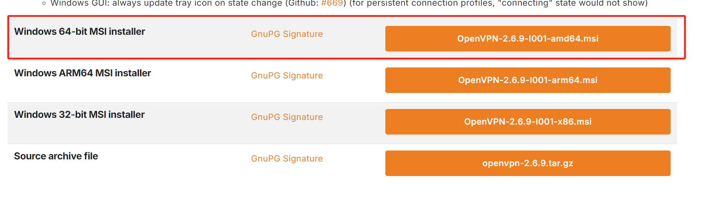

magedu2@22@321

# 1 OpenVPN简介

## 1.1 VPN 介绍

一些组织需要实现跨地域的互相通信,比如:北京总公司和上海分公司之间进行网络互通,一般通过下面两 种方式实现

专用网：

所谓专用网就是在两个网络（例如，北京总公司和广州分公司）的网络之间架设一条专用线路，但是它 并不需要真正地去铺设光缆之类的物理线路。虽然没有实际去铺设网线，但是仍需要向电信运营商申请 租用专线，在这条专用的线路上只传输自己组织之间的数据信息,所以此方式安全稳定,同时也费用高昂


VPN：

Virtual Private Network，虚拟私有网络，或称为虚拟专用网络，常用于在公用网络上实现专用网络功 能，为了安全通常需要进行加密通讯。此方式在企业网络中有广泛应用。VPN网关通过对数据包的加密 和数据包目标地址的转换实现远程访问。VPN功能可通过服务器、网络硬件、软件等多种方式实现 


## 1.2 VPN 常见应用模式

### 1.2.1 点对站点 peer to site


### 1.2.2 站点对站点 site to site


## 1.3 OpenVPN


OpenVPN 是Linux下开源VPN的应用，提供了良好的性能和友好的用户GUI。

OpenVPN 是一个基于 OpenSSL 库的应用层 VPN 实现。和传统 VPN 相比，它的优点是简单易用。

OpenVPN允许参与建立VPN的单点使用共享密钥，电子证书，或者用户名/密码来进行身份验证。

OpenVPN支持在各种系统,,如:Linux、Windows、Mac OS X、Solaris、OpenBSD、FreeBSD、 NetBSD上运行，并包含了许多安全性的功能。它并不是一个基于Web的VPN软件，也不与IPsec及其他 VPN软件包兼容。

官方网站：https://openvpn.net

GitHub地址：https://github.com/OpenVPN/openvpn

**OpenVPN 常见适用场景**

- 实现远程主机到内网的连接
- 实现多个远程主机之间的连接

# 2 OpenVPN 部署

## 2.1 准备 OpenVPN 部署环境

官文文档: https://openvpn.net/community-resources/how-to/

**可选择以下两套环境之一实现OpenVPN**

### 2.1.1 环境1: 阿里云 OpenVPN 实战环境

**准备阿里云网络实验环境**

```bash
1 阿里云创建专有网络
指定城市和可用区:华北5呼和浩特 可用区A区
网段名wl-net1和地址段172.16.0.0/12，默认资源组
交换机名wl-net1-sw1 可用区A IPv4的地址段 172.30.0.0/24
安全组开放22端口

2 创建OpenVPN服务器有公网IP的实例1个
指定城市和可用区:华北5呼和浩特 可用区A区
经济型 e 2vCPU 2G
网络:wl-net1 交换机:wl-net1-sw1
公网IP 按量收费 10M
默认安全组 默认配置 22,3389,icmp
ubutun 2404
系统盘 存储默认高效云盘40G

3 创建局域网的服务器无公网IP的实例2个
按量付费
指定城市和可用区:华北5呼和浩特 可用区A区
共享型 2vCPU2G
ubutun 2404
系统盘 存储默认高效云盘40G

网络:wl-net1 wl-net1-sw1
无公网IP
默认安全组
主网卡sw1

4 重设所有实例密码

5 修改安全组打开 1194/TCP/UDP
```

#### 2.1.1.1 购买第一台有公网IP的ECS

购买链接：

```http
https://ecs-buy.aliyun.com/ecs?spm=5176.8789780.1092585.1.1db055ca1sGhza#/custom/postpay/cn-huhehaote
```


#### 2.1.1.2 先创建网络和交换机


#### 2.1.1.3 : 再购买两台内网无公网的ECS

注意和第一台主机在同一个地域和可用区, 网络和第一台主机一样,无公网IP


#### 2 . 1 . 1 . 4  验 证 主 机 配 置


#### 2.1.1.5 修改网络防火墙规则

默认VPN的端口无法访问,修改网络防火墙规则,添加1规则实现1194/TCP/UDP端口允许通过


## 2.2 安装 OpenVPN 相关软件包

### 2.2.1 查看版本

#### 2.2.1.1 查看官网的OpenVPN的版本

访问官网：https://openvpn.net


#### 2.2.1.2 在不同OS上查看 OpenVPN 版本

范例: Ubutun20.04 查看OpenVPN版本

```bash
root@openvpn-server:~# apt list openvpn
Listing... Done
openvpn/noble-updates,noble-security 2.6.9-1ubuntu4.1 amd64
```

### 2.2.2 安装 OpenVPN

后面环境以Ubutun24.04上安装OpenVPN为例

#### 2.2.2.1 安装 OpenVPN 和证书工具

```bash
#OpenVPN服务器端
root@openvpn-server:~# apt install openvpn -y

#证书管理工具
root@openvpn-server:~# apt -y install easy-rsa
```

#### 2.2.2.2 查看包中相关文件

```bash
root@openvpn-server:~# dpkg -L openvpn
/.
/etc
/etc/default
/etc/default/openvpn
/etc/init.d
/etc/init.d/openvpn
/etc/network
/etc/network/if-down.d
/etc/network/if-down.d/openvpn
/etc/network/if-up.d
/etc/network/if-up.d/openvpn
/etc/openvpn
/etc/openvpn/client
/etc/openvpn/server
/etc/openvpn/update-resolv-conf
/usr
/usr/include
/usr/include/openvpn
/usr/include/openvpn/openvpn-msg.h
/usr/include/openvpn/openvpn-plugin.h
/usr/lib
/usr/lib/openvpn
/usr/lib/systemd
/usr/lib/systemd/system
/usr/lib/systemd/system/openvpn-client@.service
/usr/lib/systemd/system/openvpn-server@.service
/usr/lib/systemd/system/openvpn.service
/usr/lib/systemd/system/openvpn@.service
/usr/lib/systemd/system-generators
/usr/lib/systemd/system-generators/openvpn-generator
/usr/lib/tmpfiles.d
/usr/lib/tmpfiles.d/openvpn.conf
/usr/lib/x86_64-linux-gnu
/usr/lib/x86_64-linux-gnu/openvpn
/usr/lib/x86_64-linux-gnu/openvpn/plugins
/usr/lib/x86_64-linux-gnu/openvpn/plugins/openvpn-plugin-auth-pam.so
/usr/lib/x86_64-linux-gnu/openvpn/plugins/openvpn-plugin-down-root.so
/usr/sbin
/usr/sbin/openvpn
/usr/share
/usr/share/bash-completion
/usr/share/bash-completion/completions
/usr/share/bash-completion/completions/openvpn
/usr/share/doc
/usr/share/doc/openvpn
/usr/share/doc/openvpn/AUTHORS
/usr/share/doc/openvpn/COPYRIGHT.GPL.gz
/usr/share/doc/openvpn/Changes.rst.gz
/usr/share/doc/openvpn/NEWS.Debian.gz
/usr/share/doc/openvpn/PORTS
/usr/share/doc/openvpn/README
/usr/share/doc/openvpn/README.Debian.gz
/usr/share/doc/openvpn/README.auth-pam
/usr/share/doc/openvpn/README.down-root
/usr/share/doc/openvpn/README.mbedtls
/usr/share/doc/openvpn/README.systemd
/usr/share/doc/openvpn/changelog.Debian.gz
/usr/share/doc/openvpn/copyright
/usr/share/doc/openvpn/examples
/usr/share/doc/openvpn/examples/sample-config-files
/usr/share/doc/openvpn/examples/sample-config-files/README
/usr/share/doc/openvpn/examples/sample-config-files/client.conf
/usr/share/doc/openvpn/examples/sample-config-files/firewall.sh
/usr/share/doc/openvpn/examples/sample-config-files/home.up
/usr/share/doc/openvpn/examples/sample-config-files/loopback-client
/usr/share/doc/openvpn/examples/sample-config-files/loopback-server
/usr/share/doc/openvpn/examples/sample-config-files/office.up
/usr/share/doc/openvpn/examples/sample-config-files/openvpn-shutdown.sh
/usr/share/doc/openvpn/examples/sample-config-files/openvpn-startup.sh
/usr/share/doc/openvpn/examples/sample-config-files/server.conf
/usr/share/doc/openvpn/examples/sample-config-files/tls-home.conf
/usr/share/doc/openvpn/examples/sample-config-files/tls-office.conf
/usr/share/doc/openvpn/examples/sample-keys
/usr/share/doc/openvpn/examples/sample-keys/README
/usr/share/doc/openvpn/examples/sample-keys/ca.crt
/usr/share/doc/openvpn/examples/sample-keys/ca.key
/usr/share/doc/openvpn/examples/sample-keys/client-ec.crt
/usr/share/doc/openvpn/examples/sample-keys/client-ec.key
/usr/share/doc/openvpn/examples/sample-keys/client-pass.key
/usr/share/doc/openvpn/examples/sample-keys/client.crt
/usr/share/doc/openvpn/examples/sample-keys/client.key
/usr/share/doc/openvpn/examples/sample-keys/client.p12
/usr/share/doc/openvpn/examples/sample-keys/dh2048.pem
/usr/share/doc/openvpn/examples/sample-keys/gen-sample-keys.sh
/usr/share/doc/openvpn/examples/sample-keys/openssl.cnf
/usr/share/doc/openvpn/examples/sample-keys/server-ec.crt
/usr/share/doc/openvpn/examples/sample-keys/server-ec.key
/usr/share/doc/openvpn/examples/sample-keys/server.crt
/usr/share/doc/openvpn/examples/sample-keys/server.key
/usr/share/doc/openvpn/examples/sample-keys/ta.key
/usr/share/doc/openvpn/examples/sample-scripts
/usr/share/doc/openvpn/examples/sample-scripts/auth-pam.pl
/usr/share/doc/openvpn/examples/sample-scripts/bridge-start
/usr/share/doc/openvpn/examples/sample-scripts/bridge-stop
/usr/share/doc/openvpn/examples/sample-scripts/totpauth.py
/usr/share/doc/openvpn/examples/sample-scripts/ucn.pl
/usr/share/doc/openvpn/examples/sample-scripts/verify-cn
/usr/share/doc/openvpn/gui-notes.txt.gz
/usr/share/doc/openvpn/management-notes.txt.gz
/usr/share/doc/openvpn/openvpn-examples.5.html
/usr/share/doc/openvpn/openvpn.8.html
/usr/share/man
/usr/share/man/man5
/usr/share/man/man5/openvpn-examples.5.gz
/usr/share/man/man8
/usr/share/man/man8/openvpn.8.gz
/usr/share/openvpn
/usr/share/openvpn/verify-cn
/var
/var/log
/var/log/openvpn
/usr/lib/openvpn/openvpn-plugin-auth-pam.so
/usr/lib/openvpn/openvpn-plugin-down-root.so

root@openvpn-server:~# dpkg -L easy-rsa
/.
/usr
/usr/bin
/usr/bin/make-cadir
/usr/share
/usr/share/doc
/usr/share/doc/easy-rsa
/usr/share/doc/easy-rsa/README.Debian
/usr/share/doc/easy-rsa/changelog.Debian.gz
/usr/share/doc/easy-rsa/copyright
/usr/share/doc/easy-rsa/doc
/usr/share/doc/easy-rsa/doc/EasyRSA-Advanced.md.gz
/usr/share/doc/easy-rsa/doc/EasyRSA-Contributing.md
/usr/share/doc/easy-rsa/doc/EasyRSA-Readme.md.gz
/usr/share/doc/easy-rsa/doc/EasyRSA-Renew-and-Revoke.md
/usr/share/doc/easy-rsa/doc/EasyRSA-Upgrade-Notes.md
/usr/share/doc/easy-rsa/doc/Hacking.md.gz
/usr/share/doc/easy-rsa/doc/Intro-To-PKI.md.gz
/usr/share/easy-rsa
/usr/share/easy-rsa/easyrsa
/usr/share/easy-rsa/openssl-easyrsa.cnf
/usr/share/easy-rsa/vars.example
/usr/share/easy-rsa/x509-types
/usr/share/easy-rsa/x509-types/COMMON
/usr/share/easy-rsa/x509-types/ca
/usr/share/easy-rsa/x509-types/client
/usr/share/easy-rsa/x509-types/code-signing
/usr/share/easy-rsa/x509-types/email
/usr/share/easy-rsa/x509-types/kdc
/usr/share/easy-rsa/x509-types/server
/usr/share/easy-rsa/x509-types/serverClient
/usr/share/man
/usr/share/man/man1
/usr/share/man/man1/make-cadir.1.gz
```

#### 2.2.2.3 准备相关配置文件

```bash
#准备证书颁发相关文件
root@openvpn-server:~# mkdir /etc/openvpn/easy-rsa
root@openvpn-server:~# cp -r /usr/share/easy-rsa/* /etc/openvpn/easy-rsa
root@openvpn-server:/etc/openvpn/easy-rsa# tree /etc/openvpn/
/etc/openvpn/
├── client
├── easy-rsa
│   ├── easyrsa
│   ├── openssl-easyrsa.cnf
│   ├── vars.example
│   └── x509-types
│       ├── ca
│       ├── client
│       ├── code-signing
│       ├── COMMON
│       ├── email
│       ├── kdc
│       ├── server
│       └── serverClient
├── server
└── update-resolv-conf

5 directories, 12 files

#准备颁发证书相关变量的配置文件
root@openvpn-server:/etc/openvpn/easy-rsa# pwd
/etc/openvpn/easy-rsa
root@openvpn-server:/etc/openvpn/easy-rsa# mv vars.example vars

#建议修改给CA和OpenVPN服务器颁发的证书的有效期,可适当加长
root@openvpn-server:/etc/openvpn/easy-rsa# vim /etc/openvpn/easy-rsa/vars
#CA的证书默认有效期为10年,可以适当延长,比如:36500天
#set_var EASYRSA_CA_EXPIRE     3650
set_var EASYRSA_CA_EXPIRE      36500

#服务器证书默为为825天,可适当加长,比如:3650天
#set_var EASYRSA_CERT_EXPIRE   825 
#将上面行修改为下面
set_var EASYRSA_CERT_EXPIRE    3650
```

## 2.3 准备证书相关文件

### 2.3.1 初始化PKI和CA颁发机构环境

#### 2.3.1.1 脚本easyrsa帮助用法

```bash
root@openvpn-server:/etc/openvpn# cd /etc/openvpn/easy-rsa
root@openvpn-server:/etc/openvpn/easy-rsa# ./easyrsa 

Easy-RSA 3 usage and overview

USAGE: easyrsa [global-options] COMMAND [command-options]

To get detailed usage and help for a command, use:
  ./easyrsa help COMMAND

For a list of global-options, use:
  ./easyrsa help options

For a list of extra test commands, use:
  ./easyrsa help more

A list of commands is shown below:
  init-pki [ cmd-opts ]
  build-ca [ cmd-opts ]
  gen-dh
  gen-req <file_name_base> [ cmd-opts ]
  sign-req <type> <file_name_base> [ cmd-opts ]
  build-client-full <file_name_base> [ cmd-opts ]
  build-server-full <file_name_base> [ cmd-opts ]
  build-serverClient-full <file_name_base> [ cmd-opts ]
  inline <file_name_base>
  revoke <file_name_base> [ cmd-opts ]
  renew <file_name_base>
  revoke-renewed <file_name_base> [ cmd-opts ]
  rewind-renew <certificate_serial_number>
  rebuild <file_name_base> [ cmd-opts ]
  gen-crl
  update-db
  show-req <file_name_base> [ cmd-opts ]
  show-cert <file_name_base> [ cmd-opts ]
  show-ca [ cmd-opts ]
  show-crl
  show-expire <file_name_base> (Optional)
  show-revoke <file_name_base> (Optional)
  show-renew <file_name_base> (Optional)
  verify-cert <file_name_base>
  import-req <request_file_path> <short_name_base>
  export-p1 <file_name_base> [ cmd-opts ]
  export-p7 <file_name_base> [ cmd-opts ]
  export-p8 <file_name_base> [ cmd-opts ]
  export-p12 <file_name_base> [ cmd-opts ]
  set-pass <file_name_base> [ cmd-opts ]
  upgrade <type>

DIRECTORY STATUS (commands would take effect on these locations)
     EASYRSA: /etc/openvpn/easy-rsa
         PKI: /etc/openvpn/easy-rsa/pki
   vars-file: /etc/openvpn/easy-rsa/vars
  x509-types: /etc/openvpn/easy-rsa/x509-types
   CA status: CA has not been built

```

#### 2.3.1.2 初始化PKI生成PKI相关目录和文件

```bash
root@openvpn-server:/etc/openvpn# cd /etc/openvpn/easy-rsa

#初始化数据,在当前目录下生成pki目录及相关文件
root@openvpn-server:/etc/openvpn/easy-rsa# ./easyrsa init-pki

Notice
------
'init-pki' complete; you may now create a CA or requests.

Your newly created PKI dir is:
* /etc/openvpn/easy-rsa/pki

Using Easy-RSA configuration:
* /etc/openvpn/easy-rsa/vars

root@openvpn-server:/etc/openvpn/easy-rsa# tree
.
├── easyrsa
├── openssl-easyrsa.cnf
├── pki                        #生成一个新的目录及相关文件
│   ├── inline
│   ├── openssl-easyrsa.cnf
│   ├── private
│   └── reqs
├── vars
└── x509-types
    ├── ca
    ├── client
    ├── code-signing
    ├── COMMON
    ├── email
    ├── kdc
    ├── server
    └── serverClient

6 directories, 12 files

```

### 2.3.2 创建 CA 机构证书环境

```bash
root@openvpn-server:/etc/openvpn# cd /etc/openvpn/easy-rsa
root@openvpn-server:/etc/openvpn/easy-rsa# tree pki
pki
├── inline
├── openssl-easyrsa.cnf
├── private
└── reqs

4 directories, 1 file

root@openvpn-server:/etc/openvpn/easy-rsa# ./easyrsa build-ca nopass
Using Easy-RSA 'vars' configuration:
* /etc/openvpn/easy-rsa/vars

Using SSL:
* openssl OpenSSL 3.0.13 30 Jan 2024 (Library: OpenSSL 3.0.13 30 Jan 2024)
..+..+....+...+........+.......+.....+.+++++++++++++++++++++++++++++++++++++++++++++++++++++++++++++++++*..+...+...+..+.........+++++++++++++++++++++++++++++++++++++++++++++++++++++++++++++++++*.....+.....+....+...+.....+.+..+...+....+......+..+...+..........+.....+.......+...+.........+..+..........+......+............+........+.........+....+..+...+.......+.....+....+........................+..+....+.....+.+..+.......+...+...+............+...+...+..............+.+......+......+..+...+...+.......+..+.+...........+...............+......+...+.+...........+...+....+..+......+.............+..+...+.+...+...+.....+.......+......+............+............+..+.+..............+....+.....+.....................+...+......+....+........+.......+..+.+..+.......+.....+.+.........+...+++++++++++++++++++++++++++++++++++++++++++++++++++++++++++++++++
....+......+++++++++++++++++++++++++++++++++++++++++++++++++++++++++++++++++*.....+.......+..+...+....+......+............+++++++++++++++++++++++++++++++++++++++++++++++++++++++++++++++++*...+..........+...+......+++++++++++++++++++++++++++++++++++++++++++++++++++++++++++++++++
-----
You are about to be asked to enter information that will be incorporated
into your certificate request.
What you are about to enter is what is called a Distinguished Name or a DN.
There are quite a few fields but you can leave some blank
For some fields there will be a default value,
If you enter '.', the field will be left blank.
-----
Common Name (eg: your user, host, or server name) [Easy-RSA CA]: #回车接受默认值

Notice
------
CA creation complete. Your new CA certificate is at:
* /etc/openvpn/easy-rsa/pki/ca.crt  #生成自签名的证书文件

root@openvpn-server:/etc/openvpn/easy-rsa# tree pki
pki
├── ca.crt                  #生成的自签名的证书文件
├── certs_by_serial
├── index.txt
├── index.txt.attr
├── inline
├── issued
├── openssl-easyrsa.cnf
├── private
│   └── ca.key         #生成的私钥文件
├── reqs
├── revoked
│   ├── certs_by_serial
│   ├── private_by_serial
│   └── reqs_by_serial
└── serial

10 directories, 6 files

#查看生成CA相关的文件
root@openvpn-server:/etc/openvpn/easy-rsa# cat pki/serial 
01
root@openvpn-server:/etc/openvpn/easy-rsa# ll pki/index.txt
-rw------- 1 root root 0 Sep 27 17:07 pki/index.txt


# 查看生成的自签名证书
root@openvpn-server:/etc/openvpn/easy-rsa# cat pki/ca.crt
-----BEGIN CERTIFICATE-----
MIIDTTCCAjWgAwIBAgIUb+snO9Whr/Ft4eNmTcNl3yeyfeEwDQYJKoZIhvcNAQEL
BQAwFjEUMBIGA1UEAwwLRWFzeS1SU0EgQ0EwIBcNMjQwOTI3MDkwNzE3WhgPMjEy
NDA5MDMwOTA3MTdaMBYxFDASBgNVBAMMC0Vhc3ktUlNBIENBMIIBIjANBgkqhkiG
9w0BAQEFAAOCAQ8AMIIBCgKCAQEArnIFwCNWKQJaGFL7X5jjYhGOHNobWds8lpd1
GVowBpk1ilg18AegZPDjja6dDof6WTta+oWAz0z2r2lCSDgnyGnSK7VUknCf3Dzw
KcB5BirXvV9e0vm5DkQF5TITFMLeOCakXwSzywG34axR/5CqlLyXYLkZt6smc0BK
UcdmjzTGjbZ42vERsN9Mj1S/Q0G+56boydpGcIL4bGyQhNXRtdZwmHqsV18NdSM9
IpOqY6oszfg8X+tSFOs9aEXLA1Xv0yJnR4vSXIErbrx5/XDlz7R6Xw5HOasKHInE
D2UN4ClUYhPlj4EZnsGLxOk7Neop2jAueGK1mYeP8BNHLBdHlQIDAQABo4GQMIGN
MAwGA1UdEwQFMAMBAf8wHQYDVR0OBBYEFPpu9pY/fNxAxqeOyR+TJ1kmuk5oMFEG
A1UdIwRKMEiAFPpu9pY/fNxAxqeOyR+TJ1kmuk5ooRqkGDAWMRQwEgYDVQQDDAtF
YXN5LVJTQSBDQYIUb+snO9Whr/Ft4eNmTcNl3yeyfeEwCwYDVR0PBAQDAgEGMA0G
CSqGSIb3DQEBCwUAA4IBAQCMIJATqb6xQdpyDR7qr/Znjn2pQZUJLXKpinPSN4k7
EwSrF/uCO1DQRnL7q2V6n0mWpdiGORdGY7oG3lXU6IT7VicHadcLk25mO3Fp9CY9
dIJTM38LBomoN3K9/R6sTBMhaLYuwS6uNnGFWV7J/QP6TDMHccrwmYRLzfcpCCJB
uU+JXH9swTTX7nR7ZFUak5eZ7ErAeJYt8HRS5qH3csGm11Y9tU0Ocraoy8wLgNie
ayiqRFEVv7m6t+Si61IvA43+JBtnAr3YnbC/kfZUuN68NEZqjYxPMALgFqytWNzW
XQycGfbyPxw92CX4N6tHRY1HDkOy9mFpS5aCCuIgieV6
-----END CERTIFICATE-----

root@openvpn-server:/etc/openvpn/easy-rsa# openssl x509 -in pki/ca.crt -noout -text
Certificate:
    Data:
        Version: 3 (0x2)
        Serial Number:
            6f:eb:27:3b:d5:a1:af:f1:6d:e1:e3:66:4d:c3:65:df:27:b2:7d:e1
        Signature Algorithm: sha256WithRSAEncryption
        Issuer: CN = Easy-RSA CA
        Validity
            Not Before: Sep 27 09:07:17 2024 GMT
            Not After : Sep  3 09:07:17 2124 GMT
        Subject: CN = Easy-RSA CA
        Subject Public Key Info:
            Public Key Algorithm: rsaEncryption
                Public-Key: (2048 bit)
                Modulus:
                    00:ae:72:05:c0:23:56:29:02:5a:18:52:fb:5f:98:
                    e3:62:11:8e:1c:da:1b:59:db:3c:96:97:75:19:5a:
                    30:06:99:35:8a:58:35:f0:07:a0:64:f0:e3:8d:ae:
                    9d:0e:87:fa:59:3b:5a:fa:85:80:cf:4c:f6:af:69:
                    42:48:38:27:c8:69:d2:2b:b5:54:92:70:9f:dc:3c:
                    f0:29:c0:79:06:2a:d7:bd:5f:5e:d2:f9:b9:0e:44:
                    05:e5:32:13:14:c2:de:38:26:a4:5f:04:b3:cb:01:
                    b7:e1:ac:51:ff:90:aa:94:bc:97:60:b9:19:b7:ab:
                    26:73:40:4a:51:c7:66:8f:34:c6:8d:b6:78:da:f1:
                    11:b0:df:4c:8f:54:bf:43:41:be:e7:a6:e8:c9:da:
                    46:70:82:f8:6c:6c:90:84:d5:d1:b5:d6:70:98:7a:
                    ac:57:5f:0d:75:23:3d:22:93:aa:63:aa:2c:cd:f8:
                    3c:5f:eb:52:14:eb:3d:68:45:cb:03:55:ef:d3:22:
                    67:47:8b:d2:5c:81:2b:6e:bc:79:fd:70:e5:cf:b4:
                    7a:5f:0e:47:39:ab:0a:1c:89:c4:0f:65:0d:e0:29:
                    54:62:13:e5:8f:81:19:9e:c1:8b:c4:e9:3b:35:ea:
                    29:da:30:2e:78:62:b5:99:87:8f:f0:13:47:2c:17:
                    47:95
                Exponent: 65537 (0x10001)
        X509v3 extensions:
            X509v3 Basic Constraints: 
                CA:TRUE
            X509v3 Subject Key Identifier: 
                FA:6E:F6:96:3F:7C:DC:40:C6:A7:8E:C9:1F:93:27:59:26:BA:4E:68
            X509v3 Authority Key Identifier: 
                keyid:FA:6E:F6:96:3F:7C:DC:40:C6:A7:8E:C9:1F:93:27:59:26:BA:4E:68
                DirName:/CN=Easy-RSA CA
                serial:6F:EB:27:3B:D5:A1:AF:F1:6D:E1:E3:66:4D:C3:65:DF:27:B2:7D:E1
            X509v3 Key Usage: 
                Certificate Sign, CRL Sign
    Signature Algorithm: sha256WithRSAEncryption
    Signature Value:
        8c:20:90:13:a9:be:b1:41:da:72:0d:1e:ea:af:f6:67:8e:7d:
        a9:41:95:09:2d:72:a9:8a:73:d2:37:89:3b:13:04:ab:17:fb:
        82:3b:50:d0:46:72:fb:ab:65:7a:9f:49:96:a5:d8:86:39:17:
        46:63:ba:06:de:55:d4:e8:84:fb:56:27:07:69:d7:0b:93:6e:
        66:3b:71:69:f4:26:3d:74:82:53:33:7f:0b:06:89:a8:37:72:
        bd:fd:1e:ac:4c:13:21:68:b6:2e:c1:2e:ae:36:71:85:59:5e:
        c9:fd:03:fa:4c:33:07:71:ca:f0:99:84:4b:cd:f7:29:08:22:
        41:b9:4f:89:5c:7f:6c:c1:34:d7:ee:74:7b:64:55:1a:93:97:
        99:ec:4a:c0:78:96:2d:f0:74:52:e6:a1:f7:72:c1:a6:d7:56:
        3d:b5:4d:0e:72:b6:a8:cb:cc:0b:80:d8:9e:6b:28:aa:44:51:
        15:bf:b9:ba:b7:e4:a2:eb:52:2f:03:8d:fe:24:1b:67:02:bd:
        d8:9d:b0:bf:91:f6:54:b8:de:bc:34:46:6a:8d:8c:4f:30:02:
        e0:16:ac:ad:58:dc:d6:5d:0c:9c:19:f6:f2:3f:1c:3d:d8:25:
        f8:37:ab:47:45:8d:47:0e:43:b2:f6:61:69:4b:96:82:0a:e2:
        20:89:e5:7a
```

### 2.3.3 准备服务端证书环境

#### 2.3.3.1 创建服务端证书申请

```bash
root@openvpn-server:/etc/openvpn# cd /etc/openvpn/easy-rsa

#创建服务器证书申请文件，其中server是文件前缀
root@openvpn-server:/etc/openvpn/easy-rsa# ./easyrsa gen-req server nopass
Using Easy-RSA 'vars' configuration:
* /etc/openvpn/easy-rsa/vars

Using SSL:
* openssl OpenSSL 3.0.13 30 Jan 2024 (Library: OpenSSL 3.0.13 30 Jan 2024)
...+...+.....+....+..+...+.......+........+++++++++++++++++++++++++++++++++++++++++++++++++++++++++++++++++*...+...........+++++++++++++++++++++++++++++++++++++++++++++++++++++++++++++++++*..+...+...+..+...+.........+...+............+.+..+...+....+...+.....+............+...............+.+.....+.+......+..............+.............+...+...+...............+..+...+.......+..+..........+..+.....................+.........+..........+...+..................+...+..+.......+.....+...+....+...+........+.........+.+..+.+.....+..........+.....+....+..+...............+.+.....+.........+..................+...+...+....+.....+.+.....+......+.+.........+........+...+............+.......+.....+....+.....+......+.............+..+..........+...+......+..+...+......+...................+..+.......+..+......+....+..............+....+++++++++++++++++++++++++++++++++++++++++++++++++++++++++++++++++
.....+.+......+...+.....+.............+........+.......+...+..+.......+++++++++++++++++++++++++++++++++++++++++++++++++++++++++++++++++*...+....+.....+.+..+.+............+.....+...+.......+++++++++++++++++++++++++++++++++++++++++++++++++++++++++++++++++*......+......+.........+...+..........+........+.+......+..+............+.+.....+..........+...+.........+..+....+......+...+.....+...+....+......+..+.......+...+.....+......+......................+..+.......+.....+.........+.......+...+...............+..+...+.+..............+.+.....+....+..............+++++++++++++++++++++++++++++++++++++++++++++++++++++++++++++++++
-----
You are about to be asked to enter information that will be incorporated
into your certificate request.
What you are about to enter is what is called a Distinguished Name or a DN.
There are quite a few fields but you can leave some blank
For some fields there will be a default value,
If you enter '.', the field will be left blank.
-----
Common Name (eg: your user, host, or server name) [server]: #接受Common Name的默认值,直接回车

Notice
------
Private-Key and Public-Certificate-Request files created.
Your files are:
* req: /etc/openvpn/easy-rsa/pki/reqs/server.req #生成请求文件
* key: /etc/openvpn/easy-rsa/pki/private/server.key #生成私钥文件

```

#### 2.2.3.2 颁发服务端证书

##### 2.2.3.1.1 查看颁发证书命令用法

```bash
root@openvpn-server:/etc/openvpn# cd /etc/openvpn/easy-rsa
root@openvpn-server:/etc/openvpn/easy-rsa# ./easyrsa help sign 

* sign-req <type> <file_name_base> [ cmd-opts ]

      Sign a certificate request of the defined type.

      <type> must be a known type.
      eg: 'client', 'server', 'serverClient', 'ca' or a user-added type.
      All supported types are listed in the x509-types directory.

      This request file must exist in the reqs/ dir and have a .req file
      extension. See 'import-req' for importing from other sources.

Available command options [ cmd-opts ]:

      * preserve - Use the DN-field order of the CSR not the CA.
```

##### 2.2.3.1.2 颁发服务端证书

```bash
#将上面server.req的申请,颁发server类型的证书
root@openvpn-server:/etc/openvpn# cd /etc/openvpn/easy-rsa

#第一个server表示证书的类型,第二个server表示请求文件名的前缀
root@openvpn-server:/etc/openvpn/easy-rsa# ./easyrsa sign server server
Using Easy-RSA 'vars' configuration:
* /etc/openvpn/easy-rsa/vars

Using SSL:
* openssl OpenSSL 3.0.13 30 Jan 2024 (Library: OpenSSL 3.0.13 30 Jan 2024)
You are about to sign the following certificate:
Please check over the details shown below for accuracy. Note that this request
has not been cryptographically verified. Please be sure it came from a trusted
source or that you have verified the request checksum with the sender.
Request subject, to be signed as a server certificate 
for '3650' days: #可以看到vars文件指定的有效期


subject=
    commonName                = server

Type the word 'yes' to continue, or any other input to abort.
  Confirm request details: yes #输入yes回车

Using configuration from /etc/openvpn/easy-rsa/pki/openssl-easyrsa.cnf
Check that the request matches the signature
Signature ok
The Subject's Distinguished Name is as follows
commonName            :ASN.1 12:'server'
Certificate is to be certified until Sep 25 09:16:57 2034 GMT (3650 days)

Write out database with 1 new entries
Database updated

Notice
------
Certificate created at:
* /etc/openvpn/easy-rsa/pki/issued/server.crt #生成服务器证书文件

```

##### 2.2.3.1.3 验证结果

```bash
root@openvpn-server:/etc/openvpn# cd /etc/openvpn/easy-rsa
root@openvpn-server:/etc/openvpn/easy-rsa# tree pki
pki
├── ca.crt
├── certs_by_serial
│   └── 865AB2B08642EDBF89657865933F73C3.pem  #生成的服务器证书文件
├── index.txt
├── index.txt.attr
├── index.txt.attr.old
├── index.txt.old
├── inline
├── issued
│   └── server.crt   #生成的服务器证书文件
├── openssl-easyrsa.cnf
├── private
│   ├── ca.key
│   └── server.key
├── reqs
│   └── server.req
├── revoked
│   ├── certs_by_serial
│   ├── private_by_serial
│   └── reqs_by_serial
├── serial
└── serial.old

10 directories, 13 files
```

### 2.3.4 创建 Diffie-Hellman 密钥

#### 2.3.4.1 Diffie-Hellman 算法说明

```http
wiki参考链接:
https://en.wikipedia.org/wiki/Diffie%E2%80%93Hellman_key_exchange
Diffie-Hellman 密钥交换方法是迪菲（Whitefield Diffie）和赫尔曼（Martin Hellman）在1976
年公布的一种秘钥交换算法，它是一种建立秘钥的方法，而不是加密方法，所以秘钥必须和其他一种加密算法
结合使用。这种密钥交换技术的目的在于使两个用户安全地交换一个密钥，用此密钥做为对称密钥来加密后续
的报文传输。
```

#### 2.3.4.2 创建 Diffie-Hellman 密钥

```bash
root@openvpn-server:/etc/openvpn# cd /etc/openvpn/easy-rsa

root@openvpn-server:/etc/openvpn/easy-rsa# ./easyrsa gen-dh
Using Easy-RSA 'vars' configuration:
* /etc/openvpn/easy-rsa/vars

Using SSL:
* openssl OpenSSL 3.0.13 30 Jan 2024 (Library: OpenSSL 3.0.13 30 Jan 2024)
Generating DH parameters, 2048 bit long safe prime
...................................+..................................................+*++*++*++* #需要等待一会儿
DH parameters appear to be ok.

Notice
------

DH parameters of size 2048 created at:
* /etc/openvpn/easy-rsa/pki/dh.pem

#查看生成的文件
root@openvpn-server:/etc/openvpn/easy-rsa# ll pki/dh.pem 
-rw------- 1 root root 424 Sep 27 17:21 pki/dh.pem

root@openvpn-server:/etc/openvpn/easy-rsa# cat pki/dh.pem 
-----BEGIN DH PARAMETERS-----
MIIBCAKCAQEAxq85/NHROKTNayu507boQbtaGWfF1CK8Agf/q4gD9pLS7XghWqDE
Ukt8fcSuKcgT/Gg9zf5DQ10YPEG9UXmjFNXfpIEHPISwKUciinr2ZW6uaDSVYvpC
q6DOJ0JkPSHJ5M6fqm1u95TzNgWlrCLgn/TrPLk0JhKA+d3EqIBbaM/hqaEFO4k6
0UScELg1ANyLpmRhJFSG7UBHy1E4wXfPcBBT6BQGWBWr4X6g3M24jmiNXQUw603Q
wNvJQjaUlwDR76s/W7E5zK6oGFYfUyCNywXJw5yfWEK5zJVsc1w0MEIeGWnCyowY
vQOJWu1VM7kHQzotnXP9mBSFOWhezoaXBwIBAg==
-----END DH PARAMETERS-----
```

### 2.3.5 准备客户端证书环境

上面服务端证书配置完成，下面是配置客户端证书

#### 2.3.5.1 修改客户端证书有效期

```bash
root@openvpn-server:/etc/openvpn# cd /etc/openvpn/easy-rsa

#建议修改给客户端颁发证书的有效期,可适当减少,比如:90天

root@openvpn-server:/etc/openvpn/easy-rsa# vim /etc/openvpn/easy-rsa/vars
#set_var EASYRSA_CERT_EXPIRE   825 
#将上面行修改为下面
set_var EASYRSA_CERT_EXPIRE 90
```

#### 2.3.5.2 创建客户端证书申请

```bash
root@openvpn-server:/etc/openvpn# cd /etc/openvpn/easy-rsa

#生成客户端用户的证书申请
root@openvpn-server:/etc/openvpn/easy-rsa# ./easyrsa gen-req wanglei nopass
Using Easy-RSA 'vars' configuration:
* /etc/openvpn/easy-rsa/vars

Using SSL:
* openssl OpenSSL 3.0.13 30 Jan 2024 (Library: OpenSSL 3.0.13 30 Jan 2024)
.....+.....+............+......+......+...+.+.....+++++++++++++++++++++++++++++++++++++++++++++++++++++++++++++++++*..+.+......+...+++++++++++++++++++++++++++++++++++++++++++++++++++++++++++++++++*....+.......+...............+...+++++++++++++++++++++++++++++++++++++++++++++++++++++++++++++++++
.............+++++++++++++++++++++++++++++++++++++++++++++++++++++++++++++++++*.........+..+......+....+........+...+.......+...+..+.......+......+......+++++++++++++++++++++++++++++++++++++++++++++++++++++++++++++++++*....+.+..+...+....+......+..+...+....+......+............+........+....+...+..+++++++++++++++++++++++++++++++++++++++++++++++++++++++++++++++++
-----
You are about to be asked to enter information that will be incorporated
into your certificate request.
What you are about to enter is what is called a Distinguished Name or a DN.
There are quite a few fields but you can leave some blank
For some fields there will be a default value,
If you enter '.', the field will be left blank.
-----
Common Name (eg: your user, host, or server name) [wanglei]: #接受默认值,直接回车


Notice
------
Private-Key and Public-Certificate-Request files created.
Your files are:
* req: /etc/openvpn/easy-rsa/pki/reqs/wanglei.req  #证书申请文件
* key: /etc/openvpn/easy-rsa/pki/private/wanglei.key   #私钥文件


# 生成两个新文件
root@openvpn-server:/etc/openvpn/easy-rsa# tree pki/
pki/
├── ca.crt
├── certs_by_serial
│   └── 865AB2B08642EDBF89657865933F73C3.pem
├── dh.pem
├── index.txt
├── index.txt.attr
├── index.txt.attr.old
├── index.txt.old
├── inline
├── issued
│   └── server.crt
├── openssl-easyrsa.cnf
├── private
│   ├── ca.key
│   ├── server.key
│   └── wanglei.key  # 私钥文件
├── reqs
│   ├── server.req
│   └── wanglei.req #证书申请文件
├── revoked
│   ├── certs_by_serial
│   ├── private_by_serial
│   └── reqs_by_serial
├── serial
└── serial.old

10 directories, 16 files

```

#### 2.3.5.3 颁发客户端证书

```bash
root@openvpn-server:/etc/openvpn# cd /etc/openvpn/easy-rsa

# 颁发客户端证书
root@openvpn-server:/etc/openvpn/easy-rsa# ./easyrsa sign client wanglei     
Using Easy-RSA 'vars' configuration:
* /etc/openvpn/easy-rsa/vars

Using SSL:
* openssl OpenSSL 3.0.13 30 Jan 2024 (Library: OpenSSL 3.0.13 30 Jan 2024)
You are about to sign the following certificate:
Please check over the details shown below for accuracy. Note that this request
has not been cryptographically verified. Please be sure it came from a trusted
source or that you have verified the request checksum with the sender.
Request subject, to be signed as a client certificate 
for '3650' days:

subject=
    commonName                = wanglei

Type the word 'yes' to continue, or any other input to abort.
  Confirm request details: yes # 输入yes,直接回车

Using configuration from /etc/openvpn/easy-rsa/pki/openssl-easyrsa.cnf
Check that the request matches the signature
Signature ok
The Subject's Distinguished Name is as follows
commonName            :ASN.1 12:'wanglei'
Certificate is to be certified until Sep 25 09:36:15 2034 GMT (3650 days)

Write out database with 1 new entries
Database updated

Notice
------
Certificate created at:
* /etc/openvpn/easy-rsa/pki/issued/wanglei.crt  #证书文件


root@openvpn-server:/etc/openvpn/easy-rsa# tree pki
pki
├── ca.crt
├── certs_by_serial
│   ├── 865AB2B08642EDBF89657865933F73C3.pem
│   └── AE445FE6F3B3A012384378BE4794CF3E.pem
├── dh.pem
├── index.txt
├── index.txt.attr
├── index.txt.attr.old
├── index.txt.old
├── inline
├── issued
│   ├── server.crt
│   └── wanglei.crt  #生成客户端证书
├── openssl-easyrsa.cnf
├── private
│   ├── ca.key
│   ├── server.key
│   └── wanglei.key
├── reqs
│   ├── server.req
│   └── wanglei.req
├── revoked
│   ├── certs_by_serial
│   ├── private_by_serial
│   └── reqs_by_serial
├── serial
└── serial.old

10 directories, 18 files
```

如果需要颁发的客户端证书较多,可以使用下面脚本实现客户端证书的批量颁发

**客户端证书自动颁发脚本**

```bash
[root@centos8 ~]#cat openvpn-user-crt.sh 
#!/bin/bash
#
#********************************************************************
#Author: wanglei
#QQ: 353938339
#Date: 2024-09-27
#FileName： openvpn-user-crt.sh
#Description： The test script
#Copyright (C): 2024 All rights reserved
#********************************************************************
read -p "请输入用户的姓名拼音(如:${NAME}): " NAME
cd /etc/openvpn/easy-rsa/
./easyrsa gen-req ${NAME} nopass <<EOF
EOF
./easyrsa sign client ${NAME} <<EOF
yes
EOF

```

### 2.3.6 将CA和服务器证书相关文件复制到服务器相应的目录

```bash
root@openvpn-server:/etc/openvpn/easy-rsa# cp /etc/openvpn/easy-rsa/pki/ca.crt /etc/openvpn/server/
root@openvpn-server:/etc/openvpn/easy-rsa# cp /etc/openvpn/easy-rsa/pki/issued/server.crt /etc/openvpn/server/
root@openvpn-server:/etc/openvpn/easy-rsa# cp /etc/openvpn/easy-rsa/pki/private/server.key /etc/openvpn/server/
root@openvpn-server:/etc/openvpn/easy-rsa# cp /etc/openvpn/easy-rsa/pki/dh.pem /etc/openvpn/server

root@openvpn-server:/etc/openvpn/easy-rsa# ll /etc/openvpn/server/
total 28
-rw------- 1 root root 1204 Sep 27 17:43 ca.crt
-rw------- 1 root root  424 Sep 27 17:45 dh.pem
-rw------- 1 root root 4609 Sep 27 17:44 server.crt
-rw------- 1 root root 1704 Sep 27 17:44 server.key

```

### 2.3.7 将客户端私钥与证书相关文件复制到服务器相关的目录

```bash
root@openvpn-server:/etc/openvpn/easy-rsa# mkdir /etc/openvpn/client/wanglei/

root@openvpn-server:/etc/openvpn/easy-rsa# find /etc/openvpn/easy-rsa -name "wanglei.key" -o -name "wanglei.crt" -o -name ca.crt
/etc/openvpn/easy-rsa/pki/private/wanglei.key
/etc/openvpn/easy-rsa/pki/ca.crt
/etc/openvpn/easy-rsa/pki/issued/wanglei.crt

root@openvpn-server:/etc/openvpn/easy-rsa# find /etc/openvpn/easy-rsa \( -name "wanglei.key" -o -name "wanglei.crt" -o -name ca.crt \) -exec cp {} /etc/openvpn/client/wanglei \;

root@openvpn-server:/etc/openvpn/easy-rsa# ll /etc/openvpn/client/wanglei/
total 24
-rw------- 1 root root 1204 Sep 27 17:49 ca.crt
-rw------- 1 root root 4494 Sep 27 17:49 wanglei.crt
-rw------- 1 root root 1704 Sep 27 17:49 wanglei.key


```

## 2.4 配置 OpenVPN 服务器并启动服务

### 2.4.1 服务器端配置文件说明

```bash
#生成服务器配置文件
root@openvpn-server:/etc/openvpn/easy-rsa# cp   /usr/share/doc/openvpn/examples/sample-config-files/server.conf /etc/openvpn/

#服务器配置文件server.conf文件中以#或;开头的行都为注释
root@openvpn-server:/etc/openvpn/easy-rsa# grep -Ev "^#|^$" /etc/openvpn/server.conf 
;local a.b.c.d #本机监听IP,默认为本机所有IP
port 1194  #端口
;proto tcp  #协议,生产推荐使用TCP
proto udp  #默认协议udp
;dev tap #创建以太网隧道设备，tap设备实现以太网帧通过Openvpn隧道，可提供非IP协议如IPX和AppleTalk等的支持，tap等当于一个以太网设备，它操作第二层数据包如以太网数据帧。
dev tun  #创建IP路由隧道，生产推存使用tun.互联网使用tun,一个tun设备大多时候被用于基于IP协议的通讯。tun模拟了网络层设备，操作第三层数据包比如IP数据封包。
;dev-node MyTap  #TAP-Win32的设备驱动。非windows系统不需要
ca ca.crt #ca证书文件
cert server.crt  #服务器证书文件
key server.key  #服务器私钥文件
dh dh2048.pem  #dh参数文件
;topology subnet
server 10.8.0.0 255.255.255.0  #客户端连接后自动分配的IP网段，默认会给服务器分配此网段的第一个IP将做为客户端的网关,注意不要和内网网段相同
ifconfig-pool-persist /var/log/openvpn/ipp.txt #记录客户端和虚拟ip地址分配的文件
;server-bridge 10.8.0.4 255.255.255.0 10.8.0.50 10.8.0.100 #配置网桥模式，无需配置,建议注释
;server-bridge
;push "route 192.168.10.0 255.255.255.0" #推送给客户端的到达服务器后面网段的静态路由，网关是服务器地址10.8.0.1
;push "route 192.168.20.0 255.255.255.0" ##推送路由信息到客户端，以允许客户端能够连接到服务器背后的其它私有网络
;client-config-dir ccd #为特定客户端添加路由信息，此路由是客户端后面的网段而非服务端的网段，无需设置
;route 192.168.40.128 255.255.255.248
;client-config-dir ccd
;route 10.9.0.0 255.255.255.252
;learn-address ./script #指定外部脚本文件，实现创建不同组的iptables规则，无需配置
;push "redirect-gateway def1 bypass-dhcp" #启用此配置后客户端所有流量都将通过VPN服务器进行转发，因此生产一般无需配置此项
;push "dhcp-option DNS 208.67.222.222" #推送DNS服务器地址，无需配置
;push "dhcp-option DNS 208.67.220.220"
;client-to-client   #允许不同的客户端直接通信,不安全,生产环境一般无需配置
;duplicate-cn #多个用户共用一个证书，一般用于测试环境，生产环境建议一个用户一个证书,无需开启
keepalive 10 120  #设置服务端活动的检测的间隔和超时时间，每隔10秒ping一次，120秒没有回应则认为已经断线
tls-auth ta.key 0 #访止DoS等攻击的安全增强配置,服务器和每个客户端都需要拥有此密钥文件。第二个参数在服务器端为0，客户端为1
cipher AES-256-CBC  #加密算法
;compress lz4-v2  #启用Openvpn2.4.X新版压缩算法
;push "compress lz4-v2" #推送客户端使用新版压缩算法,和下面的comp-lzo不要同时使用
;comp-lzo   #旧户端兼容的压缩配置，需要客户端配置开启压缩,openvpn2.4.X等新版可以不用开启
;max-clients 100  #最多支持的客户端数量
;user openvpn  #最多支持的客户端数量
;group openvpn  #指定openvpn服务的组
persist-key   #重启服务时默认会重新读取key文件，开启此配置后保持使用第一次的key文件,生产环境无需开启
persist-tun   #Don’t close and reopen TUN/TAP device or run up/down scripts across SIGUSR1 or --ping-restart restarts,生产环境建议无需开启 
status /var/log/openvpn/openvpn-status.log #服务器状态记录文件，每分钟记录一次相关信息
;log         /var/log/openvpn/openvpn.log #第一种日志记录方式,并指定日志路径，log会在openvpn启动的时候清空日志文件,不建议使用
;log-append  /var/log/openvpn/openvpn.log  #第二种日志记录方式,并指定日志路径，重启openvpn后在之前的日志后面追加新的日志,生产环境建议使用
verb 3  #设置日志级别，0-9，级别越高记录的内容越详细,0 表示静默运行，只记录致命错误,4 表示合理的常规用法,5 和 6 可以帮助调试连接错误。9 表示极度冗余，输出非常详细的日志信息
;mute 20  #对相同类别的信息只记录前20条到日志文件中
explicit-exit-notify 1 #当服务端重启后通知客户端自动重新连接服务器，此项配置仅能用于udp模式，tcp模式无需配置即能实现重新连接功能,且开启此项后tcp配置后将导致openvpn服务无法启动,所以tcp时必须不能开启此项

script-security 3       # 允许使用自定义脚本
auth-user-pass-verify /etc/openvpn/checkpsw.sh via-env #指定自定义脚本路径
username-as-common-name #开启用户密码验证
client-cert-not-required #只支持用户和密码方式验证,不支持证书,无此配置表示需要证书和用户密码多种验证
```

### 2.4.2 修改服务器端配置文件

```bash
root@openvpn-server:/etc/openvpn/easy-rsa# vim /etc/openvpn/server.conf
port 1194
proto tcp
dev tun
ca /etc/openvpn/server/ca.crt
cert /etc/openvpn/server/server.crt
key /etc/openvpn/server/server.key  # This file should be kept secret
dh /etc/openvpn/server/dh.pem
server 10.8.0.0 255.255.255.0
push "route 172.30.0.0 255.255.255.0"
keepalive 10 120
cipher AES-256-CBC
compress lz4-v2
push "compress lz4-v2"
max-clients 2048
user root
group root
status /var/log/openvpn/openvpn-status.log
log-append /var/log/openvpn/openvpn.log
verb 3
mute 20
```

### 2.4.3 准备服务器日志相关目录

```bash
root@openvpn-server:/var/log# ll -d /var/log/openvpn
drwxr-xr-x 2 root root 4096 Jun 28 02:21 /var/log/openvpn/
```

#### 2.4.4 启动 OpenVPN 服务

#### 2.4.4.1 准备 OpenVPN 服务的service文件

```bash
root@openvpn-server:/usr/lib/systemd/system# cat /usr/lib/systemd/system/openvpn@.service
[Unit]
Description=OpenVPN Robust And Highly Flexible Tunneling Application On %I
After=network.target
[Service]
Type=notify
PrivateTmp=true
ExecStart=/usr/sbin/openvpn --cd /etc/openvpn/ --config %i.conf
[Install]
WantedBy=multi-user.target

#启动OpenVPN服务,注意service名称和文件名不一致
root@openvpn-server:/usr/lib/systemd/system# systemctl daemon-reload 
root@openvpn-server:/usr/lib/systemd/system# systemctl restart openvpn@server.service
```

#### 2.4.4.2 查看服务状态

```bash
root@openvpn-server:/usr/lib/systemd/system# systemctl status openvpn@server.service 
● openvpn@server.service - OpenVPN Robust And Highly Flexible Tunneling Application
     Loaded: loaded (/usr/lib/systemd/system/openvpn@.service; enabled-runtime; preset: enabled)
     Active: active (running) since Fri 2024-09-27 18:50:33 CST; 6s ago
   Main PID: 11205 (openvpn)
     Status: "Initialization Sequence Completed"
      Tasks: 1 (limit: 1942)
     Memory: 1.4M (peak: 1.7M)
        CPU: 28ms
     CGroup: /system.slice/system-openvpn.slice/openvpn@server.service
             └─11205 /usr/sbin/openvpn --cd /etc/openvpn/ --config server.conf

Sep 27 18:50:33 openvpn-server systemd[1]: Starting openvpn@server.service - OpenVPN Robust And Highly Flexible Tunneling Application...
Sep 27 18:50:33 openvpn-server openvpn[11205]: 2024-09-27 18:50:33 WARNING: Compression for receiving enabled. Compression has been used in the past to break encryption. Sent packets are not compressed unless "allow-compression yes" is also set.
Sep 27 18:50:33 openvpn-server systemd[1]: Started openvpn@server.service - OpenVPN Robust And Highly Flexible Tunneling Application.

# 查看端口号
root@openvpn-server:/usr/lib/systemd/system# ss -ntl | grep 1194
LISTEN 0      32           0.0.0.0:1194       0.0.0.0:* 

# 查看log
root@openvpn-server:/usr/lib/systemd/system# cat /var/log/openvpn/openvpn.log 
2024-09-27 18:33:04 WARNING: --topology net30 support for server configs with IPv4 pools will be removed in a future release. Please migrate to --topology subnet as soon as possible.
2024-09-27 18:33:04 DEPRECATED OPTION: --cipher set to 'AES-256-CBC' but missing in --data-ciphers (AES-256-GCM:AES-128-GCM:CHACHA20-POLY1305). OpenVPN ignores --cipher for cipher negotiations. 
2024-09-27 18:33:04 Note: '--allow-compression' is not set to 'no', disabling data channel offload.
2024-09-27 18:33:04 Consider using the '--compress migrate' option.
2024-09-27 18:33:04 OpenVPN 2.6.9 x86_64-pc-linux-gnu [SSL (OpenSSL)] [LZO] [LZ4] [EPOLL] [PKCS11] [MH/PKTINFO] [AEAD] [DCO]
2024-09-27 18:33:04 library versions: OpenSSL 3.0.13 30 Jan 2024, LZO 2.10
2024-09-27 18:33:04 DCO version: N/A
2024-09-27 18:33:04 WARNING: you are using user/group/chroot/setcon without persist-tun -- this may cause restarts to fail
2024-09-27 18:33:04 WARNING: you are using user/group/chroot/setcon without persist-key -- this may cause restarts to fail
2024-09-27 18:33:04 net_route_v4_best_gw query: dst 0.0.0.0
2024-09-27 18:33:04 net_route_v4_best_gw result: via 172.30.0.253 dev eth0
2024-09-27 18:33:04 Diffie-Hellman initialized with 2048 bit key
2024-09-27 18:33:04 net_route_v4_best_gw query: dst 0.0.0.0
2024-09-27 18:33:04 net_route_v4_best_gw result: via 172.30.0.253 dev eth0
2024-09-27 18:33:04 ROUTE_GATEWAY 172.30.0.253/255.255.255.0 IFACE=eth0 HWADDR=00:16:3e:00:0f:c5
2024-09-27 18:33:04 TUN/TAP device tun0 opened
2024-09-27 18:33:04 net_iface_mtu_set: mtu 1500 for tun0
2024-09-27 18:33:04 net_iface_up: set tun0 up
2024-09-27 18:33:04 net_addr_ptp_v4_add: 10.8.0.1 peer 10.8.0.2 dev tun0
2024-09-27 18:33:04 net_route_v4_add: 10.8.0.0/24 via 10.8.0.2 dev [NULL] table 0 metric -1
2024-09-27 18:33:04 Could not determine IPv4/IPv6 protocol. Using AF_INET
2024-09-27 18:33:04 Socket Buffers: R=[131072->131072] S=[16384->16384]
2024-09-27 18:33:04 Listening for incoming TCP connection on [AF_INET][undef]:1194
2024-09-27 18:33:04 TCPv4_SERVER link local (bound): [AF_INET][undef]:1194
2024-09-27 18:33:04 TCPv4_SERVER link remote: [AF_UNSPEC]
2024-09-27 18:33:04 UID set to openvpn
2024-09-27 18:33:04 GID set to openvpn
2024-09-27 18:33:04 Capabilities retained: CAP_NET_ADMIN
2024-09-27 18:33:04 MULTI: multi_init called, r=256 v=256
2024-09-27 18:33:04 IFCONFIG POOL IPv4: base=10.8.0.4 size=62
2024-09-27 18:33:04 MULTI: TCP INIT maxclients=2048 maxevents=2053
2024-09-27 18:33:04 Initialization Sequence Completed
2024-09-27 18:50:33 net_route_v4_del: 10.8.0.0/24 via 10.8.0.2 dev [NULL] table 0 metric -1
2024-09-27 18:50:33 Closing TUN/TAP interface
2024-09-27 18:50:33 net_addr_ptp_v4_del: 10.8.0.1 dev tun0
2024-09-27 18:50:33 SIGTERM[hard,] received, process exiting
2024-09-27 18:50:33 WARNING: --topology net30 support for server configs with IPv4 pools will be removed in a future release. Please migrate to --topology subnet as soon as possible.
2024-09-27 18:50:33 DEPRECATED OPTION: --cipher set to 'AES-256-CBC' but missing in --data-ciphers (AES-256-GCM:AES-128-GCM:CHACHA20-POLY1305). OpenVPN ignores --cipher for cipher negotiations. 
2024-09-27 18:50:33 Note: '--allow-compression' is not set to 'no', disabling data channel offload.
2024-09-27 18:50:33 Consider using the '--compress migrate' option.
2024-09-27 18:50:33 OpenVPN 2.6.9 x86_64-pc-linux-gnu [SSL (OpenSSL)] [LZO] [LZ4] [EPOLL] [PKCS11] [MH/PKTINFO] [AEAD] [DCO]
2024-09-27 18:50:33 library versions: OpenSSL 3.0.13 30 Jan 2024, LZO 2.10
2024-09-27 18:50:33 DCO version: N/A
2024-09-27 18:50:33 WARNING: you are using user/group/chroot/setcon without persist-tun -- this may cause restarts to fail
2024-09-27 18:50:33 WARNING: you are using user/group/chroot/setcon without persist-key -- this may cause restarts to fail
2024-09-27 18:50:33 net_route_v4_best_gw query: dst 0.0.0.0
2024-09-27 18:50:33 net_route_v4_best_gw result: via 172.30.0.253 dev eth0
2024-09-27 18:50:33 Diffie-Hellman initialized with 2048 bit key
2024-09-27 18:50:33 net_route_v4_best_gw query: dst 0.0.0.0
2024-09-27 18:50:33 net_route_v4_best_gw result: via 172.30.0.253 dev eth0
2024-09-27 18:50:33 ROUTE_GATEWAY 172.30.0.253/255.255.255.0 IFACE=eth0 HWADDR=00:16:3e:00:0f:c5
2024-09-27 18:50:34 TUN/TAP device tun0 opened
2024-09-27 18:50:34 net_iface_mtu_set: mtu 1500 for tun0
2024-09-27 18:50:34 net_iface_up: set tun0 up
2024-09-27 18:50:34 net_addr_ptp_v4_add: 10.8.0.1 peer 10.8.0.2 dev tun0
2024-09-27 18:50:34 net_route_v4_add: 10.8.0.0/24 via 10.8.0.2 dev [NULL] table 0 metric -1
2024-09-27 18:50:34 Could not determine IPv4/IPv6 protocol. Using AF_INET
2024-09-27 18:50:34 Socket Buffers: R=[131072->131072] S=[16384->16384]
2024-09-27 18:50:34 Listening for incoming TCP connection on [AF_INET][undef]:1194
2024-09-27 18:50:34 TCPv4_SERVER link local (bound): [AF_INET][undef]:1194
2024-09-27 18:50:34 TCPv4_SERVER link remote: [AF_UNSPEC]
2024-09-27 18:50:34 UID set to openvpn
2024-09-27 18:50:34 GID set to openvpn
2024-09-27 18:50:34 Capabilities retained: CAP_NET_ADMIN
2024-09-27 18:50:34 MULTI: multi_init called, r=256 v=256
2024-09-27 18:50:34 IFCONFIG POOL IPv4: base=10.8.0.4 size=62
2024-09-27 18:50:34 MULTI: TCP INIT maxclients=2048 maxevents=2053
2024-09-27 18:50:34 Initialization Sequence Completed

root@openvpn-server:/usr/lib/systemd/system# ip a
1: lo: <LOOPBACK,UP,LOWER_UP> mtu 65536 qdisc noqueue state UNKNOWN group default qlen 1000
    link/loopback 00:00:00:00:00:00 brd 00:00:00:00:00:00
    inet 127.0.0.1/8 scope host lo
       valid_lft forever preferred_lft forever
    inet6 ::1/128 scope host noprefixroute 
       valid_lft forever preferred_lft forever
2: eth0: <BROADCAST,MULTICAST,UP,LOWER_UP> mtu 1500 qdisc pfifo_fast state UP group default qlen 1000
    link/ether 00:16:3e:00:0f:c5 brd ff:ff:ff:ff:ff:ff
    altname enp0s5
    altname ens5
    inet 172.30.0.100/24 metric 100 brd 172.30.0.255 scope global dynamic eth0
       valid_lft 315351644sec preferred_lft 315351644sec
    inet6 fe80::216:3eff:fe00:fc5/64 scope link 
       valid_lft forever preferred_lft forever
4: tun0: <POINTOPOINT,MULTICAST,NOARP,UP,LOWER_UP> mtu 1500 qdisc pfifo_fast state UNKNOWN group default qlen 500
    link/none 
    inet 10.8.0.1 peer 10.8.0.2/32 scope global tun0
       valid_lft forever preferred_lft forever
    inet6 fe80::3f38:3ef3:3afd:631e/64 scope link stable-privacy 
       valid_lft forever preferred_lft forever


root@openvpn-server:/usr/lib/systemd/system# route -n
Kernel IP routing table
Destination     Gateway         Genmask         Flags Metric Ref    Use Iface
0.0.0.0         172.30.0.253    0.0.0.0         UG    100    0        0 eth0
10.8.0.0        10.8.0.2        255.255.255.0   UG    0      0        0 tun0
10.8.0.2        0.0.0.0         255.255.255.255 UH    0      0        0 tun0
100.100.2.136   172.30.0.253    255.255.255.255 UGH   100    0        0 eth0
100.100.2.138   172.30.0.253    255.255.255.255 UGH   100    0        0 eth0
172.30.0.0      0.0.0.0         255.255.255.0   U     100    0        0 eth0
172.30.0.253    0.0.0.0         255.255.255.255 UH    100    0        0 eth0
```

## 2.5 准备 OpenVPN 客户端配置文件

### 2.5.1 客户端默认范例配置文件说明

```bash
root@openvpn-server:/usr/lib/systemd/system# grep '^[[:alpha:]].*' /usr/share/doc/openvpn/examples/sample-config-files/client.conf 
client  #指明客户端
dev tun  #指定和服务端一致的接口类型
proto udp #指定和服务端一致的协议类型
remote my-server-1 1194 #服务端的ip或FQDN及端口
resolv-retry infinite #指定服务器端FQDN而非IP时，当客户端重新连接后会重新解FQDN对应的IP
nobind  #客户端不绑定监听端口，随机打开端口连接到服务端的端口
persist-key
persist-tun
ca ca.crt
cert client.crt
key client.key
remote-cert-tls server  #使用服务器证书校验方式
tls-auth ta.key 1 #安全加强
cipher AES-256-CBC
verb 3
```

### 2.5.2 生成客户端用户的配置文件

```bash
#生成客户端文件,文件后缀必须为.ovpn
root@openvpn-server:/usr/lib/systemd/system# grep '^[[:alpha:]].*' /usr/share/doc/openvpn/examples/sample-config-files/client.conf  > /etc/openvpn/client/wanglei/client.ovpn

#修改配置文件如下

client
dev tun
proto tcp
remote 39.104.81.2  1194              #生产中为OpenVPN服务器的FQDN或者公网IP
resolv-retry infinite
nobind
#persist-key
#persist-tun
ca ca.crt
cert wanglei.crt 
key wanglei.key
remote-cert-tls server
#tls-auth ta.key 1
cipher AES-256-CBC
verb 3 #此值不能随意指定,否则无法通信
compress lz4-v2 #此项在OpenVPN2.4.X版本使用,需要和服务器端保持一致,如不指定,默认使用
comp-lz压缩
```

## 2.6 实现 OpenVPN 客户端

### 2.6.1 配置部署Windows 的 OpenVPN 客户端

#### 2.6.1.1 Windows 安装 OpenVPN 客户端

官方客户端下载地址：

https://openvpn.net/community-downloads/



openvpn客户端安装过程：


#### 2 . 6 . 1 . 2  W i n d o w s  客 户 端 配 置 准 备

保 存 证 书 到 o p e n v p n  客 户 端 安 装 目 录

```bash
# 在服务器打包证书并下载发送给windows客户端
root@openvpn-server:~# cd /etc/openvpn/client/wanglei/     
root@openvpn-server:/etc/openvpn/client/wanglei# tar cf wanglei.tar ./
tar: ./wanglei.tar: archive cannot contain itself; not dumped
root@openvpn-server:/etc/openvpn/client/wanglei# ll
total 48
-rw------- 1 root root  1204 Sep 27 17:49 ca.crt
-rw-r--r-- 1 root root   243 Sep 27 19:01 client.ovpn
-rw------- 1 root root  4494 Sep 27 17:49 wanglei.crt
-rw------- 1 root root  1704 Sep 27 17:49 wanglei.key
-rw-r--r-- 1 root root 20480 Sep 27 19:09 wanglei.tar

```

放置到windows客户端默认安装目录下 `C:\Program Files\OpenVPN\config `目录


#### 2.6.1.3 Windows 客户端建立OpenVPN连接

在windows 中打开 `OpenVPN GUI `工具

稍等一会儿,在状态栏显示以下图标,右键点连接


#### 2 . 6 . 1 . 4  W i n d o w s  客 户 端 验 证 通 信

##### 2 . 6 . 1 . 4 . 1  在 W i n d o w s  客 户 端 测 试 访 问 O p e n V P N 后 端 服 务 器

后 端 服 务 器 显 示 是 来 自 于 O p e n V P N 服 务 器 的 连 接


##### 2.6.1.4.2 观察OpenVPN服务器日志

```bash
t@openvpn-server:~# tail -f /var/log/openvpn/openvpn.log 
2024-09-27 19:26:16 120.244.234.72:7755 TLS: tls_multi_process: initial untrusted session promoted to trusted
2024-09-27 19:26:16 120.244.234.72:7755 Control Channel: TLSv1.3, cipher TLSv1.3 TLS_AES_256_GCM_SHA384, peer certificate: 2048 bits RSA, signature: RSA-SHA256, peer temporary key: 253 bits X25519
2024-09-27 19:26:16 120.244.234.72:7755 [wanglei] Peer Connection Initiated with [AF_INET]120.244.234.72:7755
2024-09-27 19:26:16 wanglei/120.244.234.72:7755 MULTI_sva: pool returned IPv4=10.8.0.6, IPv6=(Not enabled)
2024-09-27 19:26:16 wanglei/120.244.234.72:7755 MULTI: Learn: 10.8.0.6 -> wanglei/120.244.234.72:7755
2024-09-27 19:26:16 wanglei/120.244.234.72:7755 MULTI: primary virtual IP for wanglei/120.244.234.72:7755: 10.8.0.6
2024-09-27 19:26:16 wanglei/120.244.234.72:7755 SENT CONTROL [wanglei]: 'PUSH_REPLY,route 172.30.0.0 255.255.255.0,compress lz4-v2,route 10.8.0.1,topology net30,ping 10,ping-restart 120,ifconfig 10.8.0.6 10.8.0.5,peer-id 0,cipher AES-256-GCM,protocol-flags cc-exit tls-ekm dyn-tls-crypt,tun-mtu 1500' (status=1)
2024-09-27 19:26:17 wanglei/120.244.234.72:7755 Data Channel: cipher 'AES-256-GCM', peer-id: 0, compression: 'lz4v2'
2024-09-27 19:26:17 wanglei/120.244.234.72:7755 Timers: ping 10, ping-restart 240
2024-09-27 19:26:17 wanglei/120.244.234.72:7755 Protocol options: protocol-flags cc-exit tls-ekm dyn-tls-crypt
```

##### 2.6.1.4.3 验证OpenVPN服务器连接状态

```bash
root@openvpn-server:~# ss -nt | grep 1194
ESTAB 0      0               172.30.0.100:1194           120.244.234.72:7755  
```

##### 2.6.1.4.4 验证 Windows 客户端的 IP地址


##### 2.6.1.4.5 验证Windows 客户端的路由表


### 2.6.2 配置部署 Linux 的 OpenVPN 客户端

#### 2.6.2.1 客户端安装 openvpn

```bash
[root@openvpn-client ~]# yum -y install openvpn 
```

#### 2.6.2.2 下载客户端公钥与私钥以及Ca证书至客户端

```bash
[root@openvpn-client ~]# ls /etc/openvpn/
ca.crt wanglei.crt wanglei.key
```

#### 2.6.2.3 客户端有了公钥和私钥后，还需要准备对应的客户端配置文件

```bash
[root@openvpn-client ~]# cat /etc/openvpn/client.ovpn
client                  #指定当前VPN是客户端
dev tun                 #使用tun隧道传输协议
proto tcp               #使用tcp协议传输数据
remote OpenVPN服务器地址 1194   #openvpn服务器IP地址端口号
resolv-retry infinite   #断线自动重新连接，在网络不稳定的情况下非常有用
nobind                  #不绑定本地特定的端口号
ca ca.crt               #指定CA证书的文件路径
cert client.crt         #指定当前客户端的证书文件路径
key client.key          #指定当前客户端的私钥文件路径
verb 3                  #指定日志文件的记录详细级别，可选0-9，等级越高日志内容越详细
persist-key             #重启服务时默认会重新读取key文件，开启此配置后保持使用第一次的key
文件
persist-tun             #重新启动VPN时，仍会一直保持tun是up状态
```

#### 2.6.2.4 启动 openvpn 客户端

```bash
[root@openvpn-client ~]# openvpn --daemon --cd /etc/openvpn --config client.ovpn 
--log-append /var/log/openvpn.log

--daemon         #openvpn以daemon方式启动
--cd dir         #配置文件的目录，openvpn初始化前，先切换到此目录
--config file    #客户端配置文件的路径
--log-append file #日志文件路径，如果文件不存在会自动创建
```

### 2.6.3 配置部署 Mac OS 的 OpenVPN 客户端

由于官方并没有提供基于Mac OS的OpenVPN的客户端软件,,可以使用第三方 OpenVPN 客户端

参考链接: https://tunnelblick.net/downloads.html 

需要科学访问


## 2.7 实现访问VPN服务器的内网主机

当前客户端只能连接OpenVPN服务器,无法连接OpenVPN服务器网络的中其它主机,还需要做如下配置 才能实现

ping 内网另外2太机器，不通


### 2.7.1 OpenVPN服务器打开 ip_forward功能

```bash
#在服务器开启ip_forward转发功能
root@openvpn-server:~# echo net.ipv4.ip_forward = 1 >> /etc/sysctl.conf 
root@openvpn-server:~# sysctl -p | grep forward
net.ipv4.ip_forward = 1
```

### 2.7.2 配置实现内网服务器回应外网的请求的路由

可以使用下面三种方法实现OpenVPN服务器网段中的其它主机的访问

#### 2.7.2.1 在内网每个主机上添加路由

此方式比较麻烦,不太推荐

```http
#阿里云服务器不支持修改路由
[root@rocky8 ~]#route add -net 10.8.0.0/24 gw 172.30.0.100
```

#### 2.7.2.2 在内网主机指定的路由器上添加路由

```bash
[root@router ~]#route add -net 10.8.0.0/24 gw 172.30.0.100
```

#### 2.7.2.3 在OpenVPN服务器配置 iptables 规则

```bash
#添加SNAT规则
# 方法1
root@openvpn-server:~# echo 'iptables -t nat -A POSTROUTING -s 10.8.0.0/24 ! -d 10.8.0.0/24 -j MASQUERADE' >> /etc/rc.d/rc.local
# 方法2
root@openvpn-server:~#  echo 'iptables -t nat -A POSTROUTING -s 10.8.0.0/24 ! -d 10.8.0.0/24 -j SNAT --to-source 172.30.0.100' >> /etc/rc.d/rc.local
root@openvpn-server:~# chmod +x /etc/rc.d/rc.local
root@openvpn-server:~# /etc/rc.d/rc.local

root@openvpn-server:~# iptables -vnL -t nat
Chain PREROUTING (policy ACCEPT 0 packets, 0 bytes)
 pkts bytes target     prot opt in     out     source               destination         

Chain INPUT (policy ACCEPT 0 packets, 0 bytes)
 pkts bytes target     prot opt in     out     source               destination         

Chain OUTPUT (policy ACCEPT 0 packets, 0 bytes)
 pkts bytes target     prot opt in     out     source               destination         

Chain POSTROUTING (policy ACCEPT 48 packets, 5370 bytes)
 pkts bytes target     prot opt in     out     source               destination         
    1    60 SNAT       0    --  *      *       10.8.0.0/24         !10.8.0.0/24          to:172.30.0.100
```

加了iptables规则后，发现可以和内网正常通信


# 3 OpenVPN管理

OpenVPN的管理功能主要关于安全加强及客户端的证书管理,用户密码验证等

## 3.1 启用安全增强功能

启用防止DoS攻击的安全增强配置

```bash
root@openvpn-server:~# openvpn --genkey --secret /etc/openvpn/server/ta.key
2024-09-27 20:06:51 DEPRECATED OPTION: The option --secret is deprecated.
2024-09-27 20:06:51 WARNING: Using --genkey --secret filename is DEPRECATED.  Use --genkey secret filename instead.
root@openvpn-server:~# cat /etc/openvpn/server/ta.key
#
# 2048 bit OpenVPN static key
#
-----BEGIN OpenVPN Static key V1-----
53224d3c79eea3236998758cbac6f4e2
4fb31aa6d6fb3ba25cc01772e9ddb2cc
01cbb70e79307d1d98001728dc218045
75d8fa670a8a14365d4057d561b8a453
6de47f8295830a19f226ad70eecd6236
824e19fab63fa97a058c1198fdf00b0d
49a200bdcc97a9303db9203c84ad637d
9034d92757039a83fb4d6a93ad84923c
cde0bd4a93453436b7ecc0bf46272404
e6031ff67e60c1fdea5315de41767a0b
f90a49efad16b456ed3958a9560b293d
6cae3149ff68dfd278e6ce58cd435f19
41bcfcc94ae5d55ab9ca06c787d00622
f46ce70d32cf4a9dab728883a5223d78
b787935c023160ddb852732b98c0ed7e
feccdef22da2b2576701b979c82c4aec
-----END OpenVPN Static key V1-----

root@openvpn-server:~# ll /etc/openvpn/server/
total 32
drwxr-xr-x 2 root root 4096 Sep 27 20:06 ./
drwxr-xr-x 5 root root 4096 Sep 27 18:32 ../
-rw------- 1 root root 1204 Sep 27 17:43 ca.crt
-rw------- 1 root root  424 Sep 27 17:45 dh.pem
-rw------- 1 root root 4609 Sep 27 17:44 server.crt
-rw------- 1 root root 1704 Sep 27 17:44 server.key
-rw------- 1 root root  636 Sep 27 20:06 ta.key

root@openvpn-server:~# vim /etc/openvpn/server.conf
tls-auth /etc/openvpn/server/ta.key 0 #客户端为1,服务器端为0

root@openvpn-server:~# systemctl restart openvpn@server.service 

#日志提示出错
root@openvpn-server:~# tail -f /var/log/openvpn/openvpn.log 
2024-09-27 20:10:08 Capabilities retained: CAP_NET_ADMIN
2024-09-27 20:10:08 MULTI: multi_init called, r=256 v=256
2024-09-27 20:10:08 IFCONFIG POOL IPv4: base=10.8.0.4 size=62
2024-09-27 20:10:08 MULTI: TCP INIT maxclients=2048 maxevents=2053
2024-09-27 20:10:08 Initialization Sequence Completed
2024-09-27 20:10:09 Read error on key file ('/etc/openvpn/server/ta.key')
2024-09-27 20:10:09 Exiting due to fatal error
2024-09-27 20:10:09 net_route_v4_del: 10.8.0.0/24 via 10.8.0.2 dev [NULL] table 0 metric -1
2024-09-27 20:10:09 Closing TUN/TAP interface
2024-09-27 20:10:09 net_addr_ptp_v4_del: 10.8.0.1 dev tun0

```

客户端无法直接连接


将ta.key 传到客户端相关目录下


修改客户端配置文件clent.ovpn,添加一行

```bash
tls-auth ta.key 1   #客户端为1,服务器端为0
```


客户端重新连接成功


## 3.2 设置客户端的私钥密码增强安全性

新建一个账户leilei，并且设置证书密码，提高证书及登录VPN的安全性。

### 3.2.1 创建新用户对应的有密码的私钥和证书申请

```bash
root@openvpn-server:/etc/openvpn/server# cd /etc/openvpn/easy-rsa/

root@openvpn-server:/etc/openvpn/easy-rsa# ./easyrsa gen-req leilei
Using Easy-RSA 'vars' configuration:
* /etc/openvpn/easy-rsa/vars

Using SSL:
* openssl OpenSSL 3.0.13 30 Jan 2024 (Library: OpenSSL 3.0.13 30 Jan 2024)
....+.....................++++++++++++++++++++++++++++++++++++++++++++++++++++++++++++
Enter PEM pass phrase: #输入两遍密码
Verifying - Enter PEM pass phrase: #输入两遍密码
-----
You are about to be asked to enter information that will be incorporated
into your certificate request.
What you are about to enter is what is called a Distinguished Name or a DN.
There are quite a few fields but you can leave some blank
For some fields there will be a default value,
If you enter '.', the field will be left blank.
-----
Common Name (eg: your user, host, or server name) [leilei]: #接收默认值，回车

Notice
------
Private-Key and Public-Certificate-Request files created.
Your files are:
* req: /etc/openvpn/easy-rsa/pki/reqs/leilei.req
* key: /etc/openvpn/easy-rsa/pki/private/leilei.key

```

### 3.2.2 给新用户颁发用户证书

```bash
root@openvpn-server:/etc/openvpn/server# cd /etc/openvpn/easy-rsa/

#确保证书有效期是合理值
root@openvpn-server:/etc/openvpn/easy-rsa# grep EASYRSA_CERT_EXPIRE vars
#set_var EASYRSA_CERT_EXPIRE	825
set_var EASYRSA_CERT_EXPIRE	3650

#颁发证书
root@openvpn-server:/etc/openvpn/easy-rsa# ./easyrsa sign client leilei
Using Easy-RSA 'vars' configuration:
* /etc/openvpn/easy-rsa/vars

Using SSL:
* openssl OpenSSL 3.0.13 30 Jan 2024 (Library: OpenSSL 3.0.13 30 Jan 2024)
You are about to sign the following certificate:
Please check over the details shown below for accuracy. Note that this request
has not been cryptographically verified. Please be sure it came from a trusted
source or that you have verified the request checksum with the sender.
Request subject, to be signed as a client certificate 
for '3650' days:

subject=
    commonName                = leilei

Type the word 'yes' to continue, or any other input to abort.
  Confirm request details: yes  #输入yes

Using configuration from /etc/openvpn/easy-rsa/pki/openssl-easyrsa.cnf
Check that the request matches the signature
Signature ok
The Subject's Distinguished Name is as follows
commonName            :ASN.1 12:'leilei'
Certificate is to be certified until Sep 25 12:27:36 2034 GMT (3650 days)

Write out database with 1 new entries
Database updated

Notice
------
Certificate created at:
* /etc/openvpn/easy-rsa/pki/issued/leilei.crt
```

### 3.2.3 将用户的证书相关文件放在指定的目录中

```bash
root@openvpn-server:/etc/openvpn/easy-rsa# mkdir /etc/openvpn/client/leilei
root@openvpn-server:/etc/openvpn/easy-rsa# cp /etc/openvpn/easy-rsa/pki/issued/leilei.crt /etc/openvpn/client/leilei
root@openvpn-server:/etc/openvpn/easy-rsa# cp /etc/openvpn/easy-rsa/pki/private/leilei.key /etc/openvpn/client/leilei
root@openvpn-server:/etc/openvpn/easy-rsa# cp /etc/openvpn/server/{ca.crt,ta.key} /etc/openvpn/client/leilei
root@openvpn-server:/etc/openvpn/easy-rsa# cp /etc/openvpn/client/wanglei/client.ovpn /etc/openvpn/client/leilei/
root@openvpn-server:/etc/openvpn/easy-rsa# ll /etc/openvpn/client/leilei/
total 32
-rw------- 1 root root 1204 Sep 27 20:31 ca.crt
-rw-r--r-- 1 root root  232 Sep 27 20:32 client.ovpn
-rw------- 1 root root 4493 Sep 27 20:30 leilei.crt
-rw------- 1 root root 1854 Sep 27 20:31 leilei.key
-rw------- 1 root root  636 Sep 27 20:31 ta.key


#根据服务器端修改下面配置,需要和服务器同步
root@openvpn-server:~# cat  /etc/openvpn/client/leilei/client.ovpn 
client
dev tun
proto tcp
remote 39.104.81.2 1194
resolv-retry infinite
nobind
#persist-key
#persist-tun
ca ca.crt
cert leilei.crt 
key leilei.key
remote-cert-tls server
tls-auth ta.key 1
cipher AES-256-CBC
verb 3
compress lz4-v2 


```

### 3.2.4 将相关文件传给客户端主机相应目录

放置到windows客户端的 `C:\Program Files\OpenVPN\config`目录下


### 3.2.5 Windows 客户端重新连接


## 3.3 账户证书管理

对新员工的入职和老员工的离职,会涉及到证书的创建和吊销

### 3.3.1 证书自动过期

前面颁发的证书都有有一定的有效期，过期后就需要重新颁发新证书

```bash
root@openvpn-server:~# grep EASYRSA_CERT_EXPIRE /etc/openvpn/easy-rsa/vars 
#set_var EASYRSA_CERT_EXPIRE	825
set_var EASYRSA_CERT_EXPIRE	3650
```

### 3.3.2 证书手动注销

#### 3.3.2.1 查看当前证书的有效性

```bash
# 证书有效为V，无效为R、
root@openvpn-server:~# cat /etc/openvpn/easy-rsa/pki/index.txt
V	340925091657Z		865AB2B08642EDBF89657865933F73C3	unknown	/CN=server
V	340925093615Z		AE445FE6F3B3A012384378BE4794CF3E	unknown	/CN=wanglei
V	340925122736Z		28DB86BF177B462D1B5BF28F84095AC9	unknown	/CN=leilei
```

#### 3.3.2.2 吊销指定的用户的证书

```bash
root@openvpn-server:/etc/openvpn/easy-rsa# ./easyrsa revoke leilei
Using Easy-RSA 'vars' configuration:
* /etc/openvpn/easy-rsa/vars

Using SSL:
* openssl OpenSSL 3.0.13 30 Jan 2024 (Library: OpenSSL 3.0.13 30 Jan 2024)

WARNING
=======
This process is destructive!

These files will be MOVED to the 'revoked' sub-directory:
* /etc/openvpn/easy-rsa/pki/issued/leilei.crt
* /etc/openvpn/easy-rsa/pki/private/leilei.key
* /etc/openvpn/easy-rsa/pki/reqs/leilei.req

These files will be DELETED:
All PKCS files for commonName : leilei

The inline credentials files:
* /etc/openvpn/easy-rsa/pki/leilei.creds
* /etc/openvpn/easy-rsa/pki/inline/leilei.inline

The duplicate certificate:
* /etc/openvpn/easy-rsa/pki/certs_by_serial/28DB86BF177B462D1B5BF28F84095AC9.pem

Please confirm that you wish to revoke the certificate
with the following subject:

  subject=
    commonName                = leilei

  serial-number: 28DB86BF177B462D1B5BF28F84095AC9

  Reason: None given

Type the word 'yes' to continue, or any other input to abort.
    Continue with revocation: yes

Using configuration from /etc/openvpn/easy-rsa/pki/openssl-easyrsa.cnf
Revoking Certificate 28DB86BF177B462D1B5BF28F84095AC9.
Database updated

Notice
------
                    * IMPORTANT *

Revocation was successful. You must run 'gen-crl' and upload
a new CRL to your infrastructure in order to prevent the revoked
certificate from being accepted.


#查看当前证书的有效性,有效为V,无效为R
root@openvpn-server:/etc/openvpn/easy-rsa# cat /etc/openvpn/easy-rsa/pki/index.txt
V	340925091657Z		865AB2B08642EDBF89657865933F73C3	unknown	/CN=server
V	340925093615Z		AE445FE6F3B3A012384378BE4794CF3E	unknown	/CN=wanglei
R	340925122736Z	240927125228Z	28DB86BF177B462D1B5BF28F84095AC9	unknown	/CN=leilei

# 当前断开客户端连接，leilei用户仍然能连接成功
```

#### 3.3.2.3 生成证书吊销列表

```bash
#每次吊销证书后都需要更新证书吊销列表文件,并且需要重启OpenVPN服务
root@openvpn-server:/etc/openvpn/easy-rsa# ./easyrsa gen-crl
Using Easy-RSA 'vars' configuration:
* /etc/openvpn/easy-rsa/vars

Using SSL:
* openssl OpenSSL 3.0.13 30 Jan 2024 (Library: OpenSSL 3.0.13 30 Jan 2024)
Using configuration from /etc/openvpn/easy-rsa/pki/openssl-easyrsa.cnf

Notice
------
An updated CRL has been created:
* /etc/openvpn/easy-rsa/pki/crl.pem
```

#### 3.3.2.4 将吊销列表文件发布

```bash
#第一次吊销证时需要编辑配置文件调用吊销证书的文件,后续吊销无需此步
root@openvpn-server:~# vim /etc/openvpn/server.conf
crl-verify /etc/openvpn/easy-rsa/pki/crl.pem

#每次吊销证书后,都需要重新启动才能生效
root@openvpn-server:~# systemctl restart openvpn@server.service
```

#### 3.3.2.5 再次测试连接失败

用户端再次连接失败


```bash
#观察OpenVPN目志
root@openvpn-server:~# tail /var/log/openvpn/openvpn.log 
2024-09-27 21:01:00 TCP connection established with [AF_INET]120.244.234.72:7981
2024-09-27 21:01:00 120.244.234.72:7981 TLS: Initial packet from [AF_INET]120.244.234.72:7981, sid=6ca72e80 be3a58f3
2024-09-27 21:01:00 120.244.234.72:7981 VERIFY ERROR: depth=0, error=certificate revoked: CN=leilei, serial=54308965826148876214558006527247604425
2024-09-27 21:01:00 120.244.234.72:7981 Sent fatal SSL alert: certificate revoked
2024-09-27 21:01:00 120.244.234.72:7981 OpenSSL: error:0A000086:SSL routines::certificate verify failed:
2024-09-27 21:01:00 120.244.234.72:7981 TLS_ERROR: BIO read tls_read_plaintext error
2024-09-27 21:01:00 120.244.234.72:7981 TLS Error: TLS object -> incoming plaintext read error
2024-09-27 21:01:00 120.244.234.72:7981 TLS Error: TLS handshake failed
2024-09-27 21:01:00 120.244.234.72:7981 Fatal TLS error (check_tls_errors_co), restarting
2024-09-27 21:01:00 120.244.234.72:7981 SIGUSR1[soft,tls-error] received, client-instance restarting

```

### 3.3.3 账户重名证书颁发

对于员工重名的情况,可以为新员工指定新的名称,或者删除不再使用的重名用户证书,重新创建新证书

#### 3.3.3.1 手动重新颁发证书

```bash
#删除已被吊销的账户证书
root@openvpn-server:~#cd /etc/openvpn/easy-rsa/
root@openvpn-server:~# rm -f pki/private/leilei.key
root@openvpn-server:~#rm -f pki/reqs/leilei.req
root@openvpn-server:~#rm -f /etc/openvpn/client/leilei/*
root@openvpn-server:~#rm -f /etc/openvpn/easy-rsa/pki/reqs/leilei.req
root@openvpn-server:~# rm -f /etc/openvpn/easy-rsa/pki/issued/leilie.crt


#删除之前的带R的吊销记录,此为可选项
root@openvpn-server:~#vim /etc/openvpn/easy-rsa/pki/index.txt 

# 重新生成新的账户证书申请和私钥 ,参照之前步骤
```

#### 3.3.3.2 自动化的证书颁发脚本

通过脚本实现自动化的证书颁发

##### 3.3.3.2.1 脚本内容

```bash
root@openvpn-server:~# cat open-v-p-n-user-crt.sh 
#!/bin/bash

OPENVPN_SERVER=openvpn.leilei.com
PASS=123456


remove_cert () {
    rm -rf /etc/openvpn/client/${NAME} 
    find /etc/openvpn/ -name "$NAME.*" -delete
}

create_cert () {
    cd /etc/openvpn/easy-rsa
    ./easyrsa  gen-req ${NAME} nopass <<EOF

EOF

    cd /etc/openvpn/easy-rsa
    ./easyrsa import-req /etc/openvpn/easy-rsa/pki/reqs/${NAME}.req ${NAME}


    ./easyrsa sign client ${NAME} <<EOF
yes
EOF

    mkdir  /etc/openvpn/client/${NAME}
    cp /etc/openvpn/easy-rsa/pki/issued/${NAME}.crt /etc/openvpn/client/${NAME}
    cp /etc/openvpn/easy-rsa/pki/private/${NAME}.key  /etc/openvpn/client/${NAME}
    cp /etc/openvpn/server/{ca.crt,ta.key} /etc/openvpn/client/${NAME}
    cat >  /etc/openvpn/client/${NAME}/client.ovpn <<EOF
client
dev tun
proto tcp
remote $OPENVPN_SERVER 1194
resolv-retry infinite
nobind
#persist-key
#persist-tun
ca ca.crt
cert $NAME.crt
key $NAME.key
remote-cert-tls server
tls-auth ta.key 1
cipher AES-256-CBC
verb 3
compress lz4-v2
EOF

    echo "证书存放路径:/etc/openvpn/client/${NAME},证书文件如下:"
    echo -e "\E[1;32m******************************************************************\E[0m"
    ls -l /etc/openvpn/client/${NAME}
    echo -e "\E[1;32m******************************************************************\E[0m"
    cd /etc/openvpn/client/${NAME} 
    zip -qP "$PASS" /root/${NAME}.zip * 
    echo "证书的打包文件已生成: /root/${NAME}.zip"
}


read -p "请输入用户的姓名拼音(如:leilei): " NAME

remove_cert
create_cert

```

## 3.4 实现用户密码认证

基于证书验证的基础上再加上用户名密码验证可以实现更高的安全性

### 3.4.1 修改服务端配置

```bash
root@openvpn-server:~# vim /etc/openvpn/server.conf 
# 添加三行，实现服务端支持密码认证方式
script-security 3       # 允许使用自定义脚本
auth-user-pass-verify /etc/openvpn/checkpsw.sh via-env #指定自定义脚本路径
username-as-common-name #开启用户密码验证

```

### 3.4.2 创建自定义脚本

官方脚本下载

```http
http://openvpn.se/files/other/checkpsw.sh
```

范例：

```bash
root@openvpn-server:~# cat  /etc/openvpn/checkpsw.sh 
#!/bin/sh
###########################################################
# checkpsw.sh (C) 2004 Mathias Sundman <mathias@openvpn.se>
#
# This script will authenticate OpenVPN users against
# a plain text file. The passfile should simply contain
# one row per user with the username first followed by
# one or more space(s) or tab(s) and then the password.

PASSFILE="/etc/openvpn/psw-file"
LOG_FILE="/var/log/openvpn-password.log"
TIME_STAMP=`date "+%Y-%m-%d %T"`

###########################################################

if [ ! -r "${PASSFILE}" ]; then
  echo "${TIME_STAMP}: Could not open password file \"${PASSFILE}\" for reading." >> ${LOG_FILE}
  exit 1
fi

CORRECT_PASSWORD=`awk '!/^;/&&!/^#/&&$1=="'${username}'"{print $2;exit}' ${PASSFILE}`

if [ "${CORRECT_PASSWORD}" = "" ]; then 
  echo "${TIME_STAMP}: User does not exist: username=\"${username}\", password=\"${password}\"." >> ${LOG_FILE}
  exit 1
fi

if [ "${password}" = "${CORRECT_PASSWORD}" ]; then 
  echo "${TIME_STAMP}: Successful authentication: username=\"${username}\"." >> ${LOG_FILE}
  exit 0
fi

echo "${TIME_STAMP}: Incorrect password: username=\"${username}\", password=\"${password}\"." >> ${LOG_FILE}
exit 1

#增加执行权限
root@openvpn-server:~# chmod +x /etc/openvpn/checkpsw.sh
```

### 3.4.3 创建用户密码文件

```bash
# 创建用户和密码认证文件,每行是一个用户和密码
root@openvpn-server:~# cat > /etc/openvpn/psw-file <<EOF
wanglei 123456
test 654321
EOF

root@openvpn-server:~# systemctl restart openvpn@server
```

### 3.4.4 修改客户端配置

修改客户端配置文件client.ovpn文件，增加下面一行,使其支持用户名/密码与服务器进行身份验证.

```bash
root@openvpn-server:~# vim /etc/openvpn/client/wanglei/client.ovpn 
#加下面一行,可以支持用户密码认证
auth-user-pass
```

### 3.4.5 客户端连接验证


