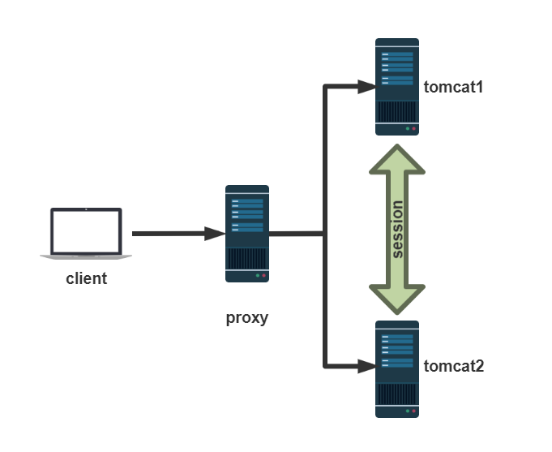
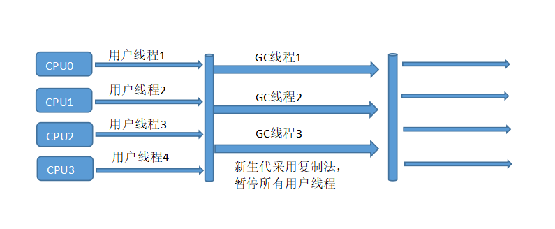
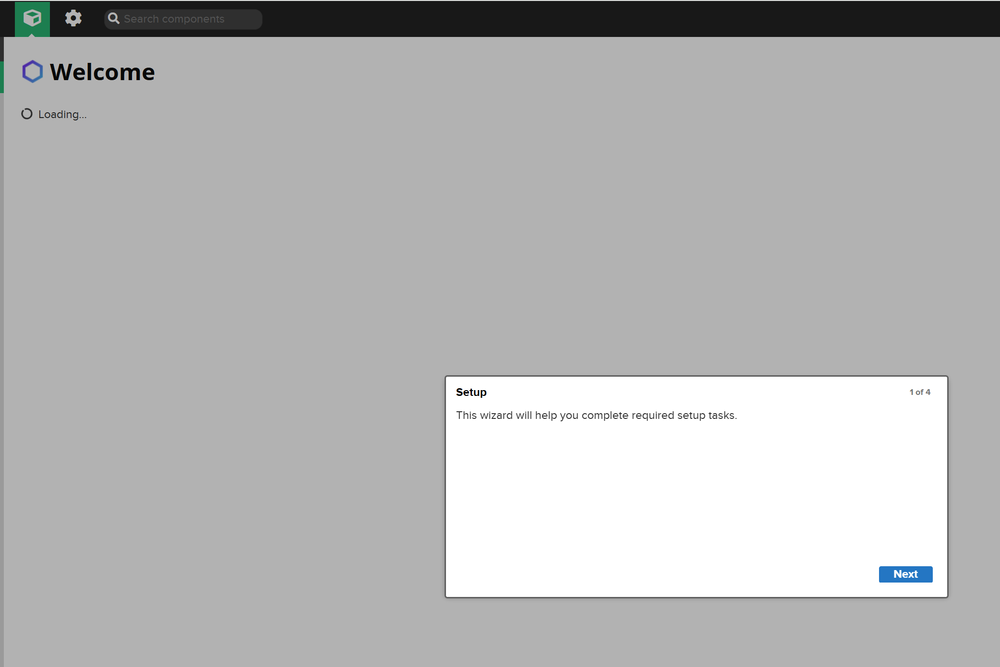
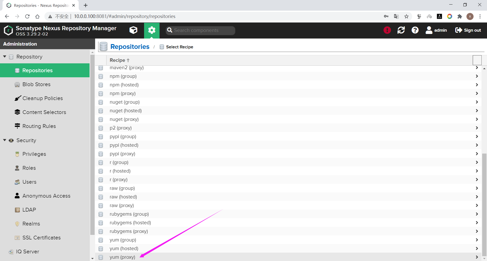

# 1 WEB技术

## 1.1 HTTP协议和B/S结构

操作系统有进程子系统，使用多进程就可以充分利用硬件资源。进程中可以多个线程，每一个线程可以 被CPU调度执行，这样就可以让程序并行的执行。这样一台主机就可以作为一个服务器为多个客户端提 供计算服务。

客户端和服务端往往处在不同的物理主机上，它们分属不同的进程，这些进程间需要通信。跨主机的进程间通信需要使用网络编程。最常见的网络编程接口是Socket。

Socket称为套接字，本意是插座。也就是说网络通讯需要两端，如果一端被动的接收另一端请求并提供 计算和数据的称为**服务器端**，另一端往往只是发起计算或数据请求，称为**客户端。**

这种编程模式称为Client/Server编程模式，简称**C/S编程**。开发的程序也称为C/S程序。C/S编程往往使 用传输层协议（TCP/UDP），较为底层，比如：QQ，迅雷, 云音乐, 云盘, foxmail，xshell等

1990年HTTP协议和浏览器诞生。在应用层使用文本跨网络在不同进程间传输数据，最后在浏览器中将 服务器端返回的HTML渲染出来。由此，诞生了网页开发。

网页是存储在WEB服务器端的文本文件，浏览器发起HTTP请求后，到达WEB服务程序后，服务程序根据URL读取对应的HTML文件，并封装成HTTP响应报文返回给浏览器端。

起初网页开发主要指的是HTML、CSS等文件制作，目的就是显示文字或图片，通过超级链接跳转到另一 个HTML并显示其内容。

后来，网景公司意识到让网页动起来很重要，傍着SUN的Java的名气发布了JavaScript语言，可以在浏览 器中使用JS引擎执行的脚本语言，可以让网页元素动态变化，网页动起来了。

为了让网页动起来，微软使用ActiveX技术、SUN的Applet都可以在浏览器中执行代码，但都有安全性问 题。能不能直接把内容直接在WEB服务器端组织成HTML，然后把HTML返回给浏览器渲染呢？

最早出现了CGI（Common Gateway Interface）通用网关接口，通过浏览器中输入URL直接映射到一个 服务器端的脚本程序执行，这个脚本可以查询数据库并返回结果给浏览器端。这种将用户请求使用程序 动态生成的技术，称为动态网页技术。先后出现了ASP、PHP、JSP等技术，这些技术的使用不同语言编 写的程序都运行在服务器端，所以称为**WEB后端编程**。有一部分程序员还是要编写HTML、CSS、 JavaScript，这些代码运行在浏览器端，称为**WEB前端编程**。合起来称为Browser/Server编程，即**B/S编程。**

## 1.2 前端三大核心技术

### 1.2.1 HTML

HTML（HyperText Markup Language）超文本标记语言，它不同于一般的编程语言。超文本即超出纯 文本的范畴，例如：描述文本颜色、大小、字体等信息，或使用图片、音频、视频等非文本内容。

HTML由一个个的标签（标记）组成，这些标签各司其职，有的提供网页信息，有的负责文字，有的负 责图片，有的负责网页布局，所以一个HTML文件，是由格式标签和数据组成。

```html
<!DOCTYPE html>
<html lang="en">
<head>
    <meta charset="UTF-8">
    <title>首页</title>
</head>
<body>
<h1>爱写代码的小男孩欢迎您</h1>
</body>
</html>
```

超文本需要显示，就得有软件能够呈现超文本定义的排版格式，例如显示：图片、表格，显示字体的大 小、颜色，这个软件就是浏览器。

超文本的诞生是为了解决纯文本不能格式显示的问题，是为了好看，但是只有通过网络才能分享超文本 的内容，所以制定了HTTP协议。

### 1.2.2 CSS（Cascading Style Sheets）层叠样式表

HTML本身为了格式化显示文本，但是当网页呈现大家面前的时候，需求HTML提供更多样式能力。这使 得HTML变得越来越臃肿。这促使了CSS的诞生。

1994年，W3C成立，CSS设计小组所有成员加入W3C，并努力研发CSS的标准，微软最终加入。

1996年12月发布CSS 1.0。

1998年5月发布CSS 2.0。

CSS 3采用了模块化思想，每个模块都在CSS 2基础上分别增强功能。所以，这些模块是陆续发布的。

不同厂家的浏览器使用的引擎，对CSS的支持不一样，导致网页布局、样式在不同浏览器不一样。因 此，想要保证不同用户使用不同浏览器看到的网页效果一直非常困难。

### 1.2.3 JavaScript

Javascript 简称JS，是一种动态的弱类型脚本解释性语言，和HTML、CSS并称三大WEB核心技术，得到 了几乎主流浏览器支持。

1994年，网景Netscape公司成立并发布了Netscape Navigator浏览器，占据了很大的市场份额，网景 意识到WEB需要动态，需要一种技术来实现。

1995年9月网景浏览器2发布测试版本发布了LiveScript，随即在12月的测试版就更名为**JavaScript**。同 时期，微软推出IE并支持JScript、VBScript，与之抗衡。

1997年，网景、微软、SUN、Borland公司和其他组织在ECMA（European Computer Manufacturers  Association 欧洲计算机制造商协会）确定了ECMAScript的本程序设计语言的标准。JavaScript和JScript 都成为ECMAScript标准的实现。

2008年后随着chrome浏览器的V8引擎发布。

V8 JS引擎不是解释执行，而是本地编译，在V8引擎做了很多优化，JS程序在其上运行堪比本地二进制程 序。V8引擎使用C++开发，可以嵌入到任何C++程序中。基于V8引擎，2009年基于服务器javascript的运 行环境Node.js诞生，创建了第一版npm (Node.js包管理器和开源库生态系统), 提供了大量的库供程序员 使用。从此，便可以在服务器端真正大规模使用JavaScript编程了。也就是说 JavaScript 也可以真正称为 服务器端编程语言了，成为目前唯一的前，后端通用的语言。

**同步**

交互式网页，用户提交了请求，就是想看到查询的结果。服务器响应到来后是一个全新的页面内容，哪 怕URL不变，整个网页都需要重新渲染。例如，用户填写注册信息，只是2次密码不一致，提交后，整个 注册页面重新刷新，所有填写项目重新填写(当然有办法让用户减少重填)。这种交互非常不友好。从代价 的角度看，就是为了注册的一点点信息，结果返回了整个网页内容，不但浪费了网络带宽，还需要浏览 器重新渲染网页，太浪费资源了，影响了用户体验和感受。上面这些请求的过程，就是同步过程，用户 发起请求，页面整个刷新，直到服务器端响应的数据到来并重新渲染。

**异步**

1996年微软实现了iframe标签，可以在一个网页使用iframe标签局部异步加载内容。

1999年微软推出异步数据传输的ActiveX插件技术，太笨重了，但是也火了很多年。有一个组件 XMLHttpRequest被大多数浏览器支持。

传统的网页如果需要更新内容，必需重载整个网页面。Ajax的出现，改变这一切，同时极大的促进了 Javascript的发展。Ajax 即"Asynchronous Javascript And XML"（异步 JavaScript 和 XML），是指一种 创建交互式、快速动态网页应用的网页开发技术，最早起源于1998年微软的Outlook Web Access开发 团队。Ajax 通过在后台与服务器进行少量数据交换， 可以使网页实现异步更新。这意味着可以在不重新 加载整个网页的情况下，对网页的某部分进行更新。Javascript 通过调用浏览器内置的WEB API中的 XMLHttpRequest 对象实现Ajax 技术。早期Ajax结合数据格式XML，目前更多的使用JSON。利用AJAX 可实现前后端开发的彻底分离，改变了传统的开发模式。

AJAX是一种技术的组合，技术的重新发现，而不是发明，但是它深远的影响了整个WEB开发。

参考资料： https://www.w3school.com.cn/ajax/index.asp

# 2 Java 基础

## 2.1 WEB架构

### 2.1.1 Web资源和访问


**PC 端或移动端浏览器访问**

从静态服务器请求HTML、CSS、JS等文件发送到浏览器端，浏览器端接收后渲染在浏览器上

从图片服务器请求图片资源显示

从业务服务器访问动态内容，动态内容是请求后有后台服务访问数据库后得到的，最终返回到浏览器端

**手机 App 访问**

内置了HTML和JS文件，不需要从静态WEB服务器下载 JS 或 HTML。为的就是减少文件的发送，现代前 端开发使用的JS文件太多或太大了

有必要就从图片服务器请求图片，从业务服务器请求动态数据

客户需求多样，更多的内容还是需要由业务服务器提供，业务服务器往往都是由一组服务器组成。

### 2.1.2 后台应用架构


#### 2.1.2.1 单体架构

- 传统架构（单机系统），一个项目一个工程：比如商品、订单、支付、库存、登录、注册等等，统 一部署，一个进程
- all in one的架构方式，把所有的功能单元放在一个应用里。然后把整个应用部署到一台服务器上。 如果负载能力不行，将整个应用进行水平复制，进行扩展，然后通过负载均衡实现访问。
- Java实现：JSP、Servlet，打包成一个jar、war文件部署
- 易于开发和测试:也十分方便部署;当需要扩展时，只需要将war复制多份，然后放到多个服务器  上，再做个负载均衡就可以了。
- 如果某个功能模块出问题，有可能全站不可访问，修改Bug后、某模块功能修改或升级后，需要停 掉整个服务，重新整体重新打包、部署这个应用war包，功能模块相互之间耦合度高,相互影响,不适 合当今互联网业务功能的快速迭代。
- 特别是对于一个大型应用，我们不可能吧所有内容都放在一个应用里面，我们如何维护、如何分工 合作都是问题。如果项目庞大，管理难度大
- web应用服务器：开源的tomcat、jetty、glassfish。商用的有weblogic、websphere、Jboss

#### 2.1.2.2 微服务

```http
https://www.martinfowler.com/microservices/
```


```http
In short, the microservice architectural style is an approach to developing a 
single application as a suite of small services, each running in its own process 
and communicating with lightweight mechanisms, often an HTTP resource API. These 
services are built around business capabilities and independently deployable by 
fully automated deployment machinery. There is a bare minimum of centralized 
management of these services, which may be written in different programming 
languages and use different data storage technologies.
简而言之，微服务架构风格是一种将单个应用程序开发为一组小服务的方法，每个小服务都在自己的进程中运
行，并与轻量级机制（通常是 HTTP 资源 API）进行通信。 这些服务是围绕业务能力构建的，并且可以通过
完全自动化的部署机制独立部署。 这些服务的集中管理极少，可以用不同的编程语言编写并使用不同的数据存
储技术。 
 											
 											-- James Lewis and Martin Fowler (2014)
```

- 属于SOA（Service Oriented Architecture）的子集,SOA可以认为面向服务的1.0版本,微服务可以 认为是面向服务的2.0版本,SOA的服务之间通过ESB(Enterprise Service Bus)进行通信,则ESB的单点依赖和商业ESB的费用问题反而成为了所有服务的瓶颈
- 微服务化的核心就是将传统的一站式应用，根据业务拆分成一个一个的服务，彻底去掉耦合，每一 个微服务提供单个业务功能，一个服务只做一件事。每个服务都围绕着具体业务进行构建，并且能 够被独立地部署到生产环境、类生产环境等
- 从技术角度讲就是一种小而独立的处理过程，类似与进程的概念，能够自行单独启动或销毁
- 微服务架构（分布式系统），各个模块/服务，各自独立出来，"让专业的人干专业的事"，独立部 署。分布式系统中，不同的服务可以使用各自独立的数据库。
- 服务之间采用轻量级的通信机制（通常是基于HTTP的RESTful API）。
- 微服务设计的思想改变了原有的企业研发团队组织架构。传统的研发组织架构是水平架构，前端、 后端、DBA、测试分别有自己对应的团队，属于水平团队组织架构。而微服务的设计思想对团队的 划分有着一定的影响，使得团队组织架构的划分更倾向于垂直架构，比如用户业务是一个团队来负 责，支付业务是一个团队来负责。但实际上在企业中并不会把团队组织架构拆分得这么绝对，垂直 架构只是一种理想的架构
- 微服务的实现框架有多种，不同的应用架构，部署方式也有不同

## 2.2 Java


### 2.2.1 Java历史

Java原指的是印度尼西亚的爪哇岛，人口众多，盛产咖啡、橡胶等。

Java语言最早是在SUN公司1991年开始设计的，最初叫Oak项目，它初衷是跑在不同机顶盒设备中的。

1993年网景公司成立。Oak项目组很快他们发现了浏览器和动态网页技术这个巨大的市场，转向WEB方 向。并首先发布了可以让网页动起来的Applet技术（浏览器中嵌入运行Java字节码的技术）。

在1995年，一杯爪哇岛咖啡成就了Java这个名字。

Sun公司第一个Java公开版本1.0发布于1996年。口号是"一次编写，到处运行"(Write once，Run  anywhere)，跨平台运行。

1999年，SUN公司发布了第二代Java平台(Java2)。

2009年4月20日，Oracle甲骨文公司宣布将以每股9.50美元，总计74亿美金收购SUN（计算机系统）公 司。2010年1月成功收购。

2010年，Java创始人之一的 James Gosling 离开了Oracle，去了Google。

>2010年8月13日，Oracle在加利福尼亚地方法院起诉Google侵犯版权和专利权。Oracle声称 Google侵犯了Java 37个API和部分专利。地方法院的陪审团认为未侵犯专利，且API无版权。
>
>2016年5月26日，地方法院二审陪审团认定未侵犯版权，对37个JAVA API的重新实现受到合理使 用的保护。
>
>2017年Oracle上诉美国联邦巡回上诉法院，2018年3月27日判决Oracle胜诉，Google应赔偿近90 亿美金。
>
>2019年1月Google想让美国最高法院撤销联邦法院裁决。谷歌表示裁决是"对软件业的毁灭性一 击"。现任特朗普政府支持Oracle公司，但微软、Mozilla、 红帽支持Google。目前案件已经受 理，但由于疫情推迟。有更多的企业和组织加入进来，包括IBM、计算机和通信协会、互联网协 会、超过150名学者和教授。
>
>此案如果Oracle胜诉，将在美国形成判例，将深远广泛影响软件业。例如: POSIX接口， 是商用系 统UNIX的兼容接口规范。
>
>2021 年 4 月 5 日，美国最高法院就 Oracle 起诉 Google 知识产权侵权案作出了判决，这场两大 科技巨头之间长达十几年的官司终于“一锤定音”：谷歌胜，甲骨文败。最高法院的判决中包含两项 关键的决议：最高法院维持下级法院的原判，并裁定 API 受版权保护。 Google 从 Java 复制  11,500 行代码的行为属于“合理使用”。

### 2.2.2 Java 组成

java包含下面部分：

- 语言、语法规范。关键字,如: if、for、class等
- 源代码 source code
- 依赖库，标准库(基础)、第三方库(针对某些应用)。底层代码太难使用且开发效率低，封装成现成的 库
- JVM虚拟机。将源代码编译为中间码即字节码后,再运行在JVM之上


由于各种操作系统ABI不一样，采用编译方式，需要为不同操作系统编译成相应格式的二进制程序才能运 行。

1995年，Java发布Applet技术，Java程序在后台编译成字节码，发送到浏览器端，在浏览器中运行一个 Applet程序，这段程序是运行在另外一个JVM进程中的。

但是这种在客户端运行Java代码的技术，会有很大的安全问题。1997年CGI技术发展起来，动态网页技 术开始向后端开发转移，在后端将动态内容组织好，拼成HTML发回到浏览器端。

### 2.2.3 Java动态网页技术

#### 2.2.3.1 servlet

本质就是一段Java程序

```java
import java.io.*;
import javax.servlet.*;
import javax.servlet.http.*;
public class HelloWorld extends HttpServlet {
  private String message;
  public void init() throws ServletException
 {
      message = "Hello World";
 }
  public void doGet(HttpServletRequest request,
                    HttpServletResponse response)
            throws ServletException, IOException
 {
      response.setContentType("text/html"); //响应报文内容类型
      PrintWriter out = response.getWriter();  //构建响应报文内容
      out.println("<h1>" + message + "</h1>");
      out.println("<p><a href=http://www.wang.org>爱写代码的小男孩</a>欢迎你</p>");
 }
  
  public void destroy()
 {
 }
}
```

在Servlet中最大的问题是，HTML输出和Java代码混在一起，如果网页布局要调整，Java源代码就需要 随之进行调整,对于开发人员来说就是个噩梦。

#### 2.2.3.2 jsp（Java Server Pages）

JSP本质是提供一个HTML模板，也就是在网页中预留以后填充的空，后续将Java程序运行生成的数据对 HTML进行填空就可以了。如果网页布局需要调整,JAVA源代码不需要很大的调整

```html
<%@ page language="java" contentType="text/html; charset=UTF-8"
    pageEncoding="UTF-8"%>
<!DOCTYPE html>
<html>
<head>
    <meta charset="utf-8">
    <title>jsp例子</title>
</head>
<body>
本行后面的内容是服务器端动态生成字符串，最后拼接在一起
<%
out.println("你的 IP 地址 " + request.getRemoteAddr());
%>
</body>
</html>
```

JSP是基于Servlet实现，JSP将表现和逻辑分离，这样页面开发人员更好的注重页面表现力更好服务客户。

不过最终 JSP 还需要先转换为 Servlet的源代码.java文件（Tomcat中使用Jasper转换），只不过这个转 换过程无需人工完成,是通过工具自动实现的,然后再编译成.class文件，最后才可以在JVM中运行。

比如: 浏览器第一次请求test.jsp时, Tomcat服务器会自动将test.jsp转化成test.jsp.java这么一个类,并将 该文件编译成class文件。编译完毕后再运行class文件来响应浏览器的请求。如果以后访问test.jsp就不 再重新编译jsp文件了，直接调用class文件来响应浏览器。后续如果Tomcat检测到JSP页面改动了的话， 会重新编译

JSP类似于PHP和ASP,前端代码和后端JAVA代码混写在一起,需要前端和后端工程师在一起协作才能完成, 无法做到真正的前后端分离开发

在web早期的开发中，通常采用的分为两层，视图层和模型层。


优点：架构简单，比较适合小型项目开发

缺点：JSP职责不单一，职责过重，不便于维护

#### 2.2.3.3 MVC

如果过度使用jsp技术,jsp中既写有大量的java代码，也有html，甚至还有javascript等，造成难以维护， 难以实现前后端分工协作，后来java 的web开发借鉴了MVC（Model View Controller ）开发模式，

MVC是模型(Model)、视图(View)、控制器(Controller)的简写，是一种软件设计规范。是将业务逻辑、 数据、显示分离的方法来组织代码。MVC主要作用是降低了视图与业务逻辑间的双向偶合。

MVC不是一种设计模式，MVC是一种架构模式。当然不同的MVC存在差异。

- Model（模型）：数据模型，提供要展示的数据，因此包含数据和行为，可以认为是领域模型或 JavaBean组件（包含数据和行为），不过现在一般都分离开来：Value Object（数据Dao） 和 服 务层（行为Service）。也就是模型提供了模型数据查询和模型数据的状态更新等功能，包括数据和 业务。
- View（视图）：负责进行模型的展示，一般就是我们见到的用户界面，客户想看到的东西。可通过 JSP实现
- Controller（控制器）：接收用户请求，委托给模型进行处理（状态改变），处理完毕后把返回的 模型数据返回给视图，由视图负责展示。也就是说控制器做了个调度员的工作。最终表现为Servlet

最典型的MVC就是JSP + servlet + javabean的模式。


**职责分析：**

**Controller：控制器**

- 取得表单数据
- 调用业务逻辑
- 转向指定的页面

**Model：模型**

- 业务逻辑
- 保存数据的状态

**View：视图**

- 显示页面

**处理流程**

1.  用户发请求
2. Servlet接收请求数据，并调用对应的业务逻辑方法
3. 业务处理完毕，返回更新后的数据给servlet
4. servlet转向到JSP，由JSP来渲染页面
5. 响应给前端更新后的页面


MVC模式也有以下不足：

- 每次请求必须经过"控制器->模型->视图"这个流程，用户才能看到最终的展现界面，这个过程似乎 有些复杂
- 实际上视图是依赖于模型的，换句话说，如果没有模型，视图也无法呈现出最终的效果
- 渲染视图过程是在服务端来完成的，最终呈现给浏览器的是带有模型的视图页面，性能无法得到很 好的优化

#### 2.2.3.4 REST

为了使数据展现过程更加直接，并且提供更好的用户体验，对MVC模式进行改进。首先从浏览器发送 AJAX（ Asynchronous JavaScript and XML 异步的 JavaScript 和 XML）请求，然后服务端接受该请求 并返回JSON数据返回给浏览器，最后在浏览器中进行界面渲染。改进后的MVC模式如下图所示：


也就是说，我们输入的是AJAX请求，输出的是JSON数据，REST技术实现这样的功能。

REST(Representational State Transfer表述性状态转移，全称是 Resource Representational State  Transfer

即资源在网络中以某种表现形式进行状态转移。

分解开来：Resource：资源，即数据

Representational：某种表现形式，比如用JSON，XML，JPEG等

State Transfer：状态变化。通过HTTP动词实现

它是Roy Fielding博士在2000年写的一篇关于软件架构风格的论文，后来国内外许多知名互联网公司纷 纷开始采用这种轻量级的Web服务，大家习惯将其称为RESTful Web Services，或简称REST服务。

如果将浏览器这一端视为前端，而服务器那一端视为后端的话，可以将以上改进后的MVC模式简化为以 下前后端分离模式，如下图所示：


可见，采用REST风格的架构可以使得前端关注界面展现，后端关注业务逻辑，分工明确，职责清晰。

在设计web接口的时候，REST主要是用于定义接口名，接口名一般是用名次写，不用动词，那怎么表达 “获取”或者“删除”或者“更新”这样的操作呢——用请求类型来区分。

比如，我们有一个friends接口，对于“朋友”我们有增删改查四种操作，怎么定义REST接口？

增加一个朋友，uri: generalcode.cn/v1/friends 接口类型：POST

删除一个朋友，uri: generalcode.cn/va/friends 接口类型：DELETE

修改一个朋友，uri: generalcode.cn/va/friends 接口类型：PUT

查找朋友，uri: generalcode.cn/va/friends 接口类型：GET

上面我们定义的四个接口就是符合REST协议的，请注意，这几个接口都没有动词，只有名词friends，都 是通过Http请求的接口类型来判断是什么业务操作。

REST就是一种设计API的模式。最常用的数据格式是JSON。由于JSON能直接被JavaScript读取，所以， 以JSON格式编写的REST风格的API具有简单、易读、易用的特点。

编写API有什么好处呢？由于API就是把Web App的功能全部封装了，所以，通过API操作数据，可以极 大地把前端和后端的代码隔离，使得后端代码易于测试，前端代码编写更简单。离。前端拿到数据只负 责展示和渲染，不对数据做任何处理。后端处理数据并以JSON格式传输出去，定义这样一套统一的接 口，在web，ios，android三端都可以用相同的接口，通过客户端访问API，就可以完成通过浏览器页面 提供的功能，而后端代码基本无需改动。

### 2.2.4 JDK

#### 2.2.4.1 JDK和JRE

##### 2.2.4.1.1 JDK 和 JRE 关系


**Java SE API**: Java 基础类库开发接口

**JRE**：Java Runtime Environment缩写，指Java运行时环境， 包含 JVM + Java核心类库

**JDK：**Java Development Kit，即 Java 语言的软件开发工具包,JDK协议基于 JRL(JavaResearch License) 协议


##### 2.2.4.1.2 JVM 的各种版本

参考链接：

https://en.wikipedia.org/wiki/List_of_Java_virtual_machines

https://en.wikipedia.org/wiki/Comparison_of_Java_virtual_machines

各个公司和组织基于标准规范,开发了不同的JVM版本

- SUN HotSpot
- IBM J9VM
- BEA JRockit

**JVM 市场份额**

2018年12月，由 Snyk 和 The Java Magazine 联合推出发布的 2018 JVM 生态调查报告


#### 2.2.4.2 Oracle JDK版本


JDK也就是常说的J2SE，在1999年，正式发布了Java第二代平台，发布了三个版本：

- J2SE：标准版，适用于桌面平台
- J2EE：企业版，java在企业级开发所有规范的总和，共有13个大的规范,Servlet、Jsp都包含在 JavaEE规范中
- J2ME：微型版，适用于移动、无线、机顶盒等设备环境

2005年，Java的版本又更名为JavaSE、JavaEE、JavaME

**JDK7、JDK8、JDK11、JDK17是LTS（Long Term Support）**

**JDK 历史版本**

https://en.wikipedia.org/wiki/Java_version_history


**时间-事件轴**

>1995年5月23日，Java语言诞生
>
>1996年1月，第一个JDK-JDK1.0诞生
>
>1996年4月，10个最主要的操作系统供应商申明将在其产品中嵌入JAVA技术
>
>1996年9月，约8.3万个网页应用了JAVA技术来制作
>
>1997年2月18日，JDK1.1发布
>
>1997年4月2日，JavaOne会议召开，参与者逾一万人，创当时全球同类会议规模之纪录
>
>1997年9月，JavaDeveloperConnection社区成员超过十万
>
>1998年2月，JDK1.1被下载超过2,000,000次
>
>1998年12月8日，JAVA2企业平台J2EE发布
>
>1999年6月，SUN公司发布Java的三个版本：标准版、企业版和微型版（J2SE、J2EE、J2ME）
>
>2000年5月8日，JDK1.3发布 
>
>2000年5月29日，JDK1.4发布 
>
>2001年6月5日，NOKIA宣布，到2003年将出售1亿部支持Java的手机
>
>2001年9月24日，J2EE1.3发布
>
>2002年2月13日，J2SE1.4发布，自此Java的计算能力有了大幅提升。
>
>2004年9月30日18:00PM，J2SE1.5发布，是Java语言的发展史上的又一里程碑事件。为了表示这 个版本的重要性，J2SE1.5更名为J2SE5.0
>
>2005年6月，JavaOne大会召开，SUN公司公开Java SE 6。此时，Java的各种版本已经更名以取消 其中的数字"2"：J2EE更名为Java EE, J2SE更名为Java SE，J2ME更名为Java ME。
>
>2006年11月13日，SUN公司宣布Java全线采纳GNU General Public License Version 2，从而公 开了Java的源代码。

**JDK 版本使用情况**

数据来源

```http
https://www.baeldung.com/java-in-2019
```


**收费**

从2019年1月份开始，Oracle JDK 开始对 Java SE 8 之后的版本开始进行商用收费，确切的说是  8u201/202 之后的版本。如果你用 Java 开发的功能如果是用作商业用途的，如果还不想花钱购买的 话，能免费使用的最新版本是 8u201/202。当然如果是个人客户端或者个人开发者可以免费试用 Oracle  JDK 所有的版本。

**发版方式**

在 JDK 9 发布之前，Oracle 的发版策略是以特性驱动的，只有重大的特性改变才会发布大版本，比如  JDK 7 到 JDK 8，中间会发多个更新版本。而从 JDK 9 开始变为以时间驱动的方式。发布周期为6个月一 个大版本，比如 JDK 9 到 JDK 10，3个月一次补丁版，3年一个 LTS(长期支持版本)。

#### 2.2.4.3 OpenJDK

##### 2.2.4.3.1 OpenJDK 介绍


OpenJDK是Sun公司采用GPL v2协议发布的JDK开源版本，于2009年正式发布。


官方网站：https://openjdk.java.net/projects/jdk6/

OpenJDK 7是基于JDK7的beta版开发，但为了也将Java SE 6开源，从OpenJDK7的b20构建反向分支开 发，从中剥离了不符合Java SE 6规范的代码，发布OpenJDK 6。所以OpenJDK6和JDK6没什么关系,只是 API兼容而已

OpenJDK使用GPL v2可以用于商业用途。目前由红帽维护。OpenJDK也有在其基础上的众多发行版，比 如阿里的Dragonwell。

相对来说,Oracle jDK具有更好的响应能力和JVM性能，更加稳定。

范例: ubuntu2204 安装 openjdk

```bash
root@ubutun2204-1:~# apt update
root@ubutun2204-1:~# apt list | grep openjdk
openjdk-11-dbg/jammy-updates,jammy-security 11.0.25+9-1ubuntu1~22.04 amd64
openjdk-11-demo/jammy-updates,jammy-security 11.0.25+9-1ubuntu1~22.04 amd64
openjdk-11-doc/jammy-updates,jammy-security 11.0.25+9-1ubuntu1~22.04 all
openjdk-11-jdk-headless/jammy-updates,jammy-security 11.0.25+9-1ubuntu1~22.04 amd64
openjdk-11-jdk/jammy-updates,jammy-security 11.0.25+9-1ubuntu1~22.04 amd64
openjdk-11-jre-dcevm/jammy 11.0.12+7-1 amd64
openjdk-11-jre-headless/jammy-updates,jammy-security 11.0.25+9-1ubuntu1~22.04 amd64
openjdk-11-jre-zero/jammy-updates,jammy-security 11.0.25+9-1ubuntu1~22.04 amd64
openjdk-11-jre/jammy-updates,jammy-security 11.0.25+9-1ubuntu1~22.04 amd64
openjdk-11-source/jammy-updates,jammy-security 11.0.25+9-1ubuntu1~22.04 all
openjdk-17-dbg/jammy-updates,jammy-security 17.0.13+11-2ubuntu1~22.04 amd64
openjdk-17-demo/jammy-updates,jammy-security 17.0.13+11-2ubuntu1~22.04 amd64
openjdk-17-doc/jammy-updates,jammy-security 17.0.13+11-2ubuntu1~22.04 all
openjdk-17-jdk-headless/jammy-updates,jammy-security 17.0.13+11-2ubuntu1~22.04 amd64
openjdk-17-jdk/jammy-updates,jammy-security 17.0.13+11-2ubuntu1~22.04 amd64
openjdk-17-jre-headless/jammy-updates,jammy-security 17.0.13+11-2ubuntu1~22.04 amd64
openjdk-17-jre-zero/jammy-updates,jammy-security 17.0.13+11-2ubuntu1~22.04 amd64
openjdk-17-jre/jammy-updates,jammy-security 17.0.13+11-2ubuntu1~22.04 amd64
openjdk-17-source/jammy-updates,jammy-security 17.0.13+11-2ubuntu1~22.04 all
openjdk-18-dbg/jammy-updates,jammy-security 18.0.2+9-2~22.04 amd64
openjdk-18-demo/jammy-updates,jammy-security 18.0.2+9-2~22.04 amd64
openjdk-18-doc/jammy-updates,jammy-security 18.0.2+9-2~22.04 all
openjdk-18-jdk-headless/jammy-updates,jammy-security 18.0.2+9-2~22.04 amd64
openjdk-18-jdk/jammy-updates,jammy-security 18.0.2+9-2~22.04 amd64
openjdk-18-jre-headless/jammy-updates,jammy-security 18.0.2+9-2~22.04 amd64
openjdk-18-jre-zero/jammy-updates,jammy-security 18.0.2+9-2~22.04 amd64
openjdk-18-jre/jammy-updates,jammy-security 18.0.2+9-2~22.04 amd64
openjdk-18-source/jammy-updates,jammy-security 18.0.2+9-2~22.04 all
openjdk-19-dbg/jammy-updates,jammy-security 19.0.2+7-0ubuntu3~22.04 amd64
openjdk-19-demo/jammy-updates,jammy-security 19.0.2+7-0ubuntu3~22.04 amd64
openjdk-19-doc/jammy-updates,jammy-security 19.0.2+7-0ubuntu3~22.04 all
openjdk-19-jdk-headless/jammy-updates,jammy-security 19.0.2+7-0ubuntu3~22.04 amd64
openjdk-19-jdk/jammy-updates,jammy-security 19.0.2+7-0ubuntu3~22.04 amd64
openjdk-19-jre-headless/jammy-updates,jammy-security 19.0.2+7-0ubuntu3~22.04 amd64
openjdk-19-jre-zero/jammy-updates,jammy-security 19.0.2+7-0ubuntu3~22.04 amd64
openjdk-19-jre/jammy-updates,jammy-security 19.0.2+7-0ubuntu3~22.04 amd64
openjdk-19-source/jammy-updates,jammy-security 19.0.2+7-0ubuntu3~22.04 all
openjdk-21-dbg/jammy-updates,jammy-security 21.0.5+11-1ubuntu1~22.04 amd64
openjdk-21-demo/jammy-updates,jammy-security 21.0.5+11-1ubuntu1~22.04 amd64
openjdk-21-doc/jammy-updates,jammy-security 21.0.5+11-1ubuntu1~22.04 all
openjdk-21-jdk-headless/jammy-updates,jammy-security 21.0.5+11-1ubuntu1~22.04 amd64
openjdk-21-jdk/jammy-updates,jammy-security 21.0.5+11-1ubuntu1~22.04 amd64
openjdk-21-jre-headless/jammy-updates,jammy-security 21.0.5+11-1ubuntu1~22.04 amd64
openjdk-21-jre-zero/jammy-updates,jammy-security 21.0.5+11-1ubuntu1~22.04 amd64
openjdk-21-jre/jammy-updates,jammy-security 21.0.5+11-1ubuntu1~22.04 amd64
openjdk-21-source/jammy-updates,jammy-security 21.0.5+11-1ubuntu1~22.04 all
openjdk-21-testsupport/jammy-updates,jammy-security 21.0.5+11-1ubuntu1~22.04 amd64
openjdk-8-dbg/jammy-updates,jammy-security 8u432-ga~us1-0ubuntu2~22.04 amd64
openjdk-8-demo/jammy-updates,jammy-security 8u432-ga~us1-0ubuntu2~22.04 amd64
openjdk-8-doc/jammy-updates,jammy-security 8u432-ga~us1-0ubuntu2~22.04 all
openjdk-8-jdk-headless/jammy-updates,jammy-security 8u432-ga~us1-0ubuntu2~22.04 amd64
openjdk-8-jdk/jammy-updates,jammy-security 8u432-ga~us1-0ubuntu2~22.04 amd64
openjdk-8-jre-headless/jammy-updates,jammy-security 8u432-ga~us1-0ubuntu2~22.04 amd64
openjdk-8-jre-zero/jammy-updates,jammy-security 8u432-ga~us1-0ubuntu2~22.04 amd64
openjdk-8-jre/jammy-updates,jammy-security 8u432-ga~us1-0ubuntu2~22.04 amd64
openjdk-8-source/jammy-updates,jammy-security 8u432-ga~us1-0ubuntu2~22.04 all

root@ubutun2204-1:~# apt -y install openjdk-11-jdk
root@ubutun2204-1:~# java -version
openjdk version "11.0.25" 2024-10-15
OpenJDK Runtime Environment (build 11.0.25+9-post-Ubuntu-1ubuntu122.04)
OpenJDK 64-Bit Server VM (build 11.0.25+9-post-Ubuntu-1ubuntu122.04, mixed mode, sharing)
```

#### 2.2.4.4 安装 Oracle 官方 JDK

官方下载链接: 

```bash
#注意需要注册登录后,才能下载JDK
https://www.oracle.com/java/technologies/downloads/#java8
https://www.oracle.com/java/technologies/downloads/#java11
https://www.oracle.com/java/technologies/javase/javase-jdk8-downloads.html
```


##### 2.2.4.4.1 Oracle JDK 的 rpm安装

```bash
[root@centos8 ~]#ls -lh jdk-8u241-linux-x64.rpm
-rw-r--r-- 1 root root 171M Feb  8 18:29 jdk-8u241-linux-x64.rpm


#安装jdk，无相关依赖包
[root@centos8 ~]#dnf -y install jdk-8u241-linux-x64.rpm
[root@centos8 ~]#java -version
java version "1.8.0_241"
Java(TM) SE Runtime Environment (build 1.8.0_241-b07)
Java HotSpot(TM) 64-Bit Server VM (build 25.241-b07, mixed mode)

#初始化环境变量
[root@centos8 ~]#vim /etc/profile.d/jdk.sh
[root@centos8 ~]#cat /etc/profile.d/jdk.sh
export JAVA_HOME=/usr/java/default
export PATH=$JAVA_HOME/bin:$PATH
#以下两项非必须项
export JRE_HOME=$JAVA_HOME/jre   
export CLASSPATH=$JAVA_HOME/lib/:$JRE_HOME/lib/ 

[root@centos8 ~]#. /etc/profile.d/jdk.sh

#查看jdk信息
[root@centos8 ~]#which java
/usr/bin/java
[root@centos8 ~]#ll /usr/bin/java
lrwxrwxrwx 1 root root 22 Feb  8 18:35 /usr/bin/java -> /etc/alternatives/java
[root@centos8 ~]#ll /etc/alternatives/java
lrwxrwxrwx 1 root root 41 Feb  8 18:35 /etc/alternatives/java -> 
/usr/java/jdk1.8.0_241-amd64/jre/bin/java

[root@centos8 ~]#rpm -q --scripts jdk-8u241-linux-x64.rpm

#查看到安装目录为/usr/java下
[root@centos8 ~]#rpm -ql jdk-8u241-linux-x64.rpm |less
warning: jdk-8u241-linux-x64.rpm: Header V3 RSA/SHA256 Signature, key ID 
ec551f03: NOKEY
/usr
/usr/java
/usr/java/jdk1.8.0_241-amd64
/usr/java/jdk1.8.0_241-amd64/.java
/usr/java/jdk1.8.0_241-amd64/.java/.systemPrefs
/usr/java/jdk1.8.0_241-amd64/.java/.systemPrefs/.system.lock
/usr/java/jdk1.8.0_241-amd64/.java/.systemPrefs/.systemRootModFile
/usr/java/jdk1.8.0_241-amd64/.java/init.d
......

[root@centos8 ~]#ll /usr/java/
total 0
lrwxrwxrwx 1 root root  16 Feb  8 18:35 default -> /usr/java/latest
drwxr-xr-x 8 root root 258 Feb  8 18:35 jdk1.8.0_241-amd64
lrwxrwxrwx 1 root root  28 Feb  8 18:35 latest -> /usr/java/jdk1.8.0_241-amd64
```

##### 2.2.4.4.2 Oracle JDK的二进制文件安装

```bash
root@ubutun2204-1:~# wget https://download.oracle.com/otn/java/jdk/11.0.25%2B9/60e5d03cc24a4e1c8ab5d29303dbe066/jdk-11.0.25_linux-x64_bin.tar.gz

root@ubutun2204-1:~# tar xf jdk-11.0.19_linux-x64_bin.tar.gz -C /usr/local/
root@ubutun2204-1:~# cd /usr/local/
root@ubutun2204-1:/usr/local# ln -sv jdk-11.0.19/ jdk


# 初始化环境变量
root@ubutun2204-1:~# vim /etc/profile.d/jdk.sh
root@ubutun2204-1:~# cat  /etc/profile.d/jdk.sh
export JAVA_HOME=/usr/local/jdk
export PATH=$PATH:$JAVA_HOME/bin
#以下两项非必须项
export JRE_HOME=$JAVA_HOME/jre 
export CLASSPATH=.:$JAVA_HOME/lib/:$JRE_HOME/lib/

root@ubutun2204-1:~# . /etc/profile.d/jdk.sh

#验证安装
root@ubutun2204-1:~# java -version
java version "11.0.19" 2023-04-18 LTS
Java(TM) SE Runtime Environment 18.9 (build 11.0.19+9-LTS-224)
Java HotSpot(TM) 64-Bit Server VM 18.9 (build 11.0.19+9-LTS-224, mixed mode)
root@ubutun2204-1:~# which java
/usr/local/jdk/bin/java
```

##### 2.3.4.4.3 一键安装二进制的JDK

```bash
root@ubutun2204-1:~# cat install_jdk.sh 
#!/bin/bash

JDK_FILE="jdk-8u371-linux-x64.tar.gz"
#JDK_FILE="jdk-8u361-linux-x64.tar.gz"
#JDK_FILE="jdk-11.0.17_linux-x64_bin.tar.gz"
#JDK_FILE="jdk-11.0.15.1_linux-x64_bin.tar.gz"
#JDK_FILE="jdk-11.0.12_linux-x64_bin.tar.gz"
#JDK_FILE="jdk-8u301-linux-x64.tar.gz"


JDK_DIR="/usr/local"

DIR=`pwd`

color () {
    RES_COL=60
    MOVE_TO_COL="echo -en \\033[${RES_COL}G"
    SETCOLOR_SUCCESS="echo -en \\033[1;32m"
    SETCOLOR_FAILURE="echo -en \\033[1;31m"
    SETCOLOR_WARNING="echo -en \\033[1;33m"
    SETCOLOR_NORMAL="echo -en \E[0m"
    echo -n "$2" && $MOVE_TO_COL
    echo -n "["
    if [ $1 = "success" -o $1 = "0" ] ;then
        ${SETCOLOR_SUCCESS}
        echo -n $"  OK  "    
    elif [ $1 = "failure" -o $1 = "1"  ] ;then
        ${SETCOLOR_FAILURE}
        echo -n $"FAILED"
    else
        ${SETCOLOR_WARNING}
        echo -n $"WARNING"
    fi
    ${SETCOLOR_NORMAL}
    echo -n "]"
    echo                                                                                                                              
}

install_jdk(){
if  [ ! -f "$DIR/$JDK_FILE" ];then
	color 1  "$JDK_FILE 文件不存在" 
	exit; 
elif [ -d $JDK_DIR/jdk ];then
    color 1  "JDK 已经安装" 
    exit
else 
    [ -d "$JDK_DIR" ] || mkdir -pv $JDK_DIR
fi
tar xvf $DIR/$JDK_FILE  -C $JDK_DIR
cd  $JDK_DIR && ln -s jdk* jdk 

cat >  /etc/profile.d/jdk.sh <<EOF
export JAVA_HOME=$JDK_DIR/jdk
export PATH=\$PATH:\$JAVA_HOME/bin
#export JRE_HOME=\$JAVA_HOME/jre
#export CLASSPATH=.:\$JAVA_HOME/lib/:\$JRE_HOME/lib/
EOF
.  /etc/profile.d/jdk.sh
java -version && color 0  "JDK 安装完成" || { color 1  "JDK 安装失败" ; exit; }

}

install_jdk
```

# 3 Tomcat 基础功能


## 3.1 Tomcat 历史和介绍

### 3.1.1 WEB 应用服务器

**Web 应用服务器的使用**

数据来源

```bash
https://www.baeldung.com/java-in-2019
```


- 商用：IBM WebSphere、Oracle WebLogic（原属于BEA公司）、Oracle Oc4j、RedHat JBoss等
- 开源：Tomcat、Jetty、Resin、Glassfish

### 3.1.2 Tomcat 介绍

Tomcat 服务器是一个免费的开放源代码的Web 应用服务器，属于轻量级应用服务器，在中小型系统和 并发访问用户不是很多的场合下被普遍使用，Tomcat 具有处理HTML静态资源页面的功能，它还是一个 Servlet和JSP容器。

起始于SUN 公司的一个Servlet的参考实现项目 Java Web Server，开发者是 James Duncan  Davidson，在1999年，将项目贡献给了apache软件基金会（ASF），和ASF现有的项目 JServ 合并，并 开源成为顶级项目

Tomcat 仅仅实现了Java EE规范中与Servlet、JSP相关的类库，是JavaEE不完整实现。

著名图书出版商O'Reilly约稿该项目成员Davidson希望使用一个公猫作为封面，但是公猫已经被使用， 书出版后封面是一只雪豹。

《Tomcat权威指南》封面如下


1999年发布初始版本是Tomcat 3.0，实现了Servlet 2.2 和 JSP 1.1规范。

Tomcat 4.x发布时，内建了Catalina（Servlet容器）和 Jasper（JSP engine）等

当前 Tomcat 的正式版本已经更新到 11.0.x 版本，但当前企业中主流版本为 8.x 和 9.x 

官网： http://tomcat.apache.org/

官网文档: https://tomcat.apache.org/tomcat-8.5-doc/index.html

帮助文档:

https://cwiki.apache.org/confluence/display/tomcat/

https://cwiki.apache.org/confluence/display/tomcat/FAQ

### 3.1.3 Tomcat 各版本区别

官方文档：https://tomcat.apache.org/whichversion.html


## 3.2 Tomcat 安装

### 3.2.1 基于包安装 Tomcat

#### 3.2.1.1 Ubuntu 包安装 tomcat

范例: Ubuntu22.04 安装 tomcat9

```bash
root@ubutun2204-1:~# apt list |grep tomcat

WARNING: apt does not have a stable CLI interface. Use with caution in scripts.

libtomcat9-embed-java/jammy-updates 9.0.58-1ubuntu0.1 all
libtomcat9-java/jammy-updates 9.0.58-1ubuntu0.1 all
libtomcatjss-java/jammy 8.0.0-2 all
tomcat-jakartaee-migration/jammy 0.2.0-1 all
tomcat9-admin/jammy-updates 9.0.58-1ubuntu0.1 all
tomcat9-common/jammy-updates 9.0.58-1ubuntu0.1 all
tomcat9-docs/jammy-updates 9.0.58-1ubuntu0.1 all
tomcat9-examples/jammy-updates 9.0.58-1ubuntu0.1 all
tomcat9-user/jammy-updates 9.0.58-1ubuntu0.1 all
tomcat9/jammy-updates 9.0.58-1ubuntu0.1 all

root@ubutun2204-1:~# apt update && apt -y install tomcat9 tomcat9-admin tomcat9-docs tomcat9-examples

root@ubutun2204-1:~# ss -ntlp | grep 8080
LISTEN 0      100                *:8080            *:*    users:(("java",pid=4595,fd=37)) 
```


### 3.2.2 二进制安装 Tomcat

这里安装Tomcat 10.1.X版本，推荐从Apache官网下载二进制tomcat包进行安装，这也是生产环境常用的方式。

#### 3.2.2.1 下载并安装

**注意: 安装tomcat 前必须先部署JDK**

官方和镜像站点下载: 

```bash
https://tomcat.apache.org/download-80.cgi
https://mirrors.tuna.tsinghua.edu.cn/apache/tomcat/
```


```bash
#安装Tomcat之前先安装Java

#官网或镜像网站下载：
wget https://dlcdn.apache.org/tomcat/tomcat-10/v10.1.34/bin/apache-tomcat-10.1.34.tar.gz

root@ubutun2204-1:~# tar xf apache-tomcat-10.1.34.tar.gz -C /usr/local/
root@ubutun2204-1:~# cd /usr/local/
root@ubutun2204-1:/usr/local# ln -sv apache-tomcat-10.1.34/ tomcat

#指定PATH变量
root@ubutun2204-1:~# echo 'PATH=/usr/local/tomcat/bin:$PATH' > /etc/profile.d/tomcat.sh
root@ubutun2204-1:~# . /etc/profile.d/tomcat.sh 
root@ubutun2204-1:~# echo $PATH
/usr/local/tomcat/bin:/usr/local/sbin:/usr/local/bin:/usr/sbin:/usr/bin:/sbin:/bin:/usr/games:/usr/local/games:/snap/bin:/usr/local/jdk/bin

#查看当前变量设置和命令用法
root@ubutun2204-1:~# catalina.sh 
Using CATALINA_BASE:   /usr/local/tomcat
Using CATALINA_HOME:   /usr/local/tomcat
Using CATALINA_TMPDIR: /usr/local/tomcat/temp
Using JRE_HOME:        /usr/local/jdk
Using CLASSPATH:       /usr/local/tomcat/bin/bootstrap.jar:/usr/local/tomcat/bin/tomcat-juli.jar
Using CATALINA_OPTS:   
Usage: catalina.sh ( commands ... )
commands:
  debug             Start Catalina in a debugger
  debug -security   Debug Catalina with a security manager
  jpda start        Start Catalina under JPDA debugger
  run               Start Catalina in the current window
  run -security     Start in the current window with security manager
  start             Start Catalina in a separate window
  start -security   Start in a separate window with security manager
  stop              Stop Catalina, waiting up to 5 seconds for the process to end
  stop n            Stop Catalina, waiting up to n seconds for the process to end
  stop -force       Stop Catalina, wait up to 5 seconds and then use kill -KILL if still running
  stop n -force     Stop Catalina, wait up to n seconds and then use kill -KILL if still running
  configtest        Run a basic syntax check on server.xml - check exit code for result
  version           What version of tomcat are you running?

#查看环境变量和版本信息
root@ubutun2204-1:~# catalina.sh version
Using CATALINA_BASE:   /usr/local/tomcat
Using CATALINA_HOME:   /usr/local/tomcat
Using CATALINA_TMPDIR: /usr/local/tomcat/temp
Using JRE_HOME:        /usr/local/jdk
Using CLASSPATH:       /usr/local/tomcat/bin/bootstrap.jar:/usr/local/tomcat/bin/tomcat-juli.jar
Using CATALINA_OPTS:   
Server version: Apache Tomcat/10.1.34
Server built:   Dec 5 2024 16:01:16 UTC
Server number:  10.1.34.0
OS Name:        Linux
OS Version:     5.15.0-112-generic
Architecture:   amd64
JVM Version:    11.0.19+9-LTS-224
JVM Vendor:     Oracle Corporation


#启动tomcat
root@ubutun2204-1:~# startup.sh 
Using CATALINA_BASE:   /usr/local/tomcat
Using CATALINA_HOME:   /usr/local/tomcat
Using CATALINA_TMPDIR: /usr/local/tomcat/temp
Using JRE_HOME:        /usr/local/jdk
Using CLASSPATH:       /usr/local/tomcat/bin/bootstrap.jar:/usr/local/tomcat/bin/tomcat-juli.jar
Using CATALINA_OPTS:   
Tomcat started.

#查看端口
root@ubutun2204-1:~# ss -ntl
State                        Recv-Q                       Send-Q                                                  Local Address:Port                                             Peer Address:Port                      Process                       
LISTEN                       0                            128                                                         127.0.0.1:6010                                                  0.0.0.0:*                                                       
LISTEN                       0                            128                                                           0.0.0.0:22                                                    0.0.0.0:*                                                       
LISTEN                       0                            4096                                                    127.0.0.53%lo:53                                                    0.0.0.0:*                                                       
LISTEN                       0                            1                                                  [::ffff:127.0.0.1]:8005                                                        *:*                                                       
LISTEN                       0                            128                                                             [::1]:6010                                                     [::]:*                                                       
LISTEN                       0                            128                                                              [::]:22                                                       [::]:*                                                       
LISTEN                       0                            100                                                                 *:8080                                                        *:*  

#查看进程是以root启动的
root@ubutun2204-1:~# ps aux|grep tomcat
root        7618  5.4  5.5 3061088 110180 pts/0  Sl   07:28   0:03 /usr/local/jdk/bin/java -Djava.util.logging.config.file=/usr/local/tomcat/conf/logging.properties -Djava.util.logging.manager=org.apache.juli.ClassLoaderLogManager -Djdk.tls.ephemeralDHKeySize=2048 -Djava.protocol.handler.pkgs=org.apache.catalina.webresources -Dorg.apache.catalina.security.SecurityListener.UMASK=0027 --add-opens=java.base/java.lang=ALL-UNNAMED --add-opens=java.base/java.io=ALL-UNNAMED --add-opens=java.base/java.util=ALL-UNNAMED --add-opens=java.base/java.util.concurrent=ALL-UNNAMED --add-opens=java.rmi/sun.rmi.transport=ALL-UNNAMED -classpath /usr/local/tomcat/bin/bootstrap.jar:/usr/local/tomcat/bin/tomcat-juli.jar -Dcatalina.base=/usr/local/tomcat -Dcatalina.home=/usr/local/tomcat -Djava.io.tmpdir=/usr/local/tomcat/temp org.apache.catalina.startup.Bootstrap start

#关闭tomcat
root@ubutun2204-1:~# shutdown.sh 
Using CATALINA_BASE:   /usr/local/tomcat
Using CATALINA_HOME:   /usr/local/tomcat
Using CATALINA_TMPDIR: /usr/local/tomcat/temp
Using JRE_HOME:        /usr/local/jdk
Using CLASSPATH:       /usr/local/tomcat/bin/bootstrap.jar:/usr/local/tomcat/bin/tomcat-juli.jar
Using CATALINA_OPTS:   

#或者以下也可以,指定10s后停止,默认5s
root@ubutun2204-1:~# catalina.sh stop 10
```

打开浏览器访问：http://tomcat:8080/，正常可以看到以下界面


 **扩展知识：tomcat 和 catalina 关系**

```http
Tomcat的servlet容器在4.X版本中被Craig McClanahan(Apache Struts项目的创始人,也是Tomcat 
的 Catalina 的架构师)重新设计为Catalina.即Catalina就是servlet容器。

Tomcat的核心分为3个部分: 
（1）Web容器:处理静态页面；
（2）JSP容器:把jsp页面翻译成一般的 servlet
（3）catalina: 是一个servlet容器,用于处理servlet

Catalina是美国西海岸靠近洛杉矶22英里的一个小岛，因为其风景秀丽而著名，曾被评为全美最漂亮的小
岛。Servlet运行模块的最早开发者Craig McClanahan因为喜欢Catalina岛,故以Catalina命名他所开
这个模块，另外在开发的早期阶段，Tomcat是被搭建在一个叫Avalon的服务器框架上，而Avalon则是
Catalina岛上的一个小镇的名字，于是想一个与小镇名字相关联的单词也是自然而然。设计者估计是想把
tomcat设计成最美的轻量级容器吧。下图为该小岛。
```


#### 3.2.2.2 配置 tomcat 自启动的 service 文件

```bash
#创建tomcat专用帐户
root@ubutun2204-1:~# useradd -r -s /sbin/nologin tomcat

#准备service文件中相关环境文件
root@ubutun2204-1:~# cat /usr/local/tomcat/conf/tomcat.conf
#两个变量至少设置一项才能启动 tomcat
JAVA_HOME=/usr/local/jdk
#JRE_HOME=/usr/local/jdk/jre

root@ubutun2204-1:~# chown -R tomcat.tomcat /usr/local/tomcat/

# 创建tomcat.service文件
root@ubutun2204-1:~# cat /lib/systemd/system/tomcat.service
[Unit]
Description=Tomcat
After=syslog.target network.target 

[Service]
Type=forking
#以下二选一
EnvironmentFile=/usr/local/tomcat/conf/tomcat.conf
#或者，如果没有创建上面的/usr/local/tomcat/conf/tomcat.conf文件，可以加下面一行也可
Environment=JAVA_HOME=/usr/local/jdk

ExecStart=/usr/local/tomcat/bin/startup.sh
ExecStop=/usr/local/tomcat/bin/shutdown.sh
PrivateTmp=true
User=tomcat
Group=tomcat

[Install]
WantedBy=multi-user.target

root@ubutun2204-1:~# systemctl daemon-reload
root@ubutun2204-1:~# systemctl enable --now tomcat.service
root@ubutun2204-1:~# systemctl status tomcat
● tomcat.service - Tomcat
     Loaded: loaded (/lib/systemd/system/tomcat.service; enabled; vendor preset: enabled)
     Active: active (running) since Mon 2024-12-16 08:41:09 UTC; 6s ago
    Process: 8061 ExecStart=/usr/local/tomcat/bin/startup.sh (code=exited, status=0/SUCCESS)
   Main PID: 8069 (java)
      Tasks: 35 (limit: 2176)
     Memory: 96.0M
        CPU: 3.443s
     CGroup: /system.slice/tomcat.service
             └─8069 /usr/local/jdk/bin/java -Djava.util.logging.config.file=/usr/local/tomcat/conf/logging.properties -Djava.util.logging.manager=org.apache.juli.ClassLoaderLogManager -Djdk.tls.ephemeralDHKeySize=2048 -Djava.protocol.handler.pkg>

Dec 16 08:41:09 ubutun2204-1 systemd[1]: Starting Tomcat...
Dec 16 08:41:09 ubutun2204-1 startup.sh[8061]: Tomcat started.
Dec 16 08:41:09 ubutun2204-1 systemd[1]: Started Tomcat.

#查看日志
root@ubutun2204-1:~# tail -f /var/log/syslog 
Dec 16 08:36:22 ubutun2204-1 systemd[1]: Started Session 10 of User root.
Dec 16 08:40:53 ubutun2204-1 systemd[1]: Reloading.
Dec 16 08:41:09 ubutun2204-1 systemd[1]: Reloading.
Dec 16 08:41:09 ubutun2204-1 systemd[1]: Starting Tomcat...
Dec 16 08:41:09 ubutun2204-1 startup.sh[8061]: Tomcat started.
Dec 16 08:41:09 ubutun2204-1 systemd[1]: Started Tomcat.

```

### 3.2.3 实战案例： 一键安装 tomcat 脚本

```bash
root@ubutun2204-1:~# cat install_tomcat.sh 
#!/bin/bash

TOMCAT_VERSION=10.1.34
#TOMCAT_VERSION=9.0.75
#TOMCAT_VERSION=9.0.73
#TOMCAT_VERSION=9.0.69
JDK_VERSION=8u361

TOMCAT_FILE="apache-tomcat-${TOMCAT_VERSION}.tar.gz"
#TOMCAT_FILE="apache-tomcat-9.0.69.tar.gz"
#TOMCAT_FILE="apache-tomcat-9.0.64.tar.gz"
#TOMCAT_FILE="apache-tomcat-9.0.59.tar.gz"
#TOMCAT_FILE="apache-tomcat-8.5.64.tar.gz"

JDK_FILE="jdk-${JDK_VERSION}-linux-x64.tar.gz"
#JDK_FILE="jdk-8u351-linux-x64.tar.gz"
#JDK_FILE="jdk-8u333-linux-x64.tar.gz"
#JDK_FILE="jdk-8u281-linux-x64.tar.gz"
#JDK_FILE="jdk-11.0.14_linux-x64_bin.tar.gz"

JDK_DIR="/usr/local"
TOMCAT_DIR="/usr/local"
DIR=`pwd`

color () {
    RES_COL=60
    MOVE_TO_COL="echo -en \\033[${RES_COL}G"
    SETCOLOR_SUCCESS="echo -en \\033[1;32m"
    SETCOLOR_FAILURE="echo -en \\033[1;31m"
    SETCOLOR_WARNING="echo -en \\033[1;33m"
    SETCOLOR_NORMAL="echo -en \E[0m"
    echo -n "$2" && $MOVE_TO_COL
    echo -n "["
    if [ $1 = "success" -o $1 = "0" ] ;then
        ${SETCOLOR_SUCCESS}
        echo -n $"  OK  "    
    elif [ $1 = "failure" -o $1 = "1"  ] ;then
        ${SETCOLOR_FAILURE}
        echo -n $"FAILED"
    else
        ${SETCOLOR_WARNING}
        echo -n $"WARNING"
    fi
    ${SETCOLOR_NORMAL}
    echo -n "]"
    echo                                                                                                                              
}


install_jdk(){
if  [ ! -f "$DIR/$JDK_FILE" ];then
    color 1 "$JDK_FILE 文件不存在" 
    exit; 
elif [ -d $JDK_DIR/jdk ];then
    color 1  "JDK 已经安装" 
    exit
else 
    [ -d "$JDK_DIR" ] || mkdir -pv $JDK_DIR
fi
tar xvf $DIR/$JDK_FILE  -C $JDK_DIR
cd  $JDK_DIR && ln -s jdk* jdk 

cat >  /etc/profile.d/jdk.sh <<EOF
export JAVA_HOME=$JDK_DIR/jdk
export PATH=\$PATH:\$JAVA_HOME/bin
#export JRE_HOME=\$JAVA_HOME/jre
#export CLASSPATH=.:\$JAVA_HOME/lib/:\$JRE_HOME/lib/
EOF
.  /etc/profile.d/jdk.sh
java -version && color 0 "JDK 安装完成" || { color 1  "JDK 安装失败" ; exit; }

}

install_tomcat(){
if [ ! -f "$DIR/$TOMCAT_FILE" ];then
    color 1 "$TOMCAT_FILE 文件不存在" 
    exit; 
elif [ -d $TOMCAT_DIR/tomcat ];then
    color 1 "TOMCAT 已经安装" 
    exit
else 
    [ -d "$TOMCAT_DIR" ] || mkdir -pv $TOMCAT_DIR
fi
tar xf $DIR/$TOMCAT_FILE -C $TOMCAT_DIR
cd  $TOMCAT_DIR && ln -s apache-tomcat-*/  tomcat
echo "PATH=$TOMCAT_DIR/tomcat/bin:"'$PATH' > /etc/profile.d/tomcat.sh
id tomcat &> /dev/null || useradd -r -s /sbin/nologin tomcat

cat > $TOMCAT_DIR/tomcat/conf/tomcat.conf <<EOF
JAVA_HOME=$JDK_DIR/jdk
EOF

chown -R tomcat.tomcat $TOMCAT_DIR/tomcat/

cat > /lib/systemd/system/tomcat.service  <<EOF
[Unit]
Description=Tomcat
#After=syslog.target network.target remote-fs.target nss-lookup.target
After=syslog.target network.target 

[Service]
Type=forking
EnvironmentFile=$TOMCAT_DIR/tomcat/conf/tomcat.conf
ExecStart=$TOMCAT_DIR/tomcat/bin/startup.sh
ExecStop=$TOMCAT_DIR/tomcat/bin/shutdown.sh
RestartSec=3
PrivateTmp=true
User=tomcat
Group=tomcat

[Install]
WantedBy=multi-user.target
EOF
systemctl daemon-reload
systemctl enable --now tomcat.service &> /dev/null
systemctl is-active tomcat.service &> /dev/null &&  color 0 "TOMCAT 安装完成" || { color 1 "TOMCAT 安装失败" ; exit; }

}

install_jdk 

install_tomcat

```

## 3.3 Tomcat 的文件结构和组成

### 3.3.1 目录结构

| 目录         | 说明                                                         |
| ------------ | ------------------------------------------------------------ |
| bin          | 服务启动、停止等相关程序和文件                               |
| **conf**     | 配置文件                                                     |
| lib          | 库目录                                                       |
| logs         | 日志目录                                                     |
| **webapps ** | 应用程序，应用部署目录                                       |
| work         | jsp编译后的结果文件，建议提前预热访问，升级应用后，删除此目录数据才能更新 |

范例：查看tomcat相关目录和文件

```bash
root@ubutun2204-1:~# ll /usr/local/tomcat/bin/
-rw-r----- 1 tomcat tomcat  36147 Dec  5 16:01 bootstrap.jar
-rw-r----- 1 tomcat tomcat  15127 Dec  5 16:01 catalina.bat
-rwxr-x--- 1 tomcat tomcat  23445 Dec  5 16:01 catalina.sh*
-rw-r----- 1 tomcat tomcat   1664 Dec  5 16:01 catalina-tasks.xml
-rw-r----- 1 tomcat tomcat   2123 Dec  5 16:01 ciphers.bat
-rwxr-x--- 1 tomcat tomcat   1997 Dec  5 16:01 ciphers.sh*
-rw-r----- 1 tomcat tomcat  25834 Dec  5 16:01 commons-daemon.jar
-rw-r----- 1 tomcat tomcat 214459 Dec  5 16:01 commons-daemon-native.tar.gz
-rw-r----- 1 tomcat tomcat   2040 Dec  5 16:01 configtest.bat
-rwxr-x--- 1 tomcat tomcat   1922 Dec  5 16:01 configtest.sh*
-rwxr-x--- 1 tomcat tomcat   8319 Dec  5 16:01 daemon.sh*
-rw-r----- 1 tomcat tomcat   2091 Dec  5 16:01 digest.bat
-rwxr-x--- 1 tomcat tomcat   1965 Dec  5 16:01 digest.sh*
-rw-r----- 1 tomcat tomcat   3606 Dec  5 16:01 makebase.bat
-rwxr-x--- 1 tomcat tomcat   3382 Dec  5 16:01 makebase.sh*
-rw-r----- 1 tomcat tomcat   2096 Dec  5 16:01 migrate.bat
-rwxr-x--- 1 tomcat tomcat   1970 Dec  5 16:01 migrate.sh*
-rw-r----- 1 tomcat tomcat   3382 Dec  5 16:01 setclasspath.bat
-rwxr-x--- 1 tomcat tomcat   3941 Dec  5 16:01 setclasspath.sh*
-rw-r----- 1 tomcat tomcat   2020 Dec  5 16:01 shutdown.bat
-rwxr-x--- 1 tomcat tomcat   1902 Dec  5 16:01 shutdown.sh*
-rw-r----- 1 tomcat tomcat   2022 Dec  5 16:01 startup.bat
-rwxr-x--- 1 tomcat tomcat   1904 Dec  5 16:01 startup.sh*
-rw-r----- 1 tomcat tomcat  48827 Dec  5 16:01 tomcat-juli.jar
-rw-r----- 1 tomcat tomcat 471386 Dec  5 16:01 tomcat-native.tar.gz
-rw-r----- 1 tomcat tomcat   3623 Dec  5 16:01 tool-wrapper.bat
-rwxr-x--- 1 tomcat tomcat   4600 Dec  5 16:01 tool-wrapper.sh*
-rw-r----- 1 tomcat tomcat   2026 Dec  5 16:01 version.bat
-rwxr-x--- 1 tomcat tomcat   1908 Dec  5 16:01 version.sh*

root@ubutun2204-1:~# ll /usr/local/tomcat/conf/
drwxr-x--- 3 tomcat tomcat   4096 Dec 16 07:28 Catalina/
-rw------- 1 tomcat tomcat  12926 Dec  5 16:01 catalina.policy
-rw------- 1 tomcat tomcat   7717 Dec  5 16:01 catalina.properties
-rw------- 1 tomcat tomcat   1411 Dec  5 16:01 context.xml
-rw------- 1 tomcat tomcat   1149 Dec  5 16:01 jaspic-providers.xml
-rw------- 1 tomcat tomcat   2313 Dec  5 16:01 jaspic-providers.xsd
-rw------- 1 tomcat tomcat   4003 Dec  5 16:01 logging.properties
-rw------- 1 tomcat tomcat   7126 Dec  5 16:01 server.xml
-rw-r--r-- 1 tomcat tomcat     25 Dec 16 08:38 tomcat.conf
-rw------- 1 tomcat tomcat   2756 Dec  5 16:01 tomcat-users.xml
-rw------- 1 tomcat tomcat   2558 Dec  5 16:01 tomcat-users.xsd
-rw------- 1 tomcat tomcat 173020 Dec  5 16:01 web.xml


root@ubutun2204-1:~# ll /usr/local/tomcat/logs/
-rw-r----- 1 tomcat tomcat 20876 Dec 16 08:41 catalina.2024-12-16.log
-rw-r----- 1 tomcat tomcat 20876 Dec 16 08:41 catalina.out
-rw-r----- 1 tomcat tomcat  1708 Dec 16 08:41 localhost.2024-12-16.log
-rw-r----- 1 tomcat tomcat   819 Dec 16 08:36 localhost_access_log.2024-12-16.txt

root@ubutun2204-1:~# ll /usr/local/tomcat/webapps/
drwxr-x--- 16 tomcat tomcat 4096 Dec 16 07:06 docs/
drwxr-x---  7 tomcat tomcat 4096 Dec 16 07:06 examples/
drwxr-x---  6 tomcat tomcat 4096 Dec 16 07:06 host-manager/
drwxr-x---  6 tomcat tomcat 4096 Dec 16 07:06 manager/
drwxr-x---  3 tomcat tomcat 4096 Dec 16 07:06 ROOT/

root@ubutun2204-1:~# curl http://192.168.159.104:8080/
#当访问过后，work目录中生成新文件

root@ubutun2204-1:~# tree /usr/local/tomcat/work/Catalina/localhost/
/usr/local/tomcat/work/Catalina/localhost/
├── docs
├── examples
├── host-manager
├── manager
└── ROOT
    └── org
        └── apache
            └── jsp
                ├── index_jsp.class #字节码文件
                └── index_jsp.java  #servlet文件
                
                
#tomcat会自动的将jsp文件生成java源文件，再编译成class文件
root@ubutun2204-1:~# cat  /usr/local/tomcat/work/Catalina/localhost/ROOT/org/apache/jsp/index_jsp.java 
/*
 * Generated by the Jasper component of Apache Tomcat
 * Version: Apache Tomcat/10.1.34
 * Generated at: 2024-12-16 07:52:48 UTC
 * Note: The last modified time of this file was set to
 *       the last modified time of the source file after
 *       generation to assist with modification tracking.
 */
package org.apache.jsp;

import jakarta.servlet.*;
import jakarta.servlet.http.*;
import jakarta.servlet.jsp.*;

public final class index_jsp extends org.apache.jasper.runtime.HttpJspBase
    implements org.apache.jasper.runtime.JspSourceDependent,
                 org.apache.jasper.runtime.JspSourceImports,
                 org.apache.jasper.runtime.JspSourceDirectives {

  private static final jakarta.servlet.jsp.JspFactory _jspxFactory =
          jakarta.servlet.jsp.JspFactory.getDefaultFactory();
......               
```

### 3.3.2 配置文件和日志

#### 3.3.2.1 配置文件说明

官方帮助文档：https://tomcat.apache.org/tomcat-10.1-doc/

在tomcat安装目录下的 conf 子目录中，有以下的 tomcat 的配置文件

| 文件名              | 说明                                                         |
| ------------------- | ------------------------------------------------------------ |
| **server.xml **     | 主配置文件                                                   |
| **web.xml**         | 每个webapp只有“部署”后才能被访问，它的部署方式通常由web.xml进行 定义，其存放位置为WEB-INF/目录中；此文件为所有的webapps提供默认 部署相关的配置,每个web应用也可以使用专用配置文件,来覆盖全局文件 |
| **context.xml**     | 用于定义所有web应用均需加载的Context配置，此文件为所有的 webapps提供默认配置，每个web应用也可以使用自已专用的配置，它通 常由专用的配置文件context.xml来定义，其存放位置为WEB-INF/目录中, 覆盖全局的文件 |
| tomcat-users.xml    | 用户认证的账号和密码文件                                     |
| catalina.policy     | 当使用security选项启动tomcat时，用于为tomcat设置安全策略     |
| catalina.properties | Tomcat 环境变量的配置，用于设定类加载器路径，以及一些与JVM调优相 关参数 |
| logging.properties  | Tomcat 日志系统相关的配置，可以修改日志级别和日志路径等      |

**注意：配置文件大小写敏感**

#### 3.3.2.2 日志文件

##### 3.3.2.2.1 tomcat 日志文件说明

参考文档: https://cwiki.apache.org/confluence/display/TOMCAT/Logging

tomcat有五类日志：catalina、localhost、manager、admin、host-manager

**catalina.out**

catalina.out即标准输出和标准出错，所有输出到这两个位置的都会进入catalina.out，这里包含tomcat 运行自己输出的日志以及应用里向console输出的日志。默认这个日志文件是不会进行自动切割的，我们 需要借助其他工具进行切割（注意：catalina.out文件如果过大会影响）

`catalina.YYYY-MM-DD.log`

catalina.{yyyy-MM-dd}.log是tomcat自己运行的一些日志，这些日志还会输出到catalina.out，但是应 用向console输出的日志不会输出到catalina.{yyyy-MM-dd}.log,它是tomcat的启动和暂停时的运行日 志，注意，它和catalina.out是里面的内容是不一样的。

`localhost.YYYY-MM-DD.log`

localhost.{yyyy-MM-dd}.log主要是应用初始化(listener, filter, servlet)未处理的异常最后被tomcat捕获 而输出的日志,它也是包含tomcat的启动和暂停时的运行日志,但它没有catalina.2018-09-19.log日志全。 它只是记录了部分日志。

`localhost_access_log.YYYY-MM-DD.txt`

这个是访问tomcat的日志，请求时间和资源，状态码都有记录。

`host-manager.YYYY-MM-DD.log`

这个是放tomcat的自带的manager项目的日志信息的，未看到有什么重要的日志信息。

`manager.YYYY-MM-DD.log`

这个是tomcat manager项目专有的日志文件.

范例: tomcat中的日志文件

```bash
root@ubutun2204-1:~# cat /usr/local/tomcat/conf/logging.properties
# Licensed to the Apache Software Foundation (ASF) under one or more
# contributor license agreements.  See the NOTICE file distributed with
# this work for additional information regarding copyright ownership.
# The ASF licenses this file to You under the Apache License, Version 2.0
# (the "License"); you may not use this file except in compliance with
# the License.  You may obtain a copy of the License at
#
#     http://www.apache.org/licenses/LICENSE-2.0
#
# Unless required by applicable law or agreed to in writing, software
# distributed under the License is distributed on an "AS IS" BASIS,
# WITHOUT WARRANTIES OR CONDITIONS OF ANY KIND, either express or implied.
# See the License for the specific language governing permissions and
# limitations under the License.

handlers = 1catalina.org.apache.juli.AsyncFileHandler, 2localhost.org.apache.juli.AsyncFileHandler, 3manager.org.apache.juli.AsyncFileHandler, 4host-manager.org.apache.juli.AsyncFileHandler, java.util.logging.ConsoleHandler

.handlers = 1catalina.org.apache.juli.AsyncFileHandler, java.util.logging.ConsoleHandler

############################################################
# Handler specific properties.
# Describes specific configuration info for Handlers.
############################################################

1catalina.org.apache.juli.AsyncFileHandler.level = ALL
1catalina.org.apache.juli.AsyncFileHandler.directory = ${catalina.base}/logs
1catalina.org.apache.juli.AsyncFileHandler.prefix = catalina.
1catalina.org.apache.juli.AsyncFileHandler.maxDays = 90
1catalina.org.apache.juli.AsyncFileHandler.encoding = UTF-8

2localhost.org.apache.juli.AsyncFileHandler.level = ALL
2localhost.org.apache.juli.AsyncFileHandler.directory = ${catalina.base}/logs
2localhost.org.apache.juli.AsyncFileHandler.prefix = localhost.
2localhost.org.apache.juli.AsyncFileHandler.maxDays = 90
2localhost.org.apache.juli.AsyncFileHandler.encoding = UTF-8

3manager.org.apache.juli.AsyncFileHandler.level = ALL
3manager.org.apache.juli.AsyncFileHandler.directory = ${catalina.base}/logs
3manager.org.apache.juli.AsyncFileHandler.prefix = manager.
3manager.org.apache.juli.AsyncFileHandler.maxDays = 90
3manager.org.apache.juli.AsyncFileHandler.encoding = UTF-8

4host-manager.org.apache.juli.AsyncFileHandler.level = ALL
4host-manager.org.apache.juli.AsyncFileHandler.directory = ${catalina.base}/logs
4host-manager.org.apache.juli.AsyncFileHandler.prefix = host-manager.
4host-manager.org.apache.juli.AsyncFileHandler.maxDays = 90
4host-manager.org.apache.juli.AsyncFileHandler.encoding = UTF-8

java.util.logging.ConsoleHandler.level = ALL
java.util.logging.ConsoleHandler.formatter = org.apache.juli.OneLineFormatter
java.util.logging.ConsoleHandler.encoding = UTF-8


############################################################
# Facility specific properties.
# Provides extra control for each logger.
############################################################

org.apache.catalina.core.ContainerBase.[Catalina].[localhost].level = INFO
org.apache.catalina.core.ContainerBase.[Catalina].[localhost].handlers = 2localhost.org.apache.juli.AsyncFileHandler

org.apache.catalina.core.ContainerBase.[Catalina].[localhost].[/manager].level = INFO
org.apache.catalina.core.ContainerBase.[Catalina].[localhost].[/manager].handlers = 3manager.org.apache.juli.AsyncFileHandler

org.apache.catalina.core.ContainerBase.[Catalina].[localhost].[/host-manager].level = INFO
org.apache.catalina.core.ContainerBase.[Catalina].[localhost].[/host-manager].handlers = 4host-manager.org.apache.juli.AsyncFileHandler

# For example, set the org.apache.catalina.util.LifecycleBase logger to log
# each component that extends LifecycleBase changing state:
#org.apache.catalina.util.LifecycleBase.level = FINE

# To see debug messages for HTTP/2 handling, uncomment the following line:
#org.apache.coyote.http2.level = FINE

# To see debug messages for WebSocket handling, uncomment the following line:
#org.apache.tomcat.websocket.level = FINE


root@ubutun2204-1:~# ls /usr/local/tomcat/logs/ -1
catalina.2024-12-16.log #tomcat服务日志
catalina.out   #tomcat服务日志
localhost.2024-12-16.log   #默认主机日志
localhost_access_log.2024-12-16.txt ##默认主机访问日志 
host-manager.2024-12-14.log   #host manager管理日志
manager.2024-12-14.log        #manager 管理日志
```

##### 3.3.2.2.2 Tomcat 访问日志格式

日志格式: https://tomcat.apache.org/tomcat-10.1-doc/config/valve.html#Access_Logging

```bash
Values for the pattern attribute are made up of literal text strings, combined with pattern identifiers prefixed by the "%" character to cause replacement by the corresponding variable value from the current request and response. The following pattern codes are supported:

%a - Remote IP address. See also %{xxx}a below.
%A - Local IP address
%b - Bytes sent, excluding HTTP headers, or '-' if zero
%B - Bytes sent, excluding HTTP headers
%D - Time taken to process the request in microseconds
%F - Time taken to commit the response, in milliseconds
%h - Remote host name (or IP address if enableLookups for the connector is false)
%H - Request protocol
%I - Current request thread name (can compare later with stacktraces)
%l - Remote logical username from identd (always returns '-')
%m - Request method (GET, POST, etc.)
%p - Local port on which this request was received. See also %{xxx}p below.
%q - Query string (prepended with a '?' if it exists)
%r - First line of the request (method and request URI)
%s - HTTP status code of the response
%S - User session ID
%t - Date and time, in Common Log Format
%T - Time taken to process the request, in seconds
%u - Remote user that was authenticated (if any), else '-' (escaped if required)
%U - Requested URL path
%v - Local server name
%X - Connection status when response is completed:
    X = Connection aborted before the response completed.
    + = Connection may be kept alive after the response is sent.
    - = Connection will be closed after the response is sent.
    
There is also support to write information incoming or outgoing headers, cookies, session or request attributes and special timestamp formats. It is modeled after the Apache HTTP Server log configuration syntax. Each of them can be used multiple times with different xxx keys:

%{xxx}a write remote address (client) (xxx==remote) or connection peer address (xxx=peer)
%{xxx}i write value of incoming header with name xxx (escaped if required)
%{xxx}o write value of outgoing header with name xxx (escaped if required)
%{xxx}c write value of cookie(s) with name xxx (comma separated and escaped if required)
%{xxx}r write value of ServletRequest attribute with name xxx (escaped if required, value ?? if request is null)
%{xxx}s write value of HttpSession attribute with name xxx (escaped if required, value ?? if request is null)
%{xxx}p write local (server) port (xxx==local) or remote (client) port (xxx=remote)
%{xxx}t write timestamp at the end of the request formatted using the enhanced SimpleDateFormat pattern xxx
%{xxx}T write time taken to process the request using unit xxx where valid units are ns for nanoseconds, us for microseconds, ms for milliseconds, fracsec for fractional seconds, or s for whole seconds. %{s}T is equivalent to %T as well as %{us}T is equivalent to %D.    
```

范例: tomcat的访问日志格式

```bash
#查看访问日志格式
root@ubutun2204-1:~# tail /usr/local/tomcat/conf/server.xml 
             Documentation at: /docs/config/valve.html
             Note: The pattern used is equivalent to using pattern="common" -->
        <Valve className="org.apache.catalina.valves.AccessLogValve" directory="logs"
               prefix="localhost_access_log" suffix=".txt"
               pattern="%h %l %u %t &quot;%r&quot; %s %b" /> #说明: &quot;在xml中表示双引号"符号

      </Host>
    </Engine>
  </Service>
</Server>

#查看访问日志
root@ubutun2204-1:~# tail /usr/local/tomcat/logs/localhost_access_log.2024-12-16.txt 
192.168.159.1 - - [16/Dec/2024:07:52:49 +0000] "GET / HTTP/1.1" 200 11239
192.168.159.1 - - [16/Dec/2024:07:52:49 +0000] "GET /tomcat.svg HTTP/1.1" 200 67795
192.168.159.1 - - [16/Dec/2024:07:52:49 +0000] "GET /tomcat.css HTTP/1.1" 200 5584
192.168.159.1 - - [16/Dec/2024:07:52:49 +0000] "GET /bg-nav.png HTTP/1.1" 200 1401
192.168.159.1 - - [16/Dec/2024:07:52:49 +0000] "GET /asf-logo-wide.svg HTTP/1.1" 200 27235
192.168.159.1 - - [16/Dec/2024:07:52:49 +0000] "GET /bg-upper.png HTTP/1.1" 200 3103
192.168.159.1 - - [16/Dec/2024:07:52:49 +0000] "GET /bg-button.png HTTP/1.1" 200 713
192.168.159.1 - - [16/Dec/2024:07:52:49 +0000] "GET /bg-middle.png HTTP/1.1" 200 1918
192.168.159.1 - - [16/Dec/2024:08:36:37 +0000] "GET / HTTP/1.1" 200 11239
192.168.159.1 - - [16/Dec/2024:08:36:38 +0000] "GET / HTTP/1.1" 200 11239

```

范例: tomcat日志实现json格式的访问日志

```bash
root@ubutun2204-1:~# vim /usr/local/tomcat/conf/server.xml
......
<Valve className="org.apache.catalina.valves.AccessLogValve" directory="logs"
		prefix="localhost_access_log" suffix=".txt"
		########################添加下面一行,注意是一行,不要换行
#####################################
		pattern="{&quot;clientip&quot;:&quot;%h&quot;,&quot;ClientUser&quot;:&quot;%l&quot;,&quot;authenticated&quot;:&quot;%u&quot;,&quot;AccessTime&quot;:&quot;%t&quot;,&quot;method&quot;:&quot;%r&quot;,&quot;status&quot;:&quot;%s&quot;,&quot;SendBytes&quot;:&quot;%b&quot;,&quot;Query?string&quot;:&quot;%q&quot;,&quot;partner&quot;:&quot;%{Referer}i&quot;,&quot;AgentVersion&quot;:&quot;%{User-Agent}i&quot;}"/> 
    ########################添加下面一行,注意是一行,不要换行
#####################################				
	<!-- pattern="%h %l %u %t &quot;%r&quot; %s %b" /> -->

      </Host>
    </Engine>
  </Service>
</Server>

root@ubutun2204-1:~# systemctl restart tomcat
root@ubutun2204-1:~# tail -f /usr/local/tomcat/logs/localhost_access_log.2024-12-16.txt 
192.168.159.1 - - [16/Dec/2024:07:52:49 +0000] "GET / HTTP/1.1" 200 11239
192.168.159.1 - - [16/Dec/2024:07:52:49 +0000] "GET /tomcat.svg HTTP/1.1" 200 67795
192.168.159.1 - - [16/Dec/2024:07:52:49 +0000] "GET /tomcat.css HTTP/1.1" 200 5584
192.168.159.1 - - [16/Dec/2024:07:52:49 +0000] "GET /bg-nav.png HTTP/1.1" 200 1401
192.168.159.1 - - [16/Dec/2024:07:52:49 +0000] "GET /asf-logo-wide.svg HTTP/1.1" 200 27235
192.168.159.1 - - [16/Dec/2024:07:52:49 +0000] "GET /bg-upper.png HTTP/1.1" 200 3103
192.168.159.1 - - [16/Dec/2024:07:52:49 +0000] "GET /bg-button.png HTTP/1.1" 200 713
192.168.159.1 - - [16/Dec/2024:07:52:49 +0000] "GET /bg-middle.png HTTP/1.1" 200 1918
192.168.159.1 - - [16/Dec/2024:08:36:37 +0000] "GET / HTTP/1.1" 200 11239
192.168.159.1 - - [16/Dec/2024:08:36:38 +0000] "GET / HTTP/1.1" 200 11239

{"clientip":"192.168.159.1","ClientUser":"-","authenticated":"-","AccessTime":"[16/Dec/2024:09:28:55 +0000]","method":"GET / HTTP/1.1","status":"200","SendBytes":"11239","Query?string":"","partner":"-","AgentVersion":"Mozilla/5.0 (Windows NT 10.0; Win64; x64) AppleWebKit/537.36 (KHTML, like Gecko) Chrome/131.0.0.0 Safari/537.36"}
{"clientip":"192.168.159.1","ClientUser":"-","authenticated":"-","AccessTime":"[16/Dec/2024:09:28:55 +0000]","method":"GET / HTTP/1.1","status":"200","SendBytes":"11239","Query?string":"","partner":"-","AgentVersion":"Mozilla/5.0 (Windows NT 10.0; Win64; x64) AppleWebKit/537.36 (KHTML, like Gecko) Chrome/131.0.0.0 Safari/537.36"}
{"clientip":"192.168.159.1","ClientUser":"-","authenticated":"-","AccessTime":"[16/Dec/2024:09:28:55 +0000]","method":"GET / HTTP/1.1","status":"200","SendBytes":"11239","Query?string":"","partner":"-","AgentVersion":"Mozilla/5.0 (Windows NT 10.0; Win64; x64) AppleWebKit/537.36 (KHTML, like Gecko) Chrome/131.0.0.0 Safari/537.36"}
{"clientip":"192.168.159.1","ClientUser":"-","authenticated":"-","AccessTime":"[16/Dec/2024:09:28:55 +0000]","method":"GET / HTTP/1.1","status":"200","SendBytes":"11239","Query?string":"","partner":"-","AgentVersion":"Mozilla/5.0 (Windows NT 10.0; Win64; x64) AppleWebKit/537.36 (KHTML, like Gecko) Chrome/131.0.0.0 Safari/537.36"}

#利用jq解析json格式
root@ubutun2204-1:~# echo '{"clientip":"192.168.159.1","ClientUser":"-","authenticated":"-","AccessTime":"[16/Dec/2024:09:28:55 +0000]","method":"GET / HTTP/1.1","status":"200","SendBytes":"11239","Query?string":"","partner":"-","AgentVersion":"Mozilla/5.0 (Windows NT 10.0; Win64; x64) AppleWebKit/537.36 (KHTML, like Gecko) Chrome/131.0.0.0 Safari/537.36"}' | jq
{
  "clientip": "192.168.159.1",
  "ClientUser": "-",
  "authenticated": "-",
  "AccessTime": "[16/Dec/2024:09:28:55 +0000]",
  "method": "GET / HTTP/1.1",
  "status": "200",
  "SendBytes": "11239",
  "Query?string": "",
  "partner": "-",
  "AgentVersion": "Mozilla/5.0 (Windows NT 10.0; Win64; x64) AppleWebKit/537.36 (KHTML, like Gecko) Chrome/131.0.0.0 Safari/537.36"
}
```

### 3.3.3 组件

#### 3.3.3.1 组件分层和分类

**顶级组件**

Server，代表整个Tomcat容器，一台主机可以启动多tomcat实例，需要确保端口不要产生冲突

**服务类组件**

Service，实现组织Engine和Connector，建立两者之间关联关系, service 里面只能包含一个Engine

**连接器组件**

Connector，有HTTP（默认端口8080/tcp）、HTTPS（默认端口8443/tcp）、AJP（默认端口 8009/tcp）协议的连接器，AJP（Apache Jserv protocol）是一种基于TCP的二进制通讯协议。

**容器类**

Engine、Host（虚拟主机）、Context(上下文件,解决路径映射)都是容器类组件，可以嵌入其它组件， 内部配置如何运行应用程序。

**内嵌类**

可以内嵌到其他组件内，valve、logger、realm、loader、manager等。以logger举例，在不同容器组 件内分别定义。

**集群类组件**

listener、cluster

#### 3.3.3.2 Tomcat 内部组成

由上述组件就构成了Tomcat，如下图


| 名称      | 说明                                                         |
| --------- | ------------------------------------------------------------ |
| Server    | 服务器，Tomcat 运行的进程实例，一个Server中可以有多个service，但通常就一 个 |
| Service   | 服务，用来组织Engine和Connector的对应关系，一个service中只有一个Engine |
| Connector | 连接器，负责客户端的HTTP、HTTPS、AJP等协议连接。一个Connector只属于某 一个Engine |
| Engine    | 即引擎，用来响应并处理用户请求。一个Engine上可以绑定多个Connector |
| Host      | 即虚拟主机,可以实现多虚拟主机,例如使用不同的主机头区分       |
| Context   | 应用的上下文，配置特定url路径映射和目录的映射关系：url => directory |

每一个组件都由一个Java“类”实现，这些组件大体可分为以下几个类型：

```http
顶级组件：Server
服务类组件：Service
连接器组件：http, https, ajp（apache jserv protocol）
容器类：Engine, Host, Context
被嵌套类：valve, logger, realm, loader, manager, ...
集群类组件：listener, cluster, ...
```

范例: 查看类

```bash
root@ubutun2204-1:~# grep className /usr/local/tomcat/conf/server.xml
  <Listener className="org.apache.catalina.startup.VersionLoggerListener" />
  <Listener className="org.apache.catalina.security.SecurityListener" />
  <Listener className="org.apache.catalina.core.AprLifecycleListener" />
  <!-- <Listener className="org.apache.catalina.core.OpenSSLLifecycleListener" /> -->
  <Listener className="org.apache.catalina.core.JreMemoryLeakPreventionListener" />
  <Listener className="org.apache.catalina.mbeans.GlobalResourcesLifecycleListener" />
  <Listener className="org.apache.catalina.core.ThreadLocalLeakPreventionListener" />
        <UpgradeProtocol className="org.apache.coyote.http2.Http2Protocol" />
      <Cluster className="org.apache.catalina.ha.tcp.SimpleTcpCluster"/>
      <Realm className="org.apache.catalina.realm.LockOutRealm">
        <Realm className="org.apache.catalina.realm.UserDatabaseRealm"
        <Valve className="org.apache.catalina.authenticator.SingleSignOn" />
        <Valve className="org.apache.catalina.valves.AccessLogValve" directory="logs"
```

#### 3.3.3.3 核心组件

- Tomcat启动一个Server进程。可以启动多个Server，即tomcat的多实例, 但一般只启动一个
- 创建一个Service提供服务。可以创建多个Service，但一般也只创建一个
  - 每个Service中，是Engine和其连接器Connector的关联配置
- 可以为这个Service提供多个连接器Connector，这些Connector使用了不同的协议，绑定了不同的 端口。其作用就是处理来自客户端的不同的连接请求或响应
- Service 内部还定义了Engine，引擎才是真正的处理请求的入口，其内部定义多个虚拟主机Host
  - Engine对请求头做了分析，将请求发送给相应的虚拟主机
  - 如果没有匹配，数据就发往Engine上的defaultHost缺省虚拟主机
  - Engine上的缺省虚拟主机可以修改
- Host 定义虚拟主机，虚拟主机有name名称，通过名称匹配
- Context 定义应用程序单独的路径映射和配置

范例：多个组件关系 conf/server.xml

```bash
<?xml version="1.0" encoding="UTF-8"?>
<Server port="8005" shutdown="SHUTDOWN">
  <Service name="Catalina">
    <Connector port="8080" protocol="HTTP/1.1"connectionTimeout="20000"
               redirectPort="8443" />
    <Connector port="8009" protocol="AJP/1.3" redirectPort="8443" />
    <Engine name="Catalina" defaultHost="localhost">
     <Host name="localhost"  appBase="webapps" unpackWARs="true" 
autoDeploy="true">
         <Context > 
         <Context />
     </Host>
    </Engine>
  </Service>
</Server>
```

#### 3.3.3.4 tomcat 处理请求过程


假设来自客户的请求为：http://localhost:8080/test/index.jsp

- 浏览器端的请求被发送到服务端端口8080，Tomcat进程监听在此端口上。通过侦听的HTTP/1.1  Connector获得此请求。
- Connector把该请求交给它所在的Service的Engine来处理，并等待Engine的响应
- Engine获得请求localhost:8080/test/index.jsp，遍历它所有虚拟主机Host
- Engine匹配到名为localhost的Host。如果匹配不到,就把请求交给该Engine中的defaultHost处理
- localhost Host获得请求/test/index.jsp，匹配它所拥有的所有Context
- Host匹配到路径为/test的Context
- path=/test的Context获得请求index.jsp，在它的mapping table中寻找对应的servlet
- Context匹配到URL PATTERN为 *.jsp 的servlet，对应于JspServlet类构造HttpServletRequest对 象和HttpServletResponse对象，作为参数调用JspServlet的doGet或doPost方法。
- Context把执行完了之后的HttpServletResponse对象返回给Host
- Host把HttpServletResponse对象返回给Engine
- Engine把HttpServletResponse对象返回给Connector
- Connector把HttpServletResponse对象返回给浏览器端

## 3.4 Java 应用部署

### 3.4.1 tomcat的根目录结构

Tomcat中默认网站根目录是`$CATALINA_BASE/webapps/`

在Tomcat中部署主站应用程序和其他应用程序，和之前WEB服务程序不同。

**nginx**

假设在nginx中部署2个网站应用eshop、forum，假设网站根目录是/data/nginx/html，那么部署可以 是这样的。 eshop解压缩所有文件放到 /data/nginx/html/ 目录下,forum 的文件放 在 /data/nginx/html/forum/ 下。

最终网站链接有以下对应关系

```http
http://localhost/ 对应于eshop的应用，即 /data/nginx/html/
http://localhost/forum/ 对应于forum的应用，即/data/nginx/html/forum/
```

**Tomcat**

Tomcat中默认网站根目录是`$CATALINA_BASE/webapps/`

在Tomcat的webapps目录中，有个非常特殊的目录`ROOT`，它就是网站默认根目录。

将eshop解压后的文件放到这个`$CATALINA_BASE/webapps/ROOT`中。

bbs解压后文件都放在`$CATALINA_BASE/webapps/forum`目录下。

`$CATALINA_BASE/webapps`下面的每个目录都对应一个Web应用,即WebApp

最终网站链接有以下对应关系

```bash
http://localhost/ 对应于eshop的应用WebApp，即$CATALINA_BASE/webapps/ROOT/目录,
http://localhost/forum/ 对应于forum的应用WebApp，即$CATALINA_BASE/webapps/forum/
```

如果同时存在`$CATALINA_BASE /webapps/ROOT/forum` ，仍以 `$CATALINA_BASE/webapps/forum/` 优 先生效

每一个虚拟主机都可以使用**appBase**指令配置自己的站点目录，使用**appBase**目录下的ROOT目录作为 主站目录。

范例: 主页目录和编码

```bash
root@ubutun2204-1:~# cat  /usr/local/tomcat/webapps/ROOT/index.html
<h1>王磊</h1>

root@ubutun2204-1:~# curl http://192.168.159.104:8080/index.html -I
HTTP/1.1 200 
Accept-Ranges: bytes
ETag: W/"16-1734343108884"
Last-Modified: Mon, 16 Dec 2024 09:58:28 GMT
Content-Type: text/html  #tomcat无指定编码,浏览器自动识别为GBK,可能会导致乱码
Content-Length: 16
Date: Mon, 16 Dec 2024 09:59:11 GMT

#httpd服务器默认指定编码为UTF-8,因为服务器本身不会出现乱码
#nginx服务器默认在响应头部没有批定编码,也会出现乱码

#浏览器的设置默认不是UTF-8,可能会导致乱码
```


### 3.4.2 JSP WebApp目录结构

`$CATALINA_BASE/webapps`下面的每个目录对应的WebApp，可能有以下子目录,但下面子目录是非必 须的

- 主页配置：默认按以下顺序查找主页文件 `index.html`，`index.htm`、`index.jsp`
- WEB-INF/：当前目录WebApp的私有资源路径，通常存储当前应用使用的web.xml和context.xml 配置文件
- META-INF/：类似于WEB-INF，也是私有资源的配置信息，和WEB-INF/目录一样浏览器无法访问
- classes/：类文件，当前webapp需要的类
- lib/：当前应用依赖的jar包

### 3.4.3 主页设置

#### 3.4.3.1 全局配置实现修改默认主页文件

默认情况下 tomcat 会在$CATALINA_BASE/webapps/ROOT/目录下按以下次序查找文件,找到第一个则 进行显示

- index.html
- index.htm
- index.jsp

可以通过修改 `$CATALINA_BASE/conf/web.xml` 中的下面<welcome-file-list>标签 内容修改默认页 文件

范例: 修改默认主页文件

```bash
root@ubutun2204-1:/usr/local/tomcat# pwd
/usr/local/tomcat

root@ubutun2204-1:/usr/local/tomcat# cat conf/web.xml
......
  <!-- If you define welcome files in your own application's web.xml        -->
  <!-- deployment descriptor, that list *replaces* the list configured      -->
  <!-- here, so be sure to include any of the default values that you wish  -->
  <!-- to use within your application.                                      -->

    <welcome-file-list>
        <welcome-file>index.html</welcome-file>
        <welcome-file>index.htm</welcome-file>
        <welcome-file>index.jsp</welcome-file>
    </welcome-file-list>

</web-app>

```

#### 3.4.3.2 WebApp的专用配置文件

将上面主配置文件conf/web.xml中的 -file-list>标签 内容，复制 到`/usr/local/tomcat/webapps/ROOT/WEB-INF/web.xml`中，如下所示:

范例: 针对主站点根目录设置专用配置文件

```bash
root@ubutun2204-1:/usr/local/tomcat# echo '<h1>www.wanglei.org</h1>' > webapps/ROOT/index.html
root@ubutun2204-1:/usr/local/tomcat# cat webapps/ROOT/WEB-INF/web.xml 
<web-app xmlns="https://jakarta.ee/xml/ns/jakartaee"
  xmlns:xsi="http://www.w3.org/2001/XMLSchema-instance"
  xsi:schemaLocation="https://jakarta.ee/xml/ns/jakartaee
                      https://jakarta.ee/xml/ns/jakartaee/web-app_6_0.xsd"
  version="6.0"
  metadata-complete="true">

  <display-name>Welcome to Tomcat</display-name>
  <description>
     Welcome to Tomcat
  </description>
      <welcome-file-list>
        <welcome-file>index.html</welcome-file> #修改三个文件的顺序
        <welcome-file>index.htm</welcome-file>
        <welcome-file>index.jsp</welcome-file>
     </welcome-file-list>

</web-app>
#配置修改后，无需重启tomcat服务，即可观察首页变化
root@ubutun2204-1:/usr/local/tomcat# curl http://127.0.0.1:8080/
<h1>www.wanglei.org</h1>
```

范例: 针对特定APP目录设置专用配置文件

```bash
root@ubutun2204-1:/usr/local/tomcat# cp -a webapps/ROOT/ webapps/wanglei/
root@ubutun2204-1:/usr/local/tomcat# echo /usr/local/tomcat/webapps/wanglei/test.html > webapps/wanglei/test.html

root@ubutun2204-1:/usr/local/tomcat# tree webapps/wanglei/
webapps/wanglei/
├── index.html
├── index.jsp
├── test.html
└── WEB-INF
    └── web.xml

1 directory, 4 files

root@ubutun2204-1:/usr/local/tomcat# cat webapps/wanglei/WEB-INF/web.xml 
......
<web-app xmlns="https://jakarta.ee/xml/ns/jakartaee"
  xmlns:xsi="http://www.w3.org/2001/XMLSchema-instance"
  xsi:schemaLocation="https://jakarta.ee/xml/ns/jakartaee
                      https://jakarta.ee/xml/ns/jakartaee/web-app_6_0.xsd"
  version="6.0"
  metadata-complete="true">

  <display-name>Welcome to Tomcat</display-name>
  <description>
     Welcome to Tomcat
  </description>
      <welcome-file-list>
        <welcome-file>test.html</welcome-file> #修改默认页面文件的顺序
        <welcome-file>index.html</welcome-file>
        <welcome-file>index.jsp</welcome-file>
     </welcome-file-list>

</web-app>

#注意修改属性
root@ubutun2204-1:/usr/local/tomcat# chown -R tomcat.tomcat webapps/wanglei/

root@ubutun2204-1:/usr/local/tomcat# curl 127.0.0.1:8080/wanglei/
/usr/local/tomcat/webapps/wanglei/test.html
```

**配置规则：**

- webApp的专有配置优先于系统的全局配置
- 修改系统的全局配置文件，需要重新启动服务生效
- 修改 webApp的专有配置，无需重启即可生效

### 3.4.4 应用部署实现

#### 3.4.4.1 WebApp应用的归档格式

- .war：WebApp打包,类zip格式文件,通常包括一个应用的所有资源,比如jsp,html,配置文件等
- .jar：EJB类文件的打包压缩类zip格式文件，,包括很多的class文件, 网景公司发明
- .rar：资源适配器类打包文件，目前已不常用
- .ear：企业级WebApp打包，目前已不常用

传统应用开发测试后，通常打包为war格式，这种文件部署到Tomcat的webapps目录下，并默认会自动 解包展开和部署上线。

```bash
#conf/server.xml中文件配置
<Host name="localhost"  appBase="webapps" unpackWARs="true" autoDeploy="true">
```

#### 3.4.4.2 部署方式

- 部署Deploy：将webapp的源文件放置到目标目录，通过web.xml和context.xml文件中配置的路 径就可以访问该webapp，通过类加载器加载其特有的类和依赖的类到JVM上，即：最终用户可以 通过浏览器访问该应用
  - 自动部署：Tomcat一旦发现多了一个web应用APP.war包，默认会自动把它解压缩，加载并 启动起来
  - 手动部署
    - 冷部署：将webapp放到指定目录，才去启动Tomcat服务
    - 热部署：Tomcat服务不停止，需要依赖manager、ant脚本、tcd（tomcat client  deployer）等工具
- 反部署 undeploy：停止webapp运行，并从JVM上清除已经加载的类，从Tomcat应用目录中移除 部署的文件
- 启动 start：启用 webapp 能够访问
- 停止 stop：禁用 webapp 不能访问，不能提供服务，但是JVM并不清除它

#### 3.4.4.3 部署WebApp的目录结构

**常见开发项目目录组成**

```bash
#目录结构一般由开发用工具自动生成，以下模拟生成相关目录
mkdir projects/myapp/{WEB-INF,META-INF,classes,lib} -pv
mkdir: 已创建目录 "projects"
mkdir: 已创建目录 "projects/myapp"
mkdir: 已创建目录 "projects/myapp/WEB-INF"
mkdir: 已创建目录 "projects/myapp/META-INF"
mkdir: 已创建目录 "projects/myapp/classes"
mkdir: 已创建目录 "projects/myapp/lib"

#常见应用首页，内容就用前面的test.jsp内部
vi projects/myapp/index.jsp 

#手动复制项目目录到webapps目录下去
cp -r projects/myapp/ /usr/local/tomcat/webapps/

#注意权限和属性
chown -R tomcat.tomcat /usr/local/tomcat/webapps/myapp

#访问http://YourIP:8080/myapp/

```

#### 3.4.4.4 实战案例：手动的应用部署

##### 3.4.4.4.1 部署主页目录下的应用WebApp

```bash
root@ubutun2204-1:/usr/local/tomcat# cat webapps/ROOT/test.jsp
<%@ page language="java" contentType="text/html; charset=UTF-8"
    pageEncoding="UTF-8"%>
<!DOCTYPE html>
<html>
<head>
   <meta charset="utf-8">
   <title>jsp例子</title>
</head>
<body>
后面的内容是服务器端动态生成字符串，最后拼接在一起
<%
out.println("hello jsp");
%>
<br>
<%=request.getRequestURL()%>
</body>
</html>

root@ubutun2204-1:/usr/local/tomcat#  curl http://127.0.0.1:8080/test.jsp
<!DOCTYPE html>
<html>
<head>
   <meta charset="utf-8">
   <title>jsp例子</title>
</head>
<body>
后面的内容是服务器端动态生成字符串，最后拼接在一起
hello jsp

<br>
http://127.0.0.1:8080/test.jsp
</body>
</html>

root@ubutun2204-1:/usr/local/tomcat# tree work/Catalina/localhost/ROOT/
work/Catalina/localhost/ROOT/
└── org
   └── apache
       └── jsp
           ├── test_jsp.class
           └── test_jsp.java
```

##### 3.4.4.4.2 部署一个子目录的应用WebApp

```bash
root@ubutun2204-1:/usr/local/tomcat# mkdir webapps/app1/

#利用之前实验的文件生成新应用
root@ubutun2204-1:/usr/local/tomcat# cp -p webapps/ROOT/test.jsp webapps/app1/
root@ubutun2204-1:/usr/local/tomcat# chown -R tomcat.tomcat webapps/app1/
root@ubutun2204-1:/usr/local/tomcat# tree webapps/app1/
webapps/app1/
└── test.jsp

root@ubutun2204-1:/usr/local/tomcat#curl http://127.0.0.1:8080/app1/test.jsp
```

##### 3.4.4.5 实战案例：自动的应用部署war包

##### 3.4.4.5.1 制作应用的war包文件

```bash
root@ubutun2204-1:~# ls /data/app2/
test.html  test.jsp
root@ubutun2204-1:~# cat /data/app2/test.html 
<h1>This is test html </h1>
root@ubutun2204-1:~# cat /data/app2/test.jsp 
<%@ page import="java.util.*" %>
<!DOCTYPE html>
<html lang="en">
<head>
    <meta charset="UTF-8">
    <title>tomcat test</title>
</head>
<body>
<h1> Tomcat Website </h1>
<div>On  <%=request.getServerName() %></div>
<div><%=request.getLocalAddr() + ":" + request.getLocalPort() %></div>
<div>SessionID = <span style="color:blue"><%=session.getId() %></span></div>
<%=new Date()%>
</body>
</html>

root@ubutun2204-1:~# cd /data/app2/

#生成war包文件app2.war,此文件的名称决定了tomcat子目录的名称
root@ubutun2204-1:/data/app2# jar cvf /data/app2.war *
added manifest
adding: test.html(in = 28) (out= 27)(deflated 3%)
adding: test.jsp(in = 351) (out= 297)(deflated 15%)
root@ubutun2204-1:~# ls /data/
app2  app2.war
root@ubutun2204-1:~# file /data/app2.war 
/data/app2.war: Java archive data (JAR)
root@ubutun2204-1:~# chown tomcat:tomcat /data/app2.war
```

##### 3.4.4.5.2 自动应用部署上面的war包

```bash
root@ubutun2204-1:/usr/local/tomcat# cp -p /data/app2.war webapps/

#再次查看，tomcat将app2.war自动解压缩
root@ubutun2204-1:/usr/local/tomcat# ll webapps/
total 40
drwxr-x---  9 tomcat tomcat 4096 Dec 20 06:58 ./
drwxr-xr-x  9 tomcat tomcat 4096 Dec 16 07:06 ../
drwxr-x---  3 tomcat tomcat 4096 Dec 20 06:58 app2/
-rw-r--r--  1 tomcat tomcat  881 Dec 20 06:55 app2.war
drwxr-x--- 16 tomcat tomcat 4096 Dec 16 07:06 docs/
drwxr-x---  7 tomcat tomcat 4096 Dec 16 07:06 examples/
drwxr-x---  6 tomcat tomcat 4096 Dec 16 07:06 host-manager/
drwxr-x---  6 tomcat tomcat 4096 Dec 16 07:06 manager/
drwxr-x---  3 tomcat tomcat 4096 Dec 16 09:58 ROOT/
drwxr-xr-x  3 tomcat tomcat 4096 Dec 20 06:03 wanglei/

root@ubutun2204-1:/usr/local/tomcat# ll webapps/app2/
drwxr-x--- 2 tomcat tomcat 4096 Dec 20 06:58 META-INF/
-rw-r----- 1 tomcat tomcat   28 Dec 20 06:53 test.html
-rw-r----- 1 tomcat tomcat  351 Dec 20 06:53 test.jsp

#work目录会自动生成对应的app2的子目录，但目录内无内容
root@ubutun2204-1:/usr/local/tomcat# tree work/Catalina/localhost/app2/
work/Catalina/localhost/app2/

0 directories, 0 files

#访问jsp文件后，tomcat会自动将jsp转换和编译生成work目录下对应的java和class文件
root@ubutun2204-1:/usr/local/tomcat# curl http://127.0.0.1:8080/app2/test.jsp

<!DOCTYPE html>
<html lang="en">
<head>
    <meta charset="UTF-8">
    <title>tomcat test</title>
</head>
<body>
<h1> Tomcat Website </h1>
<div>On  127.0.0.1</div>
<div>127.0.0.1:8080</div>
<div>SessionID = <span style="color:blue">97C6A78EB1356007C28C3D91CACC051C</span></div>
Fri Dec 20 07:01:38 UTC 2024
</body>
</html>

root@ubutun2204-1:/usr/local/tomcat# tree work/Catalina/localhost/app2/
work/Catalina/localhost/app2/
└── org
    └── apache
        └── jsp
            ├── test_jsp.class
            └── test_jsp.java

3 directories, 2 files

#自动删除（反部署）
root@ubutun2204-1:/usr/local/tomcat# rm -f webapps/app2.war 
#过几秒再查看，发现app2目录也随之删除
root@ubutun2204-1:/usr/local/tomcat# ls webapps/
docs  examples  host-manager  manager  ROOT  wanglei
root@ubutun2204-1:/usr/local/tomcat# ls work/Catalina/localhost
docs  examples  host-manager  manager  ROOT  wanglei
```

#### 3.4.4.8 基于WEB的管理Server status和Manager APP实现应用部署

tomcat 提供了基于WEB的管理页面,默认由 `tomcat-admin-webapps.noarch`包提供相关文件

##### 3.4.4.8.1 实现WEB的管理Server status和Manager APP

打开浏览器可以访问tomcat管理的默认管理页面，点击下图两个按钮都会出现下面提示403的错误提示


**默认的管理页面被禁用，启用方法如下**

- **修改webapps/manager/META-INF/context.xml**

  ```bash
  root@ubutun2204-1:/usr/local/tomcat# vim webapps/manager/META-INF/context.xml
  <?xml version="1.0" encoding="UTF-8"?>
  <Context antiResourceLocking="false" privileged="true" >
    <CookieProcessor className="org.apache.tomcat.util.http.Rfc6265CookieProcessor"
                     sameSiteCookies="strict" />
    <Valve className="org.apache.catalina.valves.RemoteAddrValve"
           allow="127\.\d+\.\d+\.\d+|::1|0:0:0:0:0:0:0:1" />
    <Manager sessionAttributeValueClassNameFilter="java\.lang\.(?:Boolean|Integer|Long|Number|String)|org\.apache\.catalina\.filters\.CsrfPreventionFilter\$LruCache(?:\$1)?|java\.util\.(?:Linked)?HashMap"/>
  </Context>
  ```

  查看正则表达式就知道是本地访问了，由于当前访问地址是192.168.x.x，可以修改正则表达式为

  ```bash
  allow="127\.\d+\.\d+\.\d+|::1|0:0:0:0:0:0:0:1|192\.168\.\d+\.\d+"
  ```

  范例：

  ```bash
  root@ubutun2204-1:/usr/local/tomcat# vim webapps/manager/META-INF/context.xml
  <?xml version="1.0" encoding="UTF-8"?>
  <Context antiResourceLocking="false" privileged="true" >
    <CookieProcessor className="org.apache.tomcat.util.http.Rfc6265CookieProcessor"
                     sameSiteCookies="strict" />
    <Valve className="org.apache.catalina.valves.RemoteAddrValve"
           allow="127\.\d+\.\d+\.\d+|::1|0:0:0:0:0:0:0:1|192\.168\.\d+\.\d+" />
    <Manager sessionAttributeValueClassNameFilter="java\.lang\.(?:Boolean|Integer|Long|Number|String)|org\.apache\.catalina\.filters\.CsrfPreventionFilter\$LruCache(?:\$1)?|java\.util\.(?:Linked)?HashMap"/>
  </Context>
  
  #修改WebApp的配置无需重启服务即可生效
  ```

- **修改conf/tomcat-users.xml**

  ```bash
  root@ubutun2204-1:/usr/local/tomcat# ls conf/
  Catalina  catalina.policy  catalina.properties  context.xml  jaspic-providers.xml  jaspic-providers.xsd  logging.properties  server.xml  tomcat.conf  tomcat-users.xml  tomcat-users.xsd  web.xml
  
  #查看配置信息
  root@ubutun2204-1:/usr/local/tomcat# cat conf/server.xml
  <GlobalNamingResources>
      <!-- Editable user database that can also be used by
           UserDatabaseRealm to authenticate users
      -->
      <Resource name="UserDatabase" auth="Container"
                type="org.apache.catalina.UserDatabase"
                description="User database that can be updated and saved"
                factory="org.apache.catalina.users.MemoryUserDatabaseFactory"
                pathname="conf/tomcat-users.xml" /> #由此文件指定授权用户信息
    </GlobalNamingResources>
  ```

  用户认证，配置文件是`conf/tomcat-users.xml`。打开`tomcat-users.xml`，我们需要一个角色 `manager-gui`。

  ```bash
  root@ubutun2204-1:/usr/local/tomcat# vim conf/tomcat-users.xml
  <tomcat-users xmlns="http://tomcat.apache.org/xml"
                xmlns:xsi="http://www.w3.org/2001/XMLSchema-instance"
                xsi:schemaLocation="http://tomcat.apache.org/xml tomcat-users.xsd"
                version="1.0">
    #加下面两行，指定用户和密码            
    <role rolename="manager-gui"/>
    <user username="admin" password="123456" roles="manager-gui"/>
  </tomcat-users>
  
  #修改全局配置文件需要重启服务生效
  root@ubutun2204-1:/usr/local/tomcat# systemctl restart tomcat.service
  ```

- 再次通过浏览器访问两个按钮Server Status和Manager App，可以看到以下管理界面，输入前面 的用户和密码进行登录

  


##### 3.4.4.8.2 基于WEB应用程序管理器实现APP的部署

Web 应用程序管理界面可以实现以下功能

Applications 应用程序管理，可以启动、停止、重加载、反部署、清理过期session

Deploy 可以热部署，也可以部署war文件。

**方式1: 指定目录部署软件**

```bash
root@ubutun2204-1:~# mkdir -p /data/myapp/
root@ubutun2204-1:~# echo /data/myapp/index.html > /data/myapp/index.html

#按下面信息添写,实现下面链接的访问
http://192.168.159.104:8080/test1/
```

```bash
Context Path (required): 指定通过浏览器访问的虚拟目录
WAR or Directory URL：指定真正存放文件的实际磁盘目录路径
```


```bash
#自动将/data/myapp目录下的数据复制到webapps/test1下面
root@ubutun2204-1:~# tree /usr/local/tomcat/webapps/test1/
/usr/local/tomcat/webapps/test1/
└── index.html

0 directories, 1 file
```

**方式2: 部署war包文件**


### 3.4.5 常见配置详解

#### 3.4.5.1 端口8005/tcp 安全配置管理

在conf/server.xml 有以下内容

```xml
<?xml version="1.0" encoding="UTF-8"?>
<Server port="8005" shutdown="SHUTDOWN">
  <Service name="Catalina">
    <Connector port="8080" protocol="HTTP/1.1"
               connectionTimeout="20000"
               redirectPort="8443" />
    <Connector port="8009" protocol="AJP/1.3" redirectPort="8443" />
    <Engine name="Catalina" defaultHost="localhost">
      <Host name="localhost"  appBase="webapps"
            unpackWARs="true" autoDeploy="true">
      </Host>
    </Engine>
  </Service>
</Server>
```

```xml
<Server port="8005" shutdown="SHUTDOWN">
```

8005是Tomcat的管理端口，默认监听在127.0.0.1上。无需验证就可发送SHUTDOWN (大小写敏感)这个 字符串，tomcat接收到后就会关闭此Server。

**此管理功能建议禁用，可将SHUTDOWN改为一串猜不出的字符串实现**

**或者port修改成 0, 会使用随机端口,如:36913**

**port设为-1等无效端口,将关闭此功能，注意：-2等不支持**

**此行不能被注释,否则无法启动tomcat服务**

范例:

```xml
<Server port="8005" shutdown="44ba3c71122134fgbfgfnfg992641b258b965f28">
```

范例：修改8005/tcp端口管理命令

```bash
root@ubutun2204-1:~# telnet 127.0.0.1 8005
Trying 127.0.0.1...
Connected to 127.0.0.1.
Escape character is '^]'.
SHUTDOWN #执行命令关闭tomcat
Connection closed by foreign host.
root@ubutun2204-1:~# ss -ntl
State       Recv-Q       Send-Q                 Local Address:Port             
    Peer Address:Port       
LISTEN       0             128                          0.0.0.0:22               
         0.0.0.0:*         
LISTEN       0             128                             [::]:22               
            [::]:* 

```

#### 3.4.5.2 显示指定的http服务器版本信息

默认不显示tomcat的http的Server头信息, 可以指定tomcat的http的Server头信息为相应的值

```bash
#conf/server.xml
<Connector port="8080" protocol="HTTP/1.1"  connectionTimeout="20000" 
redirectPort="8443" Server="SOME STRING"/> 
```

范例:

```bash
root@ubutun2204-1:~# curl 127.0.0.1:8080 -I
HTTP/1.1 200 
Content-Type: text/html;charset=UTF-8
Date: Fri, 20 Dec 2024 07:36:06 GMT

#修改配置,指定想显示的tomcat版本
root@ubutun2204-1:/usr/local/tomcat# vim conf/server.xml
......
  <Connector port="8080" protocol="HTTP/1.1"
               connectionTimeout="20000"
               redirectPort="8443"
               maxParameterCount="1000"
               Server="WangLeiServer"
               />
......

root@ubutun2204-1:/usr/local/tomcat# systemctl restart tomcat.service
root@ubutun2204-1:~# curl 127.0.0.1:8080 -I
HTTP/1.1 200 
Content-Type: text/html;charset=UTF-8
Date: Fri, 20 Dec 2024 07:38:23 GMT
Server: WangLeiServer
```

#### 3.4.5.3 其它配置

`conf/server.xml`中可以配置`service`，`connector`, `Engine`,`Host`等

- service配置

  一般情况下，一个Server实例配置一个Service，name属性相当于该Service的ID。

  ```xml
  <Service name="Catalina">
  ```

- 连接器配置

  ```xml
  <Connector port="8080" protocol="HTTP/1.1"
                 connectionTimeout="20000"
                 redirectPort="8443" />
  ```

  redirectPort，如果访问HTTPS协议，自动转向这个连接器。但大多数时候，Tomcat并不会开启 HTTPS，因为Tomcat往往部署在内部，HTTPS性能较差

- Engine 配置

  ```xml
  <Engine name="Catalina" defaultHost="localhost">
  ```

- defaultHost 配置

  defaultHost指向内部定义某虚拟主机。缺省虚拟主机可以改动，默认localhost。

  ```xml
  <Host name="localhost"  appBase="webapps" unpackWARs="true" autoDeploy="true">
  ```

#### 3.4.5.4 多虚拟主机配置

##### 3.4.5.4.1 多虚拟主机配置说明

- name 必须是主机名，用主机名来匹配
- appBase 当前主机的网页根目录，是相对于 $CATALINA_HOME ，也可以使用绝对路径
- unpackWARs 是否自动解压war格式
- autoDeploy 热部署，自动加载并运行应用

**虚拟主机配置过程**

- 再添加和配置一个新的虚拟主机，并将myapp部署到/data/webapps目录下

  ```bash
  #在文件最后面增加下面内容
  <Host name="web1.wang.org" appBase="/data/webapps/" unpackWARs="True" 
  autoDeploy="false">
  
  #虚拟主机专有访问日志
  <Valve className="org.apache.catalina.valves.AccessLogValve" directory="logs"
  prefix="web1_access_log" suffix=".txt" pattern="%h %l %u %t &quot;%r&quot; %s 
  %b" />
  </Host>
  #以下行是自带的不需要修改
  </Engine>
  </Service>
  </Server>
  
  #或者如果不加日志也可以用下面简化写法
  <Host name="web1.wang.org" appBase="/data/webapps/" unpackWARs="True" 
  autoDeploy="false"/>
  
  ```

- 准备虚拟主机的数据目录

  ```bash
  常见虚拟主机根目录
  # mkdir /data/webapps/ROOT -pv
  # chown -R tomcat.tomcat /data/webapps
  # echo web1.wang.org > /data/webapps/ROOT/index.html
  ```

- 测试\

  `刚才在虚拟主机中主机名定义`web1.wang.org`，所以需要主机在本机手动配置一个域名解析。

   使用http://web1.wang.org:8080/访问查看

##### 3.4.5.4.2 实战案例：tomcat实现多虚拟主机

```bash
root@ubutun2204-1:/usr/local/tomcat# vim conf/server.xml
....
<Host name="localhost"  appBase="webapps"
            unpackWARs="true" autoDeploy="true">

        <!-- SingleSignOn valve, share authentication between web applications
             Documentation at: /docs/config/valve.html -->
        <!--
        <Valve className="org.apache.catalina.authenticator.SingleSignOn" />
        -->

        <!-- Access log processes all example.
             Documentation at: /docs/config/valve.html
             Note: The pattern used is equivalent to using pattern="common" -->
        <Valve className="org.apache.catalina.valves.AccessLogValve" directory="logs"
		prefix="localhost_access_log" suffix=".txt"
		pattern="{&quot;clientip&quot;:&quot;%h&quot;,&quot;ClientUser&quot;:&quot;%l&quot;,&quot;authenticated&quot;:&quot;%u&quot;,&quot;AccessTime&quot;:&quot;%t&quot;,&quot;method&quot;:&quot;%r&quot;,&quot;status&quot;:&quot;%s&quot;,&quot;SendBytes&quot;:&quot;%b&quot;,&quot;Query?string&quot;:&quot;%q&quot;,&quot;partner&quot;:&quot;%{Referer}i&quot;,&quot;AgentVersion&quot;:&quot;%{User-Agent}i&quot;}"/>
	<!-- pattern="%h %l %u %t &quot;%r&quot; %s %b" /> -->
      #添加了以下行
      </Host>
      <Host name="node1.wang.org"  appBase="/data/webapps1/"
            unpackWARs="true" autoDeploy="true">

        <Valve className="org.apache.catalina.valves.AccessLogValve" directory="logs"
                prefix="node1_access_log" suffix=".txt"
                pattern="{&quot;clientip&quot;:&quot;%h&quot;,&quot;ClientUser&quot;:&quot;%l&quot;,&quot;authenticated&quot;:&quot;%u&quot;,&quot;AccessTime&quot;:&quot;%t&quot;,&quot;method&quot;:&quot;%r&quot;,&quot;status&quot;:&quot;%s&quot;,&quot;SendBytes&quot;:&quot;%b&quot;,&quot;Query?string&quot;:&quot;%q&quot;,&quot;partner&quot;:&quot;%{Referer}i&quot;,&quot;AgentVersion&quot;:&quot;%{User-Agent}i&quot;}"/>
      </Host>
      <Host name="node2.wang.org"  appBase="/data/webapps2/"
            unpackWARs="true" autoDeploy="true">

        <Valve className="org.apache.catalina.valves.AccessLogValve" directory="logs"
                prefix="node2_access_log" suffix=".txt"
                pattern="{&quot;clientip&quot;:&quot;%h&quot;,&quot;ClientUser&quot;:&quot;%l&quot;,&quot;authenticated&quot;:&quot;%u&quot;,&quot;AccessTime&quot;:&quot;%t&quot;,&quot;method&quot;:&quot;%r&quot;,&quot;status&quot;:&quot;%s&quot;,&quot;SendBytes&quot;:&quot;%b&quot;,&quot;Query?string&quot;:&quot;%q&quot;,&quot;partner&quot;:&quot;%{Referer}i&quot;,&quot;AgentVersion&quot;:&quot;%{User-Agent}i&quot;}"/>
      </Host>
    </Engine>
  </Service>
</Server>


#对每个虚拟主机，准备数据
root@ubutun2204-1:~# cat  /data/webapps2/ROOT/index.jsp
<%@ page import="java.util.*" %>
<!DOCTYPE html>
<html lang="en">
<head>
    <meta charset="UTF-8">
    <title>tomcat test</title>
</head>
<body>
<h1> Tomcat Website </h1>
<div>On  <%=request.getServerName() %></div>
<div><%=request.getLocalAddr() + ":" + request.getLocalPort() %></div>
<div>SessionID = <span style="color:blue"><%=session.getId() %></span></div>
<%=new Date()%>
</body>
</html>

root@ubutun2204-1:~# cat  /data/webapps1/ROOT/index.jsp
<%@ page import="java.util.*" %>
<!DOCTYPE html>
<html lang="en">
<head>
    <meta charset="UTF-8">
    <title>tomcat test</title>
</head>
<body>
<h1> Tomcat Website </h1>
<div>On  <%=request.getServerName() %></div>
<div><%=request.getLocalAddr() + ":" + request.getLocalPort() %></div>
<div>SessionID = <span style="color:blue"><%=session.getId() %></span></div>
<%=new Date()%>
</body>
</html>


#设置权限
root@ubutun2204-1:~# chown -R tomcat.tomcat /data/webapps{1,2}/

#访问测试
```

##### 3.4.5.4.3 实战案例：修改tomcat实现多虚拟主机的端口为80

```bash
root@ubutun2204-1:~# vim /usr/local/tomcat/conf/server.xml
<Connector port="80" protocol="HTTP/1.1"
               connectionTimeout="20000"
               redirectPort="8443" />
#注意: 因为以tomcat用户运行,不能直接使用1024以下的端口,需要修改tomcat的运行身份,否则会出现面错误
root@ubutun2204-1:~# tail -f /usr/local/tomcat/logs/catalina.out
 Caused by: java.net.SocketException: Permission denied

root@ubutun2204-1:~#vim /lib/systemd/system/tomcat.service 
[Service]
.....
#User=tomcat
#Group=tomcat

root@ubutun2204-1:~#systemctl daemon-reload
root@ubutun2204-1:~#systemctl restart tomcat
```

#### 3.4.5.5 基于web方式的Host Manager虚拟主机管理

可以通过tomcat的管理页面点下面Host Manager按钮进入管理虚拟主机的页面


默认Host Manager 管理页被禁用，会出现下面提示，解决方法类似于**3.4.4.6**


##### 3.4.5.5.1 允许远程访问

配置如下：

```bash
root@ubutun2204-1:/usr/local/tomcat# cat  conf/tomcat-users.xml
<tomcat-users xmlns="http://tomcat.apache.org/xml"
              xmlns:xsi="http://www.w3.org/2001/XMLSchema-instance"
              xsi:schemaLocation="http://tomcat.apache.org/xml tomcat-users.xsd"
              version="1.0">
  <role rolename="manager-gui"/> #3.4.4.6添加的内容
  <role rolename="admin-gui"/>    #添加新的role 
  <user username="admin" password="123456" roles="manager-gui,admin-gui"/> #再加新role
</tomcat-users>

root@ubutun2204-1:/usr/local/tomcat# systemctl restart tomcat.service

root@ubutun2204-1:/usr/local/tomcat# vim webapps/host-manager/META-INF/context.xml
root@ubutun2204-1:/usr/local/tomcat# cat  webapps/host-manager/META-INF/context.xml 
<Context antiResourceLocking="false" privileged="true" >
  <CookieProcessor className="org.apache.tomcat.util.http.Rfc6265CookieProcessor"
                   sameSiteCookies="strict" />
  <Valve className="org.apache.catalina.valves.RemoteAddrValve"
         allow="127\.\d+\.\d+\.\d+|::1|0:0:0:0:0:0:0:1|192\.168\.\d+\.\d+" />
  <Manager sessionAttributeValueClassNameFilter="java\.lang\.(?:Boolean|Integer|Long|Number|String)|org\.apache\.catalina\.filters\.CsrfPreventionFilter\$LruCache(?:\$1)?|java\.util\.(?:Linked)?HashMap"/>
</Context>
无需重启服务，直接访问，输入前面的用户和密码，即可登录成功
```


#### 3.4.5.6 Context 配置

##### 3.4.5.6.1 Centext 配置方式

Context作用：

- 路径映射：将url映射至指定路径，而非使用appBase下的物理目录，实现虚拟目录功能

- 应用独立配置，例如单独配置应用日志、单独配置应用访问控制

  ```bash
  #映射指定路径
  <Context path="/test" docBase="/data/test" reloadable="true" />
  
  #映射站点的根目录
  <Context path="/" docBase="/data/website" reloadable="true" />
  
  #还可以添加日志等独立的配置
  <Context path="/test" docBase="/data/test" reloadable="true" >
    <Valve className="org.apache.catalina.valves.AccessLogValve" directory="logs"
                 prefix="localhost_test_log" suffix=".txt"
                 pattern="%h %l %u %t &quot;%r&quot; %s %b" />
  </Context>
  ```

说明：

- path：指的是访问的URL路径，如果path与appBase下面的子目录同名，context的docBase路径 优先级更高
- docBase：可以是磁盘文件的绝对路径，也可以是相对路径（相对于Host的appBase）
- reloadable：true表示如果WEB-INF/classes或META-INF/lib目录下.class文件有改动，就会将WEB 应用重新加载。生产环境中，建议使用false来禁用。

Context实现过程

- 将~/projects/myapp/下面的项目文件复制到/data/下，可以修改一下index.jsp 区别一下

  ```bash
  # cp -r ~/projects/myapp /data/myapp-v1
  # vim /data/myappv1/index.jsp 
  # cd /data
  # ln -sv myapp-v1 test
  ```

注意：这里特别使用了软链接，原因方便后期版升级或回滚，如是是版本升级，需要将软链接指向 myappv2，重新启动。如果新版上线后，出现问题，重新修改软链接到上一个版本的目录，并重启，就 可以实现回滚

- 修改conf/server.xml设置context

  Tomcat的配置文件server.xml中修改如下，重启Tomcat生效

  ```xml
       <Host name="node1.wang.org"  appBase="/data/webapps"
              unpackWARs="true" autoDeploy="true" >
          <Context path="/test" docBase="/data/test" reloadable="true" />
       </Host>
  ```

- 测试

  使用http://node1.wang.org:8080/test/

##### 3.4.5.6.2 Valve组件

日志格式说明

```http
http://tomcat:8080/docs/config/valve.html#Access_Logging

%a - Remote IP address. See also %{xxx}a below.
%A - Local IP address
%b - Bytes sent, excluding HTTP headers, or '-' if zero
%B - Bytes sent, excluding HTTP headers
%h - Remote host name (or IP address if enableLookups for the connector is 
false)
%H - Request protocol
%l - Remote logical username from identd (always returns '-')
%m - Request method (GET, POST, etc.)
%p - Local port on which this request was received. See also %{xxx}p below.
%q - Query string (prepended with a '?' if it exists)
%r - First line of the request (method and request URI)
%s - HTTP status code of the response
%S - User session ID
%t - Date and time, in Common Log Format
%u - Remote user that was authenticated (if any), else '-' (escaped if required)
%U - Requested URL path
%v - Local server name
%D - Time taken to process the request in millis. Note: In httpd %D is 
microseconds. Behaviour will be aligned to httpd in Tomcat 10 onwards.
%T - Time taken to process the request, in seconds. Note: This value has 
millisecond resolution whereas in httpd it has second resolution. Behaviour will 
be align to httpd in Tomcat 10 onwards.
%F - Time taken to commit the response, in milliseconds
%I - Current request thread name (can compare later with stacktraces)
%X - Connection status when response is completed:
X = Connection aborted before the response completed.
+ = Connection may be kept alive after the response is sent.
- = Connection will be closed after the response is sent.
```

valve(阀门)组件可以定义日志

```xml
<Valve className="org.apache.catalina.valves.AccessLogValve" directory="logs"
 prefix="localhost_access_log" suffix=".txt"
 pattern="%h %l %u %t &quot;%r&quot; %s %b" />
```

**valve存在多种类型：**

```bash
定义访问日志：org.apache.catalina.valves.AccessLogValve
定义访问控制：org.apache.catalina.valves.RemoteAddrValve
```

示例：

```xml
<Valve className="org.apache.catalina.valves.RemoteAddrValve"
         allow="127\.\d+\.\d+\.\d+|::1|0:0:0:0:0:0:0:1|192\.168\.\d+\.\d+" />
```

##### 3.4.5.6.3 实战案例

**范例：虚拟主机上利用context实现虚拟目录**

```bash
#在前面范例的基础上实现，继续创建node1.wang.org虚拟主机下的物理子目录
[root@centos8 ~]#mkdir /data/webapps1/app1/
[root@centos8 ~]#echo /data/webapps1/app1/index.html > 
/data/webapps1/app1/index.html
[root@centos8 ~]#curl http://node1.wang.org:8080/app1/
/data/webapps1/app1/index.html

#利用context实现node1.wang.org虚拟主机下的虚拟子目录
[root@centos8 tomcat]#vim conf/server.xml
[root@centos8 tomcat]#tail conf/server.xml
     </Host>
     <Host  name="node1.wang.org"  appBase="/data/webapps1">
      #加下面六行
     <Context path="/app1" docBase="/data/app1" reloadable="true" >
     <Valve className="org.apache.catalina.valves.AccessLogValve" 
directory="logs"
               prefix="node1.wang.org_app1" suffix=".log"
               pattern="%h %l %u %t &quot;%r&quot; %s %b" />
       <Valve className="org.apache.catalina.valves.RemoteAddrValve" 
deny="10\.0\.0\.7"/>
       </Context>
      
     </Host>
     <Host  name="node2.wang.org"  appBase="/data/webapps2">
     </Host>
   </Engine>
 </Service>
</Server>
[root@centos8 tomcat]#systemctl restart tomcat

#因数据没有准备好，出现下面错误 
[root@centos8 tomcat]#curl http://node1.wang.org:8080/app1/
curl: (7) Failed to connect to node1.wang.org port 8080: Connection refused

#准备数据目录
[root@centos8 tomcat]#mkdir /data/app1-v1
[root@centos8 tomcat]#echo /data/app1-v1/index.html > /data/app1-v1/index.html
[root@centos8 tomcat]#ln -s /data/app1-v1/ /data/app1
[root@centos8 tomcat]#curl http://node1.wang.org:8080/app1/
curl: (7) Failed to connect to node1.wang.org port 8080: Connection refused

#数据目录准备好，还需要重新启动服务，才能访问
[root@centos8 tomcat]#systemctl restart tomcat
[root@centos8 tomcat]#curl http://node1.wang.org:8080/app1/
/data/app1-v1/index.html
[root@centos7 ~]#curl -I http://node1.wang.org:8080/app1/
HTTP/1.1 403 
Content-Type: text/html;charset=utf-8
Content-Language: en
Transfer-Encoding: chunked
Date: Tue, 14 Dec 2024 06:48:54 GMT

#可以看到此目录单独的访问日志
[root@centos8 ~]#cat /usr/local/tomcat/logs/node1.wang.org_app1..log 
10.0.0.8 - - [14/Dec/2024:14:36:01 +0800] "GET /app1/ HTTP/1.1" 200 330
10.0.0.7 - - [14/Dec/2024:14:48:07 +0800] "GET /app1/ HTTP/1.1" 403 618
```

# 4 结合反向代理实现 Tomcat 部署

## 4.1 常见部署方式介绍


- standalone模式，Tomcat单独运行，直接接受用户的请求，不推荐。
- 反向代理，单机运行，提供了一个Nginx作为反向代理，可以做到静态由nginx提供响应，动态jsp 代理给Tomcat
  - LNMT：Linux + Nginx + MySQL + Tomcat
  - LAMT：Linux + Apache（Httpd）+ MySQL + Tomcat
- 前置一台Nginx，给多台Tomcat实例做反向代理和负载均衡调度，Tomcat上部署的纯动态页面更 适合
  - LNMT：Linux + Nginx + MySQL + Tomcat
- 多级代理
  - LNNMT：Linux + Nginx + Nginx + MySQL + Tomcat

## 4.2 利用 Nginx 反向代理至同一个主机的 Tomcat

### 4.2.1 配置说明


利用nginx反向代理功能，实现上图的代理功能，将用户请求全部转发至指定的同一个tomcat主机

利用nginx指令proxy_pass 可以向后端服务器转发请求报文,并且在转发时会保留客户端的请求报文中的 host首部

```bash
#从apt源安装nginx
#apt install nginx -y
#vim /etc/nginx/nginx.conf
#全部反向代理测试
location / {
    # proxy_pass http://127.0.0.1:8080; # 不管什么请求，都会访问后面的localhost虚拟主机
    proxy_pass http://node1.wang.org:8080; # 此项将用户访问全部请求转发到node1的虚拟主机上
    #proxy_pass http://node2.wang.org:8080; #此项将用户访问全部请求转发到node2的虚拟主机上
    #proxy_set_header Host $http_host; #转发主机头至后端服务器
    
    #以上两项都需要修改nginx服务器的/etc/hosts,实现node1.wang.org和node2.wang.org到IP的解析    
}

#nginx -t
#systemctl restart nginx

#说明: proxy_pass http://FQDN/ 中的FQDN 决定转发至后端哪个虚拟主机,而与用户请求的URL无关
#如果转到后端的哪个服务器由用户请求决定,可以向后端服务转发请求的主机头实现,示例: 
proxy_set_header Host $http_host; 
```

### 4.2.2 实战案例1: 实现 HTTP

环境说明:

```bash
一台主机,实现nginx和tomcat
tomcat上有两个虚拟主机node1和node2
```

```bash
#先按3.4.5.4介绍方式在同一下主机上建立两个tomcat虚拟主机，node1.wang.org和node2.wang.org
#修改/etc/hosts文件，实现名称解析
root@ubutun2204-1:~#vim /etc/hosts
127.0.0.1   localhost localhost.localdomain localhost4 localhost4.localdomain4 
centos8.localdomain
::1         localhost localhost.localdomain localhost6 localhost6.localdomain6
192.168.159.104 node1.wang.org node2.wang.org

#安装nginx
root@ubutun2204-1:~#apt -y install nginx

#修改nginx.conf配置文件
root@ubutun2204-1:~#vim /etc/nginx/nginx.conf
......
#修改location / 此行，添加以下内容
location / {
           #proxy_pass http://127.0.0.1:8080;
           proxy_pass http://node1.wang.org:8080;   
           #proxy_set_header Host $http_host; #转发主机头至后端服务器
           }
......

root@ubutun2204-1:~#systemctl enable --now nginx

#先别访问node1,node2和IP都可以看到一样的node1的虚拟主机页面
[root@centos8 ~]#curl http://node1.wang.org/
<!DOCTYPE html>
<html>
<head>
   <meta charset="utf-8">
   <title>jsp例子</title>
</head>
<body>
后面的内容是服务器端动态生成字符串，最后拼接在一起
node1.wang.org
</body>
</html>
[root@centos8 ~]#curl http://node2.wang.org/
<!DOCTYPE html>
<html>
<head>
   <meta charset="utf-8">
   <title>jsp例子</title>
</head>
<body>
后面的内容是服务器端动态生成字符串，最后拼接在一起node2.wang.org
</body>
</html>
[root@centos8 ~]#curl http://127.0.0.1/
<!DOCTYPE html>
<html>
<head>
   <meta charset="utf-8">
   <title>jsp例子</title>
</head>
<body>
后面的内容是服务器端动态生成字符串，最后拼接在一起
node1.wang.org
</body>
</html>
[root@centos8 ~]#curl http://10.0.0.100/
<!DOCTYPE html>
<html>
<head>
   <meta charset="utf-8">
   <title>jsp例子</title>
</head>
<body>
后面的内容是服务器端动态生成字符串，最后拼接在一起
node1.wang.org
</body>
</html>


[root@centos8 ~]#systemctl restart nginx
#再次修改nginx.conf配置文件
[root@centos8 ~]#vim /etc/nginx/nginx.conf
......
#修改location / 行，添加以下内容
location / {
           #proxy_pass http://127.0.0.1:8080;
           proxy_pass http://node2.wang.org:8080; 
           #proxy_set_header Host $http_host; #转发主机头至后端服务器
           }
......
#先别访问node1,node2和IP都可以看到一样的node2的虚拟主机页面
[root@centos8 ~]#curl http://node1.wang.org/
[root@centos8 ~]#curl http://node2.wang.org/
[root@centos8 ~]#curl http://127.0.0.1/
[root@centos8 ~]#curl http://10.0.0.100/
```

### 4.2.3 实战案例2：实现 HTTPS

tomcat 实现 https的参考文档

```http
https://help.aliyun.com/document_detail/98576.html?spm=5176.b657008.0.0.5a471b48Cyahpi
```

虽然在Tomcat上可以实现HTTPS，不仅配置复杂，而且会导致性能问题，因此生产中更多的是通过  Nginx 实现HTTPS再反向代理至Tomcat

范例： Nginx实现反向代理实现 http 自动跳转至 https

```bash
server {
 listen 80;
 server_name blog.wang.org;
 return 302 https://$host$request_uri;
}
server {
     listen 443 ssl;
     server_name blog.wang.org;
     ssl_certificate   /etc/nginx/ssl/www.wang.org.pem;
     ssl_certificate_key /etc/nginx/ssl/www.wang.org.key;
     location / {
         proxy_pass http://127.0.0.1:8080;
         proxy_set_header Host  $http_host; 
         proxy_set_header X-Forwarded-For $proxy_add_x_forwarded_for;
     }
}
```

范例：Nginx实现反向代理实现 http 自动跳转至 https 并同时实现动静分离

```bash
server {
   listen 80;
   server_name www.wang.org;
   return 302 https://$host$request_uri;
}
server {
       listen 443 ssl;
       server_name www.wang.org;
       root /var/www/html;
       ssl_certificate   /etc/nginx/conf.d/www.wang.org.pem;
       ssl_certificate_key /etc/nginx/conf.d/www.wang.org.key;
       location ~ \.jsp$ {
           proxy_pass http://127.0.0.1:8080;
           proxy_set_header Host  $http_host;
           proxy_set_header X-Forwarded-For $proxy_add_x_forwarded_for;
       }
}
```

## 4.3 利用 Nginx 实现动静分离代理

### 4.3.1 配置说明

可以利用nginx实现动静分离

```bash
vim nginx.conf
root /usr/share/nginx/html;
#下面行可不加
#location / {
#   root /data/webapps/ROOT;
#   index index.html;
#}
# ~* 不区分大小写
location ~* \.jsp$ {
   proxy_pass http://node1.wang.org:8080; #注意: 8080后不要加/,需要在nginx服务器修改 /etc/hosts
}
```

以上设置，可以将jsp的请求反向代理到tomcat，而其它文件仍由nginx处理，从而实现所谓动静分离。 但由于jsp文件中实际上是由静态资源和动态组成，所以无法彻底实现动静分离。实际上Tomcat不太适 合做动静分离，用它来管理程序的图片不好做动静分离部署.

### 4.3.2 实战案例

```bash
#准备三个不同的资源文件
[root@centos8 ~]#echo /usr/local/tomcat/webapps/ROOT/test.html > 
/usr/local/tomcat/webapps/ROOT/test.html
[root@centos8 ~]#echo /usr/local/tomcat/webapps/ROOT/test.jsp > 
/usr/local/tomcat/webapps/ROOT/test.jsp
[root@centos8 ~]#echo /usr/share/nginx/html/test.html > 
/usr/share/nginx/html/test.html

[root@centos8 ~]#vim /etc/nginx/nginx.conf
......
root         /usr/share/nginx/html;
#location / {
#
#}
location ~* \.jsp$ {
   proxy_pass http://127.0.0.1:8080;                                             
        }
......

[root@centos8 ~]#systemctl restart nginx

#访问test.html，观察结果都一样访问的是nginx自身的资源
[root@centos8 ~]#curl http://node1.wang.org/test.html
[root@centos8 ~]#curl http://node2.wang.org/test.html
[root@centos8 ~]#curl http://127.0.0.1/test.html
[root@centos8 ~]#curl http://10.0.0.8/test.html
/usr/share/nginx/html/test.html


#访问test.jsp，观察结果都一样访问的是tomcat的默认主机资源
[root@centos8 ~]#curl http://node1.wang.org/test.jsp
[root@centos8 ~]#curl http://node2.wang.org/test.jsp
[root@centos8 ~]#curl http://127.0.0.1/test.jsp
[root@centos8 ~]#curl http://10.0.0.8/test.jsp
/usr/local/tomcat/webapps/ROOT/test.jsp
```

范例: 实现单机的tomcat的服务器的动静分离

```bash
listen 80;
server name java.wang.org;
   location / {
       proxy_pass http://127.0.0.1:8080;
       proxy_set_header Host $http_host;
 }
 lcation ~* \.(png|jpg|jpeg|svg)${
     root /data/www/images;
     expires 1d;
 }
}
```

范例: 实现多主机的负载均衡的动静分离

```bash
#cat proxy.www.wang.org.conf
upstream static {
   server 10.0.0.8:80;
}
upstream tomcat {
   server 10.0.0.18:8080;
}
server {
   listen 80;
     server_name www.wang.org;
     location / {
         proxy_pass http://tomcat;
         proxy_set_header Host $http_host;
     }
     location ~* .*\.(png|jpg|jpeg|gif)$ {
         proxy_pass http://static;
         proxy_set_header Host $http_host;
     }
}
```

## 4.5 实现 Tomcat 负载均衡

动态服务器的问题，往往就是并发能力太弱，往往需要多台动态服务器一起提供服务。如何把并发的压 力分摊，这就需要调度，采用一定的调度策略，将请求分发给不同的服务器，这就是Load Balance负载 均衡。

当单机Tomcat，演化出多机多级部署的时候，一个问题便凸显出来，这就是Session。而这个问题的由 来，都是由于HTTP协议在设计之初没有想到未来的发展。

### 4.5.1 HTTP的无状态，有连接和短连接

- 无状态：指的是服务器端无法知道2次请求之间的联系，即使是前后2次请求来自同一个浏览器，也 没有任何数据能够判断出是同一个浏览器的请求。后来可以通过cookie、session机制来判断。
  - 浏览器端第一次HTTP请求服务器端时，在服务器端使用session这种技术，就可以在服务器端 产生一个随机值即SessionID发给浏览器端，浏览器端收到后会保持这个SessionID在Cookie 当中，这个Cookie值一般不能持久存储，浏览器关闭就消失。浏览器在每一次提交HTTP请求 的时候会把这个SessionID传给服务器端，服务器端就可以通过比对知道是谁了
  - Session通常会保存在服务器端内存中，如果没有持久化，则易丢失
  - Session会定时过期。过期后浏览器如果再访问，服务端发现没有此ID，将给浏览器端重新发 新的SessionID
  - 更换浏览器也将重新获得新的SessionID
- 有连接：是因为它基于TCP协议，是面向连接的，需要3次握手、4次断开。
- 短连接：Http 1.1之前，都是一个请求一个连接，而Tcp的连接创建销毁成本高，对服务器有很大 的影响。所以，自Http 1.1开始，支持keep-alive，默认也开启，一个连接打开后，会保持一段时 间（可设置），浏览器再访问该服务器就使用这个Tcp连接，减轻了服务器压力，提高了效率。

服务器端如果故障，即使Session被持久化了，但是服务没有恢复前都不能使用这些SessionID。

如果使用HAProxy或者Nginx等做负载均衡器，调度到了不同的Tomcat上，那么也会出现找不到 SessionID的情况。

### 4.5.2 会话保持方式

#### 4.5.2.1 Session sticky 会话黏性

Session绑定

- nginx：source ip, cookie
- HAProxy：source ip, cookie

优点：简单易配置

缺点：如果目标服务器故障后，如果没有做sessoin持久化，就会丢失session,此方式生产很少使用

#### 4.5.2.2 Session 复制集群

Tomcat自己的提供的多播集群，通过多播将任何一台的session同步到其它节点。

缺点

- Tomcat的同步节点不宜过多，互相即时通信同步session需要太多带宽
- 每一台都拥有全部session，内存损耗太多

#### 4.5.2.3 Session Server

session 共享服务器，使用memcached、redis做共享的Session服务器，此为推荐方式

### 4.5.3 负载均衡规划和准备

#### 4.5.3.1 负载均衡主机和网络地址规划


| IP              | 主机名            | 服务    | 软件            |
| --------------- | ----------------- | ------- | --------------- |
| 192.168.159.103 | proxy.wanglei.org | 调度器  | Nginx           |
| 192.168.159.104 | t1.wanglei.org    | tomcat1 | JDK11、Tomcat10 |
| 192.168.159.105 | t2.wanglei.org    | tomcat2 | JDK11、Tomcat10 |

```bash
#只需在192.168.159.103的nginx主机上实现域名解析
vim /etc/hosts 
#添加以下三行
192.168.159.103 proxy.wanglei.org proxy
192.168.159.104 t1.wanglei.org t1
192.168.159.105 t2.wanglei.org t2
```

#### 4.5.3.2 负载均衡tomcat主机准备

修改tomcat的虚拟机主机为自定义的主机名,并设为默认的虚拟主机

t1虚拟主机配置conf/server.xml

```xml
<Engine name="Catalina" defaultHost="t1.wanglei.org">
    <Host name="t1.wanglei.org" appBase="/data/webapps" autoDeploy="true" >
    </Host>
</Engine>
```

t2虚拟主机配置conf/server.xml

```xml
<Engine name="Catalina" defaultHost="t2.wanglei.org">
    <Host name="t2.wanglei.org" appBase="/data/webapps" autoDeploy="true" >
    </Host>
</Engine>
```

#### 4.5.3.3 准备负载均衡规划测试用的 jsp文件

在t1和 t2节点创建相同的文件/data/webapps/ROOT/index.jsp

```bash
#项目路径配置
mkdir -pv /data/webapps/ROOT

#编写测试jsp文件，内容在下面
vim /data/webapps/ROOT/index.jsp
<%@ page import="java.util.*" %>
<!DOCTYPE html>
<html lang="en">
<head>
    <meta charset="UTF-8">
    <title>tomcat test</title>
</head>
<body>
<h1> Tomcat Website </h1>
<div>On  <%=request.getServerName() %></div>
<div><%=request.getLocalAddr() + ":" + request.getLocalPort() %></div>
<div>SessionID = <span style="color:blue"><%=session.getId() %></span></div>
<%=new Date()%>
</body>
</html>


#设置权限
chown -R tomcat.tomcat /data/webapps/
```

### 4.5.4 Nginx 实现后端 Tomcat 的负载均衡调度

#### 4.5.4.1 Nginx 实现后端 Tomcat 的负载均衡

nginx 配置如下

```bash
vim /etc/nginx/nginx.conf  
#在http块中加以下内容
#注意名称不要用下划线
upstream tomcat-server {
            #ip_hash;  # 先禁用看看轮询，之后开启开黏性,只根据客户端IP的前三位十进制数字
            #hash $remote_addr consistent; # 根据客户端IP的全部位
            #hash $cookie_JSESSIONID consistent; # 先禁用看看轮询，之后开启开黏性，JSESSIONID可以小写
            server t1.wanglei.org:8080;
            server t2.wanglei.org:8080;
        }

        server {

                location ~* \.(jsp|do)$ {
                   proxy_pass http://tomcat-server;
                   #proxy_set_header Host $http_host;  #转发主机头至后端服务器

                }
        }

```

测试http://proxy.wanglei.org/index.jsp，可以看到轮询调度效果,每次刷新后端主机和SessionID都会变 化


使用抓包wireshark工具可以看到下面信息


#### 4.5.4.2 实现 Session 黏性

在upstream中使用ip_hash指令，使用客户端IP地址Hash。

```bash
root@proxy:/etc/nginx# vim /etc/nginx/nginx.conf 
upstream tomcat {
            ip_hash; 只根据客户端IP的前三位十进制数字
            #hash $remote_addr consistent;
            #hash $cookie_JSESSIONID consistent;
            server t1.wanglei.org:8080;
            server t2.wanglei.org:8080;
        }

```

配置完reload nginx服务。浏览器访问，看到主机不变，sessionID不变


# 5 Tomcat Session Replication Cluster

Tomcat 官方实现了 Session 的复制集群,将每个Tomcat的Session进行相互的复制同步,从而保证所有 Tomcat都有相同的Session信息.


## 5.1 配置说明

官方文档：

```http
https://tomcat.apache.org/tomcat-10.0-doc/cluster-howto.html
https://tomcat.apache.org/tomcat-9.0-doc/cluster-howto.html
https://tomcat.apache.org/tomcat-8.5-doc/cluster-howto.html
http://tomcat.apache.org/tomcat-7.0-doc/cluster-howto.html
```

### 5.1.1 修改 conf/server.conf

```bash
<Cluster className="org.apache.catalina.ha.tcp.SimpleTcpCluster"
                 channelSendOptions="6">

          <Manager className="org.apache.catalina.ha.session.BackupManager"
                   expireSessionsOnShutdown="false"
                   notifyListenersOnReplication="true"
                   mapSendOptions="6"/>
          <!--
          <Manager className="org.apache.catalina.ha.session.DeltaManager"
                   expireSessionsOnShutdown="false"
                   notifyListenersOnReplication="true"/>
          -->
          <Channel className="org.apache.catalina.tribes.group.GroupChannel">
            <Membership className="org.apache.catalina.tribes.membership.McastService"
                        address="228.0.0.4"  #指定的多播地址
                        port="45564"     #45564/UDP
                        frequency="500"  #间隔500ms发送
                        dropTime="3000"/>   #故障阈值3s
            <Receiver className="org.apache.catalina.tribes.transport.nio.NioReceiver"
                      address="auto" #监听地址,此项建议修改为当前主机的IP（不支持0.0.0.0），如果不修改可能会导致服务无法启动
                      port="5000" #监听端口
                      selectorTimeout="100"  #自动绑定超时时长5s
                      maxThreads="6"/>

            <Sender className="org.apache.catalina.tribes.transport.ReplicationTransmitter">
              <Transport className="org.apache.catalina.tribes.transport.nio.PooledParallelSender"/>
            </Sender>
            <Interceptor className="org.apache.catalina.tribes.group.interceptors.TcpFailureDetector"/>
            <Interceptor className="org.apache.catalina.tribes.group.interceptors.MessageDispatchInterceptor"/>
            <Interceptor className="org.apache.catalina.tribes.group.interceptors.ThroughputInterceptor"/>
          </Channel>

          <Valve className="org.apache.catalina.ha.tcp.ReplicationValve"
                 filter=".*\.gif|.*\.js|.*\.jpeg|.*\.jpg|.*\.png|.*\.htm|.*\.html|.*\.css|.*\.txt"/>

          <Deployer className="org.apache.catalina.ha.deploy.FarmWarDeployer"
                    tempDir="/tmp/war-temp/"
                    deployDir="/tmp/war-deploy/"
                    watchDir="/tmp/war-listen/"
                    watchEnabled="false"/>

          <ClusterListener className="org.apache.catalina.ha.session.ClusterSessionListener"/>
        </Cluster>

```

配置说明

- Cluster 集群配置
- Manager 会话管理器配置
- Channel 信道配置
  - Membership 成员判定。使用什么多播地址、端口多少、间隔时长ms、超时时长ms。同一 个多播地址和端口认为同属一个组。使用时修改这个多播地址，以防冲突
  - Receiver 接收器，多线程接收多个其他节点的心跳、会话信息。默认会从4000到4100依次尝 试可用端口
    - address="auto"，auto可能绑定到127.0.0.1上，所以一定要改为当前主机可用的IP
  - Sender 多线程发送器，内部使用了tcp连接池。
  - Interceptor 拦截器
- Valve
  - ReplicationValve 检测哪些请求需要检测Session，Session数据是否有了变化，需要启动复制 过程
- ClusterListener
  - ClusterSessionListener 集群session侦听器

使用 <Cluster className="org.apache.catalina.ha.tcp.SimpleTcpCluster"/>

添加到  <Engine>所有虚拟主机都可以启用Session复制

添加到 <Host> ，该虚拟主机可以启用Session复制

最后，在应用程序内部启用了才可以使用

### 5.1.2 修改应用目录下的 WEB-INF/web.xml

注意： 不要修改 conf/web.xml，此文件不起作用

注意：WEB-INF/web.xml文件的如果权限不对，会导致复制失败

```http
  </description>
<distributable/> #添加此行
</web-app>
```

## 5.2 实战案例: 实现 Tomcat Session 集群



| IP              | 主机名            | 服务    | 软件            |
| --------------- | ----------------- | ------- | --------------- |
| 192.168.159.103 | proxy.wanglei.org | 调度器  | Nginx           |
| 192.168.159.104 | t1.wanglei.org    | tomcat1 | JDK11、Tomcat10 |
| 192.168.159.105 | t2.wanglei.org    | tomcat2 | JDK11、Tomcat10 |

环境准备：

- 时间同步，确保NTP或Chrony服务正常运行
- 防火墙规则

### 5.2.1 在 proxy 主机nginx实现后端tomcat主机轮询

```bash
root@proxy:/etc/nginx# vim /etc/nginx/nginx.conf 
upstream tomcat {
            #ip_hash;
            #hash $remote_addr consistent;
            #hash $cookie_JSESSIONID consistent;
            server t1.wanglei.org:8080;
            server t2.wanglei.org:8080;
        }

        server {
               server_name proxy.wanglei.org;

                location ~* \.(jsp|do)$ {
                   proxy_pass http://tomcat;
                   #proxy_set_header Host $http_host;

                }
        }

root@proxy:/etc/nginx# systemctl restart nginx.service
```

### 5.2.2 在所有后端tomcat主机上修改conf/server.xml

本次把多播复制的配置放到t1.wang.org和t2.wang.org虚拟主机里面， 即Host块中。

特别注意**修改Receiver的address属性**为一个本机可对外的IP地址。

#### 5.2.2.1 修改 t1 主机的 conf/server.xml

```bash
#将5.1 内容复制到conf/server.xml的Host块内或Engine块(针对所有主机)
root@t1:~# vim /usr/local/tomcat/conf/server.xml
.....以上省略......
<Host name="t1.wanglei.org"  appBase="/data/webapps"
              unpackWARs="true" autoDeploy="true">
        ###################在<Host> </host>块中间加下面一段内容
##############################      
        <Cluster className="org.apache.catalina.ha.tcp.SimpleTcpCluster"
                 channelSendOptions="6">

          <Manager className="org.apache.catalina.ha.session.BackupManager"
                   expireSessionsOnShutdown="false"
                   notifyListenersOnReplication="true"
                   mapSendOptions="6"/>
          <!--
          <Manager className="org.apache.catalina.ha.session.DeltaManager"
                   expireSessionsOnShutdown="false"
                   notifyListenersOnReplication="true"/>
          -->
          <Channel className="org.apache.catalina.tribes.group.GroupChannel">
            <Membership className="org.apache.catalina.tribes.membership.McastService"
                        address="228.0.0.4"  #指定的多播地址
                        port="45564"     #45564/UDP
                        frequency="500"  #间隔500ms发送
                        dropTime="3000"/>   #故障阈值3s
            <Receiver className="org.apache.catalina.tribes.transport.nio.NioReceiver"
                      address="192.168.159.104" #监听地址,此项建议修改为当前主机的IP（不支持0.0.0.0），如果不修改可能会导致服务无法启动
                      port="5000" #监听端口
                      selectorTimeout="100"  #自动绑定超时时长5s
                      maxThreads="6"/>

            <Sender className="org.apache.catalina.tribes.transport.ReplicationTransmitter">
              <Transport className="org.apache.catalina.tribes.transport.nio.PooledParallelSender"/>
            </Sender>
            <Interceptor className="org.apache.catalina.tribes.group.interceptors.TcpFailureDetector"/>
            <Interceptor className="org.apache.catalina.tribes.group.interceptors.MessageDispatchInterceptor"/>
            <Interceptor className="org.apache.catalina.tribes.group.interceptors.ThroughputInterceptor"/>
          </Channel>

          <Valve className="org.apache.catalina.ha.tcp.ReplicationValve"
                 filter=".*\.gif|.*\.js|.*\.jpeg|.*\.jpg|.*\.png|.*\.htm|.*\.html|.*\.css|.*\.txt"/>

          <Deployer className="org.apache.catalina.ha.deploy.FarmWarDeployer"
                    tempDir="/tmp/war-temp/"
                    deployDir="/tmp/war-deploy/"
                    watchDir="/tmp/war-listen/"
                    watchEnabled="false"/>

          <ClusterListener className="org.apache.catalina.ha.session.ClusterSessionListener"/>
        </Cluster>
#######################################以上内容是新加的
#################################
    </Host>
   </Engine>
 </Service>
</Server>
root@t1:~# systemctl restart tomcat.service 
root@t1:~# ss -ntl
State                       Recv-Q                      Send-Q                                                      Local Address:Port                                            Peer Address:Port                      Process                      
LISTEN                      0                           128                                                             127.0.0.1:6010                                                 0.0.0.0:*                                                      
LISTEN                      0                           128                                                             127.0.0.1:6011                                                 0.0.0.0:*                                                      
LISTEN                      0                           128                                                               0.0.0.0:22                                                   0.0.0.0:*                                                      
LISTEN                      0                           4096                                                        127.0.0.53%lo:53                                                   0.0.0.0:*                                                      
LISTEN                      0                           1                                                      [::ffff:127.0.0.1]:8005                                                       *:*                                                      
LISTEN                      0                           128                                                                  [::]:22                                                      [::]:*                                                      
LISTEN                      0                           128                                                                 [::1]:6011                                                    [::]:*                                                      
LISTEN                      0                           128                                                                 [::1]:6010                                                    [::]:*                                                      
LISTEN                      0                           50                                               [::ffff:192.168.159.104]:5000                                                       *:*                                                      
LISTEN                      0                           100                                                                     *:8080                                                       *:*                 
```

#### 5.2.2.2 修改 t2 主机的 conf/server.xml

```bash
root@t2:~# vim /usr/local/tomcat/conf/server.xml
.....以上省略......
<Host name="t2.wanglei.org"  appBase="/data/webapps"
              unpackWARs="true" autoDeploy="true">
        ###################在<Host> </host>块中间加下面一段内容
##############################      
        <Cluster className="org.apache.catalina.ha.tcp.SimpleTcpCluster"
                 channelSendOptions="6">

          <Manager className="org.apache.catalina.ha.session.BackupManager"
                   expireSessionsOnShutdown="false"
                   notifyListenersOnReplication="true"
                   mapSendOptions="6"/>
          <!--
          <Manager className="org.apache.catalina.ha.session.DeltaManager"
                   expireSessionsOnShutdown="false"
                   notifyListenersOnReplication="true"/>
          -->
          <Channel className="org.apache.catalina.tribes.group.GroupChannel">
            <Membership className="org.apache.catalina.tribes.membership.McastService"
                        address="228.0.0.4"  #指定的多播地址
                        port="45564"     #45564/UDP
                        frequency="500"  #间隔500ms发送
                        dropTime="3000"/>   #故障阈值3s
            <Receiver className="org.apache.catalina.tribes.transport.nio.NioReceiver"
                      address="192.168.159.105" #监听地址,此项建议修改为当前主机的IP（不支持0.0.0.0），如果不修改可能会导致服务无法启动
                      port="5000" #监听端口
                      selectorTimeout="100"  #自动绑定超时时长5s
                      maxThreads="6"/>

            <Sender className="org.apache.catalina.tribes.transport.ReplicationTransmitter">
              <Transport className="org.apache.catalina.tribes.transport.nio.PooledParallelSender"/>
            </Sender>
            <Interceptor className="org.apache.catalina.tribes.group.interceptors.TcpFailureDetector"/>
            <Interceptor className="org.apache.catalina.tribes.group.interceptors.MessageDispatchInterceptor"/>
            <Interceptor className="org.apache.catalina.tribes.group.interceptors.ThroughputInterceptor"/>
          </Channel>

          <Valve className="org.apache.catalina.ha.tcp.ReplicationValve"
                 filter=".*\.gif|.*\.js|.*\.jpeg|.*\.jpg|.*\.png|.*\.htm|.*\.html|.*\.css|.*\.txt"/>

          <Deployer className="org.apache.catalina.ha.deploy.FarmWarDeployer"
                    tempDir="/tmp/war-temp/"
                    deployDir="/tmp/war-deploy/"
                    watchDir="/tmp/war-listen/"
                    watchEnabled="false"/>

          <ClusterListener className="org.apache.catalina.ha.session.ClusterSessionListener"/>
        </Cluster>
#######################################以上内容是新加的
#################################
    </Host>
   </Engine>
 </Service>
</Server>

root@t2:~# systemctl restart tomcat
root@t2:~# ss -ntl
State                       Recv-Q                      Send-Q                                                      Local Address:Port                                            Peer Address:Port                      Process                      
LISTEN                      0                           4096                                                        127.0.0.53%lo:53                                                   0.0.0.0:*                                                      
LISTEN                      0                           128                                                               0.0.0.0:22                                                   0.0.0.0:*                                                      
LISTEN                      0                           128                                                             127.0.0.1:6010                                                 0.0.0.0:*                                                      
LISTEN                      0                           50                                               [::ffff:192.168.159.105]:5000                                                       *:*                                                      
LISTEN                      0                           128                                                                  [::]:22                                                      [::]:*                                                      
LISTEN                      0                           128                                                                 [::1]:6010                                                    [::]:*                                                      
LISTEN                      0                           100                                                                     *:8080     
```

### 5.2.3 修改应用目录下的 WEB-INF/web.xml文件开启该应用程序的 分布式

参考官方说明: https://tomcat.apache.org/tomcat-10.0-doc/cluster-howto.html


```http
Make sure your web.xml has the <distributable/> element
```

为所有tomcat主机应用`web.xml`的 <web-app> 标签增加子标签  来开启该应用程序的 分布式。

#### 5.2.3.1 修改t1主机的应用目录下的 WEB-INF/web.xml文件

```bash
root@t1:~# ll /usr/local/tomcat/webapps/ROOT/WEB-INF/
-rw-r----- 1 tomcat tomcat 1424 Dec 20 05:56 web.xml

#保留权限
root@t1:~# cp -a /usr/local/tomcat/webapps/ROOT/WEB-INF/ /data/webapps/ROOT/
root@t1:~# tree /data/webapps/ROOT/
/data/webapps/ROOT/
├── index.jsp
└── WEB-INF
    └── web.xml

#在倒数第二行加一行
root@t1:~# vim /data/webapps/ROOT/WEB-INF/web.xml
<web-app xmlns="https://jakarta.ee/xml/ns/jakartaee"
  xmlns:xsi="http://www.w3.org/2001/XMLSchema-instance"
  xsi:schemaLocation="https://jakarta.ee/xml/ns/jakartaee
                      https://jakarta.ee/xml/ns/jakartaee/web-app_6_0.xsd"
  version="6.0"
  metadata-complete="true">

  <display-name>Welcome to Tomcat</display-name>
  <description>
     Welcome to Tomcat
  </description>
      <welcome-file-list>
        <welcome-file>index.html</welcome-file>
        <welcome-file>index.htm</welcome-file>
        <welcome-file>index.jsp</welcome-file>
     </welcome-file-list>
<distributable/>  #添加此行
</web-app>

#注意权限
root@t1:~# ll /data/webapps/ROOT/WEB-INF/
-rw-r----- 1 tomcat tomcat 1440 Dec 23 06:05 web.xml

#生效
root@t1:~# systemctl restart tomcat.service

#查看log
root@t1:~# tail -f /usr/local/tomcat/logs/catalina.out
23-Dec-2024 06:07:11.014 INFO [Catalina-utility-1] org.apache.catalina.ha.tcp.SimpleTcpCluster.memberAdded Replication member added:[org.apache.catalina.tribes.membership.MemberImpl[tcp://{192, 168, 159, 105}:5000,{192, 168, 159, 105},5000, alive=1734934030964, securePort=-1, UDP Port=-1, id={21 44 46 57 -123 22 68 124 -90 -81 -34 -97 -38 -23 -27 94 }, payload={}, command={}, domain={}]]
23-Dec-2024 06:07:11.503 INFO [main] org.apache.catalina.tribes.membership.McastServiceImpl.waitForMembers Done sleeping, membership established, start level:[4]
23-Dec-2024 06:07:11.509 INFO [main] org.apache.catalina.tribes.membership.McastServiceImpl.waitForMembers Sleeping for [1000] milliseconds to establish cluster membership, start level:[8]

```

#### 5.2.3.2 修改t2主机的应用目录下的 WEB-INF/web.xml 文件

```bash
#与5.2.3.1上的t1相同的操作
root@t2:~# cp -a /usr/local/tomcat/webapps/ROOT/WEB-INF/ /data/webapps/ROOT/
root@t2:~# vim /data/webapps/ROOT/WEB-INF/web.xml
</description>
<distributable/>  #倒数第二行添加此行
</web-app>

#注意权限
root@t2:~# ll /data/webapps/ROOT/WEB-INF/
-rw-r----- 1 tomcat tomcat 1246 Dec 23 06:09 web.xml

#重启服务
root@t2:~# systemctl restart tomcat.service

#同时观察日志
root@t2:~# tail -f /usr/local/tomcat/logs/catalina.out
23-Dec-2024 06:11:07.991 INFO [Catalina-utility-1] org.apache.catalina.ha.tcp.SimpleTcpCluster.memberAdded Replication member added:[org.apache.catalina.tribes.membership.MemberImpl[tcp://{192, 168, 159, 104}:5000,{192, 168, 159, 104},5000, alive=237458, securePort=-1, UDP Port=-1, id={-81 19 111 -45 98 -93 66 -23 -70 45 -60 -42 38 -110 69 88 }, payload={}, command={}, domain={}]]
23-Dec-2024 06:11:08.464 INFO [main] org.apache.catalina.tribes.membership.McastServiceImpl.waitForMembers Done sleeping, membership established, start level:[4]


```

### 5.2.4 测试访问

重启全部Tomcat，通过负载均衡调度到不同节点，返回的SessionID不变了。

用浏览器访问,并刷新多次,发现SessionID 不变,但后端主机在轮询

**但此方式当后端tomcat主机较多时,会重复占用大量的内存,并不适合后端服务器众多的场景**


### 5.2.5 故障模拟

```bash
#模拟t2节点故障
[root@t2 ~]#systemctl stop tomcat

#多次访问SessionID不变
```


### 5.2.6 恢复实验环境

本小节结束,为学习后面的内容,删除此节相关配置,为后续内容准备

```bash
#恢复t1环境
[root@t1 ~]#vim /usr/local/tomcat/conf/server.xml 
删除<cluster>相关配置
<cluster>
......
</cluster>
[root@t1 ~]#rm -f   /data/webapps/ROOT/WEB-INF/web.xml
[root@t1 ~]#systemctl restart tomcat


#t2与t1操作一样
```

# 6 Memcached

## 6.1 NoSQL介绍

NoSQL是对 Not Only SQL、非传统关系型数据库的统称。

NoSQL一词诞生于1998年，2009年这个词汇被再次提出指非关系型、分布式、不提供ACID的数据库设 计模式。

随着互联网时代的到来，数据爆发式增长，数据库技术发展日新月异，要适应新的业务需求。

而随着移动互联网、物联网的到来，大数据的技术中NoSQL也同样重要。

数据库排名：https://db-engines.com/en/ranking

NoSQL 分类

- Key-value Store k/v数据库
  - 性能好 O(1) , 如: redis、memcached
- Document Store 文档数据库
  - mongodb、CouchDB
- Column Store 列存数据库，Column-Oriented DB
  - HBase、Cassandra，大数据领域应用广泛
- Graph DB 图数据库
  - Neo4j
- Time Series 时序数据库
  - InfluxDB、Prometheus

## 6.2 Memcached


Memcached 只支持能序列化的数据类型，不支持持久化，基于Key-Value的内存缓存系统

Memcached 虽然没有像redis所具备的数据持久化功能，比如RDB和AOF都没有，但是可以通过做集群 同步的方式，让各memcached服务器的数据进行同步，从而实现数据的一致性，即保证各memcached 的数据是一样的，即使有任何一台 memcached 发生故障，只要集群中有一台 memcached 可用就不会 出现数据丢失，当其他memcached 重新加入到集群的时候,可以自动从有数据的memcached 当中自动 获取数据并提供服务。

Memcached 借助了操作系统的 libevent 工具做高效的读写。libevent是个程序库，它将Linux的 epoll、BSD类操作系统的kqueue等事件处理功能封装成统一的接口。即使对服务器的连接数增加，也 能发挥高性能。memcached使用这个libevent库，因此能在Linux、BSD、Solaris等操作系统上发挥其 高性能

Memcached 支持最大的内存存储对象为1M，超过1M的数据可以使用客户端压缩或拆分报包放到多个 key中，比较大的数据在进行读取的时候需要消耗的时间比较长，memcached 最适合保存用户的 session实现session共享

Memcached存储数据时, Memcached会去申请1MB的内存, 把该块内存称为一个slab, 也称为一个page

Memcached 支持多种开发语言，包括：JAVA,C,Python,PHP,C#,Ruby,Perl等

Memcached 官网：http://memcached.org/

## 6.3 Memcached 和 Redis 比较

| 比较 类别         | Redis                                                        | Memcached                                                    |
| ----------------- | ------------------------------------------------------------ | ------------------------------------------------------------ |
| 支 的数据结构     | 哈希、列表、集合、有序集合                                   | 纯kev-value                                                  |
| 持久 化支 持      | 有                                                           | 无                                                           |
| 高可 用支 持      | redis支持集群功能，可以实现主动复制，读写分离。 官方也提供了sentinel集群管理工具，能够实现主从 服务监控，故障自动转移，这一切，对于客户端都是 透明的，无需程序改动，也无需人工介入 | 需要二次开发                                                 |
| 存储 value 容量   | 最大512M                                                     | 最大1M                                                       |
| 内存 分配         | 临时申请空间，可能导致碎片                                   | 预分配内存池的方式管理内 存，能够省去内存分配时间            |
| 虚拟 内存 使用    | 有自己的VM机制，理论上能够存储比物理内存更多 的数据，当数据超量时，会引发swap，把冷数据刷 到磁盘上 | 所有的数据存储在物理内存里                                   |
| 网络 模型         | 非阻塞IO复用模型,提供一些非KV存储之外的排序， 聚合功能，在执行这些功能时，复杂的CPU计算，会 阻塞整个IO调度 | 非阻塞IO复用模型                                             |
| 水平 扩展 的支 持 | redis cluster 可以横向扩展                                   | 暂无                                                         |
| 多线 程           | Redis6.0之前是只支持单线程                                   | Memcached支持多线程,CPU 利用方面Memcache优于 Redis           |
| 过期 策略         | 有专门线程，清除缓存数据                                     | 懒淘汰机制：每次往缓存放入 数据的时候，都会存一个时 间，在读取的时候要和设置的 时间做TTL比较来判断是否过 期 |
| 单机 QPS          | 约10W                                                        | 约60W                                                        |
| 源代 码可 读性    | 代码清爽简洁                                                 | 可能是考虑了太多的扩展性， 多系统的兼容性，代码不清爽        |
| **适用 场景**     | 复杂数据结构、有持久化、高可用需求、value存储 内容较大       | 纯KV，数据量非常大，并发量 非常大的业务                      |

## 6.4 Memcached 工作机制

### 6.4.1 内存分配机制

应用程序运行需要使用内存存储数据，但对于一个缓存系统来说，申请内存、释放内存将十分频繁，非 常容易导致大量内存碎片，最后导致无连续可用内存可用。

Memcached采用了Slab Allocator机制来分配、管理内存。

- Page：分配给Slab的内存空间，默认为1MB，分配后就得到一个Slab。Slab分配之后内存按照固定 字节大小等分成chunk。
- Chunk：用于缓存记录k/v值的内存空间。Memcached会根据数据大小选择存到哪一个chunk中， 假设chunk有128bytes、64bytes等多种，数据只有100bytes存储在128bytes中，存在少许浪费。
  - Chunk最大就是Page的大小，即一个Page中就一个Chunk
- Slab Class：Slab按照Chunk的大小分组，就组成不同的Slab Class, 第一个Chunk大小为 96B的 Slab为Class1,Chunk 120B为Class 2,如果有100bytes要存，那么Memcached会选择下图中Slab  Class 2 存储，因为它是120bytes的Chunk。Slab之间的差异可以使用Growth Factor 控制，默认 1.25。


范例：查看Slab Class 

```bash
#-f, --slab-growth-factor=<num> chunk size growth factor (default: 1.25)
[root@centos8 ~]#memcached -u memcached -f 2 -vv
slab class   1: chunk size        96 perslab   10922
slab class   2: chunk size       192 perslab    5461
slab class   3: chunk size       384 perslab    2730
slab class   4: chunk size       768 perslab    1365
slab class   5: chunk size      1536 perslab     682
slab class   6: chunk size      3072 perslab     341
slab class   7: chunk size      6144 perslab     170
slab class   8: chunk size     12288 perslab      85
slab class   9: chunk size     24576 perslab      42
slab class  10: chunk size     49152 perslab      21
slab class  11: chunk size     98304 perslab      10
slab class  12: chunk size    196608 perslab       5
slab class  13: chunk size    524288 perslab       2
<27 server listening (auto-negotiate)
<28 server listening (auto-negotiate)
```

### 6.4.2 懒过期 Lazy Expiration

memcached不会监视数据是否过期，而是在取数据时才看是否过期，如果过期,把数据有效期限标识为 0，并不清除该数据。以后可以覆盖该位置存储其它数据。

### 6.4.3 LRU

当内存不足时，memcached会使用LRU（Least Recently Used）机制来查找可用空间，分配给新记录 使用。

### 6.4.4 集群

Memcached集群，称为基于**客户端** 的分布式集群，即由客户端实现集群功能，即Memcached本身不 支持集群

Memcached集群内部并不互相通信，一切都需要客户端连接到Memcached服务器后自行组织这些节 点，并决定数据存储的节点。

## 6.5 安装和启动

官方安装说明

```http
https://github.com/memcached/memcached/wiki/Install
https://docs.memcached.org/serverguide/
```

### 6.5.1 包安装

范例： Ubuntu22.04 

```bash
root@ubutun2204-1:~# apt list memcached
Listing... Done
memcached/jammy-updates,jammy-security 1.6.14-1ubuntu0.1 amd64

root@ubutun2204-1:~# apt update;apt -y install memcached

root@ubutun2204-1:~# dpkg -L memcached 
/.
/etc
/etc/default
/etc/default/memcached
/etc/init.d
/etc/init.d/memcached
/lib
/lib/systemd
/lib/systemd/system
/lib/systemd/system/memcached.service
/usr
/usr/bin
/usr/bin/memcached
/usr/include
/usr/include/memcached
/usr/include/memcached/protocol_binary.h
/usr/include/memcached/xxhash.h
/usr/lib
/usr/lib/tmpfiles.d
/usr/lib/tmpfiles.d/memcached.conf
/usr/share
/usr/share/doc
/usr/share/doc/memcached
/usr/share/doc/memcached/NEWS.Debian.gz
/usr/share/doc/memcached/NEWS.gz
/usr/share/doc/memcached/README.Debian
/usr/share/doc/memcached/README.damemtop
/usr/share/doc/memcached/README.md
/usr/share/doc/memcached/changelog.Debian.gz
/usr/share/doc/memcached/copyright
/usr/share/doc/memcached/napi_ids.txt
/usr/share/doc/memcached/new_lru.txt
/usr/share/doc/memcached/protocol.txt.gz
/usr/share/doc/memcached/readme.txt
/usr/share/doc/memcached/storage.txt.gz
/usr/share/doc/memcached/threads.txt
/usr/share/doc/memcached/tls.txt.gz
/usr/share/man
/usr/share/man/man1
/usr/share/man/man1/memcached.1.gz
/usr/share/memcached
/usr/share/memcached/memcached.conf.default
/usr/share/memcached/scripts
/usr/share/memcached/scripts/damemtop
/usr/share/memcached/scripts/damemtop.yaml
/usr/share/memcached/scripts/memcached-tool
/usr/share/memcached/scripts/start-memcached
/usr/share/memcached/scripts/systemd-memcached-wrapper


root@ubutun2204-1:~# memcached -V
memcached 1.6.14

root@ubutun2204-1:~# ss -ntl|grep 11211
LISTEN 0      1024       127.0.0.1:11211      0.0.0.0:*

root@ubutun2204-1:~# vim /etc/memcached.conf
#-l 127.0.0.1 注释此行

root@ubutun2204-1:~# grep -Ev "#|^$" /etc/memcached.conf
-d
logfile /var/log/memcached.log
-m 128  #最大内存空间，默认64M
-p 11211
-u memcache
-c 10240  #最大并发连接，默认1024
-P /var/run/memcached/memcached.pid

root@ubutun2204-1:~# systemctl restart memcached
root@ubutun2204-1:~# ss -ntl|grep 11211
LISTEN 0      1024         0.0.0.0:11211      0.0.0.0:*          
LISTEN 0      1024            [::]:11211         [::]:*

#多线程
root@ubutun2204-1:~# pstree -p |grep memcached
           |-memcached(2269)-+-{memcached}(2270)
           |                 |-{memcached}(2271)
           |                 |-{memcached}(2272)
           |                 |-{memcached}(2273)
           |                 |-{memcached}(2274)
           |                 |-{memcached}(2275)
           |                 |-{memcached}(2276)
           |                 |-{memcached}(2277)
           |                 `-{memcached}(2278)
```

### 6.5.2 编译安装

范例：Ubuntu22.04

```bash
root@ubutun2204-1:~# apt update && apt -y install gcc make libevent-dev
root@ubutun2204-1:~# wget https://www.memcached.org/files/memcached-1.6.34.tar.gz
root@ubutun2204-1:~# tar xf memcached-1.6.34.tar.gz 
root@ubutun2204-1:~# cd memcached-1.6.34/
root@ubutun2204-1:~/memcached-1.6.34# ./configure --prefix=/apps/memcached
root@ubutun2204-1:~/memcached-1.6.34# make && make install
root@ubutun2204-1:~/memcached-1.6.34# tree /apps/memcached/
/apps/memcached/
├── bin
│   └── memcached
├── include
│   └── memcached
│       ├── protocol_binary.h
│       └── xxhash.h
└── share
    └── man
        └── man1
            └── memcached.1

6 directories, 4 files

root@ubutun2204-1:~/memcached-1.6.34# ln -sv /apps/memcached/bin/memcached /usr/local/bin
'/usr/local/bin/memcached' -> '/apps/memcached/bin/memcached'

#不允许以root执行
root@ubutun2204-1:~# memcached 
can't run as root without the -u switch

root@ubutun2204-1:~# useradd -r -s /sbin/nologin memcached
root@ubutun2204-1:~# memcached -u memcached -d -f 2 -vv
root@ubutun2204-1:~# slab class   1: chunk size        96 perslab   10922
slab class   2: chunk size       192 perslab    5461
slab class   3: chunk size       384 perslab    2730
slab class   4: chunk size       768 perslab    1365
slab class   5: chunk size      1536 perslab     682
slab class   6: chunk size      3072 perslab     341
slab class   7: chunk size      6144 perslab     170
slab class   8: chunk size     12288 perslab      85
slab class   9: chunk size     24576 perslab      42
slab class  10: chunk size     49152 perslab      21
slab class  11: chunk size     98304 perslab      10
slab class  12: chunk size    196608 perslab       5
slab class  13: chunk size    524288 perslab       2
<26 server listening (auto-negotiate)
<27 server listening (auto-negotiate)

root@ubutun2204-1:~# ss -ntl |grep 11211
LISTEN 0      1024         0.0.0.0:11211      0.0.0.0:*          
LISTEN 0      1024            [::]:11211         [::]:* 
```

### 6.5.3 memcached 启动程序说明

修改memcached 运行参数，可以使用下面的选项修改/etc/sysconfig/memcached文件

memcached 常见选项

```bash
-u username memcached运行的用户身份，必须普通用户
-p 绑定的端口，默认11211
-m num 最大内存，单位MB，默认64MB
-c num 最大连接数，缺省1024
-d 守护进程方式运行
-f 增长因子Growth Factor，默认1.25
-v 详细信息，-vv能看到详细信息
-M 使用内存直到耗尽，不许LRU
-U 设置UDP监听端口，0表示禁用UDP
```

## 6.6 使用 memcached

### 6.6.1 memcached 开发库和工具

与memcached通信的不同语言的连接器。libmemcached提供了C库和命令行工具。

范例： Ubuntu2204 安装相关工具包

```bash
root@ubutun2204-1:~# apt -y install libmemcached-tools

root@ubutun2204-1:~# dpkg -L libmemcached-tools
/.
/usr
/usr/bin
/usr/bin/memccapable
/usr/bin/memccat
/usr/bin/memccp
/usr/bin/memcdump
/usr/bin/memcerror
/usr/bin/memcexist
/usr/bin/memcflush
/usr/bin/memcparse
/usr/bin/memcping
/usr/bin/memcrm
/usr/bin/memcslap
/usr/bin/memcstat
/usr/bin/memctouch
/usr/share
/usr/share/doc
/usr/share/doc/libmemcached-tools
/usr/share/doc/libmemcached-tools/README.Debian
/usr/share/doc/libmemcached-tools/copyright
/usr/share/man
/usr/share/man/man1
/usr/share/man/man1/memcaslap.1.gz
/usr/share/man/man1/memccapable.1.gz
/usr/share/man/man1/memccat.1.gz
/usr/share/man/man1/memccp.1.gz
/usr/share/man/man1/memcdump.1.gz
/usr/share/man/man1/memcerror.1.gz
/usr/share/man/man1/memcexist.1.gz
/usr/share/man/man1/memcflush.1.gz
/usr/share/man/man1/memcparse.1.gz
/usr/share/man/man1/memcping.1.gz
/usr/share/man/man1/memcrm.1.gz
/usr/share/man/man1/memcslap.1.gz
/usr/share/man/man1/memcstat.1.gz
/usr/share/man/man1/memctouch.1.gz
/usr/share/doc/libmemcached-tools/changelog.Debian.gz

root@ubutun2204-1:~# /usr/bin/memcping --servers=192.168.159.106
root@ubutun2204-1:~# echo $?
0

root@ubutun2204-1:~# memcstat --servers=192.168.159.106
Server: 192.168.159.106 (11211)
	 pid: 4269
	 uptime: 301
	 time: 1734937088
	 version: 1.6.34
	 libevent: 2.1.12-stable
	 pointer_size: 64
	 rusage_user: 0.037357
	 rusage_system: 0.022591
	 max_connections: 1024
	 curr_connections: 2
	 total_connections: 4
	 rejected_connections: 0
	 connection_structures: 3
	 response_obj_oom: 0
	 response_obj_count: 1
	 response_obj_bytes: 32768
	 read_buf_count: 4
	 read_buf_bytes: 65536
	 read_buf_bytes_free: 16384
	 read_buf_oom: 0
	 reserved_fds: 20
	 cmd_get: 0
	 cmd_set: 0
	 cmd_flush: 0
	 cmd_touch: 0
	 cmd_meta: 0
	 get_hits: 0
	 get_misses: 0
	 get_expired: 0
	 get_flushed: 0
	 delete_misses: 0
	 delete_hits: 0
	 incr_misses: 0
	 incr_hits: 0
	 decr_misses: 0
	 decr_hits: 0
	 cas_misses: 0
	 cas_hits: 0
	 cas_badval: 0
	 touch_hits: 0
	 touch_misses: 0
	 store_too_large: 0
	 store_no_memory: 0
	 auth_cmds: 0
	 auth_errors: 0
	 bytes_read: 32
	 bytes_written: 32
	 limit_maxbytes: 67108864
	 accepting_conns: 1
	 listen_disabled_num: 0
	 time_in_listen_disabled_us: 0
	 threads: 4
	 conn_yields: 0
	 hash_power_level: 16
	 hash_bytes: 524288
	 hash_is_expanding: 0
	 slab_reassign_rescues: 0
	 slab_reassign_chunk_rescues: 0
	 slab_reassign_inline_reclaim: 0
	 slab_reassign_busy_items: 0
	 slab_reassign_busy_deletes: 0
	 slab_reassign_busy_nomem: 0
	 slab_reassign_running: 0
	 slabs_moved: 0
	 lru_crawler_running: 0
	 lru_crawler_starts: 3
	 lru_maintainer_juggles: 351
	 malloc_fails: 0
	 log_worker_dropped: 0
	 log_worker_written: 0
	 log_watcher_skipped: 0
	 log_watcher_sent: 0
	 log_watchers: 0
	 unexpected_napi_ids: 0
	 round_robin_fallback: 0
	 bytes: 0
	 curr_items: 0
	 total_items: 0
	 slab_global_page_pool: 0
	 expired_unfetched: 0
	 evicted_unfetched: 0
	 evicted_active: 0
	 evictions: 0
	 reclaimed: 0
	 crawler_reclaimed: 0
	 crawler_items_checked: 0
	 lrutail_reflocked: 0
	 moves_to_cold: 0
	 moves_to_warm: 0
	 moves_within_lru: 0
	 direct_reclaims: 0
	 lru_bumps_dropped: 0


```

### 6.6.2 memcached 操作命令

帮助文档: 

```bash
root@ubutun2204-1:~# cat /root/memcached-1.6.34/doc/protocol.txt
```

五种基本 memcached 命令执行最简单的操作。这些命令和操作包括：

- set
- add
- replace
- get
- delete

```bash
#前三个命令是用于操作存储在 memcached 中的键值对的标准修改命令,都使用如下所示的语法：
command <key> <flags> <expiration time> <bytes> <value>

#参数说明如下：
command set/add/replace
key     key 用于查找缓存值
flags     可以包括键值对的整型参数，客户机使用它存储关于键值对的额外信息
expiration time     在缓存中保存键值对的时间长度（以秒为单位，0 表示永远）
bytes     在缓存中存储的字节数
value     存储的值（始终位于第二行）

#增加key，过期时间为秒，bytes为存储数据的字节数
add key flags exptime bytes 

```

### 6.6.3 Python 语言连接 memcached

#### 6.6.3.1 范例: python3 测试代码

```bash
#Ubuntu
[root@ubuntu2204 ~]#apt -y install python3 python3-memcache

[root@ubuntu2204 ~]# cat m3.py
#!/usr/bin/python3
#coding:utf-8
import memcache
m = memcache.Client(['127.0.0.1:11211'], debug=True)
for i in range(10):
   m.set("key%d" % i,"v%d" % i)
   ret = m.get('key%d' % i)
   print("%s" % ret)

```

# 7 Session 共享服务器

## 7.1 MSM 介绍

注意：当前MSM不支持 tomcat 10版本


MSM（memcached session manager）提供将Tomcat的session保持到memcached或Redis的程序， 可以实现高可用。

项目早期托管在google code,目前在Github

github网站链接: https://github.com/magro/memcached-session-manager


支持Tomcat的 6.x、7.x、8.x、9.x

- Tomcat的Session管理类，Tomcat版本不同
  - memcached-session-manager-2.3.2.jar
  - memcached-session-manager-tc8-2.3.2.jar
- Session数据的序列化、反序列化类
  - 官方推荐kyro
  - 在webapp中WEB-INF/lib/下
- 驱动类
  - memcached(spymemcached.jar)
  - Redis(jedis.jar)

## 7.2 安装

参考链接: https://github.com/magro/memcached-session-manager/wiki/SetupAndConfiguration

将`spymemcached.jar`、`memcached-session-manage`、kyro相关的jar文件`都放到Tomcat的lib目录中 去，这个目录是 `$CATALINA_HOME/lib/ `，对应本次安装就是`/usr/local/tomcat/lib`。

```http
kryo-3.0.3.jar
asm-5.2.jar
objenesis-2.6.jar
reflectasm-1.11.9.jar
minlog-1.3.1.jar
kryo-serializers-0.45.jar
msm-kryo-serializer-2.3.2.jar
memcached-session-manager-tc8-2.3.2.jar
spymemcached-2.12.3.jar
memcached-session-manager-2.3.2.jar
```

## 7.3 Sticky 模式

### 7.3.1 Sticky 模式工作原理

sticky 模式即前端tomcat和后端memcached有关联(粘性)关系

参考文档:https://github.com/magro/memcached-session-manager/wiki/SetupAndConfiguration

```bash
Tomcat-1 (t1) will primarily store it's sessions in memcached-2 (m2) which is 
running on another machine (m2 is a regular node for t1). Only if m2 is not 
available, t1 will store it's sessions in memcached-1 (m1, m1 is the failoverNode 
for t1). With this configuration, sessions won't be lost when machine 1 (serving 
t1 and m1) crashes. The following really nice ASCII art shows this setup.
Tomcat-1（t1）主要将其会话存储在另一台计算机上运行的memcached-2（m2）中（m2是t1的常规节
点）。 仅当m2不可用时，t1才会将其会话存储在memcached-1中（m1，m1是t1的failoverNode）。 使
用此配置，当计算机1（服务于t1和m1）崩溃时，会话不会丢失。 以下非常好的ASCII艺术显示了此设置。
<t1>   <t2>
 . \ / .
 . X .
 . / \ .
<m1>   <m2>
```

t1和m1部署可以在一台主机上，t2和m2部署也可以在同一台。

当新用户发请求到Tomcat1时, Tomcat1生成session返回给用户的同时,也会同时发给memcached2备 份。即Tomcat1 session为主session，memcached2 session为备用session，使用memcached相当 于备份了一份Session

如果Tomcat1发现memcached2 失败,无法备份Session到memcached2,则将Sessoin备份存放在 memcached1中

### 7.3.2 配置过程

#### 7.3.2.1 下载相关jar包

下载相关jar包,参考下面官方说明的下载链接

https://github.com/magro/memcached-session-manager/wiki/SetupAndConfiguration

**tomcat和memcached相关包**


**序列化相关下载**


#### 7.3.2.2 修改tomcat配置

修改 `$CATALINA_HOME/conf/context.xml`

特别注意，t1配置中为failoverNodes="n1"， t2配置为failoverNodes="n2"

```xml
#以下是sticky的配置
<Context>
 ...
  <Manager className="de.javakaffee.web.msm.MemcachedBackupSessionManager"
    memcachedNodes="n1:192.168.159.104:11211,n2:192.168.159.105:11211"
    failoverNodes="n1"
    requestUriIgnorePattern=".*\.(ico|png|gif|jpg|css|js)$"
   
 transcoderFactoryClass="de.javakaffee.web.msm.serializer.kryo.KryoTranscoderFac
tory"
    />
</Context>

```

**配置说明**

```bash
memcachedNodes="n1:host1.yourdomain.com:11211,n2:host2.yourdomain.com:11211"

memcached的节点: n1、n2只是别名，可以重新命名。
failoverNodes 为故障转移节点，n1是备用节点，n2是主存储节点。另一台Tomcat将此处的n1改为n2，
其主节点是n1，备用节点是n2。
```

如果配置成功，可以在logs/catalina.out中看到下面的内容

```bash
12-DEC-2024 16:24:08.975 INFO [t1.wanglei.org-startStop-1] 
de.javakaffee.web.msm.MemcachedSessionService.startInternal --------
- finished initialization:
- sticky: true
- operation timeout: 1000
- node ids: [n2]
- failover node ids: [n1]
- storage key prefix: null
- locking mode: null (expiration: 5s)

```

配置成功后，网页访问以下，页面中看到了Session。然后运行下面的Python程序，就可以看到是否存 储到了memcached中了。

#### 7.3.2.3 准备测试msm的python脚本

范例：安装python环境准备python程序查看memcached中的SessionID

```bash
[root@ubuntu2204 ~]# apt install install python3 python3-memcached

#脚本内容
[root@ubuntu2204 ~]# cat showmemcached.py 
#!/usr/bin/python3
import memcache 

mc = memcache.Client(['192.168.159.104:11211'], debug=True)

stats = mc.get_stats()[0]
print(stats)
for k,v in stats[1].items():
    print(k, v)

print('-' * 30)
# 查看全部key
print(mc.get_stats('items')) # stats items 返回 items:5:number 1
print('-' * 30)
print(mc.get_stats('cachedump 5 0')) # stats cachedump 5 0 # 5和上面的items返回的值有关；0表示全部
```

t1、t2、n1、n2依次启动成功，分别使用http://t1.wanglei.org:8080/ 和http://t2.wanglei.org:8080/ 观察。 开启负载均衡调度器，通过http://proxy.wanglei.org来访问看看效果

可以看到浏览器端被调度到不同Tomcat上，但是都获得了同样的SessionID。

停止t2、n2看看效果，恢复看看效果。

范例：访问tomcat，查看memcached中SessionID信息


### 7.3.3 实战案例 1 : tomcat和memcached集成在一台主机


环境准备：

- 时间同步，确保NTP或Chrony服务正常运行。
- 防火墙规则

| IP              | 主机名            | 服务    | 软件                      |
| --------------- | ----------------- | ------- | ------------------------- |
| 192.168.159.103 | proxy.wanglei.org | 调度器  | Nginx                     |
| 192.168.159.104 | t1.wanglei.org    | tomcat1 | JDK8、Tomcat8, memecached |
| 192.168.159.105 | t2.wanglei.org    | tomcat2 | JDK8、Tomcat8, memecached |

#### 7.3.3.1 配置 Nginx 充当 Proxy

```bash
[root@proxy ~]#cat /etc/nginx/nginx.conf
http {
......
 upstream tomcat-server {
        #ip_hash; 
       server t1.wanglei.org:8080;
       server t2.wanglei.org:8080;
 }
   server {
 ......
       location / {
       }
       location ~* \.(jsp|do)$ {
         proxy_pass http://tomcat-server;
         #proxy_set_header Host $http_host; #转发主机头至后端服务器
       }
[root@proxy ~]#cat /etc/hosts
192.168.159.103 proxy.wanglei.org proxy
192.168.159.104 t1.wanglei.org t1
192.168.159.105 t2.wanglei.org t2
```

#### 7.3.3.2 配置 Memcached

##### 7.3.3.2.1 在 tomcat1 上配置 memcached

```bash
[root@t1 ~]#apt -y install memcached 
[root@t1 ~]#cat /etc/memcached.conf
PORT="11211"
USER="memcached"
MAXCONN="1024"
CACHESIZE="64"
#注释下面行
#-l 127.0.0.1

[root@t1 ~]#systemctl enable --now memcached.service 
```

##### 7.3.3.2.2 在 tomcat2 上配置 memcached

配置和t1相同

```bash
[root@t2 ~]#apt -y install memcached 
[root@t2 ~]#cat /etc/memcached.conf
PORT="11211"
USER="memcached"
MAXCONN="1024"
CACHESIZE="64"
#注释下面行
#-l 127.0.0.1

[root@t2 ~]#systemctl enable --now memcached.service 
```

#### 7.3.3.3 配置 Tomcat

##### 7.3.3.3.1 配置 tomcat1

```bash
[root@t1 tomcat]#vim conf/server.xml
 <Engine name="Catalina" defaultHost="t1.wanglei.org" jvmRoute="Tomcat1">  
 ......
       <Host name="t1.wanglei.org" appBase="/data/webapps" autoDeploy="true" > 
     </Host>  
   </Engine>
 </Service>
</Server>


[root@t1 tomcat]#vim conf/context.xml
<Context>
......
   <Manager pathname="" />
    -->
###倒数第一行前,即</Context>行的前面,加下面内容
 <Manager className="de.javakaffee.web.msm.MemcachedBackupSessionManager"
    memcachedNodes="n1:192.168.159.104:11211,n2:192.168.159.105:11211"                 
    failoverNodes="n1"
    requestUriIgnorePattern=".*\.(ico|png|gif|jpg|css|js)$"   
  transcoderFactoryClass="de.javakaffee.web.msm.serializer.kryo.KryoTranscoderFact
ory"
   />
</Context>  #最后一行

#将相关包传到lib/目录下,共10个文件
asm-5.2.jar
kryo-3.0.3.jar
kryo-serializers-0.45.jar
memcached-session-manager-2.3.2.jar
memcached-session-manager-tc8-2.3.2.jar
minlog-1.3.1.jar
msm-kryo-serializer-2.3.2.jar
objenesis-2.6.jar
reflectasm-1.11.9.jar
spymemcached-2.12.3.jar


[root@t1 tomcat]#ls lib/ -t |tail 
kryo-3.0.3.jar
asm-5.2.jar
objenesis-2.6.jar
reflectasm-1.11.9.jar
minlog-1.3.1.jar
kryo-serializers-0.45.jar
msm-kryo-serializer-2.3.2.jar
memcached-session-manager-tc8-2.3.2.jar
spymemcached-2.12.3.jar
memcached-session-manager-2.3.2.jar

[root@t1 tomcat]#systemctl restart tomcat

[root@t1 tomcat]#cat /data/webapps/ROOT/index.jsp 
<%@ page import="java.util.*" %>
<!DOCTYPE html>
<html lang="en">
<head>
   <meta charset="UTF-8">
   <title>tomcat test</title>
</head>
<body>
<h1> tomcat website </h1>
<div>On <%=request.getServerName() %></div>
<div><%=request.getLocalAddr() + ":" + request.getLocalPort() %></div>
<div>SessionID = <span style="color:blue"><%=session.getId() %></span></div>
<%=new Date()%>
</body>
</html>
```

##### 7.3.3.3.2 配置 tomcat2

```bash
#t2参考上面t1做配置
[root@t2 tomcat]#vim conf/server.xml
 <Engine name="Catalina" defaultHost="t2.wangleig.org" jvmRoute="Tomcat2">  
 ......
     <Host name="t2.wanglwi.org" appBase="/data/webapps" autoDeploy="true" > 
     </Host>  
 </Engine>
 </Service>
</Server>


[root@t2 tomcat]#vim conf/context.xml
<Context>
......
   <Manager pathname="" />
    -->
####################加下面内容################
 <Manager className="de.javakaffee.web.msm.MemcachedBackupSessionManager"
    memcachedNodes="n1:192.168.159.104:11211,n2:192.168.159.105:11211"                     
            
    failoverNodes="n2"  #只修改此行,和t1不同,其它都一样
    requestUriIgnorePattern=".*\.(ico|png|gif|jpg|css|js)$"
   
transcoderFactoryClass="de.javakaffee.web.msm.serializer.kryo.KryoTranscoderFact
ory"
   />
####################加上面内容################
</Context>

#将相关包传到lib/目录下
asm-5.2.jar
kryo-3.0.3.jar
kryo-serializers-0.45.jar
memcached-session-manager-2.3.2.jar
memcached-session-manager-tc8-2.3.2.jar
minlog-1.3.1.jar
msm-kryo-serializer-2.3.2.jar
objenesis-2.6.jar
reflectasm-1.11.9.jar
spymemcached-2.12.3.jar

[root@t2 tomcat]#ls lib/ -t |tail 
kryo-3.0.3.jar
asm-5.2.jar
objenesis-2.6.jar
reflectasm-1.11.9.jar
minlog-1.3.1.jar
kryo-serializers-0.45.jar
msm-kryo-serializer-2.3.2.jar
memcached-session-manager-tc8-2.3.2.jar
spymemcached-2.12.3.jar
memcached-session-manager-2.3.2.jar

[root@t2 tomcat]#systemctl restart tomcat

[root@t2 tomcat]#cat /data/webapps/ROOT/index.jsp 
<%@ page import="java.util.*" %>
<!DOCTYPE html>
<html lang="en">
<head>
   <meta charset="UTF-8">
   <title>tomcat test</title>
</head>
<body>
<h1> tomcat website </h1>7.3.3.3.3 查看tomcat日志 
<div>On <%=request.getServerName() %></div>
<div><%=request.getLocalAddr() + ":" + request.getLocalPort() %></div>
<div>SessionID = <span style="color:blue"><%=session.getId() %></span></div>
<%=new Date()%>
</body>
</html>
```

##### 7.3.3.3.3 查看tomcat日志

```bash
[root@t1 tomcat]#tail -n 10 logs/catalina.out
22-Dec-2024 09:00:28.583 INFO [t1.wanglei.org-startStop-1] 
de.javakaffee.web.msm.MemcachedSessionService.startInternal --------
- finished initialization:
- sticky: true
- operation timeout: 1000
- node ids: [n2]
- failover node ids: [n1]
- storage key prefix: null
- locking mode: null (expiration: 5s)
--------
22-Dec-2024 09:00:28.587 INFO [t1.wanglei.org-startStop-1] 
org.apache.catalina.startup.HostConfig.deployDirectory Deployment of web 
application directory [/data/webapps/ROOT] has finished in [160] ms
22-Dec-2024 09:00:28.596 INFO [main] org.apache.coyote.AbstractProtocol.start 
Starting ProtocolHandler ["http-nio-8080"]
```

#### 7.3.3.4 Python测试脚本

在t1 上安装部署python3环境,访问memcached

```bash
[root@ubuntu2204 ~]# cat showmemcached.py 
#!/usr/bin/python3
import memcache 

mc = memcache.Client(['192.168.159.104:11211','192.168.159.105:11211'], debug=True)

print('-' * 30)

for x in mc.get_stats('cachedump 5 0'):  # stats cachedump 5 0 # 5和上面的items返回的值有关；0表示全部
   print(x)

```

#### 7.3.3.5 浏览器访问

第一次刷新页面,可以看到下面显示


第一次运行脚本查看结果

```bash
[root@t1 ~]#./showmemcached.py 
------------------------------
('10.0.0.101:11211 (1)', {})
('10.0.0.102:11211 (1)', {'3B4E6FB0934692150DD9944845830FCC-n2.Tomcat1': '[97 b; 
1603970381 s]'})

#只有10.0.0.102上有信息,说明SessionID是由Tomcat1生成,并备份到n2,即t2上面的memcached

```

第二次刷新页面后,运行脚本可以查看到下面显示


第二次执行脚本

```bash
[root@t1 ~]#./showmemcached.py 
------------------------------
('10.0.0.101:11211 (1)', {'3B4E6FB0934692150DD9944845830FCC-n1.Tomcat2': '[97 b; 
1603970442 s]'})
('10.0.0.102:11211 (1)', {})
```

之后多次刷新页面,执行脚本后,session信息不在变化

## 7.4 Non-Sticky 模式

### 7.4.1 Non-Sticky 模式工作原理

non-sticky 模式即前端tomcat和后端memcached**无关联(无粘性)**关系

从msm 1.4.0之后版本开始支持non-sticky模式。

Tomcat session为中转Session，对每一个SessionID随机选中后端的memcached节点n1(或者n2)为主 session，而另一个memcached节点n2(或者是n1)为备session。产生的新的Session会发送给主、备 memcached，并清除本地Session。

后端两个memcached服务器对一个session来说是一个是主,一个是备,但对所有session信息来说每个 memcached即是主同时也是备

如果n1下线，n2则转正。n1再次上线，n2依然是主Session存储节点。

### 7.4.2 Memcached 配置

放到 `$CATALINA_HOME/conf/context.xml`中

```xml
<Context>
 ...
  <Manager className="de.javakaffee.web.msm.MemcachedBackupSessionManager"
    memcachedNodes="n1:192.168.159.104:11211,n2:192.168.159.105:11211"
    sticky="false"
    sessionBackupAsync="false"
    lockingMode="uriPattern:/path1|/path2"
    requestUriIgnorePattern=".*\.(ico|png|gif|jpg|css|js)$"
   
 transcoderFactoryClass="de.javakaffee.web.msm.serializer.kryo.KryoTranscoderFac
tory"
    />
</Context>
```

### 7.4.3 Redis 配置


支持将session存放在Redis中,但当前对Redis的支持不允许连接到多个Redis节点,可以通过Redis的集群 服务实现防止redis的单点失败

参考文档 : 

https://github.com/ran-jit/tomcat-cluster-redis-session-manager/wiki

https://github.com/magro/memcached-session-manager/wiki/SetupAndConfiguration#example-for-non-sticky-sessions--kryo--redis


下载 jedis.jar，放到 $CATALINA_HOME/lib/ ，对应本次安装就是/usr/local/tomcat/lib。

```bash
# yum install redis
# vim /etc/redis.conf
bind 0.0.0.0
# systemctl start redis
```

放到 `$CATALINA_HOME/conf/context.xml `中

```xml
<Context>
 ...
  <Manager className="de.javakaffee.web.msm.MemcachedBackupSessionManager"
    memcachedNodes="redis://:password@redis.example.com:portnumber"
    sticky="false"
    sessionBackupAsync="false"
    lockingMode="uriPattern:/path1|/path2"
    requestUriIgnorePattern=".*\.(ico|png|gif|jpg|css|js)$"
   
 transcoderFactoryClass="de.javakaffee.web.msm.serializer.kryo.KryoTranscoderFac
tory"
    />
</Context>
```

浏览器访问，使用redis相关工具可以观察到redis中的信息


### 7.4.4 实战案例: memcached 实现non-sticky模式


| IP              | 主机名            | 服务    | 软件                      |
| --------------- | ----------------- | ------- | ------------------------- |
| 192.168.159.103 | proxy.wanglei.org | 调度器  | Nginx                     |
| 192.168.159.104 | t1.wanglei.org    | tomcat1 | JDK8、Tomcat8, memecached |
| 192.168.159.105 | t2.wanglei.org    | tomcat2 | JDK8、Tomcat8, memecached |

#### 7.4.4.1 修改tomcat配置

```bash
#在前面实验基础上修改,memcached配置不变,只需要修改tomcat配置
[root@t1 tomcat]#vim conf/context.xml
<Context>
 ...
 <Manager className="de.javakaffee.web.msm.MemcachedBackupSessionManager"
    memcachedNodes="n1:192.168.159.104:11211,n2:192.168.159.105:11211"
    sticky="false"               #下面三行和sticky模式不同
    sessionBackupAsync="false"
    lockingMode="uriPattern:/path1|/path2"
    requestUriIgnorePattern=".*\.(ico|png|gif|jpg|css|js)$"
   
transcoderFactoryClass="de.javakaffee.web.msm.serializer.kryo.KryoTranscoderFact
ory"
   />
</Context>

[root@t1 tomcat]#systemctl restart tomcat

#查看log
[root@t1 ~]#tail -f /usr/local/tomcat/logs/catalina.out
..... INFO [t1.wang.org-startStop-1] 
de.javakaffee.web.msm.MemcachedSessionService.startInternal --------
- finished initialization:
- sticky: false
- operation timeout: 1000
- node ids: [n1, n2]
- failover node ids: []
- storage key prefix: null
- locking mode: uriPattern:/path1|/path2 (expiration: 5s)
.......

#t2和t1相同操作
[root@t2 tomcat]#vim conf/context.xml
[root@t2 tomcat]#systemctl restart tomcat

```

#### 7.4.4.2 通过浏览器访问


#### 7.4.5 实战案例: redis 实现 non-sticky 模式的msm


| IP              | 主机名            | 服务    | 软件           |
| --------------- | ----------------- | ------- | -------------- |
| 192.168.159.103 | proxy.wanglei.org | 调度器  | Nginx          |
| 192.168.159.104 | t1.wanglei.org    | tomcat1 | JDK8、Tomcat8, |
| 192.168.159.105 | t2.wanglei.org    | tomcat2 | JDK8、Tomcat8, |
| 192.168.159.106 | redis.wanglei.org | redis   | Redis          |

#### 7.4.5.1 上传redis库到tomcat服务器

```bash
[root@t1 ~]#ll /usr/local/tomcat/lib/jedis-3.0.0.jar 
-rw-r--r-- 1 root root 586620 Jun 26  2024 /usr/local/tomcat/lib/jedis-3.0.0.jar
[root@t2 ~]#ll /usr/local/tomcat/lib/jedis-3.0.0.jar 
-rw-r--r-- 1 root root 586620 Jun 26  2024 /usr/local/tomcat/lib/jedis-3.0.0.jar
```

#### 7.4.5.2 安装并配置 Redis 服务

```bash
[root@redis ~]#apt -y install redis
[root@redis ~]#sed -i.bak 's/^bind.*/bind 0.0.0.0/' /etc/redis.conf
[root@redis ~]#systemctl enable --now redis
[root@redis ~]#ss -ntl
State             Recv-Q   Send-Q Local Address:Port Peer Address:Port           
 
LISTEN            0        128          0.0.0.0:22    0.0.0.0:*               
LISTEN            0        100          127.0.0.1:25  0.0.0.0:*               
LISTEN            0        128          0.0.0.0:6379  0.0.0.0:*               
LISTEN            0        128         [::]:22       [::]:*  
LISTEN            0        100         [::1]:25     [::]:* 
```

#### 7.4.5.3 修改tomcat 配置指定redis服务器地址

```bash
[root@t1 ~]#vim /usr/local/tomcat/conf/context.xml 
<Context>
 ...
 <Manager className="de.javakaffee.web.msm.MemcachedBackupSessionManager"
    memcachedNodes="redis://192.168.159.106:6379"     #和non-sticky的memcached相比,只修
改此行
    sticky="false"
    sessionBackupAsync="false"
    lockingMode="uriPattern:/path1|/path2"
    requestUriIgnorePattern=".*\.(ico|png|gif|jpg|css|js)$"
   
transcoderFactoryClass="de.javakaffee.web.msm.serializer.kryo.KryoTranscoderFact
ory"
   />
</Context>
[root@t1 ~]#systemctl restart tomcat


#查看日志
[root@t1 ~]#tail -f /usr/local/tomcat/logs/catalina.out
....., INFO [t1.wanglei.org-startStop-1] 
de.javakaffee.web.msm.MemcachedSessionService.startInternal --------
- finished initialization:
- sticky: false
- operation timeout: 1000
- node ids: []
- failover node ids: []
- storage key prefix: null
- locking mode: uriPattern:/path1|/path2 (expiration: 5s)
.......


#t2和t1配置相同
[root@t2 ~]#vim /usr/local/tomcat/conf/context.xml
[root@t2 ~]#systemctl restart tomcat
```

#### 7.4.5.4 测试访问

浏览器刷新访问多次,主机轮询,但SessionID不变


使用redis工具连接redis 查看SessionID

```bash
[root@redis ~]#redis-cli 
127.0.0.1:6379> KEYS *
1) "4245D5D28B2CDAB292623A01DD5D2C83.Tomcat2"
2) "validity:4245D5D28B2CDAB292623A01DD5D2C83.Tomcat2"
127.0.0.1:6379> GET 4245D5D28B2CDAB292623A01DD5D2C83.Tomcat2
"\x00\x02\x00\\\x00\x00\x01sR\xf6\x8b@\x00\x00\x01sR\xf6\x8b@\x00\x00\a\b11\x00\
x00\x01sR\xf6\x8b@\x00\x00\x01sR\xf6\x8bA\x00(4245D5D28B2CDAB292623A01DD5D2C83.T
omcat2\x00\x00\x00\x00\x00\x00\x00\x00\x01\x00"
127.0.0.1:6379> 
```

## 7.5 使用 Redisson 利用 Redis 实现 Session共享

Redisson是Redis官方推荐的Java版的Redis客户端。它提供的功能非常多，也非常强大

Redisson 是基于redis的扩展库，使得redis除了应用于缓存以外，还能做队列等数据结构，直接使用的 分布式锁，以及事务调度器等。

此项目更新比较频繁，生产较为推荐

官网：

```http
https://github.com/redisson/redisson
```

tomcat 配置Redisson的文档链接

**Supports Apache Tomcat 7.x up to 11.x**

```http
https://redisson.org/docs/web-session-management/
```


相关jar包下载链接

```bash
https://repo1.maven.org/maven2/org/redisson/redisson-all/3.38.1/redisson-all-3.38.1.jar
https://repo1.maven.org/maven2/org/redisson/redisson-tomcat-8/3.38.1/redisson-tomcat-8-3.38.1.jar
https://repo1.maven.org/maven2/org/redisson/redisson-tomcat-9/3.38.1/redisson-tomcat-9-3.38.1.jar
https://repo1.maven.org/maven2/org/redisson/redisson-tomcat-10/3.38.1/redisson-tomcat-10-3.38.1.jar
```

范例: 使用redisson实现session共享

```bash
[root@centos8 ~]#vim /usr/local/tomcat/conf/context.xml
#倒数第一行前加下面内容
<Manager className="org.redisson.tomcat.RedissonSessionManager"
configPath="${catalina.base}/conf/redisson.conf" readMode="MEMORY" 
updateMode="DEFAULT"/>
</Context>

#或者使用官方配置
<Manager className="org.redisson.tomcat.RedissonSessionManager"
  configPath="${catalina.base}/conf/redisson.conf" 
  readMode="REDIS" updateMode="DEFAULT" broadcastSessionEvents="false"
  keyPrefix=""/>

#创建下面文件内容
[root@centos8 ~]#vim /usr/local/tomcat/conf/redisson.conf
{
   "singleServerConfig":{
      "idleConnectionTimeout":10000,
      "connectTimeout":10000,     
      "timeout":3000,
      "retryAttempts":3,
      "retryInterval":1500,
      "password":null,
      "subscriptionsPerConnection":5,
      "clientName":null,
      "address": "redis://192.168.159.106:6379",  #指向redis服务器地址
      "subscriptionConnectionMinimumIdleSize":1,
      "subscriptionConnectionPoolSize":50,
      "connectionMinimumIdleSize":32,
      "connectionPoolSize":64,
      "database":0,
      "dnsMonitoringInterval":5000
   },
   "threads":0,
   "nettyThreads":0,
   "codec":{
      "class":"org.redisson.codec.JsonJacksonCodec"
   },
   "transportMode":"NIO"
}


#准备两个jar包到lib目录
#下载链接https://github.com/redisson/redisson/tree/master/redisson-tomcat
[root@centos8 ~]#ls /usr/local/tomcat/lib/redisson-*
/usr/local/tomcat/lib/redisson-all-3.16.1.jar  
/usr/local/tomcat/lib/redisson-tomcat-9-3.16.1.jar

#重启tomcat生效
systemctl restart tomcat

```

## 7.6 利用 Tomcat Clustering Redis Session Manager 利 用 Redis 实现session共享

Redis session manager 是一个插件。 它将会话存储到 Redis 中，以便在 Tomcat 服务器集群中轻松分 发 HTTP 请求。

在这里，会话被实现为非粘性（意味着，每个请求都可以转到集群中的任何服务器，这与 Apache 提供 的 Tomcat 集群设置不同。）

请求Sessions会立即存入Redis（Session属性必须是Serializable），供其他服务器使用。 当 tomcat 收 到客户端的请求时，Sessions 直接从 Redis 加载。从而无需在负载均衡器中启用粘性会话  (JSESSIONID)。

支持Redis默认、哨兵和集群模式，基于配置。

参考文档

```http
https://github.com/ran-jit/tomcat-cluster-redis-session-manager
```


范例：

```bash
#下载相关文件并解压缩
wget https://github.com/ran-jit/tomcat-cluster-redis-sessionmanager/releases/download/3.0.1.1/tomcat-cluster-redis-session-manager.zip
unzip /opt/tomcat-cluster-redis-session-manager.zip -d /opt

#复制jar包到tomcat/lib目录中
cp /opt/tomcat-cluster-redis-session-manager/lib/* /usr/local/tomcat/lib/
chown -R tomcat.tomcat /usr/local/tomcat/lib

#复制redis配置文件到tomcat/conf目录中
cp /opt/tomcat-cluster-redis-session-manager/conf/redis-data-cache.properties 
/usr/local/tomcat/conf/

#修改redis配置信息
vim /usr/local/tomcat/conf/redis-data-cache.properties
#修改下面两行
redis.hosts=192.168.159.106:6379 #指向redis服务器地址
redis.password=123456


#添加两行配置文件在 tomcat/conf/context.xml
vim /usr/local/tomcat/conf/context.xml
#在最后一行前加下两行
<Valve className="tomcat.request.session.redis.SessionHandlerValve" />
<Manager className="tomcat.request.session.redis.SessionManager" />
</Context> #此是最后一行

#修改session过期时间为60m，默认30m,此步可选
vim /usr/local/tomcat/conf/web.xml
<session-config>
<session-timeout>60</session-timeout>
</session-config>

#重启服务
systemctl restart tomcat

#nginx配置反向代理和均衡负载
vim /etc/nginx/conf.d/session.conf  
upstream tomcat-server {
       server t1.wang.org:8080;
       server t2.wang.org:8080;
}
server {
 listen 80;
 server_name www.wang.org;
       location / {
       proxy_pass http://tomcat-server;
       proxy_set_header Host  $http_host;
       }
}
```

# 8 Tomcat 性能优化

在目前流行的互联网架构中，Tomcat 在目前的网络编程中是举足轻重的，由于Tomcat的运行依赖于 JVM，从虚拟机的角度把Tomcat的调整分为外部环境调优 JVM 和 Tomcat 自身调优两部分

## 8.1 JVM 组成

```bash
root@t1:~# java -version
java version "11.0.19" 2023-04-18 LTS
Java(TM) SE Runtime Environment 18.9 (build 11.0.19+9-LTS-224)
Java HotSpot(TM) 64-Bit Server VM 18.9 (build 11.0.19+9-LTS-224, mixed mode)
```

### 8.1.1 JVM 组成


**JVM 组成部分**

- 类加载子系统: 使用Java语言编写.java Source Code文件，通过javac编译成.class Byte Code文 件。class loader类加载器将所需所有类加载到内存，必要时将类实例化成实例
- 运行时数据区: 最消耗内存的空间,需要优化
- 执行引擎: 包括JIT (JustInTimeCompiler)即时编译器, GC垃圾回收器
- 本地方法接口: 将本地方法栈通过JNI(Java Native Interface)调用Native Method Libraries, 比 如:C,C++库等,扩展Java功能,融合不同的编程语言为Java所用 

**JVM运行时数据区域由下面部分构成：**

- **Method Area (线程共享)**：方法区是所有线程共享的内存空间，存放已加载的类信息(构造方法,接 口定义),常量(final),静态变量(static), 运行时常量池等。但实例变量存放在堆内存中. 从JDK8开始此 空间由永久代改名为元空间 metaspace

- **heap (线程共享)**：堆在虚拟机启动时创建,存放创建的所有对象信息。如果对象无法申请到可用内 存将抛出OOM异常.堆是靠GC垃圾回收器管理的,通过-Xmx -Xms 指定最大堆和最小堆空间大小

- **Java stack (线程私有)**：Java栈是每个线程会分配一个栈，存放java中8大基本数据类型,对象引用, 实例的本地变量,方法参数和返回值等,基于FILO()（First In Last Out）,每个方法为一个栈帧

- **Program Counter Register (线程私有)**：PC寄存器就是一个指针,指向方法区中的方法字节码,每 一个线程用于记录当前线程正在执行的字节码指令地址。由执行引擎读取下一条指令.因为线程需要 切换，当一个线程被切换回来需要执行的时候，知道执行到哪里了

- **Native Method stack (线程私有)：**本地方法栈为本地方法执行构建的内存空间，存放本地方法 执行时的局部变量、操作数等。

  所谓本地方法，使用native 关健字修饰的方法,比如:Thread.sleep方法. 简单的说是非Java实现的方 法，例如操作系统的C编写的库提供的本地方法，Java调用这些本地方法接口执行。但是要注意， 本地方法应该避免直接编程使用，因为Java可能跨平台使用，如果用了Windows API，换到了 Linux平台部署就有了问题

### 8.1.2 虚拟机

目前Oracle官方使用的是HotSpot， 它最早由一家名为"Longview Technologies"公司设计，使用了很 多优秀的设计理念和出色的性能，1997年该公司被SUN公司收购。后来随着JDK一起发布了HotSpot  VM。目前HotSpot是最主要的 JVM。

安卓程序需要运行在JVM上，而安卓平台使用了Google自研的Java虚拟机——Dalvid，适合于内存、处 理器能力有限系统。

## 8.2 GC (Garbage Collection) 垃圾收集器


在堆内存中如果创建的对象不再使用,仍占用着内存,此时即为垃圾.需要即使进行垃圾回收,从而释放内存 空间给其它对象使用

其实不同的开发语言都有垃圾回收问题,C,C++需要程序员人为回收,造成开发难度大,容易出错等问题,但 执行效率高,而JAVA和Python中不需要程序员进行人为的回收垃圾,而由JVM或相关程序自动回收垃圾,减 轻程序员的开发难度,但可能会造成执行效率低下

堆内存里面经常创建、销毁对象，内存也是被使用、被释放。如果不妥善处理，一个使用频繁的进程， 可能会出现虽然有足够的内存容量，但是无法分配出可用内存空间，因为没有连续成片的内存了，内存 全是碎片化的空间。

所以需要有合适的垃圾回收机制,确保正常释放不再使用的内存空间,还需要保证内存空间尽可能的保持一 定的连续

对于垃圾回收,需要解决三个问题

- 哪些是垃圾要回收
- 怎么回收垃圾
- 什么时候回收垃圾

### 8.2.1 Garbage 垃圾确定方法

- 引用计数: 每一个堆内对象上都与一个私有引用计数器，记录着被引用的次数，引用计数清零，该 对象所占用堆内存就可以被回收。循环引用的对象都无法将引用计数归零，就无法清除。Python中 即使用此种方式

- 根搜索(可达)算法 Root Searching

  

### 8.2.2 垃圾回收基本算法

#### 8.2.2.1 标记-清除 Mark-Sweep

分垃圾标记阶段和内存释放两个阶段。

- 标记阶段，找到所有可访问对象打个标记。清理阶段，遍历整个堆
- 对未标记对象(即不再使用的对象)逐一进行清理。


**特点：**

优点：算法简单

缺点：标记-清除最大的问题会造成**内存碎片**,但是不浪费空间,效率较高(如果对象较多时,逐一删除效率也 会受到影响)

#### 8.2.2.2 标记-压缩 (压实)Mark-Compact

分垃圾标记阶段和内存整理两个阶段。

- 标记阶段，找到所有可访问对象打个标记。

- 内存清理阶段时，整理时将对象向内存一端移动，整理后存活对象连续的集中在内存一端。

  

**特点：**

标记-压缩算法好处是整理后内存空间连续分配，有大段的连续内存可分配，没有内存碎片。

缺点是内存整理过程有消耗,**效率相对低下**

#### 8.2.2.3 复制 Copying


先将可用内存分为大小相同两块区域A和B，每次只用其中一块，比如A。当A用完后，则将A中存活的对 象复制到B。复制到B的时候连续的使用内存，最后将A一次性清除干净。

**特点**

好处是没有碎片，复制过程中保证对象使用连续空间,且一次性清除所有垃圾,所以即使对象很多，收回效 率也很高

缺点是比较**浪费内存**，只能使用原来一半内存，因为内存对半划分了，复制过程毕竟也是有代价。

#### 8.2.2.4 多种算法总结

没有最好的算法,在不同场景选择最合适的算法

- 效率: 复制算法>标记清除算法> 标记压缩算法
- 内存整齐度: 复制算法=标记压缩算法> 标记清除算法
- 内存利用率: 标记压缩算法=标记清除算法>复制算法

#### 8.2.2.5 STW

对于大多数垃圾回收算法而言，GC线程工作时，停止所有工作的线程，称为**Stop The World**。GC 完成 时，恢复其他工作线程运行。这也是JVM运行中最头疼的问题。

### 8.2.3 分代堆内存GC策略

上述垃圾回收算法都有优缺点，能不能对不同数据进行区分管理，不同分区对数据实施不同回收策略， 分而治之。

#### 8.2.3.1 堆内存分代

**将heap内存空间分为三个不同类别: 年轻代、老年代、持久代**


**Heap堆内存分为**

- **年轻代Young**：Young Generation
  - **伊甸园区eden:** 只有一个,刚刚创建的对象
  - **幸存(存活)区Servivor Space**：有2个幸存区，一个是from区，一个是to区。大小相等、地位 相同、可互换。
    - from 指的是本次复制数据的源区
    - to 指的是本次复制数据的目标区
- **老年代Tenured**：Old Generation, 长时间存活的对象

**默认空间大小比例: **

默认JVM试图分配最大内存为总内存的1/4,初始化默认总内存为总内存的1/64,年青代中heap的1/3，老 年代占2/3


**永久代：**JDK1.7之前使用, 即Method Area方法区,保存JVM自身的类和方法,存储JAVA运行时的环境信息,  JDK1.8后 改名为 MetaSpace,此空间不存在垃圾回收,关闭JVM会释放此区域内存,此空间物理上不属于 heap内存,但逻辑上存在于heap内存

- 永久代必须指定大小限制,字符串常量JDK1.7存放在永久代,1.8后存放在heap中
- MetaSpace 可以设置,也可不设置,无上限

**规律: 一般情况99%的对象都是临时对象**

范例: 在tomcat 状态页可以看到以下的内存分代


#### 8.2.3.2 年轻代回收 Minor GC

1. 起始时，所有新建对象(特大对象直接进入老年代)都出生在eden，当eden满了，**启动GC**。这个称 为**Young GC** 或者 **Minor GC。**
2. 先**标记**eden存活对象，然后将存活对象**复制**到s0（假设本次是s0，也可以是s1，它们可以调 换），eden剩余所有空间都清空。**GC完成。**
3. 继续新建对象，当eden再次满了，**启动GC。**
4. 先同时**标记**eden和s0中存活对象，然后将存活对象**复制**到s1。将eden和s0清空,此次**GC完成**
5. 继续新建对象，当eden满了，**启动GC。**
6. 先**标记**eden和s1中存活对象，然后将存活对象**复制**到s0。将eden和s1清空,此次**GC完成**

以后就重复上面的步骤。

通常场景下,大多数对象都不会存活很久，而且创建活动非常多，新生代就需要频繁垃圾回收。

但是，如果一个对象一直存活，它最后就在from、to来回复制，如果from区中对象复制次数达到阈值 (默认15次,CMS为6次,可通过java的选项 **-XX:MaxTenuringThreshold=N **指定)，就直接复制到老年 代。

#### 8.2.3.3 老年代回收 Major GC

进入老年代的数据较少，所以老年代区被占满的速度较慢，所以垃圾回收也不频繁。

如果老年代也满了,会触发老年代GC,称为**Old GC**或者 **Major GC。**

由于老年代对象一般来说存活次数较长，所以较常采用**标记-压缩**算法。

当老年代满时,会触发 **Full GC,**即对所有"代"的内存进行垃圾回收

Minor GC比较频繁，Major GC较少。但一般Major GC时，由于老年代对象也可以引用新生代对象，所 以先进行一次Minor GC，然后在Major GC会提高效率。可以认为回收老年代的时候完成了一次Full  GC。

所以可以认为 **MajorGC = FullGC**

#### 8.2.3.4 GC 触发条件


**Minor GC 触发条件**：当eden区满了触发

**Full GC 触发条件：**

- 老年代满了
- System.gc()手动调用。不推荐

**年轻代:**

- 存活时长低
- 适合复制算法

**老年代**

- 区域大,存活时长高
- 适合标记压缩算法

Minor GC 可能会引起短暂的STW暂停。当进行 Minor GC 时，为了确保安全性，JVM 需要在某些特定 的点上暂停所有应用程序的线程，以便更新一些关键的数据结构。这些暂停通常是非常短暂的，通常在 毫秒级别，并且很少对应用程序的性能产生显著影响。Minor GC 可能会引起短暂的STW暂停。当进行 Minor GC 时，为了确保安全性，JVM 需要在某些特定 的点上暂停所有应用程序的线程，以便更新一些关键的数据结构。这些暂停通常是非常短暂的，通常在 毫秒级别，并且很少对应用程序的性能产生显著影响。

Major GC的暂停时间通常会比Minor GC的暂停时间更长，因为老年代的容量通常比年轻代大得多。这 意味着在收集和整理大量内存时，需要更多的时间来完成垃圾收集操作。

尽管Major GC会引起较长的STW暂停，但JVM通常会尽量优化垃圾收集器的性能，以减少这些暂停对应 用程序的影响。例如，通过使用并行或并发垃圾收集算法，可以减少STW时间，并允许一部分垃圾收集 工作与应用程序的线程并发执行

### 8.2.4 Java 内存调整相关参数

#### 8.2.4.1 JVM 内存常用相关参数

Java 命令行参考文档: https://docs.oracle.com/javase/8/docs/technotes/tools/unix/java.html


帮助：man java 

**选项分类**

- -选项名称 此为标准选项,所有HotSpot都支持
- -X选项名称 此为稳定的非标准选项
- -XX:选项名称 非标准的不稳定选项，下一个版本可能会取消

| 参数                | 说明                                                         | 举例                                     |
| ------------------- | ------------------------------------------------------------ | ---------------------------------------- |
| -Xms                | 设置应用程序初始使用的堆内存大小（年轻代 +老年代）           | -Xms2g                                   |
| -Xmx                | 设置应用程序能获得的最大堆内存 早期JVM不建议超过32G，内存管理效率下降 | -Xmx4g                                   |
| -XX:NewSize         | 设置初始新生代大小                                           | -XX:NewSize=128m                         |
| -XX:MaxNewSize      | 设置最大新生代内存空间                                       | -XX:MaxNewSize=256m                      |
| -Xmn                | 同时设置-XX:NewSize 和 -XX:MaxNewSize，代 替两者             | -Xmn1g                                   |
| -XX:NewRatio        | 以比例方式设置新生代和老年代                                 | -XX:NewRatio=2 即：new:old=1:2           |
| \- XX:SurvivorRatio | 以比例方式设置eden和survivor(S0或S1)                         | -XX:SurvivorRatio=6 即：Eden:S0:S1=6:1:1 |
| -Xss                | 设置每个线程私有的栈空间大小,依据具体线程 大小和数量         | -Xss256k                                 |

#### 8.2.4.2 JDK 工具监控使用情况

**注意： jvisualvm 从 jdk-8u361版本后被取消**

##### 8.2.4.2.1 案例1: jvisualvm 工具

范例: 指定参数运行Java程序

```bash
#java -cp . -Xms512m -Xmx1g HelloWorld
```

```bash
#测试用java程序
javac HelloWorld.java
java -classpath . -Xms512m -Xmx1g HelloWorld
```

```bash
[root@tomcat ~]#cat HelloWorld.java
public class HelloWorld extends Thread {
   public static void main(String[] args) {
       try {
            while (true) {
 Thread.sleep(2000);
 System.out.println("hello magedu");
 }            
       } catch (InterruptedException e) {
           e.printStackTrace();
       }
   }
}

#编译为字节码.class文件
[root@tomcat ~]#javac HelloWorld.java
[root@tomcat ~]#ll HelloWorld.class 
-rw-r--r-- 1 root root 590 Jul 13 16:31 HelloWorld.class
[root@tomcat ~]#file HelloWorld.class 
HelloWorld.class: compiled Java class data, version 52.0 (Java 1.8)

#指定路径运行class文件
[root@tomcat ~]#java -cp . -Xms512m -Xmx1g HelloWorld

#或者用下面方法指定CLASS文件的搜索路径
[root@tomcat ~]#echo $CLASSPATH
/usr/local/jdk/lib/:/usr/local/jdk/jre/lib/
[root@tomcat ~]#mv HelloWorld.class /usr/local/jdk/lib/


#分别执行多次观察
[root@tomcat ~]#java HelloWorld 
[root@tomcat ~]#java -Xms256m -Xmx512m HelloWorld 
[root@tomcat ~]#java -Xms128m -Xmx512m -XX:NewSize=64m -XX:MaxNewSize=200m 
HelloWorld 

[root@tomcat ~]#jps
21299 Main
21418 Jps
21407 HelloWorld

#将Linux的图形工具显示到windows桌面
#方法1
#注意:先在windows上开启Xwindows Server，如Xmanager
[root@tomcat ~]#export DISPLAY=10.0.0.1:0.0

#方法2:使用 MobaXterm 连接
[root@tomcat ~]#yum -y install xorg-x11-xauth xorg-x11-fonts-* xorg-x11-fontutils
 xorg-x11-fonts-Type1 
[root@tomcat ~]#exit

#运行图形工具
[roottomcat ~]#which jvisualvm 
/usr/local/jdk/bin/jvisualvm
[root@tomcat ~]#jvisualvm 
```


##### 8.2.4.2.2 案例2: 使用 jvisualvm的 Visual GC 插件

范例: 使用 jvisualvm的 Visual GC 插件 观察 java程序的OOM

```bash
[root@centos8 ~]#cat HeapOom.java 
import java.util.ArrayList;
import java.util.List;

public class HeapOom {
   public static void main(String[] args) {
       List<byte[]> list =new ArrayList<byte[]>();
       int i = 0;
       boolean flag = true;
        while(flag){
           try{
               i++;
               list.add(new byte[1024* 1024]);//每次增加一个1M大小的数组对象
               Thread.sleep(1000);
           }catch(Throwable e){
               e.printStackTrace();
               flag =false;
               System.out.println("count="+i);//记录运行的次数
           }
       }
   }
}
```

安装VirtualGC插件


运行上面的OOM程序,重新运行jvisualm, 可以看到多了一下VisualGC页标,下面的图示

```bash
[root@centos8 ~]#java -Xms100m -Xmx200m HeapOom
```


当OOM时退出JAVA程序时,会显示下面图示

```bash
[root@centos8 ~]#java HeapOom 
java.lang.OutOfMemoryError: Java heap space
 at HeapOom.main(HeapOom.java:12)
count=229
```


##### 8.2.4.2.3 Jprofiler定位OOM的问题原因

JProfiler是一款功能强大的Java开发分析工具，它可以快速的帮助用户分析出存在的错误，软件还可对需 要的显示类进行标记，包括了内存的分配情况和信息的视图等

JProfiler官网：http://www.ej-technologies.com/products/jprofiler/overview.html

范例: 安装jprofiler工具定位OOM原因和源码问题的位置

```bash
#安装OpenJDK
[root@centos8 ~]#dnf -y install java-1.8.0-openjdk-devel

[root@centos8 ~]#cat HeapOom.java 
import java.util.ArrayList;
import java.util.List;

public class HeapOom {
   public static void main(String[] args) {
       List<byte[]> list =new ArrayList<byte[]>();
       int i = 0;
       boolean flag = true;
        while(flag){
           try{
               i++;
               list.add(new byte[1024* 1024]);//每次增加一个1M大小的数组对象
               Thread.sleep(1000);
           }catch(Throwable e){
               e.printStackTrace();
               flag = false;
               System.out.println("count="+i);//记录运行的次数
           }
       }
   }
}

[root@centos8 ~]#javac HeapOom.java 
[root@centos8 ~]#java -cp . -Xms5m -Xmx10m -XX:+HeapDumpOnOutOfMemoryError 
HeapOom
java.lang.OutOfMemoryError: Java heap space
Dumping heap to java_pid96271.hprof ...
Heap dump file created [8134070 bytes in 0.031 secs]
java.lang.OutOfMemoryError: Java heap space
 at HeapOom.main(HeapOom.java:12)
count=8

[root@centos8 ~]#cat HeapOom2.java 
import java. util. Random;
public class HeapOom2 {
 public static void main(String[] args) {
 String str = "I am lao wang";
 while (true){
 str += str + new Random().nextInt(88888888);
 }
 }
}

[root@centos8 ~]#javac HeapOom2.java 
[root@centos8 ~]#java -cp . -Xms5m -Xmx10m -XX:+HeapDumpOnOutOfMemoryError 
HeapOom2
java.lang.OutOfMemoryError: Java heap space
Dumping heap to java_pid96339.hprof ...
Heap dump file created [4925877 bytes in 0.016 secs]
Exception in thread "main" java.lang.OutOfMemoryError: Java heap space
 at java.util.Arrays.copyOf(Arrays.java:3332)
 at 
java.lang.AbstractStringBuilder.ensureCapacityInternal(AbstractStringBuilder.jav
a:124)
 at java.lang.AbstractStringBuilder.append(AbstractStringBuilder.java:674)
 at java.lang.StringBuilder.append(StringBuilder.java:208)
 at HeapOom2.main(HeapOom2.java:6)
```

**下载并安装Jprofiler**


下载并安装JProfiler(傻瓜式安装略)后,双击打开前面生成的两个文件java_pid96271.hprof和 java_pid96339,可以看到下面显示,从中分析OOM原因


#### 8.2.4.3 Tomcat的JVM参数设置

默认不指定，-Xmx大约使用了1/4的内存，当前本机内存指定约为1G。

在bin/catalina.sh中增加一行

```bash
......
# OS specific support. $var _must_ be set to either true or false.
#添加下面一行
JAVA_OPTS="-server -Xms128m -Xmx512m -XX:NewSize=48m -XX:MaxNewSize=200m"
                                                            
cygwin=false
darwin=false
........

```

```bash
-server：VM运行在server模式，为在服务器端最大化程序运行速度而优化
-client：VM运行在Client模式，为客户端环境减少启动时间而优化
```

重启 Tomcat 观察

```bash
[root@tomcat ~]#ps aux|grep tomcat
tomcat    22194  5.1 15.1 2497008 123480 ?     Sl   13:31   0:03 
/usr/local/jdk/jre/bin/java -
Djava.util.logging.config.file=/usr/local/tomcat/conf/logging.properties -
Djava.util.logging.manager=org.apache.juli.ClassLoaderLogManager -server -
Xmx512m -Xms128m -XX:NewSize=48m -XX:MaxNewSize=200m -
Djdk.tls.ephemeralDHKeySize=2048 -
Djava.protocol.handler.pkgs=org.apache.catalina.webresources -
Dorg.apache.catalina.security.SecurityListener.UMASK=0027 -
Dignore.endorsed.dirs= -classpath 
/usr/local/tomcat/bin/bootstrap.jar:/usr/local/tomcat/bin/tomcat-juli.jar -
Dcatalina.base=/usr/local/tomcat -Dcatalina.home=/usr/local/tomcat -
Djava.io.tmpdir=/usr/local/tomcat/temp org.apache.catalina.startup.Bootstrap 
start
```

浏览器访问server status页面，可以看到以下页面


### 8.2.5 垃圾收集方式

按**工作模式**不同：指的是GC线程和工作线程是否一起运行

- 独占垃圾回收器：只有GC在工作，STW 一直进行到回收完毕，工作线程才能继续执行
- 并发垃圾回收器：让**GC线程**垃圾回收某些阶段可以和**工作线程**一起进行,如:标记阶段并行,回收阶段 仍然串行

按**回收线程**数：指的是GC线程是否串行或并行执行

- 串行垃圾回收器：一个GC线程完成回收工作
- 并行垃圾回收器：多个GC线程同时一起完成回收工作，充分利用CPU资源


### 8.2.6 调整策略

对JVM调整策略应用极广

- 在WEB领域中Tomcat等
- 在大数据领域Hadoop生态各组件
- 在消息中间件领域的Kafka等
- 在搜索引擎领域的ElasticSearch、Solr等

**注意: 在不同领域和场景对JVM需要不同的调整策略**

* 减少 STW 时长，串行变并行
* 减少 GC 次数，要分配合适的内存大小

**一般情况下，大概可以使用以下原则：**

- 客户端或较小程序，内存使用量不大，可以使用串行回收
- 对于服务端大型计算，可以使用并行回收
- 大型WEB应用，用户端不愿意等待，尽量少的STW，可以使用并发回收

### 8.2.7 垃圾回收器

#### 8.2.7.1 常用垃圾回收器


##### 8.2.7.1.1 按分代设置不同垃圾回收器

**新生代**

- 新生代串行收集器Serial：单线程、独占式串行，采用**复制算法,**简单高效但会造成STW

  

- 新生代并行回收收集器PS(Parallel Scavenge)：多线程并行、独占式，会产生STW, 使用**复制算法**

  关注调整吞吐量,此收集器关注点是达到一个可控制的吞吐量

  吞吐量 = 运行用户代码时间/（运行用户代码时间+垃圾收集时间），比如虚拟机总共运行100分 钟，其中垃圾回收花掉1分钟，那吞吐量就是99%。

  高吞吐量可以高效率利用CPU时间，尽快完成运算任务，主要适合在后台运算而不需要太多交互的 任务。

  除此之外，Parallel Scavenge 收集器具有自适应调节策略，它可以将内存管理的调优任务交给虚 拟机去完成。自适应调节策略也是Parallel Scavenge与 ParNew 收集器的一个重要区别。

  此为默认的新生代的垃圾回收器

  **和ParNew不同,PS不可以和老年代的CMS组合**

- 新生代并行收集器ParNew：就是Serial 收集器的多线程版,将单线程的串行收集器变成了多线程并 行、独占式,使用复制算法,相当于PS的改进版

  经常和CMS配合使用,关注点是尽可能地缩短垃圾收集时用户线程的停顿时间，适合需要与用户交 互的程序，良好的响应速度能提升用户体验

  

**老年代：**

- 老年代串行收集器Serial Old：Serial Old是Serial收集器的老年代版本,单线程、独占式串行，回收 算法使用标记压缩

- 老年代并行回收收集器Parallel Old：多线程、独占式并行，回收算法使用标记压缩，关注调整吞 吐量

  Parallel Old收集器是Parallel Scavenge 收集器的老年代版本，这个收集器是JDK1.6之后才开始提 供，从HotSpot虚拟机的垃圾收集器的图中也可以看出，Parallel Scavenge 收集器无法与CMS收集 器配合工作,因为一个是为了吞吐量，一个是为了客户体验（也就是暂停时间的缩短）

  此为默认的新老年代的垃圾回收器

- CMS (Concurrent Mark Sweep并发标记清除算法) 收集器

  - 在某些阶段尽量使用和工作线程一起运行，减少STW时长(200ms以内), 提升响应速度,是互联 网服务端BS系统上较佳的回收算法
  - 分为4个阶段：初始标记、并发标记、重新标记、并发清除，在初始标记、重新标记时需要 STW。

  

  -   初始标记：此过程需要STW（Stop The Word），只标记一下GC Roots能直接关联到的对 象，速度很快。
  - 并发标记：就是GC Roots进行扫描可达链的过程，为了找出哪些对象需要收集。这个过程远 远慢于初始标记，但它是和用户线程一起运行的，不会出现STW，所有用户并不会感受到。
  - 重新标记：为了修正在并发标记期间，用户线程产生的垃圾，这个过程会比初始标记时间稍微 长一点，但是也很快，和初始标记一样会产生STW。
  - 并发清理：在重新标记之后，对现有的垃圾进行清理，和并发标记一样也是和用户线程一起运 行的，耗时较长（和初始标记比的话），不会出现STW。
  - 由于整个过程中，耗时最长的并发标记和并发清理都是与用户线程一起执行的，所以总体上来 说，CMS收集器的内存回收过程是与用户线程一起并发执行的。

##### 8.2.7.1.2 以下收集器不再按明确的分代单独设置

- G1(Garbage First)收集器
  - 是最新垃圾回收器，从JDK1.6实验性提供，JDK1.7发布，其设计目标是在多处理器、大内存 服务器端提供优于CMS收集器的吞吐量和停顿控制的回收器。JDK9将G1设为默认的收集器,建 议 JDK9版本以后使用。
  - 基于标记压缩算法,不会产生大量的空间碎片，有利于程序的长期执行。
  - 分为4个阶段：初始标记、并发标记、最终标记、筛选回收。并发标记并发执行，其它阶段 STW只有GC线程并行执行。
  - G1收集器是面向服务端的收集器，它的思想就是首先回收尽可能多的垃圾（这也是GarbageFirst名字的由来）
  - G1能充分的利用多CPU，多核环境下的硬件优势，使用多个CPU来缩短STW停顿的时间 (10ms以内)。
  - (10ms以内)。 可预测的停顿：这是G1相对于CMS的另一大优势，G1和CMS一样都是关注于降低停顿时间， 但是G1能够让使用者明确的指定在一个M毫秒的时间片段内，消耗在垃圾收集的时间不得超 过N毫秒。
  - 通过此选项指定: +UseG1GC
- ZGC收集器: 减少STW时长(1ms以内), 可以PK C++的效率,目前实验阶段
- Shenandoah收集器: 和ZGC竞争关系,目前实验阶段
- Epsilon收集器: 调试 JDK 使用,内部使用,不用于生产环境

**JVM 1.8 默认的垃圾回收器：PS + ParallelOld,所以大多数都是针对此进行调优**

#### 8.2.7.2 垃圾收集器设置

优化调整Java 相关参数的目标: 尽量减少FullGC和STW

通过以下选项可以单独指定新生代、老年代的垃圾收集器

- -server 指定为Server模式,也是默认值,一般使用此工作模式

- -XX:+UseSerialGC

  - 运行在Client模式下，新生代是Serial, 老年代使用SerialOld

- -XX:+UseParNewGC

  - 新生代使用ParNew，老年代使用SerialOld

- -XX:+UseParallelGC 

  - 运行于server模式下，新生代使用Parallel Scavenge, 老年代使用 Parallel Old，此为JVM8默 认值，关注吞吐量
  - JDK8默认值，关注吞吐量

- -XX:+UseParallelOldGC 

  - 新生代使用Paralell Scavenge, 老年代使用Paralell Old，和上面-XX:+UseParallelGC 相同
  - -XX:ParallelGCThreads=N，在关注吞吐量的场景使用此选项增加并行线程数

- **-XX:+UseConcMarkSweepGC**

  - 新生代使用ParNew, 老年代优先使用CMS，备选方式为Serial Old
  - 响应时间要短，停顿短使用这个垃圾收集器
  - -XX:CMSInitiatingOccupancyFraction=N，N为0-100整数表示达到老年代的大小的百分比多 少触发回收 默认68
  - -XX:+UseCMSCompactAtFullCollection 开启此值,在CMS收集后，进行内存碎片整理
  - -XX:CMSFullGCsBeforeCompaction=N 设定多少次CMS后，进行一次内存碎片整理
  - -XX:+CMSParallelRemarkEnabled 降低标记停顿

  ```bash
  范例：
  -XX:+UseConcMarkSweepGC -XX:CMSInitiatingOccupancyFraction=80 -
  XX:+UseCMSCompactAtFullCollection -XX:CMSFullGCsBeforeCompaction=5
  ```

- -XX:+UseG1GC 

  使用GC1的垃圾器器，是JVM11的默认值

范例： JVM11 的默认的垃圾回收器

```bash
[root@ubuntu2204 ~]#java -version
java version "11.0.17" 2022-10-18 LTS
Java(TM) SE Runtime Environment 18.9 (build 11.0.17+10-LTS-269)
Java HotSpot(TM) 64-Bit Server VM 18.9 (build 11.0.17+10-LTS-269, mixed mode)
[root@ubuntu2204 ~]#java -XX:+PrintCommandLineFlags 2> /dev/null
-XX:G1ConcRefinementThreads=2 -XX:GCDrainStackTargetSize=64 -
XX:InitialHeapSize=31811840 -XX:MaxHeapSize=508989440 -XX:+PrintCommandLineFlags 
-XX:ReservedCodeCacheSize=251658240 -XX:+SegmentedCodeCache -
XX:+UseCompressedClassPointers -XX:+UseCompressedOops -XX:+UseG1GC 

```

范例： JVM8 的默认的垃圾回收器

```bash
[root@ubuntu2204 ~]#java -version
java version "1.8.0_351"
Java(TM) SE Runtime Environment (build 1.8.0_351-b10)
Java HotSpot(TM) 64-Bit Server VM (build 25.351-b10, mixed mode)
[root@ubuntu2204 ~]#java -XX:+PrintCommandLineFlags 2> /dev/null
-XX:InitialHeapSize=31811904 -XX:MaxHeapSize=508990464 -
XX:+PrintCommandLineFlags -XX:+UseCompressedClassPointers -XX:+UseCompressedOops 
-XX:+UseParallelGC 

```

范例：查看默认垃圾回收器

```bash
#Linux
[root@rocky8 ~]#java   -XX:+PrintCommandLineFlags -version
-XX:InitialHeapSize=31964352 -XX:MaxHeapSize=511429632 -
XX:+PrintCommandLineFlags -XX:+UseCompressedClassPointers -XX:+UseCompressedOops 
-XX:+UseParallelGC 
java version "1.8.0_301"
Java(TM) SE Runtime Environment (build 1.8.0_301-b09)
Java HotSpot(TM) 64-Bit Server VM (build 25.301-b09, mixed mode)
```

范例: Tomcat指定垃圾回收设置

```bash
#将参数加入到bin/catalina.sh中，重启观察Tomcat status。老年代已经使用CMS
[root@tomcat ~]#vim /usr/local/tomcat/bin/catalina.sh
......
# OS specific support. $var _must_ be set to either true or false.
JAVA_OPTS="-server -Xmx512m -Xms128m -XX:NewSize=48m -XX:MaxNewSize=200m -
XX:+UseConcMarkSweepGC -XX:+UseCMSCompactAtFullCollection -
XX:CMSFullGCsBeforeCompaction=5"

cygwin=false
darwin=false
os400=false
.......
[root@tomcat ~]#systemctl restart tomcat
[root@tomcat ~]#ps aux |grep tomcat
tomcat     22093  2.2 15.2 3018616 148448 ?     Sl   17:51   0:06 
/usr/local/jdk/bin/java -
Djava.util.logging.config.file=/usr/local/tomcat/conf/logging.properties -
Djava.util.logging.manager=org.apache.juli.ClassLoaderLogManager -server -
Xmx512m -Xms128m -XX:NewSize=48m -XX:MaxNewSize=200m -XX:+UseConcMarkSweepGC -
XX:+UseCMSCompactAtFullCollection -XX:CMSFullGCsBeforeCompaction=5 -
Djdk.tls.ephemeralDHKeySize=2048 -
Djava.protocol.handler.pkgs=org.apache.catalina.webresources -
Dorg.apache.catalina.security.SecurityListener.UMASK=0027 -
Dignore.endorsed.dirs= -classpath 
/usr/local/tomcat/bin/bootstrap.jar:/usr/local/tomcat/bin/tomcat-juli.jar -
Dcatalina.base=/usr/local/tomcat -Dcatalina.home=/usr/local/tomcat -
Djava.io.tmpdir=/usr/local/tomcat/temp org.apache.catalina.startup.Bootstrap 
start

```


开启垃圾回收输出统计信息,适用于调试环境的相关选项

- -XX:+PrintGC 输出GC信息
- -XX:+PrintGCDetails 输出GC详细信息
- -XX:+PrintGCTimeStamps 与前两个组合使用，在信息上加上一个时间戳
- -XX:+PrintHeapAtGC 生成GC前后椎栈的详细信息，日志会更大

注意: 以上适用调试环境，生产环境请移除这些参数，否则有非常多的日志输出

## 8.3 JVM相关工具

### 8.3.1 JVM 工具概述

$JAVA_HOME/bin下

| 命令      | 说明                                        |
| --------- | ------------------------------------------- |
| jps       | 查看所有jvm进程                             |
| jinfo     | 查看进程的运行环境参数，主要是jvm命令行参数 |
| jstat     | 对jvm应用程序的资源和性能进行实时监控       |
| jstack    | 查看所有线程的运行状态                      |
| jmap      | 查看jvm占用物理内存的状态                   |
| jhat      | +UseParNew                                  |
| jconsole  | 图形工具                                    |
| jvisualvm | 图形工具,jdk-8u361版后被取消                |

### 8.3.2 jps

JVM 进程状态工具

格式

```bash
jps：Java virutal machine Process Status tool，
jps [-q] [-mlvV] [<hostid>]
-q：静默模式；
-v：显示传递给jvm的命令行参数；
-m：输出传入main方法的参数；
-l：输出main类或jar完全限定名称；
-v：显示通过flag文件传递给jvm的参数；
[<hostid>]：主机id，默认为localhost；

```

范例：

```bash
#显示java进程
root@ubutun2204-1:~# jps
51892 UnixLauncher
52414 Jps

#详细列出当前Java进程信息
root@ubutun2204-1:~# jps -l -v
52433 jdk.jcmd/sun.tools.jps.Jps -Dapplication.home=/usr/lib/jvm/java-17-openjdk-amd64 -Xms8m -Djdk.module.main=jdk.jcmd
51892 com.install4j.runtime.launcher.UnixLauncher -Dinstall4j.jvmDir=/usr/lib/jvm/java-17-openjdk-amd64 -Dexe4j.moduleName=/usr/local/nexus/bin/nexus -XX:+UnlockDiagnosticVMOptions -Dinstall4j.launcherId=246 -Dinstall4j.swt=false -Di4jv=0 -Di4jv=0 -Di4jv=0 -Di4jv=0 -Di4jv=0 -Xms2703m -Xmx2703m -XX:+UnlockDiagnosticVMOptions -XX:+LogVMOutput -XX:LogFile=../sonatype-work/nexus3/log/jvm.log -XX:-OmitStackTraceInFastThrow -Dkaraf.home=. -Dkaraf.base=. -Dkaraf.etc=etc/karaf -Djava.util.logging.config.file=etc/karaf/java.util.logging.properties -Dkaraf.data=../sonatype-work/nexus3 -Dkaraf.log=../sonatype-work/nexus3/log -Djava.io.tmpdir=../sonatype-work/nexus3/tmp -Dkaraf.startLocalConsole=false -Djdk.tls.ephemeralDHKeySize=2048 --add-reads=java.xml=java.logging --add-exports=java.base/org.apache.karaf.specs.locator=java.xml,ALL-UNNAMED --patch-module=java.base=./lib/endorsed/org.apache.karaf.specs.locator-4.3.9.jar --patch-module=java.xml=./lib/endorsed/org.apache.karaf.specs.java.xml-4.3.9.jar --add-opens=java.base/java.security=ALL-UNNAMED --add-opens=java.base
```

### 8.3.3 jinfo

输出给定的java进程的所有配置信息

格式：

```bash
jinfo [option] <pid>
-flags：打印 VM flags
-sysprops：to print Java system properties
-flag <name>：to print the value of the named VM flag
```

范例:

```bash
#先获得一个java进程ID，然后jinfo
root@ubutun2204-1:~# jps
51892 UnixLauncher
52414 Jps

root@ubutun2204-1:~# jinfo 51892
Java System Properties:
#Wed Jan 01 08:38:06 UTC 2025
ssl.etc=/usr/local/nexus-3.75.1-01/etc/ssl
nexus-edition=nexus-oss-edition
install4j.launcherId=246
java.specification.version=17
nexus-db-feature=nexus-datastore-mybatis
sun.jnu.encoding=UTF-8
sun.arch.data.model=64
karaf.log.uri=file\:/usr/local/sonatype-work/nexus3/log/
nexus.session.enabled=true
java.vendor.url=https\://ubuntu.com/
karaf.local.user=karaf
org.apache.servicemix.specs.timeout=0
karaf.history=/root/.nexus/karaf41.history
sun.boot.library.path=/usr/lib/jvm/java-17-openjdk-amd64/lib
sun.java.command=com.install4j.runtime.launcher.UnixLauncher start 9d17dc87 0 0 org.sonatype.nexus.karaf.NexusMain
jdk.debug=release
java.specification.vendor=Oracle Corporation
java.version.date=2024-10-15
karaf.restart.jvm=false
java.home=/usr/lib/jvm/java-17-openjdk-amd64
com.sun.jndi.ldap.connect.pool.protocol=plain ssl
file.separator=/
org.osgi.framework.startlevel.beginning=100
nexus-features=nexus-oss-feature
java.vm.compressedOopsMode=Zero based
line.separator=\n
java.vm.specification.vendor=Oracle Corporation
java.specification.name=Java Platform API Specification
exe4j.moduleName=/usr/local/nexus/bin/nexus
storage.diskCache.diskFreeSpaceLimit=4096
application-host=0.0.0.0
jdk.tls.ephemeralDHKeySize=2048
java.util.logging.config.file=etc/karaf/java.util.logging.properties
nexus-context-path=/
sun.management.compiler=HotSpot 64-Bit Tiered Compilers
karaf.home=/usr/local/nexus-3.75.1-01
i4jv=0
java.runtime.version=17.0.13+11-Ubuntu-2ubuntu122.04
user.name=root
karaf.data.uri=file\:/usr/local/sonatype-work/nexus3/
nexus-exclude-features=
index.cursor.prefetchSize=10000
distributed.shutdownTimeout=20000
file.encoding=UTF-8
jnidispatch.path=/root/.cache/JNA/temp/jna7095389662452671932.tmp
karaf.local.roles=admin,manager,viewer,systembundles
org.apache.aries.proxy.weaving.enabled=none
distributed.checkIntegrityLastTxs=0
jna.loaded=true
karaf.clean.all=false
java.io.tmpdir=../sonatype-work/nexus3/tmp
logback.etc=/usr/local/nexus-3.75.1-01/etc/logback
java.version=17.0.13
java.vm.specification.name=Java Virtual Machine Specification
org.ops4j.pax.logging.StaticLogbackContext=true
fabric.etc=/usr/local/nexus-3.75.1-01/etc/fabric
org.apache.karaf.specs.debug=false
nexus.change.repo.blobstore.task.enabled=true
native.encoding=UTF-8
karaf.shell.init.script=shell.init.script,scripts/*.script
java.library.path=/usr/local/nexus/lib\:\:/usr/java/packages/lib\:/usr/lib/x86_64-linux-gnu/jni\:/lib/x86_64-linux-gnu\:/usr/lib/x86_64-linux-gnu\:/usr/lib/jni\:/lib\:/usr/lib
java.vendor=Ubuntu
java.specification.maintenance.version=1
karaf.delay.console=false
karaf.base=/usr/local/nexus-3.75.1-01
sun.io.unicode.encoding=UnicodeLittle
karaf.log=/usr/local/sonatype-work/nexus3/log
i4j.vpt=true
install4j.swt=false
karaf.version=4.3.9
org.ops4j.pax.logging.DefaultServiceLog.level=ERROR
karaf.startLocalConsole=false
java.class.path=/usr/local/nexus/.install4j/i4jruntime.jar\:/usr/local/nexus/lib/boot/nexus-main.jar\:/usr/local/nexus/lib/boot/activation-1.1.jar\:/usr/local/nexus/lib/boot/jakarta.xml.bind-api-2.3.3.jar\:/usr/local/nexus/lib/boot/jaxb-runtime-2.3.3.jar\:/usr/local/nexus/lib/boot/txw2-2.3.3.jar\:/usr/local/nexus/lib/boot/istack-commons-runtime-3.0.10.jar\:/usr/local/nexus/lib/boot/org.apache.karaf.main-4.3.9.jar\:/usr/local/nexus/lib/boot/osgi.core-7.0.0.jar\:/usr/local/nexus/lib/boot/org.apache.karaf.specs.activator-4.3.9.jar\:/usr/local/nexus/lib/boot/org.apache.karaf.diagnostic.boot-4.3.9.jar\:/usr/local/nexus/lib/boot/org.apache.karaf.jaas.boot-4.3.9.jar
karaf.etc=/usr/local/nexus-3.75.1-01/etc/karaf
java.vm.vendor=Ubuntu
karaf.instances.uri=file\:/usr/local/sonatype-work/nexus3/instances/
install4j.exeDir=/usr/local/nexus-3.75.1-01/bin/
org.apache.servicemix.specs.debug=false
user.timezone=Etc/UTC
org.jboss.logging.provider=slf4j
application-port=8081
java.vm.specification.version=17
os.name=Linux
user.country=US
sun.java.launcher=SUN_STANDARD
karaf.data=/usr/local/sonatype-work/nexus3
nexus.zero.downtime.enabled=false
sun.cpu.endian=little
karaf.instances=/usr/local/sonatype-work/nexus3/instances
user.home=/root
user.language=en
profiler.memoryCheckInterval=3600000
karaf.name=root
nexus-full-edition=nexus-oss-edition/3.75.1.01
karaf.home.uri=file\:/usr/local/nexus-3.75.1-01/
org.apache.aries.proxy.weaving.disabled=org.objectweb.asm.*,org.slf4j.*,org.apache.log4j.*,javax.*,org.apache.xerces.*
jetty.etc=/usr/local/nexus-3.75.1-01/etc/jetty
java.awt.headless=true
networkaddress.cache.ttl=3600
karaf.restart=false
karaf.secured.services=(&(osgi.command.scope\=*)(osgi.command.function\=*))
nexus.datastore.enabled=true
path.separator=\:
xml.catalog.files=
os.version=5.15.0-112-generic
java.runtime.name=OpenJDK Runtime Environment
memory.chunk.size=268435456
nexus-args=/usr/local/nexus-3.75.1-01/etc/jetty/jetty.xml,/usr/local/nexus-3.75.1-01/etc/jetty/jetty-http.xml,/usr/local/nexus-3.75.1-01/etc/jetty/jetty-requestlog.xml
nexus.quartz.jobstore.jdbc=true
java.vm.name=OpenJDK 64-Bit Server VM
install4j.jvmDir=/usr/lib/jvm/java-17-openjdk-amd64
javax.xml.bind.JAXBContext=com.sun.xml.bind.v2.ContextFactory
karaf.clean.cache=true
install4j.appDir=/usr/local/nexus-3.75.1-01/
java.vendor.url.bug=https\://bugs.launchpad.net/ubuntu/+source/openjdk-17
jetty.git.hash=ec6782ff5ead824dabdcf47fa98f90a4aedff401
karaf.base.uri=file\:/usr/local/nexus-3.75.1-01/
org.ops4j.pax.logging.StaticLogbackFile=/usr/local/nexus-3.75.1-01/etc/logback/logback.xml
user.dir=/usr/local/nexus-3.75.1-01
os.arch=amd64
nexus.firewall.quarantineFix.enabled=false
org.apache.karaf.specs.timeout=0
karaf.etc.uri=file\:/usr/local/nexus-3.75.1-01/etc/karaf/
java.util.logging.manager=org.sonatype.nexus.karaf.NonResettableLogManager
org.jline.reader.support.parsedline=true
java.vm.info=mixed mode
java.vm.version=17.0.13+11-Ubuntu-2ubuntu122.04
karaf.default.repository=system
java.class.version=61.0

VM Flags:
-XX:CICompilerCount=2 -XX:ConcGCThreads=1 -XX:G1ConcRefinementThreads=2 -XX:G1EagerReclaimRemSetThreshold=16 -XX:G1HeapRegionSize=2097152 -XX:GCDrainStackTargetSize=64 -XX:InitialHeapSize=2835349504 -XX:LogFile=../sonatype-work/nexus3/log/jvm.log -XX:+LogVMOutput -XX:MarkStackSize=4194304 -XX:MaxHeapSize=2835349504 -XX:MaxNewSize=1700790272 -XX:MinHeapDeltaBytes=2097152 -XX:MinHeapSize=2835349504 -XX:NonNMethodCodeHeapSize=5826188 -XX:NonProfiledCodeHeapSize=122916026 -XX:-OmitStackTraceInFastThrow -XX:ProfiledCodeHeapSize=122916026 -XX:ReservedCodeCacheSize=251658240 -XX:+SegmentedCodeCache -XX:SoftMaxHeapSize=2835349504 -XX:-THPStackMitigation -XX:+UnlockDiagnosticVMOptions -XX:+UseCompressedClassPointers -XX:+UseCompressedOops -XX:+UseG1GC 

VM Arguments:
jvm_args: -Dinstall4j.jvmDir=/usr/lib/jvm/java-17-openjdk-amd64 -Dexe4j.moduleName=/usr/local/nexus/bin/nexus -XX:+UnlockDiagnosticVMOptions -Dinstall4j.launcherId=246 -Dinstall4j.swt=false -Di4jv=0 -Di4jv=0 -Di4jv=0 -Di4jv=0 -Di4jv=0 -Xms2703m -Xmx2703m -XX:+UnlockDiagnosticVMOptions -XX:+LogVMOutput -XX:LogFile=../sonatype-work/nexus3/log/jvm.log -XX:-OmitStackTraceInFastThrow -Dkaraf.home=. -Dkaraf.base=. -Dkaraf.etc=etc/karaf -Djava.util.logging.config.file=etc/karaf/java.util.logging.properties -Dkaraf.data=../sonatype-work/nexus3 -Dkaraf.log=../sonatype-work/nexus3/log -Djava.io.tmpdir=../sonatype-work/nexus3/tmp -Dkaraf.startLocalConsole=false -Djdk.tls.ephemeralDHKeySize=2048 --add-reads=java.xml=java.logging --add-exports=java.base/org.apache.karaf.specs.locator=java.xml,ALL-UNNAMED --patch-module=java.base=./lib/endorsed/org.apache.karaf.specs.locator-4.3.9.jar --patch-module=java.xml=./lib/endorsed/org.apache.karaf.specs.java.xml-4.3.9.jar --add-opens=java.base/java.security=ALL-UNNAMED --add-opens=java.base/java.net=ALL-UNNAMED --add-opens=java.base/java.lang=ALL-UNNAMED --add-opens=java.base/java.util=ALL-UNNAMED --add-opens=java.naming/javax.naming.spi=ALL-UNNAMED --add-opens=java.rmi/sun.rmi.transport.tcp=ALL-UNNAMED --add-exports=java.base/sun.net.www.protocol.http=ALL-UNNAMED --add-exports=java.base/sun.net.www.protocol.https=ALL-UNNAMED --add-exports=java.base/sun.net.www.protocol.jar=ALL-UNNAMED --add-exports=jdk.xml.dom/org.w3c.dom.html=ALL-UNNAMED --add-exports=jdk.naming.rmi/com.sun.jndi.url.rmi=ALL-UNNAMED --add-exports=java.security.sasl/com.sun.security.sasl=ALL-UNNAMED --add-exports=java.base/sun.security.x509=ALL-UNNAMED --add-exports=java.base/sun.security.rsa=ALL-UNNAMED --add-exports=java.base/sun.security.pkcs=ALL-UNNAMED -Di4j.vpt=true 
java_command: com.install4j.runtime.launcher.UnixLauncher start 9d17dc87 0 0 org.sonatype.nexus.karaf.NexusMain
java_class_path (initial): /usr/local/nexus/.install4j/i4jruntime.jar:/usr/local/nexus/lib/boot/nexus-main.jar:/usr/local/nexus/lib/boot/activation-1.1.jar:/usr/local/nexus/lib/boot/jakarta.xml.bind-api-2.3.3.jar:/usr/local/nexus/lib/boot/jaxb-runtime-2.3.3.jar:/usr/local/nexus/lib/boot/txw2-2.3.3.jar:/usr/local/nexus/lib/boot/istack-commons-runtime-3.0.10.jar:/usr/local/nexus/lib/boot/org.apache.karaf.main-4.3.9.jar:/usr/local/nexus/lib/boot/osgi.core-7.0.0.jar:/usr/local/nexus/lib/boot/org.apache.karaf.specs.activator-4.3.9.jar:/usr/local/nexus/lib/boot/org.apache.karaf.diagnostic.boot-4.3.9.jar:/usr/local/nexus/lib/boot/org.apache.karaf.jaas.boot-4.3.9.jar
Launcher Type: SUN_STANDARD


```

### 8.3.4 jstat

输出指定的java进程的统计信息

格式:

```bash
jstat -help|-options
jstat -<option> [-t] [-h<lines>] <vmid> [<interval> [<count>]]
[<interval> [<count>]]
interval：时间间隔，单位是毫秒；
count：显示的次数；

#返回可用统计项列表
# jstat -options
    -class：class loader
    -compiler：JIT
    -gc：gc
    -gccapacity：统计堆中各代的容量
    -gccause：
    -gcmetacapacity
    -gcnew：新生代
    -gcnewcapacity
    -gcold：老年代
    -gcoldcapacity
    -gcutil
     -printcompilation
S0C: Current survivor space 0 capacity (kB).
S1C: Current survivor space 1 capacity (kB).
S0U: Survivor space 0 utilization (kB).
S1U: Survivor space 1 utilization (kB).
EC: Current eden space capacity (kB).
EU: Eden space utilization (kB).
OC: Current old space capacity (kB).
OU: Old space utilization (kB).
MC: Metaspace capacity (kB).
MU: Metacspace utilization (kB).
CCSC: Compressed class space capacity (kB).
CCSU: Compressed class space used (kB).
YGC: Number of young generation garbage collection events.
YGCT: Young generation garbage collection time.
FGC: Number of full GC events.
FGCT: Full garbage collection time.
GCT: Total garbage collection time.

TT: Tenuring threshold.
MTT: Maximum tenuring threshold.
DSS: Desired survivor size (kB).
```

范例:

```bash
root@ubutun2204-1:~# jstat -gc  51892
    S0C         S1C         S0U         S1U          EC           EU           OC           OU          MC         MU       CCSC      CCSU     YGC     YGCT     FGC    FGCT     CGC    CGCT       GCT   
        0.0      2048.0         0.0      2048.0    1742848.0      61440.0    1024000.0     351284.0   187328.0   183876.5   24384.0   22946.6     33     2.357     0     0.000    10     0.035     2.392
        
S0C:S0区容量
YGC：新生代的垃圾回收次数
YGCT：新生代垃圾回收消耗的时长；
FGC：Full GC的次数
FGCT：Full GC消耗的时长
GCT：GC消耗的总时长

#3次，一秒一次
root@ubutun2204-1:~# jstat -gcnew  51892  1000 3
    S0C         S1C         S0U         S1U     TT MTT     DSS          EC           EU       YGC     YGCT   
        0.0      2048.0         0.0      2048.0  1  15      9216.0    1742848.0      65536.0     33     2.357
        0.0      2048.0         0.0      2048.0  1  15      9216.0    1742848.0      65536.0     33     2.357
        0.0      2048.0         0.0      2048.0  1  15      9216.0    1742848.0      65536.0     33     2.357

```

### 8.3.5 jstack

程序员常用堆栈情况查看工具

jstack：查看指定的java进程的线程栈的相关信息

格式:

```bash
jstack [-l] <pid>
jstack -F [-m] [-l] <pid>
-l：long listings，会显示额外的锁信息，因此，发生死锁时常用此选项
-m：混合模式，既输出java堆栈信息，也输出C/C++堆栈信息
-F：当使用"jstack -l PID"无响应，可以使用-F强制输出信息
```

范例:

```bash
#先获得一个java进程PID，然后jstack
[root@tomcat ~]#jstack -l 21407
2024-12-15 13:49:56
Full thread dump Java HotSpot(TM) 64-Bit Server VM (25.241-b07 mixed mode):
"RMI TCP Connection(4)-10.0.0.101" #16 daemon prio=9 os_prio=0 
tid=0x00007f279c29e800 nid=0x5753 runnable [0x00007f279b181000]
   java.lang.Thread.State: RUNNABLE
 at java.net.SocketInputStream.socketRead0(Native Method)
......

```

### 8.3.6 jmap

Memory Map, 用于查看堆内存的使用状态

```bash
#查看进程堆内存情况
[root@tomcat ~]#jmap -heap 21407
Attaching to process ID 21407, please wait...
Debugger attached successfully.
Server compiler detected.
JVM version is 25.241-b07

using thread-local object allocation.
Mark Sweep Compact GC
Heap Configuration:
   MinHeapFreeRatio         = 40
   MaxHeapFreeRatio         = 70
   MaxHeapSize              = 536870912 (512.0MB)
   NewSize                  = 89456640 (85.3125MB)
   MaxNewSize               = 178913280 (170.625MB)
   OldSize                  = 178978816 (170.6875MB)
   NewRatio                 = 2
   SurvivorRatio            = 8
   MetaspaceSize            = 21807104 (20.796875MB)
   CompressedClassSpaceSize = 1073741824 (1024.0MB)
   MaxMetaspaceSize         = 17592186044415 MB
   G1HeapRegionSize         = 0 (0.0MB)
Heap Usage:
New Generation (Eden + 1 Survivor Space):
   capacity = 80543744 (76.8125MB)
   used     = 4893096 (4.666419982910156MB)
   free     = 75650648 (72.14608001708984MB)
   6.075078903707283% used
Eden Space:
   capacity = 71630848 (68.3125MB)
   used     = 3301800 (3.1488418579101562MB)
   free     = 68329048 (65.16365814208984MB)
   4.609466580655306% used
From Space:
   capacity = 8912896 (8.5MB)
   used     = 1591296 (1.517578125MB)
   free     = 7321600 (6.982421875MB)
   17.85386029411765% used
To Space:
   capacity = 8912896 (8.5MB)
   used     = 0 (0.0MB)
   free     = 8912896 (8.5MB)
   0.0% used
tenured generation:
   capacity = 178978816 (170.6875MB)
   used     = 0 (0.0MB)
   free     = 178978816 (170.6875MB)
   0.0% used
4926 interned Strings occupying 389832 bytes.
```

### 8.3.7 jhat

Java Heap Analysis Tool 堆分析工具

格式

```bash
jmap [option] <pid> 
#查看堆空间的详细信息：
jmap -heap <pid>
```

### 8.3.8 jconsole 和 JMX

图形化工具,可以用来查看Java进程信息

JMX（Java Management Extensions，即Java管理扩展）是一个为JAVA应用程序、设备、系统等植入管 理功能的框架。JMX可以跨越一系列异构操作系统平台、系统体系结构和网络传输协议，灵活的开发无 缝集成的系统、网络和服务管理应用。

JMX最常见的场景是监控Java程序的基本信息和运行情况，任何Java程序都可以开启JMX，然后使用 JConsole或Visual VM进行预览。

```bash
#为Java程序开启JMX很简单，只要在运行Java程序的命令后面指定如下命令即可
java \
-Dcom.sun.management.jmxremote         \    #启用远程监控JMX 
-Djava.rmi.server.hostname=10.0.0.100   \   #指定自已监听的主机的IP，不支持0.0.0.0
-Dcom.sun.management.jmxremote.port=12345 \  #指定监听的PORT
-Dcom.sun.management.jmxremote.authenticate=false \
-Dcom.sun.management.jmxremote.ssl=false \
-jar app.jar|app.war 

```

在 tomcat 开启远程 JMX 支持 Zabbix 监控，如下配置

```bash
vim /usr/local/tomcat/bin/catalina.sh
CATALINA_OPTS="$CATALINA_OPTS
-Dcom.sun.management.jmxremote         #启用远程监控JMX 
-Dcom.sun.management.jmxremote.port=XXXXX       #默认启动的JMX端口号，要和
zabbix添加主机时候的端口一致即可
-Dcom.sun.management.jmxremote.authenticate=false    #不使用用户名密码
-Dcom.sun.management.jmxremote.ss1=false       #不使用ssl认证
-Djava.rmi.server.hostname=<JAVA主机IP>"     #tomcat主机自己的IP地址,不要写
zabbix服务器的地址
```

下图是使用Jconsle通过JMX查看Java程序的运行信息


## 8.4 Tomcat 性能优化常用配置

### 8.4.1 内存空间优化

```bash
JAVA_OPTS="-server -Xms4g -Xmx4g -XX:NewSize= -XX:MaxNewSize= "

-server：服务器模式
-Xms：堆内存初始化大小
-Xmx：堆内存空间上限
-XX:NewSize=：新生代空间初始化大小 
-XX:MaxNewSize=：新生代空间最大值
```

**生产案例：**

```bash
[root@centos8 ~]#vim /usr/local/tomcat/bin/catalina.sh 
JAVA_OPTS="-server -Xms4g -Xmx4g -Xss512k -Xmn1g -
XX:CMSInitiatingOccupancyFraction=65 -XX:+AggressiveOpts -XX:+UseBiasedLocking -
XX:+DisableExplicitGC -XX:MaxTenuringThreshold=10 -XX:NewRatio=2 -
XX:PermSize=128m -XX:MaxPermSize=512m -XX:CMSFullGCsBeforeCompaction=5 -
XX:+ExplicitGCInvokesConcurrent -XX:+UseConcMarkSweepGC -XX:+UseParNewGC -
XX:+CMSParallelRemarkEnabled -XX:+UseCMSCompactAtFullCollection -
XX:LargePageSizeInBytes=128m -XX:+UseFastAccessorMethods"

#一台tomcat服务器并发连接数不高,生产建议分配物理内存通常4G到8G较多,如果需要更多连接,一般会利用虚拟化技术实现多台tomcat
```

### 8.4.2 线程池调整

```bash
[root@centos8 ~]#vim /usr/local/tomcat/conf/server.xml
......
<Connector port="8080" protocol="HTTP/1.1"  connectionTimeout="20000" 
redirectPort="8443"  maxThreads="2000"/>
......
```

常用属性：

- connectionTimeout ：连接超时时长,单位ms
- maxThreads：最大线程数，默认200
- minSpareThreads：最小空闲线程数
- maxSpareThreads：最大空闲线程数
- acceptCount：当启动线程满了之后，等待队列的最大长度，默认100
- URIEncoding：URI 地址编码格式，建议使用 UTF-8
- enableLookups：是否启用客户端主机名的DNS反向解析，缺省禁用，建议禁用，就使用客户端IP 就行
- compression：是否启用传输压缩机制，建议 "on"，CPU和流量的平衡
  - compressionMinSize：启用压缩传输的数据流最小值，单位是字节
  - compressableMimeType：定义启用压缩功能的MIME类型text/html, text/xml, text/css,  text/javascript

# 9 Java 程序编译

## 9.1 源代码克隆与编译过程说明

以 Github 上 Java 开源项目 dubbo-admin 为例

github 说明:

```http
https://github.com/apache/dubbo-admin/
```


## 9.2 Maven 部署准备

### 9.2.1 Maven 介绍


Maven 翻译为"专家"、"内行"，是 Apache 基金会旗下的一个纯 Java 开发的开源项目

Maven 是一个项目管理工具，可以对 Java项目进行构建、解决打包依赖等。

它为开发者提供了一套完整的构建生命周期框架,开发团队稍微投入一些时间就能够自动完成工程的基础 构建配置;在有多个开发团队环境的情况下，Maven 能够在很短的时间内使得每项工作都按照标准进行; 那是因为大部分的工程配置操作都非常简单并且可复用

Maven基干项目对象模型(POM project object model)，它可以通过一小段描述信息（配置)来管理项目 的构建;因而,每个maven项目都有一个pom.xml文件

POM( Project Object Model，项目对象模型 ) 是 Maven 工程的基本工作单元，是一个 XML 文件，包含 了项目的基本信息，用于描述项目如何构建，声明项目依赖等，在执行任务或目标时，Maven 会在当前 目录中查找 pom 文件，通过读取pom文件获取所需的配置信息，然后执行目标。本质上，每个Maven 项目都包含一个POM文件，该文件定义每个项目的对应的相关信息

pom.xml 文件中可以指定以下配置：

```http
项目依赖
插件
执行目标
项目构建 profile
项目版本
项目开发者列表 相关邮件列表信息
用<packaging> 指定项目打包形式，jar或者war
```

Maven使用POM来决定不同的构建动作，及制品的生成等


- 首先，它将在本地repo搜索指定的依赖，而后是Maven的repo服务
- 若配置了远程repo服务，Maven还是搜索该repo
- Maven默认使用的是其官方存储库，在因内的下载速度较慢，因而建议使用因内的Maven镜像仓 库，例如阿里的镜像仓库等

Java 项目的i源码的通用目录结构

```bash
src/main/目录
java：项目的源代码所在的目录
resources：项目的资源文件所在的目录
filters：项目的过滤器文件所在的目录

src/test/目录
java：测试代码所在的目录
resources：测试相关的资源文件目录
filters：测试相关的过滤器文件目录
```

maven 官网

```http
https://maven.apache.org/
```

maven 官方仓库 ：

```http
http://repo.maven.apache.org
```

maven 下载

```bash
#官方
https://maven.apache.org/download.cgi

#清华镜像源
http://mirrors.tuna.tsinghua.edu.cn/apache/maven

#官方各版本下载地址，推荐使用次新版本
https://archive.apache.org/dist/maven/maven-3
```

安装maven前必须安装java 环境：

```http
Maven 3.3 要求 JDK 1.7 或以上
Maven 3.2 要求 JDK 1.6 或以上
Maven 3.0/3.1 要求 JDK 1.5 或以上
```

注意: Maven所安装JDK的版本不影响编译应用的所依赖的JDK版本,比如Maven安装JDK11,而java应用  Jpress 可以使用JDK8

### 9.2.2 maven 安装

#### 9.2.2.1 安装方式1: 包安装

范例： Ubuntu22.04 安装 maven

```bash
root@ubutun2204-1:~# apt update && apt -y install maven

root@ubutun2204-1:~# mvn -version
Apache Maven 3.6.3
Maven home: /usr/share/maven
Java version: 11.0.25, vendor: Ubuntu, runtime: /usr/lib/jvm/java-11-openjdk-amd64
Default locale: en_US, platform encoding: UTF-8
OS name: "linux", version: "5.15.0-112-generic", arch: "amd64", family: "unix"

#镜像加速
root@ubutun2204-1:~# vim /etc/maven/settings.xml
#大约在159行
......
 <mirrors>
   <!--阿里云镜像-->
   <mirror>
       <id>nexus-aliyun</id>
       <mirrorOf>*</mirrorOf>
       <name>Nexus aliyun</name>
       <url>http://maven.aliyun.com/nexus/content/groups/public</url>
   </mirror>                                                                     
        
 </mirrors>
 ......
```

#### 9.2.2.2 安装方式2: 二进制安装

官方说明:

```http
http://maven.apache.org/install.html
```

范例: 二进制安装

```bash
root@ubutun2204-1:~# apt update && apt install openjdk-8-jdk -y
root@ubutun2204-1:~# java -version
openjdk version "1.8.0_432"
OpenJDK Runtime Environment (build 1.8.0_432-8u432-ga~us1-0ubuntu2~22.04-ga)
OpenJDK 64-Bit Server VM (build 25.432-bga, mixed mode)

root@ubutun2204-1:~# wget https://mirrors.tuna.tsinghua.edu.cn/apache/maven/maven-3/3.9.6/binaries/apache-maven-3.9.6-bin.tar.gz

root@ubutun2204-1:~# tar xf apache-maven-3.9.6-bin.tar.gz -C /usr/local/
root@ubutun2204-1:~# ln -sv /usr/local/apache-maven-3.9.6/ /usr/local/maven

root@ubutun2204-1:~# echo 'PATH=/usr/local/maven/bin:$PATH' > /etc/profile.d/maven.sh
root@ubutun2204-1:~# echo 'export MAVEN_HOME=/usr/local/maven' >> /etc/profile.d/maven.sh

root@ubutun2204-1:~# source /etc/profile.d/maven.sh
root@ubutun2204-1:~# mvn -v
Apache Maven 3.9.6 (bc0240f3c744dd6b6ec2920b3cd08dcc295161ae)
Maven home: /usr/local/maven
Java version: 1.8.0_432, vendor: Private Build, runtime: /usr/lib/jvm/java-8-openjdk-amd64/jre
Default locale: en_US, platform encoding: UTF-8
OS name: "linux", version: "5.15.0-112-generic", arch: "amd64", family: "unix"

#二进制安装的镜像加速
root@ubutun2204-1:~# vim /usr/local/maven/conf/settings.xml
<mirrors>
   <!--阿里云镜像-->
   <mirror>
       <id>nexus-aliyun</id>
       <mirrorOf>*</mirrorOf>
       <name>Nexus aliyun</name>
       <url>http://maven.aliyun.com/nexus/content/groups/public</url>
   </mirror>                                                                     
                          
 </mirrors>
```

## 9.3 Maven 的打包命令说明

Maven工程构建的各个环节

- clean: 以前编译得到的旧文件class字节码文件删除
- compile:将java源程序编译成class字节码文件
- test:自动测试,例如，自动调用junit程序
- report:报告测试程序执行的结果
- package:应用打包,动态Web工程打成war包,java工程打成jar包
- install: 是指将打包得到的文件复制到仓库中指定的位置
- deploy:将动态Web工程生成的war包复制到Servlet容器下，使其可以运行

Maven构建的基本工作流程


- 读取pom.xml文件
- 从repository中下载pom.xml文件定义的依赖项
- 根据需求构建项目、生成报告，并处理生命周期、阶段、目标、插件和其他任务

**范例: **

- 进入到包含有“pom.xml”的路径，执行：

  ```bash
  mvn clean install package
  ```

- 有的时候受到测试的干扰，导致无法正在进行编译，这时候可以选择跳过测试：

  ```bash
  mvn clean install package -Dmaven.test.skip=true
  #选项"-Dmaven.test.skip=true"：跳过测试，并且不编译测试下的源代码
  #选项"-DskipTests"：不执行测试，但是会进行测试代码的编译
  ```

- 如果需要编译的代码很庞大，需要考虑对编译环境做一些处理，提成编译效率：

  ```bash
  #启动多线程编译：
  mvn -T 4 clean install package -Dmaven.test.skip=true
  #分配编译的 CPU 个数：
  mvn -T 2C clean install package -Dmaven.test.skip=true
  #启用多线程编译：
  mvn clean install package -Dmaven.test.skip=true -Dmaven.compile.fork=true
  ```

- 所有的 Maven 都是建立在 JVM 上的，所以进行编译的时候还需要考虑JVM 参数优化：

  ```bash
  #如果是windows 
  找到“maven/bin/mvn.cmd”，如果 linux 找到“maven/bin/mvn”，配置参数是：“MAVEN_OPTS”
  #打开属性配置文件：
  vim /etc/profile
  #指定内存配置：
  export MAVEN_OPTS="-Xmx6g -Xms6g" 注意不要超过物理内存一半
  #使配置立即生效：
  source /etc/profile
  ```

## 9.4 Java 源代码编译实战案例

### 9.4.1 编译安装 spring-boot 项目

```bash
# 参照前面包安装或者二进制安装maven

#镜像加速
root@ubutun2204-1:~# vim /usr/local/maven/conf/settings.xml
<mirror>
       <id>nexus-aliyun</id>
       <mirrorOf>*</mirrorOf>
       <name>Nexus aliyun</name>
       <url>http://maven.aliyun.com/nexus/content/groups/public</url>
   </mirror>
root@ubutun2204-1:~# cd /data/
root@ubutun2204-1:/data# git clone https://gitee.com/lbtooth/spring-boothelloWorld.git


root@ubutun2204-1:/data# cd spring-boot-helloWorld/
root@ubutun2204-1:/data/spring-boot-helloWorld# ls
deploy  Dockerfile  Jenkinsfile  LICENSE  pom.xml  README.md  rollouts  src
root@ubutun2204-1:/data/spring-boot-helloWorld# ls src/
main  test

#编译
root@ubutun2204-1:/data/spring-boot-helloWorld# mvn -T 4 clean package -Dmaven.test.skip=true
[INFO] Scanning for projects...
Downloading from nexus-aliyun: http://maven.aliyun.com/nexus/content/groups/public/org/springframework/boot/spring-boot-starter-parent/2.1.3.RELEASE/spring-boot-starter-parent-2.1.3.RELEASE.pom
Downloaded from nexus-aliyun: 
......
[INFO] Replacing main artifact with repackaged archive
[INFO] ------------------------------------------------------------------------
[INFO] BUILD SUCCESS
[INFO] ------------------------------------------------------------------------
[INFO] Total time:  01:16 min (Wall Clock)
[INFO] Finished at: 2024-12-23T08:52:01Z
[INFO] ------------------------------------------------------------------------

root@ubutun2204-1:/data/spring-boot-helloWorld# ls target/
classes  generated-sources  maven-archiver  maven-status  spring-boot-helloworld-0.9.6-SNAPSHOT.jar  spring-boot-helloworld-0.9.6-SNAPSHOT.jar.original

#默认为8080端口
root@ubutun2204-1:/data/spring-boot-helloWorld# java -jar target/spring-boot-helloworld-0.9.6-SNAPSHOT.jar  --server.port=8888
```


```bash
root@ubutun2204-1:~# ss -ntl | grep 8888
LISTEN 0      100                *:8888     

root@ubutun2204-1:~# curl 127.0.0.1:8888
Hello Spring Boot 2.0!
```

# 10 私有仓库 Nexus

## 10.1 Nexus 介绍

Nexus 是一个强大的 Maven 和其它仓库的管理器，它极大地简化了自己内部仓库的维护和外部仓库的 访问。


Nexus 官网:

```http
https://www.sonatype.com/
```

官方下载说明:

```http
https://help.sonatype.com/repomanager3/download
```


官方安装文档链接

```http
https://help.sonatype.com/en/installation-methods.html
```

安装要求

```http
https://help.sonatype.com/en/sonatype-nexus-repository-system-requirements.html
#官方要求内存8G以上，太小比如4G以下会导致无法启动
```

Docker 安装

```bash
$ docker run -d -p 8081:8081 --name nexus sonatype/nexus3
```

## 10.2 部署 Nexus

### 10.2.1 下载并启动 Nexus

**注意: : 安装Nexus 建议内存至少4G以上**

```bash
root@ubutun2204-1:~# apt install openjdk-17-jdk
root@ubutun2204-1:~# java -version
openjdk version "17.0.13" 2024-10-15
OpenJDK Runtime Environment (build 17.0.13+11-Ubuntu-2ubuntu122.04)
OpenJDK 64-Bit Server VM (build 17.0.13+11-Ubuntu-2ubuntu122.04, mixed mode, sharing)

root@ubutun2204-1:~# wget https://download.sonatype.com/nexus/3/nexus-3.75.1-01-unix.tar.gz
root@ubutun2204-1:~# ll -h nexus-3.75.1-01-unix.tar.gz 
-rw-r--r-- 1 root root 229M Jan  1 06:03 nexus-3.75.1-01-unix.tar.gz

root@ubutun2204-1:~# tar xf nexus-3.75.1-01-unix.tar.gz -C /usr/local/
root@ubutun2204-1:~# ln -s /usr/local/nexus-3.75.1-01/ /usr/local/nexus
root@ubutun2204-1:~# ln -s /usr/local/nexus/bin/nexus /usr/bin/

#指定运行身份
root@ubutun2204-1:~# vim /usr/local/nexus/bin/nexus.rc
run_as_user="root" 

#查看配置文件,可以在此文件中修改端口等配置
root@ubutun2204-1:~# cat /usr/local/nexus/etc/nexus-default.properties
## DO NOT EDIT - CUSTOMIZATIONS BELONG IN $data-dir/etc/nexus.properties
##
# Jetty section
application-port=8081
application-host=0.0.0.0
nexus-args=${jetty.etc}/jetty.xml,${jetty.etc}/jetty-http.xml,${jetty.etc}/jetty-requestlog.xml
nexus-context-path=/

# Nexus section
nexus-edition=nexus-pro-edition
nexus-features=\
 nexus-pro-feature

#查看JVM配置文件
root@ubutun2204-1:~# cat /usr/local/nexus/bin/nexus.vmoptions
-Xms2703m
-Xmx2703m
......

#前台运行
root@ubutun2204-1:~# nexus run
WARNING: ************************************************************
WARNING: Detected execution as "root" user.  This is NOT recommended!
WARNING: ************************************************************
.......
2025-01-01 06:09:47,138+0000 INFO  [jetty-main-1] *SYSTEM org.eclipse.jetty.server.Server - Started @47957ms
2025-01-01 06:09:47,139+0000 INFO  [jetty-main-1] *SYSTEM org.sonatype.nexus.bootstrap.jetty.JettyServer - 
-------------------------------------------------

Started Sonatype Nexus OSS 3.75.1-01

-------------------------------------------------


#后台运行
root@ubutun2204-1:~# nexus start

#查看状态
root@ubutun2204-1:~# nexus status

#停止服务
root@ubutun2204-1:~# nexus stop

#查看端口
root@ubutun2204-1:~# ss -ntlp | grep java
LISTEN 0      1      [::ffff:127.0.0.1]:33747            *:*    users:(("java",pid=24752,fd=111))        
LISTEN 0      50                      *:8081             *:*    users:(("java",pid=24752,fd=440)) 

#创建service文件
# 参考：https://help.sonatype.com/en/run-as-a-service.html
root@ubutun2204-1:~# vim /lib/systemd/system/nexus.service
[Unit]
Description=nexus service
After=network.target
  
[Service]
Type=forking
LimitNOFILE=65536
ExecStart=/usr/local/nexus/bin/nexus start
ExecStop=/usr/local/nexus/bin/nexus stop 
User=root
#User=nexus
Restart=on-abort
TimeoutSec=600
  
[Install]
WantedBy=multi-user.target


root@ubutun2204-1:~# systemctl daemon-reload 
root@ubutun2204-1:~# systemctl enable --now nexus.service
Created symlink /etc/systemd/system/multi-user.target.wants/nexus.service → /lib/systemd/system/nexus.service.
root@ubutun2204-1:~# systemctl status nexus.service 
● nexus.service - nexus service
     Loaded: loaded (/lib/systemd/system/nexus.service; enabled; vendor preset: enabled)
     Active: active (running) since Wed 2025-01-01 06:15:13 UTC; 10s ago
    Process: 50154 ExecStart=/usr/local/nexus/bin/nexus start (code=exited, status=0/SUCCESS)
   Main PID: 50466 (java)
      Tasks: 50 (limit: 4513)
     Memory: 713.9M
        CPU: 19.525s
     CGroup: /system.slice/nexus.service
             └─50466 /usr/lib/jvm/java-17-openjdk-amd64/bin/java -server -Dinstall4j.jvmDir=/usr/lib/jvm/java-17-openjdk-amd64 -Dexe4j.moduleName=/usr/local/nexus/bin/nexus -XX:+UnlockDiagnosticVMOptions -Dinstall4j.launcherId=246 -Dinstall4j.sw>

Jan 01 06:15:13 ubutun2204-1 systemd[1]: Starting nexus service...
Jan 01 06:15:13 ubutun2204-1 nexus[50154]: WARNING: ************************************************************
Jan 01 06:15:13 ubutun2204-1 nexus[50154]: WARNING: Detected execution as "root" user.  This is NOT recommended!
Jan 01 06:15:13 ubutun2204-1 nexus[50154]: WARNING: ************************************************************
Jan 01 06:15:13 ubutun2204-1 nexus[50154]: Starting nexus
Jan 01 06:15:13 ubutun2204-1 systemd[1]: Started nexus service.

```

### 10.2.2 登录 Web 界面初始化

通过浏览器访问:

```http
http://nexus主机:8081/
```

默认打开无法进行管理


需要在右上角点Sign in 进行登录才能进行管理


查看默认密码

```bash
root@ubutun2204-1:~# cat /usr/local/sonatype-work/nexus3/admin.password
ed042e50-dd3a-420d-a2fe-6a96dcefa6a1
```

设置密码,使用admin用户和上面的密码登录




重设密码


启用匿名访问将默认允许未经授权的下载，浏览和搜索存储库内容，可以通过编辑分配给匿名用户的角 色来更改匿名用户的权限。

**生产建议打开匿名访问功能**,无需登录就可以下载资源


配置完成


### 10.2.3 验证默认仓库

默认仓库有以下 type 类型

```bash
Hosted：本地仓库，通常我们会部署自己的构件到这一类型的仓库，比如公司的第三方库
Proxy：代理仓库，它们被用来代理远程的公共仓库，如maven 中央仓库(官方仓库)
Group：仓库组，用来合并多个 hosted/proxy 仓库，当你的项目希望在多个repository 使用资源时就
不需要多次引用了，只需要引用一个 group 即可
```


### 10.2.4 Maven的仓库优化配置

默认仓库maven-central使用国外仓库地址,可修改为如下的国内镜像地址进行加速

```http
http://maven.aliyun.com/nexus/content/groups/public
```


可以修改为国内镜像,参考阿里云以下说明

```http
https://maven.aliyun.com/mvn/guide
```


在Maven配置文件指定Nexus服务器地址，后续进行JAVA源码编译可以从Nexus仓库下载相关包

```bash
root@proxy:~# vim /etc/maven/settings.xml
......
   <mirror>
      <id>wanglei-nexus</id>
      <mirrorOf>*</mirrorOf>
      <name>wanglei-nexus</name>
      <url>http://192.168.159.106:8081/repository/maven-central/</url>
    </mirror>
</mirrors>

#后续的编译就会从nexus服务器下载相关包
root@proxy:~/spring-boot-helloWorld# mvn package
......
Downloaded from wanglei-nexus: http://192.168.159.106:8081/repository/maven-central/org/apache/maven/plugins/maven-surefire-plugin/2.22.1/maven-surefire-plugin-2.22.1.jar (41 kB at 277 kB/s)
Downloading from wanglei-nexus: http://192.168.159.106:8081/repository/maven-central/org/apache/maven/plugins/maven-jar-plugin/3.1.1/maven-jar-plugin-3.1.1.pom
......

#可以看到下面的显示出下载的相关包
```


### 10.2.5 配置邮件


## 10.3 使用 Nexus 构建私有 Yum 和 Apt 仓库

通过 Nexus 构建为公司内网 Yum 和 Apt 仓库,代理至阿里云镜像安装包

### 10.3.1 使用 Nexus 构建私有 Yum 仓库

#### 10.3.1.1 创建 Blob Store

阿里云镜像地址

```http
https://mirrors.aliyun.com/zabbix/zabbix/5.0/rhel/7/x86_64/
```

创建自定义存储存放仓库数据

```bash
root@ubutun2204-1:~# mkdir -p /data/blobs/
```


#### 10.3.1.2 创建 Yum 仓库

```bash
setting--Create repository—yum(proxy)
```





默认路径下没有文件


#### 10.3.1.3 将 Nexus 服务仓库配置为yum仓库

准备一台CentOS7的系统,测试将nexus服务器做为yum仓库源

```bash
[root@centos7 ~]#cat > /etc/yum.repos.d/zabbix.repo <<EOF
> [zabbix-nexus]
> name=zabbix-nexus
> baseurl=http://10.0.0.100:8081/repository/zabbix-5.0-yum-centos7/
> gpgcheck=0
> EOF

[root@centos7 ~]#yum repolist
Loaded plugins: fastestmirror
Loading mirror speeds from cached hostfile
 * base: 
repo id                 repo name status
base/7/x86_64           CentOS     10,070
epel/7/x86_64           EPEL       13,523
extras/7/x86_64         extras        451
zabbix-nexus           zabbix-nexus  100
repolist: 24,144

[root@centos7 ~]#yum install --downloadonly sl
[root@centos7 ~]#yum -y install zabbix-agent

#在nexus服务器存储目录下自动下载相关文件
[root@ubuntu1804 ~]#ls /data/blobs/blob-zabbix-5.0-yum-centos7
899D2379-D9D78DB2-4B816C59-1418D257-7A0183F0-deletions.index     content
899D2379-D9D78DB2-4B816C59-1418D257-7A0183F0-metrics.properties 
metadata.properties
```

查看nexus服务器的仓库路径下可以看到下面文件和目录


访问如下链接,可以看到下载的相关文件

```bash
http://nexus服务器:8081//repository/<repository-name>/pool/
```


### 10.3.2 使用 Nexus 构建私有 Apt 仓库

阿里云镜像地址

```bash
https://mirrors.aliyun.com/ubuntu/
```

#### 10.3.2.1 创建 Blob Store

Blob Store 存储数据的目录


#### 10.3.2.2 创建 Apt 仓库


生成仓库路径


#### 10.3.2.3 配置客户端的 apt 源指向私有仓库路径

```bash
root@proxy:~# cat   /etc/apt/sources.list
deb http://192.168.159.106:8081/repository/u2204-apt/ jammy main restricted

deb http://192.168.159.106:8081/repository/u2204-apt/ jammy-updates main restricted
deb http://192.168.159.106:8081/repository/u2204-apt/ jammy universe
deb http://192.168.159.106:8081/repository/u2204-apt/ jammy-updates universe

deb http://192.168.159.106:8081/repository/u2204-apt/ jammy multiverse
deb http://192.168.159.106:8081/repository/u2204-apt/ jammy-updates multiverse

deb http://192.168.159.106:8081/repository/u2204-apt/ jammy-backports main restricted universe multiverse

deb http://192.168.159.106:8081/repository/u2204-apt/ jammy-security multiverse

root@proxy:~# apt update
Get:1 http://192.168.159.106:8081/repository/u2204-apt jammy InRelease [270 kB]
Get:2 http://192.168.159.106:8081/repository/u2204-apt jammy-updates InRelease [128 kB]
Get:3 http://192.168.159.106:8081/repository/u2204-apt jammy-backports InRelease [127 kB]
......

root@proxy:~# apt install sl

#在nexus服务器上自动生成相关文件
root@ubutun2204-1:~# tree /data/blobs/blob-u2204/ | less
/data/blobs/blob-u2204/
├── content
│   ├── tmp
│   ├── vol-02
│   │   └── chap-02
│   │       ├── 7de529c7-6d9c-4ca6-b8cf-659c192f1403.bytes
│   │       └── 7de529c7-6d9c-4ca6-b8cf-659c192f1403.properties
│   ├── vol-03
│   │   └── chap-44
│   │       ├── eba85535-adf5-484f-b928-b999347962c3.bytes
│   │       └── eba85535-adf5-484f-b928-b999347962c3.properties
│   ├── vol-05
│   │   └── chap-01
│   │       ├── 43298829-12be-49c0-bf9d-9778e0e700b9.bytes
│   │       └── 43298829-12be-49c0-bf9d-9778e0e700b9.properties
│   ├── vol-09
│   │   └── chap-17
│   │       ├── 6c112aee-5184-4961-856c-dafa960bad4c.bytes
.......


#访问下面链接
http://nexus服务器:8081/repository/<repository-name>/pool/
```


# 11 面试题

- Session 会话保持有几种解决方案

- JVM的组成

- JVM中堆Heap分代

- JVM的常见垃圾回收器

- JVM的常见启动参数

- JAVA程序出现OOM,如何解决

- Tomcat的优化方法

- Java 应用源码编译如何实现

  


