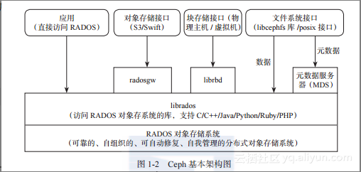
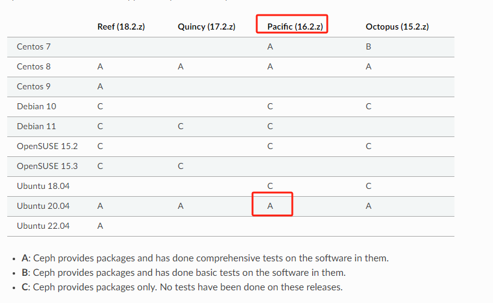
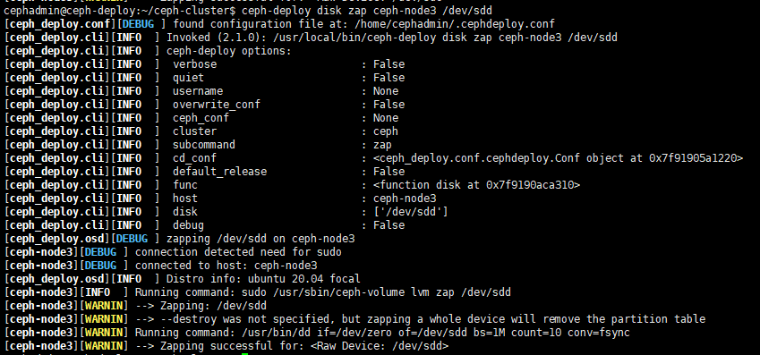
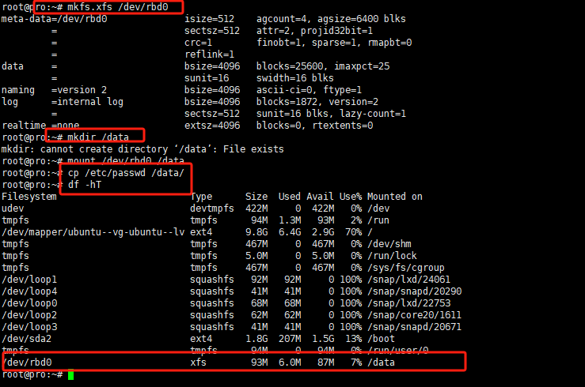
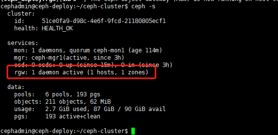
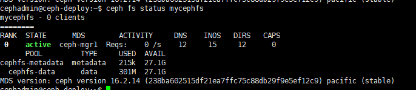

# 一：分布式存储概述

## 1.1： 存储分类

### 1.1.1：单机存储

```bash
SCSI/IDE/SATA//SAS/USB/PCI-E/SSD/M.2 NVME 协议(提升性能)

缺点：
单机存储的磁盘空间问题，IO问题，扩容问题，高可用问题
```

### 1.1.2：网络存储(带文件系统)

```bash
NFS
Samba
NAS (Network Attached Storage：网络附属存储)
SAN:SAN（Storage Area Network，存储区域网络)
```

### 1.1.3：商业存储

```bash
商业解决方案-EMC、NetAPP、戴尔、华为、浪潮
```

### 1.1.4：分布式存储

(软件定义的存储 Software Defined Storage SDS):

```bash
分布式存储：Ceph,TFS,FastDFS,MogileFS,MooseFS,GlusterFS
```


### 1.1.5：有状态集群数据读写特性

数据分为读数据和写数据，都可以在任何一个节点读，但是写只能写在特定的节点，如 Redis的 master、zookeeper 的 leader、MySQL 的 master 等场景。

## 1.2：分布式存储特性

数据分为数据和元数据：

```bash
元数据：即是文件的属性信息（文件名、权限(属主、属组)、大小、时间戳等），在分布式存储中当客户端或者应用程序产生的客户端数据被写入到分布式存储系统的时候，会有一个服务（Name Node）提供文件元数据的路由功能，即告诉应用程序取哪个服务器去请求文件内容，然后再有(Data NODE)提供数据的读写请求及数据的高可用功能。
```


```bash
块存储：需要格式化，将文件直接保存到磁盘上。

文件存储：提供数据存储的接口，即由操作系统提供存储接口，应用程序通过调用操作系统将文件保存到块存储进行持久化。

对象存储：也称为基于对象的存储，其中的文件被拆分成多个部分并散布在多个存储服务器，在对象存储中，数据会被分解为称为“对象”的离散单元，并保存在单个存储库中，而不是作为文件夹中的文件或服务器上的块来保存，对象存储需要一个简单的 HTTP 应用编程接口 (API)，以供大多数客户端（各种语言）使用。
```

# 二：Ceph基础

**ceph是一个开源的分布式存储系统，同时支持对象存储，块设备，文件系统。**

ceph是一个对象（object）式存储系统，它把每一个待存储的数据流（文件等数据）切分为一到多个固定大小（默认为4M）的对象数据，并以其为原子单元完成数据的读写。

对象数据的底层存储服务是由多个存储主机(host)组成的存储集群，该集群也被称之为RADOS(reliable automatic distributed object store)存储集群，即可靠的、自动化的、分布式的对象存储系统。

librados是RADOS存储集群的API，支持C/C++/JAVA/python/ruby/php/go等编程语言客户端。



## 2.1：Ceph的发展史

Ceph 项目起源于 Sage Weil(塞奇·威尔)于 2003 年在加州大学圣克鲁兹分校攻读博士期间的研究课题（Lustre 环境中的可扩展问题）。

Lustre 是一种平行分布式文件系统,早在 1999 年，由皮特·布拉姆(Peter Braam)创建的集群文件系统公司(Cluster File Systems Inc)开始研发,并于 2003 年发布 Lustre 1.0 版本. 


2007 年 Sage Weil(塞奇·威尔)毕业后，Sage Weil 继续全职从事 Ceph 工作，2010 年 3 月19 日，Linus Torvalds 将 Ceph 客户端合并到 2010 年 5 月 16 日发布的 Linux 内核版本2.6.34,2012 年 Sage Weil 创建了 Inktank Storage 用于为 Ceph 提供专业服务和支持,2014年 4 月 Redhat 以 1.75 亿美元收购 inktank 公司并开源. 

https://access.redhat.com/documentation/zh-cn/red_hat_ceph_storage/4/html/configuration_guide/the-basics-of-ceph-configuration #红帽官方文档


## 2.2：ceph的设计思想

```bash
ceph的设计旨在实现以下目标：
每一组件皆可扩展；
无单点故障；
基于软件（非专用设备）并且开源（无供应商锁定）；
在现有的廉价硬件运行；
尽可能自动管理，减少用户干预。
```

## 2.3：ceph的版本历史

Ceph的第一个版本是0.1，发布日期为2008年1月，多年来ceph的版本号一直采用递归更新的方式没变，直到2015年4月0.94.11(Hammer 的第一个修正版)发布后,为了避免 0.99(以及 0.100 或 1.00),后期的命名方式发生了改变:

```sh
x.0.z - 开发板（给早期测试者）
x.1.z - 候选版（用于测试集群）
x.2.z - 稳定、修正版（适合生产环境）

其中备注：

x将从9算起，它代表 Infernalis(首字母 I 是英文单词中的第九个字母),这样我们第九个发布周期的第一个开发版就是 9.0.0，
开发版依次是： 9.0.0 -> 9.0.1 -> 9.0.2
测试版本依次：9.1.0 -> 9.1.1 -> 9.1.2
稳定版依次：9.2.0 -> 9.2.1 -> 9.2.2
```


到 2017 年底，Ceph 项目都采取每年发布两个稳定版本的做法,从 Jewel 版到 Nautilus 之前，Ceph 经历过一段时间的每间隔 9 个月发布一个新版本,Nautilus 版本开始改为每年春季 3 月份发布一个稳定版本,并提供长达 26 个月左右的后期版本更新.


## 2.4：ceph集群角色定义


一个集群的组成部分：

```bash
若干的Ceph OSD（具体存储节点）
至少需要一个ceph Monitor监视器（1，3，5，7...）
两个或以上的ceph 管理器managers
运行ceph文件系统客户端时还需要高可用的Ceph Metadata Server（MDS）

RADOS cluster：由多台host存储服务器组成的ceph集群
OSD(Object Storage Daemon)：每台存储服务器的磁盘组成的存储空间
MOn（Monitor）: ceph的监视器，维护OSD和PG的集群状态，一个ceph集群至少需要一个mon，可以是1,3,5,7奇数个数
Mgr（Manger）：负责跟踪运行时的指标和ceph集群的当前状态，包括存储利用率，当前性能指标和系统负载等。
```

### 2.4.1：Monitor(ceph-mon)ceph监视器

​      在一个主机上运行的一个守护进程，用于维护集群状态映射（(maintains maps of the cluster state），比如ceph集群有多少存储池，每个存储池有多少PG以及存储池和PG的映射关系等。monitor map, manager map, the OSD map, the MDS map, and theCRUSH map，这些映射是 Ceph 守护程序相互协调所需的关键群集状态，

​     此外，mon还负责管理守护进程和客户端之间的身份认证（认证使用cephX协议），通常至少需要三个mon才能实现冗余和高可用性。

### 2.4.2：Managers(ceph-mgr)的功能

​     在一个主机上运行的一个守护进程，ceph manager守护程序（ceph-mgr）负责跟踪运行时指标和ceph集群的当前状态，包括存储利用率，当前性能指标和系统负载。Ceph Mnager守护程序还托管基于python的模块来管理和公开ceph集群信息，包括基于Web的ceph dashboard和REST API。高可用性通常至少需要两个管理器。

### 2.4.3：ceph OSDS（**对象存储守护程序** ceph-osd）

​    提供存储数据，操作系统上的一个磁盘就是一个OSD守护程序，OSD用于处理ceph集群的数据复制，恢复，重新平衡，并通过检查其他ceph osd守护程序的心跳来向ceph监视器和管理器提供一些监视信息。通常至少需要 3 个 Ceph OSD 才能实现冗余和高可用性。

### 2.4.4：MDS（ceph元数据服务器 ceph-mds）

​     代表ceph文件系统（NFS/CIFS）存储元数据，即ceph的块存储和对象存储不使用MDS.

### 2.4.5: ceph的管理节点

1、ceph的常用管理接口是一组命令行工具程序，例如rados,ceph,rbd等命令,ceph管理员可以从某个特定的ceph-mon节点执行管理操作。

2、推荐使用部署专用的管理节点对 ceph 进行配置管理、升级与后期维护，方便后期权限管理，管理节点的权限只对管理人员开放，可以避免一些不必要的误操作的发生。

### 2.4.6：ceph术语

https://docs.ceph.com/en/latest/glossary/

## 2.5：ceph逻辑组织架构

```bash
Pool: 存储池，分区，存储池的大小取决于底层的存储空间。
PG(placement group)：一个pool内部可以有多个PG存在，pool和PG都是抽象的逻辑概念，一个pool中有多少各PG可以通过公式计算。
OSD: 每一个磁盘都是一个osd，一个主机由一个或多个osd组成。


ceph集群部署好之后，要先创建pool才能向ceph写入数据，文件在向ceph保存之前要先进行一致性hash计算，计算后会把文件存放在某个PG,此文件一定属于某个pool的一个PG,在通过PG保存在OSD上。
数据对象在写到主OSD之后在同步给从osd，以实现数据的高可用。
```


**注：存储文件过程**

**第一步：计算文件到对象的映射：**

```bash
计算文件到对象的映射，假如file为客户端要读写的文件，得到oid(object id)=ino+ono(相加)
ino:inode number (INO)，File 的元数据序列号，File 的唯一 id。
ono:object number (ONO)，File 切分产生的某个 object 的序号，默认以 4M 切分一个块大
小。
```

**第二步：通过hash算法计算出文件对应的PG:**

```bash
通过一致性HASH得到Object的hash值，然后基于&（与运算）计算出Object到存储池中的PG的对应关系：

流程: hash(oid) & mask-> pgid=Object 到 PG 的映射关系
mask 的值= PG 总数 m(m 为 2 的整数幂)-1

例如：
11110000101101101=object 的 hash id
             1111=16 个 pg，对 16-1 进行与运算
             1101=运算结果
```

**第三步：通过CRUSH把对象映射到PG中的OSD:**

```bash
通过CRUSH算法计算PG到OSD, PG -> OSD映射：[CRUSH(pgid)->(osd1,osd2,osd3)]
```

**第四步：PG中的主OSD将对象写入到硬盘:**

**第五步： 主OSD将数据同步给备份OSD，并等待备份OSD返回确认：**

**第六步：主OSD将写入完成返回给客户端**

## 2.6：ceph元数据保存方式

ceph对象数据的元数据信息放在哪里呢？对象数据的元数据以key-value的形式存在，在RADOS中有两种表现：xattrs和omap；

```bash
ceph可选后端支持多种存储引擎，比如filestone,bluestore,kvstore,memstrore，目前ceph主要使用omap加bluestrore存储对象数据的元数据信息。
```

### 2.6.1：xattrs（扩展属性）

是将元数据保存在对象对应文件的扩展属性中并保存到系统磁盘上，这要求支持对象存储的本地文件系统（一般XFS）支持扩展属性。

### 2.6.2：omap（object map 对象映射）

omap：是object map的简称，是将元数据保存在本地文件系统之外的独立key-value存储系统，在使用filestore时是leveldb，在使用bluestrore时是rocksdb，由于filestore存在功能问题（需要将磁盘格式化为XFS）及元数据高可用等问题，因此，目前ceph主要使用bluestrore。

#### 2.6.2.1：filestore与leveldb

ceph早期基于files tore使用google的levelDB保存对象的元数据，LevelDB是一个持久化存储的KV系统，和Redis这种内存型的KV系统不同，leveldb不会像redis一样将数据放在内存从而占用大量的内存空间，而是将大部分数据存储到磁盘，但是需要把磁盘上的leveldb空间格式化为文件系统（XFS）。

```bash
FileStore 将数据保存到与 Posix 兼容的文件系统(例如 Btrfs、XFS、Ext4)。在 Ceph 后端使
用传统的 Linux 文件系统尽管提供了一些好处，但也有代价，如性能、 对象属性与磁盘本
地文件系统属性匹配存在限制等。
```


#### 2.6.2.2: bluestore与rocksdb

由于levelDB依然需要磁盘文件系统的支持，后期facebook对levelDB进行改进为RocksDB，RockDB将对象数据的元数据保存在RockDB，但是RockDB的数据又放在哪？放在内存怕丢失，放在本地磁盘解决不了高可用，ceph的对象数据放在每个osd，那么就在当前osd中划分一部分空间，格式化为BlueFS文件系统用于保存RocksDB中的元数据信息（称为bluestroer），并实现元数据的高可用。BlueStore 最大的特点是构建在裸磁盘设备之上，并且对诸如 SSD 等新的存储设备做了很多优化工作。

```bash
对全SSD及全NVME SSD闪存适配
绕过本地文件系统层，直接管理裸设备，缩短 IO 路径
严格分离元数据和数据，提高索引效率
使用 KV 索引，解决文件系统目录结构遍历效率低的问题
支持多种设备类型
解决日志“双写”问题
期望带来至少 2 倍的写性能提升和同等读性能
增加数据校验及数据压缩等功能
```

RocksDB 通过中间层 BlueRocksDB 访问文件系统的接口。这个文件系统与传统的 Linux文件系统（例如 Ext4 和 XFS）是不同的，它不是在 VFS 下面的通用文件系统，而是一个用户态的逻辑。BlueFS 通过函数接口（API，非 POSIX）的方式为 BlueRocksDB 提供类似文件系统的能力。


BlueStore的逻辑架构如上图所示，模块划分的比较清晰，下面是各模块的作用：

```bash
Allocator: 负责裸设备空间管理分配

RocksDB：rocksdb 是 facebook 基于 leveldb 开发的一款 kv 数据库，BlueStore 将元数据全部存放至 RocksDB 中，这些元数据包括存储预写式日志、数据对象元数据、Ceph 的 omap数据信息、以及分配器的元数据 。

BlueRocksEnv：这是 RocksDB 与 BlueFS 交互的接口；RocksDB 提供了文件操作的接口EnvWrapper(Env 封 装 器 )， 可 以 通 过 继 承 实 现 该 接 口 来 自 定 义 底 层 的 读 写 操 作 ，BlueRocksEnv 就是继承自 EnvWrapper 实现对 BlueFS 的读写。

BlueFS：BlueFS 是 BlueStore 针对 RocksDB 开发的轻量级文件系统，用于存放 RocksDB
产生的.sst 和.log 等文件。

BlockDecive：BlueStore 抛弃了传统的 ext4、xfs 文件系统，使用直接管理裸盘的方式；BlueStore 支持同时使用多种不同类型的设备，在逻辑上 BlueStore 将存储空间划分为三层：慢速（Slow）空间、高速（DB）空间、超高速（WAL）空间，不同的空间可以指定使用不同的设备类型，当然也可使用同一块设备。
```

BlueStrore的设计考虑了Filestore中存在的一些硬伤，抛弃了传统的文件系统管理裸设备，缩短了IO路径，同时采用ROW的方式，避免了日志双写问题，再写入性能有很大提升。

## 2.7：Ceph CRUSH算法简介

```bash
Controllers replication under scalable hashing #可控的、可复制的、可伸缩的一致性 hash
算法。
```

ceph使用CRUSH算法来存放和管理数据，它是ceph的智能数据分发机制。Ceph使用CRUSH算法来准确计算数据应该被保存到哪里，以及应该从哪里读取，和保存元数据不同的是，CRUSH按需计算出元数据，因此它就消除了对中心式服务器/网关的需求，它使得ceph客户端能够计算出元数据，该过程也称为 CRUSH 查找，然后和 OSD 直接通信。

```bash
1、如果是把对象直接映射到OSD之上会导致对象与OSD的对应关系过于紧密和耦合，当OSD由于故障发生变更会对整个CEPH集群产生影响。

2、于是ceph将一个对象映射到RADOS集群的时候分为两步走：
   首先使用一致性hash将object映射到PG;
   然后将PG ID基于CRUSH算法映射到OSD即可查找对象
   
3、以上两个过程都是以“实时计算”的方式完成。而没有使用传统的查询数据与块设备的对应方式，这样有效避免了组件的“中心化”问题，也解决了查询性能和冗余问题，使得ceph集群扩展不在受查询性能限制

4、这个实时计算操作使用的就是CRUSH算法
CRUSH 是一种分布式算法，类似于一致性 hash 算法，用于为 RADOS 存储集群控制数据的分配。
```

# 三：部署ceph集群

各ceph版本要求的操作系统版本：https://docs.ceph.com/en/latest/start/os-recommendations/



## 3.1：部署方式

ceph-ansible：https://github.com/ceph/ceph-ansible #python

ceph-salt：https://github.com/ceph/ceph-salt #python

ceph-container：https://github.com/ceph/ceph-container #shell

ceph-chef：https://github.com/ceph/ceph-chef #Ruby

cephadm: https://docs.ceph.com/en/latest/cephadm/ #ceph 官方在 ceph 15 版本加入的ceph 部署工具

ceph-deploy：https://github.com/ceph/ceph-deploy #python 是一个 ceph 官方维护的基于 ceph-deploy 命令行部署 ceph 集群的工具，基于 ssh 执行可以 sudo 权限的 shell 命令以及一些 python 脚本 实现 ceph 集群的部署和管理维护。

**Ceph-deploy 只用于部署和管理 ceph 集群，客户端需要访问 ceph，需要部署客户端工具（ceph-common）。**

## 3.2: 服务器准备

这是官方对硬件的推荐：https://docs.ceph.com/en/latest/start/hardware-recommendations/

| 节点        | public network/cluster network | 角色        | ceph版本         | OS系统       | 机器规格   |
| ----------- | ------------------------------ | ----------- | ---------------- | ------------ | ---------- |
| ceph-deploy | 192.168.58.160/172.16.58.132   | ceph-deploy | Pacific(16.2.14) | Ubuntu 20.04 | 4c4g       |
| ceph-mgr1   | 192.168.58.164/172.16.58.136   | mgr         | Pacific(16.2.14) | Ubuntu 20.04 | 4c4g       |
| ceph-mgr2   | 192.168.58.165/172.16.58.137   | mgr         | Pacific(16.2.14) | Ubuntu 20.04 | 4c4g       |
| ceph-mon1   | 192.168.58.161/172.16.58.133   | mon         | Pacific(16.2.14) | Ubuntu 20.04 | 4c4g       |
| ceph-mon2   | 192.168.58.162/172.16.58.134   | mon         | Pacific(16.2.14) | Ubuntu 20.04 | 4c4g       |
| ceph-mon3   | 192.168.58.163/172.16.58.135   | mon         | Pacific(16.2.14) | Ubuntu 20.04 | 4c4g       |
| ceph-node1  | 192.168.58.157/172.16.58.129   | osd         | Pacific(16.2.14  | Ubuntu 20.04 | 4c4g 10g*3 |
| ceph-node2  | 192.168.58.158/172.16.58.130   | osd         | Pacific(16.2.14  | Ubuntu 20.04 | 4c4g 10g*3 |
| ceph-node3  | 192.168.58.159/172.16.58.131   | osd         | Pacific(16.2.14  | Ubuntu 20.04 | 4c4g 10g*3 |

```bash
备注：

production环境建议mon,mgr,osd,ceph-deploy有自己单独的服务器。
```

**网络环境**：

https://docs.ceph.com/en/quincy/rados/configuration/network-config-ref/

```bash
public network: 针对客户端访问
cluster network: 用于集群管理及数据同步

mgr,mon 都要和ceph osd节点的cluster网络通信
```


## 3.3：系统环境准备（所有节点操作）

### 3.3.1: 时间同步

```bash
~$ apt install ntpdate -y
~$ ntpdate ntp1.aliyun.com
19 Jan 08:22:45 ntpdate[3133]: adjust time server 120.25.115.20 offset -0.041904 sec
```

### 3.3.2：关闭防火墙

```bash
~$ ufw disable
```

### 3.3.3: 配置本地域名解析

```bash
~$ cat /etc/hosts
192.168.58.160 ceph-deploy.example.local ceph-deploy
192.168.58.164 ceph-mgr1.example.local ceph-mgr1
192.168.58.165 ceph-mgr2.example.local ceph-mgr2
192.168.58.161 ceph-mon1.example.local ceph-mon1 
192.168.58.162 ceph-mon2.example.local ceph-mon2 
192.168.58.163 ceph-mon3.example.local ceph-mon3 
192.168.58.157 ceph-node1.example.local ceph-node1 
192.168.58.158 ceph-node2.example.local ceph-node2 
192.168.58.159 ceph-node3.example.local ceph-node3 
```

## 3.4:部署RADOS集群

### 3.4.1：repo仓库准备(所有节点)

```bash
# sudo apt-get -y install apt-transport-https ca-certificates curl software-properties-common

# cat /etc/apt/sources.list # 添加如下：
deb https://mirrors.tuna.tsinghua.edu.cn/ceph/debian-pacific/ focal main

# sudo apt update
```

### 3.4.2: 创建cephadmin用户（所有节点）

推荐使用指定的普通用户部署和运行ceph集群，普通用户只要能以非交互的方式执行sudo命令执行一些特权命令即可，新版的ceph-deploy可以指定包含root在内只要可以执行sudo命令的用户。不过仍然推荐使用普通用户，安装完成ceph会自动创建ceph用户，**因此推荐使用了除ceph用户之外的比如cephuser，cephadmin这样的普通用户去部署和管理ceph集群。**

```bash
cephadmin仅在ceph-deploy用于部署和管理ceph集群，比如首次初始化集群和部署集群，添加节点，删除节点等,ceph集群在node节点,mgr节点，mon节点都会使用ceph用户启动服务进程。各节点创建 cephadmin，之后在部署 ceph 过程中会自动在 node 节点、mon 节点以及mgr 节点创建 ceph 用户.
```

```bash
#ceph所有节点执行
~$ groupadd -r -g 2088 cephadmin && useradd -r -m -s /bin/bash -u 2088 -g 2088 cephadmin && echo cephadmin:123456 | chpasswd

# 各服务器允许cephadmin用户以sudo执行特权命令
~$ echo "cephadmin ALL=(ALL) NOPASSWD: ALL" >> /etc/sudoers


# 配置免密钥登录
# 在ceph-deploy节点配置允许以非交互的方式登录各ceph node/mgr/mon节点，即在ceph-deploy节点生成密钥对，然后分发公钥到各被管理点。
root@ceph-deploy:~# su - cephadmin
cephadmin@ceph-deploy:~$ ssh-keygen
cephadmin@ceph-deploy:~$ ssh-copy-id cephadmin@192.168.58.157
cephadmin@ceph-deploy:~$ ssh-copy-id cephadmin@192.168.58.158
cephadmin@ceph-deploy:~$ ssh-copy-id cephadmin@192.168.58.159
```

### 3.4.3：安装ceph部署工具

**注意**：

```bash
问题陈述：

Ubuntu20.04  默认 python3.8   因python3.8 去掉了一些函数，所以  在用 sudo  apt-get install ceph-deploy  安装  ceph-deploy 版本是  2.0.1  

用 ceph-deploy 2.0.1  安装    ceph-deploy new  hostName  时 会报    module 'platform' has no attribute 'linux_distribution'  错误！

解决方案 ：

ceph-deploy 源码 现版本 以到 2.1. 0

所以可以  git clone https://github.com/ceph/ceph-deploy.git   下载源码 来 安装 ！
```

安装部署工具ceph-deploy:

```bash
cephadmin@ceph-deploy:~$ sudo apt install python3 python3-pip -y
cephadmin@ceph-deploy:~$ sudo git clone https://gh-proxy.com/https://github.com/ceph/ceph-deploy.git
cephadmin@ceph-deploy:~$ cd ceph-deploy/
cephadmin@ceph-deploy:~/ceph-deploy$ sudo python3 setup.py install
```

### 3.4.4：初始化mon节点

在管理节点初始化mon节点

```bash
cephadmin@ceph-deploy:~$ mkdir ceph-cluster  #保存当前集群的初始化配置信息
cephadmin@ceph-deploy:~$ cd ceph-cluster/

~$ ceph-deploy --help
new：开始部署一个新的 ceph 存储集群，并生成 CLUSTER.conf 集群配置文件和 keyring
认证文件。
install: 在远程主机上安装 ceph 相关的软件包, 可以通过--release 指定安装的版本。
rgw：管理 RGW 守护程序(RADOSGW,对象存储网关)。
mgr：管理 MGR 守护程序(ceph-mgr,Ceph Manager DaemonCeph 管理器守护程序)。
mds：管理 MDS 守护程序(Ceph Metadata Server，ceph 源数据服务器)。
mon：管理 MON 守护程序(ceph-mon,ceph 监视器)。
gatherkeys：从指定获取提供新节点的验证 keys，这些 keys 会在添加新的 MON/OSD/MD
加入的时候使用。
disk：管理远程主机磁盘。
osd：在远程主机准备数据磁盘，即将指定远程主机的指定磁盘添加到 ceph 集群作为 osd
使用。
repo： 远程主机仓库管理。
admin：推送 ceph 集群配置文件和 client.admin 认证文件到远程主机。
config：将 ceph.conf 配置文件推送到远程主机或从远程主机拷贝。
uninstall：从远端主机删除安装包。
purgedata：从/var/lib/ceph 删除 ceph 数据,会删除/etc/ceph 下的内容。
purge: 删除远端主机的安装包和所有数据。
forgetkeys：从本地主机删除所有的验证 keyring, 包括 client.admin, monitor, bootstrap 等
认证文件。
pkg： 管理远端主机的安装包。
calamari：安装并配置一个 calamari web 节点，calamari 是一个 web 监控平台
```

**初始化mon节点过程如下：**

```bash
# 各mon节点需要单独安装pyython2
root@ceph-mon1:~# sudo apt install python2.7 -y
root@ceph-mon1:~# sudo ln -sv /usr/bin/python2.7 /usr/bin/python2

# 在ceph-deploy节点初始化mon1节点
cephadmin@ceph-deploy:~/ceph-cluster$ ceph-deploy new --cluster-network 172.16.58.0/24 --public-network 192.168.58.0/24 ceph-mon1.example.local
[ceph_deploy.conf][DEBUG ] found configuration file at: /home/cephadmin/.cephdeploy.conf
[ceph_deploy.cli][INFO  ] Invoked (2.1.0): /usr/local/bin/ceph-deploy new --cluster-network 172.16.58.0/24 --public-network 192.168.58.0/24 ceph-mon1.example.local
[ceph_deploy.cli][INFO  ] ceph-deploy options:
[ceph_deploy.cli][INFO  ]  verbose                       : False
[ceph_deploy.cli][INFO  ]  quiet                         : False
[ceph_deploy.cli][INFO  ]  username                      : None
[ceph_deploy.cli][INFO  ]  overwrite_conf                : False
[ceph_deploy.cli][INFO  ]  ceph_conf                     : None
[ceph_deploy.cli][INFO  ]  cluster                       : ceph
[ceph_deploy.cli][INFO  ]  mon                           : ['ceph-mon1.example.local']
[ceph_deploy.cli][INFO  ]  ssh_copykey                   : True
[ceph_deploy.cli][INFO  ]  fsid                          : None
[ceph_deploy.cli][INFO  ]  cluster_network               : 172.16.58.0/24
[ceph_deploy.cli][INFO  ]  public_network                : 192.168.58.0/24
[ceph_deploy.cli][INFO  ]  cd_conf                       : <ceph_deploy.conf.cephdeploy.Conf object at 0x7f46f14684c0>
[ceph_deploy.cli][INFO  ]  default_release               : False
[ceph_deploy.cli][INFO  ]  func                          : <function new at 0x7f46f1456280>
[ceph_deploy.new][DEBUG ] Creating new cluster named ceph
[ceph_deploy.new][INFO  ] making sure passwordless SSH succeeds
[ceph-mon1.example.local][DEBUG ] connected to host: ceph-deploy 
[ceph-mon1.example.local][INFO  ] Running command: ssh -CT -o BatchMode=yes ceph-mon1.example.local true
[ceph_deploy.new][WARNIN] could not connect via SSH
[ceph_deploy.new][INFO  ] will connect again with password prompt
The authenticity of host 'ceph-mon1.example.local (192.168.58.157)' can't be established.
ECDSA key fingerprint is SHA256:t4J2nl4qLLStuDdKcTMT/KVdUhA7thDVkMyFVGvtRUk.
Are you sure you want to continue connecting (yes/no/[fingerprint])? yes
Warning: Permanently added 'ceph-mon1.example.local' (ECDSA) to the list of known hosts.
[ceph-mon1.example.local][DEBUG ] connected to host: ceph-mon1.example.local 
[ceph_deploy.new][INFO  ] adding public keys to authorized_keys
[ceph-mon1.example.local][DEBUG ] connection detected need for sudo
[ceph-mon1.example.local][DEBUG ] connected to host: ceph-mon1.example.local 
[ceph-mon1.example.local][INFO  ] Running command: sudo /bin/ip link show
[ceph-mon1.example.local][INFO  ] Running command: sudo /bin/ip addr show
[ceph-mon1.example.local][DEBUG ] IP addresses found: ['192.168.58.157', '172.16.58.129']
[ceph_deploy.new][DEBUG ] Resolving host ceph-mon1.example.local
[ceph_deploy.new][DEBUG ] Monitor ceph-mon1 at 192.168.58.157
[ceph_deploy.new][DEBUG ] Monitor initial members are ['ceph-mon1']
[ceph_deploy.new][DEBUG ] Monitor addrs are ['192.168.58.157']
[ceph_deploy.new][DEBUG ] Creating a random mon key...
[ceph_deploy.new][DEBUG ] Writing monitor keyring to ceph.mon.keyring...
[ceph_deploy.new][DEBUG ] Writing initial config to ceph.conf...

# 验证初始化
cephadmin@ceph-deploy:~/ceph-cluster$ ls -ltr
total 12
-rw------- 1 cephadmin cephadmin   73 Jan 22 06:13 ceph.mon.keyring  # 用于ceph mon节点内部通信的密钥环文件
-rw-rw-r-- 1 cephadmin cephadmin 3641 Jan 22 06:13 ceph-deploy-ceph.log #初始化日志
-rw-rw-r-- 1 cephadmin cephadmin  267 Jan 22 06:13 ceph.conf #自动生成的配置文件


cephadmin@ceph-deploy:~/ceph-cluster$ cat ceph.conf 
[global]
fsid = 05b492e6-06bf-447a-bd5a-f589de8f1e70 # ceph集群ID
public_network = 192.168.58.0/24
cluster_network = 172.16.58.0/24
mon_initial_members = ceph-mon1 #可以用逗号做分割添加多个 mon 节点
mon_host = 192.168.58.161
auth_cluster_required = cephx
auth_service_required = cephx
auth_client_required = cephx
```

### 3.4.5：初始化ceph存储节点

初始化存储节点等于在存储节点安装了ceph及ceph-rodsgw安装包，但是使用默认的官方仓库会因为网络原因导致初始化超时，因此各存储节点推荐修改ceph仓库为阿里或者清华国内镜像源。

初始化node节点过程：

```bash

# 此过程会在指定的 ceph node 节点按照串行的方式逐个服务器安装 epel 源和 ceph 源并按安装 ceph ceph-radosgw
cephadmin@ceph-deploy:~/ceph-cluster$ ceph-deploy install --no-adjust-repos --nogpgcheck ceph-node1 ceph-node2 ceph-node3
```

初始化完成：


### 3.4.6：安装mon节点

在各 mon 节点安装组件 ceph-mon,并通初始化 mon 节点，mon 节点 ha 还可以后期横向扩容。

```bash
root@ceph-mon1:~# apt install ceph-mon
root@ceph-mon2:~# apt install ceph-mon
root@ceph-mon3:~# apt install ceph-mon
```

### 3.4.7：初始化并验证mon节点

#### 3.4.7.1：初始化ceph-mon节点：

```bash
cephadmin@ceph-deploy:~/ceph-cluster$ ceph-deploy mon create-initial
```


#### 3.4.7.2：验证mon节点：

验证在 mon 定节点已经自动安装并启动了 ceph-mon 服务，并且后期在 ceph-deploy 节点初始化目录会生成一些 bootstrap ceph mds/mgr/osd/rgw 等服务的 keyring 认证文件，这些初始化文件拥有对 ceph 集群的最高权限，所以一定要保存好。

```bash
root@ceph-mon1:~# ps -ef | grep ceph-mon
ceph       25927       1  0 08:03 ?        00:00:00 /usr/bin/ceph-mon -f --cluster ceph --id ceph-mon1 --setuser ceph --setgroup ceph
root       26534   21171  0 08:06 pts/2    00:00:00 grep --color=auto ceph-mon
```

### 3.4.8：分发admin密钥

在ceph-deploy节点把配置文件和admin密钥拷贝到ceph集群需要执行ceph管理命令的节点，从而不需要后期通过 ceph 命令对 ceph 集群进行管理配置的时候每次都需要指定ceph-mon 节点地址和 ceph.client.admin.keyring 文件，另外各 ceph-mon 节点也需要同步ceph 的集群配置文件与认证文件。

如果在 ceph-deploy 节点管理集群:

```bash
cephadmin@ceph-deploy:~/ceph-cluster$ sudo apt install ceph-common #先安装 ceph 的公共组件
```

将admin密钥推送到`ceph-node1`, `ceph-node2`, `ceph-node3`

```bash
cephadmin@ceph-deploy:~/ceph-cluster$ ceph-deploy admin ceph-node1 ceph-node2 ceph-node3
```


### 3.4.9: ceph-node验证秘钥

到node节点验证key文件：

```bash
root@ceph-node1:~# ll /etc/ceph/
total 20
drwxr-xr-x   2 root root 4096 Jan 23 08:14 ./
drwxr-xr-x 100 root root 4096 Jan 23 07:57 ../
-rw-------   1 root root  151 Jan 23 08:14 ceph.client.admin.keyring
-rw-r--r--   1 root root  267 Jan 23 08:14 ceph.conf
-rw-r--r--   1 root root   92 Aug 29 16:38 rbdmap
-rw-------   1 root root    0 Jan 23 08:14 tmpmaekb7ny
```

认证文件的属主和属组为了安全考虑，默认设置为root用户和root组，如果需要cephadmin用户也能执行ceph命令，，就需要对cephadmin用户授权。

```bash
root@ceph-node1:~# apt install acl -y
root@ceph-node1:~# setfacl -m u:cephadmin:rw /etc/ceph/ceph.client.admin.keyring

root@ceph-node2:~# apt install acl -y
root@ceph-node2:~# setfacl -m u:cephadmin:rw /etc/ceph/ceph.client.admin.keyring

root@ceph-node3:~# apt install acl -y
root@ceph-node3:~# setfacl -m u:cephadmin:rw /etc/ceph/ceph.client.admin.keyring
```

### 3.4.10: 部署ceph-mgr节点

mgr 节点需要读取 ceph 的配置文件，即/etc/ceph 目录中的配置文件

```bash
# 安装ceph-mgr
root@ceph-mgr1:~# apt install ceph-mgr -y
root@ceph-mgr2:~# apt install ceph-mgr -y

# 初始化ceph-mgr
cephadmin@ceph-deploy:~/ceph-cluster$ ceph-deploy mgr create ceph-mgr1
[ceph_deploy.conf][DEBUG ] found configuration file at: /home/cephadmin/.cephdeploy.conf
[ceph_deploy.cli][INFO  ] Invoked (2.1.0): /usr/local/bin/ceph-deploy mgr create ceph-mgr1
[ceph_deploy.cli][INFO  ] ceph-deploy options:
[ceph_deploy.cli][INFO  ]  verbose                       : False
[ceph_deploy.cli][INFO  ]  quiet                         : False
[ceph_deploy.cli][INFO  ]  username                      : None
[ceph_deploy.cli][INFO  ]  overwrite_conf                : False
[ceph_deploy.cli][INFO  ]  ceph_conf                     : None
[ceph_deploy.cli][INFO  ]  cluster                       : ceph
[ceph_deploy.cli][INFO  ]  subcommand                    : create
[ceph_deploy.cli][INFO  ]  cd_conf                       : <ceph_deploy.conf.cephdeploy.Conf object at 0x7f95745f0940>
[ceph_deploy.cli][INFO  ]  default_release               : False
[ceph_deploy.cli][INFO  ]  func                          : <function mgr at 0x7f95745c81f0>
[ceph_deploy.cli][INFO  ]  mgr                           : [('ceph-mgr1', 'ceph-mgr1')]
[ceph_deploy.mgr][DEBUG ] Deploying mgr, cluster ceph hosts ceph-mgr1:ceph-mgr1
The authenticity of host 'ceph-mgr1 (192.168.58.164)' can't be established.
ECDSA key fingerprint is SHA256:s1vyokQFspmbVXH+rePjW+srgBq9+99Vn9FGnWMWMjU.
Are you sure you want to continue connecting (yes/no/[fingerprint])? yes
Warning: Permanently added 'ceph-mgr1' (ECDSA) to the list of known hosts.
[ceph-mgr1][DEBUG ] connection detected need for sudo
[ceph-mgr1][DEBUG ] connected to host: ceph-mgr1 
[ceph_deploy.mgr][INFO  ] Distro info: ubuntu 20.04 focal
[ceph_deploy.mgr][DEBUG ] remote host will use systemd
[ceph_deploy.mgr][DEBUG ] deploying mgr bootstrap to ceph-mgr1
[ceph-mgr1][WARNIN] mgr keyring does not exist yet, creating one
[ceph-mgr1][INFO  ] Running command: sudo ceph --cluster ceph --name client.bootstrap-mgr --keyring /var/lib/ceph/bootstrap-mgr/ceph.keyring auth get-or-create mgr.ceph-mgr1 mon allow profile mgr osd allow * mds allow * -o /var/lib/ceph/mgr/ceph-ceph-mgr1/keyring
[ceph-mgr1][INFO  ] Running command: sudo systemctl enable ceph-mgr@ceph-mgr1
[ceph-mgr1][WARNIN] Created symlink /etc/systemd/system/ceph-mgr.target.wants/ceph-mgr@ceph-mgr1.service → /lib/systemd/system/ceph-mgr@.service.
[ceph-mgr1][INFO  ] Running command: sudo systemctl start ceph-mgr@ceph-mgr1
[ceph-mgr1][INFO  ] Running command: sudo systemctl enable ceph.target
```

### 3.4.11:验证ceph-mgr节点

```bash
root@ceph-mgr1:~# ps -ef | grep mgr
ceph        9868       1  4 08:25 ?        00:00:02 /usr/bin/ceph-mgr -f --cluster ceph --id ceph-mgr1 --setuser ceph --setgroup ceph
root       10045    4177  0 08:26 pts/1    00:00:00 grep --color=auto mgr
```

### 3.4.12: ceph-deploy管理ceph集群

在ceph-deploy节点配置下系统环境，方便后期可以执行ceph管理命令。

```bash
cephadmin@ceph-deploy:~/ceph-cluster$ sudo apt install ceph-common #先安装 ceph 的公共组件
cephadmin@ceph-deploy:~/ceph-cluster$ ceph-deploy admin ceph-deploy #推送正证书
给自己

```

### 3.4.13: 测试ceph命令

```bash
cephadmin@ceph-deploy:~/ceph-cluster$ sudo setfacl -m u:cephadmin:rw /etc/ceph/ceph.client.admin.keyring #授权

cephadmin@ceph-deploy:~/ceph-cluster$ ceph -s
  cluster:
    id:     05b492e6-06bf-447a-bd5a-f589de8f1e70
    health: HEALTH_WARN
            mon is allowing insecure global_id reclaim #需要禁用非安全模式通信
            OSD count 0 < osd_pool_default_size 3 #集群的 OSD 数量小于 3
 
  services:
    mon: 1 daemons, quorum ceph-mon1 (age 29m)
    mgr: ceph-mgr1(active, since 7m)
    osd: 0 osds: 0 up, 0 in
 
  data:
    pools:   0 pools, 0 pgs
    objects: 0 objects, 0 B
    usage:   0 B used, 0 B / 0 B avail
    pgs:   
```

```bash
# 禁用非安全模式通信
cephadmin@ceph-deploy:~/ceph-cluster$ ceph config set mon auth_allow_insecure_global_id_reclaim false

cephadmin@ceph-deploy:~/ceph-cluster$ ceph -s
  cluster:
    id:     05b492e6-06bf-447a-bd5a-f589de8f1e70
    health: HEALTH_WARN
            OSD count 0 < osd_pool_default_size 3
 
  services:
    mon: 1 daemons, quorum ceph-mon1 (age 87m)
    mgr: ceph-mgr1(active, since 65m)
    osd: 0 osds: 0 up, 0 in
 
  data:
    pools:   0 pools, 0 pgs
    objects: 0 objects, 0 B
    usage:   0 B used, 0 B / 0 B avail
    pgs:     
```

### 3.4.14:  准备OSD节点

OSD节点安装运行环境：

```bash
# 擦除磁盘之前通过 deploy 节点对 node 节点执行安装 ceph 基本运行环境
cephadmin@ceph-deploy:~/ceph-cluster$ ceph-deploy install --release pacific ceph-node1
cephadmin@ceph-deploy:~/ceph-cluster$ ceph-deploy install --release pacific ceph-node2
cephadmin@ceph-deploy:~/ceph-cluster$ ceph-deploy install --release pacific ceph-node3
```

使用ceph-deploy disk zap擦除各ceph node的数据磁盘，过程如下：

```bash
cephadmin@ceph-deploy:~/ceph-cluster$ ceph-deploy disk zap ceph-node1 /dev/sdb
ceph-deploy disk zap ceph-node1 /dev/sdc
ceph-deploy disk zap ceph-node1 /dev/sdd

ceph-deploy disk zap ceph-node2 /dev/sdb
ceph-deploy disk zap ceph-node2 /dev/sdc
ceph-deploy disk zap ceph-node2 /dev/sdd

ceph-deploy disk zap ceph-node3 /dev/sdb
ceph-deploy disk zap ceph-node3 /dev/sdc
ceph-deploy disk zap ceph-node3 /dev/sdd
```



### 3.4.15: 添加OSD

数据分类保存方式：

Data：即 ceph 保存的对象数据

Block: rocks DB 数据即元数据

block-wal：数据库的 wal 日志

添加OSD：

```bash
cephadmin@ceph-deploy:~/ceph-cluster$ ceph-deploy osd create ceph-node1 --data /dev/sdb
cephadmin@ceph-deploy:~/ceph-cluster$ ceph-deploy osd create ceph-node1 --data /dev/sdc
cephadmin@ceph-deploy:~/ceph-cluster$ ceph-deploy osd create ceph-node1 --data /dev/sdd

ceph-deploy osd create ceph-node2 --data /dev/sdb
ceph-deploy osd create ceph-node2 --data /dev/sdc
ceph-deploy osd create ceph-node2 --data /dev/sdd

ceph-deploy osd create ceph-node3 --data /dev/sdb
ceph-deploy osd create ceph-node3 --data /dev/sdc
ceph-deploy osd create ceph-node3 --data /dev/sdd
```


### 3.4.16: 设置OSD服务自启动

默认就已经自启动，node节点添加完成后，用于node服务器重启后，OSD是否会自动启动。


```bash
root@ceph-node1:~# ps -ef | grep osd
ceph       76485       1  0 09:44 ?        00:00:06 /usr/bin/ceph-osd -f --cluster ceph --id 0 --setuser ceph --setgroup ceph
ceph       78510       1  0 09:45 ?        00:00:05 /usr/bin/ceph-osd -f --cluster ceph --id 1 --setuser ceph --setgroup ceph
ceph       80500       1  0 09:45 ?        00:00:05 /usr/bin/ceph-osd -f --cluster ceph --id 2 --setuser ceph --setgroup ceph
root       82803   29768  0 10:03 pts/2    00:00:00 grep --color=auto osd
root@ceph-node1:~# systemctl enable ceph-osd@0 ceph-osd@1 ceph-osd@2


root@ceph-node2:~# ps -ef | grep osd
ceph       47081       1  0 09:47 ?        00:00:06 /usr/bin/ceph-osd -f --cluster ceph --id 3 --setuser ceph --setgroup ceph
ceph       49011       1  0 09:47 ?        00:00:05 /usr/bin/ceph-osd -f --cluster ceph --id 4 --setuser ceph --setgroup ceph
ceph       51004       1  0 09:47 ?        00:00:05 /usr/bin/ceph-osd -f --cluster ceph --id 5 --setuser ceph --setgroup ceph
root       53244    7099  0 10:05 pts/2    00:00:00 grep --color=auto osd
root@ceph-node2:~# systemctl enable ceph-osd@3 ceph-osd@4 ceph-osd@5


root@ceph-node3:~# ps -ef | grep osd
ceph       38524       1  0 09:47 ?        00:00:05 /usr/bin/ceph-osd -f --cluster ceph --id 6 --setuser ceph --setgroup ceph
ceph       40443       1  0 09:48 ?        00:00:05 /usr/bin/ceph-osd -f --cluster ceph --id 7 --setuser ceph --setgroup ceph
ceph       42372       1  0 09:48 ?        00:00:05 /usr/bin/ceph-osd -f --cluster ceph --id 8 --setuser ceph --setgroup ceph
root       44639   14745  0 10:06 pts/1    00:00:00 grep --color=auto osd
root@ceph-node3:~# systemctl enable ceph-osd@6 ceph-osd@7 ceph-osd@8
```


### 3.4.17: 验证ceph集群


### 3.4.18：从RADOS移除OSD

Ceph 集群中的一个 OSD 是一个 node 节点的服务进程且对应于一个物理磁盘设备，是一个专用的守护进程。在某 OSD 设备出现故障，或管理员出于管理之需确实要移除特定的 OSD设备时，需要先停止相关的守护进程，而后再进行移除操作。对于 Luminous 及其之后的版本来说，停止和移除命令的格式分别如下所示

```bash
1. 停用设备：ceph osd out {osd-num}
2. 停止进程：sudo systemctl stop ceph-osd@{osd-num}
3. 移除设备：ceph osd purge {id} --yes-i-really-mean-it
```

若类似如下的 OSD 的配置信息存在于 ceph.conf 配置文件中，管理员在删除 OSD 之后手动将其删除。不过，对于 Luminous 之前的版本来说，管理员需要依次手动执行如下步骤删除 OSD 设备：

```bash
1. 于 CRUSH 运行图中移除设备：ceph osd crush remove {name}
2. 移除 OSD 的认证 key：ceph auth del osd.{osd-num}
3. 最后移除 OSD 设备：ceph osd rm {osd-num}
```

### 3.4.19: 测试上传与下载数据

存取数据时，客户端必须首先连接至RADOS集群上某存储池，然后根据对象名称由相关的CRUSH规则完成数据对象寻址。于是，为了测试集群的数据存储功能，这里先创建一个用于测试的存储池mypool，并设定其PG数量为32个。

创建pool：

```bash
cephadmin@ceph-deploy:~/ceph-cluster$ ceph osd pool create mypool 32 32 ##32PG 和 32PGP

#验证PG与PGP组合
cephadmin@ceph-deploy:~/ceph-cluster$ ceph pg ls-by-pool mypool | awk '{print $1,$2,$15}'
PG OBJECTS ACTING
2.0 0 [3,6,0]p3
2.1 0 [2,6,3]p2
2.2 0 [5,1,8]p5
2.3 0 [5,2,8]p5
2.4 0 [1,7,3]p1
2.5 0 [8,0,4]p8
2.6 0 [1,6,3]p1
2.7 0 [3,7,2]p3
2.8 0 [3,7,0]p3
2.9 0 [1,4,8]p1
2.a 0 [6,1,3]p6
2.b 0 [8,5,2]p8
2.c 0 [6,0,5]p6
2.d 0 [6,3,2]p6
2.e 0 [2,8,3]p2
2.f 0 [8,4,0]p8
2.10 0 [8,1,5]p8
2.11 0 [4,1,8]p4
2.12 0 [7,1,3]p7
2.13 0 [7,4,2]p7
2.14 0 [3,7,0]p3
2.15 0 [7,1,3]p7
2.16 0 [5,7,1]p5
2.17 0 [5,6,2]p5
2.18 0 [8,4,2]p8
2.19 0 [0,4,7]p0
2.1a 0 [3,8,2]p3
2.1b 0 [6,5,2]p6
2.1c 0 [8,4,1]p8
2.1d 0 [7,3,0]p7
2.1e 0 [2,7,5]p2
2.1f 0 [0,3,8]p0
```

当前的ceph环境还没有部署使用块存储和文件系统使用的ceph，也没有使用存储的客户端，但是ceph的rados命令可以实现访问ceph存储的功能：

**上传文件：**

```bash
# 把 syslog 文件上传到 mypool 并指定对象 id 为 msg1
cephadmin@ceph-deploy:~/ceph-cluster$ sudo rados put msg1 /var/log/syslog --pool=mypool
```

**列出文件**

```bash
cephadmin@ceph-deploy:~/ceph-cluster$ rados ls --pool=mypool
msg1
```

**文件信息**

ceph osd map命令可以获取到存储池中数据对象的具体位置信息

```bash
cephadmin@ceph-deploy:~/ceph-cluster$ ceph osd map mypool msg1
osdmap e56 pool 'mypool' (2) object 'msg1' -> pg 2.c833d430 (2.10) -> up ([8,1,5], p8) acting ([8,1,5], p8)
```

表示文件放在了存储池id为2的c833d430的PG上，10为当前PG的ID，2.10表示数据是在id为2的存储池当中id为10的PG中存储。在线的OSD编号：8,1,5，主OSD为8. 活动的OSD8，1，5， 三个OSD表示数据放3副本，PG中的OSD是ceph的crush算法计算出的三分数据保存在哪些osd.

**下载文件**

```bash
cephadmin@ceph-deploy:~$ sudo rados get msg1 --pool=mypool /opt/my.txt
cephadmin@ceph-deploy:~$ ll /opt/
total 1376
drwxr-xr-x  2 root root    4096 Jan 23 12:18 ./
drwxr-xr-x 20 root root    4096 Jan 22 06:53 ../
-rw-r--r--  1 root root 1398045 Jan 23 12:18 my.txt


验证下载的文件
cephadmin@ceph-deploy:~$ head /opt/my.txt 
Jan 22 07:03:07 ceph-deploy systemd-modules-load[516]: Inserted module 'msr'
Jan 22 07:03:07 ceph-deploy systemd-modules-load[516]: Inserted module 'ipmi_devintf'
Jan 22 07:03:07 ceph-deploy systemd-sysctl[527]: Not setting net/ipv4/conf/all/promote_secondaries (explicit setting exists).
Jan 22 07:03:07 ceph-deploy systemd-sysctl[527]: Not setting net/ipv4/conf/default/promote_secondaries (explicit setting exists).
Jan 22 07:03:07 ceph-deploy systemd-sysusers[528]: Creating group systemd-coredump with gid 999.
Jan 22 07:03:07 ceph-deploy systemd-sysusers[528]: Creating user systemd-coredump (systemd Core Dumper) with uid 999 and gid 999.
Jan 22 07:03:07 ceph-deploy systemd[1]: Starting Flush Journal to Persistent Storage...
Jan 22 07:03:07 ceph-deploy systemd[1]: Started udev Kernel Device Manager.
Jan 22 07:03:07 ceph-deploy lvm[505]:   1 logical volume(s) in volume group "ubuntu-vg" monitored
Jan 22 07:03:07 ceph-deploy systemd[1]: Finished Flush Journal to Persistent Storage.
```

**删除文件**

```bash
cephadmin@ceph-deploy:~$ sudo rados rm msg1 --pool=mypool
cephadmin@ceph-deploy:~$ sudo rados ls --pool=mypool
```

## 3.5: 扩展ceph集群实现高可用

主要扩展ceph集群的mon节点以及mgr节点，以实现集群高可用。

### 3.5.1：扩展ceph-mon节点

ceph-mon是原生具备自选举以实现高可用机制的ceph服务，节点数量通常是奇数。

```bash
root@ceph-mon2:~# apt install ceph-mon
root@ceph-mon3:~# apt install ceph-mon
cephadmin@ceph-deploy:~/ceph-cluster$ ceph-deploy mon add ceph-mon2
cephadmin@ceph-deploy:~/ceph-cluster$ ceph-deploy mon add ceph-mon3
```

### 3.5.2: 验证ceph-mon状态

```bash
cephadmin@ceph-deploy:~/ceph-cluster$ ceph quorum_status
cephadmin@ceph-deploy:~/ceph-cluster$ ceph quorum_status --format json-pretty
```


验证集群状态：


### 3.5.3：扩展mgr节点

```bash
root@ceph-mgr2:~# apt install ceph-mgr

添加：
cephadmin@ceph-deploy:~/ceph-cluster$ ceph-deploy mgr create ceph-mgr2
cephadmin@ceph-deploy:~/ceph-cluster$ ceph-deploy admin ceph-mgr2 #同步配置文件到 ceph-mg2 节点
```

### 3.5.4： 验证mgr节点状态


# 四：ceph集群应用基础

ceph的集群应用


## 4.1：块设备RBD

RBD（RADOS Block Devices）即为块存储的一种，RBD通过librbd库与OSD进行交互，RBD为KVM等虚拟化技术和云服务（如openstack）提供高性能和无限可扩展性的存储后端，这些系统依赖于libvirt和QEMU实用程序与RBD进行集成，客户端基于librbd库可将RADOS存储集群用作块设备。不过，用于rbd的存储池需要事先启用rbd功能并进行初始化。例如，下面的命令创建一个名为myrbd1的存储池，并在启用rbd功能后进行初始化。

### 4.1.1: 创建RBD

**具体RBD使用会在第六章详细介绍**

```bash
创建存储池命令格式：
~$ ceph osd pool create <poolname> pg_num pgp_num {replicated|erasure}

~$ ceph osd pool create myrdb1 64 64 # 创建存储池，指定pg和pgp的数量，pgp是对存在与pg的数据进行组合存储，pgp通常等于pg的值

~$ ceph osd pool application enable myrbd1 rbd  #对存储池启用RBD功能
enabled application 'rbd' on pool 'myrdb1'

# 对rbd进行初始化
~$ rbd pool init -p myrdb1
```

### 4.1.2: 创建并验证img

不过，rbd文件存储池并不能直接用于块设备，而是需要实现在其中按需创建image，并把镜像文件作为块设备使用。rbd命令可用于创建，查看及删除块设备相应的image，以及克隆image，创建快照，回滚等管理操作，例如下面的命令能够创建一个名为myimg1的映像：

```bash
# 创建img
~$ rbd create myimg1 --size 100M --pool myrdb1

#列出指定的pool所有img
~$ rbd ls --pool myrdb1 
myimg1

# 查看指定img详细信息
~$ rbd --image myimg1 --pool myrdb1 info
rbd image 'myimg1':
	size 100 MiB in 25 objects
	order 22 (4 MiB objects)
	snapshot_count: 0
	id: 10ae658b95f3
	block_name_prefix: rbd_data.10ae658b95f3
	format: 2
	features: layering, exclusive-lock, object-map, fast-diff, deep-flatten
	op_features: 
	flags: 
	create_timestamp: Fri Jan 26 03:48:22 2024
	access_timestamp: Fri Jan 26 03:48:22 2024
	modify_timestamp: Fri Jan 26 03:48:22 2024
```

### 4.1.3: 客户端使用块存储

#### 4.1.3.1：当前ceph状态

```bash
cephadmin@ceph-deploy:~/ceph-cluster$ ceph df
--- RAW STORAGE ---
CLASS    SIZE   AVAIL     USED  RAW USED  %RAW USED
hdd    90 GiB  87 GiB  2.6 GiB   2.6 GiB       2.84
TOTAL  90 GiB  87 GiB  2.6 GiB   2.6 GiB       2.84
 
--- POOLS ---
POOL                   ID  PGS  STORED  OBJECTS    USED  %USED  MAX AVAIL
device_health_metrics   1    1     0 B        0     0 B      0     28 GiB
myrdb1                  2   64    76 B        5  36 KiB      0     28 GiB
```

#### 4.1.3.2: 在客户端安装ceph-common

```bash
192.168.58.145 作为客户端，操作系统ubutun20.04
```

客户端服务器配置 apt 源及 ceph 认证文件：

```bash
~$ cat /etc/apt/sources.list # 添加如下：
deb https://mirrors.tuna.tsinghua.edu.cn/ceph/debian-pacific/ focal main

~$ apt install ceph-common -y

#从部署服务器同步认证文件
cephadmin@ceph-deploy:~/ceph-cluster$ scp ceph.conf ceph.client.admin.keyring root@192.168.58.145:/etc/ceph/
```

#### 4.1.3.3：客户端映射img

```bash
root@pro:~# rbd -p myrdb1 map myimg1
/dev/rbd0
```

#### 4.1.3.4: **客户端验证 RBD:**

```bash
root@pro:~# lsblk
NAME                      MAJ:MIN RM  SIZE RO TYPE MOUNTPOINT
fd0                         2:0    1    4K  0 disk 
loop0                       7:0    0 67.8M  1 loop /snap/lxd/22753
loop1                       7:1    0 91.9M  1 loop /snap/lxd/24061
loop2                       7:2    0   62M  1 loop /snap/core20/1611
loop3                       7:3    0 40.4M  1 loop /snap/snapd/20671
loop4                       7:4    0 40.9M  1 loop /snap/snapd/20290
sda                         8:0    0   20G  0 disk 
├─sda1                      8:1    0    1M  0 part 
├─sda2                      8:2    0  1.8G  0 part /boot
└─sda3                      8:3    0 18.2G  0 part 
  └─ubuntu--vg-ubuntu--lv 253:0    0   10G  0 lvm  /
sr0                        11:0    1 1024M  0 rom  
sr1                        11:1    1  1.3G  0 rom  
rbd0                      252:0    0  100M  0 disk
```

#### **4.1.3.5:客户端格式化磁盘并挂载使用：**



#### 4.1.3.6: 客户端验证写数据

```bash
root@pro:/data# dd if=/dev/zero of=/data/ceph-test-file bs=1MB count=50
50+0 records in
50+0 records out
50000000 bytes (50 MB, 48 MiB) copied, 29.8147 s, 1.7 MB/s

root@pro:/data# ll -h /data/ceph-test-file
-rw-r--r-- 1 root root 48M Jan 26 06:48 /data/ceph-test-file
```

#### 4.1.3.7: ceph验证数据


## 4.2：ceph radosgw（RGW）对象存储

RGW提供的是REST接口，客户端通过http与其进行交互，完成数据的增删改查等管理操作。

radogw用在需要使用RESTful API接口访问ceph数据的场合，因此在使用RBD即块存储的场合或者使用cephfs的场合可以不启用radosgw功能。

### 4.2.1：部署radosgw服务

如果是在使用 radosgw 的场合，则以下命令将 ceph-mgr1 服务器部署为 RGW 主机：

```bash
root@ceph-mgr1:~# apt-cache madison radosgw
root@ceph-mgr1:~# apt install radosgw=16.2.14-1focal
cephadmin@ceph-deploy:~/ceph-cluster$ ceph-deploy --overwrite-conf rgw create ceph-mgr1
```


### 4.2.2:**验证** radosgw **服务：**

```bash
root@ceph-mgr1:~# ps -aux | grep radosgw
ceph       58817  0.7  4.2 6143596 59028 ?       Ssl  06:58   0:00 /usr/bin/radosgw -f --cluster ceph --name client.rgw.ceph-mgr1 --setuser ceph --setgroup ceph
root       59531  0.0  0.0   6432   656 pts/0    S+   06:59   0:00 grep --color=auto radosgw
```


### 4.2.3: 验证ceph状态



### 4.2.4:**验证** radosgw **存储池**:

初始化完成 radosgw 之后，会初始化默认的存储池如下：

```bash
cephadmin@ceph-deploy:~/ceph-cluster$ ceph osd pool ls
device_health_metrics
myrdb1
.rgw.root
default.rgw.log
default.rgw.control
default.rgw.meta
```

## 4.3: ceph-FS文件存储

https://docs.ceph.com/en/latest/cephfs/

Ceph FS 即 ceph filesystem，可以实现文件系统共享功能,客户端通过 ceph 协议挂载并使用 ceph 集群作为数据存储服务器。

Ceph FS需要运行MDS服务，其守护进程为ceph-mds，ceph-mds进程管理与 cephFS 上存储的文件相关的元数据，并协调对 ceph 存储集群的访问。


### 4.3.1:**部署** MDS **服务**

在指定的 ceph-mds 服务器部署 ceph-mds 服务，可以和其它服务器混用(如 ceph-mon、ceph-mgr)。

```bash
root@ceph-mgr1:~# apt-cache madison ceph-mds
root@ceph-mgr1:~# apt install  ceph-mds=16.2.14-1focal -y

部署：
cephadmin@ceph-deploy:~/ceph-cluster$ ceph-deploy mds create ceph-mgr1
```


### 4.3.2：验证MDS服务

MDS服务目前还无法正常使用，需要为MDS创建存储池用于保存MDS数据。

```bash
cephadmin@ceph-deploy:~/ceph-cluster$ ceph mds stat
 1 up:standby
```

### 4.3.3:**创建** CephFS metadata **和** data **存储池：**

使用CephFS之前需要事先在集群中创建一个文件系统，并为其分别指定元数据和数据相关的存储池。如下命令将创建名为mycephfs的文件系统，它使用cephfs-metadata作为元数据存储池，使用cephfs-data为数据存储池。

```bash
# 创建meatdata的存储池
cephadmin@ceph-deploy:~/ceph-cluster$ ceph osd pool create cephfs-metadata 32 32
pool 'cephfs-metadata' created

# 创建数据的pool
cephadmin@ceph-deploy:~/ceph-cluster$ ceph osd pool create cephfs-data 64 64
pool 'cephfs-data' created
```

### 4.3.4:**创建** cephFS **并验证：**

```bash
# ceph fs new <fs_name> <metadata> <data> {--force} {--allow-dangerous-metadata-overlay}

cephadmin@ceph-deploy:~/ceph-cluster$ ceph fs new mycephfs cephfs-metadata cephfs-data
new fs with metadata pool 7 and data pool 8

cephadmin@ceph-deploy:~/ceph-cluster$ ceph fs ls
name: mycephfs, metadata pool: cephfs-metadata, data pools: [cephfs-data ]

# 查看指定cephFS状态
cephadmin@ceph-deploy:~/ceph-cluster$ ceph fs status mycephfs
```


### 4.3.5:**验证** cepfFS **服务状态：**

```bash
cephadmin@ceph-deploy:~/ceph-cluster$ ceph mds stat
mycephfs:1 {0=ceph-mgr1=up:active}
```

### 4.3.6:**客户端挂载** cephFS**：**

在ceph的客户端测试cephfs的挂载，需要指定mon节点的6789端口：

```bash
root@pro:/etc/ceph# cat ceph.client.admin.keyring 
[client.admin]
	key = AQBAFrNlS+5aJxAAm8Aa37bUpSfgYjwyXcN8Qg==
	caps mds = "allow *"
	caps mgr = "allow *"
	caps mon = "allow *"
	caps osd = "allow *"
	
root@pro:/etc/ceph# mount -t ceph 192.168.58.161:6789:/ /mnt -o name=admin,secret=AQBAFrNlS+5aJxAAm8Aa37bUpSfgYjwyXcN8Qg==

#验证挂载点
```


```bash
root@pro:/etc/ceph# cp /var/log/syslog /mnt/
```


```bash
测试数据写入：
root@pro:/etc/ceph# dd if=/dev/zero of=/mnt/ceph-fs-test bs=4M count=25
25+0 records in
25+0 records out
104857600 bytes (105 MB, 100 MiB) copied, 0.357333 s, 293 MB/s
```

验证ceph存储池数据空间：


## 4.4：命令总结

```bash
# 只显示存储池
~$ ceph osd pool ls
device_health_metrics
myrdb1
.rgw.root
default.rgw.log
default.rgw.control
default.rgw.meta
cephfs-metadata
cephfs-data
```

```bash
#列出存储池并显示 id
~$ ceph osd lspools
1 device_health_metrics
2 myrdb1
3 .rgw.root
4 default.rgw.log
5 default.rgw.control
6 default.rgw.meta
7 cephfs-metadata
8 cephfs-data
```

```bash
#查看 pg 状态
~$ ceph pg stat
289 pgs: 289 active+clean; 162 MiB data, 3.1 GiB used, 87 GiB / 90 GiB avail
```

```bash
#查看指定 pool 或所有的 pool 的状态
~$ ceph osd pool stats myrdb1
pool myrdb1 id 2
  nothing is going on
```

```bash
#查看集群存储状态
~$ ceph df
```

```bash
#查看集群存储状态详情
~$ ceph df detail
--- RAW STORAGE ---
CLASS    SIZE   AVAIL     USED  RAW USED  %RAW USED
hdd    90 GiB  87 GiB  3.1 GiB   3.1 GiB       3.39
TOTAL  90 GiB  87 GiB  3.1 GiB   3.1 GiB       3.39
 
--- POOLS ---
POOL                   ID  PGS   STORED   (DATA)  (OMAP)  OBJECTS     USED   (DATA)  (OMAP)  %USED  MAX AVAIL  QUOTA OBJECTS  QUOTA BYTES  DIRTY  USED COMPR  UNDER COMPR
device_health_metrics   1    1      0 B      0 B     0 B        0      0 B      0 B     0 B      0     27 GiB            N/A          N/A    N/A         0 B          0 B
myrdb1                  2   64   55 MiB   55 MiB     0 B       22  166 MiB  166 MiB     0 B   0.20     27 GiB            N/A          N/A    N/A         0 B          0 B
.rgw.root               3   32  1.3 KiB  1.3 KiB     0 B        4   48 KiB   48 KiB     0 B      0     27 GiB            N/A          N/A    N/A         0 B          0 B
default.rgw.log         4   32  3.6 KiB  3.6 KiB     0 B      177  408 KiB  408 KiB     0 B      0     27 GiB            N/A          N/A    N/A         0 B          0 B
default.rgw.control     5   32      0 B      0 B     0 B        8      0 B      0 B     0 B      0     27 GiB            N/A          N/A    N/A         0 B          0 B
default.rgw.meta        6   32      0 B      0 B     0 B        0      0 B      0 B     0 B      0     27 GiB            N/A          N/A    N/A         0 B          0 B
cephfs-metadata         7   32   27 KiB   27 KiB     0 B       22  168 KiB  168 KiB     0 B      0     27 GiB            N/A          N/A    N/A         0 B          0 B
cephfs-data             8   64  101 MiB  101 MiB     0 B       26  302 MiB  302 MiB     0 B   0.36     27 GiB            N/A          N/A    N/A         0 B          0 B
```

```bash
#查看 osd 状态
~$ ceph osd stat
9 osds: 9 up (since 99m), 9 in (since 4h); epoch: e84
```

```bash
#显示 OSD 的底层详细信息
~$  ceph osd dump
```

```bash
#显示 OSD 和节点的对应关系
~$ ceph osd tree
ID  CLASS  WEIGHT   TYPE NAME            STATUS  REWEIGHT  PRI-AFF
-1         0.08817  root default                                  
-3         0.02939      host ceph-node1                           
 0    hdd  0.00980          osd.0            up   1.00000  1.00000
 1    hdd  0.00980          osd.1            up   1.00000  1.00000
 2    hdd  0.00980          osd.2            up   1.00000  1.00000
-5         0.02939      host ceph-node2                           
 3    hdd  0.00980          osd.3            up   1.00000  1.00000
 4    hdd  0.00980          osd.4            up   1.00000  1.00000
 5    hdd  0.00980          osd.5            up   1.00000  1.00000
-7         0.02939      host ceph-node3                           
 6    hdd  0.00980          osd.6            up   1.00000  1.00000
 7    hdd  0.00980          osd.7            up   1.00000  1.00000
 8    hdd  0.00980          osd.8            up   1.00000  1.00000
```

```bash
# 查看 mon 节点状态：
~$ ceph mon stat
e1: 1 mons at {ceph-mon1=[v2:192.168.58.161:3300/0,v1:192.168.58.161:6789/0]} removed_ranks: {}, election epoch 3, leader 0 ceph-mon1, quorum 0 ceph-mon1
```

```bash
#查看 mon 节点的 dump 信息
~$ ceph mon dump
epoch 1
fsid 51ce0fa9-d98c-4e6f-9fcd-21180805ecf1
last_changed 2024-01-26T02:17:34.839818+0000
created 2024-01-26T02:17:34.839818+0000
min_mon_release 16 (pacific)
election_strategy: 1
0: [v2:192.168.58.161:3300/0,v1:192.168.58.161:6789/0] mon.ceph-mon1
dumped monmap epoch 1
```

## 4.5: ceph集群维护

http://docs.ceph.org.cn/rados/ #ceph 集群配置、部署与运维

### 4.5.1:ceph **集群的停止或重启：**

重启之前，要提前设置ceph集群不要将OSD标记为OUT，避免node节点关闭服务后被踢出ceph集群外：

```bash
cephadmin@ceph-deploy:~/ceph-cluster$ ceph osd set noout #关闭服务前设置 noout
noout is set

cephadmin@ceph-deploy:~/ceph-cluster$ ceph osd unset noout #启动服务后取消 noout
noout is unset
```

#### 4.5.1.1: 关闭顺序

```bash
#关闭服务前设置 noout
关闭存储客户端停止读写数据
如果使用了 RGW，关闭 RGW
关闭 cephfs 元数据服务
关闭 ceph OSD
关闭 ceph manager
关闭 ceph monitor
```

#### 4.5.1.2: 启动顺序

```bash
启动 ceph monitor
启动 ceph manager
启动 ceph OSD
关闭 cephfs 元数据服务
启动 RGW
启动存储客户端
#启动服务后取消 noout-->ceph osd unset noout
```

#### 4.5.1.3: 添加服务器

```bash
1、先添加仓库源

2、ceph-deploy install --release pacific ceph-nodex

3、擦除磁盘
   ceph-deploy disk zap ceph-nodex /dev/sdx
   
4、添加OSD
   sudo ceph-deploy osd create ceph-nodex --data /dev/sdx
```

#### 4.5.1.4：删除服务器

停止服务器之前要把服务器的OSD先停止并从ceph集群删除。

```bash
1、 把osd踢出集群
    ceph osd out 1
2、 等一段时间
3、停止osd.x进程
4、删除osd
   ceph osd rm 1
5、.当前主机的其它磁盘重复以上操作
6、OSD 全部操作完成后下线主机
```

## 4.6 ceph配置文件

ceph的主配置文件是/etc/ceph/ceph.conf，ceph服务在启动时会检查ceph.conf，分号`;`和`#`在配置文件中都是注释，ceph.conf主要由以下配置段组成：

```bash
[global] #全局配置
[osd] #osd 专用配置，可以使用 osd.N，来表示某一个 OSD 专用配置，N 为 osd 的编号，
如 0、2、1 等。
[mon] #mon 专用配置，也可以使用 mon.A 来为某一个 monitor 节点做专用配置，其中 A
为该节点的名称，ceph-monitor-2、ceph-monitor-1 等，使用命令 ceph mon dump 可以
获取节点的名称
[client] #客户端专用配置。
```

ceph文件的加载顺序：

```bash
$CEPH_CONF 环境变量
-c 指定的位置
/etc/ceph/ceph.conf ~/.ceph/ceph.conf
./ceph.conf
```

## **4.7：存储池、PG 与 CRUSH：**

副本池：replicated，定义每个对象在集群中保存多少个副本，默认为三个副本，一主两备，实现高可用，副本池是ceph默认的存储池类型。

纠删码池(erasure code): 把各对象存储为 N=K+M 个块，其中 K 为数据块数量，M 为编码快数量，因此存储池的尺寸为 K+M。即数据保存在 K 个数据块，并提供 M 个冗余块提供数据高可用，那么最多能故障的块就是M 个，实际的磁盘占用就是 K+M 块，因此相比副本池机制比较节省存储资源，一般采用8+4 机制，即 8 个数据块+4 个冗余块，那么也就是 12 个数据块有 8 个数据块保存数据，有 4 个实现数据冗余，即 1/3 的磁盘空间用于数据冗余，比默认副本池的三倍冗余节省空间，但是不能出现大于一定数据块故障。

但是不是所有的应用都支持纠删码池，RBD 只支持副本池而 radosgw 则可以支持纠删码池。

### 4.7.1：副本池IO

将一个数据对象存储为多个副本。

在客户端写入操作时，ceph使用CRUSH算法计算出object相对应的PG ID和primary OSD, 主 OSD 根据设置的副本数、对象名称、存储池名称和集群运行图(cluster map)计算出 PG的各辅助 OSD，然后由 OSD 将数据再同步给辅助 OSD。

```bash
读取数据：
1、客户端发送读请求，RADOS 将请求发送到主 OSD。
2、主 OSD 从本地磁盘读取数据并返回数据，最终完成读请求。

写入数据：
1. 客户端 APP 请求写入数据，RADOS 发送数据到主 OSD。
2. 主 OSD 识别副本 OSDs，并发送数据到各副本 OSD。
3. 副本 OSDs 写入数据，并发送写入完成信号给主 OSD。
4. 主 OSD 发送写入完成信号给客户端 APP。
```


### 4.7.2：**纠删码池** IO**：**

http://ceph.org.cn/2016/08/01/ceph-%E7%BA%A0%E5%88%A0%E7%A0%81%E4%BB%8B%E7%BB%8D/

Ceph 从 Firefly 版本开始支持纠删码，但是不推荐在生产环境使用纠删码池。

纠删码池降低了数据保存所需要的磁盘总空间数量，但是读写数据的计算成本要比副本池高

RGW 可以支持纠删码池，RBD 不支持

纠删码池可以降低企业的前期 TCO 总拥有成本

纠删码写：

数据将在主 OSD 进行编码然后分发到相应的 OSDs 上去。

```bash
1.计算合适的数据块并进行编码
2.对每个数据块进行编码并写入 OSD
```


**纠删码读：**

从相应的 OSDs 中获取数据后进行解码.


如果此时有数据丢失，Ceph 会自动从存放校验码的 OSD 中读取数据进行解码。


### 4.7.3: PG与PGP

PG = Placement Group #归置组

PGP = Placement Group for Placement purpose #归置组的组合，pgp 相当于是 pg 对应osd 的一种排列组合关系。

归置组(placement group)是用于跨越多 OSD 将数据存储在每个存储池中的内部数据结构。归置组在 OSD 守护进程和 ceph 客户端之间生成了一个中间层，CRUSH 算法负责将每个对象动态映射到一个归置组，然后再将每个归置组动态映射到一个或多个 OSD 守护进程，从而能够支持在新的 OSD 设备上线时进行数据重新平衡。

```bash
相对于存储池来说，PG 是一个虚拟组件，它是对象映射到存储池时使用的虚拟层。

可以自定义存储池中的归置组数量。

ceph 出于规模伸缩及性能方面的考虑，ceph 将存储池细分为多个归置组，把每个单独的对象映射到归置组，并为归置组分配一个主 OSD。

存储池由一系列的归置组组成，而 CRUSH 算法则根据集群运行图和集群状态，将个 PG 均匀、伪随机(基于 hash 映射,每次的计算结果够一样)的分布到集群中的 OSD 之上。

如果某个 OSD 失败或需要对集群进行重新平衡，ceph 则移动或复制整个归置组而不需要单独对每个镜像进行寻址。
```

### 4.7.4: PG与OSD的关系

ceph基于crush算法将归置组PG分配至OSD

当一个客户端存储对象的时候，CRUSH 算法映射每一个对象至归置组(PG)


### 4.7.5：PG分配计算

归置组(PG)的数量是由管理员在创建存储池的时候指定的，然后由 CRUSH 负责创建和使用，PG 的数量是 2 的 N 次方的倍数,每个 OSD 的 PG 不要超出 250 个 PG，官方是每个OSD 100 个 左 右。

https://docs.ceph.com/en/mimic/rados/configuration/pool-pg-config-ref/

```bash
确保设置了合适的归置组大小，我们建议每个 OSD 大约 100 个，例如，osd 总数乘以 100除以副本数量（即 osd 池默认大小），因此，有 100 个 osd， 3 副本， 5 个 pool
Total PGs =100*100/3=3333
每个 pool 的 PG=3333/5=512， 那么创建 pool 的时候就指定 pg 为 512
```

```bash
1.通常，PG 的数量应该是数据的合理力度的子集。
例如：一个包含 256 个 PG 的存储池，每个 PG 中包含大约 1/256 的存储池数据

2.当需要将 PG 从一个 OSD 移动到另一个 OSD 的时候，PG 的数量会对性能产生影响。
PG 的数量过少，一个 OSD 上保存的数据数据会相对加多，那么 ceph 同步数据的时候产生的网络负载将对集群的性能输出产生一定影响。
PG 过多的时候，ceph 将会占用过多的 CPU 和内存资源用于记录 PG 的状态信息.

3.PG 的数量在集群分发数据和重新平衡时扮演者重要的角色作用
  在所有 OSD 之间进行数据持久存储以及完成数据分布会需要较多的归置组，但是他们的数量应该减少到实现 ceph 最大性能所需的最小 PG 数量值，以节省 CPU 和内存资源。
  一般来说，对于有着超过 50 个 OSD 的 RADOS 集群，建议每个 OSD 大约有 50-100 个PG 以平衡资源使用及取得更好的数据持久性和数据分布，而在更大的集群中，每个 OSD可以有 100-200 个 PG
  
  至于一个 pool 应该使用多少个 PG，可以通过下面的公式计算后，将 pool 的 PG 值四舍
五入到最近的 2 的 N 次幂，如下先计算出 ceph 集群的总 PG 数：
   Total OSDs * PGPerOSD/replication factor => total PGs 
   磁盘总数 x 每个磁盘 PG 数/副本数 => ceph 集群总 PG 数(略大于 2^n 次方)
   
   官方的计算公式：
   Total PGs = (Total_number_of_OSD * 100) / max_replication_count
   
单个 pool 的 PG 计算如下：
有 100 个 osd，3 副本，5 个 pool
Total PGs =100*100/3=3333
每个 pool 的 PG=3333/5=512，那么创建 pool 的时候就指定 pg 为 512

需要结合数据数量、磁盘数量及磁盘空间计算出 PG 数量，8、16、32、64、128、256
等 2 的 N 次方。
一个 RADOS 集群上会存在多个存储池，因此管理员还需要考虑所有存储池上的 PG 分布
后每个 OSD 需要映射的 PG 数量。
```

### 4.7.6： **验证** PG **与** PGP **组合：**

```bash
cephadmin@ceph-deploy:~/ceph-cluster$ ceph pg ls-by-pool myrdb1 | awk '{print $1,$2,$15}'
```


## 4.8:PG的状态

PG 的常见在状态如下：

### 4.8.1：:Peering**：**

正在同步状态，同一个 PG 中的 OSD 需要将准备数据同步一致，而 Peering(对等)就是 OSD同步过程中的状态。

### 4.8.2：Activating**：**

Peering 已经完成，PG 正在等待所有 PG 实例同步 Peering 的结果(Info、Log 等)

### 4.8.3：Clean:

干净态,PG 当前不存在待修复的对象，并且大小等于存储池的副本数，即 PG 的活动集(Acting Set)和上行集(Up Set)为同一组 OSD 且内容一致。

活动集(Acting Set)：由 PG 当前主的 OSD 和其余处于活动状态的备用 OSD 组成，当前 PG内的 OSD 负责处理用户的读写请求。

上行集(Up Set):在某一个 OSD 故障时，需要将故障的 OSD 更换为可用的 OSD，并主 PG内部的主 OSD 同步数据到新的 OSD 上，例如 PG 内有 OSD1、OSD2、OSD3，当 OSD3故障后需要用 OSD4 替换 OSD3，那么 OSD1、OSD2、OSD3 就是上行集，替换后 OSD1、OSD2、OSD4 就是活动集，OSD 替换完成后活动集最终要替换上行集。

### 4.8.4：Active**：**

就绪状态或活跃状态，Active 表示主 OSD 和备 OSD 处于正常工作状态，此时的 PG 可以正常处理来自客户端的读写请求，正常的 PG 默认就是 Active+Clean 状态。

```bash
cephadmin@ceph-deploy:~/ceph-cluster$ ceph pg stat
289 pgs: 289 active+clean; 162 MiB data, 3.1 GiB used, 87 GiB / 90 GiB avail
```

### 4.8.5: :Degraded:**降级状态**:

降级状态出现于 OSD 被标记为 down 以后，那么其他映射到此 OSD 的 PG 都会转换到降级状态。

如果此 OSD 还能重新启动完成并完成 Peering 操作后，那么使用此 OSD 的 PG 将重新恢复为 clean 状态。

如果此 OSD 被标记为 down 的时间超过 5 分钟还没有修复，那么此 OSD 将会被 ceph 踢出集群，然后 ceph 会对被降级的 PG 启动恢复操作，直到所有由于此 OSD 而被降级的 PG重新恢复为 clean 状态。

恢复数据会从 PG 内的主 OSD 恢复，如果是主 OSD 故障，那么会在剩下的两个备用 OSD重新选择一个作为主 OSD。

### 4.8.6: Stale:**过期状态**:

正常状态下，每个主 OSD 都要周期性的向 RADOS 集群中的监视器(Mon)报告其作为主 OSD所持有的所有 PG 的最新统计数据，因任何原因导致某个 OSD 无法正常向监视器发送汇报信息的、或者由其他 OSD 报告某个 OSD 已经 down 的时候，则所有以此 OSD 为主 PG 则会立即被标记为 stale 状态，即他们的主 OSD 已经不是最新的数据了，如果是备份的 OSD发送 down 的时候，则 ceph 会执行修复而不会触发 PG 状态转换为 stale 状态。

### 4.8.7:undersized**：**

PG 当前副本数小于其存储池定义的值的时候，PG 会转换为 undersized 状态，比如两个备份 OSD 都 down 了，那么此时 PG 中就只有一个主 OSD 了，不符合 ceph 最少要求一个主 OSD 加一个备 OSD 的要求，那么就会导致使用此 OSD 的 PG 转换为 undersized 状态，直到添加备份 OSD 添加完成，或者修复完成。

### 4.8.8: Scrubbing:

scrub 是 ceph 对数据的清洗状态，用来保证数据完整性的机制，Ceph 的 OSD 定期启动 scrub 线程来扫描部分对象，通过与其他副本比对来发现是否一致，如果存在不一致，抛出异常提示用户手动解决，scrub 以 PG 为单位，对于每一个 pg，ceph 分析该 pg 下所有的 object, 产生一个类似于元数据信息摘要的数据结构，如对象大小，属性等，叫 scrubmap, 比较主与副 scrubmap，来保证是不是有 object 丢失或者不匹配，扫描分为轻量级扫描和深度扫描，轻量级扫描也叫做 light scrubs 或者 shallow scrubs 或者 simply scrubs 即轻量级扫描. 

Light scrub(daily)比较 object size 和属性，deep scrub (weekly)读取数据部分并通过checksum(CRC32 算 法 ) 对 比 和 数 据 的 一 致 性 , 深 度 扫 描 过 程 中 的 PG 会 处 于scrubbing+deep 状态。

### 4.8.9: Recovering:

正在恢复态，集群正在执行迁移或同步对象和他们的副本，这可能是由于添加了一个新的OSD 到集群中或者某个 OSD 宕掉后，PG 可能会被 CRUSH 算法重新分配不同的 OSD，而由于 OSD 更换导致 PG 发生内部数据同步的过程中的 PG 会被标记为 Recovering。

### 4.8.10: Backfilling:

正在后台填充态,backfill 是 recovery 的一种特殊场景，指 peering 完成后，如果基于当前权威日志无法对 Up Set（上行集）当中的某些 PG 实例实施增量同步(例如承载这些 PG 实例的 OSD 离线太久，或者是新的 OSD 加入集群导致的 PG 实例整体迁移) 则通过完全拷贝当前 Primary 所有对象的方式进行全量同步，此过程中的 PG 会处于 backfilling。

### 4.8.11: Backfill-toofull**：**

某个需要被 Backfill 的 PG 实例，其所在的 OSD 可用空间不足，Backfill 流程当前被挂起时PG 给的状态。

### 4.8.12 :PG **状态演示：**

https://www.jianshu.com/p/36c2d5682d87

## 4.9: **数据读写流程：**


ceph 读写对象的时候，客户端从 ceph 监视器检索出集群运行图(cluster map)，然后客户端访问指定的存储池，并对存储池内 PG 的对象执行读写操作。

```bash
存储池的 CRUSH 计算结果和 PG 的数量，是决定 ceph 如何放置数据的关键因素。
基于集群的最新运行图，客户端能够了解到集群中的所有监视器和 OSD 以及他们各自当前的状态。
但是客户端仍然不知道对象的保存位置
```

客户端在读写对象时，需要提供的是对象标识和存储池名称。

```bash
客户端需要在存储池中读写对象时，需要客户端将对象名称、对象名称的 hash 码、存储池中的 PG 数量和存储池名称作为输入信息提供给 ceph，然后由 CRUSH 计算出 PG 的 ID 以及此 PG 针对的主 OSD 即可读写 OSD 中的对象。

具体写操作如下：
1.APP 向 ceph 客户端发送对某个对象的请求，此请求包含对象和存储池，然后 ceph 客户端对访问的对象做 hash 计算，并根据此 hash 值计算出对象所在的 PG，完成对象从 Pool至 PG 的映射。
APP 访问 pool ID 和 object ID （比如 pool = pool1 and object-id = “name1”）
ceph client 对 objectID 做哈希
ceph client 对该 hash 值取 PG 总数的模，得到 PG 编号(比如 32),(第 2 和第 3 步基本保证
了一个 pool 内部的所有 PG 将会被均匀地使用）
ceph client 对 pool ID 取 hash（比如 “pool1” = 3）
ceph client 将 pool ID 和 PG ID 组合在一起(比如 3.23)得到 PG 的完整 ID。

2.然后客户端据 PG、CRUSH 运行图和归置组(placement rules)作为输入参数并再次进行计算，并计算出对象所在的 PG 内的主 OSD ，从而完成对象从 PG 到 OSD 的映射。
Ceph client 从 MON 获取最新的 cluster map。
Ceph client 根据上面的第(2)步计算出该 object 将要在的 PG 的 ID。
Ceph client 再根据 CRUSH 算法计算出 PG 中目标主和备 OSD 的 ID，即可对 OSD 的数据
进行读写。
3.客户端开始对主 OSD 进行读写请求(副本池 IO)，如果发生了写操作，会有 ceph 服务端完成对象从主 OSD 到备份 OSD 的同步。
```

## 4.10: **ceph 存储池操作：**

存储池的管理通常保存创建、列出、重命名和删除等操作，管理工具使用 ceph osd pool的子命令及参数，比如 create/ls/rename/rm 等。

http://docs.ceph.org.cn/rados/ #ceph 官方运维手册

### 4.10.1: :**常用命令：**

```bash
# 1、创建存储池命令格式：
$ceph osd pool create <poolname> pg_num pgp_num {replicated|erasure}

# 2、列出存储池：
$ ceph osd pool ls [detail] #不带 pool ID
$ ceph osd lspools #带 pool ID

# 3、获取存储池的事件信息：
$ ceph osd pool stats mypool

# 4、重命名存储池：
$ ceph osd pool rename old-name new-name
$ ceph osd pool rename myrbd1 myrbd2

# 5、显示存储池的用量信息：
$ rados df
```


### 4.10.2：**存储池的删除：**

如果把存储池删除会导致把存储池内的数据全部删除，因此 ceph 为了防止误删除存储池设置了两个机制来防止误删除操作。

第一个机制是 NODELETE 标志，需要设置为 false 但是默认就是 false 了。

```bash
cephadmin@ceph-deploy:~/ceph-cluster$ ceph osd pool get myrdb1 nodelete
nodelete: false

如果设置为了 true 就表示不能删除，可以使用 set 指令重新设置为 fasle
cephadmin@ceph-deploy:~/ceph-cluster$ ceph osd pool set myrdb1 nodelete true
set pool 2 nodelete to true

cephadmin@ceph-deploy:~/ceph-cluster$ ceph osd pool get myrdb1 nodelete
nodelete: true
```

第二个机制是集群范围的配置参数 mon allow pool delete，默认值为 false，即监视器不允许删除存储池，可以在特定场合使用 tell 指令临时设置为(true)允许删除，在删除指定的 pool之后再重新设置为 false

```bash
cephadmin@ceph-deploy:~/ceph-cluster$ ceph tell mon.* injectargs --mon-allow-pool-delete=true
{}
mon_allow_pool_delete = 'true'

cephadmin@ceph-deploy:~/ceph-cluster$ ceph tell mon.* injectargs --mon-allow-pool-delete=false
{}
mon_allow_pool_delete = 'false'
```

### 4.10.3: **存储池配额：**

存储池可以设置两个配对存储的对象进行限制，一个配额是最大空间(max_bytes)，另外一个配额是对象最大数量(max_objects)。

```bash
cephadmin@ceph-deploy:~/ceph-cluster$ ceph osd pool get-quota myrdb1
quotas for pool 'myrdb1':
  max objects: N/A  #默认不限制对象数量
  max bytes  : N/A   #默认不限制空间大小
  
cephadmin@ceph-deploy:~/ceph-cluster$ ceph osd pool set-quota myrdb1 max_objects 1000
set-quota max_objects = 1000 for pool myrdb1  #限制最多 1000 个对象

cephadmin@ceph-deploy:~/ceph-cluster$ ceph osd pool set-quota myrdb1 max_bytes 10737418240 #限制最大 10737418240 字节
set-quota max_bytes = 10737418240 for pool myrdb1

cephadmin@ceph-deploy:~/ceph-cluster$ ceph osd pool get-quota myrdb1
quotas for pool 'myrdb1':
  max objects: 1k objects  (current num objects: 22 objects) #最多 1000 对象
  max bytes  : 10 GiB  (current num bytes: 64487500 bytes)  #最大 10G 空间
```

### 4.10.4: **存储池可用参数：**

```bash
size：存储池中的对象副本数,默认一主两个备 3 副本。
~$ ceph osd pool get myrdb1 size
size: 3

~$ ceph osd pool get myrdb1 min_size
min_size: 2

min_size：提供服务所需要的最小副本数，如果定义 size 为 3，min_size 也为 3，坏掉一个OSD，如果 pool 池中有副本在此块 OSD 上面，那么此 pool 将不提供服务，如果将 min_size定义为 2，那么还可以提供服务，如果提供为 1，表示只要有一块副本都提供服务。

pg_num：查看当前 PG 的数量
~$ ceph osd pool get myrdb1 pg_num
pg_num: 64

crush_rule：设置 crush 算法规则
~$ ceph osd pool get myrdb1 crush_rule
crush_rule: replicated_rule #默认为副本池

nodelete：控制是否可删除，默认可以
~$ ceph osd pool get myrdb1 nodelete
nodelete: false

nopgchange：控制是否可更改存储池的 pg num 和 pgp num
~$ ceph osd pool get mypool nopgchange
nopgchange: false

$ ceph osd pool set mypool pg_num 64 #修改指定 pool 的 pg 数量
set pool 1 pg_num to 64

nosizechange：控制是否可以更改存储池的大小
$ ceph osd pool get mypool nosizechange
nosizechange: false #默认允许修改存储池大小

$ ceph osd pool get-quota mypool
quotas for pool 'mypool':
max objects: 1 k objects
max bytes : 10 GiB

$ ceph osd pool set-quota mypool max_bytes 21474836480
set-quota max_bytes = 21474836480 for pool mypool

$ ceph osd pool set-quota mypool max_objects 1000
set-quota max_objects = 1000 for pool mypool

$ ceph osd pool get-quota mypool
quotas for pool 'mypool':
max objects: 1 k objects
max bytes : 20 GiB


noscrub 和 nodeep-scrub：控制是否不进行轻量扫描或是否深层扫描存储池，可临时解决
高 I/O 问题
$ ceph osd pool get mypool noscrub
noscrub: false #查看当前是否关闭轻量扫描数据，默认为不关闭，即开启

$ ceph osd pool set mypool noscrub true
set pool 1 noscrub to true #可以修改某个指定的 pool 的轻量级扫描测量为 true，即不执
行轻量级扫描

$ ceph osd pool get mypool noscrub
noscrub: true #再次查看就不进行轻量级扫描了

$ ceph osd pool get mypool nodeep-scrub
nodeep-scrub: false #查看当前是否关闭深度扫描数据，默认为不关闭，即开启

$ ceph osd pool set mypool nodeep-scrub true
set pool 1 nodeep-scrub to true #可以修改某个指定的 pool 的深度扫描测量为 true，即
不执行深度扫描

$ ceph osd pool get mypool nodeep-scrub
nodeep-scrub: true #再次查看就不执行深度扫描了

scrub_min_interval：集群存储池的最小清理时间间隔，默认值没有设置，可以通过配置文
件中的 osd_scrub_min_interval 参数指定间隔时间。
$ ceph osd pool get mypool scrub_min_interval
Error ENOENT: option 'scrub_min_interval' is not set on pool 'mypool' scrub_max_interval：整理存储池的最大清理时间间隔，默认值没有设置，可以通过配置文
件中的 osd_scrub_max_interval 参数指定。

$ ceph osd pool get mypool scrub_max_interval
Error ENOENT: option 'scrub_max_interval' is not set on pool 'mypool' deep_scrub_interval：深层整理存储池的时间间隔，默认值没有设置，可以通过配置文件中
的 osd_deep_scrub_interval 参数指定。

$ ceph osd pool get mypool deep_scrub_interval
Error ENOENT: option 'deep_scrub_interval' is not set on pool 'mypool

#ceph node 的默认配置：
[root@ceph-node1 ~]# ll /var/run/ceph/
total 0
srwxr-xr-x 1 ceph ceph 0 Nov 3 12:22 ceph-osd.3.asok
srwxr-xr-x 1 ceph ceph 0 Nov 3 12:22 ceph-osd.6.asok
srwxr-xr-x 1 ceph ceph 0 Nov 3 12:23 ceph-osd.9.asok
[root@ceph-node1 ~]# ceph daemon osd.3 config show | grep scrub
"mds_max_scrub_ops_in_progress": "5",
    "mon_scrub_inject_crc_mismatch": "0.000000",
    "mon_scrub_inject_missing_keys": "0.000000",
    "mon_scrub_interval": "86400",
    "mon_scrub_max_keys": "100",
    "mon_scrub_timeout": "300",
    "mon_warn_pg_not_deep_scrubbed_ratio": "0.750000",
    "mon_warn_pg_not_scrubbed_ratio": "0.500000",
    "osd_debug_deep_scrub_sleep": "0.000000",
    "osd_deep_scrub_interval": "604800.000000", #定义深度清洗间隔，604800 秒=7
天
    "osd_deep_scrub_keys": "1024",
    "osd_deep_scrub_large_omap_object_key_threshold": "200000",
    "osd_deep_scrub_large_omap_object_value_sum_threshold": "1073741824",
    "osd_deep_scrub_randomize_ratio": "0.150000",
    "osd_deep_scrub_stride": "524288",
    "osd_deep_scrub_update_digest_min_age": "7200",
    "osd_max_scrubs": "1", #定义一个 ceph OSD daemon 内能够同时进行 scrubbing
的操作数
    "osd_requested_scrub_priority": "120",
    "osd_scrub_auto_repair": "false",
    "osd_scrub_auto_repair_num_errors": "5",
    "osd_scrub_backoff_ratio": "0.660000",
    "osd_scrub_begin_hour": "0",
    "osd_scrub_begin_week_day": "0",
    "osd_scrub_chunk_max": "25",
    "osd_scrub_chunk_min": "5",
    "osd_scrub_cost": "52428800",
    "osd_scrub_during_recovery": "false",
    "osd_scrub_end_hour": "0",
    "osd_scrub_end_week_day": "0",
    "osd_scrub_extended_sleep": "0.000000",
    "osd_scrub_interval_randomize_ratio": "0.500000",
    "osd_scrub_invalid_stats": "true", #定义 scrub 是否有效
    "osd_scrub_load_threshold": "0.500000",
    "osd_scrub_max_interval": "604800.000000", #定义最大执行 scrub 间隔，604800
秒=7 天
    "osd_scrub_max_preemptions": "5",
    "osd_scrub_min_interval": "86400.000000", #定义最小执行普通 scrub 间隔，86400
秒=1 天
    "osd_scrub_priority": "5",
    "osd_scrub_sleep": "0.000000",
```

## 4.11: **存储池快照**

快照用于读存储池中的数据进行备份与还原，创建快照需要占用的磁盘空间会比较大，取决于存储池中的数据大小，使用以下命令创建快照：

### 4.11.1: 创建快照

```bash
#命令 1：ceph osd pool mksnap {pool-name} {snap-name}
root@ceph-node1:~# ceph osd pool mksnap mypool mypool-snap
created pool mypool snap mypool-snap
```

### 4.11.2: **验证快照：**

```bash
cephadmin@ceph-deploy:~/ceph-cluster$ rados lssnap -p mypool
1	mypool-snap	2024.01.26 10:05:57
1 snaps
```

### 4.11.3:**回滚快照：**

测试上传文件后创建快照，然后删除文件再还原文件,基于对象还原。

rados rollback <obj-name> <snap-name> roll back object to snap <snap-name>

```bash
#上传文件
cephadmin@ceph-deploy:~/ceph-cluster$ rados -p mypool put testfile /etc/hosts

#验证文件
cephadmin@ceph-deploy:~/ceph-cluster$ rados -p mypool ls
testfile

# 创建快照
cephadmin@ceph-deploy:~/ceph-cluster$ ceph osd pool mksnap mypool mypool-wl-2024
created pool mypool snap mypool-wl-2024

#验证快照
cephadmin@ceph-deploy:~/ceph-cluster$ rados lssnap -p mypool
1	mypool-snap	2024.01.26 10:05:57
2	mypool-wl-2024	2024.01.26 10:09:32
2 snaps

#删除文件
cephadmin@ceph-deploy:~/ceph-cluster$ rados -p mypool rm testfile

#通过快照还原某个文件
cephadmin@ceph-deploy:~/ceph-cluster$ rados rollback -p mypool testfile mypool-wl-2024
rolled back pool mypool to snapshot mypool-wl-2024
```

### 4.11.4：删除快照

ceph osd pool rmsnap <poolname> <snap>

```bash
cephadmin@ceph-deploy:~/ceph-cluster$ ceph osd pool rmsnap mypool mypool-wl-2024
removed pool mypool snap mypool-wl-2024
cephadmin@ceph-deploy:~/ceph-cluster$ rados lssnap -p mypool
1	mypool-snap	2024.01.26 10:05:57
1 snaps
```

## 4.12: 数据压缩

如果使用 bulestore 存储引擎，ceph 支持称为”实时数据压缩”即边压缩边保存数据的功能，该功能有助于节省磁盘空间，可以在 BlueStore OSD 上创建的每个 Ceph 池上启用或禁用压缩，以节约磁盘空间，默认没有开启压缩，需要后期配置并开启。

### 4.12.1： :**启用压缩并指定压缩算法：**

```bash
ceph-cluster]$ ceph osd pool set <pool name> compression_algorithm snappy #默认算法为 snappy
```

snappy：该配置为指定压缩使用的算法默认为 sanppy，还有 none、zlib、lz4、zstd 和 snappy等算法，zstd 压缩比好，但消耗 CPU，lz4 和 snappy 对 CPU 占用较低，不建议使用 zlib。

### 4.12.2: **指定压缩模式：**

```bash
ceph-cluster]$ ceph osd pool set <pool name> compression_mode aggressive
```

aggressive：压缩的模式，有 none、aggressive、passive 和 force，默认 none。

none：从不压缩数据。

passive：除非写操作具有可压缩的提示集，否则不要压缩数据。

aggressive：压缩数据，除非写操作具有不可压缩的提示集。

force：无论如何都尝试压缩数据，即使客户端暗示数据不可压缩也会压缩，也就是在所有情况下都使用压缩。

**存储池压缩设置参数:**

```bash
compression_algorithm #压缩算法
compression_mode #压缩模式
compression_required_ratio #压缩后与压缩前的压缩比，默认为.875
compression_max_blob_size：
#大于此的块在被压缩之前被分解成更小的 blob(块)，此设置将覆盖 bluestore 压缩 max blob*的全局设置。
compression_min_blob_size：#小于此的块不压缩, 此设置将覆盖 bluestore 压缩 min blob*的全局设置。
```

**全局压缩选项，这些可以配置到 ceph.conf 配置文件，作用于所有存储池:**

```bash
bluestore_compression_algorithm #压缩算法
bluestore_compression_mode #压缩模式
bluestore_compression_required_ratio #压缩后与压缩前的压缩比，默认为.875
bluestore_compression_min_blob_size #小于它的块不会被压缩,默认 0
bluestore_compression_max_blob_size #大于它的块在压缩前会被拆成更小的块,默认 0
bluestore_compression_min_blob_size_ssd #默认 8k
bluestore_compression_max_blob_size_ssd 默认 64k
bluestore_compression_min_blob_size_hdd #默认 128k
bluestore_compression_max_blob_size_hdd #默认 512k
```

**查看压缩配置：**

```bash
root@ceph-node1:~# ceph daemon osd.1 config show | grep compression
"bluestore_compression_algorithm": "snappy",
    "bluestore_compression_max_blob_size": "0",
    "bluestore_compression_max_blob_size_hdd": "65536",
    "bluestore_compression_max_blob_size_ssd": "65536",
    "bluestore_compression_min_blob_size": "0",
    "bluestore_compression_min_blob_size_hdd": "8192",
    "bluestore_compression_min_blob_size_ssd": "8192",
    "bluestore_compression_mode": "none",
    "bluestore_compression_required_ratio": "0.875000",
    "bluestore_rocksdb_options": "compression=kNoCompression,max_write_buffer_number=4,min_write_buffer_number_to_merge=1,recycle_log_file_num=4,write_buffer_size=268435456,writable_file_max_buffer_size=0,compaction_readahead_size=2097152,max_background_compactions=2,max_total_wal_size=1073741824",
    "filestore_rocksdb_options": "max_background_jobs=10,compaction_readahead_size=2097152,compression=kNoCompression",
    "kstore_rocksdb_options": "compression=kNoCompression",
    "leveldb_compression": "true",
    "mon_rocksdb_options": "write_buffer_size=33554432,compression=kNoCompression,level_compaction_dynamic_level_bytes=true",
    "rbd_compression_hint": "none",
```

**修改压缩算法**

```bash
cephadmin@ceph-deploy:~/ceph-cluster$ ceph osd pool set mypool compression_algorithm snappy
set pool 9 compression_algorithm to snappy
```

**修改压缩模式：**

```bash
cephadmin@ceph-deploy:~/ceph-cluster$ ceph osd pool set mypool compression_mode passive
set pool 9 compression_mode to passive
```

# 五：cephX认证机制

Ceph使用CephX协议对客户端进行身份验证。

CephX用于对ceph保存的数据进行认证访问和授权，用于对访问ceph的请求进行认证和授权检测，与mon通信的请求都要经过ceph认证，但是也可以在mon节点关闭cephx认证，但是关闭认证之后任何访问都将被允许，因此无法保证数据的安全性。

## 5.1：授权流程

每个mon节点都可以对客户端进行身份认证并分发密钥，因此多个mon节点就不存在单点故障和认证性能瓶颈。

mon节点会返回用于身份认证的数据结构，其中包含获取ceph服务用到的session key，seesion key通过客户端密钥进行加密，密钥是在客户端提前配置好的`/etc/ceph/ceph.client.admin.keying`。

客户端使用 session key 向 mon 请求所需要的服务，mon 向客户端提供一个 tiket，用于向实际处理数据的 OSD 等服务验证客户端身份，MON 和 OSD 共享同一个 secret，因此OSD 会信任所有 MON 发放的 tiket。

ticket存在有效期。

```bash
注意：

cephx身份认证功能仅限制在ceph的各组件之间，不能扩展到其他非ceph组件。
ceph只负责认证授权，不能解决数据传输的加密问题。
```


## 5.2：访问流程

无论ceph客户端是那种类型，例如块设备，对象存储，文件系统，ceph都会在存储池中将所有数据存储为对象。

ceph用户需要拥有存储池的访问权限，才能读取和写入数据。

ceph用户必须拥有执行权限才能使用ceph管理命令。


## 5.3：ceph用户

用户是指个人(ceph管理者)或系统参与者(mon/osd/mds)。

通过创建用户，可以控制用户或哪个参与者能够访问ceph存储集群，以及可访问的存储池及存储池中的数据。

ceph 支持多种类型的用户，但可管理的用户都属于 client 类型区分用户类型的原因在于，MON/OSD/MDS 等系统组件特使用 cephx 协议，但是它们为非客户端。

通过点号来分割用户类型和用户名，格式为 TYPE.ID，例如 client.admin

```bash
cephadmin@ceph-deploy:~/ceph-cluster$ cat ceph.client.admin.keyring 
[client.admin]
	key = AQBAFrNlS+5aJxAAm8Aa37bUpSfgYjwyXcN8Qg==
	caps mds = "allow *"
	caps mgr = "allow *"
	caps mon = "allow *"
	caps osd = "allow *"
```

列出指定用户信息：

```bash
cephadmin@ceph-deploy:~/ceph-cluster$ ceph auth get osd.0
[osd.0]
	key = AQA3J7Nl785hJRAAnGvnwD92hCQoowKUavlUDA==
	caps mgr = "allow profile osd"
	caps mon = "allow profile osd"
	caps osd = "allow *"
exported keyring for osd.0
cephadmin@ceph-deploy:~/ceph-cluster$ ceph auth get client.admin
[client.admin]
	key = AQBAFrNlS+5aJxAAm8Aa37bUpSfgYjwyXcN8Qg==
	caps mds = "allow *"
	caps mgr = "allow *"
	caps mon = "allow *"
	caps osd = "allow *"
exported keyring for client.admin
```

## 5.4: ceph授权和使能

ceph基于使能/能力(Capabilities，简称 caps)来描述用户可针对mon/osd或mds使用的授权范围或级别。

通用的语法格式：daemon-type ‘allow caps’ [...]

能力一览表：

```bash
r: 向用户授予读取权限，访问mon以及检索CRUSH运行图需具有此能力。
w: 向用户授权针对对象的写入权限。
x： 授予用户调用类方法（包括读取和写入）的能力，以及在监视器中执行 auth 操作的能力。

*：授予用户对特定守护进程/存储池的读取、写入和执行权限，以及执行管理命令的能力。

class-read：授予用户调用类读取方法的能力，属于x能力的子集。
class-write： 授予用户调用类写入方法的能力，属于x能力的子集。

profile osd：授予用户以某个osd身份连接到其他OSD或监视器的权限。授予 OSD 权限，使 OSD 能够处理复制检测信号流量和状态报告(获取 OSD 的状态信息)。
profile mds：授予用户以某个 MDS 身份连接到其他 MDS 或监视器的权限。
profile bootstrap-osd：授予用户引导 OSD 的权限(初始化 OSD 并将 OSD 加入 ceph 集群)，授权给部署工具，使其在引导 OSD 时有权添加密钥。
profile bootstrap-mds：授予用户引导元数据服务器的权限，授权部署工具权限，使其在引导元数据服务器时有权添加密钥。
```

**MON能力**：

包括r/w/x和allow profile cap（ceph的运行图）

例如：

```bash
mon 'allow rwx'
mon 'allow profile osd'
```

**OSD能力**：

```bash
包括 r、w、x、class-read、class-write(类读取)）和 profile osd(类写入)，另外 OSD 能力
还允许进行存储池和名称空间设置。
osd 'allow capability' [pool=poolname] [namespace=namespace-name]
```

**MDS能力**：

```bash
只需要 allow 或空都表示允许。
mds 'allow'
```

## 5.5: ceph用户管理

用户管理功能可让ceph集群管理员直接在ceph集群中创建，更新和删除用户。在ceph集群中创建或删除用户时，可能需要将密钥分发给客户端，以便将密钥添加到密钥环文件中/etc/ceph/ceph.client.admin.keyring，此文件中可以包含一个或者多个用户认证信息，凡是拥有此文件的节点，将具备访问 ceph 的权限，而且可以使用其中任何一个账户的权限，此文件类似于 linux 系统的中的/etc/passwd 文件。

### 5.5.1：列出用户

```bash
cephadmin@ceph-deploy:~/ceph-cluster$ ceph auth list
mds.ceph-mgr1
	key: AQB1W7NlBLm6GBAAL/38jzqmQlX0F1gi3MuwfA==
	caps: [mds] allow
	caps: [mon] allow profile mds
	caps: [osd] allow rwx
osd.0
	key: AQA3J7Nl785hJRAAnGvnwD92hCQoowKUavlUDA==
	caps: [mgr] allow profile osd
	caps: [mon] allow profile osd
	caps: [osd] allow *
osd.1
	key: AQBJJ7NluydTCBAA5gscev0ud/cQm7/z5oF3Ug==
	caps: [mgr] allow profile osd
	caps: [mon] allow profile osd
	caps: [osd] allow *
osd.2
	key: AQBZJ7NlVX8GIBAANy9CsujQwqxp+KH+MSM7Og==
	caps: [mgr] allow profile osd
	caps: [mon] allow profile osd
	caps: [osd] allow *
client.admin
	key: AQBAFrNlS+5aJxAAm8Aa37bUpSfgYjwyXcN8Qg==
	caps: [mds] allow *
	caps: [mgr] allow *
	caps: [mon] allow *
	caps: [osd] allow *
```

注意：TYPE.ID表示针对用户采用TYPE.ID，例如osd.0表示是osd类并且ID为0的用户，client.admin 是 client 类型的用户，其 ID 为 admin。

另请注意，每个项包含一个 key=xxxx 项，以及一个或多个 caps 项。可以结合使用-o 文件名选项和 ceph auth list 将输出保存到某个文件。

```bash
cephadmin@ceph-deploy:~/ceph-cluster$ ceph auth list -o 123.key
```

### 5.5.2: **用户管理：**

添加一个用户会创建用户名 (TYPE.ID)、机密密钥，以及包含在命令中用于创建该用户的所有能力,用户可使用其密钥向 Ceph 存储集群进行身份验证。用户的能力授予该用户在Ceph monitor (mon)、Ceph OSD (osd) 或 Ceph 元数据服务器 (mds) 上进行读取、写入或执行的能力,可以使用以下几个命令来添加用户：

#### 5.5.2.1: ceph auth add

此命令是添加用户的规范方法。它会创建用户、生成密钥，并添加所有指定的能力。

```bash
cephadmin@ceph-deploy:~/ceph-cluster$ ceph auth add client.tom mon 'allow r' osd 'allow rwx pool=mypool'
added key for client.tom

#验证key
cephadmin@ceph-deploy:~/ceph-cluster$ ceph auth get client.tom
[client.tom]
	key = AQADJwFmp4G/GBAA9vDTsFNa4J7+dad60aQrAQ==
	caps mon = "allow r"
	caps osd = "allow rwx pool=mypool"
exported keyring for client.tom
```

#### 5.5.2.2: **ceph auth get-or-create:**

**ceph auth get-or-create**此命令是创建用户较为常见的方式之一，它会返回包含用户名和密钥，如果用户已经存在，此命令只以密钥文件格式返回用户名和密钥，还可以使用-o指定文件名选项将输出保存到某个文件。

```bash
# 创建用户
cephadmin@ceph-deploy:~/ceph-cluster$ ceph auth get-or-create client.boy mon 'allow r' osd 'allow rwx pool=mypool'
[client.boy]
	key = AQCeKAFm88yzMBAADmdYQQHF5n4u58fd4f58cg==
	

#验证用户	
cephadmin@ceph-deploy:~/ceph-cluster$ ceph auth get client.boy
[client.boy]
	key = AQCeKAFm88yzMBAADmdYQQHF5n4u58fd4f58cg==
	caps mon = "allow r"
	caps osd = "allow rwx pool=mypool"
exported keyring for client.boy


#再次创建用户
cephadmin@ceph-deploy:~/ceph-cluster$ ceph auth get-or-create client.boy mon 'allow r' osd 'allow rwx pool=mypool'
[client.boy]
	key = AQCeKAFm88yzMBAADmdYQQHF5n4u58fd4f58cg==
```

#### 5.5.2.3: **ceph auth get-or-create-key**

此命令是创建用户并仅返回用户密钥，对于只需要密钥的客户端（例如 libvirt），此命令非

常有用。如果该用户已存在，此命令只返回密钥。您可以使用 -o 文件名选项将输出保存到

某个文件。创建客户端用户时，可以创建不具有能力的用户。不具有能力的用户可以进行身份验证，但

不能执行其他操作，此类客户端无法从监视器检索集群地图，但是，如果希望稍后再添加能力，可以使用 ceph auth caps 命令创建一个不具有能力的用户。典型的用户至少对 Ceph monitor 具有读取功能，并对 Ceph OSD 具有读取和写入功能。此外，用户的 OSD 权限通常限制为只能访问特定的存储池.

```bash
cephadmin@ceph-deploy:~/ceph-cluster$ ceph auth get-or-create-key client.john mon 'allow r' osd 'allow rwx pool=mypool'
AQB4KQFmRdVfOBAARSD95IJsyTdujUGmpY5UgQ==  # 用户有 key 就显示没有就创建
```

#### 5.5.2.4：ceph auth print-key

只获取单个指定用户的key信息。

```bash
cephadmin@ceph-deploy:~/ceph-cluster$ ceph auth print-key client.tom
AQADJwFmp4G/GBAA9vDTsFNa4J7+dad60aQrAQ==
```

#### 5.5.2.5: 修改用户能力

使用 ceph auth caps 命令可以指定用户以及更改该用户的能力，设置新能力会完全覆盖当前的能力，因此要加上之前的用户已经拥有的能和新的能力，如果看当前能力，可以运行ceph auth get USERTYPE.USERID，如果要添加能力，使用以下格式时还需要指定现有能力：

```bash
root # ceph auth caps USERTYPE.USERID daemon 'allow [r|w|x|*|...] \

[pool=pool-name] [namespace=namespace-name]' [daemon 'allow [r|w|x|*|...] \
[pool=pool-name] [namespace=namespace-name]']
```

例如:

```bash
# 查看当前用户权限
cephadmin@ceph-deploy:~/ceph-cluster$ ceph auth get client.tom
[client.tom]
	key = AQADJwFmp4G/GBAA9vDTsFNa4J7+dad60aQrAQ==
	caps mon = "allow r"
	caps osd = "allow rwx pool=mypool"
exported keyring for client.tom


# 修改用户权限
cephadmin@ceph-deploy:~/ceph-cluster$ ceph auth caps client.tom mon 'allow r' osd 'allow rw pool=mypool'
updated caps for client.tom


# 验证修改后的权限
cephadmin@ceph-deploy:~/ceph-cluster$ ceph auth get client.tom
[client.tom]
	key = AQADJwFmp4G/GBAA9vDTsFNa4J7+dad60aQrAQ==
	caps mon = "allow r"
	caps osd = "allow rw pool=mypool"
```

#### 5.5.2.6：删除用户

要删除用户使用 ceph auth del TYPE.ID，其中 TYPE 是 client、osd、mon 或 mds 之一，ID 是用户名或守护进程的 ID。

```bash
cephadmin@ceph-deploy:~/ceph-cluster$ ceph auth del client.tom
updated
```

## 5.6: 密钥环管理

ceph 的秘钥环是一个保存了 secrets、keys、certificates 并且能够让客户端通认证访问 ceph的 keyring file(集合文件)，一个 keyring file 可以保存一个或者多个认证信息，每一个 key 都有一个实体名称加权限，类型为：

```bash
{client、mon、mds、osd}.name
```

当用户访问ceph集群时，ceph会使用以下四个密钥环文件预设置密钥环设置：

```bash
/etc/ceph/<$cluster name>.<user $type>.<user $id>.keyring #保存单个用户的 keyring
/etc/ceph/cluster.keyring #保存多个用户的 keyring
/etc/ceph/keyring #未定义集群名称的多个用户的 keyring
/etc/ceph/keyring.bin
```

### 5.6.1：密钥环文件备份与恢复

#### **5.6.1.1:导出用户认证信息至 keyring 文件**

将用户信息导出至 keyring 文件，对用户信息进行备份。

```bash
#创建用户
cephadmin@ceph-deploy:~/ceph-cluster$ ceph auth get-or-create client.user1 mon 'allow r' osd 'allow rw pool=mypool'
[client.user1]
	key = AQBaLQFmbmUSFxAAfLlyNs8fFupiSo4z4vTvkQ==
	
	
	
# 验证用户
cephadmin@ceph-deploy:~/ceph-cluster$ ceph auth get client.user1
[client.user1]
	key = AQBaLQFmbmUSFxAAfLlyNs8fFupiSo4z4vTvkQ==
	caps mon = "allow r"
	caps osd = "allow rw pool=mypool"
exported keyring for client.user1


#创建 keyring 文件：
cephadmin@ceph-deploy:~/ceph-cluster$ ceph-authtool --create-keyring ceph.client.user1.keyring
creating ceph.client.user1.keyring
cephadmin@ceph-deploy:~/ceph-cluster$ file ceph.client.user1.keyring 
ceph.client.user1.keyring: empty


#导出 keyring 至指定文件
cephadmin@ceph-deploy:~/ceph-cluster$ ceph auth get client.user1 -o ceph.client.user1.keyring
exported keyring for client.user1


#验证指定用户的 keyring 文件：
cephadmin@ceph-deploy:~/ceph-cluster$ cat ceph.client.user1.keyring
[client.user1]
	key = AQBaLQFmbmUSFxAAfLlyNs8fFupiSo4z4vTvkQ==
	caps mon = "allow r"
	caps osd = "allow rw pool=mypool"
```

在创建包含单个用户的密钥环时，通常建议使用 ceph 集群名称、用户类型和用户名及keyring 来 命 名 ， 并 将 其 保 存 在 /etc/ceph 目 录 中 。 例 如 为 client.user1 用 户 创 建ceph.client.user1.keyring。

#### **5.6.1.2:从 keyring 文件恢复用户认证信息:**

可以使用 ceph auth import -i 指定 keyring 文件并导入到 ceph，其实就是起到用户备份和恢复的目的：

```bash
cephadmin@ceph-deploy:~/ceph-cluster$ ceph auth del client.user1 #表示误删用户
updated

cephadmin@ceph-deploy:~/ceph-cluster$ ceph auth get client.user1 #确认用户已经被删除
Error ENOENT: failed to find client.user1 in keyring

cephadmin@ceph-deploy:~/ceph-cluster$ ceph auth import -i ceph.client.user1.keyring #导入用户
imported keyring

cephadmin@ceph-deploy:~/ceph-cluster$ ceph auth get client.user1 #验证用户
[client.user1]
	key = AQBaLQFmbmUSFxAAfLlyNs8fFupiSo4z4vTvkQ==
	caps mon = "allow r"
	caps osd = "allow rw pool=mypool"
exported keyring for client.user1
```

### 5.6.2:**秘钥环文件多用户：**

一个 keyring 文件中可以包含多个不同用户的认证文件。

#### **5.6.2.1:将多用户导出至秘钥环：**

```bash
#创建空的keyring文件
cephadmin@ceph-deploy:~/ceph-cluster$ ceph-authtool --create-keyring ceph.client.user.keyring
creating ceph.client.user.keyring


#把指定的 admin 用户的 keyring 文件内容导入到 user 用户的 keyring 文件：
cephadmin@ceph-deploy:~/ceph-cluster$ ceph-authtool ./ceph.client.user.keyring  --import-keyring ./ceph.client.admin.keyring 
importing contents of ./ceph.client.admin.keyring into ./ceph.client.user.keyring

# 再导入一个其他用户的 keyring：
cephadmin@ceph-deploy:~/ceph-cluster$ ceph-authtool ./ceph.client.user.keyring  --import-keyring ./ceph.client.user1.keyring 
importing contents of ./ceph.client.user1.keyring into ./ceph.client.user.keyring


#验证
cephadmin@ceph-deploy:~/ceph-cluster$ ceph-authtool -l ./ceph.client.user.keyring 
[client.admin]
	key = AQBAFrNlS+5aJxAAm8Aa37bUpSfgYjwyXcN8Qg==
	caps mds = "allow *"
	caps mgr = "allow *"
	caps mon = "allow *"
	caps osd = "allow *"
[client.user1]
	key = AQBaLQFmbmUSFxAAfLlyNs8fFupiSo4z4vTvkQ==
	caps mon = "allow r"
	caps osd = "allow rw pool=mypool"
```

# 六：ceph RBD使用

## 6.1：RBD架构图

Ceph 可以同时提供对象存储 RADOSGW、块存储 RBD、文件系统存储 Ceph FS,RBD 即RADOS Block Device 的简称，RBD 块存储是常用的存储类型之一，RBD 块设备类似磁盘可以被挂载，RBD 块设备具有快照、多副本、克隆和一致性等特性，数据以条带化的方式存储在 Ceph 集群的多个 OSD 中。

```bash
条带化技术就是一种自动的将I/O的负载均衡到多个物理磁盘的技术，条带化技术就将一块连续的数据分成很多小部分并把他们分别存储到不同磁盘上去。这就能使多个进程同时访问数据的多个不同部分而不会造成磁盘冲突。而且在需要对这种数据进行顺序访问的时候可以获得最大程度上的 I/O 并行能力，从而获得非常好的性能。
```


## 6.2： 创建存储池

```bash
# 创建存储池
cephadmin@ceph-deploy:~/ceph-cluster$ ceph osd pool create rbd-data1 32 32
pool 'rbd-data1' created

# 验证存储池
cephadmin@ceph-deploy:~/ceph-cluster$ ceph osd pool ls
device_health_metrics
myrdb1
.rgw.root
default.rgw.log
default.rgw.control
default.rgw.meta
cephfs-metadata
cephfs-data
mypool
rbd-data1

# 在存储池中启用rbd
cephadmin@ceph-deploy:~/ceph-cluster$ ceph osd pool application enable rbd-data1 rbd
enabled application 'rbd' on pool 'rbd-data1'

#初始化rbd
cephadmin@ceph-deploy:~/ceph-cluster$ rbd pool init -p rbd-data1
```

## 6.3: 创建img镜像

rbd存储池并不能直接用于块设备，而是需要事先在其中创建image，并把镜像文件作为块设备使用。rbd命令可用于创建，查看，删除块设备相关的Image，以及克隆镜像，创建快照，将Image回滚到快照等相关操作。例如，下面命令能够在指定的RBD即rbd-data1创建一个名为myimg1的image.

### 6.3.1: 创建镜像

```bash
#创建两个镜像
cephadmin@ceph-deploy:~/ceph-cluster$ rbd create data-img1 --size 1G --pool rbd-data1 --image-format 2 --image-feature layering
cephadmin@ceph-deploy:~/ceph-cluster$ rbd create data-img2 --size 2G --pool rbd-data1 --image-format 2 --image-feature layering

#查看image
cephadmin@ceph-deploy:~/ceph-cluster$ rbd ls --pool rbd-data1
data-img1
data-img2

#列出镜像详细信息
cephadmin@ceph-deploy:~/ceph-cluster$ rbd ls --pool rbd-data1 -l
NAME       SIZE   PARENT  FMT  PROT  LOCK
data-img1  1 GiB            2            
data-img2  2 GiB            2 
```

### 6.3.2: 查看镜像详细信息

```bash
cephadmin@ceph-deploy:~/ceph-cluster$ rbd --image data-img1 --pool rbd-data1 info
rbd image 'data-img1':
	size 1 GiB in 256 objects
	order 22 (4 MiB objects) ) #对象大小，每个对象是 2^22/1024/1024=4MiB
	snapshot_count: 0
	id: 12d772a3d68d #镜像 id
	block_name_prefix: rbd_data.12d772a3d68d #size 里面的 256 个对象名称前缀
	format: 2 #镜像文件格式版本
	features: layering #特性，layering 支持分层快照以写时复制
	op_features: 
	flags: 
	create_timestamp: Wed Mar 27 07:10:21 2024
	access_timestamp: Wed Mar 27 07:10:21 2024
	modify_timestamp: Wed Mar 27 07:10:21 2024
cephadmin@ceph-deploy:~/ceph-cluster$ rbd --image data-img2 --pool rbd-data1 info
rbd image 'data-img2':
	size 2 GiB in 512 objects
	order 22 (4 MiB objects)
	snapshot_count: 0
	id: 12daef06780
	block_name_prefix: rbd_data.12daef06780
	format: 2
	features: layering
	op_features: 
	flags: 
	create_timestamp: Wed Mar 27 07:10:33 2024
	access_timestamp: Wed Mar 27 07:10:33 2024
	modify_timestamp: Wed Mar 27 07:10:33 2024
```

### 6.3.3: 以json格式显示镜像信息

```bash
cephadmin@ceph-deploy:~/ceph-cluster$ rbd ls --pool rbd-data1 -l --format json --pretty-format
[
    {
        "image": "data-img1",
        "id": "12d772a3d68d",
        "size": 1073741824,
        "format": 2
    },
    {
        "image": "data-img2",
        "id": "12daef06780",
        "size": 2147483648,
        "format": 2
    }
]
```

### 6.3.4: 镜像的其他特性

```bash
cephadmin@ceph-deploy:~/ceph-cluster$ rbd help feature enable
usage: rbd feature enable [--pool <pool>] [--namespace <namespace>] 
                          [--image <image>] 
                          [--journal-splay-width <journal-splay-width>] 
                          [--journal-object-size <journal-object-size>] 
                          [--journal-pool <journal-pool>] 
                          <image-spec> <features> [<features> ...] 

Enable the specified image feature.

Positional arguments
  <image-spec>              image specification
                            (example: [<pool-name>/[<namespace>/]]<image-name>)
  <features>                image features
                            [exclusive-lock, object-map, journaling]

Optional arguments
  -p [ --pool ] arg         pool name
  --namespace arg           namespace name
  --image arg               image name
  --journal-splay-width arg number of active journal objects
  --journal-object-size arg size of journal objects [4K <= size <= 64M]
  --journal-pool arg        pool for journal objects


#特性简介
layering: 支持镜像分层快照特性，用于快照及写时复制，可以对 image 创建快照并保护，然后从快照克隆出新的 image 出来，父子 image 之间采用 COW 技术，共享对象数据。

striping: 支持条带化 v2，类似 raid 0，只不过在 ceph 环境中的数据被分散到不同的对象中，可改善顺序读写场景较多情况下的性能。

exclusive-lock: 支持独占锁，限制一个镜像只能被一个客户端使用。

object-map: 支持对象映射(依赖 exclusive-lock),加速数据导入导出及已用空间统计等，此特性开启的时候，会记录 image 所有对象的一个位图，用以标记对象是否真的存在，在一些场景下可以加速 io。

fast-diff: 快速计算镜像与快照数据差异对比(依赖 object-map)。

deep-flatten: 支持快照扁平化操作，用于快照管理时解决快照依赖关系等。

journaling: 修改数据是否记录日志，该特性可以通过记录日志并通过日志恢复数据(依赖独占锁),开启此特性会增加系统磁盘 IO 使用。
```

### 6.3.5:镜像特性的启用

```bash
#启用指定存储池中的指定镜像的特性：
cephadmin@ceph-deploy:~/ceph-cluster$ rbd feature enable exclusive-lock --pool rbd-data1 --image data-img1
cephadmin@ceph-deploy:~/ceph-cluster$ rbd feature enable object-map --pool rbd-data1 --image data-img1
cephadmin@ceph-deploy:~/ceph-cluster$ rbd feature enable fast-diff --pool rbd-data1 --image data-img1 #新版ceph，object-map、fast-diff合在一起
rbd: failed to update image features: (22) Invalid argument
2024-03-27T07:21:26.777+0000 7f03b8855340 -1 librbd::Operations: one or more requested features are already enabled


# 查看镜像
cephadmin@ceph-deploy:~/ceph-cluster$ rbd --image data-img1 --pool rbd-data1 info
rbd image 'data-img1':
	size 1 GiB in 256 objects
	order 22 (4 MiB objects)
	snapshot_count: 0
	id: 12d772a3d68d
	block_name_prefix: rbd_data.12d772a3d68d
	format: 2
	features: layering, exclusive-lock, object-map, fast-diff
	op_features: 
	flags: object map invalid, fast diff invalid
	create_timestamp: Wed Mar 27 07:10:21 2024
	access_timestamp: Wed Mar 27 07:10:21 2024
	modify_timestamp: Wed Mar 27 07:10:21 2024
```

### 6.3.6: 禁用镜像特性

```bash
#禁用指定存储池中指定镜像的特性:
cephadmin@ceph-deploy:~/ceph-cluster$ rbd feature disable fast-diff --pool rbd-data1 --image data-img1

# 查看镜像特性
cephadmin@ceph-deploy:~/ceph-cluster$ rbd --image data-img1 --pool rbd-data1 info
rbd image 'data-img1':
	size 1 GiB in 256 objects
	order 22 (4 MiB objects)
	snapshot_count: 0
	id: 12d772a3d68d
	block_name_prefix: rbd_data.12d772a3d68d
	format: 2
	features: layering, exclusive-lock
	op_features: 
	flags: 
	create_timestamp: Wed Mar 27 07:10:21 2024
	access_timestamp: Wed Mar 27 07:10:21 2024
	modify_timestamp: Wed Mar 27 07:10:21 2024
```

## 6.4: 配置客户端使用RBD

在 ubutun客户端（192.168.58.145）挂载 RBD,并分别使用 admin 及普通用户挂载 RBD 并验证使用。

### 6.4.1: 安装ceph客户端

```bash
# sudo apt-get -y install apt-transport-https ca-certificates curl software-properties-common

# cat /etc/apt/sources.list # 添加如下：
deb https://mirrors.tuna.tsinghua.edu.cn/ceph/debian-pacific/ focal main

# sudo apt update

# apt install ceph-common
```

### 6.4.2：客户端使用admin账号挂载并使用RBD

#### 6.4.2.1：**同步 admin 账户认证文件：**

```bash
# 从部署服务器同步认证文件
cephadmin@ceph-deploy:~/ceph-cluster$ scp ceph.conf ceph.client.admin.keyring root@192.168.58.145:/etc/ceph/
```

#### 6.4.2.2: 客户端映射img

```bash
root@pro:~# rbd help map #映射 rbd 命令

# 将data-im1映射为一个块设备
root@pro:~# rbd -p rbd-data1 map data-img1
/dev/rbd0
```

#### 6.4.2.3: 客户端验证块设备

```bash
root@pro:~# lsblk
NAME                      MAJ:MIN RM  SIZE RO TYPE MOUNTPOINT
fd0                         2:0    1    4K  0 disk 
loop0                       7:0    0 40.9M  1 loop /snap/snapd/20290
loop1                       7:1    0 40.4M  1 loop /snap/snapd/20671
loop2                       7:2    0 67.8M  1 loop /snap/lxd/22753
loop3                       7:3    0 91.9M  1 loop /snap/lxd/24061
loop4                       7:4    0   62M  1 loop /snap/core20/1611
sda                         8:0    0   20G  0 disk 
├─sda1                      8:1    0    1M  0 part 
├─sda2                      8:2    0  1.8G  0 part /boot
└─sda3                      8:3    0 18.2G  0 part 
  └─ubuntu--vg-ubuntu--lv 253:0    0   10G  0 lvm  /
sr0                        11:0    1 1024M  0 rom  
sr1                        11:1    1  1.3G  0 rom  
rbd0                      252:0    0    1G  0 disk
```

#### 6.4.2.4: 客户端格式化并挂载使用

```bash
#格式化
root@pro:~# mkfs.xfs /dev/rbd0
meta-data=/dev/rbd0              isize=512    agcount=8, agsize=32768 blks
         =                       sectsz=512   attr=2, projid32bit=1
         =                       crc=1        finobt=1, sparse=1, rmapbt=0
         =                       reflink=1
data     =                       bsize=4096   blocks=262144, imaxpct=25
         =                       sunit=16     swidth=16 blks
naming   =version 2              bsize=4096   ascii-ci=0, ftype=1
log      =internal log           bsize=4096   blocks=2560, version=2
         =                       sectsz=512   sunit=16 blks, lazy-count=1
realtime =none                   extsz=4096   blocks=0, rtextents=0

#挂载
root@pro:~# mount /dev/rbd0 /data
root@pro:~# df -hT
Filesystem                        Type      Size  Used Avail Use% Mounted on
udev                              devtmpfs  422M     0  422M   0% /dev
tmpfs                             tmpfs      94M  1.4M   93M   2% /run
/dev/mapper/ubuntu--vg-ubuntu--lv ext4      9.8G  6.6G  2.7G  72% /
tmpfs                             tmpfs     467M     0  467M   0% /dev/shm
tmpfs                             tmpfs     5.0M     0  5.0M   0% /run/lock
tmpfs                             tmpfs     467M     0  467M   0% /sys/fs/cgroup
/dev/loop0                        squashfs   41M   41M     0 100% /snap/snapd/20290
/dev/loop4                        squashfs   62M   62M     0 100% /snap/core20/1611
/dev/loop2                        squashfs   68M   68M     0 100% /snap/lxd/22753
/dev/loop3                        squashfs   92M   92M     0 100% /snap/lxd/24061
/dev/loop1                        squashfs   41M   41M     0 100% /snap/snapd/20671
/dev/sda2                         ext4      1.8G  209M  1.4G  13% /boot
tmpfs                             tmpfs      94M     0   94M   0% /run/user/0
/dev/rbd0                         xfs      1014M   40M  975M   4% /data
```

#### **6.4.2.5:客户端验证写入数据**

```bash
root@pro:~# dd if=/dev/zero of=/data/test.txt bs=8k count=20000
20000+0 records in
20000+0 records out
163840000 bytes (164 MB, 156 MiB) copied, 0.509397 s, 322 MB/s
root@pro:~# df -hT
Filesystem                        Type      Size  Used Avail Use% Mounted on
udev                              devtmpfs  422M     0  422M   0% /dev
tmpfs                             tmpfs      94M  1.4M   93M   2% /run
/dev/mapper/ubuntu--vg-ubuntu--lv ext4      9.8G  6.5G  2.9G  70% /
tmpfs                             tmpfs     467M     0  467M   0% /dev/shm
tmpfs                             tmpfs     5.0M     0  5.0M   0% /run/lock
tmpfs                             tmpfs     467M     0  467M   0% /sys/fs/cgroup
/dev/loop0                        squashfs   41M   41M     0 100% /snap/snapd/20290
/dev/loop4                        squashfs   62M   62M     0 100% /snap/core20/1611
/dev/loop2                        squashfs   68M   68M     0 100% /snap/lxd/22753
/dev/loop3                        squashfs   92M   92M     0 100% /snap/lxd/24061
/dev/loop1                        squashfs   41M   41M     0 100% /snap/snapd/20671
/dev/sda2                         ext4      1.8G  209M  1.4G  13% /boot
tmpfs                             tmpfs      94M     0   94M   0% /run/user/0
/dev/rbd0                         xfs      1014M  196M  819M  20% /data
```

#### 6.4.2.6: 查看存储池空间

```bash
cephadmin@ceph-deploy:~/ceph-cluster$ ceph df
--- RAW STORAGE ---
CLASS    SIZE   AVAIL     USED  RAW USED  %RAW USED
hdd    90 GiB  86 GiB  3.6 GiB   3.6 GiB       4.03
TOTAL  90 GiB  86 GiB  3.6 GiB   3.6 GiB       4.03
 
--- POOLS ---
POOL                   ID  PGS   STORED  OBJECTS     USED  %USED  MAX AVAIL
device_health_metrics   1    1      0 B        0      0 B      0     27 GiB
myrdb1                  2   64   55 MiB       22  166 MiB   0.20     27 GiB
.rgw.root               3   32  1.3 KiB        4   48 KiB      0     27 GiB
default.rgw.log         4   32  3.6 KiB      177  408 KiB      0     27 GiB
default.rgw.control     5   32      0 B        8      0 B      0     27 GiB
default.rgw.meta        6   32      0 B        0      0 B      0     27 GiB
cephfs-metadata         7   32   43 KiB       22  216 KiB      0     27 GiB
cephfs-data             8   64  101 MiB       26  302 MiB   0.36     27 GiB
mypool                  9   32  1.3 KiB        2   12 KiB      0     27 GiB
rbd-data1              10   32  167 MiB       57  500 MiB   0.60     27 GiB
```

### 6.4.3: 客户端使用普通用户挂载并使用RBD

#### 6.4.3.1： 创建普通用户并授权

```bash
# 创建普通用户
cephadmin@ceph-deploy:~/ceph-cluster$ ceph auth add client.alblue mon 'allow r' osd 'allow rwx pool=rbd-data1'
added key for client.alblue

# 验证用户
cephadmin@ceph-deploy:~/ceph-cluster$ ceph auth get client.alblue
[client.alblue]
	key = AQDQ0ANmIwD/NBAAzAu/WJ9D/x3vAlopJFu2Jw==
	caps mon = "allow r"
	caps osd = "allow rwx pool=rbd-data1"
exported keyring for client.alblue

# 创建keyring文件
cephadmin@ceph-deploy:~/ceph-cluster$ ceph-authtool --create-keyring ceph.client.alblue.keyring
creating ceph.client.alblue.keyring

# 导出用户keyring
cephadmin@ceph-deploy:~/ceph-cluster$ ceph auth get client.alblue -o ceph.client.alblue.keyring
exported keyring for client.alblue

# 查看keyring文件
cephadmin@ceph-deploy:~/ceph-cluster$ cat ceph.client.alblue.keyring 
[client.alblue]
	key = AQDQ0ANmIwD/NBAAzAu/WJ9D/x3vAlopJFu2Jw==
	caps mon = "allow r"
	caps osd = "allow rwx pool=rbd-data1"
```

#### 6.4.3.2: 同步普通用户认证文件

```bash
cephadmin@ceph-deploy:~/ceph-cluster$ scp ceph.conf ceph.client.alblue.keyring root@192.168.58.145:/etc/ceph/
```

#### 6.4.3.3: 在客户端验证权限

```bash
root@pro:~# ceph --user alblue -s
  cluster:
    id:     51ce0fa9-d98c-4e6f-9fcd-21180805ecf1
    health: HEALTH_OK
 
  services:
    mon: 1 daemons, quorum ceph-mon1 (age 8h)
    mgr: ceph-mgr1(active, since 2d)
    mds: 1/1 daemons up
    osd: 9 osds: 9 up (since 62m), 9 in (since 2d)
 
  data:
    volumes: 1/1 healthy
    pools:   10 pools, 353 pgs
    objects: 318 objects, 333 MiB
    usage:   3.6 GiB used, 86 GiB / 90 GiB avail
    pgs:     353 active+clean
```

#### 6.4.3.4: 映射rbd

```bash
root@pro:~# rbd --user alblue -p rbd-data1 map data-img2
/dev/rbd1
root@pro:~# lsblk
NAME                      MAJ:MIN RM  SIZE RO TYPE MOUNTPOINT
fd0                         2:0    1    4K  0 disk 
loop0                       7:0    0 40.9M  1 loop /snap/snapd/20290
loop1                       7:1    0 40.4M  1 loop /snap/snapd/20671
loop2                       7:2    0 67.8M  1 loop /snap/lxd/22753
loop3                       7:3    0 91.9M  1 loop /snap/lxd/24061
loop4                       7:4    0   62M  1 loop /snap/core20/1611
sda                         8:0    0   20G  0 disk 
├─sda1                      8:1    0    1M  0 part 
├─sda2                      8:2    0  1.8G  0 part /boot
└─sda3                      8:3    0 18.2G  0 part 
  └─ubuntu--vg-ubuntu--lv 253:0    0   10G  0 lvm  /
sr0                        11:0    1 1024M  0 rom  
sr1                        11:1    1  1.3G  0 rom  
rbd0                      252:0    0    1G  0 disk /data
rbd1                      252:16   0    2G  0 disk 
```

#### 6.4.3.5: 格式化并使用rbd镜像

```bash
# 格式化
root@pro:~# mkfs.xfs /dev/rbd1
meta-data=/dev/rbd1              isize=512    agcount=8, agsize=65536 blks
         =                       sectsz=512   attr=2, projid32bit=1
         =                       crc=1        finobt=1, sparse=1, rmapbt=0
         =                       reflink=1
data     =                       bsize=4096   blocks=524288, imaxpct=25
         =                       sunit=16     swidth=16 blks
naming   =version 2              bsize=4096   ascii-ci=0, ftype=1
log      =internal log           bsize=4096   blocks=2560, version=2
         =                       sectsz=512   sunit=16 blks, lazy-count=1
realtime =none                   extsz=4096   blocks=0, rtextents=0

# 挂载
root@pro:~# mount /dev/rbd1 /mnt
root@pro:~# df -hT
Filesystem                        Type      Size  Used Avail Use% Mounted on
udev                              devtmpfs  422M     0  422M   0% /dev
tmpfs                             tmpfs      94M  1.4M   93M   2% /run
/dev/mapper/ubuntu--vg-ubuntu--lv ext4      9.8G  6.5G  2.9G  70% /
tmpfs                             tmpfs     467M     0  467M   0% /dev/shm
tmpfs                             tmpfs     5.0M     0  5.0M   0% /run/lock
tmpfs                             tmpfs     467M     0  467M   0% /sys/fs/cgroup
/dev/loop0                        squashfs   41M   41M     0 100% /snap/snapd/20290
/dev/loop4                        squashfs   62M   62M     0 100% /snap/core20/1611
/dev/loop2                        squashfs   68M   68M     0 100% /snap/lxd/22753
/dev/loop3                        squashfs   92M   92M     0 100% /snap/lxd/24061
/dev/loop1                        squashfs   41M   41M     0 100% /snap/snapd/20671
/dev/sda2                         ext4      1.8G  209M  1.4G  13% /boot
tmpfs                             tmpfs      94M     0   94M   0% /run/user/0
/dev/rbd0                         xfs      1014M  196M  819M  20% /data
/dev/rbd1                         xfs       2.0G   47M  2.0G   3% /mnt
```

#### 6.4.3.6：客户端写入数据

```bash
root@pro:~# dd if=/dev/zero of=/data/test.txt bs=8k count=20000
20000+0 records in
20000+0 records out
163840000 bytes (164 MB, 156 MiB) copied, 1.34418 s, 122 MB/s
```

#### **6.4.3.7:验证 ceph 内核模块**

挂载 rbd 之后系统内核会自动加载 libceph.ko 模块.

```bash
root@pro:~# lsmod | grep ceph
libceph               327680  1 rbd
libcrc32c              16384  4 btrfs,xfs,raid456,libceph
```

#### 6.4.3.8: rbd镜像空间拉伸

可以扩展空间，不建议缩小空间。

```bash
# 当前rbd镜像空间大小
cephadmin@ceph-deploy:~/ceph-cluster$ rbd ls -p rbd-data1 -l
NAME       SIZE   PARENT  FMT  PROT  LOCK
data-img1  1 GiB            2        excl
data-img2  2 GiB            2  

# rbd镜像空间拉伸
cephadmin@ceph-deploy:~/ceph-cluster$ rbd resize --pool rbd-data1 --image data-img1 --size 2G
Resizing image: 100% complete...done.

# 验证镜像空间
cephadmin@ceph-deploy:~/ceph-cluster$ rbd ls -p rbd-data1 -l
NAME       SIZE   PARENT  FMT  PROT  LOCK
data-img1  2 GiB            2        excl
data-img2  2 GiB            2 
```

#### 6.4.3.9:客户端验证空间大小

```bash
root@pro:~# fdisk -l /dev/rbd0
Disk /dev/rbd0: 2 GiB, 2147483648 bytes, 4194304 sectors
Units: sectors of 1 * 512 = 512 bytes
Sector size (logical/physical): 512 bytes / 512 bytes
I/O size (minimum/optimal): 65536 bytes / 65536 bytes

# 注意：要想使df -hT生效，对于ext4格式：在客户端执行：resize2fs /dev/rbd0；对于xfs格式：客户端执行：xfs_growfs /data/

# 客户端执行
root@pro:~# xfs_growfs /data
meta-data=/dev/rbd0              isize=512    agcount=8, agsize=32768 blks
         =                       sectsz=512   attr=2, projid32bit=1
         =                       crc=1        finobt=1, sparse=1, rmapbt=0
         =                       reflink=1
data     =                       bsize=4096   blocks=262144, imaxpct=25
         =                       sunit=16     swidth=16 blks
naming   =version 2              bsize=4096   ascii-ci=0, ftype=1
log      =internal log           bsize=4096   blocks=2560, version=2
         =                       sectsz=512   sunit=16 blks, lazy-count=1
realtime =none                   extsz=4096   blocks=0, rtextents=0
data blocks changed from 262144 to 524288

# 验证磁盘空间
root@pro:~# df -hT
Filesystem                        Type      Size  Used Avail Use% Mounted on
udev                              devtmpfs  422M     0  422M   0% /dev
tmpfs                             tmpfs      94M  1.4M   93M   2% /run
/dev/mapper/ubuntu--vg-ubuntu--lv ext4      9.8G  6.5G  2.9G  70% /
tmpfs                             tmpfs     467M     0  467M   0% /dev/shm
tmpfs                             tmpfs     5.0M     0  5.0M   0% /run/lock
tmpfs                             tmpfs     467M     0  467M   0% /sys/fs/cgroup
/dev/loop0                        squashfs   41M   41M     0 100% /snap/snapd/20290
/dev/loop4                        squashfs   62M   62M     0 100% /snap/core20/1611
/dev/loop2                        squashfs   68M   68M     0 100% /snap/lxd/22753
/dev/loop3                        squashfs   92M   92M     0 100% /snap/lxd/24061
/dev/loop1                        squashfs   41M   41M     0 100% /snap/snapd/20671
/dev/sda2                         ext4      1.8G  209M  1.4G  13% /boot
tmpfs                             tmpfs      94M     0   94M   0% /run/user/0
/dev/rbd0                         xfs       2.0G  204M  1.8G  10% /data
/dev/rbd1                         xfs       2.0G   47M  2.0G   3% /mnt
```

#### 6.4.3.10: 开机自动挂载

```bash
root@pro:~# cat /etc/rc.d/rc.local
rbd --user shijie -p rbd-data1 map data-img1
mount /dev/rbd0 /data/

root@pro:~# chmod a+x /etc/rc.d/rc.local
root@pro:~# reboot
```

#### **6.4.3.11: rbd 镜像回收站机制**

删除的镜像数据无法恢复，但是还有另外一种方法可以先把镜像移动到回收站，后期确认删除的时候再从回收站删除即可。

```bash
# 查看镜像状态
cephadmin@ceph-deploy:~/ceph-cluster$ rbd status --pool rbd-data1 --image data-img1
Watchers:
	watcher=192.168.58.145:0/617019884 client.4866 cookie=18446462598732840961

# 将镜像移到回收站
cephadmin@ceph-deploy:~/ceph-cluster$ rbd trash move --pool rbd-data1 --image data-img1
cephadmin@ceph-deploy:~/ceph-cluster$ rbd trash list --pool rbd-data1
12d772a3d68d data-img1

#从回收站删除镜像
如果镜像不再使用，可以直接使用 trash remove 将其从回收站删除

#还原镜像
cephadmin@ceph-deploy:~/ceph-cluster$ rbd trash restore --pool rbd-data1 --image data-img1 --image-id 12d772a3d68d

# 验证镜像
cephadmin@ceph-deploy:~/ceph-cluster$ rbd ls --pool rbd-data1 -l
NAME       SIZE   PARENT  FMT  PROT  LOCK
data-img1  2 GiB            2            
data-img2  2 GiB            2   
```

## 6.5：镜像快照

```bash
cephadmin@ceph-deploy:~/ceph-cluster$ rbd snap --help
snap create (snap add) #创建快照
snap limit clear #清除镜像的快照数量限制
snap limit set #设置一个镜像的快照上限
snap list (snap ls) #列出快照
snap protect #保护快照被删除
snap purge #删除所有未保护的快照
snap remove (snap rm) #删除一个快照
snap rename #重命名快照
snap rollback (snap revert) #还原快照
snap unprotect #允许一个快照被删除(取消快照保护)
```

### 6.5.1: 创建快照

```bash
cephadmin@ceph-deploy:~/ceph-cluster$ rbd snap create --pool rbd-data1 --image data-img1 --snap img1-snap-20240327
Creating snap: 100% complete...done.

# 查看快照
cephadmin@ceph-deploy:~/ceph-cluster$ rbd snap list --pool rbd-data1 --image data-img1 
SNAPID  NAME                SIZE   PROTECTED  TIMESTAMP               
     4  img1-snap-20240327  2 GiB             Wed Mar 27 08:32:44 2024
```

### 6.5.2： 删除数据并还原

```bash
# 客户端删除数据
root@pro:~# rm -rf /data/test.txt 
root@pro:~# ls -ltr /data
total 0

# 卸载RBD
root@pro:~# umount /data
root@pro:~# rbd unmap /dev/rbd0

# 回滚快照
cephadmin@ceph-deploy:~/ceph-cluster$ rbd snap rollback --pool rbd-data1 --image data-img1 --snap img1-snap-20240327
Rolling back to snapshot: 100% complete...done.
```

### 6.5.3: 客户端验证数据

客户端需要重新映射并挂载rbd。

```bash
root@pro:~# rbd unmap /dev/rbd0
root@pro:~# rbd -p rbd-data1 map data-img1
/dev/rbd0
root@pro:~# mount /dev/rbd0 /data
root@pro:~# ls -ltr /data/
total 160000
-rw-r--r-- 1 root root 163840000 Mar 27 08:08 test.txt
```

### 6.5.4: 删除快照

```bash
cephadmin@ceph-deploy:~/ceph-cluster$ rbd snap remove --pool rbd-data1 --image data-img1 --snap img1-snap-20240327
Removing snap: 100% complete...done.
```

### 6.5.5: 快照数量限制

```bash
#设置与修改快照数量限制
cephadmin@ceph-deploy:~/ceph-cluster$ rbd snap limit set --pool rbd-data1 --image data-img1 --limit 30

#清楚快照数量限制
cephadmin@ceph-deploy:~/ceph-cluster$ rbd snap limit clear --pool rbd-data1 --image data-img1
```

# 七：CephFS使用

ceph FS即ceph filesystem，可以实现文件系统共享功能，客户端通过ceph协议挂载并使用ceph集群作为数据存储服务器。

Ceph FS需要运行mds服务，其守护进程为ceph-mds，ceph-mds进程管理与cephFS上存储的文件相关的元数据，并协调对ceph存储集群的访问。

```bash
cephfs 的元数据使用的动态子树分区,把元数据划分名称空间对应到不同的 mds,写入元数据的时候将元数据按照名称保存到不同主mds上,有点类似于nginx中的缓存目录分层一样.
```


## 7.1: 部署MDS服务

> 参照4.3.1章节MDS部署过程。

## 7.2: 创建CephFS metadata 和data存储池

使用CephFS之前需要事先于一个集群中创建一个文件系统，并为其分别指定元数据和数据相关的存储池。下面创建一个名为cephfs的文件系统用于测试，它使用ceph-metadata为元数据存储池，使用ceph-data为数据存储池。

```bash
# 创建meatdata的存储池
cephadmin@ceph-deploy:~/ceph-cluster$ ceph osd pool create cephfs-metadata 32 32
pool 'cephfs-metadata' created

# 创建数据的pool
cephadmin@ceph-deploy:~/ceph-cluster$ ceph osd pool create cephfs-data 64 64
pool 'cephfs-data' created
```

## 7.3: 创建cephFS并验证

```bash
# ceph fs new <fs_name> <metadata> <data> {--force} {--allow-dangerous-metadata-overlay}

cephadmin@ceph-deploy:~/ceph-cluster$ ceph fs new mycephfs cephfs-metadata cephfs-data
new fs with metadata pool 7 and data pool 8

cephadmin@ceph-deploy:~/ceph-cluster$ ceph fs ls
name: mycephfs, metadata pool: cephfs-metadata, data pools: [cephfs-data ]

# 查看指定cephFS状态
cephadmin@ceph-deploy:~/ceph-cluster$ ceph fs status mycephfs
```



## 7.4: 验证cephFS服务状态

```bash
cephadmin@ceph-deploy:~$ ceph mds stat
mycephfs:1 {0=ceph-mgr1=up:active}
```

## 7.5: 创建客户端账户

```bash
# 创建账户
cephadmin@ceph-deploy:~$ ceph auth add client.wl mon 'allow r' mds 'allow rw' osd 'allow rwx pool=cephfs-data'
added key for client.wl

# 创建keyring文件
cephadmin@ceph-deploy:~$ ceph auth get client.wl -o ceph.client.wl.keyring
exported keyring for client.wl
cephadmin@ceph-deploy:~$ cat ceph.client.wl.keyring 
[client.wl]
	key = AQD18wNmnFnPLRAAwQsXVCk8Y7zH/A6FHRsqWg==
	caps mds = "allow rw"
	caps mon = "allow r"
	caps osd = "allow rwx pool=cephfs-data"
```

## 7.6: 安装客户端

```bash
# sudo apt-get -y install apt-transport-https ca-certificates curl software-properties-common

# cat /etc/apt/sources.list # 添加如下：
deb https://mirrors.tuna.tsinghua.edu.cn/ceph/debian-pacific/ focal main

# sudo apt update

# apt install ceph-common
```

## 7.7: 同步客户端认证文件

```bash
cephadmin@ceph-deploy:~$ scp ceph.client.wl.keyring ceph.client.wl.keyring root@192.168.58.145:/etc/ceph
```

## 7.8: 客户端验证权限

```bash
root@pro:~# ceph --user wl -s
  cluster:
    id:     51ce0fa9-d98c-4e6f-9fcd-21180805ecf1
    health: HEALTH_OK
 
  services:
    mon: 1 daemons, quorum ceph-mon1 (age 9h)
    mgr: ceph-mgr1(active, since 2d)
    mds: 1/1 daemons up
    osd: 9 osds: 9 up (since 33m), 9 in (since 2d)
 
  data:
    volumes: 1/1 healthy
    pools:   10 pools, 353 pgs
    objects: 344 objects, 376 MiB
    usage:   3.7 GiB used, 86 GiB / 90 GiB avail
    pgs:     353 active+clean
```

## 7.9: 内核空间挂载ceph-fs

客户端挂载有两种方式，一个是内核空间，一个是用户空间，内核空间挂载需要内核支持ceph模块，用户空间挂载需要安装ceph-fuse。

### 7.9.1：客户端通过key文件挂载

```bash
# 创建key文件
cephadmin@ceph-deploy:~$ ceph auth print-key client.wl > wl.key
cephadmin@ceph-deploy:~$ cat wl.key 
AQD18wNmnFnPLRAAwQsXVCk8Y7zH/A6FHRsqWg==
cephadmin@ceph-deploy:~$ scp wl.key root@192.168.58.145:/etc/ceph


# 挂载（如果mon服务器多个，可以写多个，用逗号隔开）
root@pro:~# mount -t ceph 192.168.58.161:6789:/ /data -o name=wl,secretfile=/etc/ceph/wl.key
```


```bash
#验证写入数据
root@pro:~# dd if=/dev/zero of=/data/testfile bs=1M count=100
100+0 records in
100+0 records out
104857600 bytes (105 MB, 100 MiB) copied, 0.397833 s, 264 MB/s
```

### 7.9.2：客户端通过key挂载

```bash
root@pro:~# mount -t ceph 192.168.58.161:6789:/ /data -o name=wl,secret=AQD18wNmnFnPLRAAwQsXVCk8Y7zH/A6FHRsqWg==

# 测试写入数据
root@pro:~#  dd if=/dev/zero of=/data/testfile1 bs=1M count=100
100+0 records in
100+0 records out
104857600 bytes (105 MB, 100 MiB) copied, 0.224282 s, 468 MB/s
```


### 7.9.3: 开机挂载

```bash
cat /etc/fstab 
# Secretfile 方式
192.168.58.161:6789:/ /data ceph default,name=wl,secretfile=/etc/ceph/wl.key,_netdev 0 0

#secret 方式
192.168.58.161:6789:/ /data ceph default,name=wl,secret=AQD18wNmnFnPLRAAwQsXVCk8Y7zH/A6FHRsqWg==,_netdev 0 0
```

### 7.9.4: 客户端模块

客户端内核加载 ceph.ko 模块挂载 cephfs 文件系统。


## 7.10:用户空间挂载ceph-fs

如果内核版本较低没有ceph模块，那么可以安装ceph-fuse挂载，但是推荐内核空间挂载，不推荐用户空间挂载。

### 7.10.1：安装ceph-fuse

http://docs.ceph.org.cn/man/8/ceph-fuse/

```bash
root@pro:~# apt install ceph-fuse ceph-common -y
```

### 7.10.2: ceph-fuse **挂载**

```bash
#同步认证及配置文件
cephadmin@ceph-deploy:~$ scp ceph.client.wl.keyring ceph.client.wl.keyring root@192.168.58.145:/etc/ceph

#通过ceph-fuse挂载ceph
root@pro:~# mkdir /data1
root@pro:~# ceph-fuse --name client.wl -m 192.168.58.161:6789 /data1
ceph-fuse[26153]: starting ceph client
2024-03-27T11:05:39.949+0000 7f52d6858200 -1 init, newargv = 0x557d1188e8f0 newargc=15

ceph-fuse[26153]: starting fuse

# 验证挂载
```


测试读写效率f非常慢：

```bash
root@pro:~# dd if=/dev/zero of=/data1/testfile bs=1M count=10000
532+0 records in
532+0 records out
557842432 bytes (558 MB, 532 MiB) copied, 83.5311 s, 6.7 MB/s
```

## **7.11:ceph mds 高可用：**

Ceph mds(etadata service)作为 ceph 的访问入口，需要实现高性能及数据备份，假设启动4 个 MDS 进程，设置 2 个 Rank。这时候有 2 个 MDS 进程会分配给两个 Rank，还剩下 2个 MDS 进程分别作为另外个的备份。


设置每个 Rank 的备份 MDS，也就是如果此 Rank 当前的 MDS 出现问题马上切换到另个MDS。设置备份的方法有很多，常用选项如下。

```bash
mds_standby_replay：值为 true 或 false，true 表示开启 replay 模式，这种模式下主 MDS内的数量将实时与从 MDS 同步，如果主宕机，从可以快速的切换。如果为 false 只有宕机的时候才去同步数据，这样会有一段时间的中断。

mds_standby_for_name：设置当前 MDS 进程只用于备份于指定名称的 MDS。

mds_standby_for_rank：设置当前 MDS 进程只用于备份于哪个 Rank，通常为 Rank 编号。
另外在存在之个 CephFS 文件系统中，还可以使用 mds_standby_for_fscid 参数来为指定不同的文件系统。

mds_standby_for_fscid：指定 CephFS 文件系统 ID，需要联合 mds_standby_for_rank 生效，如果设置 mds_standby_for_rank，那么就是用于指定文件系统的指定 Rank，如果没有设置，就是指定文件系统的所有 Rank。
```

### 7.11.1: 当前mds服务器状态

```bash
cephadmin@ceph-deploy:~/ceph-cluster$ ceph mds stat
mycephfs:1 {0=ceph-mgr1=up:active}
```

### 7.11.2: 添加MDS服务器

将 ceph-mgr2 和 ceph-mon2 和 ceph-mon3 作为 mds 服务角色添加至 ceph 集群，最后实两主两备的 mds 高可用和高性能结构。

```bash
# mds服务器安装ceph-mds服务
root@ceph-mgr2:~# apt install ceph-mds -y
root@ceph-mon2:~# apt install ceph-mds -y
root@ceph-mon3:~# apt install ceph-mds -y

# 添加mds服务器
cephadmin@ceph-deploy:~/ceph-cluster$ ceph-deploy mds create ceph-mgr2
cephadmin@ceph-deploy:~/ceph-cluster$ ceph-deploy mds create ceph-mon2
cephadmin@ceph-deploy:~/ceph-cluster$ ceph-deploy mds create ceph-mon3

#验证 mds 服务器当前状态：
cephadmin@ceph-deploy:~/ceph-cluster$ ceph mds stat
mycephfs:1 {0=ceph-mgr1=up:active} 3 up:standby
```

### 7.11.3:**验证** ceph **集群当前 状态：**

当前处于激活状态的 mds 服务器有一台，处于备份状态的 mds 服务器有三台。

```bash
cephadmin@ceph-deploy:~/ceph-cluster$ ceph fs status
```


### 7.11.4: 设置处于激活状态mds的数量

目前有四个 mds 服务器，但是有一个主三个备，可以优化一下部署架构，设置为为两主两备。

```bash
cephadmin@ceph-deploy:~/ceph-cluster$ ceph fs set mycephfs max_mds 2 #设置同时活跃的主
mds 最大值为 2。
```


### 7.11.5: MDS高可用优化

目前的状态是 ceph-mgr1 和 ceph-mon3 分别是 active 状态，ceph-mon2 和 ceph-mgr2分别处于 standby 状态，现在可以将 ceph-mgr2 设置为 ceph-mgr1 的 standby，将ceph-mon2 设置为 ceph-mon3 的 standby，以实现每个主都有一个固定备份角色的结构，则修改配置文件如下.

```bash
cephadmin@ceph-deploy:~/ceph-cluster$ cat ceph.conf 
[global]
fsid = 51ce0fa9-d98c-4e6f-9fcd-21180805ecf1
public_network = 192.168.58.0/24
cluster_network = 172.16.58.0/24
mon_initial_members = ceph-mon1
mon_host = 192.168.58.161
auth_cluster_required = cephx
auth_service_required = cephx
auth_client_required = cephx


[mds.ceph-mgr2]
mds_standby_for_name = ceph-mgr1
mds_standby_replay = true

[mds.ceph-mgr1]
mds_standby_for_name = ceph-mgr2
mds_standby_replay = true

[mds.ceph-mon3]
mds_standby_for_name = ceph-mon2
mds_standby_replay = true

[mds.ceph-mon2]
mds_standby_for_name = ceph-mon3
mds_standby_replay = true
```

### 7.11.6: **分发配置文件并重启** mds **服务**:

```bash
# 分发配置文件保证各mds服务重启有效
cephadmin@ceph-deploy:~/ceph-cluster$ ceph-deploy --overwrite-conf config push ceph-mon3
cephadmin@ceph-deploy:~/ceph-cluster$ ceph-deploy --overwrite-conf config push ceph-mon2
cephadmin@ceph-deploy:~/ceph-cluster$ ceph-deploy --overwrite-conf config push ceph-mgr1
cephadmin@ceph-deploy:~/ceph-cluster$ ceph-deploy --overwrite-conf config push ceph-mgr2

#重启节点上的mds服务
root@ceph-mgr1:~# systemctl restart ceph-mds@ceph-mds@ceph-mgr1.service
root@ceph-mgr2:~# systemctl restart ceph-mds@ceph-mds@ceph-mgr2.service
root@ceph-mon2:/var/log/ceph# systemctl restart ceph-mds@ceph-mds@ceph-mon2.service
root@ceph-mon3:~# systemctl restart ceph-mds@ceph-mds@ceph-mon3.service
```

### 7.11.8:ceph **集群** mds **高可用状态：**

```bash
cephadmin@ceph-deploy:~/ceph-cluster$ ceph fs status
```


查看 active 和 standby 对应关系

```bash
ceph fs get mycephfs
```


## **7.12:通过 ganesha 将 cephfs 导出为 NFS：**

通过 ganesha 将 cephfs 通过 NFS 协议共享使用。

https://www.server-world.info/en/note?os=Ubuntu_20.04&p=ceph15&f=8

### 7.12.1:**服务端配置：**

```bash
# 提前把cephalexin。conf和keyring文件复制到mgr1节点的/etc/ceph

root@ceph-mgr1:~# apt install nfs-ganesha-ceph
root@ceph-mgr1:~# cat /etc/ganesha/ganesha.conf
# create new
NFS_CORE_PARAM {
    # disable NLM
    Enable_NLM = false;
    # disable RQUOTA (not suported on CephFS)
    Enable_RQUOTA = false;
    # NFS protocol
    Protocols = 4;
}
EXPORT_DEFAULTS {
    # default access mode
    Access_Type = RW;
}
EXPORT {
    # uniq ID
    Export_Id = 101;
    # mount path of CephFS
    Path = "/";
    FSAL {
        name = CEPH;
        # hostname or IP address of this Node
        hostname="192.168.58.164";
    }
    # setting for root Squash
    Squash="No_root_squash";
    # NFSv4 Pseudo path
    Pseudo="/alblue";
    # allowed security options
    SecType = "sys";
}
LOG {
    # default log level
    Default_Log_Level = WARN;
}

root@ceph-mgr1:~# systemctl restart nfs-ganesha
```

### 7.12.2: 客户端挂载测试

```bash
root@pro:~# apt install nfs-common
root@pro:/etc/ceph# mount -t nfs4 192.168.58.164:/alblue /data2
```


```bash
#客户端测试写入数据：

root@pro:/etc/ceph# echo "wanglei is a good boy" > /data2/test.txt
```

# **八：对象存储网关** RadosGW

http://docs.ceph.org.cn/radosgw/

```bash
数据不需要放置在目录层次结构中，而是存在于平面地址空间内的同一级别。
应用通过唯一地址来识别每个单独的数据对象。
每个对象可包含有助于检索的元数据。
通过 RESTful API 在应用级别（而非用户级别）进行访问。
```

## 8.1： RadosGW对象存储简介

RadosGW 是对象存储(OSS,Object Storage Service)的一种实现方式，RADOS 网关也称为Ceph 对象网关、RadosGW、RGW，是一种服务，使客户端能够利用标准对象存储 API 来访问 Ceph 集群，它支持 AWS S3 和 Swift API，在 ceph 0.8 版本之后使用 Civetweb(https://github.com/civetweb/civetweb) 的 web 服务器来响应 api 请求，客户端使用http/https 协议通过 RESTful API 与 RGW 通信，而 RGW 则通过 librados 与 ceph 集群通信，RGW 客户端通过 s3 或者 swift api 使用 RGW 用户进行身份验证，然后 RGW 网关代表用户利用 cephx 与 ceph 存储进行身份验证。

```bash
S3 由 Amazon 于 2006 年推出，全称为 Simple Storage Service,S3 定义了对象存储，是对象存储事实上的标准，从某种意义上说，S3 就是对象存储，对象存储就是 S3,它是对象存储市场的霸主，后续的对象存储都是对 S3 的模仿.
```

## 8.2: 对象存储特点

```bash
通过对象存储将数据存储为对象，每个对象除了包含数据，还包含数据自身的元数据。

对象通过 Object ID 来检索，无法通过普通文件系统的方式通过文件路径及文件名称操作来直接访问对象，只能通过 API 来访问，或者第三方客户端（实际上也是对 API 的封装）。

对象存储中的对象不整理到目录树中，而是存储在扁平的命名空间中，Amazon S3 将这个扁平命名空间称为 bucket，而 swift 则将其称为容器。

无论是 bucket 还是容器，都不能嵌套。

bucket 需要被授权才能访问到，一个帐户可以对多个 bucket 授权，而权限可以不同。

方便横向扩展、快速检索数据
不支持客户端挂载,且需要客户端在访问的时候指定文件名称。
不是很适用于文件过于频繁修改及删除的场景
```

ceph使用bucket作为存储桶（存储空间），实现对象数据的存储和多用户隔离，数据存储在bucket中，用户的权限也是针对bucket中，可以设置用户对不同的bucket拥有不同的权限，以实现权限管理。

### 8.2.1: bucket特性

>存储空间是用于存储对象（Object）的容器，所有的对象都必须隶属于某个存储空间，可以
>
>设置和修改存储空间属性用来控制地域、访问权限、生命周期等，这些属性设置直接作用于
>
>该存储空间内所有对象，因此可以通过灵活创建不同的存储空间来完成不同的管理功能。
>
>同一个存储空间的内部是扁平的，没有文件系统的目录等概念，所有的对象都直接隶属于其
>
>对应的存储空间。
>
>每个用户可以拥有多个存储空间
>
>存储空间的名称在 OSS 范围内必须是全局唯一的，一旦创建之后无法修改名称。
>
>存储空间内部的对象数目没有限制。
>
>

### 8.2.2: bucket命令规范

https://docs.amazonaws.cn/AmazonS3/latest/userguide/bucketnamingrules.html

>只能包括小写字母、数字和短横线（-）。必须以小写字母或者数字开头和结尾。
>
>长度必须在 3-63 字节之间。
>
>存储桶名称不能使用用 IP 地址格式。
>
>Bucket 名称必须全局唯一。


## 8.3: 对象存储访问对比

```bash
Amazon S3：提供了 user、bucket 和 object 分别表示用户、存储桶和对象，其中 bucket隶属于 user，可以针对 user 设置不同 bucket 的名称空间的访问权限，而且不同用户允许访问相同的 bucket。

OpenStack Swift：提供了 user、container 和 object 分别对应于用户、存储桶和对象，不过它还额外为use提供了父级组件 account，account用于表示一个项目或租户(OpenStack用户)，因此一个 account 中可包含一到多个 user，它们可共享使用同一组 container，并为container 提供名称空间。

RadosGW：提供了 user、subuser、bucket 和 object，其中的 user 对应于 S3 的 user，而subuser 则对应于 Swift 的 user，不过 user 和 subuser 都不支持为 bucket 提供名称空间，因此，不同用户的存储桶也不允许同名；不过，自 Jewel 版本起，RadosGW 引入了 tenant（租户）用于为 user 和 bucket 提供名称空间，但是个可选组件，RadosGW 基于 ACL为不同的用户设置不同的权限控制，如：
Read 读权限
Write 写权限
Readwrite 读写权限
full-control 全部控制权限
```

## 8.4: 部署RadosGW服务

将ceph-mgr1, ceph-mgr2服务器部署为高可用的radosGW服务。

### 8.4.1：安装radosgw服务并初始化

```bash
root@ceph-mgr1:~# apt install radosgw
root@ceph-mgr2:~# apt install radosgw


# 在 ceph deploy 服务器将 ceph-mgr1 和ceph-mgr2 初始化为 radosGW 服务
cephadmin@ceph-deploy:~/ceph-cluster$ ceph-deploy rgw create ceph-mgr1
cephadmin@ceph-deploy:~/ceph-cluster$ ceph-deploy rgw create ceph-mgr2
```


### 8.4.2: 验证radosgw服务状态


### 8.4.3:**验证** radosgw **服务进程**


### 8.4.4:radosgw **的存储池功能

```bash
# 查看默认 radosgw 的存储池信息：

{
    "id": "4fbbe65d-defd-4b8d-a26f-c7a2279c07e0",
    "name": "default",
    "domain_root": "default.rgw.meta:root",
    "control_pool": "default.rgw.control",
    "gc_pool": "default.rgw.log:gc",
    "lc_pool": "default.rgw.log:lc",
    "log_pool": "default.rgw.log",
    "intent_log_pool": "default.rgw.log:intent",
    "usage_log_pool": "default.rgw.log:usage",
    "roles_pool": "default.rgw.meta:roles",
    "reshard_pool": "default.rgw.log:reshard",
    "user_keys_pool": "default.rgw.meta:users.keys",
    "user_email_pool": "default.rgw.meta:users.email",
    "user_swift_pool": "default.rgw.meta:users.swift",
    "user_uid_pool": "default.rgw.meta:users.uid",
    "otp_pool": "default.rgw.otp",
    "system_key": {
        "access_key": "",
        "secret_key": ""
    },
    "placement_pools": [
        {
            "key": "default-placement",
            "val": {
                "index_pool": "default.rgw.buckets.index",
                "storage_classes": {
                    "STANDARD": {
                        "data_pool": "default.rgw.buckets.data"
                    }
                },
                "data_extra_pool": "default.rgw.buckets.non-ec",
                "index_type": 0
            }
        }
    ],
    "realm_id": "",
    "notif_pool": "default.rgw.log:notif"
}


#rgw pool 信息
.rgw.root： 包含 realm(领域信息)，比如 zone 和 zonegroup。
default.rgw.log： 存储日志信息，用于记录各种 log 信息。
default.rgw.control： 系统控制池，在有数据更新时，通知其它 RGW 更新缓存。
default.rgw.meta： 元数据存储池，通过不同的名称空间分别存储不同的 rados 对象，这些名称空间包括⽤⼾UID 及其 bucket 映射信息的名称空间 users.uid、⽤⼾的密钥名称空间.
users.keys: ⽤⼾的 email 名称空间 users.email、⽤⼾的 subuser 的名称空间 users.swift，以及 bucket 的名称空间 root 等。
default.rgw.buckets.index： 存放 bucket 到 object 的索引信息。
default.rgw.buckets.data： 存放对象的数据。
default.rgw.buckets.non-ec: 数据的额外信息存储池。
```

### 8.4.5：访问 radosgw 服务


## 8.5：radosgw服务高可用配置


### 8.5.1：radosgw http高可用

#### **8.5.1.1:自定义 http 端口**

配置文件可以在 ceph deploy 服务器修改然后统一推送，或者单独修改每个 radosgw 服务器的配置为统一配置，然后重启 RGW 服务。

https://docs.ceph.com/en/latest/radosgw/frontends/

```bash
# 在ceph-deploy节点修改ceph.conf
cephadmin@ceph-deploy:~/ceph-cluster$ cat ceph.conf 
[global]
fsid = 51ce0fa9-d98c-4e6f-9fcd-21180805ecf1
public_network = 192.168.58.0/24
cluster_network = 172.16.58.0/24
mon_initial_members = ceph-mon1
mon_host = 192.168.58.161
auth_cluster_required = cephx
auth_service_required = cephx
auth_client_required = cephx


[mds.ceph-mgr2]
mds_standby_for_name = ceph-mgr1
mds_standby_replay = true

[mds.ceph-mgr1]
mds_standby_for_name = ceph-mgr2
mds_standby_replay = true

[mds.ceph-mon3]
mds_standby_for_name = ceph-mon2
mds_standby_replay = true

[mds.ceph-mon2]
mds_standby_for_name = ceph-mon3
mds_standby_replay = true

[client.rgw.ceph-mgr1]
rgw_host = ceph-mgr1
rgw_frontends = civetweb port=9900

[client.rgw.ceph-mgr2]
rgw_host = ceph-mgr2
rgw_frontends = civetweb port=9900


# 将最新的配置文件推送至ceph-mg1和ceph-mgr2
cephadmin@ceph-deploy:~/ceph-cluster$ ceph-deploy --overwrite-conf config push ceph-mgr1
cephadmin@ceph-deploy:~/ceph-cluster$ ceph-deploy --overwrite-conf config push ceph-mgr2


# 重启rgw服务
root@ceph-mgr1:~# systemctl restart ceph-radosgw@rgw.ceph-mgr1.service
root@ceph-mgr2:~# systemctl restart ceph-radosgw@rgw.ceph-mgr2.service
```

验证：


#### **8.5.1.2:实现高可用：**

安装并配置反向代理：

```bash
root@pro:~# cat /etc/haproxy/haproxy.cfg
listen ceph-rgw
        bind 192.168.58.145:80
        mode tcp
        server 192.168.58.164 192.168.58.164:9900 check inter 3s fall 3 rise 5
        server 192.168.58.165 192.168.58.165:9900 check inter 3s fall 3 rise 5
```

#### 8.5.1.3: 测试http反向代理


### 8.5.2:radosgw https****

在 rgw 节点生成签名证书并配置 radosgw 启用 SSL。

#### 8.5.2.1： 自签名证书

```bash
root@ceph-mgr1:~# cd /etc/ceph/
root@ceph-mgr1:/etc/ceph# mkdir certs
root@ceph-mgr1:/etc/ceph# cd certs/
root@ceph-mgr1:/etc/ceph/certs# openssl genrsa -out civetweb.key 2048
root@ceph-mgr1:/etc/ceph/certs# openssl req -new -x509 -key civetweb.key -out civetweb.crt -subj "/CN=rgw.icloud2native.com"
root@ceph-mgr1:/etc/ceph/certs# cat civetweb.key civetweb.crt > civetweb.pem
root@ceph-mgr1:/etc/ceph/certs# tree
.
├── civetweb.crt
├── civetweb.key
└── civetweb.pem
```

#### 8.5.2.2: SSL配置

```bash
root@ceph-mgr1:/etc/ceph/certs# cat /etc/ceph/ceph.conf
[client.rgw.ceph-mgr1]
rgw_host = ceph-mgr1
rgw_frontends = "civetweb port=9900+9443s ssl_certificate=/etc/ceph/certs/civetweb.pem"

root@ceph-mgr1:/etc/ceph/certs# systemctl restart ceph-radosgw@rgw.ceph-mgr1.service
```

#### 8.5.2.3: 验证https端口


#### **8.5.2.4:验证访问**

本地做域名解析


### 8.5.3: radosgw https **高可用**

> 有两种方式：
>
> 1、证书放在负载均衡测，负载均衡到后端走http协议；
>
> 2、负载均衡到后端走tcp四层，证书放在后端服务器 （下面文章以这种方式）

#### **8.5.3.1:域名解析至 VIP**

```bash
192.168.58.145 rgw.icloud2native.com
```

#### 8.5.3.2: 负载均衡配置

```bash
root@pro:~# cat /etc/haproxy/haproxy.cfg
listen ceph-rgw-https
        bind 192.168.58.145:443
        mode tcp
        server 192.168.58.164 192.168.58.164:9443 check inter 3s fall 3 rise 5
        server 192.168.58.165 192.168.58.165:9443 check inter 3s fall 3 rise 5
        
root@pro:~# systemctl restart haproxy        
```

#### **8.5.3.4:测试访问**


## 8.6: 测试数据读写

### 8.6.1:RGW Server **配置：**

在实际的生产环境，RGW主机之间的配置参数是一样。

```json
[client.rgw.ceph-mgr1]
rgw_host = ceph-mgr1
rgw_frontends = civetweb port=9900
rgw_dns_name = rgw.icloud2native.com

[client.rgw.ceph-mgr2]
rgw_host = ceph-mgr2
rgw_frontends = civetweb port=9900
rgw_dns_name = rgw.icloud2native.com
```

### 8.6.2:**创建** RGW **账户**

```bash
cephadmin@ceph-deploy:~/ceph-cluster$ radosgw-admin user create --uid="user1" --display-name="user1"
{
    "user_id": "user1",
    "display_name": "user1",
    "email": "",
    "suspended": 0,
    "max_buckets": 1000,
    "subusers": [],
    "keys": [
        {
            "user": "user1",
            "access_key": "H3ENIQI1H3QAP6IFLPY5",
            "secret_key": "HzHJLnr0RR8pAJUZEaglOChaL9cBV5tiexY1yxCZ"
        }
    ],
    "swift_keys": [],
    "caps": [],
    "op_mask": "read, write, delete",
    "default_placement": "",
    "default_storage_class": "",
    "placement_tags": [],
    "bucket_quota": {
        "enabled": false,
        "check_on_raw": false,
        "max_size": -1,
        "max_size_kb": 0,
        "max_objects": -1
    },
    "user_quota": {
        "enabled": false,
        "check_on_raw": false,
        "max_size": -1,
        "max_size_kb": 0,
        "max_objects": -1
    },
    "temp_url_keys": [],
    "type": "rgw",
    "mfa_ids": []
}
```

### 8.6.3:**安装** s3cmd **客户端**

s3cmd 是一个通过命令行访问 ceph RGW 实现创建存储同桶、上传、下载以及管理数据到对象存储的命令行客户端工具。

```bash
cephadmin@ceph-deploy:~/ceph-cluster$ sudo apt-cache madison s3cmd
     s3cmd | 2.0.2-1ubuntu1 | http://cn.archive.ubuntu.com/ubuntu focal-updates/universe amd64 Packages
     s3cmd |    2.0.2-1 | http://cn.archive.ubuntu.com/ubuntu focal/universe amd64 Packages
cephadmin@ceph-deploy:~/ceph-cluster$ sudo apt install s3cmd
```

### 8.6.4:**配置客户端执行环境**

#### 8.6.4.1: 客户端添加域名解析

```bash
cephadmin@ceph-deploy:~/ceph-cluster$ sudo cat  /etc/hosts
127.0.0.1 localhost
127.0.1.1 ceph-deploy

# The following lines are desirable for IPv6 capable hosts
...
192.168.58.145 rgw.icloud2native.com 
```

#### **8.6.4.2:配置命令执行环境**

```bash
root@ceph-deploy:~# s3cmd --configure

Enter new values or accept defaults in brackets with Enter.
Refer to user manual for detailed description of all options.

Access key and Secret key are your identifiers for Amazon S3. Leave them empty for using the env variables.
Access Key: H3ENIQI1H3QAP6IFLPY5  # 输入用户 access key
Secret Key: HzHJLnr0RR8pAJUZEaglOChaL9cBV5tiexY1yxCZ # 输入用户 SECRET key
Default Region [US]: # 回车

Use "s3.amazonaws.com" for S3 Endpoint and not modify it to the target Amazon S3.
S3 Endpoint [s3.amazonaws.com]: rgw.icloud2native.com:9900 #RGW域名

Use "%(bucket)s.s3.amazonaws.com" to the target Amazon S3. "%(bucket)s" and "%(location)s" vars can be used
if the target S3 system supports dns based buckets.
DNS-style bucket+hostname:port template for accessing a bucket [%(bucket)s.s3.amazonaws.com]: rgw.icloud2native.com:9900/%(bucket) #bucket 域名格式

Encryption password is used to protect your files from reading
by unauthorized persons while in transfer to S3
Encryption password: 123456      #输入密码
Path to GPG program [/usr/bin/gpg]: 

When using secure HTTPS protocol all communication with Amazon S3
servers is protected from 3rd party eavesdropping. This method is
slower than plain HTTP, and can only be proxied with Python 2.7 or newer
Use HTTPS protocol [Yes]: No  #是否使用 https

On some networks all internet access must go through a HTTP proxy.
Try setting it here if you can't connect to S3 directly
HTTP Proxy server name: 

New settings:        #最终配置
  Access Key: H3ENIQI1H3QAP6IFLPY5
  Secret Key: HzHJLnr0RR8pAJUZEaglOChaL9cBV5tiexY1yxCZ
  Default Region: US
  S3 Endpoint: rgw.icloud2native.com:9900
  DNS-style bucket+hostname:port template for accessing a bucket: rgw.icloud2native.com:9900/%(bucket)
  Encryption password: 123456
  Path to GPG program: /usr/bin/gpg
  Use HTTPS protocol: False
  HTTP Proxy server name: 
  HTTP Proxy server port: 0

Test access with supplied credentials? [Y/n] Y
Please wait, attempting to list all buckets...
Success. Your access key and secret key worked fine :-)

Now verifying that encryption works...
Success. Encryption and decryption worked fine :-)

Save settings? [y/N] Y #是否保存以上配置
Configuration saved to '/root/.s3cfg' #配置文件保存路径
```

#### 8.6.4.3:**验证认证文件**

```bash
root@ceph-deploy:~# cat .s3cfg 
[default]
access_key = H3ENIQI1H3QAP6IFLPY5
access_token = 
add_encoding_exts = 
add_headers = 
bucket_location = US
ca_certs_file = 
cache_file = 
check_ssl_certificate = True
check_ssl_hostname = True
cloudfront_host = cloudfront.amazonaws.com
content_disposition = 
content_type = 
default_mime_type = binary/octet-stream
delay_updates = False
delete_after = False
delete_after_fetch = False
delete_removed = False
dry_run = False
enable_multipart = True
encoding = UTF-8
encrypt = False
expiry_date = 
expiry_days = 
expiry_prefix = 
follow_symlinks = False
force = False
get_continue = False
gpg_command = /usr/bin/gpg
gpg_decrypt = %(gpg_command)s -d --verbose --no-use-agent --batch --yes --passphrase-fd %(passphrase_fd)s -o %(output_file)s %(input_file)s
gpg_encrypt = %(gpg_command)s -c --verbose --no-use-agent --batch --yes --passphrase-fd %(passphrase_fd)s -o %(output_file)s %(input_file)s
gpg_passphrase = 123456
guess_mime_type = True
host_base = rgw.icloud2native.com:9900
host_bucket = rgw.icloud2native.com:9900/%(bucket)
human_readable_sizes = False
invalidate_default_index_on_cf = False
invalidate_default_index_root_on_cf = True
invalidate_on_cf = False
kms_key = 
limit = -1
limitrate = 0
list_md5 = False
log_target_prefix = 
long_listing = False
max_delete = -1
mime_type = 
multipart_chunk_size_mb = 15
multipart_max_chunks = 10000
preserve_attrs = True
progress_meter = True
proxy_host = 
proxy_port = 0
put_continue = False
recursive = False
recv_chunk = 65536
reduced_redundancy = False
requester_pays = False
restore_days = 1
restore_priority = Standard
secret_key = HzHJLnr0RR8pAJUZEaglOChaL9cBV5tiexY1yxCZ
send_chunk = 65536
server_side_encryption = False
signature_v2 = False
signurl_use_https = False
simpledb_host = sdb.amazonaws.com
skip_existing = False
socket_timeout = 300
stats = False
stop_on_error = False
storage_class = 
throttle_max = 100
upload_id = 
urlencoding_mode = normal
use_http_expect = False
use_https = False
use_mime_magic = True
verbosity = WARNING
website_endpoint = http://%(bucket)s.s3-website-%(location)s.amazonaws.com/
website_error = 
website_index = index.html
```

### 8.6.5: 命令行客户端s3cnd验证数据上传

#### **8.5.6.1:创建 bucket 以验证权限**

```bash
root@ceph-deploy:~# s3cmd mb s3://mybucket
Bucket 's3://mybucket/' created
root@ceph-deploy:~# s3cmd mb s3://css
Bucket 's3://css/' created
root@ceph-deploy:~# s3cmd mb s3://images
Bucket 's3://images/' created
```


#### **8.5.6.2:验证上传数据**

```bash
# 下载测试图片
root@ceph-deploy:~# wget https://www.cncf.io/wp-content/uploads/2023/12/chicago-3d-scene.png

# 上传
root@ceph-deploy:~# s3cmd put chicago-3d-scene.png s3://images
upload: 'chicago-3d-scene.png' -> 's3://images/chicago-3d-scene.png'  [1 of 1]
 423758 of 423758   100% in    1s   261.38 kB/s  done

root@ceph-deploy:~# s3cmd put chicago-3d-scene.png s3://images/png
upload: 'chicago-3d-scene.png' -> 's3://images/png'  [1 of 1]
 423758 of 423758   100% in    0s    13.32 MB/s  done
 
 #验证数据
 root@ceph-deploy:~# s3cmd ls s3://images
                       DIR   s3://images/png/
2024-03-28 08:19    423758   s3://images/chicago-3d-scene.png


root@ceph-deploy:~# s3cmd ls s3://images/png/
2024-03-28 08:20    423758   s3://images/png/chicago-3d-scene.png
```

#### **8.5.6.3:验证下载文件**

```bash
root@ceph-deploy:~# s3cmd  get s3://images/chicago-3d-scene.png /opt/
download: 's3://images/chicago-3d-scene.png' -> '/opt/chicago-3d-scene.png'  [1 of 1]
 423758 of 423758   100% in    0s    56.75 MB/s  done
 
root@ceph-deploy:~# ls -ltr /opt
total 416
-rw-r--r-- 1 root root 423758 Mar 28 08:19 chicago-3d-scene.png 
```

#### 8.5.6.4: 删除数据

```bash

root@ceph-deploy:~# s3cmd ls s3://images
                       DIR   s3://images/png/
2024-03-28 08:19    423758   s3://images/chicago-3d-scene.png

root@ceph-deploy:~# s3cmd rm s3://images/chicago-3d-scene.png
delete: 's3://images/chicago-3d-scene.png'

root@ceph-deploy:~# s3cmd ls s3://images
                       DIR   s3://images/png/
```

# 九：ceph crush **进阶**

ceph 集群中由 mon 服务器维护的的五种运行图：

```bash
Monitor map #监视器运行图
OSD map #OSD 运行图
PG map #PG 运行图
Crush map #(Controllers replication under scalable hashing #可控的、可复制的、可伸缩
的一致性 hash 算法。
crush 运行图,当新建存储池时会基于 OSD map 创建出新的 PG 组合列表用于存储数据
MDS map #cephfs metadata 运行图
```

obj-->pg hash(oid)%pg=pgid

Obj-->OSD crush 根据当前的 mon 运行图返回 pg 内的最新的 OSD 组合，数据即可开始往主的写然后往副本 OSD 同步.

crush 算法针对目的节点的选择：

>目前有 5 种算法来实现节点的选择，包括 Uniform、List、Tree、Straw、Straw2，早期版本使用的是 ceph 项目的发起者发明的算法 straw，目前已经发展到 straw2 版本。

## **9.1：PG 与 OSD 映射调：**

默认情况下，CRUSH算法自行对创建的pool中的PG分配OSD，但是可以手动基于权重设置crush算法分配数据的倾向性，比如1T的硬盘权重是1，2T的权重就是2，推荐使用相同的设备。

### 9.1.1：查看当前状态

weight 表示设备(device)的容量相对值，比如 1TB 对应 1.00，那么 500G 的 OSD 的 weight就应该是 0.5，weight 是基于磁盘空间分配 PG 的数量，让 crush 算法尽可能往磁盘空间大的 OSD 多分配 PG.往磁盘空间小的 OSD 分配较少的 PG。

Reweight 参数的目的是重新平衡 ceph 的 CRUSH 算法随机分配的 PG，默认的分配是概率上的均衡，即使 OSD 都是一样的磁盘空间也会产生一些 PG 分布不均匀的情况，此时可以通过调整 reweight 参数，让 ceph 集群立即重新平衡当前磁盘的 PG，以达到数据均衡分布的目的，REWEIGHT 是 PG 已经分配完成，要在 ceph 集群重新平衡 PG 的分布。


### 9.1.2：修改WEIGHT并验证

```bash
# 修改某个指定的ID的OSD的权重
cephadmin@ceph-deploy:~/ceph-cluster$ ceph osd crush reweight osd.5 1.5
reweighted item id 5 name 'osd.5' to 1.5 in crush map
```

验证：


### 9.1.3：**修改** REWEIGHT **并验证**

OSD 的 REWEIGHT 的值默认为 1，值可以调整，范围在 0~1 之间，值越低 PG 越小，如果调整了任何一个 OSD 的 REWEIGHT 值，那么 OSD 的 PG 会立即和其它 OSD 进行重新平衡，即数据的重新分配，**用于当某个 OSD 的 PG 相对较多需要降低其 PG 数量的场景**。

```bash
cephadmin@ceph-deploy:~/ceph-cluster$ ceph osd reweight 5 0.6
reweighted osd.5 to 0.6 (9999)
```


## 9.2: crush运行图管理

通过工具将ceph的crush运行图导出来进行编辑，然后导入。

### 9.2.1：导出crush运行图

注意：导出的crush运行图为二进制格式，无法通过文本编辑直接打开，需要使用crushtool工具转换为文本格式后才能通过vim等文本编辑工具打开和编辑。

```bash
cephadmin@ceph-deploy:~/ceph-cluster$ mkdir /tmp/ceph -p
cephadmin@ceph-deploy:~/ceph-cluster$ sudo ceph osd getcrushmap -o /tmp/ceph/crushmap
31
```

### 9.2.2:**将运行图转换为文本**

导出的运行图不能直接编辑，需要转换为文本格式再进行查看与编辑.。

```bash
cephadmin@ceph-deploy:~/ceph-cluster$ crushtool -d /tmp/ceph/crushmap > /tmp/ceph/crushmap.txt
cephadmin@ceph-deploy:~/ceph-cluster$ file /tmp/ceph/crushmap.txt 
/tmp/ceph/crushmap.txt: ASCII text
```

### 9.2.3:**编辑文本**

```bash
cephadmin@ceph-deploy:~/ceph-cluster$ cat /tmp/ceph/crushmap.txt 
# begin crush map     #可调整的crushmap参数
tunable choose_local_tries 0
tunable choose_local_fallback_tries 0
tunable choose_total_tries 50
tunable chooseleaf_descend_once 1
tunable chooseleaf_vary_r 1
tunable chooseleaf_stable 1
tunable straw_calc_version 1
tunable allowed_bucket_algs 54

# devices # 当前的osd设备列表
device 0 osd.0 class hdd
device 1 osd.1 class hdd
device 2 osd.2 class hdd
device 3 osd.3 class hdd
device 4 osd.4 class hdd
device 5 osd.5 class hdd
device 6 osd.6 class hdd
device 7 osd.7 class hdd
device 8 osd.8 class hdd

# types #当前支持的 bucket 类型
type 0 osd #osd 守护进程，对应到一个磁盘设备
type 1 host #一个主机
type 2 chassis #刀片服务器的机箱
type 3 rack #包含若干个服务器的机柜/机架
type 4 row  #包含若干个机柜的一排机柜
type 5 pdu  #机柜的接入电源插座
type 6 pod   #一个机房中的若干个小房间
type 7 room  #包含若干机柜的房间，一个数据中心有好多这样的房间组成 
type 8 datacenter  #一个数据中心或 IDC
type 9 zone     #一个可用区
type 10 region #一个区域，比如 AWS 宁夏中卫数据中心
type 11 root #bucket 分层的最顶部，根

# buckets
host ceph-node1 { # 类型 Host 名称为 ceph-node1
	id -3		# do not change unnecessarily ceph 生成的 OSD ID，非必
要不要改
	id -4 class hdd		# do not change unnecessarily
	# weight 0.029
	alg straw2      #crush 算法，管理 OSD 角色
	hash 0	# rjenkins1 #使用是哪个 hash 算法，0 表示选择 rjenkins1 这种 hash
算法
    #osd0 权重比例，crush 会自动根据磁盘空间计算，不同的磁盘空间的权重不一样
	item osd.0 weight 0.010
	item osd.1 weight 0.010
	item osd.2 weight 0.010
}
host ceph-node2 {
	id -5		# do not change unnecessarily
	id -6 class hdd		# do not change unnecessarily
	# weight 0.029
	alg straw2
	hash 0	# rjenkins1
	item osd.3 weight 0.010
	item osd.4 weight 0.010
	item osd.5 weight 0.010
}
host ceph-node3 {
	id -7		# do not change unnecessarily
	id -8 class hdd		# do not change unnecessarily
	# weight 0.029
	alg straw2
	hash 0	# rjenkins1
	item osd.6 weight 0.010
	item osd.7 weight 0.010
	item osd.8 weight 0.010
}
root default { #根的配置
	id -1		# do not change unnecessarily
	id -2 class hdd		# do not change unnecessarily
	# weight 0.088
	alg straw2
	hash 0	# rjenkins1
	item ceph-node1 weight 0.029
	item ceph-node2 weight 0.029
	item ceph-node3 weight 0.029
}

# rules
rule replicated_rule { #副本池的默认配置
	id 0
	type replicated
	min_size 1
	max_size 10 #默认最大副本为 10
	step take default t #基于 default 定义的主机分配 OSD
	step chooseleaf firstn 0 type host #选择主机，故障域类型为主机
	step emit #弹出配置即返回给客户端
}

# end crush ma
```

### 9.2.4:**将文本转换为** crush **格式**

修改rules的副本池的`max_size`为8.然后转换为crush格式。

```bash
cephadmin@ceph-deploy:~/ceph-cluster$ crushtool -c /tmp/ceph/crushmap.txt -o /tmp/ceph/newcrushmap
```

### 9.2.5:**导入新的** crush

导入的运行图会立即覆盖原有的运行图并立即生效。

```bash
cephadmin@ceph-deploy:~/ceph-cluster$ ceph osd setcrushmap -i /tmp/ceph/newcrushmap 
32
```

### 9.2.6:**验证** crush **运行图是否生效**

```bash
cephadmin@ceph-deploy:~/ceph-cluster$ ceph osd crush rule dump
```


## **9.3:crush 数据分类管理**

Ceph crush 算法分配的 PG 的时候可以将 PG 分配到不同主机的 OSD 上，以实现以主机为单位的高可用，这也是默认机制，但是无法保证不同 PG 位于不同机柜或者机房的主机，如果要实现基于机柜或者是更高级的 IDC 等方式的数据高可用，而且也不能实现 A 项目的数据在 SSD，B 项目的数据在机械盘,如果想要实现此功能则需要导出 crush 运行图并手动编辑，之后再导入并覆盖原有的 crush 运行图。


### 9.3.1:**导出** cursh **运行图**

```bash
cephadmin@ceph-deploy:~/ceph-cluster$ mkdir /tmp/ceph -p
cephadmin@ceph-deploy:~/ceph-cluster$ ceph osd getcrushmap -o /tmp/ceph/crushmap
32
```

### 9.3.2:**将运行图转换为文本**

```bash
cephadmin@ceph-deploy:~/ceph-cluster$ crushtool -d /tmp/ceph/crushmap > /tmp/ceph/crushmap.txt
cephadmin@ceph-deploy:~/ceph-cluster$ file /tmp/ceph/crushmap.txt
/tmp/ceph/crushmap.txt: ASCII text
```

### 9.3.3: 添加自定义

```bash
cephadmin@ceph-deploy:~/ceph-cluster$ cat  /tmp/ceph/crushmap.txt 
# begin crush map
tunable choose_local_tries 0
tunable choose_local_fallback_tries 0
tunable choose_total_tries 50
tunable chooseleaf_descend_once 1
tunable chooseleaf_vary_r 1
tunable chooseleaf_stable 1
tunable straw_calc_version 1
tunable allowed_bucket_algs 54

# devices
device 0 osd.0 class hdd
device 1 osd.1 class hdd
device 2 osd.2 class hdd
device 3 osd.3 class hdd
device 4 osd.4 class hdd
device 5 osd.5 class hdd
device 6 osd.6 class hdd
device 7 osd.7 class hdd
device 8 osd.8 class hdd

# types
type 0 osd
type 1 host
type 2 chassis
type 3 rack
type 4 row
type 5 pdu
type 6 pod
type 7 room
type 8 datacenter
type 9 zone
type 10 region
type 11 root

# buckets
host ceph-node1 {
	id -3		# do not change unnecessarily
	id -4 class hdd		# do not change unnecessarily
	# weight 0.030
	alg straw2
	hash 0	# rjenkins1
	item osd.0 weight 0.010
	item osd.1 weight 0.010
	item osd.2 weight 0.010
}
host ceph-node2 {
	id -5		# do not change unnecessarily
	id -6 class hdd		# do not change unnecessarily
	# weight 0.030
	alg straw2
	hash 0	# rjenkins1
	item osd.3 weight 0.010
	item osd.4 weight 0.010
	item osd.5 weight 0.010
}
host ceph-node3 {
	id -7		# do not change unnecessarily
	id -8 class hdd		# do not change unnecessarily
	# weight 0.030
	alg straw2
	hash 0	# rjenkins1
	item osd.6 weight 0.010
	item osd.7 weight 0.010
	item osd.8 weight 0.010
}
root default {
	id -1		# do not change unnecessarily
	id -2 class hdd		# do not change unnecessarily
	# weight 0.087
	alg straw2
	hash 0	# rjenkins1
	item ceph-node1 weight 0.029
	item ceph-node2 weight 0.029
	item ceph-node3 weight 0.029
}

# 自定义配置
host ceph-ssd-node1 {
        id -13           # do not change unnecessarily
        id -14 class ssd         # do not change unnecessarily
        # weight 0.293
        alg straw2
        hash 0  # rjenkins1
        item osd.2 weight 0.098
}

host ceph-ssd-node2 {
        id -15           # do not change unnecessarily
        id -16 class ssd         # do not change unnecessarily
        # weight 0.293
        alg straw2
        hash 0  # rjenkins1
        item osd.5 weight 0.098
}
host ceph-ssd-node3 {
        id -17           # do not change unnecessarily
        id -18 class ssd         # do not change unnecessarily
        # weight 0.293
        alg straw2
        hash 0  # rjenkins1
        item osd.8 weight 0.098
}

root ssd {
        id -11           # do not change unnecessarily
        id -12 class hdd         # do not change unnecessarily   #真实环境这里需要写真是ssd类型
        # weight 0.879
        alg straw2
        hash 0  # rjenkins1
        item ceph-ssd-node1 weight 0.293
        item ceph-ssd-node2 weight 0.293
        item ceph-ssd-node3 weight 0.293
}

rule ssd_rule {
        id 10
        type replicated
        min_size 1
        max_size 5
        step take ssd
        step chooseleaf firstn 0 type host
        step emit
}
# rules
rule replicated_rule {
	id 0
	type replicated
	min_size 1
	max_size 8
	step take default
	step chooseleaf firstn 0 type host
	step emit
}

# end crush map
```

### 9.3.4:**转换为** crush **二进制格式**

```bash
cephadmin@ceph-deploy:~/ceph-cluster$ crushtool -c /tmp/ceph/crushmap.txt -o /tmp/ceph/crushma
```

### 9.3.5:**导入新的** crush **运行图**

```bash
cephadmin@ceph-deploy:~/ceph-cluster$ ceph osd setcrushmap -i /tmp/ceph/crushmap
33
```

### 9.3.6:**验证** crush **运行图是否生效**

```bash
cephadmin@ceph-deploy:~/ceph-cluster$ ceph osd crush rule dump
```


### 9.3.7:**测试创建存储池**

```bash
cephadmin@ceph-deploy:~/ceph-cluster$ ceph osd pool create ssdpool 32 32 ssd_rule
pool 'ssdpool' created
```

### 9.3.8:**验证** pgp **状态**

```bash
cephadmin@ceph-deploy:~/ceph-cluster$ ceph pg ls-by-pool ssdpool | awk '{print $1,$2,$15}'
```


# **十：**ceph dashboard **及监控**

Ceph dashboard 是通过一个 web 界面，对已经运行的 ceph 集群进行状态查看及功能配置等功能，早期 ceph 使用的是第三方的 dashboard 组件，如：

**Calamari：**

```bash
Calamari 对外提供了十分漂亮的 Web 管理和监控界面，以及一套改进的 REST API 接口（不同于 Ceph 自身的 REST API），在一定程度上简化了 Ceph 的管理。最初 Calamari 是作为Inktank 公司的 Ceph 企业级商业产品来销售，红帽 2015 年收购 Inktank 后为了更好地推动 Ceph 的发展，对外宣布 Calamari 开源https://github.com/ceph/calamari

优点：
管理功能好
界面友好
可以利用它来部署 Ceph 和监控 Ceph

缺点：
非官方
依赖 OpenStack 某些包

[ceph@ceph-deploy ceph-cluster]$ ceph-deploy -h
......
calamari
  Install and configure Calamari nodes. Assumes that a
  repository with Calamari packages is already
  configured. Refer to the docs for examples
  (http://ceph.com/ceph-deploy/docs/conf.html)
```

**VSM：**

```bash
Virtual Storage Manager (VSM)是 Intel 公司研发并且开源的一款 Ceph 集群管理和监控软件，简化了一些 Ceph 集群部署的一些步骤，可以简单的通过 WEB 页面来操作。https://github.com/intel/virtual-storage-manager。

优点：
  易部署
  轻量级
  灵活（可以自定义开发功能）

缺点：
  监控选项少
  缺乏 Ceph 管理功能
```

**Inkscope**

```bash
Inkscope 是一个 Ceph 的管理和监控系统，依赖于 Ceph 提供的 API，使用 MongoDB
来存储实时的监控数据和历史信息。

https://github.com/inkscope/inkscope

优点：
  易部署
  轻量级
  灵活（可以自定义开发功能）

缺点：
监控选项少
缺乏 Ceph 管理功能
```


**Ceph-Dash：**

```bash
Ceph-Dash 是用 Python 开发的一个 Ceph 的监控面板，用来监控 Ceph 的运行状态。同时提供 REST API 来访问状态数据。http://cephdash.crapworks.de/

优点：
  易部署
  轻量级
  灵活（可以自定义开发功能）

缺点：
功能相对简单
```

## 10.1：启用dashboard插件

https://docs.ceph.com/en/mimic/mgr/

https://docs.ceph.com/en/latest/mgr/dashboard/

https://packages.debian.org/unstable/ceph-mgr-dashboard #15 版本有依赖需要单独解决

Ceph mgr 是一个多插件(模块化)的组件，其组件可以单独的启用或关闭,以下为在ceph-deploy 服务器操作：

星新版本需要安装 dashboard 安保，而且必须安装在 mgr 节点，否则报错如下：

```bash
The following packages have unmet dependencies:
ceph-mgr-dashboard : Depends: ceph-mgr (= 15.2.13-1~bpo10+1) but it is not going to
be installed
E: Unable to correct problems, you have held broken packages
```

```bash
root@ceph-mgr1:~# apt-cache madison ceph-mgr-dashboard
root@ceph-mgr1:~# apt install ceph-mgr-dashboard

# 列出所有模块
cephadmin@ceph-deploy:~/ceph-cluster$ ceph mgr module ls

# 启用模块
cephadmin@ceph-deploy:~/ceph-cluster$ ceph mgr module enable dashboard
```

注：模块启用后还不能直接访问，需要配置关闭 SSL 或启用 SSL 及指定监听地址。

### 10.1.1:**启用** dashboard **模块**

Ceph dashboard 在 mgr 节点进行开启设置，并且可以配置开启或者关闭 SSL，如下：

```bash
#关闭SSL
cephadmin@ceph-deploy:~/ceph-cluster$ ceph config set mgr mgr/dashboard/ssl false

#指定dashboard监听地址
cephadmin@ceph-deploy:~/ceph-cluster$ ceph config set mgr mgr/dashboard/ceph-mgr1/server_addr 192.168.58.164

#指定 dashboard 监听端口
cephadmin@ceph-deploy:~/ceph-cluster$ ceph config set mgr mgr/dashboard/ceph-mgr1/server_port 9009

#查看ceph-mgr dashboard监听端口
cephadmin@ceph-deploy:~/ceph-cluster$ ceph mgr services
{
    "dashboard": "http://192.168.58.164:9009/"
}

```

### 10.1.2:**在** mgr **节点验证端口与进程**

```bash
root@ceph-mgr1:~# lsof -i:9009
COMMAND     PID USER   FD   TYPE DEVICE SIZE/OFF NODE NAME
ceph-mgr 114351 ceph   41u  IPv4 462803      0t0  TCP ceph-mgr1.example.local:9009 (LISTEN
```

### 10.1.3:dashboard **访问验证**


### 10.1.4:**设置** dashboard **账户及密码**

```bash
cephadmin@ceph-deploy:~/ceph-cluster$ touch pass.txt
cephadmin@ceph-deploy:~/ceph-cluster$ echo "12345678" > pass.txt
cephadmin@ceph-deploy:~/ceph-cluster$ ceph dashboard set-login-credentials alblue -i pass.txt 
******************************************************************
***          WARNING: this command is deprecated.              ***
*** Please use the ac-user-* related commands to manage users. ***
******************************************************************
Username and password updated
```

### 10.1.5: dashboard **验证**

#### **10.1.5.1:登录成功界面**


#### **10.1.5.2:集群信息**

**主机信息：**


**监控信息：**


**Ceph rbd 状态**


**cephfs 状态**


**Ceph 对对象存储：**

监控对象存储需要配置监控用户，否则 dashboard 无法获取对象存储状态。


### 10.1.6:dashboard SSL

如果要使用 SSL 访问。则需要配置签名证书。证书可以使用 ceph 命令生成，或是 opessl命令生成。

https://docs.ceph.com/en/latest/mgr/dashboard/

#### **10.1.6.1:ceph 自签名证书**

```bash
# 生成证书
cephadmin@ceph-deploy:~/ceph-cluster$ ceph dashboard create-self-signed-cert

#启用ssl
cephadmin@ceph-deploy:~/ceph-cluster$ ceph config set mgr mgr/dashboard/ssl true

#查看当前 dashboard 状态
cephadmin@ceph-deploy:~/ceph-cluster$ ceph mgr services
{
    "dashboard": "http://192.168.58.164:9009/"
}

#重启mgr服务
root@ceph-mgr1:~# systemctl restart ceph-mgr@ceph-mgr1

#再次验证 dashboard：
cephadmin@ceph-deploy:~/ceph-cluster$ ceph mgr services
{
    "dashboard": "https://192.168.58.164:8443/"
}

```

#### **10.1.6.2:访问 dashboard**


## **10.2:通过 prometheus 监控 ceph 服务**

Ceph manager 内部的模块中包含了 prometheus 的监控模块,并监听在每个 manager 节点的 9283 端口，该端口用于将采集到的信息通过 http 接口向 prometheus 提供数据。

https://docs.ceph.com/en/mimic/mgr/prometheus/?highlight=prometheus

### 10.2.1：启用prometheus监控模块

```bash
cephadmin@ceph-deploy:~/ceph-cluster$ ceph mgr module enable prometheus

# mgr节点验证端口
```


### 10.2.2:  **验证** manager **数据**


### 10.2.3: :**配置** prometheus **采集数据**

```bash
# prometheus部署参照之前prometeus文档

root@pro:/app/prometheus# cat prometheus.yml 
# my global config
global:
  scrape_interval: 15s # Set the scrape interval to every 15 seconds. Default is every 1 minute.
  evaluation_interval: 15s # Evaluate rules every 15 seconds. The default is every 1 minute.
  # scrape_timeout is set to the global default (10s).

# Alertmanager configuration
alerting:
  alertmanagers:
    - static_configs:
        - targets:
          # - alertmanager:9093

# Load rules once and periodically evaluate them according to the global 'evaluation_interval'.
rule_files:
  # - "first_rules.yml"
  # - "second_rules.yml"
  #remote_write:

# A scrape configuration containing exactly one endpoint to scrape:
# Here it's Prometheus itself.
scrape_configs:
  # The job name is added as a label `job=<job_name>` to any timeseries scraped from this config.
  - job_name: "prometheus"

    # metrics_path defaults to '/metrics'
    # scheme defaults to 'http'.

    static_configs:
      - targets: ["localhost:9090"]
  - job_name: "ceph-cluster-data" 
    static_configs: 
      - targets: ['192.168.58.164:9283']
```

### 10.2.4: 验证数据


## **10.3:通过 grafana 显示监控数据**

通过 granfana 显示对 ceph 的集群监控数据及 node 数据

### 10.3.1:**安装** grafana

```bash
root@pro:/app# dpkg -i grafana-enterprise_10.2.3_amd64.deb
root@pro:/app# systemctl restart grafana-server
```

### 10.3.2:配置数据源


### 10.3.3：导入模板

https://grafana.com/grafana/dashboards/5336 #ceph OSD


https://grafana.com/grafana/dashboards/2842 #ceph cluser


https://grafana.com/grafana/dashboards/5342 #ceph pools


# **十一：**ceph **使用案例**

## 10.1：K8S使用ceph-csi持久化存储之RBD

### 10.1.1：总概

在kubernetes 1.13+版本后，可以通过`ceph-csi`将ceph块设备挂载到k8s的pod中。


### 10.1.2： 环境介绍

`ceph-csi`版本与ceph版本的兼容性：https://github.com/ceph/ceph-csi?tab=readme-ov-file#ceph-csi-features-and-available-versions

`ceph-csi`版本与`kubernetes`版本的兼容性：https://github.com/ceph/ceph-csi?tab=readme-ov-file#known-to-work-co-platforms

本次用的版本：

| Ceph CSI Version | Kubernetes Version | Ceph Version     |
| ---------------- | ------------------ | ---------------- |
| v3.11.0          | v1.27.1            | 16.2.15(pacific) |

### 10.1.3: 配置过程

#### 10.1.3.1：创建pool并初始化

在Ceph集群中单独创建一个存储池并初始化。

```bash
# 创建kubenetes的rbd存储池
cephadmin@ceph-deploy:~/ceph-cluster$ ceph osd pool create kubernetes 32 32
pool 'kubernetes' created

# 初始化存储池
cephadmin@ceph-deploy:~/ceph-cluster$ rbd pool init kubernetes
```

#### 10.1.3.2：创建kubernetes用户

```bash
cephadmin@ceph-deploy:~/ceph-cluster$ ceph auth get-or-create client.kubernetes mon 'profile rbd' osd 'profile rbd pool=kubernetes' mgr 'profile rbd pool=kubernetes'
[client.kubernetes]
	key = AQA4pBRmLrS1IhAAdYpHaUnJ2dGkfhO2ZEAm3w==
```

#### 10.1.3.3: 获取ceph连接信息

```bash
cephadmin@ceph-deploy:~/ceph-cluster$ ceph mon dump
epoch 1
fsid 51ce0fa9-d98c-4e6f-9fcd-21180805ecf1         #ClusterID
last_changed 2024-01-26T02:17:34.839818+0000
created 2024-01-26T02:17:34.839818+0000
min_mon_release 16 (pacific)
election_strategy: 1
0: [v2:192.168.58.161:3300/0,v1:192.168.58.161:6789/0] mon.ceph-mon1
1: [v2:192.168.58.162:3300/0,v1:192.168.58.162:6789/0] mon.ceph-mon2
2: [v2:192.168.58.163:3300/0,v1:192.168.58.163:6789/0] mon.ceph-mon3
dumped monmap epoch 1
```

#### 10.1.3.5: 生成ceph-csi 的configmap

ceph -csi需要存储在 Kubernetes 中的ConfigMap对象来定义 Ceph 集群的 Ceph mon地址。将“clusterID”替换为fsid，并将“monitors”替换为监视器地址：

```bash
root@k-master01:~# cat csi-config-map.yaml 
---
apiVersion: v1
kind: ConfigMap
data:
  config.json: |-
    [
      {
        "clusterID": "51ce0fa9-d98c-4e6f-9fcd-21180805ecf1",
        "monitors": [
          "192.168.58.161:6789",
          "192.168.58.162:6789",
          "192.168.58.163:6789"
        ]
      }
    ]
metadata:
  name: ceph-csi-config
  
  
# apply 到kubernetes集群
root@k-master01:~# kubectl apply -f csi-config-map.yaml
```

#### 10.1.3.6: 生成ceph-csi的kms的configmap

最新版本的ceph-csi还需要额外的ConfigMap对象来定义密钥管理服务 (KMS) 提供程序详细信息。如果未设置 KMS，请将空配置放入csi-kms-config-map.yaml件中。

```bash
root@k-master01:~# cat csi-kms-config-map.yaml 
---
apiVersion: v1
kind: ConfigMap
data:
  config.json: |-
    {}
metadata:
  name: ceph-csi-encryption-kms-config
  
# apply 到集群
root@k-master01:~# kubectl apply -f csi-kms-config-map.yaml
```

#### 10.1.3.7: ceph-config的ConfigMap

最新版本的ceph-csi还需要另一个ConfigMap对象来定义 Ceph 配置，作用是定义使用cephx认证方式访问Ceph：

```bash
root@k-master01:~# cat ceph-config-map.yaml 
---
apiVersion: v1
kind: ConfigMap
data:
  ceph.conf: |
    [global]
    auth_cluster_required = cephx
    auth_service_required = cephx
    auth_client_required = cephx
  # keyring is a required key and its value should be empty
  keyring: |
metadata:
  name: ceph-config
  
root@k-master01:~# kubectl apply -f ceph-config-map.yaml   
```

#### 10.1.3.8: 创建secret

ceph-csi需要 cephx 凭据才能与 Ceph 集群进行通信。使用新创建的 Kubernetes 用户 ID 和 cephx 密钥生成类似于以下示例的csi-rbd-secret.yaml文件：

```bash
root@k-master01:~# cat csi-rbd-secret.yaml 
---
apiVersion: v1
kind: Secret
metadata:
  name: csi-rbd-secret
  namespace: default
stringData:
  userID: kubernetes
  userKey: AQA4pBRmLrS1IhAAdYpHaUnJ2dGkfhO2ZEAm3w==
  
  
root@k-master01:~# kubectl apply -f csi-rbd-secret.yaml
```

### 10.1.4: 部署ceph-csi

创建所需的ServiceAccount和 RBAC ClusterRole / ClusterRoleBinding Kubernetes 对象。

```bash
root@k-master01:~# kubectl apply -f https://raw.githubusercontent.com/ceph/ceph-csi/master/deploy/rbd/kubernetes/csi-provisioner-rbac.yaml
root@k-master01:~# kubectl apply -f https://raw.githubusercontent.com/ceph/ceph-csi/master/deploy/rbd/kubernetes/csi-nodeplugin-rbac.yaml
```

运行ceph-csi provisoner和节点插件

```bash
$ wget https://raw.githubusercontent.com/ceph/ceph-csi/master/deploy/rbd/kubernetes/csi-rbdplugin-provisioner.yaml
$ kubectl apply -f csi-rbdplugin-provisioner.yaml
$ wget https://raw.githubusercontent.com/ceph/ceph-csi/master/deploy/rbd/kubernetes/csi-rbdplugin.yaml
$ kubectl apply -f csi-rbdplugin.yaml
```

### 10.1.5:使用ceph rbd设备

#### 10.1.5.1： 创建storage class

Kubernetes实现动态按需创建PV，需要创建StorageClass API对象：

```bash
root@k-master01:~# cat  csi-rbd-sc.yaml 
---
apiVersion: storage.k8s.io/v1
kind: StorageClass
metadata:
   name: csi-rbd-sc
provisioner: rbd.csi.ceph.com
parameters:
   clusterID: 51ce0fa9-d98c-4e6f-9fcd-21180805ecf1
   pool: kubernetes
   imageFeatures: layering
   csi.storage.k8s.io/provisioner-secret-name: csi-rbd-secret
   csi.storage.k8s.io/provisioner-secret-namespace: default
   csi.storage.k8s.io/controller-expand-secret-name: csi-rbd-secret
   csi.storage.k8s.io/controller-expand-secret-namespace: default
   csi.storage.k8s.io/node-stage-secret-name: csi-rbd-secret
   csi.storage.k8s.io/node-stage-secret-namespace: default
reclaimPolicy: Delete
allowVolumeExpansion: true
mountOptions:
   - discard
   
   
   
root@k-master01:~# kubectl apply -f csi-rbd-sc.yaml 
```

#### 10.1.5.2：创建pvc和pod

创建一个pod和pvc，测试能否自动绑定pv

```bash
$ cat rbd-pod-pvc.yaml
---
apiVersion: v1
kind: Pod
metadata:
  name: csi-rbd-demo-pod
spec:
  containers:
    - name: web-server
      image: nginx
      volumeMounts:
        - name: mypvc
          mountPath: /var/lib/www/html
  volumes:
    - name: mypvc
      persistentVolumeClaim:
        claimName: rbd-pvc
        readOnly: false
---
apiVersion: v1
kind: PersistentVolumeClaim
metadata:
  name: rbd-pvc
spec:
  accessModes:
    - ReadWriteOnce
  volumeMode: Filesystem
  resources:
    requests:
      storage: 1Gi
  storageClassName: csi-rbd-sc   # 指定storageclass name
---
```

```bash
$ kubectl apply -f rbd-pod-pvc.yaml
```


## 10.2: K8S使用ceph-csi持久化存储之ceph-fs

### 10.2.1: 环境介绍

`ceph-csi`版本与ceph版本的兼容性：https://github.com/ceph/ceph-csi?tab=readme-ov-file#ceph-csi-features-and-available-versions

`ceph-csi`版本与`kubernetes`版本的兼容性：https://github.com/ceph/ceph-csi?tab=readme-ov-file#known-to-work-co-platforms

本次用的版本：

| Ceph CSI Version | Kubernetes Version | Ceph Version     |
| ---------------- | ------------------ | ---------------- |
| v3.11.0          | v1.27.1            | 16.2.15(pacific) |

> **Your Kubernetes cluster must allow privileged pods (i.e. `--allow-privileged` flag must be set to true for both the API server and the kubelet).**

### 10.2.2: 部署ceph-csi

在 k8s-master-1 上进行操作。

参考：https://github.com/ceph/ceph-csi/blob/devel/docs/deploy-cephfs.md

#### 10.2.2.1：拉取ceph-csi的repo

```bash
$ mkdir -p /data/yaml/default/cephfs-csi && cd /data/yaml/default/cephfs-csi 
$ wget https://github.com/ceph/ceph-csi/archive/refs/tags/v3.11.0.zip

#解压
$ unzip ceph-csi-3.11.0.zip
```

#### 10.2.2.2: 部署 CSIDriver

```bash
$ cd ceph-csi-3.11.0/deploy/cephfs/kubernetes
$ kubectl apply -f csidriver.yaml
```

#### 10.2.2.3: 为sidecar容器和节点插件部署RBAC

```bash
$ cd ceph-csi-3.11.0/deploy/cephfs/kubernetes
$ kubectl apply -f csi-provisioner-rbac.yaml
$ kubectl apply -f csi-nodeplugin-rbac.yaml
```

#### 10.2.2.4: CSI 插件配置 ConfigMap 

```bash
$ cat > csi-config-map.yaml << EOF
---
apiVersion: v1
kind: ConfigMap
data:
  config.json: |-
    [
        {
        "clusterID": "51ce0fa9-d98c-4e6f-9fcd-21180805ecf1",  # # 替换自己的集群ID
        "monitors": [
          "192.168.58.161:6789",       # 替换成对应的 ceph 集群mon的IP
          "192.168.58.162:6789",       # 替换成对应的 ceph 集群mon的IP
          "192.168.58.163:6789"        # 替换成对应的 ceph 集群mon的IP
         ]
       }
    ]
metadata:
  name: ceph-csi-config
EOF
```

#### 10.2.2.5: ceph-config的ConfigMap

最新版本的ceph-csi还需要另一个ConfigMap对象来定义 Ceph 配置，作用是定义使用cephx认证方式访问Ceph：

```bash
root@k-master01:~# cat ceph-config-map.yaml 
---
apiVersion: v1
kind: ConfigMap
data:
  ceph.conf: |
    [global]
    auth_cluster_required = cephx
    auth_service_required = cephx
    auth_client_required = cephx
  # keyring is a required key and its value should be empty
  keyring: |
metadata:
  name: ceph-config
  
root@k-master01:~# kubectl apply -f ceph-config-map.yaml   
```

#### 10.2.2.6: 部署 CSI Sidecar 容器

```bash
$ cd ceph-csi-3.11.0/deploy/cephfs/kubernetes
$ kubectl apply -f csi-cephfsplugin-provisioner.yaml
```

#### 10.2.2.7: 部署 CSI CephFS 驱动程序

```bash
$ cd ceph-csi-3.11.0/deploy/cephfs/kubernetes
$ kubectl apply -f csi-cephfsplugin.yaml
```

#### 10.2.2.8: 验证是否部署成功


### 10.2.3: 使用ceph-fs设备

#### 10.2.3.1：Ceph 创建 cephfs

在ceph-deploy节点执行

```bash
# 因为 Ceph文件系统需要启动 ceph-mds，ceph-mds 用来管理文件系统的元数据，只有文件系统才需要，对象储存和块储存都不需要。
# CephFS 需要两个Pools, data 和 metadata, 分别存储文件数据和文件元数据
$ ceph osd pool create cephfs_data 16 16
$ ceph osd pool create cephfs_metadata 16 16
$ ceph fs new mycephfs cephfs_metadata cephfs_data


# 获取 ceph admin key 后面创建 k8s Storageclass 资源时有用
$ ceph auth get-key client.admin
AQBAFrNlS+5aJxAAm8Aa37bUpSfgYjwyXcN8Qg=
```

#### 10.2.3.2: 创建Storageclass

在 k8s-master-1 上进行操作

```bash
# 需要创建一个secret，csi会通过pod访问ceph集群,密码使用上面 ceph admin 的密码
$ cd /data/yaml/default/cephfs-csi

$ cat >> secret.yaml << EOF 
apiVersion: v1
kind: Secret
metadata:
  name: csi-cephfs-secret
stringData:
  userID: admin
  userKey: AQBAFrNlS+5aJxAAm8Aa37bUpSfgYjwyXcN8Qg=
  adminID: admin
  adminKey: AQBAFrNlS+5aJxAAm8Aa37bUpSfgYjwyXcN8Qg=
EOF

$ kubectl apply -f secret.yaml


# 创建 storageclass
$ cat >> storageclass.yaml << EOF 
apiVersion: storage.k8s.io/v1
kind: StorageClass
metadata:
  name: csi-cephfs-sc
provisioner: cephfs.csi.ceph.com
parameters:
  clusterID: "51ce0fa9-d98c-4e6f-9fcd-21180805ecf1 # ceph cluster ID
  fsName: mycephfs          # cephfs 名称，上面创建
  pool: cephfs_data           # cephfs pool 名称
  csi.storage.k8s.io/provisioner-secret-name: csi-cephfs-secret
  csi.storage.k8s.io/provisioner-secret-namespace: default
  csi.storage.k8s.io/controller-expand-secret-name: csi-cephfs-secret
  csi.storage.k8s.io/controller-expand-secret-namespace: default
  csi.storage.k8s.io/node-stage-secret-name: csi-cephfs-secret
  csi.storage.k8s.io/node-stage-secret-namespace: default
reclaimPolicy: Delete
allowVolumeExpansion: true
mountOptions:
  - discard
EOF

kubectl apply -f storageclass.yaml

# 检查
kubectl get sc
```


#### 10.2.3.3: 测试

```bash
# 创建 pvc
mkdir -p /data/yaml/default/nginx && cd /data/yaml/default/nginx

cat >> pvc.yaml << EOF
apiVersion: v1
kind: PersistentVolumeClaim
metadata:
  name: nginx-data
spec:
  accessModes:
    - ReadWriteMany
  resources:
    requests:
      storage: 1Gi
  storageClassName: csi-cephfs-sc
EOF

kubectl apply -f pvc.yaml

# 创建好pvc后会自动将我们pvc绑定到pv节点上
[root@k8s-master-1 nginx]# kubectl get pvc
NAME         STATUS   VOLUME                                     CAPACITY   ACCESS MODES   STORAGECLASS    AGE
nginx-data   Bound    pvc-4a0b02da-a8d2-425d-99d0-4571c54ebbdc   1Gi        RWX            csi-cephfs-sc   20h

# 挂载Pod测试
cat >> deployment.yaml << EOF
apiVersion: apps/v1
kind: Deployment
metadata:
  name: nginx
  namespace: default 
  labels:
    app: nginx
spec:
  replicas: 2
  selector:
    matchLabels:
      app: nginx
  template:
    metadata:
      labels:
        app: nginx
    spec:
      containers:
      - name: nginx
        image: nginx:1.22.1-alpine
        imagePullPolicy: IfNotPresent
        volumeMounts: 
        - name: time-data
          mountPath: /etc/localtime
          readOnly: false 
        - name: www
          mountPath: /usr/share/nginx/html
          subPath: html
      volumes: 
      - name: time-data 
        hostPath: 
          path: /usr/share/zoneinfo/Asia/Shanghai
      - name: www
        persistentVolumeClaim:
          claimName: nginx-data
EOF

kubectl apply -f deployment.yaml
```

>测试测试在 pod 中添加数据检查另外一个 pod 是否可以看到


## 10.3： cephfs 和 ceph RBD 的对比情况

```bash
cephfs:
优点:
1.读取延迟低,I/O带宽表现良好，尤其是block size较大一些的文件
2.灵活度高，支持k8s的所有接入模式

缺点:
1.写入延迟相对较高且延迟时间不稳定

适用场景:
适用于要求灵活度高(支持k8s多节点挂载特性)，对I/O延迟不甚敏感的文件读写操作，以及非海量的小文件存储支持。例如作为常用的应用/中间件挂载存储后端。
```

```bash
Ceph RBD:
优点:
1.I/O带宽表现良好
2.读写延迟都很低
3.支持镜像快照,镜像转储

缺点:
1.不支持多节点挂载

适用场景:
对I/O带宽和延迟要求都较高，且无多个节点同时读写数据需求的应用，例如数据库。
```

