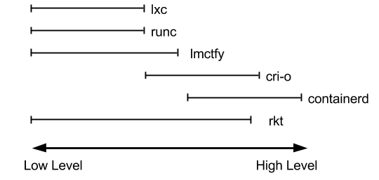
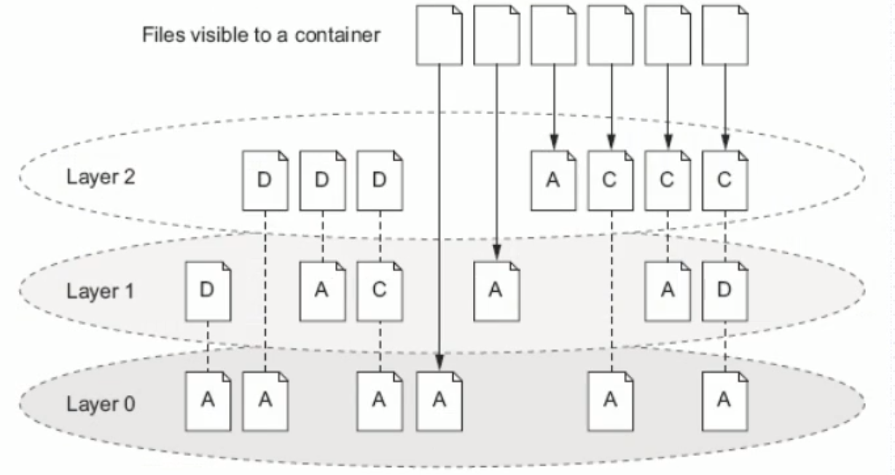
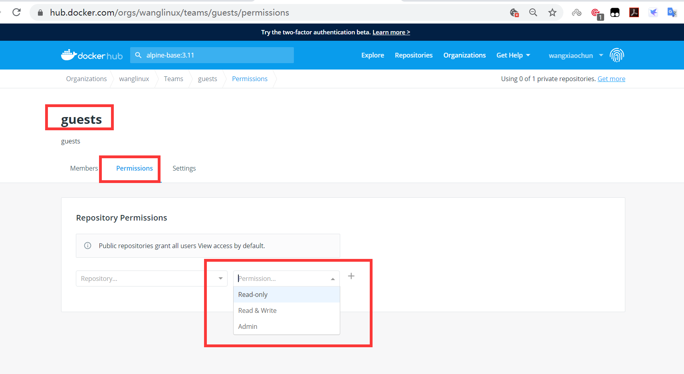
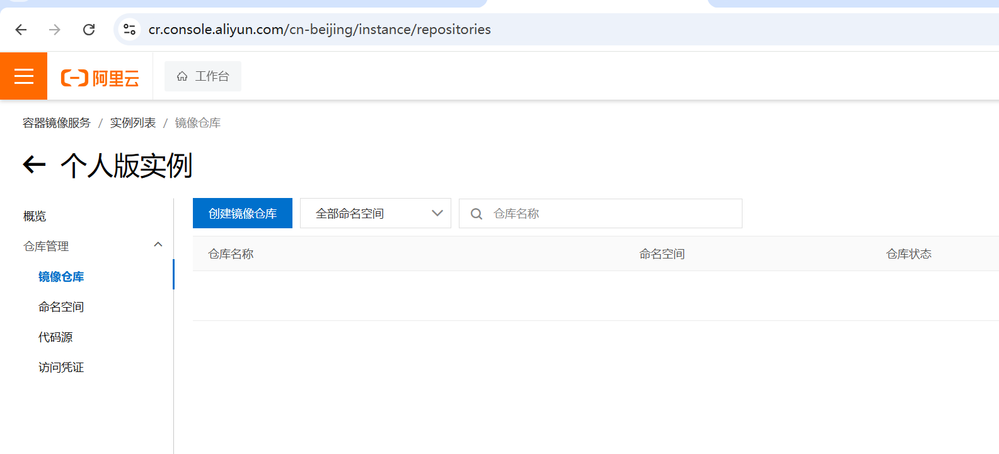
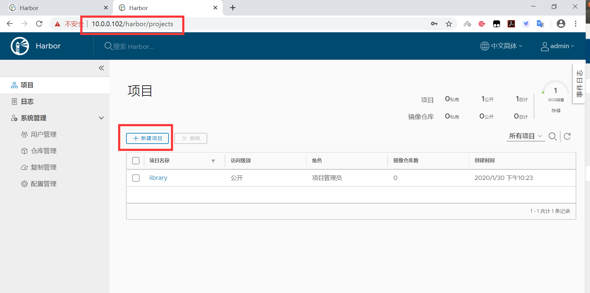
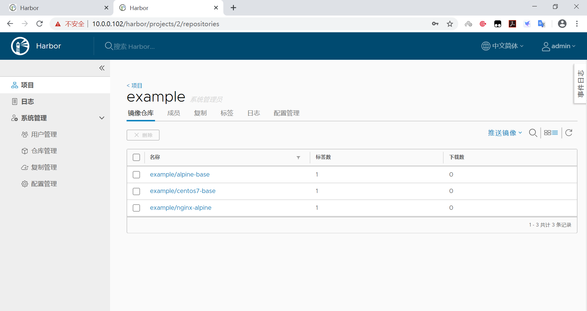

# 1 Docker 介绍和基础操作

Container 即容器，平时生活中指的是可以装下其它物品的工具， 以方便人类归纳放置物品 、存储和异 地运输 ，比如人类使用的衣柜 、行李箱、 背包等可以成为容器，Container 除了容器以外，另一个意 思是集装箱, 很多码头工人将很多装有不同物品但却整齐划一的箱子装载到停靠在岸边大船，然后方便的 运来运去。

早期海运成本远远高于铁路运输的，因为装卸的成本相当高，自从1946年美国人麦克莱恩发明了集装 箱，大大降低了成本，仅当于原来的百分五而已，成为当前成本最低的运输方式。

但今天我们所说的容器是一种 IT 技术。容器其实是一种沙盒技术。顾名思义，沙盒就是能够像一个集装 箱一样，把你的应用装起来。这样，应用与应用之间就有了边界而不会相互干扰;同时装在沙盒里面的应 用，也可以很方便的被搬来搬去，这也是 PaaS 想要的最理想的状态(可移植性,标准化,隔离性)。

容器技术是虚拟化、云计算、大数据之后的一门新兴的并且是炙手可热的新技术， 容器技术提高了硬件 资源利用率、 方便了企业的业务快速横向扩容（可以达到秒级快速扩容）、 实现了业务宕机自愈功能  （配合K8S可以实现，但OpenStack无此功能），因此未来数年会是一个容器愈发流行的时代 ，这是 一 个对于 IT 行业来说非常有影响和价值的技术，而对于IT行业的从业者来说， 熟练掌握容器技术无疑是一 个很有前景的行业工作机会。


## 1.1 Docker 介绍

### 1.1.1 容器历史

虽然 docker 把容器技术推向了巅峰，但容器技术却不是从 docker 诞生的。实际上，容器技术连新技术 都算不上，因为它的诞生和使用确实有些年头了。下面的一串名称可能有的你都没有听说过，但它们的 确都是容器技术的应用: 

1、Chroot Jail

就是我们常见的 chroot 命令的用法。它在 1979 年的时候就出现了，被认为是最早的容器化技术之一。 它可以把一个进程的文件系统隔离起来。

2、The FreeBSD Jail

Freebsd Jail (监狱)实现了操作系统级别的虚拟化，它是操作系统级别虚拟化技术的先驱之一。2000年， 伴随FreeBSD4.0版的发布

3、Linux VServer

使用添加到 Linux 内核的系统级别的虚拟化功能实现的专用虚拟服务器。允许创建许多独立的虚拟专用 服务器（VPS），这些虚拟专用服务器在单个物理服务器上全速同时运行，从而有效地共享硬件资源。 VPS提供与传统Linux服务器几乎相同的操作环境。可以在这样的VPS上启动所有服务（例如ssh，邮件， Web和数据库服务器），而无需（或者在特殊情况下只需进行很少的修改），就像在任何真实服务器上 一样。

每个VPS都有自己的用户帐户数据库和root密码，并且与其他虚拟服务器隔离，但它们共享相同的硬件 资源

2003年11月1日 VServer 1.0 发布

官网:http://linux-vserver.org/

4、Solaris Containers

它也是操作系统级别的虚拟化技术，专为 X86 和 SPARC 系统设计。Solaris 容器是系统资源控制和通过  "区域" 提供边界隔离的组合。

5、OpenVZ

OpenVZ 是一种 Linux 中操作系统级别的虚拟化技术。 它允许创建多个安全隔离的 Linux 容器，即  VPS。

6、Process Containers

Process 容器由 Google 的工程师开发，一般被称为 cgroups。

7、LXC

LXC为Linux Container的简写。可以提供轻量级的虚拟化，以便隔离进程和资源，而且不需要提供指令 解释机制以及全虚拟化的其他复杂性。容器有效地将由单个操作系统管理的资源划分到孤立的组中，以 更好地在孤立的组之间平衡有冲突的资源使用需求

Linux Container提供了在单一可控主机节点上支持多个相互隔离的server container同时执行的机制。 Linux Container有点像chroot，提供了一个拥有自己进程和网络空间的虚拟环境，但又有别于虚拟机， 因为lxc是一种操作系统层次上的资源的虚拟化。

8、Warden

在最初阶段，Warden 使用 LXC 作为容器运行时。 如今已被 CloudFoundy 取代。

9、LMCTFY

LMCTY 是 Let me contain that for you 的缩写。它是 Google 的容器技术栈的开源版本。 Google 的工程师一直在与 docker 的 libertainer 团队合作，并将 libertainer 的核心概念进行抽象并移 植到此项目中。该项目的进展不明，估计会被 libcontainer 取代。

10、Docker

Docker 是一个可以将应用程序及其依赖打包到几乎可以在任何服务器上运行的容器的工具。

11、RKT

RKT 是 Rocket 的缩写，它是一个专注于安全和开放标准的应用程序容器引擎。

### 1.1.2 Docker 是什么


2010年，Solomon Hykes(Docker CTO)和几个年轻人在美国旧金山成立了一家 PaaS 平台的dotCloud 公司 , 此公司主要基于PaaS平台为开发者提供技术服务。

Docker(码头工人) 是一个开源项目，诞生于 2013 年3月27日，最初是 dotCloud 公司（后由于 Docker  开源后大受欢迎在2013年10月就将公司改名为 Docker Inc ，总部位于美国加州的旧金山）内部的一个 开源的 PAAS 服务 (Platform as a ServiceService )的业余项目。它基于 Google 公司推出的 Go 语言实 现。 项目后来加入了 Linux 基金会，遵从了 Apache 2.0 协议，项目代码在 GitHub 上进行维护。

Docker 是基于 Linux 内核实现，Docker 最早采用 LXC 技术 ，LXC 是 Linux 原生支持的容器技术 ，可 以提供轻量级的虚拟化 ，可以说 docker 就是基于 LXC 发展起来 的，提供 LXC 的高级封装，标准的配 置方法，在LXC的基础之上，docker提供了一系列更强大的功能。而虚拟化技术 KVM(KernelKernelbased Virtual Machine Machine) 基于模块实现， 后来Docker 改为自己研发并开源的 runc 技术运行容 器，彻底抛弃了LXC。

Docker 相比虚拟机的交付速度更快，资源消耗更低，Docker 采用客户端/服务端架构，使用远程API来 管理和创建容器，其可以轻松的创建一个轻量级的、可移植的、自给自足的容器，docker 的三大理念是 build(构建)、ship(运输)、 run(运行)，Docker遵从apache 2.0协议，并通过（namespace及cgroup 等）来提供容器的资源隔离与安全保障等，所以Docke容器在运行时不需要类似虚拟机（空运行的虚拟 机占用物理机6-8%性能）的额外资源开销，因此可以大幅提高资源利用率,总而言之Docker是一种用了 新颖方式实现的轻量级虚拟机.类似于VM但是在原理和应用上和VM的差别还是很大的，并且docker的专 业叫法是应用容器(Application Container)。

**Docker 的主要目标**


Build, Ship and Run Any App, Anywhere，即通过对应用组件的封装（Packaging）、分发 （Distribution）、部署（Deployment）、运行（Runtime）等生命周期的管理，达到应用组件级别的 “一次封装，到处运行”。这里的应用组件，既可以是一个Web应用，也可以是一套数据库服务，甚至是 一个操作系统。将应用运行在Docker 容器上，可以实现跨平台，跨服务器，只需一次配置准备好相关的 应用环境，即可实现到处运行，保证研发和生产环境的一致性，解决了应用和运行环境的兼容性问题， 从而极大提升了部署效率，减少故障的可能性

**使用Docker 容器化封装应用程序的意义: **


- 统一基础设施环境-docker环境
  - 硬件的组成配置
  - 操作系统的版本
  - 运行时环境的异构
- 统一程序打包（装箱）方式-docker镜像
  - java程序
  - python程序
  - nodejs程序
- 统一程序部署（运行）方式-docker容器
  - java-jar...→ docker run...
  - python manage.py runserver... → docker run...
  - npm run dev ... → docker run...

### 1.1.3 Docker 和虚拟机，物理主机


**容器和虚拟机技术比较**


- 传统虚拟机是虚拟出一个主机硬件,并且运行一个完整的操作系统 ,然后在这个系统上安装和运行软 件
- 容器内的应用直接运行在宿主机的内核之上,容器并没有自己的内核,也不需要虚拟硬件,相当轻量化
- 每个容器间是互相隔离,每个容器内都有一个属于自己的独立文件系统,独立的进程空间,网络空间,用 户空间等,所以在同一个宿主机上的多个容器之间彼此不会相互影响

**容器和虚拟机比较**


- 资源利用率更高: 开销更小,不需要启动单独的虚拟机OS内核占用硬件资源,可以将服务器性能压榨 至极致.虚拟机一般会有5-20%的损耗,容器运行基本无损耗,所以生产中一台物理机只能运行数十个 虚拟机，但是一般可以运行数百个容器
- 启动速度更快: 可以在数秒内完成启动
- 占用空间更小: 容器一般占用的磁盘空间以MB为单位,而虚拟机以GB
- 集成性更好: 和 CI/CD（持续集成/持续部署）相关技术结合性更好，实现打包镜像发布测试可以一 键运行,做到自动化并快速的部署管理,实现高效的开发生命周期

使用虚拟机是为了更好的实现服务运行环境隔离，每个虚拟机都有独立的内核，虚拟化可以实现不同操 作系统的虚拟机，但是通常一个虚拟机只运行一个服务，很明显资源利用率比较低且造成不必要的性能 损耗，我们创建虚拟机的目的是为了运行应用程序，比如Nginx、PHP、Tomcat等web程序，使用虚拟 机无疑带来了一些不必要的资源开销，而容器技术则基于减少中间运行环节带来较大的性能提升。

根据实验，一个运行着CentOS的KVM虚拟机启动后，在不做优化的情况下，虚拟机自己就需要占用 100~200 MB内存。此外，用户应用运行在虚拟机里面，它对宿主机操作系统的调用就不可避免地要经 过虚拟化软件的拦截和处理，这本身又是一层性能损耗，尤其对计算资源、网络和磁盘I/O的损耗非常 大。

### 1.1.4 Docker 的组成

docker 官网: http://www.docker.com 

帮助文档链接: https://docs.docker.com/ 

docker 镜像: https://hub.docker.com/ 

docker 中文网站: http://www.docker.org.cn/


- Docker 主机(Host): 一个物理机或虚拟机，用于运行Docker服务进程和容器，也称为宿主机， node节点
- Docker 服务端(Server): Docker守护进程，运行docker容器
- Docker 客户端(Client): 客户端使用 docker 命令或其他工具调用docker API
- Docker 镜像(Images): 镜像可以理解为创建实例使用的模板,本质上就是一些程序文件的集合
- Docker 仓库(Registry): 保存镜像的仓库，官方仓库: https://hub.docker.com/，可以搭建私有仓库 harbor
- Docker 容器(Container): 容器是从镜像生成对外提供服务的一个或一组服务,其本质就是将镜像中 的程序启动后生成的进程

### 1.1.5 Namespace

```bash
https://man7.org/linux/man-pages/man7/namespaces.7.html
https://en.wikipedia.org/wiki/Linux_namespaces
```

一个宿主机运行了N个容器，多个容器共用一个 OS，必然带来的以下问题:

- 怎么样保证每个容器都有不同的文件系统并且能互不影响？
- 一个docker主进程内的各个容器都是其子进程，那么如果实现同一个主进程下不同类型的子进程？ 各个容器子进程间能相互通信(内存数据)吗？
- 每个容器怎么解决IP及端口分配的问题？
- 多个容器的主机名能一样吗？
- 每个容器都要不要有root用户？怎么解决账户重名问题？


namespace是Linux系统的底层概念，在LInux内核层实现，即有一些不同类型的命名空间被部署在内 核，各个docker容器运行在同一个docker主进程并且共用同一个宿主机系统内核，各docker容器运行在 宿主机的用户空间，每个容器都要有类似于虚拟机一样的相互隔离的运行空间，但是容器技术是在一个 进程内实现运行指定服务的运行环境，并且还可以保护宿主机内核不受其他进程的干扰和影响，如文件 系统空间、网络空间、进程空间等，目前主要通过以下技术实现容器运行空间的相互隔离: 

| 隔离类型                                  | 功能                                                     | 系统调用参数  | 内核 版本 |
| ----------------------------------------- | -------------------------------------------------------- | ------------- | --------- |
| MNT Namespace(mount)                      | 提供磁盘挂载点和文件系统的 隔离能力                      | CLONE_NEWNS   | 2.4.19    |
| IPC Namespace(InterProcess Communication) | 提供进程间通信的隔离能力, 包括信号量,消息队列和共享 内存 | CLONE_NEWIPC  | 2.6.19    |
| UTS Namespace(UNIX Timesharing System)    | 提供内核,主机名和域名隔离 能力                           | CLONE_NEWUTS  | 2.6.19    |
| PID Namespace(Process Identification)     | 提供进程隔离能力                                         | CLONE_NEWPID  | 2.6.24    |
| Net Namespace(network                     | 提供网络隔离能力,包括网络 设备,网络栈,端口等             | CLONE_NEWNET  | 2.6.29    |
| User Namespace(user)                      | 提供用户隔离能力,包括用户 和组                           | CLONE_NEWUSER | 3.8       |

Pid namespace

- 不同用户的进程就是通过Pid namespace 隔离开的，且不同namespace 中可以有相同Pid。
- 有了Pid namespace, 每个namespace 中的Pid 能够相互隔离。

net namespace

- 网络隔离是通过net namespace 实现的， 每个net namespace 有独立的network devices, IP  addresses, IP routing tables, /proc/net 目录。
- Docker 默认采用veth 的方式将container 中的虚拟网卡同host 上的一个docker bridge: docker0  连接在一起。

ipc namespace

- Container 中进程交互还是采用linux 常见的进程间交互方法（interprocess communication –  IPC）, 包括常见的信号量、消息队列和共享内存。
- container 的进程间交互实际上还是host上具有相同Pid namespace 中的进程间交互，因此需要在 IPC 资源申请时加入namespace 信息- 每个IPC 资源有一个唯一的32 位ID。

mnt namespace

- mnt namespace 允许不同namespace 的进程看到的文件结构不同，这样每个namespace 中的进 程所看到的文件目录就被隔离开了

uts namespace

- UTS(“UNIX Time-sharing System”) namespace允许每个container 拥有独立的hostname 和 domain name, 使其在网络上可以被视作一个独立的节点而非Host 上的一个进程。

user namespace

- 每个container 可以有不同的user 和group id, 也就是说可以在container 内部用container 内部的 用户执行程序而非Host 上的用户。

范例: namespace

```bash
[root@master1 ~]#lsns --help

用法：
   lsns [选项] [<名字空间>]
 
列出系统名称空间。 

选项：
 -J, --json             使用 JSON 输出格式
 -l, --list             使用列表格式的输出
 -n, --noheadings       不打印标题
 -o, --output <list>   定义使用哪个输出列
     --output-all       output all columns
 -p, --task <pid>       打印进程名字空间
 -r, --raw             使用原生输出格式
 -u, --notruncate       不截断列中的文本
 -W, --nowrap           don't use multi-line representation
 -t, --type <name>     namespace type (mnt, net, ipc, user, pid, uts, cgroup, 
time)

-h, --help             display this help
-V, --version         display version

Available output columns:

      NS 名字空间标识符 (inode 号)
      TYPE 名字空间类型
      PATH 名字空间路径
      NPROCS 名字空间中的进程数
         PID 名字空间中的最低 PID
       PPID PID 的 PPID
     COMMAND PID 的命令行
         UID PID 的 UID
       USER PID 的用户名
     NETNSID namespace ID as used by network subsystem
       NSFS nsfs mountpoint (usually used network subsystem)
         PNS parent namespace identifier (inode number)
         ONS owner namespace identifier (inode number)
         
更多信息请参阅 lsns(8)。   

[root@ubuntu2204 ~]#nsenter --help

用法：
   nsenter [选项] [<程序> [<参数>...]]
   
以其他程序的名字空间运行某个程序。

选项：
 -a, --all             enter all namespaces
 -t, --target <pid>     要获取名字空间的目标进程
 -m, --mount[=<文件>]   进入 mount 名字空间
 -u, --uts[=<文件>]     进入 UTS 名字空间(主机名等)
 -i, --ipc[=<文件>]     进入 System V IPC 名字空间
 -n, --net[=<文件>]     进入网络名字空间
 -p, --pid[=<文件>]     进入 pid 名字空间
 -C, --cgroup[=<文件>] 进入 cgroup 名字空间
 -U, --user[=<文件>]   进入用户名字空间
 -T, --time[=<file>]   enter time namespace
 -S, --setuid <uid>     设置进入空间中的 uid
 -G, --setgid <gid>     设置进入名字空间中的 gid
     --preserve-credentials 不干涉 uid 或 gid
 -r, --root[=<目录>]     设置根目录
 -w, --wd[=<dir>]       设置工作目录
 -F, --no-fork         执行 <程序> 前不 fork
 -Z, --follow-context 根据 --target PID 设置 SELinux 环境
 -h, --help             display this help
 -V, --version         display version
 
更多信息请参阅 nsenter(1)。

[root@ubuntu2204 ~]#lsns -t net
       NS TYPE NPROCS   PID USER     NETNSID NSFS                           
COMMAND
4026531840 net     229     1 root unassigned /run/docker/netns/default     
/sbin/init
4026532691 net       2  4136 65535          1 /run/docker/netns/5090da825e77 
/pause
4026532770 net       2  4140 65535          0 /run/docker/netns/cb903a9d63e0 
/pause

[root@ubuntu2204 ~]#ls -l /proc/4140/ns 
总用量 0
lrwxrwxrwx 1 65535 65535 0 11月 12 18:47 cgroup -> 'cgroup:[4026532838]'
lrwxrwxrwx 1 65535 65535 0 11月 12 18:35 ipc -> 'ipc:[4026532768]'
lrwxrwxrwx 1 65535 65535 0 11月 12 18:47 mnt -> 'mnt:[4026532766]'
lrwxrwxrwx 1 65535 65535 0 11月 12 18:35 net -> 'net:[4026532770]'
lrwxrwxrwx 1 65535 65535 0 11月 12 18:35 pid -> 'pid:[4026532769]'
lrwxrwxrwx 1 65535 65535 0 11月 12 18:47 pid_for_children -> 'pid:[4026532769]'
lrwxrwxrwx 1 65535 65535 0 11月 12 18:47 time -> 'time:[4026531834]'
lrwxrwxrwx 1 65535 65535 0 11月 12 18:47 time_for_children -> 'time:[4026531834]'
lrwxrwxrwx 1 65535 65535 0 11月 12 18:47 user -> 'user:[4026531837]'
lrwxrwxrwx 1 65535 65535 0 11月 12 18:47 uts -> 'uts:[4026532767]'

#说明:4136为容器在宿主机的Pid,下面表示进入4136容器的对应网络名称空间执行命令
[root@ubuntu2204 ~]#nsenter -t 4136 -n ip a
1: lo: <LOOPBACK,UP,LOWER_UP> mtu 65536 qdisc noqueue state UNKNOWN group 
default qlen 1000
   link/loopback 00:00:00:00:00:00 brd 00:00:00:00:00:00
   inet 127.0.0.1/8 scope host lo
       valid_lft forever preferred_lft forever
3: eth0@if7: <BROADCAST,MULTICAST,UP,LOWER_UP> mtu 1450 qdisc noqueue state UP 
group default 
   link/ether 42:73:2e:34:e3:91 brd ff:ff:ff:ff:ff:ff link-netnsid 0
   inet 10.244.0.11/24 brd 10.244.0.255 scope global eth0
       valid_lft forever preferred_lft forever
       
[root@ubuntu2204 ~]#nsenter -t 4140 -n ip a
1: lo: <LOOPBACK,UP,LOWER_UP> mtu 65536 qdisc noqueue state UNKNOWN group 
default qlen 1000
   link/loopback 00:00:00:00:00:00 brd 00:00:00:00:00:00
   inet 127.0.0.1/8 scope host lo
       valid_lft forever preferred_lft forever
3: eth0@if6: <BROADCAST,MULTICAST,UP,LOWER_UP> mtu 1450 qdisc noqueue state UP 
group default 
   link/ether f6:20:4e:63:e9:0a brd ff:ff:ff:ff:ff:ff link-netnsid 0
   inet 10.244.0.10/24 brd 10.244.0.255 scope global eth0
       valid_lft forever preferred_lft forever      
```

### 1.1.6 Control groups

Linux Cgroups的全称是Linux Control Groups,是Linux内核的一个功能.最早是由Google的工程师（主 要是Paul Menage和Rohit Seth）在2006年发起，最早的名称为进程容器（process containers）。在 2007年时，因为在Linux内核中，容器（container）这个名词有许多不同的意义，为避免混乱，被重命 名为cgroup，并且被合并到2.6.24版的内核中去。自那以后，又添加了很多功能。

如果不对一个容器做任何资源限制，则宿主机会允许其占用无限大的内存空间，有时候会因为代码bug 程序会一直申请内存，直到把宿主机内存占完，为了避免此类的问题出现，宿主机有必要对容器进行资 源分配限制，比如CPU、内存等

 Cgroups 最主要的作用，就是限制一个进程组能够使用的资源上限，包括CPU、内存、磁盘、网络带宽 等等。此外，还能够对进程进行优先级设置，资源的计量以及资源的控制(比如:将进程挂起和恢复等操 作)。

Cgroups在内核层默认已经开启，从CentOS 和 Ubuntu 不同版本对比，显然内核较新的支持的功能更 多。

**Centos 8.1 cgroups: **

```bash
[root@centos8 ~]#cat /etc/redhat-release 
CentOS Linux release 8.1.1911 (Core) 
[root@centos8 ~]#grep CGROUP /boot/config-4.18.0-147.el8.x86_64 
CONFIG_CGROUPS=y
CONFIG_BLK_CGROUP=y
# CONFIG_DEBUG_BLK_CGROUP is not set
CONFIG_CGROUP_WRITEBACK=y
CONFIG_CGROUP_SCHED=y
CONFIG_CGROUP_PIDS=y
CONFIG_CGROUP_RDMA=y
CONFIG_CGROUP_FREEZER=y
CONFIG_CGROUP_HUGETLB=y
CONFIG_CGROUP_DEVICE=y
CONFIG_CGROUP_CPUACCT=y
CONFIG_CGROUP_PERF=y
CONFIG_CGROUP_BPF=y
# CONFIG_CGROUP_DEBUG is not set
CONFIG_SOCK_CGROUP_DATA=y
# CONFIG_BLK_CGROUP_IOLATENCY is not set
CONFIG_NETFILTER_XT_MATCH_CGROUP=m
CONFIG_NET_CLS_CGROUP=y
CONFIG_CGROUP_NET_PRIO=y
CONFIG_CGROUP_NET_CLASSID=y
```

**Centos 7.6 cgroups: **

```bash
[root@centos7 ~]#cat /etc/redhat-release 
CentOS Linux release 7.6.1810 (Core) 
[root@centos7 ~]#grep CGROUP /boot/config-3.10.0-957.el7.x86_64 
CONFIG_CGROUPS=y
# CONFIG_CGROUP_DEBUG is not set
CONFIG_CGROUP_FREEZER=y
CONFIG_CGROUP_PIDS=y
CONFIG_CGROUP_DEVICE=y
CONFIG_CGROUP_CPUACCT=y
CONFIG_CGROUP_HUGETLB=y
CONFIG_CGROUP_PERF=y
CONFIG_CGROUP_SCHED=y
CONFIG_BLK_CGROUP=y
# CONFIG_DEBUG_BLK_CGROUP is not set
CONFIG_NETFILTER_XT_MATCH_CGROUP=m
CONFIG_NET_CLS_CGROUP=y
CONFIG_NETPRIO_CGROUP=y
```

**ubuntu cgroups: **

```bash
[root@ubuntu1804 ~]#grep CGROUP /boot/config-4.15.0-29-generic 
CONFIG_CGROUPS=y
CONFIG_BLK_CGROUP=y
# CONFIG_DEBUG_BLK_CGROUP is not set
CONFIG_CGROUP_WRITEBACK=y
CONFIG_CGROUP_SCHED=y
CONFIG_CGROUP_PIDS=y
CONFIG_CGROUP_RDMA=y
CONFIG_CGROUP_FREEZER=y
CONFIG_CGROUP_HUGETLB=y
CONFIG_CGROUP_DEVICE=y
CONFIG_CGROUP_CPUACCT=y
CONFIG_CGROUP_PERF=y
CONFIG_CGROUP_BPF=y
# CONFIG_CGROUP_DEBUG is not set
CONFIG_SOCK_CGROUP_DATA=y
CONFIG_NETFILTER_XT_MATCH_CGROUP=m
CONFIG_NET_CLS_CGROUP=m
CONFIG_CGROUP_NET_PRIO=y
CONFIG_CGROUP_NET_CLASSID=y
```

 **cgroups 中内存模块: **

```bash
[root@ubuntu1804 ~]#grep MEMCG /boot/config-4.15.0-29-generic
CONFIG_MEMCG=y
CONFIG_MEMCG_SWAP=y
# CONFIG_MEMCG_SWAP_ENABLED is not set
CONFIG_SLUB_MEMCG_SYSFS_ON=y 
```

### 1.1.7 容器管理工具

有了以上的chroot、namespace、cgroups就具备了基础的容器运行环境，但是还需要有相应的容器创 建与删除的管理工具、以及怎么样把容器运行起来、容器数据怎么处理、怎么进行启动与关闭等问题需 要解决，于是容器管理技术出现了。目前主要是使用docker，早期使用 LXC

#### 1.1.7.1 LXC

LXC: Linux Container。可以提供轻量级的虚拟化功能,以便隔离进程和资源,包括一系列容器的管理工具 软件,如，lxc-create,lxc-start,lxc-attach等,但这技术功能不完善,目前较少使用

官方网站: https://linuxcontainers.org/

案例: Ubuntu安装 和使用 LXC

```bash
[root@ubuntu1804 ~]#apt install lxc lxd
Reading package lists... Done
Building dependency tree   
Reading state information... Done
lxd is already the newest version (3.0.3-0ubuntu1~18.04.1).
lxc is already the newest version (3.0.3-0ubuntu1~18.04.1).
......


[root@ubuntu1804 ~]#lxc-checkconfig   #检查内核对lcx的支持状况，必须全部为lcx
Kernel configuration not found at /proc/config.gz; searching...
Kernel configuration found at /boot/config-4.15.0-29-generic
--- Namespaces ---
Namespaces: enabled
Utsname namespace: enabled
Ipc namespace: enabled
Pid namespace: enabled
User namespace: enabled
Network namespace: enabled
......


[root@ubuntu1804 ~]#lxc-create -t download --name alpine1 -- --dist alpine --
release 3.9 --arch amd64
Setting up the GPG keyring
Downloading the image index
Downloading the rootfs
Downloading the metadata
The image cache is now ready
Unpacking the rootfs

---
You just created an Alpinelinux 3.9 x86_64 (20200121_13:00) container.
[root@ubuntu1804 ~]#lxc-start alpine1   #启动lxc容器
[root@ubuntu1804 ~]#lxc-attach alpine1   #进入lxc容器
~ # ifconfig
eth0     Link encap:Ethernet HWaddr 00:16:3E:DF:9E:45  
         inet addr:10.0.1.51 Bcast:10.0.1.255 Mask:255.255.255.0
         inet6 addr: fe80::216:3eff:fedf:9e45/64 Scope:Link
         UP BROADCAST RUNNING MULTICAST MTU:1500 Metric:1
         RX packets:23 errors:0 dropped:0 overruns:0 frame:0
         TX packets:12 errors:0 dropped:0 overruns:0 carrier:0
         collisions:0 txqueuelen:1000 
         RX bytes:2484 (2.4 KiB) TX bytes:1726 (1.6 KiB)
lo       Link encap:Local Loopback  
         inet addr:127.0.0.1 Mask:255.0.0.0
         inet6 addr: ::1/128 Scope:Host
         UP LOOPBACK RUNNING MTU:65536 Metric:1
         RX packets:0 errors:0 dropped:0 overruns:0 frame:0
         TX packets:0 errors:0 dropped:0 overruns:0 carrier:0
         collisions:0 txqueuelen:1000 
         RX bytes:0 (0.0 B) TX bytes:0 (0.0 B)
         
~ # uname -r
4.15.0-29-generic
~ # uname -a
Linux alpine12 4.15.0-29-generic #31-Ubuntu SMP Tue Jul 17 15:39:52 UTC 2018 
x86_64 Linux
~ # cat /etc/issue 
Welcome to Alpine Linux 9
Kernel \r on an \m (\l)         
```

命令选项说明: 

```bash
-t 模板: -t 选项后面跟的是模板，模式可以认为是一个原型，用来说明需要一个什么样的容器(比如容器里
面需不需要有vim, apache等软件)．模板实际上就是一个脚本文件(位于/usr/share/lxc/templates目
录)，我们这里指定download模板(lxc-create会调用lxc-download脚本，该脚本位于刚说的模板目录
中)是说明我们目前没有自己模板，需要下载官方的模板

--name 容器名称:   为创建的容器命名
-- : --用来说明后面的参数是传递给download脚本的，告诉脚本需要下载什么样的模板
--dist 操作系统名称: 指定操作系统
--release 操作系统: 指定操作系统，可以是各种Linux的变种
--arch 架构: 指定架构，是x86还是arm，是32位还是64位
```

 lxc启动容器依赖于模板，清华模板源: https://mirrors.tuna.tsinghua.edu.cn/help/lxc-images/，但是 做模板相对较难，需要手动一步步创构建文件系统、准备基础目录及可执行程序等，而且在大规模使用 容器的场景很难横向扩展，另外后期代码升级也需要重新从头构建模板，基于以上种种原因便有了 docker

#### 1.1.7.2 docker

Docker 相当于增强版的LXC,功能更为强大和易用,也是当前最主流的容器前端管理工具

Docker 先启动一个容器也需要一个外部模板，也称为镜像，docke的镜像可以保存在一个公共的地方共 享使用，只要把镜像下载下来就可以使用，最主要的是可以在镜像基础之上做自定义配置并且可以再把 其提交为一个镜像，一个镜像可以被启动为多个容器。


Docker的镜像是分层的，镜像底层为库文件且只读层即不能写入也不能删除数据，从镜像加载启动为一 个容器后会生成一个可写层，其写入的数据会复制到宿主机上对应容器的目录，但是容器内的数据在删 除容器后也会被随之删除。

#### 1.1.7.3 pouch

项目网点: https://github.com/alibaba/pouch

Pouch （小袋子）起源于 2011 年，并于2017年11月19日上午，在中国开源年会现场，阿里巴巴正式开 源了基于 Apache 2.0 协议的容器技术 Pouch。Pouch 是一款轻量级的容器技术，拥有快速高效、可移 植性高、资源占用少等特性，主要帮助阿里更快的做到内部业务的交付，同时提高超大规模下数据中心 的物理资源利用率

目前的容器方案大多基于 Linux 内核提供的 cgroup 和 namespace 来实现隔离，然后这样轻量级方案 存在弊端: 

- 容器间，容器与宿主间，共享同一个内核
- 内核实现的隔离资源，维度不足

面对如此的内核现状，阿里巴巴采取了三个方面的工作，来解决容器的安全问题: 

- 用户态增强容器的隔离维度，比如网络带宽、磁盘使用量等
- 给内核提交 patch，修复容器的资源可见性问题，cgroup 方面的 bug
- 实现基于 Hypervisor 的容器，通过创建新内核来实现容器隔离

#### 1.1.7.4 Podman


虽然目前 Docker 是管理 Linux 容器最好的工具，注意没有之一，但是podman的横空出现即将改变这 一点

什么是Podman？

Podman即Pod Manager tool，从名称上可以看出和kubernets的pod的密切联系，不过就其功能来 说，简而言之: `alias docker = podman` ,是CentOS 8 新集成的功能，或许不久的未来会代替docker

Podman是一个 为 Kubernetes 而生的开源的容器管理工具，原来是 CRI-O（即容器运行时接口CRI 和 开放容器计划OCI） 项目的一部分，后来被分离成一个单独的项目叫 libpod。其可在大多数Linux平台 上使用，它是一种无守护程序的容器引擎，用于在Linux系统上开发，管理和运行任何符合Open  Container Initiative（OCI）标准的容器和容器镜像。

Podman 提供了一个与Docker兼容的命令行前端，Podman 里面87%的指令都和Docker CLI 相同，因 此可以简单地为Docker CLI别名，即“ alias docker = podman”，事实上，podman使用的一些库也是 docker的一部分。

```bash
CRI-O is an implementation of the Kubernetes CRI (Container Runtime Interface) to 
enable using OCI (Open Container Initiative) compatible runtimes
```

官网地址: https://podman.io/

项目地址: https://github.com/containers/libpod

**Podman 和docker不同之处**

- docker 需要在系统上运行一个守护进程(docker daemon)，这会产生一定的开销，而podman 不 需要

- 启动容器的方式不同: 

  `docker cli `命令通过API跟 `Docker Engine(引擎)` 交互告诉它我想创建一个container，然后 `docker Engine `才会调用 `OCI container runtime(runc) `来启动一个container。这代表 container的process(进程)不会是 Docker CLI 的 `child process(子进程)` ，而是 Docker  Engine 的 child process 。

  `Podman` 是直接给 `OCI containner runtime(runc) `进行交互来创建container的，所以 `container process `直接是 `podman` 的 `child process `。

- 因为docke有docker daemon，所以docker启动的容器支持 --restart 策略，但是podman不支持

- docker需要使用root用户来创建容器。 这可能会产生安全风险，尤其是当用户知道docker run命 令的--privileged选项时。podman既可以由root用户运行，也可以由非特权用户运行

- docker在Linux上作为守护进程运行扼杀了容器社区的创新。 如果要更改容器的工作方式，则需要 更改docker守护程序并将这些更改推送到上游。 没有守护进程，容器基础结构更加模块化，更容 易进行更改。 podman的无守护进程架构更加灵活和安全。

### 1.1.8 Docker 的优势

- 快速部署: 短时间内可以部署成百上千个应用，更快速交付到线上
- 高效虚拟化: 不需要额外hypervisor支持，基于linux内核实现应用虚拟化，相比虚拟机大幅提高性 能和效率
- 节省开支: 提高服务器利用率，降低IT支出
- 简化配置: 将运行环境打包保存至容器，使用时直接启动即可
- 环境统一: 将开发，测试，生产的应用运行环境进行标准化和统一，减少环境不一样带来的各种问 题
- 快速迁移和扩展: 可实现跨平台运行在物理机、虚拟机、公有云等环境，良好的兼容性可以方便将 应用从A宿主机迁移到B宿主机，甚至是A平台迁移到B平台
- 更好的实现面向服务的架构,推荐一个容器只运行一个应用,实现分布的应用模型,可以方便的进行横 向扩展,符合开发中高内聚,低耦合的要求,减少不同服务之间的相互影响

### 1.1.9 Docker 的缺点

- 多个容器共用宿主机的内核，各应用之间的隔离不如虚拟机彻底
- 由于和宿主机之间的进程也是隔离的,需要进入容器查看和调试容器内进程等资源,变得比较困难和 繁琐
- 如果容器内进程需要查看和调试,需要在每个容器内都需要安装相应的工具,这也造成存储空间的重 复浪费

### 1.1.10 容器的相关技术

#### 1.1.10.1 容器规范


OCI 官网:https://opencontainers.org/

容器技术除了的docker之外，还有coreOS的rkt，还有阿里的Pouch，为了保证容器生态的标准性和健 康可持续发展，包括Linux 基金会、Docker、微软、红帽、谷歌和IBM等公司在2015年6月共同成立了 一个叫Open Container Initiative（OCI）的组织，其目的就是制定开放的标准的容器规范，目前OCI一 共发布了两个规范，分别是runtime spec和 image format spec，有了这两个规范，不同的容器公司 开发的容器只要兼容这两个规范，就可以保证容器的可移植性和相互可操作性。

#### 1.1.10.2 容器 runtime

runtime是真正运行容器的地方，因此为了运行不同的容器runtime需要和操作系统内核紧密合作相互在 支持，以便为容器提供相应的运行环境

对于容器运行时主要有两个级别：Low Level(使用接近内核层) 和 High Level(使用接近用户层)目前，市 面上常用的容器引擎有很多，主要有下图的那几种。





dockershim, containerd 和cri-o都是遵循CRI的容器运行时，我们称他们为高层级运行时（High-level  Runtime）

其他的容器运营厂商最底层的runc仍然是Docker在维护的。

Google,CoreOS,RedHat都推出自已的运行时:lmctfy,rkt,cri-o,但到目前Docker仍然是最主流的容器引擎 技术。

runtime 类型: 

- Lxc: linux上早期的runtime，在 2013 年 Docker 刚发布的时候,就是采用lxc作为runtime, Docker 把 LXC 复杂的容器创建与使用方式简化为 Docker 自己的一套命令体系。随着Docker的发展，原 有的LXC不能满足Docker的需求,比如跨平台功能
- Libcontainer: 随着 Docker 的不断发展，重新定义容器的实现标准，将底层实现都抽象化到  Libcontainer 的接口。这就意味着，底层容器的实现方式变成了一种可变的方案，无论是使用  namespace、cgroups 技术抑或是使用 systemd 等其他方案，只要实现了 Libcontainer 定义的一 组接口，Docker 都可以运行。这也为 Docker 实现全面的跨平台带来了可能。
- runc: 早期libcontainer是Docker公司控制的一个开源项目，OCI的成立后,Docker把libcontainer 项目移交给了OCI组织,runC就是在libcontainer的基础上进化而来,目前Docker默认的runtime， runc遵守OCI规范
- rkt: 是CoreOS开发的容器runtime，也符合OCI规范，所以使用rktruntime也可以运行Docker容 器

Docker 的运行机制


 范例: 查看docker的 runtime

```bash
[root@ubuntu1804 ~]#docker info 
Client:
 Debug Mode: false
 
Server:
 Containers: 0
 Running: 0
 Paused: 0
 Stopped: 0
 Images: 1
 Server Version: 19.03.5
 Storage Driver: overlay2
 Backing Filesystem: extfs
 Supports d_type: true
 Native Overlay Diff: true
 Logging Driver: json-file
 Cgroup Driver: cgroupfs
 Plugins:
 Volume: local
 Network: bridge host ipvlan macvlan null overlay
 Log: awslogs fluentd gcplogs gelf journald json-file local logentries splunk 
syslog
 Swarm: inactive
 Runtimes: runc         #Runtimes
 Default Runtime: runc  #runtime
 Init Binary: docker-init
 containerd version: b34a5c8af56e510852c35414db4c1f4fa6172339
 runc version: 3e425f80a8c931f88e6d94a8c831b9d5aa481657
 init version: fec3683
 Security Options:
 apparmor
 seccomp
   Profile: default
 Kernel Version: 4.15.0-29-generic
 Operating System: Ubuntu 18.04.1 LTS
 OSType: linux
 Architecture: x86_64
 CPUs: 1
 Total Memory: 962MiB
 Name: ubuntu1804.wang.org
 ID: G2JQ:M4DG:CW74:EETR:GU5U:OROC:ZN2F:RKSA:YQY2:XJYX:OHG7:SSVE
 Docker Root Dir: /var/lib/docker
 Debug Mode: false
 Registry: https://index.docker.io/v1/
 Labels:
 Experimental: false
 Insecure Registries:
  127.0.0.0/8
 Live Restore Enabled: false
WARNING: No swap limit support
```

#### 1.1.10.3 镜像仓库 Registry

统一保存镜像而且是多个不同镜像版本的地方，叫做镜像仓库

- Docker hub: docker官方的公共仓库，已经保存了大量的常用镜像，可以方便大家直接使用
- 阿里云，网易等第三方镜像的公共仓库
- Image registry: docker 官方提供的私有仓库部署工具，无web管理界面，目前使用较少
- Harbor: vmware 提供的自带web界面自带认证功能的镜像私有仓库，目前有很多公司使用

#### 1.1.10.4 容器编排工具


当多个容器在多个主机运行的时候，单独管理容器是相当复杂而且很容易出错，而且也无法实现某一台 主机宕机后容器自动迁移到其他主机从而实现高可用的目的，也无法实现动态伸缩的功能，因此需要有 一种工具可以实现统一管理、动态伸缩、故障自愈、批量执行等功能，这就是容器编排引擎

容器编排通常包括容器管理、调度、集群定义和服务发现等功能

- Docker compose : docker 官方实现单机的容器的编排工具
- Docker swarm: docker 官方开发的容器编排引擎,支持overlay network
- Mesos+Marathon: Mesos是Apache下的开源分布式资源管理框架，它被称为是分布式系统的内 核。Mesos最初是由加州大学伯克利分校的AMPLab开发的，后在Twitter得到广泛使用。通用的集 群组员调度平台，mesos(资源分配)与marathon(容器编排平台)一起提供容器编排引擎功能
- Kubernetes: google领导开发的容器编排引擎，内部项目为Borg，且其同时支持 docker 和  CoreOS,当前已成为容器编排工具事实上的标准

## 1.2 Docker 安装及基础命令介绍

### 1.2.1 Docker 版本说明

官方网址: https://www.docker.com/

**OS系统版本选择: **

Docker 目前已经支持多种操作系统的安装运行，比如Ubuntu、CentOS、Redhat、Debian、Fedora， 甚至是还支持了Mac和Windows，在linux系统上需要内核版本在3.10或以上

**Docker版本选择: **

```bash
github地址: https://github.com/moby/moby
```


Docker版本号之前一直是0.X版本或1.X版本，从2013年3月13日发布第一个版本0.1.1-1开始一直到2017 年02月08日发布1.13.1版

从2017年3月1号开始改为每个季度发布一次稳定版，其版本号规则也统一变更为YY.MM.xx，第一个版 本为17.03.0, 例如17.09表示是2017年9月份发布的

Docker之前没有区分版本，但是2017年推出(将docker更名为)新的项目Moby，Moby项目属于Docker 项目的全新上游，Docker将是一个隶属于的Moby的子产品，而且之后的版本之后开始区分为  CE（Docker Community Edition，社区版本）和 EE（Docker Enterprise Edition，企业收费版），CE 社区版本和EE企业版本都是每个季度发布一个新版本，但是EE版本提供后期安全维护1年，而CE版本是4 个月，以下为官方原文: 

https://blog.docker.com/2017/03/docker-enterprise-edition/

```bash
Docker CE and EE are released quarterly, and CE also has a monthly “Edge” option. 
Each Docker EE release is supported and maintained for one year and receives 
security and critical bugfixes during that period. We are also improving Docker 
CE maintainability by maintaining each quarterly CE release for 4 months. That 
gets Docker CE users a new 1-month window to update from one version to the 
next.

Docker CE和EE每季度发布一次，CE也有每月一次的“Edge”选项。每个Docker EE版本都支持和维护一
年，并在此期间接受安全和关键错误修复。我们还通过将每个季度的CE发布保持4个月来提高Docker CE的可
维护性。这为Docker CE用户提供了一个新的1个月窗口，可以从一个版本更新到下一个版本。
```

如果要布署到 kubernetes上，需要查看相关kubernetes对docker版本要求的说明，比如: 

```bash
https://github.com/kubernetes/kubernetes/blob/v1.33.0/CHANGELOG/CHANGELOG-1.33.md
```

### 1.2.2 安装和删除方法

官方文档 : https://docs.docker.com/engine/install/

阿里云文档: https://developer.aliyun.com/mirror/docker-ce?spm=a2c6h.13651102.0.0.3e221b11guHCWE

#### 1.2.2.1 Ubuntu 安装和删除Docker

官方文档: https://docs.docker.com/install/linux/docker-ce/ubuntu/

**Ubuntu 14.04/16.04/18.04/20.04 安装docker**

```bash
# step 1: 安装必要的一些系统工具
sudo apt-get update
sudo apt-get -y install apt-transport-https ca-certificates curl softwareproperties-common
#step 2: 安装GPG证书
curl -fsSL https://mirrors.aliyun.com/docker-ce/linux/ubuntu/gpg | sudo apt-key 
add -
# Step 3: 写入软件源信息
sudo add-apt-repository "deb [arch=amd64] https://mirrors.aliyun.com/dockerce/linux/ubuntu
$(lsb_release -cs) stable"
# Step 4: 更新并安装Docker-CE
sudo apt-get -y update
sudo apt-get -y install docker-ce


# 安装指定版本的Docker-CE:
# Step 1: 查找Docker-CE的版本:
apt-cache madison docker-ce 
docker-ce | 5:19.03.5~3-0~ubuntu-bionic | https://mirrors.aliyun.com/dockerce/linux/ubuntu
 bionic/stable amd64 Packages
 docker-ce | 5:19.03.4~3-0~ubuntu-bionic | https://mirrors.aliyun.com/dockerce/linux/ubuntu
 bionic/stable amd64 Packages
 docker-ce | 5:19.03.3~3-0~ubuntu-bionic | https://mirrors.aliyun.com/dockerce/linux/ubuntu
 bionic/stable amd64 Packages
 docker-ce | 5:19.03.2~3-0~ubuntu-bionic | https://mirrors.aliyun.com/dockerce/linux/ubuntu
 bionic/stable amd64 Packages
 docker-ce | 5:19.03.1~3-0~ubuntu-bionic | https://mirrors.aliyun.com/dockerce/linux/ubuntu
 bionic/stable amd64 Packages
 docker-ce | 5:19.03.0~3-0~ubuntu-bionic | https://mirrors.aliyun.com/dockerce/linux/ubuntu
 bionic/stable amd64 Packages
 ......
 
# Step 2: 安装指定版本的Docker-CE: (VERSION例如上面的5:17.03.1~ce-0~ubuntu-xenial)
sudo apt-get -y install docker-ce=[VERSION] docker-ce-cli=[VERSION]
#示例:指定版本安装
apt-get -y install docker-ce=5:18.09.9~3-0~ubuntu-bionic  docker-cecli=5:18.09.9~3-0~ubuntu-bionic 
```

**删除docker**

```bash
[root@ubuntu ~]#apt purge docker-ce
[root@ubuntu ~]#rm -rf /var/lib/docker
```

范例: 内置仓库安装docker

```bash
[root@ubuntu2004 ~]#apt -y install docker.io
[root@ubuntu2004 ~]#docker version
Client:
 Version:           20.10.12
 API version:       1.41
 Go version:       go1.16.2
 Git commit:        20.10.12-0ubuntu2~20.04.1
 Built:             Wed Apr  6 02:14:38 2022
 OS/Arch:           linux/amd64
 Context:           default
 Experimental:      true
 
Server:
 Engine:
 Version:          20.10.12
 API version:      1.41 (minimum version 1.12)
 Go version:       go1.16.2
 Git commit:       20.10.12-0ubuntu2~20.04.1
 Built:           Thu Feb 10 15:03:35 2022
 OS/Arch:         linux/amd64
 Experimental:     false
 containerd:
 Version:          1.5.9-0ubuntu1~20.04.4
 GitCommit:        
 runc:
 Version:          1.1.0-0ubuntu1~20.04.1
 GitCommit:        
 docker-init:
 Version:          0.19.0
 GitCommit:         
```

范例： 安装指定版本

```bash
# step 1: 安装必要的一些系统工具
[root@ubuntu2004 ~]#sudo apt-get update
[root@ubuntu2004 ~]#sudo apt-get -y install apt-transport-https ca-certificates 
curl software-properties-common
# step 2: 安装GPG证书
[root@ubuntu2004 ~]#curl -fsSL https://mirrors.aliyun.com/dockerce/linux/ubuntu/gpg
 | sudo apt-key add -
# Step 3: 写入软件源信息
[root@ubuntu2004 ~]#sudo add-apt-repository "deb [arch=amd64] 
https://mirrors.aliyun.com/docker-ce/linux/ubuntu $(lsb_release -cs) stable"
# Step 4: 更新并安装Docker-CE
[root@ubuntu2004 ~]#sudo apt-get -y update


# 安装指定版本的Docker-CE:
# Step 1: 查找Docker-CE的版本:
[root@ubuntu2004 ~]#apt-cache madison docker-ce
#   docker-ce | 17.03.1~ce-0~ubuntu-xenial | https://mirrors.aliyun.com/dockerce/linux/ubuntu
 xenial/stable amd64 Packages
#   docker-ce | 17.03.0~ce-0~ubuntu-xenial | https://mirrors.aliyun.com/dockerce/linux/ubuntu
 xenial/stable amd64 Packages
# Step 2: 安装指定版本的Docker-CE: (VERSION例如上面的17.03.1~ce-0~ubuntu-xenial)
# sudo apt-get -y install docker-ce=[VERSION]
[root@ubuntu2004 ~]#apt-cache madison docker-ce
docker-ce | 5:20.10.17~3-0~ubuntu-focal | https://mirrors.aliyun.com/dockerce/linux/ubuntu
 focal/stable amd64 Packages
 docker-ce | 5:20.10.16~3-0~ubuntu-focal | https://mirrors.aliyun.com/dockerce/linux/ubuntu
 focal/stable amd64 Packages
 ......
 
 
[root@ubuntu2004 ~]#apt install docker-ce=5:20.10.10~3-0~ubuntu-focal docker-cecli=5:20.10.10~3-0~ubuntu-focal
[root@ubuntu2004~]#docker version
Client: Docker Engine - Community
 Version:           20.10.10
 API version:       1.41
 Go version:       go1.16.9
 Git commit:       b485636
 Built:             Mon Oct 25 07:42:59 2021
 OS/Arch:           linux/amd64
 Context:           default
 Experimental:      true
Server: Docker Engine - Community
 Engine:
 Version:          20.10.10
 API version:      1.41 (minimum version 1.12)
 Go version:       go1.16.9
 Git commit:       e2f740d
 Built:           Mon Oct 25 07:41:08 2021
 OS/Arch:         linux/amd64
 Experimental:     false
 containerd:
 Version:          1.6.6
 GitCommit:       10c12954828e7c7c9b6e0ea9b0c02b01407d3ae1
 runc:
 Version:          1.1.2
 GitCommit:       v1.1.2-0-ga916309
 docker-init:
 Version:          0.19.0
 GitCommit:       de40ad0
```

#### 1.2.2.3 Linux 二进制离线安装

本方法适用于无法上网或无法通过包安装方式安装的主机上安装docker

安装文档: https://docs.docker.com/install/linux/docker-ce/binaries/

**二进制安装下载路径**

https://download.docker.com/linux/

https://mirrors.aliyun.com/docker-ce/linux/static/stable/x86_64/

范例: 在CentOS8上实现二进制安装docker

```bash
[root@centos8 ~]#wget https://download.docker.com/linux/static/stable/x86_64/docker-19.03.5.tgz

[root@centos8 ~]#tar xvf docker-19.03.5.tgz 
docker/
docker/docker-init
docker/docker
docker/dockerd
docker/runc
docker/ctr
docker/docker-proxy
docker/containerd
docker/containerd-shim
[root@centos8 ~]#cp docker/* /usr/bin/

#启动dockerd服务
[root@centos8 ~]#dockerd &>/dev/null &

[root@centos8 ~]#docker version

[root@centos8 ~]#pstree -p
systemd(1)─┬─NetworkManager(660)─┬─{NetworkManager}(669)
           │                     └─{NetworkManager}(671)
           ├─VGAuthService(662)
           ├─agetty(718)
           ├─atd(712)
           ├─auditd(625)───{auditd}(627)
           ├─automount(905)─┬─{automount}(912)
           │               ├─{automount}(913)
           │               ├─{automount}(930)
           │               └─{automount}(937)
           ├─containerd(679)─┬─{containerd}(693)
           │                 ├─{containerd}(694)
           │                 ├─{containerd}(696)
           │                 ├─{containerd}(704)
           │                 ├─{containerd}(705)
           │                 ├─{containerd}(707)
           │                 └─{containerd}(708)
           ├─crond(713)
           ├─dbus-daemon(658)
           ├─dockerd(908)─┬─{dockerd}(922)
           │             ├─{dockerd}(923)
           │             ├─{dockerd}(925)
           │             ├─{dockerd}(944)
           │             ├─{dockerd}(1028)
           │             ├─{dockerd}(1100)
           │             └─{dockerd}(1114)
           ├─polkitd(659)─┬─{polkitd}(670)
           │             ├─{polkitd}(672)
           │             ├─{polkitd}(677)
           │             ├─{polkitd}(678)
           │             └─{polkitd}(701)
           ├─rngd(664)───{rngd}(666)
           ├─rsyslogd(906)─┬─{rsyslogd}(911)
           │               └─{rsyslogd}(914)
           ├─sshd(675)───sshd(1370)───sshd(1382)───bash(1383)───pstree(1441)
           ├─sssd(661)─┬─sssd_be(688)
           │           └─sssd_nss(703)
           ├─systemd(1373)───(sd-pam)(1376)
           ├─systemd-journal(551)
           ├─systemd-logind(709)
           ├─systemd-udevd(580)
           ├─tuned(674)─┬─{tuned}(915)
           │           ├─{tuned}(934)
           │           └─{tuned}(948)
           └─vmtoolsd(663)
```

范例: 创建 service文件 

```bash
[root@centos8 ~]#cat > /lib/systemd/system/docker.service <<-EOF
[Unit]
Description=Docker Application Container Engine
Documentation=https://docs.docker.com
After=network-online.target firewalld.service
Wants=network-online.target

[Service]
Type=notify
# the default is not to use systemd for cgroups because the delegate issues 
still
# exists and systemd currently does not support the cgroup feature set required
# for containers run by docker
ExecStart=/usr/bin/dockerd -H unix://var/run/docker.sock
ExecReload=/bin/kill -s HUP \$MAINPID
# Having non-zero Limit*s causes performance problems due to accounting overhead
# in the kernel. We recommend using cgroups to do container-local accounting.
LimitNOFILE=infinity
LimitNPROC=infinity
LimitCORE=infinity
# Uncomment TasksMax if your systemd version supports it.
# Only systemd 226 and above support this version.
#TasksMax=infinity
TimeoutStartSec=0
# set delegate yes so that systemd does not reset the cgroups of docker 
containers
Delegate=yes
# kill only the docker process, not all processes in the cgroup
KillMode=process
# restart the docker process if it exits prematurely
Restart=on-failure
StartLimitBurst=3
StartLimitInterval=60s

[Install]
WantedBy=multi-user.target
EOF

[root@centos8 ~]#systemctl daemon-reload
[root@centos8 ~]#systemctl enable --now docker
```

范例： 一键离线安装二进制 docker

```bash
#!/bin/bash

DOCKER_VERSION=20.10.10
URL=https://mirrors.aliyun.com

prepare () {
    if [ ! -e docker-${DOCKER_VERSION}.tgz ];then
        wget ${URL}/dockerce/linux/static/stable/x86_64/docker-${DOCKER_VERSION}.tgz

   fi
   [ $? -ne 0 ] && { echo "文件下载失败"; exit; }
}

install_docker () {
   tar xf docker-${DOCKER_VERSION}.tgz -C /usr/local/
    cp /usr/local/docker/* /usr/bin/
    cat > /lib/systemd/system/docker.service <<-EOF
[Unit]
Description=Docker Application Container Engine
Documentation=https://docs.docker.com
After=network-online.target firewalld.service
Wants=network-online.target

[Service]
Type=notify
# the default is not to use systemd for cgroups because the delegate issues 
still
# exists and systemd currently does not support the cgroup feature set required
# for containers run by docker
ExecStart=/usr/bin/dockerd -H unix://var/run/docker.sock
ExecReload=/bin/kill -s HUP \$MAINPID
# Having non-zero Limit*s causes performance problems due to accounting overhead
# in the kernel. We recommend using cgroups to do container-local accounting.
LimitNOFILE=infinity
LimitNPROC=infinity
LimitCORE=infinity
# Uncomment TasksMax if your systemd version supports it.
# Only systemd 226 and above support this version.
#TasksMax=infinity
TimeoutStartSec=0
# set delegate yes so that systemd does not reset the cgroups of docker 
containers
Delegate=yes
# kill only the docker process, not all processes in the cgroup
KillMode=process
# restart the docker process if it exits prematurely
Restart=on-failure
StartLimitBurst=3
StartLimitInterval=60s

[Install]
WantedBy=multi-user.target
EOF
   systemctl daemon-reload
}

start_docker (){
   systemctl enable --now docker
   docker version
}

prepare
install_docker
start_docker
```

范例：二进制安装相关文件

```bash
[root@ubuntu2204 ~]#tar tvf docker-23.0.3.tgz 
drwxrwxr-x ubuntu/ubuntu     0 2023-04-05 06:11 docker/
-rwxr-xr-x ubuntu/ubuntu 1945273 2023-04-05 06:11 docker/docker-proxy
-rwxr-xr-x ubuntu/ubuntu 9752576 2023-04-05 06:11 docker/containerd-shim-runc-v2
-rwxr-xr-x ubuntu/ubuntu 19181568 2023-04-05 06:11 docker/ctr
-rwxr-xr-x ubuntu/ubuntu 34525800 2023-04-05 06:11 docker/docker
-rwxr-xr-x ubuntu/ubuntu   765808 2023-04-05 06:11 docker/docker-init
-rwxr-xr-x ubuntu/ubuntu 14214624 2023-04-05 06:11 docker/runc
-rwxr-xr-x ubuntu/ubuntu 65060600 2023-04-05 06:11 docker/dockerd
-rwxr-xr-x ubuntu/ubuntu 38379520 2023-04-05 06:11 docker/containerd

[root@ubuntu2204 ~]#tar tvf docker-23.0.3.tgz -C /usr/local/docker/
[root@ubuntu2204 ~]#ls /usr/local/docker/
containerd containerd-shim-runc-v2 ctr docker dockerd docker-init dockerproxy
runc
[root@ubuntu2204 ~]#ldd /usr/local/docker/*
/usr/local/docker/containerd:
 不是动态可执行文件
/usr/local/docker/containerd-shim-runc-v2:
 不是动态可执行文件
/usr/local/docker/ctr:
 不是动态可执行文件
/usr/local/docker/docker:
 不是动态可执行文件
/usr/local/docker/dockerd:
 不是动态可执行文件
/usr/local/docker/docker-init:
 不是动态可执行文件
/usr/local/docker/docker-proxy:
 不是动态可执行文件
/usr/local/docker/runc:
 不是动态可执行文件
```

#### 1.2.2.4 安装 podman

范例: 在CentOS8上安装podman

```bash
#在CentOS8上安装docker会自动安装podman,docker工具只是一个脚本，调用了Podman
[root@centos8 ~]#dnf install docker
[root@centos8 ~]#rpm -ql podman-docker
/usr/bin/docker
[root@centos8 ~]#cat /usr/bin/docker
#!/bin/sh
[ -f /etc/containers/nodocker ] || \
echo "Emulate Docker CLI using podman. Create /etc/containers/nodocker to quiet 
msg." >&2
exec /usr/bin/podman "$@"
[root@centos8 ~]#podman version
Version:            1.4.2-stable2
RemoteAPI Version:  1
Go Version:         go1.12.8
OS/Arch:           linux/amd64

#修改拉取镜像的地址的顺序，提高速度
[root@centos8 ~]#vim /etc/containers/registries.conf
[registries.search]
registries = ['docker.io'，'quay.io'，'registry.redhat.io', 
'registry.access.redhat.com']   
```

#### 1.2.2.5 在不同系统上实现一键安装 docker 脚本

##### 1.2.2.5.1 基于 ubuntu 18.04和20.04 的 一键安装 docker 脚本

```bash
[root@ubuntu1804 ~]#cat install_docker_ubuntu.sh
#!/bin/bash

COLOR="echo -e \\033[1;31m"
END="\033[m"
DOCKER_VERSION="5:19.03.5~3-0~ubuntu-bionic"

install_docker(){
dpkg -s docker-ce &> /dev/null && ${COLOR}"Docker已安装，退出"${END} && exit
apt update
apt  -y install apt-transport-https ca-certificates curl software-propertiescommon

#curl -fsSL https://mirrors.aliyun.com/docker-ce/linux/ubuntu/gpg | sudo apt-key add -
#add-apt-repository "deb [arch=amd64] https://mirrors.aliyun.com/dockerce/linux/ubuntu $(lsb_release -cs) stable"

curl -fsSL https://mirrors.tuna.tsinghua.edu.cn/docker-ce/linux/ubuntu/gpg | 
sudo apt-key add -
add-apt-repository "deb [arch=amd64] 
https://mirrors.tuna.tsinghua.edu.cn/docker-ce/linux/ubuntu $(lsb_release -cs) 
stable"
 
 
apt update
${COLOR}"Docker有以下版本"${END}
apt-cache madison docker-ce
${COLOR}"5秒后即将安装: docker-"${DOCKER_VERSION}" 版本....."${END}
${COLOR}"如果想安装其它Docker版本，请按ctrl+c键退出，修改版本再执行"${END}
sleep 5

apt -y install docker-ce=${DOCKER_VERSION} docker-ce-cli=${DOCKER_VERSION}

mkdir -p /etc/docker
tee /etc/docker/daemon.json <<-'EOF'
{
  "registry-mirrors": ["https://si7y70hh.mirror.aliyuncs.com"]
}
EOF
systemctl daemon-reload
systemctl enable --now docker
docker version && ${COLOR}"Docker 安装成功"${END} ||  ${COLOR}"Docker 安装失
败"${END}
}
install_docker
```

##### 1.2.2.5.2 官方通用安装Docker脚本

从Docker官方下载通用安装脚本

注意： 此脚本当前不支持 Rocky Linux

```bash
[root@ubuntu1804 ~]#curl -fsSL get.docker.com -o get-docker.sh
[root@ubuntu1804 ~]#sh get-docker.sh --mirror Aliyun
```

### 1.2.3 Docker 程序环境


环境配置文件:

```bash
/etc/sysconfig/docker-network
/etc/sysconfig/docker-storage
/etc/sysconfig/docker
```

docker-ce 配置文件: 

```bash
/etc/docker/daemon.json
```

#### 1.2.4 Docker 命令帮助

docker 命令是最常使用的 docker 客户端命令，其后面可以加不同的参数以实现不同的功能

docker 命令有很多子命令，可以用下面方法查看帮助

```bash
#docker 命令帮助
man docker 
docker
docker  --help

#docker 子命令帮助
man docker-COMMAND
docker COMMAND --help
```

官方文档: 

```bash
https://docs.docker.com/reference/
https://docs.docker.com/engine/reference/commandline/cli/
```


### 1.2.5 Docker 相关信息和优化配置

#### 1.2.5.1 查看 docker 版本

```bash
[root@ubuntu1804 ~]#docker version
```

#### 1.2.5.2 查看 docker 详解信息

```bash
[root@ubuntu1804 ~]#docker info
Client:
 Debug Mode: false     #client 端是否开启 debug
 
Server:
 Containers: 2   #当前主机运行的容器总数
 Running: 0     #有几个容器是正在运行的
 Paused: 0      #有几个容器是暂停的
 Stopped: 2     #有几个容器是停止的
 Images: 4       #当前服务器的镜像数
 Server Version: 19.03.5   #服务端版本
 Storage Driver: overlay2  #正在使用的存储引擎
 Backing Filesystem: extfs   #后端文件系统，即服务器的磁盘文件系统
 Supports d_type: true  #是否支持 d_type
 Native Overlay Diff: true  #是否支持差异数据存储
 Logging Driver: json-file #日志类型,每个容器的标准输出以日志存放
在/var/lib/docker/containers/<CONTAINER ID>/<CONTAINER ID>-json.log 
 Cgroup Driver: cgroupfs  #Cgroups 类型
 Plugins:                  #插件
   Volume: local            #卷 
   Network: bridge host ipvlan macvlan null overlay # overlay 跨主机通信
   Log: awslogs fluentd gcplogs gelf journald json-file local logentries splunk 
syslog  # 日志类型
 Swarm: inactive    #是否支持 swarm
 Runtimes: runc     #已安装的容器运行时
 Default Runtime: runc   #默认使用的容器运行时
 Init Binary: docker-init   #初始化容器的守护进程，即 pid 为 1 的进程
 containerd version: b34a5c8af56e510852c35414db4c1f4fa6172339 #版本
 runc version: 3e425f80a8c931f88e6d94a8c831b9d5aa481657  #runc 版本
 init version: fec3683  #init 版本
 Security Options:   #安全选项
   apparmor     #安全模块，https://docs.docker.com/engine/security/apparmor/
   seccomp  #安全计算模块，即制容器操作，
https://docs.docker.com/engine/security/seccomp/
   Profile: default  #默认的配置文件
 Kernel Version: 4.15.0-29-generic  #宿主机内核版本
 Operating System: Ubuntu 18.04.1 LTS  #宿主机操作系统
 OSType: linux    #宿主机操作系统类型
 Architecture: x86_64   #宿主机架构
 CPUs: 1    #宿主机 CPU 数量
 Total Memory: 962MiB   #宿主机总内存 
 Name: ubuntu1804.wang.org #宿主机 hostname
 ID: IZHJ:WPIN:BRMC:XQUI:VVVR:UVGK:NZBM:YQXT:JDWB:33RS:45V7:SQWJ #宿主机 ID
 Docker Root Dir: /var/lib/docker   #宿主机关于docker数据的保存目录,建议使用独立SSD的磁盘,保证性能和空间
 Debug Mode: false   #server 端是否开启 debug
 Registry: https://index.docker.io/v1/  #仓库路径
 Labels:
 Experimental: false  #是否测试版
 Insecure Registries:
  127.0.0.0/8 : #非安全的镜像仓库
 Registry Mirrors:
   https://si7y70hh.mirror.aliyuncs.com/   #镜像仓库
 Live Restore Enabled: false  #是否开启活动重启 (重启docker-daemon 不关闭容器 )
```

范例: 解决上述SWAP报警提示

官方文档: https://docs.docker.com/install/linux/linux-postinstall/#your-kernel-does-not-support-cgroup-swap-limit-capabilities

```bash
[root@ubuntu1804 ~]#docker info
......
WARNING: No swap limit support 

[root@ubuntu1804 ~]# vim /etc/default/grub
GRUB_DEFAULT=0
GRUB_TIMEOUT_STYLE=hidden
GRUB_TIMEOUT=2
GRUB_DISTRIBUTOR=`lsb_ release -i -s 2> /dev/null || echo Debian`
GRUB_CMDLINE_LINUX_DEFAULT=""
GRUB_CMDLINE_LINUX="net.ifnames=0 biosdevname=0 swapaccount=1"  #修改此行

[root@ubuntu1804 ~]# update-grub
[root@ubuntu1804 ~]# reboot
```

#### 1.2.5.3 查看 docker0 网卡

在docker安装启动之后，默认会生成一个名称为docker0的网卡并且默认IP地址为172.17.0.1的网卡

```bash
#ubuntu18.04安装docker后网卡配置
[root@ubuntu1804 ~]#ip a
1: lo: <LOOPBACK,UP,LOWER_UP> mtu 65536 qdisc noqueue state UNKNOWN group 
default qlen 1000
   link/loopback 00:00:00:00:00:00 brd 00:00:00:00:00:00
   inet 127.0.0.1/8 scope host lo
       valid_lft forever preferred_lft forever
   inet6 ::1/128 scope host 
       valid_lft forever preferred_lft forever
2: eth0: <BROADCAST,MULTICAST,UP,LOWER_UP> mtu 1500 qdisc fq_codel state UP 
group default qlen 1000
   link/ether 00:0c:29:34:df:91 brd ff:ff:ff:ff:ff:ff
   inet 10.0.0.100/24 brd 10.0.0.255 scope global eth0
       valid_lft forever preferred_lft forever
   inet6 fe80::20c:29ff:fe34:df91/64 scope link 
       valid_lft forever preferred_lft forever
4: docker0: <BROADCAST,MULTICAST,UP,LOWER_UP> mtu 1500 qdisc noqueue state UP 
group default 
   link/ether 02:42:d3:26:ed:4e brd ff:ff:ff:ff:ff:ff
   inet 172.17.0.1/16 brd 172.17.255.255 scope global docker0
       valid_lft forever preferred_lft forever
   inet6 fe80::42:d3ff:fe26:ed4e/64 scope link 
       valid_lft forever preferred_lft forever
```

#### 1.2.5.4 docker 存储引擎

官方文档关于存储引擎的相关文档: 

https://docs.docker.com/storage/storagedriver/

https://docs.docker.com/storage/storagedriver/select-storage-driver/

- AUFS: （Advanced Mult-Layered Unification Filesystem，版本2之前旧称AnotherUnionFS）是 一种 Union FS ，是文件级的存储驱动。Aufs是之前的UnionFS的重新实现，2006年由Junjiro  Okajima开发

  所谓 UnionFS就是把不同物理位置的目录合并 mount 到同一个目录中。简单来说就是支持将不同 目录挂载到一个虚拟文件系统下的。这种可以层层地叠加修改文件。无论底下有多少都是只读的， 最上系统可写的。当需要修改一个文件时， AUFS 创建该文件的一个副本，使用 CoW 将文件从只 读层复制到可写进行修改，结果也保存在Docker 中，底下的只读层就是 image，可写层就是  Container

  aufs 被拒绝合并到主线 Linux 。其代码被批评为"dense, unreadable, uncommented 密集、不可 读、未注释"。 相反，OverlayFS被合并到 Linux 内核中。在多次尝试将 aufs 合并到主线内核失败 后，作者放弃了

  AUFS 是 Docker 18.06 及更早版本的首选存储驱动程序，在内核 3.13 上运行 Ubuntu 14.04 时不 支持 overlay2 

- Overlay: 一种 Union FS 文件系统， Linux 内核 3.18 后支持 

- Overlay2: Overlay 的升级版，到目前为止，所有 Linux 发行版推荐使用的存储类 型，也是docker 默认使用的存储引擎为overlay2，需要磁盘分区支持d-type功能，因此需要系统磁盘的额外支持,相 对AUFS来说Overlay2 有以下优势: 更简单地设计； 从3.18开始就进入了Linux内核主线；资源消 耗更少

- devicemapper: 因为CentOS 7.2和RHEL 7.2 的之前版本内核版本不支持 overlay2，默认使用的存 储驱动程序，最大数据容量只支持100GB且性能不佳，当前较新版本的CentOS 已经支持 overlay2， 因此推荐使用 overlay2,另外此存储引擎已在Docker Engine 18.09中弃用

- ZFS(Sun -2005)/btrfs(Oracle-2007): 目前没有广泛使用

- vfs: 用于测试环境，适用于无法使用 copy-on -writewrite 时的情况。 此存储驱动程序的性能很 差，通常不建议用于生产

修改存储引擎参考文档: 

https://docs.docker.com/storage/storagedriver/overlayfs-driver/

范例: 在CentOS7.2修改存储引擎

```bash
[root@centos7 ~]#vim /lib/systemd/system/docker.service
.....
ExecStart=/usr/bin/dockerd -s overlay2 -H fd:// --
containerd=/run/containerd/containerd.sock
......

#创建新的xfs分区,添加ftype特性,否则默认无法启动docker服务
[root@centos7 ~]#mkfs.xfs -n ftype=1 /dev/sdb
[root@centos7 ~]#mount /dev/sdb /var/lib/docker

[root@centos7 ~]#systemctl daemon-reload
[root@centos7 ~]#systemctl restart docker
```

注意:修改存储引擎会导致所有容器丢失,所以先备份再修改

```bash
#查看Ubuntu1804的默认存储引擎
[root@ubuntu1804 ~]#docker info |grep Storage
WARNING: No swap limit support
 Storage Driver: overlay2
```

Docker官方推荐首选存储引擎为overlay2，其次为devicemapper，但是devicemapper存在使用空间方 面的一些限制，虽然可以通过后期配置解决，但是官方依然推荐使用overlay2

#### 1.2.5.5 Docker 优化配置

注意：这种方式只对新建的容器有效的，之前的容器不生效

范例: Docker 优化

```bash
[root@ubuntu2004 ~]#vim /etc/docker/daemon.json
{
 "registry-mirrors": [
    "https://registry.docker-cn.com",
    "http://hub-mirror.c.163.com",
    "https://docker.mirrors.ustc.edu.cn",
    "https://si7y70hh.mirror.aliyuncs.com/"
 ],
  #开启远程:https://docs.docker.com/config/daemon/remote-access/ 或者 
ExecStart=/usr/bin/dockerd -H tcp://0.0.0.0:2375 -H fd:// 
 "hosts": ["unix:///var/run/docker.sock", "tcp://10.0.0.10:2375"], 
 "insecure-registries": ["harbor.wanglei.org"],
 "exec-opts": ["native.cgroupdriver=systemd"],
 "graph": "/data/docker",  #指定docker数据目录,新版24.0.0不支持，实现：
ExecStart=/usr/bin/dockerd --data-root=/data/docker
 "max-concurrent-downloads": 10,
 "max-concurrent-uploads": 5,
 "log-opts": {
   "max-size": "300m",   #指定容器日志文件的最大值
   "max-file": "2"       #指定容器日志文件的个数，循环写入日志文件，即一个日志满，会写入第二个文件
 },
 "live-restore": true,   
  "proxies": {           #代理 https://docs.docker.com/network/proxy/
   "default": {
     "httpProxy": "http://proxy.example.com:3128",
     "httpsProxy": "https://proxy.example.com:3129",
     "noProxy": "*.test.example.com,.example.org,127.0.0.0/8"
   }
   "tcp://docker-daemon1.example.com": {
     "noProxy": "*.internal.example.net"
   }
 }
}

[root@ubuntu2004 ~]#systemctl daemon-reload ;systemctl restart docker.service
```

范例：Docker 实现代理功能

```bash
[root@ubuntu2204 ~]#mkdir -p /etc/systemd/system/docker.service.d

[root@ubuntu2204 ~]#cat >> /etc/systemd/system/docker.service.d/http-proxy.conf 
<<EOF
[Service]
Environment="HTTP_PROXY=http://${PROXY_SERVER_IP}:${PROXY_PORT}/"
Environment="HTTPS_PROXY=http://${PROXY_SERVER_IP}:${PROXY_PORT}/"
Environment="NO_PROXY=127.0.0.0/8,172.17.0.0/16,10.0.0.0/24,10.244.0.0/16,192.16
8.0.0/16,cluster.local"
EOF

[root@ubuntu2204 ~]#systemctl daemon-reload && systemctl restart docker.service
```

范例：Docker实现代理脚本

```bash
#!/bin/bash


PROXY_SERVER_IP=10.0.0.1
PROXY_PORT=4780

color () {
    RES_COL=60
    MOVE_TO_COL="echo -en \\033[${RES_COL}G"
    SETCOLOR_SUCCESS="echo -en \\033[1;32m"
    SETCOLOR_FAILURE="echo -en \\033[1;31m"
    SETCOLOR_WARNING="echo -en \\033[1;33m"
    SETCOLOR_NORMAL="echo -en \E[0m"
    echo -n "$1" && $MOVE_TO_COL
    echo -n "["
    if [ $2 = "success" -o $2 = "0" ] ;then
        ${SETCOLOR_SUCCESS}
        echo -n $"  OK  "    
    elif [ $2 = "failure" -o $2 = "1"  ] ;then 
        ${SETCOLOR_FAILURE}
        echo -n $"FAILED"
    else
        ${SETCOLOR_WARNING}
        echo -n $"WARNING"
    fi
    ${SETCOLOR_NORMAL}
    echo -n "]"
    echo 
}

start () {
    [ -d /etc/systemd/system/docker.service.d ] || mkdir -p /etc/systemd/system/docker.service.d
    cat >> /etc/systemd/system/docker.service.d/http-proxy.conf <<EOF
[Service]
Environment="HTTP_PROXY=http://${PROXY_SERVER_IP}:${PROXY_PORT}/"
Environment="HTTPS_PROXY=http://${PROXY_SERVER_IP}:${PROXY_PORT}/"
Environment="NO_PROXY=127.0.0.0/8,172.17.0.0/16,10.0.0.0/24,10.244.0.0/16,192.168.0.0/16,wang.org,cluster.local"
EOF
    systemctl daemon-reload
    systemctl restart docker.service
    systemctl is-active docker.service &> /dev/null
    if [ $? -eq 0 ] ;then 
        color "Docker 服务代理配置完成!" 0  
    else
        color "Docker 服务代理配置失败!" 1
    exit 1
    fi   
}

stop () {
    rm -f /etc/systemd/system/docker.service.d/http-proxy.conf
    systemctl daemon-reload
    systemctl restart docker.service 
    systemctl is-active docker.service &> /dev/null 
    if [ $? -eq 0 ] ;then
        color "Docker 服务代理取消完成!" 0    
    else
        color "Docker 服务代理取消失败!" 1
    exit 1
    fi
   
}

usage () {
    echo "Usage: $(basename $0) start|stop"
    exit 1
}

case $1 in 
start)
    start
    ;;
stop)
    stop
    ;;
*)
    usage
    ;;
esac

```

## 1.3 镜像管理

### 1.3.1 镜像结构和原理


镜像即创建容器的模版，含有启动容器所需要的文件系统及所需要的内容，因此镜像主要用于方便和快 速的创建并启动容器

镜像含里面是一层层的文件系统,叫做 Union FS（联合文件系统）,联合文件系统，可以将几层目录挂载 到一起（就像千层饼，洋葱头，俄罗斯套娃一样），形成一个虚拟文件系统,虚拟文件系统的目录结构就 像普通 linux 的目录结构一样，镜像通过这些文件再加上宿主机的内核共同提供了一个 linux 的虚拟环 境，每一层文件系统叫做一层 layer，联合文件系统可以对每一层文件系统设置三种权限，只读 （readonly）、读写（readwrite）和写出（whiteout-able），但是镜像中每一层文件系统都是只读的, 构建镜像的时候，从一个最基本的操作系统开始，每个构建提交的操作都相当于做一层的修改，增加了 一层文件系统，一层层往上叠加，上层的修改会覆盖底层该位置的可见性，这也很容易理解，就像上层 把底层遮住了一样，当使用镜像的时候，我们只会看到一个完全的整体，不知道里面有几层,实际上也不 需要知道里面有几层，结构如下: 


一个典型的 Linux文件系统由 bootfs 和 rootfs 两部分组成

bootfs(boot file system) 主要包含bootloader和kernel，bootloader主要用于引导加载 kernel，Linux 刚启动时会加载bootfs文件系统,当boot加载完成后,kernel 被加载到内存中后接管系统的控制权,bootfs 会被 umount 掉

rootfs (root file system) 包含的就是典型 Linux 系统中的/dev，/proc，/bin，/etc 等标准目录和文件， 不同的 linux 发行版（如 ubuntu 和 CentOS ) 主要在 rootfs 这一层会有所区别。

一般的镜像通常都比较小，官方提供的Ubuntu镜像只有60MB多点，而 CentOS 基础镜像也只有200MB 左右，一些其他版本的镜像甚至只有几MB，比如: busybox 才1.22MB，alpine镜像也只有5M左右。镜 像直接调用宿主机的内核，镜像中只提供 rootfs，也就是只需要包括最基本的命令,配置文件和程序库等 相关文件就可以了。

下图就是有两个不同的镜像在一个宿主机内核上实现不同的rootfs。


**容器、镜像和父镜像关系: **


范例: 查看镜像的分层结构

```bash
#查看镜像分层历史
[root@ubuntu1804 ~]#docker image history nginx
IMAGE               CREATED             CREATED BY                               
      SIZE               COMMENT
0901fa9da894        9 days ago         /bin/sh -c #(nop) CMD ["nginx" "-g" 
"daemon…   0B                  
<missing>           9 days ago         /bin/sh -c #(nop) STOPSIGNAL SIGTERM   
        0B                  
<missing>           9 days ago         /bin/sh -c #(nop) EXPOSE 80             
      0B                  
<missing>           9 days ago         /bin/sh -c #(nop) ENTRYPOINT ["/dockerentr…
  0B                  
<missing>           9 days ago         /bin/sh -c #(nop) COPY 
file:0fd5fca330dcd6a7…   1.04kB              
<missing>           9 days ago         /bin/sh -c #(nop) COPY 
file:1d0a4127e78a26c1…   1.96kB              
<missing>           9 days ago         /bin/sh -c #(nop) COPY 
file:e7e183879c35719c…   1.2kB               
<missing>           9 days ago         /bin/sh -c set -x     && addgroup --
system -…   63.3MB              
<missing>           9 days ago         /bin/sh -c #(nop) ENV 
PKG_RELEASE=1~buster     0B                  
<missing>           9 days ago         /bin/sh -c #(nop) ENV NJS_VERSION=0.4.2 
      0B                  
<missing>           9 days ago         /bin/sh -c #(nop) ENV 
NGINX_VERSION=1.19.1     0B                  
<missing>           5 weeks ago         /bin/sh -c #(nop) LABEL 
maintainer=NGINX Do…   0B                  
<missing>           5 weeks ago         /bin/sh -c #(nop) CMD ["bash"]         
        0B                  
<missing>           5 weeks ago         /bin/sh -c #(nop) ADD 
file:4d35f6c8bbbe6801c…   69.2MB 


[root@ubuntu1804 ~]#docker inspect nginx
```

### 1.3.2 搜索镜像

#### 1.3.2.1 搜索镜像

##### 1.3.2.1.1 官方网站进行镜像的搜索

官网: 

```bash
https://hub.docker.com/
```


##### 1.3.2.2.2 执行docker search命令进行搜索

范例: 

```bash
[root@ubuntu1804 ~]#docker search centos
```

范例: 选择性的查找镜像

```bash
#搜索点赞100个以上的镜像
[root@ubuntu1804 ~]#docker search --filter=stars=100 centos
NAME                     DESCRIPTION                                     STARS   
            OFFICIAL           AUTOMATED
centos                   The official build of CentOS.                   6096   
            [OK]                
ansible/centos7-ansible   Ansible on Centos7                              132   
                                  [OK]
consol/centos-xfce-vnc   Centos container with "headless" VNC session…   117   
                                  [OK]
jdeathe/centos-ssh       OpenSSH / Supervisor / EPEL/IUS/SCL Repos - …   115   
                                  [OK]
```

#### 1.3.2.2 alpine 介绍


Alpine 操作系统是一个面向安全的轻型 Linux 发行版。它不同于通常 Linux 发行版，Alpine 采用了  musl libc 和 busybox 以减小系统的体积和运行时资源消耗，但功能上比 busybox 又完善的多，因此得 到开源社区越来越多的青睐。在保持瘦身的同时，Alpine 还提供了自己的包管理工具 apk，可以通过 ht tps://pkgs.alpinelinux.org/packages 网站上查询包信息，也可以直接通过 apk 命令直接查询和安装各 种软件。

Alpine 由非商业组织维护的，支持广泛场景的 Linux发行版，它特别为资深/重度Linux用户而优化，关 注安全，性能和资源效能。Alpine 镜像可以适用于更多常用场景，并且是一个优秀的可以适用于生产的 基础系统/环境。

Alpine Docker 镜像也继承了 Alpine Linux 发行版的这些优势。相比于其他 Docker 镜像，它的容量非 常小，仅仅只有 5 MB 左右（对比 Ubuntu 系列镜像接近 200 MB），且拥有非常友好的包管理机制。 官方镜像来自 docker-alpine 项目。

目前 Docker 官方已开始推荐使用 Alpine 替代之前的 Ubuntu 做为基础镜像环境。这样会带来多个好 处。包括镜像下载速度加快，镜像安全性提高，主机之间的切换更方便，占用更少磁盘空间等。

下表是官方镜像的大小比较: 

```bash
REPOSITORY         TAG           IMAGE ID         VIRTUAL SIZE
busybox            latest       beae173ccac6      1.24MB
alpine             latest       4e38e38c8ce0      4.799 MB
debian             latest       4d6ce913b130      84.98 MB
ubuntu             latest       b39b81afc8ca      188.3 MB
centos             latest       8efe422e6104      210 MB
```

- Alpine 官网: https://www.alpinelinux.org/
- Alpine 官方仓库: https://github.com/alpinelinux
- Alpine 官方镜像: https://hub.docker.com/_/alpine/
- Alpine 官方镜像仓库: https://github.com/gliderlabs/docker-alpine
- Alpine 阿里云的镜像仓库: https://mirrors.aliyun.com/alpine/

范例: alpine管理软件

```bash
/ # cat /etc/apk/repositories 
https://dl-cdn.alpinelinux.org/alpine/v3.15/main
https://dl-cdn.alpinelinux.org/alpine/v3.15/community

[root@ubuntu2204 ~]#sed -i 's/dl-cdn.alpinelinux.org/mirrors.ustc.edu.cn/' /etc/apk/repositories

#修改源替换成阿里源，将里面 dl-cdn.alpinelinux.org 的 改成 mirrors.aliyun.com
vi /etc/apk/repositories
https://mirrors.ustc.edu.cn/alpine/v3.16/main
https://mirrors.ustc.edu.cn/alpine/v3.16/community

http://mirrors.aliyun.com/alpine/v3.8/main/
http://mirrors.aliyun.com/alpine/v3.8/community/

[root@ubuntu2204 ~]#sed -i 's/mirrors.aliyun.com/mirrors.ustc.edu.cn/' repositories 
[root@ubuntu2204 ~]#docker cp repositories alpine-image3.16.2:/etc/apk/repositories


#更新源
apk update 

#安装软件
apk add vim

#删除软件
apk del openssh openntp vim

#安装常见软件
apk update && apk --no-cache add bash curl telnet  wget net-tools pstree zip 
unzip

#安装常用编译工具
apk update && apk --no-cache add gcc make curl zip unzip net-tools pstree wget 
libgcc libc-dev libcurl libc-utils pcre-dev zlib-dev libnfs pcre pcre2 libevent 
libevent-dev iproute2 

#修改时区
apk update && apk --no-cache add tzdata && ln -s 
/usr/share/zoneinfo/Asia/Shanghai /etc/localtime && echo "Asia/Shanghai" > 
/etc/timezone
```

#### 1.3.2.3 Debian(ubuntu)系统建议安装的基础包

在很多软件官方提供的镜像都使用的是Debian(ubuntu)的系统,比如:nginx,tomcat,mysql,httpd 等,但镜 像内缺少很多常用的调试工具.当需要进入容器内进行调试管理时,可以安装以下常用工具包

```bash
# apt update #安装软件前需要先更新索引
# apt install procps #提供top,ps,free等命令
# apt install psmisc #提供pstree,killall等命令
# apt install iputils-ping #提供ping命令
# apt install net-tools #提供netstat网络工具等
```

### 1.3.3 下载镜像

从 docker 仓库将镜像下载到本地，命令格式如下: 

**镜像下载说明**

```bash
[root@ubuntu1804 ~]#docker pull hello-world
Using default tag: latest   #默认下载最新版本
latest: Pulling from library/hello-world
1b930d010525: Pull complete  #分层下载
Digest: sha256:9572f7cdcee8591948c2963463447a53466950b3fc15a247fcad1917ca215a2f 
#摘要
Status: Downloaded newer image for hello-world:latest
docker.io/library/hello-world:latest  #下载的完整地址
```

镜像下载保存的路径: 

```bash
/var/lib/docker/overlay2/镜像ID
```

范例: 指定DIGEST下载特定版本的镜像

先到 hub.docker.com查到指定版本的DIGEST


```bash
[root@ubuntu1804 ~]#docker pull 
alpine@sha256:156f59dc1cbe233827642e09ed06e259ef6fa1ca9b2e29d52ae14d5e7b79d7f0
sha256:156f59dc1cbe233827642e09ed06e259ef6fa1ca9b2e29d52ae14d5e7b79d7f0: Pulling 
from library/alpine
5d2415897100: Pull complete 
Digest: sha256:156f59dc1cbe233827642e09ed06e259ef6fa1ca9b2e29d52ae14d5e7b79d7f0
Status: Downloaded newer image for 
alpine@sha256:156f59dc1cbe233827642e09ed06e259ef6fa1ca9b2e29d52ae14d5e7b79d7f0
docker.io/library/alpine@sha256:156f59dc1cbe233827642e09ed06e259ef6fa1ca9b2e29d5
2ae14d5e7b79d7f0

[root@ubuntu1804 ~]#docker images 
REPOSITORY         TAG                 IMAGE ID           CREATED             
SIZE
alpine             <none>             3c791e92a856        3 weeks ago         
5.57MB
```

### 1.3.4 镜像加速配置和优化

docker 镜像官方的下载站点是: https://hub.docker.com/

从国内下载官方的镜像站点有时候会很慢，因此可以更改docker配置文件添加一个加速器，可以通过加 速器达到加速下载镜像的目的

国内有许多公司都提供了docker 加速镜像，比如: 阿里云，腾讯云，网易云，以下以阿里云为例

#### 1.3.4.1 阿里云获取加速地址

浏览器打开http://cr.console.aliyun.com，注册或登录阿里云账号，点击左侧的镜像加速器，将会得到 一个专属的加速地址，而且下面有使用配置说明: 


#### 1.3.4.2 Docker 镜像加速配置

```bash
1. 安装／升级Docker客户端
推荐安装1.10.0以上版本的Docker客户端，参考文档 docker-ce

2. 配置镜像加速器
修改daemon配置文件/etc/docker/daemon.json来使用加速器

mkdir -p /etc/docker
tee /etc/docker/daemon.json <<-'EOF'
{
  "registry-mirrors": ["https://docker.mirrors.ustc.edu.cn","http://hubmirror.c.163.com/","https://si7y70hh.mirror.aliyuncs.com"],
  "live-restore": true, #docker服务重启,不会重启容器,
  "graph": "/data/docker"，  #指定docker数据目录
  "insecure-registries": ["harbor.wanglei.org"]
}
EOF

#网易云: http://hub-mirror.c.163.com/
#中科大: https://docker.mirrors.ustc.edu.cn
#腾讯云: https://mirror.ccs.tencentyun.com
#七牛云: https://reg-mirror.qiniu.com

systemctl daemon-reload
systemctl restart docker
```

范例: 利用阿里云实现镜像加速

```bash
[root@ubuntu1804 ~]#vim /etc/docker/daemon.json 
[root@ubuntu1804 ~]#cat /etc/docker/daemon.json
{
  "registry-mirrors": ["https://si7y70hh.mirror.aliyuncs.com"] 
}

[root@ubuntu1804 ~]#systemctl daemon-reload 
[root@ubuntu1804 ~]#systemctl restart docker
```

### 1.3.5 查看本地镜像

docker images 可以查看下载至本地的镜像

 执行结果的显示信息说明: 

```bash
REPOSITORY      #镜像所属的仓库名称
TAG         #镜像版本号（标识符），默认为latest
IMAGE ID       #镜像唯一ID标识,如果ID相同,说明是同一个镜像有多个名称
CREATED       #镜像在仓库中被创建时间
VIRTUAL SIZE    #镜像的大小
```

`docker images --format`命令用于指定在输出中显示映像信息的格式。格式字符串由多个占位符组成， 每个占位符代表映像的特定属性。

```bash
#常用的格式占位符：
{{.Repository}}：映像的仓库名称。
{{.Tag}}：映像的标签。
{{.ID}}：映像的ID。
{{.Digest}}：映像的摘要值。
{{.CreatedAt}}：映像的创建时间。
{{.Size}}：映像的大小。


#示例
docker images --format "{{.Repository}}\t{{.Tag}}\t{{.Size}}"
docker images --format "{{.CreatedAt}}\t{{.Repository}}:{{.Tag}}" | sort -k 1 -r
```

 范例: 

```bash
#显示image id
[root@ubuntu1804 ~]#docker images -q
e7d92cdc71fe
470671670cac
6d5fcfe5ff17
fce289e99eb9

#只查看镜像的REPOSITORY和TAG
[root@ubuntu2204 ~]#docker images --format "{{.Repository}}:{{.Tag}}"
alpine:3.16.2
nginx:latest
ubuntu:jammy
hello-world:latest
```

范例：查看dangling状态的镜像

dangling images表示TAG为<none>的镜像

```bash
[root@ubuntu2204 ~]#docker images
REPOSITORY   TAG       IMAGE ID       CREATED         SIZE
alpine       latest   9ed4aefc74f6   3 weeks ago     7.05MB
<none>       <none>   0584b370e957   11 months ago   141MB

[root@ubuntu2204 ~]#docker images -f dangling=true
REPOSITORY   TAG       IMAGE ID       CREATED         SIZE
<none>       <none>   0584b370e957   11 months ago   141MB
```

### 1.3.6 镜像导出

利用docker save命令可以将从本地镜像导出为一个打包 tar文件，然后复制到其他服务器进行导入使用

注意：镜像导出支持多个镜像导出

格式: 

```bash
docker save [OPTIONS] IMAGE [IMAGE...]
选项:  
-o, --output string   Write to a file, instead of STDOUT

#说明:
Docker save 使用IMAGE ID导出，在导入后的镜像没有REPOSITORY和TAG,显示为<none>
```

常见用法: 

```bash
#导出为tar格式
docker save -o /path/file.tar IMAGE1 IMAGE2 ...
docker save IMAGE1 IMAGE2 ... > /path/file.tar

#导出为压缩格式
docker save IMAGE1 IMAGE2 ... | gzip > /path/file.tar.gz
```

范例: 导出指定镜像

```bash
[root@ubuntu1804 ~]#docker save mysql:5.7.30 alpine:3.11.3 -o /data/myimages.tar
#或者
[root@ubuntu1804 ~]#docker save mysql:5.7.30 alpine:3.11.3 > /data/myimages.tar
```

范例：导出镜像并压缩

```bash
[root@ubuntu2204 ~]#docker save rockylinux:9.1-minimal | gzip - > rockylinux9.1-minimal.tar.gz
[root@ubuntu2204
 ~]#ll rockylinux-9.1-minimal.tar.gz -h
-rw------- 1 root root 44M 12æ•• 30 09:33 rockylinux-9.1-minimal.tar.gz
```

范例:导出所有镜像到一个打包文件

```bash
#方法1:将所有镜像导入到一个文件中,此方法导入后可以看REPOSITORY和TAG
[root@ubuntu1804 ~]#docker save `docker images | awk 'NR!=1{print $1":"$2}'` -o 
all.tar
[root@ubuntu1804 ~]#docker save `docker images | awk 'NR!=1{print $1":"$2}'` | 
gzip > all.tar.gz


#方法2:将所有镜像导入到一个文件中,此方法导入后可以看REPOSITORY和TAG
[root@centos8 ~]#docker image save `docker image ls --format "{{.Repository}}:
{{.Tag}}"` -o all.tar
[root@centos8 ~]#docker image save `docker image ls --format "{{.Repository}}:
{{.Tag}}"` | gzip > all.tar.gz
```

### 1.3.7 镜像导入

利用docker load命令可以将镜像导出的打包或压缩文件再导入

注意：镜像导入只能支持单个镜像导入，不支持多个镜像导入

常见用法: 

```bash
docker load -i /path/file.tar
docker load < /path/file.tar.gz
```

范例: 镜像导入

```bash
[root@centos7 ~]#docker load -i /data/myimages.tar
#或者
[root@centos7 ~]#docker load < /data/myimages.tar
```

### 1.3.8 删除镜像

docker rmi 命令可以删除本地镜像

范例: 删除多个镜像

```bash
[root@ubuntu1804 ~]#docker rmi nginx tomcat
```

范例: 删除所有镜像

```bash
[root@ubuntu1804 ~]#docker rmi -f `docker images -q`
```

### 1.3.9 清理dangling状态的镜像

dangling images表示TAG为<none>的镜像

范例：删除dangling状态的镜像

```bash
#dangling images表示TAG为<none>的镜像
[root@ubuntu2204 ~]#docker images
REPOSITORY   TAG       IMAGE ID       CREATED         SIZE
alpine       latest   9ed4aefc74f6   3 weeks ago     7.05MB
<none>       <none>   0584b370e957   11 months ago   141MB

[root@ubuntu2204 ~]#docker images -q -f dangling=true
0584b370e957

[root@ubuntu2204 ~]#docker rmi -f `docker images -q -f dangling=true`
```

范例: 清除dangling和不再使用的镜像

```bash
[root@ubuntu1804 ~]#docker image prune -a -f
```

### 1.3.10 镜像打标签

docker tag 可以给镜像打标签，类似于起别名,但通常要遵守一定的命名规范,才可以上传到指定的仓库

```bash
docker tag SOURCE_IMAGE[:TAG] TARGET_IMAGE[:TAG]

#TARGET_IMAGE[:TAG]格式一般形式
仓库主机FQDN或IP[:端口]/项目名(或用户名)/image名字:版本
```

## 1.4 容器操作基础命令

**容器生命周期**


### 1.4.1 启动容器

docker run 可以启动容器，进入到容器，并随机生成容器ID和名称

#### 1.4.1.1 启动第一个容器

范例: 运行docker 的 hello world

```bash
[root@centos8 ~]# docker run hello-world
```

#### 1.4.1.2 启动容器的流程


#### 1.4.1.3 启动容器用法

命令格式: 

```bash
docker run [选项] [镜像名] [shell命令] [参数]

#选项:  
-i, --interactive   Keep STDIN open even if not attached，通常和-t一起使用
-t, --tty           分配pseudo-TTY，通常和-i一起使用,注意对应的容器必须运行shell才支持进
入
-d, --detach         Run container in background and print container ID,台后运行，
默认前台
--name string       Assign a name to the container
--h, --hostname string Container host name 
--rm                 Automatically remove the container when it exits
-p, --publish list   Publish a container's port(s) to the host
-P, --publish-all   Publish all exposed ports to random ports
--dns list           Set custom DNS servers
--entrypoint string Overwrite the default ENTRYPOINT of the image
--restart policy  
--privileged         Give extended privileges to container
-e, --env=[] Set environment variables
--env-file=[]       Read in a line delimited file of environment variables
 [shell命令] [参数]   #使用指定的命令和参数，替换容器默认的命令
```

如果 docker stop 停止容器后重启宿主机，`--restart=always`选项以外的其它选项的容器都不会随着宿主机启动而 自动启动

范例: 设置容器内的主机名

```bash
[root@ubuntu1804 ~]#docker run -it --name a1 -h a1.wang.org alpine 
/ # hostname
a1.wang.org
```

**什么是守护式容器:**

- 能够长期运行
- 无需交互式会话
- 适合运行应用程序和服务

范例: 启动前台守护式容器

```bash
[root@ubuntu1804 ~]#docker run nginx
```

范例: 启动后台守护式容器

```bash
[root@ubuntu1804 ~]#docker run -d nginx 
888685a2487cf8150d264cb3086f78d0c3bddeb07b8ea9786aa3a564157a4cb8
```

范例: 开机自动运行容器

```bash
#默认容器不会自动启动

#设置容器总是运行
[root@ubuntu1804 ~]#docker run -d --name nginx --restart=always -p 80:80 nginx
[root@ubuntu1804 ~]#reboot
[root@ubuntu1804 ~]#docker ps 
CONTAINER ID   IMAGE       COMMAND     CREATED       STATUS     PORTS   
NAMES
dbdba90076e1 nginx"nginx -g 'daemon of…" About a minute agoUp 49 
seconds0.0.0.0:80->80/tcp   nginx
```

**--privileged 选项**

大约在0.6版，`--privileged` 选项被引入docker。使用该参数，container内的root拥有真正的root权限。

否则，container内的root只是外部的一个普通用户权限。privileged启动的容器，可以看到很多host上 的设备，并且可以执行mount。甚至允许你在docker容器中启动docker容器。

范例: 使用--privileged 让容器获取 root 权限

```bash
#利用--privileged 选项运行容器

[root@centos8 ~]#docker run -it --privileged   centos
#可以看到宿主机的设备
[root@a6391a8f82e3 /]# lsblk
NAME   MAJ:MIN RM SIZE RO TYPE MOUNTPOINT
sda      8:0    0 200G  0 disk 
|-sda1   8:1    0   1G  0 part 
|-sda2   8:2    0 100G  0 part 
|-sda3   8:3    0   50G  0 part 
|-sda4   8:4    0   1K  0 part 
`-sda5   8:5   0   2G 0 part [SWAP]
sr0     11:0    1   7G  0 rom

[root@a6391a8f82e3 /]# mount /dev/sda3 /mnt
[root@a6391a8f82e3 /]# df
Filesystem     1K-blocks   Used Available Use% Mounted on
overlay        104806400 2754632 102051768   3% /
tmpfs              65536       0     65536   0% /dev
tmpfs             408092    5892    402200   2% /etc/hosts
shm                64000       0     64000   0% /dev/shm
tmpfs             408092       0    408092   0% /sys/fs/cgroup
/dev/sda3       52403200  619068  51784132   2% /mnt
[root@a6391a8f82e3 /]# touch /mnt/containter.txt
[root@a6391a8f82e3 /]# echo container data > /mnt/containter.txt
[root@a6391a8f82e3 /]# cat /mnt/containter.txt
container data
[root@a6391a8f82e3 /]#

#在宿主机查看是否生成文件
[root@centos8 ~]#lsblk
NAME   MAJ:MIN RM SIZE RO TYPE MOUNTPOINT
sda      8:0    0 200G  0 disk 
├─sda1   8:1    0   1G  0 part /boot
├─sda2   8:2    0 100G  0 part /
├─sda3   8:3    0   50G  0 part /data
├─sda4   8:4    0   1K  0 part 
└─sda5   8:5    0   2G  0 part [SWAP]
sr0     11:0    1   7G  0 rom 
[root@centos8 ~]#ll /data/containter.txt
-rw-r--r-- 1 root root 25 Feb 29 12:26 /data/containter.txt
[root@centos8 ~]#cat /data/containter.txt 
container data
[root@centos8 ~]#echo host data >> /data/containter.txt
[root@centos8 ~]#cat /data/containter.txt 
container data
host data

#在容器内可看文件是否发生变化
[root@a6391a8f82e3 /]# cat /mnt/containter.txt
container data
host data
```

### 1.4.2 查看容器信息

#### 1.4.2.1 显示当前存在容器

docker ps --format 命令中，你可以使用不同的占位符来指定要在输出中显示的容器信息。

```bash
#以下是一些常用的占位符：
{{.ID}}：容器的ID。
{{.Image}}：容器使用的映像名称。
{{.Command}}：容器的启动命令。
{{.CreatedAt}}：容器的创建时间。
{{.RunningFor}}：容器运行的时间。
{{.Ports}}：容器的端口映射信息。
{{.Status}}：容器的状态。
{{.Size}}：容器的大小。
{{.Names}}：容器的名称。
{{.Label}}：容器的标签。

#示例
docker ps --format "{{.ID}}\t{{.Image}}\t{{.Status}}"
```

 范例: 

```bash
#显示运行的容器
[root@ubuntu1804 ~]#docker ps 

#显示全部容器，包括退出状态的容器
[root@ubuntu1804 ~]#docker ps -a

#只显示容器ID
[root@ubuntu1804 ~]#docker ps -a -q

#显示容器大小
[root@ubuntu1804 ~]#docker ps -a -s

#查看退出状态的容器
[root@ubuntu1804 ~]#docker ps -f 'status=exited'
```

#### 1.4.2.2 查看容器内的进程

```bash
docker top CONTAINER [ps OPTIONS]
```

范例: 

```bash
[root@ubuntu1804 ~]#docker run -d httpd
db144f1978148242dc20bd0be951628f1c00371b2c69dee53d84469c52995d8f
[root@ubuntu1804 ~]#docker top db144f19
UID       PID   PPID C   STIME TTY   TIME     CMD
root      9821  9797  3   22:02 ?     00:00:00 httpd -DFOREGROUND
daemon    9872  9821  0   22:02 ?     00:00:00 httpd -DFOREGROUND
daemon    9873  9821  0   22:02 ?     00:00:00 httpd -DFOREGROUND
```

#### 1.4.2.3 查看容器资源使用情况

```bash]
docker stats [OPTIONS] [CONTAINER...]
```

范例: 

```bash
[root@ubuntu1804 ~]#docker stats 251c7c7cf2aa
CONTAINER ID NAME CPU % MEM USAGE / LIMIT     MEM % NET I/O   BLOCK I/O 
PIDS
251c7c7cf2aa busy_l0.00%  3.742MiB / 1.924GiB   0.19%  1.29kB / 0B0B / 8.19kB 
 2
CONTAINER ID NAME CPU % MEM USAGE / LIMIT     MEM % NET I/O   BLOCK I/O 
PIDS
251c7c7cf2aa busy_l0.00%  3.742MiB / 1.924GiB   0.19%  1.29kB / 0B0B / 8.19kB 
 2
 
#查看所有容器
[root@ubuntu1804 ~]#docker stats
CONTAINER ID NAME   CPU %   MEM USAGE / LIMIT MEM % NET I/O BLOCK I/O     PIDS
5e470e7970f6 suspi  0.00%   3.992MiB / 1.924Gi0.20% 656B / 0B9.2MB / 8.19kB    2
829bcebbc9f6 elast  0.58%   1.24GiB / 1.924GiB64.43%2.97kB / 512kB / 729kB    47

#限制内存使用大小
[root@ubuntu1804 ~]#docker run -d --name elasticsearch -p 9200:9200 -p 9300:9300 
-e "discovery.type=single-node" -e ES_JAVA_OPTS="-Xms64m -Xmx128m" 
elasticsearch:7.6.2

[root@ubuntu1804 ~]#docker stats
CONTAINER ID NAME CPU % MEM USAGE / LIMIT     MEM % NET I/O   BLOCK     PIDS
29282e91d773 elasti254.23310.5MiB / 1.924GiB   15.76% 766B / 0B 766kB /46kB 22
```

#### 1.4.2.4 查看容器的详细信息

docker inspect 可以查看docker各种对象的详细信息,包括:镜像,容器,网络等

### 1.4.3 删除容器

docker rm 可以删除容器，即使容器正在运行当中，也可以被强制删除掉

 范例: 

```bash
[root@ubuntu1804 ~]#docker ps -a
CONTAINER ID       IMAGE               COMMAND             CREATED             
STATUS                     PORTS               NAMES
868b33da850c       alpine              "/bin/sh"           2 minutes ago       
Up 2 minutes                                   alpine5
3a05bbf66dac       alpine              "/bin/sh"           3 minutes ago       
Exited (0) 3 minutes ago                       alpine4
df428caf7128       alpine              "/bin/sh"           3 minutes ago       
Up 3 minutes                                   alpine3
6d64f47a83e6       alpine              "/bin/sh"           3 minutes ago       
Exited (0) 3 minutes ago                       alpine2
edd2ac2690e6       alpine              "/bin/sh"           4 minutes ago       
Exited (0) 4 minutes ago                       alpine1
[root@ubuntu1804 ~]#docker rm 3a05bbf66dac
3a05bbf66dac
[root@ubuntu1804 ~]#docker rm alpine5
Error response from daemon: You cannot remove a running container 
868b33da850cfcc7db8b84150fb9c7686b577889f10425bb4c5e17f28cf68a29. Stop the 
container before attempting removal or force remove
[root@ubuntu1804 ~]#docker rm -f alpine5
alpine5
```

 范例: 删除所有容器

```bash
[root@ubuntu1804 ~]#docker rm -f `docker ps -a -q`
df428caf7128
6d64f47a83e6
edd2ac2690e6
```

### 1.4.4 容器的启动和停止

格式

```bash
docker start|stop|restart|pause|unpause 容器ID
```

批量正常启动或关闭所有容器

```bash
docker start $(docker ps -a -q)  
docker stop $(docker ps -a -q)  
```

### 1.4.5 给正在运行的容器发信号

docker kill 可以给容器发信号,默认号SIGKILL,即9信号

```bash
docker kill [OPTIONS] CONTAINER [CONTAINER...]

#选项:
-s, --signal string   Signal to send to the container (default "KILL")
```

```bash
[root@ubuntu1804 ~]#docker ps -a
CONTAINER ID       IMAGE               COMMAND                 CREATED         
    STATUS             PORTS               NAMES
dd002f947cbe       nginx               "nginx -g 'daemon of…"   2 minutes ago   
    Up 1 second         80/tcp             nginx2
1f3f82995e05       nginx               "nginx -g 'daemon of…"   2 minutes ago   
    Up 1 second         80/tcp             nginx1
[root@ubuntu1804 ~]#docker kill nginx1
nginx1
[root@ubuntu1804 ~]#docker ps -a
CONTAINER ID       IMAGE               COMMAND                 CREATED         
    STATUS                       PORTS               NAMES
dd002f947cbe       nginx               "nginx -g 'daemon of…"   5 minutes ago   
    Up 3 minutes                 80/tcp             nginx2
1f3f82995e05       nginx               "nginx -g 'daemon of…"   5 minutes ago   
    Exited (137) 2 seconds ago                       nginx1
[root@ubuntu1804 ~]#
```

### 1.4.6 进入正在运行的容器

#### 1.4.6.1 使用attach命令

docker attach 容器名，attach 类似于vnc，操作会在同一个容器的多个会话界面同步显示，所有使用此 方式进入容器的操作都是同步显示的，且使用exit退出后容器自动关闭，**不推荐使用**，需要进入到有 shell环境的容器

```bash
docker attach [OPTIONS] CONTAINER
```

#### 1.4.6.2 使用exec命令

在运行中的容器启动新进程,可以执行单次命令，以及进入容器

测试环境使用此方式，使用exit退出,但容器还在运行，此为推荐方式

格式: 

```bash
docker exec [OPTIONS] CONTAINER COMMAND [ARG...]
常用选项:  
-d, --detach               Detached mode: run command in the background
-e, --env list             Set environment variables
-i, --interactive         Keep STDIN open even if not attached
-t, --tty                 Allocate a pseudo-TTY

#常见用法
docker exec -it 容器ID sh|bash
```

### 1.4.7 暴露所有容器端口

容器启动后,默认处于预定义的NAT网络中,所以外部网络的主机无法直接访问容器中网络服务

`docker run -P` 可以将事先容器预定义的所有端口映射宿主机的网卡的随机端口，默认从32768开始

使用随机端口 时,当停止容器后再启动可能会导致端口发生变化

```bash
#示例:
docker run -P docker.io/nginx  #映射容器所有暴露端口至随机本地端口
```

`docker port` 可以查看容器的端口映射关系

```bash
docker port CONTAINER [PRIVATE_PORT[/PROTO]]
```

范例: 

```bash
[root@centos7 ~]#docker port nginx-c1
443/tcp -> 0.0.0.0:8443
53/udp -> 0.0.0.0:8053
80/tcp -> 0.0.0.0:8080
```

范例: 

```bash
#前台启动的会话窗口无法进行其他操作，除非退出，但是退出后容器也会退出
[root@centos7 ~]#docker run -P nginx 
172.17.0.1 - - [26/Jan/2020:06:44:56 +0000] "GET / HTTP/1.1" 200 612 "-" 
"curl/7.29.0" "-"

#另开一个窗口执行下面命令
[root@centos7 ~]#ss -ntl
State     Recv-Q Send-Q         Local Address:Port                         Peer 
Address:Port              
LISTEN     0      128                         *:22                               
      *:*                  
LISTEN     0      100                 127.0.0.1:25                               
      *:*              
LISTEN     0      128                       :::22                               
      :::*                  
LISTEN     0      100                       ::1:25                               
      :::*                  
LISTEN     0      128                       :::32768                           
      :::* 
[root@centos7 ~]#docker ps 
CONTAINER ID       IMAGE               COMMAND                 CREATED         
    STATUS             PORTS                   NAMES
78086069642b       nginx               "nginx -g 'daemon of…"   23 seconds ago 
    Up 21 seconds       0.0.0.0:32768->80/tcp   gallant_austin
    
    
 [root@centos7 ~]#curl 127.0.0.1:32768
<!DOCTYPE html>
<html>
<head>
<title>Welcome to nginx!</title>
<style>
   body {
       width: 35em;
       margin: 0 auto;
       font-family: Tahoma, Verdana, Arial, sans-serif;
   }
</style>
</head>
<body>
<h1>Welcome to nginx!</h1>
<p>If you see this page, the nginx web server is successfully installed and
working. Further configuration is required.</p>
<p>For online documentation and support please refer to
<a href="http://nginx.org/">nginx.org</a>.<br/>
Commercial support is available at
<a href="http://nginx.com/">nginx.com</a>.</p>
<p><em>Thank you for using nginx.</em></p>
</body>
</html>

#自动生成Iptables规则
[root@centos7 ~]#iptables -vnL -t nat
```

**端口映射的本质就是利用NAT技术实现的**

范例: 端口映射和iptables

```bash
#端口映射前的iptables规则
[root@ubuntu1804 ~]#iptables -S 
-P INPUT ACCEPT
-P FORWARD DROP
-P OUTPUT ACCEPT
-N DOCKER
-N DOCKER-ISOLATION-STAGE-1
-N DOCKER-ISOLATION-STAGE-2
-N DOCKER-USER
-A FORWARD -j DOCKER-USER
-A FORWARD -j DOCKER-ISOLATION-STAGE-1
-A FORWARD -o docker0 -m conntrack --ctstate RELATED,ESTABLISHED -j ACCEPT
-A FORWARD -o docker0 -j DOCKER
-A FORWARD -i docker0 ! -o docker0 -j ACCEPT
-A FORWARD -i docker0 -o docker0 -j ACCEPT
-A DOCKER-ISOLATION-STAGE-1 -i docker0 ! -o docker0 -j DOCKER-ISOLATION-STAGE-2
-A DOCKER-ISOLATION-STAGE-1 -j RETURN
-A DOCKER-ISOLATION-STAGE-2 -o docker0 -j DROP
-A DOCKER-ISOLATION-STAGE-2 -j RETURN
-A DOCKER-USER -j RETURN
[root@ubuntu1804 ~]#iptables -S -t nat
-P PREROUTING ACCEPT
-P INPUT ACCEPT
-P OUTPUT ACCEPT
-P POSTROUTING ACCEPT
-N DOCKER
-A PREROUTING -m addrtype --dst-type LOCAL -j DOCKER
-A OUTPUT ! -d 127.0.0.0/8 -m addrtype --dst-type LOCAL -j DOCKER
-A POSTROUTING -s 172.17.0.0/16 ! -o docker0 -j MASQUERADE
-A DOCKER -i docker0 -j RETURN

[root@ubuntu1804 ~]#iptables -S > pre.filter
[root@ubuntu1804 ~]#iptables -S -t nat > pre.nat

#实现端口映射
[root@ubuntu1804 ~]#docker run -d -P --name nginx1 nginx
286a3dedf159fbf0a4b895741a9d95562c87b44782ea85c8d172474da8860c36
[root@ubuntu1804 ~]#docker exec -it nginx1 hostname -i
172.17.0.2
[root@ubuntu1804 ~]#docker port nginx1
80/tcp -> 0.0.0.0:32769
#端口映射后的iptables规则
[root@ubuntu1804 ~]#iptables -S -t nat
-P PREROUTING ACCEPT
-P INPUT ACCEPT
-P OUTPUT ACCEPT
-P POSTROUTING ACCEPT
-N DOCKER
-A PREROUTING -m addrtype --dst-type LOCAL -j DOCKER
-A OUTPUT ! -d 127.0.0.0/8 -m addrtype --dst-type LOCAL -j DOCKER
-A POSTROUTING -s 172.17.0.0/16 ! -o docker0 -j MASQUERADE
-A POSTROUTING -s 172.17.0.2/32 -d 172.17.0.2/32 -p tcp -m tcp --dport 80 -j 
MASQUERADE
-A DOCKER -i docker0 -j RETURN
-A DOCKER ! -i docker0 -p tcp -m tcp --dport 32769 -j DNAT --to-destination 
172.17.0.2:80


#对比端口映射前后的变化
[root@ubuntu1804 ~]#diff pre.filter post.filter 
13a14
> -A DOCKER -d 172.17.0.2/32 ! -i docker0 -o docker0 -p tcp -m tcp --dport 80 -j 
ACCEPT
[root@ubuntu1804 ~]#diff pre.nat post.nat 
8a9
> -A POSTROUTING -s 172.17.0.2/32 -d 172.17.0.2/32 -p tcp -m tcp --dport 80 -j 
MASQUERADE
9a11
> -A DOCKER ! -i docker0 -p tcp -m tcp --dport 32769 -j DNAT --to-destination 
172.17.0.2:80
```

### 1.4.8 指定端口映射

docker run -p 可以将容器的预定义的指定端口映射到宿主机的相应端口

注意: 多个容器映射到宿主机的端口不能冲突，但容器内使用的端口可以相同 

方式1: 容器80端口映射宿主机本地随机端口

```bash
docker run  -p 80 --name nginx-test-port1 nginx
```

方式2: 容器80端口映射到宿主机本地端口81

```bash
docker run  -p 81:80 --name nginx-test-port2 nginx
```

方式3: 宿主机本地IP:宿主机本地端口:容器端口

```bash
docker run  -p 10.0.0.100:82:80 --name nginx-test-port3 docker.io/nginx
```

方式4: 宿主机本地IP:宿主机本地随机端口:容器端口，默认从32768开始

```bash
docker run -p 10.0.0.100::80 --name nginx-test-port4 docker.io/nginx
```

方式5: 宿主机本机ip:宿主机本地端口:容器端口/协议，默认为tcp协议

```bash
docker run  -p 10.0.0.100:83:80/udp --name nginx-test-port5 docker.io/nginx
```

方式6: 一次性映射多个端口+协议

```bash
docker run  -p 8080:80/tcp -p 8443:443/tcp -p 53:53/udp --name nginx-test-port6 
nginx
```

### 1.4.9 查看容器的日志

docker logs 可以查看容器中运行的进程在控制台输出的日志信息

docker 日志是存放在宿主机的 `/var/lib/docker/containers/XXXXX/YYYYY-json.log`文件中

范例: 查看httpd服务日志

```bash
[root@ubuntu1804 ~]#docker run -d -p 80:80 --name web1 httpd
[root@ubuntu1804 ~]#docker logs web1
AH00558: httpd: Could not reliably determine the server's fully qualified domain 
name, using 172.17.0.3. Set the 'ServerName' directive globally to suppress this 
message
......
```

### 1.4.10 传递运行命令

容器需要有一个前台运行的进程才能保持容器的运行，可以在构建镜像的时候指定容器启动时运行的前 台命令，也可以通过启动容器时传递运行参数实现

容器里的PID为1的守护进程的实现方式

- 服务类: 如: Nginx，Tomcat，Apache ，但服务不能停
- 命令类: 如: tail -f /etc/hosts ，主要用于测试环境，注意: 不要tail -f <服务访问日志> 会产生不 必要的磁盘IO

### 1.4.11 容器内部的hosts文件

容器会自动将容器的ID加入自已的/etc/hosts文件中，并解析成容器的IP

```bash
[root@ubuntu1804 ~]#docker run -it centos /bin/bash
[root@598262a87c46 /]# cat /etc/hosts
127.0.0.1 localhost
::1 localhost ip6-localhost ip6-loopback
fe00::0 ip6-localnet
ff00::0 ip6-mcastprefix
ff02::1 ip6-allnodes
ff02::2 ip6-allrouters
172.17.0.2 598262a87c46  #默认会将实例的ID 添加到自己的hosts文件
[root@598262a87c46 /]# hostname
598262a87c46
[root@598262a87c46 /]# ping 598262a87c46
PING 598262a87c46 (172.17.0.2) 56(84) bytes of data.
64 bytes from 598262a87c46 (172.17.0.2): icmp_seq=1 ttl=64 time=0.118 ms
64 bytes from 598262a87c46 (172.17.0.2): icmp_seq=2 ttl=64 time=0.085 ms
^C
--- 598262a87c46 ping statistics ---
2 packets transmitted, 2 received, 0% packet loss, time 3ms
rtt min/avg/max/mdev = 0.085/0.101/0.118/0.019 ms


```

 范例: 修改容器的 hosts文件

```bash
[root@ubuntu1804 ~]#docker run -it --rm --add-host www.wangllei.com:6.6.6.6 --add-host www.wang.org:8.8.8.8   busybox
/ # cat /etc/hosts
127.0.0.1 localhost
::1 localhost ip6-localhost ip6-loopback
fe00::0 ip6-localnet
ff00::0 ip6-mcastprefix
ff02::1 ip6-allnodes
ff02::2 ip6-allrouters
6.6.6.6 www.wanglei.com
8.8.8.8 www.wang.org
172.17.0.2 449bf0468efd
```

### 1.4.12 指定容器 DNS

容器的dns服务器，默认采用宿主机的dns 地址，可以用下面方式指定其它的DNS地址

- 将dns地址配置在宿主机
- 在容器启动时加选项 `--dns=x.x.x.x`
- 在/etc/docker/daemon.json 文件中指定

范例: 容器的DNS默认从宿主机的DNS获取

```bash
[root@ubuntu1804 ~]#systemd-resolve --status|grep -A1 -i "DNS Servers"
         DNS Servers: 180.76.76.76
                      223.6.6.6
[root@ubuntu1804 ~]#docker run -it --rm   centos bash
[root@1364f98c4227 /]# cat /etc/resolv.conf 
nameserver 180.76.76.76
nameserver 223.6.6.6
```

范例: 指定DNS地址

```bash
[root@ubuntu1804 ~]#docker run -it --rm --dns 1.1.1.1 --dns 8.8.8.8 centos bash
[root@ef9cacc74b58 /]# cat /etc/resolv.conf 
search wang.org
nameserver 1.1.1.1
nameserver 8.8.8.8
```

范例: 配置文件指定DNS和搜索domain名

```bash
[root@ubuntu1804 ~]#cat /etc/docker/daemon.json 
{
  "storage-driver": "overlay2",
  "registry-mirrors": ["https://si7y70hh.mirror.aliyuncs.com"],
   "dns" : [  "114.114.114.114", "119.29.29.29"],
   "dns-search": [ "wanglei.com", "wang.org"]
}
[root@ubuntu1804 ~]#systemctl restart docker
[root@ubuntu1804 ~]#docker run -it --rm   centos bash
[root@7a2d8fac6f6b /]# cat /etc/resolv.conf 
search wanglei.com wang.org
nameserver 114.114.114.114
nameserver 119.29.29.29

#用--dns指定优先级更高
[root@ubuntu1804 ~]#docker run -it --rm --dns 8.8.8.8 --dns 8.8.4.4 centos bash
[root@80ffe3547b87 /]# cat /etc/resolv.conf 
search wanglei.com wang.org
nameserver 8.8.8.8
nameserver 8.8.4.4
```

### 1.4.13 容器内和宿主机之间复制文件

不论容器的状态是否运行，复制都可以实现

```bash
docker cp [OPTIONS] CONTAINER:SRC_PATH DEST_PATH|-
docker cp [OPTIONS] SRC_PATH|- CONTAINER:DEST_PATH
```

范例： 复制容器的文件至宿主机

```bash
[root@ubuntu2004 ~]#docker run -it --name b1 busybox sh
[root@ubuntu2004 ~]#docker cp b1:/bin/busybox /usr/local/bin/
[root@ubuntu2004 ~]#busybox ls
```

范例：\#将宿主机文件复制到容器内

```bash
[root@ubuntu1804 ~]#docker cp /etc/issue 1311:/root/
[root@ubuntu1804 ~]#docker exec 1311 cat /root/issue
Ubuntu 18.04.1 LTS \n \l
```

### 1.4.14 传递环境变量

有些容器运行时，需要传递变量，可以使用 -e <参数> 或 --env-file <参数文件> 实现

范例: 传递变量创建MySQL

```bash
[root@ubuntu1804 ~]#docker run --name mysql-test1 -v /data/mysql:/var/lib/mysql 
-e MYSQL_ROOT_PASSWORD=123456 -e MYSQL_DATABASE=wordpress -e MYSQL_USER=wpuser -e 
MYSQL_PASSWORD=123456 -d -p 3306:3306 mysql:5.7.30

[root@ubuntu1804 ~]#docker run --name mysql-test2 -v 
/root/mysql/:/etc/mysql/conf.d -v /data/mysql2:/var/lib/mysql --env-file=env.list 
-d -p 3307:3306 mysql:5.7.30

[root@ubuntu1804 ~]#cat env.list 
MYSQL_ROOT_PASSWORD=123456
MYSQL_DATABASE=wordpress
```

### 1.4.15 清除不再使用的数据

```bash
#dangling images表示TAG为<none>的镜像
[root@ubuntu1804 ~]#docker system prune
WARNING! This will remove:
  - all stopped containers
  - all networks not used by at least one container
  - all dangling images
  - all dangling build cache
Are you sure you want to continue? [y/N] y
Deleted Containers:
408ee2891b50221c5ee6b70fcaa3053c95468d046e472212bca63a99d1e04bb2
547d1c1a43e4a72fe50f3905a96f8e47e0cea13c3f23c77f3b9bd0a2b05f3181
f0c2cb6901bfe6c1c3333a34c933a7383a13461c866874b1b7b24d00b95e1afa
74b66bf6fb5f1849f4f8200b428b84a600c32ed7539148bdc7c478fe77aad531
89b047c9b0985167401094dbbc506cfc3e0af48f03b8f420adb236fc55ee6973
9e6872b80a1feb8888622f28154b8bdc58a73afb9c4dde5e74510fa44c78234b
e9027e6be037ee05ca2b9e3210b1d4b3383941903a6357cf05cbb1462fccaf48
81c453b64200eb97390f700b2fb6eab9a27c6044b517e312bf029c3050ae9f4b
ae690adb63f916a3f06ee59fe9b9c736145a0d5cd8007d06253b5cfa00df0c78
83c9ca684d2c61cba8d89526e8dc06cedd954842262513d0042f30f925694dee
4f8892f079660d74e15107e59b3a8698cf75a023cd4c28e0ecde0a32ca30e2f8
679c17d943fec9c3a46ad9e25cdb1c2dfc5e4e1b1816c558c5cbb8bb99c64b8d
e4e76c0c2ddf86e9741e4564845acefe3887d1773226dfa9cffcb5bcebca9c79
09f0c6a59c417e753a1021340cf80ab3ef3369a7809e7da3d3789549490c1b9f
Total reclaimed space: 336B


#清除不再使用的镜像
[root@ubuntu1804 ~]#docker system prune -f -a
```

## 1.5查看 docker run 启动参数命令

忘记之前启动一个容器的启动命令是什么，现在需要找回来 docker run 的运行参数，可以使用 runlike  工具实现

```bash
https://github.com/lavie/runlike
```

安装 runlike

```bash
#安装方式1: pip
apt install -y python3-pip
pip3 install runlike

#安装方法2: by docker
alias runlike="docker run --rm -v /var/run/docker.sock:/var/run/docker.sock 
assaflavie/runlike"
```

范例：

```bash
[root@ubuntu2204 ~]#apt install -y python3-pip
[root@ubuntu2204 ~]#pip3 install runlike

#启动一个测试容器
[root@ubuntu2204 ~]#docker run -e MYSQL_ROOT_PASSWORD=123456 -e 
MYSQL_DATABASE=wordpress -e MYSQL_USER=wordpress -e MYSQL_PASSWORD=123456 --name 
mysql -d -v /data/mysql:/var/lib/mysql --restart=always mysql:8.0.29-oracle

#查看容器运行命令
[root@ubuntu2204 ~]#runlike -p mysql
docker run --name=mysql \
         --hostname=7c0f6ba11f5a \
         --mac-address=02:42:ac:11:00:02 \
         --env=MYSQL_ROOT_PASSWORD=123456 \
         --env=MYSQL_DATABASE=wordpress \
         --env=MYSQL_USER=wordpress \
         --env=MYSQL_PASSWORD=123456 \
         --volume=/data/mysql:/var/lib/mysql \
         --expose=3306 \
         --expose=33060 \
         --restart=always \
         --runtime=runc \
         --detach=true \
         mysql:8.0.29-oracle \
         mysqld
```

# 2 Docker 镜像制作和管理

## 2.1 Docker 镜像说明

### 2.1.1 Docker 镜像中有没有内核

从镜像大小上面来说，一个比较小的镜像只有1MB多点或几MB，而内核文件需要几十MB， 因此镜像里 面是没有内核的，镜像在被启动为容器后将直接使用宿主机的内核，而镜像本身则只提供相应的 rootfs，即系统正常运行所必须的用户空间的文件系统，比如: /dev/，/proc，/bin，/etc等目录，容器 当中/boot目录是空的，而/boot当中保存的就是与内核相关的文件和目录。 

### 2.1.2 为什么没有内核

由于容器启动和运行过程中是直接使用了宿主机的内核，不会直接调用物理硬件，所以也不会涉及到硬 件驱动，因此也无需容器内拥有自已的内核和驱动。而如果使用虚拟机技术，对应每个虚拟机都有自已 独立的内核

### 2.1.3 容器中的程序后台运行会导致此容器启动后立即退出

Docker容器如果希望启动后能持续运行,就必须有一个能前台持续运行的进程，如果在容器中启动传统的 服务，如:httpd,php-fpm等均为后台进程模式运行,就导致 docker 在前台没有运行的应用,这样的容器启 动后会立即退出。所以一般会将服务程序以前台方式运行，对于有一些可能不知道怎么实现前台运行的 程序,只需要在你启动的该程序之后添加类似于 tail ，top 这种可以前台运行的程序即可. 比较常用的方 法，如` tail -f /etc/hosts`。

范例: 

```bash
#httpd
ENTRYPOINT [ "/usr/sbin/apache2" ]  
CMD ["-D", "FOREGROUND"]  

#nginx
ENTRYPOINT [ "/usr/sbin/nginx", "-g", "daemon off;" ]  

#用脚本运行容器
# cat run_haproxy.sh 
#!/bin/bash
haproxy -f /etc/haproxy/haproxy.cfg
tail -f /etc/hosts
# tail -n1 Dockerfile 
CMD ["run_haproxy.sh"]
```

### 2.1.4 docker 镜像生命周期


### 2.1.5 制作镜像方式

Docker 镜像制作类似于虚拟机的镜像（模版）制作，即按照公司的实际业务需求将需要安装的软件、相 关配置等基础环境配置完成，然后将其做成镜像，最后再批量从镜像批量生成容器实例，这样可以极大 的简化相同环境的部署工作.

Docker的镜像制作分为手动制作（基于容器）和自动制作(基于DockerFile)，企业通常都是基于 Dockerfile制作镜像

```bash
docker commit #通过修改现有容器,将之手动构建为镜像
docker build  #通过Dockerfile文件,批量构建为镜像
```

## 2.2 将现有容器通过 docker commit 手动构建镜像

### 2.2.1 基于容器手动制作镜像步骤

```bash
docker commit [OPTIONS] CONTAINER [REPOSITORY[:TAG]]

#选项
-a, --author string   Author (e.g., "John Hannibal Smith <hannibal@ateam.com>")
-c,
--change list     Apply Dockerfile instruction to the created image
-m, --message string   Commit message
-p, --pause           Pause container during commit (default true)

#说明:
制作镜像和CONTAINER状态无关,停止状态也可以制作镜像
如果没有指定[REPOSITORY[:TAG]],REPOSITORY和TAG都为<none>
提交的时候标记TAG号: 生产当中常用，后期可以根据TAG标记创建不同版本的镜像以及创建不同版本的容器
```

### 2.2.2 实战案例: 基于 busybox 制作 httpd 镜像

```bash
[root@ubuntu1804 ~]#docker run -it --name b1 busybox 
/ # ls
bin   dev   etc   home proc root sys   tmp   usr   var
/ # mkdir /data/html -p
/ # echo httpd website in busybox > /data/html/index.html
/ # exit

[root@ubuntu1804 ~]#docker commit  b1 httpd-busybox:v1.0
```

## 2.3 利用 DockerFile 文件执行 docker build 自动构建镜 像

### 2.3.1 Dockerfile 使用详解

#### 2.3.1.1 Dockerfile 介绍

DockerFile 是一种被Docker程序解释执行的脚本，由一条条的命令组成的，每条命令对应linux下面的
一条命令，Docker程序将这些DockerFile指令再翻译成真正的linux命令，其有自己的书写方式和支持的
命令，Docker程序读取DockerFile并根据指令生成Docker镜像，相比手动制作镜像的方式，DockerFile
更能直观的展示镜像是怎么产生的，有了DockerFile，当后期有额外的需求时，只要在之前的
DockerFile添加或者修改响应的命令即可重新生成新的Docker镜像，避免了重复手动制作镜像的麻烦,类
似与shell脚本一样,可以方便高效的制作镜像

Docker守护程序 `Dockerfile `逐一运行指令，如有必要，将每个指令的结果提交到新镜像，然后最终输 出新镜像的ID。Docker守护程序将自动清理之前发送的上下文

请注意，每条指令都是独立运行的，并会导致创建新镜像，比如 `RUN cd /tmp` 对下一条指令不会有任何
影响。

Docker将尽可能重用中间镜像层（缓存），以显著加速` docker build `命令的执行过程，这由 `Using 
cache `控制台输出中的消息指示

#### 2.3.1.2 Dockerfile 镜像制作和使用流程


#### 2.3.1.3 Dockerfile文件的制作镜像的分层结构


范例: 

```bash
#按照业务类型或系统类型等方式划分创建目录环境，方便后期镜像比较多的时候进行分类
[root@ubuntu1804 ~]#mkdir 
/data/dockerfile/{web/{nginx,apache,tomcat,jdk},system/{centos,ubuntu,alpine,deb
ian}} -p
[root@ubuntu1804 ~]#tree /data/dockerfile/
/data/dockerfile/
├── system
│   ├── alpine
│   ├── centos
│   ├── debian
│   └── ubuntu
└── web
   ├── apache
   ├── jdk
   ├── nginx
   └── tomcat
10 directories, 0 files
[root@ubuntu1804 ~]#
```

#### 2.3.1.4 Dockerfile 文件格式

Dockerfile 是一个有特定语法格式的文本文件

dockerfile 官方说明: https://docs.docker.com/engine/reference/builder/

**Dockerfile 文件说明**

- 每一行以Dockerfile的指令开头，指令不区分大小写，但是惯例使用大写
- 使用 # 开始作为注释
- 每一行只支持一条指令，每条指令可以携带多个参数
- 指令按文件的顺序从上至下进行执行
- 每个指令的执行会生成一个新的镜像层，为了减少分层和镜像大小，尽可能将多条指令合并成一条
  指令
- 制作镜像一般可能需要反复多次，每次执行dockfile都按顺序执行，从头开始，已经执行过的指令
  已经缓存，不需要再执行，如果后续有一行新的指令没执行过，其往后的指令将会重新执行，所以
  为加速镜像制作，`将最常变化的内容放下dockerfile的文件的后面`

#### 2.3.1.5 Dockerfile 相关指令

dockerfile 文件中的常见指令:

```BASH
ADD
COPY
ENV
EXPOSE
FROM
LABEL
STOPSIGNAL
USER
VOLUME
WORKDIR
```


##### 2.3.1.5.1 FROM: 指定基础镜像

定制镜像，需要先有一个基础镜像，在这个基础镜像上进行定制。

**FROM** 就是指定基础镜像，此指令通常必需放在Dockerfile文件第一个非注释行。后续的指令都是运行
于此基准镜像所提供的运行环境

基础镜像可以是任何可用镜像文件，默认情况下，docker build会在docker主机上查找指定的镜像文
件，在其不存在时，则会从Docker Hub Registry上拉取所需的镜像文件.如果找不到指定的镜像文件，
docker build会返回一个错误信息

**如何选择合适的镜像呢？**

对于不同的软件官方都提供了相关的docker镜像，比如: nginx、redis、mysql、httpd、tomcat等服务
类的镜像，也有操作系统类，如: centos、ubuntu、debian等。建议使用官方镜像，比较安全。

格式：

```bash
FROM [--platform=<platform>] <image> [AS <name>]
FROM [--platform=<platform>] <image>[:<tag>] [AS <name>]
FROM [--platform=<platform>] <image>[@<digest>] [AS <name>]

#说明:  
--platform 指定镜像的平台，比如: linux/amd64, linux/arm64, or windows/amd64
tag 和 digest是可选项，如果不指定，默认为latest
```

##### 2.3.1.5.2 LABEL: 指定镜像元数据

可以指定镜像元数据，如: 镜像作者等

```bash
LABEL <key>=<value> <key>=<value> <key>=<value> ...
```

范例:

```bash
LABEL "com.example.vendor"="ACME Incorporated"
LABEL com.example.label-with-value="foo"
LABEL version="1.0"
LABEL description="This text illustrates \
that label-values can span multiple lines.
```

一个镜像可以有多个label ,还可以写在一行中,即多标签写法,可以减少镜像的的大小

范例: 多标签写法

```bash
#一行格式
LABEL multi.label1="value1" multi.label2="value2" other="value3"

#多行格式
LABEL multi.label1="value1" \
     multi.label2="value2" \
      other="value3
```

docker inspect 命令可以查看LABEL

```bash
"Labels": {
    "com.example.vendor": "ACME Incorporated"
    "com.example.label-with-value": "foo",
    "version": "1.0",
    "description": "This text illustrates that label-values can span multiple 
lines.",
    "multi.label1": "value1",
    "multi.label2": "value2",
    "other": "value3"
},
```

##### 2.3.1.5.3 RUN: 执行 shell 命令

RUN 指令用来在构建镜像阶段需要执行 FROM 指定镜像所支持的Shell命令。

注意: RUN 可以写多个，每一个RUN指令都会建立一个镜像层，所以尽可能合并成一条指令,比如将多个
shell命令通过 && 连接一起成为在一条指令

每个RUN都是独立运行的,和前一个RUN无关

```bash
#shell 格式: 相当于 /bin/sh -c <命令> 此种形式支持环境变量
RUN <命令> 

#exec 格式: 此种形式不支持环境变量,注意:是双引号,不能是单引号
RUN ["executable","param1","param2"...] 

#exec格式可以指定其它shell
RUN ["/bin/bash","-c","echo hello wang"]
```

说明:

```bash
shell格式中，<command>通常是一个shell命令，且以"/bin/sh -c”来运行它，这意味着此进程在容器中
的PID不为1，不能接收Unix信号，因此，当使用docker stop <container>命令停止容器时，此进程接收
不到SIGTERM信号

exec格式中的参数是一个JSON格式的数组，其中<executable>为要运行的命令，后面的<paramN>为传递
给命令的选项或参数;然而，此种格式指定的命令不会以"/bin/sh -c"来发起，因此常见的shell操作如变
量替换以及通配符(?,*等)替换将不会进行;不过，如果要运行的命令依赖于此shell特性的话，可以将其替换
为类似下面的格式。
RUN ["/bin/bash", "-c", "<executable>", "<param1>"]
```

范例:

```bash
RUN echo '<h1>Hello, Docker!</h1>' > /usr/share/nginx/html/index.html
RUN ["/bin/bash", "-c", "echo hello world"]
RUN yum -y install epel-release \
     && yum -y install nginx \
     && rm -rf /usr/share/nginx/html/*
     && echo "<h1> docker test nginx </h1>" > /usr/share/nginx/html/index.html
```

范例: 多个 前后RUN 命令独立无关和shell命令不同

```bash
#world.txt并不存放在/app内
RUN cd /app
RUN echo "hello" > world.txt
```

##### 2.3.1.5.4 ENV: 设置环境变量

ENV 可以定义环境变量和值，会被后续指令(如:ENV,ADD,COPY,RUN等)通过$KEY或${KEY}进行引用，
并在容器运行时保持

```bash
#变量赋值格式1
ENV <key> <value>   #此格式只能对一个key赋值,<key>之后的所有内容均会被视作其<value>的组部分


#变量赋值格式2
ENV <key1>=<value1> <key2>=<value2> \  #此格式可以支持多个key赋值,定义多个变量建议使用,
减少镜像层
 <key3>=<value3> ...
 
#如果<value>中包含空格，可以以反斜线\进行转义，也可通过对<value>加引号进行标识;另外，反斜线也可用于续行

#只使用一次变量
RUN <key>=<value> <command>

#引用变量
RUN $key .....

#变量支持高级赋值格式
${key:-word}
${key:+word}
```

如果运行容器时如果需要修改变量,可以执行下面通过基于 exec 机制实现

注意: 下面方式只影响容器运行时环境,而不影响构建镜像的过程,即只能覆盖docker run时的环境变量,而 不会影响docker build时环境变量的值

```bash
docker run -e|--env <key>=<value>

#说明
-e, --env list   #Set environment variables
    --env-file filename     #Read in a file of environment variables
```

示例: 两种格式功能相同

```bash
#格式1
ENV myName="John Doe" myDog=Rex\ The\ Dog \
    myCat=fluffy
    
#格式2
ENV myName John Doe
ENV myDog Rex The Dog
ENV myCat fluffy    
```

 范例: 

```bash
ENV VERSION=1.0 DEBUG=on NAME="Happy Feet"
ENV PG_MAJOR 9.3
ENV PG_VERSION 9.3.4
RUN curl -SL http://example.com/postgres-$PG_VERSION.tar.xz | tar -xJC 
/usr/src/postgress && …
ENV PATH /usr/local/postgres-$PG_MAJOR/bin:$PATH
```

##### 2.3.1.5.5 COPY: 复制文本

复制本地宿主机的 到容器中的 。

```bash
COPY [--chown=<user>:<group>] <src>... <dest>
COPY [--chown=<user>:<group>] ["<src>",... "<dest>"] #路径中有空白字符时,建议使用此格式
```

说明: 

-  可以是多个,可以使用通配符，通配符规则满足Go的filepath.Match 规则 filepath.Match 参考链接: https://golang.org/pkg/path/filepath/#Match
- 必须是build上下文中的路径(为 Dockerfile 所在目录的相对路径），不能是**其父目录中的文件**
- 如果是目录，则其内部文件或子目录会被递归复制，**但目录自身不会被复制**
- 如果指定了多个, 或在中使用了通配符，则必须是一个目 录，**且必须以 / 结尾**
- 可以是绝对路径或者是 WORKDIR 指定的相对路径
- 使用 COPY 指令，源文件的各种元数据都会保留。比如读、写、执行权限、文件变更时间等
- 如果事先不存在，它将会被自动创建，这包括其父目录路径,即递归创建目录

范例: 

```bash
COPY hom* /mydir/    
COPY hom?.txt /mydir/
```

##### 2.3.1.5.6 ADD: 复制和解包文件

该命令可认为是增强版的COPY，不仅支持COPY，还支持自动解压缩。可以将复制指定的 到容器中的 

```bash
ADD [--chown=<user>:<group>] <src>... <dest>
ADD [--chown=<user>:<group>] ["<src>",... "<dest>"] 
```

说明: 

- 可以是Dockerfile所在目录的一个相对路径；也可是一个 URL；还可是一个 tar 文件（自动解压）
-  可以是绝对路径或者是 WORKDIR 指定的相对路径
- 如果是目录，只复制目录中的内容，而非目录本身
- 如果是一个 URL ，下载后的文件权限自动设置为 600
- 如果为URL且不以/结尾，则指定的文件将被下载并直接被创建为,如果以 / 结尾，则文件名URL指定
  的文件将被直接下载并保存为/< filename>
- 如果是一个本地文件系统上的打包文件,如: gz, bz2 ,xz ，它将被解包 ，其行为类似于"tar -x"命令, 但是通过URL获取到的tar文件将不会自动展开
- 如果有多个，或其间接或直接使用了通配符，则必须是一个以/结尾的目录路径;如果不以/结尾，则
  其被视作一个普通文件，的内容将被直接写入到 

范例：

```bash
ADD test relativeDir/          # adds "test" to `WORKDIR`/relativeDir/
ADD test /absoluteDir/         # adds "test" to /absoluteDir/
ADD --chown=55:mygroup files* /somedir/
ADD --chown=bin files* /somedir/
ADD --chown=1 files* /somedir/
ADD --chown=10:11 files* /somedir/
ADD ubuntu-xenial-core-cloudimg-amd64-root.tar.gz /
```

##### 2.3.1.5.7 CMD: 容器启动命令


一个容器中需要持续运行的进程一般只有一个,CMD 用来指定启动容器时默认执行的一个命令，且其运
行结束后,容器也会停止,所以一般CMD 指定的命令为持续运行且为前台命令.

- 如果docker run没有指定任何的执行命令或者dockerfile里面也没有ENTRYPOINT命令，那么开启 容器时就会使用执行CMD指定的默认的命令
- 前面介绍过的 RUN 命令是在构建镜像时执行的命令,注意二者的不同之处
- 每个 Dockerfile 只能有一条 CMD 命令。如指定了多条，只有最后一条被执行
- 如果用户启动容器时用 docker run xxx 指定运行的命令，则会覆盖 CMD 指定的命令

```bash
# 使用 exec 执行，推荐方式，第一个参数必须是命令的全路径,此种形式不支持环境变量
CMD ["executable","param1","param2"] 

# 在 /bin/sh 中执行，提供给需要交互的应用；此种形式支持环境变量
CMD command param1 param2


# 提供给 ENTRYPOINT 命令的默认参数
CMD ["param1","param2"]
```

范例: 

```bash
CMD ["nginx", "-g", "daemon off;"]
```

##### 2.3.1.5.8 ENTRYPOINT: 入口点

功能类似于CMD，配置容器启动后执行的命令及参数

```bash
# 使用 exec 执行
ENTRYPOINT ["executable", "param1", "param2"...]

# shell中执行
ENTRYPOINT command param1 param2
```

- ENTRYPOINT 不能被 docker run 提供的参数覆盖，而是追加,即如果docker run 命令有参数，那
  么参数全部都会作为ENTRYPOINT的参数
- 如果docker run 后面没有额外参数，但是dockerfile中有CMD命令（即上面CMD的第三种用 法），即Dockerfile中即有CMD也有ENTRYPOINT,那么CMD的全部内容会作为ENTRYPOINT的参 数
- 如果docker run 后面有额外参数，同时Dockerfile中即有CMD也有ENTRYPOINT,那么docker run
  后面的参数覆盖掉CMD参数内容,最终作为ENTRYPOINT的参数
- 可以通过docker run --entrypoint string 参数在运行时替换,注意string不要加空格
- 使用CMD要在运行时重新写命令本身,然后在后面才能追加运行参数，ENTRYPOINT则可以运行时
  无需重写命令就可以直接接受新参数
- 每个 Dockerfile 中只能有一个 ENTRYPOINT，当指定多个时，只有最后一个生效
- 通常会利用ENTRYPOINT指令配合脚本,可以为CMD指令提供环境配置

范例：

```bash
[root@centos8 ~]#cat /data/dockerfile/web/nginx/nginx-1.18/Dockerfile
FROM centos:centos7.9-v10.0
LABEL maintainer="wanglei" 
ENV version=1.18.0
ADD nginx-$version.tar.gz /usr/local/
RUN cd /usr/local/nginx-$version && ./configure --prefix=/apps/nginx && make && 
make install && rm -rf /usr/local/nginx* && sed -i 's/.*nobody.*/user nginx;/' 
/apps/nginx/conf/nginx.conf && useradd -r nginx
COPY index.html /apps/nginx/html
VOLUME ["/apps/nginx/html"]
EXPOSE 80 443
CMD ["-g","daemon off;"]
ENTRYPOINT ["/apps/nginx/sbin/nginx"]
#上面两条指令相当于ENTRYPOINT ["/apps/nginx/sbin/nginx","-g","daemon off;"]
HEALTHCHECK --interval=5s --timeout=3s CMD curl -fs http://127.0.0.1
```

范例: 利用脚本实现指定环境变量动态生成配置文件内容

```bash
[root@ubuntu1804 ~]#echo 'Nginx Website in Dockerfile' > index.html
[root@ubuntu1804 ~]#cat Dockerfile
FROM nginx:1.16-alpine
LABEL maintainer="wanglei"
ENV DOC_ROOT='/data/website/'
ADD index.html ${DOC_ROOT}
ADD entrypoint.sh /bin/
EXPOSE 80/tcp 8080
#HEALTHCHECK --start-period=3s CMD wget -0 - -q http://${IP:-0.0.0.0}:{PORT:-80}/

ENTRYPOINT [ "/bin/entrypoint.sh"]

#CMD指令的内容都成为了ENTRYPOINT的参数
CMD ["/usr/sbin/nginx","-g", "daemon off;"]  

[root@ubuntu1804 ~]#cat entrypoint.sh
#!/bin/sh 
#注意：alpine镜像没有bash，此处使用sh
cat > /etc/nginx/conf.d/www.conf <<EOF
server {
   server_name ${HOSTNAME:-"www.wangxiaochun.com"};
   listen ${IP:-0.0.0.0}:${PORT:-80};
   root   ${DOC_ROOT:-/usr/share/nginx/html};
}
EOF
exec "$@"

[root@ubuntu1804 ~]#chmod +x entrypoint.sh
[root@ubuntu1804 ~]#docker build -t nginx:v1.0 . 
[root@ubuntu1804 ~]#docker run --name n1 --rm -P -e "PORT=8080" -e 
"HOSTNAME=www.wang.org" nginx:v1.0
```

范例：利用脚本实现指定环境变量动态生成配置文件内容

```bash
[root@ubuntu2204 nginx-web-entrypint]#cat Dockerfile
FROM nginx-alpine:1.24.0-v4.0
LABEL maintainer="wanglei"

RUN mkdir -p /data/website
#COPY index.html /data/website
COPY entrypoint.sh /
CMD ["nginx","-g","daemon off;"]
ENTRYPOINT ["/entrypoint.sh"]

[root@ubuntu2204 nginx-web-entrypint]#cat entrypoint.sh
#!/bin/sh

#注意：alpine镜像没有bash，此处使用sh
cat > /apps/nginx/conf/conf.d/www.conf <<EOF
server {
   server_name ${HOST:-"www.lei.com"};
   listen ${IP:-0.0.0.0}:${PORT:-80};
   root   ${DOC_ROOT:-/apps/nginx/html};
}
EOF
echo ${HOST:-"www.lei.com"} > 
 ${DOC_ROOT:-/apps/nginx/html}/index.html
#nginx -g "daemon off;"
exec "$@"
```

##### 2.3.1.5.9 ARG: 构建参数

ARG指令在build 阶段指定变量

和ENV不同的是，容器运行时并不存在ARG定义的环境变量

```bash
ARG <name>[=<default value>]
```

如果和ENV同名，ENV覆盖ARG变量

可以用 docker build --build-arg <参数名>=<值> 来覆盖

##### 2.3.1.5.10 VOLUME: 匿名卷

在容器中创建一个可以从本地主机或其他容器挂载的挂载点，一般用来存放数据库和需要保持的数据 等，默认会将宿主机上的目录挂载至VOLUME 指令指定的容器目录。即使容器后期被删除，此宿主机的 目录仍会保留，从而实现容器数据的持久保存。

宿主机目录为

```bash
/var/lib/docker/volumes/<volume_id>/_data
```

语法: 

```bash
VOLUME <容器内路径>
VOLUME ["<容器内路径1>", "<容器内路径2>"...]

注意: 
<容器内路径>如果在容器内不存在,在创建容器时会自动创建
<容器内路径>如果是存在的,同时目录内有内容,将会把此目录的内容复制到宿主机的实际目录
```

注意:

- Dockerfile中的VOLUME实现的是匿名数据卷,无法指定宿主机路径和容器目录的挂载关系
- 通过docker rm -fv <容器ID> 可以删除容器的同时删除VOLUME指定的卷

范例: 在容器创建两个/data/ ,/data2的挂载点

```bash
VOLUME [ "/data1","/data2" ] 
```

范例: 

```bash
[root@centos8 ~]#cat /data/dockerfile/system/alpine/Dockerfile 
FROM alpine:3.11 
COPY repositories /etc/apk/repositories 
VOLUME [ "/testdata","/testdata2" ]

[root@centos8 alpine]#docker run -it --rm 8ef61dd3959da3f sh
/ # df 
Filesystem           1K-blocks     Used Available Use% Mounted on
overlay              104806400   3656380 101150020   3% /
tmpfs                    65536         0     65536   0% /dev
/dev/sda2            104806400   3656380 101150020   3% /testdata2
/dev/sda2            104806400   3656380 101150020   3% /testdata
/ # cp /etc/issue /testdata/f1.txt
/ # cp /etc/issue /testdata2/f2.txt

[root@centos8 ~]#tree /var/lib/containers/storage/volumes/
/var/lib/containers/storage/volumes/
├── 725f0f67921bdbffbe0aaf9b015d663a6e3ddd24674990d492025dfcf878529b
│   └── _data
│       └── f1.txt
└── fbd13e5253deb375e0dea917df832d2322e96b04ab43bae061584dcdbe7e89f2
   └── _data
       └── f2.txt

4 directories, 2 files
```

##### 2.3.1.5.11 EXPOSE: 暴露端口

指定服务端的容器需要对外暴露(监听)的端口号，以实现容器与外部通信。

EXPOSE 仅仅是声明容器打算使用什么端口而已,并不会真正暴露端口,即不会自动在宿主进行端口映射

因此，在启动容器时需要通过 -P 或 -p ，Docker 主机才会真正分配一个端口转发到指定暴露的端口才可
使用

**注意: 即使 Dockerfile 没有 EXPOSE 端口指令,也可以通过docker run -p 临时暴露容器内程序真正监 听的端口**,所以EXPOSE 相当于指定默认的暴露端口,可以通过docker run -P 进行真正暴露

```bash
EXPOSE <port>[/ <protocol>] [<port>[/ <protocol>] ..]

#说明
<protocol>用于指定传输层协议，可为tcp或udp二者之一，默认为TCP协议
```

范例:

```bash
EXPOSE 80 443
EXPOSE 11211/udp 11211/tcp
```

##### 2.3.1.5.12 WORKDIR: 指定工作目录

为后续的 RUN、CMD、ENTRYPOINT 指令配置工作目录，当容器运行后，进入容器内WORKDIR指定的 默认目录

WORKDIR 指定工作目录（或称当前目录），以后各层的当前目录就被改为指定的目录，**如该目录不存
在，WORKDIR 会自行创建**

**注意: 在RUN可以生效,在CMD、ENTRYPOINT可能会有问题**

```bash
WORKDIR /path/to/workdir
```

范例: 

```bash
#两次RUN独立运行,不在同一个目录
RUN cd /app 
RUN echo "hello" > world.txt

#如果想实现相同目录
RUN cd /app && echo "hello" > world.txt

#可以使用WORKDIR
WORKDIR /app
RUN echo "hello" > world.txt
```

可以使用多个 WORKDIR 指令，后续命令如果参数是相对路径，则会基于之前命令指定的路径。例如

```bash
WORKDIR /a
WORKDIR b
WORKDIR c
RUN pwd

#则最终路径为 /a/b/c
```

##### 2.3.1.5.13 USER: 指定当前用户

指定运行容器的用户名或 UID，在后续dockerfile中的 RUN ，CMD和ENTRYPOINT指令时使用此用户

当服务不需要管理员权限时，可以通过该命令指定运行用户

**这个用户必须是事先建立好的，否则无法切换**

如果没有指定 USER,默认是 root 身份执行

```bash
USER <user>[:<group>] 
USER <UID>[:<GID>]
```

范例: 

```bash
RUN groupadd -r mysql && useradd -r -g mysql mysql
USER mysql
```

##### 2.3.1.5.14 HEALTHCHECK: 健康检查

```bash
https://docs.docker.com/engine/reference/builder/#healthcheck
```

检查容器的健康性

```bash
HEALTHCHECK [选项] CMD <命令> #设置检查容器健康状况的命令,如果命令执行失败,则返回1,即unhealthy
HEALTHCHECK NONE #如果基础镜像有健康检查指令，使用这行可以屏蔽掉其健康检查指令

HEALTHCHECK 支持下列选项:  
--interval=<间隔>   #两次健康检查的间隔，默认为 30 秒
--timeout=<时长>    #健康检查命令运行超时时间，如果超过这个时间，本次健康检查就被视为失败，默认 30 秒
--retries=<次数>    #当连续失败指定次数后，则将容器状态视为 unhealthy，默认3次
--start-period=<FDURATION> #default: 0s

#检查结果返回值:
0  #success   the container is healthy and ready for use
1  #unhealthy   the container is not working correctly
2  #reserved   do not use this exit code
```

范例

```bash
FROM nginx
RUN apt-get update && apt-get install -y curl && rm -rf /var/lib/apt/lists/*
HEALTHCHECK --interval=5s --timeout=3s CMD curl -fs http://localhost/ 
```

范例:

```bash
#如果健康性检查成功,STATUS会显示 (healthy) 
[root@centos8 nginx-1.18]#docker ps 
CONTAINER ID       IMAGE                     COMMAND                 CREATED   
          STATUS                   PORTS                         NAMES
fad976015cad       nginx-centos7.9:v1.18-11   "/apps/nginx/sbin/ng…"   6 
seconds ago       Up 5 seconds (healthy)   0.0.0.0:80->80/tcp, 443/tcp   n1

#如果健康性检查不通过,STATUS会显示(unhealthy) 
[root@centos8 nginx-1.18]#docker ps 
CONTAINER ID       IMAGE                     COMMAND                 CREATED   
          STATUS                         PORTS                         NAMES
fad976015cad       nginx-centos7.9:v1.18-11   "/apps/nginx/sbin/ng…"   About a 
minute ago   Up About a minute (unhealthy)   0.0.0.0:80->80/tcp, 443/tcp   n1

#查看健康状态
[root@centos8 ~]#docker inspect -f '{{.State.Health.Status}}' n1
unhealthy

#以json格式显示
[root@centos8 ~]#docker inspect -f '{{json .State.Health}}' n1
```

##### 2.3.1.5.15 .dockerignore文件

官方文档: https://docs.docker.com/engine/reference/builder/#dockerignore-file

与.gitignore文件类似，生成构建上下文时Docker客户端应忽略的文件和文件夹指定模式

.dockerignore 使用 Go 的文件路径规则 filepath.Match

参考链接: https://golang.org/pkg/path/filepath/#Match

**完整的语法**

```bash
#     #以#开头的行为注释
*     #匹配任何非分隔符字符序列
?     #匹配任何单个非分隔符
\\    #表示 \

**    #匹配任意数量的目录（包括零）例如，**/*.go将排除在所有目录中以.go结尾的所有文件，包括构
建上下文的根。
!     #表示取反，可用于排除例外情况

```

范例: 

```bash
#排除 test 目录下的所有文件
test/*
#排除 md 目录下的 xttblog.md 文件
md/xttblog.md
#排除 xttblog 目录下的所有 .md 的文件
xttblog/*.md
#排除以 xttblog 为前缀的文件和文件夹
xttblog?
#排除所有目录下的 .sql 文件夹
**/*.sql 
```

范例: 

```bash
#除了README的md不排外，排除所有md文件，但不排除README-secret.md
*.md
!README*.md
README-secret.md

#除了所有README的md文件以外的md都排除
*.md
README-secret.md
!README*.md
```

##### 2.3.1.5.16 Dockerfile 构建过程和指令总结

**Dockerfile 构建过程**

- 从基础镜像运行一个容器
- 执行一条指令，对容器做出修改
- 执行类似docker commit的操作，提交一个新的中间镜像层(可以利用中间层镜像创建容器进行调试
  和排错)
- 再基于刚提交的镜像运行一个新容器
- 执行Dockerfile中的下一条指令，直至所有指令执行完毕

**Dockerfile 指令总结**


#### 2.3.1.6 构建镜像docker build 命令

docker build命令使用Dockerfile文件创建镜像

```bash
docker build [OPTIONS] PATH | URL | -

说明:  
PATH | URL | -     #可以使是本地路径，也可以是URL路径。若设置为 - ，则从标准输入获取Dockerfile的内容
-f, --file string  #Dockerfile文件名,默认为 PATH/Dockerfile
--force-rm   #总是删除中间层容器,创建镜像失败时，删除临时容器
--no-cache   #不使用之前构建中创建的缓存
-q  --quiet=false  #不显示Dockerfile的RUN运行的输出结果
--rm=true   #创建镜像成功时，删除临时容器
-t --tag list   #设置注册名称、镜像名称、标签。格式为 <注册名称>/<镜像名称>:<标签>（标签默认为latest）
```

**查看镜像的构建历史: **

```bash
docker history 镜像ID
```

范例: 刷新镜像缓存重新构建新镜像

```bash
[root@ubuntu1804 ~]#cat /data/Dockerfile
FROM centos 
RUN yum install -y nginx
RUN echo Nginx Website in Docker > /usr/share/nginx/html/index.html
#修改下面行,从下面行开始不再使用缓存
ENV REFRESH_DATA 2020-01-01
EXPOSE 80
CMD ["nginx", "-g", "daemon off;"]

[root@ubuntu1804 ~]#docker build   -t nginx_centos8.2:v1.14.1 /data/
Sending build context to Docker daemon  209.2MB
Step 1/7 : FROM centos
 ---> 831691599b88
Step 2/7 : LABEL maintainer="wangxiaochun <root@wangxiaochun.com>"
 ---> Using cache
 ---> 598318841b8a
Step 3/7 : RUN yum install -y nginx
 ---> Using cache
 ---> 8963fb608c33
Step 4/7 : RUN echo Nginx Website in Docker > /usr/share/nginx/html/index.html
 ---> Using cache
 ---> 9a95e56b9bc0
Step 5/7 : ENV REFRESH_DATA 2020-01-01  #从此行开始不再利用缓存
 ---> Running in 4607ee0d0e77
Removing intermediate container 4607ee0d0e77
 ---> d6235889f336
Step 6/7 : EXPOSE 80
 ---> Running in 6924aab5c5c8
Removing intermediate container 6924aab5c5c8
 ---> 545393760683
Step 7/7 : CMD ["nginx", "-g", "daemon off;"]
 ---> Running in 345bbc6179d8
Removing intermediate container 345bbc6179d8
 ---> 4bafc2d0c7e0
Successfully built 4bafc2d0c7e0
Successfully tagged nginx_centos8.2:v1.14.1


#全部不利用缓存重新构建镜像
[root@ubuntu1804 ~]#docker build --no-cache -t nginx_centos8.2:v1.14.1 /data/
```

#### 2.3.1.7 从镜像导出对应的 Dockerfile

想查看一个其它组织的Docker镜像是怎么构建的，可以通过whaler 实现

```bash
https://github.com/P3GLEG/Whaler
```

范例：Docker 安装 whaler

```bash
# alias export docker image to dockerfile
alias whaler="docker run -t --rm -v /var/run/docker.sock:/var/run/docker.sock:ro 
pegleg/whaler"
```

范例：查看 alpine:3.15的Dockerfile内容

```bash
[root@ubuntu2204 ~]#whaler alpine:3.15
```

### 2.3.2 实战案例: Dockerfile 制作基于基础镜像的Base镜像

#### 2.3.2.1 准备目录结构，下载镜像并初始化系统

```bash
#按照业务类型或系统类型等方式划分创建目录环境，方便后期镜像比较多的时候进行分类
[root@ubuntu1804 ~]#mkdir 
/data/dockerfile/{web/{nginx,apache,tomcat,jdk},system/{centos,ubuntu,alpine,deb
ian}} -p
[root@ubuntu1804 ~]#tree /data/dockerfile/
/data/dockerfile/
├── system
│   ├── alpine
│   ├── centos
│   ├── debian
│   └── ubuntu
└── web
   ├── apache
   ├── jdk
   ├── nginx
   └── tomcat
   
10 directories, 0 files   
```

#### 2.3.2.2 先制作基于基础镜像的系统Base镜像

```bash
#先制作基于基础镜像的系统base镜像
[root@ubuntu1804 ~]#cd /data/dockerfile/system/centos/

[root@ubuntu1804 centos]#cat Dockerfile
FROM centos:centos7.7.1908

LABEL maintainer="wanglei"

RUN yum -y install wget && rm -f /etc/yum.repos.d/* && wget -P /etc/yum.repos.d/ 
http://mirrors.aliyun.com/repo/Centos-7.repo \
   && wget -P /etc/yum.repos.d/ http://mirrors.aliyun.com/repo/epel-7.repo \
   && sed -i -e  '/mirrors.cloud.aliyuncs.com/d' -e '/mirrors.aliyuncs.com/d' 
/etc/yum.repos.d/Centos-7.repo \
   && yum -y install vim-enhanced tcpdump lrzsz tree telnet bash-completion 
net-tools wget curl bzip2 lsof zip unzip nfs-utils gcc make gcc-c++ glibc 
glibc-devel pcre pcre-devel openssl openssl-devel systemd-devel zlib-devel \
   && yum clean all \
   && rm -f /etc/localtime \
   && ln -s ../usr/share/zoneinfo/Asia/Shanghai /etc/localtime
   
 
 
[root@ubuntu1804 centos]# docker build -t centos7:base:v1 . 
```

### 2.3.3 实战案例: Dockerfile 制作基于Base镜像的 nginx 镜像

#### 2.3.3.1 在Dockerfile目录下准备编译安装的相关文件

```bash
[root@ubuntu1804 ~]#mkdir /data/dockerfile/web/nginx/1.16
[root@ubuntu1804 ~]#cd /data/dockerfile/web/nginx/1.16
[root@ubuntu1804 1.16]#wget http://nginx.org/download/nginx-1.16.1.tar.gz
[root@ubuntu1804 1.16]#mkdir app/
[root@ubuntu1804 1.16]#echo "Test Page in app" > app/index.html
[root@ubuntu1804 1.16]#tar zcf app.tar.gz app
[root@ubuntu1804 1.16]#ls
app app.tar.gz nginx-1.16.1.tar.gz  
```

#### 2.3.3.2 在一台测试机进行编译安装同一版本的nginx 生成模版配置文件

```bash
[root@centos7 ~]#yum -y install vim-enhanced tcpdump lrzsz tree telnet bashcompletion
 net-tools wget bzip2 lsof tmux man-pages zip unzip nfs-utils gcc make 
gcc-c++ glibc glibc-devel pcre pcre-devel openssl openssl-devel systemd-devel 
zlib-devel
[root@centos7 ~]#wget -P /usr/local/src http://nginx.org/download/nginx1.16.1.tar.gz
[root@centos7
 ~]#cd /usr/local/src/
[root@centos7 src]#tar xvf nginx-1.16.1.tar.gz 
[root@centos7 src]#cd nginx-1.16.1/
[root@centos7 nginx-1.16.1]#./configure --prefix=/apps/nginx && make && make 
install

#将配置文件复制到nginx镜像的服务器相应目录下
[root@centos7 ~]#scp /apps/nginx/conf/nginx.conf 
10.0.0.100:/data/dockerfile/web/nginx/1.16 

#准备配置文件
[root@ubuntu1804 1.16]#vim /data/dockerfile/web/nginx/1.16/nginx.conf
worker_processes  1;
user nginx;
daemon off;   #增加此行,前台运行nginx
```

#### 2.3.3.3 编写Dockerfile文件

```bash
[root@ubuntu1804 ~]#cd /data/dockerfile/web/nginx
[root@ubuntu1804 nginx]#vim Dockerfile 
[root@ubuntu1804 nginx]#cat Dockerfile 
FROM centos7-base:v1

LABEL maintainer="wanglei"

ADD nginx-1.16.1.tar.gz /usr/local/src

RUN cd /usr/local/src/nginx-1.16.1 && \
   && ./configure --prefix=/apps/nginx \
   && make && make install \
   && rm -f /usr/local/src/nginx* \
   && useradd -r nginx
   
COPY nginx.conf /apps/nginx/conf/

ADD app.tar.gz /apps/nginx/html/

EXPOSE 80 443

CMD ["/apps/nginx/sbin/nginx"]

[root@ubuntu1804 nginx]#
```

#### 2.3.3.4 生成nginx镜像

```bash
[root@ubuntu1804 centos]# docker build -t nginx:base:v1 .
```

### 2.3.4 实战案例: Dockerfile 直接制作 nginx 镜像

#### 2.3.4.1 在Dockerfile目录下准备编译安装的相关文件

```bash
[root@ubuntu1804 ~]#mkdir /data/dockerfile/web/nginx/1.16.1
[root@ubuntu1804 ~]#cd /data/dockerfile/web/nginx/1.16.1
[root@ubuntu1804 1.16.1]#vim nginx.conf
user nginx;
worker_processes  1;
#daemon off;
[root@ubuntu1804 1.16.1]#wget http://nginx.org/download/nginx-1.16.1.tar.gz
```

#### 2.3.4.2 编写Dockerfile文件

```bash
[root@ubuntu1804 1.16.1]#pwd
/data/dockerfile/web/nginx/1.16.1
[root@ubuntu1804 1.16.1]#vim Dockerfile
[root@ubuntu1804 1.16.1]#cat Dockerfile
#Nginx Dockerfile
FROM centos:centos7.7.1908 

MAINTAINER wanglei

RUN yum install -y  gcc gcc-c++ pcre pcre-devel zlib zlib-devel openssl 
openssl-devel \
   && useradd -r -s /sbin/nologin nginx \
   && yum clean all 

ADD nginx-1.16.1.tar.gz /usr/local/src/ 

RUN cd /usr/local/src/nginx-1.16.1 \
   && ./configure --prefix=/apps/nginx \
   && make \
   && make install \
   && rm -rf /usr/local/src/nginx*

ADD nginx.conf /apps/nginx/conf/nginx.conf

COPY index.html /apps/nginx/html/

RUN ln -s /apps/nginx/sbin/nginx /usr/sbin/nginx 

EXPOSE 80 443

CMD ["nginx","-g","daemon off;"]
```

### 2.3.5 实战案例: 多阶段构建

利用多阶段构建,可以大大减小镜像的大小,但要注意相关依赖文件都要复制到新构建中才能正常运行容器

多阶段构建比较适用于静态编译的程序，比如：Golang

另外在Dockerfile文件中删除文件，也不会让镜像变小，也可以利用多阶段构建缩小镜像

范例: 多阶段构建

```bash
[root@ubuntu2004 go-hello]#cat hello.go 
package main

import "fmt"

func main() {
   fmt.Println("hello, world")
}


#第一次构建
[root@ubuntu2004 go]#cat Dockerfile
FROM golang:1.18-alpine
COPY hello.go /opt
WORKDIR /opt
RUN go build hello.go 
CMD "./hello"

#第二次优化
[root@ubuntu2004 go-hello]#cat Dockerfile
FROM golang:1.18-alpine as builder
COPY hello.go /opt
WORKDIR /opt
RUN go build hello.go

FROM alpine:3.15.0
#FROM scratch
COPY --from=builder /opt/hello /opt/hello
#COPY --from=0 /opt/hello /hello
CMD ["/hello"]

[root@ubuntu2004 go-hello]#docker images go-hello
REPOSITORY   TAG       IMAGE ID       CREATED         SIZE
go-hello     v2.0     9d6b2abc190a   28 seconds ago   7.35MB
go-hello     v1.0     54c7203e3a60   5 minutes ago   330MB


```

范例：利用多阶段构建实现基于Alpine的Nginx的编译安装

```bash
[root@ubuntu2204 nginx-alpine-build]#cat Dockerfile
ARG VERSION=3.18.0
FROM alpine:$VERSION
LABEL maintainer="wanglei"

ENV NGINX_VERSION=1.24.0
ENV NGINX_DIR=/apps/nginx

RUN  sed -i 's/dl-cdn.alpinelinux.org/mirrors.ustc.edu.cn/' 
/etc/apk/repositories && apk update && apk --no-cache add gcc make libgcc libcdev
 libcurl libc-utils pcre-dev zlib-dev libnfs pcre pcre2 net-tools curl 
pstree wget libevent libevent-dev iproute2 openssl-dev

ADD nginx-$NGINX_VERSION.tar.gz /usr/local/src 

RUN cd /usr/local/src/nginx-$NGINX_VERSION && ./configure  --prefix=${NGINX_DIR} 
--user=nginx --group=nginx --with-http_ssl_module --with-http_v2_module --withhttp_realip_module
 --with-http_stub_status_module --with-http_gzip_static_module 
--with-pcre --with-stream --with-stream_ssl_module --with-stream_realip_module 
&& make && make install 
COPY nginx.conf ${NGINX_DIR}/conf/nginx.conf 

FROM alpine:$VERSION
ENV NGINX_DIR=/apps/nginx
COPY --from=0 ${NGINX_DIR}/ ${NGINX_DIR}/
RUN  sed -i 's/dl-cdn.alpinelinux.org/mirrors.ustc.edu.cn/' 
/etc/apk/repositories \
     && apk update && apk --no-cache add tzdata pcre pcre2 \
     && ln -s /usr/share/zoneinfo/Asia/Shanghai /etc/localtime \
     && echo "Asia/Shanghai" > /etc/timezone \
     && ln -sf ${NGINX_DIR}/sbin/nginx /usr/sbin/nginx \
     && addgroup -g 2019 -S nginx \
     && adduser  -u 2019 -G nginx -D -S -s /sbin/nologin nginx \
     && chown  -R nginx.nginx  ${NGINX_DIR}/ \ 
     && ln -sf /dev/stdout ${NGINX_DIR}/logs/access.log \
     && ln -sf /dev/stderr ${NGINX_DIR}/logs/error.log
     
EXPOSE 80 443 
CMD ["nginx","-g","daemon off;"]     
```

### 2.3.6 生产案例: 制作自定义tomcat业务镜像

基于官方提供的centos、debian、ubuntu、alpine等基础 镜像构建 JDK (Java环 境)，然后再基于自定 义的 JDK 镜像构建出业务需要的tomcat 镜像

#### 2.3.6.1 自定义 CentOS 系统基础镜像

先基于官方提供的基础镜像，制作出安装了常用命令的自定义基础镜像

```bash
[root@ubuntu1804 ~]#mkdir -p 
/data/dockerfile/{web/{nginx,tomcat,jdk},system/{centos,ubuntu,alpine,debian}} 
[root@ubuntu1804 ~]#cd /data/dockerfile/system/centos/ 
[root@ubuntu1804 centos]#vim Dockerfile
[root@ubuntu1804 centos]#cat Dockerfile  
# Centos Base Image 
FROM centos:centos7.7.1908

RUN yum -y install wget && rm -f /etc/yum.repos.d/* && wget -P /etc/yum.repos.d/ 
http://mirrors.aliyun.com/repo/Centos-7.repo \
   && wget -P /etc/yum.repos.d/ http://mirrors.aliyun.com/repo/epel-7.repo \
   && yum -y install vim-enhanced tcpdump lrzsz tree telnet bash-completion 
net-tools wget bzip2 lsof zip unzip nfs-utils gcc make gcc-c++ glibc glibcdevel
 pcre pcre-devel openssl openssl-devel systemd-devel zlib-devel \
   && yum clean all \
   && rm -f /etc/localtime \
   && ln -s ../usr/share/zoneinfo/Asia/Shanghai /etc/localtime
   
#添加系统账户
RUN groupadd www -g 2019 && useradd www -u 2019 -g www

#构建镜像
docker build -t centos7-base:v1 .
```

#### 2.3.6.2 构建JDK 镜像

##### 2.3.6.2.1 上传JDK压缩包和profile文件上传到Dockerfile当前目录

```bash
#将CentOS7主机上的/etc/profile文件传到 Dockerfile 所在目录下
[root@ubuntu1804 ~]#scp centos7:/etc/profile 10.0.0.100:/data/dockerfile/web/jdk

#修改profile文件，加下面四行相关变量
[root@ubuntu1804 ~]#vim /data/dockerfile/web/jdk/profile
[root@ubuntu1804 ~]#tail -n 5 /data/dockerfile/web/jdk/profile

export JAVA_HOME=/usr/local/jdk
export TOMCAT_HOME=/apps/tomcat
export PATH=$JAVA_HOME/bin:$JAVA_HOME/jre/bin:$TOMCAT_HOME/bin:$PATH
export 
CLASSPATH=.$CLASSPATH:$JAVA_HOME/lib:$JAVA_HOME/jre/lib:$JAVA_HOME/lib/tools.jar

#下载jdk文件传到Dockfile目录下
#https://www.oracle.com/technetwork/java/javase/downloads/jdk8-downloads2133151.html
[root@ubuntu1804~]#tree /data/dockerfile/web/jdk
/data/dockerfile/web/jdk
├── jdk-8u212-linux-x64.tar.gz
└── profile
```

##### 2.3.6.2.2 准备Dockerfile文件

```bash
[root@ubuntu1804 ~]#cat /data/dockerfile/web/jdk/Dockerfile
#JDK Base Image
FROM centos7-base:v1
ADD jdk-8u212-linux-x64.tar.gz /usr/local/src/
RUN ln -s /usr/local/src/jdk1.8.0_212 /usr/local/jdk
ADD profile /etc/profile
ENV JAVA_HOME /usr/local/jdk
ENV JRE_HOME $JAVA_HOME/jre
ENV CLASSPATH $JAVA_HOME/lib/:$JRE_HOME/lib/
ENV PATH $PATH:$JAVA_HOME/bin
```

##### 2.3.6.2.3 执行构建脚本制作镜像

```bash
[root@ubuntu1804 ~]#cd /data/dockerfile/web/jdk/
[root@ubuntu1804 ~]#docker build -t centos7-jdk:8u212 .
```

#### 2.3.6.3 从JDK镜像构建tomcat 8 Base镜像

基于自定义的 JDK 基础镜像，构建出通用的自定义 Tomcat 基础镜像，此镜像后 期会被多个业务的多个服务共同引用(相同的JDK 版本和Tomcat 版本)

##### 2.3.6.3.1 上传tomcat 压缩包

```bash
[root@ubuntu1804 ~]#mkdir -p /data/dockerfile/web/tomcat/tomcat-base-8.5.50
[root@ubuntu1804 ~]#cd /data/dockerfile/web/tomcat/tomcat-base-8.5.50
[root@ubuntu1804 tomcat-base-8.5.50]#
wget http://mirrors.tuna.tsinghua.edu.cn/apache/tomcat/tomcat8/v8.5.50/bin/apache-tomcat-8.5.50.tar.gz
```

##### 2.3.6.3.2 编辑Dockerfile

```bash
[root@ubuntu1804 ~]#cat /data/dockerfile/web/tomcat/tomcat-base8.5.50/Dockerfile

#Tomcat Base Image 
FROM centos7-jdk:8u212 
LABEL maintainer="wangxiaochun <root@wangxiaochun.com>"
#env 
ENV TZ "Asia/Shanghai" 
ENV LANG en_US.UTF-8 
ENV TERM xterm 
ENV TOMCAT_MAJOR_VERSION 8 
ENV TOMCAT_MINOR_VERSION 8.5.50 
ENV CATALINA_HOME /apps/tomcat 
ENV APP_DIR ${CATALINA_HOME}/webapps 
RUN mkdir /apps  
ADD apache-tomcat-8.5.50.tar.gz /apps   
RUN ln -s /apps/apache-tomcat-8.5.50 /apps/tomcat
```

##### 2.3.6.3.3 构建tomcat 基础镜像

```bash
[root@ubuntu1804 tomcat-base-8.5.50]# docker build -t tomcat-base:v8.5.50 .
```

#### 2.3.6.4 构建业务镜像1

创建tomcat-app1和tomcat-app2两个目录，代表不同的两个基于tomcat的业务。

##### 2.3.6.4.1 准备tomcat的配置文件

```bash
[root@ubuntu1804 ~]#mkdir -p /data/dockerfile/web/tomcat/tomcat-app{1,2}
[root@ubuntu1804 ~]#tree /data/dockerfile/web/tomcat/
/data/dockerfile/web/tomcat/
├── tomcat-app1
├── tomcat-app2
└── tomcat-base-8.5.50
   ├── apache-tomcat-8.5.50.tar.gz
   ├── build.sh
   └── Dockerfile
   
#上传和修改server.xml 
[root@ubuntu1804 ~]#cd /data/dockerfile/web/tomcat/tomcat-base-8.5.50
[root@ubuntu1804 tomcat-base-8.5.50]#tar xf apache-tomcat-8.5.50.tar.gz
[root@ubuntu1804 tomcat-base-8.5.50]#cp apache-tomcat-8.5.50/conf/server.xml 
/data/dockerfile/web/tomcat/tomcat-app1/
[root@ubuntu1804 tomcat-base-8.5.50]#cd /data/dockerfile/web/tomcat/tomcat-app1/
[root@ubuntu1804 tomcat-app1]#vim server.xml
......
 <Host name="localhost"  appBase="/data/tomcat/webapps"                         
    
            unpackWARs="true" autoDeploy="true">
......   
```


##### 2.3.6.4.2 准备自定义页面

```bash
[root@ubuntu1804 tomcat-app1]#mkdir app
[root@ubuntu1804 tomcat-app1]#echo "Tomcat Page in app1" > app/index.jsp
[root@ubuntu1804 tomcat-app1]#tar zcf app.tar.gz app
```

##### 2.3.6.4.3 准备容器启动执行脚本

```bash
[root@ubuntu1804 tomcat-app1]#vim run_tomcat.sh
[root@ubuntu1804 tomcat-app1]#cat run_tomcat.sh
#!/bin/bash
echo "nameserver 180.76.76.76" > /etc/resolv.conf 
su - www -c "/apps/tomcat/bin/catalina.sh start" 
su - www -c "tail -f /etc/hosts"
[root@ubuntu1804 tomcat-app1]#chmod a+x run_tomcat.sh 
```

##### 2.3.6.4.4 准备Dockerfile

```bash
[root@ubuntu1804 tomcat-app1]#cat Dockerfile 
#Tomcat Web Image 
FROM tomcat-base:v8.5.50
LABEL maintainer="wanglei"
ADD server.xml /apps/tomcat/conf/server.xml
ADD run_tomcat.sh /apps/tomcat/bin/run_tomcat.sh 
ADD app.tar.gz /data/tomcat/webapps/ 
RUN chown -R www.www /apps/   /data/tomcat/   
EXPOSE 8080  8009
CMD ["/apps/tomcat/bin/run_tomcat.sh"]
```

### 2.3.7 生产案例: 构建 haproxy镜像

#### 2.3.7.1 准备相关文件

```bash
#准备haproxy源码文件
[root@ubuntu1804 ~]#mkdir -p /data/dockerfile/web/haproxy/2.1.2-centos7 
[root@ubuntu1804 ~]#cd /data/dockerfile/web/haproxy/2.1.2-centos7
[root@ubuntu1804 2.1.2-centos7]#wget 
http://www.haproxy.org/download/2.1/src/haproxy-2.1.2.tar.gz

#准备haproxy启动脚本
[root@ubuntu1804 2.1.2-centos7]#vim run_haproxy.sh
[root@ubuntu1804 2.1.2-centos7]#cat run_haproxy.sh
#!/bin/bash
haproxy -f /etc/haproxy/haproxy.cfg
tail -f /etc/hosts
```

#### 2.3.7.2 准备haproxy配置文件

```bash
#准备haproxy配置文件
[root@ubuntu1804 2.1.2-centos7]#cat haproxy.cfg 
global
chroot /apps/haproxy
#stats socket /var/lib/haproxy/haproxy.sock mode 600 level admin
uid 99
gid 99
daemon
nbproc 1
pidfile /apps/haproxy/run/haproxy.pid
log 127.0.0.1 local3 info
defaults
option http-keep-alive
option forwardfor
mode http
timeout connect 300000ms
timeout client 300000ms
timeout server 300000ms
listen stats
 mode http
 bind 0.0.0.0:9999
 stats enable
 log global
 stats uri   /haproxy-status
 stats auth haadmin:123456
 
listen web_port
 bind 0.0.0.0:80
 mode http
 log global
 balance roundrobin
 server web1 10.0.0.101:8080 check inter 3000 fall 2 rise 5
 server web2 10.0.0.102:8080 check inter 3000 fall 2 rise 5  
```

#### 2.3.7.3 准备Dockerfile

```bash
[root@ubuntu1804 2.1.2-centos7]#pwd
/data/dockerfile/web/haproxy/2.1.2-centos7

[root@ubuntu1804 haproxy]# cat Dockerfile 
#Haproxy Base Image
FROM centos7-base:v1
ADD haproxy-2.1.2.tar.gz /usr/local/src/ 
RUN cd /usr/local/src/haproxy-2.1.2 \
   && make ARCH=x86_64 TARGET=linux-glibc USE_PCRE=1 USE_OPENSSL=1 USE_ZLIB=1 
USE_SYSTEMD=1 USE_CPU_AFFINITY=1 PREFIX=/apps/haproxy \
   && make install PREFIX=/apps/haproxy \
   && ln -s /apps/haproxy/sbin/haproxy /usr/sbin/ \
   && mkdir /apps/haproxy/run \
   && rm -rf /usr/local/src/haproxy*  
ADD haproxy.cfg /etc/haproxy/
ADD run_haproxy.sh /usr/bin
EXPOSE 80 9999
CMD ["run_haproxy.sh"]
```

#### 2.3.7.4 准备构建脚本构建haproxy镜像

```bash
[root@ubuntu1804 2.1.2-centos7]# docker build -t haproxy-centos7:2.1.2 .
```

#### 2.3.7.5 从镜像启动容器

```bash
[root@ubuntu1804 2.1.2-centos7]#docker run -d -p 80:80 -p 9999:9999 haproxycentos7:2.1.2
```

#### 2.3.7.6 在另外两台主机启动容器

```bash
#导出本地相关镜像
[root@ubuntu1804 ~]#docker save centos7-base:v1 > /data/centos7-base.tar.gz
[root@ubuntu1804 ~]#docker save centos7-jdk:8u212 > /data/centos7-jdk.tar.gz
[root@ubuntu1804 ~]#docker save tomcat-base:v8.5.50 > /data/tomcat-base.tar.gz
[root@ubuntu1804 ~]#docker save tomcat-web:app1 > /data/tomcat-web-app1.tar.gz
[root@ubuntu1804 ~]#docker save tomcat-web:app2 > /data/tomcat-web-app2.tar.gz
[root@ubuntu1804 ~]#ls /data
centos7-base.tar.gz centos7-jdk.tar.gz dockerfile tomcat-base.tar.gz tomcatweb-app1.tar.gz
tomcat-web-app2.tar.gz

#将镜像复制到另外两台主机
[root@ubuntu1804 ~]#scp /data/*.gz 10.0.0.101:/data/
[root@ubuntu1804 ~]#scp /data/*.gz 10.0.0.102:/data/

#在另外两台主机上执行下面操作导入镜像
[root@ubuntu1804 ~]#ls /data
centos7-base.tar.gz lost+found         tomcat-web-app1.tar.gz
centos7-jdk.tar.gz   tomcat-base.tar.gz tomcat-web-app2.tar.gz
[root@ubuntu1804 ~]#for i in /data/*.gz;do docker load -i $i;done

#在另外两台主机上创建相关容器
[root@ubuntu1804 ~]#docker run -d -p 8080:8080 tomcat-web:app1 
781681e73333396b23f404e70d0c781ab464a8e9b578f41c153583d23bd76a46
[root@ubuntu1804 ~]#docker run -d -p 8080:8080 tomcat-web:app2
81fa01a688cb72cf397a5da46acc89a51f2a2f8de3a0072565d701625c43540a
```

#### 2.3.7.7 web访问验证

```bash
[root@ubuntu1804 2.1.2-centos7]#curl http://10.0.0.100/app/
Tomcat Page in app1
[root@ubuntu1804 2.1.2-centos7]#curl http://10.0.0.100/app/
Tomcat Page in app2
```


### 2.3.8 生产案例: 基于 Alpine 基础镜像制作 Nginx 源码编译镜像

#### 2.3.8.1 制作 Alpine 的自定义系统镜像

```bash
#下载alpine镜像,打新标签
[root@ubuntu1804 ~]#docker pull alpine
[root@ubuntu1804 ~]#docker tag alpine alpine:3.11

#准备相关文件
[root@ubuntu1804 ~]#cd /data/dockerfile/system/alpine
[root@ubuntu1804 alpine]#cat repositories 
http://mirrors.aliyun.com/alpine/v3.11/main
http://mirrors.aliyun.com/alpine/v3.11/community

#准备Dockerfile文件
[root@ubuntu1804 alpine]#cat Dockerfile 
FROM alpine:3.11 
#COPY repositories /etc/apk/repositories 
RUN sed -i 's/dl-cdn.alpinelinux.org/mirrors.ustc.edu.cn/' /etc/apk/repositories 
&& apk update && apk --no-cache add tzdata   gcc make curl zip unzip net-tools 
pstree wget libgcc libc-dev libcurl libc-utils pcre-dev zlib-dev libnfs pcre 
pcre2 libevent libevent-dev iproute2 && ln -s /usr/share/zoneinfo/Asia/Shanghai 
/etc/localtime && echo "Asia/Shanghai" > /etc/timezone 


#构建image
[root@ubuntu1804 alpine]# docker build -t alpine-base:3.11 .
```

#### 2.3.8.2 制作基于 Alpine 自定义镜像的 Nginx 镜像

```bash
#准备相关文件
[root@ubuntu1804 ~]#mkdir /data/dockerfile/web/nginx/1.16.1-alpine/
[root@ubuntu1804 ~]#cd /data/dockerfile/web/nginx/1.16.1-alpine/
[root@ubuntu1804 1.16.1-alpine]#wget http://nginx.org/download/nginx1.16.1.tar.gz
[root@ubuntu1804
1.16.1-alpine]#echo Test Page based nginx-alpine > index.html
[root@ubuntu1804 1.16.1-alpine]#cp ../1.16.1-centos7/nginx.conf .
[root@ubuntu1804 1.16.1-alpine]#cat nginx.conf
user nginx;
worker_processes  1;
daemon off;            #必须为前台运行
...
location / {
           root   /data/nginx/html;
...


#编写Dockerfile文件
[root@ubuntu1804 1.16.1-alpine]#cat Dockerfile
FROM alpine-base:3.11
ADD nginx-1.16.1.tar.gz /usr/local/src 
RUN cd /usr/local/src/nginx-1.16.1 && ./configure  --prefix=/apps/nginx && make 
&& make install && ln -s /apps/nginx/sbin/nginx /usr/bin/ && addgroup  -g 2019 
-S nginx && adduser  -s /sbin/nologin -S -D  -u 2019 -G nginx nginx 
COPY nginx.conf /apps/nginx/conf/nginx.conf 
ADD index.html /data/nginx/html/index.html
RUN chown  -R nginx.nginx /data/nginx/ /apps/nginx/
EXPOSE 80 443 
CMD ["nginx"] 

#构建镜像
[root@ubuntu1804 1.16.1-alpine]# docker build -t nginx-alpine:1.16.1 .
```

# 3 Docker 数据管理




Docker镜像由多个只读层叠加而成，启动容器时，Docker会加载只读镜像层并在镜像栈顶部添加一个读
写层

如果运行中的容器修改了现有的一个已经存在的文件，那该文件将会从读写层下面的只读层复制到读写 层，该文件的只读版本仍然存在，只是已经被读写层中该文件的副本所隐藏，此即“写时复制(COW copy  on write)"机制

如果将正在运行中的容器修改生成了新的数据，那么新产生的数据将会被复制到读写层，进行持久化保
存，这个读写层也就是容器的工作目录，也为写时复制(COW) 机制。

COW机制节约空间,但会导致性低下,虽然关闭重启容器,数据不受影响,但会随着容器的删除,其对应的可写 层也会随之而删除,即数据也会丢失.如果容器需要持久保存数据,并不影响性能可以用数据卷技术实现

 如下图是将对根的数据写入到了容器的可写层，但是把/data 中的数据写入到了一个另外的volume 中
用于数据持久化


## 3.1 容器的数据管理介绍

Docker镜像是分层设计的，镜像层是只读的，通过镜像启动的容器添加了一层可读写的文件系统，用户 写入的数据都保存在这一层中。

### 3.1.1 Docker容器的分层

容器的数据分层目录

- LowerDir: image 镜像层,即镜像本身，只读
- UpperDir: 容器的上层,可读写 ,容器变化的数据存放在此处
- MergedDir: 容器的文件系统，使用Union FS（联合文件系统）将lowerdir 和 upperdir 合并完成
  后给容器使用,最终呈现给用户的统一视图
- WorkDir: 容器在宿主机的工作目录,挂载后内容会被清空，且在使用过程中其内容用户不可见

 范例: 查看指定容器数据分层

```bash
[root@ubuntu1804 ~]#docker inspect 12959f2c152f
        "GraphDriver": {
            "Data": {
                "LowerDir": 
"/var/lib/docker/overlay2/848d77064091ba3ddd25a10ea6e0065af15ee701fed06f82804cf9
ed58751761-init/diff:/var/lib/docker/overlay2/4a259e4cc9da105d17075e316c3e1f7c29abd6f7a37c5c7c29251a7e5f0e7eb3/diff",
                "MergedDir": 
"/var/lib/docker/overlay2/848d77064091ba3ddd25a10ea6e0065af15ee701fed06f82804cf9ed58751761/merged",
                "UpperDir": 
"/var/lib/docker/overlay2/848d77064091ba3ddd25a10ea6e0065af15ee701fed06f82804cf9ed58751761/diff",
                "WorkDir": 
"/var/lib/docker/overlay2/848d77064091ba3ddd25a10ea6e0065af15ee701fed06f82804cf9ed58751761/work"
           },
            "Name": "overlay2"
```

### 3.1.2 哪些数据需要持久化

**有状态的协议**

```bash
有状态协议就是就通信双方要记住双方，并且共享一些信息。而无状态协议的通信每次都是独立的，与上一次
的通信没什么关系。
"状态”可以理解为“记忆”，有状态对应有记忆，无状态对应无记忆
```


- 左侧是无状态的http请求服务，右侧为有状态
- 下层为不需要存储的服务，上层为需要存储的部分服务

### 3.1.3 容器数据持久保存方式

如果要将写入到容器的数据永久保存，则需要将容器中的数据保存到宿主机的指定目录

Docker的数据类型分为两种: 

- 数据卷(Data Volume): 直接将宿主机目录挂载至容器的指定的目录 ，推荐使用此种方式，此方式 较常用
- 数据卷容器(Data Volume Container): 间接使用宿主机空间，数据卷容器是将宿主机的目录挂载至
  一个专门的数据卷容器，然后让其他容器通过数据卷容器读写宿主机的数据 ，此方式不常用


## 3.2 数据卷(data volume)

### 3.2.1 数据卷特点和使用

数据卷实际上就是宿主机上的目录或者是文件，可以被直接mount到容器当中使用 

实际生成环境中，需要针对不同类型的服务、不同类型的数据存储要求做相应的规划，最终保证服务的 可扩展性、稳定性以及数据的安全性

#### 3.2.1.1 数据卷使用场景

- 数据库
- 日志输出
- 静态web页面
- 应用配置文件
- 多容器间目录或文件共享

#### 3.2.1.2 数据卷的特点

- 数据卷是目录或者文件，并且可以在多个容器之间共同使用,实现容器之间共享和重用
- 对数据卷更改数据在所有容器里面会立即更新。
- 数据卷的数据可以持久保存，即使删除使用使用该容器卷的容器也不影响。
- 在容器里面的写入数据不会影响到镜像本身,即数据卷的变化不会影响镜像的更新
- 依赖于宿主机目录，宿主机出问题，上面容器会受影响，当宿主机较多时，不方便统一管理
- 匿名和命名数据卷在容器启动时初始化，如果容器使用的镜像在挂载点包含了数据，会拷贝到新初 始化的数据卷中

#### 3.2.1.3 数据卷分类

启动容器时，可以指定使用数据卷实现容器数据的持久化,数据卷有三种

- 指定宿主机目录或文件: 指定宿主机的具体路径和容器路径的挂载关系，此方式不会创建数据卷
- 匿名卷: 不指定数据名称,只指定容器内目录路径充当挂载点,docker自动指定宿主机的路径进行挂 载，此方式会创建匿名数据卷,Dockerfile中VOLUME指定的卷即为此种
- 命名卷: 指定数据卷的名称和容器路径的挂载关系，此方式会创建命名数据卷

#### 3.2.1.4 数据卷使用方法

docker run 命令的以下格式可以实现数据卷

```bash
-v, --volume=[host-src:]container-dest[:<options>]

<options>
ro 从容器内对此数据卷是只读，不写此项默认为可读可写
rw 从容器内对此数据卷可读可写,此为默认值
host-src 宿主机目录如果不存在,会自动创建
```

方式1

```bash
#指定宿主机目录或文件格式: 
-v   <宿主机绝对路径的目录或文件>:<容器目录或文件>[:ro]  #将宿主机目录挂载容器目录，两个目录
都可自动创建
#注意：如果初始容器中有旧数据，将被宿主机目录覆盖
```

方式2

```bash
#匿名卷,只指定容器内路径,没有指定宿主机路径信息,宿主机自动生成/var/lib/docker/volumes/<卷ID>/_data目录,并挂载至容器指定路径
#注意：如果初始容器中有旧数据，将被复制到宿主机数据卷目录
-v <容器内路径>

#示例:
docker run --name nginx -v /etc/nginx nginx
```

方式3

```bash
#命名卷将固定的存放在/var/lib/docker/volumes/<卷名>/_data
#注意：如果初始容器中有旧数据，将被复制到宿主机数据卷目录

-v <卷名>:<容器目录路径>
#可以通过以下命令事先创建,如可没有事先创建卷名,docker run时也会自动创建卷
docker volume create <卷名>

#示例:
docker volume create vol1  #也可以事先不创建
docker run -d  -p 80:80 --name nginx01 -v vol1:/usr/share/nginx/html nginx
```

**docker rm 的 -v 选项可以删除容器时，同时删除相关联的匿名卷**

```bash
-v, --volumes   Remove the volumes associated with the container
```

**查看数据卷的挂载关系**

```bash
docker inspect --format="{{.Mounts}}" <容器ID>
```

范例: 删除所有数据卷

```bash
[root@ubuntu1804 ~]#docker volume rm `docker volume ls -q`
```

范例：创建命名卷并删除

```bash
[root@ubuntu1804 ~]#docker volume create mysql-vol
mysql-vol
[root@ubuntu1804 ~]#docker volume ls
DRIVER             VOLUME NAME
local               mysql-vol

[root@ubuntu1804 ~]#tree /var/lib/docker/volumes/
/var/lib/docker/volumes/
├── metadata.db
└── mysql-vol
   └── _data
   
[root@ubuntu1804 ~]#docker volume rm mysql-vol 
mysql-vol
[root@ubuntu1804 ~]#docker volume ls
DRIVER             VOLUME NAME   
```

**关于匿名数据卷和命名数据卷**

```bash
命名卷就是有名字的卷，使用 docker volume create <卷名> 形式创建并命名的卷；而匿名卷就是没名
字的卷，一般是 docker run -v /data 这种不指定卷名的时候所产生，或者 Dockerfile 里面的定义
直接使用的。

有名字的卷，在用过一次后，以后挂载容器的时候还可以使用，因为有名字可以指定。所以一般需要保存的数
据使用命名卷保存。
而匿名卷则是随着容器建立而建立，随着容器消亡而淹没于卷列表中（对于 docker run 匿名卷不会被自动
删除）。 因此匿名卷只存放无关紧要的临时数据，随着容器消亡，这些数据将失去存在的意义。

Dockerfile中指定VOLUME为匿名数据卷,其目的只是为了将某个路径确定为卷。

按照最佳实践的要求，不应该在容器存储层内进行数据写入操作，所有写入应该使用卷。如果定制镜像的时
候，就可以确定某些目录会发生频繁大量的读写操作，那么为了避免在运行时由于用户疏忽而忘记指定卷，导
致容器发生存储层写入的问题，就可以在 Dockerfile 中使用 VOLUME 来指定某些目录为匿名卷。这样即
使用户忘记了指定卷，也不会产生不良的后果。
这个设置可以在运行时覆盖。通过 docker run 的 -v 参数或者 docker-compose.yml 的 volumes 
指定。使用命名卷的好处是可以复用，其它容器可以通过这个命名数据卷的名字来指定挂载，共享其内容（不
过要注意并发访问的竞争问题）。

比如，Dockerfile 中说 VOLUME /data，那么如果直接 docker run，其 /data 就会被挂载为匿名
卷，向 /data 写入的操作不会写入到容器存储层，而是写入到了匿名卷中。但是如果运行时 docker run 
-v mydata:/data，这就覆盖了 /data 的挂载设置，要求将 /data 挂载到名为 mydata 的命名卷中。
所以说 Dockerfile 中的 VOLUME 实际上是一层保险，确保镜像运行可以更好的遵循最佳实践，不向容器
存储层内进行写入操作。

数据卷默认可能会保存于 /var/lib/docker/volumes，不过一般不需要、也不应该访问这个位置。
```

### 3.2.2 实战案例: 目录数据卷

#### 3.2.2.1 在宿主机创建容器所使用的目录

```bash
[root@ubuntu1804 ~]#mkdir /data/testdir
[root@ubuntu1804 ~]#echo Test page on host > /data/testdir/index.html 
```

#### 3.2.2.2 查看容器相关目录路径

```bash
[root@ubuntu1804 ~]#docker run -it --rm nginx-alpine:1.16.1 sh
/ # cat /apps/nginx/conf/nginx.conf
...
   server {
...
       location / {
           root   /data/nginx/html;  #nginx存放网页文件的路径
           index index.html index.htm;
       }
       ....
       
/ # cat /data/nginx/html/index.html 
Test Page based nginx-alpine
/ # exit       
```

#### 3.2.2.3 引用宿主机的数据卷启动容器

引用同一个数据卷目录，开启多个容器，实现多个容器共享数据

```bash
[root@ubuntu1804 ~]#docker run -d -v /data/testdir:/data/nginx/html/   -p 
8001:80 nginx-alpine:1.16.1
[root@ubuntu1804 ~]#docker run -d -v /data/testdir:/data/nginx/html/   -p 
8002:80 nginx-alpine:1.16.1

[root@ubuntu1804 ~]#curl 127.0.0.1:8001
Test page on host
[root@ubuntu1804 ~]#curl 127.0.0.1:8002
Test page on host
```

#### 3.2.2.3 进入到容器内测试写入数据

 进入其中一个容器写入数据，可以其它容器的数据也变化

#### 3.2.2.4 在宿主机修改数据

```bash
[root@ubuntu1804 ~]#echo Test page v3 on host > /data/testdir/index.html
[root@ubuntu1804 ~]#cat /data/testdir/index.html
Test page v3 on host
[root@ubuntu1804 ~]#curl 127.0.0.1:8001
Test page v3 on host
[root@ubuntu1804 ~]#curl 127.0.0.1:8002
Test page v3 on host

[root@ubuntu1804 ~]#docker exec -it e7b5bff6ce56 sh
/ # cat /data/nginx/html/index.html 
Test page v3 on host
[root@ubuntu1804 ~]#docker exec -it 56a5460f584b sh
/ # cat /data/nginx/html/index.html 
Test page v3 on host
```

#### 3.2.2.5 只读方法挂载数据卷

默认数据卷为可读可写，加ro选项，可以实现只读挂载，对于不希望容器修改的数据，比如: 配置文
件，脚本等，可以用此方式挂载

```bash
[root@ubuntu1804 ~]#docker run -d -v /data/testdir:/data/nginx/html/:ro   -p 
8004:80 nginx-alpine:1.16.1

[root@ubuntu1804 ~]#docker exec -it 727d3ecf65c5a79bd9 sh
/ # cat /data/nginx/html/index.html 
Test page v3 on host
/ # echo Test page v4 on host > /data/nginx/html/index.html
sh: can't create /data/nginx/html/index.html: Read-only file system
/ # cat /data/nginx/html/index.html
```

#### 3.2.2.6 删除容器

删除容器后，宿主机的数据卷还存在，可继续给新的容器使用

### 3.2.4 实战案例: 文件数据卷

文件挂载用于很少更改文件内容的场景，比如: nginx 的配置文件、tomcat的配置文件等。

#### 3.2.4.1 准备相关文件

```bash
[root@ubuntu1804 ~]#mkdir /data/{bin,testapp,logs}
[root@ubuntu1804 ~]#echo testapp v1 > /data/testapp/index.html
[root@ubuntu1804 ~]#cat /data/testapp/index.html
testapp v1
[root@ubuntu1804 ~]#cp /data/dockerfile/web/tomcat/tomcat-base-8.5.50/apachetomcat-8.5.50/bin/catalina.sh
/data/bin/
[root@ubuntu1804 ~]#vim /data/bin/catalina.sh
#加下面tomcat的优化参数行
# -----------------------------------------------------------------------------
JAVA_OPTS="-server -Xms4g -Xmx4g -Xss512k -Xmn1g -
XX:CMSInitiatingOccupancyFraction=65 -XX:+UseFastAccessorMethods -
XX:+AggressiveOpts
 -XX:+UseBiasedLocking -XX:+DisableExplicitGC -XX:MaxTenuringThreshold=10 -
XX:NewSize=2048M -XX:MaxNewSize=2048M -XX:NewRatio=2 -XX:Pe
rmSize=128m -XX:MaxPermSize=512m -XX:CMSFullGCsBeforeCompaction=5 -
XX:+ExplicitGCInvokesConcurrent -XX:+UseConcMarkSweepGC -XX:+UsePar
NewGC -XX:+CMSParallelRemarkEnabled -XX:+UseCMSCompactAtFullCollection -
XX:LargePageSizeInBytes=128m -XX:+UseFastAccessorMethods"

# OS specific support. $var _must_ be set to either true or false.

[root@ubuntu1804 ~]#chown 2019:2019 /data/bin/catalina.sh
[root@ubuntu1804 ~]#ll /data/bin/catalina.sh
-rwxr-x--- 1 2019 2019 24324 Jan 31 21:43 /data/bin/catalina.sh*
[root@ubuntu1804 ~]#chown 2019:2019 /data/logs/
```

#### 3.2.4.2 引用文件数据卷启动容器

同时挂载可读可写方式的目录数据卷和只读方式的文件数据卷，实现三个数据卷的挂载，数据，日志和
启动脚本

```bash
[root@ubuntu1804 ~]#docker run -d -v 
/data/bin/catalina.sh:/apps/tomcat/bin/catalina.sh:ro -v 
/data/testapp:/data/tomcat/webapps/testapp   -v /data/logs:/apps/tomcat/logs -p 
8080:8080 tomcat-web:app1
55de76261c5e489de9a24d5533fe630d44aa7cce821627f6503a91c041c8f8d3
```

### 3.2.5 实战案例: 匿名数据卷

```bash
[root@ubuntu1804 ~]#docker volume ls
DRIVER             VOLUME NAME

#利用匿名数据卷创建容器
[root@ubuntu1804 ~]#docker run -d -p 80:80 --name nginx01 -v 
/usr/share/nginx/html nginx
914c622af7ebae68aab0b0075da39534fdb118cd5d4d7adf3054da94eb2a4952
[root@ubuntu1804 ~]#curl 127.0.0.1
<!DOCTYPE html>
<html>
<head>
<title>Welcome to nginx!</title>
<style>
   body {
       width: 35em;
       margin: 0 auto;
       font-family: Tahoma, Verdana, Arial, sans-serif;
   }
</style>
</head>
<body>
<h1>Welcome to nginx!</h1>
<p>If you see this page, the nginx web server is successfully installed and
working. Further configuration is required.</p>
<p>For online documentation and support please refer to
<a href="http://nginx.org/">nginx.org</a>.<br/>
Commercial support is available at
<a href="http://nginx.com/">nginx.com</a>.</p>
<p><em>Thank you for using nginx.</em></p>
</body>
</html>

#查看自动生成的匿名数据卷
[root@ubuntu1804 ~]#docker volume ls
DRIVER             VOLUME NAME
local               
2a18aff09215e7830c6df56a80e0f8ace9b44f3384d512daf06d75502f8b40fe

#查看匿名数据卷的文件
[root@ubuntu1804 ~]#ls 
/var/lib/docker/volumes/2a18aff09215e7830c6df56a80e0f8ace9b44f3384d512daf06d7550
2f8b40fe/_data
50x.html index.html
```

### 3.2.6 实战案例: 命名数据卷

#### 3.2.6.1 创建命名数据卷

```bash
[root@ubuntu1804 ~]#docker volume create vol1
vol1
[root@ubuntu1804 ~]#docker volume ls
DRIVER             VOLUME NAME
local               vol1
```

#### 3.2.6.2 使用命名数据卷创建容器

```bash
[root@ubuntu1804 ~]#docker run -d -p 8001:80 --name nginx01 -v 
vol1:/usr/share/nginx/html nginx
2a2ad99de2984521cbce777eae8e482c3e6e55e35ab5f398a35c7986fa39cc99
[root@ubuntu1804 ~]#curl 127.0.0.1:8001
<!DOCTYPE html>
<html>
<head>
<title>Welcome to nginx!</title>
<style>
   body {
       width: 35em;
       margin: 0 auto;
       font-family: Tahoma, Verdana, Arial, sans-serif;
   }
   ......
   
   
#显示命名数据卷
[root@ubuntu1804 ~]#docker volume ls
DRIVER             VOLUME NAME
local               vol1

#查看命名数据卷的文件
[root@ubuntu1804 ~]#ls /var/lib/docker/volumes/vol1/_data
50x.html index.html
```

### 3.2.7 实战案例：实现 wordpress 持久化

```bash
[root@ubuntu2004 ~]#docker run -p 3306:3306 -e MYSQL_ROOT_PASSWORD=123456 -e 
MYSQL_DATABASE=wordpress -e MYSQL_USER=wordpress -e MYSQL_PASSWORD=123456 --name 
mysql -d -v /data/mysql:/var/lib/mysql --restart=always mysql:8.0.29-oracle


[root@ubuntu2004 ~]#docker run -d -p 80:80 --name wordpress -v /data/wordpress:/var/www/html --restart=always wordpress:php7.4-apache

#注意：数据库服务器的地址要输入宿主机的IP
```

## 3.3 数据卷容器

### 3.3.1 数据卷容器介绍


在Dockerfile中创建的是匿名数据卷,无法直接实现多个容器之间共享数据

数据卷容器主要的功能是可以让数据在多个docker容器之间共享

如下图所示: 即可以让B容器和C容器都可以访问A容器的内容，即可以实现A，B，C 三个容器之间的数据
读写共享。


相当于先要创建一个后台运行的容器作为 Server，用于提供数据卷，这个卷可以为其他容器提供数据存
储服务，其他使用此卷的容器作为client端 ，但此方法并不常使用

缺点: 因为依赖一个 Server 的容器，所以此 Server 容器出了问题，其它 Client容器都会受影响

### 3.3.2 使用数据卷容器

启动容器时，指定使用数据卷容器

docker run 命令的以下选项可以实现数据卷容器，格式如下: 

```bash
--volumes-from <数据卷容器>     Mount volumes from the specified container(s)
```

# 4 Docker 网络管理

docker容器创建后，通常需要和其它主机或容器进行网络通信

官方文档:

```http
https://docs.docker.com/network/
```

## 4.1 Docker的默认的网络通信

### 4.1.1 Docker安装后默认的网络设置

Docker服务安装完成之后，默认在每个宿主机会生成一个名称为docker0的网卡其IP地址都是 172.17.0.1/16

范例: 安装Docker的默认的网络配置

```bash
[root@ubuntu1804 ~]#ip a
1: lo: <LOOPBACK,UP,LOWER_UP> mtu 65536 qdisc noqueue state UNKNOWN group 
default qlen 1000
   link/loopback 00:00:00:00:00:00 brd 00:00:00:00:00:00
   inet 127.0.0.1/8 scope host lo
       valid_lft forever preferred_lft forever
   inet6 ::1/128 scope host 
       valid_lft forever preferred_lft forever
2: eth0: <BROADCAST,MULTICAST,UP,LOWER_UP> mtu 1500 qdisc fq_codel state UP 
group default qlen 1000
   link/ether 00:0c:29:34:df:91 brd ff:ff:ff:ff:ff:ff
   inet 10.0.0.100/24 brd 10.0.0.255 scope global eth0
       valid_lft forever preferred_lft forever
   inet6 fe80::20c:29ff:fe34:df91/64 scope link 
       valid_lft forever preferred_lft forever
3: docker0: <NO-CARRIER,BROADCAST,MULTICAST,UP> mtu 1500 qdisc noqueue state 
DOWN group default 
   link/ether 02:42:02:7f:a8:c6 brd ff:ff:ff:ff:ff:ff
   inet 172.17.0.1/16 brd 172.17.255.255 scope global docker0
       valid_lft forever preferred_lft forever
   inet6 fe80::42:2ff:fe7f:a8c6/64 scope link 
       valid_lft forever preferred_lft forever

[root@ubuntu1804 ~]#brctl show
bridge name bridge id STP enabled interfaces
docker0 8000.0242027fa8c6 no
```

### 4.1.2 创建容器后的网络配置

每次新建容器后

- 宿主机多了一个虚拟网卡，和容器的网卡组合成一个网卡，比如: 137: veth8ca6d43@if136，而在 容器内的网卡名为136，可以看出和宿主机的网卡之间的关联
- 容器会自动获取一个172.17.0.0/16网段的随机地址，默认从172.17.0.2开始分配给第1个容器使 用，第2个容器为172.17.0.3，以此类推 
- 容器获取的地址并不固定,每次容器重启,可能会发生地址变化

#### 4.1.2.1 创建第一个容器后的网络状态

范例: 创建容器，容器自动获取IP地址

```bash
[root@ubuntu1804 ~]#docker run -it --rm alpine:3.11 sh
/ # ip a
1: lo: <LOOPBACK,UP,LOWER_UP> mtu 65536 qdisc noqueue state UNKNOWN qlen 1000
   link/loopback 00:00:00:00:00:00 brd 00:00:00:00:00:00
   inet 127.0.0.1/8 scope host lo
       valid_lft forever preferred_lft forever
136: eth0@if137: <BROADCAST,MULTICAST,UP,LOWER_UP,M-DOWN> mtu 1500 qdisc noqueue 
state UP 
   link/ether 02:42:ac:11:00:02 brd ff:ff:ff:ff:ff:ff
   inet 172.17.0.2/16 brd 172.17.255.255 scope global eth0
       valid_lft forever preferred_lft forever
/ # cat /etc/hosts
127.0.0.1 localhost
::1 localhost ip6-localhost ip6-loopback
fe00::0 ip6-localnet
ff00::0 ip6-mcastprefix
ff02::1 ip6-allnodes
ff02::2 ip6-allrouters
172.17.0.2 6b8d9f3a653e

[root@ubuntu1804 ~]#docker ps 
CONTAINER ID       IMAGE               COMMAND             CREATED             
STATUS             PORTS               NAMES
6b8d9f3a653e       alpine:3.11         "sh"                13 seconds ago     
Up 12 seconds                           pensive_chandrasekhar
```

范例: 新建第一个容器，宿主机的网卡多了一个新网卡

```bash
[root@ubuntu1804 ~]#ip a
1: lo: <LOOPBACK,UP,LOWER_UP> mtu 65536 qdisc noqueue state UNKNOWN group 
default qlen 1000
   link/loopback 00:00:00:00:00:00 brd 00:00:00:00:00:00
   inet 127.0.0.1/8 scope host lo
       valid_lft forever preferred_lft forever
   inet6 ::1/128 scope host 
       valid_lft forever preferred_lft forever
2: eth0: <BROADCAST,MULTICAST,UP,LOWER_UP> mtu 1500 qdisc fq_codel state UP 
group default qlen 1000
   link/ether 00:0c:29:34:df:91 brd ff:ff:ff:ff:ff:ff
   inet 10.0.0.100/24 brd 10.0.0.255 scope global eth0
       valid_lft forever preferred_lft forever
   inet6 fe80::20c:29ff:fe34:df91/64 scope link 
       valid_lft forever preferred_lft forever
3: docker0: <BROADCAST,MULTICAST,UP,LOWER_UP> mtu 1500 qdisc noqueue state UP 
group default 
   link/ether 02:42:02:7f:a8:c6 brd ff:ff:ff:ff:ff:ff
   inet 172.17.0.1/16 brd 172.17.255.255 scope global docker0
       valid_lft forever preferred_lft forever
   inet6 fe80::42:2ff:fe7f:a8c6/64 scope link 
       valid_lft forever preferred_lft forever
137: veth8ca6d43@if136: <BROADCAST,MULTICAST,UP,LOWER_UP> mtu 1500 qdisc noqueue 
master docker0 state UP group default 
   link/ether fa:96:37:77:a9:a9 brd ff:ff:ff:ff:ff:ff link-netnsid 0
   inet6 fe80::f896:37ff:fe77:a9a9/64 scope link 
       valid_lft forever preferred_lft forever
```

范例: 查看新建容器后桥接状态

```bash
[root@ubuntu1804 ~]#brctl show
bridge name bridge id STP enabled interfaces
docker0 8000.0242027fa8c6 no veth8ca6d43
```

#### 4.1.2.2 创建第二个容器后面的网络状态

范例: 再次创建第二个容器

```bash
[root@ubuntu1804 ~]#docker run -it --rm alpine:3.11 sh
/ # ip a 
1: lo: <LOOPBACK,UP,LOWER_UP> mtu 65536 qdisc noqueue state UNKNOWN qlen 1000
   link/loopback 00:00:00:00:00:00 brd 00:00:00:00:00:00
   inet 127.0.0.1/8 scope host lo
       valid_lft forever preferred_lft forever
140: eth0@if141: <BROADCAST,MULTICAST,UP,LOWER_UP,M-DOWN> mtu 1500 qdisc noqueue 
state UP 
   link/ether 02:42:ac:11:00:03 brd ff:ff:ff:ff:ff:ff
   inet 172.17.0.3/16 brd 172.17.255.255 scope global eth0
       valid_lft forever preferred_lft forever
 / # cat /etc/hosts
127.0.0.1 localhost
::1 localhost ip6-localhost ip6-loopback
fe00::0 ip6-localnet
ff00::0 ip6-mcastprefix
ff02::1 ip6-allnodes
ff02::2 ip6-allrouters
172.17.0.3 ab3ea580804a
/ # ping ab3ea580804a
PING ab3ea580804a (172.17.0.3): 56 data bytes
64 bytes from 172.17.0.3: seq=0 ttl=64 time=0.037 ms
64 bytes from 172.17.0.3: seq=1 ttl=64 time=0.132 ms
^C
--- ab3ea580804a ping statistics ---
2 packets transmitted, 2 packets received, 0% packet loss
round-trip min/avg/max = 0.037/0.084/0.132 ms
```

范例: 新建第二个容器后宿主机又多了一个虚拟网卡

```bash
[root@ubuntu1804 ~]#ip a
1: lo: <LOOPBACK,UP,LOWER_UP> mtu 65536 qdisc noqueue state UNKNOWN group 
default qlen 1000
   link/loopback 00:00:00:00:00:00 brd 00:00:00:00:00:00
   inet 127.0.0.1/8 scope host lo
       valid_lft forever preferred_lft forever
   inet6 ::1/128 scope host 
       valid_lft forever preferred_lft forever
2: eth0: <BROADCAST,MULTICAST,UP,LOWER_UP> mtu 1500 qdisc fq_codel state UP 
group default qlen 1000
   link/ether 00:0c:29:34:df:91 brd ff:ff:ff:ff:ff:ff
   inet 10.0.0.100/24 brd 10.0.0.255 scope global eth0
       valid_lft forever preferred_lft forever
   inet6 fe80::20c:29ff:fe34:df91/64 scope link 
       valid_lft forever preferred_lft forever
3: docker0: <BROADCAST,MULTICAST,UP,LOWER_UP> mtu 1500 qdisc noqueue state UP 
group default 
   link/ether 02:42:02:7f:a8:c6 brd ff:ff:ff:ff:ff:ff
   inet 172.17.0.1/16 brd 172.17.255.255 scope global docker0
       valid_lft forever preferred_lft forever
   inet6 fe80::42:2ff:fe7f:a8c6/64 scope link 
       valid_lft forever preferred_lft forever
137: veth8ca6d43@if136: <BROADCAST,MULTICAST,UP,LOWER_UP> mtu 1500 qdisc noqueue 
master docker0 state UP group default 
   link/ether fa:96:37:77:a9:a9 brd ff:ff:ff:ff:ff:ff link-netnsid 0
   inet6 fe80::f896:37ff:fe77:a9a9/64 scope link 
       valid_lft forever preferred_lft forever
141: vethf599a47@if140: <BROADCAST,MULTICAST,UP,LOWER_UP> mtu 1500 qdisc noqueue 
master docker0 state UP group default 
   link/ether 96:e7:52:fe:67:54 brd ff:ff:ff:ff:ff:ff link-netnsid 1
   inet6 fe80::94e7:52ff:fefe:6754/64 scope link 
       valid_lft forever preferred_lft forever
```

范例: 查看新建第二个容器后桥接状态

```bash
[root@ubuntu1804 ~]#brctl show
bridge name bridge id STP enabled interfaces
docker0 8000.0242027fa8c6 no veth8ca6d43
 vethf599a47
```

### 4.1.3 容器间的通信

#### 4.1.3.1 同一个宿主机的不同容器可相互通信

默认情况下

- 同一个宿主机的不同容器之间可以相互通信

  ```bash
  dockerd   --icc   Enable inter-container communication (default true)
  --icc=false  #此配置可以禁止同一个宿主机的容器之间通信
  ```

- 不同宿主机之间的容器IP地址重复，默认不能相互通信

#### 4.1.3.2 禁止同一个宿主机的不同容器间通信

范例: 同一个宿主机不同容器间禁止通信

```bash
#dockerd 的 --icc=false 选项可以禁止同一个宿主机的不同容器间通信
[root@ubuntu1804 ~]#vim /lib/systemd/system/docker.service
ExecStart=/usr/bin/dockerd -H fd:// --containerd=/run/containerd/containerd.sock 
--icc=false
[root@ubuntu1804 ~]#systemctl daemon-reload
[root@ubuntu1804 ~]#systemctl restart docker

#创建两个容器,测试无法通信
[root@ubuntu1804 ~]#docker run -it --name test1 --rm alpine sh
/ # hostname -i
172.17.0.2
[root@ubuntu1804 ~]#docker run -it --name test2 --rm alpine sh
/ # hostname -i
172.17.0.3
/ # ping 172.17.0.2
```

范例: 在第二个宿主机上创建容器，跨宿主机的容器之间默认不能通信

```bash
[root@ubuntu1804 ~]#docker pull alpine
Using default tag: latest
latest: Pulling from library/alpine
c9b1b535fdd9: Pull complete 
Digest: sha256:ab00606a42621fb68f2ed6ad3c88be54397f981a7b70a79db3d1172b11c4367d
Status: Downloaded newer image for alpine:latest
docker.io/library/alpine:latest
[root@ubuntu1804 ~]#docker ps 
CONTAINER ID       IMAGE               COMMAND             CREATED             
STATUS             PORTS               NAMES
cab76bbb3db2       alpine              "sh"               About a minute ago   
Up About a minute                       jolly_rosalind
[root@ubuntu1804 ~]#ip a
1: lo: <LOOPBACK,UP,LOWER_UP> mtu 65536 qdisc noqueue state UNKNOWN group 
default qlen 1000
   link/loopback 00:00:00:00:00:00 brd 00:00:00:00:00:00
   inet 127.0.0.1/8 scope host lo
       valid_lft forever preferred_lft forever
   inet6 ::1/128 scope host 
       valid_lft forever preferred_lft forever
2: eth0: <BROADCAST,MULTICAST,UP,LOWER_UP> mtu 1500 qdisc fq_codel state UP 
group default qlen 1000
   link/ether 00:0c:29:6b:54:d3 brd ff:ff:ff:ff:ff:ff
   inet 10.0.0.101/24 brd 10.0.0.255 scope global eth0
       valid_lft forever preferred_lft forever
   inet6 fe80::20c:29ff:fe6b:54d3/64 scope link 
       valid_lft forever preferred_lft forever
      3: docker0: <NO-CARRIER,BROADCAST,MULTICAST,UP> mtu 1500 qdisc noqueue state 
DOWN group default 
   link/ether 02:42:1d:73:8b:71 brd ff:ff:ff:ff:ff:ff
   inet 172.17.0.1/16 brd 172.17.255.255 scope global docker0
       valid_lft forever preferred_lft forever
[root@ubuntu1804 ~]#docker ps 
CONTAINER ID       IMAGE               COMMAND             CREATED             
STATUS             PORTS               NAMES
[root@ubuntu1804 ~]#docker run -it --rm alpine sh
/ # ip a
1: lo: <LOOPBACK,UP,LOWER_UP> mtu 65536 qdisc noqueue state UNKNOWN qlen 1000
   link/loopback 00:00:00:00:00:00 brd 00:00:00:00:00:00
   inet 127.0.0.1/8 scope host lo
       valid_lft forever preferred_lft forever
4: eth0@if5: <BROADCAST,MULTICAST,UP,LOWER_UP,M-DOWN> mtu 1500 qdisc noqueue 
state UP 
   link/ether 02:42:ac:11:00:02 brd ff:ff:ff:ff:ff:ff
   inet 172.17.0.2/16 brd 172.17.255.255 scope global eth0
       valid_lft forever preferred_lft forever
/ # ping -c 1 172.17.0.3
PING 172.17.0.3 (172.17.0.3): 56 data bytes
--- 172.17.0.3 ping statistics ---
1 packets transmitted, 0 packets received, 100% packet loss 
```

### 4.1.4 修改默认docker0网桥的网络配置

默认docker后会自动生成一个docker0的网桥,使用的IP是172.17.0.1/16,可能和宿主机的网段发生冲突, 可以将其修改为其它网段的地址,避免冲突

范例: 将docker0的IP修改为指定IP

```bash
#方法1
[root@ubuntu1804 ~]#vim /etc/docker/daemon.json 
[root@ubuntu1804 ~]#cat /etc/docker/daemon.json
{
   "bip": "192.168.100.1/24",
  "registry-mirrors": ["https://si7y70hh.mirror.aliyuncs.com"]
}
[root@ubuntu1804 ~]#systemctl restart docker.service

#方法2
[root@ubuntu1804 ~]#vim /lib/systemd/system/docker.service
ExecStart=/usr/bin/dockerd -H fd:// --containerd=/run/containerd/containerd.sock 
--bip=192.168.100.1/24 
[root@ubuntu1804 ~]#systemctl daemon-reload 
[root@ubuntu1804 ~]#systemctl restart docker.service

#注意两种方法不可混用,否则将无法启动docker服务

#验证结果
[root@ubuntu1804 ~]#ip a
......
3: docker0: <NO-CARRIER,BROADCAST,MULTICAST,UP> mtu 1500 qdisc noqueue state 
DOWN group default 
   link/ether 02:42:c5:a7:cf:5c brd ff:ff:ff:ff:ff:ff
   inet 192.168.100.1/24 brd 192.168.100.255 scope global docker0
       valid_lft forever preferred_lft forever
   inet6 fe80::42:c5ff:fea7:cf5c/64 scope link 
       valid_lft forever preferred_lft forever
```

### 4.1.5 修改默认网络设置使用自定义网桥

新建容器默认使用docker0的网络配置,可以修改默认指向自定义的网桥网络

范例: 用自定义的网桥代替默认的docker0

```bash
[root@ubuntu1804 ~]#apt -y install bridge-utils
[root@ubuntu1804 ~]#brctl addbr br0
[root@ubuntu1804 ~]#ip a a 192.168.100.1/24 dev br0
[root@ubuntu1804 ~]#brctl show
bridge name bridge id STP enabled interfaces
br0 	8000.000000000000 no 
docker0 	8000.024235bae7ce no 

[root@ubuntu1804 ~]#vim /lib/systemd/system/docker.service 
ExecStart=/usr/bin/dockerd -H fd:// --containerd=/run/containerd/containerd.sock 
-b br0

[root@ubuntu1804 ~]#systemctl daemon-reload 
[root@ubuntu1804 ~]#systemctl restart docker
[root@ubuntu1804 ~]#ps -ef |grep dockerd
root      15773      1  0 11:12 ?        00:00:00 /usr/bin/dockerd -H fd:// --
containerd=/run/containerd/containerd.sock -b br0

[root@ubuntu1804 ~]#docker run -it alpine sh 
/ #hostname -i
192.168.100.2
```

## 4.2 容器名称互联

新建容器时，docker会自动分配容器名称，容器ID和IP地址，导致容器名称，容器ID和IP都不固定，那 么如何区分不同的容器，实现和确定目标容器的通信呢？解决方案是给容器起个固定的名称，容器之间 通过固定名称实现确定目标的通信

有两种固定名称:

- 容器名称
- 容器名称的别名

注意: 两种方式都最少需要两个容器才能实现

### 4.2.1 通过容器名称互联

#### 4.2.1.1 容器名称介绍

即在同一个宿主机上的容器之间可以通过自定义的容器名称相互访问，比如: 一个业务前端静态页面是 使用nginx，动态页面使用的是tomcat，另外还需要负载均衡调度器，如: haproxy 对请求调度至nginx 和tomcat的容器，由于容器在启动的时候其内部IP地址是DHCP 随机分配的，而给容器起个固定的名 称，则是相对比较固定的，因此比较适用于此场景

**注意: 如果被引用的容器地址变化,必须重启当前容器才能生效**

#### 4.2.1.2 容器名称实现

docker run 创建容器，可使用--link选项实现容器名称的引用，其本质就是在容器内的/etc/hosts中添加- -link后指定的容器的IP和主机名的对应关系，从而实现名称解析

```bash
--link list                          #Add link to another container
格式:  
docker run --name <容器名称> #先创建指定名称的容器
docker run --link <目标通信的容器ID或容器名称>     #再创建容器时引用上面容器的名称
```

#### 4.2.1.3 实战案例1: 使用容器名称进行容器间通信

1. 先创建第一个指定容器名称的容器

```bash
[root@ubuntu1804 ~]#docker run -it --name server1 --rm alpine:3.11 sh
/ # cat /etc/hosts
127.0.0.1 localhost
::1 localhost ip6-localhost ip6-loopback
fe00::0 ip6-localnet
ff00::0 ip6-mcastprefix
ff02::1 ip6-allnodes
ff02::2 ip6-allrouters
172.17.0.2 cdb5173003f5
/ # ip a
1: lo: <LOOPBACK,UP,LOWER_UP> mtu 65536 qdisc noqueue state UNKNOWN qlen 1000
   link/loopback 00:00:00:00:00:00 brd 00:00:00:00:00:00
   inet 127.0.0.1/8 scope host lo
       valid_lft forever preferred_lft forever
150: eth0@if151: <BROADCAST,MULTICAST,UP,LOWER_UP,M-DOWN> mtu 1500 qdisc noqueue 
state UP 
   link/ether 02:42:ac:11:00:02 brd ff:ff:ff:ff:ff:ff
   inet 172.17.0.2/16 brd 172.17.255.255 scope global eth0
       valid_lft forever preferred_lft forever
       
/ # ping server1
ping: bad address 'server1'
/ # ping cdb5173003f5
PING cdb5173003f5 (172.17.0.2): 56 data bytes
64 bytes from 172.17.0.2: seq=0 ttl=64 time=0.040 ms
64 bytes from 172.17.0.2: seq=1 ttl=64 time=0.128 ms
^C
```

2. 新建第二个容器时引用第一个容器的名称

会自动将第一个主机的名称加入/etc/hosts文件,从而可以利用第一个容器名称进行访问

```bash
[root@ubuntu1804 ~]#docker run -it --rm --name server2 --link server1 
alpine:3.11 sh
/ # env
HOSTNAME=395d8c3392ee
SHLVL=1
HOME=/root
TERM=xterm
SERVER1_NAME=/server2/server1
PATH=/usr/local/sbin:/usr/local/bin:/usr/sbin:/usr/bin:/sbin:/bin
PWD=/

/ # cat /etc/hosts
127.0.0.1 localhost
::1 localhost ip6-localhost ip6-loopback
fe00::0 ip6-localnet
ff00::0 ip6-mcastprefix
ff02::1 ip6-allnodes
ff02::2 ip6-allrouters
172.17.0.2 server1 cdb5173003f5
172.17.0.3 7ca466320980
/ # ping server1
PING server1 (172.17.0.2): 56 data bytes
64 bytes from 172.17.0.2: seq=0 ttl=64 time=0.111 ms
^C
--- server1 ping statistics ---
1 packets transmitted, 1 packets received, 0% packet loss
round-trip min/avg/max = 0.111/0.111/0.111 ms
/ # ping server2
ping: bad address 'server2'
```

#### 4.2.1.4 实战案例2: 实现 wordpress 和 MySQL 两个容器互连

```bash
[root@centos7 ~]#docker run --name mysql -v 
/root/lamp_docker/mysql/:/etc/mysql/conf.d -v /data/mysql:/var/lib/mysql --envfile=/root/lamp_docker/env_mysql.list
 -d -p 3306:3306 mysql:8:0
 
[root@centos7 ~]#docker run -d   --name wordpress --link mysql -v 
/data/wordpress:/var/www/html/wp-content --envfile=/root/lamp_docker/env_wordpress.list
-p 80:80 wordpress:php7.4-apache 
```

### 4.2.2 通过自定义容器别名互联

#### 4.2.2.1 容器别名介绍

自定义的容器名称可能后期会发生变化，那么一旦名称发生变化，容器内程序之间也必须要随之发生变 化，比如:程序通过固定的容器名称进行服务调用，但是容器名称发生变化之后再使用之前的名称肯定是 无法成功调用，每次都进行更改的话又比较麻烦，因此可以使用自定义别名的方式解决，即容器名称可 以随意更改，只要不更改别名即可

#### 4.2.2.2 容器别名实现

```bash
docker run --name <容器名称> 
#先创建指定名称的容器
docker run --name <容器名称> --link <目标容器名称>:"<容器别名1> <容器别名2> ..." 
#给上面创建的容器起别名,来创建新容器
```

#### 4.2.2.3 实战案例: 使用容器别名

范例: 创建第三个容器，引用前面创建的容器，并起别名

```bash
[root@ubuntu1804 ~]#docker run -it --rm --name server3 --link server1:server1-
alias alpine:3.11 sh
/ # env
HOSTNAME=395d8c3392ee
SHLVL=1
HOME=/root
TERM=xterm
SERVER1-ALIAS_NAME=/server3/server1-alias
PATH=/usr/local/sbin:/usr/local/bin:/usr/sbin:/usr/bin:/sbin:/bin
PWD=/

/ # cat /etc/hosts
127.0.0.1 localhost
::1 localhost ip6-localhost ip6-loopback
fe00::0 ip6-localnet
ff00::0 ip6-mcastprefix
ff02::1 ip6-allnodes
ff02::2 ip6-allrouters
172.17.0.2 server1-alias cdb5173003f5 server1
172.17.0.4 d9622c6831f7
/ # ping server1
PING server1 (172.17.0.2): 56 data bytes
64 bytes from 172.17.0.2: seq=0 ttl=64 time=0.101 ms
^C
--- server1 ping statistics ---
1 packets transmitted, 1 packets received, 0% packet loss
round-trip min/avg/max = 0.101/0.101/0.101 ms
/ # ping server1-alias
PING server1-alias (172.17.0.2): 56 data bytes
64 bytes from 172.17.0.2: seq=0 ttl=64 time=0.073 ms
^C
--- server1-alias ping statistics ---
1 packets transmitted, 1 packets received, 0% packet loss
round-trip min/avg/max = 0.073/0.073/0.073 ms
/ # 
```

## 4.3 Docker 网络连接模式

### 4.3.1 网络模式介绍


Docker 的网络支持5种网络模式: 

- none
- bridge
- container
- host
- network-name

范例: 查看默认的网络模式有三个

```bash
[root@ubuntu1804 ~]#docker network ls
NETWORK ID         NAME               DRIVER             SCOPE
fe08e6d23c4c       bridge             bridge             local
cb64aa83626c       host               host               local
10619d45dcd4       none               null               local
```

### 4.3.2 网络模式指定

默认新建的容器使用Bridge模式，创建容器时，docker run 命令使用以下选项指定网络模式

```bash
docker run --network <mode>
docker run --net=<mode>

<mode>: 可是以下值
none
bridge
host
container:<容器名或容器ID>
<自定义网络名称>
```

### 4.3.3 Bridge网络模式

#### 4.3.3.1 Bridge 网络模式架构


本模式是docker的默认模式，即不指定任何模式就是bridge模式，也是使用比较多的模式，此模式创建 的容器会为每一个容器分配自己的网络 IP 等信息，并将容器连接到一个虚拟网桥与外界通信

可以和外部网络之间进行通信，通过SNAT访问外网，使用DNAT可以让容器被外部主机访问，所以此模 式也称为NAT模式

此模式宿主机需要启动ip_forward功能

bridge网络模式特点

- 网络资源隔离: 不同宿主机的容器无法直接通信，各自使用独立网络
- 无需手动配置: 容器默认自动获取172.17.0.0/16的IP地址，此地址可以修改
- 可访问外网: 利用宿主机的物理网卡，SNAT连接外网
- 外部主机无法直接访问容器: 可以通过配置DNAT接受外网的访问
- 低性能较低: 因为可通过NAT，网络转换带来更的损耗
- 端口管理繁琐: 每个容器必须手动指定唯一的端口，容器产生端口冲容

#### 4.3.3.2 Bridge 模式的默认设置

 范例: 查看bridge模式信息

```bash
[root@ubuntu1804 ~]#docker network inspect bridge
[
   {
        "Name": "bridge",
        "Id": 
"fe08e6d23c4c9de00bdab479446f136c09537a1551aa62ff2c95f8cfcabd6357",
        "Created": "2020-01-31T16:11:32.718471804+08:00",
        "Scope": "local",
        "Driver": "bridge",
        "EnableIPv6": false,
        "IPAM": {
            "Driver": "default",
            "Options": null,
            ........
```

 范例: 宿主机的网络状态

```bash
#安装docker后.默认启用ip_forward
[root@ubuntu1804 ~]#cat /proc/sys/net/ipv4/ip_forward
1
[root@ubuntu1804 ~]#iptables -vnL -t nat
Chain PREROUTING (policy ACCEPT 245 packets, 29850 bytes)
 pkts bytes target     prot opt in     out     source               destination 
        
   11   636 DOCKER     all  -- *     *       0.0.0.0/0            0.0.0.0/0   
        ADDRTYPE match dst-type LOCAL
Chain INPUT (policy ACCEPT 103 packets, 20705 bytes)
 pkts bytes target     prot opt in     out     source               destination 
        
Chain OUTPUT (policy ACCEPT 144 packets, 10324 bytes)
 pkts bytes target     prot opt in     out     source               destination 
```

 范例: 通过宿主机的物理网卡利用SNAT访问外部网络

```bash
#在另一台主机上建立httpd服务器
[root@centos7 ~]#systemctl is-active httpd
active

#启动容器，默认是bridge网络模式
[root@ubuntu1804 ~]#docker run -it --rm alpine:3.11 sh
/ # ip a
1: lo: <LOOPBACK,UP,LOWER_UP> mtu 65536 qdisc noqueue state UNKNOWN qlen 1000
   link/loopback 00:00:00:00:00:00 brd 00:00:00:00:00:00
   inet 127.0.0.1/8 scope host lo
       valid_lft forever preferred_lft forever
166: eth0@if167: <BROADCAST,MULTICAST,UP,LOWER_UP,M-DOWN> mtu 1500 qdisc noqueue 
state UP 
   link/ether 02:42:ac:11:00:02 brd ff:ff:ff:ff:ff:ff
   inet 172.17.0.2/16 brd 172.17.255.255 scope global eth0
       valid_lft forever preferred_lft forever
#可能访问其它宿主机
/ # ping 10.0.0.7
PING 10.0.0.7 (10.0.0.7): 56 data bytes
64 bytes from 10.0.0.7: seq=0 ttl=63 time=0.764 ms
64 bytes from 10.0.0.7: seq=1 ttl=63 time=1.147 ms
^C
--- 10.0.0.7 ping statistics ---
2 packets transmitted, 2 packets received, 0% packet loss
round-trip min/avg/max = 0.764/0.955/1.147 ms
/ # ping www.baidu.com
PING www.baidu.com (61.135.169.125): 56 data bytes
64 bytes from 61.135.169.125: seq=0 ttl=127 time=5.182 ms
^C
--- www.baidu.com ping statistics ---
1 packets transmitted, 1 packets received, 0% packet loss
round-trip min/avg/max = 5.182/5.182/5.182 ms

/ # traceroute 10.0.0.7
traceroute to 10.0.0.7 (10.0.0.7), 30 hops max, 46 byte packets
 1  172.17.0.1 (172.17.0.1)  0.008 ms  0.008 ms  0.007 ms
 2  10.0.0.7 (10.0.0.7)  0.255 ms  0.510 ms  0.798 ms
/ # wget -qO - 10.0.0.7
Website on 10.0.0.7
/ # route -n
Destination     Gateway         Genmask         Flags Metric Ref   Use Iface
0.0.0.0         172.17.0.1      0.0.0.0         UG    0      0        0 eth0
172.17.0.0      0.0.0.0         255.255.0.0     U     0      0        0 eth0
```

#### 4.2.3.3 修改默认的 Bridge 模式网络配置

有两种方法修改默认的bridge 模式的网络配置，但两种方式只能选一种，否则会导致冲容，docker服务 无法启动

范例: 修改Bridge模式默认的网段方法1

```bash
#修改桥接地址
[root@ubuntu1804 ~]#vim /lib/systemd/system/docker.service
ExecStart=/usr/bin/dockerd -H fd:// --containerd=/run/containerd/containerd.sock 
 --bip=10.100.0.1/24 
[root@ubuntu1804 ~]#systemctl daemon-reload
[root@ubuntu1804 ~]#systemctl restart docker
[root@ubuntu1804 ~]#ip a
1: lo: <LOOPBACK,UP,LOWER_UP> mtu 65536 qdisc noqueue state UNKNOWN group 
default qlen 1000
   link/loopback 00:00:00:00:00:00 brd 00:00:00:00:00:00
   inet 127.0.0.1/8 scope host lo
       valid_lft forever preferred_lft forever
   inet6 ::1/128 scope host 
       valid_lft forever preferred_lft forever
2: eth0: <BROADCAST,MULTICAST,UP,LOWER_UP> mtu 1500 qdisc fq_codel state UP 
group default qlen 1000
   link/ether 00:0c:29:6b:54:d3 brd ff:ff:ff:ff:ff:ff
   inet 10.0.0.101/24 brd 10.0.0.255 scope global eth0
       valid_lft forever preferred_lft forever
   inet6 fe80::20c:29ff:fe6b:54d3/64 scope link 
       valid_lft forever preferred_lft forever
3: docker0: <NO-CARRIER,BROADCAST,MULTICAST,UP> mtu 1500 qdisc noqueue state 
DOWN group default 
   link/ether 02:42:e0:ef:72:05 brd ff:ff:ff:ff:ff:ff
   inet 10.100.0.1/24 brd 10.100.0.255 scope global docker0
       valid_lft forever preferred_lft forever
   inet6 fe80::42:e0ff:feef:7205/64 scope link 
       valid_lft forever preferred_lft forever
[root@ubuntu1804 ~]#docker run -it --rm alpine sh
/ # ip a
1: lo: <LOOPBACK,UP,LOWER_UP> mtu 65536 qdisc noqueue state UNKNOWN qlen 1000
   link/loopback 00:00:00:00:00:00 brd 00:00:00:00:00:00
   inet 127.0.0.1/8 scope host lo
       valid_lft forever preferred_lft forever
179: eth0@if180: <BROADCAST,MULTICAST,UP,LOWER_UP,M-DOWN> mtu 1500 qdisc noqueue 
state UP 
   link/ether 02:42:0a:64:00:02 brd ff:ff:ff:ff:ff:ff
   inet 10.100.0.2/24 brd 10.100.0.255 scope global eth0
       valid_lft forever preferred_lft forever
```

范例: 修改Bridge网络配置方法2

```bash
[root@ubuntu1804 ~]#vim /etc/docker/daemon.json
{
  "hosts": ["tcp://0.0.0.0:2375", "fd://"],
  "bip": "192.168.100.100/24",         #分配docker0网卡的IP,24是容器IP的netmask
  "fixed-cidr": "192.168.100.128/26", #分配容器IP范围,26不是容器IP的子网掩码,只表示地址
范围
  "fixed-cidr-v6": "2001:db8::/64",
  "mtu": 1500,
  "default-gateway": "192.168.100.200",  #网关必须和bip在同一个网段
  "default-gateway-v6": "2001:db8:abcd::89",
  "dns": [ "1.1.1.1", "8.8.8.8"]
}

[root@ubuntu1804 ~]#systemctl restart docker 

[root@ubuntu1804 ~]#ip a show docker0
3: docker0: <BROADCAST,MULTICAST,UP,LOWER_UP> mtu 1500 qdisc noqueue state UP 
group default 
   link/ether 02:42:23:be:97:75 brd ff:ff:ff:ff:ff:ff
   inet 192.168.100.100/24 brd 192.168.100.255 scope global docker0
       valid_lft forever preferred_lft forever
   inet6 fe80::42:23ff:febe:9775/64 scope link 
       valid_lft forever preferred_lft forever
```

### 4.3.4 Host 模式


如果指定host模式启动的容器，那么新创建的容器不会创建自己的虚拟网卡，而是直接使用宿主机的网 卡和IP地址，因此在容器里面查看到的IP信息就是宿主机的信息，访问容器的时候直接使用宿主机IP+容 器端口即可，不过容器内除网络以外的其它资源，如: 文件系统、系统进程等仍然和宿主机保持隔离

此模式由于直接使用宿主机的网络无需转换，网络性能最高，但是各容器内使用的端口不能相同，适用 于运行容器端口比较固定的业务

Host 网络模式特点: 

- 使用参数 --network host 指定
- 共享宿主机网络
- 各容器网络无隔离
- 网络性能无损耗
- 网络故障排除相对简单
- 容易产生端口冲突
- 网络资源无法分别统计
- 不支持端口映射

范例: 

```bash
#查看宿主机的网络设置
[root@ubuntu1804 ~]#ifconfig 
docker0: flags=4099<UP,BROADCAST,MULTICAST> mtu 1500
       inet 172.17.0.1 netmask 255.255.0.0 broadcast 172.17.255.255
       inet6 fe80::42:2ff:fe7f:a8c6 prefixlen 64 scopeid 0x20<link>
       ether 02:42:02:7f:a8:c6 txqueuelen 0 (Ethernet)
       RX packets 63072 bytes 152573158 (152.5 MB)
       RX errors 0 dropped 0 overruns 0 frame 0
       TX packets 56611 bytes 310696704 (310.6 MB)
       TX errors 0 dropped 0 overruns 0 carrier 0 collisions 0
eth0: flags=4163<UP,BROADCAST,RUNNING,MULTICAST> mtu 1500
       inet 10.0.0.100 netmask 255.255.255.0 broadcast 10.0.0.255
       inet6 fe80::20c:29ff:fe34:df91 prefixlen 64 scopeid 0x20<link>
       ether 00:0c:29:34:df:91 txqueuelen 1000 (Ethernet)
       RX packets 2029082 bytes 1200597401 (1.2 GB)
       RX errors 0 dropped 0 overruns 0 frame 0
       TX packets 7272209 bytes 11576969391 (11.5 GB)
       TX errors 0 dropped 0 overruns 0 carrier 0 collisions 0
lo: flags=73<UP,LOOPBACK,RUNNING> mtu 65536
       inet 127.0.0.1 netmask 255.0.0.0
       inet6 ::1 prefixlen 128 scopeid 0x10<host>
       loop txqueuelen 1000 (Local Loopback)
       RX packets 3533 bytes 320128 (320.1 KB)
       RX errors 0 dropped 0 overruns 0 frame 0
       TX packets 3533 bytes 320128 (320.1 KB)
       TX errors 0 dropped 0 overruns 0 carrier 0 collisions 0
       
[root@ubuntu1804 ~]#route -n
Kernel IP routing table
Destination     Gateway         Genmask         Flags Metric Ref   Use Iface
0.0.0.0         10.0.0.2        0.0.0.0         UG    0      0        0 eth0
10.0.0.0        0.0.0.0         255.255.255.0   U     0      0        0 eth0
172.17.0.0      0.0.0.0         255.255.0.0     U     0      0        0 docker0   


#打开容器前确认宿主机的80/tcp端口没有打开
[root@ubuntu1804 ~]#ss -ntl|grep :80

#创建host模式的容器
[root@ubuntu1804 ~]#docker run -d --network host --name web1 nginx-centos7-
base:1.6.1
41fb5b8e41db26e63579a424df643d1f02e272dc75e76c11f4e313a443187ed1

#创建容器后，宿主机的80/tcp端口打开
[root@ubuntu1804 ~]#ss -ntlp|grep :80
LISTEN   0         128                 0.0.0.0:80               0.0.0.0:*       
users:(("nginx",pid=43762,fd=6),("nginx",pid=43737,fd=6))

#进入容器
[root@ubuntu1804 ~]#docker exec -it web1 bash

#进入容器后仍显示宿主机的主机名提示符信息
[root@ubuntu1804 /]# hostname
ubuntu1804.wang.org
[root@ubuntu1804 /]# ifconfig 
docker0: flags=4099<UP,BROADCAST,MULTICAST> mtu 1500
       inet 172.17.0.1 netmask 255.255.0.0 broadcast 172.17.255.255
       inet6 fe80::42:2ff:fe7f:a8c6 prefixlen 64 scopeid 0x20<link>
       ether 02:42:02:7f:a8:c6 txqueuelen 0 (Ethernet)
       RX packets 63072 bytes 152573158 (145.5 MiB)
       RX errors 0 dropped 0 overruns 0 frame 0
       TX packets 56611 bytes 310696704 (296.3 MiB)
       TX errors 0 dropped 0 overruns 0 carrier 0 collisions 0
eth0: flags=4163<UP,BROADCAST,RUNNING,MULTICAST> mtu 1500
       inet 10.0.0.100 netmask 255.255.255.0 broadcast 10.0.0.255
       inet6 fe80::20c:29ff:fe34:df91 prefixlen 64 scopeid 0x20<link>
       ether 00:0c:29:34:df:91 txqueuelen 1000 (Ethernet)
       RX packets 2028984 bytes 1200589212 (1.1 GiB)
       RX errors 0 dropped 0 overruns 0 frame 0
       TX packets 7272137 bytes 11576960933 (10.7 GiB)
       TX errors 0 dropped 0 overruns 0 carrier 0 collisions 0
lo: flags=73<UP,LOOPBACK,RUNNING> mtu 65536
       inet 127.0.0.1 netmask 255.0.0.0
       inet6 ::1 prefixlen 128 scopeid 0x10<host>
       loop txqueuelen 1000 (Local Loopback)
       RX packets 3533 bytes 320128 (312.6 KiB)
       RX errors 0 dropped 0 overruns 0 frame 0
       TX packets 3533 bytes 320128 (312.6 KiB)
       TX errors 0 dropped 0 overruns 0 carrier 0 collisions 0
[root@ubuntu1804 /]# route -n
Kernel IP routing table
Destination     Gateway         Genmask         Flags Metric Ref   Use Iface
0.0.0.0         10.0.0.2        0.0.0.0         UG    0      0        0 eth0
10.0.0.0        0.0.0.0         255.255.255.0   U     0      0        0 eth0
172.17.0.0      0.0.0.0         255.255.0.0     U     0      0        0 docker0


#从容器访问远程主机
[root@ubuntu1804 /]# curl 10.0.0.7
Website on 10.0.0.7

#查看远程主机的访问日志
[root@centos7 ~]#tail -n1 /var/log/httpd/access_log 
10.0.0.100 - - [01/Feb/2020:19:58:06 +0800] "GET / HTTP/1.1" 200 20 "-" 
"curl/7.29.0"

#远程主机可以访问容器的web服务
[root@centos7 ~]#curl 10.0.0.100/app/
Test Page in app
```

### 4.3.5 None 模式

在使用 none 模式后，Docker 容器不会进行任何网络配置，没有网卡、没有IP也没有路由，因此默认无 法与外界通信，需要手动添加网卡配置IP等，所以极少使用

 none模式特点

- 使用参数 --network none 指定
- 默认无网络功能，无法和外部通信
- 无法实现端口映射
- 适用于测试环境

范例: 启动none模式的容器

```bash
[root@ubuntu1804 ~]#docker run -d --network none -p 8001:80 --name web1-none 
nginx-centos7-base:1.6.1
5207dcbd0aeea88548819267d3751135e337035475cf3cd63a5e1be6599c0208

[root@ubuntu1804 ~]#docker exec -it web1-none bash
[root@5207dcbd0aee /]# ifconfig -a
lo: flags=73<UP,LOOPBACK,RUNNING> mtu 65536
       inet 127.0.0.1 netmask 255.0.0.0
       loop txqueuelen 1000 (Local Loopback)
       RX packets 0 bytes 0 (0.0 B)
       RX errors 0 dropped 0 overruns 0 frame 0
       TX packets 0 bytes 0 (0.0 B)
       TX errors 0 dropped 0 overruns 0 carrier 0 collisions 0
       
[root@5207dcbd0aee /]# route -n
Kernel IP routing table
Destination     Gateway         Genmask         Flags Metric Ref   Use Iface

[root@5207dcbd0aee /]# ping www.baidu.com
ping: www.baidu.com: Name or service not known
[root@5207dcbd0aee /]# ping 172.17.0.1
connect: Network is unreachable
```

### 4.3.6 Container 模式


使用此模式创建的容器需指定和一个已经存在的容器共享一个网络，而不是和宿主机共享网络，新创建 的容器不会创建自己的网卡也不会配置自己的IP，而是和一个被指定的已经存在的容器共享IP和端口范 围，因此这个容器的端口不能和被指定容器的端口冲突，除了网络之外的文件系统、进程信息等仍然保 持相互隔离，两个容器的进程可以通过lo网卡进行通信

Container 模式特点

- 使用参数 –-network container:名称或ID 指定
- 与宿主机网络空间隔离
- 空器间共享网络空间,直接使用对方的网络
- 第一个容器的网络可能是bridge，或none，或者host，而第二个容器模式依赖于第一个容器，它 们共享网络
- 如果第一个容器停止，将导致无法创建第二个容器
- 第二个容器可以直接使用127.0.0.1访问第一个容器
- 适合频繁的容器间的网络通信
- 默认不支持端口映射，较少使用

范例： 通过容器模式实现 wordpress

```bash
[root@ubuntu2004 ~]#docker run -d -p 80:80 --name wordpress -v 
/data/wordpress:/var/www/html --restart=always wordpress:php7.4-apache

[root@ubuntu2004 ~]#docker run --network container:wordpress -e 
MYSQL_ROOT_PASSWORD=123456 -e MYSQL_DATABASE=wordpress -e MYSQL_USER=wordpress -e 
MYSQL_PASSWORD=123456 --name mysql -d -v /data/mysql:/var/lib/mysql --
restart=always mysql:8.0.29-oracle

#注意：数据库主机地址为127.0.0.1，不支持localhost
```


### 4.3.7 自定义网络模式

除了以上的网络模式，也可以自定义网络，使用自定义的网段地址，网关等信息

可以使用自定义网络模式,实现不同集群应用的独立网络管理,而互不影响,而且在网一个网络内,可以直接 利用容器名相互访问，非常便利

**注意: 自定义网络内的容器可以直接通过容器名进行相互的访问,而无需使用 --link**

#### 4.3.7.1 自定义网络实现

创建自定义网络: 

```bash
docker network create -d <mode> --subnet <CIDR> --gateway <网关> <自定义网络名称>

#注意mode不支持host和none,默认是bridge模式
-d <mode> 可省略，默认为bridge
```

查看自定义网络信息

```bash
docker network inspect <自定义网络名称或网络ID>
```

引用自定义网络

```bash
docker run --network <自定义网络名称> <镜像名称>
docker run --net <自定义网络名称> --ip <指定静态IP> <镜像名称>
#注意：静态IP只支持自定义网络模型
```

删除自定义网络

```bash
docker network rm <自定义网络名称或网络ID>
```

### 4.3.8 同一个宿主机之间不同网络的容器通信

开两个容器，一个使用自定义网络容器，一个使用默认brideg网络的容器,默认因iptables规则导致无法 通信


```bash
[root@ubuntu1804 ~]#docker run -it --rm --name test1 alpine sh
/ # ip a
1: lo: <LOOPBACK,UP,LOWER_UP> mtu 65536 qdisc noqueue state UNKNOWN qlen 1000
   link/loopback 00:00:00:00:00:00 brd 00:00:00:00:00:00
   inet 127.0.0.1/8 scope host lo
       valid_lft forever preferred_lft forever
23: eth0@if24: <BROADCAST,MULTICAST,UP,LOWER_UP,M-DOWN> mtu 1500 qdisc noqueue 
state UP 
   link/ether 02:42:ac:11:00:02 brd ff:ff:ff:ff:ff:ff
   inet 172.17.0.1/16 brd 172.17.255.255 scope global eth0
       valid_lft forever preferred_lft forever
/ # ping 172.27.0.2   #无法ping通自定义网络容器
PING 172.27.0.2 (172.27.0.2): 56 data bytes

```

#### 4.3.8.1 实战案例 1: 修改iptables实现同一宿主机上的不同网络的容器间通信

```bash
#确认开启ip_forward
[root@ubuntu1804 ~]#cat /proc/sys/net/ipv4/ip_forward
1

#默认网络和自定义网络是两个不同的网桥
[root@ubuntu1804 ~]#brctl show
bridge name bridge id STP enabled interfaces
br-c90dee3b7937 	8000.0242587cf093 no veth984a5b4
docker0 	8000.02429b31732b no veth1a20128


[root@ubuntu1804 ~]#iptables -vnL
Chain INPUT (policy ACCEPT 1241 packets, 87490 bytes)
 pkts bytes target     prot opt in     out     source               destination 
 ......
 
[root@ubuntu1804 ~]#iptables-save > iptables.rule
[root@ubuntu1804 ~]#vim iptables.rule
#方法1：修改下面两行的规则
-A DOCKER-ISOLATION-STAGE-2 -o br-c90dee3b7937 -j ACCEPT
-A DOCKER-ISOLATION-STAGE-2 -o docker0 -j ACCEPT
#方法2：在FORWARD链第一行添加下面一行
-A FORWARD -j ACCEPT
#方法3：执行下面命令
[root@ubuntu1804 ~]#iptables -I DOCKER-ISOLATION-STAGE-2 -j ACCEPT 
 

[root@ubuntu1804 ~]#iptables-restore < iptables.rule

#再次两个容器之间可以相互通信
/ # ping 172.27.0.2
PING 172.27.0.2 (172.27.0.2): 56 data bytes
64 bytes from 172.27.0.2: seq=896 ttl=63 time=0.502 ms
64 bytes from 172.27.0.2: seq=897 ttl=63 time=0.467 ms
64 bytes from 172.27.0.2: seq=898 ttl=63 time=0.227 ms

/ # ping 172.17.0.2
PING 172.17.0.2 (172.17.0.2): 56 data bytes
64 bytes from 172.17.0.2: seq=0 ttl=63 time=0.163 ms
64 bytes from 172.17.0.2: seq=1 ttl=63 time=0.232 ms
```

#### 4.3.8.2 实战案例 2: 通过解决docker network connect 实现同一个宿主机不同网 络的容器间通信

可以使用docker network connect命令实现同一个宿主机不同网络的容器间相互通信

```bash
#将CONTAINER连入指定的NETWORK中,使此CONTAINER可以与NETWORK中的其它容器进行通信
docker network connect [OPTIONS] NETWORK CONTAINER

Connect a container to a network
Options:
      --alias strings           Add network-scoped alias for the container
      --driver-opt strings     driver options for the network
      --ip string               IPv4 address (e.g., 172.30.100.104)
      --ip6 string             IPv6 address (e.g., 2001:db8::33)
      --link list               Add link to another container
      --link-local-ip strings   Add a link-local address for the container
      
 #将CONTAINER与指定的NETWORK断开连接,使此CONTAINER可以与CONTAINER中的其它容器进行无法通信
#如果将容器从自定义的网络删除，将加入默认的网络，即docker0网桥中，获取172.17.0.0/16
#如果将容器从默认的网络docker0删除，将加入none网络

docker network disconnect [OPTIONS] NETWORK CONTAINER
```

## 4.4 实现跨宿主机的容器之间网络互联

同一个宿主机之间的各个容器之间是可以直接通信的，但是如果访问到另外一台宿主机的容器呢？

### 4.4.1 方式1: 利用桥接实现跨宿主机的容器间互联


```bash
#分别将两个宿主机都执行下面操作
[root@ubuntu1804 ~]#apt -y install bridge-utils
[root@ubuntu1804 ~]#brctl addif docker0 eth0

#在两个宿主机上各启动一个容器,需要确保IP不同,相互测试访问
#第一个宿主机的容器
[root@ubuntu1804 ~]#docker run -it --name b1 busybox 
/ # hostname -i
172.17.0.2
/ # httpd -h /data/html/ -f -v
[::ffff:172.17.0.3]:42488:response:200

#第二个宿主机的容器
[root@ubuntu1804 ~]#docker run -it --name b2 busybox 
/ # hostname -i
172.17.0.3
```

### 4.4.2 方式2: 利用NAT实现跨主机的容器间互联

#### 4.4.2.1 Docker 跨主机互联实现说明

跨主机互联是说A宿主机的容器可以访问B主机上的容器，但是前提是保证各宿主机之间的网络是可以相 互通信的，然后各容器才可以通过宿主机访问到对方的容器

实现原理: 是在宿主机做一个网络路由就可以实现A宿主机的容器访问B主机的容器的目的

注意: 此方式只适合小型网络环境，复杂的网络或者大型的网络可以使用其它网络插件比如： Google 开 源的 Kubernetes 网络插件Flannel和Calico 进行互联

#### 4.4.2.2 修改各宿主机网段

Docker默认网段是172.17.0.x/24,而且每个宿主机都是一样的，因此要做路由的前提就是各个主机的网 络不能一致

##### 4.4.2.2.1 第一个宿主机A上更改网段

```bash
[root@ubuntu1804 ~]#vim /etc/docker/daemon.json 
[root@ubuntu1804 ~]#cat /etc/docker/daemon.json
{
   "bip": "192.168.100.1/24",
  "registry-mirrors": ["https://si7y70hh.mirror.aliyuncs.com"]
}

[root@ubuntu1804 ~]# systemctl restart docker
[root@ubuntu1804 ~]#ip a
1: lo: <LOOPBACK,UP,LOWER_UP> mtu 65536 qdisc noqueue state UNKNOWN group 
default qlen 1000
   link/loopback 00:00:00:00:00:00 brd 00:00:00:00:00:00
   inet 127.0.0.1/8 scope host lo
       valid_lft forever preferred_lft forever
   inet6 ::1/128 scope host 
       valid_lft forever preferred_lft forever
2: eth0: <BROADCAST,MULTICAST,UP,LOWER_UP> mtu 1500 qdisc fq_codel state UP 
group default qlen 1000
   link/ether 00:0c:29:6b:54:d3 brd ff:ff:ff:ff:ff:ff
   inet 10.0.0.101/24 brd 10.0.0.255 scope global eth0
       valid_lft forever preferred_lft forever
   inet6 fe80::20c:29ff:fe6b:54d3/64 scope link 
       valid_lft forever preferred_lft forever
3: docker0: <NO-CARRIER,BROADCAST,MULTICAST,UP> mtu 1500 qdisc noqueue state 
DOWN group default 
   link/ether 02:42:e0:ef:72:05 brd ff:ff:ff:ff:ff:ff
   inet 192.168.100.1/24 brd 192.168.100.255 scope global docker0
       valid_lft forever preferred_lft forever
   inet6 fe80::42:e0ff:feef:7205/64 scope link 
       valid_lft forever preferred_lft forever
[root@ubuntu1804 ~]#route -n
Kernel IP routing table
Destination     Gateway         Genmask         Flags Metric Ref   Use Iface
0.0.0.0         10.0.0.2        0.0.0.0         UG    0      0        0 eth0
10.0.0.0        0.0.0.0         255.255.255.0   U     0      0        0 eth0
192.168.100.0   0.0.0.0         255.255.255.0   U     0      0        0 docker0
```

##### 4.4.2.2.2 第二个宿主机B更改网段

```bash
[root@ubuntu1804 ~]#vim /etc/docker/daemon.json 
{
  "bip": "192.168.200.1/24",
  "registry-mirrors": ["https://si7y70hh.mirror.aliyuncs.com"]
}

[root@ubuntu1804 ~]#systemctl restart docker
[root@ubuntu1804 ~]#ip a
1: lo: <LOOPBACK,UP,LOWER_UP> mtu 65536 qdisc noqueue state UNKNOWN group 
default qlen 1000
   link/loopback 00:00:00:00:00:00 brd 00:00:00:00:00:00
   inet 127.0.0.1/8 scope host lo
       valid_lft forever preferred_lft forever
   inet6 ::1/128 scope host 
       valid_lft forever preferred_lft forever
2: eth0: <BROADCAST,MULTICAST,UP,LOWER_UP> mtu 1500 qdisc fq_codel state UP 
group default qlen 1000
   link/ether 00:0c:29:01:f3:0c brd ff:ff:ff:ff:ff:ff
   inet 10.0.0.102/24 brd 10.0.0.255 scope global eth0
       valid_lft forever preferred_lft forever
   inet6 fe80::20c:29ff:fe01:f30c/64 scope link 
       valid_lft forever preferred_lft forever
3: docker0: <NO-CARRIER,BROADCAST,MULTICAST,UP> mtu 1500 qdisc noqueue state 
DOWN group default 
   link/ether 02:42:e8:c0:a4:d8 brd ff:ff:ff:ff:ff:ff
   inet 192.168.200.1/24 brd 192.168.200.255 scope global docker0
       valid_lft forever preferred_lft forever
   inet6 fe80::42:e8ff:fec0:a4d8/64 scope link 
       valid_lft forever preferred_lft forever
[root@ubuntu1804 ~]#route -n
Kernel IP routing table
Destination     Gateway         Genmask         Flags Metric Ref   Use Iface
0.0.0.0         10.0.0.2        0.0.0.0         UG    0      0        0 eth0
10.0.0.0        0.0.0.0         255.255.255.0   U     0      0        0 eth0
192.168.200.0   0.0.0.0         255.255.255.0   U     0      0        0 docker0
```

#### 4.4.2.3 在两个宿主机分别启动一个容器

**第一个宿主机启动容器server1**

```bash
[root@ubuntu1804 ~]#docker run -it --name server1 --rm alpine sh
/ # ip a 
1: lo: <LOOPBACK,UP,LOWER_UP> mtu 65536 qdisc noqueue state UNKNOWN qlen 1000
   link/loopback 00:00:00:00:00:00 brd 00:00:00:00:00:00
   inet 127.0.0.1/8 scope host lo
       valid_lft forever preferred_lft forever
16: eth0@if17: <BROADCAST,MULTICAST,UP,LOWER_UP,M-DOWN> mtu 1500 qdisc noqueue 
state UP 
   link/ether 02:42:c0:a8:64:02 brd ff:ff:ff:ff:ff:ff
   inet 192.168.100.2/24 brd 192.168.100.255 scope global eth0
       valid_lft forever preferred_lft forever
/ # route -n
Kernel IP routing table
Destination     Gateway         Genmask         Flags Metric Ref   Use Iface
0.0.0.0         192.168.100.1   0.0.0.0         UG    0      0        0 eth0
192.168.100.0   0.0.0.0         255.255.255.0   U     0      0        0 eth0
```

 **第二个宿主机启动容器server2**

```bash
[root@ubuntu1804 ~]#docker run -it --name server2 --rm alpine sh
/ # ip a 
1: lo: <LOOPBACK,UP,LOWER_UP> mtu 65536 qdisc noqueue state UNKNOWN qlen 1000
   link/loopback 00:00:00:00:00:00 brd 00:00:00:00:00:00
   inet 127.0.0.1/8 scope host lo
       valid_lft forever preferred_lft forever
8: eth0@if9: <BROADCAST,MULTICAST,UP,LOWER_UP,M-DOWN> mtu 1500 qdisc noqueue 
state UP 
   link/ether 02:42:c0:a8:c8:02 brd ff:ff:ff:ff:ff:ff
   inet 192.168.200.2/24 brd 192.168.200.255 scope global eth0
       valid_lft forever preferred_lft forever
/ # route -n
Kernel IP routing table
Destination     Gateway         Genmask         Flags Metric Ref   Use Iface
0.0.0.0         192.168.200.1   0.0.0.0         UG    0      0        0 eth0
192.168.200.0   0.0.0.0         255.255.255.0   U     0      0        0 eth0

```

 从第一个宿主机的容器server1无法和第二个宿主机的server2相互访问

```bash
[root@ubuntu1804 ~]#docker run -it --name server1 --rm alpine sh
/ # ip a
1: lo: <LOOPBACK,UP,LOWER_UP> mtu 65536 qdisc noqueue state UNKNOWN qlen 1000
   link/loopback 00:00:00:00:00:00 brd 00:00:00:00:00:00
   inet 127.0.0.1/8 scope host lo
       valid_lft forever preferred_lft forever
14: eth0@if15: <BROADCAST,MULTICAST,UP,LOWER_UP,M-DOWN> mtu 1500 qdisc noqueue 
state UP 
   link/ether 02:42:0a:64:00:02 brd ff:ff:ff:ff:ff:ff
   inet 10.100.0.2/16 brd 10.100.255.255 scope global eth0
       valid_lft forever preferred_lft forever
/ # ping -c1 192.168.200.2
PING 192.168.200.2 (192.168.200.2): 56 data bytes
--- 192.168.200.2 ping statistics ---
1 packets transmitted, 0 packets received, 100% packet loss
```

#### 4.4.2.4 添加静态路由和iptables规则

在各宿主机添加静态路由，网关指向对方宿主机的IP

##### 4.4.2.4.1 在第一台宿主机添加静态路由和iptables规则

```bash
#添加路由
[root@ubuntu1804 ~]#route add -net 192.168.200.0/24 gw 10.0.0.102

#修改iptables规则
[root@ubuntu1804 ~]#iptables -A FORWARD -s 10.0.0.0/24 -j ACCEPT
#或者修改FORWARD默认规则
[root@ubuntu1804 ~]#iptables -P FORWARD ACCEPT
```

##### 4.4.2.4.2 在第二台宿主机添加静态路由和iptables规则

```bash
#添加路由
[root@ubuntu1804 ~]#route add -net 192.168.100.0/24 gw 10.0.0.101

#修改iptables规则
[root@ubuntu1804 ~]#iptables -A FORWARD -s 10.0.0.0/24 -j ACCEPT
#或者修改FORWARD默认规则
[root@ubuntu1804 ~]#iptables -P FORWARD ACCEPT
```

#### 4.4.2.5 测试跨宿主机之间容器互联

宿主机A的容器server1访问宿主机B容器server2，同时在宿主机B上tcpdump抓包观察

```bash
/ # ping -c1 192.168.200.2
PING 192.168.200.2 (192.168.200.2): 56 data bytes
64 bytes from 192.168.200.2: seq=0 ttl=62 time=1.022 ms

#宿主机B的抓包可以观察到
[root@ubuntu1804 ~]#tcpdump -i eth0 -nn icmp
tcpdump: verbose output suppressed, use -v or -vv for full protocol decode
listening on eth0, link-type EN10MB (Ethernet), capture size 262144 bytes
16:57:37.912925 IP 10.0.0.101 > 192.168.200.2: ICMP echo request, id 2560, seq 
0, length 64
16:57:37.913208 IP 192.168.200.2 > 10.0.0.101: ICMP echo reply, id 2560, seq 0, 
length 64
```

# 5 Docker Compose 容器单机编排工具

## 5.1 Docker Compose 介绍


当在宿主机启动较多的容器时候，如果都是手动操作会觉得比较麻烦而且容易出错，此时推荐使用  docker 单机编排工具 docker-compose

docker-compose 是 docker 容器的一种单机编排服务，docker-compose 是一个管理多个容器的工 具，比如: 可以解决容器之间的依赖关系，就像启动一个nginx 前端服务的时候会调用后端的 tomcat， 那就得先启动tomcat，但是启动tomcat 容器还需要依赖数据库，那就还得先启动数据库，dockercompose 可以用来解决这样的嵌套依赖关系，并且可以替代docker命令对容器进行创建、启动和停止 等手工的操作

因此，如果说docker命令就像linux的命令，docker compose就像shell脚本，可以自动的执行容器批量 操作，从而实现自动化的容器管理，或者说docker命令相当于ansible命令，那么docker compose文 件，就相当于ansible-playbook的yaml文件

docker-compose 项目是Docker 官方的开源项目，负责实现对Docker 容器集群的快速编排，dockercompose 将所管理的容器分为三层，分别是工程（project），服务（service）以及容器（container）

github地址: https://github.com/docker/compose

官方地址: https://docs.docker.com/compose/

## 5.2 安装和准备

### 5.2.1 安装 Docker Compose

#### 5.2.1.1 方法1: 在线安装，通过 pip安装

python-pip 包将安装一个 pip 的命令，pip 命令是一个python 安装包的安装工具，其类似于ubuntu 的 apt 或者 redhat 的yum，但是pip 只安装 python 相关的安装包，可以在多种操作系统安装和使用pip

此方式当前安装的版本较新，为docker_compose-1.25.3，推荐使用

 范例: 基于python3 安装 docker-compose

```bash
#配置加速
[root@ubuntu2004 ~]#mkdir ~/.pip
[root@ubuntu2004 ~]#cat > ~/.pip/pip.conf <<-EOF
[global]
index-url = https://pypi.tuna.tsinghua.edu.cn/simple
EOF

[root@ubuntu2004 ~]#apt -y install python3-pip
[root@ubuntu2004 ~]#pip3 install --upgrade pip

[root@ubuntu2004 ~]#pip3 install docker-compose
[root@ubuntu2004 ~]#docker-compose --version
docker-compose version 1.27.4, build unknown
```

#### 5.2.1.2 方法2: 在线直接从包仓库安装

此方法安装的版本较旧，不推荐使用

```bash
#ubuntu安装,此为默认版本
[root@ubuntu2204 ~]#apt list docker-compose
正在列表... 完成
docker-compose/jammy 1.29.2-1 all

[root@ubuntu1804 ~]#apt -y install docker-compose
[root@ubuntu1804 ~]#docker-compose --version
docker-compose version 1.17.1, build unknown
```

#### 5.2.1.3 方法3: 离线安装，直接从github或国内镜像站下载安装对应版本

参看说明: https://github.com/docker/compose/releases

此方法安装版本可方便指定，推荐方法，但网络下载较慢

```bash
[root@ubuntu1804 ~]#curl -L 
https://github.com/docker/compose/releases/download/1.25.3/docker-compose-`uname 
-s`-`uname -m` -o /usr/local/bin/docker-compose

#从国内镜像站下载
[root@ubuntu1804 ~]#curl -L 
https://get.daocloud.io/docker/compose/releases/download/1.25.3/dockercompose-$(uname
 -s)-$(uname -m) -o /usr/local/bin/docker-compose
 
[root@ubuntu1804 ~]#chmod +x /usr/local/bin/docker-compose 
```

### 5.2.2 查看命令格式

官方文档: https://docs.docker.com/compose/reference/ 

```bash
docker-compose --help
Define and run multi-container applications with Docker.
Usage:
 docker-compose [-f <arg>...] [options] [COMMAND] [ARGS...]
 docker-compose -h|--help
 
 
#选项说明:  
-f，–file FILE #指定Compose 模板文件，默认为docker-compose.yml
-p，–project-name NAME #指定项目名称，默认将使用当前所在目录名称作为项目名。
--verbose   #显示更多输出信息
--log-level LEVEL    #定义日志级别 (DEBUG, INFO, WARNING, ERROR, CRITICAL) 
--no-ansi #不显示ANSI 控制字符
-v, --version #显示版本

#以下为命令选项，需要在docker-compose.yml|yaml 文件所在在目录里执行 
config  -q #查看当前配置，没有错误不输出任何信息 
up #创建并启动容器
build  #构建镜像 
bundle #从当前docker compose 文件生成一个以<当前目录>为名称的json格式的Docker Bundle 备
份文件
create #创建服务
down #停止和删除所有容器、网络、镜像和卷 
events #从容器接收实时事件，可以指定json 日志格式
exec #进入指定容器进行操作 
help #显示帮助细信息 
images #显示镜像信息
kill #强制终止运行中的容器 
logs #查看容器的日志 
pause #暂停服务 
port #查看端口 
ps #列出容器
pull #重新拉取镜像，镜像发生变化后，需要重新拉取镜像
push #上传镜像 
restart #重启服务
rm #删除已经停止的服务 
run #一次性运行容器 
scale  #设置指定服务运行的容器个数，新版已废弃
start #启动服务
stop #停止服务
top #显示容器运行状态 
unpause #取消暂定
```

范例: 

```bash
[root@ubuntu1804 ~]#docker-compose --version
docker-compose version 1.25.3, build d4d1b42b
```

### 5.2.3 docker compose 文件格式

官方文档: https://docs.docker.com/compose/compose-file/

docker compose 文件是一个yaml格式的文件，所以注意行首的缩进很严格

默认docker-compose命令会调用当前目录下的docker-compose.yml的文件，因此一般执行dockercompose命令前先进入docker-compose.yml文件所在目录

docker compose文件的格式很不同版本，版本不同，语法和格式有所不同，参看以下列表

| Compose file format | Docker Engine release |
| ------------------- | --------------------- |
| 3.6                 | 18.02.0+              |
| 3.5                 | 17.12.0+              |
| 3.4                 | 17.09.0+              |
| 3.3                 | 17.06.0+              |
| 3.2                 | 17.04.0+              |
| 3.1                 | 1.13.1+               |

docker compose版本众多，以下通过具体示例说明docker compose的使用方法

## 5.3 从 docker compose 启动单个容器

注意: 使用Docker compose之前，先要安装docker 

### 5.3.1 创建 docker compose文件

docker compose 文件可在任意目录，创建文件名为docker-compose.yml 配置文件，要注意前后的缩 进

```bash
[root@ubuntu1804 ~]#docker-compose --version
docker-compose version 1.25.4, build unknown
[root@ubuntu1804 ~]#mkdir /data/docker-compose
[root@ubuntu1804 ~]#cd /data/docker-compose
[root@ubuntu1804 docker-compose]#vim docker-compose.yml
[root@ubuntu1804 docker-compose]#cat docker-compose.yml
service-nginx-web:
 image: nginx:1.24
 container_name: nginx-web
 expose:
   - 80 
   - 443
 ports:
    - "80:80"
    - "443:443"
```

### 5.3.2 查看配置和格式检查

```bash
[root@ubuntu1804 docker-compose]#docker-compose config 
services:
 service-nginx-web:
   container_name: nginx-web
   expose:
    - 80
    - 443
   image: nginx:1.24
   network_mode: bridge
   ports:
    - 80:80/tcp
    - 443:443/tcp
version: '2.1'
```

### 5.3.3 启动容器

**注意: 必须要在docker compose文件所在的目录执行 **

```bash
#前台启动
[root@ubuntu1804 docker-compose]#docker-compose up
Pulling service-nginx-web (nginx:1.24)...

[root@ubuntu1804 docker-compose]#vim /lib/systemd/system/docker.service 
ExecStart=/usr/bin/dockerd -H fd:// --containerd=/run/containerd/containerd.sock 
--insecure-registry harbor.wang.org 
[root@ubuntu1804 docker-compose]#systemctl daemon-reload 
[root@ubuntu1804 docker-compose]#systemctl restart docker
```

### 5.3.4 验证docker compose执行结果

```bash
#上面命令是前台执行，所以要查看结果，可以再开一个终端窗口进行观察
[root@ubuntu1804 ~]#cd /data/docker-compose/
[root@ubuntu1804 docker-compose]#docker-compose ps 
 Name             Command           State                   Ports               
   
---------------------------------------------------------------------------------
----
nginx-web   /apps/nginx/sbin/nginx   Up      0.0.0.0:443->443/tcp, 0.0.0.0:80-
>80/tcp

```

### 5.3.5 删除容器

```bash
[root@ubuntu1804 docker-compose]#docker-compose ps
 Name             Command           State   Ports
---------------------------------------------------
nginx-web   /apps/nginx/sbin/nginx   Exit 0 

#只删除停止的容器
[root@ubuntu1804 docker-compose]#docker-compose rm
Going to remove nginx-web
Are you sure? [yN] y
Removing nginx-web ... done
[root@ubuntu1804 docker-compose]#docker-compose up -d
Creating nginx-web ... done
[root@ubuntu1804 docker-compose]#docker-compose rm
No stopped containers

#停止并删除容器及镜像
[root@ubuntu1804 docker-compose]#docker-compose down
Stopping nginx-web ... done
Removing nginx-web ... done
[root@ubuntu1804 docker-compose]#docker-compose ps 
Name   Command   State   Ports
------------------------------
[root@ubuntu1804 docker-compose]#docker ps -a
CONTAINER ID       IMAGE               COMMAND             CREATED             
STATUS             PORTS               NAMES
#也会自动删除镜像
[root@ubuntu1804 docker-compose]#docker-compose images
Container   Repository   Tag   Image Id   Size
----------------------------------------------
```

### 5.3.6 后台执行

```bash
[root@ubuntu1804 docker-compose]#docker-compose up -d
Creating nginx-web ... done
```

### 5.3.7 停止和启动与日志查看

```bash
[root@ubuntu1804 docker-compose]#docker-compose stop
Stopping nginx-web ... done

#执行上面操作时，可以同时开一个终端，观察日事件
[root@ubuntu1804 docker-compose]#docker-compose events
2020-02-04 15:38:13.253822 container kill 
5d92e4da8679a973145e5b4db364ae8cf8596a03c4fd0b3b6a28213a2f155be6 
(image=harbor.wang.org/example/nginx-centos7-base:1.6.1, name=nginx-web)
2020-02-04 15:38:13.531208 container die 
5d92e4da8679a973145e5b4db364ae8cf8596a03c4fd0b3b6a28213a2f155be6 
(image=harbor.wang.org/example/nginx-centos7-base:1.6.1, name=nginx-web)
2020-02-04 15:38:13.631137 container stop 
5d92e4da8679a973145e5b4db364ae8cf8596a03c4fd0b3b6a28213a2f155be6 
(image=harbor.wang.org/example/nginx-centos7-base:1.6.1, name=nginx-web)
2020-02-04 15:38:15.137495 container start 
5d92e4da8679a973145e5b4db364ae8cf8596a03c4fd0b3b6a28213a2f155be6 
(image=harbor.wang.org/example/nginx-centos7-base:1.6.1, name=nginx-web)
2020-02-04 15:38:15.137546 container restart 
5d92e4da8679a973145e5b4db364ae8cf8596a03c4fd0b3b6a28213a2f155be6 
(image=10.0.0.102/example/nginx-centos7-base:1.6.1, name=nginx-web)

#以json格式显示日志
[root@ubuntu1804 docker-compose]#docker-compose events --json
{"time": "2020-02-04T15:48:22.423539", "type": "container", "action": "kill", 
"id": "19d72e9bc85842d8879d7dcf2a3d2defd79a5a0c3c3d974ddfbbbc6e95bf910b", 
"service": "service-nginx-web", "attributes": {"name": "nginx-web", "image": 
"10.0.0.102/example/nginx-centos7-base:1.6.1"}}
{"time": "2020-02-04T15:48:22.537200", "type": "container", "action": 
"exec_die", "id": 
"19d72e9bc85842d8879d7dcf2a3d2defd79a5a0c3c3d974ddfbbbc6e95bf910b", "service": 
"service-nginx-web", "attributes": {"name": "nginx-web", "image": 
"10.0.0.102/example/nginx-centos7-base:1.6.1"}}
{"time": "2020-02-04T15:48:22.745670", "type": "container", "action": "die", 
"id": "19d72e9bc85842d8879d7dcf2a3d2defd79a5a0c3c3d974ddfbbbc6e95bf910b", 
"service": "service-nginx-web", "attributes": {"name": "nginx-web", "image": 
"10.0.0.102/example/nginx-centos7-base:1.6.1"}}
{"time": "2020-02-04T15:48:22.863375", "type": "container", "action": "stop", 
"id": "19d72e9bc85842d8879d7dcf2a3d2defd79a5a0c3c3d974ddfbbbc6e95bf910b", 
"service": "service-nginx-web", "attributes": {"name": "nginx-web", "image": 
"10.0.0.102/example/nginx-centos7-base:1.6.1"}}
......
```

### 5.3.8 暂停和恢复

```bash
[root@ubuntu1804 docker-compose]#docker-compose pause
Pausing nginx-web ... done

[root@ubuntu1804 docker-compose]#docker-compose unpause
Unpausing nginx-web ... done
```

## 5.4 从 docker compose 启动多个容器

### 5.4.1 编辑 docker-compose 文件并使用数据卷

注意: 同一个文件 ，数据卷的优先级比镜像内的文件优先级高

```bash
[root@ubuntu1804 docker-compose]#vim docker-compose.yml 
[root@ubuntu1804 docker-compose]#cat docker-compose.yml
service-nginx-web:
 image: 10.0.0.102/example/nginx-centos7-base:1.6.1
 container_name: nginx-web 
 volumes:
    - /data/nginx:/apps/nginx/html/#指定数据卷，将宿主机/data/nginx挂载到容器/apps/nginx/html
 expose:
   - 80 
   - 443
 ports:
    - "80:80"
    - "443:443"
    
service-tomcat-app1:
 image: 10.0.0.102/example/tomcat-web:app1
 container_name: tomcat-app1
 expose:
    - 8080
 ports:
    - "8081:8080"
    
service-tomcat-app2:
 image: 10.0.0.102/example/tomcat-web:app2
 container_name: tomcat-app2
 expose:
    - 8080
 ports:
    - "8082:8080"
    
#在宿主机准备nginx测试页面文件
[root@ubuntu1804 docker-compose]#mkdir /data/nginx
[root@ubuntu1804 docker-compose]#echo Docker compose test page > 
/data/nginx/index.html    
```

### 5.4.2 启动容器并验证结果

```bash
[root@ubuntu1804 docker-compose]#docker-compose up -d

[root@ubuntu1804 docker-compose]#docker-compose ps 
   Name                 Command               State                   Ports     
             
---------------------------------------------------------------------------------
--------------
nginx-web     /apps/nginx/sbin/nginx           Up      0.0.0.0:443->443/tcp, 
0.0.0.0:80->80/tcp
tomcat-app1   /apps/tomcat/bin/run_tomcat.sh   Up      8009/tcp, 0.0.0.0:8081-
>8080/tcp        
tomcat-app2   /apps/tomcat/bin/run_tomcat.sh   Up      8009/tcp, 0.0.0.0:8082-
>8080/tcp

[root@ubuntu1804 docker-compose]#curl http://127.0.0.1/
Docker compose test page
[root@ubuntu1804 docker-compose]#curl http://127.0.0.1:8081/app/
Tomcat Page in app1
[root@ubuntu1804 docker-compose]#curl http://127.0.0.1:8082/app/
Tomcat Page in app2
```

### 5.4.3 指定同时启动容器的数量

```bash
[root@ubuntu1804 docker-compose]#docker-compose up -d --scale service-nginxweb=2
Creating
 docker-compose_service-tomcat_1   ... done
Creating docker-compose_service-nginx-web_1 ... done
Creating docker-compose_service-nginx-web_2 ... done
```

### 5.4.4 扩容和缩容

注意: 新版中scale 命令已废弃

```bash
#扩容
[root@ubuntu1804 docker-compose]#docker-compose scale service-nginx-web=3

#缩容为0，即删除容器
[root@ubuntu1804 docker-compose]#docker-compose scale service-nginx-web=0
```

## 5.5 实战案例: 实现 Wordpress 应用

```bash
version: '3'

services:
	db:
       image: mysql:8.0.29-oracle
       container_name: db
       restart: unless-stopped
       environment:
         - MYSQL_DATABASE=wordpress
         - MYSQL_ROOT_PASSWORD=123456
         - MYSQL_USER=wordpress
         - MYSQL_PASSWORD=123456
       volumes:
         - dbdata:/var/lib/mysql
       networks:
         - wordpress-network
         
         
    wordpress:
       depends_on:  #指定服务启动顺序
         - db
        #image: wordpress:5.8.3-apache
       image: wordpress:php7.4-apache
       container_name: wordpress
       restart: unless-stopped
       ports:
         - "80:80"
       environment:
         - WORDPRESS_DB_HOST=db:3306
         - WORDPRESS_DB_USER=wordpress
         - WORDPRESS_DB_PASSWORD=123456
         - WORDPRESS_DB_NAME=wordpress
       volumes:
         - wordpress:/var/www/html
       networks:
         - wordpress-network 
         
volumes:
     wordpress:
     dbdata:
networks:
     wordpress-network:
       driver: bridge
       ipam:
         config:
           - subnet: 172.30.0.0/16         
```

## 5.6 实战案例: 搭建运维平台 Spug

Spug是面向中小型企业设计的轻量级无Agent的自动化运维平台，整合了主机管理、主机批量执行、主 机在线终端、文件在线上传下载、应用发布部署、在线任务计划、配置中心、监控、报警等一系列功 能。

Spug是上海时巴克科技有限公司旗下的开源运维项目，公司旗下现有产品「Spug开源运维平台」 「Spug推送助手」，公司专注为中小企业服务。

参考链接

```bash
https://spug.cc/docs/install-docker
```

范例: 基于docker-compse 部署 Spug

```bash
#安装docker和docker-compse
略

#创建docker-compse.yml文件
#vi docker-compose.yml

version: "3.9"
services:
 db:
   image: mysql:5.7.30
   container_name: spug-db
   restart: always
   command: --character-set-server=utf8mb4 --collationserver=utf8mb4_unicode_ci

   volumes:
     - /data/spug/mysql:/var/lib/mysql
   environment:
     - MYSQL_DATABASE=spug
     - MYSQL_USER=spug
     - MYSQL_PASSWORD=spug.cc
     - MYSQL_ROOT_PASSWORD=spug.cc
 spug:
    #image: registry.aliyuncs.com/openspug/spug
   image: openspug/spug-service
   container_name: spug
   privileged: true
   restart: always
   volumes:
     - /data/spug/service:/data/spug
     - /data/spug/repos:/data/repos
   ports:
      # 如果80端口被占用可替换为其他端口，例如: - "8000:80"
     - "80:80"
   environment:
     - SPUG_DOCKER_VERSION=v3.2.1
     - MYSQL_DATABASE=spug
     - MYSQL_USER=spug
     - MYSQL_PASSWORD=spug.cc
     - MYSQL_HOST=db
     - MYSQL_PORT=3306
   depends_on:
     - db
     
#启动项目
#docker compose up -d

#初始化:以下操作会创建一个用户名为 admin 密码为 123456 的管理员账户，可自行替换管理员账户/密
码。
docker exec spug init_spug admin 123456

#访问测试:在浏览器中输入 http://localhost:80 访问（默认账户密码在上面一步初始化时设置）。
```

## 5.7 实战案例: 一键生成 Docker Compose

利用网站将docker 命令自动生成 Docker Compse

```bash
https://www.composerize.com/
```


# 6 Docker 仓库管理

Docker仓库，类似于yum仓库，是用来保存镜像的仓库。为了方便的管理和使用docker镜像,可以将镜 像集中保存至Docker仓库中，将制作好的镜像push到仓库集中保存，在需要镜像时，从仓库中pull镜像 即可。

Docker 仓库分为公有云仓库和私有云仓库

公有云仓库: 由互联网公司对外公开的仓库

- 官方
- 阿里云

私有云仓库: 组织内部搭建的仓库，一般只为组织内部使用，常使用下面软件搭建仓库

- docker registory
- docker harbor

## 6.1 官方 Docker 仓库

将自制的镜像上传至docker仓库；https://hub.docker.com/


### 6.1.2 使用用户仓库管理镜像

每个注册用户都可以上传和管理自已的镜像

#### 6.1.2.1 用户登录

上传镜像前需要执行docker login命令登录，登录后生成~/.docker/config.json文件保存验证信息

格式

```bash
docker login [OPTIONS] [SERVER]
选项:  
-p, --password string   Password
    --password-stdin   Take the password from stdin
-u, --username string   Username
```

范例：

```bash
#登录docker官方仓库方法
[root@ubuntu1804 ~]#docker login -u wanglei -p123456 docker.io

#登录成功后,自动生成验证信息,下次会自动登录,而无需手动登录
[root@ubuntu1804 ~]#cat .docker/config.json 
{
     "auths": {
         "https://index.docker.io/v1/": {
     		"auth": "d2FuZ3hpYW9jaHVuOjEyMzQ1Ng=="
    	 }
     },
 
     "HttpHeaders": {
     	"User-Agent": "Docker-Client/19.03.5 (linux)"
     }
}[root@ubuntu1804 ~]#
```

#### 6.1.2.2 给本地镜像打标签

 上传本地镜像前必须先给上传的镜像用docker tag 命令打标签

标签格式: `docker.io/用户帐号/镜像名:TAG`

范例: 

```bash
[root@ubuntu1804 ~]#docker tag alpine:3.11 docker.io/wanglei/alpine:3.11-v1
```

#### 6.1.2.3 上传本地镜像至官网

```bash
#如tag省略,将上传指定REPOSITORY的所有版本,如下示例
#[root@ubuntu1804 ~]#docker push docker.io/wangxiaochun/alpine

[root@ubuntu1804 ~]#docker push docker.io/wangxiaochun/alpine:3.11-v1
```

### 6.1.3 使用组织管理镜像

组织类似于名称空间，每个组织的名称全网站唯一，一个组织可以有多个用户帐户使用，并且可以指定
不同用户对组织内的仓库不同的权限

三种不同权限

- Read-only: Pull and view repository details and builds
- Read &Write: Pull, push, and view a repository; view, cancel, retry or trigger builds
- Admin: Pull, push, view, edit, and delete a repository; edit build settings; update the 
  repository description

#### 6.1.3.1 创建组织


#### 6.1.3.2 创建组织内的团队，并分配权限





#### 6.1.3.3 上传镜像前登录帐号

```bash
[root@ubuntu1804 ~]#docker login docker.io 

Login Succeeded
[root@ubuntu1804 ~]#cat .docker/config.json 
{
 	"auths": {
 		"https://index.docker.io/v1/": {
 			"auth": "d2FuZ3hpYW9jaHVuOjEyMzQ1Ng=="
		 }
 	},
 "HttpHeaders": {
     "User-Agent": "Docker-Client/19.03.5 (linux)"
 }
}[root@ubuntu1804 ~]#
```

#### 6.1.3.4 给本地镜像打标签

```bash
[root@ubuntu1804 ~]#docker tag alpine-base:3.11 docker.io/wanglinux/alpinebase:3.11
```

#### 6.1.3.5 上传镜像到指定的组织

```baash
[root@ubuntu1804 ~]#docker push docker.io/wanglinux/alpine-base:3.11
The push refers to repository [docker.io/wanglinux/alpine-base]
1783f0912dfb: Pushed 
1e5e8d5ab333: Pushed 
5216338b40a7: Mounted from library/alpine 
3.11: digest: 
sha256:7931fed46d377698dacb194d46017c53bc24f2e9ee41e893e6900c07d1153536 size: 
947
```

#### 6.1.3.6 在网站看查看上传的镜像


## 6.2 阿里云Docker仓库


### 6.2.1 注册和登录阿里云仓库

用浏览器访问https://cn.aliyun.com/，输入注册的用户信息登录网站




### 6.2.2 设置仓库专用管理密码


### 6.2.3 创建仓库

此步可不事先执行，docker push 时可以自动创建私有仓库


### 6.2.4 上传镜像前先登录阿里云

```bash
#用前面设置的专用仓库管理密码登录
[root@ubuntu1804 ~]# docker login --username=爱写代码小男孩 crpi-qvtu92lbs5lkxzz6.cn-beijing.personal.cr.aliyuncs.com

#登录密码保存在~/.docker/config.json文件中，下次将不会需要再输入密码登录
```

### 6.2.5 给上传的镜像打标签

```bash
[root@ubuntu1804 ~]#docker tag alpine-base:3.11 crpi-qvtu92lbs5lkxzz6.cn-beijing.personal.cr.aliyuncs.com/icloudnative/alpine:v3.11
```

### 6.2.6 上传镜像至阿里云

```bash
[root@ubuntu1804 ~]# docker push crpi-qvtu92lbs5lkxzz6.cn-beijing.personal.cr.aliyuncs.com/icloudnative/alpine:v3.11
```

### 6.2.7 在网站查看上传的镜像


## 6.3 私有云单机仓库 Docker Registry

### 6.3.1 Docker Registry 介绍

Docker Registry 作为Docker的核心组件之一负责单主机的镜像内容的存储与分发，客户端的docker 
pull以及push命令都将直接与registry进行交互,最初版本的registry 由Python实现，由于设计初期在安
全性，性能以及API的设计上有着诸多的缺陷，该版本在0.9之后停止了开发，由新项目distribution（新
的docker register被称为Distribution）来重新设计并开发下一代registry，新的项目由go语言开发，所
有的API，底层存储方式，系统架构都进行了全面的重新设计已解决上一代registry中存在的问题，2016
年4月份registry 2.0正式发布，docker 1.6版本开始支持registry 2.0，而八月份随着docker 1.8 发布，
docker hub正式启用2.1版本registry全面替代之前版本 registry，新版registry对镜像存储格式进行了重
新设计并和旧版不兼容，docker 1.5和之前的版本无法读取2.0的镜像，另外，Registry 2.4版本之后支
持了回收站机制，也就是可以删除镜像了，在2.4版本之前是无法支持删除镜像的，所以如果你要使用最
好是大于Registry 2.4版本的

官方文档地址: https://docs.docker.com/registry/ 

官方github 地址: https://github.com/docker/distribution 

官方部署文档: https://github.com/docker/docker.github.io/blob/master/registry/deploying.md

以下介绍通过官方提供的docker registry 镜像来简单搭建本地私有仓库环境

环境: 三台主机

10.0.0.100: 充当registry仓库服务器

10.0.0.101: 上传镜像

10.0.0.102: 下载镜像

### 6.3.2 下载 docker registry 镜像

```bash
[root@ubuntu1804 ~]#docker pull registry:2.7.1
```

### 6.3.3 搭建单机仓库

#### 6.3.2.1 创建授权用户密码使用目录

```bash
[root@ubuntu1804 ~]#mkdir -p /etc/docker/auth
```

#### 6.3.2.2 创建授权的registry用户和密码

创建registry用户，用于上传和下载镜像

```bash
[root@ubuntu1804 ~]#apt -y install apache2-utils
[root@ubuntu1804 ~]#htpasswd -Bbn wang 123456 > /etc/docker/auth/registry
[root@ubuntu1804 ~]#cat /etc/docker/auth/registry
wang:$2y$05$nlRIIYEUBTSLdN2PkzodUue4ry7X/UyscpkkEufTDhEdI8nsyJMR6
```

#### 6.3.2.3 启动docker registry 容器

```bash
[root@ubuntu1804 ~]# docker run -d -p 5000:5000 --restart=always --name registry 
-v /etc/docker/auth:/auth -e "REGISTRY_AUTH=htpasswd" -e 
"REGISTRY_AUTH_HTPASSWD_REALM=Registry Realm" -e 
REGISTRY_AUTH_HTPASSWD_PATH=/auth/registry registry:2.7.1
998f970dd8ca6b98002f20ae27330fe607ca78f35bedcc8a6180688e48a907a7
```

### 6.3.4 登录仓库

#### 6.3.4.1 直接登录报错

```bash
#docker login 默认使用https登录,而docker registry为http,所以默认登录失败
[root@ubuntu1804 ~]#docker login 10.0.0.100:5000
Username: wang
Password: 
Error response from daemon: Get https://10.0.0.100:5000/v2/: dial tcp 
10.0.0.100:5000: connect: connection refused
```

#### 6.3.4.2 将registry仓库服务器地址加入service 单元文件

官方文档:

```bash
https://docs.docker.com/registry/insecure/
```

范例: 

```bash
#修改配置让docker login支持http协议
[root@ubuntu1804 ~]#vim /lib/systemd/system/docker.service
[root@ubuntu1804 ~]#grep ExecStart /lib/systemd/system/docker.service
ExecStart=/usr/bin/dockerd -H fd:// --containerd=/run/containerd/containerd.sock 
--insecure-registry 10.0.0.100:5000
#或者修改下面文件
[root@ubuntu1804 ~]#vim /etc/docker/daemon.json 
{
  "registry-mirrors": ["https://si7y70hh.mirror.aliyuncs.com"],
  "insecure-registries": ["10.0.0.100:5000"]
}


[root@ubuntu1804 ~]#systemctl daemon-reload 
[root@ubuntu1804 ~]#systemctl restart docker
```

#### 6.3.4.3 再次登录验证成功

在10.0.0.101主机上执行下面登录

```bash
[root@ubuntu1804 ~]#docker login 10.0.0.100:5000
Username: wang
Password: 
WARNING! Your password will be stored unencrypted in /root/.docker/config.json.
Configure a credential helper to remove this warning. See
https://docs.docker.com/engine/reference/commandline/login/#credentials-store

Login Succeeded
```

### 6.3.5 打标签并上传镜像

在10.0.0.101主机上执行打标签上传

```bash
[root@ubuntu1804 ~]#docker tag centos7-base:v1 10.0.0.100:5000/centos7-base:v1
[root@ubuntu1804 ~]#docker push 10.0.0.100:5000/centos7-base:v1
```

## 6.4 Docker 之分布式仓库 Harbor

### 6.4.1 Harbor 介绍和架构

#### 6.4.1.1 Harbor 介绍


Harbor是一个用于存储和分发Docker镜像的企业级Registry服务器，由VMware开源，其通过添加一些
企业必需的功能特性，例如安全、标识和管理等，扩展了开源 Docker Distribution。作为一个企业级私
有Registry服务器，Harbor 提供了更好的性能和安全。提升用户使用Registry构建和运行环境传输镜像
的效率。Harbor支持安装在多个Registry节点的镜像资源复制，镜像全部保存在私有 Registry 中， 确保
数据和知识产权在公司内部网络中管控，另外，Harbor也提供了高级的安全特性，诸如用户管理，访问
控制和活动审计等

vmware 官方开源服务: https://vmware.github.io/

harbor 官方github 地址: https://github.com/vmware/harbor 

harbor 官方网址: https://goharbor.io/ 

harbor 官方文档: https://goharbor.io/docs/

#### 6.4.1.2 Harbor 功能官方介绍

- 基于角色的访问控制: 用户与Docker镜像仓库通过“项目”进行组织管理，一个用户可以对多个镜像 仓库在同一命名空间（project）里有不同的权限
- 镜像复制: 镜像可在多个Registry实例中复制（同步）。尤其适合于负载均衡，高可用，混合云和
  多云的场景
- 图形化用户界面: 用户可以通过浏览器来浏览，检索当前Docker镜像仓库，管理项目和命名空间
- AD/LDAP 支: Harbor可以集成企业内部已有的AD/LDAP，用于鉴权认证管理
- 审计管理: 所有针对镜像仓库的操作都可以被记录追溯，用于审计管理
- 国际化: 已拥有英文、中文、德文、日文和俄文的本地化版本。更多的语言将会添加进来
- RESTful API: 提供给管理员对于Harbor更多的操控, 使得与其它管理软件集成变得更容易
- 部署简单: 提供在线和离线两种安装工具， 也可以安装到vSphere平台(OVA方式)虚拟设备

#### 6.4.1.3 Harbor 组成

```bash
#harbor是由很多容器组成实现完整功能
[root@ubuntu1804 ~]#docker ps -a
CONTAINER ID       IMAGE                                   COMMAND             
    CREATED             STATUS                       PORTS                     
                                        NAMES
4ec3c3885407       goharbor/nginx-photon:v1.7.6             "nginx -g 'daemon 
of…"   About a minute ago   Up About a minute (healthy)   0.0.0.0:80->80/tcp, 
0.0.0.0:443->443/tcp, 0.0.0.0:4443->4443/tcp   nginx
5707b4ac41d8       goharbor/harbor-portal:v1.7.6            "nginx -g 'daemon 
of…"   About a minute ago   Up About a minute (healthy)   80/tcp                 
                                            harbor-portal
0ed230b9b714       goharbor/harbor-jobservice:v1.7.6        "/harbor/start.sh" 
      About a minute ago   Up About a minute                                     
                                          harbor-jobservice
fec659188349       goharbor/harbor-core:v1.7.6              "/harbor/start.sh" 
      About a minute ago   Up About a minute (healthy)                           
                                          harbor-core
910d14c1d7f7       goharbor/harbor-adminserver:v1.7.6       "/harbor/start.sh" 
      2 minutes ago       Up About a minute (healthy)                           
                                          harbor-adminserver
4348f503aa0e       goharbor/harbor-db:v1.7.6                "/entrypoint.sh 
post…"   2 minutes ago       Up About a minute (healthy)   5432/tcp             
                                              harbor-db
beff6886f0f1       goharbor/harbor-registryctl:v1.7.6       "/harbor/start.sh" 
      2 minutes ago       Up About a minute (healthy)                           
                                          registryctl
428c99d274bf       goharbor/registry-photon:v2.6.2-v1.7.6   "/entrypoint.sh 
/etc…"   2 minutes ago       Up About a minute (healthy)   5000/tcp             
                                              registry
775b4026fa4e       goharbor/redis-photon:v1.7.6             "dockerentrypoint.s…"
  2 minutes ago       Up About a minute             6379/tcp     
                                                      redis
c6f44e2034c6       goharbor/harbor-log:v1.7.6               "/bin/sh -c 
/usr/loc…"   2 minutes ago       Up 2 minutes (healthy)
```

- Proxy: 对应启动组件nginx。它是一个nginx反向代理，代理Notary client（镜像认证）、Docker  client（镜像上传下载等）和浏览器的访问请求（Core Service）给后端的各服务
- UI（Core Service）: 对应启动组件harbor-ui。底层数据存储使用mysql数据库，主要提供了四个
  子功能: 
  - UI: 一个web管理页面ui
  - API: Harbor暴露的API服务
  - Auth: 用户认证服务，decode后的token中的用户信息在这里进行认证；auth后端可以接 db、ldap、uaa三种认证实现
  - Token服务（上图中未体现）: 负责根据用户在每个project中的role来为每一个docker 
    push/pull命令发布一个token，如果从docker client发送给registry的请求没有带token，
    registry会重定向请求到token服务创建token
- Registry: 对应启动组件registry。负责存储镜像文件，和处理镜像的pull/push命令。Harbor对镜
  像进行强制的访问控制，Registry会将客户端的每个pull、push请求转发到token服务来获取有效
  的token
- Admin Service: 对应启动组件harbor-adminserver。是系统的配置管理中心附带检查存储用量， ui和jobserver启动时候需要加载adminserver的配置
- Job Sevice: 对应启动组件harbor-jobservice。负责镜像复制工作的，他和registry通信，从一个
  registry pull镜像然后push到另一个registry，并记录job_log
- Log Collector: 对应启动组件harbor-log。日志汇总组件，通过docker的log-driver把日志汇总到 一起
- DB: 对应启动组件harbor-db，负责存储project、 user、 role、replication、image_scan、
  access等的metadata数据

### 6.4.2 安装 Harbor

下载地址: https://github.com/vmware/harbor/releases

安装文档: https://goharbor.io/docs/2.13.0/install-config/run-installer-script/

环境准备: 共四台主机

- 两台主机harbor服务器，地址: 10.0.0.101|102

- 两台主机harbor客户端上传和下载镜像

  

#### 6.4.2.1 安装 docker

  ```bash
  [root@ubuntu1804 ~]#cat install_docker_for_ubuntu1804.sh 
  COLOR="echo -e \\033[1;31m"
  END="\033[m"
  DOCKER_VERSION="5:19.03.5~3-0~ubuntu-bionic"
  
  install_docker(){
  apt update
  apt  -y install apt-transport-https ca-certificates curl software-propertiescommon
  curl
  -fsSL https://mirrors.aliyun.com/docker-ce/linux/ubuntu/gpg | sudo apt-key 
  add -
  add-apt-repository "deb [arch=amd64] https://mirrors.aliyun.com/dockerce/linux/ubuntu
  $(lsb_release -cs) stable"
  apt update
  ${COLOR}"Docker有以下版本"${END}
  apt-cache madison docker-ce
  ${COLOR}"5秒后即将安装: docker-"${DOCKER_VERSION}" 版本....."${END}
  ${COLOR}"如果想安装其它Docker版本，请按ctrl+c键退出，修改版本再执行"${END}
  sleep 5
  
  apt -y install docker-ce=${DOCKER_VERSION} docker-ce-cli=${DOCKER_VERSION}
  
  mkdir -p /etc/docker
  tee /etc/docker/daemon.json <<-'EOF'
  {
    "registry-mirrors": ["https://si7y70hh.mirror.aliyuncs.com"]
  }
  EOF
  
  systemctl daemon-reload
  systemctl enable --now docker
  docker version && ${COLOR}"Docker 安装成功"${END} ||  ${COLOR}"Docker 安装失
  败"${END}
  }
  dpkg -s docker-ce &> /dev/null && ${COLOR}"Docker已安装"${END} || install_docker
  
  [root@ubuntu1804 ~]#bash install_docker_for_ubuntu1804.sh
  ```

#### 6.4.2.2 先安装docker compose

```bash
#方法1: 通过pip安装，版本较新docker_compose-1.25.3，推荐使用
[root@ubuntu1804 ~]#apt -y install python-pip
[root@ubuntu1804 ~]#pip install docker-compose
[root@ubuntu1804 ~]#docker-compose --version
docker-compose version 1.25.3, build unknown

#方法2: 直接从github下载安装对应版本
#参看说明: https://github.com/docker/compose/releases
curl -L https://github.com/docker/compose/releases/download/1.25.3/dockercompose-`uname
 -s`-`uname -m` -o /usr/bin/docker-compose
chmod +x /usr/bin/docker-compose

# 方法3：安装docker的时候，默认就会把docker-compose安装
```

#### 6.4.2.3 下载Harbor安装包并解压缩

以下使用 harbor 稳定版本1.7.6 安装包

方法1: 下载离线完整安装包,推荐使用

```bash
[root@ubuntu2204 ~]#wget 
https://github.com/goharbor/harbor/releases/download/v2.7.1/harbor-offlineinstaller-v2.7.1.tgz

[root@ubuntu1804 ~]#wget 
https://github.com/goharbor/harbor/releases/download/v2.5.2/harbor-offlineinstaller-v2.5.2.tgz

[root@ubuntu1804 ~]#wget https://storage.googleapis.com/harbor-releases/release1.7.0/harbor-offline-installer-v1.7.6.tgz
```

方法2: 下载在线安装包 ,比较慢，不是很推荐

```bash
[root@ubuntu1804 ~]#wget https://storage.googleapis.com/harbor-releases/release1.7.0/harbor-online-installer-v1.7.6.tgz
```

```bash
[root@ubuntu1804 ~]#ls -lh harbor-o*
-rw-r--r-- 1 root root 568M Sep 18 13:24 harbor-offline-installer-v1.7.6.tgz
-rw-r--r-- 1 root root 275K Sep 18 13:37 harbor-online-installer-v1.7.6.tgz
```

**解压缩离线包**

```bash
[root@ubuntu1804 ~]#mkdir /apps
[root@ubuntu1804 ~]#tar xvf harbor-offline-installer-v1.7.6.tgz -C /apps/
```

#### 6.4.2.4 编辑 harbor 配置文件

```bash
#新版配置文件为yml格式
[root@ubuntu2004~]#mv /apps/harbor/harbor.yml.tmpl /apps/harbor/harbor.yml
[root@ubuntu2004 ~]#mv /apps/harbor/harbor.yml

#旧版配置文件为文本格式
[root@ubuntu1804 ~]#vim /apps/harbor/harbor.cfg
#只需要修改下面两行
hostname = 10.0.0.101          #修改此行,指向当前主机IP 或 FQDN,建议配置IP
harbor_admin_password = 123456 #修改此行指定harbor登录用户admin的密码,默认用户/密
码:admin/Harbor12345

#如果不使用https，还需要将下面行注释掉
#https:
# port: 443
# certificate: /your/certificate/path
# private_key: /your/private/key/path

#可选项
ui_url_protocol = http #默认即可,如果修改为https,需要指定下面证书路径
ssl_cert = /data/cert/server.crt #默认即可,https时，需指定下面证书文件路径
ss_cert_key = /data/cert/server.key   #默认即可,https时，需指定下面私钥文件路径
```

#### 6.4.2.5 运行 harbor 安装脚本

```bash
#先安装python
root@ubuntu1804 ~]#apt -y install python
#安装docker harbor 
root@ubuntu1804 ~]#/apps/harbor/install.sh

[Step 0]: checking installation environment ...

Note: docker version: 19.03.5

Note: docker-compose version: 1.25.3

[Step 1]: loading Harbor images ...
......
[Step 4]: starting Harbor ...
Creating network "harbor_harbor" with the default driver
Creating harbor-log ... done
Creating registryctl       ... done
Creating harbor-db         ... done
Creating redis             ... done
Creating registry           ... done
Creating harbor-adminserver ... done
Creating harbor-core       ... done
Creating harbor-jobservice ... done
Creating harbor-portal     ... done
Creating nginx             ... done

✔ ----Harbor has been installed and started successfully.----

Now you should be able to visit the admin portal at http://10.0.0.101. 
For more details, please visit https://github.com/goharbor/harbor .

#安装harbor后会自动开启很多相关容器
[root@ubuntu1804 ~]#docker ps 
CONTAINER ID       IMAGE                                   COMMAND             
    CREATED             STATUS                   PORTS                         
                                    NAMES
1b47a3eeedd2       goharbor/nginx-photon:v1.7.6             "nginx -g 'daemon 
of…"   14 minutes ago     Up 14 minutes (healthy)   0.0.0.0:80->80/tcp, 
0.0.0.0:443->443/tcp, 0.0.0.0:4443->4443/tcp   nginx
5f3a0a0db734       goharbor/harbor-portal:v1.7.6            "nginx -g 'daemon 
of…"   14 minutes ago     Up 14 minutes (healthy)   80/tcp                     
                                        harbor-portal
8e4265efe8ee       goharbor/harbor-jobservice:v1.7.6        "/harbor/start.sh" 
      14 minutes ago     Up 14 minutes                                         
                                      harbor-jobservice
d1a048525d79       goharbor/harbor-core:v1.7.6              "/harbor/start.sh" 
      14 minutes ago     Up 14 minutes (healthy)                               
                                      harbor-core
4a989eb92af1       goharbor/harbor-adminserver:v1.7.6       "/harbor/start.sh" 
      14 minutes ago     Up 14 minutes (healthy)                               
                                      harbor-adminserver
c875d3959c56       goharbor/registry-photon:v2.6.2-v1.7.6   "/entrypoint.sh 
/etc…"   14 minutes ago     Up 14 minutes (healthy)   5000/tcp                 
                                          registry
2a963125a0e6       goharbor/redis-photon:v1.7.6             "dockerentrypoint.s…"
  14 minutes ago     Up 14 minutes             6379/tcp         
                                                  redis
a0751df44d68       goharbor/harbor-registryctl:v1.7.6       "/harbor/start.sh" 
      14 minutes ago     Up 14 minutes (healthy)                               
                                      registryctl
b0ef6ed0d46b       goharbor/harbor-db:v1.7.6                "/entrypoint.sh 
post…"   14 minutes ago     Up 14 minutes (healthy)   5432/tcp                 
                                          harbor-db
8e667c6ccbc1       goharbor/harbor-log:v1.7.6               "/bin/sh -c 
/usr/loc…"   14 minutes ago     Up 14 minutes (healthy)   127.0.0.1:1514-
>10514/tcp                                         harbor-log
[root@ubuntu1804 ~]#                                          
```

#### 6.4.2.5 实现开机自动启动 harbor

##### 6.4.2.5.1 方法1: 通过service文件实现

```bash
[root@harbor ~]#vim /lib/systemd/system/harbor.service
[Unit]
Description=Harbor
After=docker.service systemd-networkd.service systemd-resolved.service
Requires=docker.service
Documentation=http://github.com/vmware/harbor

[Service]
Type=simple
Restart=on-failure
RestartSec=5
ExecStart=/usr/bin/docker-compose -f /apps/harbor/docker-compose.yml up
ExecStop=/usr/bin/docker-compose -f /apps/harbor/docker-compose.yml down

[Install]
WantedBy=multi-user.target

[root@harbor ~]#systemctl daemon-reload 
[root@harbor ~]#systemctl enable harbor
```

##### 6.4.2.5.2 方法2: 通过 rc.local实现

```bash
[root@harbor ~]#cat /etc/rc.local 
#!/bin/bash
cd /apps/harbor
/usr/bin/docker-compose up 

[root@harbor ~]#chmod +x /etc/rc.local
```

#### 6.4.2.6 登录 harbor 主机网站

用浏览器访问: http://10.0.0.101/

- 用户名: admin 
- 密码: 即前面harbor.cfg中指定的密码


#### 6.4.2.7 实战案例: 一键安装Harbor脚本

```bash
#!/bin/bash
#
# *******************************************************************

#建议提前下载Harbor文件进行离线安装,也支持在线下载安装
#docker和docker-compose无需下载,在线安装即可

HARBOR_VERSION=2.8.2
#HARBOR_VERSION=2.7.1
#HARBOR_VERSION=2.7.0
#HARBOR_VERSION=2.6.1
#HARBOR_VERSION=2.6.0
HARBOR_BASE=/apps

#HARBOR_NAME=harbor.wang.org
HARBOR_NAME=`hostname -I|awk '{print $1}'`
#HARBOR_NAME=10.0.0.200

#DOCKER_VERSION="24.0.0"
#DOCKER_VERSION="20.10.20"
#DOCKER_VERSION="19.03.14"
DOCKER_URL="http://mirrors.ustc.edu.cn"
#DOCKER_URL="https://mirrors.tuna.tsinghua.edu.cn"

DOCKER_COMPOSE_VERSION=2.18.1
#DOCKER_COMPOSE_VERSION=2.6.1
#DOCKER_COMPOSE_VERSION=1.29.2
DOCKER_COMPOSE_FILE=docker-compose-linux-x86_64


HARBOR_ADMIN_PASSWORD=123456

HARBOR_IP=`hostname -I|awk '{print $1}'`


COLOR_SUCCESS="echo -e \\033[1;32m"
COLOR_FAILURE="echo -e \\033[1;31m"
END="\033[m"

. /etc/os-release
UBUNTU_DOCKER_VERSION="5:${DOCKER_VERSION}~3-0~${ID}-${UBUNTU_CODENAME}"

color () {
    RES_COL=60
    MOVE_TO_COL="echo -en \\033[${RES_COL}G"
    SETCOLOR_SUCCESS="echo -en \\033[1;32m"
    SETCOLOR_FAILURE="echo -en \\033[1;31m"
    SETCOLOR_WARNING="echo -en \\033[1;33m"
    SETCOLOR_NORMAL="echo -en \E[0m"
    echo -n "$1" && $MOVE_TO_COL
    echo -n "["
    if [ $2 = "success" -o $2 = "0" ] ;then
        ${SETCOLOR_SUCCESS}
        echo -n $"  OK  "    
    elif [ $2 = "failure" -o $2 = "1"  ] ;then 
        ${SETCOLOR_FAILURE}
        echo -n $"FAILED"
    else
        ${SETCOLOR_WARNING}
        echo -n $"WARNING"
    fi
    ${SETCOLOR_NORMAL}
    echo -n "]"
    echo 
}


install_docker(){
    if [ $ID = "centos" -o $ID = "rocky" ];then
        if [ $VERSION_ID = "7" ];then
            cat >  /etc/yum.repos.d/docker.repo  <<EOF
[docker]
name=docker
gpgcheck=0
#baseurl=https://mirrors.aliyun.com/docker-ce/linux/centos/7/x86_64/stable/
baseurl=${DOCKER_URL}/docker-ce/linux/centos/7/x86_64/stable/
EOF
        else     
            cat >  /etc/yum.repos.d/docker.repo  <<EOF
[docker]
name=docker
gpgcheck=0
#baseurl=https://mirrors.aliyun.com/docker-ce/linux/centos/8/x86_64/stable/
baseurl=${DOCKER_URL}/docker-ce/linux/centos/8/x86_64/stable/
EOF
        fi
       yum clean all 
        ${COLOR_FAILURE} "Docker有以下版本"${END}
        yum list docker-ce --showduplicates
        ${COLOR_FAILURE}"5秒后即将安装: docker-"${DOCKER_VERSION}" 版本....."${END}
        ${COLOR_FAILURE}"如果想安装其它Docker版本，请按ctrl+c键退出，修改版本再执行"${END}
        sleep 5
        yum -y install docker-ce-$DOCKER_VERSION docker-ce-cli-$DOCKER_VERSION  \
            || { color "Base,Extras的yum源失败,请检查yum源配置" 1;exit; }
    else
        dpkg -s docker-ce &> /dev/null && $COLOR"Docker已安装，退出" 1 && exit
        apt  update || { color "更新包索引失败" 1 ; exit 1; }  
        apt  -y install docker.io
    fi
    if [ $? -eq 0 ];then
        color "安装软件包成功"  0
    else
        color "安装软件包失败，请检查网络配置" 1
        exit
    fi
        
    mkdir -p /etc/docker
    tee /etc/docker/daemon.json <<-'EOF'
{
	  "registry-mirrors": ["https://si7y70hh.mirror.aliyuncs.com"],
	  "insecure-registries": ["harbor.wang.org"]
}
EOF
    systemctl daemon-reload
    systemctl enable docker
    systemctl restart docker
    docker version && color "Docker 安装成功" 0 ||  color "Docker 安装失败" 1
    echo 'alias rmi="docker images -qa|xargs docker rmi -f"' >> ~/.bashrc
    echo 'alias rmc="docker ps -qa|xargs docker rm -f"' >> ~/.bashrc
}


install_docker_compose(){
    if [ $ID = "centos" -o $ID = "rocky" ];then
        ${COLOR_SUCCESS}"开始安装 Docker compose....."${END}
        sleep 1
        if [ ! -e  ${DOCKER_COMPOSE_FILE} ];then
            #curl -L https://github.com/docker/compose/releases/download/${DOCKER_COMPOSE_VERSION}/${DOCKER_COMPOSE_FILE} -o /usr/bin/docker-compose
            curl -L https://get.daocloud.io/docker/compose/releases/download/v${DOCKER_COMPOSE_VERSION}/docker-compose-$(uname -s)-$(uname -m) -o /usr/bin/docker-compose
        else
            mv ${DOCKER_COMPOSE_FILE} /usr/bin/docker-compose
        fi
        chmod +x /usr/bin/docker-compose
    else 
        apt -y install docker-compose
    fi
    if docker-compose --version ;then
        ${COLOR_SUCCESS}"Docker Compose 安装完成"${END} 
    else
        ${COLOR_FAILURE}"Docker compose 安装失败"${END}
        exit
    fi
}

install_harbor(){
    ${COLOR_SUCCESS}"开始安装 Harbor....."${END}
    sleep 1
    if  [ ! -e  harbor-offline-installer-v${HARBOR_VERSION}.tgz ] ;then
        wget https://github.com/goharbor/harbor/releases/download/v${HARBOR_VERSION}/harbor-offline-installer-v${HARBOR_VERSION}.tgz || ${COLOR_FAILURE} "下载失败!" ${END}
    fi
    [ -d ${HARBOR_BASE} ] ||  mkdir ${HARBOR_BASE}
    tar xvf harbor-offline-installer-v${HARBOR_VERSION}.tgz  -C ${HARBOR_BASE}
    cd ${HARBOR_BASE}/harbor
    cp harbor.yml.tmpl harbor.yml
    sed -ri "/^hostname/s/reg.mydomain.com/${HARBOR_NAME}/" harbor.yml
    sed -ri "/^https/s/(https:)/#\1/" harbor.yml
    sed -ri "s/(port: 443)/#\1/" harbor.yml
    sed -ri "/certificate:/s/(.*)/#\1/" harbor.yml
    sed -ri "/private_key:/s/(.*)/#\1/" harbor.yml
    sed -ri "s/Harbor12345/${HARBOR_ADMIN_PASSWORD}/" harbor.yml
    sed -i 's#^data_volume: /data#data_volume: /data/harbor#' harbor.yml
    #mkdir -p /data/harbor
    ${HARBOR_BASE}/harbor/install.sh && ${COLOR_SUCCESS}"Harbor 安装完成"${END} ||  ${COLOR_FAILURE}"Harbor 安装失败"${END}
    cat > /lib/systemd/system/harbor.service <<EOF
[Unit]
Description=Harbor
After=docker.service systemd-networkd.service systemd-resolved.service
Requires=docker.service
Documentation=http://github.com/vmware/harbor

[Service]
Type=simple
Restart=on-failure
RestartSec=5
ExecStart=/usr/bin/docker-compose -f  ${HARBOR_BASE}/harbor/docker-compose.yml up
ExecStop=/usr/bin/docker-compose -f ${HARBOR_BASE}/harbor/docker-compose.yml down

[Install]
WantedBy=multi-user.target
EOF

    systemctl daemon-reload 
    systemctl enable  harbor &>/dev/null ||  ${COLOR}"Harbor已配置为开机自动启动"${END}
    if [ $?  -eq 0 ];then  
        echo 
        color "Harbor安装完成!" 0
        echo "-------------------------------------------------------------------"
        echo -e "请访问链接: \E[32;1mhttp://${HARBOR_IP}/\E[0m" 
		echo -e "用户和密码: \E[32;1madmin/${HARBOR_ADMIN_PASSWORD}\E[0m" 
    else
        color "Harbor安装失败!" 1
        exit
    fi
    echo "$HARBOR_IP     $HARBOR_NAME"   >> /etc/hosts
}


docker info  &> /dev/null  && ${COLOR_FAILURE}"Docker已安装"${END} || install_docker

docker-compose --version &> /dev/null && ${COLOR_FAILURE}"Docker Compose已安装"${END} || install_docker_compose

install_harbor

```

### 6.4.3 使用单主机 Harbor

#### 6.4.3.1 建立项目

**harbor上必须先建立项目，才能上传镜像**


#### 6.4.3.2 命令行登录 Harbor

```bash
#方法1
[root@ubuntu1804 ~]#vim /lib/systemd/system/docker.service
ExecStart=/usr/bin/dockerd -H fd:// --containerd=/run/containerd/containerd.sock 
 --insecure-registry 10.0.0.101 --insecure-registry 10.0.0.102
 
 
#方法2
[root@ubuntu1804 ~]#vim /etc/docker/daemon.json 
{
  "registry-mirrors": ["https://si7y70hh.mirror.aliyuncs.com"],
  "insecure-registries": ["10.0.0.101:80"，"10.0.0.102:80"]  #说明: ":80"可省略
}

[root@ubuntu1804 ~]#systemctl daemon-reload
[root@ubuntu1804 ~]#systemctl restart docker


#非交互登录
[root@ubuntu1804 ~]#docker login -u admin -p 123456 10.0.0.101
[root@ubuntu1804 ~]#echo 123456 | docker login -u admin --password-stdin 10.0.0.101
#交互登录
[root@ubuntu1804 ~]#docker login 10.0.0.101
Username: admin
Password: 
WARNING! Your password will be stored unencrypted in /root/.docker/config.json.
Configure a credential helper to remove this warning. See
https://docs.docker.com/engine/reference/commandline/login/#credentials-store

Login Succeeded


[root@ubuntu1804 ~]#cat .docker/config.json
{
     "auths": {
     	"10.0.0.101": {
     		"auth": "YWRtaW46MTIzNDU2"
     },
         "https://index.docker.io/v1/": {
            "auth": "d2FuZ3hpYW9jaHVuOjEyMzQ1Ng=="
         },
         "registry.cn-beijing.aliyuncs.com": {
            "auth": "MjkzMDg2MjBAcXEuY29tOjEyMzQ1Ngo="
         }
     },
     "HttpHeaders": {
     	"User-Agent": "Docker-Client/19.03.5 (linux)"
     }
}
```

#### 6.4.3.3 给本地镜像打标签并上传到 Harbor

修改 images 的名称，不修改成指定格式无法将镜像上传到 harbor 仓库

格式为：

```bash
Harbor主机IP/项目名/image名:版本
```

上传的镜像默认存放在Harbor的 /data/registry/ 目录中

范例：

```bash
#上传镜像前，必须先登录harbor
[root@ubuntu1804 ~]#docker login 10.0.0.101
Username: admin
Password: 
WARNING! Your password will be stored unencrypted in /root/.docker/config.json.
Configure a credential helper to remove this warning. See
https://docs.docker.com/engine/reference/commandline/login/#credentials-store

Login Succeeded
[root@ubuntu1804 ~]#docker tag alpine-base:3.11 10.0.0.101/example/alpinebase:3.11
[root@ubuntu1804~]#docker push 10.0.0.101/example/alpine-base:3.11
```

访问harbor网站验证上传镜像成功


范例: 如果不事先建立项目，上传镜像失败

```bash
[root@ubuntu1804 ~]#docker tag centos7-base:v1 10.0.0.101/example2/centos7-
base:v1
[root@ubuntu1804 ~]#docker push 10.0.0.101/example2/centos7-base:v1
The push refers to repository [10.0.0.101/example2/centos7-base]
2073413aebd6: Preparing 
6ec9af97c369: Preparing 
034f282942cd: Preparing 
denied: requested access to the resource is denied
[root@ubuntu1804 ~]#docker tag centos7-base:v1 10.0.0.101/example/centos7-
base:v1
[root@ubuntu1804 ~]#docker push 10.0.0.101/example/centos7-base:v1
The push refers to repository [10.0.0.101/example/centos7-base]
2073413aebd6: Pushed 
6ec9af97c369: Pushed 
034f282942cd: Pushed 
v1: digest: 
sha256:02cd943f2569c7c55f08a979fd9661f1fd7893c424bca7b343188654ba63d98d size: 
949
```


**可以看到操作的日志记录**


#### 6.4.3.4 下载 Harbor 的镜像

**范例: 修改docker的service文件**

```bash
[root@centos7 ~]#docker pull 10.0.0.101/example/centos7-base:v1
Error response from daemon: Get https://10.0.0.101/v2/: dial tcp 10.0.0.101:443: 
connect: connection refused

#方法1
[root@ubuntu1804 ~]#vim /lib/systemd/system/docker.service 
ExecStart=/usr/bin/dockerd -H fd:// --containerd=/run/containerd/containerd.sock 
 --insecure-registry 10.0.0.101 --insecure-registry 10.0.0.102
 
#方法2
[root@ubuntu1804 ~]#vim/etc/docker/daemon.json
{ 
"insecure-registries": ["10.0.0.101", "10.0.0.102"]
}

[root@centos7 ~]#systemctl daemon-reload 
[root@centos7 ~]#systemctl restart docker

[root@centos7 ~]#docker pull 10.0.0.101/example/centos7-base:v1
v1: Pulling from example/centos7-base
f34b00c7da20: Pull complete 
......
```

#### 6.4.3.5 创建自动打标签上传镜像脚本

```bash
[root@ubuntu1804 1.16.1-alpine]#cat build.sh 
#!/bin/bash
TAG=$1
docker build -t 10.0.0.101/example/nginx-alpine:1.16.1-${TAG} .
docker push 10.0.0.101/example/nginx-alpine:1.16.1-${TAG} 
docker rmi -f 10.0.0.101/example/nginx-alpine:1.16.1-${TAG}
```


#### 6.4.3.6 修改 Harbor 配置

后期如果修改harbor配置，比如: 修改IP地址等，可执行以下步骤生效

方法1: 

```bash
[root@ubuntu1804 ~]#cd /apps/harbor/
[root@ubuntu1804 harbor]#docker-compose stop
Stopping nginx             ... done
Stopping harbor-portal     ... done
Stopping harbor-jobservice ... done
Stopping harbor-core       ... done
Stopping harbor-adminserver ... done
Stopping harbor-db         ... done
Stopping registryctl       ... done
Stopping registry           ... done
Stopping redis             ... done
Stopping harbor-log         ... 

#修改harbor配置
[root@ubuntu1804 harbor]#vim harbor.cfg

#更新配置
[root@ubuntu1804 ~]#/apps/harbor/prepare 

#重新启动docker compose
[root@ubuntu1804 harbor]#docker-compose start
......

```

方法2: 

```bash
[root@ubuntu1804 ~]#/apps/harbor/install.sh
```

### 6.4.4 实现 Harbor 高可用


Harbor支持基于策略的Docker镜像复制功能，这类似于MySQL的主从同步，其可以实现不同的数据中
心、不同的运行环境之间同步镜像，并提供友好的管理界面，大大简化了实际运维中的镜像管理工作，
已经有用很多互联网公司使用harbor搭建内网docker仓库的案例，并且还有实现了双向复制功能

#### 6.4.4.1 安装第二台 harbor主机

参考6.4.2的过程，在第二台主机上安装部署好harbor，并登录系统

**注意: harbor.cfg中配置 hostname = 10.0.0.102**



#### 6.4.4.2 第二台harbor上新建项目

参考第一台harbor服务器的项目名称，在第二台harbor服务器上新建与之同名的项目


#### 6.4.4.3 第二台harbor上仓库管理中新建目标

参考第一台主机信息,新建复制（同步）目标信息,将第一台主机设为复制的目标


**输入第一台harbor服务器上的主机10.0.0.101,目标名(即项目名)example和用户信息及密码admin **


#### 6.4.4.4 第二台harbor上新建复制规则实现到第一台harbor的单向复制

在第二台harbor上建立复制的目标主机,将第二台harbor上面的镜像复制到第一台harbor上


较新版本触发模式支持：手动，定时和事件驱动（自动）


#### 6.4.4.5 在第一台harbor主机上重复上面操作

以上操作，只是实现了从第二台harbor主机10.0.0.102到第一台harbor主机10.0.101的单向同步

在第一台harbor上再执行下面操作，才实现双向同步


#### 6.4.4.6 确认同步成功

在第二台harbor主机上可以查看到从第一台主机同步过来的镜像



也可以查看到同步日志


#### 6.4.4.7 上传镜像观察是否可以双高同步

```bash
[root@ubuntu1804 ~]#docker tag tomcat-web:app1 10.0.0.101/example/tomcatweb:app1
[root@ubuntu1804~]#docker push 10.0.0.101/example/tomcat-web:app1
[root@ubuntu1804 ~]#docker tag tomcat-web:app2 10.0.0.102/example/tomcatweb:app2
[root@ubuntu1804~]#docker push 10.0.0.102/example/tomcat-web:app2
```


#### 6.4.4.8 删除镜像观察是否可自动同步


#### 6.4.4.9 配置 Nginx 做为反向代理

```bash
#配置Nginx反向代理
[root@ubuntu2004 ~]#cat /etc/nginx/conf.d/harbor.wang.org.conf
upstream harbor {
   ip_hash;
   server harbor1.wang.org:80;
   server harbor2.wang.org:80;
}
server {
   listen 80;
   server_name harbor.wang.org;
   client_max_body_size 10g;
   location / {
       proxy_pass http://harbor;
   }
}


#客户端docker配置
[root@rocky8 ~]#cat /etc/docker/daemon.json
{
  "registry-mirrors": ["https://si7y70hh.mirror.aliyuncs.com"],
   "insecure-registries": ["harbor.wang.org"]
}
[root@rocky8 ~]#systemctl restart docker

#客户端docker配置名称解析
[root@rocky8 ~]#vim /etc/hosts
10.0.0.100 harbor.wang.org
#如果harbor配置中的hostname: 指定harbor1.wang.org和harbor2.wang.org名称，还需要加下面解析
10.0.0.101 harbor1.wang.org
10.0.0.102 harbor2.wang.org
```

### 6.4.5 Harbor 安全 Https 配置

基于安全考虑,生产建议采用 https 代替 http

#### 6.4.5.1 新版实现实现 Harbor 的 Https 认证

新版2.5.0的Https实现方法出现了一些变化

```bash
https://goharbor.io/docs/2.13.0/install-config/configure-https/
```

##### 6.4.5.1.1 生成 Harbor 服务器证书

```bash
#创建证书相关数据的目录
mkdir -p /data/harbor/certs
cd /data/harbor/certs

#生成ca的私钥
openssl genrsa -out ca.key 4096

#生成ca的自签名证书
openssl req -x509 -new -nodes -sha512 -days 3650 \
 -subj "/C=CN/ST=Beijing/L=Beijing/O=example/OU=Personal/CN=ca.wang.org" \
 -key ca.key \
 -out ca.crt
 
#生成harbor主机的私钥
openssl genrsa -out harbor.wang.org.key 4096

#生成harbor主机的证书申请
openssl req -sha512 -new \
    -subj "/C=CN/ST=Beijing/L=Beijing/O=example/OU=Personal/CN=harbor.wang.org" \
    -key harbor.wang.org.key \
    -out harbor.wang.org.csr
    
    
#创建x509 v3 扩展文件(新版新增加的要求) 
cat > v3.ext <<-EOF
authorityKeyIdentifier=keyid,issuer
basicConstraints=CA:FALSE
keyUsage = digitalSignature, nonRepudiation, keyEncipherment, dataEncipherment
extendedKeyUsage = serverAuth
subjectAltName = @alt_names

[alt_names]
DNS.1=harbor.wang.org      #此处必须和和harbor的网站名称一致
DNS.2=wang                 #可选
DNS.3=wang.org             #可选
EOF


#给 harbor主机颁发证书
openssl x509 -req -sha512 -days 3650 \
    -extfile v3.ext \
    -CA ca.crt -CAkey ca.key -CAcreateserial \
    -in harbor.wang.org.csr \
    -out harbor.wang.org.crt
    
#新版的最终文件列表如下 
[root@ubuntu2204 certs]#ls
ca.crt ca.key harbor.wang.org.crt harbor.wang.org.csr harbor.wang.org.key 
v3.ext
```

注意: 如果不生成创建x509 v3 扩展文件,会出现下面提示错误

```bash
docker login harbor.wang.org
Username: admin
Password: 
Error response from daemon: Get "https://harbor.wang.org/v2/": x509: certificate 
relies on legacy Common Name field, use SANs or temporarily enable Common Name 
matching with GODEBUG=x509ignoreCN=0
```

##### 6.4.5.1.2 配置 Harbor 服务器使用证书

```bash
mkdir -p /data/harbor/certs/
cp harbor.wang.org.crt harbor.wang.org.key /data/harbor/certs/

vim /apps/harbor/harbor.yml
......
hostname: harbor.wang.org #注意：此行必须是网站的域名，而且harbor主机的/etc/hosts可以不解析此域名，不能是IP地址，否则登录时会报如下错误
Error response from daemon: Get "https://harbor.wang.org/v2/": Get 
"https://10.0.0.203/service/token?
account=admin&client_id=docker&offline_token=true&service=harbor-registry": 
x509: cannot validate certificate for 10.0.0.203 because it doesn't contain any 
IP SANs


# https related config
https:
  # https port for harbor, default is 443
  port: 443
  # The path of cert and key files for nginx
  certificate: /data/harbor/certs/harbor.wang.org.crt
  private_key: /data/harbor/certs/harbor.wang.org.key
......


使上面的配置生效
cd /apps/harbor/
./prepare
docker-compose down -v
docker-compose up -d  
```

输入下面 http 链接自动跳转到 https

```bash
http://harbor.wang.org
```


##### 6.4.5.2.3 配置 Docker 客户端使用证书文件

```bash
#此步可选
#转换harbor的crt证书文件为cert后缀,docker识别crt文件为CA证书,cert为客户端证书
openssl x509 -inform PEM -in harbor.wang.org.crt -out harbor.wang.org.cert
#或者
cp -a harbor.wang.org.crt harbor.wang.org.cert
#比较两个文件的不同
md5sum harbor.wang.org.crt harbor.wang.org.cert

#创建和harbor服务器同名的目录
mkdir -pv /etc/docker/certs.d/harbor.wang.org/
#如果使用containerd运行时
mkdir -pv /etc/containerd/certs.d/harbor.wang.org/

#在docker客户端使用上面的证书文件
#注意:官方介绍需要同时复制harbor.wang.org.key ca.crt,实际不需要
cp harbor.wang.org.cert或harbor.wang.org.crt harbor.wang.org.key ca.crt 
/etc/docker/certs.d/harbor.wang.org/

#注意:实际只需要拷贝下面一个文件即可
cp harbor.wang.org.crt /etc/docker/certs.d/harbor.wang.org/

#无需重启服务，Docker客户即可上传下载镜像

#新版如果无法登录,需重启docker服务
systemctl restart docker
```

##### 6.4.5.2.4 Docker 客户端登录Harbor

```bash
#在docker客户端登录harbor服务器,注意:此时无需再配置insecure-registries项即可登录
docker login harbor.wang.org
Username: admin
Password: 
WARNING! Your password will be stored unencrypted in /root/.docker/config.json.
Configure a credential helper to remove this warning. See
https://docs.docker.com/engine/reference/commandline/login/#credentials-store

Login Succeeded

#登录成功后,自动保存登录信息,注意:auth对应的密码使用base64编码,可以还原明文密码
cat ~/.docker/config.json
{
    "auths": {
          "harbor.wang.org": {
         "auth": "AHFGDFADD434aXhr"
         }
   }
}
```

##### 6.4.5.2.5 Docker 客户端测试推送和拉取镜像

登录harbor 查看推送命令


# 7 Docker 的资源限制

## 7.1 Docker 资源限制

### 7.1.1 容器资源限制介绍

官方文档: https://docs.docker.com/config/containers/resource_constraints/

默认情况下，容器没有资源的使用限制，可以使用主机内核调度程序允许的尽可能多的资源

Docker 提供了控制容器使用资源的方法,可以限制容器使用多少内存或 CPU等， 在docker run 命令的 运行时配置标志实现资源限制功能。

其中许多功能都要求宿主机的内核支持，要检查是否支持这些功能，可以使用docker info 命令 ，如果 内核中的某项特性可能会在输出结尾处看到警告， 如下所示: 

```bash
WARNING: No swap limit support #没有启用 swap 限制功能会出现此提示警报
```

可通过修改内核参数消除以上警告

官方文档: https://docs.docker.com/install/linux/linux-postinstall/#your-kernel-does-not-support-c group-swap-limit-capabilities

范例: 修改内核参数消除以上警告

```bash
#修改内核参数
[root@ubuntu1804 ~]#vim /etc/default/grub
GRUB_CMDLINE_LINUX="cgroup_enable=memory net.ifnames=0 swapaccount=1" 
[root@ubuntu1804 ~]#update-grub
[root@ubuntu1804 ~]#reboot
```

### 7.1.2 OOM （Out of Memory Exception）

对于 Linux 主机，如果没有足够的内存来执行其他重要的系统任务，将会抛出OOM (Out of Memory  Exception,内存溢出、内存泄漏、内存异常 )，随后系统会开始杀死进程以释放内存， 凡是运行在宿主机 的进程都有可能被 kill ，包括 Dockerd和其它的应用程序， 如果重要的系统进程被 Kill，会导致和该进 程相关的服务全部宕机。通常越消耗内存比较大的应用越容易被kill，比如: MySQL数据库，Java程序等

范例: OOM发生后的日志信息


产生 OOM 异常时， Dockerd尝试通过调整 Docker 守护程序上的 OOM 优先级来减轻这些风险，以便 它比系统上的其他进程更不可能被杀死但是每个容器 的 OOM 优先级并未调整， 这使得单个容器被杀死 的可能性比 Docker守护程序或其他系统进程被杀死的可能性更大，不推荐通过在守护程序或容器上手动 设置-- oom -score-adj为极端负数，或通过在容器上设置 -- oom-kill-disable来绕过这些安全措施

**OOM 优先级机制: **

linux会为每个进程计算一个分数，最终将分数最高的kill 

```bash
/proc/PID/oom_score_adj 
#范围为 -1000 到 1000，值越高容易被宿主机 kill掉，如果将该值设置为 -1000 ，则进程永远不会被宿主机 kernel kill 

/proc/PID/oom_adj 
#该设置参数是为了和旧版本的 Linux 内核兼容的旧接口文件，范围为 -17 到+15 ，会被线性映射到oom_score_adj，取值越高越容易被干掉，如果是 -17 ， 则表示不能被 kill， root可读写，


/proc/PID/oom_score 
#这个值是系统综合进程的内存消耗量，只读文件，取值范围0 –- 1000，0代表never kill，1000代表aways kill，值越大，进程被选中的概率越大。
#oom_score = 占用消耗内存/总内存 *1000
#内存消耗=常驻内存RSS + 进程页面 +交换内存
#总内存=总的物理内存 +交换分区
#消耗内存越多得分越高，容易被宿主机 kernel 强制杀死 

#当内存紧张的时候，内核通过 oom = oom_score + oom_score_adj 计算出分数最高的进程，向其发送关闭信号
```

范例: 查看OOM相关值

```bash
#按内存排序
[root@ubuntu1804 ~]#top
top - 20:15:38 up  5:53,  3 users, load average: 0.00, 0.00, 0.00
Tasks: 191 total,   1 running, 116 sleeping,   0 stopped,   0 zombie
%Cpu(s):  0.0 us,  0.3 sy,  0.0 ni, 99.7 id,  0.0 wa,  0.0 hi,  0.0 si,  0.0 st
KiB Mem :   985104 total,   310592 free,   448296 used,   226216 buff/cache
KiB Swap:  1951740 total,  1892860 free,    58880 used.   384680 avail Mem 

 PID USER     PR NI   VIRT   RES   SHR S %CPU %MEM     TIME+ COMMAND     
                                                     
 19674 2019      20   0 2241656  94684  12452 S  0.0  9.6   0:16.05 java         
                                                    
 19675 2019      20   0 2235512  74816  12440 S  0.0  7.6   0:14.89 java         
                                                    
 19860 99        20   0  183212  67748    960 S  0.0  6.9   0:01.15 haproxy     
                                                     
  4969 root      20   0  937880  49352  12612 S  0.0  5.0   0:46.07 dockerd     
                                                     
  2981 root      20   0  793072  13552   1808 S  0.0  1.4   0:13.78 containerd   
                                                    
   500 root      19  -1   78560   7552   7112 S  0.0  0.8   0:01.45 systemdjournal
 ......
```

## 7.2 Stress-ng 压力测试工具

### 7.2.1 Stress-ng 工具介绍


stress-ng 是一个压力测试工具，可以通过软件仓库进行安装，也提供了docker版本的容器

官方链接：https://kernel.ubuntu.com/~cking/stress-ng/

官方文档：https://wiki.ubuntu.com/Kernel/Reference/stress-ng


### 7.2.2 Stress-ng 安装

范例: 软件包方式安装

```bash
[root@ubuntu1804 ~]#apt update && apt -y install stress-ng
```

范例: 容器方式安装

```bash
[root@ubuntu1804 ~]#docker pull lorel/docker-stress-ng
```

### 7.2.3 Stress-ng 使用

范例: 查看帮助

```bash
[root@ubuntu1804 ~]#docker run -it --rm lorel/docker-stress-ng
stress-ng, version 0.03.11

Usage: stress-ng [OPTION [ARG]]
 --h,  --help             show help
       --affinity N       start N workers that rapidly change CPU affinity
       --affinity-ops N   stop when N affinity bogo operations completed
       --affinity-rand   change affinity randomly rather than sequentially
       --aio N            start N workers that issue async I/O requests
       --aio-ops N        stop when N bogo async I/O requests completed
       --aio-requests N   number of async I/O requests per worker
 -a N, --all N            start N workers of each stress test
 -b N, --backoff N       wait of N microseconds before work starts
 -B N, --bigheap N        start N workers that grow the heap using calloc()
       --bigheap-ops N    stop when N bogo bigheap operations completed
       --bigheap-growth N grow heap by N bytes per iteration
       --brk N            start N workers performing rapid brk calls
       --brk-ops N        stop when N brk bogo operations completed
       --brk-notouch     don't touch (page in) new data segment page
       --bsearch          start N workers that exercise a binary search
       --bsearch-ops      stop when N binary search bogo operations completed
       --bsearch-size     number of 32 bit integers to bsearch
 -C N, --cache N          start N CPU cache thrashing workers
       --cache-ops N      stop when N cache bogo operations completed (x86 only)
       --cache-flush     flush cache after every memory write (x86 only)
       --cache-fence     serialize stores
       --class name       specify a class of stressors, use with --sequential
       --chmod N          start N workers thrashing chmod file mode bits 
       --chmod-ops N      stop chmod workers after N bogo operations
 -c N, --cpu N            start N workers spinning on sqrt(rand())
       --cpu-ops N        stop when N cpu bogo operations completed
 -l P, --cpu-load P       load CPU by P %%, 0=sleep, 100=full load (see -c)
       --cpu-method m     specify stress cpu method m, default is all
 -D N, --dentry N         start N dentry thrashing processes
.......
Example: stress-ng --cpu 8 --io 4 --vm 2 --vm-bytes 128M --fork 4 --timeout 10s

Note: Sizes can be suffixed with B,K,M,G and times with s,m,h,d,y
```

## 7.3 容器的内存限制

Docker 可以强制执行硬性内存限制，即只允许容器使用给定的内存大小。

Docker 也可以执行非硬性内存限制，即容器可以使用尽可能多的内存，除非内核检测到主机上的内存不 够用了

### 7.3.1 内存相关选项

官文文档: https://docs.docker.com/config/containers/resource_constraints/

docker run 运行容器使用以下设置大部分的选项取正整数，跟着一个后缀 b ， k ， m ， g ，，表示字 节，千字节，兆字节或千兆字节

范例: 

```bash
[root@ubuntu1804 ~]#docker run -e MYSQL_ROOT_PASSWORD=123456 -it --rm -m 1g --oom-kill-disable mysql:5.7.30
```

### 7.3.2 Swap 限制

kubernets 对swap的要求

K8s 1.8.3更新日志:

宿主机开启交换分区，会在安装之前的预检查环节提示相应错误信息: https://github.com/kubernetes/kubernetes/blob/release-1.8/CHANGELOG-1.8.md 


docker run 命令可以使用--memory-swap 选项控制swap的使用

```bash
--memory-swap #只有在设置了 --memory 后才会有意义。使用 Swap,可以让容器将超出限制部分的内存置换到磁盘上，WARNING: 经常将内存交换到磁盘的应用程序会降低性能
```

**注意: 在容器中执行free命令看到的是宿主机的内存和swap使用，而非容器自身的swap使用情况**

范例: 在容器中查看内存

```bash
[root@ubuntu1804 ~]#free 
             total       used       free     shared buff/cache   available
Mem:        3049484      278484     1352932       10384     1418068     2598932
Swap:       1951740           0     1951740
[root@ubuntu1804 ~]#docker run -it --rm -m 2G centos:centos7.7.1908 bash
[root@f5d387b5022f /]# free 
             total       used       free     shared buff/cache   available
Mem:        3049484      310312     1320884       10544     1418288     2566872
Swap:       1951740           0     1951740
```

### 7.3.3 使用 stress-ng 测试内存限制

假如一个容器未做内存使用限制，则该容器可以利用到系统内存最大空间，默认创建的容器没有做内存 资源限制。

范例: 默认一个workers 分配256M内存，2个即占512M内存

```bash
[root@ubuntu1804 ~]#docker run --name c1 -it --rm lorel/docker-stress-ng --vm 2 
stress-ng: info: [1] defaulting to a 86400 second run per stressor
stress-ng: info: [1] dispatching hogs: 2 vm

#因上一个命令是前台执行，下面在另一个终端窗口中执行，可以看到占用512M左右内存
[root@ubuntu1804 ~]#docker stats 
CONTAINER ID       NAME               CPU %               MEM USAGE / LIMIT   
MEM %               NET I/O             BLOCK I/O           PIDS
fd184869ff7e       c1                  91.00%              524.3MiB / 962MiB   
54.50%             766B / 0B           860kB / 0B          5
```

范例: 指定内存最大值

```bash
[root@ubuntu1804 ~]#docker run --name c1 -it --rm -m 300m lorel/docker-stress-ng 
--vm 2 
WARNING: Your kernel does not support swap limit capabilities or the cgroup is 
not mounted. Memory limited without swap.
stress-ng: info: [1] defaulting to a 86400 second run per stressor
stress-ng: info: [1] dispatching hogs: 2 vm

[root@ubuntu1804 ~]#vim /etc/default/grub
GRUB_CMDLINE_LINUX="cgroup_enable=memory swapaccount=1 net.ifnames=0"
[root@ubuntu1804 ~]#update-grub
Generating grub configuration file ...
Found linux image: /boot/vmlinuz-4.15.0-29-generic
Found initrd image: /boot/initrd.img-4.15.0-29-generic
done
[root@ubuntu1804 ~]#reboot
[root@ubuntu1804 ~]#docker run --name c1 -it --rm -m 300m lorel/docker-stress-ng 
--vm 2 
stress-ng: info: [1] defaulting to a 86400 second run per stressor
stress-ng: info: [1] dispatching hogs: 2 vm

#在另一个终端窗口执行
[root@ubuntu1804 ~]#docker stats --no-stream
CONTAINER ID       NAME               CPU %               MEM USAGE / LIMIT   
MEM %               NET I/O             BLOCK I/O           PIDS
6a93f6b22034       c1                  27.06%              297.2MiB / 300MiB   
99.07%              1.45kB / 0B         4.98GB / 5.44GB     5
```

范例: 容器占用内存造成OOM

```bash
[root@ubuntu1804 ~]#docker run -it --rm --name c1 lorel/docker-stress-ng --vm 6 
stress-ng: info: [1] defaulting to a 86400 second run per stressor
stress-ng: info: [1] dispatching hogs: 6 vm

#另一个终端窗中同时执行下面命令
[root@ubuntu1804 ~]#docker run -it --rm --name c2 lorel/docker-stress-ng --vm 
6
stress-ng: info: [1] defaulting to a 86400 second run per stressor
stress-ng: info: [1] dispatching hogs: 6 vm

#观察日志出现OOM现象
[root@ubuntu1804 ~]#tail /var/log/syslog 
......
Feb  4 22:59:40 ubuntu1804 kernel: [  785.928842] Out of memory: Kill process 
2570 (stress-ng-vm) score 1090 or sacrifice child
Feb  4 22:59:40 ubuntu1804 kernel: [  785.929493] Killed process 2570 (stressng-vm)
 total-vm:268416kB, anon-rss:170352kB, file-rss:632kB, shmem-rss:28kB
Feb  4 22:59:40 ubuntu1804 kernel: [  786.018319] oom_reaper: reaped process 
2570 (stress-ng-vm), now anon-rss:0kB, file-rss:0kB, shmem-rss:28kB
```

范例: 内存限制200m

```bash
#宿主机限制容器最大内存使用:   
[root@ubuntu1804 ~]#docker run -it --rm --name c1 -m 200M lorel/docker-stressng
 --vm 2 --vm-bytes 256M 
stress-ng: info: [1] defaulting to a 86400 second run per stressor
stress-ng: info: [1] dispatching hogs: 2 vm

[root@ubuntu1804 ~]#docker stats --no-stream 
CONTAINER ID       NAME               CPU %               MEM USAGE / LIMIT   
MEM %               NET I/O             BLOCK I/O           PIDS
f69729b2acc1       sleepy_haibt        85.71%             198MiB / 200MiB     
98.98%              1.05kB / 0B         697MB / 60.4GB      5
[root@ubuntu1804 ~]#

#查看宿主机基于 cgroup 对容器进行内存资源的大小限制 
[root@ubuntu1804 ~]#cat 
/sys/fs/cgroup/memory/docker/f69729b2acc16e032658a4efdab64d21ff97dcb6746d1cef451
ed82d5c98a81f/memory.limit_in_bytes
209715200

[root@ubuntu1804 ~]#echo 209715200/1024/1024|bc
200

#动态修改内存限制
[root@ubuntu1804 ~]#echo 300*1024*1024|bc
314572800
[root@ubuntu1804 ~]#echo 314572800 > 
/sys/fs/cgroup/memory/docker/f69729b2acc16e032658a4efdab64d21ff97dcb6746d1cef451
ed82d5c98a81f/memory.limit_in_bytes
[root@ubuntu1804 ~]#cat 
/sys/fs/cgroup/memory/docker/f69729b2acc16e032658a4efdab64d21ff97dcb6746d1cef451
ed82d5c98a81f/memory.limit_in_bytes
314572800
[root@ubuntu1804 ~]#docker stats --no-stream 
CONTAINER ID       NAME               CPU %               MEM USAGE / LIMIT   
MEM %               NET I/O             BLOCK I/O           PIDS
f69729b2acc1       sleepy_haibt        76.69%              297.9MiB / 300MiB   
99.31%              1.05kB / 0B         1.11GB / 89.1GB     5

#通过echo 命令可以改内存限制的值，但是可以在原基础之上增大内存限制，缩小内存限制会报错write error: Device or resource busy 
```

## 7.4 容器的 CPU 限制

### 7.4.1 容器的 CPU 限制介绍

官方文档说明: https://docs.docker.com/config/containers/resource_constraints/

一个宿主机，有几十个核心的CPU，但是宿主机上可以同时运行成百上千个不同的进程用以处理不同的 任务，多进程共用一个 CPU 的核心为可压缩资源，即一个核心的 CPU 可以通过调度而运行多个进程， 但是同一个单位时间内只能有一个进程在 CPU 上运行，那么这么多的进程怎么在 CPU 上执行和调度的 呢？ 

Linux kernel 进程的调度基于CFS(Completely Fair Scheduler)，完全公平调度 

**服务器资源密集型**

- CPU 密集型的场景: 计算密集型任务的特点是要进行大量的计算，消耗CPU 资源，比如计算圆周 率、数据处理、对视频进行高清解码等等，全靠CPU 的运算能力。 
- IO 密集型的场景: 涉及到网络、磁盘IO 的任务都是IO 密集型任务，这类任务的特点是 CPU 消耗很 少，任务的大部分时间都在等待 IO 操作完成（因为 IO 的速度远远低于 CPU 和内存的速度），比 如 Web 应用，高并发，数据量大的动态网站来说，数据库应该为IO 密集型

**CFS原理**

cfs定义了进程调度的新模型，它给cfs_rq（cfs的run queue）中的每一个进程安排一个虚拟时钟 vruntime。如果一个进程得以执行，随着时间的增长，其vruntime将不断增大。没有得到执行的进程 vruntime不变, 而调度器总是选择vruntime跑得最慢的那个进程来执行。这就是所谓的“完全公平”。为 了区别不同优先级的进程，优先级高的进程vruntime增长得慢，以至于它可能得到更多的运行机会。 CFS的意义在于， 在一个混杂着大量计算型进程和IO交互进程的系统中，CFS调度器相对其它调度器在 对待IO交互进程要更加友善和公平。 

### 7.4.2 配置默认的 CFS 调度程序

默认情况下，每个容器对主机的CPU周期的访问都是不受限制的。可以设置各种约束，以限制给定容器 对主机CPU周期的访问。大多数用户使用并配置 默认的CFS调度程序。在Docker 1.13及更高版本中，还 可以配置 realtime scheduler。

CFS是用于常规Linux进程的Linux内核CPU调度程序。通过几个运行时标志,可以配置对容器拥有的CPU 资源的访问量。使用这些设置时，Docker会在主机上修改容器cgroup的设置。

| 选项         | 描述                                                         |
| ------------ | ------------------------------------------------------------ |
| --cpus=      | 指定一个容器可以使用多少个可用的CPU核心资源。例如，如果主机有两个 CPU，如果设置了 --cpus="1.5" ，则可以保证容器最多使用1.5个的CPU(如果 是4核CPU，那么还可以是4核心上每核用一点，但是总计是1.5核心的CPU)。这 相当于设置 --cpu-period="100000" 和 --cpu-quota="150000" 。此设置可在 Docker 1.13及更高版本中可用，目的是替代--cpu-period和--cpu-quota两个参 数，从而使配置更简单，但是最大不能超出宿主机的CPU总核心数(在操作系统 看到的CPU超线程后的数值)，此项较常用 |
| -cpuset-cpus | 用于指定容器运行的 CPU 编号，也就是所谓的CPU绑定。如果一个或多个 CPU，则容器可以使用逗号分隔的列表或用连字符分隔的CPU范围。第一个CPU 的编号为0。有效值可能是 0-3 （使用第一，第二，第三和第四CPU）或 1,3 （使用第二和第四CPU） |

### 7.4.3 使用 Stress-ng 测试 CPU配置

范例: 查看 stress-n 关于cpu的帮助

```bash
[root@ubuntu1804 ~]#docker run -it --rm --name c1 lorel/docker-stress-ng |grep cpu
 -c N, --cpu N            start N workers spinning on sqrt(rand())
       --cpu-ops N        stop when N cpu bogo operations completed
 -l P, --cpu-load P       load CPU by P %%, 0=sleep, 100=full load (see -c)
       --cpu-method m     specify stress cpu method m, default is all
Example: stress-ng --cpu 8 --io 4 --vm 2 --vm-bytes 128M --fork 4 --timeout 10s
```

范例: 不限制容器CPU

```bash
[root@ubuntu1804 ~]#lscpu |grep CPU
CPU op-mode(s):      32-bit, 64-bit
CPU(s):              6
On-line CPU(s) list: 0-5
CPU family:          6
Model name:         Intel(R) Core(TM) i7-4710HQ CPU @ 2.50GHz
CPU MHz:             2494.236
NUMA node0 CPU(s):   0-5

#占用4个CPU资源.但只是平均的使用CPU资源
[root@ubuntu1804 ~]#docker run -it --rm --name c1 lorel/docker-stress-ng --cpu 
4 
stress-ng: info: [1] defaulting to a 86400 second run per stressor
stress-ng: info: [1] dispatching hogs: 4 cpu, 4 vm

[root@ubuntu1804 ~]#docker stats --no-stream 
CONTAINER ID       NAME               CPU %               MEM USAGE / LIMIT     
MEM %               NET I/O             BLOCK I/O           PIDS
818a85e1da2f       frosty_taussig      595.57%             1.037GiB / 2.908GiB 
  35.64%              1.12kB / 0B         0B / 0B             13
[root@ubuntu1804 ~]#cat 
/sys/fs/cgroup/cpuset/docker/818a85e1da2f9a4ef297178a9dc09b338b2308108195ad8d419
7a1c47febcbff/cpuset.cpus
0-5
[root@ubuntu1804 ~]#top
```


范例: 限制使用CPU

```bash
[root@ubuntu1804 ~]#docker run -it --rm --name c1 --cpus 1.5 lorel/dockerstress-ng
--cpu 4 
stress-ng: info: [1] defaulting to a 86400 second run per stressor
stress-ng: info: [1] dispatching hogs: 4 cpu, 4 vm

[root@ubuntu1804 ~]#docker stats --no-stream 
CONTAINER ID       NAME               CPU %               MEM USAGE / LIMIT     
MEM %               NET I/O             BLOCK I/O           PIDS
9f8b2e693113       busy_hodgkin        147.71%             786.8MiB / 2.908GiB 
  26.42%             836B / 0B           0B / 0B             13
[root@ubuntu1804 ~]#top
```


范例: 绑定CPU

```bash
#一般不建议绑在0号CPU上，因0号CPU一般会较忙
[root@ubuntu1804 ~]#docker run -it --rm --name c1 --cpus 1.5 --cpuset-cpus 
2,4-5 lorel/docker-stress-ng --cpu 4 
stress-ng: info: [1] defaulting to a 86400 second run per stressor
stress-ng: info: [1] dispatching hogs: 4 cpu, 4 vm

[root@ubuntu1804 ~]#ps axo pid,cmd,psr |grep stress
   1964 /usr/bin/stress-ng --cpu 4    2
   1996 /usr/bin/stress-ng --cpu 4    5
   1997 /usr/bin/stress-ng --cpu 4    2
   1998 /usr/bin/stress-ng --cpu 4    4
   1999 /usr/bin/stress-ng --cpu 4    2
   
[root@ubuntu1804 ~]#cat 
/sys/fs/cgroup/cpuset/docker/585879094e7382d2ef700947b4454426eee7f943f8d1438fe42
ce34df789227b/cpuset.cpus 
2,4-5
[root@ubuntu1804 ~]#top   
```


范例: 动态调整cpu shares值

```bash
[root@ubuntu1804 ~]#echo 2000 > 
/sys/fs/cgroup/cpu,cpuacct/docker/a1d4c6e6802d1b846b33075f3c1e1696376009e85d9ff8
756f9a8d93d3da3ca6/cpu.shares
[root@ubuntu1804 ~]#docker stats --no-stream 
CONTAINER ID       NAME               CPU %               MEM USAGE / LIMIT     
MEM %               NET I/O             BLOCK I/O           PIDS
a1d4c6e6802d       c2                  389.31%             1.037GiB / 2.908GiB 
  35.64%              1.01kB / 0B         1.16GB / 14MB       13
d5944104aff4       c1                  200.28%             1.036GiB / 2.908GiB 
  35.63%              1.19kB / 0B         2.66GB / 26.7MB     13
[root@ubuntu1804 ~]#
```

# 8 常见面试题

- Docker 有哪些常用指令？
- Dockerfile 有哪些指令?
- 两个服务器装了 Docker，双方的容器之间如何实现通信,有几种方式，不同主机的两个容器之间能 够通信吗，怎么实现?
- Docker 的网络模式有几种？
- Docker容器中如何对外映射内部的端口？
- 如何找到某个 Docker容器的输出日志的宿主机位置？
- Docker的Dockerfile中的expose端口暴露与命令执行暴露的区别
- Docker 如何实现容器间互联
- docker run 运行一个容器，端口映射为8080，一段时间之后忘记当初运行这个容器的命令，请问 如何修改映射的端口？
- Dockerfile常用指令有哪些？CMD和entrypoint有什么区别？ADD个COPY有什么区别？
- Docker是使用什么协议进行通信的？
- Dockerfile CMD,RUN 区别
- Dockerfile 做了哪些优化
- Docker 打镜像时需不需要对容器内操作系统进行内核参数优化？


