# 1 安全技术和防火墙

## 1.1 安全技术

- 入侵检测系统（Intrusion Detection Systems）：特点是不阻断任何网络访问，量化、定位来自内 外网络的威胁情况，主要以提供报警和事后监督为主，提供有针对性的指导措施和安全决策依据,类 似于监控系统一般采用旁路部署方式

- 入侵防御系统（Intrusion Prevention System）：以透明模式工作，分析数据包的内容如：溢出攻 击、拒绝服务攻击、木马、蠕虫、系统漏洞等进行准确的分析判断，在判定为攻击行为后立即予以 阻断，主动而有效的保护网络的安全，一般采用在线部署方式

- 防火墙（ FireWall ）：隔离功能，工作在网络或主机边缘，对进出网络或主机的数据包基于一定的 规则检查，并在匹配某规则时由规则定义的行为进行处理的一组功能的组件，基本上的实现都是默 认情况下关闭所有的通过型访问，只开放允许访问的策略,会将希望外网访问的主机放在DMZ  (demilitarized zone)网络中.

  ```bash
  防水墙
  广泛意义上的防水墙：防水墙（Waterwall），与防火墙相对，是一种防止内部信息泄漏的安全产品。
  网络、外设接口、存储介质和打印机构成信息泄漏的全部途径。防水墙针对这四种泄密途径，在事前、事
  中、事后进行全面防护。其与防病毒产品、外部安全产品一起构成完整的网络安全体系。
  ```

  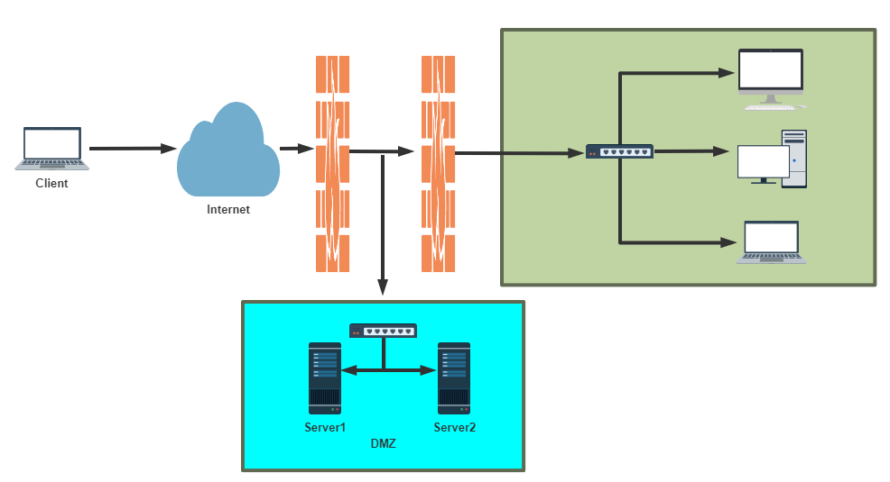

## 1.2 防火墙的分类


按保护范围划分：

- 主机防火墙：服务范围为当前一台主机
- 网络防火墙：服务范围为防火墙一侧的局域网

按实现方式划分:

- 硬件防火墙：在专用硬件级别实现部分功能的防火墙；另一个部分功能基于软件实现，如：华为， 山石hillstone,天融信，启明星辰，绿盟，深信服, PaloAlto , fortinet飞塔, Cisco, Checkpoint， NetScreen(2004年被 Juniper 用40亿美元收购)等
- 软件防火墙：运行于通用硬件平台之上的防火墙的应用软件，Windows 防火墙 ISA --> Forefront  TMG

按网络协议划分：

- 网络层防火墙：OSI模型下四层，又称为包过滤防火墙
- 应用层防火墙/代理服务器：proxy 代理网关，OSI模型七层

**包过滤防火墙**

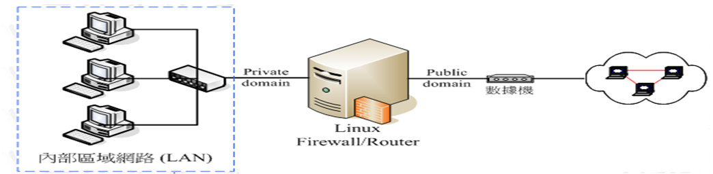

网络层对数据包进行选择，选择的依据是系统内设置的过滤逻辑，被称为访问控制列表（ACL），通过 检查数据流中每个数据的源地址，目的地址，所用端口号和协议状态等因素，或他们的组合来确定是否 允许该数据包通过

优点：对用户来说透明，处理速度快且易于维护

缺点：无法检查应用层数据，如病毒等

**应用层防火墙**


应用层防火墙/代理服务型防火墙，也称为代理服务器（Proxy Server)

将所有跨越防火墙的网络通信链路分为两段

内外网用户的访问都是通过代理服务器上的“链接”来实现

优点：在应用层对数据进行检查，比较安全

缺点：增加防火墙的负载

提示：现实生产环境中所使用的防火墙一般都是二者结合体，即先检查网络数据，通过之后再送到应用 层去检查

## 1.3 网络架构

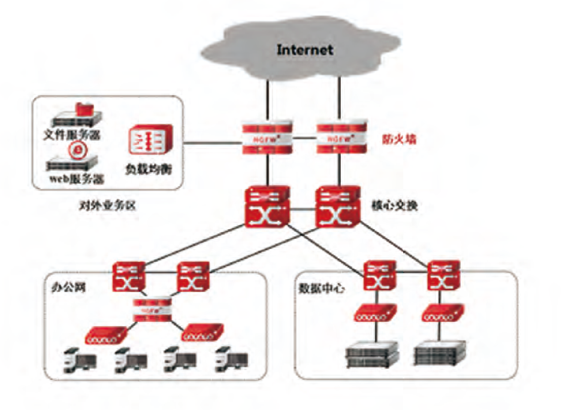

# 2 Linux 防火墙的基本认识

## 2.1 Netfilter


Linux防火墙是由Netfilter组件提供的，Netfilter工作在内核空间，集成在linux内核中

Netfilter 是Linux 2.4.x之后新一代的Linux防火墙机制，是linux内核的一个子系统。Netfilter采用模块 化设计，具有良好的可扩充性，提供扩展各种网络服务的结构化底层框架。Netfilter与IP协议栈是无缝 契合，并允许对数据报进行过滤、地址转换、处理等操作

Netfilter官网文档：https://netfilter.org/documentation/

```bash
[root@centos7 ~]#grep -m 10 NETFILTER /boot/config-3.10.0-1127.el7.x86_64 
CONFIG_NETFILTER=y
# CONFIG_NETFILTER_DEBUG is not set
CONFIG_NETFILTER_ADVANCED=y
CONFIG_BRIDGE_NETFILTER=m
CONFIG_NETFILTER_NETLINK=m
CONFIG_NETFILTER_NETLINK_ACCT=m
CONFIG_NETFILTER_NETLINK_QUEUE=m
CONFIG_NETFILTER_NETLINK_LOG=m
CONFIG_NETFILTER_NETLINK_QUEUE_CT=y
CONFIG_NETFILTER_SYNPROXY=m

[root@ubuntu2004 ~]#grep -m 10 NETFILTER /boot/config-5.4.0-33-generic 
CONFIG_NETFILTER=y
CONFIG_NETFILTER_ADVANCED=y
CONFIG_BRIDGE_NETFILTER=m
CONFIG_NETFILTER_INGRESS=y
CONFIG_NETFILTER_NETLINK=m
CONFIG_NETFILTER_FAMILY_BRIDGE=y
CONFIG_NETFILTER_FAMILY_ARP=y
CONFIG_NETFILTER_NETLINK_ACCT=m
CONFIG_NETFILTER_NETLINK_QUEUE=m
CONFIG_NETFILTER_NETLINK_LOG=m

root@ubutun2204-1:~# grep -m10 -i netfilter /boot/config-5.15.0-112-generic 
CONFIG_NETFILTER=y
CONFIG_NETFILTER_ADVANCED=y
CONFIG_BRIDGE_NETFILTER=m
# Core Netfilter Configuration
CONFIG_NETFILTER_INGRESS=y
CONFIG_NETFILTER_NETLINK=m
CONFIG_NETFILTER_FAMILY_BRIDGE=y
CONFIG_NETFILTER_FAMILY_ARP=y
CONFIG_NETFILTER_NETLINK_HOOK=m
CONFIG_NETFILTER_NETLINK_ACCT=m
```

## 2.2 防火墙工具介绍

## 2.2.1 iptables

由软件包iptables提供的命令行工具，工作在用户空间，用来编写规则，写好的规则被送往netfilter，告 诉内核如何去处理信息包

```bash
[root@centos8 ~]#rpm -qi iptables
Name       : iptables
Version     : 1.8.2
Release     : 9.el8
Architecture: x86_64
Install Date: Wed 25 Sep 2019 09:29:06 PM CST
Group       : Unspecified
Size       : 2050086
License     : GPLv2 and Artistic 2.0 and ISC
Signature   : RSA/SHA256, Tue 02 Jul 2019 06:50:00 AM CST, Key ID 
05b555b38483c65d
Source RPM : iptables-1.8.2-9.el8.src.rpm
Build Date : Sat 11 May 2019 10:21:57 PM CST
Build Host : x86-01.mbox.centos.org
Relocations : (not relocatable)
Packager   : CentOS Buildsys <bugs@centos.org>
Vendor     : CentOS
URL         : http://www.netfilter.org/
Summary     : Tools for managing Linux kernel packet filtering capabilities
Description :
The iptables utility controls the network packet filtering code in the
Linux kernel. If you need to set up firewalls and/or IP masquerading,
you should either install nftables or this package.

[root@centos8 ~]# iptables --version
iptables v1.8.2 (nf_tables)
[root@centos8 ~]#ll /usr/sbin/iptables
lrwxrwxrwx. 1 root root 17 May 11  2019 /usr/sbin/iptables -> xtables-nft-multi

root@ubutun2204-1:~# dpkg -l iptables
Desired=Unknown/Install/Remove/Purge/Hold
| Status=Not/Inst/Conf-files/Unpacked/halF-conf/Half-inst/trig-aWait/Trig-pend
|/ Err?=(none)/Reinst-required (Status,Err: uppercase=bad)
||/ Name           Version          Architecture Description
+++-==============-================-============-=================================================
ii  iptables       1.8.7-1ubuntu5.2 amd64        administration tools for packet filtering and NAT

root@ubutun2204-1:~# iptables --version
iptables v1.8.7 (nf_tables)
root@ubutun2204-1:~# ll /usr/sbin/iptables
lrwxrwxrwx 1 root root 26 Feb 16  2024 /usr/sbin/iptables -> /etc/alternatives/iptables*
```

范例：安装iptables的service包

```bash
[root@centos8 ~]#dnf -y install iptables-services
[root@centos8 ~]#rpm -ql iptables-services
/etc/sysconfig/ip6tables
/etc/sysconfig/iptables
/usr/lib/systemd/system/ip6tables.service
/usr/lib/systemd/system/iptables.service
/usr/libexec/initscripts/legacy-actions/ip6tables
/usr/libexec/initscripts/legacy-actions/ip6tables/panic
/usr/libexec/initscripts/legacy-actions/ip6tables/save
/usr/libexec/initscripts/legacy-actions/iptables
/usr/libexec/initscripts/legacy-actions/iptables/panic
/usr/libexec/initscripts/legacy-actions/iptables/save
/usr/libexec/iptables
/usr/libexec/iptables/ip6tables.init
/usr/libexec/iptables/iptables.init
```

### 2.2.2 firewalld

从CentOS 7 版开始引入了新的前端管理工具

软件包：

- firewalld
- firewalld-config

管理工具：

- firewall-cmd 命令行工具
- firewall-config 图形工作

### 2.2.3 nftables

此软件是CentOS 8 新特性,Nftables最初在法国巴黎的Netfilter Workshop 2008上发表，然后由长期的 netfilter核心团队成员和项目负责人Patrick McHardy于2009年3月发布。它在2013年末合并到Linux内 核中，自2014年以来已在内核3.13中可用。

它重用了netfilter框架的许多部分，例如连接跟踪和NAT功能。它还保留了命名法和基本iptables设计的 几个部分，例如表，链和规则。就像iptables一样，表充当链的容器，并且链包含单独的规则，这些规 则可以执行操作，例如丢弃数据包，移至下一个规则或跳至新链。

从用户的角度来看，nftables添加了一个名为nft的新工具，该工具替代了iptables，arptables和 ebtables中的所有其他工具。从体系结构的角度来看，它还替换了内核中处理数据包过滤规则集运行时 评估的那些部分。

范例：查看软件包

```bash
[root@centos8 ~]#rpm -qi nftables
Name       : nftables
Epoch       : 1
Version     : 0.9.0
Release     : 8.el8
Architecture: x86_64
Install Date: Wed 25 Sep 2019 09:29:06 PM CST
Group       : Unspecified
Size       : 758622
License     : GPLv2
Signature   : RSA/SHA256, Tue 02 Jul 2019 08:19:09 AM CST, Key ID 
05b555b38483c65d
Source RPM : nftables-0.9.0-8.el8.src.rpm
Build Date : Sat 11 May 2019 11:06:46 PM CST
Build Host : x86-01.mbox.centos.org
Relocations : (not relocatable)
Packager   : CentOS Buildsys <bugs@centos.org>
Vendor     : CentOS
URL         : http://netfilter.org/projects/nftables/
Summary     : Netfilter Tables userspace utillites
Description :
Netfilter Tables userspace utilities.
```

范例：CentOS 8 支持三种防火墙服务

```bash
[root@centos8 ~]#systemctl status iptables.service 
● iptables.service - IPv4 firewall with iptables
   Loaded: loaded (/usr/lib/systemd/system/iptables.service; disabled; vendor 
preset: disabled)
   Active: inactive (dead)
[root@centos8 ~]#systemctl status firewalld.service 
● firewalld.service - firewalld - dynamic firewall daemon
   Loaded: loaded (/usr/lib/systemd/system/firewalld.service; disabled; vendor 
preset: enabled)
   Active: inactive (dead)
     Docs: man:firewalld(1)
[root@centos8 ~]#systemctl status nftables.service 
● nftables.service - Netfilter Tables
   Loaded: loaded (/usr/lib/systemd/system/nftables.service; disabled; vendor 
preset: disabled)
   Active: inactive (dead)
     Docs: man:nft(8)
     
root@ubutun2204-1:~# systemctl status nftables.service 
○ nftables.service - nftables
     Loaded: loaded (/lib/systemd/system/nftables.service; disabled; vendor preset: enabled)
     Active: inactive (dead)
       Docs: man:nft(8)
             http://wiki.nftables.org 
root@ubutun2204-1:~# systemctl status ufw.service 
● ufw.service - Uncomplicated firewall
     Loaded: loaded (/lib/systemd/system/ufw.service; enabled; vendor preset: enabled)
     Active: active (exited) since Sun 2025-01-12 07:07:41 UTC; 12min ago
       Docs: man:ufw(8)
   Main PID: 719 (code=exited, status=0/SUCCESS)
        CPU: 1ms

Jan 12 07:07:41 ubutun2204-1 systemd[1]: Starting Uncomplicated firewall...
Jan 12 07:07:41 ubutun2204-1 systemd[1]: Finished Uncomplicated firewall.     
root@ubutun2204-1:~# ufw status
Status: inactive
```

## 2.3 netfilter 中五个勾子函数和报文流向

Netfilter在内核中选取五个位置放了五个hook(勾子) function(INPUT、OUTPUT、FORWARD、 PREROUTING、POSTROUTING)，而这五个hook function向用户开放，用户可以通过一个命令工具 （iptables）向其写入规则

由信息过滤表（table）组成，包含控制IP包处理的规则集（rules），规则被分组放在链（chain）上

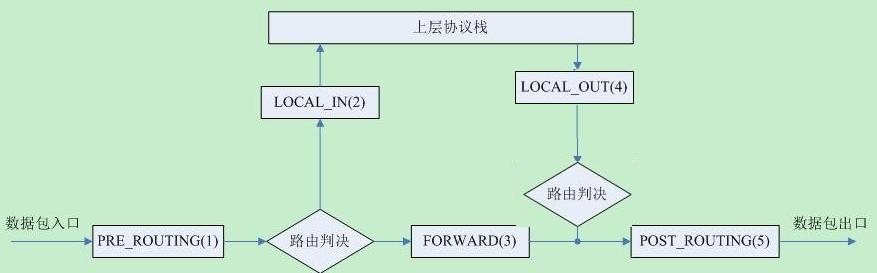

提示：从 Linux kernel 4.2 版以后，Netfilter 在prerouting 前加了一个 ingress 勾子函数。可以使用这 个新的入口挂钩来过滤来自第2层的流量，这个新挂钩比预路由要早，基本上是 tc 命令（流量控制工 具）的替代品

**三种报文流向**

- 流入本机：PREROUTING --> INPUT-->用户空间进程 
- 流出本机：用户空间进程 -->OUTPUT--> POSTROUTING
- 转发：PREROUTING --> FORWARD --> POSTROUTING

## 2.4 iptables的组成

iptables由五个表table和五个链chain以及一些规则组成

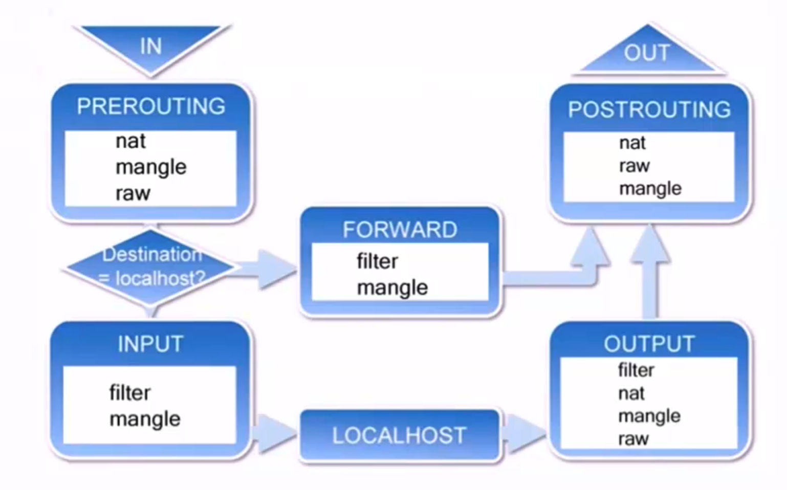

**链 chain：**

- 内置链：每个内置链对应于一个钩子函数
- 自定义链：用于对内置链进行扩展或补充，可实现更灵活的规则组织管理机制；只有Hook钩子调 用自定义链时，才生效

**五个内置链chain:**

```http
INPUT,OUTPUT,FORWARD,PREROUTING,POSTROUTING
```

**五个表table：**filter、nat、mangle、raw、security

- filter：过滤规则表，根据预定义的规则过滤符合条件的数据包,默认表
- nat：network address translation 地址转换规则表
- mangle：修改数据标记位规则表
- raw：关闭启用的连接跟踪机制，加快封包穿越防火墙速度
- security：用于强制访问控制（MAC）网络规则，由Linux安全模块（如SELinux）实现

**优先级由高到低的顺序为：**

````http
security -->raw-->mangle-->nat-->filter
````

**表和链对应关系**

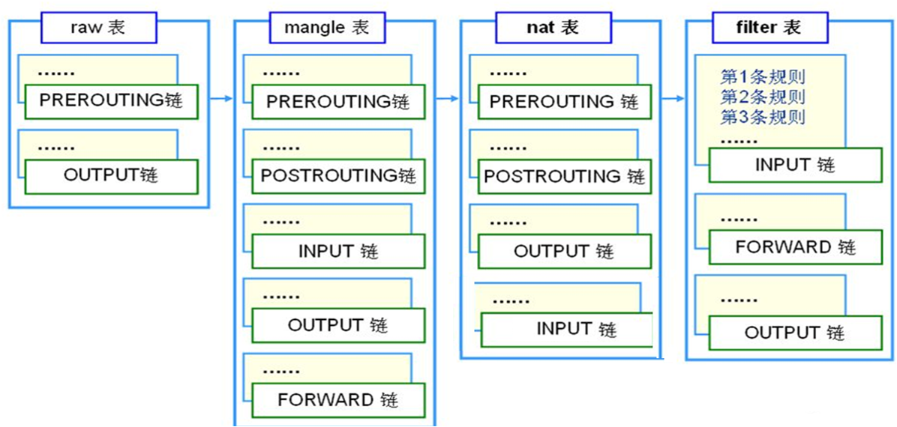

**数据包过滤匹配流程**

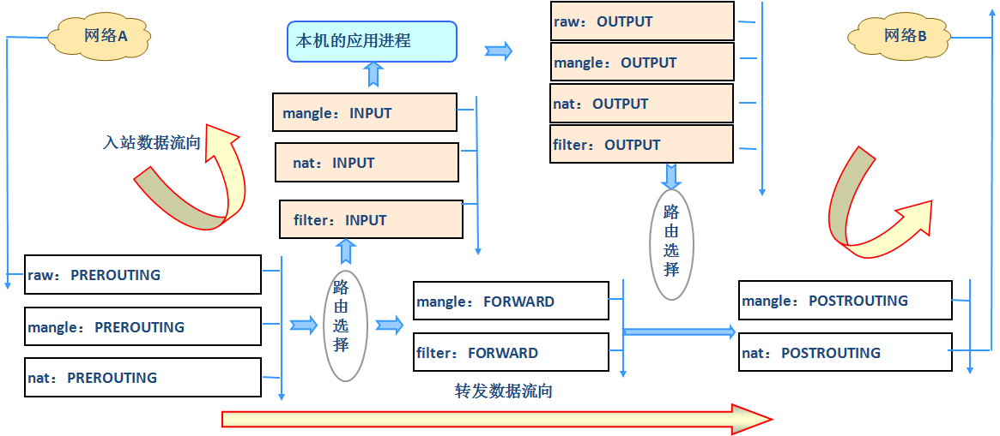

**内核中数据包的传输过程**

- 当一个数据包进入网卡时，数据包首先进入PREROUTING链，内核根据数据包目的IP判断是否需要 转送出去
- 如果数据包是进入本机的，数据包就会沿着图向下移动，到达INPUT链。数据包到达INPUT链后， 任何进程都会收到它。本机上运行的程序可以发送数据包，这些数据包经过OUTPUT链，然后到达 POSTROUTING链输出
- 如果数据包是要转发出去的，且内核允许转发，数据包就会向右移动，经过FORWARD链，然后到 达POSTROUTING链输出

范例：

```bash
root@ubutun2204-1:~# iptables -nvL -t filter
Chain INPUT (policy ACCEPT 0 packets, 0 bytes)
 pkts bytes target     prot opt in     out     source               destination         

Chain FORWARD (policy ACCEPT 0 packets, 0 bytes)
 pkts bytes target     prot opt in     out     source               destination         

Chain OUTPUT (policy ACCEPT 0 packets, 0 bytes)
 pkts bytes target     prot opt in     out     source               destination 
 
 
 root@ubutun2204-1:~# iptables -nvL -t nat
Chain PREROUTING (policy ACCEPT 0 packets, 0 bytes)
 pkts bytes target     prot opt in     out     source               destination         

Chain INPUT (policy ACCEPT 0 packets, 0 bytes)
 pkts bytes target     prot opt in     out     source               destination         

Chain OUTPUT (policy ACCEPT 0 packets, 0 bytes)
 pkts bytes target     prot opt in     out     source               destination         

Chain POSTROUTING (policy ACCEPT 0 packets, 0 bytes)
 pkts bytes target     prot opt in     out     source               destination 
 
 
 root@ubutun2204-1:~# iptables -nvL -t mangle
Chain PREROUTING (policy ACCEPT 0 packets, 0 bytes)
 pkts bytes target     prot opt in     out     source               destination         

Chain INPUT (policy ACCEPT 0 packets, 0 bytes)
 pkts bytes target     prot opt in     out     source               destination         

Chain FORWARD (policy ACCEPT 0 packets, 0 bytes)
 pkts bytes target     prot opt in     out     source               destination         

Chain OUTPUT (policy ACCEPT 0 packets, 0 bytes)
 pkts bytes target     prot opt in     out     source               destination         

Chain POSTROUTING (policy ACCEPT 0 packets, 0 bytes)
 pkts bytes target     prot opt in     out     source               destination 
 
root@ubutun2204-1:~# iptables -nvL -t raw
Chain PREROUTING (policy ACCEPT 0 packets, 0 bytes)
 pkts bytes target     prot opt in     out     source               destination         

Chain OUTPUT (policy ACCEPT 0 packets, 0 bytes)
 pkts bytes target     prot opt in     out     source               destination 
 
 root@ubutun2204-1:~# iptables -nvL -t security
Chain INPUT (policy ACCEPT 0 packets, 0 bytes)
 pkts bytes target     prot opt in     out     source               destination         

Chain FORWARD (policy ACCEPT 0 packets, 0 bytes)
 pkts bytes target     prot opt in     out     source               destination         

Chain OUTPUT (policy ACCEPT 0 packets, 0 bytes)
 pkts bytes target     prot opt in     out     source               destination 
```

## 2.5 netfilter 完整流程

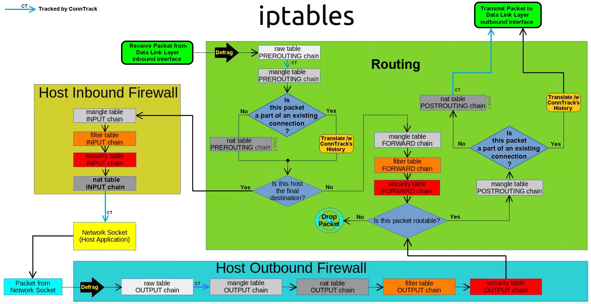

# 3 iptables

## 3.1 iptables 规则说明

### 3.1.1 iptables 规则组成

规则rule：根据规则的匹配条件尝试匹配报文，对匹配成功的报文根据规则定义的处理动作作出处理， 规则在链接上的次序即为其检查时的生效次序

匹配条件：默认为与条件，同时满足

基本匹配：IP，端口，TCP的Flags（SYN,ACK等）

扩展匹配：通过复杂高级功能匹配

处理动作：称为target，跳转目标

- 内建处理动作：ACCEPT,DROP,REJECT,SNAT,DNAT,MASQUERADE,MARK,LOG...
- 自定义处理动作：自定义chain，利用分类管理复杂情形

规则要添加在链上，才生效；添加在自定义链上不会自动生效

白名单:只有指定的特定主机可以访问,其它全拒绝

黑名单:只有指定的特定主机拒绝访问,其它全允许,默认方式

### 3.1.2 iptables规则添加时考量点

- 要实现哪种功能：判断添加在哪张表上
- 报文流经的路径：判断添加在哪个链上
- 报文的流向：判断源和目的
- 匹配规则：业务需要

### 3.1.3 本章学习环境准备

CentOS 7，8：

```bash
systemctl stop firewalld.service 
systemctl disable firewalld. service

#或者
systemctl disable --now firewalld. service
```

CentOS 6：

```bash
service iptables stop
chkconfig iptables off
```

Ubutun2204,2004

```bash
ufw disable
```

## 3.2 iptables 用法说明

帮助：

```bash
root@ubutun2204-1:~# man iptables
```

格式：

```bash
iptables [-t table] {-A|-C|-D} chain rule-specification
iptables [-t table] -I chain [rulenum] rule-specification
iptables [-t table] -R chain rulenum rule-specification
iptables [-t table] -D chain rulenum
iptables [-t table] -S [chain [rulenum]]
iptables [-t table] {-F|-L|-Z} [chain [rulenum]] [options...]
iptables [-t table] -N chain
iptables [-t table] -X [chain]
iptables [-t table] -P chain target
iptables [-t table] -E old-chain-name new-chain-name

rule-specification = [matches...] [target]
match = -m matchname [per-match-options]
target = -j targetname [per-target-options]
```

**范例：Filter表中INPUT规则**

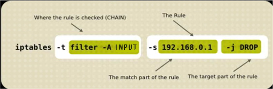

**iptables命令格式详解：**

```bash
iptables   [-t table]   SUBCOMMAND   chain   [-m matchname [per-match-options]]   
-j targetname [per-target-options]
```

**1、-t table：指定表**

raw, mangle, nat, [filter]默认

**2、SUBCOMMAND：子命令**

**链管理类：**

```bash
-N：new, 自定义一条新的规则链
-E：重命名自定义链；引用计数不为0的自定义链不能够被重命名，也不能被删除
-X：delete，删除自定义的空的规则链

-P：Policy，设置默认策略；对filter表中的链而言，其默认策略有：ACCEPT：接受, DROP：丢弃
```

范例：自定义链

```bash
[root@centos8 ~]#iptables -N web_chain 
[root@centos8 ~]#iptables -N web_chain -t nat
[root@centos8 ~]#iptables -X web_chain -t nat
[root@centos8 ~]#iptables -E web_chain WEB_CHAIN
[root@centos8 ~]#iptables -A WEB_CHAIN -s 10.0.0.6 -p tcp -m multiport --dports 80,443 -j REJECT
[root@centos8 ~]#iptables -R WEB_CHAIN 1 -s 10.0.0.6 -p tcp -m multiport --dports 80,443,8080 -j REJECT
[root@centos8 ~]#iptables -vnL WEB_CHAIN
Chain WEB_CHAIN (1 references)
 pkts bytes target     prot opt in     out     source               destination 
        
    1    60 REJECT     tcp  -- *     *       10.0.0.6             0.0.0.0/0   
        multiport dports 80,443,8080 reject-with icmp-port-unreachable

[root@centos8 ~]#iptables -AINPUT -j WEB_CHAIN 
[root@centos8 ~]#iptables -X WEB_CHAIN
iptables v1.8.2 (nf_tables): CHAIN_USER_DEL failed (Device or resource busy): 
chain WEB_CHAIN
[root@centos8 ~]#iptables -F WEB_CHAIN
[root@centos8 ~]#iptables -X WEB_CHAIN
iptables v1.8.2 (nf_tables): CHAIN_USER_DEL failed (Device or resource busy): 
chain WEB_CHAIN
[root@centos8 ~]#iptables -D INPUT 1
[root@centos8 ~]#iptables -X WEB_CHAIN
```

范例: 创建自定义链实现WEB的访问控制

```BASH
[root@centos8 ~]#iptables -N web_chain 
[root@centos8 ~]#iptables -E web_chain WEB_CHAIN
[root@centos8 ~]#iptables -A WEB_CHAIN -p tcp -m multiport --dports 80,443,8080 -j ACCEPT
[root@centos8 ~]#iptables -IINPUT 3 -s 10.0.0.0/24 -j WEB_CHAIN 
[root@centos8 ~]#iptables -AWEB_CHAIN -p icmp -j ACCEPT
[root@centos8 ~]#iptables -IWEB_CHAIN 2 -s 10.0.0.6 -j RETURN

[root@centos8 ~]#iptables -vnL --line-numbers
Chain INPUT (policy ACCEPT 0 packets, 0 bytes)
num   pkts bytes target     prot opt in     out     source               
destination         
1       10   867 ACCEPT     all  -- lo     *       0.0.0.0/0           
 0.0.0.0/0           
2     5637 423K ACCEPT     all  -- *     *       10.0.0.1             
0.0.0.0/0           
3      248 20427 WEB_CHAIN all  -- *     *       10.0.0.0/24         
 0.0.0.0/0           
4     4278 248K REJECT     all  -- *     *       0.0.0.0/0           
 0.0.0.0/0           reject-with icmp-port-unreachable

Chain FORWARD (policy ACCEPT 0 packets, 0 bytes)
num   pkts bytes target     prot opt in     out     source               
destination 

Chain OUTPUT (policy ACCEPT 0 packets, 0 bytes)
num   pkts bytes target     prot opt in     out     source               
destination 

Chain WEB_CHAIN (1 references)
num   pkts bytes target     prot opt in     out     source               
destination         
1       36  2619 ACCEPT     tcp  -- *     *       0.0.0.0/0           
 0.0.0.0/0           multiport dports 80,443,8080
2       16  1344 RETURN     all  -- *     *       10.0.0.6             
0.0.0.0/0           
3      184 15456 ACCEPT     icmp -- *     *       0.0.0.0/0           
 0.0.0.0/0 
 
[root@centos6 ~]#curl 10.0.0.8
centos8 website
[root@centos6 ~]#curl 10.0.0.8
centos8 website
[root@centos6 ~]#ping -c1 10.0.0.8
PING 10.0.0.8 (10.0.0.8) 56(84) bytes of data.
From 10.0.0.8 icmp_seq=1 Destination Port Unreachable

--- 10.0.0.8 ping statistics ---
1 packets transmitted, 0 received, +1 errors, 100% packet loss, time 1ms

[root@centos7 ~]#ping 10.0.0.8 -c1
PING 10.0.0.8 (10.0.0.8) 56(84) bytes of data.
64 bytes from 10.0.0.8: icmp_seq=1 ttl=64 time=1.25 ms

--- 10.0.0.8 ping statistics ---
1 packets transmitted, 1 received, 0% packet loss, time 0ms
rtt min/avg/max/mdev = 1.257/1.257/1.257/0.000 ms
[root@centos7 ~]#curl 10.0.0.8
centos8 website
```

范例: 删除自定义链

```BASH
#无法直接删除自定义链,删除自定议链和创建的顺序相反
[root@centos8 ~]#iptables -X WEB_CHAIN
iptables v1.8.4 (nf_tables): CHAIN_USER_DEL failed (Device or resource busy): 
chain WEB_CHAIN

[root@centos8 ~]#iptables -D INPUT 3
[root@centos8 ~]#iptables -X WEB_CHAIN
iptables v1.8.4 (nf_tables): CHAIN_USER_DEL failed (Device or resource busy): 
chain WEB_CHAIN

[root@centos8 ~]#iptables -F WEB_CHAIN
[root@centos8 ~]#iptables -L WEB_CHAIN
Chain WEB_CHAIN (0 references)
target     prot opt source               destination 

[root@centos8 ~]#iptables -X WEB_CHAIN
[root@centos8 ~]#iptables -vnL --line-numbers
Chain INPUT (policy ACCEPT 0 packets, 0 bytes)
num   pkts bytes target     prot opt in     out     source               
destination         
1       10   867 ACCEPT     all  -- lo     *       0.0.0.0/0           
 0.0.0.0/0           
2     5824 437K ACCEPT     all  -- *     *       10.0.0.1             
0.0.0.0/0           
3     4279 248K REJECT     all  -- *     *       0.0.0.0/0           
 0.0.0.0/0           reject-with icmp-port-unreachable

Chain FORWARD (policy ACCEPT 0 packets, 0 bytes)
num   pkts bytes target     prot opt in     out     source               
destination 

Chain OUTPUT (policy ACCEPT 0 packets, 0 bytes)
num   pkts bytes target     prot opt in     out     source               
destination  
```

**查看类：**

```bash
-L：list, 列出指定鏈上的所有规则，本选项须置后
-n：numberic，以数字格式显示地址和端口号
-v：verbose，详细信息
-vv 更详细
-x：exactly，显示计数器结果的精确值,而非单位转换后的易读值 
--line-numbers：显示规则的序号
-S selected,以iptables-save 命令格式显示链上规则
```

**常用组合**

```http
-vnL 
-vvnxL --line-numbers
```

**规则管理类**

```bash
-A：append，追加
-I：insert, 插入，要指明插入至的规则编号，默认为第一条
-D：delete，删除
   (1) 指明规则序号
   (2) 指明规则本身
-R：replace，替换指定链上的指定规则编号
-F：flush，清空指定的规则链
-Z：zero，置零
   iptables的每条规则都有两个计数器
 (1) 匹配到的报文的个数
 (2) 匹配到的所有报文的大小之和
```

范例：

```bash
root@ubutun2204-1:~# iptables -F OUTPUT
```

**3、chain：**

PREROUTING，INPUT，FORWARD，OUTPUT，POSTROUTING

**4、匹配条件**

- 基本：通用的，PARAMETERS
- 扩展：需加载模块，MATCH EXTENTIONS

**5、处理动作：**

```bsh
-j targetname [per-target-options]
```

简单动作：

```http
ACCEPT
DROP
```

扩展动作：

```http
REJECT：--reject-with:icmp-port-unreachable默认
RETURN：返回调用链
REDIRECT：端口重定向
LOG：记录日志，dmesg
MARK：做防火墙标记
DNAT：目标地址转换
SNAT：源地址转换
MASQUERADE：地址伪装
自定义链
```

## 3.3 iptables 基本匹配条件

基本匹配条件：无需加载模块，由iptables/netfilter自行提供

```bash
[!] -s, --source address[/mask][,...]：源IP地址或者不连续的IP地址
[!] -d, --destination address[/mask][,...]：目标IP地址或者不连续的IP地址
[!] -p, --protocol protocol：指定协议，可使用数字如0（all）
 protocol: tcp, udp, icmp, icmpv6, udplite,esp, ah, sctp, mh or“all“  
 参看：/etc/protocols
[!] -i, --in-interface name：报文流入的接口；只能应用于数据报文流入环节，只应用于INPUT、
FORWARD、PREROUTING链
[!] -o, --out-interface name：报文流出的接口；只能应用于数据报文流出的环节，只应用于
FORWARD、OUTPUT、POSTROUTING链
```

范例：

```bash
root@ubutun2204-1:~# apt install nginx
root@ubutun2204-1:~# echo $(hostname -I) > /var/www/html/index.html
root@ubutun2204-1:~# hostname -I
192.168.159.103

root@ubutun2204-1:~# iptables -A INPUT -s 192.168.159.104,192.168.159.108 -j REJECT
root@ubutun2204-1:~# iptables -I INPUT -i lo -j ACCEPT
root@ubutun2204-1:~# iptables -nvL
Chain INPUT (policy ACCEPT 0 packets, 0 bytes)
 pkts bytes target     prot opt in     out     source               destination         
    0     0 ACCEPT     all  --  lo     *       0.0.0.0/0            0.0.0.0/0           
    0     0 REJECT     all  --  *      *       192.168.159.104      0.0.0.0/0            reject-with icmp-port-unreachable
    0     0 REJECT     all  --  *      *       192.168.159.108      0.0.0.0/0            reject-with icmp-port-unreachable

Chain FORWARD (policy ACCEPT 0 packets, 0 bytes)
 pkts bytes target     prot opt in     out     source               destination         

Chain OUTPUT (policy ACCEPT 0 packets, 0 bytes)
 pkts bytes target     prot opt in     out     source               destination
 
root@ubutun2204-1:~# curl 127.0.0.1
192.168.159.103
root@ubutun2204-1:~# curl 192.168.159.103
192.168.159.103

root@ubutun2204-1:~# iptables -I INPUT 2 -s 10.0.0.6 ! -p icmp -j ACCEPT
```

## 3.4 iptables 扩展匹配条件

扩展匹配条件：需要加载扩展模块（/usr/lib64/xtables/*.so），方可生效

扩展模块的查看帮助 ：man iptables-extensions

扩展匹配条件：

- 隐式扩展
- 显式扩展

### 3.4.1 隐式扩展

iptables 在使用-p选项指明了特定的协议时，无需再用-m选项指明扩展模块的扩展机制，不需要手动加 载扩展模块

**tcp 协议的扩展选项**

```bash
[!] --source-port, --sport port[:port]：匹配报文源端口,可为端口连续范围
[!] --destination-port,--dport port[:port]：匹配报文目标端口,可为连续范围
[!] --tcp-flags mask comp
     mask 需检查的标志位列表，用,分隔 , 例如 SYN,ACK,FIN,RST
     comp 在mask列表中必须为1的标志位列表，无指定则必须为0，用,分隔tcp协议的扩展选项
```

范例：

```bash
--tcp-flags SYN,ACK,FIN,RST SYN      #表示要检查的标志位为SYN,ACK,FIN,RST四个，其中SYN必须为1，余下的必须为0，第一次握手
--tcp-flags SYN,ACK,FIN,RST SYN,ACK  #第二次握手


#错误包
--tcp-flags ALL ALL  
--tcp_flags ALL NONE
```

[!] --syn：用于匹配第一次握手, 相当于：--tcp-flags SYN,ACK,FIN,RST SYN

**udp 协议的扩展选项**

```bash
[!] --source-port, --sport port[:port]：匹配报文的源端口或端口范围
[!] --destination-port,--dport port[:port]：匹配报文的目标端口或端口范围
```

**icmp 协议的扩展选项**

```bash
[!] --icmp-type {type[/code]|typename}
    type/code
         0/0   echo-reply icmp应答
         8/0   echo-request icmp请求 
```

范例：

```bash
root@ubutun2204-1:~# iptables -A INPUT -s 192.168.159.104 -p tcp --dport 22:30 -j REJECT
root@ubutun2204-1:~# iptables -nvL
Chain INPUT (policy ACCEPT 0 packets, 0 bytes)
 pkts bytes target     prot opt in     out     source               destination         
    0     0 REJECT     tcp  --  *      *       192.168.159.104      0.0.0.0/0            tcp dpts:22:30 reject-with icmp-port-unreachable

Chain FORWARD (policy ACCEPT 0 packets, 0 bytes)
 pkts bytes target     prot opt in     out     source               destination         

Chain OUTPUT (policy ACCEPT 0 packets, 0 bytes)
 pkts bytes target     prot opt in     out     source               destination
```

范例：

```BASH
root@ubutun2204-1:~# iptables -A INPUT -p tcp --syn -j REJECT
```

范例：

```BASH
root@ubutun2204-1:~# iptables -A INPUT -s 10.0.0.6 -p icmp --icmp-type 8 -j REJECT 
```

### 3.4.2 显式扩展及相关模块

显示扩展即必须使用-m选项指明要调用的扩展模块名称，需要手动加载扩展模块

```http
 [-m matchname [per-match-options]]
```

**扩展模块的使用帮助：**

```bash
root@ubutun2204-1:~# man iptables-extensions
```

#### 3.4.2.1 multiport扩展

以离散方式定义多端口匹配,最多指定15个端口

```bash
#指定多个源端口
[!] --source-ports,--sports port[,port|,port:port]...

# 指定多个目标端口
[!] --destination-ports,--dports port[,port|,port:port]...

#多个源或目标端
[!] --ports port[,port|,port:port]...
```

范例：

```bash
root@ubutun2204-1:~# iptables -A INPUT -s 192.168.0.0/16 -d 192.168.159.103 -p tcp -m multiport --dports 22:30,55 -j REJECT

root@ubutun2204-1:~# iptables -A INPUT -s 192.168.159.104 -p tcp -m multiport --dports 145,146 -j REJECT
root@ubutun2204-1:~# iptables -nvL
Chain INPUT (policy ACCEPT 0 packets, 0 bytes)
 pkts bytes target     prot opt in     out     source               destination         
    0     0 REJECT     tcp  --  *      *       192.168.159.104      0.0.0.0/0            multiport dports 145,146 reject-with icmp-port-unreachable

Chain FORWARD (policy ACCEPT 0 packets, 0 bytes)
 pkts bytes target     prot opt in     out     source               destination         

Chain OUTPUT (policy ACCEPT 0 packets, 0 bytes)
 pkts bytes target     prot opt in     out     source               destination 
```

#### 3.4.2.2 iprange扩展

指明连续的（但一般不是整个网络）ip地址范围

```bash
[!] --src-range from[-to] 源IP地址范围
[!] --dst-range from[-to] 目标IP地址范围
```

范例：

```bash
iptables -A INPUT -d 192.168.159.103 -p tcp --dport 80 -m iprange --src-range 192.168.159.100-192.168.159.200 -j DROP
```

#### 3.4.2.3 mac扩展

mac 模块可以指明源MAC地址,，适用于：PREROUTING, FORWARD，INPUT chains

```http
[!] --mac-source XX:XX:XX:XX:XX:XX
```

范例：

```bash
iptables -A INPUT -s 192.168.159.100 -m mac --mac-source 00:50:56:12:34:56 -j ACCEPT
```

#### 3.4.2.4 string扩展

对报文中的应用层数据做字符串模式匹配检测

```bash
--algo {bm|kmp} 字符串匹配检测算法
 bm：Boyer-Moore
 kmp：Knuth-Pratt-Morris
--from offset 开始偏移
--to offset   结束偏移
[!] --string pattern 要检测的字符串模式
[!] --hex-string pattern 要检测字符串模式，16进制格式
```

范例：

```bash
root@ubutun2204-1:~# echo "google" > /var/www/html/index.html 
root@ubutun2204-1:~# echo "baidu" > /var/www/html/index2.html
root@ubutun2204-1:~# iptables -A OUTPUT -p tcp --sport 80 -m string --algo kmp --from 62 --string "google" -j REJECT

# 测试访问
C:\Users\wanglei>curl 192.168.159.103/index.html
^C  # google 访问不了
C:\Users\wanglei>curl 192.168.159.103/index2.html
baidu

#bm此算法有bug
```

#### 3.4.2.5 time扩展

**注意：CentOS 8 此模块有问题**

根据将报文到达的时间与指定的时间范围进行匹配

```bash
--datestart YYYY[-MM[-DD[Thh[:mm[:ss]]]]] 日期
--datestop YYYY[-MM[-DD[Thh[:mm[:ss]]]]]
--timestart hh:mm[:ss]       时间
--timestop hh:mm[:ss]
[!] --monthdays day[,day...]   每个月的几号
[!] --weekdays day[,day...]   星期几，1 – 7 分别表示星期一到星期日
--kerneltz：内核时区（当地时间），不建议使用，CentOS 7版本以上系统默认为 UTC
注意： centos6 不支持kerneltz ，--localtz指定本地时区(默认)
```

范例: CentOS 8 的 time模块问题

```bash
[root@centos8 ~]#rpm -ql iptables |grep time
/usr/lib64/xtables/libxt_time.so

[root@centos8 ~]#iptables -A INPUT -m time --timestart 12:30 --timestop 13:30 -j ACCEPT
iptables v1.8.4 (nf_tables): Couldn't load match `time':No such file or directory
```

范例: 关于 -- kerneltz 选项 

```bash
[root@centos8 ~]#man iptables-extensions 
The caveat with the kernel timezone is that Linux distributions may ignore to 
set the kernel timezone,and instead only set the system time. Even if a 
particular distribution does set the timezone at boot,it is usually does not 
keep the kernel timezone offset - which is what changes on DST - up to date. 
ntpd will not touch the kernel timezone, so running it will not resolve the 
issue. As such,one may   encounter a timezone that is always +0000, or one that 
is wrong half of the time of the year. As such,using --kerneltz is highly 
discouraged.
```

范例：

```bash
root@ubutun2204-1:~#  iptables -A INPUT -s 172.16.0.0/16 -d 172.16.100.10 -p tcp --dport 80 -m time --timestart 14:30 --timestop 18:30 --weekdays Sat,Sun --kerneltz -j DROP
```

#### 3.4.2.6 connlimit扩展

根据每客户端IP做并发连接数数量匹配

可防止Dos(Denial of Service，拒绝服务)攻击

```bash
--connlimit-upto N #连接的数量小于等于N时匹配
--connlimit-above N #连接的数量大于N时匹配
```

范例：

```bash
iptables -A INPUT -p tcp --dport 80 -m connlimit --connlimit-above 2 -j REJECT
iptables -A INPUT -d 172.16.100.10 -p tcp --dport 22 -m connlimit --connlimitabove2 -j REJECT
```

#### 3.4.2.7 limit扩展

基于收发报文的速率做匹配 , 令牌桶过滤器

```bash
--limit-burst number #前多少个包不限制
--limit #[/second|/minute|/hour|/day]
```

范例：

```bash
iptables -I INPUT -d 172.16.100.10 -p icmp --icmp-type 8 -m limit --limit 10/minute --limit-burst 5 -j ACCEPT
iptables -I INPUT 2 -p icmp -j REJECT
```

范例：

```bash
root@ubutun2204-1:~# iptables -A INPUT -p icmp -m limit --limit-burst 10 --limit 20/minute -j ACCEPT
root@ubutun2204-1:~# iptables -A INPUT -p icmp -j REJECT

root@ubutun2204-1:~# ping 192.168.159.103
PING 192.168.159.103 (192.168.159.103) 56(84) bytes of data.
64 bytes from 192.168.159.103: icmp_seq=1 ttl=64 time=0.017 ms
64 bytes from 192.168.159.103: icmp_seq=2 ttl=64 time=0.066 ms
64 bytes from 192.168.159.103: icmp_seq=3 ttl=64 time=0.063 ms
64 bytes from 192.168.159.103: icmp_seq=4 ttl=64 time=0.085 ms
64 bytes from 192.168.159.103: icmp_seq=5 ttl=64 time=0.096 ms
64 bytes from 192.168.159.103: icmp_seq=6 ttl=64 time=0.072 ms
64 bytes from 192.168.159.103: icmp_seq=7 ttl=64 time=0.037 ms
64 bytes from 192.168.159.103: icmp_seq=8 ttl=64 time=0.079 ms
From 192.168.39.8 icmp_seq=15 Destination Port Unreachable
......
```

#### 3.4.2.8 state扩展

state 扩展模块，可以根据”连接追踪机制“去检查连接的状态，较耗资源

conntrack机制：追踪本机上的请求和响应之间的关系

**状态类型：**

- NEW：新发出请求；连接追踪信息库中不存在此连接的相关信息条目，因此，将其识别为第一次发 出的请求
- ESTABLISHED：NEW状态之后，连接追踪信息库中为其建立的条目失效之前期间内所进行的通信 状态
- RELATED：新发起的但与已有连接相关联的连接，如：ftp协议中的数据连接与命令连接之间的关 系
- INVALID：无效的连接，如flag标记不正确
- UNTRACKED：未进行追踪的连接，如：raw表中关闭追踪

已经追踪到的并记录下来的连接信息库

```bash
[root@centos8 ~]#cat /proc/net/nf_conntrack
ipv4     2 tcp      6 431325 ESTABLISHED src=10.0.0.7 dst=10.0.0.8 sport=49900 
dport=80 src=10.0.0.8 dst=10.0.0.7 sport=80 dport=49900 [ASSURED] mark=0 zone=0 
use=2
ipv4     2 tcp      6 431325 ESTABLISHED src=10.0.0.7 dst=10.0.0.8 sport=49886 
dport=80 src=10.0.0.8 dst=10.0.0.7 sport=80 dport=49886 [ASSURED] mark=0 zone=0 
use=2
ipv4     2 tcp      6 431325 ESTABLISHED src=10.0.0.7 dst=10.0.0.8 sport=49892 
dport=80 src=10.0.0.8 dst=10.0.0.7 sport=80 dport=49892 [ASSURED] mark=0 zone=0 
use=2
ipv4     2 tcp      6 431325 ESTABLISHED src=10.0.0.7 dst=10.0.0.8 sport=49904 
dport=80 src=10.0.0.8 dst=10.0.0.7 sport=80 dport=49904 [ASSURED] mark=0 zone=0 
use=2
ipv4     2 tcp      6 431325 ESTABLISHED src=10.0.0.7 dst=10.0.0.8 sport=49890 
dport=80 src=10.0.0.8 dst=10.0.0.7 sport=80 dport=49890 [ASSURED] mark=0 zone=0 
use=2
ipv4     2 tcp      6 431325 ESTABLISHED src=10.0.0.7 dst=10.0.0.8 sport=49888 
dport=80 src=10.0.0.8 dst=10.0.0.7 sport=80 dport=49888 [ASSURED] mark=0 zone=0 
use=2
ipv4     2 tcp      6 431325 ESTABLISHED src=10.0.0.7 dst=10.0.0.8 sport=49896 
dport=80 src=10.0.0.8 dst=10.0.0.7 sport=80 dport=49896 [ASSURED] mark=0 zone=0 
use=2
ipv4     2 tcp      6 431325 ESTABLISHED src=10.0.0.7 dst=10.0.0.8 sport=49898 
dport=80 src=10.0.0.8 dst=10.0.0.7 sport=80 dport=49898 [ASSURED] mark=0 zone=0 
use=2
ipv4     2 tcp      6 431325 ESTABLISHED src=10.0.0.7 dst=10.0.0.8 sport=49894 
dport=80 src=10.0.0.8 dst=10.0.0.7 sport=80 dport=49894 [ASSURED] mark=0 zone=0 
use=2
ipv4     2 tcp      6 431325 ESTABLISHED src=10.0.0.7 dst=10.0.0.8 sport=49902 
dport=80 src=10.0.0.8 dst=10.0.0.7 sport=80 dport=49902 [ASSURED] mark=0 zone=0 
use=2
```

调整连接追踪功能所能够容纳的最大连接数量

```bash
[root@centos8 ~]#cat /proc/sys/net/netfilter/nf_conntrack_max
26624
[root@centos8 ~]#cat /proc/sys/net/nf_conntrack_max
26624
```

查看连接跟踪有多少条目

```bash
[root@centos8 ~]#cat /proc/sys/net/netfilter/nf_conntrack_count
10
```

不同的协议的连接追踪时长

```bash
[root@centos8 ~]#ll /proc/sys/net/netfilter/
total 0
-rw-r--r-- 1 root root 0 Mar 19 18:14 nf_conntrack_acct
-rw-r--r-- 1 root root 0 Mar 19 18:14 nf_conntrack_buckets
-rw-r--r-- 1 root root 0 Mar 19 18:14 nf_conntrack_checksum
-r--r--r-- 1 root root 0 Mar 19 18:14 nf_conntrack_count
-rw-r--r-- 1 root root 0 Mar 19 18:14 nf_conntrack_dccp_loose
-rw-r--r-- 1 root root 0 Mar 19 18:14 nf_conntrack_dccp_timeout_closereq
-rw-r--r-- 1 root root 0 Mar 19 18:14 nf_conntrack_dccp_timeout_closing
-rw-r--r-- 1 root root 0 Mar 19 18:14 nf_conntrack_dccp_timeout_open
-rw-r--r-- 1 root root 0 Mar 19 18:14 nf_conntrack_dccp_timeout_partopen
-rw-r--r-- 1 root root 0 Mar 19 18:14 nf_conntrack_dccp_timeout_request
-rw-r--r-- 1 root root 0 Mar 19 18:14 nf_conntrack_dccp_timeout_respond
-rw-r--r-- 1 root root 0 Mar 19 18:14 nf_conntrack_dccp_timeout_timewait
-rw-r--r-- 1 root root 0 Mar 19 18:14 nf_conntrack_events
-rw-r--r-- 1 root root 0 Mar 19 18:14 nf_conntrack_expect_max
-rw-r--r-- 1 root root 0 Mar 19 18:14 nf_conntrack_generic_timeout
-rw-r--r-- 1 root root 0 Mar 19 18:14 nf_conntrack_helper
-rw-r--r-- 1 root root 0 Mar 19 18:14 nf_conntrack_icmp_timeout
-rw-r--r-- 1 root root 0 Mar 19 18:14 nf_conntrack_log_invalid
-rw-r--r-- 1 root root 0 Mar 19 18:13 nf_conntrack_max
-rw-r--r-- 1 root root 0 Mar 19 18:14 nf_conntrack_sctp_timeout_closed
-rw-r--r-- 1 root root 0 Mar 19 18:14 nf_conntrack_sctp_timeout_cookie_echoed
-rw-r--r-- 1 root root 0 Mar 19 18:14 nf_conntrack_sctp_timeout_cookie_wait
-rw-r--r-- 1 root root 0 Mar 19 18:14 nf_conntrack_sctp_timeout_established
-rw-r--r-- 1 root root 0 Mar 19 18:14 nf_conntrack_sctp_timeout_heartbeat_acked
-rw-r--r-- 1 root root 0 Mar 19 18:14 nf_conntrack_sctp_timeout_heartbeat_sent
-rw-r--r-- 1 root root 0 Mar 19 18:14 
nf_conntrack_sctp_timeout_shutdown_ack_sent
-rw-r--r-- 1 root root 0 Mar 19 18:14 nf_conntrack_sctp_timeout_shutdown_recd
-rw-r--r-- 1 root root 0 Mar 19 18:14 nf_conntrack_sctp_timeout_shutdown_sent
-rw-r--r-- 1 root root 0 Mar 19 18:14 nf_conntrack_tcp_be_liberal
-rw-r--r-- 1 root root 0 Mar 19 18:14 nf_conntrack_tcp_loose
-rw-r--r-- 1 root root 0 Mar 19 18:14 nf_conntrack_tcp_max_retrans
-rw-r--r-- 1 root root 0 Mar 19 18:14 nf_conntrack_tcp_timeout_close
-rw-r--r-- 1 root root 0 Mar 19 18:14 nf_conntrack_tcp_timeout_close_wait
-rw-r--r-- 1 root root 0 Mar 19 18:14 nf_conntrack_tcp_timeout_established
-rw-r--r-- 1 root root 0 Mar 19 18:14 nf_conntrack_tcp_timeout_fin_wait
-rw-r--r-- 1 root root 0 Mar 19 18:14 nf_conntrack_tcp_timeout_last_ack
-rw-r--r-- 1 root root 0 Mar 19 18:14 nf_conntrack_tcp_timeout_max_retrans
-rw-r--r-- 1 root root 0 Mar 19 18:14 nf_conntrack_tcp_timeout_syn_recv
-rw-r--r-- 1 root root 0 Mar 19 18:14 nf_conntrack_tcp_timeout_syn_sent
-rw-r--r-- 1 root root 0 Mar 19 18:14 nf_conntrack_tcp_timeout_time_wait
-rw-r--r-- 1 root root 0 Mar 19 18:14 nf_conntrack_tcp_timeout_unacknowledged
-rw-r--r-- 1 root root 0 Mar 19 18:14 nf_conntrack_timestamp
-rw-r--r-- 1 root root 0 Mar 19 18:14 nf_conntrack_udp_timeout
-rw-r--r-- 1 root root 0 Mar 19 18:14 nf_conntrack_udp_timeout_stream
dr-xr-xr-x 1 root root 0 Mar 19 18:14 nf_log
-rw-r--r-- 1 root root 0 Mar 19 18:14 nf_log_all_netns
```

说明：

- 连接跟踪，需要加载模块： modprobe nf_conntrack_ipv4
- 当服务器连接多于最大连接数时dmesg 可以观察到 ：kernel: ip_conntrack: table full, dropping  packet错误,并且导致建立TCP连接很慢。
- 各种状态的超时后，链接会从表中删除

范例: 面试题 

```bash
[root@centos8 ~]#echo 1 > /proc/sys/net/netfilter/nf_conntrack_max
[root@centos8 ~]#tail /var/log/messages 
Jul  8 10:03:53 centos8 kernel: nf_conntrack: nf_conntrack: table full, dropping 
packet

[root@centos6 ~]#tail /var/log/messages
Jul  8 09:51:16 centos6 kernel: nf_conntrack: table full, dropping packet.
```

连接过多的解决方法两个：

(1) 加大nf_conntrack_max 值

```http
vi /etc/sysctl.conf
net.nf_conntrack_max = 393216
net.netfilter.nf_conntrack_max = 393216 
```

(2) 降低 nf_conntrack timeout时间

```http
vi /etc/sysctl.conf
net.netfilter.nf_conntrack_tcp_timeout_established = 300
net.netfilter.nf_conntrack_tcp_timeout_time_wait = 120
net.netfilter.nf_conntrack_tcp_timeout_close_wait = 60
net.netfilter.nf_conntrack_tcp_timeout_fin_wait = 120
iptables -t nat -L -n
```

格式：

```http
[!] --state state
```

范例: 不允许远程主机 10.0.0.7 访问本机,但本机可以访问10.0.0.7

```bash
[root@centos8 ~]#iptables -S
-P INPUT ACCEPT
-P FORWARD ACCEPT
-P OUTPUT ACCEPT
-A INPUT -s 10.0.0.1/32 -j ACCEPT
-A INPUT -m state --state ESTABLISHED -j ACCEPT
-A INPUT ! -s 10.0.0.7/32 -m state --state NEW -j ACCEPT
-A INPUT -j REJECT --reject-with icmp-port-unreachable
```

范例：

```bash
iptables -A INPUT -d 172.16.1.10 -p tcp -m multiport --dports 22,80 -m state --state NEW,ESTABLISHED -j ACCEPT
iptables -A OUTPUT -s 172.16.1.10 -p tcp -m multiport --sports 22,80 -m state --
state ESTABLISHED -j ACCEPT

[root@centos8 ~]#iptables -A INPUT -m state --state ESTABLISHED -j ACCEPT #此条规则必须在NEW规则前面
[root@centos8 ~]#iptables -A INPUT -m state --state NEW -j REJECT
```

## 3.5 Target

target 包括以下类型：

```bash
自定义链, ACCEPT， DROP， REJECT，RETURN,LOG，SNAT，DNAT，REDIRECT，MASQUERADE

LOG：非中断target,本身不拒绝和允许,放在拒绝和允许规则前，并将日志记录在/var/log/messages系
统日志中
--log-level level   级别： debug，info，notice, warning, error, crit, alert,emerg
--log-prefix prefix 日志前缀，用于区别不同的日志，最多29个字符
```

范例：

```bash
root@ubutun2204-1:~# iptables -I INPUT -s 192.168.159.0/24 -p tcp -m multiport --dports 80,21,22,23 -m state --state NEW -j LOG --log-prefix "new connections: "

root@ubutun2204-1:~# tail -f /var/log/syslog
......
Jan 12 09:32:30 ubutun2204-1 kernel: [ 2655.560188] new connections: IN=ens33 OUT= MAC=00:0c:29:0e:76:f9:00:50:56:c0:00:08:08:00 SRC=192.168.159.1 DST=192.168.159.103 LEN=52 TOS=0x00 PREC=0x00 TTL=128 ID=51455 DF PROTO=TCP SPT=51482 DPT=80 WINDOW=64240 RES=0x00 SYN URGP=0 
Jan 12 09:32:54 ubutun2204-1 kernel: [ 2679.851189] new connections: IN=ens33 OUT= MAC=00:0c:29:0e:76:f9:00:50:56:c0:00:08:08:00 SRC=192.168.159.1 DST=192.168.159.103 LEN=76 TOS=0x00 PREC=0x00 TTL=128 ID=51461 DF PROTO=TCP SPT=50123 DPT=22 WINDOW=4095 RES=0x00 ACK PSH URGP=0 
```

## 3.6 规则优化最佳实践

1. 安全放行所有入站和出站的状态为ESTABLISHED状态连接,建议放在第一条，效率更高

2.  谨慎放行入站的新请求

3. 有特殊目的限制访问功能，要在放行规则之前加以拒绝

4. . 同类规则（访问同一应用，比如：http ），匹配范围小的放在前面，用于特殊处理

5. 不同类的规则（访问不同应用，一个是http，另一个是mysql ），匹配范围大的放在前面，效率更 高

   ```http
   -s 10.0.0.6 -p tcp --dport 3306 -j REJECT
   s 172.16.0.0/16 -p tcp --dport 80 -j REJECT
   ```

6. 应该将那些可由一条规则能够描述的多个规则合并为一条,减少规则数量,提高检查效率

7. 设置默认策略，建议白名单（只放行特定连接）

   - iptables -P，不建议，容易出现“自杀现象”
   - 规则的最后定义规则做为默认策略，推荐使用，放在最后一条

## 3.7 iptables规则保存

使用iptables命令定义的规则，手动删除之前，其生效期限为kernel存活期限

**持久保存规则：**

CentOS 7,8, Ubutun2004,2204

```http
iptables-save > /PATH/TO/SOME_RULES_FILE
```

CentOS 6 

```bash
#将规则覆盖保存至/etc/sysconfig/iptables文件中
service iptables save
```

**加载规则:**

CentOS 7,8, Ubutun2004,2204 重新载入预存规则文件中规则：

```http
iptables-restore < /PATH/FROM/SOME_RULES_FILE
```

iptables-restore选项

```bash
-n, --noflush：不清除原有规则
-t, --test：仅分析生成规则集，但不提交
```

CentOS 6：

```bash
#会自动从/etc/sysconfig/iptables 重新载入规则
service iptables  restart
```

**开机自动重载规则**

- 用脚本保存各个iptables命令；让此脚本开机后自动运行

  /etc/rc.d/rc.local文件中添加脚本路径 /PATH/TO/SOME_SCRIPT_FILE

- 用规则文件保存各个规则，开机时自动载入此规则文件中的规则

  在/etc/rc.d/rc.local文件添加

  ```http
  iptables-restore < /PATH/FROM/IPTABLES_RULES_FILE
  ```

- 定义Unit File, CentOS 7，8 可以安装 iptables-services 实现iptables.service

  范例: CentOS 7，8 使用 iptables-services 

  ```bash
  [root@centos8 ~]#yum -y install iptables-services
  [root@centos8 ~]#cp /etc/sysconfig/iptables{,.bak}
  
  #保存现在的规则到文件中方法1
  [root@centos8 ~]#/usr/libexec/iptables/iptables.init save
  
  #保存现在的规则到文件中方法2
  [root@centos8 ~]#iptables-save > /etc/sysconfig/iptables
  
  开机启动
  [root@centos8 ~]#systemctl enable iptables.service    
  [root@centos8 ~]#systemctl mask firewalld.service nftables.service
  ```

## 3.8 网络防火墙

iptables/netfilter 利用filter表的FORWARD链,可以充当网络防火墙：

注意的问题：

(1) 请求-响应报文均会经由FORWARD链，要注意规则的方向性

(2) 如果要启用conntrack机制，建议将双方向的状态为ESTABLISHED的报文直接放行

### 3.8.1 FORWARD 链实现内外网络的流量控制

范例: 实现内网访问可以访问外网,反之禁止

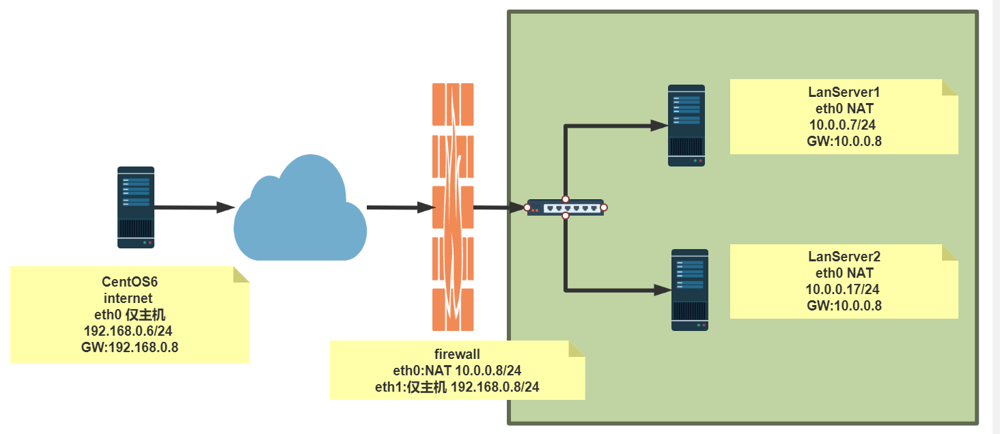


| 主机名     | ip                                                   | 用途       |
| ---------- | ---------------------------------------------------- | ---------- |
| LanServer1 | 10.0.0.6/24（GW：10.0.0.8/24）eth0:NAT               | 内网服务器 |
| LanServer2 | 10.0.0.7/24（GW：10.0.0.8/24）eth0:NAT               | 内网服务器 |
| firewall   | 10.0.0.8/24 eth0:NAT<br />192.168.0.8/24 eth1:仅主机 | NAT服务器  |
| internet   | 192.168.0.6/24 eth1:仅主机                           | 外网服务器 |


```bash
#环境准备好
# LanServer1 和LanServer2 ens33网关指向firewall eth0地址
root@LanServer1:~# route -n
Destination     Gateway         Genmask         Flags Metric Ref    Use Iface
0.0.0.0         10.0.0.8        0.0.0.0         UG    0      0        0 ens33
10.0.0.0        0.0.0.0         255.255.255.0   U     0      0        0 ens33
root@LanServer2:~# route -n
Destination     Gateway         Genmask         Flags Metric Ref    Use Iface
0.0.0.0         10.0.0.8        0.0.0.0         UG    0      0        0 ens33
10.0.0.0        0.0.0.0         255.255.255.0   U     0      0        0 ens33

# internet 网关指向firewall eth0地址
root@internet:~# route -n
Kernel IP routing table
Destination     Gateway         Genmask         Flags Metric Ref    Use Iface
0.0.0.0         192.168.0.8     0.0.0.0         UG    0      0        0 ens33
192.168.0.0     0.0.0.0         255.255.255.0   U     0      0        0 ens33

#在firewall服务器开启ip_forward
root@firewall:~# vim /etc/sysctl.conf
net.ipv4.ip_forward=1
root@firewall:~# sysctl -p
net.ipv4.ip_forward = 1

#通过标准模块实现内网访问外网特定服务http和icmp,反之禁止
root@firewall:~# iptables -A FORWARD -s 10.0.0.0/24 -p tcp --dport 80 -j ACCEPT
root@firewall:~# iptables -A FORWARD -s 10.0.0.0/24 -p icmp  -j ACCEPT


# 通过标准模块实现内网访问外网特定服务http和icmp,反之禁止
root@firewall:~# iptables -AFORWARD -j REJECT
# tcp内网发出去的包--accept
root@firewall:~# iptables -IFORWARD -s 10.0.0.0/24 -p tcp --dport 80 -j ACCEPT
# 返回给内网的包--accept
root@firewall:~# iptables -IFORWARD -d 10.0.0.0/24 -p tcp --sport 80 -j ACCEPT
# icmp内网发出去的包--accept
root@firewall:~# iptables -I FORWARD -s 10.0.0.0/24 -p icmp --icmp-type 8 -j ACCEPT
# 返回给内网发出去的包--accept
root@firewall:~# iptables -I FORWARD -d 10.0.0.0/24 -p icmp --icmp-type 0 -j ACCEPT


root@firewall:~# iptables -nvL --line-numbers
Chain INPUT (policy ACCEPT 0 packets, 0 bytes)
num   pkts bytes target     prot opt in     out     source               destination         

Chain FORWARD (policy ACCEPT 0 packets, 0 bytes)
num   pkts bytes target     prot opt in     out     source               destination         
1      115  9660 ACCEPT     icmp --  *      *       0.0.0.0/0            10.0.0.0/24          icmptype 0
2      135 11340 ACCEPT     icmp --  *      *       10.0.0.0/24          0.0.0.0/0            icmptype 8
3        0     0 ACCEPT     tcp  --  *      *       0.0.0.0/0            10.0.0.0/24          tcp spt:80
4        0     0 ACCEPT     tcp  --  *      *       10.0.0.0/24          0.0.0.0/0            tcp dpt:80
5      426 28037 REJECT     all  --  *      *       0.0.0.0/0            0.0.0.0/0            reject-with icmp-port-unreachable

Chain OUTPUT (policy ACCEPT 0 packets, 0 bytes)
num   pkts bytes target     prot opt in     out     source               destination         
root@LanServer1:~# ping 192.168.0.6
PING 192.168.0.6 (192.168.0.6) 56(84) bytes of data.
64 bytes from 192.168.0.6: icmp_seq=1 ttl=63 time=0.499 ms
64 bytes from 192.168.0.6: icmp_seq=2 ttl=63 time=1.40 ms、

root@LanServer1:~# curl  192.168.0.6
Internet

root@internet:~# ping 10.0.0.6
PING 10.0.0.6 (10.0.0.6) 56(84) bytes of data.
From 192.168.0.8 icmp_seq=1 Destination Port Unreachable

root@internet:~# curl 10.0.0.6
curl: (7) Failed to connect to 10.0.0.6 port 80 after 0 ms: Connection refused


# 允许内网指定主机被外网访问
root@firewall:~# iptables -IFORWARD 3 -d 10.0.0.7 -p tcp --dport 80 -j ACCEPT (发出去的包)
root@firewall:~# iptables -I FORWARD 3 -s 10.0.0.7 -p tcp --sport 80 -j ACCEPT（返回的包）
root@firewall:~# iptables -nvL
Chain INPUT (policy ACCEPT 0 packets, 0 bytes)
 pkts bytes target     prot opt in     out     source               destination         

Chain FORWARD (policy ACCEPT 0 packets, 0 bytes)
 pkts bytes target     prot opt in     out     source               destination         
  165 13860 ACCEPT     icmp --  *      *       0.0.0.0/0            10.0.0.0/24          icmptype 0
  185 15540 ACCEPT     icmp --  *      *       10.0.0.0/24          0.0.0.0/0            icmptype 8
    4   471 ACCEPT     tcp  --  *      *       10.0.0.7             0.0.0.0/0            tcp spt:80
   13   812 ACCEPT     tcp  --  *      *       0.0.0.0/0            10.0.0.7             tcp dpt:80
    4   468 ACCEPT     tcp  --  *      *       0.0.0.0/0            10.0.0.0/24          tcp spt:80
   20  1305 ACCEPT     tcp  --  *      *       10.0.0.0/24          0.0.0.0/0            tcp dpt:80
 1324 83450 REJECT     all  --  *      *       0.0.0.0/0            0.0.0.0/0            reject-with icmp-port-unreachable

Chain OUTPUT (policy ACCEPT 0 packets, 0 bytes)
 pkts bytes target     prot opt in     out     source               destination  
 
 
root@internet:~# curl 10.0.0.7 
LanServer2
root@internet:~# curl 10.0.0.6
curl: (7) Failed to connect to 10.0.0.6 port 80 after 0 ms: Connection refused
```

### 3.8.2 NAT 表

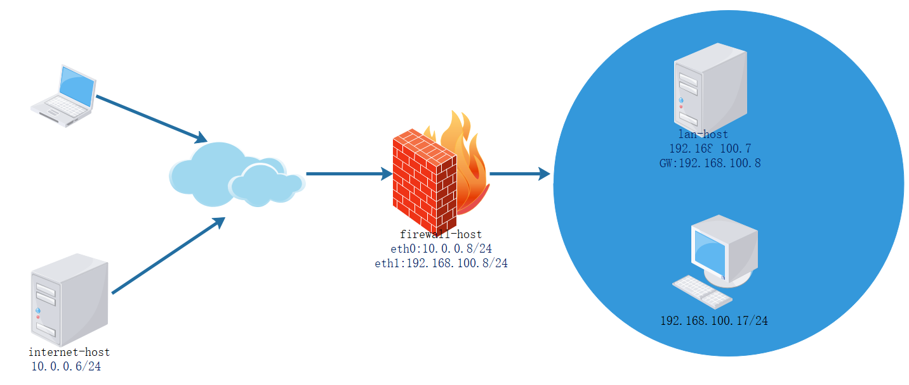

NAT: network address translation，支持PREROUTING，INPUT，OUTPUT，POSTROUTING四个链

请求报文：修改源/目标IP，由定义如何修改

**响应报文：修改源/目标IP，根据跟踪机制自动实现**

NAT的实现分为下面类型：

- SNAT：source NAT ，支持POSTROUTING, INPUT，让本地网络中的主机通过某一特定地址访问 外部网络，实现地址伪装,请求报文：修改源IP
- DNAT：destination NAT 支持PREROUTING , OUTPUT，把本地网络中的主机上的某服务开放给外 部网络访问(发布服务和端口映射)，但隐藏真实IP,请求报文：修改目标IP
- PNAT: port nat，端口和IP都进行修改

**思考题**

```http
在单位内部使用未经申请的公网地址,如:6.0.0.0/8网段,进行内部网络通讯,并利用SNAT连接Internet,是
否可以?
答：如果访问的互联网地址也是6.0.0.0/8网段，就不能访问，因为，他会默认在内网找6.0.0.0/8网段的地址
```

### 3.8.3 SNAT

SNAT：基于nat表的target，适用于固定的公网IP

SNAT选项：

- --to-source [ipaddr[-ipaddr]][:port[-port]][:port]
- --random

```bash
iptables -t nat -A POSTROUTING -s LocalNET ! -d LocalNet -j SNAT --to[-source] ExtIP
```

**注意: 需要开启 ip_forward**

范例：

```bash
iptables -t nat -A POSTROUTING -s 10.0.0.0/24 ! –d 10.0.0.0/24 -j SNAT --tosource 172.18.1.6-172.18.1.9
```

MASQUERADE：基于nat表的target，适用于动态的公网IP，如：拨号网络

MASQUERADE选项：

- --to-ports port[-port]
- --random

```bash
iptables -t nat -A POSTROUTING -s LocalNET ! -d LocalNet -j MASQUERADE
```

范例：

```bash
iptables -t nat -A POSTROUTING -s 10.0.0.0/24 ! -d 10.0.0.0/24 -j MASQUERADE 
```

范例：查看本地主机访问公网时使用的IP

```bash
[root@centos8 ~]#curl http://ip.sb
111.199.191.204

[root@centos8 ~]#curl -L http://tool.lu/ip
当前IP: 111.199.191.204
归属地: 中国 北京 北京

C:\Users\wanglei>curl cip.cc
IP      : 120.244.234.108
地址    : 中国  北京
运营商  : 移动

数据二  : 中国北京北京 | 移动

数据三  : 中国北京北京市 | 移动

URL     : http://www.cip.cc/120.244.234.108
```

范例: SNAT

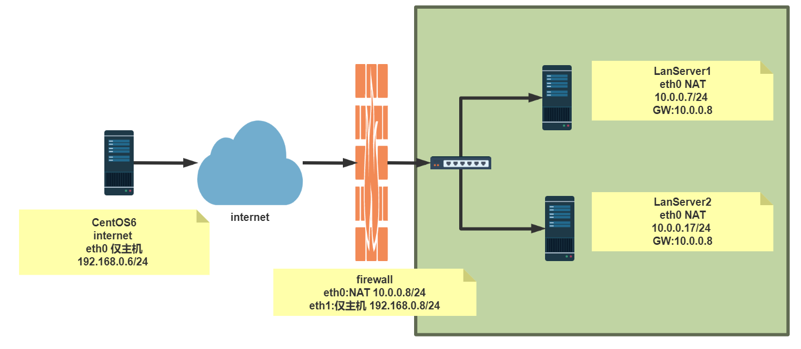

| 主机名     | ip                                              | 用途       |
| ---------- | ----------------------------------------------- | ---------- |
| LanServer1 | 10.0.0.6/24（GW：10.0.0.8/24）eth0:NAT          | 内网服务器 |
| LanServer2 | 10.0.0.7/24（GW：10.0.0.8/24）eth0:NAT          | 内网服务器 |
| firewall   | 10.0.0.8/24 eth0:NAT 192.168.0.8/24 eth1:仅主机 | NAT服务器  |
| internet   | 192.168.0.6/24 eth1:仅主机                      | 外网服务器 |

```bash
#在firewall服务器开启ip_forward
root@firewall:~# vim /etc/sysctl.conf
net.ipv4.ip_forward=1
root@firewall:~# sysctl -p
net.ipv4.ip_forward = 1

# LanServer1 和LanServer2 ens33网关指向firewall eth0地址
root@LanServer1:~# route -n
Destination     Gateway         Genmask         Flags Metric Ref    Use Iface
0.0.0.0         10.0.0.8        0.0.0.0         UG    0      0        0 ens33
10.0.0.0        0.0.0.0         255.255.255.0   U     0      0        0 ens33
root@LanServer2:~# route -n
Destination     Gateway         Genmask         Flags Metric Ref    Use Iface
0.0.0.0         10.0.0.8        0.0.0.0         UG    0      0        0 ens33
10.0.0.0        0.0.0.0         255.255.255.0   U     0      0        0 ens33

root@firewall:~# iptables -t nat -A POSTROUTING -s 10.0.0.0/24 -j SNAT --to-source 192.168.0.8

root@LanServer1:~# curl  192.168.0.6
Internet
root@internet:~# curl 10.0.0.6
curl: (7) Couldn't connect to server

root@internet:~# tcpdump -i ens33 -nn icmp
03:38:34.631564 IP 192.168.0.8 > 192.168.0.6: ICMP echo request, id 7, seq 4, length 64
03:38:34.631619 IP 192.168.0.6 > 192.168.0.8: ICMP echo reply, id 7, seq 4, length 64


# 如果公网地址不固定，可以用MASQUERADE 
root@firewall:~# iptables -t nat -A POSTROUTING -s 10.0.0.0/24 -j MASQUERADE 
```

### 3.8.4 DNAT

DNAT：nat表的target，适用于端口映射，即可重定向到本机，也可以支持重定向至不同主机的不同端 口，但不支持多目标，即不支持负载均衡功能

DNAT选项：

- --to-destination [ipaddr[-ipaddr]][:port[-port]][:port]

```bash
[root@firewall-host ~]#man iptables-extensions
--to-destination [ipaddr[-ipaddr]][:port[-port]]
   which can specify a single new destination IP address, an inclusive range 
of IP addresses. Optionally a port range, if the rule also specifies one of the 
following protocols: tcp, udp, dccp or sctp. If no port range is specified, 
then the destination port will never be modi-fied. If no IP address is specified 
then only the destination port will be modified. In Ker-nels up to  2.6.10 
you can add several --to-destination options. For those kernels, if you specify 
more than one destination address, either via an address range or multiple  --todes-tination
options, a simple round-robin (one after another in cycle) load 
balancing takes place between these addresses. Later Kernels (>= 2.6.11-rc1) 
don't have the ability to NAT to multiple ranges anymore.

```

DNAT 格式:

```bash
iptables -t nat -A PREROUTING -d EXTIP -p tcp|udp --dport PORT -j DNAT --to-destination InterSeverIP[:PORT]
```

**注意: 需要开启 ip_forward**

范例: DNAT

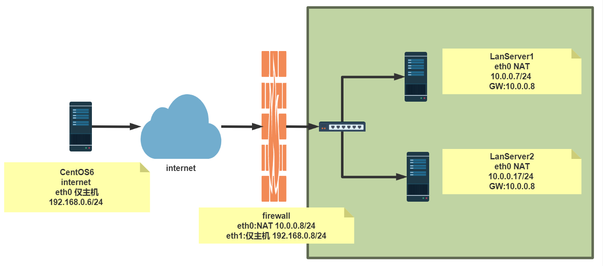

| 主机名     | ip                                              | 用途       |
| ---------- | ----------------------------------------------- | ---------- |
| LanServer1 | 10.0.0.6/24（GW：10.0.0.8/24）eth0:NAT          | 内网服务器 |
| LanServer2 | 10.0.0.7/24（GW：10.0.0.8/24）eth0:NAT          | 内网服务器 |
| firewall   | 10.0.0.8/24 eth0:NAT 192.168.0.8/24 eth1:仅主机 | NAT服务器  |
| internet   | 192.168.0.6/24 eth1:仅主机                      | 外网服务器 |

范例：

```bash
iptables -t nat -A PREROUTING -s 0/0 -d 172.18.100.6 -p tcp --dport 22 -j DNAT -
-to-destination 10.0.1.22

iptables -t nat -A PREROUTING -s 0/0 -d 172.18.100.6 -p tcp --dport 80 -j DNAT -
-to-destination 10.0.1.22:8080
```

范例：

```bash
#在firewall服务器开启ip_forward
root@firewall:~# vim /etc/sysctl.conf
net.ipv4.ip_forward=1
root@firewall:~# sysctl -p
net.ipv4.ip_forward = 1

# LanServer1 和LanServer2 ens33网关指向firewall eth0地址
root@LanServer1:~# route -n
Destination     Gateway         Genmask         Flags Metric Ref    Use Iface
0.0.0.0         10.0.0.8        0.0.0.0         UG    0      0        0 ens33
10.0.0.0        0.0.0.0         255.255.255.0   U     0      0        0 ens33
root@LanServer2:~# route -n
Destination     Gateway         Genmask         Flags Metric Ref    Use Iface
0.0.0.0         10.0.0.8        0.0.0.0         UG    0      0        0 ens33
10.0.0.0        0.0.0.0         255.255.255.0   U     0      0        0 ens33

root@firewall:~# iptables -t nat -A PREROUTING -d 192.168.0.8 -p tcp --dport 80 -j DNAT --to-destination 10.0.0.7
root@firewall:~# iptables -t nat -vnL PREROUTING
Chain PREROUTING (policy ACCEPT 0 packets, 0 bytes)
 pkts bytes target     prot opt in     out     source               destination         
    0     0 DNAT       tcp  --  *      *       0.0.0.0/0            192.168.0.8          tcp dpt:80 to:10.0.0.7

# 测试
root@internet:~# curl 192.168.0.8
LanServer2

# 修改后端nginx端口
root@LanServer2:~# vim  /etc/nginx/sites-enabled/default
server {
        listen 8080 default_server;
        listen [::]:8080 default_server;
        ......
} 

root@LanServer2:~# systemctl restart nginx

root@firewall:~# iptables -t nat -R PREROUTING 1 -d 192.168.0.8 -p tcp --dport 80 -j DNAT --to-destination 10.0.0.7:8080

# 测试
root@internet:~# curl 192.168.0.8
LanServer2
```

### 3.8.5 REDIRECT 转发

REDIRECT，是NAT表的 target，通过改变目标IP和端口，将接受的包转发至同一个主机的不同端口，可 用于PREROUTING OUTPUT链

REDIRECT选项：

- --to-ports port[-port]

**注意: 无需开启 ip_forward**

范例：

```bash
iptables -t nat -A PREROUTING -d 172.16.100.10 -p tcp --dport 80 -j REDIRECT --
to-ports 8080
```

范例：

```bash
[root@lan-host ~]#ss -ntl
State     Recv-Q Send-Q         Local Address:Port                         Peer 
Address:Port              
LISTEN     0      100                 127.0.0.1:25                               
      *:*                  
LISTEN     0      128                         *:22                               
      *:*                  
LISTEN     0      128                     [::]:23                               
    [::]:*                  
LISTEN     0      100                     [::1]:25                               
    [::]:*                  
LISTEN     0      128                     [::]:80                               
    [::]:*                  
LISTEN     0      128                     [::]:22                               
    [::]:*                
    
    
[root@lan-host ~]#iptables -t nat -A PREROUTING -p tcp --dport 8000 -j REDIRECT 
--to-ports 80
   
[root@lan-host ~]#iptables -vnL -t nat
Chain PREROUTING (policy ACCEPT 0 packets, 0 bytes)
 pkts bytes target     prot opt in     out     source               destination 
        
    1    60 REDIRECT   tcp  -- *     *       0.0.0.0/0            0.0.0.0/0   
        tcp dpt:8000 redir ports 80
Chain INPUT (policy ACCEPT 1 packets, 60 bytes)
 pkts bytes target     prot opt in     out     source               destination 
        
Chain OUTPUT (policy ACCEPT 1 packets, 120 bytes)
 pkts bytes target     prot opt in     out     source               destination 
        
Chain POSTROUTING (policy ACCEPT 1 packets, 120 bytes)
 pkts bytes target     prot opt in     out     source               destination 
   
```

### 3.8.6 综合案例: 两个私有网络的互相通迅

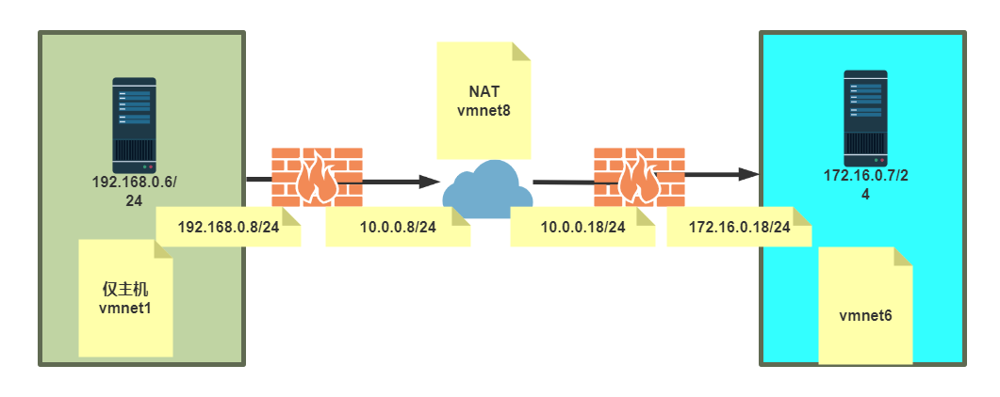


