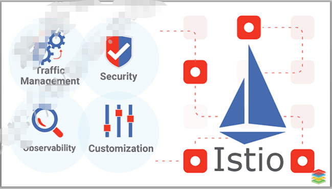

# 1. Istio简介

## 1.1 Istio 系统架构

- [ ] 从完整意义上讲，Istio 服务网格逻辑上分为数据平面和控制平面

  - Istio：控制平面，由多个组件组合完成控制机制；
  - Envoy: 数据平面，以SiderCar形式与服务进程运行在一起的智能代理Envoy

- [ ] 迄今，Istio架构经历了三次重要变革

  - 2018年7月，Istio v1.0：生产可用
  - 2019年3月，Istio v1.1：完全分布式
  - 2020年3月Istio v1.5：；回归单体

  

### 1.1.1 Istio v1.0 Architecture

- [ ] 控制平面主要有3个组件
  - Pillot: 控制平台核心组件
    1. 管理和配置部署在istio网格中所有的envoy代理
    2. 为envoy sidercar提供服务发现，智能路由的流量管理功能(例如，A/B测试，金丝雀)和弹性(超时，重试 ，断路器等 )
  - Citadel: 身份和凭据管理等安全功能，实现强大的服务到服务和最终用户身份管理。
  - Mixer：遥测和策略
    1. 通过内部插件接口扩展支持第三方组件
    2. 插件的修改和更新，需要重新部署Mixer
- [ ] 数据平面Envoy
  - 基于sidercar模式同网格中每个服务实例一同部署
  - 拦截服务流量，强制执行控制平面中定义的策略，并收集遥测数据


### 1.1.2 Istio v1.0 Architecture

- [ ] sidercar模式运行的Envoy根据控制平面组件Pilot定义策略决定路由流量

- [ ] 遥测功能都有Mixer完成

  - 响应来自数据平面的查询，包括授权，访问控制和配额等
  - 收集流量指标，日志和追踪数据
  - 根据启用的适配器，将数据存储到相应的适配器的后端

- [ ] Citadel

  - 帮助用户基于服务身份构建零信任的安全网络环境
  - 密钥管理

  

### 1.1.3 Istio v1.1 Architecture

- [ ] Mixer
  - 将插件模型替换为使用进程外的Adapter进行扩展：性能表现更差
  - 完成了Mixer与扩展间的解耦
- [ ] Galley
  - Pilot中适配底层平台的功能独立成的组件
  - 是ISTIO的配置验证，摄取，处理和分发组件
  - 负责将其余的istio组件从底层平台隔离，实现pilot与底层平台解耦


### 1.1.4 Istio v1.5 Architecture

- [ ] 回归单体

  - 抛弃影响性能的Mixer，遥测功能交给Envoy自行完成
  - 将pilot,citadel,galley和sidercar injector整合成一个单体应用Istiod

- [ ] Istiod

  - Istiod充当控制平面，将配置分发到所有sidercar代理和网关
  - 能够实现智能化的复杂均衡机制，且相关流量绕过kube-proxy

  

## 1.2 Istio 组件简介

### 1.2.1 Ingress Gateway和egress Gateway

- [ ] Istio Gateway用于将istio的功能进入网格

  - 通过将Envoy代理部署在服务之前，可以对这些服务进行A/B测试，金丝雀部署
  - Istio gateway不同于k8s的INgress
  - 类似地，有必要时，也可以部署专用的Egress Gateway，运维人员可以为这些服务添加超时控制、重试、断路器等功能，同时还能从服务连接中获取各种细节指标。

- [ ] 程序文件istio-ingressgateway和istio-egressgateweay

  

### 1.2.2 Istio Sidecar Injector

 Istio服务网格中的每个Pod都必须伴随一个Istio兼容的Sidecar一同运行，常用的将Sidecar注入Pod中的方法有两种

   ◼ 手工注入：使用istioctl客户端工具进行注入

   ◼ 自动注入：使用Istio sidecar injector自动完成注入过程

​          ◆ 利用Kubernets webhook实现sidecar的自动注入

​          ◆ 创建Pod时自动注入过程发生在Admission Controller的Mutation阶段，根据自动注入配置，kube-apiserver拦截到Pod创建请求时调用自动注入服务istio-sidecar-injector生成Sidecar容器的描述并将其插入到Pod的配置清单中.


### 1.2.3 Istio 可视化

- [ ] Grafana
- [ ] Kiali
  - Kiali提供以下功能：
    - 服务拓扑图
    - 分布式跟踪
    - 指标度量收集和图标
    - 配置校验
    - 健康检查和显示
- [ ] Kiali基于go语言开发，由2个组件构成
  - Kiali fron-end：WEB UI ,查询后端并展示给用户
  - Kiali back-end：后端应用负责与istio组件通信，处理数据并返回给前端组件展示
- [ ] Kiali依赖k8s和istio提供的外部服务和组件
  - prometheus：查询Prometheus中的指标数据来生成网格拓扑、显示指标、生成健康状况以及可能存在的问题等；
  - Cluster API:  获取和解析服务网格的配置
  - Jaeger：查询和展示追踪数据，前提是istio需要开启追踪功能
  - Granafa: 可视化展示数据


### 1.2.4 Istio CRD描述

- [ ] Istio的所有路由规则和控制策略都基于CRD实现，其各种配置策略都保存在kube-apiserver后端的etcd中
- [ ] Istio提供了许多CRD,隶属于以下几个功能群主
  - Network(networking.istio.io)：流量治理，包括virtualservice，destionationRRule，gateway等
  - Security(security.istio.io)：主要包括AuthorizationPolicy、 PeerAuthentication和RequestAuthentication等3个CR；
  - Telemetry(telemetry.istio.io)：网络遥测，目前仅包括Telemetry这一个CR;
  - Extensions（extensions.istio.io）：扩展机制，目前仅包括WasmPlugin这一个CR；
  - IstioOperator（install.istio.io）：IstioOperator，目前包括的一个CR也是IstioOperator；

# 2. Istio流量治理

## 2.1 Istio系统组件               

- [ ] 控制平面：默认部署在istio-system的名称空间
  - istiod
  - Ingress-gateway
  - egress-gateway
  - Addons
    1. Kiali
    2. Prometheus
    3. Grafana
    4. Jaeger
- [ ] 数据平面：默认部署为某名称空间下的各Pod的Sidercar Container
  - istio-proxy


## 2.2 部署Istio

### 2.2.1 部署Istio控制平面

- [ ] 

- [ ] 部署方法
  - istioctl
    1. istio的专用管理工具，支持定制控制平面和数据平面
    2. 通过命令行的选项支持完整的IstioOperator API
    3. 命令行各选项可用于单独设置，以及接收包含IstioOperator自定义资源(CR)的yaml文件
  - Istio Operator
    1. Istio相关的自定义资源的专用控制器，负责自动维护由CR定义的资源对象
    2. 管理员根据需要定义相应的CR文件，提交至K8S的API Server后，可由Opweator完成相应的操作
  - helm
    1. 基于特定的Chart，亦可由Helm安装配置Istio
    2. 截至目前，该功能处于alpha阶段

### 2.2.2 Istio内置的部署profile

- [ ] istio提供了内置配置文件（profille）用于快速部署

  - default: 默认的配置，适用于生产环境；
  - demo：会部署较多的组件，旨在演示istio的功能
  - minimal：类似于default profile，但仅部署控制平面组件；
  - remote：用于配置共享control plan的多集群环境；
  - empty: 不部署任何组件，通常帮助用户在自定义profile时生成基础配置信息；
  - perview: 包含预览性的profile，用于探索istio新功能，但不保证稳定性和安全性。

- [ ] 配置档案

  - 各配置档案，事实上是IstioOperator API内置的CR格式的配置文件

- [ ] 了解内置的配置档案

  - ```shell
    istioctl profile list
    ```

  - ```shell
    istioctl profile dump [PROFILE]
    
    # 例如，打印default档案的资源配置信息
    istioctl profile dump default
    
    # --config-path 选项可用于仅打印指定的配置段
    ```

  - ```sh
    istioctl profile diff PROFILE1 PROFILE2
    ```

- [ ] 内置的各profile默认启用的组件会有所不同

  

### 2.2.3 Istio Operator配置说明

- [ ] IstioOperator API主要包括以下几个配置段
  - components：组件配置参数
  - hub：获取各组件镜像仓库，默认为"docker.io/istio"
  - meshConfig: 网格（数据平面）相关的配置参数
  - values：传递给各chart的值

- [ ] IstioOperator API 中定义的组件

  - base
  - pilot
  - ingressGateway
  - egressGatewway
  - cni
  - istioRemote

- [ ] 以上配置段中的各参数，均可在istioctl命令行中使用--set选项进行独立设置；例如，部署default配置档案启用debbug日志功能，使用如下命令：

  ```sh
  istioctl install --set-profile=default --set values.global.logging.level=debug
  ```

### 2.2.4 使用istioctl 快速部署Istio 1.17

- [ ] 前提：准备好kubernetes集群

- [ ] 下载程序

  参考官网：https://istio.io/latest/docs/setup/getting-started/

  - 下载istioctl及相关的安装文件和示例文件

    ```sh
    # cd /usr/local
    # curl -L https://istio.io/downloadIstio | sh -
    # ln -sv istio-1.17.1 istio
    ```

  - istio安装目录结构介绍

    ```sh
    bin/   #二进制程序文件
    manifests/profiles/   #内置的配置档案
    samples/addons/      # 部署各扩展组件的示例清单
    samples/bbookinfo/   #示例微服务项目ookinfo
    tools/  
    ```

  - 将istioctl二进制文件放置在系统PATH环境变量

    ```sh
    cp bin/istioctl /usr/local/bin/
    ```

- [ ] 部署Istio系统

  - 基于demo profile进行部署测试

    ```sh
    # istioctl install --set profile=demo -y
    
    ## 生成部署时使用的资源清单
    # istioctl manifest generate --set profile=demo > /tmp/demo-manifest.yaml
    
    ## istioctl 还支持使用--set选项定制要使用的功能特性，例如：
    # istioctl install --set meshConfig.enableTracing=true
    ```

  - 验证相关Pod和Service已经成功部署

    ```sh
    # kubectl get pods -n istio-system
    # kubectl get svc -n istio-system
    ```

  - 校验部署结果

    ```sh
    istioctl vverify-install -f $HOME/demo-manifest.yaml
    ```

- [ ] 启用Sidercar自动注入功能

  - 在网格应用运行的kubernetes namespace上，为namespace添加标签，激活Sidercar自动注入

    ```sh
    kubectl label namespace default istio-injection=enabled
    ```

- [ ] 按需部署Addons

  ```sh
  kubectl apply -f samples/addons/[MANIFEST_FILLE]
  ```

### 2.2.5 定制Istio部署环境

- [ ] 定制配置

  - IstioOperator API中的个配置参数，均可在istioctl命令行中使用--set进行独立设置；例如

    1. 部署时，为default配置档案启用debug日志功能，可使用如下命令:

       ```sh
       istioctl install --set profile=default --set values.global.logging.level=debug
       ```

    2. 部署时，为default配置档案启用egressgateway组件

       ```sh
       istioctl install --set profile=default --set components.egressGateways.enabled=true
       ```

- [ ] 定制kubernetes设置

  - IstioOperator API支持以一致性的方式定义每一个组件kubernetes设置，每个组件都有一个kubernetesResourceSpec
  - 它支持修改许多配置参数：包括Resources、Readiness probes、Replica count、HPA、PDB、Pod annotations、Service annotations、ImagePullPolicy、Node selector、Service、Toleration、Strategy、Env及Pod security context等.

​        

### 2.2.6 卸载Istio

- [ ] 使用istioctl 命令卸载Istio

  ```sh 
  istioctl experimental uninstall
  ```

- [ ] 卸载方法

  - 卸载指定的控制平面

    1. 卸载指定文件中定义的控制平面

       ```sh 
       istioctl x uninstall -f <FILE>
       ```

    2. 卸载指定的Revision

       ```sh 
       istioctl x uninstall --revision <NAME>
       ```

    3. 基于安装时的选项生成配置信息后kubelet删除

       ```sh
       istioctl manifest generate <your original installation options> | kubectl delete -f -
       ```

  - 清除集群上部署的所有控制平面

    ```sh 
    istioctl x uninstall --purge
    ```

- [ ] 提示：控制平面的名称空间默认不会删除，如果确认不在需要，自行删除。

## 2.3 Istio流量治理

- [ ] Istio的流量路由规则使运维人员可以轻松控制服务之间的流量和API调用
  - Istio简化了诸如断路器，超时和重试之类的服务级别属性的配置，并使其易于设置重要任务（如A/B测试，canary部署和基于百分比的流量拆分的分段部署）。
  - 它还提供了开箱即用的故障恢复功能，有助于使应用程序更强大，以防止相关服务或网络的故
- [ ] 使用Istio进行流量管理从本质上是将流量与底层基础架构解耦，从而让运维工程师能够通过Pilot指定他们希望流量自身需要遵循哪些规则，而非仅仅只能定义由哪些特定的pod/VM接收流量，并在这些pod/VM之间以受限于数量比例的方式分配流量；
  - Pilot和Envoy proxy负责实现流量规则中定义的流量传输机制；
  - 例如，可以通过piot指定特定服务的5%流量到canary版本，而与Canary部署大小无关，或者根据请求内容将流量发送到特定版本
- [ ] Istio的所有路由规则和控制测略基于k8s的CRD实现，这包括网络功能相关的VirtualService、DestionRule、Gateway, serviceEntry和EnvoyFilter等。

### 2.3.1 Istio流量治理的关键配置

- [ ] Istio通过Ingress Gateway为网格引入外部流量；

  - Gateway中运行的主程序为Envoy，同样从控制平面接受配置，并完成相关流量传输；
  - Gateway资源对象用于将外部访问映射到内部服务，它自身只负责通信子网相关功能，例如套接字，而7层路由功能则由VirtualService实现；

- [ ] Istio基于ServiceEntry资源对象将外部服务注册到网格内，从而将外部服务以类同内部服务一样的方式进行访问；

  - 对于外部服务，网格内的sidercar方式运行的Envoy即能执行治理；
  - 若需要将外出流量收束与特定的几个节点需要使用专用的Egress Gateway完成；

  

- [ ] VirtualService和D二十题nationRules是Istio流量功能的核心组件

- [ ] VirtualService用于将分类流量并将其路由到指定的目的地(Destination)，而Destination Rules用于配置那个指定的Destination如何处理流量 

  - Virtual Service
    1. 配置如何将请求路由到网格中的各service之上
    2. 通常由一组路由规则组成，这些路由规则按照顺序评估
    3. 事实上，定义的是分发给网格内各Envoy的virtualHost和Route的相关配置;

  -    Destination Rules
    1. 定义流量在目标内部的各端点之间的分发机制，例如将各端点进行分组，分组内端点间的流量均衡机制，异常探测等；
    2. 事实上，其定义的分发给网格内各Envoy的cluster相关配置；

- [ ] VirtualService定义虚拟主机及其相关的路由规则，包括路由到哪各集群

- [ ] DestinRules定义集群或子集内部的流量分发机制

         


### 2.3.2 配置Istio流量治理

- [ ] 流量治理基础
  - 集群外部的入站流量会经由ngress Gateway到达集群内部
    1. 需要经由Gateway定义的Igress gateway上的虚拟主机；
    2. 包括目标流量访问的"host"，以及虚拟主机监听的端口
  - 集群内部流量仅在sidecar 之间流动
    1. virtualSrvicce 为sidcar envoy定义listener(主要定义流量路由机制)；
    2. DestinationRule为sidercar envoy定义cluster（包括发现端点等）；

### 2.3.3 示例

#### 2.3.3.1 开放kiali至集群外部

- [ ] 首先将istio-inressateway暴露集群外部;

  在node02的ens33网卡上面有多余的ip地址，将该地址绑定在igressgateway的svc 上面。

  ```sh 
  kubectl edit svc istio-ingressgateway -n istio-system
  ```

  

- [ ] 定义kiali的ingress gateway的资源配置清单

  ```yaml
  apiVersion: networking.istio.io/v1beta1
  kind: Gateway
  metadata:
    name: kiali-gateway
    namespace: istio-system
  spec:
    selector:
      app: istio-ingressgateway
    servers:
    - hosts:
      - "kiali.icloud2native.com"
      port:
        name: http-kiali
        number: 80
        protocol: HTTP
  ---
  ```

- [ ] 定义kiali的VirtualService清单

  ```yaml
  apiVersion: networking.istio.io/v1beta1
  kind: VirtualService
  metadata:
    name: kiali-vs
    namespace: istio-system
  spec:
    gateways:
    - kiali-gateway
    hosts:
    - "kiali.icloud2native.com"
    http:
    - match:
      - uri:
          prefix: /
      route:
      - destination:
          host: kiali
          port:
            number: 20001
  ```

- [ ] 定义kiali的DestinationRule清单

  ```yaml
  apiVersion: networking.istio.io/v1beta1
  kind: DestinationRule
  metadata:
    name: kiali-dr
    namespace: istio-system
  spec:
    host: kiali
    trafficPolicy:
      tls:
        mode: DISABLE
  ```

- [ ] 本地解析，后访问kiali

  

#### 2.3.3.2 开放grafana至集群外

- [ ] 定义grafana的gateway

  ```yaml
  apiVersion: networking.istio.io/v1beta1
  kind: Gateway
  metadata:
    name: granafa-gw
    namespace: istio-system
  spec:
    selector:
      app: istio-ingressgateway
    servers:
    - port:
        name: http-80
        number: 80
        protocol: HTTP
      hosts:
      - "grafana.icloud2native.com"
  ---
  ```

- [ ] 定义grafana的virtualservice

  ```yaml
  apiVersion: networking.istio.io/v1beta1
  kind: VirtualService
  metadata:
    name: grafana-vs
    namespace: istio-system
  spec:
    gateways:
    - granafa-gw
    hosts:
    - "grafana.icloud2native.com"
    http:
    - match:
      - uri:
          prefix: /
      route:
      - destination:
          host: grafana
          port:
            number: 3000
  ```

- [ ] 定义grafana的dr

  ```yaml
  apiVersion: networking.istio.io/v1beta1
  kind: DestinationRule
  metadata:
    name: grafana
    namespace: istio-system
  spec:
    host: grafana
    trafficPolicy:
      tls:
        mode: DISABLE
  ---
  ```

- [ ] 访问grafana

  

#### 2.3.3.3 开放prometheus至集群外

- [ ] prometheus的gateway，vs，dr资源配置清单

  ```yaml
  apiVersion: networking.istio.io/v1beta1
  kind: Gateway
  metadata:
    name: prometheus-gateway
    namespace: istio-system
  spec:
    selector:
      app: istio-ingressgateway
    servers:
    - port:
        number: 80
        name: http
        protocol: HTTP
      hosts:
      - "prometheus.icloud2native.com"
  ---
  apiVersion: networking.istio.io/v1beta1
  kind: VirtualService
  metadata:
    name: prometheus-virtualservice
    namespace: istio-system
  spec:
    hosts:
    - "prometheus.icloud2native.com"
    gateways:
    - prometheus-gateway
    http:
    - match:
      - uri:
          prefix: /
      route:
      - destination:
          host: prometheus
          port:
            number: 9090
  ---
  apiVersion: networking.istio.io/v1beta1
  kind: DestinationRule
  metadata:
    name: prometheus
    namespace: istio-system
  spec:
    host: prometheus
    trafficPolicy:
      tls:
        mode: DISABLE
  ---
  ```

- [ ] 访问prometheus

  

#### 2.3.3.4 开放trace至集群外

- [ ] trace的gateway，vs，dr资源配置清单

  ```yaml
  apiVersion: networking.istio.io/v1beta1
  kind: Gateway
  metadata:
    name: tracing-gateway
    namespace: istio-system
  spec:
    selector:
      app: istio-ingressgateway
    servers:
    - port:
        number: 80
        name: http
        protocol: HTTP
      hosts:
      - "tracing.icloud2native.com"
  ---
  apiVersion: networking.istio.io/v1beta1
  kind: VirtualService
  metadata:
    name: tracing-virtualservice
    namespace: istio-system
  spec:
    hosts:
    - "tracing.icloud2native.com"
    gateways:
    - tracing-gateway
    http:
    - match:
      - uri:
          prefix: /
      route:
      - destination:
          host: tracing
          port:
            number: 80
  ---
  apiVersion: networking.istio.io/v1beta1
  kind: DestinationRule
  metadata:
    name: tracing-dr
    namespace: istio-system
  spec:
    host: tracing
    trafficPolicy:
      tls:
        mode: DISABLE
  ---
  ```

- [ ] 访问Jaeger

  

### 2.3.4 网格流量治理和服务发现

- [ ] 网格内服务发送和接收的所有流量（Data Plane流量）都要经由Envoy代理进行
- [ ] Istio借助于服务注册中心完成服务发现
  - Istio自身并不进行服务发现功能，它需要借助于服务注册中心发现所有Service及对应的endoints；
  - Istio还假设服务的新实例会自动注册到服务注册表，并且会自动删除不健康的示例；
  - K8S,Mesos等平台能够为基于容器的应用程序提供服务发现功能，另外也存在大量针对基于VM的应用程序解决方案；
- [ ] K8S系统，Istio会将网格中每个service端口创建为Listener，而其匹配到的endpoint组成一个cluster；
  - 这些listener和cluster将配置网格每个sidercar envoy之上；
  - 对于某个特定的sidercar envoy来说，仅其自身所属的service生成的listener为Inbond llistener,而其他所有的service生成的listener都将配置为其上的Outbound Listener；
  - 进出应用的所有流量都将被sidercar envoy拦截并基于重定向的方式进行处理；
- [ ] sidercar envoy的功能
  - 在负载均衡池中的实例3之间分配流量；
  - 在对后端端点进行健康状态检测
  - ...

#### 2.3.4.1 Istio网格中的默认配置

- [ ] 应用程序自身的监听的端口相关的入站访问流量，将被网络名称空间的iptables规则实施拦截后，并统一转发给Envoy sidercar的15006//TCP端口，该端口也是Envoy上的listener之一；

- [ ] 应用程序自身的监听的端口相关的出站访问流量，将被网络名称空间的iptables规则实施拦截后，并统一转发给Envoy sidercar的15001//TCP端口，该端口也是Envoy上的listener之一；

- [ ] 对于网格应用所属的名称空间中的每一个service对象

  - 每个service 的端口，都将作为一个Egress Listener配置在网格中的envoy实例之上，从而保证每个app可以访问到这个service；

  - 其selector匹配到的端点，将组合成一个cluster，配置在网格中各envoy实例中；

  - 生成默认路由，发往该service上的listener的流量，都将被路由到同一service生成的cluster之上；

  - 获取命令:

    ```shh
    istioctl pc <clusters|listeners|routes|endpoints|bootstrap|log|secret> <pod-name[.namespace]>
    ```

#### 2.3.4.2 案例一：使用subset

- [ ] 两个应用

  - frontend(pproxy)：前端应用，会请求后端的demoapp
  - demoapp：后端应用，同时部署2个版本。

  

- [ ] 部署demoapp和frontend

  ```yaml
  ---
  apiVersion: apps/v1
  kind: Deployment
  metadata:
    labels:
      app: demoappv10
      version: v1.0
    name: demoappv10
  spec:
    progressDeadlineSeconds: 600
    replicas: 3
    selector:
      matchLabels:
        app: demoapp
        version: v1.0
    template:
      metadata:
        labels:
          app: demoapp
          version: v1.0
      spec:
        containers:
        - image: ikubernetes/demoapp:v1.0
          imagePullPolicy: IfNotPresent
          name: demoapp
          env:
          - name: "PORT"
            value: "8080"
          ports:
          - containerPort: 8080
            name: web
            protocol: TCP
          resources:
            limits:
              cpu: 50m
  ---
  ---
  apiVersion: apps/v1
  kind: Deployment
  metadata:
    labels:
      app: demoappv11
      version: v1.1
    name: demoappv11
  spec:
    progressDeadlineSeconds: 600
    replicas: 2
    selector:
      matchLabels:
        app: demoapp
        version: v1.1
    template:
      metadata:
        labels:
          app: demoapp
          version: v1.1
      spec:
        containers:
        - image: ikubernetes/demoapp:v1.1
          imagePullPolicy: IfNotPresent
          name: demoapp
          env:
          - name: "PORT"
            value: "8080"
          ports:
          - containerPort: 8080
            name: web
            protocol: TCP
          resources:
            limits:
              cpu: 50m
  ---
  ---
  apiVersion: v1
  kind: Service
  metadata:
    name: demoapp
  spec:
    ports:
      - name: http
        port: 8080
        protocol: TCP
        targetPort: 8080
    selector:
      app: demoapp
    type: ClusterIP
  ---
  apiVersion: apps/v1
  kind: Deployment
  metadata:
    name: proxy
  spec:
    progressDeadlineSeconds: 600
    replicas: 1
    selector:
      matchLabels:
        app: proxy
    template:
      metadata:
        labels:
          app: proxy
      spec:
        containers:
          - env:
            - name: PROXYURL
              value: http://demoapp:8080
            image: ikubernetes/proxy:v0.1.1
            imagePullPolicy: IfNotPresent
            name: proxy
            ports:
              - containerPort: 8080
                name: web
                protocol: TCP
            resources:
              limits:
                cpu: 50m
  ---
  apiVersion: v1
  kind: Service
  metadata:
    name: proxy
  spec:
    ports:
      - name: http-80
        port: 80
        protocol: TCP
        targetPort: 8080
    selector:
      app: proxy
  ---
  ```

- [ ] 定义VirtualService，将访问demoapp的流量按需发往不同的子集

  ```yaml
  apiVersion: networking.istio.io/v1beta1
  kind: VirtualService
  metadata:
    name: demoapp
  spec:
    hosts:
    - demoapp
    http:
    - name: canary
      match:
      - uri:
          prefix: /canary
      rewrite:
        uri: /
      route:
      - destination:
          host: demoapp
          subset: v11
    - name: default
      route:
      - destination:
          host: demoapp
          subset: v10
  ```

- [ ] 定义DestionationRule，将demoapp划分为几个子集

  ```yaml
  apiVersion: networking.istio.io/v1beta1
  kind: DestinationRule
  metadata:
    name: demoapp
  spec:
    host: demoapp
    subsets:
    - name: v10
      labels:
        version: v1.0
    - name: v11
      labels:
        version: v1.1
  ```

- [ ] 验证测试：

  在sleep的交互式接口发起持续访问请求：

  ```sh
  while true;do curl proxy;sleep 0.$RANDOM;curl proxy/canary;sleep 0.$RANDOM;done
  ```

  

#### 2.3.4.3 案例二：使用Gateway暴露proxy服务

- [ ] 创建Gateway，将proxy开放至集群外部

  - proxy-gateway--> vs/proxy-->dr/proxy-->MESH

    

- [ ] 创建Gateway资源，通过网格，为frontend引入集群外部的流量

  ```yaml
  apiVersion: networking.istio.io/v1beta1
  kind: Gateway
  metadata:
    name: proxy-gateway
    namespace: istio-system
  spec:
    selector:
      app: istio-ingressgateway
    servers:
    - port:
        number: 80
        name: http-80
        protocol: HTTP
      hosts:
      - "fe.icloud2native.com"
  ---
  apiVersion: networking.istio.io/v1beta1
  kind: VirtualService
  metadata:
    name: proxy
  spec:
    gateways:
    - istio-system/proxy-gateway
    hosts:
    - "fe.icloud2native.com"
    http:
    - name: default
      route:
      - destination:
          host: proxy
  ---
  ```

- [ ] 在集群外部，发起请求，可以看到service graph

  

## 2.4 Istio流量治理进阶

- Pilot的配置分发机制及流量管理的相关组件
- Istio流量治理基础及其相关的CRD
- Ingressgateway和Egress gateway功能概述
- 网格东西向流量管理及配置机制：VirtualService和DestinationRule
- 网格南北向流量管理及其配置机制: Gateway和ServiceEntry
- 配置Envoy：Sidecar和Envoyfilter

### 2.4.1 Pilot配置分发机制

- [ ] Pilot负责网格数据平面相关配置信息的获取，生成，和分发，它通过Service Registry获取网格配置信息并将其转换为XDS接口的标准数据格式，而后经gRPC分发至相关的Envoy;

  

  - Service Registry：服务注册表中存储有相关平台上注册的各Service的相关信息，例如kubernetes services等；
  - Config Storage: 配置存储，例如Kub   ernetes的API Server，配置信息通常由用户提供，对于kubernetes来说，他们以CRD格式提供并存储于API Server中；

- [ ] 事实上，基于适配器机制，Pilot还可以从Mesos，cloud foundry和consul等平台获取服务信息。

#### 2.4.1.1 Pilot流量管理相关组件

- [ ] Pilot工作架构的相关组件包括：pilot-discovery、k8s api-server、istio-proxy、pilot-agent以及命令

  istioctl和kubectl；

- [ ] 事实上,pilot项目自身的组件也是由工作于控制平面的pilot-discovery和工作于数据平面的pilot-agent共同组成;

  

- [ ] 控制平面相关组件

  - pilot-discovery：也就是上图中的Discovery services，它主要完成以下功能：
    1. 从Service Registry中获取服务信息；
    2. 从API Service中获取配置信息；
    3. 将服务信息和配置信息转化为Envoy的配置格式，并通过XDS API完成分发；
  - Kubernetes API Server
    1. 配置存储系统，负责存储用户以及CRD格式（VS和DR）提供的配置信息；

- [ ] 数据平面相关组件: proxyv2镜像启动的容器会运行pilot-agent和envoy两个进程;

  - pilot-agent
    1. 基于K8S apiserver为envoy初始化可用的bootstrap配置文件并启动envoy；
    2. 监控并管理envoy的运行状态，包括envoy出错时重启envoy，以及envoy配置变更后将其重载；
  - envoy
    1. envoy由pilot-agent进程基于生成的bootstrap配置进行启动，而后根据配置中指定的pilot地址，通过XDS API获取动态配置；
    2. Sidecar形式的Envoy通过流量拦截机制为应用程序实现入站和出战代理功能；

### 2.4.2 流量治理

- [ ] Istio 的流量路由规则使运维人员 可以轻松控制服务之间流量及API调用
  - Istio简化了诸如断路器，超时，重试之类的服务级别属性的配置；
  - 还提供了开箱即用的故障恢复功能，有助于使应用程序更强大，以防止相关服务和网络故障；
- [ ] 使用istio进行流量管理从本质上是将流量与底层基础架构的伸缩机制解耦。
  - Pilot和Envoy proxy负责实现流量规则中定义的流量传输机制；
  - 例如，可以通过pilot指定您希望特定服务的5%流量到canary版本，而与canary部署的大小无关，或者根据请求的内容将流量发送特定版本；
- [ ] Istio的所有路由规则和控制策略都是基于kubernetes CRD实现，这包括网络功能相关的VirtualService、DestinationRule、Gateway、ServiceEntry和EnvoyFilter等；

### 2.4.3 VirtualService配置要点

- [ ] VirtualService的关键字段

  - hosts： 必选字段，用于指定流量请求的目标，可以是一个DNS名称或IP地址；DNS名称可以使用通配符，也可以使用短格式的service名称；
  - gateways：指定应用流量规则的Gateway资源，在VirtualService上使用gateways字段遵循如下规则：
    1. 仅用于网格内部东西流量，省略gateway字段;
    2. 仅用于引入外部网格的流量，为gateway字段赋予合适的值即可；`客户端源自网格外部`；`Gateway负责接入这部分流量，VirtualService负责将这部分流量完成在网格内路由`；
    3. 同时用于网格内和网格外的流量时，需要将gateways字段的列表值其中一项指定为`mesh`；客户端即可源自网络外部，也可以是网格内部的流量；
  - http：配置http协议的流量管理机制的有序列表，其配置框架称为HTTPRoute;
  - tls: 用于处理TLS和https流量的有序列表，其配置框架称为TLSRoute；
  - tcp：管理四层的TCP流量的有序列表，其配置框架称为TCPRoute；

  #### 2.4.3.1 HTTP路由配置(HTTPRoute)

  - [ ] `virtualservice.http`配置如何处理http流量
    - 服务的端口协议是HTTP,HTTP2,GRPC，即在服务的端口名中包含http-，http2-，grpc-等；
    - Gateway的端口协议是HTTP,HTTP2,GRPC,或者Gateway终结了TLS;
    - ServiceEntry的端口协议是HTTP,HTTP2,GRPC;
  - [ ] 路由机制及服务韧性等相关配置，即满足了HTTPMatchRequest条件的流量，做如下处理：
    - 路由到指定目标 （HTTPRouteDestination）
    - 执行重定向(HTTPRedict)
    - URL重写（HTTPRewrite）
    - 请求重试(HTTPRetry)
    - 故障注入(HTTPFaultInjection)
    - 跨站引用资源
    - ...

  ##### 2.4.3.2 redirect

  1. 部署前端proxy服务

     ```yaml
     apiVersion: apps/v1
     kind: Deployment
     metadata:
       name: proxy
     spec:
       progressDeadlineSeconds: 600
       replicas: 1
       selector:
         matchLabels:
           app: proxy
       template:
         metadata:
           labels:
             app: proxy
         spec:
           containers:
             - env:
               - name: PROXYURL
                 value: http://demoappv10:8080
               image: ikubernetes/proxy:v0.1.1
               imagePullPolicy: IfNotPresent
               name: proxy
               ports:
                 - containerPort: 8080
                   name: web
                   protocol: TCP
               resources:
                 limits:
                   cpu: 50m
     ---
     apiVersion: v1
     kind: Service
     metadata:
       name: proxy
     spec:
       ports:
         - name: http-80 ## service要想让virtualservice识别出http，就以http-*
           port: 80
           protocol: TCP
           targetPort: 8080
       selector:
         app: proxy
     ```

  2. 部署后端backend服务

     ```yaml
     ---
     apiVersion: apps/v1
     kind: Deployment
     metadata:
       labels:
         app: backend
         version: v3.6
       name: backendv36
     spec:
       progressDeadlineSeconds: 600
       replicas: 2
       selector:
         matchLabels:
           app: backend
           version: v3.6
       template:
         metadata:
           creationTimestamp: null
           labels:
             app: backend
             version: v3.6
         spec:
           containers:
           - image: ikubernetes/gowebserver:v0.1.0
             imagePullPolicy: IfNotPresent
             name: gowebserver
             env:
             - name: "SERVICE_NAME"
               value: "backend"
             - name: "SERVICE_PORT"
               value: "8082"
             - name: "SERVICE_VERSION"
               value: "v3.6"
             ports:
             - containerPort: 8082
               name: web
               protocol: TCP
             resources:
               limits:
                 cpu: 50m
     ---
     apiVersion: v1
     kind: Service
     metadata:
       name: backend
     spec:
       ports:
         - name: http-web
           port: 8082
           protocol: TCP
           targetPort: 8082
       selector:
         app: backend
         version: v3.6
     ```

  3. 配置redirect的virtualservice

     ```yaml
     apiVersion: networking.istio.io/v1beta1
     kind: VirtualService
     metadata:
       name: proxy
     spec:
       hosts:
       - proxy
       http:
       - name: redict
         match:
         - uri:
             prefix: "/backend"
         redirect:
           uri: /   # 覆盖match中的urri
           authority: backend # 覆盖请求的url的主机
           port: 8082 #覆盖请求的url的端口
       - name: default
         route:
         - destination:
             host: proxy
     ```

  4. 请求`http://proxy/backend`看是否重定向

     


#### 2.4.3.3 weight

1. 部署`demoapp v10`和`v11`版本

   ```yaml
   ---
   apiVersion: apps/v1
   kind: Deployment
   metadata:
     labels:
       app: demoappv10
       version: v1.0
     name: demoappv10
   spec:
     progressDeadlineSeconds: 600
     replicas: 3
     selector:
       matchLabels:
         app: demoapp
         version: v1.0
     template:
       metadata:
         labels:
           app: demoapp
           version: v1.0
       spec:
         containers:
         - image: ikubernetes/demoapp:v1.0
           imagePullPolicy: IfNotPresent
           name: demoapp
           env:
           - name: "PORT"
             value: "8080"
           ports:
           - containerPort: 8080
             name: web
             protocol: TCP
           resources:
             limits:
               cpu: 50m
   ---
   apiVersion: apps/v1
   kind: Deployment
   metadata:
     labels:
       app: demoappv11
       version: v1.1
     name: demoappv11
   spec:
     progressDeadlineSeconds: 600
     replicas: 2
     selector:
       matchLabels:
         app: demoapp
         version: v1.1
     template:
       metadata:
         labels:
           app: demoapp
           version: v1.1
       spec:
         containers:
         - image: ikubernetes/demoapp:v1.1
           imagePullPolicy: IfNotPresent
           name: demoapp
           env:
           - name: "PORT"
             value: "8080"
           ports:
           - containerPort: 8080
             name: web
             protocol: TCP
           resources:
             limits:
               cpu: 50m
   ---
   apiVersion: v1
   kind: Service
   metadata:
     name: demoapp
   spec:
     ports:
       - name: http
         port: 8080
         protocol: TCP
         targetPort: 8080
     selector:
       app: demoapp
     type: ClusterIP
   ---
   
   ```

2. 定义subset

   ```yaml
   apiVersion: networking.istio.io/v1beta1
   kind: DestinationRule
   metadata:
     name: demoapp
   spec:
     host: demoapp
     subsets:
     - name: v10
       labels:
         version: v1.0
     - name: v11
       labels:
         version: v1.1
   ```

3. 定义基于weight的virtualservice

   ```yaml
   apiVersion: networking.istio.io/v1beta1
   kind: VirtualService
   metadata:
     name: demoapp
   spec:
     hosts:
     - demoapp
     http:
     - name: weight-based-routing
       route:
       - destination:
           host: demoapp
           subset: v10
         weight: 90
       - destination:
           host: demoapp
           subset: v11
         weight: 10
   
   ```

4. 测试

   访问`http://demoapp:8080`

   

   kiali查看拓扑

   

#### 2.4.3.4 rewrite

1. 定义`demoapp v1.0`和`demoapp v1.1`版本和`subset`的dr规则。参考weight中定义

2. 定义rewrite的virtualservice

   ```yaml
   apiVersion: networking.istio.io/v1beta1
   kind: VirtualService
   metadata:
     name: demoapp
   spec:
     hosts:
     - demoapp
     http:
     - name: rewrite
       match:
       - uri:
           prefix: /canary
       rewrite:
         uri: /
       route:
       - destination:
           host: demoapp
           subset: v11
     - name: default
       route:
       - destination:
           host: demoapp
           subset: v10
   
   ```

3. 测试

   访问：`http://demoapp:8080/canary`

   

   访问：`http://demoapp:8080`

   

#### 2.4.3.5 header

1. 定义`demoapp v1.0`和`demoapp v1.1`版本和`subset`的dr规则。参考weight中定义

2. 定义header规则

   ```yaml
   apiVersion: networking.istio.io/v1beta1
   kind: VirtualService
   metadata:
     name: demoapp
   spec:
     hosts:
     - demoapp
     http:
     - name: canary
       match:
       - headers:
           x-canary:
             exact: "true"
       route:
       - destination:
           host: demoapp
           subset: v11
         headers:
           request:
             set: 
               User-Agent: Chrome   #set字段修改request的value的值
           response:
             add:
               x-canary: "true"  # 在reponse中利用add字段进行添加
     - name: default
       headers:
         response:
           add:
             X-Envoy: test
       route:
       - destination:
           host: demoapp
           subset: v10
   
   ```

3. 测试功能

   按照定义的header的vs规则：

   - 当请求`demoapp:8080`会匹配上default规则，并且在response的header加上`x-Envoy: test`的标头

     ```sh
     / $ curl -I demoapp:8080
     HTTP/1.1 200 OK
     content-type: text/html; charset=utf-8
     content-length: 114
     server: envoy
     date: Tue, 22 Aug 2023 09:14:02 GMT
     x-envoy-upstream-service-time: 2
     x-envoy: test
     ```

   - 当请求`demoapp:8080`加上`x-canary: true` 的标头，会在reponse中增加标头，以及会将request的`User-Agent: Chrome`修改

     ```sh
     / $ curl -I -H "x-canary: true" demoapp:8080
     HTTP/1.1 200 OK
     content-type: text/html; charset=utf-8
     content-length: 116
     server: envoy
     date: Tue, 22 Aug 2023 09:18:06 GMT
     x-envoy-upstream-service-time: 2
     x-canary: true
     ```

     ```sh
     / $ curl -H "x-canary: true" demoapp:8080/user-agent
     User-Agent: Chrome
     / $ 
     ```

#### 2.4.3.6 fault injection

1. 定义`demoapp v1.0`和`demoapp v1.1`版本和`subset`的dr规则。参考weight中定义

2. 定义fault injection的规则

   ```yaml
   apiVersion: networking.istio.io/v1beta1
   kind: VirtualService
   metadata:
     name: demoapp
   spec:
     hosts:
     - demoapp
     http:
     - name: canary
       match:
       - uri:
           prefix: /canary
       rewrite:
         uri: /
       route:
       - destination:
           host: demoapp
           subset: v11
       fault:         # 故障注入的一种方式abort,会在发往v11版本的20%的流量上注入abort故障，返回的http code为555
         abort:
           percentage:
             value: 20
           httpStatus: 555
     - name: default
       route:
       - destination:
           host: demoapp
           subset: v10
       fault:
         delay:              # 故障注入的另外一种方式延迟，会在发往v10的版本上20%的流量上注入delay故障，延迟时间为3秒
           percentage:
             value: 20
           fixedDelay: 3s
   ```

3. 测试

   - 当访问`demoapp:8080/canary`的时候，按照上诉定义的规则，会有20%的比例注入abort故障：

     ```sh
     / $ curl demoapp:8080/canary
     iKubernetes demoapp v1.1 !! ClientIP: 127.0.0.6, ServerName: demoappv11-77755cdc65-vxmgv, ServerIP: 172.16.140.87!
     / $ curl demoapp:8080/canary
     iKubernetes demoapp v1.1 !! ClientIP: 127.0.0.6, ServerName: demoappv11-77755cdc65-k2xzl, ServerIP: 172.16.196.145!
     / $ curl demoapp:8080/canary
     iKubernetes demoapp v1.1 !! ClientIP: 127.0.0.6, ServerName: demoappv11-77755cdc65-k2xzl, ServerIP: 172.16.196.145!
     / $ curl demoapp:8080/canary
     iKubernetes demoapp v1.1 !! ClientIP: 127.0.0.6, ServerName: demoappv11-77755cdc65-k2xzl, ServerIP: 172.16.196.145!
     / $ curl demoapp:8080/canary
     iKubernetes demoapp v1.1 !! ClientIP: 127.0.0.6, ServerName: demoappv11-77755cdc65-vxmgv, ServerIP: 172.16.140.87!
     / $ curl demoapp:8080/canary
     iKubernetes demoapp v1.1 !! ClientIP: 127.0.0.6, ServerName: demoappv11-77755cdc65-vxmgv, ServerIP: 172.16.140.87!
     / $ curl demoapp:8080/canary
     iKubernetes demoapp v1.1 !! ClientIP: 127.0.0.6, ServerName: demoappv11-77755cdc65-k2xzl, ServerIP: 172.16.196.145!
     / $ curl demoapp:8080/canary
     iKubernetes demoapp v1.1 !! ClientIP: 127.0.0.6, ServerName: demoappv11-77755cdc65-k2xzl, ServerIP: 172.16.196.145!
     / $ curl demoapp:8080/canary
     iKubernetes demoapp v1.1 !! ClientIP: 127.0.0.6, ServerName: demoappv11-77755cdc65-k2xzl, ServerIP: 172.16.196.145!
     / $ curl demoapp:8080/canary
     iKubernetes demoapp v1.1 !! ClientIP: 127.0.0.6, ServerName: demoappv11-77755cdc65-k2xzl, ServerIP: 172.16.196.145!
     / $ curl demoapp:8080/canary
     fault filter abort/ $ 
     
     ```

   - 当访问`demoapp:8080`的时候，按照规则，会有20%的流量注入延迟3秒的故障

     ```sh
     / $ curl demoapp:8080
     iKubernetes demoapp v1.0 !! ClientIP: 127.0.0.6, ServerName: demoappv10-b5d9576cc-f9vfv, ServerIP: 172.16.140.88!
     / $ curl demoapp:8080
     iKubernetes demoapp v1.0 !! ClientIP: 127.0.0.6, ServerName: demoappv10-b5d9576cc-fglcx, ServerIP: 172.16.140.86!
     / $ curl demoapp:8080
     iKubernetes demoapp v1.0 !! ClientIP: 127.0.0.6, ServerName: demoappv10-b5d9576cc-qfnw5, ServerIP: 172.16.196.146!
     / $ curl demoapp:8080
     iKubernetes demoapp v1.0 !! ClientIP: 127.0.0.6, ServerName: demoappv10-b5d9576cc-fglcx, ServerIP: 172.16.140.86!
     / $ curl demoapp:8080
     iKubernetes demoapp v1.0 !! ClientIP: 127.0.0.6, ServerName: demoappv10-b5d9576cc-f9vfv, ServerIP: 172.16.140.88!
     / $ curl demoapp:8080
     iKubernetes demoapp v1.0 !! ClientIP: 127.0.0.6, ServerName: demoappv10-b5d9576cc-f9vfv, ServerIP: 172.16.140.88!
     / $ curl demoapp:8080
     ^C
     
     ```

#### 2.4.3.7 retry

1. 定义`demoapp v1.0`和`demoapp v1.1`版本和`subset`的dr规则。参考weight中定义

2. 定义`proxy`的`deployment`和`gateway` 以及`virtualservice`

   ```yaml
   apiVersion: apps/v1
   kind: Deployment
   metadata:
     name: proxy
   spec:
     progressDeadlineSeconds: 600
     replicas: 1
     selector:
       matchLabels:
         app: proxy
     template:
       metadata:
         labels:
           app: proxy
       spec:
         containers:
           - env:
             - name: PROXYURL
               value: http://demoapp:8080
             image: ikubernetes/proxy:v0.1.1
             imagePullPolicy: IfNotPresent
             name: proxy
             ports:
               - containerPort: 8080
                 name: web
                 protocol: TCP
             resources:
               limits:
                 cpu: 50m
   ---
   apiVersion: v1
   kind: Service
   metadata:
     name: proxy
   spec:
     ports:
       - name: http-80
         port: 80
         protocol: TCP
         targetPort: 8080
     selector:
       app: proxy
   ---
   apiVersion: networking.istio.io/v1beta1
   kind: Gateway
   metadata:
     name: proxy-gateway
     namespace: istio-system        # 要指定为ingress gateway pod所在名称空间
   spec:
     selector:
       app: istio-ingressgateway
     servers:
     - port:
         number: 80
         name: http
         protocol: HTTP
       hosts:
       - "fe.icloud2native.com"
   ---
   ```

3. 在`demoapp`中定义`fault`

   ```yaml
   apiVersion: networking.istio.io/v1beta1
   kind: VirtualService
   metadata:
     name: demoapp
   spec:
     hosts:
     - demoapp
     http:
     - name: canary
       match:
       - uri:
           prefix: /canary
       rewrite:
         uri: /
       route:
       - destination:
           host: demoapp
           subset: v11
       fault:         # 故障注入的一种方式abort,会在发往v11版本的20%的流量上注入abort故障，返回的http code为555
         abort:
           percentage:
             value: 50
           httpStatus: 555
     - name: default
       route:
       - destination:
           host: demoapp
           subset: v10
       fault:
         delay:              # 故障注入的另外一种方式延迟，会在发往v10的版本上20%的流量上注入delay故障，延迟时间为3秒
           percentage:
             value: 50
           fixedDelay: 3s
   ```

4. 定义`retry`机制

   ```yaml
   apiVersion: networking.istio.io/v1beta1
   kind: VirtualService
   metadata:
     name: proxy
   spec:
     hosts:
     - "fe.icloud2native.com"                     # 对应于gateways/proxy-gateway
     gateways:
     - istio-system/proxy-gateway       # 相关定义仅应用于Ingress Gateway上
     - mesh                             # 应用在网格内所有的sidercar上
     http:
     - name: default
       route:
       - destination:
           host: proxy
       timeout: 1s
       retries:
         attempts: 5   # 加上第一次请求，在log里面看到的应该是请求了6次。
         perTryTimeout: 1s # 每次重试超过1s，就会发起第二次重试
         retryOn: 5xx,connect-failure,refused-stream
   ```

5. 测试

   上述定义的规则是：后端demoapp注入了abort和delay的故障，前端服务`proxy`请求demoapp的时候，在proxy中定义了`retry`，当请求后端出现`5xx,connect-failure,refused-stream`的时候，会进行retry机制。在前端的log里面看到的应该是请求了6次。

#### 2.4.3.8 Traffic mirror

场景：有时候想要用线上真实流量来测试将要上线的服务，这样更能模拟出真实的线上测试效果。所以会将线上真实流量mirror到测试环境。

1. 定义`demoapp v1.0`和`demoapp v1.1`版本和`subset`的dr规则。参考weight中定义

2. 定义traffic mirror的virtualservice规则

   ```yaml
   apiVersion: networking.istio.io/v1beta1
   kind: VirtualService
   metadata:
     name: demoapp
   spec:
     hosts:
     - demoapp
     http:
     - name: traffic-mirror
       route:
       - destination:
           host: demoapp
           subset: v10
       mirror:
         host: demoapp
         subset: v11
   ```

3. 测试

   我们在客户端请求`curl demoapp:8080`,虽然请求到了v10	版本，但是我们在v11版本的pod里面看到了有流量进入。

   

   

   


### 2.4.4 DestinationRule配置要点

- [ ] DestinationRule用于配置路由完成之后的应用于服务的流量策略，即配置如何将流量调度到上游端点，同时也是为VirtualService的Destination指定的目标提供具体的定义和实现；主要包括以下配置项：
  - 负载均衡配置
  - Sidercar连接池
  - 异常检测相关的配置，即异常端点驱逐机制
- [ ] DestinationRule的关键字段
  - host：必选字段，指定规则的适用对象，可以使用短域名；
  - trafficPolicy：具体的规则内容，包括负载均衡，连接池策略和异常值检测；
  - subsets：服务的子集定义，通常一个子集用于定义一个服务版本‘；
  - exportTo：用于控制DestinationRule跨名称空间的可见性，即控制一个ns下定义的DestinationRule资源对象是否被其他ns下的Sidercar执行：
    1. “.” : 表示仅用于当前名称空间
    2. “*”: 表示应用于所有名称空间
- [ ] Subset：服务子集
  - name：子集名称
  - labels：子集上的标签
  - trafficPolicy：应用于当前子集的流量策略
- [ ] TrafficPolicy主要包含如下几项重要配置
  - loadBalancer：定义使用的负载均衡器，即负载均衡算法；
    1. 简单的负载均衡：ROUND_ROBIN、LEAST_CONN、RANDOM和PASSTHROUGH
    2. 一致性哈希：
  - outlierDetection：异常点检测；
    1. consecutiveErrors：实例被驱逐前的连续错误次数和，默认为5；
    2. interval：驱逐的时间间隔，默认值为10s，支持，时，分，秒，毫秒为单位;
    3. baseEjectionTime：基准驱逐时长，具体时长取决于退避算法；
    4. maxEjectionPercent：可被驱逐的最大实例比例，默认为10%；
    5. minHealthPercent：启用异常值检测时要满足的最小健康状态实力比例，小于此比例，异常值检测将被禁用；默认为50%；
  - connectionPool：连接池配置；
    1. Tcp连接池配置:
       - maxConnections：为上游服务的所有实例建立最大连接数，默认1024；
       - connectTimeout：TCP连接超时时长；
       - tcpKeepalive：TCP keepalive机制，通过定期发送一个keepalive探测报文来判断是否可用；
    2. HTTP连接池配置：
       - http1MaxPendingRequests：允许挂起的最大HTTP请求数，默认为1024，仅适用于HTTP/1.1；
       - http2MaxRequests：允许的HTTP/2最大请求数，默认为1024；
       - maxRequestsPerConnection：每连接的最大请求数，默认为无限制，而1表示禁用keep-alive；
       - idleTimeout：空闲超时时长；
  - PortTrafficPolicy：流量策略要应用的目标端口；

#### 2.4.4.1 loadbalancer

1. 定义`demoapp v1.0`和`demoapp v1.1`版本和`subset`的dr规则。参考weight中定义；

2. 定义loadbalance在`DestinationRule`上定义规则

   ```yaml
   apiVersion: networking.istio.io/v1beta1
   kind: DestinationRule
   metadata:
     name: demoapp
   spec:
     host: demoapp
     trafficPolicy:
       loadBalancer:
         simple: LEAST_CONN
     subsets:
     - name: v10
       labels:
         version: v1.0
       trafficPolicy:
         loadBalancer:
           consistentHash:
             httpHeaderName: X-User
     - name: v11
       labels:
         version: v1.1
   ```

3. 测试

   - `curl demoapp:8080`  到达v10版本，负载均衡策略为`LEAST_CONN`

     

   - `curl -H "X-Use: wanglei" demoapp:8080`到达v11版本的负载均衡策略是一致性哈希

     

#### 2.4.4.2 connectionPool

1. 定义`demoapp v1.0`和`demoapp v1.1`版本和`subset`的dr规则。参考weight中定义；

2. 定义连接池的相关参数的`DestinationRule`

   ```yaml
   apiVersion: networking.istio.io/v1beta1
   kind: DestinationRule
   metadata:
     name: demoapp
   spec:
     host: demoapp
     trafficPolicy:
       loadBalancer:
         simple: LEAST_CONN
       connectionPool:
         tcp:
           maxConnections: 100
           connectTimeout: 30ms
           tcpKeepalive:
             time: 7200s
             interval: 75s
         http:
           http2MaxRequests: 1000
           maxRequestsPerConnection: 10
     subsets:
     - name: v10
       labels:
         version: v1.0
       trafficPolicy:
         loadBalancer:
           consistentHash:
             httpHeaderName: X-User
     - name: v11
       labels:
         version: v1.1
   ```

#### 2.4.4.3 异常点检测

场景：符合一般意义的熔断模型。健康检查分为主动检查和被动检查。异常点检测是被动的健康检查。

常用的错误标识:

- consecutiveLocalOriginFailures
- consecutiveGatewayErrors: 只包含502，503，504的网关错误；0表示禁用；
- consecutive5xxErrors： 5xx错误连续出现的次数

1. 定义`demoapp v1.0`和`demoapp v1.1`版本和`subset`的dr规则。参考weight中定义；

2. 定义异常值检测的`DestinationRule`规则

   ```yaml
   apiVersion: networking.istio.io/v1beta1
   kind: DestinationRule
   metadata:
     name: demoapp
   spec:
     host: demoapp
     trafficPolicy:
       loadBalancer:
         simple: RANDOM
       connectionPool:
         tcp:
           maxConnections: 100
           connectTimeout: 30ms
           tcpKeepalive:
             time: 7200s
             interval: 75s
         http:
           http2MaxRequests: 1000
           maxRequestsPerConnection: 10
       outlierDetection:                # 异常值检测配置
         maxEjectionPercent: 50         # 可被驱逐的最大比例，默认为10%
         consecutive5xxErrors: 5        # 被驱逐前5**连续错误的和
         interval: 10s                  # 驱逐的时间间隔，默认值为10s
         baseEjectionTime: 1m           # 基准驱逐时长，具体时长取决于退避算法
         minHealthPercent: 10           # 低于该比例时，Outlier Detection将被禁用
     subsets:
     - name: v10
       labels:
         version: v1.0
     - name: v11
       labels:
         version: v1.1
   ```

3. 定义demoapp访问的路由规则

   ```yaml
   apiVersion: networking.istio.io/v1beta1
   kind: VirtualService
   metadata:
     name: demoapp
   spec:
     hosts:
     - demoapp
     http:
     - name: canary
       match:
       - uri:
           prefix: /canary
       rewrite:
         uri: /
       route:
       - destination:
           host: demoapp
           subset: v11
     - name: default
       route:
       - destination:
           host: demoapp
           subset: v10
   ```

4. 测试

   - 访问demoapp，流量到达v10版本，`curl demoapp:8080/livez`,

     

   - 查看demoapp的pod

     

   - 给其中一个pod注入故障，使的请求这个pod的时候，返回5**错误

     ```sh
     curl -X POST -d 'livez=FAIL' 172.16.196.169:8080/livez
     ```

     ```sh
     # curl -vv 172.16.196.169:8080/livez
     *   Trying 172.16.196.169:8080...
     * TCP_NODELAY set
     * Connected to 172.16.196.169 (172.16.196.169) port 8080 (#0)
     > GET /livez HTTP/1.1
     > Host: 172.16.196.169:8080
     > User-Agent: curl/7.68.0
     > Accept: */*
     > 
     * Mark bundle as not supporting multiuse
     < HTTP/1.1 506 Variant Also Negotiates
     < content-type: text/html; charset=utf-8
     < content-length: 4
     < server: istio-envoy
     < date: Thu, 24 Aug 2023 08:02:19 GMT
     < x-envoy-upstream-service-time: 0
     < x-envoy-decorator-operation: demoapp.default.svc.cluster.local:8080/*
     < 
     * Connection #0 to host 172.16.196.169 left intact
     ```

   - 此时在访问demoapp服务，会出现访问出错5次`FAIL`，就会把这个pod驱逐出去，然后驱逐10秒后，重新对该pod检测，如果还是连续5次error，再驱逐，这次驱逐时长就会很长。和我们定义的异常点检测相吻合。

     

     而且在sidercar上查看该endpoint已经是`unhealth`状态。

     

### 2.4.5 Gateway的配置要点

- [ ] Gateway定义运行在网格边缘的负载均衡器，负责接收入站或出战的HTTP/TCP连接
  - 主要定义应该暴露到网格外部的端口，协议，以及SNI配置；
- [ ] Gateway的定义主要通过如下两个关键字段
  - selector：pod标签选择器，用于指定当前Gateway配置要附加的Ingress Gateway的pod实例；
  - server：开放的服务列表，即服务的访问入口，有以下几个字段：
    1. port：服务对外发布的端口，即用于接收请求的端口；
    2. hosts：Gateway发布的服务地址，通常是一个FQDN格式的域名，支持使用*通配符；
    3. tls：发布为https协议时于TLS的相关配置；
- [ ] 提示：Gateway资源仅仅定义了要暴露的访问入口，但流量接入到网格内部之后路由由`VirtualService`资源进行定义

## 2.5 SiderCar及流量拦截机制

### 2.5.1 Sidercar代理方式简介

- [ ] Kubernetes平台上，Envoy Sidercar容器与application容器于同一个pod共存，它们共享NETWORK、UTS和IPC等名称空间，因此共用一个网络协议栈；
- [ ] Envoy Sidercar基于init容器（需要使用NET_ADMIN和NET_RAW Capablity于POD启动时设置iptables规则实现流量拦截）
  - 入站流量由iptables拦截后转发给Envoy；
  - Envoy根据配置完成入站流量代理；
  - 后端应用程序生成的出战流量依然由iptables拦截并转发给Envoy；
  - Envoy根据配置完成出战流量代理
- [ ] 流量拦截模式
  - REDIRECT：重定向模式；
  - TRPROXY：透明代理模式
- [ ] 流量的透明劫持
  - 流量的透明劫持，用于确保让应用无需事先改造即可获得服务治理和观测能力；
  - 开启透明劫持功能后，出入应用的业务流量将会被Sidercar Envoy自动拦截；

### 2.5.2 流量劫持过程

1. Init流程(0)：图中紫色线表示init流程
   - Pod启动时，会借助于Init Container特权容器开启流量劫持，并设置流量劫持规则；
   - 劫持规则分为Inbound和Outbound；
2. Inbound流程（1、2、3）：图中橙色实线代表Inbound流程：
   - 请求发给App前被traffic intercetion劫持；
   - traffic intercetion根据inbound规则，将请求转发给sidercar；
   - Sidercar将请求发给APP;
3. Outbound流程（4，5，6）：黑色实线表示Outbound请求：
   - App发送出来的请求被traffic intercetion劫持；
   - traffic intercetion根据outbound规则，将请求转发给sidercar；
   - Sidercar处理后将请求回复；

### 2.5.3 Istio 注入的Envoy Sidecar

- [ ] Istio基于kubernetes Admission Controller Webhook完成sidercar自动注入，它会为每个微服务添加两个相关的容器
  - istio-init:隶属于init containers，即初始化容器，负责生成iptables规则将流量拦截发给Envoy Proxy,运行完成后退出；
  - istio-proxy：隶属于containers，即pod中正常容器；

#### 2.5.3.1 istio-init初始化容器

- [ ] istio-init初始化容器基于istio/proxyv2镜像启动，它运行istio-iptables程序生成流量拦截规则
  - 拦截的流量将转发至两个相关的端口
    1. 15006：由-z定义，指定用于接收拦截所有发往当前pod的入口流量，该配置仅用于REDIRECT转发模式；
    2. 15001:由-p指定，用于接收拦截所有TCP出向流量；
  - 拦截模式由-m指定，目前支持REDIRECT和TPROXY两种模式；
  - 流量拦截要包含目标端口列表使用-b，而要排除目标端口列表使用-d指定；
  - 流量拦截要包含的目标CIDR，使用-i指定，而要排除，使用-x

### 2.5.4 Istio流量拦截的处理机制

#### 2.5.4.1 拦截的iptables规则

- [ ] nsenter命令用于在宿主机上可直接于目标容器的网络名称空间运行命令。-t指向envoy的pid；

  ```shell
  root@node02:~# nsenter -t 425812 -n iptables -t nat -S
  -P PREROUTING ACCEPT
  -P INPUT ACCEPT
  -P OUTPUT ACCEPT
  -P POSTROUTING ACCEPT
  -N ISTIO_INBOUND
  -N ISTIO_IN_REDIRECT
  -N ISTIO_OUTPUT
  -N ISTIO_REDIRECT
  -A PREROUTING -p tcp -j ISTIO_INBOUND
  -A OUTPUT -p tcp -j ISTIO_OUTPUT
  -A ISTIO_INBOUND -p tcp -m tcp --dport 15008 -j RETURN
  -A ISTIO_INBOUND -p tcp -m tcp --dport 15090 -j RETURN
  -A ISTIO_INBOUND -p tcp -m tcp --dport 15021 -j RETURN
  -A ISTIO_INBOUND -p tcp -m tcp --dport 15020 -j RETURN
  -A ISTIO_INBOUND -p tcp -j ISTIO_IN_REDIRECT
  -A ISTIO_IN_REDIRECT -p tcp -j REDIRECT --to-ports 15006
  -A ISTIO_OUTPUT -s 127.0.0.6/32 -o lo -j RETURN
  -A ISTIO_OUTPUT ! -d 127.0.0.1/32 -o lo -m owner --uid-owner 1337 -j ISTIO_IN_REDIRECT
  -A ISTIO_OUTPUT -o lo -m owner ! --uid-owner 1337 -j RETURN
  -A ISTIO_OUTPUT -m owner --uid-owner 1337 -j RETURN
  -A ISTIO_OUTPUT ! -d 127.0.0.1/32 -o lo -m owner --gid-owner 1337 -j ISTIO_IN_REDIRECT
  -A ISTIO_OUTPUT -o lo -m owner ! --gid-owner 1337 -j RETURN
  -A ISTIO_OUTPUT -m owner --gid-owner 1337 -j RETURN
  -A ISTIO_OUTPUT -d 127.0.0.1/32 -j RETURN
  -A ISTIO_OUTPUT -j ISTIO_REDIRECT
  -A ISTIO_REDIRECT -p tcp -j REDIRECT --to-ports 15001
  ```

#### 2.5.4.2 Istio流量拦截处理机制

- [ ] 入向流量拦截：PREROUTING  --> ISTIO_INBOUND

  - RETURN

    1. 目标端口为tcp协议的15018、15090、15021、15020，直接RETURN,不拦截；

       

  - ISTIO_IN_REDIRECT: 其他目标端口的请求报文由自定义的规则（`-A ISTIO_IN_REDIRECT -p tcp -j REDIRECT --to-ports 15006`）将请求重定向到15006端口；

    1. 15006端口是为envoy的inbound绑定的端口，于是请求转交到envoy来处理；

    2. Envoy根据报文目标地址匹配入向的filter，若存在，则根据匹配的filter将请求代理到Envoy后端的应用程序；

       

- [ ] 出向流量拦截：OUTPUT --> ISTIO_OUTPUT

  - RETURN

    1. 从lo接口流出，且源地址为127.0.0.6/32的出口流量；
    2. UID Owner为1337的出向流量；
    3. GID Owner为1337的出向流量；
    4. 从lo接口流出，且UID 或GID owner非为1337的出口流量
    5. 目标地址为127.0.0.1/32的出向流量

    

  - ISTIO_REDIRECT：其他报文则由该自定义链的规则(-A ISTIO_REDIRECT -p tcp -j REDIRECT --to-ports 15001)重定向到15001端口

    

#### 2.5.4.3 istio控制面和istio数据面使用的port

- [ ] 数据层面sidercar使用的端口

  

- [ ] 控制平面(istiod)使用的端口

  

#### 2.5.4.4 istio-proxy容器

- [ ] istio-proxy即所谓的sidercar容器，运行2个进程
  - pilot-agent：
    - 基于k8s-api为envoy初始化出bootstrap配置文件，并且启动envoy；
    - 监控并管理envoy的状态，包括envoy出错时，重启，以及envoy配置变更后reload；
  - envoy
    - envoy由pilot-agent进程基于bootstrap配置进行启动，而后根据配置中指定的pilot地址，通过XDS-api动态获取配置；
    - sidercar形式的envoy通过流量拦截机制为应用程序实现入站和出战代理功能；

#### 2.5.4.5 Listener

- [ ] Envoy Listener支持绑定于IP Socket之上，也可以不予绑定，而是接收由其他Listener转发来的数据
  - VirtualOutboundListener通过一个端口接收所有的出向流量，而后按照请求的端口分别转发给相应的Listener进行处理；
  - VirtualInboundListener的功能相似，但是主要用于处理入向流量；

##### 2.5.4.5.1 Outbound Listener

- [ ] iptables将其所在的Pod中的外发流量拦截后转发至15001的Listener，而该Listener通过在配置中的`use_origin_dest`参数设置为`true`，从而实现将接收到的请求转交给同请求原目标地址关联的Listener之上；

- [ ] 若不存在可接收转发报文的Listener，则Envoy将根据Istio的全局配置选项outboundTrafficPolicy参数的值，决定如何进行处理：

  - `ALLOW_ANY`：允许外发至任何服务的请求，无论目标服务是否存在于pilot的注册表中；此时，没有匹配的Listener的流量将由该侦听器上`tcp_proxy`过滤器指向的`Passthrough Cluster`进行透传；

  - `REGISTRY_ONLY`：仅允许外发请求至注册于Pilot的服务；此时，没有匹配的目标Listener的流量将由该`tcp_proxy`过滤器指向的`BlackHoleCluster`将流量直接丢弃；

    ```YAML
    spec:
      meshConfig:
        outboundTrafficPolicy:
          mode: REGISTRY_ONLY
    ```

- [ ] Envoy将按需为其所处网格中的各外部服务按端口创建多个Listener以处理出战流量，它将存在：

  - `0.0.0.0_9080`：处理发往details、reviews和rating等服务的流量；
  - `0.0.0.0_9411`：处理发往zipkin的流量；
  - `0.0.0.0_3000`：处理发往granafa的流量；
  - `0.0.0.0_9090`：处理发往prometheus的流量
  - ...

- [ ] 上面的示例中的9080是业务本身，此外的其它端口几乎都是Istio自身组件间的通信；

  - 监听于9080的端口的Outbound Listener的配置参数`bind_to_port`的值为`false`，这就意味着它没有真正绑定在其指定的套接字之上，而是通过接收15001端口转发过来的流量

##### 2.5.4.5.2 Inbound Listener

- [ ] 入向流量劫持

  - 较早版本的istio基于同一个virtuallistener在15001端口同时处理入站和出战流量；
  - 自istio1.4版本起，Istio引入了REDIRECT代理模式，通过监听于15006端口的专用listener处理入向流量；

- [ ] 入向流量处理

  - 对于进入到侦听器`0.0.0.0:15006`的流量，virtualInboundListerner会在filterChains中，通过一系列的`filter_chain_match`对流量进行匹配检测，以确定应该由哪个或哪些过滤器进行流量处理；

    

- [ ] 事实上，入向流量的相关过滤器匹配条件及流量处理机制，也可以通过简单的`istioctl pc`来获取

  - 仍然以监听于8080/tcp端口提供服务的demoapp的某实例为例

    ```sh
    istioctl pc listeners  demoappv10-b5d9576cc-4tfkx --port 15006
    ```

    

    - MATCH字段即为filterChains中，由filterChainMatch定义的各种过滤规则；
    - Destination字段描述了相应的流量路由目标；

- [ ] 入向流量处理机制

  - VirtualInboundListener会将接收到的请求**直接采用一系列filter-chain-match对入站流量进行匹配检测**，匹配到的流量由相应的filter处理；
  - 这有别于outboundlistener对出向流量的处理方式，并非将流量分发给独立的Egress Listener进行处理；

#### 2.5.4.6 Clusters

- [ ] Istio网格中的cluster分别由static_resources提供的静态配置集群以及dynamic_resources提供的动态配置集群组成；
  - 静态集群由envoy-rev0.json的初始化配置中的`prometheus_stats`、`xds-server`、`zipkin`等server组成；
  - 动态集群则是由通过xds api从pilot获取的配置组成；
- [ ] 动态集群类型
  - Inbound Cluster：sidercar envoy直接代理的应用；sidercar代理的应用容器；
  - Outbound Cluster：网格中所有的服务；
  - PassthroughCluster：发往此类集群的请求报文会被直接透传到请求中的目标地址，Envoy不会进行重新路由；
  - BlackHoleCluster：Envoy的一个特殊集群，他没有任何可用的endpoint，接收到的请求会被直接丢弃。

### 2.5.5 Sidercar CR

- [ ] Sidecar CR

  - 默认情况下，Istio会配置每一个sidercar Envoy能够与同一网格内所有的workload实例通信，并且能够在与其代理的workload相关的所有端口上接受流量；
  - 从实际通信需求来说，网格内的每个workload未必需要同当前网格内所有其他的workload通信，于是sidecar CR提供了`为sidecar 微调其用于worlload间通信时支持的端口集和协议`等配置方式；

- [ ] Sidecar CR生效机制

  - Sidecar CR通过`workloadSelector`字段挑选同一ns中的一个或多个workload实例来应用其提供的配置；
  - 对于未提供`workloadSelector`字段的sidecar资源，其配置将应用于同一ns下的所有workload实例；

- [ ] 配置示例

  - 示例1：client可以访问网格内istio-system和default名称空间下的所有service

    ```yaml
    apiVersion: networking.istio.io/v1beta1
    kind: Sidecar
    metadata:
      name: client
      namespace: default
    spec:
      workloadSelector:
        labels:
          run: client
       egress:
       - hosts:
         - "./*"
         - "istio-system/*"
    ```

  - 实例2：client仅可以访问网格内的proxy服务，不能直接访问demoapp服务

    ```yaml'
    apiVersion: networking.istio.io/v1beta1
    kind: Sidecar
    metadata:
      name: client
      namespace: default
    spec:
      workloadSelector:
        labels:
          run: client
      outboundTrafficPolicy:
        mode: REGISTRY_ONLY
      egress:
      - port:
          number: 80
          ptotocol: HTTP
          name: proxy
        hosts:
        - "./"
    ```


## 2.6 访问网格外部服务

### 2.6.1 OverView

- [ ] Sidercar Egress Listener如何处理访问外部目标流量？
  - 在默认"ALLOW_ANY"外部流量策略下,sidercar Envoy支持将这些流量直接Passthrough到外部的端点之上；
  - 但这些外部目标流量无法纳入到治理体系中，实施如retry，timeout，和fault injection一类的功能；
- [ ] ServiceEntry就用于向Istio内部维护的服务注册表上手动添加注册项，从而将那些未能自动添加至网格中的服务，以手动形式添加至网格中
  - 向istio的服务注册表中添加一个ServiceEntry后，网格中的envoy可以流量发送给service，其行为与访问网格中的原有服务并无本质上的不同；
  - 于是，有了ServiceEntry，用户也就能像治理网格内部流量一样来治理那些访问到网格外部的流量
- [ ] ServiceEntry的功能
  - 重定向和转发访问外部目标的流量；
  - 为外部的目标添加retry，timeout，fault injection和circuit breaker等一类功能；
  - 将VM添加至网格中，从而能够在VM上运行网格的服务；
  - 将不同集群中的服务添加到网格中，从而实现在kubernetes上配置多集群Istio网格；
- [ ] 注意事项
  - 访问外部服务时，sidercar envoy本身就支持将这些流量passthrough到外部的端点上，因此，定义serviceEntry并非必要进行的操作；
  - ServiceEntry主要是为更好的治理这些流量而设计；
- [ ] ServiceEntry用于将未能自动添加到网格中的服务，以手动形式添加到网格中，以使得网格内的自动发现机制能够访问或路由到这些服务
  - 未能自动添加到网格中的服务的类型:
    - 网格外部的服务
      1. 运行在k8s上，但不是istio网格管理的名称空间的pod， 在ServiceEntry中，这些服务称为`MESH_EXTERNAL`；
    - 位于网格内部但自身并未自动注册到Istio的注册表中
      1. 运行于Istio网格内部，但未能自动注册到istio注册表中。在ServiceEntry中，这类服务称为`MESH_INTERNAL`；

### 2.6.2 ServiceEntry配置定义

- [ ] serviceentry本身用于描述要引入的外部服务的属性，主要包括服务的DNS名称，IP地址，端口，协议和相关的端点；
- [ ] 端点的获取方式有三种：
  - DNS名称解析
  - 静态指定：直接指定要使用的端点；
  - 使用workloadselector：基于标签选择器匹配kubernetes pod，或者由WorkloadEntry引入网格外部端点；
- [ ] 关键配置项
  - hosts：用于在virtualservice和DestinationRule中选择匹配的主机，通常需要指定外部服务对应的主机名或DNS域名；
    - HTTP流量中，对应于HTTP的Host/Authority;
    - HTTPS/TLS流量中，对用于SNI;
  - localtion:服务的位置
    - `MESH_EXTERNAL`:表示服务在网格外部，需要通过API进行访问接口；
    - `MESH_INTERNAL`:表示服务是网格的一部分，通常用于在扩展网格时显式进行服务添加；
  - ports：服务使用的端口；
  - resoluntion：服务的解析方式，用于指定如何解析与服务关联的各端点的IP地址；
    - NONE：假定传入的连接已经被解析到特定IP地址；
    - STATIC：使用endpoints字段中指定的静态IP地址作为与服务关联的实例；
    - DNS：通过异步查询DNS来解析IP地址‘
    - DNS_ROUND_ROBIN：通过异步查询DNS来解析IP地址，但与前者不同的是，仅在需要启动新连接时使用返回的第一个IP地址；
  - endpoints: 静态指定各端点，定义端点的关键字段为address和ports
  - workloadselector：使用标签选择器动态选择ServiceEntry要用到的端点，但不能与endpoints同时使用

### 2.6.3 ServiceEntry的逻辑意义

- [ ] ServiceEntry之于Istio来说，其功能类似于自动发现并注册的Service对象，主要负责网格中完成如下功能：
  - 基于指定的端口创建Listener，若已存在相应的Listener，则于侦听器上基于hosts的定义，生成VirtualHost;
  - 基于解析得到的端点创建Cluster；
  - 生成Routr Rule，设定侦听器将接收到的发往相应的VirtualHost的流量，路由至生成的cluster；
- [ ] 自定义流量管理规则
  - 可自定义VirtualService修改ServiceEntry默认生成的Routes
  - 可自定义DestinationRule修改iServiceEntry默认生成的Cluster

### 2.6.4 ServiceEntry使用案例

####  2.6.4.1 案例背景

- [ ] 为了便于测试，我们用非网格化的名称空间中运行的应用来模拟运行于VM/萝服务上的外部服务，假设：
  1. 在网格外部运行nginx服务，有2个实例
     - Nginx2001:监听地址为172.29.1.201:8091，nginx版本为1.20
     - nginx2002：监听地址为172.29.1.202:8091,nginx版本为1.20、
  2. 网格内部default名称空间中的pods/client作为客户端访问该服务
- [ ] 请求测试
  - 未启用serviceEntry，客户端的请求目标在网格中不存匹配的listener等，因此将由sidercar Envoy通过tcp proxy透传到指定的外部服务
  - 这种透传机制，依赖于Sidercar Envoy的默认策略为ALLOW_ANY

####  2.6.4.2 案例环境设置

- [ ] 环境设置

  ```sh
  k8s-master 192.168.170.134 
  node01 192.168.170.136
  node02 192.168.170.133
  nginx 192.168.170.137
  ```

- [ ] nginx采用docker-compose部署，必须在nginx机器的ens33网卡上绑定几个ip

  ```sh
  192.168.170.100
  192.168.170.101
  192.168.170.102
  ```

####  2.6.4.3 环境部署

1. 首先将nginx部署在nginx机器，部署方式为docker-compose

   ```yaml
   version: '3.3'
   
   services:
     nginx2001:
       image: nginx:1.20-alpine
       volumes:
         - ./html/nginx2001:/usr/share/nginx/html/
       networks:
         envoymesh:
           ipv4_address: 172.31.201.11
           aliases:
           - nginx
       expose:
         - "80"
       ports:
         - "192.168.170.100:8091:80"
   
     nginx2002:
       image: nginx:1.20-alpine
       volumes:
         - ./html/nginx2002:/usr/share/nginx/html/
       networks:
         envoymesh:
           ipv4_address: 172.31.201.12
           aliases:
           - nginx
       expose:
         - "80"
       ports:
         - "192.168.170.101:8091:80"
   
     nginx2101:
       image: nginx:1.21-alpine
       volumes:
         - ./html/nginx2101:/usr/share/nginx/html/
       networks:
         envoymesh:
           ipv4_address: 172.31.201.13
           aliases:
           - nginx
           - canary
       expose:
         - "80"
       ports:
         - "192.168.170.102:8091:80"
   
   networks:
     envoymesh:
       driver: bridge
       ipam:
         config:
           - subnet: 172.31.201.0/24
   ```

     启动

   ```yaml
   docker-compose up
   ```

   

2. 创建VirtualService和DestinationRule，为ServiceEntry的流量配置高级路由规则

   ```yaml
   apiVersion: networking.istio.io/v1beta1
   kind: VirtualService
   metadata:
     name: nginx-external
   spec:
     hosts:
     - nginx.icloud2native.com
     http:
     - name: falut-injection
       match:
       - headers:
           X-Testing:
             exact: "true"
       route:
       - destination:
           host: nginx.icloud2native.com
       fault:
         delay:
           percentage:
             value: 5
           fixedDelay: 2s
         abort:
           percentage:
             value: 5
           httpStatus: 555
     - name: nginx-external
       route:
       - destination:
           host: nginx.icloud2native.com
   ```

   ```yaml
   apiVersion: networking.istio.io/v1beta1
   kind: DestinationRule
   metadata:
     name: nginx-external
   spec:
     host: nginx.icloud2native.com
     trafficPolicy:
       loadBalancer:
         consistentHash:
           httpHeaderName: X-User
       connectionPool:
         tcp:
           maxConnections: 10000
           connectTimeout: 10ms
           tcpKeepalive:
             time: 7200s
             interval: 75s
         http:
           http2MaxRequests: 1000
           maxRequestsPerConnection: 10
       outlierDetection:
         maxEjectionPercent: 50
         consecutive5xxErrors: 5
         interval: 2m
         baseEjectionTime: 1m
         minHealthPercent: 40
   ```

#### 2.6.4.4 测试

进入到sleep这个容器进行访问

```sh
while true; do curl -H 'host: nginx.icloud2native.com' 192.168.170.100:8091;sleep 0.$RANDOM; done
```


```sh
 while true; do curl -H 'host: nginx.icloud2native.com' -H "X-Testing: true" 192.168.170.100:8091;sleep 0.$RANDOM; done
```

会发现定义的vs规则生效，有一部分已经注入故障，在kiali上查看：


### 2.6.5 WorkloadEntry和WorkloadGroup

- [ ] 为什么需要WorkloadEntry CRD?
  - 自v1.6开始，Istio在其流量管理功能组中引入了WorkloadEntry这一新的资源类型；
  - WorkloadEntry用于非kubernetes托管的工作负载，例如虚拟机实例和裸服务等，从而将虚拟机加入到网格中；
  - 于是，这些VM或裸服务器，亦可作为于K8S集群上pod等同的工作负载，并具备流量管理，安全管理，可视化等能力；
  - ServiceEntry对象可根据标签选择器筛选VM，从而让`ServiceEntry专注于服务定义`，而由WorkloadEntry负责定义各端点；
  - 因此：WorkloadEntry引入，大大简化了将VM加入Istio网格的复杂度。
- [ ] Istio在v1.8版本中对VM的支持有了进一步的增强
  - VM自动注册：使用WorkloadGroup，将VM实例自动注册为Istio上的workloadEntry;
  - 智能DNS代理：使用SiderCar DNS proxy，缓存网格中的endpoint，以及由ServiceEntry创建的endpoint
  - 虚拟机访问网格内的服务无需配置/etc/hosts

#### 2.6.5.1 WorkloadEntry使用案例一

- [ ] 项目背景

  部署nginx在192.168.170.137这台机器，采用docker-compose，详情见serviceentry案例；

  定义2个WorkloadEntry关联上2个不同的nginx的endpoint，然后创建serviceentry关联workloadentry。定义关于外部nginx的vs和DR规则，测试，是否实现了高级路由功能；

##### 2.6.5.1.1 具体实施

1. docker-compose启动nginx的实例，具体详情参照serviceentry的部署；

2. 定义workloadEntry资源

   ```yaml
   apiVersion: networking.istio.io/v1beta1
   kind: WorkloadEntry
   metadata:
     name: workload-nginx2001
     labels:
       version: v1.20
   spec:
     address: "192.168.170.100" # 外部服务的IP地址
     ports:
       http: 8091
     labels:
       app: nginx  # 用于workloadSelector来选择的标签
       version: v1.20 # 版本号，用于灰度发布流量分配
       instance-id: Nginx2001
   ---
   apiVersion: networking.istio.io/v1beta1
   kind: WorkloadEntry
   metadata:
     name: workload-nginx2002
     labels:
       version: v1.20
   spec:
     address: "192.168.170.101"
     ports:
       http: 8091
     labels:
       app: nginx
       version: v1.20
       instance-id: Nginx2002
   ---
   ```

3. 定义serviceentry资源

   ```yaml
   apiVersion: networking.istio.io/v1beta1
   kind: ServiceEntry
   metadata:
     name: nginx-external
   spec:
     hosts:
     - nginx.icloud2native.com # 服务内访问的域名
     ports:
     - number: 80  # 服务内访问的端口
       name: http
       protocol: HTTP
       targetPort: 8091 # 关联的后端endpoint
     location: MESH_EXTERNAL
     resolution: STATIC
     workloadSelector:
       labels:
         app: nginx # slector workload entry
   ```

4. 定义nginx-external的virtualservice

   ```yaml
   apiVersion: networking.istio.io/v1beta1
   kind: VirtualService
   metadata:
     name: nginx-external
   spec:
     hosts:
     - nginx.icloud2native.com
     http:
     - name: falut-injection
       route:
       - destination:
           host: nginx.icloud2native.com
       fault:
         delay:
           percentage:
             value: 5
           fixedDelay: 2s
         abort:
           percentage:
             value: 5
           httpStatus: 555
   ```

5. 定义nginx-external的DR规则

   ```yaml
   apiVersion: networking.istio.io/v1beta1
   kind: DestinationRule
   metadata:
     name: nginx-external
   spec:
     host: nginx.icloud2native.com
     trafficPolicy:
       loadBalancer:
         simple: RANDOM
       connectionPool:
         tcp:
           maxConnections: 10000
           connectTimeout: 10ms
           tcpKeepalive:
             time: 7200s
             interval: 75s
         http:
           http2MaxRequests: 1000
           maxRequestsPerConnection: 10
       outlierDetection:
         maxEjectionPercent: 50
         consecutive5xxErrors: 5
         interval: 2m
         baseEjectionTime: 1m
         minHealthPercent: 40
   
   ```

##### 2.6.5.1.2 测试结果

- [ ] 启动sleep的客户端容器用作测试，流量由Sidercar代理到后端的endpoint;
- [ ] 每个端点表现为一个workEntry对象；
- [ ] 在ServiceEntry定义的服务上的VS和DR规则，生效，定义故障注入5%，可以看到真实确实如此

```sh
while true; do curl -H 'host: nginx.icloud2native.com'  192.168.170.100;sleep 0.$RANDOM; done
```


#### 2.6.5.2 WorkloadEntry使用案例二

##### 2.6.5.2.1 案例介绍

- [ ] 案例：基于WorkloadEntry完成外部流量治理，实现流量分割；
- [ ] 在前一个示例基础上，再添加一个运行v1.21 Nginx的WorkloadEntry对象，模拟两个不同版本的应用，此时，对nginx.icloud2native.com主机的请求，将被分发到3个WorkEntry对象上；
- [ ] 基于WorkloadEntry对象定义的标签，由DR完成子集划分，并基于权重进行路由。

##### 2.6.5.2.2 具体实施

1. docker-compose部署nginx，详情见serviceentry章节

2. 定义3个nginx实例的的workloadEntry

   ```yaml
   apiVersion: networking.istio.io/v1beta1
   kind: WorkloadEntry
   metadata:
     name: workload-nginx2001
   spec:
     address: "192.168.170.100"
     ports:
       http: 8091
     labels:
       app: nginx
       version: "v1.20"
       instance-id: Nginx2001
   ---
   apiVersion: networking.istio.io/v1beta1
   kind: WorkloadEntry
   metadata:
     name: workload-nginx2002
   spec:
     address: "192.168.170.101"
     ports:
       http: 8091
     labels:
       app: nginx
       version: "v1.20"
       instance-id: Nginx2002
   ---
   apiVersion: networking.istio.io/v1beta1
   kind: WorkloadEntry
   metadata:
     name: workload-nginx2101
   spec:
     address: "192.168.170.102"
     ports:
       http: 8091
     labels:
       app: nginx
       version: "v1.21"
       instance-id: Nginx2101
   ---
   
   ```

3. 定义serviceentry资源

   ```yaml
   ---
   apiVersion: networking.istio.io/v1beta1
   kind: ServiceEntry
   metadata:
     name: nginx
   spec:
     hosts:
     - nginx.icloud2native.com
     ports:
     - number: 80
       name: http
       protocol: HTTP
       targetPort: 8091 # 关联的后端endpoint
     location: MESH_EXTERNAL
     resolution: STATIC
     workloadSelector:
       labels:
         app: nginx
   ---
   
   ```

4. 定义DR的subset

   ```yaml
   apiVersion: networking.istio.io/v1beta1
   kind: DestinationRule
   metadata:
     name: nginx-external
   spec:
     host: nginx.icloud2native.com
     trafficPolicy:
       loadBalancer:
         simple: RANDOM
       connectionPool:
         tcp:
           maxConnections: 10000
           connectTimeout: 10ms
           tcpKeepalive:
             time: 7200s
             interval: 75s
         http:
           http2MaxRequests: 1000
           maxRequestsPerConnection: 10
       outlierDetection:
         maxEjectionPercent: 50
         consecutive5xxErrors: 5
         interval: 2m
         baseEjectionTime: 1m
         minHealthPercent: 40
     subsets:
     - name: v20
       labels:
         version: "v1.20"
     - name: v21
       labels:
         version: "v1.21"
   ---
   ```

5. 定义vs的weight权重规则

   ```yaml
   apiVersion: networking.istio.io/v1beta1
   kind: VirtualService
   metadata:
     name: nginx-external
   spec:
     hosts:
     - nginx.icloud2native.com
     http:
     - name: default
       route:
       - destination:
           host: nginx.icloud2native.com
           subset: v21
         weight: 5
       - destination:
           host: nginx.icloud2native.com
           subset: v20
         weight: 95
   ```

##### 2.6.5.2.3 测试

- [ ] 随后，可持续对`nginx.icloud2native`主机持续发起测试请求，验证流量分析结果

  ```shell
  while true; do curl -H 'host: nginx.icloud2native.com'  192.168.170.100;sleep 0.$RANDOM; done
  ```

  

## 2.7 Egress Gateway

- [ ] 如有必要，也可以设定由出向流量经由Egress Gateway统一对外发出，配置要点：
  - 各Sidercar Envoy上访问外部主机流量，要路由至Egress Gateway；
  - Egress Gateway要将相应的流量路由至相应的外部目标；
- [ ] 使用Egress Gateway后的逻辑示意图
  - 网格内，SiderCar Envoy将接收到的流量发往`nginx.icloud2native.com`主机的流量路由到了`istio-egressgateway`:
    - 相应的路由规则由VirtualService对象nginx-external生成，它修改了ServiceEntry生成的默认路由
    - istio-egressgateway由Istio控制平面istio-sysrtem名称空间中发现的同名服务而生成
  - Egress Gateway将发往`nginx.icloud2native.com`的流量路由到ServiceEntry生成的集群`nginx.icloud2native.com`
    - 相应的虚拟主机(nginx.icloud2native.com)和路由规则由VS对象nginx-external生成；
    - 目标集群`nginx.icloud2native.com`由ServiceEntry对象nginx-external（专用于egress的配置部分）
  - 高级路由机制
    - 目标集群`nginx.icloud2native.com`经DR规则配置成了2个子集；
    - Egress Gateway上的虚拟主机`nginx.icloud2native.com`将流量基于自己权重分割到了这两个子集；

### 2.7.1 具体操作

1.  docker-compose部署3个nginx的实例，具体参照上面部署过程；

2. 定义nginx的workloadentry

   ```yaml
   apiVersion: networking.istio.io/v1beta1
   kind: WorkloadEntry
   metadata:
     name: workload-nginx2001
   spec:
     address: "192.168.170.100"
     ports:
       http: 8091
     labels:
       app: nginx
       version: "v1.20"
       instance-id: Nginx2001
   ---
   apiVersion: networking.istio.io/v1beta1
   kind: WorkloadEntry
   metadata:
     name: workload-nginx2002
   spec:
     address: "192.168.170.101"
     ports:
       http: 8091
     labels:
       app: nginx
       version: "v1.20"
       instance-id: Nginx2002
   ---
   apiVersion: networking.istio.io/v1beta1
   kind: WorkloadEntry
   metadata:
     name: workload-nginx2101
   spec:
     address: "192.168.170.102"
     ports:
       http: 8091
     labels:
       app: nginx
       version: "v1.21"
       instance-id: Nginx2101
   ---
   ```

3. 定义serviceEntry资源

   ```yaml
   ---
   apiVersion: networking.istio.io/v1beta1
   kind: ServiceEntry
   metadata:
     name: nginx
   spec:
     hosts:
     - nginx.icloud2native.com
     ports:
     - number: 80
       name: http
       protocol: HTTP
       targetPort: 8091 # 关联的后端endpoint
     location: MESH_EXTERNAL
     resolution: STATIC
     workloadSelector:
       labels:
         app: nginx
   ---
   ```

4. 定义subset的DR规则

   ```yaml
   apiVersion: networking.istio.io/v1beta1
   kind: DestinationRule
   metadata:
     name: nginx-external
   spec:
     host: nginx.icloud2native.com
     trafficPolicy:
       loadBalancer:
         simple: RANDOM
       connectionPool:
         tcp:
           maxConnections: 10000
           connectTimeout: 10ms
           tcpKeepalive:
             time: 7200s
             interval: 75s
         http:
           http2MaxRequests: 1000
           maxRequestsPerConnection: 10
       outlierDetection:
         maxEjectionPercent: 50
         consecutive5xxErrors: 5
         interval: 2m
         baseEjectionTime: 1m
         minHealthPercent: 40
     subsets:
     - name: v20
       labels:
         version: "v1.20"
     - name: v21
       labels:
         version: "v1.21"
   ---
   ```

5. 定义egress gateway的资源

   ```yaml
   apiVersion: networking.istio.io/v1beta1
   kind: Gateway
   metadata:
     name: egress
     namespace: istio-system
   spec:
     selector:
       app: istio-egressgateway
     servers:
     - port:
         number: 80
         name: http
         protocol: HTTP
       hosts:
       - "*"
   ```

6. 定义基于weight的VS规则

   ```yaml
   apiVersion: networking.istio.io/v1beta1
   kind: VirtualService
   metadata:
     name: nginx-external
   spec:
     hosts:
     - nginx.icloud2native.com
     gateways:
     - istio-system/egress   # 规则应用于egressgateway的sidercar
     - mesh                  # 规则适用于网格内的sideercar
     http:
     - match:
       - gateways:           # 网格内的app经过sidercar路由到egressgateway的pod上
         - mesh
       route:
       - destination:
           host: istio-egressgateway.istio-system.svc.cluster.local
     - match:
       - gateways:
         - istio-system/egress   # 流量到达egressgateway后，经由egressgateway路由到serviceentry的集群
       route:
       - destination:
           host: nginx.icloud2native.com
           subset: v21
         weight: 5
       - destination:
           host: nginx.icloud2native.com
           subset: v20
         weight: 95
   ```

### 2.7.2 测试

- [ ] 随后，可持续对`nginx.icloud2native`主机持续发起测试请求，验证流量分析结果

  ```shell
  while true; do curl -H 'host: nginx.icloud2native.com'  192.168.170.100;sleep 0.$RANDOM; done
  ```

  

# 3. Istio Telemetry 能力

## 3.1 OverView

### 3.1.1 可观测性应用

- [ ] 日志、指标和跟踪是应用程序可观测性的三大支柱，前两者更多的属于传统的“以主机为中心”的模型，而跟踪则“以流程为中心”
  - 日志：日志是随着时间发生的离散事件的不可变时间戳记录，对单体应用很有效，但分布式系统的故障通常会由多个不同组件之间的互联事件触发
  - 指标：由监控系统时序性收集和记录的固定类型的可聚合数据，同样对单体应用有效，但它们无法提供足够的信息来理解分布式系统调用RPC的生命周期v；
    - Stats，Prometheus
  - 跟踪：跟踪是跟随一个事务或一个请求从开始到结束的整体生命周期的过程，包括其所流经的组件。
- [ ] Istio的可观测性
  - Istio为网格内所有的服务间通信生成详细的可观测数据，便于运维人员进行排障，维护和优化；
  - 它生成的遥测数据类型包括以下几种：
    - Metrics：服务指标（基于四个黄金信号：延迟，流量，错误和饱和度）和控制平面详细指标；
    - Distributed Traces：支持为每个服务生成span，以记录服务依赖和调用关系；
    - Access Log：可于workload级别为每个服务请求生成完整的记录，包括源和目标的元数据；

### 3.1.2 Istio的可观测性

- [ ] Metrics：Istio会为所有服务的流量和自身控制平面的各组件生成详细的指标；但究竟要收集哪些指标由运维人员通过配置来确定；

  - Proxy-level metrics：代理级指标，数据平面指标
    1. Envoy Proxy会为出入的所有流量丰富的一组指标
    2. Envoy Proxy还会生成自身管理功能的详细统计信息，包括配置和运行状态
  - Service-level metrics：服务指标，用于监控服务通信，数据平面指标
    1. 面向服务的指标主要包括服务监视的四个基本需求：延迟、流量、错误和饱和度；
  - Control plane metrics：控制平面指标
    1. istiod还提供了一组自我监控的指标，这些指标允许监控Istio自身的行为；

- [ ] Distributed Traces

  - Istio支持通过代理程序Envoy进行分布式跟踪
  - 这就意味着被代理的应用程序只需要转发适当的xontext即可，实现了“近零侵入”
  - 支持Zipkin、Jager、LightStep和Datadog等后端系统
  - 支持运维人员自定义采样率

- [ ] Access Log

  - 访问日志提供了从单个workload级别监视和了解服务行为的方法
  - 日志格式可由运维人员按需进行定义，且可把日志导出到自定义的后端，例如Fluented；

- [ ] Istio的可观测性功能主要发生在网格中的数据平面，

  - 因为数据平面代理istio-proxy位于服务间的请求路径上；
  - Istio需要通过Envoy捕获与请求处理和服务交付的相关重要指标；
  - Istio还附带了一些OOTB的工具，例如Prometheus、Granafa和Kiali等

- [ ] Istio 在网格代理上启用可观测机制，可以在部署Istio时进行配置，也可以随后通过MeshConfig或者Telemetry CR定义

- [ ] 配置网格的观测功能

  - 部署网格时，通过IstioOperator配置中的MeshConfig段进行全局配置或修改；

    ```yaml
    apiVersion: install.istio.io/v1alpha1
    kind: IstioOperator
    spec:
      meshConfig:
        enableTracing: true # 启用追踪功能
        accessLogFile: /dev/stdout # 启用日志，并指定文件
        defaultConfig: # 代理相关的配置
          tracing: {} # 代理上的追踪机制
          proxyStatsMatcher: {} # Stats插件提供的服务指标
    ```

  - 通过Telemetry API(Telemetry CRD资源定义)

    - 在root namespace(istio-system)中配置，这个属于网格的全局配置；
    - 为特定的namespace进行配置，只在该ns下生效；
    - 为ns中的特定的workload进行配置

  - 在工作负载的podTemplate资源上，通过"proxy.istio.io/config"注解进行配置

    ```yaml
    apiVersion: apps/v1
    kind: Deployment
    metadata:
      name: ...
    spec:
      ...
      template:
        metadata:
        ...
          annotations:
            proxy.istio.io/config: |
              tracing: {}
              proxyStatsMatcher: {} 
      spec:
      ...
    ```

## 3.2 Istio的可观测性——Metrics

- [ ] Istio会为所有服务的进出流量及控制平面自身分别生成详细的指标；
  - 服务指标：用于监控服务的访问行为，四个黄金指标：延迟，流量，错误和饱和度；
  - 控制平面指标：用于监控控制平面自身；
- [ ] Istio提供的指标类别
  - 代理级(Proxy Level)指标
    - 流经每个proxy的入站和出站流量相关的丰富指标；
    - Envoy代理程序本身的统计信息；
    - 相关指标由各Envoy实例自行提供，Prometheus抓取指标的端口15020/tcp；
  - 服务级指标(Service Level)指标
    - 用于监控服务通信的专用指标，
    - 四个黄金指标：延迟，流量，错误和饱和度；
    - 相关指标由各Envoy实例上的WASM插件(stats或stackdriver)提供；
  - 控制平面指标
    - 控制平面提供的自我监控的指标，这些指标允许监控Istio自身的行为
    - Prometheus抓取指标的相关端口为15014/tcp；

### 3.2.1 Envoy状态统计

- [ ] Envoy运行过程中会生成大量的统计数据，这些统计数据大体分为三类
  - DownStream：与传入当前Envoy实例相关的连接相关的统计信息，主要由侦听器，HTTP连接管理器和TCP代理过滤器等生成；
  - UpStream：与离开当前Envoy实例相关的连接相关信息，主要由集群管理器、配置的每个集群、健康状态检测，异常值探测，断路器，TLS等生成
  - Envoy Server：记录Envoy服务实例的工作细节，例如服务器正常运行的时间或分配的内存量等
- [ ] Envoy统计的数据类型主要有3类，数据类型为无符号整数
  - Counter：累加型的计数器数据，单调递增，例如total requests等
  - Gauge: 常规的指标数据，可增可降，例如current active requests等
  - Histogram：柱状图数据，主要用于统计一些数据的分布情况，用于计算在一定范围内的分布情况，同时还提供了度量指标值的总和，例如upstream request time

### 3.2.2 代理级指标

- [ ] Envoy会生成其资源级别(例如Listener、Cluster等)的指标
  - 获取Envoy统计信息的常用方式有两种
    - Admin Interface的/stats或/stats/prometheus
    - 用于接收统计信息的statsd集群
  - Envoy常用的统计指标说明
    - HTTP连接器相关：https://www.envoyproxy.io/docs/envoy/latest/configuration/http/http_conn_man/stats#config-http-conn-man-stats
    - Cluster管理器相关：https://www.envoyproxy.io/docs/envoy/latest/configuration/upstream/cluster_manager/cluster_stats#config-cluster-manager-cluster-stats
- [ ] 网格上的代理级指标
  - 默认情况下，Istio仅启用了Envoy生成统计信息的一小部分，以免导致指标后端过载，也能够减少与指标收集相关的CPU开销
  - 同时，Istio也支持由用户在指定的Envoy实例上自定义要收集统计指标

#### 3.2.2.1 了解Istio启用的代理级指标

- [ ] 了解Envoy启用的统计指标
  - 相关的端点：/stats和/stats/prometheus
  - 获取命令：
    - kubectl exec "$POD" -c istio-proxy -- pilot-agent request GET /stats
    - kubectl exec "$POD" -- curl localhost:15000/stats
  - 查看启用的统计指标
    - istioctl proxy-config bootstrap $POD.$NS | jq .bootstrap.statsConfig
      - statsMatcher.inclusionList段：要暴露的各指标
      - statsTags段：支持在指标上使用的标签
- [ ] 默认情况下，Istio仅在Envoy上启用了统计信息中的一个较小的子集，相关的指标键包括
  - 键前缀匹配
    - cluster_manager, listener_manager, server, cluster.xds-grpc, wasm ,component
  - 键后缀匹配
    - rbac.allowed, rbac.denied, shadow_allowed和shadow_denied
- [ ] Istio Proxy暴露指标的位置
  - 网格中的各Envoy实例使用15020端口上的/stats/prometheus端口对外暴露指标
  - 相关工作负载的Pod上会借助于Annotation 向Prometheus的Scraper指定该位置

#### 3.2.2.2 在网格上配置代理级指标

- [ ] 在网格上启用更多的统计指标

  - Istio上与网格代理相关的默认配置定义在MeshConfig.defaultConfig配置段中，而每个Pod之上Sidercar Envoy的指标定义则要通过Annotations完成
  - 要自定义启用的统计指标可以使用MeshConfig.defaultConfig.proxyStatsMatcher进行定义
    - inclusionRegexps：基于正则表达式模式指定要启用的统计指标键
    - inclusionPrefixes：基于前缀匹配指定要启用的统计指标键
    - inclusionSuffixes：基于后缀匹配指定要启用的统计指标

- [ ] 下面的配置示例中，定义要额外启用的指标为包含"circuit_breakers"的统计指标，以及以"upstream_rq_retry"或"upstream_cx"为前缀的统计指标

  ```yaml
  apiVersion: install.istio.io/v1alpha1
  kind: IstioOperator
  spec:
    meshConfig:
      defaultConfig:
        proxyStatsMatcher:
          inclusionRegexps:
          - ".*circuit_breakers.*"  # 该配置意味着在全局启用这些指标
          inclusionPrefixes:
          - "upstream_rq_retry"
          - "upstream_cx"
  ```

  ```yaml
  metadata:
    annotations:
      proxy.istio.io/config: |-
        proxyStatsMatcher:
          inclusionRegexps:
          - ".*circuit_breakers.*"
          inclusionPrefixes:
          - "upstream_rq_retry"
          - "upstream_cx"
  # 期望配置单个workload上的统计指标时，可通过在相应的Pod上添加或者修改Annoation实现
  ```

### 3.2.3 服务级指标

- [ ] Istio暴露的服务级指标用于监控服务间通信
  - 这类指标涵盖了服务监控的四个基本需求：延迟，流量，错误和饱和度；
  - Istio默认配置了一组服务指标，并将这些指标导出至Prometheus监控系统
  - 舍弃Mixer之后，Istio的这些服务指标则由Envoy代理通过proxy-wasm插件直接导出

#### 3.2.3.1 服务级指标的旧时代(Telemetry V1)

在Istio1.4及之前的版本中，服务级指标由Mixer提供。这种方式是主动式指标收集，具体流程如下：

- 每次在处理完请求后，Envoy Sidercar会调用Mixer并向其报告遥测数据，Mixer会提供一个Prometheus指标抓取端点来暴露收集的各个指标；
- Envoy Sidecar 在每个报告中将源和目标工作负载的ID信息发送给Mixer，并由Mixer从k8s上获取其他必要的元数据；
- 每个Envoy Sidercar和Mixer之间都需要维护一个活动连接，因此会导致Envoy上CPU和内存资源的消耗，以及更大的延迟；


#### 3.2.3.2 服务级指标的新实现（Telemetry V2）

- [ ] 实现路径：将服务级指标的实现借助于特定的“extensions”移入Envoy

  - 目标：以被动收集方式实现，从而减少资源消耗，并降低延迟；
  - 实现方式
    - 静态预编译：需要使用C++编写相关的Filter，并集成到Envoy的源码，因而需要重新编译；
    - 动态运行时加载：支持基于WASM来动态加载Filter，完成Envoy扩展

- [ ] Istio Telemetry V2使用两个自定义的Envoy插件实现服务级指标

  - metadata-exchange
    - 用于提供有关连接双方的元数据；
    - HTTP流量：使用自定义标头`envoy.wasm.metadata_exchange.upstream`和`envoy.wasm.metadata_exchange.downstream`
    - TCP流量：使用基于ALPN的隧道和基于前缀的协议，istio-peer-exchange
  - stats
    - 负责将传入和传出的流量指标记录到Envoy统计子系统中，并使其可供Prometheus抓取；
      - stats源码：https://github.com/istio/proxy/tree/master/extensions/stats
      - 相关的指标定义在plugin.cc文件的MetricsFactory中
    - 其暴露的指标称为标准服务指标或者默认服务指标

- [ ] Telemetry V2架构中的Metadata Exchange和Stats插件

  

#### 3.2.3.3 在Istio网格中启动stats扩展中定义的指标

- [ ] Istio默认启用的服务级指标，是在首次部署Istio时由通过自动创建的`EnvoyFilter`资源定义的

  - 这些EnvoyFilter资源定义在网格名称空间(istio-system)下：

    ```sh
    root@master01:~# kubectl get envoyfilter -n istio-system
    NAME                    AGE
    stats-filter-1.13       15d
    stats-filter-1.14       15d
    stats-filter-1.15       15d
    stats-filter-1.16       15d
    stats-filter-1.17       15d
    tcp-stats-filter-1.13   15d
    tcp-stats-filter-1.14   15d
    tcp-stats-filter-1.15   15d
    tcp-stats-filter-1.16   15d
    tcp-stats-filter-1.17   15d
    ```

  - 以envoyfilter/stats-filter-1.16资源为例，下面是配置的片段

    - 该EnvoyFilter用于配置名为envoy.wasm.stats的过滤器

    - 各指标会自动添加一个istio的前缀

      ```yaml
      - applyTo: HTTP_FILTER
          match:
            context: GATEWAY
            listener:
              filterChain:
                filter:
                  name: envoy.filters.network.http_connection_manager
                  subFilter:
                    name: envoy.filters.http.router
            proxy:
              proxyVersion: ^1\.16.*
          patch:
            operation: INSERT_BEFORE
            value:
              name: istio.stats
              typed_config:
                '@type': type.googleapis.com/udpa.type.v1.TypedStruct
                type_url: type.googleapis.com/envoy.extensions.filters.http.wasm.v3.Wasm
                value:
                  config:
                    configuration:
                      '@type': type.googleapis.com/google.protobuf.StringValue
                      value: |
                        {
                          "debug": "false",
                          "stat_prefix": "istio",
                          "disable_host_header_fallback": true
                        }
                    root_id: stats_outbound
                    vm_config:
                      code:
                        local:
                          inline_string: envoy.wasm.stats
                      runtime: envoy.wasm.runtime.null
                      vm_id: stats_outbound
      
      ```

  - 三种类型的Envoy实例需要经context匹配后分别进行配置

    - SIDECAR_OUTBOUND
    - SIDECAR_INBOUND
    - GATEWAY

- [ ] 注意

  - 出于性能的考虑，该Wasm插件是直接编译进Envoy的，而非运行于Wasm VM中；
  - 但Istio也提供独立的stats Wasm插件，或要Istio将之运行为独立插件，也可在部署istio时，使用如下选项进行启用
    - --set values.telemetry.v2.prometheus.wasmEnabled=true

#### 3.2.3.4 Istio的服务级指标

- [ ] 针对HTTP、HTTP2和GRPC流量的指标

  - Request Count(istio_request_total): 处理的总请求数，COUNTER类型；
  - Request Duration (istio_request_duration_milliseconds)：请求的持续时长，HISTOGRAM类型；
  - Request  Size(istio_requests_bytes): 请求体的大小，HISTOGRAM类型；
  - Reponse Size(istio_reponse_bytes)：响应体的大小，HISTOGRAM类型；
  - gRPC Request Message Count (istio_request_messages_total)：gRPC连接，请求消息总数；
  - gRPC Response Message Count (istio_response_messages_total)：gRPC连接，响应消息总数；

- [ ] 针对TCP流量的指标

  ◼ Tcp Bytes Sent (istio_tcp_sent_bytes_total)：在TCP连接中总共发送的字节数，COUNTER类型；

  ◼ Tcp Bytes Received (istio_tcp_received_bytes_total)：在TCP连接中总共接收的字节数，COUNTER类型；

  ◼ Tcp Connections Opened (istio_tcp_connections_opened_total)：总共打开的TCP连接数量，COUNTER类型；

  ◼ Tcp Connections Closed (istio_tcp_connections_closed_total)：总共关闭的TCP连接数量， COUNTER类型；

#### 3.2.3.5 获取Envoy上的服务指标

- [ ] 验证服务级指标，获取Pod上的Prometheus指标

  ```sh
  #~ kubectl exec sleep-75bbc86479-7kdgp  -c istio-proxy -- pilot-agent request GET /stats/prometheus | grep -o "^istio_[a-zA-Z_]*" | sort -u
  
  
  istio_requests_total
  istio_build
  istio_request_bytes_bucket
  istio_request_bytes_sum # HISTOGRAM类型的指标 istio_request_bytes
  istio_request_bytes_count
  istio_request_duration_milliseconds_bucket # HISTOGRAM类型的指标 istio_request_duration_milliseconds
  istio_request_duration_milliseconds_sum
  istio_request_duration_milliseconds_count
  istio_response_bytes_bucket # HISTOGRAM类型的指标 istio_response_bytes
  istio_response_bytes_sum
  istio_response_bytes_count
  istio_tcp_connections_closed_total
  istio_tcp_connections_opened_total
  istio_tcp_received_bytes_total
  istio_tcp_sent_bytes_total
  ```

- [ ] 这些默认的服务指标，可在部署Istio时，在IstioOperator资源配置中的的`values.telemetry.v2.prometheus`配置段进行修改

#### 3.2.3.6 服务级指标相关的时间序列

- [ ] Istio 基于stats和metadata-exchange扩展，以及几个EnvoyFilter资源来控制指标的创建、配置及显示，这其中有3个重要概念
  - metrics：指标名称
  - dimension：维度，标签
  - attribute：通信连接的相关属性，比如ip，port，可以用作标签值
- [ ] 服务级指标的标识方式
  - 通信双方
    - Server Workload：请求流量中的入站方（Inbound）
    - Client Workload: 请求流量中的出战方（Outbound）
  - 在同一metrics上使用不同的dimension，即代表着不同的时间序列
  - dimension中的各标签值来自于通信双方相关报文或连接的attribute

#### 3.2.3.7 服务级指标上默认使用的标签

- [ ] Istio 默认提供的服务级指标上使用的标签

  - Reporter：该指标reporter的身份标识
    - reporter是服务端Sidecar Envoy时，其值为Ddestination；
    - reporter是客户端Sidecar Envoy或Ingress Gateway时，其值为source；
  - Source Workload：源工作负载的标识，缺少相关信息时，则标识为unknown；
  -  Source Workload Namespace：源工作负载所在名称空间，缺少相关信息时，则标识为unknown；
  - Source Principal：源工作负载的身份标识，通常为相关工作负载的SPIFFIE ID；
  - Source App：源应用程序名称，其值为相应工作负载上app标签的值，缺少相关信息时标识为unknown；
  - Source Version：源应用程序版本，其值为相应工作负载上version标签的值，缺少相关信息时标识为unknown；
  - Destination Workload：目标工作负载的标识，缺少相关信息时，则标识为unknown；
  - Destination Workload Namespace：目标工作负载所在名称空间，缺少相关信息时，则标识为unknown；
  - Destination Principal：目标工作负载的身份标识，通常为相关工作负载的SPIFFIE ID；
  - Destination App：目标应用程序名称，其值为相应工作负载上app标签的值；
  - Destination Version：源应用程序版本，其值为相应工作负载上version标签的值，缺少相关信息时标识为unknown；
  - Destination Service：请求报文中的目标服务（即目标主机），例如demoapp.default.svc.cluster.local；
  - Destination Service Name：目标服务的名称，例如demoapp；
  - Destination Service Namespace：目标服务所在的名称空间；
  - Request Protocol：请求时使用的协议，通常为请求协议或连接协议；
  -  Response Code：请求对应的响应码，但仅对HTTP协议相关的指标有效；
  - Connection Security Policy：请求中使用的认证策略；
    - 由Istio负责实施安全策略，且reporter为destination时，标识为mutual_tls；
    - 若reporter为source，则会因无法正确识别安全策略而标识为unknown；
  - Response Flags：响应标志，其值通常为Envoy访问日志中“%RESPONSE_FLAGS% ”对应的内容；
  - Canonical Service：尽管其可以从属于多个服务，但一个workload却仅能隶属于一个规范（canonical）服务，于是，指标上还会基于服务的名称和版本附带生成如下标签
    - source_canonical_service 和 source_canonical_revision
    - destination_canonical_service 和 destination_canonical_revision
  - Destination Cluster：目标workload所在的集群；
  -  Source Cluster：源workload所在的集群；

  

#### 3.2.3.8 配置服务指标

- [ ] 配置服务级指标时，各指标的标签值通常要引用自连接的属性信息，开箱可用的有

  - 由metadata-exchange扩展提供的tcp连接的有关属性；
  - HTTP请求属性
  - Envoy在连接上支持的各类属性

- [ ] TCP连接相关属性

  |       属性        | 简要说明                   |
  | :---------------: | -------------------------- |
  |       name        | Pod名称                    |
  |     namespace     | Pod所在名称空间            |
  |      labels       | 工作负载标签               |
  |       owner       | 工作负载owner              |
  |   workload_name   | 工作负载名称               |
  | platform_metadata | 使用特定键前缀的平台元数据 |
  |   istio_version   | Istio版本                  |
  |      mesh_id      | 网络标识                   |
  |    cluster_id     | 工作负载所在集群标识       |
  |  app_containers   | 应用容器名称列表           |

- [ ] HTTP请求的相关属性

  | 属性              | 简要说明                     |
  | ----------------- | ---------------------------- |
  | request.path      | URL中的Path                  |
  | request.url_path  | 不包含查询参数的URL Path     |
  | request.host      | URL中的host                  |
  | request.scheme    | URL中的协议                  |
  | request.method    | 请求方法                     |
  | request.headers   | 请求报文中所有标头           |
  | request.referer   | Referer标头                  |
  | request.useragent | User-Agent标头               |
  | request.time      | 接收到第一个字节的时间       |
  | request.id        | x-request-id标头中的请求标识 |
  | request.protocol  | 请求协议                     |

##### 3.2.3.8.1 配置服务级指标（全局配置）

- [ ] 修改现有指标上的标签示例

  - 在requests_total指标之上新增两个标签：request_method, request_host;
  - 在request_total移除一个标签: request_protocol

  ```yaml
  apiVersion: install.istio.io/v1alpha1
  kind: IstioOperator
  spec:
    profile: demo
    values:
      telemetry:
        v2:
          prometheus:
            configOverride:                    # 下面配置没有就添加，有就覆盖
              inboundSidecar:                  # 在 inbound的sidecar上定义metrics的修改
                metrics:
                  - name: requests_total
                    dimensions:
                      request_host: request.host
                      request_method: request.method
                    tags_to_remove:
                    - request_protocol
              outboundSidecar:                 # 在outbound的sidecar上定义metrics的修改
                metrics:
                  - name: requests_total
                    dimensions:
                      request_host: request.host
                      request_method: request.method
                    tags_to_remove:
                    - request_protocol
              gateway:                         # 在gateway的sidecar上定义metrics的修改
                metrics:
                  - name: requests_total
                    dimensions:
                      request_host: request.host
                      request_method: request.method
                    tags_to_remove:
                    - request_protocol
  ```

  apply到集群后，在prometheus上metrics是不是有tag

- [ ] MetricConfig（指标配置）支持使用的字段

  - dimensions：数据类型map<string, string>，在指标上要操作的标签名称及相关的表达式
  - name: string，指标的名称，省略时表示所有指标
  - tags_to_remove：string[]，要移除的标签列表
  - match：条件式override，

- [ ] MetricDefinition（指标定义）支持使用的字段

  - name：string，指标名称
  - value: string，指标值表达式
  - type：MetricType，指标类型, 有COUNTER，GAUGE，HISTOGRAM

##### 3.2.3.8.2 配置服务级指标（名称空间级配置）

- [ ] 使用Telemetry CRD完成，下面是具体2各示例

  - 在名称空间级别为所有的指标添加两个指定的维度

    ```yaml
    apiVersion: telemetry.istio.io/v1alpha1
    kind: Telemetry
    metadata:
      name: namespace-metrics
      namespace: default
    spec:
      # no selector specified, applies to all workloads in the namespace
      metrics:
      - providers:
        - name: prometheus
        overrides:
        # match clause left off matches all istio metrics, client and server
        - tagOverrides:
            request_method:
              value: "request.method"
            request_host:
              value: "request.host"
    ```

  - 在几个特定的指标上移除指定的维度

    ```yaml
    apiVersion: telemetry.istio.io/v1alpha1
    kind: Telemetry
    metadata:
      name: remove-response-code
      namespace: default
    spec:
      selector:
        matchLabels:
          service.istio.io/canonical-name: demoapp
      metrics:
      - providers:
        - name: prometheus
      overrides:
      - match:
          metric: REQUEST_COUNT
        tagOverrides:
          response_code:
            operation: REMOVE
      - match:
          metric: REQUEST_DURATION
        tagOverrides:
          response_code:
            operation: REMOVE
      - match:
          metric: REQUEST_BYTES
        tagOverrides:
          response_code:
            operation: REMOVE
      - match:
          metric: RESPONSE_BYTES
        tagOverrides:
          response_code:
            operation: REMOVE
    ```

##### 3.2.3.8.3 配置服务级指标（workload级别）

- [ ] 若添加了新的自定义维度（即那些不在默认的可以维度标签列表中） ，则需要在工作负载上显式地启

  用这些维度才能最终生效；

  ```yaml
  apiVersion: apps/v1
  kind: Deployment
  spec:
    template: # pod template
      metadata:
        annotations:
          sidecar.istio.io/extraStatTags: request_method,request_host
  ```

### 3.2.4 控制平面指标

- [ ] 控制平面指标

  - 由 istiod负责暴露，使用的端口为15014/tcp
  - 用于监控istiod自身的状况

- [ ] 指标组

  ◼ citadel

  ◼ galley

  ◼ pilot

  ◼ istiod

  ◼ process

  ◼ webhook

  ◼ sidecar_injection

- [ ] 各指标介绍

  - 文档：https://istio.io/latest/docs/reference/commands/pilot-discovery/#metrics

## 3.3 Istio的可观测性-AccessLog

- [ ] 网格中的访问日志主要由数据平面的Envoy负责生成
  - Envoy的TCP Proxy和HTTP Connection Manager过滤器可通过特定的extension支持访问日志，在功能上，具有如下特性：
    - 支持任意数量的访问日志
    - 访问日志过滤器支持自定义日志格式
    - 允许将不同类型的请求和响应写入不同的访问日志中
- [ ] 访问日志支持将数据保存于相应的后端存储系统，目前支持的几种系统：
  - 文件
    - 异步IO架构，访问日志记录不会阻塞主线程；
    - 可自定义的访问日志格式，使用预定义字段以及HTTP请求和响应报文的任意标头
  - gRPC
    - 将访问日志发送到gRPC访问日志记录服务中；
  - Stdout
    - 将日志发送到进程的标准输出上；
  - Stderr
    - 将日志发送到进程的错误输出上

### 3.3.1 启用网格访问日志

- [ ] 在IstioOperator中，通过MeshConfig启用

  | 参数              | 描述                                                         |
  | ----------------- | ------------------------------------------------------------ |
  | accessLogFile     | 访问日志的日志文件路径，例如/dev/stdout，空值表示禁用该日志； |
  | accessLogFormat   | 访问日志的日志格式，空值表示使用默认的日志格式；             |
  | accessLogEncoding | 访问日志编码格式，支持TEXT和JSON两种，默认为TEXT；           |

- [ ] 通过Telemetry API启用

  - 可以实现更为精细粒度的控制，例如，仅在指定的名称空间，甚至是仅在特定的工作负载上启用

  - 配置示例

    ```yaml
    apiVersion: telemetry.istio.io/v1alpha1
    kind: Telemetry
    metadata:
      name: mesh-logging-default
    spec:
      accessLogging:
      - providers:
        - name: otel
    ```

### 3.3.2 Envoy访问日志格式

- [ ] 格式规则

  - 访问日志格式包含提取并相关数据并插入到格式指定处的命令运算符，目前支持两种格式
    - format strings：格式字符串
    - format dictionaries：格式字典

- [ ] 命令操作符

  - 用于提取数据并插入到日志中
  - 有些操作符对于TCP和HTTP来说其含义有所不同
  - 几个操作符示例
    - %REQ(X?Y):Z%：记录HTTP请求报文的指定标头（X）的值，Y是备用标头，Z是可选参数，表示字符串截断并保留最多Z个字符；X和Y标头均不存在时记录为“-”；TCP不支持
    -  %DURATION%：HTTP：从开始时间到最后一个字节输出的请求的总持续时长（以毫秒为单位）；TCP：下游连接的总持续时长（以毫秒为单位）；

- [ ] 格式字符串

  - 所谓格式化字符串即文本字串，由format参数指定，含有命令操作符或直接文本字串，且必须显式指定换行符；

  - 默认格式如下：

    ```sh
    [%START_TIME%] \"%REQ(:METHOD)% %REQ(X-ENVOY-ORIGINAL-PATH?:PATH)% %PROTOCOL%\" %RESPONSE_CODE% %RESPONSE_FLAGS% %RESPONSE_CODE_DETAILS% %CONNECTION_TERMINATION_DETAILS%
    \"%UPSTREAM_TRANSPORT_FAILURE_REASON%\" %BYTES_RECEIVED% %BYTES_SENT% %DURATION% %RESP(X-ENVOY-UPSTREAM-SERVICE-TIME)% \"%REQ(X-FORWARDED-FOR)%\" \"%REQ(USER-AGENT)%\" \"%REQ(X-REQUEST-ID)%\"
    \"%REQ(:AUTHORITY)%\" \"%UPSTREAM_HOST%\" %UPSTREAM_CLUSTER% %UPSTREAM_LOCAL_ADDRESS% %DOWNSTREAM_LOCAL_ADDRESS% %DOWNSTREAM_REMOTE_ADDRESS% %REQUESTED_SERVER_NAME% %ROUTE_NAME%\n
    ```

  - 各字串的简要说明

    - %START_TIME%：请求开始的时间戳

    - %REQ(X?Y):Z%：请求报文中指定标头X的值，X不存在时则取标头Y的值；相应值的会截取最多不超过Z个字符；

    -  %RESP(X?Y):Z%：功能类似于“%REQ(X?Y):Z%”，但用于响应报文

    - %PROTOCOL%：HTTP协议的版本，支持http/1.1、http/2和http/3；TCP代理因不支持而显示为“

      -”；

    -  %RESPONSE_CODE%：HTTP响应码； TCP代理因不支持而显示为“-”；

    - %RESPONSE_FLAGS% ：响应标志，用于进一步说明响应或连接的详细信息；

    - %RESPONSE_CODE_DETAILS% ：响应码相关的额外信息，例如谁（upstream或者envoy）设置该响应码及相关的原因；

    - %CONNECTION_TERMINATION_DETAILS% ：连接被终止的进一步详情；

    - %UPSTREAM_TRANSPORT_FAILURE_REASON%：用于记录因传输层套接字错误（例如TLS）而终止时的错误原因；

    - %BYTES_RECEIVED%：接收的报文中body部分的大小；TCP代理中意味着下游接收到的字节数；

    - %BYTES_SENT% ：发送的报文中body部分的大小；TCP代理中意味着下游发送的字节数；

    - %DURATION%：从接收到请求至发送完响应报文的最后一个字节所经历的时长；对TCP代理来说，则是指下游连接的维持时长；

    -  %UPSTREAM_HOST%：上游的URL，TCP代理中格式为“tcp://ip:port”；

    -  %UPSTREAM_CLUSTER% ：UPSTREAM_HOST所属的上淳集群；

    - %UPSTREAM_LOCAL_ADDRESS% ：同上游建立连接时，本地使用的IP地址及端口；

    - %DOWNSTREAM_LOCAL_ADDRESS% ：同下游建立连接时，本地使用的IP地址及端口；

    - %DOWNSTREAM_REMOTE_ADDRESS% ：同下游建立连接时，远端使用的IP地址及端口；

    - %REQUESTED_SERVER_NAME% ：SSL连接中，服务端的SNI；

    - %ROUTE_NAME%：路由（配置信息中）的名称

  - [ ] 生成的日志信息示例

    ```bash
    [2023-09-26T03:35:10.095Z] "GET / HTTP/1.1" 200 - via_upstream - "-" 0 46 0 0 "-" "curl/8.3.0" "a4da54ff-4724-9df8-9494-5a5f725585f0" "nginx.icloud2native.com" "192.168.170.101:8091" outbound|80|v20|nginx.icloud2native.com 172.16.196.188:49552 192.168.170.100:80 172.16.196.188:35370 - default
    ```

  - [ ] Envoy Access Log格式字串文档

    - https://www.envoyproxy.io/docs/envoy/latest/configuration/observability/access_log/usage#config-access-log

## 3.4 Istio的可观测性- Trace

- [ ] 分布式跟踪的基础概念回顾

  - Span是跟踪中的原子单元
  - 为了能够正确地创建及重组跟踪，需要完成三个任务
    - Incoming request spans：当某个请求进入服务时，需要检查它是否具有跟踪标头；不存在时则需要创建一个root span，否则需要创建一个child span以继续跟踪；
    - Outgoing request spans：当某个请求从一个服务发送到另一个不同的服务时，可以先创建一个span，然后接收服务可以继续前一步中描述的跟踪；
    - Context propagation：上下文传播：服务通常同时接收和发送多个请求，因此，需要借助应用的介入才能分辨传入和传出的请求之间的连接，此即为需要实现上下文传播之处；对于HTTP，可以让Envoy Sidecar通过将跟踪标头从传入调用传播到应用程序内部的传出调用来构建完整的跟踪过程

  - [ ] Istio网络中的分布式跟踪由Envoy Sidecar代理完成，对应用代码是“近零侵入”
    - 在启用了Sidecar Injection的Istio网络中，所有传入及付出服务的请求首先要通过本地的Envoy Sidecar进行代理
    - Envoy Sidecar负责创建root span和child span，它们是请求跟踪所需要的三个任务中的两个
    - context propagation需要通过应用程序的内部逻辑（简单打点）来完成

### 3.4.1 Envoy的分布式跟踪机制

- [ ] Envoy用三个功能来支撑系统范围内的跟踪；
  - 生成请求ID：Envoy 会在需要的时候生成UUID，并填充x-request-id HTTP标头，应用可以转发这个标头以进行统一的记录和跟踪；
  - 集成外部跟踪服务：Envoy支持可插接的外部跟踪可视化服务，包括LightStep、Zipkin 或者 Zipkin 兼容的后端（例如 Jaeger）；
  - 加入客户端跟踪ID：x-client-trace-id标头可以用来把不受信的请求ID连接到受信的x-request-id标头；
- [ ] 处理请求的HTTP连接管理器必须设置跟踪对象，有多种途径可以初始化跟踪：
  -  外部客户端，使用x-client-trace-id
  - 内部服务，使用x-envoy-force-trace
  - 随机采样使用运行时设置random_sampling

### 3.4.2 传播上下文信息

- [ ]  Envoy 提供了向跟踪系统报告网格内服务间通信相关跟踪信息的能力
  - 为了能够关联由请求流程中的各种代理生成的跟踪信息，服务必须在入站和出站请求之间传播某些跟踪上下文
  - 无论使用哪个跟踪服务，都应该传播x-request-id，这样在被调用服务中启动相关性的记录

- [ ] 跟踪上下文也依赖于被代理的应用传播相应跟踪器特有的标头

  - Zipkin跟踪器：Envoy依赖于服务来传播B3特有的HTTP标头（x-b3-traceid， x-b3-spanid， x-b3-parentspanid，x-b3-sampled和 x-b3-flags）

  - Datadog跟踪器：Envoy依赖于服务传播Datadog特有的HTTP标头（ x-datadog-trace-id， x-datadog-parent-id， xdatadog-sampling-priority）

  - LightStep跟踪器：Envoy依赖于服务传播LightStep特有的HTTP标头（x-ot-span-context）

  - Skywalking跟踪器： Envoy依赖于服务传播SkyWalking特有的HTTP标头（sw8）

  - AWS X-Ray跟踪器：Envoy依赖于服务传播X-Ray特有的HTTP标头（x-amzn-trace-id）

  - 此外，基于OpenCensus（例如Stackdriver）的跟踪器也需要传播其特有HTTP标头（

    x-cloud-trace-context、traceparent和grpc-trace-bin）

### 3.4.3 Envoy跟踪中的数据

- [ ] Envoy生成的每个Span包含以下数据
  - 原始服务集群，通过--service-cluster选项设置
  - 请求的开始时间和持续时间；
  - 始发主机，通过--service-node选项设置
  - 通过x-envoy-downstream-service-cluster 标头设置下游集群
  - HTTP URL；
  - HTTP方法；
  - HTTP响应码；
  - 跟踪系统特定的元数据；
- [ ] 这些数据将记录于跟踪系统的存储之中

### 3.4.4 配置网格的跟踪功能

- [ ] 全局配置

  - 部署网格时，通过IstioOperator配置中的MeshConfig段进行全局配置
  - 部署网格后，通过IstioOperator配置中的MeshConfig段进行全局配置

  ```yaml
  apiVersion: install.istio.io/v1alpha1
  kind: IstioOperator
  spec:
    meshConfig:
      enableTracing: true # 启用tracing机制
      defaultConfig:
        tracing:
          sampling: 100.0 # 采样率，取值范围为(0.0-100.0)
          max_path_tag_length: 256 # 路径标签最大长度
  ```

- [ ] 工作负载级配置

  - 在工作负载的podTemplate资源上，通过“proxy.istio.io/config”注解进行配置

    ```yaml
    apiVersion: apps/v1
    kind: Deployment
    metadata:
      name: ...
    spec:
      ...
      template:
        metadata:
          ...
          annotations: # 使用特定的注解
            proxy.istio.io/config: |
              tracing: # 与tracing相关的配置
                sampling: 10
          ...
        spec:
        ...
    ```

- [ ] 通过Telemetry API(Telemetry CRD资源)定义

  - 在root namespace(istio-system)中启用网格全局追踪
  - 为特定的namespace启用追踪功能
  - 为namespace中的特定workload启用追踪功能

  ```yaml
  # 全局配置
  apiVersion: telemetry.istio.io/v1alpha1
  kind: Telemetry
  metadata:
    name: mesh-default
    namespace: istio-system
  spec:
    tracing:
    - providers:
      - name: localtrace
      customTags:
        foo:
          literal:
            value: bar
      randomSamplingPercentage: 100
  ```

  ```yaml
  # 工作负载级配置示例
  apiVersion: telemetry.istio.io/v1alpha1
  kind: Telemetry
  metadata:
    name: workload-override
    namespace: default
  spec:
    selector:
      matchLabels:
        service.istio.io/canonical-name: frontend
     tracing:
  - disableSpanReporting: true
  
  ```


# 4. Istio Security

**本节话题**

- [ ] Istio的安全功能及安全模型
- [ ] Istio Service Identity
- [ ] Istio密钥及证书供给机制
  - 基于Kubernetes Secret资源对象注入为Pod提供证书及私钥；
  - 基于SDS API和Node Agent为Pod提供证书及私钥；
- [ ] Istio认证架构及认证模型
- [ ] 配置Istio认证
  - 服务认证策略：Policy & MeshPolicy CRD
  - 客户端流量发送：DestinationRule
- [ ] Istio授权机制
  - HTTP流量授权
  - TCP流量授权

## 4.1 OverView

网格内服务之间流量默认就是zero-trrust（零信任）。

### 4.1.1 Microservice Security Basics

- [ ] Zero-trusted network

  - Zero Trust, Zero Trust Network, or Zero Trust Architecture refer to security concepts and threat model that no longer assumes that actors, systems or services operating from within the security perimeter should be automatically trusted, and instead must verify anything and everything trying to connect to its systems before granting access. 
  - A service mesh allows you to enforce a zero trust network through a default stance of trusting nothing and verifying everything.
  - Features such as **mTLS**, **RBAC** and **certificate rotation** make it easier to create a zero trust network

- [ ] IAAA Framework for Microservice APIs

  - Identification: Must support multiple identities and attributes (end users, system components, 

    domains)Identification

  - Authentication (auth/n): Must support multiple authentication methods as well as delegated authentication

  - Authorization (auth/z): Authorizationfor a single request may be decided at multiple points in the request path

  - Accountability: Capture of relevant security data or metadata from API messages

### 4.1.2 目前常见的实现

- [ ] Network Level Controls
  - Localhost isolation
  - Network segmentation
    - 意味着信任底层的服务器及网络设施，信任隔离机制及实现过程且信任网段内的所有实体；
  - SSL/TLS
    - mTLS、spiffe/spire
- [ ] Application Level Controls
  - Traditional Web Tokens
    - cookie-based sessions：易被hijack，且不能跨安全域；
    - SAML：Security Assertion Markup Language，一种基于XML的开源标准数据格式，它在当事方之间交换身份验证和授权数据，尤其是在身份提供者和服务提供者之间交换；
  - API-oreignted Tokens
    - API Keys: An application identifier, not a security mechanism!
    - OAuth 2.0: Framework for API authorization, supports delegation ;Agnostic of token types 
    - OpenID Connect: Extends Oauth 2.0 with ID Token 
    - JWT : Packaging format for exchanging claims; Convenient and popular in practice
  - Token Types
    - Opaque (“by-reference”) tokens :  Indecipherable to third parties, but require centralized management 
    - Transparent (“by-value”) tokens:  Management can be decentralized, but accessible to third parties

### 4.1.3 Service Mesh Authentication

- [ ] Authentication

  - A service mesh provides the ability to do authentication between your services to ensure traffic flowing in your clusters is secure. 

  - There are 4 different authentication options available with a sidecar service mesh:

    - **JWT** Validation in Applications
    - JWT Validation at Ingress
    - Ingress TLS passthrough + JWT Validation at Sidecars
    - **mTLS** + JWT Validation

    

### 4.1.4 Envoy的身份认证机制

- [ ] Envoy支持两种类型的认证机制

  - Peer authentication：即服务间的认证，它基于双向TLS实现传输认证（即mTLS），包括双向认证、信

    道安全和证书自动管理；每个服务都需要有其用于服务间双向认证的标识，以实现此种认证机制；

    

  - Request authentication：也称为终端用户认证，用于认证请求的最终用户或者设备；Envoy通过JWT完成这个功能，支持相关实现包括Keycloak、Auth0、Firebase Auth和Google Auth等；

    - 客户端基于HTTP标头向服务端发送JWT；
    - 服务端验证签名；
    - envoy.filters.http.jwt_authn过滤器
    - 使用自定义认证实现或任何OpenID Connect的认证实现

### 4.1.5 TLS传输安全

- [ ] Envoy支持在侦听器中实现TLS终止以及与上游集群建立连接时的TLS始发
  - TLS终止定义在Listener中，而与上游集群始发定义于Cluster；
  - 在底层使用BoringSSL作为SSL库
  - DownstreamTlsContexts支持多个TLS证书（多个证书需要属于同一类型，RSA或ECDSA），但UpstreamTlsContexts目前仅支持单个证书
  - 支持执行标准边缘代理任务，以及启动与具有高级TLS要求的外部服务（TLS1.2，SNI等）的连接；

### 4.1.6 Envoy TLS配置

- [ ] 配置时，可以通过静态资源格式指定使用的TLS证书，也可以通过SDS动态获取TLS证书；
  - SDS可以简化证书管理
    -  各实例的证书可由SDS统一推送；
    - 证书过期后，SDS推送新证书至Envoy实例可立即生效而无需重启或重新部署；
  - 获取到所需要的证书之后侦听器方能就绪；不过，若因同SDS服务器的连接失败或收到其错误响应而无法获取证书，则侦听器会打开端口，但会重置连接请求；
  - **Envoy同SDS服务器之间的通信必须使用安全连接**
  - SDS服务器需要实现gRPC服务SecretDiscoveryService，它遵循与其他xDS相同的协议；
- [ ] 设定数字正式的方式
  - 静态格式的Secret定义在static_resources上下文，并由listener或cluster在tls_context通过指定文件路径引用，也可不予事先定义，而由listener或cluster直接在tls_context中定义；
  - 而通过SDS提供证书时，需要配置好SDS集群，并由listener或cluster在tls_context中通过sds_config引用；

## 4.2 Istio安全功能和安全模型

- [ ] Istio有着健壮的**身份标识**、强大的**策略**机制、透明的**TLS加密**以及AAA（**认证**、**授权**和**审计**）

  工具保护网格中的服务和数据；

- [ ] Istio的安全目标

  - 默认的安全机制：基础设施及应用程序无须做出任何更改；
  - 深度防御体系：集成现成的安全系统来提供多层防御能力；
  - “零信任”网络：在假设底层通信网络完全不受信任的基础，构建安全解决方案

- [ ] Istio网格的安全体系涉及到多个组件

  - 用于密钥和证书管理的证书颁发机构（CA）
  - 由API Server分发给各代理（Envoy）的配置，包括认证策略、授权策略及名称标识信息
  - 各Sidecar Envoy和边缘代理（Ingress Gateway和Egress Gateway）作为PEP（Policy Enforcement Points）负责保护客户端和服务之间的通信安全
  - Envoy程序上用于遥测和审计的扩展

  

### 4.2.1 Istio Identity

- [ ] 身份标识是通信安全领域的基础概念

  - 安全的通信过程中，双方出于相互认证的目的而交换身份凭据

    - 客户端：根据安全命名信息核验服务器的标识，以检测其是否获利运行目标服务的授权
    - 服务端：根据授权策略来确定客户端可以访问哪些信息，并审核谁在什么时间访问了哪些信息

  - Istio的身份标识模型使用一等服务标识（first-class service identity）来标识请求者的身份，它支持标识

    人类用户、单个工作负载或一组工作负载；

- [ ] Istio在不同的平台上可以使用的身份标识服务如下

  - Kubernetes: Kubernetes service account
  - GCE: GCP service account
  - On-premises (non-Kubernetes): user account, custom service account, service name, Istio service account, or GCP service account.

- [ ] Istio兼容SPIFFE，不过，Citedal提供了比SPIRE更为强大的安全功能，包括认证、授权和审计等；

  - Istio常用的SPIFFE ID格式：spiffe://<domain>/ns/<namespace>/sa/<serviceaccount>

- [ ] Istio使用Secure Production Identity Framework For Everyone（SPIFFE）”完成向各服务授予身份

- [ ] SPIFFE标准定义了一套能够跨异构环境和组织边界完成bootstrap以及向服务发布身份ID的规模框架

  - 这些规范的核心时定义短期加密身份文档的规范，称为SVID；
  - 随后，工作负载可以在向其他工作负载进行身份验证时使用这些身份文档，例如通过建立 TLS 连接或通过签署和验证 JWT 令牌
    - SPIFFE规范标准化了向工作负载（workload）分配身份、验证和确认工作负载身份以及工作负载API以检索身份的过程；
    - SPIFFE身份包含在SVID（SPIFFE Verifiable Identity Document）中， SVID规范提供了实现SVID时必须支持的属性的要求；
  -  简单来说，SPIFFE是一个可信bootstrapping和identification框架，它已作为标准提交并被CNCF（云原生计算基金会）接受

- [ ] Citadel实现的SPIFFE规范，另一个知名实现是SPIRE；

  - Citedal提供了比SPIRE更为强大的安全功能，包括认证、授权和审计等；

- [ ] Istio上的SPIFFE ID

  - 格式： spiffe://<cluster-name>/ns/<namespace>/sa/<servicea-ccount>
  - 例如：spiffe://cluster.local/ns/default/sa/default，代表着default名称空间下的default ServiceAccount

- [ ] Istio基于ACME（自动证书管理环境）协议，经由Workload API完成SVID的发布和检索

### 4.2.2 SPIFFE Components

- [ ] The SPIFFE standard comprises three major components
  - SPIFFE ID：标准化身份名称空间，并定义服务如何确认彼此身份；
    - 用于惟一标识一个workload的字符串，也可用于标识workload运行的中间层，例如虚拟机、kubernetes等；
    - 使用URI格式：spiffe://trust domain/workload identifier
    - trust domain：可信域
      -  一个对应于一个系统的trust root，同一可信域中的所有workload都可由所属域的根密钥进行验证；
      - 可信域名义上是自注册的，与公共DNS不同，可信域没有委派机制
      - 可信域中必须存在签名机构，并且该签名机构必须拥有自己的SVID;
  - SVID：用于定义如何表示及验证颁发的身份标识的规范；
    - SVID是workload用于证明自身身份的文档，由可信域的CA签署后才有效；
    -  SVID将SPIFFE ID编码为可加密验证的文档，目前支持X.509-SVID和JWT-SVID两种编码格式；后一种格式易受到重放攻击，建议尽可能地使用前一种格式；
  - Workload API：
    - 工作负载泛指单个应用程序，它可能包含多个正在运行的实例，所有这些实例都执行相同的任务；
    - Workload API用于颁发X.509-SVID或JWT-SVID

### 4.2.3 Istio 身份标识和证书管理

- [ ] Istio使用**X.509证书为每个工作负载提供身份标识**
- [ ] 每个istio-proxy容器中pilot-agent负责同istiod协同完成私钥和证书的轮换；
- [ ] Istio提供私钥和证书的流程如下：
  1. istiod提供grpc服务来接受证书签名请求CSR；
  2. 启动时，istio-proxy容器中的pilot-agent创建私钥和CSR, 并将CSR及其凭据发送给istiod进行签名；
  3. istiod上的CA负责验证CSR中携带的凭据，并成功验证后签署CSR以生成证书；
  4. 工作负载启动时，envoy通过SDS API从同一容器中pilot-agent请求证书和私钥；
  5. pilot-agent将证书以及私钥发送给本地的envoy；
  6. pilot-agent周期性的监视工作负载证书的有效期限，以处理证书和密钥的轮换


## 4.3 Istio认证

### 4.3.1 Istio认证机制

- [ ] Istio沿用了Envoy所支持的认证方式，它为网格内的服务提供两种身份验证机制
  - **Peer authentication**：即service-to-service身份认证，或简称为服务认证，用以验证发起连接请求的客户端；为此，Istio支持双向TLS认证，即mTLS，以实现如下特性：
    - 为每个服务提供一个专用的可表示其角色的身份标识，以实现跨集群和跨云的互操作；
    - 安全实现service-to-service通信；
    -  提供密钥管理系统以自动完成密钥和证书生成、分发及轮替；
  - **Request authentication**：也称为最终用户认证，它将发出请求的原始客户端认证为最终用户或设备；
    - **Istio基于JWT验证机制启用请求级身份认证功能**
    - 支持使用自定义的身份认证服务，或任何中OIDC认证系统，例如Keycloak、Auth0、Firebase Auth等
- [ ] Istio将身份认证策略通过Kubernetes API存储于Istio configuration storage之中
  - istiod负责确诊每个代理保持最新状态，并在适当时提供密钥；
  - Istio的认证机制还支持permissive mode

### 4.3.2 Istio 认证架构

- [ ] Istio基于身份认证策略来定义所使用的认证机制；

  - 身份认证策略通过API群组“security.istio.io”中的两个CRD进行定义
    - PeerAuthentication CRD：定义服务认证策略
    - RequestAuthentication CRD：定义最终用户认证策略
  - 认证策略保存于Istio配置存储（configuration storage）之中，并由Istio Controller负载监视
    - configuration storage中的任何变动，都将由istiod自动转换为合适配置信息，并应用至相关各PEP以执行必要的认证机制；
    - 另外，针对JWT认证，控制平面还要将公钥信息附加至相应的配置之上；而针对mTLS认证，istiod则需要将私钥和证书配置到Pod之上；
  - Istio将认证策略相关的配置以异步方式配置到目标端点，而Envoy收到相应的配置后，新的认证机制即刻生效；
  - 发送请求的客户端服务负责遵循必要的身份验证机制
    - 对于Request Authentication，应用程序负责获取 JWT凭据并将其附加到请求中；
    - 对于Peer Authentication，Istio会自动将两个 PEP 之间的所有流量升级为双向 TLS；
    - 若身份验证策略禁用了mTLS模式，Istio将继续在PEP之间使用纯文本；
    - 用户也可使用DestinationRule显式禁用mTLS模式；

- [ ] 成功认证后，Istio会将相关的“身份”及“凭据”转至后续的授权步骤中使用；

- [ ] Istio认证架构示意图

  

### 4.3.3 PeerAuthentication CRD 和 RequestAuthentication CRD


### 4.3.4 认证策略的生效范围

- [ ] Peer和Request两种身份验证策略都使用selector字段选定工作负载；
- [ ] 认证策略的生效范围由其所属的**名称空间**及使用的**选择器**（selector）所决定；
  - 创建于根名称空间，且未使用selector或使用了空的selector，其生效范围为网格内的所有工作负载；
  - 创建于特定名称空间，且未使用selector或使用了空的selector，其生效范围为该名称空间中的所有工作负载；
  -  创建于特定名称空间，且使用了非空的selector，其生效范围为该名称空间中的特定工作负载；
- [ ] 认证策略的生效机制
  - Peer authentication
    - 网格范围的策略仅能有一个生效，名称级别级别的策略也其所属的名称空间上也仅能生效一个，同样，若存到多个匹配到某工作负载的策略时，也仅能生效一个；
    - 以上场景中，都是**最旧**（最早创建）的那个策略生效；
    - 生效（搜索）次序：特定于工作负载的策略 → 名称空间级的策略 → 网格级的策略
  - Request Authentication
    - Request认证中多个策略会组合生效，这不同于Peer认证策略中的“用旧废新”；
    - 但建议在网格和名称空间级别各自最多定义一个策略；

## 4.4 Istio认证配置案例

### 4.4.1 Peer Authentication Policy 配置

- [ ] Peer Authentication Policy负责为工作负载指定其作为服务端实施TLS通信的方式，主要定义**服务端**，支持如下模式：
  - PERMISSIVE：工作负载支持mTLS流量和纯文本（明文）流量，通常仅应该于将应用迁移至网格过程中的过渡期间使用；**默认就是这这种**
  - STRICT：工作负载仅支持mTLS流量；
  - DISABLE：禁用mTLS;
  - UNSET：从上级继承认证策略的设定；
- [ ] 另外，在使用了非空selector的Peer Authentication Policy上，还可以为不同的端口指定不同的mTLS设定；

#### 4.4.1.1 DestinationRule 中定义的mTLS

- [ ] **DR中的mTLS主要定义客户端的模式**

- [ ] Client TLS Settings（DR中TLS中定义的字段）

  - mode：要使用的TLS模式；该字段的值决定了其它哪些字段是为生效字段；
  - clientCertificate：客户端证书，TLS模式为MUTUAL时必须配置该字段，而ISTIO_MUTUAL则要求该字段必须为空；
  - privateKey：客户端私钥，要求同上；
  - caCertificates：验证服务端证书时使用的CA证书，省略时则不校验服务端证书； ISTIO_MUTUAL则要求该字段必须为空；
  - credentialName：含有客户端私钥、客户端证书和CA证书的Secret资源名称，仅目前仅适用于Gateway Envoy；
  - subjectAltNames：证书中的subject名称的可替换名称列表；
  - SNI：TLS handshake中要使用的SNI；
  - insecureSkipVerify：是否跳过验证服务端证书签名和SAN的步骤

- [ ] 客户端可用的TLS模式

  -  DISABLE：禁止同上游端点创建TLS连接；

  - SIMPLE：向上游发起一个TLS连接（单向验证服务端的证书）；

  - MUTUAL：同上游建立双向认证的TLS连接，向上游提供客户端证书由clientCertificate字段指定；

  - ISTIO_MUTIAL：同上游建立双向认证的TLS连接，但会使用由Istio自动生成的证书；因此，该模式要求

    ClientTLSSettings字段中嵌套其它字段统统使用空值；

#### 4.4.1.2 示例一：PeerAuthentication各模式配置示例

- [ ] 背景

  - 在default的名称空间定义PeerAuthentication的TLS，分别为PERMISSIVE，STRICT，DISABLE

  - 启动网格内sleep客户端，和网格外client进行验证

  - 前提条件部署客户端的sleep.yaml和demoapp.yaml

    ```yaml
    # sleep.yaml
    
    ##################################################################################################
    # Sleep service
    ##################################################################################################
    apiVersion: v1
    kind: ServiceAccount
    metadata:
      name: sleep
    ---
    apiVersion: v1
    kind: Service
    metadata:
      name: sleep
      labels:
        app: sleep
        service: sleep
    spec:
      ports:
      - port: 80
        name: http
      selector:
        app: sleep
    ---
    apiVersion: apps/v1
    kind: Deployment
    metadata:
      name: sleep
    spec:
      replicas: 1
      selector:
        matchLabels:
          app: sleep
      template:
        metadata:
          labels:
            app: sleep
        spec:
          terminationGracePeriodSeconds: 0
          serviceAccountName: sleep
          containers:
          - name: sleep
            image: ikubernetes/admin-box:v1.2
            command: ["/bin/sleep", "infinity"]
            imagePullPolicy: IfNotPresent
            volumeMounts:
            - mountPath: /etc/sleep/tls
              name: secret-volume
          volumes:
          - name: secret-volume
            secret:
              secretName: sleep-secret
              optional: true
    ---
    ```

    ```yaml
    # demoapp.yaml
    
    ---
    apiVersion: apps/v1
    kind: Deployment
    metadata:
      labels:
        app: demoappv10
        version: v1.0
      name: demoappv10
    spec:
      progressDeadlineSeconds: 600
      replicas: 3
      selector:
        matchLabels:
          app: demoapp
          version: v1.0
      template:
        metadata:
          labels:
            app: demoapp
            version: v1.0
        spec:
          containers:
          - image: ikubernetes/demoapp:v1.0
            imagePullPolicy: IfNotPresent
            name: demoapp
            env:
            - name: "PORT"
              value: "8080"
            ports:
            - containerPort: 8080
              name: web
              protocol: TCP
            resources:
              limits:
                cpu: 50m
    ---
    ---
    apiVersion: apps/v1
    kind: Deployment
    metadata:
      labels:
        app: demoappv11
        version: v1.1
      name: demoappv11
    spec:
      progressDeadlineSeconds: 600
      replicas: 2
      selector:
        matchLabels:
          app: demoapp
          version: v1.1
      template:
        metadata:
          labels:
            app: demoapp
            version: v1.1
        spec:
          containers:
          - image: ikubernetes/demoapp:v1.1
            imagePullPolicy: IfNotPresent
            name: demoapp
            env:
            - name: "PORT"
              value: "8080"
            ports:
            - containerPort: 8080
              name: web
              protocol: TCP
            resources:
              limits:
                cpu: 50m
    ---
    ---
    apiVersion: v1
    kind: Service
    metadata:
      name: demoapp
    spec:
      ports:
        - name: http
          port: 8080
          protocol: TCP
          targetPort: 8080
      selector:
        app: demoapp
      type: ClusterIP
    ---
    ```

- [ ] NS TLS mode：PERMISSIVE

  - **结论：如果服务端定义的策略是PERMISSIVE，只要客户端无论支持不支持都能与服务端进行通信，如果支持建立起来的就是mTLS通信，如果不支持就是明文通信。**

  - 将上面的demoapp和sleep.yaml部署在网格内

  - 定义Peer Authentication Policy 为PERMISSIVE

    ```yaml
    ---
    apiVersion: security.istio.io/v1beta1
    kind: PeerAuthentication
    metadata:
      name: default
      namespace: default
    spec:
      mtls:
        mode: PERMISSIVE
    ---
    ```

  - 测试1：在网格内sleep客户端进行访问测试，并抓包查看是否是密文

    - 进入sleep容器，访问demoapp:8080

      ```sh
      root@sleep-77b596cbf6-4mlw2 /# curl demoapp:8080
      iKubernetes demoapp v1.0 !! ClientIP: 127.0.0.6, ServerName: demoappv10-b5d9576cc-pjgzr, ServerIP: 172.16.196.129!
      ```

    - 在sleep容器另一个终端进行抓包，查看是密文，符合预期

      ```sh
      tcpdump -i eth0 -nn -X tcp port 8080
      ```

      

  - 测试2：网格外client客户端访问demoapp，抓包查看是否明文

    - 进入client客户端访问demoapp:8080

      ```sh
      root@master01:~# kubectl run client -n demo -it --image=ikubernetes/admin-box:v1.2 --rm --restart=Never --command bash
      If you don't see a command prompt, try pressing enter.
      root@client /# curl demoapp:8080
      iKubernetes demoapp v1.1 !! ClientIP: 127.0.0.6, ServerName: demoappv11-77755cdc65-b6m7s, ServerIP: 172.16.140.117!
      ```

    - 在client容器抓包，查看是明文，符合预期

      ```sh
      tcpdump -i eth0 -nn -X tcp port 8080
      ```

      

- [ ] NS TLS mode：STRICT

  - **结论：服务端必须要求建立TLS通信，而客户端不支持，所以会被拒绝掉**

  - 测试：

    - 定义为STRICT的PA

      ```yaml
      ---
      apiVersion: security.istio.io/v1beta1
      kind: PeerAuthentication
      metadata:
        name: default
        namespace: default
      spec:
        mtls:
          mode: STRICT
      ---
      ```

    - sleep容器正常访问，并且也是加密的

      ```sh
      root@sleep-77b596cbf6-4mlw2 /# curl demoapp:8080
      iKubernetes demoapp v1.0 !! ClientIP: 127.0.0.6, ServerName: demoappv10-b5d9576cc-g2qpr, ServerIP: 172.16.196.189!
      ```

      

    - client容器访问被拒绝，原因是因为服务端必须要求建立TLS通信，而客户端不支持，所以会被拒绝掉

        

- [ ] NS TLS mode：DISABLE

  - **结论：PA使用DISABLE时，客户端不能可以使用PERMISSIVE或着DISABLE**

  - 测试：

    - 定义为STRICT的PA

      ```yaml
      ---
      apiVersion: security.istio.io/v1beta1
      kind: PeerAuthentication
      metadata:
        name: default
        namespace: default
      spec:
        mtls:
          mode: DISABLE
      ---
      ```

    - sleep容器正常访问，由于服务端DISABLE掉了mTLS，所以访问是明文的

      

    - 客户端定义`ISTIO_MUTUAL`,，由于服务端是DISABLE，所以sleep容器访问被拒绝

      定义客户端TLS:

      ```yaml'
      apiVersion: networking.istio.io/v1beta1
      kind: DestinationRule
      metadata:
        name: demoapp
      spec:
        host: demoapp
        trafficPolicy:
          loadBalancer:
            simple: LEAST_CONN
          tls:
            mode: ISTIO_MUTUAL
        subsets:
        - name: v10
          labels:
            version: v1.0
        - name: v11
          labels:
            version: v1.1
      ```

      sleep 容器访问demoapp，发现请求被拒绝：

      

      将PA模式改成`PERMISSIVE`或者将客户端TLS模式去掉，发现又可以正常访问了。

#### 4.4.1.3 workload和namespace的pa优先级

- [ ] **结论：workload优先级大于namespace**

- [ ] 案例：

  - namespace级定义PA为：`PERMISSIVE`，workload级定义PA为：`STRICT`。预期结果：网格外client访问会失败；把workload级定义改成`UNSET`，就会继承`PERMISSIVE`，client又可以访问，但是明文。

  - 测试：

    - 定义namespace级定义PA为：`PERMISSIVE`，workload级定义PA为：`STRICT`

      ```yaml
      ---
      apiVersion: security.istio.io/v1beta1
      kind: PeerAuthentication
      metadata:
        name: default
        namespace: default
      spec:
        mtls:
          mode: PERMISSIVE
      ---
      ```

      ```yaml
      ---
      apiVersion: security.istio.io/v1beta1
      kind: PeerAuthentication
      metadata:
        name: demoapp
        namespace: default
      spec:
        selector:
          matchLabels:
            app: demoapp
        mtls:
          mode: STRICT
      ---
      ```

    - 网格外client访问demoapp，请求被拒绝，符合预期

      

    - 将workload的pa改成`UNSET`，会继承ns下的`PEERMISSIVE`，能正常访问，且是明文，符合预期

      

      

#### 4.4.1.4 Security Gateway

- [ ] Ingress Gateway

  - 工作于网格边缘，负责接收传入的HTTP/TCP连接；

  - Gateway CRD主要用于配置公开到网格外部的端口和协议等，路由配置则由`VirtualService`完成；

  - 公开的端口支持按需配置为TLS,相关的证书加载自kubernetes上专用的secret资源对象；

    

##### 4.4.1.4.1 示例一：为kiali开启TLS

- [ ] 第一步，生成测试使用的证书

  ```sh
  ~$ mkdir certs && cd certs
  ~$ openssl req -x509 -sha256 -nodes -days 365 -newkey rsa:2048 -subj '/O=IcloudNative Inc./CN=magedu.com' -keyout icloud2native.com.key -out icloud2native.com.crt
  ~$ openssl req -out kiali.icloud2native.com.csr -newkey rsa:2048 -nodes -keyout kiali.icloud2native.com.key -subj "/CN=kiali.icloud2native.com/O=kiali organization"
  ~$ openssl x509 -req -days 365 -CA icloud2native.com.crt -CAkey icloud2native.com.key -set_serial 0 -in kiali.icloud2native.com.csr -out kiali.icloud2native.com.crt
  
  提示：如果多次制作证书，其Serial number要递增
  ```

- [ ] 第二步，生成相关的secret

  ```sh
  ~$ kubectl create -n istio-system secret tls kiali-credential --key=kiali.icloud2native.com.key --cert=kiali.icloud2native.com.crt
  ```

- [ ] 第三步，配置Gateway 资源

  ```yaml
  ---
  apiVersion: networking.istio.io/v1beta1
  kind: Gateway
  metadata:
    name: kiali-gateway
    namespace: istio-system
  spec:
    selector:
      app: istio-ingressgateway
    servers:
    - port:
        number: 80
        name: http
        protocol: HTTP
      hosts:
      - "kiali.icloud2native.com"
      tls:
        httpsRedirect: true # 访问80端口的流量会自动redirect到https
    - port:
        number: 443
        name: https
        protocol: HTTPS
      tls:
        mode: SIMPLE
        credentialName: kiali-credential  # 定义证书的secret
      hosts:
      - "kiali.icloud2native.com"
  ---
  ```

- [ ] 第四步，配置VirtualService资源

  ```yaml
  apiVersion: networking.istio.io/v1beta1
  kind: VirtualService
  metadata:
    name: kiali-virtualservice
    namespace: istio-system
  spec:
    hosts:
    - "kiali.icloud2native.com"
    gateways:
    - kiali-gateway
    http:
    - match:
      - uri:
          prefix: /
      route:
      - destination:
          host: kiali
          port:
            number: 20001
  ---
  ```

- [ ] 访问：

  

##### 4.4.1.4.2 示例二：为bookinfo开启TLS

- [ ] 第一步：部署bookinfo

  ```sh
  kubectl apply -f /usr/local/istio/samples/bookinfo/platform/kube/bookinfo.yaml
  ```

- [ ] 第二步：生成测试使用的证书

  ```sh
  ## 参考上面kiali生成的方法
  ```

- [ ] 第三步，创建secret资源

  ```sh
  kubectl create -n istio-system secret tls bookinfo-credential --key=bookinfo.icloud2native.com.key --cert=bookinfo.icloud2native.com.crt
  ```

- [ ] 第四步，创建Gateway和VirtualService资源

  ```yaml
  ---
  apiVersion: networking.istio.io/v1beta1
  kind: Gateway
  metadata:
    name: bookinfo-gateway
    namespace: istio-system
  spec:
    selector:
      app: istio-ingressgateway
    servers:
    - port:
        number: 80
        name: http
        protocol: HTTP
      hosts:
      - "bookinfo.icloud2native.com"
      tls:
        httpsRedirect: true
    - port:
        number: 443
        name: https
        protocol: HTTPS
      tls:
        mode: SIMPLE
        credentialName: bookinfo-credential
      hosts:
      - "bookinfo.icloud2native.com"
  ---
  ```

  ```yaml
  ---
  apiVersion: networking.istio.io/v1beta1
  kind: VirtualService
  metadata:
    name: bookinfo-virtualservice
  spec:
    hosts:
    - "bookinfo.icloud2native.com"
    gateways:
    - istio-system/bookinfo-gateway
    http:
    - match:
      - uri:
          exact: /productpage
      - uri:
          prefix: /static
      - uri:
          exact: /login
      - uri:
          exact: /logout
      - uri:
          prefix: /api/v1/products
      route:
      - destination:
          host: productpage
          port:
            number: 9080
  ```

- [ ] 访问

  

### 4.4.2 Request Authentication 配置

- [ ] Request Authentication Policy会验证JSON Web Token（JWT）中几个关键字段的值

  - 请求中token所处的位置
  - Issuer或者请求
  - 公共的JWKS

- [ ] Istio检查token的方法

  - 若请求报文针对request authentication policy中的rules提供了token，Istio将会验证这些token，并且会拒绝无效的token；
  - 但Istio默认会接受那些并未提供token的请求；若需要拒绝该类请求，则需要通过相应的“授权”规则完成，由这类规则负责完成针对特定操作的限制；

- [ ] Request Authentication Policy的生效机制

  - 每个JWT均使用了惟一的location时，Request Authentication Policy上甚至可以指定多个JWT；
  - 多个policy匹配到了同一个workload时，Istio会将这多个policy上的规则进行合并；
  -  目前，请求报文上尚不允许附带一个以上的JWT

- [ ] RequestAuthentication CR 配置示例

  

#### 4.4.2.1 RequestAuthentication实战

- [ ] 由Keycloak提供身份管理和访问管理
  - 著名的开源身份和访问管理 (Identity and Access Management，简称为IAM) 解决方案
  - 支持基于OAuth 2.0标准的OpenID Connect协议对用户进行身份验证
  - 应用程序可通过OAuth 2.0将身份验证委托给外部系统（例如Keycloak），从而实现SSO
  - 支持集成不同的身份认证服务，例如Github、Google和Facebook等
  - 支持用户联邦功能，可以通过LDAP或Kerberos来导入用户
- [ ] 客户端访问服务的请求将由Envoy代理拦截后交由Keyloack进行认证
  - 应用程序需要在访问目标服务时，自行通过OAuth 2.0协议与Keycloak进行交互，并在请求到JWT之后，携带JWT向服务端发起请求
  -  Envoy自v1.19版开始已然可通过http.auth2过滤器直接支持与IdPs（Identity Providers）交互，因而也无须再由应用程序实现该功能，但是，目前Istio尚未提供该功能的CRD，于是，我们需要手动来测试该功能

##### 4.4.2.1.1 部署并访问Keyclock

- [ ] 测试场景中，直接根据Keyclock提供的部署清单，将其部署到kubernetes集群即可；

  - ```sh
    ~$ kubectl create namespace keycloak
    ```

  - ```sh
     kubectl apply -f https://raw.githubusercontent.com/keycloak/keycloak-quickstarts/latest/kubernetesexamples/keycloak.yaml -n keycloak
    ```

  - 目前已经将相关部署profile上传到我的github的主页

    ```yaml
    ---
    apiVersion: v1
    kind: Namespace
    metadata:
      name: keycloak
    ---
    apiVersion: v1
    kind: Service
    metadata:
      name: keycloak
      namespace: keycloak
      labels:
        app: keycloak
    spec:
      ports:
      - name: http
        port: 8080
        targetPort: 8080
      selector:
        app: keycloak
      type: LoadBalancer
    ---
    apiVersion: apps/v1
    kind: Deployment
    metadata:
      name: keycloak
      namespace: keycloak
      labels:
        app: keycloak
    spec:
      replicas: 1
      selector:
        matchLabels:
          app: keycloak
      template:
        metadata:
          labels:
            app: keycloak
        spec:
          containers:
          - name: keycloak
            image: quay.io/keycloak/keycloak:16.1.1
            #image: quay.io/keycloak/keycloak:18.0.0-legacy
            env:
            - name: KEYCLOAK_USER
              value: "admin"
            - name: KEYCLOAK_PASSWORD
              value: "admin"
            - name: PROXY_ADDRESS_FORWARDING
              value: "true"
            ports:
            - name: http
              containerPort: 8080
            - name: https
              containerPort: 8443
            readinessProbe:
              httpGet:
                path: /auth/realms/master
                port: 8080
    ```

- [ ] 暴露keyclock到公网

  - 参考ingressgateway暴露方法，找一个ip地址绑定在node的ent0网卡上面

    

  - 将该ip加到loadbalance的service上面

    

  - 本地解析

    

- [ ] 访问Keyclock UI

  - http://keyclock.icloud2native.com:8080

    

    初始管理员用户密码：admin/admin

##### 4.4.2.1.2 配置Keycloak

- [ ] 配置Keycloak主题和默认语言:

  - 以admin用户登录后，在默认的“Realm Setting”的“Themes”标签页即可完成设定

  

- [ ] 添加用于JWT认证的用户

  - 在 Keycloak 中，Realm是专门用来管理项目的工作区，各Realm之间的资源彼此隔离。Realm可分为两类：一是master realm，由Keycloak刚启动时自动创建，用于管理admin账号以及创建其他的Realm。第二类称为other realm，由master realm中的admin用户创建。我们通常应该在专门创建的other realm中为指定的项目管理**用户、凭据、角色和组**等；

  - 添加新的Realm，用于将istio的认证环境同其他隔离，这里Realm的名称使用istio

    

  - 在 Keycloak 中，Client表示允许向Keycloak发起身份验证的实体，一般是指那些希望使用Keycloak来为其提供SSO的应用程序或服务；例如，网格内的认证，发起认证请求的客户端就是Sidecar Envoy；

  - 在Istio Realm中，创建新的客户端，这里任然使用istio进行标识，同时客户端协议选择使用openid-connect;

    

  - 在“用户”上点击“添加用户”，输入必要信息后，“保存”即可

    

  - 为用户添加认证“凭据”

    

##### 4.4.2.1.3 测试获取用户token

- [ ] 相应的API端点

  -  http://<Keycloak_Host>:<Port>/auth/realms/<REALM>/protocol/openid-connect/token

    

    

  - 本示例中，可在k8s集群某个客户端进行测试，以确保对应的主机为集群的路径

    `["http://keyclock.icloud2native.com:8080/auth/realms/istio/protocol/openid-connect/token"]`

  - 获取命令

    ```sh
    root@sleep-77b596cbf6-ljt92 /# curl -sS -d "username=alblue&password=123456&grant_type=password&client_id=istio" http://keycloak.keycloak.svc.cluster.local:8080/auth/realms/istio/protocol/openid-connect/token | jq .
    ```

    ```json
    {
      "access_token": "eyJhbGciOiJSUzI1NiIsInR5cCIgOiAiSldUIiwia2lkIiA6ICIxek5YZ2VwbEIxZDRyWUlOVWJaWDB1SXNGSEtKdFg2NGJYaWRQaURDTWg0In0.eyJleHAiOjE2OTc2Mjg5NzUsImlhdCI6MTY5NzYyODY3NSwianRpIjoiY2FmMjcyNzItZjUxMi00MThmLWJkYWEtNDQ1OWI3MDAyMzVkIiwiaXNzIjoiaHR0cDovL2tleWNsb2FrLmtleWNsb2FrLnN2Yy5jbHVzdGVyLmxvY2FsOjgwODAvYXV0aC9yZWFsbXMvaXN0aW8iLCJhdWQiOiJhY2NvdW50Iiwic3ViIjoiYWVlMDI3OWMtZDg3Ni00ZTM2LTllYWItMGRjODQ4YWNiZDUzIiwidHlwIjoiQmVhcmVyIiwiYXpwIjoiaXN0aW8iLCJzZXNzaW9uX3N0YXRlIjoiZjdlMTFmZjMtN2VhYy00OTY2LWIyMzYtNDlkNWJiM2M3OGZmIiwiYWNyIjoiMSIsInJlYWxtX2FjY2VzcyI6eyJyb2xlcyI6WyJvZmZsaW5lX2FjY2VzcyIsInVtYV9hdXRob3JpemF0aW9uIiwiZGVmYXVsdC1yb2xlcy1pc3RpbyJdfSwicmVzb3VyY2VfYWNjZXNzIjp7ImFjY291bnQiOnsicm9sZXMiOlsibWFuYWdlLWFjY291bnQiLCJtYW5hZ2UtYWNjb3VudC1saW5rcyIsInZpZXctcHJvZmlsZSJdfX0sInNjb3BlIjoicHJvZmlsZSBlbWFpbCIsInNpZCI6ImY3ZTExZmYzLTdlYWMtNDk2Ni1iMjM2LTQ5ZDViYjNjNzhmZiIsImVtYWlsX3ZlcmlmaWVkIjpmYWxzZSwibmFtZSI6IkJsdWUgQWxleCIsInByZWZlcnJlZF91c2VybmFtZSI6ImFsYmx1ZSIsImdpdmVuX25hbWUiOiJCbHVlIiwiZmFtaWx5X25hbWUiOiJBbGV4IiwiZW1haWwiOiJhbGJsdWVAaWNsb3VkMm5hdGl2ZS5jb20ifQ.itZQypRy2xAYVnaH3ygUvMa8XdrcVgqMOKARIUQ2a-SPuYwYhp-UfvfMOlSH0q6fT8IwlBVOVB_Euvwy1s43RILkgQvh9-6C8aJ-mCUXDcmZaZWDuInfsWXwfyY9uhRY0K3LfDVFL0_ftqv7KchoDWUTZpCiJ-SYbrwm0rIjaG7lWDf-zCR2UDEIiyBUluNw8xRtsDGO71A9dOE1sZM_pMT6GL-NaKv4qcAyAodRG7V3uNqhFH0aqHx6u_z2nIfgbIdB14oONlWiEJKIf6m86FMwm5fi_yq1-7u2pdCdQgrkScLQMhmj6kk6tmoAeaI5rVy7KdyIXm3Bm7L7XcIvjA",
      "expires_in": 300,
      "refresh_expires_in": 1800,
      "refresh_token": "eyJhbGciOiJIUzI1NiIsInR5cCIgOiAiSldUIiwia2lkIiA6ICJlYjQyNDljYi01YjVmLTQ2OWItYmZiYi01NjdkNTViYmE4ZGIifQ.eyJleHAiOjE2OTc2MzA0NzUsImlhdCI6MTY5NzYyODY3NSwianRpIjoiMDQyNTY5ZmYtYmE3MC00MjI3LThkNTQtMDRkMDQ3MTczODVkIiwiaXNzIjoiaHR0cDovL2tleWNsb2FrLmtleWNsb2FrLnN2Yy5jbHVzdGVyLmxvY2FsOjgwODAvYXV0aC9yZWFsbXMvaXN0aW8iLCJhdWQiOiJodHRwOi8va2V5Y2xvYWsua2V5Y2xvYWsuc3ZjLmNsdXN0ZXIubG9jYWw6ODA4MC9hdXRoL3JlYWxtcy9pc3RpbyIsInN1YiI6ImFlZTAyNzljLWQ4NzYtNGUzNi05ZWFiLTBkYzg0OGFjYmQ1MyIsInR5cCI6IlJlZnJlc2giLCJhenAiOiJpc3RpbyIsInNlc3Npb25fc3RhdGUiOiJmN2UxMWZmMy03ZWFjLTQ5NjYtYjIzNi00OWQ1YmIzYzc4ZmYiLCJzY29wZSI6InByb2ZpbGUgZW1haWwiLCJzaWQiOiJmN2UxMWZmMy03ZWFjLTQ5NjYtYjIzNi00OWQ1YmIzYzc4ZmYifQ.5VCmsm35Eq5LyQQQFGnCneHR6DNKFDle90mhly2UXkM",
      "token_type": "Bearer",
      "not-before-policy": 0,
      "session_state": "f7e11ff3-7eac-4966-b236-49d5bb3c78ff",
      "scope": "profile email"
    }
    ```

  - **提示**

    - 命令中的username、password、grant_type和client_id都要根据实际情况进行修改
    - 命令结果中的access_token才是用于进行访问请求时使用的token，而且默认为**300**秒的有效期

- [ ] jwt.io站点可直接解析token

  - 注意token的有效期限，超过该有效期限后使用该token进行认证将会失败

  - 在RequestAuthentication资源配置中，选择信任该Issuer签发的JWT即可让Envoy代理经由Keycloak完成认证;

  - 将命令结果中access_token段的信息复制到Encoded中，即可于Decoded得到解析结果

    

##### 4.4.2.1.4 基于Keycloak JWT的认证策略

- [ ] 前提：部署demoapp服务，参考PeerAuthentication配置章节

- [ ] 配置demoapp服务仅允许那些携带指定issuer签发的token用户进行访问

  ```yaml
  apiVersion: security.istio.io/v1beta1
  kind: RequestAuthentication
  metadata:
    name: demoapp
    namespace: default
  spec:
    selector:
      matchLabels:
        app: demoapp
    jwtRules:
    # 指定了信任的Token Issuer，以及验证Token签名时使用的证书
    - issuer: "http://keycloak.keycloak.svc.cluster.local:8080/auth/realms/istio"
      jwksUri: "http://keycloak.keycloak.svc.cluster.local:8080/auth/realms/istio/protocol/openid-connect/certs"
  ---
  apiVersion: security.istio.io/v1beta1
  kind: AuthorizationPolicy
  metadata:
    name: demoapp
    namespace: default
  spec:
    selector:
      matchLabels:
        app: demoapp
    rules:
    # 配置demoapp仅授权给那些成功完成RequestAuthentication策略认证的用户访问
    - from:
      - source:
          requestPrincipals: ["*"]
      to:
      - operation:
          methods: ["GET"]
          paths: ["/*"]
  ```

- [ ] 将上面的策略应用于Istio网格上之后，通过sleep pod向demoapp服务直接发起请求，将会因认证失败而被拒绝，如下面左侧的命令结果所示

  ```sh
  root@sleep-77b596cbf6-ljt92 /# curl -vv demoapp:8080
  ```

  

- [ ] 将签发的token携带到请求的header后，发现能访问通

  - 首先从keycloak上获取相应的token信息，保存到变量TOKEN

    ```sh
    TOKEN=$(curl -s -d "username=alblue&password=123456&grant_type=password&client_id=istio" http://keycloak.keycloak.svc.cluster.local:8080/auth/realms/istio/protocol/openid-connect/token | jq .access_token )
    ```
    
  - 而后，使用自定义标头指定Header令牌，向demoapp发起请求
  
    ```sh
    curl -H  "Authorization: Bearer $TOKEN" demoapp:8080
    ```
  
  - 携带token的请求可以正常访问
  
    

## 4.5 Istio 授权策略

### 4.5.1 Istio Authorization

- [ ] Istio的授权机制为Istio网格中的workload提供了mesh-level、namespace-level和workload-level的访问控制机制，它提供如下特性

  - workload-to-workload和end-user-to-workload授权；
  - 简单的API：只包含一个简单的AuthorizationPolicy CRD，易于维护和使用；
  - 灵活的语义：运维人员可以在Istio的属性基础上自定义检查条件；
  - 较好的性能表现：授权检查仅在Envoy本地执行；
  - 较好的兼容性：原生支持HTTP/HTTPS/HTTP2，以及更底层的通用TCP协议；

- [ ] 可以使用Authorization Policy实现的功能场景示例：

  - Service A仅可以通过80/TCP端口访问service B的/api;
  - Service B仅能接受来自namespace X客户端请求；
  - 访问Service B请求必须附带合规的JWT
  - ....

  

- [ ] 授权策略强制生效于服务端的Envoy代理处理的入向流量之上

  - 每个Envoy代理都运行一个授权引擎，并由其在运行时授权请求；

  - 请求到达Envoy代理时，授权引擎根据当前的Authorization Policies评估请求上下文，并返回授权结果：

    ALLOW或者DENY；

    

- [ ] AuthorizationPolicy CR 资源规范

  - selector用于选定策略的适用的目标workload，策略的最终生效结果由selector和metadata.namespace共同决定
    - 设置为根命名空间时则该策略将应用于网格中的所有命名空间；根命名空间可配置，默认值为 istio-system；
    - 省略名称空间时表示应用于网格内的所有名称空间；
    -  workload selector可用于进一步限制策略的应用范围， 它使用pod标签来选择目标workload；
  - rules用于定义根据指定何时触发动作
    - 嵌套的字段
      - from字段：匹配的操作请求发出者
      - to字段：匹配的操作目标
      - when字段：应用该规则的触发条件
    - 注意
      - DENY策略优先于ALLOW策略：Istio会优先评估DENY策略，以确保ALLOW策略无法绕过DENY策略；
      - **空值的rules字段（即未定义任何有效的列表项），表示允许对目标workload的所有访问请求**

  

### 4.5.2 启用授权

- [ ] Istio的授权功能默认即为开启状态，用户定义出所需的Authorization Policy即可使用相关的功能

  - **未有相匹配的授权策略时，Istio默认将允许对其发出的任意操作请求，但是，一旦存在一个或以上的授权策略匹配到该工作负载，其默认策略自动转为DENY**；
  - 授权策略支持的action有`CUSTOM`、`DENY`和ALLOW三种；
  - 多个策略关联至同一工作负载，Istio会将相关的策略进行**组合**

- [ ] 策略生效的机制

  - 三者同时作用于某工作负载时，评估次序依次为CUSTOM、DENY和ALLOW
    - 若存在与请求相匹配的任何CUSOM策略，授权结果为DENY时，则拒绝请求(External Deny)；
    - 若存在与请求相匹配的任何DENY策略，则拒绝请求(Explicit Deny)；
    - 存在ALLOW策略，则与请求相匹配时允许请求，与请求不匹配时，则拒绝请求；
    - 不存在任何ALLOW策略时，则默认允许请求；
  - AUDIT可确定是否记录请求，但它不生成授权结果；

- [ ] Authorization Policy Conditions

  | Name                           | Description                                                  | Supported Protocols | Example                                                      |
  | ------------------------------ | ------------------------------------------------------------ | ------------------- | ------------------------------------------------------------ |
  | `request.headers`              | HTTP request headers. The header name is surrounded by `[]` without any quotes | HTTP only           | `key: request.headers[User-Agent]` `values: ["Mozilla/*"]`   |
  | `source.ip`                    | Source workload instance IP address, supports single IP or CIDR | HTTP and TCP        | `key: source.ip` `values: ["10.1.2.3", "10.2.0.0/16"]`       |
  | `remote.ip`                    | Original client IP address as determined by X-Forwarded-For header or Proxy Protocol, supports single IP or CIDR | HTTP and TCP        | `key: remote.ip` `values: ["10.1.2.3", "10.2.0.0/16"]`       |
  | `source.namespace`             | Source workload instance namespace, requires mutual TLS enabled | HTTP and TCP        | `key: source.namespace` `values: ["default"]`                |
  | `source.principal`             | The identity of the source workload, requires mutual TLS enabled | HTTP and TCP        | `key: source.principal` `values: ["cluster.local/ns/default/sa/productpage"]` |
  | `request.auth.principal`       | The principal of the authenticated JWT token, constructed from the JWT claims in the format of `<iss>/<sub>`, requires request authentication policy applied | HTTP only           | `key: request.auth.principal` `values: ["issuer.example.com/subject-admin"]` |
  | `request.auth.audiences`       | The intended audiences of the authenticated JWT token, constructed from the JWT claim `<aud>`, requires request authentication policy applied | HTTP only           | `key: request.auth.audiences` `values: ["example.com"]`      |
  | `request.auth.presenter`       | The authorized presenter of the authenticated JWT token, constructed from the JWT claim `<azp>`, requires request authentication policy applied | HTTP only           | `key: request.auth.presenter` `values: ["123456789012.example.com"]` |
  | `request.auth.claims`          | Raw claims of the authenticated JWT token. The claim name is surrounded by `[]` without any quotes, nested claim can also be used, requires request authentication policy applied. Note only support claim of type string or list of string | HTTP only           | `key: request.auth.claims[iss]` `values: ["*@foo.com"]` — `key: request.auth.claims[nested1][nested2]` `values: ["some-value"]` |
  | `destination.ip`               | Destination workload instance IP address, supports single IP or CIDR | HTTP and TCP        | `key: destination.ip` `values: ["10.1.2.3", "10.2.0.0/16"]`  |
  | `destination.port`             | Destination workload instance port, must be in the range [0, 65535]. Note this is not the service port | HTTP and TCP        | `key: destination.port` `values: ["80", "443"]`              |
  | `connection.sni`               | The server name indication, requires TLS enabled             | HTTP and TCP        | `key: connection.sni` `values: ["www.example.com"]`          |
  | `experimental.envoy.filters.*` | Experimental metadata matching for filters, values wrapped in `[]` are matched as a list | HTTP and TCP        | `key: experimental.envoy.filters.network.mysql_proxy[db.table]` `values: ["[update]"]` |

### 4.5.3 Authorization Policy配置示例

- [ ] 下面的示例表示使用有效的JWT信息发送请求时，允许两类源对名称空间testing下的同时具有“app:httpbin”和“version:v1”标签的workload进行访问。

  ```yaml
  apiVersion: security.istio.io/v1beta1
  kind: AuthorizationPolicy
  metadata:
    name: httpbin
    namespace: testing
  spec:
    selector:
      matchLabels:
        app: httpbin
        version: v1
    rules:
    - from:
      - source:
          principals: ["cluster.local/ns/default/sa/client"]
      - source:
          namespaces: ["dev"]
      to:
      - operation:
          methods: ["GET"]
      when:
      - key: request.auth.claims[iss]
        values: ["http://keyclock.icloud2native.com:8080/auth/realms/istio"]
  ```

- [ ] 下面两个示例中，前一个表示允许对default名称空间下所有的workload访问，而后一个表示拒绝对default名称空间下所有的workload访问

  

  - 注意事项
    - 拒绝所有时，任何ALLOW策略都将无效
    - 允许所有时，其它任何ALLOW策略都将是多余的

- [ ] 认证与未认证的许可

  - 未定义source字段时，表示经过验证证和未验证的客户端身份都可以访问

    ```yaml
    apiVersion: security.istio.io/v1beta1
    kind: AuthorizationPolicy
    metadata:
      name: httpbin
      namespace: foo
    spec:
      selector:
        matchLabels:
          app: httpbin
          version: v1
      rules:
      - to:
        - operation:
            methods: ["GET", "POST"]
    ```

  - 如要仅放行经过验证的客户端，则应该在source字段中为pricipal使用"*"值；

    ```yaml
    apiVersion: security.istio.io/v1beta1
    kind: AuthorizationPolicy
    metadata:
      name: httpbin
      namespace: foo
    spec:
      selector:
        matchLabels:
          app: httpbin
          version: v1
      rules:
      - from:
        - source:
            principals: ["*"]
        to:
        - operation:
            methods: ["GET", "POST"]
    ```

- [ ] allow-nothing

  

#### 4.5.3.1 TCP协议授权策略及示例

- [ ] Istio授权策略亦可应用于通用TCP协议上的workload，如 MongoDB等；它的配置方式与 HTTP workload相似，除了一些仅适用于HTTP workload的字段，这些字段有source部分中的request_principals字段，以及operation中的hosts、methods和paths字段；

- [ ] 下面的配置示例定义了仅允许网格中的bookinfo-ratings-v2服务访问通过27017端口提供服务的

  MongoDB；

  ```yaml
  apiVersion: "security.istio.io/v1beta1"
  kind: AuthorizationPolicy
  metadata:
    name: mongodb-policy
    namespace: default
  spec:
    selector:
      matchLabels:
      app: mongodb
  rules:
  - from:
    - source:
        principals: ["cluster.local/ns/default/sa/bookinfo-ratings-v2"]
    to:
    - operation:
        ports: ["27017"]
  ```

#### 4.5.3.2 认证与授权策略实战案例

- [ ] 项目背景

  - default名称空间下以ServiceAccount/default运行的工作负载，或者dev及istio-system名称空间下的任意工作负载均可以GET方法向任意path发起请求；
  - 通过JWT认证（由when指定了issuer），并且在default名称空间下以ServiceAccount/default运行的工作负载，允许以POST方法向/livez和/readyz这两个PATH发起请求；

- [ ] 定义授权策略

  ```yaml
  apiVersion: security.istio.io/v1beta1
  kind: RequestAuthentication
  metadata:
    name: demoapp
    namespace: default
  spec:
    selector:
      matchLabels:
        app: demoapp
    jwtRules:
    - issuer: "http://keycloak.keycloak.svc.cluster.local:8080/auth/realms/istio"
      jwksUri: "http://keycloak.keycloak.svc.cluster.local:8080/auth/realms/istio/protocol/openid-connect/certs"
  ---
  apiVersion: security.istio.io/v1beta1
  kind: AuthorizationPolicy
  metadata:
    name: demoapp
    namespace: default
  spec:
    selector:
      matchLabels:
        app: demoapp
    rules:
    - from:
      - source:
          principals: ["cluster.local/ns/default/sa/default"]
      - source:
          namespaces: ["default", "dev", "istio-system"]
      to:
      - operation:
          methods: ["GET"]
          paths: ["/*"]
    - from:
      - source:
          requestPrincipals: ["*"]
          principals: ["cluster.local/ns/default/sa/default"]
      to:
      - operation:
          methods: ["POST"]
          paths: ["/livez", "/readyz"]
      when:
      - key: request.auth.claims[iss]
        values: ["http://keycloak.keycloak.svc.cluster.local:8080/auth/realms/istio"]
  ```

- [ ] 测试

  - default名称空间下以非default sa运行的Pod直接进行GET请求，请求失败

    

  - default名称空间下以default sa运行的Pod直接进行GET请求，请求成功

    

  - default名称空间下以default sa运行的Pod直接进行GET请求，请求失败

    

  - default名称空间下以default sa运行的Pod附带JWT进行POST请求， 请求成功

    ```sh
    TOKEN=$(curl -s -d "username=alblue&password=123456&grant_type=password&client_id=istio" http://keycloak.keycloak.svc.cluster.local:8080/auth/realms/istio/protocol/openid-connect/token | jq .access_token )
    ```

    ```sh
     curl -H "Authorization: Bearer $TOKEN" -XPOST -d 'livez=FAIL' 
    demoapp:8080/livez
    ```

    

### 4.5.4 外部鉴权服务

- [ ] Istio在v1.9版本中，为AuthorizationPolicy引入了一个名为CUSTOM的新action，用于扩展支持外部的授

  权服务；

  - CUSOM action的流程如图所示：请求被拦截并转交给External Auth Service进行授权检查
  - 目前，较为常用的外部授权服务是OPA

## 4.6 网格和SSO

### 4.6.1 在Istio Ingress Gateway上实现SSO

- [ ] 方法一：Ingress TLS passthrough，JWT Validation at Sidecars

  - 工作流程：
    - 用户（客户端）自行向SSO进行身份验证并取得JWT（图中未显示该过程）；
    - Istio Ingress Gateway将请求和JWT转发至目标服务相关的工作负载（图中的ProductPage Pod）的istio-proxy容器;
    - ProductPage Pod的istio-proxy容器根据相关的RequestAuthentication和AuthorizationPolicy验证JWT；
    - 若JWT有效，则开放/productpage给用户，否则，将返回错误消息（RBAC denied）；
  - 优点：
    - 方法简便，只需要两个相关的CR对象；
    - 基于JWT，实现细粒度的授权
  - 缺点：
    - 无OIDC工作流：用户必须要自己获取JWT，并自行附加于HTTP请求之上；
    - 需要为每个应用各自定义RequestAuthentication和AuthorizationPolicy CR资源；

  

- [ ] 方法二：由Ingress Gateway完成OIDC工作流

  - 有两种常用的方法：
    - 为Ingress Gateway添加oauth2-proxy Sidecar（如右图所示），或者将oauth2-proxy部署为独立服务；
    - 使用新版本的Envoy自带oauth2 filter进行
  - 工作流程
    - 用户执行未经身份验证的HTTP请求
    - 未经验证的请求，将会由oauth2-proxy启动OIDC工作流程，由用户参与完成身份验证（图中未显示验证过程），一般返回一个登录页面；
    - 用户执行经过身份验证的HTTP请求，而oauth2-proxy基于HTTP Cookie验证用户身份；
    - oauth2-proxy将请求回转给Ingress Gateway，再由Gateway转给工作负载Pod上的istio-proxy容器；
    - 用户获得目标服务的响应；
  - 优点：
    - 在Ingress Gateway强制完成身份认证；
    - 自动化OIDC工作流
  - 缺点：
    - 粗粒度授权（已认证==已授权），且配置较复杂；

  

- [ ] 方法三：组合JWT和oauth2-proxy自动化OIDC

  - 要点
    - 身份认证由oauth2-proxy自动完成；
    - oauth2-proxy从cookie中自动提取JWT，并将其通过HTTP请求上的特定标头（X-Forwarded-Access-Token）转发至istio-proxy；
  - 工作流程
    - 用户执行未经身份验证的HTTP请求
    - 未经验证的请求，将会由oauth2-proxy启动OIDC工作流程，由用户参与完成身份验证（图中未显示验证过程）
    - 用户执行经过身份验证的HTTP请求，而oauth2-proxy基于HTTP Cookie验证用户身份
    - oauth2-proxy从请求报文的cookie中提取JWT，并将其使用特定标头发送至Ingress Gateway；
    - Ingress Gateway将请求和JWT标头转发至目标工作负载的istio proxy容器；
    - 目标工作负载上的istio-proxy根据RequestAuthentication和AuthorizationPolicy确认JWT的有效性
    - 若JWT有效，则开放目标服务给用户，否则，将返回错误消息（RBAC denied）

  

### 4.6.2 实战案例

- [ ] 基于oauth2-proxy和Keycloak为Ingress Gateway实现SSO

  

- [ ] 实现步骤

  - 部署Keycloak，创建专用的Realm，并添加OAuth2-Proxy专用的Client
    - 确定Client ID和Secret
  - 部署OAuth2-Proxy应用，配置专用的Client ID和Secret接入Keycloak
  - 配置Istio网格，将OAuth2-Proxy添加为Provider
  - 创建专用于Ingress Gateway的AuthorizationPolicy，通过CUSTOM action将特定主机的授权委托给外部的Provider
  - 在Keycloak上添加用户后，测试访问“kiali.icloud2native.com”和“prometheus.icloud2nativecom”等应用
    - “已认证 == 已授权”
  - 在Keycloak上精心编排用户、角色和组等，完成分级授权

#### 4.6.2.1 具体操作过程

- [ ] 第一步：创建专用的client

  - 仍以前面创建的istio Realm为例，但添加一个新的专用client

    

- [ ] 第二步：配置Client, Keycloak上的Access Type共有三类：

  - confidential：适用于需要执行浏览器登录的应用，客户端会通过client secret来获取access token , 多用于服务端渲染的web系统场景中；

  - public：适用于需要执行浏览器登录的应用，多运用于使用vue和react实现的前端项目；

  - bearer-only：适用于不需要执行浏览器登录的应用，只允许携带bearer token访问，多运用于RESTful API的使用场景；

    

- [ ] 第三步：获取Client的凭据

  - 将Client的Access Type设置为“confidential”并保存之后，其配置页面便会多出一个“凭据”选项卡

  - 默认的客户端认证器类型为“Client Id and Secret”，这意味着通过该Client访问Keycloak的各客户端程序需要事先提供Client ID和Secret以认证到Keycloak之上

    

- [ ] 第四步：创建Mappers

  - 添加Mappers，为Client指定其audience

    

- [ ] 第五步：部署OAuth2-Proxy

  - 独立部署，但使用Envoy进行代理
  - 使用专用的名称空间oauth2-proxy
  - oidc-issuer-url指向了Keycloak的内部名称，则需要确保网格外部的客户端能解析该名称
    - 提示：在Pod可以解析外部主机名，应该在此处使用Keycloak的外部名称
  - 若oauth2-proxy没有设定TLS，则--cookie-secure选项的值需要设定为false;
  - 使用了专用的Secret保存Client ID、Client Secret和Cookie Secret
  -  该示例中使用了命令行选项来配置oauth2-proxy的运行参数，但它也运行通过ConfigMap传递配置文件进行配置

  ```yaml
  apiVersion: v1
  kind: Namespace
  metadata:
    name: oauth2-proxy
    labels:
      istio-injection: enabled
  ---
  apiVersion: v1
  kind: Secret
  metadata:
    name: oauth2-proxy
    namespace: oauth2-proxy
  stringData:
    # change this to your Keycloak Realm Client Id 
    OAUTH2_PROXY_CLIENT_ID: ingress-gateway
    # change this to your Keycloak Client Secret 
    OAUTH2_PROXY_CLIENT_SECRET: cv3nOxNlVdQ0waGblRtXV3H5EruoT1k4
    # Generate by command: openssl rand -base64 32 | tr -- '+/' '-_'
    OAUTH2_PROXY_COOKIE_SECRET: vEBMxbw7NXfaUIJR4klhdvB678GUPxWTd7tR9hq2m8w=
  ---
  apiVersion: v1
  kind: Service
  metadata:
    name: oauth2-proxy
    namespace: oauth2-proxy
  spec:
    selector:
      app: oauth2-proxy
    ports:
    - name: http
      port: 4180
  ---
  apiVersion: apps/v1
  kind: Deployment
  metadata:
    name: oauth2-proxy
    namespace: oauth2-proxy
  spec:
    selector:
      matchLabels:
        app: oauth2-proxy
    template:
      metadata:
        labels:
          app: oauth2-proxy
      spec:
        containers:
        - name: oauth2-proxy
          image: quay.io/oauth2-proxy/oauth2-proxy:v7.2.1
          args:
          - --provider=oidc
          - --oidc-issuer-url=http://keycloak.keycloak.svc.cluster.local:8080/auth/realms/istio
          - --profile-url=http://keycloak.keycloak.svc.cluster.local:8080/auth/realms/istio/protocol/openid-connect/userinfo
          - --validate-url=http://keycloak.keycloak.svc.cluster.local:8080/auth/realms/istio/protocol/openid-connect/userinfo      
          - --set-authorization-header=true
          - --http-address=0.0.0.0:4180
          - --pass-host-header=true
          - --reverse-proxy=true
          - --auth-logging=true
          - --cookie-httponly=true
          - --cookie-refresh=4m
          - --cookie-secure=false
          - --email-domain="*"
          - --pass-access-token=true
          - --pass-authorization-header=true
          - --request-logging=true
          - --set-xauthrequest=true
          - --silence-ping-logging=true
          - --skip-provider-button=true
          - --skip-auth-strip-headers=false
          - --ssl-insecure-skip-verify=true
          - --standard-logging=true
          - --upstream="static://200"
          - --whitelist-domain=".icloud2native.com,.cluster.local"
          env:
          - name: OAUTH2_PROXY_CLIENT_ID
            valueFrom:
              secretKeyRef:
                name: oauth2-proxy
                key: OAUTH2_PROXY_CLIENT_ID
          - name: OAUTH2_PROXY_CLIENT_SECRET
            valueFrom:
              secretKeyRef:
                name: oauth2-proxy
                key: OAUTH2_PROXY_CLIENT_SECRET
          - name: OAUTH2_PROXY_COOKIE_SECRET
            valueFrom:
              secretKeyRef:
                name: oauth2-proxy
                key: OAUTH2_PROXY_COOKIE_SECRET
          resources:
            requests:
              cpu: 10m
              memory: 100Mi
          ports:
          - containerPort: 4180
            protocol: TCP
          readinessProbe:
            periodSeconds: 3
            httpGet:
              path: /ping
              port: 4180
  ```

- [ ] 第六步：配置网格

  - 将OAuth2-Proxy添加为Istio的Provider

    - 添加在meshConfig中
    - service和port要分别指定oauth2-proxy的service对应的DNS主机名及相关的服务端口
    - includeHeadersInCheck：要检查的标头，用于确认用户是否已经完成身份认证；
    - headersToUpstreamOnAllow：身份认证检测成功时，向上游转发或添加的标头
    - headersToDownstreamOnDeny：身份认证检测失败时，向下游转发或添加的标头

  - 将配置应用在网格

    ```sh
    istioctl profile dump demo > ./02-istio-operator-update.yaml
    ```

    在meshconfig配置下面加上如下配置

    ```yaml
    apiVersion: install.istio.io/v1alpha1
    kind: IstioOperator
    spec:
      profile: demo
      meshConfig:
        extensionProviders:
        - name: oauth2-proxy
          envoyExtAuthzHttp:
            service: oauth2-proxy.oauth2-proxy.svc.cluster.local
            port: 4180
            timeout: 1.5s
            includeHeadersInCheck: ["authorization", "cookie"]
            headersToUpstreamOnAllow: ["x-forwarded-access-token", "authorization", "path", "x-auth-request-user", "x-auth-request-email", "x-auth-request-access-token"]
            headersToDownstreamOnDeny: ["content-type", "set-cookie"]
    ```

    ```sh 
    istioctl apply -f 02-istio-operator-update.yaml
    ```

- [ ] 第七步：Ingress Gateway上的授权策略

  - 在Ingress Gateway上添加授权策略

    - 将特定主机上的授权策略，通过CUSTOM action交由oauth2-proxy相关的Provider完成

      - 在AuthorizationPolicy CRD上，spec.to.operation.hosts可以使用通配符， 例如，使用“*.icloud2native.com”代表该域名下的所有主机

    - 但/auth路径除外，因为这部分要路由给Keycloak, 路由功能需要由相关服务的VirtualService 

      CR进行定义

  - **注意**

    - 启用CUSTOM认证策略后，若不存在其它ALLOW和DENY策略，所有的请求默认将被“允许”

    - 因此，访问prometheus.icloud2native.com的请求，也能够根据原来的配置正常完成

    - 若需要为Ingress Gateway上的多个主机，或者所有主机启用SSO认证，则要修改

      operation中的hosts参数值来完成

    ```yaml
    apiVersion: security.istio.io/v1beta1
    kind: RequestAuthentication
    metadata:
      name: istio-ingressgateway
      namespace: istio-system
    spec:
      selector:
        matchLabels:
          app: istio-ingressgateway
      jwtRules:
      - issuer: http://keycloak.keycloak.svc.cluster.local:8080/auth/realms/istio
        jwksUri: http://keycloak.keycloak.svc.cluster.local:8080/auth/realms/istio/protocol/openid-connect/certs
        #audiences: ["ingress-gateway","istio-ingress-gateway"]
        # Forward JWT to Envoy Sidecar
        forwardOriginalToken: true
      - issuer: http://keycloak.icloud2native.com:8080/auth/realms/istio
        jwksUri: http://keycloak.icloud2native:8080/auth/realms/istio/protocol/openid-connect/certs
    ---
    apiVersion: security.istio.io/v1beta1
    kind: AuthorizationPolicy
    metadata:
      name: ext-authz-oauth2-proxy
      namespace: istio-system
    spec:
      selector:
        matchLabels:
          app: istio-ingressgateway
      action: CUSTOM
      provider:
        # Extension provider configured when we installed Istio
        name: oauth2-proxy
      rules:
      - to:
        - operation:
            hosts: 
            - "kiali.icloud2native.com"
            - "prometheus.icloud2native.com"
            - "bookinfo.icloud2native.com"
            notPaths: ["/auth/*"]
      #- to:
      #  - operation:
      #      hosts: ["*.icloud2native.com"]
      #      notPaths: ["/auth/*"]
    ```

- [ ] 第八步：为开放的kiali服务添加路由策略

  - 目标服务的路由要求

    - /auth为前缀的路径，路由给Keycloak服务
    - /oauth2为前缀的路径，路由给OAuth2-Proxy服务
    - 其它部分，则路由至目标服务

       ```yaml
       apiVersion: networking.istio.io/v1beta1
       kind: VirtualService
       metadata:
         name: kiali-virtualservice
         namespace: istio-system
       spec:
         hosts:
         - "kiali.icloud2native.com"
         gateways:
         - kiali-gateway
         http:
         - match:
           - uri:
               prefix: /auth
           route:
           - destination:
               host: keycloak.keycloak.svc.cluster.local
               port:
                 number: 8080
         - match:
           - uri:
               prefix: /oauth2
           route:
           - destination:
               host: oauth2-proxy.oauth2-proxy.svc.cluster.local
               port:
                 number: 4180 
         - route:
           - destination:
               host: kiali
               port:
                 number: 20001
       ---
       ```

  - 配置完成后，首次访问kiali.icloud2native.com，将会跳转至Keycloak的认证界面

    

- [ ] 第九步：添加用户

  - 根据oauth2-proxy的配置，要设置开启电子邮件认证，否则可鞥导致认证失败

    

  - 为用户添加认证凭据，使用密码作为认证凭据

    

  - 访问测试

    - 通过命令行，向Keycloak的ingress-gateway发起访问测试，能获得token，表示用户配置正常

      ```sh
      curl -d "username=kiali&password=123456&grant_type=password&client_id=ingress-gateway&client_secret=uSv06vUrD9s9X4LdZjI4xI8zV5Veg6wn" http://keycloak.keycloak.svc.cluster.local:8080/auth/realms/istio/protocol/openid-connect/token
      ```

      

    - 用kiali/123456用户密码登录，可以登录成功

      

- [ ] 第十步：为开放Bookinfo服务添加路由

  - 和为kiali开放原理一样

    ```yaml
    apiVersion: networking.istio.io/v1beta1
    kind: VirtualService
    metadata:
      name: bookinfo-virtualservice
    spec:
      hosts:
      - "bookinfo.icloud2native.com"
      gateways:
      - "istio-system/bookinfo-gateway"
      http:
      - match:
        - uri:
            prefix: /auth
        route:
        - destination:
            host: keycloak.keycloak.svc.cluster.local
            port:
              number: 8080
      - match:
        - uri:
            prefix: /oauth2
        route:
        - destination:
            host: oauth2-proxy.oauth2-proxy.svc.cluster.local
            port:
              number: 4180 
      - match:
        - uri:
            exact: /productpage
        - uri:
            prefix: /static
        - uri:
            exact: /login
        - uri:
            exact: /logout
        - uri:
            prefix: /api/v1/products
        route:
        - destination:
            host: productpage
            port:
              number: 9080
    ---
    ```

  - 配置完成后，首次访问bookinfo.icloud2native.com，将会跳转到Keyloack认证页面

    

  - 用kiali/123456用户密码登录，可以登录成功

    

  - 同一浏览器登录kiali.icloud2native.com。不在需要用户名和密码，直接能登陆，这就是SSO，换浏览器，还需要重新登录

    

# 5. Istio部署模型

## 5.1 本节话题

- [ ] 单网格
  -  集群模型
    - 单集群
    - 多集群
  - 网络模型
    - 单网络
    - 多网络
  - 控制平面模型
    - 单控制平面单集群
    - 单控制平面多集群（主集群和远程集群，或者均为远程集群）
    - 多控制平面
- [ ] 多网格
  - 网格联邦：每个网格使用一个独占的ID进行标识
  - 网格互信：SPIFFE可信域联邦
- [ ] 租用模型
  - Namespace tenancy
  - Cluster tenancy
  - Mesh Tenancy

## 5.2 集群模型

- [ ] 单集群单网格
  - 通常集群运行于单个网络中
  - 最简单的模型
  - 缺点：缺少故障隔离和故障转移能力
- [ ] 多集群单网格：即横跨多个集群的单一网格，运行如下高级功能
  - 故障隔离和故障转移：cluster-1故障时，转移至cluster-2
  - 位置感知路由和故障转移
  - 支持多控制平面模型，实现更高级别的可用性
  - 支持团队或项目间的隔离
  -  缺点： 复杂性增加；跨集群的DNS名称解析需要特殊处理
  - DNS配置方法：
    - 手动配置
    - 自动化工具：DNS Sidecar代理

## 5.3 网络模型

- [ ] 单一网络：服务网格在单个完全连接的网络上运行，所有工作负载实例无需Istio网关即可直接互通；
- [ ] 多网络：跨越多个网络部署运行单个网格
  - 可实现如下功能增强：
    - 服务端点使用相同的IP地址
    - 容错
    - 扩展可用的网络地址空间
  - 典型特点：
    - 不同网络中的工作负载实例只能通过一个或多个Istio网关互通
    - 各网络中的所有服务都需要通过本地的Istio Gateway向外暴露
    - Istio使用“分区的服务发现机制”为客户端提供服务端点的不同视图

## 5.4 控制平面模型

- [ ] 单控制平面：在单个集群上运行单个控制平面
  - 在集群本地拥有控制平面的集群，也称为主集群（primary cluster）
- [ ] 跨多个集群部署的网格，还可以共享控制平面
  - 控制平面可驻留于单个或多个主集群中，但每个主集群会于本地的Kubernetes API Server上存储网格资源配置
  - 在集群本地没有控制平面的集群，也称为远程集群（remote cluster
  - 主集群中的控制平面必须拥有稳定的可达IP，跨网络时，可通过Istio Gateway将其公开
- [ ] 外部控制平面
  - 控制平面单独运行，与数据平面完全分离
  - 无主集群，所有集群都是远程集群
  - 云端托管的网格即为这种模型的典型表现

### 5.4.1 控制平面高可用

- [ ] 跨地域（Region）、区域（Zone）或集群（Cluster）部署多个控制平面
- [ ] 常见部署模型
  - 每个地域（region）一个集群
  - 每个地域多个集群（即多集群共享一个控制平面）
  - 每个区域（zone）一个集群，如右图
  - 每个区域多个集群
  - 每个集群使用一个控制面
- [ ] 优点
  - 高可用
  - 配置隔离
  - 细粒度的可控发布
  - 配置服务的选择性可见

详情参考：https://istio.io/latest/docs/setup/install/multicluster/

# 6. Istio 网格诊断工具

- [ ] istioctl命令可用于调试和诊断服务网格，它有着可用的众多子命令，仍处于实验性阶段的命令均隶属于experimental子命令；

- [ ] 查看网格中的各Envoy从Pilot同步配置的状态，proxy-status命令可简写为ps；

  - istioctl proxy-status [<pod-name[.namespace]>] [flags]
    - SYNC：Envoy已经确认Pilot推送的配置数据；
    - NOT SENT：Pilot未向Envoy发送任何数据，这通常是因为Pilot无任何可用于发送的数据；
    - STALE：Pilot已经发送配置但尚未收到Envoy的确认，这一般是网络相关的原因所致；

- [ ] 获取代理配置，proxy-config命令可简写为pc；

  - istioctl proxy-config [command]
    - 获取bootstrap配置：bootstrap <pod-name[.namespace]> [flags]
    - 获取cluster配置信息：cluster <pod-name[.namespace]> [flags]
    - 获取listener配置信息：listener <pod-name[.namespace]> [flags]
    - 获取路由配置信息：route <pod-name[.namespace]> [flags]
    -  获取endpoint信息：endpoint <pod-name[.namespace]> [flags]
    - 获取secret信息：secret <pod-name[.namespace]> [flags]
    - 获取指定envoy实例的日志级别：log <pod-name[.namespace]> [flag】

- [ ] istioctl experimental describe命令可用于获取pod上有关网格的配置或service的路由配置信息；

  - 验证Pod的相关配置：istioctl experimental describe pod <pod> [flags]
  - 获取service的路由：istioctl experimental describe service <svc> [flags]

  


- [ ] 


- [ ] 


- [ ] 


- [ ] 


- [ ] 


- [ ] 


- [ ] 


