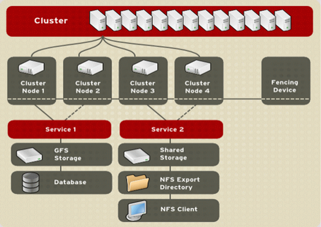
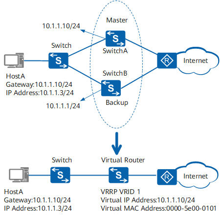
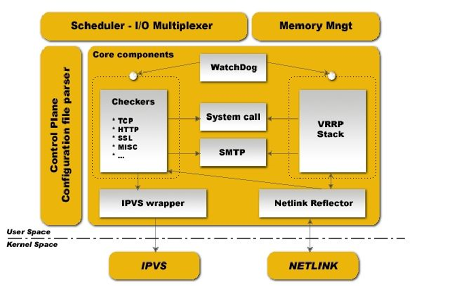
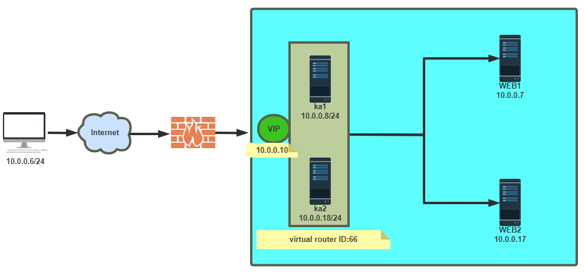
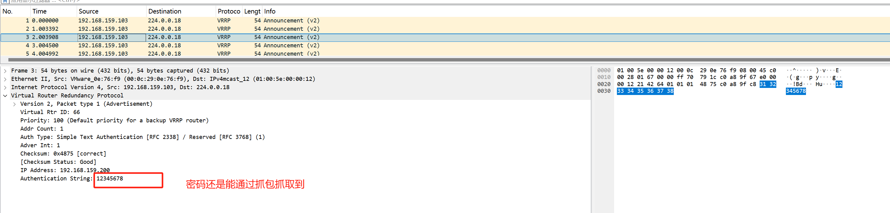
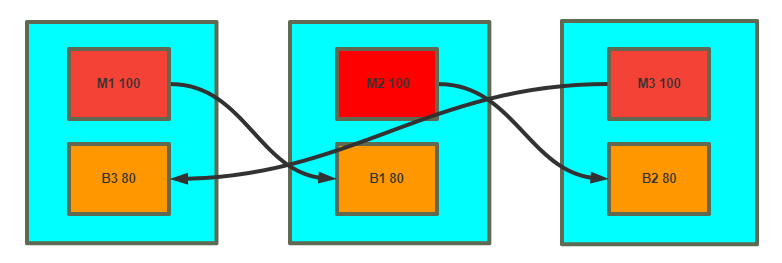
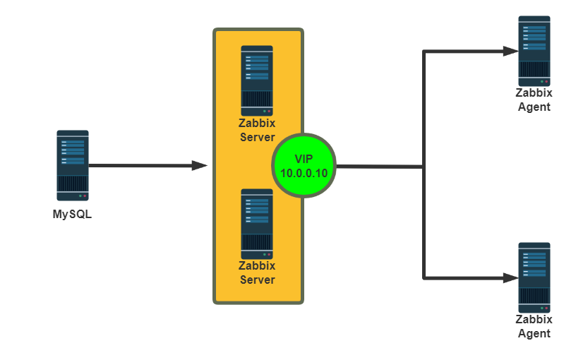

# 1 高可用集群

## 1.1 集群类型

- LB：Load Balance 负载均衡

  LVS/HAProxy/nginx（http/upstream, stream/upstream）

- HA：High Availability 高可用集群

  MySQL、Redis、Zookeeper、Kafka

  KeepAlived 通用的高可用集群,更适合无状态的服务

  SPoF: Single Point of Failure，解决单点故障

- HPC：High Performance Computing 高性能集群 

  https://www.top500.org/

## 1.2 系统可用性

SLA：Service-Level Agreement 服务等级协议（提供服务的企业与客户之间就服务的品质、水准、性 能等方面所达成的双方共同认可的协议或契约）

A = MTBF / (MTBF+MTTR）

MTBF:Mean Time Between Failure 平均无故障时间，正常时间

MTTR:Mean Time To Restoration（ repair）平均恢复前时间，故障时间

```bash
99.95%:(60*24*30)*(1-0.9995)=21.6分钟 #一般按一个月或一年非计划内停机时间统计
```

指标 ：99.9%, 99.99%, 99.999%,99.9999%

## 1.3 系统故障

 硬件故障：设计缺陷、wear out（损耗）、自然灾害……

 软件故障：设计缺陷 bug

人为故障：故意或无意

## 1.4 实现高可用

提升系统高用性的解决方案：降低MTTR- Mean Time To Repair(平均故障时间)

解决方案：建立冗余机制

- active/passive 主/备
- active/active 双主 
- active --> HEARTBEAT --> passive 
- active <--> HEARTBEAT <--> active

## 1.5  高可用相关技术

### 1.5.1 HA Service

资源：组成一个高可用服务的“组件”，比如：vip，service process，shared storage

- passive node的数量
- 资源切换

### 1.5.2 Shared Storage

- NAS(Network Attached Storage)：网络附加存储，基于网络的共享文件系统。
- SAN(Storage Area Network)：存储区域网络，基于网络的块级别的共享
- 分布式存储: Ceph、GFS、HDFS、DFS、ClusterFS等

### 1.5.3 HA Cluster 实现方案

#### 1.5.3.1 AIS：Applicaiton Interface Specification 应用程序接口规范

- RHCS：Red Hat Cluster Suite 红帽集群套件

  https://docs.redhat.com/zh_hans/documentation/red_hat_enterprise_linux/5/html/cluster_suite_overview/ch.gfscs.cluster-overview-cso



- heartbeat：基于心跳监测实现服务高可用
- pacemaker+corosync：资源管理与故障转移

#### 1.5.3.2 VRRP：Virtual Router Redundancy Protocol

虚拟路由冗余协议,解决静态网关单点风险

- 物理层:路由器、三层交换机
- 软件层:keepalived

### 1.5.4 VRRP

#### 1.5.4.1 VRRP 网络层硬件实现

参考链接：

```http
https://wenku.baidu.com/view/dc0afaa6f524ccbff1218416.html
https://wenku.baidu.com/view/281ae109ba1aa8114431d9d0.html
```



#### 1.5.4.2 VRRP 相关术语

- 虚拟路由器：Virtual Router 

- 虚拟路由器标识：VRID(0-255)，唯一标识虚拟路由器

- VIP：Virtual IP

- VMAC：Virutal MAC (00-00-5e-00-01-VRID)

- 物理路由器：

  master：主设备

  backup：备用设备

  priority：优先级 

#### 1.5.4.3 VRRP 相关技术

通告：心跳，优先级等；周期性

工作方式：抢占式，非抢占式

安全认证：

- 无认证
- 简单字符认证：预共享密钥
- MD5 

工作模式：

- 主/备：单虚拟路由器
- 主/主：主/备（虚拟路由器1），备/主（虚拟路由器2）

# 2 Keepalived 架构和安装


## 2.1 Keepalived 介绍

vrrp 协议的软件实现，原生设计目的为了高可用 ipvs服务

keepalived 是高可用集群的通用无状态应用解决方案

官网：http://keepalived.org/

功能：

- 基于vrrp协议完成地址流动
- 为vip地址所在的节点生成ipvs规则(在配置文件中预先定义)
- 为ipvs集群的各RS做健康状态检测
- 基于脚本调用接口完成脚本中定义的功能，进而影响集群事务，以此支持nginx、haproxy等服务

## 2.2 Keepalived 架构

官方文档：

```http
https://keepalived.org/doc/
http://keepalived.org/documentation.html 
```




- 用户空间核心组件

  vrrp stack：VIP消息通告

  checkers：监测 Real Server

  system call：实现 vrrp 协议状态转换时调用脚本的功能

  SMTP：邮件组件

  IPVS wrapper：生成 IPVS 规则

  Netlink Reflector：网络接口

  WatchDog：监控进程

- 控制组件：提供keepalived.conf 的解析器，完成Keepalived配置

- IO复用器：针对网络目的而优化的自己的线程抽象

- 内存管理组件：为某些通用的内存管理功能（例如分配，重新分配，发布等）提供访问权限

****

**Keepalived进程树**

```bash
Keepalived <-- Parent process monitoring children
\_ Keepalived <-- VRRP child
\_ Keepalived <-- Healthchecking child
```

## 2.3 Keepalived 环境准备



- 各节点时间必须同步：ntp, chrony
- 关闭防火墙及SELinux
- 各节点之间可通过主机名互相通信：非必须
- 建议使用/etc/hosts文件实现：非必须
- 各节点之间的root用户可以基于密钥认证的ssh服务完成互相通信：非必须

## 2.4 Keepalived 相关文件

- 软件包名：keepalived 
- 主程序文件：/usr/sbin/keepalived
- 主配置文件：/etc/keepalived/keepalived.conf
- 配置文件示例：/usr/share/doc/keepalived/
- Unit File：/lib/systemd/system/keepalived.service
- Unit File的环境配置文件：
  - /etc/sysconfig/keepalived CentOS
  - /etc/default/keepalived Ubuntu

## 2.5 Keepalived 安装

### 2.5.1 包安装

范例：Ubuntu22.04

```bash
root@ubutun2204-1:~# apt-cache madison keepalived
keepalived | 1:2.2.4-0.2build1 | http://cn.archive.ubuntu.com/ubuntu jammy/main amd64 Packages
root@ubutun2204-1:~# apt list  keepalived
Listing... Done
keepalived/jammy 1:2.2.4-0.2build1 amd64

root@ubutun2204-1:~# apt update;apt -y install keepalived

#默认缺少配置，服务无法启动，提示/etc/keepalived/keepalived.conf 不存在
root@ubutun2204-1:~# systemctl status keepalived.service 
○ keepalived.service - Keepalive Daemon (LVS and VRRP)
     Loaded: loaded (/lib/systemd/system/keepalived.service; enabled; vendor preset: enabled)
     Active: inactive (dead)
  Condition: start condition failed at Thu 2024-10-03 07:48:06 UTC; 30s ago
             └─ ConditionFileNotEmpty=/etc/keepalived/keepalived.conf was not met

Oct 03 07:48:06 ubutun2204-1 systemd[1]: Condition check resulted in Keepalive Daemon (LVS and VRRP) being skipped.

#利用模板生成配置文件
root@ubutun2204-1:~# cp  /usr/share/doc/keepalived/samples/keepalived.conf.sample /etc/keepalived/keepalived.conf
root@ubutun2204-1:~# systemctl start keepalived.service 
root@ubutun2204-1:~# systemctl status keepalived.service
● keepalived.service - Keepalive Daemon (LVS and VRRP)
     Loaded: loaded (/lib/systemd/system/keepalived.service; enabled; vendor preset: enabled)
     Active: active (running) since Thu 2024-10-03 07:53:13 UTC; 17s ago
   Main PID: 3281 (keepalived)
      Tasks: 3 (limit: 2176)
     Memory: 2.3M
        CPU: 14ms
     CGroup: /system.slice/keepalived.service
             ├─3281 /usr/sbin/keepalived --dont-fork
             ├─3282 /usr/sbin/keepalived --dont-fork
             └─3283 /usr/sbin/keepalived --dont-fork

root@ubutun2204-1:~# ip a
1: lo: <LOOPBACK,UP,LOWER_UP> mtu 65536 qdisc noqueue state UNKNOWN group default qlen 1000
    link/loopback 00:00:00:00:00:00 brd 00:00:00:00:00:00
    inet 127.0.0.1/8 scope host lo
       valid_lft forever preferred_lft forever
    inet6 ::1/128 scope host 
       valid_lft forever preferred_lft forever
2: ens33: <BROADCAST,MULTICAST,UP,LOWER_UP> mtu 1500 qdisc fq_codel state UP group default qlen 1000
    link/ether 00:0c:29:0e:76:f9 brd ff:ff:ff:ff:ff:ff
    altname enp2s1
    inet 192.168.159.103/24 brd 192.168.159.255 scope global ens33
       valid_lft forever preferred_lft forever
    inet 192.168.200.11/32 scope global ens33
       valid_lft forever preferred_lft forever
    inet 192.168.200.12/32 scope global ens33
       valid_lft forever preferred_lft forever
    inet 192.168.200.13/32 scope global ens33
       valid_lft forever preferred_lft forever
    inet6 fe80::20c:29ff:fe0e:76f9/64 scope link 
       valid_lft forever preferred_lft forever
       
root@ubutun2204-1:~# pstree -p |grep keepalived
           |-keepalived(3281)-+-keepalived(3282)
           |                  `-keepalived(3283)
           
 root@ubutun2204-1:~# ps auxf |grep keepalived
root        3313  0.0  0.1   6612  2260 pts/0    S+   07:56   0:00          \_ grep --color=auto keepalived
root        3281  0.0  0.5  28980 10152 ?        Ss   07:53   0:00 /usr/sbin/keepalived --dont-fork
root        3282  0.0  0.1  29104  3644 ?        S    07:53   0:00  \_ /usr/sbin/keepalived --dont-fork
root        3283  0.0  0.1  28980  3424 ?        S    07:53   0:00  \_ /usr/sbin/keepalived --dont-fork          
```

### 2.5.2 编译安装

```bash
# 安装依赖的相关包
root@ubutun2204-1:~# apt update && apt -y install make gcc ipvsadm  pkg-config automake autoconf libipset-dev libnl-3-dev libnl-genl-3-dev libssl-dev libxtables-dev libip4tc-dev libip6tc-dev libmagic-dev libsnmp-dev libglib2.0-dev libpcre2-dev libnftnl-dev libmnl-dev libsystemd-dev


#下载解压
root@ubutun2204-1:~# wget https://keepalived.org/software/keepalived-2.3.0.tar.gz
root@ubutun2204-1:~# tar xf keepalived-2.3.0.tar.gz -C /usr/local/src
root@ubutun2204-1:~# cd /usr/local/src/

# 选项--disable-fwmark 可用于禁用iptables规则,可防止VIP无法访问,无此选项默认会启用iptables规则，注意：新版--disable-fwmark仍然会有iptables规则
root@ubutun2204-1:/usr/local/src/keepalived-2.3.0# ./configure --prefix=/usr/local/keepalived #--disable-fwmark仍然会有iptables规则
root@ubutun2204-1:/usr/local/src/keepalived-2.3.0# make && make install
root@ubutun2204-1:/usr/local/keepalived# ln -sv /usr/local/keepalived/sbin/keepalived /usr/local/bin/
root@ubutun2204-1:~# keepalived -v
Keepalived v2.3.0 (05/06,2024), git commit v2.2.8-147-gebb1e1fb+

Copyright(C) 2001-2024 Alexandre Cassen, <acassen@gmail.com>

Built with kernel headers for Linux 5.15.163
Running on Linux 5.15.0-112-generic #122-Ubuntu SMP Thu May 23 07:48:21 UTC 2024
Distro: Ubuntu 22.04.4 LTS

configure options: --prefix=/usr/local/keepalived

Config options:  LIBIPSET_DYNAMIC NFTABLES LVS VRRP VRRP_AUTH VRRP_VMAC OLD_CHKSUM_COMPAT INIT=systemd SYSTEMD_NOTIFY

System options:  VSYSLOG MEMFD_CREATE IPV6_MULTICAST_ALL IPV4_DEVCONF LIBNL3 RTA_ENCAP RTA_EXPIRES RTA_NEWDST RTA_PREF FRA_SUPPRESS_PREFIXLEN FRA_SUPPRESS_IFGROUP FRA_TUN_ID RTAX_CC_ALGO RTAX_QUICKACK RTEXT_FILTER_SKIP_STATS FRA_L3MDEV FRA_UID_RANGE RTAX_FASTOPEN_NO_COOKIE RTA_VIA FRA_PROTOCOL FRA_IP_PROTO FRA_SPORT_RANGE FRA_DPORT_RANGE RTA_TTL_PROPAGATE IFA_FLAGS LWTUNNEL_ENCAP_MPLS LWTUNNEL_ENCAP_ILA IPTABLES NET_LINUX_IF_H_COLLISION LIBIPVS_NETLINK IPVS_DEST_ATTR_ADDR_FAMILY IPVS_SYNCD_ATTRIBUTES IPVS_64BIT_STATS IPVS_TUN_TYPE IPVS_TUN_CSUM IPVS_TUN_GRE VRRP_IPVLAN IFLA_LINK_NETNSID GLOB_BRACE GLOB_ALTDIRFUNC INET6_ADDR_GEN_MODE VRF SO_MARK


#下默认源码目录会自动生成unit文件
root@ubutun2204-1:~# cp /usr/local/src/keepalived-2.3.0/keepalived/keepalived.service /lib/systemd/system/
root@ubutun2204-1:~# cat /lib/systemd/system/keepalived.service 
[Unit]
Description=LVS and VRRP High Availability Monitor
After=network-online.target syslog.target 
Wants=network-online.target 
Documentation=man:keepalived(8)
Documentation=man:keepalived.conf(5)
Documentation=man:genhash(1)
Documentation=https://keepalived.org

[Service]
Type=notify
PIDFile=/run/keepalived.pid
KillMode=process
EnvironmentFile=-/usr/local/keepalived/etc/sysconfig/keepalived
ExecStart=/usr/local/keepalived/sbin/keepalived --dont-fork $KEEPALIVED_OPTIONS
ExecReload=/bin/kill -HUP $MAINPID

[Install]
WantedBy=multi-user.target

#默认无法启动
root@ubutun2204-1:~# systemctl start keepalived.service 
Job for keepalived.service failed because the control process exited with error code.
See "systemctl status keepalived.service" and "journalctl -xeu keepalived.service" for details.

# 查看日志，可以看到是因为缺少配置文件导致无法启动
Oct 03 11:12:38 ubutun2204-1 Keepalived[10110]: Starting Keepalived v2.3.0 (05/06,2024), git commit v2.2.8-147-gebb1e1fb+
Oct 03 11:12:38 ubutun2204-1 Keepalived[10110]: WARNING - keepalived was built for newer Linux 5.15.163, running on Linux 5.15.0-112-generic #122-Ubuntu SMP Thu May 23 07:48:21 UTC 2024
Oct 03 11:12:38 ubutun2204-1 Keepalived[10110]: Command line: '/usr/local/keepalived/sbin/keepalived' '--dont-fork' '-D'
Oct 03 11:12:38 ubutun2204-1 Keepalived[10110]: Config files missing '/usr/local/keepalived/etc/keepalived/keepalived.conf'. #缺少配置文件

#创建配置文件，默认配置路径可以/usr/local/keepalived/etc/keepalived/keepalived.conf或者/etc/kepalived/keepalived.conf (可选)
root@ubutun2204-1:~# /usr/local/keepalived/etc/sysconfig/keepalived
KEEPALIVED_OPTIONS="-f /etc/keepalived/keepalived.conf

root@ubutun2204-1:~# cp /usr/local/keepalived/etc/keepalived/keepalived.conf.sample /usr/local/keepalived/etc/keepalived/keepalived.conf

# 再次启动成功
root@ubutun2204-1:~# systemctl start keepalived.service 
root@ubutun2204-1:~# systemctl status keepalived.service 
● keepalived.service - LVS and VRRP High Availability Monitor
     Loaded: loaded (/lib/systemd/system/keepalived.service; disabled; vendor preset: enabled)
     Active: active (running) since Thu 2024-10-03 11:19:42 UTC; 2s ago
       Docs: man:keepalived(8)
             man:keepalived.conf(5)
             man:genhash(1)
             https://keepalived.org
   Main PID: 10332 (keepalived)
      Tasks: 3 (limit: 2176)
     Memory: 2.3M
        CPU: 8ms
     CGroup: /system.slice/keepalived.service
             ├─10332 /usr/local/keepalived/sbin/keepalived --dont-fork -D
             ├─10333 /usr/local/keepalived/sbin/keepalived --dont-fork -D
             └─10334 /usr/local/keepalived/sbin/keepalived --dont-fork -D
....

root@ubutun2204-1:~# ip a
1: lo: <LOOPBACK,UP,LOWER_UP> mtu 65536 qdisc noqueue state UNKNOWN group default qlen 1000
    link/loopback 00:00:00:00:00:00 brd 00:00:00:00:00:00
    inet 127.0.0.1/8 scope host lo
       valid_lft forever preferred_lft forever
    inet6 ::1/128 scope host 
       valid_lft forever preferred_lft forever
2: ens33: <BROADCAST,MULTICAST,UP,LOWER_UP> mtu 1500 qdisc fq_codel state UP group default qlen 1000
    link/ether 00:0c:29:0e:76:f9 brd ff:ff:ff:ff:ff:ff
    altname enp2s1
    inet 192.168.159.103/24 brd 192.168.159.255 scope global ens33
       valid_lft forever preferred_lft forever
    inet 192.168.200.16/32 scope global ens33
       valid_lft forever preferred_lft forever
    inet 192.168.200.17/32 scope global ens33
       valid_lft forever preferred_lft forever
    inet 192.168.200.18/32 scope global ens33
       valid_lft forever preferred_lft forever
    inet6 fe80::20c:29ff:fe0e:76f9/64 scope link 
       valid_lft forever preferred_lft forever
root@ubutun2204-1:~# hostname -I
192.168.159.103 192.168.200.16 192.168.200.17 192.168.200.18 
root@ubutun2204-1:~# ping 192.168.200.16
PING 192.168.200.16 (192.168.200.16) 56(84) bytes of data.

--- 192.168.200.16 ping statistics ---
37 packets transmitted, 0 received, 100% packet loss, time 36847ms

#新版：nftables规则替代iptables规则
root@ubutun2204-1:~# nft list ruleset
table ip keepalived {
	set vips {
		type ipv4_addr
		elements = { 192.168.200.16, 192.168.200.17,
			     192.168.200.18 }
	}

	chain out {
		type filter hook output priority filter - 1; policy accept;
		ip saddr @vips drop
	}

	chain in {
		type filter hook input priority filter - 1; policy accept;
		ip daddr @vips drop
	}
}

root@ubutun2204-1:~# vim /usr/local/keepalived/etc/keepalived/keepalived.conf
#注释下面一行
#vrrp_strict

# 重启服务
root@ubutun2204-1:~# systemctl restart keepalived.service 
root@ubutun2204-1:~# ping 192.168.200.16
PING 192.168.200.16 (192.168.200.16) 56(84) bytes of data.
64 bytes from 192.168.200.16: icmp_seq=1 ttl=64 time=0.024 ms
64 bytes from 192.168.200.16: icmp_seq=2 ttl=64 time=0.063 ms
64 bytes from 192.168.200.16: icmp_seq=3 ttl=64 time=0.148 ms
64 bytes from 192.168.200.16: icmp_seq=4 ttl=64 time=0.075 ms
^C
--- 192.168.200.16 ping statistics ---
4 packets transmitted, 4 received, 0% packet loss, time 3073ms
rtt min/avg/max/mdev = 0.024/0.077/0.148/0.044 ms
```

## 2.6 KeepAlived 配置说明

### 2.6.1 配置文件组成部分

配置文件

```http
/usr/local/keepalived/etc/keepalived/keepalived.conf
```

配置文件组成

- GLOBAL CONFIGURATION

  Global definitions：定义邮件配置，route_id，vrrp配置，多播地址等

- VRRP CONFIGURATION

  VRRP instance(s)：定义每个vrrp虚拟路由器

- LVS CONFIGURATION

  Virtual server group(s)

  Virtual server(s)：LVS集群的VS和RS

### 2.6.2 配置语法说明

帮助

```bash
#包安装
man keepalived.conf
#编译安装
man /usr/local/keepalived/share/man/man5/keepalived.conf.5
```

#### 2.6.2.1 全局配置

```bash
# /usr/local/keepalived/etc/keepalived/keepalived.conf
global_defs {
   notification_email {
     acassen@firewall.loc
     failover@firewall.loc
     sysadmin@firewall.loc
     353938339@qq.com #keepalived 发生故障切换时邮件发送的目标邮箱，可以按行区分写多个
   }
   notification_email_from 353938339@qq.com #发邮件的地址
   smtp_server 192.168.200.1 #邮件服务器地址
   smtp_connect_timeout 30 #邮件服务器连接timeout
   router_id ka1.example.com #每个keepalived主机唯一标识，建议使用当前主机名，如果多节点重名可能会影响切换脚本执行
   vrrp_skip_check_adv_addr #默认会对所有通告报文都检查，会比较消耗性能，启用此配置后，如果收到的通告报文和上一个报文是同一个路由器，则跳过检查
   vrrp_strict #严格遵守VRRP协议,启用此项后以下状况将无法启动服务或工作异常:1.无VIP地址 2.配置了单播邻居 3.在VRRP版本2中有IPv6地址，开启动此项并且没有配置. vrrp_iptables时会自动开启iptables防火墙规则，默认导致VIP无法访问,建议不加此项配置
   vrrp_garp_interval 0 #gratuitous ARP messages 报文发送延迟，0表示不延迟
   vrrp_gna_interval 0 #unsolicited NA messages （不请自来）消息发送延迟
   vrrp_mcast_group4 224.0.0.18 #指定组播IP地址范围：224.0.0.0到239.255.255.255,默认值：224.0.0.18，如果配置了单播，此项失效
}
```

#### 2.6.2.2 配置虚拟路由器

```bash
vrrp_instance <STRING> {  #<String>为vrrp的实例名,一般为业务名称
    配置参数
    ......
}

#配置参数
state MASTER|BACKUP #当前节点在此虚拟路由器上的初始状态，状态为MASTER或者BACKUP，当priority相同时，先启动的节点优先获取VIP
interface IFACE_NAME #绑定为当前VRRP虚拟路由器使用的物理接口，如：eth0,bond0,br0,可以和VIP不在一个网卡，实现心跳功能

virtual_router_id VRID  # 每个虚拟路由器唯一标识，范围：0-255，每个虚拟路由器此值必须唯一，否则服务无法启动，同属一个虚拟路由器的多个keepalived节点必须相同,务必要确认在同一网络中此值必须唯一

priority 100 #当前物理节点在此虚拟路由器的优先级，范围：1-254，每个keepalived主机节点此值不同，如果多节点此值相同，则先来后到原理获取VIP
advert_int 1 #vrrp通告的时间间隔，默认1s
authentication { #认证机制
 auth_type AH|PASS   #AH为IPSEC认证(不推荐),PASS为简单密码(建议使用)
 auth_pass <PASSWORD> #预共享密钥，仅前8位有效，同一个虚拟路由器的多个keepalived节点必须一样
}
virtual_ipaddress { #虚拟IP,生产环境可能指定几十上百个VIP地址
     <IPADDR>/<MASK> brd <IPADDR> dev <STRING> scope <SCOPE> label <LABEL>
      192.168.200.100 #指定VIP，不指定网卡，默认为eth0,注意：不指定/prefix,默认为/32
      192.168.200.101/24 dev eth1   #指定VIP的网卡，建议和interface指令指定的网卡不在一个网卡
      192.168.200.102/24 dev eth2 label eth2:1 #指定VIP的网卡label 
}
track_interface { #配置监控网络接口，一旦出现故障，则转为FAULT状态实现地址转移
      eth0
      eth1
      …
} 

```

范例：

```bash
root@ubutun2204-1:~# cat   /usr/local/keepalived/etc/keepalived/keepalived.conf
! Configuration File for keepalived

global_defs {
   notification_email {
     acassen@firewall.loc
     failover@firewall.loc
     sysadmin@firewall.loc
   }
   notification_email_from Alexandre.Cassen@firewall.loc
   smtp_server 192.168.200.1
   smtp_connect_timeout 30
   router_id LVS_DEVEL
   vrrp_skip_check_adv_addr
   #vrrp_strict            #开启限制，会自动生效防火墙设置，导致无访问VIP
   vrrp_garp_interval 0
   vrrp_gna_interval 0
}

vrrp_instance VI_1 {
    state MASTER
    interface ens33
    virtual_router_id 51
    priority 100  #修改此行
    advert_int 1
    authentication {
        auth_type PASS
        auth_pass 1111
    }
    virtual_ipaddress {
        192.168.200.16
        192.168.200.17
        192.168.200.18
    }
}
```

## 2.7 启用 Keepalived 日志功能

默认 keepalived的日志记录在LOG_DAEMON中，记录在/var/log/syslog或messages, 也支持自定义日 志配置

范例：实现日志功能,

**注意: 编译安装方式如果实现有问题，可以重启主机可以解决**

```bash
#包安装修改文件路径
[root@ka1 ~]#vim /etc/sysconfig/keepalived
KEEPALIVED_OPTIONS="-D -S 6" 

#编译安装修改文件路径
root@ubutun2204-1:~# grep ExecStart /lib/systemd/system/keepalived.service
ExecStart=/usr/local/keepalived/sbin/keepalived --dont-fork $KEEPALIVED_OPTIONS

#编译安装修改文件路径
root@ubutun2204-1:~# cat /usr/local/keepalived/etc/sysconfig/keepalived 
# Options for keepalived. See `keepalived --help' output and keepalived(8) and
# keepalived.conf(5) man pages for a list of all options. Here are the most
# common ones :
#
# --vrrp               -P    Only run with VRRP subsystem.
# --check              -C    Only run with Health-checker subsystem.
# --dont-release-vrrp  -V    Dont remove VRRP VIPs & VROUTEs on daemon stop.
# --dont-release-ipvs  -I    Dont remove IPVS topology on daemon stop.
# --dump-conf          -d    Dump the configuration data.
# --log-detail         -D    Detailed log messages.
# --log-facility       -S    0-7 Set local syslog facility (default=LOG_DAEMON)
#
#修改下面行
KEEPALIVED_OPTIONS="-D -S 6"

#修改日志服务配置
root@ubutun2204-1:~# vim /etc/rsyslog.conf
local6.*             /var/log/keepalived.log

# 重启服务生效
root@ubutun2204-1:~# systemctl restart keepalived.service rsyslog.service

root@ubutun2204-1:~# tail -f /var/log/keepalived.log 
Oct  3 12:00:00 ubutun2204-1 Keepalived_vrrp[10495]: Sending gratuitous ARP on ens33 for 192.168.200.18
Oct  3 12:00:00 ubutun2204-1 Keepalived_vrrp[10495]: Sending gratuitous ARP on ens33 for 192.168.200.16
Oct  3 12:00:00 ubutun2204-1 Keepalived_vrrp[10495]: Sending gratuitous ARP on ens33 for 192.168.200.17
Oct  3 12:00:00 ubutun2204-1 Keepalived_vrrp[10495]: Sending gratuitous ARP on ens33 for 192.168.200.18
```

## 2.8 实现 Keepalived 独立子配置文件

当生产环境复杂时， `/etc/keepalived/keepalived.conf` 文件中保存所有集群的配置会导致内容过 多，不易管理

可以将不同集群的配置，比如：不同集群的VIP配置放在独立的子配置文件中

利用include 指令可以实现包含子配置文件

格式：

```http
include /path/file
```

范例:

```bash
root@ubutun2204-1:~# cat  /usr/local/keepalived/etc/keepalived/keepalived.conf
! Configuration File for keepalived

global_defs {
   notification_email {
     353938339@qq.com
   }
   notification_email_from 353938339@qq.com
   smtp_server 192.168.200.1
   smtp_connect_timeout 30
   router_id LVS_DEVEL
   vrrp_skip_check_adv_addr
   #vrrp_strict
   vrrp_garp_interval 0
   vrrp_gna_interval 0
}

include /usr/local/keepalived/etc/keepalived/conf.d/*.conf # 将VRRP相关配置放在子配置文件中

root@ubutun2204-1:~# vim  /usr/local/keepalived/etc/keepalived/conf.d/cluster1.conf
```

# 3 Keepalived 实现 VRRP

基于Ubutun 2204

## 3.1 实现Master/Backup的 Keepalived 单主架构

### 3.1.1 MASTER配置

```bash
root@ka-1:~# cat  /usr/local/keepalived/etc/keepalived/keepalived.conf
! Configuration File for keepalived

global_defs {
   notification_email {
     acassen@firewall.loc #keepalived 发生故障切换时邮件发送的对象，可以按行区分写多个
     failover@firewall.loc
     sysadmin@firewall.loc
   }
   notification_email_from Alexandre.Cassen@firewall.loc
   smtp_server 192.168.200.1
   smtp_connect_timeout 30
   router_id ka-1
   vrrp_skip_check_adv_addr #所有报文都检查比较消耗性能，此配置为如果收到的报文和上一个报文是同一个路由器则跳过检查报文中的源地址
   #vrrp_strict #严格遵守VRRP协议,禁止状况:1.无VIP地址,2.配置了单播邻居,3.在VRRP版本2中有IPv6地址
   vrrp_garp_interval 0 #ARP报文发送延迟
   vrrp_gna_interval 0  #消息发送延迟
   vrrp_mcast_group4 224.0.0.18 #默认组播IP地址，可指定组播范围：224.0.0.0到239.255.255.255
}

vrrp_instance VI_1 {
   state MASTER    #在另一个节点上为BACKUP,如果当priority相同时,先启动的节点优先获取VIP
   interface ens33  #心跳网络网卡，生产环境和业务网卡分开
   virtual_router_id 66 #每个虚拟路由器必须唯一，同属一个虚拟路由器的多个keepalived节点必须相同
   priority 100 #在另一个结点上为80
   advert_int 1 #vrrp通告的时间间隔，默认1s
   authentication { #预共享密钥认证，同一个虚拟路由器的keepalived节点必须一样
     auth_type PASS 
     auth_pass 12345678
   }
   virtual_ipaddress {
     192.168.159.200 dev ens33 label ens33:0 #VIP配置
   }
}
#include /usr/local/keepalived/etc/keepalived/conf.d/*.conf 
```

### 3.1.2 BACKUP配置

```bash
#配置文件和master基本一致，只需修改三行
root@ka-2:~# cat  /usr/local/keepalived/etc/keepalived/keepalived.conf
! Configuration File for keepalived

global_defs {
   notification_email {
     acassen@firewall.loc
     failover@firewall.loc
     sysadmin@firewall.loc
   }
   notification_email_from Alexandre.Cassen@firewall.loc
   smtp_server 192.168.200.1
   smtp_connect_timeout 30
   router_id ka-2  #修改此行
   vrrp_skip_check_adv_addr
   #vrrp_strict
   vrrp_garp_interval 0
   vrrp_gna_interval 0
   vrrp_mcast_group4 224.0.0.18
}

vrrp_instance VI_1 {
   state BACKUP  #修改此行
   interface ens33
   virtual_router_id 66
   priority 80 #修改此行
   advert_int 1
   authentication {
     auth_type PASS
     auth_pass 12345678
   }
   virtual_ipaddress {
     192.168.159.200 dev ens33 label ens33:0
   }
}
```

**重启服务：**

```bash
# 重启master服务
root@ka-1:~# systemctl start keepalived.service
root@ka-1:~# systemctl status keepalived.service
● keepalived.service - LVS and VRRP High Availability Monitor
     Loaded: loaded (/lib/systemd/system/keepalived.service; enabled; vendor preset: enabled)
     Active: active (running) since Sat 2024-10-05 08:39:23 UTC; 5s ago
       Docs: man:keepalived(8)
             man:keepalived.conf(5)
             man:genhash(1)
             https://keepalived.org
   Main PID: 1455 (keepalived)
      Tasks: 2 (limit: 2176)
     Memory: 1.4M
        CPU: 13ms
     CGroup: /system.slice/keepalived.service
             ├─1455 /usr/local/keepalived/sbin/keepalived --dont-fork -D -S 6
             └─1456 /usr/local/keepalived/sbin/keepalived --dont-fork -D -S 6

Oct 05 08:39:23 ka-1 Keepalived_vrrp[1456]: VRRP sockpool: [ifindex(  2), family(IPv4), proto(112), fd(12,13) multicast, address(224.0.0.18)]
Oct 05 08:39:27 ka-1 Keepalived_vrrp[1456]: (VI_1) Receive advertisement timeout
Oct 05 08:39:27 ka-1 Keepalived_vrrp[1456]: (VI_1) Entering MASTER STATE
Oct 05 08:39:27 ka-1 Keepalived_vrrp[1456]: (VI_1) setting VIPs.
Oct 05 08:39:27 ka-1 Keepalived_vrrp[1456]: (VI_1) Sending/queueing gratuitous ARPs on ens33 for 192.168.159.200
Oct 05 08:39:27 ka-1 Keepalived_vrrp[1456]: Sending gratuitous ARP on ens33 for 192.168.159.200
Oct 05 08:39:27 ka-1 Keepalived_vrrp[1456]: Sending gratuitous ARP on ens33 for 192.168.159.200
Oct 05 08:39:27 ka-1 Keepalived_vrrp[1456]: Sending gratuitous ARP on ens33 for 192.168.159.200
Oct 05 08:39:27 ka-1 Keepalived_vrrp[1456]: Sending gratuitous ARP on ens33 for 192.168.159.200
Oct 05 08:39:27 ka-1 Keepalived_vrrp[1456]: Sending gratuitous ARP on ens33 for 192.168.159.200

root@ka-1:~# hostname -I
192.168.159.103 192.168.159.200 
root@ka-1:~# ip a
1: lo: <LOOPBACK,UP,LOWER_UP> mtu 65536 qdisc noqueue state UNKNOWN group default qlen 1000
    link/loopback 00:00:00:00:00:00 brd 00:00:00:00:00:00
    inet 127.0.0.1/8 scope host lo
       valid_lft forever preferred_lft forever
    inet6 ::1/128 scope host 
       valid_lft forever preferred_lft forever
2: ens33: <BROADCAST,MULTICAST,UP,LOWER_UP> mtu 1500 qdisc fq_codel state UP group default qlen 1000
    link/ether 00:0c:29:0e:76:f9 brd ff:ff:ff:ff:ff:ff
    altname enp2s1
    inet 192.168.159.103/24 brd 192.168.159.255 scope global ens33
       valid_lft forever preferred_lft forever
    inet 192.168.159.200/32 scope global ens33:0
       valid_lft forever preferred_lft forever
    inet6 fe80::20c:29ff:fe0e:76f9/64 scope link 
       valid_lft forever preferred_lft forever
root@ka-1:~# ping 192.168.159.200
PING 192.168.159.200 (192.168.159.200) 56(84) bytes of data.
64 bytes from 192.168.159.200: icmp_seq=1 ttl=64 time=0.018 ms
64 bytes from 192.168.159.200: icmp_seq=2 ttl=64 time=0.058 ms
......


# 重启backup服务
root@ka-2:~# systemctl start keepalived.service
root@ka-2:~# systemctl status keepalived.service
● keepalived.service - LVS and VRRP High Availability Monitor
     Loaded: loaded (/lib/systemd/system/keepalived.service; enabled; vendor preset: enabled)
     Active: active (running) since Sat 2024-10-05 08:39:41 UTC; 6s ago
       Docs: man:keepalived(8)
             man:keepalived.conf(5)
             man:genhash(1)
             https://keepalived.org
   Main PID: 1307 (keepalived)
      Tasks: 2 (limit: 2175)
     Memory: 1.4M
        CPU: 10ms
     CGroup: /system.slice/keepalived.service
             ├─1307 /usr/local/keepalived/sbin/keepalived --dont-fork -D
             └─1308 /usr/local/keepalived/sbin/keepalived --dont-fork -D

Oct 05 08:39:41 ka-2 Keepalived_vrrp[1308]: Registering Kernel netlink reflector
Oct 05 08:39:41 ka-2 Keepalived_vrrp[1308]: Registering Kernel netlink command channel
Oct 05 08:39:41 ka-2 Keepalived_vrrp[1308]: Assigned address 192.168.159.104 for interface ens33
Oct 05 08:39:41 ka-2 Keepalived_vrrp[1308]: Assigned address fe80::20c:29ff:fe69:ed17 for interface ens33
Oct 05 08:39:41 ka-2 Keepalived_vrrp[1308]: Registering gratuitous ARP shared channel
Oct 05 08:39:41 ka-2 Keepalived_vrrp[1308]: (VI_1) removing VIPs.
Oct 05 08:39:41 ka-2 Keepalived[1307]: Startup complete
Oct 05 08:39:41 ka-2 systemd[1]: Started LVS and VRRP High Availability Monitor.
Oct 05 08:39:41 ka-2 Keepalived_vrrp[1308]: (VI_1) Entering BACKUP STATE (init)
Oct 05 08:39:41 ka-2 Keepalived_vrrp[1308]: VRRP sockpool: [ifindex(  2), family(IPv4), proto(112), fd(12,13) multicast, address(224.0.0.18)]
root@ka-2:~# hostname -I
192.168.159.104
```

### 3.1.3 抓包观察VRRP协议

VRRP协议是运行在心跳网卡的，生产环境心跳网卡是单独的网卡，本测试环境心跳网卡`ens33`

```http 
tcpdump -i eth0 -nn host 224.0.0.18
```

```bash
root@ka-1:~# tcpdump -i ens33 -nn host 224.0.0.18
tcpdump: verbose output suppressed, use -v[v]... for full protocol decode
listening on ens33, link-type EN10MB (Ethernet), snapshot length 262144 bytes
08:58:40.052645 IP 192.168.159.103 > 224.0.0.18: VRRPv2, Advertisement, vrid 66, prio 100, authtype simple, intvl 1s, length 20
08:58:41.053347 IP 192.168.159.103 > 224.0.0.18: VRRPv2, Advertisement, vrid 66, prio 100, authtype simple, intvl 1s, length 20
08:58:42.053714 IP 192.168.159.103 > 224.0.0.18: VRRPv2, Advertisement, vrid 66, prio 100, authtype simple, intvl 1s, length 20

# 当103keepalived服务异常，104会抢占vip，向多播地址发送vrrp协议
root@ka-1:~# tcpdump -i ens33 -nn host 224.0.0.18
tcpdump: verbose output suppressed, use -v[v]... for full protocol decode
listening on ens33, link-type EN10MB (Ethernet), snapshot length 262144 bytes
09:00:16.111648 IP 192.168.159.103 > 224.0.0.18: VRRPv2, Advertisement, vrid 66, prio 100, authtype simple, intvl 1s, length 20
09:00:17.112431 IP 192.168.159.103 > 224.0.0.18: VRRPv2, Advertisement, vrid 66, prio 100, authtype simple, intvl 1s, length 20
09:00:18.112852 IP 192.168.159.103 > 224.0.0.18: VRRPv2, Advertisement, vrid 66, prio 100, authtype simple, intvl 1s, length 20
09:00:18.480275 IP 192.168.159.103 > 224.0.0.18: VRRPv2, Advertisement, vrid 66, prio 0, authtype simple, intvl 1s, length 20
09:00:19.168776 IP 192.168.159.104 > 224.0.0.18: VRRPv2, Advertisement, vrid 66, prio 80, authtype simple, intvl 1s, length 20
09:00:20.172302 IP 192.168.159.104 > 224.0.0.18: VRRPv2, Advertisement, vrid 66, prio 80, authtype simple, intvl 1s, length 20
09:00:21.173248 IP 192.168.159.104 > 224.0.0.18: VRRPv2, Advertisement, vrid 66, prio 80, authtype simple, intvl 1s, length 20
09:00:22.173484 IP 192.168.159.104 > 224.0.0.18: VRRPv2, Advertisement, vrid 66, prio 80, authtype simple, intvl 1s, length 20
```

```bash
root@ka-1:~# tcpdump -i ens33 -nn host 224.0.0.18 -w vrrp.cap
```

**VRRP 协议包构成**



### 3.1.4 脑裂

主备节点同时拥有同一个VIP，此时为脑裂现象

注意：脑裂现象原因

- 心跳线故障： 注意:在虚拟机环境中测试可以通过修改网卡的工作模式实现模拟，断开网卡方式无 法模拟
- 防火墙错误配置：在从节点服务器执行iptables -A INPUT -s 主服务心跳网卡IP -j DROP 进行模拟
- Keepalived 配置错误：多播地址不同，interface错误，virtual_router_id不一致，密码不一致

## 3.2 抢占模式和非抢占模式

### 3.2.1 非抢占模式 nopreempt

默认为抢占模式 preempt，即当高优先级的主机恢复在线后，会抢占低先级的主机的master角色，造成 网络抖动，建议设置为非抢占模式 nopreempt ，即高优先级主机恢复后，并不会抢占低优先级主机的  master 角色

**注意: 非抢占模式下,如果原主机down机, VIP迁移至的新主机, 后续新主机也发生down（（keepalived  服务down））时,VIP还会迁移回修复好的原主机**

但如果新主机的服务down掉（keepalived服务正常），原主机也不会接管VIP，仍会由新主机拥有VIP

即非抢占式模式，只是适合当主节点宕机，切换到从节点的一次性的高可用性，后续即使当原主节点修 复好，仍无法再次起到高可用功能

**注意：要关闭 VIP抢占，必须将各 Keepalived 服务器 state 配置为 BACKUP**

```bash
# ka-1主机配置
vrrp_instance VI_1 {
   state BACKUP  #都为BACKUP
   interface ens33
   virtual_router_id 66
   priority 100  #优先级高
   advert_int 1
   nopreempt #添加此行，设为nopreempt


# ka-2主机配置
vrrp_instance VI_1 {
   state BACKUP  #都为BACKUP
   interface ens33
   virtual_router_id 66
   priority 80 #优先级低
   advert_int 1 
   #nopreempt         #注意：如果ka2主机也是非抢占式，会导致ka1即使优先级降低于ka2，VIP也不会切换至ka2 (一般只在优先级高的主机上配置非抢占)
```

### 3.2.2 抢占延迟模式 preempt_delay

抢占延迟模式，即优先级高的主机恢复后，不会立即抢回VIP，而是延迟一段时间（默认300s）再抢回  VIP

但是如果低优先级的主机down机，则立即抢占VIP地址，而不再延迟

```bash
preempt_delay 60     #指定抢占延迟时间为#s，默认延迟300s
```

**注意：需要各keepalived服务器state为BACKUP,并且不要启用 vrrp_strict**

范例：

```bash
# ka-1主机配置
vrrp_instance VI_1 {
   state BACKUP  #都为BACKUP
   interface ens33
   virtual_router_id 66
   priority 100  #优先级高
   advert_int 1
   preempt_delay 60 ##抢占延迟模式，默认延迟300s


# ka-2主机配置
vrrp_instance VI_1 {
   state BACKUP  #都为BACKUP
   interface ens33
   virtual_router_id 66
   priority 80 #优先级低
   advert_int 1 
```

## 3.3 VIP 单播配置

默认keepalived主机之间利用多播相互通告消息，会造成网络拥塞，可以设置为单播，减少网络流量

另外：有些公有云不支持多播，可以利用单播实现

单播优先与多播，即同时配置，单播生效

**注意：启用 vrrp_strict 时，不能启用单播**

```bash
#在所有节点vrrp_instance语句块中设置对方主机的IP，建议设置为专用于对应心跳线网络的地址，而非使用业务网络
unicast_src_ip <IPADDR>  #指定发送单播的源IP
unicast_peer {
   <IPADDR>     #指定接收单播的对方目标主机IP
   ......
}
```

范例：

```bash
# master主机配置（ka-1）
root@ka-1:~# cat  /usr/local/keepalived/etc/keepalived/keepalived.conf
! Configuration File for keepalived

global_defs {
   notification_email {
     acassen@firewall.loc
     failover@firewall.loc
     sysadmin@firewall.loc
   }
   notification_email_from Alexandre.Cassen@firewall.loc
   smtp_server 192.168.200.1
   smtp_connect_timeout 30
   router_id ka-1
   vrrp_skip_check_adv_addr
   #vrrp_strict
   vrrp_garp_interval 0
   vrrp_gna_interval 0
   vrrp_mcast_group4 224.0.0.18 #单播优先于多播,即配置了单播后，多播将失效
}

vrrp_instance VI_1 {
   state MASTER
   interface ens33
   virtual_router_id 66
   priority 100
   advert_int 1
   #nopreempt
   authentication {
     auth_type PASS
     auth_pass 12345678
   }
   virtual_ipaddress {
     192.168.159.200 dev ens33 label ens33:0
   }
   unicast_src_ip 192.168.159.103  #本机IP
   unicast_peer{             
     192.168.159.104                #指向对方主机IP
                                    #如果有多个keepalived,再加其它节点的IP  
   }

root@ka-1:~# hostname -I
192.168.159.103 192.168.159.200

#slave 主机配置(ka-2)
root@ka-2:~# cat  /usr/local/keepalived/etc/keepalived/keepalived.conf
! Configuration File for keepalived

global_defs {
   notification_email {
     acassen@firewall.loc
     failover@firewall.loc
     sysadmin@firewall.loc
   }
   notification_email_from Alexandre.Cassen@firewall.loc
   smtp_server 192.168.200.1
   smtp_connect_timeout 30
   router_id ka-2
   vrrp_skip_check_adv_addr
   #vrrp_strict
   vrrp_garp_interval 0
   vrrp_gna_interval 0
   vrrp_mcast_group4 224.0.0.18
}

vrrp_instance VI_1 {
   state BACKUP
   interface ens33
   virtual_router_id 66
   priority 80
   advert_int 1
   authentication {
     auth_type PASS
     auth_pass 12345678
   }
   virtual_ipaddress {
     192.168.159.200 dev ens33 label ens33:0
   }
   unicast_src_ip 192.168.159.104 #本机ip
   unicast_peer{
     192.168.159.103  #指向对方主机IP
   }
}

root@ka-2:~# hostname -I
192.168.159.104
```

范例: 抓包观察

```bash
root@ka-1:~# tcpdump -i ens33 -nn -p vrrp
tcpdump: verbose output suppressed, use -v[v]... for full protocol decode
listening on ens33, link-type EN10MB (Ethernet), snapshot length 262144 bytes
09:36:14.652938 IP 192.168.159.103 > 192.168.159.104: VRRPv2, Advertisement, vrid 66, prio 100, authtype simple, intvl 1s, length 20
09:36:15.653647 IP 192.168.159.103 > 192.168.159.104: VRRPv2, Advertisement, vrid 66, prio 100, authtype simple, intvl 1s, length 20
09:36:16.654416 IP 192.168.159.103 > 192.168.159.104: VRRPv2, Advertisement, vrid 66, prio 100, authtype simple, intvl 1s, length 20
```

## 3.4 Keepalived 通知脚本配置

当keepalived的状态变化时，可以自动触发脚本的执行，比如：发邮件通知用户

默认以用户keepalived_script身份执行脚本，如果此用户不存在，以root执行脚本

可以用下面指令指定脚本执行用户的身份

```http
global_defs {
 ......
 script_user <USER>
 ......
}
```

### 3.4.1 通知脚本类型

- 当前节点成为主节点时触发的脚本

  ```http
  notify_master <STRING>|<QUOTED-STRING>
  ```

- 当前节点转为备节点时触发的脚本

  ```http
  notify_backup <STRING>|<QUOTED-STRING>
  ```

- 当前节点转为“失败”状态时触发的脚本 

  ```http
  notify_fault <STRING>|<QUOTED-STRING>
  ```

- 通用格式的通知触发机制，一个脚本可完成以上三种状态的转换时的通知

  ```http
  notify <STRING>|<QUOTED-STRING>
  ```

- 当停止VRRP时触发的脚本

  ```http
  notify_stop <STRING>|<QUOTED-STRING>
  ```

### 3.4.2  脚本的调用方法

在 vrrp_instance VI_1 语句块的末尾加下面行

```http
notify_master "/etc/keepalived/notify.sh master"
notify_backup "/etc/keepalived/notify.sh backup"
notify_fault "/etc/keepalived/notify.sh fault"
```

### 3.4.3 实战案例1：实现 Keepalived 状态切换的通知脚本

```bash
#在所有 keepalived节点配置如下
root@ka-1:~# cat /etc/keepalived/notify.sh 
#!/bin/bash
#
contact='353938339@qq.com'
email_send='353938339@qq.com'
email_passwd='nusceqqtelzebhde'
email_smtp_server='smtp.qq.com'

. /etc/os-release

msg_error() {
  echo -e "\033[1;31m$1\033[0m"
}

msg_info() {
  echo -e "\033[1;32m$1\033[0m"
}

msg_warn() {
  echo -e "\033[1;33m$1\033[0m"
}

color () {
    RES_COL=60
    MOVE_TO_COL="echo -en \\033[${RES_COL}G"
    SETCOLOR_SUCCESS="echo -en \\033[1;32m"
    SETCOLOR_FAILURE="echo -en \\033[1;31m"
    SETCOLOR_WARNING="echo -en \\033[1;33m"
    SETCOLOR_NORMAL="echo -en \E[0m"
    echo -n "$1" && $MOVE_TO_COL
    echo -n "["
    if [ $2 = "success" -o $2 = "0" ] ;then
        ${SETCOLOR_SUCCESS}
        echo -n $"  OK  "    
    elif [ $2 = "failure" -o $2 = "1"  ] ;then 
        ${SETCOLOR_FAILURE}
        echo -n $"FAILED"
    else
        ${SETCOLOR_WARNING}
        echo -n $"WARNING"
    fi
    ${SETCOLOR_NORMAL}
    echo -n "]"
    echo 
}


install_sendemail () {
    if [[ $ID =~ rhel|centos|rocky ]];then
        rpm -q sendemail &> /dev/null ||  yum install -y sendemail
    elif [ $ID = 'ubuntu' ];then
        dpkg -l |grep -q sendemail  || { apt update; apt install -y libio-socket-ssl-perl libnet-ssleay-perl sendemail ; } 
    else
        color "不支持此操作系统，退出!" 1
        exit
    fi
}

send_email () {
    local email_receive="$1"
    local email_subject="$2"
    local email_message="$3"
    sendemail -f $email_send -t $email_receive -u $email_subject -m $email_message -s $email_smtp_server -o message-charset=utf-8 -o tls=yes -xu $email_send -xp $email_passwd
    [ $? -eq 0 ] && color "邮件发送成功!" 0 || color "邮件发送失败!" 1 
}

notify() {
    if [[ $1 =~ ^(master|backup|fault)$ ]];then
        mailsubject="$(hostname) to be $1, vip floating"
        mailbody="$(date +'%F %T'): vrrp transition, $(hostname) changed to be $1"
        send_email "$contact" "$mailsubject" "$mailbody"
   else
        echo "Usage: $(basename $0) {master|backup|fault}"
        exit 1
   fi
}

install_sendemail 
notify $1


root@ka-1:~# chmod a+x /etc/keepalived/notify.sh
root@ka-1:~# vim /usr/local/keepalived/etc/keepalived/keepalived.conf
vrrp_instance VI_1 {
   ......
   virtual_ipaddress {
     192.168.159.200 dev ens33 label ens33:0
   }
   notify_master "/etc/keepalived/notify.sh master"
   notify_backup "/etc/keepalived/notify.sh backup"
   notify_fault "/etc/keepalived/notify.sh fault"
   ......
}

# 模拟master故障
root@ka-1:~# systemctl stop keepalived.service
```


## 3.5 实现 Master/Master 的 Keepalived 双主架构

master/slave的单主架构，同一时间只有一个Keepalived对外提供服务，此主机繁忙，而另一台主机却 很空闲，利用率低下，可以使用master/master的双主架构，解决此问题。

**Master/Master 的双主架构：**

即将两个或以上VIP分别运行在不同的keepalived服务器，以实现服务器并行提供web访问的目的，提高 服务器资源利用率

```bash
root@ka-1:~# cat  /usr/local/keepalived/etc/keepalived/keepalived.conf
! Configuration File for keepalived

global_defs {
   notification_email {
     acassen@firewall.loc
     failover@firewall.loc
     sysadmin@firewall.loc
   }
   notification_email_from Alexandre.Cassen@firewall.loc
   smtp_server 192.168.200.1
   smtp_connect_timeout 30
   router_id ka-1
   vrrp_skip_check_adv_addr
   #vrrp_strict
   vrrp_garp_interval 0
   vrrp_gna_interval 0
   vrrp_mcast_group4 224.0.0.18
}

vrrp_instance VI_1 {
   state MASTER      #在另一个主机上为BACKUP
   interface ens33
   virtual_router_id 66  #每个vrrp_instance唯一
   priority 100        #在另一个主机上为80
   advert_int 1
   #nopreempt
   authentication {
     auth_type PASS
     auth_pass 12345678
   }
   virtual_ipaddress {
     192.168.159.200 dev ens33 label ens33:0 #指定vrrp_instance各自的VIP
   }
   notify_master "/etc/keepalived/notify.sh master"
   notify_backup "/etc/keepalived/notify.sh backup"
   notify_fault "/etc/keepalived/notify.sh fault"
   unicast_src_ip 192.168.159.103
   unicast_peer{
     192.168.159.104
   }
}
vrrp_instance VI_2 {  #添加 VI_2 实例
   state BACKUP    #在另一个主机上为MASTER
   interface ens33
   virtual_router_id 88  #每个vrrp_instance唯一
   priority 80         #在另一个主机上为100
   advert_int 1
   #nopreempt
   authentication {
     auth_type PASS
     auth_pass 12345678
   }
   virtual_ipaddress {
     192.168.159.210 dev ens33 label ens33:1 #指定vrrp_instance各自的VIP
   }
   notify_master "/etc/keepalived/notify.sh master"
   notify_backup "/etc/keepalived/notify.sh backup"
   notify_fault "/etc/keepalived/notify.sh fault"
   unicast_src_ip 192.168.159.103
   unicast_peer{
     192.168.159.104
   }
}


# ka2主机配置,和ka1配置只需五行不同
root@ka-2:~# cat    /usr/local/keepalived/etc/keepalived/keepalived.conf
! Configuration File for keepalived

global_defs {
   notification_email {
     acassen@firewall.loc
     failover@firewall.loc
     sysadmin@firewall.loc
   }
   notification_email_from Alexandre.Cassen@firewall.loc
   smtp_server 192.168.200.1
   smtp_connect_timeout 30
   router_id ka-2
   vrrp_skip_check_adv_addr
   #vrrp_strict
   vrrp_garp_interval 0
   vrrp_gna_interval 0
   vrrp_mcast_group4 224.0.0.18
}

vrrp_instance VI_1 {
   state BACKUP  #此修改行为BACKUP
   interface ens33
   virtual_router_id 66
   priority 80   #此修改行为80
   advert_int 1
   authentication {
     auth_type PASS
     auth_pass 12345678
   }
   virtual_ipaddress {
     192.168.159.200 dev ens33 label ens33:0
   }
   unicast_src_ip 192.168.159.104
   unicast_peer{
     192.168.159.103
   }
}

vrrp_instance VI_2 {
   state MASTER   #修改此行为MASTER
   interface ens33
   virtual_router_id 88
   priority 100  #修改此行为100
   advert_int 1
   authentication {
     auth_type PASS
     auth_pass 12345678
   }
   virtual_ipaddress {
     192.168.159.210 dev ens33 label ens33:1
   }
   unicast_src_ip 192.168.159.104
   unicast_peer{
     192.168.159.103
   }
}


# 重启服务
root@ka-1:~# systemctl restart keepalived.service
root@ka-2:~# systemctl restart keepalived.service

# 查看IP
root@ka-1:~# hostname -I
192.168.159.103 192.168.159.200 
root@ka-2:~# hostname -I
192.168.159.104 192.168.159.210

# ka1主机故障，测试VIP漂移至ka2主机
root@ka-1:~# systemctl stop keepalived.service 
root@ka-1:~# hostname -I
192.168.159.103 
root@ka-2:~# hostname -I
192.168.159.104 192.168.159.210 192.168.159.200

# 脑裂现象
root@ka-1:~# hostname -I
192.168.159.103 192.168.159.200 
root@ka-1:~# iptables -A INPUT -s192.168.159.104 -j DROP
root@ka-1:~# hostname -I
192.168.159.103 192.168.159.200 192.168.159.210 

root@ka-2:~# hostname -I
192.168.159.104 192.168.159.210 
root@ka-2:~# iptables -A INPUT -s 192.168.159.103 -j REJECT
root@ka-2:~# hostname -I
192.168.159.104 192.168.159.210 192.168.159.200
```

## 3.6 实现多主模架构

### 3.6.1 案例：三个节点的三主三从架构实现



```bash
#第一个节点ka1配置：
virtual_router_id 1 , Vrrp instance 1 , MASTER，优先级 100
virtual_router_id 3 , Vrrp instance 2 , BACKUP，优先级 80
#第二个节点ka2配置：
virtual_router_id 2 , Vrrp instance 1 , MASTER，优先级 100
virtual_router_id 1 , Vrrp instance 2 , BACKUP，优先级 80
#第三个节点ka3配置：
virtual_router_id 3 , Vrrp instance 1 , MASTER，优先级 100
virtual_router_id 2 , Vrrp instance 2 , BACKUP，优先级 80
```

### 3.6.2 案例：三个节点的三主六从架构实现


```bash
#第一个节点ka1配置：
virtual_router_id 1 , Vrrp instance 1 , MASTER，优先级100
virtual_router_id 2 , Vrrp instance 2 , BACKUP，优先级80
virtual_router_id 3 , Vrrp instance 3 , BACKUP，优先级60

#第二个节点ka2配置：
virtual_router_id 1 , Vrrp instance 1 , BACKUP，优先级60
virtual_router_id 2 , Vrrp instance 2 , MASTER，优先级100
virtual_router_id 3 , Vrrp instance 3 , BACKUP，优先级80

#第三个节点ka3配置：
virtual_router_id 1 , Vrrp instance 1 , BACKUP，优先级80
virtual_router_id 2 , Vrrp instance 2 , BACKUP，优先级60
virtual_router_id 3 , Vrrp instance 3 , MASTER，优先级100
```

## 3.7 同步组

LVS NAT 模型VIP和DIP需要同步，需要同步组

```bash
vrrp_sync_group VG_1 {
 group {
   VI_1  # name of vrrp_instance (below)
   VI_2  # One for each moveable IP
   }
 }
 vrrp_instance VI_1 {
   eth0
   vip
 }
vrrp_instance VI_2 {
   eth1
   dip
 }

```

# 4 实现 IPVS 的高可用性

## 4.1 IPVS 相关配置

### 4.1.1 虚拟服务器配置结构

每一个虚拟服务器即一个IPVS集群

可以通过下面语法实现

```bash
virtual_server IP port {
   ...
   real_server {
      ...
    }
    real_server {
      ...
    }
    …
}
```

### 4.1.2 Virtual Server （虚拟服务器）的定义格式

```bash
virtual_server IP port     #定义虚拟主机IP地址及其端口
virtual_server fwmark int #ipvs的防火墙打标，实现基于防火墙的负载均衡集群
virtual_server group string #使用虚拟服务器组
```

### 4.1.3 虚拟服务器组

将多个虚拟服务器定义成一个组，统一对外服务，如：http和https定义成一个虚拟服务器组

```bash
# 参考文档：/usr/local/keepalived/etc/keepalived/samples/keepalived.conf.virtual_server_group
virtual_server_group <STRING> {
           # Virtual IP Address and Port
           <IPADDR> <PORT>
           <IPADDR> <PORT>
           ...
           # <IPADDR RANGE> has the form
           # XXX.YYY.ZZZ.WWW-VVV eg 192.168.200.1-10
           # range includes both .1 and .10 address
           <IPADDR RANGE> <PORT># VIP range VPORT
           <IPADDR RANGE> <PORT>
           ...
           # Firewall Mark (fwmark)
           fwmark <INTEGER>
           fwmark <INTEGER>
           ...
}
```

### 4.1.4 虚拟服务器配置

```bash
virtual_server IP port {    #VIP和PORT
     delay_loop <INT> #检查后端服务器的时间间隔
     lb_algo rr|wrr|lc|wlc|lblc|sh|dh #定义调度方法
     lb_kind NAT|DR|TUN #集群的类型,注意要大写
     persistence_timeout <INT> #持久连接时长
     protocol TCP|UDP|SCTP #指定服务协议,一般为TCP
     sorry_server <IPADDR> <PORT> #所有RS故障时，备用服务器地址
     real_server <IPADDR> <PORT> {          #RS的IP和PORT
         weight <INT>   #RS权重
         notify_up <STRING>|<QUOTED-STRING>  #RS上线通知脚本
         notify_down <STRING>|<QUOTED-STRING> #RS下线通知脚本
         HTTP_GET|SSL_GET|TCP_CHECK|SMTP_CHECK|MISC_CHECK { ... } #定义当前主机健康状态检测方法
      }
}
 
#注意:括号必须分行写,两个括号写在同一行,如: }} 会出错 
```

### 4.1.5 应用层监测

应用层检测：HTTP_GET|SSL_GET 

```bash
HTTP_GET|SSL_GET {
    url {
         path <URL_PATH> #定义要监控的URL
         status_code <INT> #判断上述检测机制为健康状态的响应码，一般为 200
    }
    connect_timeout <INTEGER> #客户端请求的超时时长, 相当于haproxy的timeout server
    nb_get_retry <INT> #重试次数
    delay_before_retry <INT> #重试之前的延迟时长
    connect_ip <IP ADDRESS> #向当前RS哪个IP地址发起健康状态检测请求
    connect_port <PORT> #向当前RS的哪个PORT发起健康状态检测请求
    bindto <IP ADDRESS> #向当前RS发出健康状态检测请求时使用的源地址
    bind_port <PORT> #向当前RS发出健康状态检测请求时使用的源端口
}
```

范例：

```bash
virtual_server 192.168.159.200 80 {
     delay_loop 3
     lb_algo wrr
     lb_kind DR
     protocol TCP
     sorry_server 127.0.0.1 80
     real_server 192.168.159.105 80 {
          weight 1
          HTTP_GET {
              url {
                  path /monitor.html
                  status_code 200
              }
          connect_timeout 1
          nb_get_retry 3
          delay_before_retry 1
         }
     }
     real_server 192.168.159.106 80 {
           weight 1
           HTTP_GET {
               url {
                   path /
                   status_code 200
               }
               connect_timeout 1
               nb_get_retry 3
               delay_before_retry 1
          }
     }
}


#在后端服务器可以观察到健康检测日志
[root@web01 ~]#tail /var/log/nginx/access.log
10.0.0.201 - - [06/Oct/2024:11:27:01 +0800] "GET / HTTP/1.0" 200 24 "-" 
"KeepAliveClient"
10.0.0.201 - - [06/Oct/2024:11:27:04 +0800] "GET / HTTP/1.0" 200 24 "-" 
"KeepAliveClient"
```

### 4.1.6 TCP监测

传输层检测：TCP_CHECK

```bash
TCP_CHECK {
     connect_ip <IP ADDRESS> #向当前RS的哪个IP地址发起健康状态检测请求
     connect_port <PORT> #向当前RS的哪个PORT发起健康状态检测请求
     bindto <IP ADDRESS> #发出健康状态检测请求时使用的源地址
     bind_port <PORT> #发出健康状态检测请求时使用的源端口
     connect_timeout <INTEGER> #客户端请求的超时时长, 等于haproxy的timeout server   
}
```

范例：

```bash
virtual_server 192.168.159.200 80 {
      delay_loop 6
      lb_algo wrr
      lb_kind DR
      #persistence_timeout 120   #会话保持时间
      protocol TCP
      sorry_server 127.0.0.1 80
      real_server 192.168.159.105 80 {
          weight 1
          TCP_CHECK {
              connect_timeout 5
              nb_get_retry 3
             delay_before_retry 3
              connect_port 80
           }
       }
       real_server 192.168.159.106 80 {
          weight 1
          TCP_CHECK {
              connect_timeout 5
              nb_get_retry 3
             delay_before_retry 3
              connect_port 80
           }
       }
 }      
```

## 4.2 实战案例

### 4.2.1 实战案例：实现单主的 LVS-DR 模式

| 主机名  | IP              | 操作系统   | 软件           | 端口 |
| ------- | --------------- | ---------- | -------------- | ---- |
| ka-1    | 192.168.159.103 | Ubutun2204 | lvs+keepalived | 80   |
| ka-2    | 192.168.159.104 | Ubutun2204 | lvs+keepalived | 80   |
| nginx01 | 192.168.159.105 | Ubutun2204 | nginx          | 80   |
| nginx02 | 192.168.159.106 | Ubutun2204 | nginx          | 80   |
| VIP     | 192.168.159.200 |            |                |      |

**准备nginx服务器并使用脚本绑定VIP至nginx服务器lo网卡**

```bash
root@nginx01:~# apt install nginx
root@nginx02:~# apt install nginx

# 在两台后端服务器操作
root@nginx01:~# cat lvs_dr_rs.sh 
#!/bin/bash
vip=192.168.159.200
mask='255.255.255.255'
dev=lo:1

case $1 in
start)
    echo 1 > /proc/sys/net/ipv4/conf/all/arp_ignore
    echo 1 > /proc/sys/net/ipv4/conf/lo/arp_ignore
    echo 2 > /proc/sys/net/ipv4/conf/all/arp_announce
    echo 2 > /proc/sys/net/ipv4/conf/lo/arp_announce
    ifconfig $dev $vip netmask $mask #broadcast $vip up
    #route add -host $vip dev $dev
    echo "The RS Server is Ready!"
    ;;
stop)
    ifconfig $dev down
    echo 0 > /proc/sys/net/ipv4/conf/all/arp_ignore
    echo 0 > /proc/sys/net/ipv4/conf/lo/arp_ignore
    echo 0 > /proc/sys/net/ipv4/conf/all/arp_announce
    echo 0 > /proc/sys/net/ipv4/conf/lo/arp_announce
    echo "The RS Server is Canceled!"
    ;;
*)
    echo "Usage: $(basename $0) start|stop"
    exit 1
    ;;
esac


root@nginx01:~# bash lvs_dr_rs.sh  start
The RS Server is Ready!
root@nginx01:~# ip a
1: lo: <LOOPBACK,UP,LOWER_UP> mtu 65536 qdisc noqueue state UNKNOWN group default qlen 1000
    link/loopback 00:00:00:00:00:00 brd 00:00:00:00:00:00
    inet 127.0.0.1/8 scope host lo
       valid_lft forever preferred_lft forever
    inet 192.168.159.200/32 scope global lo:1
       valid_lft forever preferred_lft forever
    inet6 ::1/128 scope host 
       valid_lft forever preferred_lft forever
2: ens33: <BROADCAST,MULTICAST,UP,LOWER_UP> mtu 1500 qdisc fq_codel state UP group default qlen 1000
    link/ether 00:0c:29:d9:a4:17 brd ff:ff:ff:ff:ff:ff
    altname enp2s1
    inet 192.168.159.105/24 brd 192.168.159.255 scope global ens33
       valid_lft forever preferred_lft forever
    inet6 fe80::20c:29ff:fed9:a417/64 scope link 
       valid_lft forever preferred_lft forever


root@nginx02:~# bash lvs_dr_rs.sh start
The RS Server is Ready!
root@nginx02:~# ip a
1: lo: <LOOPBACK,UP,LOWER_UP> mtu 65536 qdisc noqueue state UNKNOWN group default qlen 1000
    link/loopback 00:00:00:00:00:00 brd 00:00:00:00:00:00
    inet 127.0.0.1/8 scope host lo
       valid_lft forever preferred_lft forever
    inet 192.168.159.200/32 scope global lo:1
       valid_lft forever preferred_lft forever
    inet6 ::1/128 scope host 
       valid_lft forever preferred_lft forever
2: ens33: <BROADCAST,MULTICAST,UP,LOWER_UP> mtu 1500 qdisc fq_codel state UP group default qlen 1000
    link/ether 00:0c:29:dc:82:7d brd ff:ff:ff:ff:ff:ff
    altname enp2s1
    inet 192.168.159.106/24 brd 192.168.159.255 scope global ens33
       valid_lft forever preferred_lft forever
    inet6 fe80::20c:29ff:fedc:827d/64 scope link 
       valid_lft forever preferred_lft forever

#测试直接访问两台RS
root@ka-1:~# curl 192.168.159.105
nginx01.wanglei.org
root@ka-1:~# curl 192.168.159.106
nginx02.wanglei.org
```

**配置keepalived**

```bash
# ka1节点的配置
root@ka-1:~# cat  /usr/local/keepalived/etc/keepalived/keepalived.conf
! Configuration File for keepalived

global_defs {
   notification_email {
     acassen@firewall.loc
     failover@firewall.loc
     sysadmin@firewall.loc
   }
   notification_email_from Alexandre.Cassen@firewall.loc
   smtp_server 192.168.200.1
   smtp_connect_timeout 30
   router_id ka-1
   vrrp_skip_check_adv_addr
   #vrrp_strict
   vrrp_garp_interval 0
   vrrp_gna_interval 0
   vrrp_mcast_group4 224.0.0.18
}
vrrp_instance VI_1 {
   state MASTER
   interface ens33
   virtual_router_id 66
   priority 100
   advert_int 1
   #nopreempt
   authentication {
     auth_type PASS
     auth_pass 12345678
   }
   virtual_ipaddress {
     192.168.159.200 dev ens33 label ens33:0
   }
   notify_master "/etc/keepalived/notify.sh master"
   notify_backup "/etc/keepalived/notify.sh backup"
   notify_fault "/etc/keepalived/notify.sh fault"
   unicast_src_ip 192.168.159.103
   unicast_peer{
     192.168.159.104
   }
}

virtual_server 192.168.159.200 80 {
      delay_loop 6
      lb_algo wrr
      lb_kind DR
      #persistence_timeout 120
      protocol TCP
      sorry_server 127.0.0.1 80
      real_server 192.168.159.105 80 {
          weight 1
            HTTP_GET {
               url {
                   path /
                   status_code 200
               }               
               connect_timeout 1
               retry 3
               delay_before_retry 1
            }
      }
      real_server 192.168.159.106 80 {
          weight 1
            TCP_CHECK {
               connect_timeout 5
               retry 3
               delay_before_retry 3
               connect_port 80
            }
          }
}


#ka2节点的配置，配置和ka1基本相同，只需修改三行
root@ka-2:~# cat  /usr/local/keepalived/etc/keepalived/keepalived.conf
! Configuration File for keepalived

global_defs {
   notification_email {
     acassen@firewall.loc
     failover@firewall.loc
     sysadmin@firewall.loc
   }
   notification_email_from Alexandre.Cassen@firewall.loc
   smtp_server 192.168.200.1
   smtp_connect_timeout 30
   router_id ka-2   #修改此行
   vrrp_skip_check_adv_addr
   #vrrp_strict
   vrrp_garp_interval 0
   vrrp_gna_interval 0
   vrrp_mcast_group4 224.0.0.18
}

vrrp_instance VI_1 {
   state BACKUP   #修改此行
   interface ens33
   virtual_router_id 66
   priority 80   #修改此行
   advert_int 1
   authentication {
     auth_type PASS
     auth_pass 12345678
   }
   virtual_ipaddress {
     192.168.159.200 dev ens33 label ens33:0
   }
   unicast_src_ip 192.168.159.104
   unicast_peer{
     192.168.159.103
   }
}

virtual_server 192.168.159.200 80 {
      delay_loop 6
      lb_algo wrr
      lb_kind DR
      #persistence_timeout 120
      protocol TCP
      sorry_server 127.0.0.1 80
      real_server 192.168.159.105 80 {
          weight 1
            HTTP_GET {
               url {
                   path /
                   status_code 200
               }               
               connect_timeout 1
               retry 3
               delay_before_retry 1
            }
      }
      real_server 192.168.159.106 80 {
          weight 1
            TCP_CHECK {
               connect_timeout 5
               retry 3
               delay_before_retry 3
               connect_port 80
            }
          }
}
```

**访问测试结果**

```bash
#本机访问
[C:\~]$ curl http://192.168.159.200/
nginx01.wanglei.org
[C:\~]$ curl http://192.168.159.200/
nginx02.wanglei.org

root@ka-1:~# ipvsadm -Ln
IP Virtual Server version 1.2.1 (size=4096)
Prot LocalAddress:Port Scheduler Flags
  -> RemoteAddress:Port           Forward Weight ActiveConn InActConn
TCP  192.168.159.200:80 wrr
  -> 192.168.159.105:80           Route   1      0          2         
  -> 192.168.159.106:80           Route   1      0          2  
```

**模拟故障**

```bash
#第一台RS1故障，自动切换至RS2
root@nginx01:~# chmod 0 /var/www/html/index.html

[C:\~]$ curl http://192.168.159.200/
nginx02.wanglei.org
[C:\~]$ curl http://192.168.159.200
nginx02.wanglei.org

root@ka-1:~# ipvsadm -Ln
IP Virtual Server version 1.2.1 (size=4096)
Prot LocalAddress:Port Scheduler Flags
  -> RemoteAddress:Port           Forward Weight ActiveConn InActConn
TCP  192.168.159.200:80 wrr
  -> 192.168.159.106:80           Route   1      0          3   
#恢复RS1
root@nginx01:~# chmod 644 /var/www/html/index.html
root@ka-1:~# ipvsadm -Ln
IP Virtual Server version 1.2.1 (size=4096)
Prot LocalAddress:Port Scheduler Flags
  -> RemoteAddress:Port           Forward Weight ActiveConn InActConn
TCP  192.168.159.200:80 wrr
  -> 192.168.159.105:80           Route   1      0          1         
  -> 192.168.159.106:80           Route   1      0          4 

root@ka-1:~# tail -f /var/log/keepalived.log
Oct  6 03:33:02 ka-1 Keepalived_healthcheckers[15219]: HTTP status code success to [192.168.159.105]:tcp:80 url(/)
Oct  6 03:33:08 ka-1 Keepalived_healthcheckers[15219]: HTTP status code success to [192.168.159.105]:tcp:80 url(/)
Oct  6 03:33:08 ka-1 Keepalived_healthcheckers[15219]: Remote Web server [192.168.159.105]:tcp:80 succeed on service.
Oct  6 03:33:08 ka-1 Keepalived_healthcheckers[15219]: Adding service [192.168.159.105]:tcp:80 to VS [192.168.159.200]:tcp:80
  
 
 #ka1故障，自动切换至ka2
root@ka-1:~# systemctl stop keepalived.service
root@ka-2:~# hostname -I
192.168.159.104 192.168.159.200 
```

### 4.2.2 实战案例：实现双主的 LVS-DR 模式

```bash
root@ka-1:~# cat /usr/local/keepalived/etc/keepalived/keepalived.conf
! Configuration File for keepalived

global_defs {
   notification_email {
     acassen@firewall.loc
     failover@firewall.loc
     sysadmin@firewall.loc
   }
   notification_email_from Alexandre.Cassen@firewall.loc
   smtp_server 192.168.200.1
   smtp_connect_timeout 30
   router_id ka-1 #另一个节点为ka-2
   vrrp_skip_check_adv_addr
   #vrrp_strict
   vrrp_garp_interval 0
   vrrp_gna_interval 0
   vrrp_mcast_group4 224.0.0.18
}
vrrp_instance VI_1 {
   state MASTER  #在另一个结点上为BACKUP
   interface ens33
   virtual_router_id 66
   priority 100  #在另一个结点上为80
   advert_int 1
   #nopreempt
   authentication {
     auth_type PASS
     auth_pass 12345678
   }
   virtual_ipaddress {
     192.168.159.200 dev ens33 label ens33:0
   }
   notify_master "/etc/keepalived/notify.sh master"
   notify_backup "/etc/keepalived/notify.sh backup"
   notify_fault "/etc/keepalived/notify.sh fault"
   unicast_src_ip 192.168.159.103
   unicast_peer{
     192.168.159.104
   }
}
vrrp_instance VI_2 {
   state BACKUP  #在另一个结点上为MASTER
   interface ens33
   virtual_router_id 88
   priority 80  #在另一个结点上为100
   advert_int 1
   #nopreempt
   authentication {
     auth_type PASS
     auth_pass 12345678
   }
   virtual_ipaddress {
     192.168.159.210 dev ens33 label ens33:1 #指定VIP2
   }
   notify_master "/etc/keepalived/notify.sh master"
   notify_backup "/etc/keepalived/notify.sh backup"
   notify_fault "/etc/keepalived/notify.sh fault"
   unicast_src_ip 192.168.159.103
   unicast_peer{
     192.168.159.104
   }
}


virtual_server 192.168.159.200 80 {
      delay_loop 6
      lb_algo wrr
      lb_kind DR
      #persistence_timeout 120
      protocol TCP
      sorry_server 127.0.0.1 80
      real_server 192.168.159.105 80 { #指定RS1地址
          weight 1
            HTTP_GET {
               url {
                   path /
                   status_code 200
               }               
               connect_timeout 1
               retry 3
               delay_before_retry 1
            }
      }
      real_server 192.168.159.106 80 { #指定RS2地址
          weight 1
            TCP_CHECK {
               connect_timeout 5
               retry 3
               delay_before_retry 3
               connect_port 80
            }
          }
}

virtual_server 192.168.159.210 80 { #指定VIP2
      delay_loop 6
      lb_algo wrr
      lb_kind DR
      #persistence_timeout 120
      protocol TCP
      sorry_server 127.0.0.1 80
      real_server 192.168.159.106 80 { #指定RS3地址
          weight 1
            HTTP_GET {
               url {
                   path /
                   status_code 200
               }               
               connect_timeout 1
               retry 3
               delay_before_retry 1
            }
      }
      real_server 192.168.159.107 80 { #指定RS4地址
          weight 1
            TCP_CHECK {
               connect_timeout 5
               retry 3
               delay_before_retry 3
               connect_port 80
            }
          }
}

```

### 4.2.3 实战案例：实现单主的 LVS-DR 模式，利用FWM绑定成多个服 务为一个集群服务

参考文档：

```http
/usr/local/keepalived/etc/keepalived/samples/keepalived.conf.fwmark
```

范例：

```bash
# 准备后端https服务
root@nginx01:~# apt install nginx
root@nginx02:~# apt install nginx

#生成证书文件
root@nginx01:/etc/nginx/conf.d# cat certificate.sh
#!/bin/bash
SITE_NAME=www.wanglei.org
CA_SUBJECT="/O=wanglei/CN=ca.wanglei.org"
SUBJECT="/C=CN/ST=shanxi/L=datong/O=wanglei/CN=$SITE_NAME"
SERIAL=34
EXPIRE=202002
FILE=${SITE_NAME}

openssl req  -x509 -newkey rsa:2048 -subj $CA_SUBJECT -keyout ca.key -nodes -days 202002 -out ca.crt

openssl req -newkey rsa:2048 -nodes -keyout ${FILE}.key  -subj $SUBJECT -out 
${FILE}.csr

openssl x509 -req -in ${FILE}.csr  -CA ca.crt -CAkey ca.key -set_serial $SERIAL 
 -days $EXPIRE -out ${FILE}.crt

chmod 600 ${FILE}.key ca.key

root@nginx01:/etc/nginx/conf.d# bash certificate.sh
root@nginx01:/etc/nginx/conf.d# cat ca.crt www.wanglei.org.crt >> www.wanglei.org.pem
root@nginx01:~# vim /etc/nginx/sites-enabled/default
server {
   listen 80 default_server;
   listen [::]:80 default_server;
   listen 443 ssl default_server;
   ssl_certificate /etc/nginx/conf.d/www.wanglei.org.pem;
   ssl_certificate_key /etc/nginx/conf.d/www.wanglei.org.key;
   ......


#两个节点都执行以下操作
[root@ka1 ~]#iptables -t mangle -A PREROUTING -d 192.168.159.200   -p tcp -m multiport --dports 80,443 -j MARK --set-mark 6

# ka1节点的配置
root@ka-1:~# cat  /usr/local/keepalived/etc/keepalived/keepalived.conf
! Configuration File for keepalived

global_defs {
   notification_email {
     acassen@firewall.loc
     failover@firewall.loc
     sysadmin@firewall.loc
   }
   notification_email_from Alexandre.Cassen@firewall.loc
   smtp_server 192.168.200.1
   smtp_connect_timeout 30
   router_id ka-1
   vrrp_skip_check_adv_addr
   #vrrp_strict
   vrrp_garp_interval 0
   vrrp_gna_interval 0
   vrrp_mcast_group4 224.0.0.18
}
vrrp_instance VI_1 {
   state MASTER
   interface ens33
   virtual_router_id 66
   priority 100
   advert_int 1
   #nopreempt
   authentication {
     auth_type PASS
     auth_pass 12345678
   }
   virtual_ipaddress {
     192.168.159.200 dev ens33 label ens33:0
   }
   notify_master "/etc/keepalived/notify.sh master"
   notify_backup "/etc/keepalived/notify.sh backup"
   notify_fault "/etc/keepalived/notify.sh fault"
   unicast_src_ip 192.168.159.103
   unicast_peer{
     192.168.159.104
   }
}

virtual_server fwmark 6 {   #指定FWM为6 
      delay_loop 6
      lb_algo wrr
      lb_kind DR
      #persistence_timeout 120
      protocol TCP
      sorry_server 127.0.0.1 80 #注意端口必须指定
      real_server 192.168.159.105 80 { #注意端口必须指定
          weight 1
            HTTP_GET {
               url {
                   path /
                   status_code 200
               }               
               connect_timeout 1
               retry 3
               delay_before_retry 1
            }
      }
      real_server 192.168.159.106 80 { #注意端口必须指定,只用于健康性检查,而非通信
          weight 1
            TCP_CHECK {
               connect_timeout 5
               retry 3
               delay_before_retry 3
               connect_port 80
            }
          }
}


# 在两台后端服务器操作
root@nginx01:~# cat lvs_dr_rs.sh 
#!/bin/bash
vip=192.168.159.200
vip2=192.168.159.210
mask='255.255.255.255'
dev=lo:1
dev2=lo:2

case $1 in
start)
    echo 1 > /proc/sys/net/ipv4/conf/all/arp_ignore
    echo 1 > /proc/sys/net/ipv4/conf/lo/arp_ignore
    echo 2 > /proc/sys/net/ipv4/conf/all/arp_announce
    echo 2 > /proc/sys/net/ipv4/conf/lo/arp_announce
    ifconfig $dev $vip netmask $mask #broadcast $vip up
    #route add -host $vip dev $dev
    echo "The RS Server is Ready!"
    ;;
stop)
    ifconfig $dev down
    echo 0 > /proc/sys/net/ipv4/conf/all/arp_ignore
    echo 0 > /proc/sys/net/ipv4/conf/lo/arp_ignore
    echo 0 > /proc/sys/net/ipv4/conf/all/arp_announce
    echo 0 > /proc/sys/net/ipv4/conf/lo/arp_announce
    echo "The RS Server is Canceled!"
    ;;
*)
    echo "Usage: $(basename $0) start|stop"
    exit 1
    ;;
esac


root@nginx01:~# bash lvs_dr_rs.sh  start
The RS Server is Ready!

#访问测试
[root@centos6 ~]#curl 192.168.159.200;curl -k https://192.168.159.201
nginx01.wanglei.org
nginx02.wanglei.org
```

# 5 基于 VRRP Script 实现其它应用的高可用性 

keepalived利用 VRRP Script 技术，可以调用外部的辅助脚本进行资源监控，并根据监控的结果实现优 先动态调整，从而实现其它应用的高可用性功能

参考配置文件：

```http
/usr/local/keepalived/etc/keepalived/samples/keepalived.conf.vrrp.localcheck
```

## 5.1 VRRP Script 配置

**分两步实现：**

- 定义脚本

  vrrp_script：自定义资源监控脚本，vrrp实例根据脚本返回值，公共定义，可被多个实例调用，定 义在vrrp实例之外的独立配置块，一般放在global_defs设置块之后,是和global_defs平级的语句块

  通常此脚本用于监控指定应用的状态。一旦发现应用的状态异常，则触发对MASTER节点的权重减 至低于SLAVE节点，从而实现 VIP 切换到 SLAVE 节点

  **当 `keepalived_script`用户存在时，会以此用户身份运行脚本，否则默认以root运行脚本**

  **注意: 此定义脚本的语句块一定要放在下面调用此语句vrrp_instance语句块的前面**

  ```http\
  vrrp_script <SCRIPT_NAME> {
     script <STRING>|<QUOTED-STRING>   #此脚本返回值为非0时，会触发下面OPTIONS执行
     OPTIONS 
  }
  ```

- 调用脚本

  track_script：调用vrrp_script定义的脚本去监控资源，定义在VRRP实例之内，调用事先定义的 vrrp_script

  ```http
  track_script {
     SCRIPT_NAME_1
     SCRIPT_NAME_2
  }
  ```

### 5.1.1 定义 VRRP script

```bash
vrrp_script <SCRIPT_NAME> {   #定义一个检测脚本，在global_defs 之外配置
     script <STRING>|<QUOTED-STRING>  #shell命令或脚本路径
     interval <INTEGER>  #间隔时间，单位为秒，默认1秒
     timeout <INTEGER>   #超时时间
     weight <INTEGER:-254..254> #默认为0,如果设置此值为负数，当上面脚本返回值为非0时，会将此值与本节点权重相加可以降低本节点权重，即表示fall. 如果是正数，当脚本返回值为0，会将此值与本节点权重相加可以提高本节点权重，即表示 rise.通常使用负值
     fall <INTEGER>       #执行脚本连续几次都失败,则转换为失败，建议设为2以上
     rise <INTEGER>       #执行脚本连续几次都成功，把服务器从失败标记为成功
     user USERNAME [GROUPNAME] #执行监测脚本的用户或组      
     init_fail         #设置默认标记为失败状态，监测成功之后再转换为成功状态
}
```

### 5.1.2 调用 VRRP script

```http
vrrp_instance VI_1 {
   …
   track_script {
      <SCRIPT_NAME>
   }
}
```

## 5.2 实战案例：利用脚本实现主从角色切换

```bash
root@ka-1:~# cat  /usr/local/keepalived/etc/keepalived/keepalived.conf
! Configuration File for keepalived

global_defs {
   notification_email {
     acassen@firewall.loc
     failover@firewall.loc
     sysadmin@firewall.loc
   }
   notification_email_from Alexandre.Cassen@firewall.loc
   smtp_server 192.168.200.1
   smtp_connect_timeout 30
   router_id ka-1
   vrrp_skip_check_adv_addr
   #vrrp_strict
   vrrp_garp_interval 0
   vrrp_gna_interval 0
   vrrp_mcast_group4 224.0.0.18
}
vrrp_script check_down {
   script "[ -f /etc/keepalived/down ]" #/etc/keepalived/down不存在时返回非0，触发权重-30
   interval 1
   weight -30
   fall 3
   rise 2
   timeout 2
}
vrrp_instance VI_1 {
   state MASTER  #在另一个节点为BACKUP
   interface ens33
   virtual_router_id 66
   priority 100     #在另一个节点为80
   advert_int 1
   #nopreempt
   authentication {
     auth_type PASS
     auth_pass 12345678
   }
   virtual_ipaddress {
     192.168.159.200 dev ens33 label ens33:0
   }
   notify_master "/etc/keepalived/notify.sh master"
   notify_backup "/etc/keepalived/notify.sh backup"
   notify_fault "/etc/keepalived/notify.sh fault"
   unicast_src_ip 192.168.159.103
   unicast_peer{
     192.168.159.104
   }
   track_script {
     check_down   #调用前面定义的脚本
   }
}

root@ka-1:~# touch /etc/keepalived/down ，发现VIP漂移


#删除/etc/keepalived/down ，发现VIP漂移
root@ka-1:~# rm -rf /etc/keepalived/down
#发现失败3次，才切换vip
root@ka-1:~# tcpdump -i ens33 -nn -p vrrp
tcpdump: verbose output suppressed, use -v[v]... for full protocol decode
listening on ens33, link-type EN10MB (Ethernet), snapshot length 262144 bytes
10:44:01.233825 IP 192.168.159.103 > 192.168.159.104: VRRPv2, Advertisement, vrid 66, prio 100, authtype simple, intvl 1s, length 20
10:44:02.234403 IP 192.168.159.103 > 192.168.159.104: VRRPv2, Advertisement, vrid 66, prio 100, authtype simple, intvl 1s, length 20
10:44:03.235133 IP 192.168.159.103 > 192.168.159.104: VRRPv2, Advertisement, vrid 66, prio 100, authtype simple, intvl 1s, length 20
10:44:04.236004 IP 192.168.159.103 > 192.168.159.104: VRRPv2, Advertisement, vrid 66, prio 100, authtype simple, intvl 1s, length 20
10:44:05.236558 IP 192.168.159.103 > 192.168.159.104: VRRPv2, Advertisement, vrid 66, prio 100, authtype simple, intvl 1s, length 20
10:44:06.237255 IP 192.168.159.103 > 192.168.159.104: VRRPv2, Advertisement, vrid 66, prio 100, authtype simple, intvl 1s, length 20
10:44:07.238525 IP 192.168.159.103 > 192.168.159.104: VRRPv2, Advertisement, vrid 66, prio 70, authtype simple, intvl 1s, length 20
10:44:08.239094 IP 192.168.159.103 > 192.168.159.104: VRRPv2, Advertisement, vrid 66, prio 70, authtype simple, intvl 1s, length 20
10:44:09.239667 IP 192.168.159.103 > 192.168.159.104: VRRPv2, Advertisement, vrid 66, prio 70, authtype simple, intvl 1s, length 20
10:44:09.927044 IP 192.168.159.104 > 192.168.159.103: VRRPv2, Advertisement, vrid 66, prio 80, authtype simple, intvl 1s, length 20
```

## 5.3 实战案例：实现单主模式的 Nginx 反向代理的高可用

```bash
# 在两个节点都配置nginx反向代理
root@ka-1:~# vim /etc/nginx/nginx.conf
http {

   upstream websrvs {
             server 192.168.159.103:80;
	     server 192.168.159.104:80;
	}
	server {
	     listen 80;
	     location /{
	         proxy_pass http://websrvs/;
             }
	}
}

#在两个节点都配置实现nginx反向代理高可用
root@ka-1:~# cat  /usr/local/keepalived/etc/keepalived/keepalived.conf
! Configuration File for keepalived

global_defs {
   notification_email {
     acassen@firewall.loc
     failover@firewall.loc
     sysadmin@firewall.loc
   }
   notification_email_from Alexandre.Cassen@firewall.loc
   smtp_server 192.168.200.1
   smtp_connect_timeout 30
   router_id ka-1
   vrrp_skip_check_adv_addr
   #vrrp_strict
   vrrp_garp_interval 0
   vrrp_gna_interval 0
   vrrp_mcast_group4 224.0.0.18
}
vrrp_script check_nginx {
   script "/etc/keepalived/check_nginx.sh"
   #script "killall -0 nginx" 此写法支持
   interval 1
   weight -30
   fall 3
   rise 2
   timeout 2
}
vrrp_instance VI_1 {
   state MASTER       #在另一个节点为BACKUP
   interface ens33
   virtual_router_id 66
   priority 100       #在另一个节点为80
   advert_int 1
   #nopreempt
   authentication {
     auth_type PASS
     auth_pass 12345678
   }
   virtual_ipaddress {
     192.168.159.200 dev ens33 label ens33:0
   }
   notify_master "/etc/keepalived/notify.sh master"
   notify_backup "/etc/keepalived/notify.sh backup"
   notify_fault "/etc/keepalived/notify.sh fault"
   unicast_src_ip 192.168.159.103
   unicast_peer{
     192.168.159.104
   }
   track_script {
     check_nginx
   }
}

root@ka-1:~# cat   /etc/keepalived/check_nginx.sh
#!/bin/bash
/usr/bin/killall -0 nginx
root@ka-1:~# chmod +x /etc/keepalived/check_nginx.sh
```

范例: 利用通知脚本,实现切换时，自动重启服务

```bash
vim /etc/keepalived/notify.sh
#!/bin/bash
contact='root@localhost'
notify() {
 mailsubject="$(hostname) to be  $1:vip floating"
 mailbody="$(date +'%F %T'):vrrp transition,$(hostname) change to be $1"
 echo $mailbody | mail -s "$mailsubject" $contract
}
case $1 in 
master)
   notify master
   systemctl start nginx
   ;;
backup)
   notify backup
   systemctl restart nginx 
   ;;
fault)
   notify fault
   ;;
*)
 echo "Usage: $(basename $0) {master|backup|fault}"
esac
```

## 5.4 实战案例：实现双主模式 Nginx 反向代理的高可用

```bash
#在两个节点都配置nginx反向代理
root@ka-1:~# vim /etc/nginx/nginx.conf
http {

   upstream websrvs {
         server 192.168.159.103:80;
	     server 192.168.159.104:80;
	}
   upstream websrvs2 {
         server 192.168.159.105:80 weight=1;
         server 192.168.159.106:80 weight-1;
    }
	server {
	     listen 80;
	     server_name www.a.com;
	     location /{
	         proxy_pass http://websrvs/;
             }
	}
	server {
	     listen 80;
	     server_name www.b.com;
	     location /{
	         proxy_pass http://websrvs2/;
             }
	}
}

#在两个节点都配置实现双主模式的nginx反向代理高可用
root@ka-1:~# cat  /usr/local/keepalived/etc/keepalived/keepalived.conf
! Configuration File for keepalived

global_defs {
   notification_email {
     acassen@firewall.loc
     failover@firewall.loc
     sysadmin@firewall.loc
   }
   notification_email_from Alexandre.Cassen@firewall.loc
   smtp_server 192.168.200.1
   smtp_connect_timeout 30
   router_id ka-1
   vrrp_skip_check_adv_addr
   #vrrp_strict
   vrrp_garp_interval 0
   vrrp_gna_interval 0
   vrrp_mcast_group4 224.0.0.18
}
vrrp_script check_nginx {
   script "/etc/keepalived/check_nginx.sh"
   #script "killall -0 nginx" 此写法支持
   interval 1
   weight -30
   fall 3
   rise 2
   timeout 2
}
vrrp_instance VI_1 {
   state MASTER       #在另一个节点为BACKUP
   interface ens33
   virtual_router_id 66
   priority 100       #在另一个节点为80
   advert_int 1
   #nopreempt
   authentication {
     auth_type PASS
     auth_pass 12345678
   }
   virtual_ipaddress {
     192.168.159.200 dev ens33 label ens33:0
   }
   notify_master "/etc/keepalived/notify.sh master"
   notify_backup "/etc/keepalived/notify.sh backup"
   notify_fault "/etc/keepalived/notify.sh fault"
   unicast_src_ip 192.168.159.103
   unicast_peer{
     192.168.159.104
   }
   track_script {
     check_nginx
   }
}
vrrp_instance VI_2 {
   state BACKUP   #在另一个节点为MASTER
   interface ens33
   virtual_router_id 88
   priority 80  #在另一个节点为100
   advert_int 1
   authentication {
     auth_type PASS
     auth_pass 12345678
   }
   track_interface {
       eth0
   }
   virtual_ipaddress {
     192.168.159.210 dev ens33 label ens33:1
   }
   unicast_src_ip 192.168.159.104
   unicast_peer{
     192.168.159.103
   }
   track_script {
       check_nginx
   }
}
```

## 5.5 实战案例：实现 HAProxy 高可用

```bash
#在两个ka1和ka2先实现haproxy的配置
root@ka-1:~# cat /etc/haproxy/haproxy.cfg
listen web_http
   bind 192.168.159.200:80
   server web1 192.168.159.103:80 check
   server web2 192.168.159.104:80 check
   
 #在两个ka1和ka2两个节点启用内核参数
root@ka-1:~# vim /etc/sysctl.conf 
net.ipv4.ip_nonlocal_bind = 1
root@ka-1:~# sysctl -p

[root@ka1 ~]# cat /etc/keepalived/check_haproxy.sh
#!/bin/bash
/usr/bin/killall -0 haproxy 
root@ka-1:~# chmod a+x /etc/keepalived/check_haproxy.sh

#配置keepalived调用脚本
root@ka-1:~# cat /usr/local/keepalived/etc/keepalived/keepalived.conf
! Configuration File for keepalived

global_defs {
   notification_email {
     acassen@firewall.loc
     failover@firewall.loc
     sysadmin@firewall.loc
   }
   notification_email_from Alexandre.Cassen@firewall.loc
   smtp_server 192.168.200.1
   smtp_connect_timeout 30
   router_id ka-1
   vrrp_skip_check_adv_addr
   #vrrp_strict
   vrrp_garp_interval 0
   vrrp_gna_interval 0
   vrrp_mcast_group4 224.0.0.18
}
vrrp_script check_haproxy {  #定义脚本
   script "/etc/keepalived/check_haproxy.sh"
   interval 1
   weight -30
   fall 3
   rise 2
   timeout 2
}
vrrp_instance VI_1 {
   state MASTER   #在另一个节点为BACKUP
   interface ens33
   virtual_router_id 66
   priority 100   #在另一个节点为80
   advert_int 1
   #nopreempt
   authentication {
     auth_type PASS
     auth_pass 12345678
   }
   virtual_ipaddress {
     192.168.159.200 dev ens33 label ens33:0
   }
   notify_master "/etc/keepalived/notify.sh master"
   notify_backup "/etc/keepalived/notify.sh backup"
   notify_fault "/etc/keepalived/notify.sh fault"
   unicast_src_ip 192.168.159.103
   unicast_peer{
     192.168.159.104
   }
   track_script {
     check_haproxy  #调用上面定义的脚本
   }
}
```

## 5.6 实战案例：实现 MySQL 双主模式的高可用


```bash
#先实现MySQL的双主架构
root@ka-1:~# vim /etc/my.cnf.d/mariadb-server.cnf 
[mysqld]
server-id=8
log-bin
auto_increment_offset=1         #开始点
auto_increment_increment=2      #增长幅度

#在ka2第二个节点创建连接MySQL查看同步状态的授权用户
root@ka-2:~# mysql -uroot -p123456
MariaDB [(none)]> grant replication slave on *.* to repluser@'192.168.159.%' 
identified by '123456';

#实现MySQL的健康性检测脚本1
root@ka-1:~# vi /etc/keepalived/check_mysql.sh
#!/bin/bash
slave_is=( $(mysql -uroot -p123456 -h192.168.159.104 -e "show slave status\G" | grep 
"Slave_.*_Running:" | awk '{print $2}') )
if [ "${slave_is[0]}" = "Yes" -a "${slave_is[1]}" = "Yes" ];then
 exit 0
else
 exit 1
fi

#实现MySQL的健康性检测脚本2
root@ka1 ~]#vi /etc/keepalived/check_mysql.sh
mysqladmin -uroot -p123456  ping &> /dev/null

#实现MySQL的健康性检测脚本3
[root@ka1 ~]#vi /etc/keepalived/check_mysql.sh
mysql  -uroot -p123456 -e 'status' &> /dev/null

#实现MySQL的健康性检测脚本4
[root@ka1 ~]#vi /etc/keepalived/check_mysql.sh
systemctl is-active mariadb &> /dev/null


#配置keepalived调用上面脚本
root@ka-1:~# cat /usr/local/keepalived/etc/keepalived/keepalived.conf
! Configuration File for keepalived

global_defs {
   notification_email {
     acassen@firewall.loc
     failover@firewall.loc
     sysadmin@firewall.loc
   }
   notification_email_from Alexandre.Cassen@firewall.loc
   smtp_server 192.168.200.1
   smtp_connect_timeout 30
   router_id ka-1
   vrrp_skip_check_adv_addr
   #vrrp_strict
   vrrp_garp_interval 0
   vrrp_gna_interval 0
   vrrp_mcast_group4 224.0.0.18
}
vrrp_script check_mysql {  #定义脚本
   script "/etc/keepalived/check_mysql.sh"
   interval 1
   weight -30
   fall 3
   rise 2
   timeout 2
}
vrrp_instance VI_1 {
   state MASTER   #在另一个节点为BACKUP
   interface ens33
   virtual_router_id 66
   priority 100   #在另一个节点为80
   advert_int 1
   #nopreempt
   authentication {
     auth_type PASS
     auth_pass 12345678
   }
   virtual_ipaddress {
     192.168.159.200 dev ens33 label ens33:0
   }
   notify_master "/etc/keepalived/notify.sh master"
   notify_backup "/etc/keepalived/notify.sh backup"
   notify_fault "/etc/keepalived/notify.sh fault"
   unicast_src_ip 192.168.159.103
   unicast_peer{
     192.168.159.104
   }
   track_script {
     check_mysql  #调用上面定义的脚本
   }
}
```

## 5.7 实战案例：实现 Zabbix Server 的高可用



```bash
#在两个Zabbix Server 使用下面相同的配置
[root@ka1 ~]#grep -i SourceIP= /etc/zabbix/zabbix_server.conf 
SourceIP=10.0.0.10
[root@ka1 ~]#grep -i '^server=' /etc/zabbix/zabbix_agentd.conf 
Server=127.0.0.1,10.0.0.10

[root@ka1 ~]#systemctl enable zabbix-server.service
[root@ka2 ~]#systemctl disable zabbix-server.service


# #keepalived相关配置
#配置keepalived调用上面脚本
root@ka-1:~# cat /usr/local/keepalived/etc/keepalived/keepalived.conf
! Configuration File for keepalived

global_defs {
   notification_email {
     acassen@firewall.loc
     failover@firewall.loc
     sysadmin@firewall.loc
   }
   notification_email_from Alexandre.Cassen@firewall.loc
   smtp_server 192.168.200.1
   smtp_connect_timeout 30
   router_id ka-1
   vrrp_skip_check_adv_addr
   #vrrp_strict
   vrrp_garp_interval 0
   vrrp_gna_interval 0
   vrrp_mcast_group4 224.0.0.18
}
vrrp_script check_zabbix {  #定义脚本
   script "/usr/bin/killall -0 zabbix_server"
   interval 1
   weight -30
   fall 3
   rise 2
   timeout 2
}
vrrp_instance VI_1 {
   state MASTER   #在另一个节点为BACKUP
   interface ens33
   virtual_router_id 66
   priority 100   #在另一个节点为80
   advert_int 1
   #nopreempt
   authentication {
     auth_type PASS
     auth_pass 12345678
   }
   virtual_ipaddress {
     192.168.159.200 dev ens33 label ens33:0
   }
   notify_master "/etc/keepalived/notify.sh master"
   notify_backup "/etc/keepalived/notify.sh backup"
   notify_fault "/etc/keepalived/notify.sh fault"
   unicast_src_ip 192.168.159.103
   unicast_peer{
     192.168.159.104
   }
   track_script {
     check_zabbix  #调用上面定义的脚本
   }
}
```


