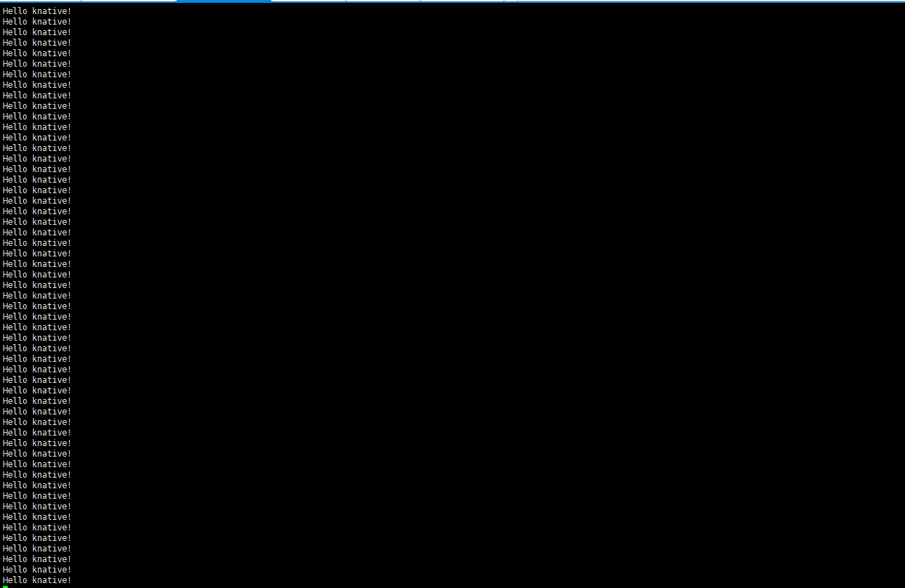
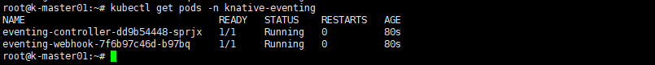
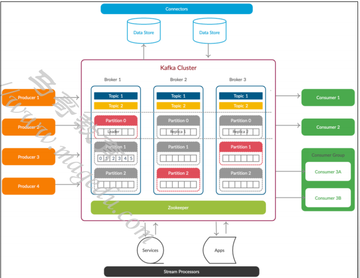

# 1、Serverless 基础

- [ ] Serverless的基础概念
  - 云原生开发模型的一种，可使开发人员专注于构建和运行应用，而无需管理服务器
  - Serverless方案中仍然需要服务器，但他们已经从应用开发人员关注中抽离出来
    - 云提供商负责置备，维护服务器基础架构工作
    - 开发人员可以简单的将代码打包容器中进行部署
    - 部署之后，无服务器应用即可响应需求，并根据需要i自动扩容
  - 用户为实际占用的资源付费，而不是固定的带宽或者服务器数量
- [ ] Serverless与其他云计算模型的核心区别
  -  由云服务商负责管理基础架构和应用扩展
  - 应用部署在容器中，这些容器在被调用时将会自动按需启动
    - 出现能够触发应用代码运行的事件时，云架构才会为这一代码分配资源
    - 代码执行结束后，占用的大部分资源便立即释放
    - 提高公司资源利用率
  - 操作系统、文件系统、安全补丁、负载均衡、容量管理、扩展、日志和监控等例行任务都由底层的云服务完成，从而将开发人员从应用扩展和服务器置备相关的琐碎日常任务中解放出来
- [ ] 现代应用架构通常是Serverless、Microservices和传统分布式应用的混合模式
- [ ] Serverless产品通常分为两类
  - Baas (Backend as a Service)
  - FaaS (Function as a Service)
- [ ] BaaS
  - 云服务端将后端需要的各种服务，例如认证服务、数据库、消息队列、文件存储、代码构建等各种后端功能封装为API提供给用户
  - 用户只需要根据BaaS的API编写并提交代码即可自动完成应用构建、部署、运行、扩缩容等功能
- [ ] FaaS
  - 由事件驱动计算执行的应用架构模型
  - 开发人员编写逻辑代码，并将其部署到完全由平台管理的容器中，然后按需执行
    - 开发人员通过API调用Serverless应用
    - FaaS服务商通过API网关来处理API调用请求
  - 运行Serverless代码的容器的特点
    - 无状态 - 让数据集成变得更加简单
    - 寿命短 - 可以只运行非常短的时间
    - 由事件触发 - 可在需要时自动运行
    - 完全由云提供商管理

## 1.1 BaaS模型

- [ ] 较之PaaS，BaaS能够为用户实现更多的价值
  - IaaS=数据中心+服务器+存储+网络
  - PaaS=IaaS+部署+管理+扩展
  - BaaS=PaaS+自动化构建
- [ ] 缺点
  - 供应商绑定

## 1.2 BaaS与FaaS的区别

- [ ] BaaS处理整个后端功能，而FaaS仅处理应用程序中支持相应的事件

  

## 1.3 Serverless的优缺点

- [ ] 优点
  - 较低的运维成本
  - 较低的开发成本
  - 自动化弹性扩展
  - 较高的计算资源利用率
- [ ] 缺点
  - 仅支持无状态应用
  - 延迟问题
    - 高度分布式导致延迟增大
    - 冷启动存在延迟
  - 尚未形成统一标准
  - 存在厂商锁定的可能性

## 1.4 Serverless的主流产品

- [ ] 云厂商的FaaS产品
  -  AWS Lambda
  - Google Cloud Functions
  - Microsoft Azure Functions 
  - Aliyun Function Compute
  - Huawei Cloud FunctionGraph

- [ ] 开源解决方案
  - Apache OpenWhisk
  - OpenFaaS
  - Fission
  - Kubeless
  - Knatvie

# 2、Knative 基础

## 2.1 Knative是什么

- [ ] 基于kubernetes平台，用于部署和管理现代serverless工作负载，是serverless平台，而非serverless实现

  

- [ ] 若能够把kubernetes看作是一个分布式内核，则Knative也可被类比为该内核之上的分布式libc；

  

## 2.2 Knative项目

- [ ] Knative项目简介
  - Google于2018年7月正式发布；
  - Kubernetes平台的原生扩展组件，让其能够轻松的部署，运行和管理serverless类型的云原生应用
  - 由RedHat,Google和IBM等公司，以及各种初创公司组成的开源社区共同维护
  - 目标在于Serverless技术标准化
- [ ] Knative的组件
  - Serving
    - 部署管理及扩展无状态应用
    - 支持由请求驱动计算
    - 支持缩容到0
  - Eventing
    - 以声明的方式创建对事件源的订阅，并将事件路由到目标端点
    - 事件订阅、传递和处理
    - 基于pub/sub模型连接knative的工作负载
  - Build
    - 从源代码构建出应用镜像
    - 已经由独立的Tekton项目取代

## 2.3 Knative 架构

- [ ] 遵照Kubernetes的范式，以扩展的方式，通过自定义API资源类型支持
  - 自动化完成服务的部署和扩缩容（Serving）
  - 标准化事件驱动基础设施(Eventing)
- [ ] Serviing
  - Serving Controller
  - Resources API
    - Service
    - Configuration
    - Revision
    - Route
- [ ] Eventing
  - Eventing Controller
  - Resources API
    - Broker
    - Trigger
    - EventType

### 2.3.1 Knative Serving架构

- [ ] 相关的资源API定义在"serving.knative.dev"群组中

- [ ] 主要包括四个CRD

  - Service
    - 对自动编排Serverless类型应用的功能的抽象，负责自动管理工作负载的整个生命周期
    - 能自动控制下面三个类型的资源对象的管理
  - Configuration
    - 反映了Service当前期望状态(Spec)的配置
    - Service对象的更新，也将导致Configuration的更新
  - Revision
    - Service的每次代码或者配置变更都会生成一个Revision
    - 快照型数据，read-only
  - Route
    - 将请求流量路由到目标Revision
    - 支持将流量按比例切分并路由到多个Revision

  

### 2.3.1 Knative Eventing

#### 2.3.1.1 事件

- [ ] 关于“事件”
  - 时间是一个不可变的小段数据，记录了系统在特定时间内的特定行为，或状态的转变
  - 通过读取系统的事件流（序列），可以重建系统的运行历史
  - 事件的格式
    - 事件的格式完全可由开发者自行决定
    - CNCF的CloudEvents规范至力于事件格式的标准化
    - 目前，众多云服务商都开始支持该规范
- [ ] 关于“事件驱动”
  - 不存在一个规范、严格的定义，任何使用事件通知范式（pub/sub）的系统都是事件驱动的系统
  - 事件驱动的系统大体分为两类
    - 响应式（reactive）：本质上是非同步性质的函数调用（或HTTP RESTful/RPC调用）
    - 流处理（stream processing）：密集式、面向数据式使用事件，订阅者通常是流处理器，它从事件流中提取状态，并将状态传递给相关方
- [ ] 关于“事件源（Event Sourceing）”
  - 事件数据的持久化模式
  - 通常基于事件日志保存不可变的事件信息

#### 2.3.1.2 Knativing Eventing

- [ ] Knative Eventing

  - 负责为事件的生产和消费提供基础设施，可将事件从生产者路由到目标消费者，从而让开发人员能够使用事件驱动架构
  - 各资源者是松散耦合关系，可分别独立开发和部署
  - 遵循CloudEvents规范

  

## 2.4 重点说明

- [ ] Knative是FaaS解决方案吗？
  - Knative并**未**提供FaaS
  - 用户可在Knative和Kubernetes之上，借助于第三方项目自行构建FaaS系统，例如Kyma Project
- [ ] Knative为Kubernetes扩展出的功能
  -  Serving
    - 替代Deployment控制器，负责编排运行基于HTTP协议的无状态应用
    - 额外提供的功能特性
      - Knative的Service对象，相当于Kubernetes上的 Service+Deployment 的功能
      - 基于单个请求进行负载均衡
      - 基于请求的快速、自动化扩缩容，并支持收缩至0实例
      - 通过在Pod扩展时缓冲请求来削峰填谷
      - 流量切分
  - Eventing
    - 声明式事件配置接口

## 2.5 Knative适合运行的应用类型

- [ ] Knative仅适合运行特定类型的应用：无状态、容器化的服务器应用
  - 监听于某套接字之上提供服务的应用，不适合运行批处理作业
  - 仅支持无状态应用，同一服务的各实例间无差别，可简单进行扩容和缩容；
  -  仅支持通过HTTP/1、HTTP/2或gRPC通信的服务端应用；
  - 应用程序要能够构建为OCI容器镜像；

## 2.6 如何获取Knative服务

- [ ] 自行部署Knative
  - 需要事先准备出Kubernetes集群
  - 事先选定一个可用的网络层来路由和治理流量
    - Istio（istio-ingressgateway）
    - Contour
    - Kourier
- [ ] 基于Knative的商业产品
  - Cloud Native Runtimes for VMware Tanzu
  - Google Cloud Run：Google完全托管（包括Kubernetes集群）的Knative平台
  - Google Cloud Run for Anthos/GKE：GKE集群中托管的Knative安装
  - IBM Cloud Kubernetes Service：IKS集群中托管的Knative安装
  - Red Hat OpenShift Serverless：Openshift托管的Openshift集群上的Knative安装
  - Pivotal Function Service（PFS）：在Kubernetes上构建和运行函数、应用程序和容器的平台

# 3、knative-serving

- [ ] 示例环境
  - Kubernetes: v1.27.1
  - Knative: v1.12
  - networking layer: istio
- [ ] 可用的部署方式
  - 基于YAML配置文档直接部署
    - Serving和Eventing需要分别进行部署
  - 借助Knative Operator进行部署
    - 首先部署Knative Operator
    - 通过Operator的KnativeServing部署Serving
    - 通过Operator的KnativeEventing资源部署Eventing
- [ ] 需要部署的Knative组件
  - Serving
  - Eventing
  - kn

## 3.1 部署serving

- [ ] 环境要求

  - For prototyping purposes
    - 单节点的Kubernetes集群，有2个可用的CPU核心，以及4g内存；
  - For production purposes
    - 单节点的Kubernetes集群，需要至少有6个CPU核心、6G内存和30G磁盘空间
    - 多节点的Kubernetes集群中，每个节点至少有2个CPU核心，4G内存和20G磁盘空间
    - Kubernetes版本最低为v1.26

- [ ] 安装步骤

  - 部署Serving核心组件
  - 部署网络层（networking layer）组件
    - Istio、Contour、Kourier三选一
  - （可选）配置DNS
  - (可选) 部署Serving扩展
    - HPA：用于支持Kubernetes的HPA
    - Cert Manager：用于为工作负载自动签发TLS证书
    - Encrypt HTTP01：用于为工作负载自动签发TLS证书

- [ ] 以YAML文件进行Serving部署

  - 参考官方文档：https://knative.dev/docs/install/yaml-install/serving/install-serving-with-yaml/

  - 部署serving的crd：

    ```sh
    kubectl apply -f https://github.com/knative/serving/releases/download/knative-v1.12.0/serving-crds.yaml
    ```

  - 部署serving核心组件

    ```yaml
    kubectl apply -f https://github.com/knative/serving/releases/download/knative-v1.12.0/serving-core.yaml
    ```

  - 安装 a networking layer（这里以istio为例）

    ```sh
    kubectl apply -l knative.dev/crd-install=true -f https://github.com/knative/net-istio/releases/download/knative-v1.12.0/istio.yaml
    kubectl apply -f https://github.com/knative/net-istio/releases/download/knative-v1.12.0/istio.yaml
    kubectl apply -f https://github.com/knative/net-istio/releases/download/knative-v1.12.0/net-istio.yaml
    kubectl --namespace istio-system get service istio-ingressgateway
    ```

  - 配置DNS，因为我们是测试环境，所以选择"no dns"，来配置，可以从集群外部访问的域名

    ```yaml
    kubectl patch configmap/config-domain \
          --namespace knative-serving \
          --type merge \
          --patch '{"data":{"example.com":""}}'
    ```

  - 安装HPA控制器

    ```sh
    kubectl apply -f https://github.com/knative/serving/releases/download/knative-v1.12.0/serving-hpa.yaml
    ```

  - 安装kn

    ```sh
    wget https://github.com/knative/client/releases/download/knative-v1.11.2/kn-linux-amd64
    
    cp kn-linux-amd64 /usr/local/bin/kn
    
    chmod +x /usr/local/bin/kn
    ```

    

  - 确认下载成功

    ```sh
    root@k-master01:~# kubectl get pods -n knative-serving
    NAME                                    READY   STATUS    RESTARTS   AGE
    activator-58b9474547-7nnh6              1/1     Running   0          18m
    autoscaler-c88f8c8dc-zfvjv              1/1     Running   0          18m
    autoscaler-hpa-5877fb58d6-84m5j         1/1     Running   0          64s
    controller-84cd85bcc-wg9q8              1/1     Running   0          18m
    net-istio-controller-79f97565f4-dc6m8   1/1     Running   0          2m34s
    net-istio-webhook-f7c89b4fd-jwcqs       1/1     Running   0          2m34s
    webhook-6bbbc5867c-dw7vs                1/1     Running   0          18m
    ```

    ```sh
    root@k-master01:~# kubectl get pods -n istio-system
    NAME                                    READY   STATUS    RESTARTS   AGE
    istio-ingressgateway-584c594ff8-2f8mg   1/1     Running   0          5m2s
    istio-ingressgateway-584c594ff8-7clr9   1/1     Running   0          5m2s
    istio-ingressgateway-584c594ff8-w7tq5   1/1     Running   0          5m2s
    istiod-78c4f7f756-kv4mh                 1/1     Running   0          5m2s
    istiod-78c4f7f756-kxbjw                 1/1     Running   0          4m47s
    istiod-78c4f7f756-pldrm                 1/1     Running   0          4m47s
    ```

  - 暴露istio-ingressgateway

    给node01上邦一个ip地址：

    ```sh
    ip addr add 192.168.58.100/24 dev ens33
    ```

    ```sh 
     kubectl edit svc istio-ingressgateway -n istio-system
    ```

    

- [ ] 运行一个demo的service

  ```yaml
  apiVersion: serving.knative.dev/v1
  kind: Service
  metadata:
    name: hello
  spec:
    template:
      metadata:
        # This is the name of our new "Revision," it must follow the convention {service-name}-{revision-name}
        name: hello-world
      spec:
        containers:
          #- image: gcr.io/knative-samples/helloworld-go
          - image: ikubernetes/helloworld-go
            ports:
              - containerPort: 8080
            env:
              - name: TARGET
                value: "World"
  
  ```

  测试请求

  ```sh
  kubectl get ksvc
  ```

  

  本机测试：

  ```sh
  curl -H "Host: hello.default.example.com" 192.168.58.100
  
  Hello World!
  ```

## 3.2 Serving的子组件

- [ ] Serving依赖几个关键的组件协同其管理能力
  - Activator：Revision中的pod数量缩容至0，activator负责接收并缓存相关的请求，同时报告指标数据给Autoscaler，并在Autoscaler在Revision上扩展出必要的pod后，再将请求路由到相应的Revision；
  - Autoscaler：Knative通过注入一个queue-proxy的容器的siderar代理来了解它部署的pod的请求，而Autoscaler会为每个服务使用“每秒请求数”来自动缩放Revision上的pod；
  - Controlller：负责监视Serving CRD（Kservice、Configuration,route,revision）相关的API对象并管理他们的生命周期，是Serving声明式API的关键保障；
  - Webhook：为kubernetes提供的外置Admission Controller，兼具Validation和Mutation的功能，主要作用于Serving专有的几个API资源类型之上，以及相关的ConfigMap资源上；
  - **net-certmanager-controller**：与Cert Manager协同时使用的专用的控制器；
  - **net-istio-controller**：与Istio协同时使用的专用控制器
- [ ] Serving有如下几个专用的CRD
  - serving.knative.dev群组
    - Service
    - Configuration
    - Revision
    - Route
    - Domainmapping
  - autoscaling.internal.knative.dev群组
    - Metrics
    - PodAutoscaler
  -  networking.internal.knative.dev群组
    - ServerlessService
    - ClusterDomainClaim
    - Certificate

## 3.3 Serving及实践

### 3.3.1 serving工作模式


### 3.3.2 Queue Proxy

- [ ] Knative Serving会为每个Pod注入一个称为Queue Proxy的容器
  - 为业务代码提供代理功能
    - Ingress GW接收到请求后，将其发往目标Pod实例上由Queue Proxy监听的8012端口；
    - 而后，Queue Proxy再将请求转发给业务代码容器监听的端口
  - 报告实例上的多个有关客户端请求的关键指标给Autoscaler
  - Pod健康状态检测（k8s探针）
  - 为超出实例最大并发量的请求提供缓冲队列
- [ ] Queue Proxy预留了如下几个端口
  - 8012：HTTP协议的代理端口
  - 8013：HTTP/2端口，用于代理gRPC
  - 8022：管理端口，如健康状态检测等；
  - 9090：暴露给Autoscaler进行指标采集的端口
  - 9091：暴露给prometheus进行监控指标采集的端口
  - 

### 3.3.3 运行knative应用

- [ ] 在Serving上，可通过创建Knative Service对象来运行应用，该Service资源会自动创建

  - 一个Configuration对象，它会创建一个Revision，并该由Revision自动创建如下两个对象：
    - 一个Deployment
    - 一个PodAutoscaler对象
  - 一个Route对象，它会创建
    - 一个k8s service资源
    - 一组Istio VirtualService对象
      - {kservice-name}-ingress
      - {kservice-name}-mesh

- [ ] Knative Service资源（简称ksvc）的资源规范主要有两个字段：

  - template：用于创建或者更新Configuration，任何更新，都将创建新的Revision对象；
  - traffic：用于创建或者更新Route对象

- [ ] 以"kservice/hello"为例进行验证

  - 获取由kservice/hello自动创建的Configuration, Revision,Deployment和PodAutoscaler

    

  - 获取由kservice/hello自动创建的Route,service和virtualservice

    

- [ ] 访问kservice/hello

  - 集群内部客户端
    - 对于每个kservice/hello对象，Serving都会为其创建一个{kservice-name}.svc.{cluster.domain}格式的名称，例如hello.default.svc.cluster.local，用于集群内部客户端访问Kservice
    - 例如，在集群内部的某Pod上，向http://hello.default.svc.cluster.local直接发起请求即可
  - 集群外部的客户端
    - 集群外部客户端的流量，需要经由istio-ingressgateway统一接入；
    - Serving默认为其使用的外部域名为"example.com"，于是kservice/hello的外部名称为{kservice-name}.{namespace}.example.com
    - 有两种访问方式
      - 在集群外部客户端上，使用自定义的Host首部指向目标服务
      - 在集群外部的DNS服务上，使用泛域名解析机制，将特定名称空间下的所有kservice名称都解析至service/istio ingressgateway的外部IP地址上

- [ ] 访问示例

  - 首先在k8s集群上启用一个客户端，向kservice/hello发送请求

    ```sh
    kubectl run client --image=ikubernetes/admin-box:v1.2 --restart=Never --rm -it --command -- /bin/bash
    ```

    

  - 在集群外部访问

    ```sh
    curl -H "Host: hello.default.example.com" http://192.168.58.100
    ```

    

#### 3.3.3.1 Knative Serving资源规范

- [ ] Knative Service资源的spec配置段主要由Connfiguration和Routespec组成

  - ConfigurationSpec：定义Configuration资源规范，其核心组成即为Revision Template
  - RouteSpec：定义Route资源规范，旨在定义流量目标（Traffic Target）

- [ ] Configuration将根据Revision Template自动创建Revision，Revision是代码和配置的不可变快照

- [ ] 配置Kservice示例

  - 限制容器上最大并发请求

    ```yaml
    apiVersion: serving.knative.dev/v1
    kind: Service
    metadata:
      name: hello
    spec:
      template:
        metadata:
          # This is the name of our new "Revision," it must follow the convention {service-name}-{revision-name}
          name: hello-world-002
        spec:
          containerConcurrency: 10
          containers:
            #- image: gcr.io/knative-samples/helloworld-go
            - image: ikubernetes/helloworld-go
              ports:
                - containerPort: 8080
              env:
                - name: TARGET
                  value: "World-002"
    ```

  - 验证

    ```bash
    root@k-master01:~/knative-manifests/serving/basic# kubectl get revision
    NAME              CONFIG NAME   K8S SERVICE NAME   GENERATION   READY   REASON   ACTUAL REPLICAS   DESIRED REPLICAS
    hello-world       hello                            1            True             0                 0
    hello-world-002   hello                            2            True             0                 0
    
    
    root@k-master01:~/knative-manifests/serving/basic# kubectl get revision hello-world-002 -o jsonpath={.spec.containerConcurrency};echo
    10
    
    
    [C:\~]$ curl -H "Host: hello.default.example.com" http://192.168.58.100
      % Total    % Received % Xferd  Average Speed   Time    Time     Time  Current
                                     Dload  Upload   Total   Spent    Left  Speed
    100    17  100    17    0     0     10      0  0:00:01  0:00:01 --:--:--    10
    Hello World-002!
    ```

### 3.3.4 Kn命令管理

- [ ] Knative CLI与Serving相关的子命令
  - service: 管理Knative service
    - apply
    - create, delete,update
    - list,describe
    - export,import
  - revision：管理Knative revisions
    - delete
    - list,describe
  - route：管理Knative routes
    - delete
    - list，describe
  - domain：管理域名映射、
    - create，delete，update
    - list，describe
  - container：管理Kservice的容器
    - add

#### 3.3.4.1 命令式资源管理示例

- [ ] Knative Service

  - 创建（二选一）

    - ```$ kn service create hello --image ikubernetes/helloworld-go --port 8080 --env TARGET=World --revision-name world ```

    - ```sh
       kn service apply hello --image ikubernetes/helloworld-go --port 8080 --env TARGET=World --revision-name world
      ```

  - 获取资源信息

    - ```sh
       kn service list
      ```

    - ```sh
       kn service describe hello
      ```

  - 更新资源配置

    ```sh
     kn service update hello --env TARGET=Knative --revision-name hello-Knative
    ```

- [ ] Knative Revision

  - 获取Revision信息
    -  kn revision list
    - kn revision describe hello-Knative

- [ ] 更新KService资源

  - 使用apply或update命令进行资源更新

    ```sh
    kn service update hello --env TARGET=Knative --max-scale 10 --revision-name hello-Knative
    ```

  - 更新KService时触发的操作

    - 更新spec.template部分，将创建一个新的revision
      - 一个KService下可能同时存在多个revision，其中有一个是为Latest Revision
      - 默认情况下，Latest Revision接收该Service收到的全部请求
      - 也可以为不同的Revision指定不同的流量比例
    - 更新spec.traffic部分，其Route将被修改

- [ ] 删除KService资源

  - 使用delete命令删除资源

    ```sh
     kn service delete hello
    ```

  - 删除KService时，Kubernetes将基于terminator和ownerReferences收集其子资源

### 3.3.5 域名映射

#### 3.3.5.1 修改domain name后缀

- [ ] 默认情况下，外部访问的域名以`example.com`后缀结尾，如果需要修改后缀，例如，要把域名后缀修改为`icloud2native.com`

  ```sh
  kubectl edit cm config-domain -n knative-serving
  ```

  修改`example.com: ""`为`icloud2native.com: ""`

- [ ] 创建一个ksvc/hello进行验证

  ```sh
  kn service create hello --image ikubernetes/helloworld-go --port 8080 --env TARGET=World
  ```

  

- [ ] 集群外请求

  ```sh
  curl -H "Host: hello.default.icloud2native.com" http://192.168.58.100
  ```

  

#### 3.3.5.2 配置自定义域名

- [ ] 场景: knative默认创建的域名`hello.default.icloud2native.com`,如果我们想自定义域名，比如使用`hello.icloud2native.com`。就需要使用knative的一个CRD: `ClusterDomainClaim`

- [ ] `ClusterDomainClaim`

  - 域名映射依赖于`ClusterDomainClaim`,创建方法二选一：

    - ```sh
       # 全局配置参数，在集群中所有的namespace，将会允许自动创建cdc资源
       kubectl patch configmap config-network -n knative-serving -p '{"data":{"autocreate-cluster-domain-claims":"true"}}’
      ```

      

    - 手动创建相关的CDC资源，名称为要映射的外部域名。基于CDC资源规范信息，仅需要指定名称，且namespace要在spec字段中定义

      ```yaml
      apiVersion: networking.internal.knative.dev/v1alpha1
      kind: ClusterDomainClaim
      metadata:
        name: hello.icloud2native.com
      spec:
        namespace: default
      ```

  - 查看CDC资源

    - ```sh
      kubectl get cdc [name]
      ```

    - ```sh
      kubectl describe cdc [name]
      ```

- [ ] Domainmapping资源

  - DomainMapping的功能

    - 将外部域名映射至Knative Service或Knative Route
    - 支持跨Kubernetes Namespace对Knative Service进行名称映射

  - 创建Domainmaping

    - 命令式命令：```kn domain create NAME --ref kroute:NAME|[ksvc:]NAME[:NAMESPACE] -n NAMESPACE```

      示例：`kn domain create hello.icloud2native.com --ref "ksvc:hello"`

    - 资源配置清单

      ```yaml
      apiVersion: serving.knative.dev/v1beta1
      kind: DomainMapping
      metadata:
        name: hello.icloud2native.com
        namespace: default
      spec:
        ref:
          name: hello
          kind: Service
          apiVersion: serving.knative.dev/v1
      ```

  - 验证

    创建完dm后，由于CDC是自动创建

    ```sh
    root@k-master01:~/knative-manifests/serving/domainmapping# kubectl get dm
    NAME                      URL                              READY   REASON
    hello.icloud2native.com   http://hello.icloud2native.com   True    
    root@k-master01:~/knative-manifests/serving/domainmapping# kubectl get cdc
    NAME                      AGE
    hello.icloud2native.com   19s
    ```

    集群外新域名访问：

    ```sh
    curl -H "Host: hello.icloud2native.com" http://192.168.58.100
    ```

    

## 3.4 Revision和流量管理

### 3.4.1 Revision

- [ ] 关于Revision
  - 应用程序代码及相关容器配置某个版本的不可变快照
  - KService上的spec.template的每次变动，都会自动生成一个新的Revision
  - 通常不需要手动创建及维护
- [ ] Revision的使用场景
  - 将流量切分至不同版本的应用程序间（Canary Deployment、Blue/Green Deployment）
  - 版本回滚: 默认的流量策略中，所有的请求都会由就绪状态的最新版本的Revision处理

### 3.4.2 KService的客户端流量处理

- [ ] 集群外部流量
  - 通过KService的外部名称（ksvc-name.namespace.DOMAIN）将流量发给入口网关（例如istio-ingressgateway的Service使用的ExternalIP）的外部地址
    - 需要在集群外部的DNS系统上设定相应的名称解析
    - 暴露的服务较多时，可以使用泛域名解析
  - 通过KService使用的Domainmapping中定义的名称，将流量发往入口网关的外部地址
- [ ] 集群内部流量
  - 未启用mesh时：通过KService的内部名称（ksvc-name.namespace.DOMAIN）将流量发往Knative使用的istio-system名称空间下的knative专用本地流量网关knative-local-gateway
  - 启用mesh时，流量将由mesh根据流量策略进行转发。此时，无须再设置本地流量网关
- [ ] 支撑一个KService对象的流量转发的关键是Route

### 3.4.3 Route

- [ ] Route
  - 由KService的spec.traffic自动生成
  - 未定义时，将由就绪状态的Revision列表中的最新版本的Revision接收和处理该KService的所有请求
  - Route依托入口网关和网格（或本地网关）完成流量转发
  - Route会自动按需创建如下资源
    - Kubernetes Service
    - Istio VirtualService（以Istio为网络层时）
- [ ] 配置Private KService
  - 默认情况下，KService会由Knative同时配置内部（私有）或公共服务
  - 仅创建私有服务的方法,不暴露外部
    - 全局配置：修改configmap/config-domain，将默认域设置为svc.cluster.local；
    - 单KService配置：使用“networking.knative.dev/visibility”标签，并设定其值为cluster-local
      - 设定于KService对象之上
      - 无KService时，设定于相关的Route和Kubernetes Service之上
  - 示例：~$ kubectl label ksvc hello networking.knative.dev/visibility=cluster-local
    - 提示：若为ksvc/hello设置了域名映射，则外部客户端依然可通过该映射对其进行访问

### 3.4.4 自定义流量策略

- [ ] 修改Kservice流量策略的方法

  - 命令行：`kn service update <service-name> --traffic revisionRef=percent`
    - 引用revision的方法：revisonName、Tag，以及使用“@latest”引用最新的就绪版本
    - "--traffic"选项可以多次使用，直到全部的流量比例之和为100%
  - 在Kservice的资源配置上，使用spec.traffic进行定义
  - 为目标Kservice创建自定义Route资源，为其配置临时流量策略。

- [ ] 命令行配置示例

  - 创建kservice/hello, 有2个revision： revision-001: hello world, revision-002: hello knative

    ```yaml
    apiVersion: serving.knative.dev/v1
    kind: Service
    metadata:
      name: hello
    spec:
      template:
        spec:
          containers:
            - image: ikubernetes/helloworld-go
              ports:
                - containerPort: 8080
              env:
                - name: TARGET
                  value: "World"
    ---
    apiVersion: serving.knative.dev/v1
    kind: Service
    metadata:
      name: hello
    spec:
      template:
        spec:
          containers:
            - image: ikubernetes/helloworld-go
              ports:
                - containerPort: 8080
              env:
                - name: TARGET
                  value: "knative"
    ```

  - 目前有2个revision，默认100%流量会到最新的那个reviision

    

  - 将流量完全发送给hello-00001这个Revision(rollback)

    ```sh
    kn service update hello --traffic hello-00001=100
    ```

    可以发现立即生效，所有的流量立马切换到Hello-00001的Revision：

    

  - 将流量切分至不同的Reviision

    ```sh
    kn service update hello --traffic hello-00001=10 --traffic hello-00002=90
    ```

    验证：

    

  - 将流量完全发送至最新的版本Revision

    ```sh
    kn service update hello --traffic '@latest'=100
    ```

    验证：将全部流量发送给最新的Revision

    

- [ ] 资源配置清单

  - 将流量发送给最新版本10%, revision-2 70%,revision-1 20%

    ```yaml
    apiVersion: serving.knative.dev/v1
    kind: Service
    metadata:
      name: hello
    spec:
      template:
        spec:
          containers:
            - image: ikubernetes/helloworld-go
              ports:
                - containerPort: 8080
              env:
                - name: TARGET
                  value: "Little boy"
      traffic:
      - latestRevision: true
        percent: 10
      - revisionName: hello-00002
        percent: 70
      - revisionName: hello-00001
        percent: 20
    
    ```

    验证：基本7-2-1比例

    

    

### 3.4.5 路由标签（tag）

- [ ] 场景：可以为特定的Revision打上tag,然后可以通过特定的URL格式来访问

  - 附带tag的路由项指向的Revision，可通过`<tag-name>-<ksvc-name>.<namespace>.<domain>`的歌格式访问；
  - 无tag的路由项，仅可通过`<ksvc-name>.<namespace>.<domain>`的格式访问

- [ ] 管理标签的方法

  - 在Traffic Target上直接配置

    ```yaml
    apiVersion: serving.knative.dev/v1
    kind: Service
    metadata:
      name: hello
    spec:
      template:
        spec:
          containers:
            - image: ikubernetes/helloworld-go
              ports:
                - containerPort: 8080
              env:
                - name: TARGET
                  value: "Cloud-Native"
      traffic:
      - latestRevision: true
        percent: 0
        tag: staging
      - revisionName: hello-00002
        percent: 90
      - revisionName: hello-00001
        percent: 10
    ```

  - 命令

    - 设定标签：`kn service update <ksvc> --tag revisionRef=tagNmae`
    - 删除标签:  `kn service update <ksvc> --untag tagName`

  - 示例

    - 先给hello-00001打上tag名字为staging的标签：

      ```sh
      kn service update hello --tag hello-00001=staging
      ```

      ```sh
      kubectl get ksvc hello -o yaml
      ```

      

    - 访问带tag的revision 00001

      ```sh
      curl -H "Host: staging-hello.default.icloud2native.com" 192.168.58.100
      ```

      

### 3.4.6 Configuration Target和流量逐步迁移

- [ ] Configuration Target

  - ConfigurationName也可以作为路由项中的流量目标，意味着相关的流量部分由该Configurate下最新就绪的Revision承载

  - 存在问题

    - 在新的Revision就绪之后，Configuration Target上的所有流量会立即转移至该Revision
    - 这可能会导致QP或Activator的请求队列过长，以至于部分请求可能会被拒绝

  - 解决方式

    - 在KService或Route上使用“serving.knative.dev/rollout-duration”注解来指定流量迁移过程的时长；新的Revision上线后，它会先从Configuration Target迁出1%的流量；随后再等分迁出余下的流量部分

    - 配置案例

      ```yaml
      apiVersion: serving.knative.dev/v1
      kind: Service
      metadata:
        name: hello
        annotations:
          serving.knative.dev/rollout-duration: "380s"
      spec:
      ...
        traffic:
        - percent: 55
          configurationName: hello # Pinned to latest ready Revision
        - percent: 45
          revisionName: hello-00001 # Pinned to a specific Revision.
      ```

## 3.5 Autoscaling

### 3.5.1 Knative的自动缩放机制

- [ ] “请求驱动计算”是serverless的核心特性

  - 缩容至0：即没有请求时，系统不会分配资源给Kservice；
  - 从0开始扩容：由Activator缓存请求，并报告指标数据给Autoscaler；
  - 按需扩容：Autoscaler根据Revision中各实例的QP报告的指标数据不断调整Revision中实例数量

- [ ] Knative系统中，Autoscaler、Activator和Queue-Proxy三者协同管理应用规模与流量规模的匹配

  - Knative附带了开箱即用的AutoScaler，简称KPA；
  - 同时，Knative还支持使用Kubernetes HPA进行Deployment缩放

  

- [ ] Autoscaler在扩缩容功能上实现的基本假设

  - 用户不能仅因为服务实例收缩为0而收到错误响应
  - 请求不能导致应用过载
  - 系统不能造成无谓的资源浪费

  

### 3.5.2 请求如何驱动计算

- [ ] Knative的自动扩缩容机制依赖于两个前提

  - 为Pod实例配置支持的目标并发数（在给定的时间里可同时处理的请求数）
  - 应用实例支持的缩放边界
    - 最少实例数，0即表示支持缩容至0实例；
    - 最大实例数

- [ ] AutoScaler的基本缩放逻辑

  - Autoscaler基于过去一段时间内（stable windows指定）统计的指标(metrics)数据和单个实例的目标并发数(target)来计算目标实例数
  - 计算出的目标实例数将发送给相应的Revision的Deployment执行缩放操作

  

### 3.5.3 Autoscaler执行扩缩容的基本流程

- [ ] 目标Revision零实例

  - 初次请求由Ingress GW转发给Activator进行缓存，同时报告给数据给Autoscaler，进而控制相应的Deployment来完成Pod实例扩展；
  - Pod副本ready后，Activator将缓存的请求转发给相应的Pod对象；
  - 随后，存在ready状态的Pod期间，Ingress GW将后续的请求直接转给Pod，而不再转给Activator；

- [ ] 目标Revision存在至少一个Ready状态的Pod

  - Autoscaler根据Revision中各Pod的Queue-Proxy容器持续报告指标数据持续计算Pod副本数；
  - Deployment根据Autoscaler的计算结果进行实例数量调整

- [ ] Reviision实例数不为0，但请求数持续为0

  - Autoscaler在Queue-Proxy持续一段时间报告指标为0后，即将其Pod缩减为0
  - 随后，Ingress GW会将收到的请求再次转发给Activator

  

#### 3.5.3.1 零实例时收到请求的工作流程


#### 3.5.3.2 非零实例时


### 3.5.4 缩放窗口和Panic

- [ ] 负载变动频繁时，Knative可能会因为响应负载变动而导致频繁创建或销毁Pod实例；

- [ ] 为避免服务规模“抖动”，Autoscaler支持两种扩缩容模式：

  - Stable：根据窗口稳定期（stable windows，默认60秒）的请求平均数（平均并发数）及每个Pod的目标并发数计算Pod数
  - Panic：短期内收到大量请求时，将启用Panic模式
    - 十分之一窗口期(6秒)的平均并发数> 2*单实例目标并发数
    - 进入panic模式60秒后，系统会重新返回stable模式

- [ ] 以下图矩阵为例（假设现有的实例数和平均并发数均为0）

  - 横轴（现有实例数量）：0个、1个和M个
  - 纵轴（到达的请求数）： 0个、1个和N个

  

### 3.5.5 Autoscaler计算Pod数的基本逻辑

- [ ] 指标收集周期和决策周期
  - Autoscaler每2秒钟计算一次Revision上所需要Pod实例数量
  - Autoscaler每2秒钟从Revision的Pod实例（Quueu-Proxy容器）上抓取一次指标数据，并将其（每秒的）平均值存储于单独的bucket中
    - 实例较少时，则从每个实例抓取指标
    - 实例较多时，则从实例的一个子集上抓取指标，因而计算出的Pod实例数量并非精准数值
- [ ] 决策过程
  - Autoscaler在Revision中检索就绪状态的Pod实例数量
    - 若就绪状态实例为0，将其设定为1，即使用Activator作为实例
  - Autoscaler检查累积收集的可用指标
    - 若不存在任何可用指标，则将所需要的Pod实例数设置为0
    - 若存在累积的指标，则计算出窗口期内的平均并发请求数
    - 根据平均并发请求数和每实例的并发目标值计算出所需要的Pod实例数
      -  窗口期内每实例的平均并发请求数 = Bucket中的样本值之和 / Bucket数量
      - 每实例的目标并发请求数 = 单实例目标并发数 * 目标利用率
      - 期望的Pod数 = 窗口期内每实例的并发请求数 / 每实例目标并发请求数
    - Panic的触发条件
      - 期望的Pod数 / 现有的Pod数 ≥ 2
      - 60秒之后返回至Stable

### 3.5.6 Knative支持的Autoscaler

- [ ] Knative支持基于KPA和HPA的自动缩放机制，但二者的功能略有不同；
  - Knative Pod Autoscaler
    - Knative Serving的核心组件，且默认即为启用状态
    - 支持缩容为0
    - 不支持基于CPU的自动缩放机制
  - Kubernetes Horizontal Pod Autoscaler
    - Kubernetes系统上的组件
    - 不支持缩容至0
    - 支持基于CPU的自动缩放机制

#### 3.5.6.1 配置要使用的Autoscaler

- [ ] Autoscaler的功能设定方式

  - 全局配置：ConfigMap/config-autoscaler
  - 每Revision配置：Revision Annotations

- [ ] 配置要使用的Autoscaler

  - 全局配置：位于knative-serving名称空间下的ConfigMap资源config-autoscaler之中

    ```yaml
    apiVersion: v1
    kind: ConfigMap
    metadata:
     name: config-autoscaler
     namespace: knative-serving
    data:
     pod-autoscaler-class: "kpa.autoscaling.knative.dev" # hpa.autoscaling.knative.dev
    ```

  - 特定的Revision：使用注解“autoscaling.knative.dev/class”

    ```yaml
    apiVersion: serving.knative.dev/v1
    kind: Service
    metadata:
      name: helloworld-go
      namespace: default
    spec:
      template:
        metadata:
          annotations:
            autoscaling.knative.dev/class: "kpa.autoscaling.knative.dev"
        spec:
          containers:
            - image: ghcr.io/knative/helloworld-go:latest
    ```

- [ ] 可用的指标

  - KPA：concurrency和rps，默认是concurrency
  - HPA：cpu、memory和custom

#### 3.5.6.2 Autoscaler的全局配置

- [ ] 全局配置参数定义在knative-serving名称空间中的configmap/auto-scaler之中
- [ ] 相关参数
  - container-concurrency-target-default：实例的目标并发数，即最大并发数，默认值为100；
  - container-concurrency-target-percentage：实例的目标利用率，默认为“0.7” ；
  - enable-scale-to-zero：是否支持缩容至0，默认为true；仅KPA支持；
  - max-scale-up-rate：最大扩容速率，默认为1000；
    - 当前可最大扩容数 = 最大扩容速率 * Ready状态的Pod数量
  - max-scale-down-rate：最大缩容速率，默认为2
    - 当前可最大缩容数 = Ready状态的Pod数量 / 最大缩容速率
  - panic-window-percentage：Panic窗口期时长相当于Stable窗口期时长的百分比，默认为10，即百分之十；
  - panic-threshold-percentage：因Pod数量偏差而触发Panic阈值百分比，默认为200，即2倍；
  - scale-to-zero-grace-period：缩容至0的宽限期，即等待最后一个Pod删除的最大时长，默认为30s；
  - scale-to-zero-pod-retention-period：决定缩容至0后，允许最后一个Pod处于活动状态的最小时长，默认为0s；
  - stable-window：稳定窗口期的时长，默认为60s；
  - target-burst-capacity：突发请求容量，默认为200；
  - requests-per-second-target-default：每秒并发（RPS）的默认值，默认为200；使用rps指标时生效；

#### 3.5.6.3 配置支持缩容至0实例

- [ ] 配置支持Revision自动缩放至0实例的参数

  - enable-scale-to-zero：不支持Revision级别的配置
  - scale-to-zero-grace-period：不支持Revision级别的配置
  - scale-to-zero-pod-retention-period：◆Revision级别配置时，使用注解键“autoscaling.knative.dev/scale-to-zero-pod-retention-period”

- [ ] 配置示例

  ```yaml
  apiVersion: serving.knative.dev/v1
  kind: Service
  metadata:
    name: hello
    namespace: default
  spec:
    template:
      metadata:
        annotations:
          autoscaling.knative.dev/scale-to-zero-pod-retention-period: "1m5s"  ## Reviision级别配置实例缩容为0
      spec:
        containers:
          - image: ikubernetes/helloworld-go
            ports:
              - containerPort: 8080
            env:
              - name: TARGET
                value: "Knative Autoscaling Scale-to-Zero"
  ```

#### 3.5.6.4 配置实例并发数

- [ ] 单实例并发数相关的设定参数

  - 软限制：流量突发尖峰期允许超出
    - 全局默认配置参数：container-concurrency-target-default
    - Revision级的注解：autoscaling.knative.dev/target
  - 硬限制：不允许超出，达到上限的请求需进行缓冲
    - 全局默认配置参数：container-concurrency：位于config-defaults中
    - Revision级的注解：containerConcurrency
  - Target目标利用率
    - 全局配置参数：container-concurrency-target-percentage
    - Revision级的注解：autoscaling.knative.dev/target-utilization-percentage

- [ ] 配置案例

  - 场景：配置ksvc/hello的实例目标并发为10，利用率为0.6. 现在用`hey`压测发送20个并发。理论上来说，有4个pod会创建。

  - 实例并发数的配置清单

    ```yaml
    apiVersion: serving.knative.dev/v1
    kind: Service
    metadata:
      name: hello
      namespace: default
    spec:
      template:
        metadata:
          annotations:
            autoscaling.knative.dev/target-utilization-percentage: "60" # 实际每个pod接收的并发也就10*0.6
            autoscaling.knative.dev/target: "10" #最大并发10
        spec:
          containers:
            - image: ikubernetes/helloworld-go
              ports:
                - containerPort: 8080
              env:
                - name: TARGET
                  value: "Knative Autoscaling Concurrency"
    ```

  - 用hey工具进行20并发请求

    ```sh
    hey -z 60s -c 20 -host "hello.default.icloud2native.com" http://192.168.58.100?sleep=100&prime=10000&bloat=5
    ```

  - 结论发现确实有4个实例创建，符合预期

    

#### 3.5.6.5 配置Revision的扩缩容边界

- [ ] 相关的配置参数

  - 最小实例数
    - Revision级别的Annotation: autoscaling.knative.dev/min-scale：说明：KPA且支持缩容至0时，该参数的默认值为0；其它情况下，默认值为1；
  - 最大实例数
    - 全局参数：max-scale
    - Revision级别的Annotation: autoscaling.knative.dev/max-scale：整数型取值，0表示无限制
  - 初始规模：创建Revision，需要立即初始创建的实例数，满足该条件后Revision才能Ready，默认值为1；
    - 全局参数：initial-scale和allow-zero-initial-scale
    - Revision级别的Annotation：autoscaling.knative.dev/initial-scale：其实际规模依然可以根据流量进行自动调整
  - 缩容延迟：时间窗口，在应用缩容决策前，该时间窗口内并发请求必须处于递减状态，取值范围[0s, 1h]
    - 全局参数：scale-down-delay
    - Revision级别的Annotation：autoscaling.knative.dev/scale-down-delay
  - Stable窗口期：取值范围[6s, 1h]
    - 全局参数：stable-window
    - Revision级别的Annotation: autoscaling.knative.dev/window

- [ ] 配置案例

  - 配置ksvc/hello的实例目标并发为10，利用率为0.6. 现在用`hey`压测发送50个并发。理论上来说，有9个pod会创建。但是，我们定义的最大扩容实例为3个，所以，多余的请求会在QP中缓冲

  - 扩缩容边界的配置清单

    ```yaml
    apiVersion: serving.knative.dev/v1
    kind: Service
    metadata:
      name: hello
      namespace: default
    spec:
      template:
        metadata:
          annotations:
            autoscaling.knative.dev/target-utilization-percentage: "60"
            autoscaling.knative.dev/target: "10"
            autoscaling.knative.dev/max-scale: "3"
            autoscaling.knative.dev/initial-scale: "1"
            autoscaling.knative.dev/scale-down-delay: "1m"
            autoscaling.knative.dev/stable-window: "60s"
        spec:
          containers:
            - image: ikubernetes/helloworld-go
              ports:
                - containerPort: 8080
              env:
                - name: TARGET
                  value: "Knative Autoscaling Scale Bounds"
    ```

  - ```sh
    hey -z 50s -c 50 -host "hello.default.icloud2native.com" http://192.168.58.100?sleep=100&prime=10000&bloat=5
    ```

  - 可以发现，最多有3个pod创建

    

#### 3.5.6.6 使用rps指标

- [ ] 相关的配置参数

  - 定义使用rps指标
    - Revision级别的Annotation：autoscaling.knative.dev/metric：取值为RPS;
  - 为rps指标指定目标请求数
    - 全局参数：requests-per-second-target-default
    - Revision级别的Annotation：autoscaling.knative.dev/target：整数取值，默认值为200

- [ ] 配置示例

  - 场景：配置ksvc/hello的实例目标并发为100，利用率为0.6. 现在用`hey`压测模拟在60秒内以20的并发请求，总共加起来1200个请求。理论上来说，有20个pod会创建。但是，我们定义的最大扩容实例为10个，所以，多余的请求会在QP中缓冲

  - rps的配置清单

    ```yaml
    apiVersion: serving.knative.dev/v1
    kind: Service
    metadata:
      name: hello
      namespace: default
    spec:
      template:
        metadata:
          annotations:
            autoscaling.knative.dev/target-utilization-percentage: "60"
            autoscaling.knative.dev/metric: "rps"
            autoscaling.knative.dev/target: "100"
            autoscaling.knative.dev/max-scale: "10"
            autoscaling.knative.dev/initial-scale: "1"
            autoscaling.knative.dev/stable-window: "2m"
        spec:
          containers:
            - image: ikubernetes/helloworld-go
              ports:
                - containerPort: 8080
              env:
                - name: TARGET
                  value: "Knative Autoscaling Metrics and Targets"
    ```

  - 使用如下测试命令，模拟在60秒内，以20的并发向hello KService发起请求

    ```sh
    hey -z 60s -c 20 -host "hello.default.icloud2native.com" http://192.168.58.100?sleep=100&prime=10000&bloat=5
    ```

  - 验证：相应Revision上的实例数量会扩展至多个，但最多不超过10个

    

# 4、knative-eventing

## 4.1 消息系统基础

### 4.1.1 消息系统和消息传递

- [ ] **消息传递**是在程序和程序之间实现高速、异步、可靠传递消息的技术
  - 程序彼此之间通过互相发送称为message的数据包进行通信
  - 通道（Channel）也称为队列（Queue），是连接程序和**传递消息的逻辑路径**
  - Channel的特性类似于消息的集合或数组，但它可以在多台计算机之间共享，并且可以由多个应用程序同时使用；
  - 发送者（sender）或生产者（producer）是通过将消息写入通道来发送消息的程序
  - 接收者（receiver）或消费者（consumer）是通过从通道读取（和删除）消息来接收消息的程序
- [ ] **消息**本身只是某种数据结构——例如字符串、字节数组、记录或对象；
  - 消息可以简单解释为数据、对于要在接收器上调用的命令的描述，或者是对发送器中发生的事件的描述
  -  一般包含两个部分，而人们口中的“消息”，通常指的是其“Body”部分：
    - Header：元数据，用于记录发送方和接收方等，通常由消息传递系统使用，而接收方一般会忽略这些信息
    - Body：要传递的数据本身，通常是由接收方使用的内容，消息传递系统会忽略该部分内容
- [ ] 消息系统
  - 消息传递功能通常由称为消息传递系统或面向消息的中间件(MOM) 的单独软件系统所提供
  - 消息传递系统管理消息传递的方式与数据库系统管理数据持久性的方式相同
  - 管理员必须使用定义应用程序之间通信路径的Channel来配置消息传递系统，然后消息传递系统负责协调和管理消息的发送与接收
- [ ] 消息的传递过程，本质上，可分为五个步骤
  - 创建—发送者创建消息并用数据填充它
  - 发送—发件人将消息添加到Channel；
  - 传递—消息传递系统完成消息传递；
  - 接收—接收者从通道中读取消息；
  - 处理—接收者从消息中提取数据；
- [ ] 消息传递的两个重要“特性”
  - 发送并忘记（send and forget）
  - 存储和转发（store and forward）
- [ ] 消息传递的优势
  - 远程通信：将程序间需要交换的数据序列化并通过网络完成传递
  - 平台/语言集成：互相通信的多个系统或程序可能使用了不同的语言、技术或平台；消息传递系统可以作为这些异构的系统间通信的中间层，它支持多个通信方的语言和平台，仅要求这些通信方遵循同一个消息传递范式即可以协议它们完成数据交换；
  - 异步通信： “send and forget”的通信方式，表明发送方可以不用等待接收方接收和处理消息，甚至都不必等待消息传递系统完成消息传递，它只需要等待消息发送完成即可；
  - 限流（削峰填谷）：异步通信支持在接收方控制接收请求的速率，以避免拥塞甚至过载；
  - 可靠的通信：较之RPC，消息传递能够更可靠地完成消息发送
  - 离线运行：允许发送方在与网络断开的情况下运行，待网络恢复后再将数据同步至服务器即可；
- [ ] 消息传递的劣势
  - 复杂的编程模型：开发人员需要使用事件驱动编程模型
    - 应用程序逻辑不能再通过编写调用其它方法的方法来完成，而必要编写多个独立的可响应传入消息的事件处理程序；
    - 事件驱动模型下的系统，较难开发和调试，例如之前的方法调用即可完成的工作，在事件驱动模型下需要用到“请求消息”、“请求通道”、“响应消息”和“响应通道”等；
  - 顺序问题：消息通道保证消息传递，但不保证消息何时传递，也就无法保证消息的传递顺序
  - 难以应对有同步通信需求的场景

### 4.1.2 消息传递模式

- [ ] 消息队列类型

  - Point-to-Point模型：一对一的消息分发；
  - Pub/Sub模型：一对多的消息分发，消息会通过Topic发给多个消费者；

- [ ] Point-to-Point Channel

  - 需要确保只有一个Receiver使用任何给定的消息
  - 可以有多个Receiver监听于同一个列表，但仅有一个能够接收某个特定的消息；
    - 若多个Receiver尝试消息同一个消息，Channel需要确保仅有一个能成功；
    - 各Receiver之间无须互相协调

  

- [ ] Pub/Sub Channel：向多个感兴趣者广播事件

  -  一个输入Channel，对应有多个输出Channel，每个订阅者对应于一个输出Channel；
  - 事件发布到Channel中之后，Pub/Sub Channel将其副本传递至每个输出Channel；
  - 每个输出Channel只有一个订阅者，只允许使用一次消息
    - 消息被订阅者接收后，Channel中的消息副本会消失

  

### 4.1.3 消息和消息路由

- [ ] 应用程序间交换数据时的格式要求

  - 将数据打包成为可通过Channel传递的报文，即消息
  - 消息由元数据和数据组成，其中的元数据即基于特定的传输协议封装的Header

- [ ] 过滤器和路由器

  - 过滤器：基于特定的规则筛选符合条件的消息
  - 路由器：将过滤器筛选出的消息路由至既定的目标Channel

  

### 4.1.4 Channel与数据类型

- [ ] 基于数据类型的协同
  - 为不同的数据类型分别使用各自专用的Channel，以便使得给定的Channel上只包含相同类型的数据
  - Sender知晓自己的数据类型，以及对应的Channel
  - Receiver知晓其接收数据的Channel及其传输的数据的类型
- [ ] 为了便于Sender和Receiver了解各Datatype，可以使用Registry来保存支持和使用的各Datatype

### 4.1.5 消息拓扑

- [ ] 消息拓扑

  - 指消息系统的架构模式
  - 两种主流拓扑：消息总线和消息代理

- [ ] 消息总线（Message Bus）

  - 总线上的各应用程序基于通用协议进行集成
  - 各应用程序遵循通用共享模式的消息，包括数据类型
  - 发送的消息可能仅被传递（广播）到所有连接的系统

  

- [ ] 消息代理（Message Broker）

  - 也称为Hub（Broker）和Spoke（应用程序接入Broker的组件）架构
  - 各应用程序基于中央的Broker彼此连接
  - 无需对各应用程序强制执行通用API（消息模式）
  - 支持使用不同的协议连接至Broker
  -  Broker了解消息模式及其目的地
  - 支持消息格式转换以适配至不同应用程序的期望
  - 支持额外的消息服务，如消息的路由、聚合和拆分

  

### 4.1.6 事件

- [ ] 关于“事件”
  - 事件是一个**不可变**的小段数据，记录了系统在特定时间内的特定行为，或状态的转变
  - 通过读取系统的事件流（序列），可以重建系统的运行历史
  - 事件的格式
    - 事件的格式完全可由开发者自行决定
    - CNCF的CloudEvents规范至力于事件格式的标准化
    - 目前，众多云服务商都开始支持该规范
- [ ] 关于“事件驱动”
  - 不存在一个规范、严格的定义，任何使用事件通知范式（pub/sub）的系统都是事件驱动的系统
  - 事件驱动的系统大体分为两类：
    - 响应式（reactive）：本质上是非同步性质的函数调用（或HTTP RESTful/RPC调用），即所谓的发布/订阅模型
    - 流处理（stream processing）：密集式、面向数据式使用事件，订阅者通常是流处理器，它从事件流中提取状态，并将状态传递给相关方
- [ ] 关于“事件源（Event Sourcing）”
  - 事件数据的持久化模式
  - 通常基于事件日志保存不可变的事件信息

### 4.1.7 事件驱动机构（EDA）

- [ ] 单体架构
  - 基于库调用模式开发的大型软件系统中，随着代码模块及代码库的膨胀，程序的执行路径将不可避免地“迷宫化”，直至难以维护；
- [ ] 微服务架构
  - 建立在HTTP RESTful/RPC之上的微服务架构，借助于迫使开发人员针对远程服务的接口进行编程，克服了程序内部调用路径不可维护这一潜在问题；代价是，不得不在服务间维护复杂的依赖关系，因而执行路径依然存在；
  - 微服务架构确实大大降低了单个团队需要管理的代码量，只不过，这是通过将一些责任转移给了其他服务实现的；
    - 程序与程序之间需要高度规范的接口契约；
- [ ] 事件驱动架构
  - 应用程序在任务完成时生成**事件**（一个带有上下文数据的消息块），而非协调另一个程序代码的执行；
    - 事件发布者基本不关心下一步会发生什么，而是由消息系统及消息传递机制来决定，通常是消息队列或者流系统一类的解决方案；
    - 消息传递机制将事件同时从发布者传递给数量不定的订阅者，再由其完成事件处理；
  - 系统的各部分之间**没有依赖关系**，**也不需要规范的编程接口**，尽管发布者和订阅者仍然需要在一定程度上遵循事件的预设模式，但这种契约非常灵活；
    - 发布者无须关心订阅者是否使用，以及如何使用自己发布的事件；
    - 这消除了执行路径，应用程序和服务的可扩展性大大增强，系统随时能够以订阅者的方式添加或删除代码块
  - 另外，消息队列系统可以承载短时间内的海量信息，这为IoT时代的应用架构提供了坚实的支撑
- [ ] 事件驱动的通用架构中，主要由三个组件组成
  - 生产者：事件消息的生成方，或消息格式转换者
  - 消费者：负责接收、解析和处理事件
  - 事件总线：负责存储事件，从而将生产者和消费者解耦


### 4.1.8 CloudEvents

- [ ] CloudEvents规范最初由CNCF旗下的Serverless Working group创建，但自v0.1之后，该规范即被提升为一个独立CNCF沙箱项目

  - 常用于分布式系统环境，帮助用户构建松散耦合且可独立部署的分布式系统
  - 为行业订立一个规范以提升互操作性

- [ ] CloudEvents中的事件

  - 事件包括某个实际情景的上下文和数据，以及一个唯一的标识；

  - 事件通常用于后端代码中，负责连接不同的代码块，其中一个代码块的状态的变动会触发另一个代码块的运行

  - 其中，事件源（source）生成的事件（Event）被**封装在协议中**生成传输单元（message）以方便传输；事件到达目的端后，将触发基于事件数据的动作（action）

    - 传输协议：支持行业的各种标准协议（如HTTP、AMQP、MQTT和SMTP等）、开源协议（如Kafka和NATS），以及平台/供应商的特有协议；
    - 动作通常是由特定来源的特定事件触发，是专门负责处理该类事件代码块，这些代码块可运行于Serverless Function逻辑中；

    

#### 4.1.8.1 CloudEvents core规范中的事件格式

- [ ] CloudEvents core规范包含一组成为属性的元数据，用于指明如何在系统之间传输事件，以及这些元数据应该如何出现在消息（传输报文）中

- [ ] 一个遵循CloudEvents规范的事件示例：

  ```bash
  ☁️ cloudevents.Event
  Context Attributes,
  specversion: 1.0
  type: dev.knative.sources.ping
  source: /apis/v1/namespaces/event-demo/pingsources/pingsource
  id: 61966d00-b0d7-479e-8a3b-b609b65214cc
  time: 2022-02-18T07:35:00.229825817Z
  datacontenttype: application/json
  Data,
  {
  "message": "Hello Eventing!"
  }
  ```

  

#### 4.1.8.2 CloudEvents 中的序列化规范

- [ ] CloudEvents还提供了如何以不同格式（如JSON）和协议（如HTTP、AMQP和

  Kafka）等将事件进行序列化的规范

  - HTTP消息映射（方式一）

    - Content-Type标头：负责代表CloudEvents中的datacontenttype属性

    - 报文的Body部分代表CloudEvents中Data属性中的事件数据

    - CloudEvents中的其它属性字段，必须各自映射为报文中标头，例如id要定义为“ce-id”标头；

    - 示例：

      

  - HTTP消息映射（方式二）

    - Content-Type标头：使用application/cloudevents

    - 其他部分以json格式的body数据提供

    - 示例：

      ```bash
      POST / HTTP/1.1
      Host: event-display.icloud2native.com
      Content-Type: application/cloudevents+json
      {"specversion":"1.0","type":"...","source":"...","id":"...","data":{"msg":"..."}}
      ```

- [ ] 另外，CloudEvents还定义了一组Adapter规范，以便于帮助用户构建Adapter，从

  而将那些非CloudEvents规范的事件转为CloudEvents格式；

## 4.2 部署knative-eventing

- [ ] 环境要求

  - For prototyping purposes
    - 单节点的Kubernetes集群，有2个可用的CPU核心，以及4g内存；
  - For production purposes
    - 单节点的Kubernetes集群，需要至少有6个CPU核心、6G内存和30G磁盘空间
    - 多节点的Kubernetes集群中，每个节点至少有2个CPU核心，4G内存和20G磁盘空间
    - Kubernetes最低版本为1.26+
  - 还是部署当前最新版本knative 1.12

- [ ] 安装步骤

  - 部署Eventing核心组件
  - 部署一个默认的Channel Layer
    - Apache Kafka Channel、Google Cloud Pub/Sub Channel、In-Memory和NATS Channel选择其一即可。
    - 这里实验环境选择In-Memory的channel，但是pro环境建议选择Kafka Channel
  - 部署一个默认的Broker Layer
    - Apache Kafka Broker、MT-Channel-based和RabbitMQ Broker选择其一即可
    - 这里选择MT-Channel-based。对于prod环境，可以选择Kafka Channel+MT-Channel-based的组合，或者Kafka Channel+Kafka Broker
  - 部署Eventing扩展
    - GitHub Source
    - Apache Kafka Source
    - Apache CouchDB Source
    - .......

- [ ] 以YAML文件进行部署，参照官方文档：https://knative.dev/docs/install/yaml-install/eventing/install-eventing-with-yaml/#verifying-image-signatures

  - 下载必要的CRD

    ```sh
    kubectl apply -f https://github.com/knative/eventing/releases/download/knative-v1.12.1/eventing-crds.yaml
    ```

  - 安装Eventing的核心组件

    ```sh
    kubectl apply -f https://github.com/knative/eventing/releases/download/knative-v1.12.1/eventing-core.yaml
    ```

  - 确认安装

    ```sh
    kubectl get pods -n knative-eventing
    ```

    

  - 部署一个channel layer，这里选择In-Memory(测试环境)

    ```sh
    kubectl apply -f https://github.com/knative/eventing/releases/download/knative-v1.12.1/in-memory-channel.yaml
    ```

    

  - 安装Broker Layer，这里选择**MT-Channel-based**

    ```sh
    kubectl apply -f https://github.com/knative/eventing/releases/download/knative-v1.12.1/mt-channel-broker.yaml
    ```

    

    - 可以自定义名称空间级别的使用的broker

      

    - 如果使用MT-Channel-based的broker，可以配置要使用的channel

      

## 4.3 Eventing及实践

### 4.3.1 Knative Eventing的相关组件

- [ ] Knative Eventing具有四个最基本的组件：Sources、Brokers、Triggers 和 Sinks
  - 事件会从Source发送至Sink
  - Sink是能够接收传入的事件可寻址（Addressable）或可调用（Callable）资源
    - Knative Service、Channel和Broker都可用作Sink
- [ ] Knative Eventing的关键术语
  - Event Source
    - Knative Eventing中的事件源主要就是指事件的生产者
    - 事件将被发往Sink或Subscriber
  - Channel和Subscription
    - 事件管道模型，负责在Channel及其各Subscription之间格式化和路由事件
  - Broker和Trigger
    - 事件网格（mesh）模型，Producer把事件发往Broker，再由Broker统一经Trigger发往各Consumer
    - 各Consumer利用Trigger向Broker订阅其感兴趣的事件
  - Event Registry
    - Knative Eventing使用EventType来帮助Consumer从Broker上发现其能够消费的事件类型
    - Event Registry即为存储着EventType的集合，这些EventType含有Consumer创建Trigger的所有必要信息

### 4.3.2 Event 处理示意图

- [ ] Event Source：事件源，即生产者抽象，负责从真正的事件源导入事件至Eventing拓扑中
- [ ] Event Type：事件类型，它们定义于Event Registry中
- [ ] Flow：事件处理流，可简单地手工定义流，也可使用专用的API进行定义
- [ ] Event Sinks：能接收Event的可寻址（Addressable）或可调用（Callable）资源，例如KService等


### 4.3.3 Knative的事件传递模式

- [ ] Knative Eventing中的Sink的用例主要有Knative service、channel、Broker三种

- [ ] Knative Eventing支持的事件传递模式

  - Sources to Sink

    - 单一Sink模式，事件接收过程中不存在排队和过滤等操作
    - Event Source的职责仅是传递消息，且无需等待Sink响应
    - fire and forget

    

  - Channels and Subscriptions

    - Event Source将事件发往Channel
    - Channel可以有一到多个Subscription（即Sink）
    - Channel中的每个事件都被格式化Cloud Event并发送至各Subscription
    - 不支持消息过滤机制

    

  - Brokers and Triggers

    - 功能类似于Channel和Subscription模式，但支持消息过滤机制
    - 事件过滤机制允许Subscription使用基于事件属性的条件表达式（Trigger）筛选感兴趣的事件
    - Trigger负责订阅Broker，并对Broker上的消息进行过滤
    - Trigger将消息传递给感兴趣的Subscription之前，还需要负责完成消息的格式化
    - 这是在生产中推荐使用的消息投递模式

    

### 4.3.4 CloudEvents示例

- [ ] 最为简单的Event发送示例

  - Source：curl命令，基于HTTP消息映射规范手动编制消息及事件内容
  - Sink: 基于能够接收、解析事件，并将其存入日志的event_display应用为例来模拟事件处理
    - event_display可运行为Kubernetes Service，或者Knative Service

- [ ] 步骤

  - 将event_display运行为Kservice。

    ```bash
    kn service create event-display --image ikubernetes/event_display --port 8080 --scale-min 1
    ```

    

  - 启动一个client的pod，发起请求测试

    ```bash
    kubectl run client --image=ikubernetes/admin-box:v1.2 --restart=Never --rm -it --command -- /bin/bash
    ```

    发起请求测试命令：

    ```bash
    curl -v "http://event-display.default.svc.cluster.local" \
    -X POST \
    -H "Ce-Id: say-hello" \
    -H "Ce-Specversion: 1.0" \
    -H "Ce-Type: com.icloud2native.sayhievent" \
    -H "Ce-Time: 2023-12-01T11:35:56.7181741Z" \
    -H "Ce-Source: sendoff" \
    -H "Content-Type: application/json" \
    -d '{"msg":"Hello littlyboy Knative!"}'
    ```

    

  - 查看event_display中的log是否收到事件

    ```bash
    kubectl logs -f event-display-00001-deployment-5ddb97ff7-mfhhq
    ```

    

### 4.3.5 Eventing的逻辑组件

- [ ] Eventing API群组及相应的CRD

  - sources.knative.dev # 声明式配置Event Source的API，提供了四个开箱即用的Source；

    - ApiServerSource：监听Kubernetes API事件
    - ContainerSource：在特定的容器中发出针对Sink的事件
    - PingSource：以周期性任务（cron）的方式生具有固定负载的事件
    - SinkBinding：链接任何可寻址的Kubernetes资源，以接收来自可能产生事件的任何其他Kubernetes资源

    

  - eventing.knative.dev # 声明式配置“事件网格模型”的API

    - Broker
    - EventType
    - Trigger

  - messaging.knative.dev # 声明式配置“事件管道模型”的API

    - Channel
    - Subscription

  - flows.knative.dev # 事件流模型，即事件是以并行还是串行的被多个函数处理

    - Parallel
    - Sequence

### 4.3.6 事件与Knative Eventing


- [ ] Knative Eventing
  - 负责为事件的生产和消费提供基础设施，可将事件从生产者路由到目标消费者，从而让开发人员能够使用事件驱动架构
  - 各资源者是松散耦合关系，可分别独立开发和部署
  - 遵循CloudEvents规范


## 4.4 Event Sources和Sink架构

### 4.4.1 PingSource -> Kubernetes Service Sink

- [ ] 架构模型

  

- [ ] 示例1

  - 部署一个kubernetes类型的sink，这里面还是以event-display为例，下面是资源清单

    ```yaml
    ---
    apiVersion: apps/v1
    kind: Deployment
    metadata:
      name: event-display
    spec:
      replicas: 1
      selector:
        matchLabels: &labels
          app: event-display
      template:
        metadata:
          labels: *labels
        spec:
          containers:
            - name: event-display
              image: ikubernetes/event_display
    ---
    kind: Service
    apiVersion: v1
    metadata:
      name: event-display
    spec:
      selector:
        app: event-display
      ports:
      - protocol: TCP
        port: 80
        targetPort: 8080
    ```

  - 定义pingsource资源，指定sink为event-display

    ```yaml
    apiVersion: sources.knative.dev/v1
    kind: PingSource
    metadata:
      name: ping-00001
    spec:
      schedule: "* * * * *"
      contentType: "application/json"
      data: '{"message": "Hello Eventing!"}'
      sink:
        ref:
          apiVersion: v1
          kind: Service
          name: event-display
    ```

    后面`knative-eventing`的namespace会出现pingsource的POD

    

  - 获取event-display当中的日志信息，验证是否进行了事件发送

    ```sh
    kubectl logs -f event-display-6496b6c66d-7drk5
    ```

    

### 4.4.2 PingSource → Knative Service Sink

- [ ] 架构

  

- [ ] 示例2

  - 部署一个kservice类型的sink，这里面还是以event-display为例，下面是资源清单

    ```yaml
    ---
    apiVersion: serving.knative.dev/v1
    kind: Service
    metadata:
      name: event-display
    spec:
      template:
        metadata:
          annotations:
            autoscaling.knative.dev/min-scale: "1"
        spec:
          containers:
            - image: ikubernetes/event_display
              ports:
                - containerPort: 8080
    ```

  - 定义pingsource资源，指定sink为event-display

    ```yaml
    ---
    apiVersion: sources.knative.dev/v1
    kind: PingSource
    metadata:
      name: pingsource-00001
    spec:
      schedule: "* * * * *"
      contentType: "application/json"
      data: '{"message": "Hello Eventing!"}'
      sink:
        ref:
          apiVersion: serving.knative.dev/v1
          kind: Service
          name: event-display
    ```

  - 获取event-display当中的日志信息，验证是否进行了事件发送

    ```bash
    kubectl logs -f event-display-00001-deployment-7f488cb57b-grsc6
    ```

    

### 4.4.3 ContainerSource → Knative Service Sink

- [ ] 旨在收集一些容器的event是，比如容器的一些元数据，下面是架构：

  

- [ ] 示例2

  - 部署一个kservice类型的sink，这里面还是以event-display为例，下面是资源清单

    ```yaml
    ---
    apiVersion: serving.knative.dev/v1
    kind: Service
    metadata:
      name: event-display
    spec:
      template:
        metadata:
          annotations:
            autoscaling.knative.dev/min-scale: "1"
        spec:
          containers:
            - image: ikubernetes/event_display
              ports:
                - containerPort: 8080
    ```

  - 定义containergsource资源，指定sink为event-display

    ```yaml
    apiVersion: sources.knative.dev/v1
    kind: ContainerSource
    metadata:
      name: containersource-heartbeat
    spec:
      template:
        spec:
          containers:
            - image: ikubernetes/containersource-heartbeats:latest
              name: heartbeats
              env:
              - name: POD_NAME
                valueFrom:
                  fieldRef:
                    fieldPath: metadata.name
              - name: POD_NAMESPACE
                valueFrom:
                  fieldRef:
                    fieldPath: metadata.namespace
      sink:
        ref:
          apiVersion: serving.knative.dev/v1
          kind: Service
          name: event-display
    ```

    在event-display的名称空间创建了一个containersource的pod

    

  - 获取event-display当中的日志信息，验证是否进行了事件发送

    ```bash
    kubectl logs -f event-display-00001-deployment-645944b779-2b4vt
    ```

    

### 4.4.4 ApiServerSource → Knative Service Sink

- [ ] apiserversource主要记录了aoiserver上的event，比如create/delete/update/get，架构如下：

  

- [ ] 示例4：

  - 部署一个kservice类型的sink，这里面还是以event-display为例，下面是资源清单

    ```yaml
    ---
    apiVersion: serving.knative.dev/v1
    kind: Service
    metadata:
      name: event-display
    spec:
      template:
        metadata:
          annotations:
            autoscaling.knative.dev/min-scale: "1"
        spec:
          containers:
            - image: ikubernetes/event_display
              ports:
                - containerPort: 8080
    ```

  - 定义ServiceAccount：定义向指定目标资源的get,watch,list的相关权限

    ```yaml
    apiVersion: v1
    kind: ServiceAccount
    metadata:
      name: pod-watcher
    ---
    apiVersion: rbac.authorization.k8s.io/v1
    kind: Role
    metadata:
      name: pod-reader
    rules:
    - apiGroups:
      - ""
      resources:
      - pods
      verbs:
      - get
      - list
      - watch
    ---
    apiVersion: rbac.authorization.k8s.io/v1
    kind: RoleBinding
    metadata:
      name: pod-reader
    roleRef:
      apiGroup: rbac.authorization.k8s.io
      kind: Role
      name: pod-reader
    subjects:
    - kind: ServiceAccount
      name: pod-watcher
    ```

  - 定义apiserversource资源，结合serviceaccount，对指定权限的pod进行收集event

    ```yaml
    apiVersion: sources.knative.dev/v1
    kind: ApiServerSource
    metadata:
      name: pods-event
    spec:
      serviceAccountName: pod-watcher
      mode: Reference
      resources:
      - apiVersion: v1
        kind: Pod
      sink:
        ref:
          apiVersion: serving.knative.dev/v1
          kind: Service
          name: event-display
    ```

    会发现创建一个apiserversource的pod

    

  - 获取event-display当中的日志信息，验证是否进行了事件发送

    ```bash
    kubectl logs -f event-display-00001-deployment-9469968cd-vb4l2 
    ```

    

### 4.4.5 GitLab Source

- [ ] 关于GitLabSource
  - 将GitLab仓库上的事件转为CloudEvents
  - GitLabSource为指定的事件类型创建一个Webhook，监听传入的事件，并将其传给消费者
- [ ] GitLabSource支持的事件类型包括如下这些：
  - 推送事件：push_events
    - 对应的CloudEvents的类型为“dev.knative.sources.gitlab.push”，以下类同
  - tag推送事件：tag_push_events
  - 议题事件：issues_events
  - 合并请求事件：merge_requests_events
  - 私密议题事件：confidential_issues_events
  - 私密评论：confidential_note_events
  - 部署事件：deployment_events
  - 作业事件：job_events
  - 评论：note_events
  - 流水线事件：pipeline_events
  - Wiki页面事件：wiki_page_events

#### 4.4.5.1 GitLab Source 实践

- [ ] 示例环境说明

  - 一个部署可用的GitLab服务
  - GitLab服务上隶于某个用户（例如root）的代码仓库（例如myproject）
  - 负责接收CloudEvents的kservice/event-display

  

- [ ] 具体步骤

  - 部署Gitlab
  - GitLab上的操作
    - 为GitLab用户设置Personal Access Token
    - 准备示例仓库myproject
  - 在Knative上部署GitLabSource
  - 在Knative上部署KService/event-display
  - 创建Secret资源，包含两个数据项
    - GitLab上的Personal Access Token
    - GitLab调用GitLabSource与Webhook Secret
  -  创建GitLabSource资源
    - 从GitLab仓库加载事件
    - 将事件转为CloudEvents，并发往Sink

- [ ] 具体操作

  - 部署GitLab
  - Gitlab上操作
    - 通用→可见性：设定“自定义HTTP(S)协议Git克隆URL”

## 4.5 Pub/Sub

### 4.5.1 Channel和Subscription

- [ ] 关于Channel
  - Eventing中的Channel CRD负责定义名称空间级别的消息总线
  - 它的后端要基于特定的实现，如In-Memory Channel（简称imc）、NATS Channel或Kafka Channel等
  - 每个Channel应该对应于一个特定Topic
  - 通常，Channels and Subscriptions消息投递模式中才需要自行创建Channel
    - Sources to Sink模式不需要Channel
    - Brokers and Triggers无须自行配置Channel
- [ ] 关于Subscription
  - Eventing中的Subscription CRD负责将Sink（例如Service或KService）连接至一个Channel之上；
  - 何时需要自行创建Subscription
    - Sources to Sink模式不需要Subscription，因为没有Channel可以订阅
    - ◆Channels and Subscriptions消息投递模式，需要创建订阅至Channel的Subscription
    - Brokers and Triggers消息投递模式，需要创建订阅至Trigger的Subscription

#### 4.5.1.1 Channel和Subscription实践

- [ ] 示例环境说明

  - 基于imc的channel/imc01作为消息总线
  - kservice/event-display订阅channel/imc01
  - curl命令作为event source，基于HTTP协议推送消息至channel/imc01

  

- [ ] 具体步骤

  - 创建一个channel

    ```bash
    kn channel create imc01 --type messaging.knative.dev:v1:InMemoryChannel
    ```

    ```yaml
    apiVersion: messaging.knative.dev/v1
    kind: Channel
    metadata:
      name: imc01
    spec:
      channelTemplate:
        apiVersion: messaging.knative.dev/v1
        kind: InMemoryChannel
    ```

    查看channel

    ```bash
    kn channel list
    ```

    

  - 创建2个Sink: kservice/event-display01/kservice/event-display02

    ```bash
    kn service create event-display01 --image ikubernetes/event_display --port 8080 --scale-min 1
    kn service create event-display02 --image ikubernetes/event_display --port 8080 --scale-min 1
    ```

    ```yaml
    ---
    apiVersion: serving.knative.dev/v1
    kind: Service
    metadata:
      name: event-display01
    spec:
      template:
        metadata:
          annotations:
            autoscaling.knative.dev/min-scale: "1"
        spec:
          containers:
            - image: ikubernetes/event_display
              ports:
                - containerPort: 8080
    ---
    apiVersion: serving.knative.dev/v1
    kind: Service
    metadata:
      name: event-display02
    spec:
      template:
        metadata:
          annotations:
            autoscaling.knative.dev/min-scale: "1"
        spec:
          containers:
            - image: ikubernetes/event_display
              ports:
                - containerPort: 8080
    ```

  - 创建subscription: 负责连接channel和sink。这里模拟使用同一channel，创建多个subscription，验证分发效果

    ```bash
     # /sub01负责连接kservice/event-display01至channel/imc01
     kn subscription create sub01 --channel imc01 --sink ksvc:event-display01 
     #/sub02负责连接kservice/event-display02至channel/imc01
     kn subscription create sub02 --channel imc01 --sink ksvc:event-display02
    ```

    ```yaml
    apiVersion: messaging.knative.dev/v1
    kind: Subscription
    metadata:
      name: subscription1
    spec:
      channel:
        apiVersion: messaging.knative.dev/v1
        kind: Channel
        name: imc01
      subscriber:
        ref:
          apiVersion: serving.knative.dev/v1
          kind: Service
          name: event-display01
    ---
    apiVersion: messaging.knative.dev/v1
    kind: Subscription
    metadata:
      name: subscription2
    spec:
      channel:
        apiVersion: messaging.knative.dev/v1
        kind: Channel
        name: imc01
      subscriber:
        ref:
          apiVersion: serving.knative.dev/v1
          kind: Service
          name: event-display02
    ```

    查看subscription：

    

  - 验证

    - 创建一个客户端Pod，使用curl命令基于HTTP协议推送event

      ```bash
      kubectl run client-$RANDOM --image=ikubernetes/admin-box:v1.2 --restart=Never --rm -it --command -- /bin/bash
      ```

    - 进入测试的pod里面，向channel/imc01的URL发起事件推送请求

      ```bash
       curl -v "http://imc01-kn-channel.default.svc.cluster.local" -X POST -H "Content-Type: application/cloudevents+json" \
      -d '{"id": "say-hello", "specversion": "1.0", "type": "com.icloud2native.sayhi", "source": "sendoff", "data": {"msg":"Hello Knative imc01 Channel"}}'
      ```

      

    - 在sink1: event-display01查看log，能收到相关的event

      ```bash
      kubectl logs -f event-display01-00001-deployment-64cd5c8866-48t4m
      ```

      

    - 在sink2: event-display02查看log，能收到相关的event

      ```bash
      kubectl logs -f event-display02-00001-deployment-664ccfc45d-k96zz
      ```

      

### 4.5.2 Broker/Triger

#### 4.5.2.1 Message Broker

- [ ] Broker

  - 承载消息队列的组件，它从生产者接收消息，并根据消息交换规则将其交换至相应的队列（或Topic）
    - 生产者通过特定的协议将Message投递至Broker
  - 然后，通过队列（或Topic），将消息传递给消费者
  -  Kafka、RabbitMQ、ActiveMQ和RocketMQ是较为常见的代表产品

  

- [ ] 消息代理模式

  - Point-to-point messaging

    - 消息的发送者与接收者之间存在“一对一”的关系，队列中的每条消息只发送一个接收者，并且只能被消费一次
    - 适合消息仅能被处理一次的场景，例工资单处理、金融交易处理等

  - Publish/subscribe messaging

    - 即“发布/订阅”模式，每条消息的生产者将消息发布到一个主题（Topic），多个消费者可以访问他们希望从中接收消息的Topic
    - 发布到Topic的所有消息，都会分发给订阅该Topic的消费者
      - Kafka的Topic内部由一到多个队列（Queue）组成，这些内部队列称为Partition
      - 消费者也可以在Partition级别订阅
    - 广播式分发机制，消息的发布者与消息的消费者之间存在“一对多”的关系

    

#### 4.5.2.2 Knative的Broker/Trigger 消息传递框架

- [ ] Broker

  - Knative Eventing提供的CRD，负责收集CloudEvents类型的事件
  - Broker对象会提供一个用于事件传入的入口端点，各生产者可以调用该入口将事件发往Broker
  - 将事件投递至目的地的任务则由Trigger资源负责
  - Trigger基于属性过滤事件，并将筛选出的的事件投递给订阅该Trigger的Subscriber
  - Subscriber还可生成响应事件，并将这些新生成的事件传入Broker

  

#### 4.5.2.3 knative Broker

- [ ] Knative Eventing支持以下几种类型的Broker

  - 基于Channel的多租户Broker （Multi-tenant channel-based broker，简称为MT-Channel-based Broker）

    - 基于Channel进行事件路由
    - 需要部署至少一种Channel的实现
      - InMemoryChannel：可用于开发和测试目的，但不为生产环境提供适当的事件交付保证
      - KafkaChannel：提供生产环境所需的事件交付保证

  - 其它的可用的Broker类型

    - Apache Kafka Broker
    - RabbitMQ Broker
    - GCP Broker

    

- [ ] Knative Serving在名称空间级别提供了一个名为default的默认Broker，但使用前需要通过某种方式先行完成创建

- [ ] 创建默认Broker的方法

  - 命令式命令，或使用配置文件

    ```bash
    kn broker create default --namespace NS_NAME
    ```

  - 在Trigger资源上使用特定的Annotation自动创建

    - eventing.knative.dev/injection=enabled

  - 在名称空间上添加特定的Label自动创建

    - eventing.knative.dev/injection=enabled

- [ ] 删除默认的Broker

  - 第一种方法创建的默认Broker可直接进行删除
  - 后面两种是通过Injection的方式进行的资源创建，这类资源需要由管理员手动才能完成删除

#### 4.5.2.4 Broker/Trigger 实践

- [ ] 示例环境说明

  - 基于MT-Channel-based的Broker
  - Trigger1过滤“type=sayhi”类的事件
    - Sink为ksvc/event-display-hi
  - Triiger2过滤“type=saybye”类的事件
    - Sink为ksvc/event-display-bye
  - curl命令作为event source
    - 基于HTTP协议推送消息至broker
    - Trigger基于类型过滤事件并完成分发

  

- [ ] 具体步骤

  - 创建两个ksvc作为sink: event-display-hi/event-display-bye

    ```bash
    $ kn service create event-display-hi --image ikubernetes/event_display --port 8080 --scale-min 1
    $ kn service create event-display-bye --image ikubernetes/event_display --port 8080 --scale-min 1
    ```

    

    ```yaml
    ---
    apiVersion: serving.knative.dev/v1
    kind: Service
    metadata:
      name: event-display-hi
    spec:
      template:
        metadata:
          annotations:
            autoscaling.knative.dev/min-scale: "1"
        spec:
          containers:
            - image: ikubernetes/event_display
              ports:
                - containerPort: 8080
    ---
    apiVersion: serving.knative.dev/v1
    kind: Service
    metadata:
      name: event-display-bye
    spec:
      template:
        metadata:
          annotations:
            autoscaling.knative.dev/min-scale: "1"
        spec:
          containers:
            - image: ikubernetes/event_display
              ports:
                - containerPort: 8080
    ```

  - 创建broker

    ```bash
    $ kn broker create default --class MTChannelBasedBroker
    # 其中的“--class”选项在使用默认的Broker类时，可以省略
    ```

    ```yaml
    apiVersion: eventing.knative.dev/v1
    kind: Broker
    metadata:
     name: default
    ```

    

  - 创建trigger：两个trigger分别过滤了不同类型的事件

    ```bash
    kn trigger create trigger1 --broker default --sink ksvc:event-display-hi --filter type=com.icloud2native.sayhi
     kn trigger create trigger2 --broker default --sink ksvc:event-display-bye --filter type=com.icloud2native.saybye
    ```

    ```yaml
    ---
    apiVersion: eventing.knative.dev/v1
    kind: Trigger
    metadata:
      name: trigger1
    spec:
      broker: default
      filter:
        attributes:
          type: com.icloud2native.sayhi
      subscriber:
        ref:
          apiVersion: serving.knative.dev/v1
          kind: Service
          name: event-display-hi
    ---
    apiVersion: eventing.knative.dev/v1
    kind: Trigger
    metadata:
      name: trigger2
    spec:
      broker: default
      filter:
        attributes:
          type: com.icloud2native.saybye
      subscriber:
        ref:
          apiVersion: serving.knative.dev/v1
          kind: Service
          name: event-display-bye
    ```

    列出两个trigger

    ```bash
    kn trigger list
    ```

    

  - 测试验证：event-display-hi的sink只收到hi的event，event-display-bye的sink只收到bye的event

    - 创建一个客户端Pod，使用curl命令基于HTTP协议推送event

      ```bash
       kubectl run client-$RANDOM --image=ikubernetes/admin-box:v1.2 --restart=Never --rm -it --command -- /bin/bash
      ```

    - 在启动的客户端Pod中，向Broker/default的URL发起事件推送事件，sayhi和saybye类型的事件都要推送

      ```bash
       curl -v "http://broker-ingress.knative-eventing.svc.cluster.local/default/default" -X POST -H "Content-Type: application/cloudevents+json" \
      -d '{"id": "say-hi", "specversion": "1.0", "type": "com.icloud2native.sayhi", "source": "sendoff", "data": {"msg":"Hello Knative default Broker Say HI"}}'
      
      curl -v "http://broker-ingress.knative-eventing.svc.cluster.local/default/default" -X POST -H "Content-Type: application/cloudevents+json" \
      -d '{"id": "say-bye", "specversion": "1.0", "type": "com.icloud2native.saybye", "source": "sendoff", "data": {"msg":"Hello Knative default Broker Say BYE"}}'
      ```

      

      

    -  获取event-display-hi中的日志信息，验证是否仅存在sayhi类型的事件

      

    - 获取event-display-bye中的日志信息，验证是否仅存在saybye类型的事件

      

## 4.6 Flow

### 4.6.1 Knative Event Flow

- [ ] Importer

  - 连接至期望使用的第3方消息系统
  - 基于HTTP协议POST CloudEvents到Channel、Broker、Sequence/Parallel或Service/KService

- [ ] Channel

  - 支持多路订阅
  - 为订阅者“持久化”消息数据

- [ ] Service

  -  接收CloudEvents
  - （可选）回复处理后的数据

  

- [ ] Sequence

  - Kubernetes CRD资源类型
  - 串联多个Processor
  - 由多个有序的Step组成，每个step定义一个Subscriber
  - Step间的channel，由channeltemplate定义

  

- [ ] Parallel：根据不同的过滤条件对事件进行选择处理

  - Kubernetes CRD资源类型
  - 由多个条件式的并行Branch组成，每个Branch由一对Filter及Subscriber组成
    - 每个Filter即为一个Processor
  -  Channel由由ChannelTemplate定义

  

### 4.6.2 Sequence Flow示例

- [ ] Sequence资源的期望状态（spec）主要包括三个字段
  - steps
    - 定义序列中的目的地(processor)列表
    - 按顺序调用
    - 每个step中还可以定义投递属性，主要定义event投递失败时的处理方案
  - channelTemplate
    - 指定要使用的ChannelCRD
    - 未指定时，将使用当前的namespace或者cluster中默认的Channel CRD
  - reply
    - 序列中最后一个subscriber处理后的信息所要发往的目的地

- [ ] 示例环境说明

  - Curl命令负责生成event
  - Event由Sequence中的各Step顺次处理
    - 各Step都运行一个appender应用
    - 分别向收到的数据尾部附加自定义的专有数据项
  - 最终结果发往ksvc/event-display，进行展示

  

- [ ] 准备实践环境

  - 定义Sequence里，三个step中的knative service

    ```bash
    kn service apply sq-appender-01 --image ikubernetes/appender --env MESSAGE=" - Handled by SQ-01"
     kn service apply sq-appender-02 --image ikubernetes/appender --env MESSAGE=" - Handled by SQ-02"
     $ kn service apply sq-appender-03 --image ikubernetes/appender --env MESSAGE=" - Handled by SQ-03"
    ```

    ```yaml
    apiVersion: serving.knative.dev/v1
    kind: Service
    metadata:
      name: sq-appender-01
    spec:
      template:
        spec:
          containers:
            - image: ikubernetes/appender
              env:
                - name: MESSAGE
                  value: " - Handled by SQ-01"
    ---
    apiVersion: serving.knative.dev/v1
    kind: Service
    metadata:
      name: sq-appender-02
    spec:
      template:
        spec:
          containers:
            - image: ikubernetes/appender
              env:
                - name: MESSAGE
                  value: " - Handled by SQ-02"
    ---
    apiVersion: serving.knative.dev/v1
    kind: Service
    metadata:
      name: sq-appender-03
    spec:
      template:
        spec:
          containers:
            - image: ikubernetes/appender
              env:
                - name: MESSAGE
                  value: " - Handled by SQ-03"
    ---
    ```

    

  - 负责最后接收事件的Kservice/event-display

    ```bash
     kn service apply event-display --image=ikubernetes/event_display --port 8080 --scale-min 1 -n event-demo
    ```

    ```yaml
    ---
    apiVersion: serving.knative.dev/v1
    kind: Service
    metadata:
      name: event-display
    spec:
      template:
        metadata:
          annotations:
            autoscaling.knative.dev/min-scale: "1"
        spec:
          containers:
            - image: ikubernetes/event_display
              ports:
                - containerPort: 8080
    ```

  - 创建Sequence资源

    ```yaml
    apiVersion: flows.knative.dev/v1
    kind: Sequence
    metadata:
      name: sq-demo
    spec:
      channelTemplate:
        apiVersion: messaging.knative.dev/v1
        kind: InMemoryChannel
      steps:
        - ref:
            apiVersion: serving.knative.dev/v1
            kind: Service
            name: sq-appender-01
        - ref:
            apiVersion: serving.knative.dev/v1
            kind: Service
            name: sq-appender-02
        - ref:
            apiVersion: serving.knative.dev/v1
            kind: Service
            name: sq-appender-03
      reply:
        ref:
          kind: Service
          apiVersion: serving.knative.dev/v1
          name: event-display
    ```

    查看sequence资源：

    ```bash
    kubectl get sequences
    # URL中的地址，即为当前sequence的调用接口
    ```

    

  - 测试

    - 创建一个客户端Pod，使用curl命令基于HTTP协议推送event

      ```bash
       kubectl run client-$RANDOM --image=ikubernetes/admin-box:v1.2 --restart=Never --rm -it --command -- /bin/bash
      ```

    - 在启动的客户端Pod中，向Sequence/sq-demo的URL发起事件推送事件即可启动测试

      ```bash
       curl -v "http://sq-demo-kn-sequence-0-kn-channel.default.svc.cluster.local" -X POST -H "Content-Type: application/cloudevents+json" \
      -d '{"id": "0", "specversion": "1.0", "type": "com.icloud2native.sayhi", "source": "Curl", "data": {"message":"Hello Knative Eventing Flow"}}'
      ```

      

    - 在最后一个event-display的日志中查看事件

      

### 4.6.3 Parallel Flow 示例

- [ ] Parallel资源的期望状态（spec）主要包括三个字段

  - branches
    - 每个分支由一个filter和一个subscriber组成
    - filter负责定义过滤器，将符合条件的事件发给相应的subscriber
    - subscriber负责定义processor，将filter过滤的事件做相应处理
    - 结果发往reply或全局的reply
  - channelTemplate
    - 指定要使用的Channel CRD
    - 未指定时，将使用当前namespace或者Cluster中默认的Channel CRD
  - reply
    - 为所有branch处理后的信息定义一个全局目的地

- [ ] 示例环境说明

  - Curl命令负责生成event
  - Parallel中有两个Branch
    - 使用kservice/image-filter作为Filter，筛选类型为“com.icloud2native.file.image”的事件，相应的Subscriber为ksvc/paraappender-image，负责将该类事件信息标识为Image；
    - 使用kservice/text-filter作为Filter，筛选类型为“com.icloud2native.file.text”的事件，相应的Subscriber为ksvc/para-appender-text ，负责将该类事件信息标识为Text；
  - 所有分支的最终结果均发往ksvc/event-display，内容格式化CloudEvents存储入日志

  

- [ ] 具体步骤

  - 创建两个filter

    ```bash
    kn service apply image-filter --image villardl/filter-nodejs:0.1 --env FILTER='event.type == "com.icloud2native.file.image"'
    kn service apply text-filter --image villardl/filter-nodejs:0.1 --env FILTER='event.type == "com.icloud2native.file.text"'
    ```

    ```yaml
    apiVersion: serving.knative.dev/v1
    kind: Service
    metadata:
      name: image-filter
    spec:
      template:
        spec:
          containers:
          - image: villardl/filter-nodejs:0.1
            env:
            - name: FILTER
              value: |
                event.type == "com.icloud2native.file.image"
    ---
    apiVersion: serving.knative.dev/v1
    kind: Service
    metadata:
      name: text-filter
    spec:
      template:
        spec:
          containers:
          - image: villardl/filter-nodejs:0.1
            env:
            - name: FILTER
              value: |
                event.type == "com.icloud2native.file.text"
    ---
    ```

    

  - 创建两个subscriber

    ```bash
    kn service apply para-appender-image --image ikubernetes/appender --env MESSAGE=" - filetype/Image"
    kn service apply para-appender-text --image ikubernetes/appender --env MESSAGE=" - filetype/Text"
    ```

    ```yaml
    ---
    apiVersion: serving.knative.dev/v1
    kind: Service
    metadata:
      name: para-appender-image
    spec:
      template:
        spec:
          containers:
          - image: ikubernetes/appender
            env:
            - name: MESSAGE
              value: " - filetype/Image"
    ---
    apiVersion: serving.knative.dev/v1
    kind: Service
    metadata:
      name: para-appender-text
    spec:
      template:
        spec:
          containers:
          - image: ikubernetes/appender
            env:
            - name: MESSAGE
              value: " - filetype/Text"
    ---
    ```

    

  - 负责最后接收事件的Kservice/event-display

    ```bash
    kn service apply event-display --image=ikubernetes/event_display --port 8080 --scale-min 1
    ```

  - 创建并查看Parallel资源

    ```yaml
    ---
    apiVersion: flows.knative.dev/v1
    kind: Parallel
    metadata:
      name: filetype-parallel
    spec:
      channelTemplate:
        apiVersion: messaging.knative.dev/v1
        kind: InMemoryChannel
      branches:
        - filter:
            ref:
              apiVersion: serving.knative.dev/v1
              kind: Service
              name: image-filter
          subscriber:
            ref:
              apiVersion: serving.knative.dev/v1
              kind: Service
              name: para-appender-image
        - filter:
            ref:
              apiVersion: serving.knative.dev/v1
              kind: Service
              name: text-filter
          subscriber:
            ref:
              apiVersion: serving.knative.dev/v1
              kind: Service
              name: para-appender-text
      reply:
        ref:
          apiVersion: serving.knative.dev/v1
          kind: Service
          name: event-display
    ```

    查看parallel资源

    ```bash
     kubectl get parallels
     # URL中的地址，即为当前Parallel资源的调用接
    ```

    

  - 测试

    - 创建一个客户端Pod，使用curl命令基于HTTP协议推送event

      ```bash
       kubectl run client-$RANDOM --image=ikubernetes/admin-box:v1.2 --restart=Never --rm -it --command -- /bin/bash
      ```

    - 在启动的客户端Pod中，向Parallel/filetype-parallel资源的URL发起事件推送事件即可启动测试

      ```bash
      # 首先推送一个类型为com.icloud2native.file.image的事件
       curl -v "http://filetype-parallel-kn-parallel-kn-channel.default.svc.cluster.local" -X POST \
      -H "Ce-Id: 0" \
      -H "Ce-Specversion: 1.0" \
      -H "Ce-Type: com.icloud2native.file.image" \
      -H "Ce-Source: Curl" \
      -H "Content-Type: application/json" \
      -d '{"message": "A uploaded file by a user"}'
      
      #  然后再推送一个类型为com.icloud2native.file.image的事件
       curl -v "http://filetype-parallel-kn-parallel-kn-channel.default.svc.cluster.local" -X POST \
      -H "Ce-Id: 0" \
      -H "Ce-Specversion: 1.0" \
      -H "Ce-Type: com.icloud2native.file.text" \
      -H "Ce-Source: Curl" \
      -H "Content-Type: application/json" \
      -d '{"message": "A uploaded file by a user"}'
      ```

    - 在ksvc/event-display的日志中查看事件数据，验证事件是否被不同的branch做了不同的处理

      

## 4.7 Kafka 与 Eventing

### 4.7.1 Kafka

- [ ] Kafka是一个分布式流式数据平台，它具有三个关键特性

  - Message System: Pub-Sub消息系统
  - Availability & Reliability：以容错及持久化的方式存储数据记录流
  - Scalable & Real time

  

#### 4.7.1.1 Kafka架构体系

- [ ] Kafka系统中存在5个关键组件
  - Producer
  - Consume
  - Kafka Cluster
    - Broker：Kafka Server，或Kafka Node
    - Zookeeper: 集群状态存储
  - Connector：连接应用程序和Topic
  -  Stream Processor：流处理器，从一个Topic接收并处理流式数据，并将结果存入另一个Topic
- [ ] 还有两个重要逻辑组件
  - Topic
  - Partition



#### 4.7.1.2 Topic和Partition

- [ ] 关于Topic和Partition

  - Topic分类的消息流，相关的消息保存于Partition中

    - 一个Topic中的数据，可以分布保存于一至多个Partition中
    - 每个Partition中，通常存在一个leader，以及一至多个replicas/followers

  - Topic是Producer发布消息，以及consumer消费消息使用的端点

    

#### 4.7.1.3 Topic中的消息记录

- [ ] 消息及存储方式
  - Kafka中，每个消息记录(record)的标准格式通常由key、value、timestamp和一些metadata组成；
  - 待存入Topic的消息记录未明确指定目标Partition时，Kafka会根据记录的key的hash码选择一个Partition；未明确指定timestamp时，Producer将会使用当前时间（创建时间或附加到日志的时间）作为其时间戳；
  -  Kafka将数据持久存储在log.dir参数指定 的目录中，而各topic会映射进该目录的子目录中；
    - Kafka会保留所有记录，无论它们是否已被消费
    - 记录在broker配置中定义的retention period内保留，默认时长为7天（168小时）
  - Kafka基于Pub/Sub和Queue模型构建Topic，它使用消费者组（Consumer Group）的概念将处理任务划分为一组消费者进程并行运行，并且可以将消息广播到多个组中；

#### 4.7.1.4 Partition

- [ ] Partition代表Topic中的数据分片，在其它数据库系统中，通常称为replica或shard

  - 每个Partition都是一个按时间排序的不可变记录序列，该序列存储于日志中;
  - 消费者按照记录在日志中的存储顺序读取消息;
  - 每个消息都有一个称为offset的id

- [ ] 能够将一个Topic中的数据并行存储于多个broker上；

- [ ] 支持以冗余机制（复制因子大于1）存储多个副本，并能容忍最多N-1个服务器故障，N为复制

  因子数量；

- [ ] 消费者读取一个Topic时，它将从所有Partition中读取数据

### 4.7.2 Knative Eventing 与 Kafka

- [ ] Knative Eventing中的Kafka存在三类组件，它们彼此间不存在依赖关系，各自可独立用于同Eventing中的其他组件协同
  - KafkaSource
    - 负责从Kafka集群中读取消息，并转换为CloudEvents后引入到Eventing之中
    
  - KafkaChannel
  
    - Knativing Eventing Channel的实现之一
    - 功能与InMemoryChannel类似，但能够提供持久化等功能，是生产环境中推荐的类型
  
  - KafkaBroker
  
    - Knativing Eventing Broker的实现之一，功能与MT-Channel-Based Broker功能类似；
    - 依赖与Kafka Channel类型的Channel实现
  
    

### 4.7.3 部署Kafka

- [ ] Kafka集群的部署途径

  - Knative Eventing中的三类Kafka组件，在其后端都依赖于一个正常运行着的Kafka集群
  - Strimzi项目中的Kafka-Operator是专用于在K8S集群上管理Kafka集群的Operator，它能够降低K8S集群上部署和使用Kafka的复杂度

- [ ] 部署Kafka-operstor(https://strimzi.io/quickstarts/)

  - 创建专用的名称空间：kafka

    ```sh
    kubectl create ns kafka
    ```

  - 基于配置文件部署strimzi-cluster-operator

    ```sh
    kubectl apply -f 'https://strimzi.io/install/latest?namespace=kafka' -n kafka
    ```

  - 查看部署结果

    ```sh
    kubectl get pods -n kafka
    ```

    

  - 查看生成的CRD

    ```bash
    kubectl api-resources --api-group=kafka.strimzi.io
    ```

    

- [ ] 部署Kafka示例集群

  - 为帮忙用户基于Kafka CRD快速部署Kafka集群,Strimzi提供了几个示例配置

    - kafka-ephemeral-single.yaml：非持久化存储，单节点集群；
    - kafka-ephemeral.yaml：非持久化存储，多节点集群；
    - kafka-jbod.yaml：jbod存储，多节点集群；
    - kafka-persistent-single.yaml：持久化存储，单节点集群；
    - kafka-persistent.yaml ：持久化存储，多节点集群；

  - 以定义了单节点、临时存储集群的kafka-ephemeral-single配置为例

    ```bash
    kubectl apply -f https://strimzi.io/examples/latest/kafka/kafka-ephemeral-single.yaml -n kafka
    ```

  - 查看集群是否部署完成

    ```bash
    kubectl get pods -n kafka
    ```

    

  - 部署集群时,还会自动为集群生成几个相关的Service资源，其中的bootstrap是集群消息服务的访问端点，如下面示例中的my-cluster-kafka-bootstrap

    ```bash
    kubectl get svc -n kafka
    ```

    

### 4.7.4 部署Kafkasource和KafkaChannel

- [ ] 部署KafkaSource

  - KafkaSource负责将Kafka中的消息记录转为CloudEvents

  - 仅在需要从Kafka中加载消息并提供给Knative Eventing上的应用程序使用时才需要KafkaSource

  - 命令：

    ```bash
    kubectl apply -f https://github.com/knative-extensions/eventing-kafka-broker/releases/download/knative-v1.12.1/eventing-kafka-controller.yaml
    
    kubectl apply -f https://mirror.ghproxy.com/https://github.com/knative-extensions/eventing-kafka-broker/releases/download/knative-v1.12.1/eventing-kafka-source.yaml
    ```

- [ ] 部署KafkaChannel

  - 负责在Knative Eventing上提供基于Kafka集群的Channel实现，后端基于Kafka Topic

  - https://knative.dev/docs/install/yaml-install/eventing/install-eventing-with-yaml/#verify-the-installation

    ```bash
    kubectl apply -f https://github.com/knative-extensions/eventing-kafka-broker/releases/download/knative-v1.12.1/eventing-kafka-controller.yaml
    
    kubectl apply -f https://github.com/knative-extensions/eventing-kafka-broker/releases/download/knative-v1.12.1/eventing-kafka-channel.yaml
    
    ```

  - 如果所使用的Kafka集群是外置的，那需要修改`kafka-channel-config`的configmap中boostrap server的地址.

    ```bash
    kubectl get cm kafka-channel-config -n knative-eventing -o yaml
    ```

    

  - 修改Default Channel的`default-ch-webhook`相关配置: 可以在全局修改，也可以在某个名称空间修改

    ```yaml
    apiVersion: v1
    kind: ConfigMap
    metadata:
      name: default-ch-webhook
      namespace: knative-eventing
    data:
      default-ch-config: |
        clusterDefault:
          apiVersion: messaging.knative.dev/v1
          kind: InMemoryChannel
        namespaceDefaults:
          event-demo:
            apiVersion: messaging.knative.dev/v1beta1
            kind: KafkaChannel
            spec:
              numPartitions: 5
              replicationFactor: 1 # Kafka集群的节点数量，决定了其复制因子的可用值上限；但使用的partition数量可按需定义；
    ```

- [ ] 测试KafkaChannel

  - 创建KafkaChannel

    ```bash
    ~$ kn channel create kc01 --type messaging.knative.dev:v1beta1:KafkaChannel
    ```

    ```bash
    ~$ kn channel list 
    NAME    TYPE              URL                                                 AGE     READY   REASON 
    kc01    KafkaChannel      http://kc01-kn-channel.default.svc.cluster.local    37s     True 
    ```

    提示：在没有设置KafkaChannel为默认Channel类型的名称空间下创建KafkaChannel时需要显式指定其类型。

  - 测试KafkaChannel

    - 创建订阅至KafkaChannel/kc01的Subscription

      ```bash
      kn subscription create sub-to-kc01 --channel messaging.knative.dev:v1beta1:KafkaChannel:kc01 --sink ksvc:event-display
      
      说明：此处事先存在一个可用的名为event-display的Knative Service。
      ```

    - 创建用于模拟Source的Pod

      ```bash
      kubectl run client-$RANDOM --image=ikubernetes/admin-box:v1.2 --rm --restart=Never -it --command -- /bin/bash
      ```

    - 在Pod的交互式接口发送CloudEvents

      ```bash
      root@client-18448 ~# curl -v "http://kc01-kn-channel.default.svc.cluster.local" -X POST -H "Content-Type: application/cloudevents+json" \
          -d '{"id": "100001", "specversion": "1.0", "type": "com.icloud2native.flow.seq", "source": "Curl", "data": {"message":"Hello from Knative Eventing KafkaChannel"}}'
      ```

    - 在最后的Sink上查看生成的CloudEvents

      ```bash
      POD=$(kubectl get pods -l serving.knative.dev/configuration=event-display -o jsonpath='{.items[0].metadata.name}')
      
      ~$ kubectl logs $POD
      Defaulted container "user-container" out of: user-container, queue-proxy
      ☁️  cloudevents.Event
      Context Attributes,
        specversion: 1.0
        type: com.icloud2native.flow.seq
        source: Curl
        id: 100001
      Data,
         {"message":"Hello from Knative Eventing KafkaChannel"}
      ```

### 4.7.5 MT-Channel based Broker和Kafka Channel模式

- [ ] 部署MT-Channel based Broker

  URL： `https://knative.dev/docs/install/yaml-install/eventing/install-eventing-with-yaml/#optional-install-a-broker-layer`

  ```bash
  kubectl apply -f https://github.com/knative/eventing/releases/download/knative-v1.12.1/mt-channel-broker.yaml
  ```

- [ ] MT-Channel based Broker 配置

  - 是一种基于Channel的Broker的实现，它实际要使用的Channel取决于knative-eventing名称空间下的`ConfigMaps/config-br-default`的设定。

  - 例如下面的示例配置中，Cluster级别要使用的默认chhannel遵循`configmaps/config-br-default-channel`中的定义，而event-demo名称空间下，则遵循`ConfigMaps/kafka-channel`中的定义。

    ```yaml
    apiVersion: v1
    kind: ConfigMap
    metadata:
      name: config-br-defaults
      namespace: knative-eventing
    data:
      default-br-config: |
        clusterDefault:
          brokerClass: MTChannelBasedBroker
          apiVersion: v1
          kind: ConfigMap
          name: config-br-default-channel
          namespace: knative-eventing
          delivery:
            retry: 10
            backoffPolicy: exponential
            backoffDelay: PT0.2S
        namespaceDefaults:
          event-demo:
            brokerClass: MTChannelBasedBroker
            apiVersion: v1
            kind: ConfigMap
            name: kafka-channel
            namespace: knative-eventing
    ```

    `ConfigMaps/config-br-default-channe`l默认指定`InMemoryChannel`为默认要使用的Channel类型，它的配置内容类似如下所示。

    ```yaml
    apiVersion: v1
    kind: ConfigMap
    metadata:
      name: config-br-default-channel
      namespace: knative-eventing
    data:
      channel-template-spec: |
        apiVersion: messaging.knative.dev/v1
        kind: InMemoryChannel
    ```

    若需要修改Broker在集群级别使用的Channel类型，只需要将上面配置中`data.channel-template-spec`键中kind的值加以修改即可。当然，我们也可以仅为特定的名称空间设定要使用的Channel类型。例如，遵循前面的配置，我们可在`ConfigMaps/kafka-channel为event-demo`名称空间指定使用KafkaChannel，下面的配置给出了一个示例性的定义。

    ```yaml
    apiVersion: v1
    kind: ConfigMap
    metadata:
      name: kafka-channel
      namespace: knative-eventing
    data:
      channel-template-spec: |
        apiVersion: messaging.knative.dev/v1beta1
        kind: KafkaChannel
        spec:
          numPartitions: 5
          replicationFactor: 1
    ```

- [ ] 验证

  - 首先，在遵循全局设定的default名称空间创建Broker/broker01，并在创建成功后通过其status.annotations字段来确认其所使用的Channel类型。如下面的命令及其结果所示，Channel类型为`InMemoryChannel`，符合预期。

    ```bash
    ~$ kubectl broker create broker01
    ```

    ```bash
    ~$ kubectl get broker broker01 -o jsonpath={.status.annotations} | jq .
    {
      "knative.dev/channelAPIVersion": "messaging.knative.dev/v1",
      "knative.dev/channelAddress": "http://broker01-kne-trigger-kn-channel.default.svc.cluster.local",
      "knative.dev/channelKind": "InMemoryChannel",
      "knative.dev/channelName": "broker01-kne-trigger"
    }
    ```

  - 而后，我们在为`MT-Channel based Broker`设定使用KafkaChannel的event-demo名称空间中创建Broker进行测试。如下面的命令及其结果所示，Channel类型为`KafkaChannel`,符合预期。

    ```bash
    ~$ kubectl broker create broker01 -n event-demo
    ```

    ```bash
    ~$ kubectl get broker broker01 -n event-demo -o jsonpath={.status.annotations} | jq .
    {
      "knative.dev/channelAPIVersion": "messaging.knative.dev/v1beta1",
      "knative.dev/channelAddress": "http://broker01-kne-trigger-kn-channel.event-demo.svc.cluster.local",
      "knative.dev/channelKind": "KafkaChannel",
      "knative.dev/channelName": "broker01-kne-trigger"
    }
    ```

- [ ] MT-Channel based Broker的功能与特性与其底层所使用的Channel关联性不大，具体broker/trigger案例参照上面。但需要注意的是，KafkaChannel的功能及我取决于其底层的Kafka，因而其更适合于生产环境使用。

### 4.7.6 Kafka Broker

- [ ] 关于KafkaBroker

  - Knative Kafka Broker是Apache Kafka针对Knative Broker API的原生实现
  - 它支持Kafka的任意版本，并且在与Broker/Trigger模型集成时有着更好的表现
  - 几个关键特性
    - Control plane High Availability
    - Horizontally scalable data plane
    - Extensively configurable
    - Ordered delivery of events based on CloudEvents partitioning extension
    - Support any Kafka version 

- [ ] 部署KafkaBroker

  - 部署Kafka Broker的Controller，包括kafka-controller和kafka-webhook。

    ```bash
    ~$ kubectl apply -f https://github.com/knative-extensions/eventing-kafka-broker/releases/download/knative-v1.12.1/eventing-kafka-controller.yaml
    ```

  - 部署Kafka Broker的数据平面，包括kafka-broker-dispatcher和kafka-broker-receiver.

    ```bash
    ~$ kubectl apply -f https://github.com/knative-extensions/eventing-kafka-broker/releases/download/knative-v1.12.1/eventing-kafka-broker.yaml
    ```

  - 确认运行状态

    ```bash
    ~$ kubectl get pods -n knative-eventing -l 'app in (kafka-webhook-eventing,kafka-broker-dispatcher,kafka-broker-receiver,kafka-controller)' 
    NAME                                       READY   STATUS    RESTARTS   AGE
    kafka-broker-dispatcher-5f474646df-29qlm   1/1     Running   0          6m19s
    kafka-broker-receiver-56dd84b6b7-njngl     1/1     Running   0          6m19s
    kafka-controller-8b648f844-q2zc4           1/1     Running   0          6m38s
    kafka-webhook-eventing-6f4966d4c5-928fd    1/1     Running   0          6m38s
    ```

- [ ] KafkaBroker配置

  - Kafka Broker自动创建KafkaChannel时遵循的配置保存于knative-eventig名称空间下的`ConfigMaps/kafka-broker-config`中:

    - **bootstrap.servers**:  即Kafka集群的Bootstrap Server的访问入口,例如,对于前面基于Strimzi Operator在Kafka名称空间下部署Kafka集群mycluster来说,其访问入口就是service资源my-cluster-kafka-bootstrap:9092；
    - **default.topic.partitions**: 在Topic上默认使用的partition的数量,默认为10；
    - **default.topic.replication.factor** : 在Topic上默认使用的复制因子，其值**不能**大于Kafka上的broker数量,即可用节点数，默认值为“3”；这里只有一个节点，需要修改为1

    ```yaml
    apiVersion: v1
    kind: ConfigMap
    metadata:
      name: kafka-broker-config
      namespace: knative-eventing
    data:
      bootstrap.servers: my-cluster-kafka-bootstrap.kafka:9092
      default.topic.partitions: "5"
      default.topic.replication.factor: "1"
    ```

- [ ] 随后，我们即可创建和使用Kafka Broker。需要特别说明的是，在Knative Eventing上，Kafka Broker在底层仅支持使用KafkaChannel，而且，它需要根据配置指定的Kafka Cluster，以及相关的Partitions和Replication Factor的定义自动完成KafkaChannel的创建。因此，在创建Kafka Broker之前，通常需要为Knative Eventing全局或在特定名称空间上显式定义其相关的配置。

- [ ] 前面我们曾在event-demo名称空间上为MT-Channel Based Broker设定了默认要使用KafkaChannel，Kafka Broker的设定方式类似。

  - 如下面的配置示例：指定dev名称空间默认使用`KafkaBroker`,且相关配置保存于`knative-eventing`名称空间下的`ConfigMaps/kafka-broker-config`

    ```yaml
    apiVersion: v1
    kind: ConfigMap
    metadata:
      name: config-br-defaults
      namespace: knative-eventing
    data:
      default-br-config: |
        clusterDefault:
          brokerClass: MTChannelBasedBroker
          apiVersion: v1
          kind: ConfigMap
          name: config-br-default-channel
          namespace: knative-eventing
          delivery:
            retry: 10
            backoffPolicy: exponential
            backoffDelay: PT0.2S
        namespaceDefaults:
          event-demo:
            brokerClass: MTChannelBasedBroker
            apiVersion: v1
            kind: ConfigMap
            name: kafka-channel
            namespace: knative-eventing
          dev:
            brokerClass: Kafka
            apiVersion: v1
            kind: ConfigMap
            name: kafka-broker-config
            namespace: knative-eventing
    ```

  - 下面可在dev的名称空间上测试KafkaBroker的使用

    ```bash
    ~$ kn broker create kbroker01 -n dev
    ```

    ```bash
    ~$ kn broker list -n dev
    NAME        URL                                                                            AGE   CONDITIONS   READY   REASON
    kbroker01   http://kafka-broker-ingress.knative-eventing.svc.cluster.local/dev/kbroker01   3s    7 OK / 7     True    
    ```

  - 具体broker/trigger使用示例，参照上面。


