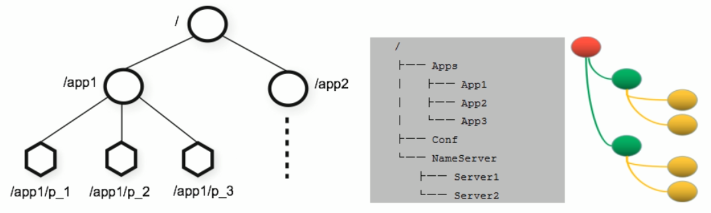
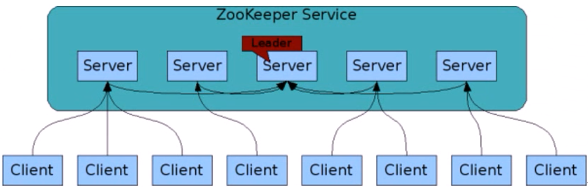

# 1: 微服务

## 1.1：微服务架构演变


## 1.2：单体架构

- 传统架构（单机系统），一个项目一个工程：比如商品、订单、支付、库存、登录、注册等等，统一部署，一个进程
- all in one的架构方式，把所有的功能单元放在一个应用里。然后把整个应用部署到一台服务器上。如果负载能力不行，将整个应用进行 水平复制，进行扩展，然后通过负载均衡实现访问。
- Java实现：JSP、Servlet，打包成一个jar、war部署
- 易于开发和测试:也十分方便部署;当需要扩展时，只需要将war复制多份，然后放到多个服务器 上，再做个负载均衡就可以了。
- 如果某个功能模块出问题，有可能全站不可访问，修改Bug后、某模块功能修改或升级后，需要停掉整个服务，重新整体重新打包、部 署这个应用war包，功能模块相互之间耦合度高,相互影响,不适合当今互联网业务功能的快速迭代。
- 特别是对于一个大型应用，我们不可能吧所有内容都放在一个应用里面，我们如何维护、如何分工合作都是问题。如果项目庞大，管理 难度大
- Web应用服务器：开源的tomcat、jetty、glassfish。商用的有weblogic、websphere、Jboss

## 1.3：SOA

SOA（Service Oriented Architecture）是由多个服务组成的分布式系统

各个子系统之间没有采用统一的通信标准,导致系统间通信与数据交互变得异常复杂

各个服务之间通过ESB(Enterprise Service Bus)进行通信,ESB是一个由大量规则和原则集成的软件架构，可以将一系列不同的应用程序集成 到单个基础架构中，由于没有好的开源方案，只能使用商业公司的产品,因此成本很高

此外ESB属于重量级产品，部署规划异常笨重

ESB的单点依赖和商业ESB的费用问题反而成为了所有服务的瓶颈


## 1.4：微服务

```http
https://www.martinfowler.com/microservices/
```


```http
In short, the microservice architectural style is an approach to developing a single application as a suite of 
small services, each running in its own process and communicating with lightweight mechanisms, often an HTTP 
resource API. These services are built around business capabilities and independently deployable by fully 
automated deployment machinery. There is a bare minimum of centralized management of these services, which may 
be written in different programming languages and use different data storage technologies.

简而言之，微服务架构风格是一种将单个应用程序开发为一套小型服务的方法，每个服务都在自己的进程中运行并与轻量级机制（通常是 HTTP 资源 API）进行通信。这些服务围绕业务功能构建，并可通过全自动部署机制独立部署。对这些服务进行最低限度的集中管理，这些服务可能用不同的编程语言编写并使用不同的数据存储技术。
 												-- James Lewis and Martin Fowler (2014)


亚马逊创始人 Jeff Bezos 说过一句话：“一个最好的团队用两个披萨可以喂饱”。
一个团队控制到6-10人左右
```

- 微服务属于SOA的子集,SOA可以认为面向服务的1.0版本,微服务可以认为是面向服务的2.0版本
- 微服务化的核心就是将传统的一站式应用，根据业务拆分成一个一个的服务，彻底消除强耦合，每一个微服务提供单个业务功能，一个 服务只做一件事。每个服务都围绕着具体业务进行构建，并且能够被独立地部署到生产环境、类生产环境等
- 从技术角度讲每个微服务就是一种小而独立的处理过程，类似与进程的概念，能够自行单独启动或销毁
- 微服务架构（分布式系统），各个模块/服务，各自独立出来，"让专业的人干专业的事"，独立部署。分布式系统中，不同的服务可以使 用各自独立的数据库。
- 服务之间采用轻量级的标准的通信机制,通常是基于HTTP的RESTful (Representational State Transfer 表述性状态转移）API
- 微服务设计的思想改变了原有的企业研发团队组织架构。传统的研发组织架构是水平架构，前端、后端、DBA、测试分别有自己对应的 团队，属于水平团队组织架构。而微服务的设计思想对团队的划分有着一定的影响，使得团队组织架构的划分更倾向于垂直架构，比如 用户业务是一个团队来负责，支付业务是一个团队来负责。但实际上在企业中并不会把团队组织架构拆分得这么绝对，垂直架构只是一 种理想的架构
- 微服务的实现框架有多种，不同的应用架构，部署方式也有不同

## 1.5: 单体架构和微服务比较


## 1.6: 微服务的优缺点

**微服务优点：**

- 每个服务足够内聚，足够小，代码容易理解。这样能聚焦一个简单唯一的业务功能或业务需求。
- 开发简单、开发效率提高，一个服务可能就是专业的只干一件事，微服务能够被小团队单独开发，这个小团队可以是2到5人的开发人员 组成
- 微服务是松耦合的，是有功能意义的服务，无论是在开发阶段或部署阶段都是独立的。
- 微服务能使用不同的语言开发
- 易于和第三方集成，微服务运行容易且灵活的方式集成自动部署，通过持续集成工具，如: Jenkins、Hudson、Bamboo
- 微服务易于被一个开发人员理解、修改和维护，这样小团队能够更关注自己的工作成果，无需通过合作才能体现价值
- 微服务允许你利用融合最新技术。微服务只是业务逻辑的代码，不会和HTML/CSS或其他界面组件混合，即前后端分离
- 每个微服务都有自己的存储能力，一般都有自己的独立的数据库，也可以有统一数据库

**微服务缺点：**

- 微服务把原有的一个项目拆分成多个独立工程，增加了开发、测试、运维、监控等的复杂度
- 微服务架构需要保证不同服务之间的数据一致性，引入了分布式事务和异步补偿机制，为设计和开发带来一定挑战
- 开发人员和运维需要处理分布式系统的复杂性，需要更强的技术能力
- 微服务适用于复杂的大系统，对于小型应用使用微服务，进行盲目的拆分只会增加其维护和开发成本

## 1.7:  微服务技术栈


## 1.8: 常见的微服务框架

```http
https://cn.dubbo.apache.org/zh-cn/index.html
https://spring.io/projects/spring-cloud
```


- Dubbo
  - 阿里开源贡献给了ASF，目前已经是Apache的顶级项目
  - 一款高性能的Java RPC服务框架，微服务生态体系中的一个重要组件
  - 将单体程序分解成多个功能服务模块，模块间使用Dubbo框架提供的高性能RPC通信
  - 内部协调使用 Zookeeper，实现服务注册、服务发现和服务治理
- Spring cloud
  - 一个完整的微服务解决方案，相当于Dubbo的超集
- 微服务框架，将单体应用拆分为粒度更小的单一功能服务
  - 基于HTTP协议的REST风格实现模块间通信

**Spring Boot 和 Spring cloud **

Spring Boot是一个用于简化和加速Java应用程序开发的框架。它是由Spring团队开发的，基于Spring框架构建的一个轻量级、开箱即用的框 架。 

Spring Boot旨在简化传统的Spring应用程序开发过程，通过自动配置和约定优于配置的原则，使得开发人员能够更快地构建独立的、生产级 别的Spring应用程序。它提供了许多开箱即用的特性和功能，包括：

- 自动配置：Spring Boot根据应用程序的依赖和配置自动配置应用程序的各种组件，如数据源、Web服务器、安全性等。这大大简化了 配置的过程。
- 起步依赖：Spring Boot提供了一系列的"起步依赖"，它们是预配置的依赖项集合，可以快速启动特定类型的应用程序。例如，使 用"spring-boot-starter-web"起步依赖可以快速构建一个基于Web的应用程序。
- 嵌入式服务器：Spring Boot内置了常见的嵌入式服务器，如Tomcat、Jetty和Undertow，使得应用程序可以独立运行，无需额外安装 和配置外部服务器。
- 简化的配置：Spring Boot使用约定优于配置的原则，通过提供合理的默认配置来简化应用程序的配置。开发人员只需关注需要修改的 配置部分，而不必处理繁琐的全局配置。
- Spring Boot提供了Actuator模块，可以通过HTTP或JMX暴露应用程序的健康状况、指标和其他运行时信息，便于监控和管理应用程 序。

总的来说，Spring Boot使得Java开发人员能够更快速、更简单地构建独立的、生产级别的应用程序。它提供了许多便利的功能和特性，使得 开发人员可以专注于业务逻辑的实现，而不必花费过多时间和精力在繁琐的配置和集成上。

**Spring Cloud**

Spring Cloud是一系列框架的有序集合。它利用Spring Boot的开发便利性巧妙地简化了分布式系统基础设施的开发，如服务发现注册、配置 中心、消息总线、负载均衡、断路器、数据监控等，都可以用Spring Boot的开发风格做到一键启动和部署。Spring Cloud并没有重复制造轮 子，它只是将目前各家公司开发的比较成熟、经得起实际考验的服务框架组合起来，通过Spring Boot风格进行再封装屏蔽掉了复杂的配置和 实现原理，最终给开发者留出了一套简单易懂、易部署和易维护的分布式系统开发工具包。

 Spring Cloud的本质是在Spring Boot 的基础上，增加了一堆微服务相关的规范，并对应用上下文( Application Context )进行了功能增强。 既然Spring Cloud是规范那么就需要去实现，目前Spring Cloud规范已有Spring官方，Spring Cloud Netflix，Spring Cloud Alibaba等实 现。通过组件化的方式，Spring Cloud将这些实现整合到一起构成全家桶式的微服务技术栈。

Spring Cloud和Spring Boot是两个相互关联但又独立的项目。它们都属于Spring生态系统，用于简化和加速Java应用程序的开发过程。下面 是它们之间的关系：

 Spring Boot：Spring Boot是构建独立、自包含的、可以立即运行的Spring应用程序的框架。它通过提供自动配置、约定优于配置和简化的 开发体验，简化了Spring应用程序的搭建和配置过程。Spring Boot减少了繁琐的配置，使得开发者可以更专注于业务逻辑的实现。Spring  Boot可以独立使用，也可以与其他Spring项目一起使用。 

Spring Cloud：Spring Cloud是用于构建分布式系统和微服务架构的工具集合。它提供了一系列的功能和库，用于解决分布式系统中的常见 问题，如服务注册与发现、负载均衡、断路器、配置管理等。Spring Cloud构建在Spring Boot之上，并使用Spring Boot的自动配置机制来 简化微服务的开发和部署。Spring Cloud提供了许多用于构建可伸缩、弹性和可靠的分布式系统的库和工具。

因此，可以说Spring Cloud是建立在Spring Boot之上的一个框架，它利用了Spring Boot的简化开发和配置的能力，为构建分布式系统提供 了额外的功能和工具。使用Spring Boot和Spring Cloud可以帮助开发者更轻松地构建和部署微服务架构，并解决分布式系统开发中的常见挑 战。

## 1.9: 微服务还是单体

```http
https://martinfowler.com/bliki/MonolithFirst.html
https://www.toutiao.com/article/7173261841408360990/?log_from=c8d3dfbf573b3_1670416613668
```

单体在绝大部分时候是更好的选择，

即单体优先 在微服务大行其道的今天，其实已经有很多大师或者有务实的研发者已经意识到微服务在研发过程中，可能不是你想要的银弹，很多时候起 到了反作用。


软件大师“Martin Fowler”在2015年就提出的“单体优先”（Monolith First）的思想。

 Martin Fowler发现所有成功的微服务都遵循了通用的模式：

- 几乎所有成功的微服务故事，都是从一个变得太大而被分解的单体开始的。
- 几乎所有我听说过的从头开始构建为微服务系统的系统都以严重的麻烦告终。

这种模式导致Martin Fowler的许多同事认为：“你不应该用微服务开始一个新的项目，即使你确信你的应用程序将足够大，值得这么做...”


单体优先：

>单体允许你探索系统的复杂性和组件的边界； 
>
>当复杂性增加时裂变出微服务；
>
> 当你边界和服务管理的业务知识增加时裂变出更多的微服务。 
>
>直接微服务: 
>
>直接使用微服务架构风险太大。


微服务是一种有用的架构，但即使是它们的拥护者也说使用它们会产生显著的“微服务附加费”，这意味着它们只对更复杂的系统有用。 这种附加费，本质上是管理一套服务的成本，将拖慢团队的速度，让使用单体应用成为更简单的选择。 这成为了“单体优先”策略的有力论证，即使你认为它可能会在以后从微服务架构中受益，你也应该在最初使用单体来构建应用。 通过先建立一个单体，你可以在使用微服务设计之前弄清楚什么是正确的边界。这也给了你时间来开发更好粒度的微服务。 单体优先策略一：模块化单体 合乎逻辑的方法是仔细设计一个单体应用，注意软件内部的模块化，包括 API 边界和数据存储方式。 做好这一点之后，从单体应用转向微服务是一件相对简单的事情。 单体优先策略二：边缘剥离 一种更常见的方法是从单体开始，逐渐剥离边缘的微服务。 这种方法可以在微服务架构的核心留下一个实质性的单体。 大多数新的开发都发生在微服务中，而单体是相对静止的。 单体优先策略三：整体替换 很少有人把这种做法看成是一种值得骄傲的做法，然而把单体作为一种牺牲性的架构来建造是有好处的。 不要害怕建造一个你会丢弃的单体应用，特别是如果一个单体应用能让你快速进入市场。 单体优先策略四：粗粒度服务 从几个粗粒度的服务开始，这些服务比你最终得到的微服务要大。 使用这些粗粒度的服务来习惯与多个服务一起工作。 同时享受这样一个事实，即这种粗粒度减少了你必须做的服务间重构的数量。 然后，随着边界的稳定，分解为更细粒度的服务。 “单体优先”的思想，目前已逐渐开始成为是业界普遍共识。现在已经属于后微服务时代! 在一个人数不多、资金不是无限充裕，需要快速将产品推向市场的团队，建议使用“单体优先”的实现方式。 在很多团队中，使用微服务其实是一种Hype Driven Development（炒作/简历驱动开发），不是为了真正为了解决业务问题。 使用“单体优先”，是一个务实的选择！试想如果是你自己创业，你会是选择“单体”还是“微服务”，那么请为你的企业进行务实的选择。

# 2: zookeeper

## 2.1: zookeeper介绍


ZooKeeper 的由来

下面这段内容摘自《从Paxos到Zookeeper 》第四章第一节的某段内容：

>Zookeeper最早起源于雅虎研究院的一个研究小组。在当时，研究人员发现，在雅虎内部很多大型系统基本都需要依赖一个类似的系 统来进行分布式协调，但是这些系统往往都存在分布式单点问题。所以，雅虎的开发人员就试图开发一个通用的无单点问题的分布式 协调框架，以便让开发人员将精力集中在处理业务逻辑上。
>
>关于“ZooKeeper”这个项目的名字，其实也有一段趣闻。在立项初期，考虑到之前内部很多项目都是使用动物的名字来命名的（例如著 名的Pig项目),雅虎的工程师希望给这个项目也取一个动物的名字。时任研究院的首席科学家RaghuRamakrishnan开玩笑地说：“在这 样下去，我们这儿就变成动物园了！”此话一出，大家纷纷表示就叫动物园管理员吧一一一因为各个以动物命名的分布式组件放在一 起，雅虎的整个分布式系统看上去就像一个大型的动物园了，而Zookeeper正好要用来进行分布式环境的协调一一于是，Zookeeper 的名字也就由此诞生了。

zookeeper是一个开源的分布式协调服务，zookeeper框架最初是在Yahoo上构建，用于以简单而稳健的方式访问它们的应用程序。后来，Apache ZooKeeper成为Hadoop，HBase和其他分布式框架使用的有组织服务的标准。例如，Hbase适用zookeeper跟踪分布式数据的状态。ZooKeeper 的设计目标是将那些复杂且容易出错的分布式一致性服务封装起来，构成一个高效可靠的原语集，并以一系 列简单易用的接口提供给用户使用。

zookeeper是一个典型的分布式数据一致性解决方案，分布式应用程序可以基于zookeeper实现诸如数据发布/订阅、负载均衡、命名服 务、分布式协调/通知、集群管理、Master 选举、分布式锁和分布式队列等功能。

zookeeper一个最常用的使用场景就是用于担任服务生产者和服务消费者的注册中心。生产者将自己提供的服务注册到zookeeper中心，服务消费者在进行服务调用的时候先到zookeeper中查找服务，获取到生产者的详细信息，再去调用服务生产者的内容和数据。在 Dubbo架构中 Zookeeper 就担任了注册中心这一角色。

官网：

```http
https://zookeeper.apache.org/
```

官方文档：

```http
https://zookeeper.apache.org/doc/
```

## 2.2: zookeeper工作原理

zookeeper是一个分布式服务框架，它主要是用来解决分布式应用中经常遇到的一些数据管理问题，如：命名服务，状态同步，配置中心，集群管理等。

### 2.2.1：zookeeper功能

#### 2.2.1.1： 命名服务

命名服务是分布式系统中比较常见的一类场景。命名服务是分布式系统最基本的公共服务之一。在分布式系统中，被命名的实体通常可以是集群中的机器，提供的服务地址或远程对象等---这些我们可以统称为它们为名字(Name)，其中较为常见的就是一些分布式服务框架中的服务地址列表，通过使用命名服务，客户端应用能够根据指定名字来获取资源的实体、服务地址和提供者的信息等。

**zookeeper 数据模型**

```http
在 Zookeeper 中，节点分为两类
第一类是指构成Zookeeper集群的主机，称之为主机节点
第二类则是指内存中zookeeper数据模型中的数据单元，用来存储各种数据内容，称之为数据节点 ZNode。
Zookeeper内部维护了一个层次关系(树状结构)的数据模型，它的表现形式类似于Linux的文件系统，甚至操作的种类都一致。
Zookeeper数据模型中有自己的根目录(/)，根目录下有多个子目录，每个子目录后面有若干个文件,由斜杠(/)进行分割的路径，就是一个ZNode,每个 ZNode上都会保存自己的数据内容和一系列属性信息.
```



#### 2.2.1.2: 状态同步

每个节点除了存储数据内容和node节点状态信息之外，还存储了已经注册的状态信息，当有些节点或APP不可用，就将当前状态同步给其他服务。

#### 2.2.1.3：配置中心

现在我们大部分应用都是采用分布式开发，搭建到不同的服务器上，我们的配置文件，同一个应用程序的配置文件一样，还有就是多个程序存在相同的配置，当我们配置文件中有个配置属性需要改变，需要改变每个程序的配置属性，这样会很麻烦的去修改配置，那么 可用使用ZooKeeper 来实现配置中心

zookeeper采用的是推拉相结合的方式：客户端向服务端注册自己需要关注的节点，一旦该节点的数据发生变更，那么服务端就会向相应的 客户端发送Watcher事件通知，客户端接收到这个消息通知后，需要主动到服务端获取最新的数据。

Apollo（阿波罗）是携程框架部门研发的开源配置管理中心,此应用比较流行

#### 2.2.1.4：集群管理

所谓集群管理，包括集群监控和集群控制两大块，前者侧重对集群运行时状态的收集，后者则是对集群进行操作与控制，在日常开发和运维 过程中，我们经常会有类似于如下的需求：

- 希望知道当前集群中究竟有多少机器在工作。
- 对集群中每台机器的运行时状态进行数据收集。对集群中机器进行上下线操作。

ZooKeeper 具有以下两大特性:

- 客户端如果对ZooKeeper 的一个数据节点注册 Watcher监听，那么当该数据节点的内容或是其子节点列表发生变更时，ZooKeeper 服 务器就会向已注册订阅的客户端发送变更通知。
- 对在ZooKeeper上创建的临时节点，一旦客户端与服务器之间的会话失效，那么该临时节点也就被自动清除。

Watcher（事件监听器）是zookeeper中的一个很重要的特性。zookeeper允许用户在指定节点上注册一些watcher，并且在一些特定的事件触发的时候，ZooKeeper 服务端会将事件通知到感兴趣的客户端上去，该机制是 Zookeeper 实现分布式协调服务的重要特性。

### 2.2.2：ZooKeeper 服务流程


1.  生产者启动
2. 生产者注册到zookeeper
3. 消费者启动并订阅频道
4. zookeeper通知消费者事件
5. 消费者调用生产者
6. 监控中心负责统计和监控服务状态

## 2.3: ZooKeeper 单机部署

官方文档：

```http
https://zookeeper.apache.org/doc/r3.9.2/zookeeperStarted.html#sc_InstallingSingleMode
```

### 2.3.1: 配置java环境

```http
https://zookeeper.apache.org/doc/r3.9.2/zookeeperAdmin.html
```

范例: 安装 JDK-11

```BASH
root@u2004:~# apt update && apt -y install openjdk-11-jdk
root@u2004:~# java -version
openjdk version "11.0.22" 2024-01-16
OpenJDK Runtime Environment (build 11.0.22+7-post-Ubuntu-0ubuntu220.04.1)
OpenJDK 64-Bit Server VM (build 11.0.22+7-post-Ubuntu-0ubuntu220.04.1, mixed mode, sharing)
```

### 2.3.2：部署 ZooKeeper

#### 2.3.2.1： 二进制安装

历史版本下载：

```http
https://archive.apache.org/dist/zookeeper/
```

范例：安装单机zookeeper:

```bash
root@u2004:~# wget -P /usr/local/src/ https://archive.apache.org/dist/zookeeper/zookeeper-3.8.4/apache-zookeeper-3.8.4-bin.tar.gz

root@u2004:~# tar xf /usr/local/src/apache-zookeeper-3.8.4-bin.tar.gz -C /usr/local/

root@u2004:~# ln -s /usr/local/apache-zookeeper-3.8.4-bin /usr/local/zookeeper

root@u2004:~# echo 'PATH=/usr/local/zookeeper/bin:$PATH' > /etc/profile.d/zookeeper.sh
root@u2004:~# . /etc/profile.d/zookeeper.sh

root@u2004:~# ll /usr/local/zookeeper/
total 48
drwxr-xr-x  6 root   root    4096 May 30 01:16 ./
drwxr-xr-x 11 root   root    4096 May 30 01:17 ../
drwxr-xr-x  2 alblue alblue  4096 Feb 12 22:15 bin/
drwxr-xr-x  2 alblue alblue  4096 Feb 12 22:15 conf/
drwxr-xr-x  5 alblue alblue  4096 Feb 12 22:16 docs/
drwxr-xr-x  2 root   root    4096 May 30 01:16 lib/
-rw-r--r--  1 alblue alblue 11358 Feb 12 22:15 LICENSE.txt
-rw-r--r--  1 alblue alblue  2084 Feb 12 22:15 NOTICE.txt
-rw-r--r--  1 alblue alblue  2335 Feb 12 22:15 README.md
-rw-r--r--  1 alblue alblue  3570 Feb 12 22:15 README_packaging.md

root@u2004:~# cp /usr/local/zookeeper/conf/zoo_sample.cfg /usr/local/zookeeper/conf/zoo.cfg

# 默认配置可不做修改
root@u2004:~# grep -v "#" /usr/local/zookeeper/conf/zoo.cfg
tickTime=2000   #"滴答时间"，用于配置Zookeeper中最小的时间单元长度，单位毫秒，是其它时间配置的基础
initLimit=10    #初始化时间，包含启动和数据同步，其值是tickTime的倍数
syncLimit=5     #正常工作，心跳监测的时间间隔，其值是tickTime的倍数
dataDir=/tmp/zookeeper  #配置Zookeeper服务存储数据快照的目录,基于安全,可以修改为 dataDir=/usr/local/zookeeper/data 
dataLogDir=/usr/local/zookeeper/logs  #指定日志路径，默认与 dataDir 一致,事务日志对性能影响非常大，强烈建议事务日志目录和数据目录分开，如果后续修改路径，需要先删除中dataDir中旧的事务日志，否则可能无法启动
clientPort=2181 #配置当前Zookeeper服务对外暴露的端口，用户客户端和服务端建立连接会话
preAllocSize：#为事务日志预先开辟磁盘空间。默认是64M，意味着每个事务日志初始大小64M。如果ZooKeeper产生快照频率较大，可以考虑减小这个参数，因为每次快照后都会切换到新的事务日志，即使前面的64M没有写满。


snapCount：#该配置项指定ZooKeeper在将内存数据库保存为快照之前，需要先写多少次事务日志，即，每写几次事务日志就快照一次。默认值为100000。为了防止所有的ZooKeeper服务器节点同时生成快照(一般情况下，所有集群的实例的配置文件是完全相同的)，当某节点的先写事务数量在(snapCount/2+1,snapCount)范围内时挑选一个随机值做为该节点拍快照的时机。

autopurge.snapRetainCount=3 #3.4.0中的新增功能：启用后，ZooKeeper 自动清除功能,会将只保留此最新3个快照和相应的事务日志,并分别保留在dataDir 和dataLogDir中，删除其余部分，默认值为3,最小值为3
autopurge.purgeInterval=24  #3.4.0及之后版本，ZK提供了自动清理日志和快照文件的功能，这个参数指定了清理频率，单位是小时，需要配置一个1或更大的整数，默认是 0，表示不开启自动清理功能

```

### 2.3.3:  启动 ZooKeeper

```bash
#前台启动观察启动过程
[root@ubuntu1804 ~]#zkServer.sh start-foreground


#后台启动
root@u2004:~# zkServer.sh start
/usr/bin/java
ZooKeeper JMX enabled by default
Using config: /usr/local/zookeeper/bin/../conf/zoo.cfg
Starting zookeeper ... STARTED

#注意:如果配置service,zkServer.sh和systemctl不要混用,否则无法启动
```

### 2.3.4: 验证zookeeper

```bash
root@u2004:~# zkServer.sh status
/usr/bin/java
ZooKeeper JMX enabled by default
Using config: /usr/local/zookeeper/bin/../conf/zoo.cfg
Client port found: 2181. Client address: localhost. Client SSL: false.
Mode: standalone


root@u2004:~# ss -ntl | grep 2181
LISTEN  0        50                     *:2181                 *:* 
```

### 2.3.5: 一键安装zookeeper脚本

```bash
#!/bin/bash

ZK_VERSION=3.8.4
ZK_URL=https://mirrors.tuna.tsinghua.edu.cn/apache/zookeeper/zookeeper-${ZK_VERSION}/apachezookeeper-${ZK_VERSION}-bin.tar.gz

INSTALL_DIR=/usr/local/zookeeper

HOST=`hostname -I|awk '{print $1}'`

. /etc/os-release

color () {
    RES_COL=60
    MOVE_TO_COL="echo -en \\033[${RES_COL}G"
    SETCOLOR_SUCCESS="echo -en \\033[1;32m"
    SETCOLOR_FAILURE="echo -en \\033[1;31m"
    SETCOLOR_WARNING="echo -en \\033[1;33m"
    SETCOLOR_NORMAL="echo -en \E[0m"
    echo -n "$1" && $MOVE_TO_COL
    echo -n "["
    if [ $2 = "success" -o $2 = "0" ] ;then
        ${SETCOLOR_SUCCESS}
        echo -n $" OK "
    elif [ $2 = "failure" -o $2 = "1" ] ;then
        ${SETCOLOR_FAILURE}
        echo -n $"FAILED"
    else
        ${SETCOLOR_WARNING}
        echo -n $"WARNING"
    fi
    ${SETCOLOR_NORMAL}
    echo -n "]"
    echo
}

install_jdk() {
    if [ $ID = 'centos' -o  $ID = 'rocky' ];then
       yum -y install java-1.8.0-openjdk-devel || { color "安装JDK失败!" 1; exit 1; }
    else
       apt update
       apt install openjdk-11-jdk -y || { color "安装JDK失败!" 1; exit 1; }
        #apt install openjdk-8-jdk -y || { color "安装JDK失败!" 1; exit 1; }
    fi
   java -version
}

install_zookeeper() {
    wget -P /usr/local/src/ --no-check-certificate $ZK_URL || { color  "下载失败!" 1 ;exit ; }
   tar xf /usr/local/src/${ZK_URL##*/} -C /usr/local
    ln -s /usr/local/apache-zookeeper-*-bin/ ${INSTALL_DIR}
    echo "PATH=${INSTALL_DIR}/bin:$PATH" > /etc/profile.d/zookeeper.sh
   . /etc/profile.d/zookeeper.sh
    mkdir -p ${INSTALL_DIR}/data
    cat > ${INSTALL_DIR}/conf/zoo.cfg <<EOF
tickTime=2000
initLimit=10
syncLimit=5
dataDir=${INSTALL_DIR}/data
datalogDir=${INSTALL_DIR}/logs
clientPort=2181
maxClientCnxns=128
autopurge.snapRetainCount=3
autopurge.purgeInterval=24
EOF
 cat > /lib/systemd/system/zookeeper.service <<EOF
[Unit]
Description=zookeeper.service
After=network.target
[Service]
Type=forking
#Environment=${INSTALL_DIR}
ExecStart=${INSTALL_DIR}/bin/zkServer.sh start
ExecStop=${INSTALL_DIR}/bin/zkServer.sh stop
ExecReload=${INSTALL_DIR}/bin/zkServer.sh restart
[Install]
WantedBy=multi-user.target
EOF
   systemctl daemon-reload
   systemctl enable --now zookeeper.service
   systemctl is-active zookeeper.service
 if [ $? -eq 0 ] ;then
       color "zookeeper 安装成功!" 0
    else
       color "zookeeper 安装失败!" 1
        exit 1
    fi
}

install_jdk
install_zookeeper
```

## 2.4: zookeeper集群部署

### 2.4.1：zookeeper集群介绍

ZooKeeper集群用于解决单点和单机性能及数据高可用等问题。

#### 2.4.1.1：集群架构




zookeeper集群基于Master/Slave模型

处于主要地位负责处理写操作的主机称为leader节点，处于次要地位负责处理读操作的主机称为follwer节点

当进行写操作，由master完成，在同步到其他slave节点，而且要求在保证写操作在所有节点的总数过半后，才会认为写操作成功

生产中读取的方式一般是以异步复制方式来实现。

对于n台server，每个server都知道彼此存在。只要有>n/2台server节点可用，整个zookeeper系统保持可用。因此zokeeper集群通常由奇数台server节点组成。

官方链接: 下图表示读的比例越高,性能越好

```http
http://zookeeper.apache.org/doc/r3.7.0/zookeeperOver.html
```


#### 2.4.1.2: 集群角色


| 序号 | 角色             | 职责描述                                                     |
| ---- | ---------------- | ------------------------------------------------------------ |
| 1    | 领导者(Leader)   | 负责处理写入请求的，事务请求的唯一调度和处理者,负责进行投票发起和决议，更新系统状态 |
| 2    | 跟随者(Follower) | 接收客户请求并向客户端返回结果，在选Leader过程中参与投票     |
| 3    | 观察者(Observer) | 转交客户端写请求给leader节点，和同步leader状态 和Follower唯一区别就是不参与Leader投票,也不参与写操作的"过半写成功"策略 |
| 4    | 学习者(Learner)  | 和leader进行状态同步的节点统称Learner，包括:Follower和Observer |
| 5    | 客户端(client)   | 请求发起方                                                   |

#### 2.4.1.3： 选举过程

**节点角色状态：**

- LOOKING：寻找 Leader 状态，处于该状态需要进入选举流程
- LEADING：领导者状态，处于该状态的节点说明是角色已经是Leader 
- FOLLOWING：跟随者状态，表示 Leader已经选举出来，当前节点角色是follower 
- OBSERVER：观察者状态，表明当前节点角色是 observer

**选举 ID:**

- ZXID（zookeeper transaction id）：每个改变 Zookeeper状态的操作都会自动生成一个对应的zxid。ZXID最大的节点优先选为Leader
- myid：服务器的唯一标识(SID)，通过配置 myid 文件指定，集群中唯一,当ZXID一样时,myid大的节点优先选为Leader

**ZooKeeper 集群选举过程：**

当集群中的zookeeper节点启动以后，会根据配置文件中指定的zookeeper节点地址进行leader选择操作，过程如下：

- 每个zookeeper都会发出投票，由于是第一次选举leader，因此每个节点都会把自己当作leader角色选举，每个zookeeper的投票中都会包含自己的myid和zxid， 此时zookeeper 1 的投票为myid 为 1，初始zxid有一个初始值0x0，后期会随着数据更新而自动变 化，zookeeper 2 的投票为myid 为2，初始zxid 为初始生成的值。

- 每个节点接受并检查对方的投票信息，比如投票时间，是否状态为LOOKING状态的投票。

- 对比投票，优先检查zxid，如果zxid不一样则zxid大的为leader，如果zxid相同则继续对比myid，myid大的一方为leader

  成为leader的必要条件：leader要具有最高的zxid，集群中大多数的机器（至少n/2+1）得到响应并从  follower 中选出的 Leader。

心跳机制：leader和follower利用PING来感知对方是否存活，当leader无法响应PING时，将重新发起leader选举.

当leader服务器出现网络中断，崩溃退出与重启等异常情况，ZAB(Zookeeper Atomic Broadcast) 协议就会进入恢复模式并选举产生新 的Leader服务器。这个过程大致如下：

- Leader Election（选举阶段）：节点在一开始都处于选举阶段，只要有一个节点得到超半数节点的票数，它就可以当选准 leader。
- Discovery（发现阶段）：在这个阶段，followers 跟准 leader 进行通信，同步 followers 最近接收的事务提议。
- Synchronization（同步阶段）:同步阶段主要是利用 leader 前一阶段获得的最新提议历史，同步集群中所有的副本。同步完成之后 准  leader 才会成为真正的 leader。
- Broadcast（广播阶段） ：到了这个阶段，Zookeeper 集群才能正式对外提供事务服务，并且 leader 可以进行消息广播。同时如果有 新的节点加入，还需要对新节点进行同步

**ZAB协议介绍**

```http
ZAB（ZooKeeper Atomic Broadcast 原子广播） 协议是为分布式协调服务 ZooKeeper 专门设计的一种支持崩溃恢复的原子广播协议。 在 
ZooKeeper 中，主要依赖 ZAB 协议来实现分布式数据一致性，基于该协议，ZooKeeper 实现了一种主备模式的系统架构来保持集群中各个副本之
间的数据一致性。
```

#### 2.4.1.4: zookepeer集群特性

整个集群中只要有超过集群数量一半的zookeeper工作是正常的，那么整个集群对外就是可用的。

假如有 2 台服务器做了一个 Zookeeper 集群，只要有任何一台故障或宕机，那么这个 ZooKeeper集群就不可用了，因为剩下的一台没有超 过集群一半的数量，但是假如有三台zookeeper 组成一个集群， 那么损坏一台就还剩两台，大于 3台的一半，所以损坏一台还是可以正常运 行的，但是再损坏一台就只剩一台集群就不可用了。那么要是 4 台组成一个zookeeper集群，损坏一台集群肯定是正常的，那么损坏两台就 还剩两台，那么2台不大于集群数量的一半，所以 3 台的 zookeeper 集群和 4 台的 zookeeper集群损坏两台的结果都是集群不可用，以此类 推 5 台和 6 台以及 7 台和 8台都是同理

#### 2.4.1.5：zookeeper事务日志和快照

zookeeper集群中的每个服务器节点每次接收到写操作请求时，都会先将这次请求发送给leader，leader将这次写操作转换为带有状态的事务，然后leader会对这次写操作以便进行协调，当协调通过(大多数节点允许这次写)后，leader通知所有的服务器节点，让它们将这 次写操作应用到内存数据库中，并将其记录到事务日志中。

当事务日志记录的次数达到一定数量后(默认10W次)，就会将内存数据库序列化一次，使其持久化保存到磁盘上，序列化后的文件称为"快照 文件"。每次拍快照都会生成新的事务日志。

### 2.4.2：zookeeper集群部署

官方文档：

```http
https://zookeeper.apache.org/doc/r3.8.4/zookeeperAdmin.html
```

#### 2.4.2.1： 环境准备

```bash
zoo1 192.168.159.128
zoo2 192.168.159.129
zoo3 192.168.159.131

# 在三个节点都安装JDK11
root@zoo1:~# apt update && apt -y install openjdk-11-jdk
root@zoo2:~# apt update && apt -y install openjdk-11-jdk
root@zoo3:~# apt update && apt -y install openjdk-11-jdk
```

#### 2.4.2.2:  在所有节点下载并解压缩 ZooKeeper 包文件

```bash
root@zoo1:~# wget -P /usr/local/src/ https://archive.apache.org/dist/zookeeper/zookeeper-3.8.4/apache-zookeeper-3.8.4-bin.tar.gz

root@zoo1:~# tar xf /usr/local/src/apache-zookeeper-3.8.4-bin.tar.gz -C /usr/local/

root@zoo1:~# ln -s /usr/local/apache-zookeeper-3.8.4-bin /usr/local/zookeeper

root@zoo1:~# echo 'PATH=/usr/local/zookeeper/bin:$PATH' > /etc/profile.d/zookeeper.sh
root@zoo1:~# . /etc/profile.d/zookeeper.sh
```

#### 2.4.2.3: 准备配置文件

```bash
#三个节点都要创建数据目录
root@zoo1:~# mkdir /usr/local/zookeeper/data

# 基于模板配置文件生成配置文件
root@zoo1:~# cp /usr/local/zookeeper/conf/zoo_sample.cfg /usr/local/zookeeper/conf/zoo.cfg

# 修改配置文件
root@zoo1:~# vim /usr/local/zookeeper/conf/zoo.cfg
# 配置文件内容
root@zoo1:~# vim /usr/local/zookeeper/conf/zoo.cfg
tickTime=2000  #服务器与服务器之间的单次心跳检测时间间隔，单位为毫秒
initLimit=10  #集群中leader 服务器与follower服务器初始连接心跳次数，即多少个 2000 毫秒
syncLimit=5  #leader 与follower之间连接完成之后，后期检测发送和应答的心跳次数，如果该follower在设置的时间内(5*2000)不能与 leader 进行通信，那么此 follower将被视为不可用。
dataDir=/usr/local/zookeeper/data #自定义的zookeeper保存数据的目录
clientPort=2181 #客户端连接 Zookeeper 服务器的端口，Zookeeper会监听这个端口，接受客户端的访问请求
maxClientCnxns=128 #单个客户端IP 可以和zookeeper保持的连接数
autopurge.snapRetainCount=3 #3.4.0中的新增功能：启用后，ZooKeeper 自动清除功能,会将只保留此最新3个快照和相应的事务日志,并分别保留在dataDir 和dataLogDir中，删除其余部分，默认值为3,最小值为3
autopurge.purgeInterval=24  #3.4.0及之后版本，ZK提供了自动清理日志和快照文件的功能，这个参数指定了清理频率，单位是小时，需要配置一个1或更大的整数，默认是 0，表示不开启自动清理功能


#格式: server.MyID服务器唯一编号=服务器IP:Leader和Follower的数据同步端口(只有leader才会打开):Leader和Follower选举端口(L和F都有)
server.1=192.168.159.128:2888:3888
server.2=192.168.159.129:2888:3888
server.3=192.168.159.131:2888:3888
#如果添加节点,只需要在所有节点上添加新节点的上面形式的配置行,在新节点创建myid文件,并重启所有节点服务即可

```

#### 2.4.2.4: 在各个节点生成ID文件

注意: 各个myid文件的内容要和zoo.cfg文件相匹配

```bash
root@zoo1:~# echo 1 > /usr/local/zookeeper/data/myid
root@zoo2:~# echo 2 > /usr/local/zookeeper/data/myid
root@zoo3:~# echo 3 > /usr/local/zookeeper/data/myid
```

#### 2.4.2.5: 各服务器启动 Zookeeper

```bash
#注意:在所有三个节点快速启动服务,否则会造成集群失败
root@zoo1:~# zkServer.sh start
root@zoo2:~# zkServer.sh start
root@zoo3:~# zkServer.sh start
```

#### 2.4.5.6: 查看集群状态

```bash
#follower会监听3888/tcp端口
root@zoo2:~# zkServer.sh status
/usr/bin/java
ZooKeeper JMX enabled by default
Using config: /usr/local/zookeeper/bin/../conf/zoo.cfg
Client port found: 2181. Client address: localhost. Client SSL: false.
Mode: follower
root@zoo2:~# ss -ntl | grep 888
LISTEN 0      50     [::ffff:192.168.159.129]:3888               *:* 


#只有leader监听2888/tcp端口
root@zoo3:~# zkServer.sh status
/usr/bin/java
ZooKeeper JMX enabled by default
Using config: /usr/local/zookeeper/bin/../conf/zoo.cfg
Client port found: 2181. Client address: localhost. Client SSL: false.
Mode: leader
root@zoo3:~# ss -ntl | grep 888
LISTEN 0      50     [::ffff:192.168.159.131]:2888               *:*            
LISTEN 0      50     [::ffff:192.168.159.131]:3888               *:* 
```

## 2.5: 客户端访问

### 2.5.1: 命令行客户端访问zookeeper

```bash
#可连接至zookeeper 集群中的任意一台zookeeper 节点进行以下操作,zkCli.sh 默认连接本机
root@zoo3:~# zkCli.sh -server 192.168.159.128:2181
[zk: 192.168.159.128:2181(CONNECTED) 0] ls /
[zookeeper]

[zk: 192.168.159.128:2181(CONNECTED) 1]  #输入TAB键可以列出所有支持命令
addWatch               addauth                close                  config                 connect                create                 delete                 deleteall              
delquota               get                    getAcl                 getAllChildrenNumber   getEphemerals          history                listquota              ls                     
printwatches           quit                   reconfig               redo                   removewatches          set                    setAcl                 setquota               
stat                   sync                   version                whoami  


#默认创建持久节点,即退出不丢失,create -e 可以创建临时节点(退出就丢失)
#持久节点才支持创建子节点,临时节点不支持,如: create /app1/subapp1 "subdata" ，不能递归创建
[zk: 192.168.159.128:2181(CONNECTED) 1] create /app1 "hello, zookeeper"
Created /app1
[zk: 192.168.159.128:2181(CONNECTED) 2] ls /
[app1, zookeeper]

# get命令可以查询到详细信息
[zk: 192.168.159.128:2181(CONNECTED) 3] get /app1
hello, zookeeper
#修改已有节点的值
[zk: 192.168.159.128:2181(CONNECTED) 4] set /app1 "hello,cloudnative"
[zk: 192.168.159.128:2181(CONNECTED) 5] get /app1 
hello,cloudnative
#删除不包含子节点的节点(相当于rmdir),如果想删除所有节点内的数据,使用deleteall /path(相当于rm -rf)
[zk: 192.168.159.128:2181(CONNECTED) 6] delete /app1 
[zk: 192.168.159.128:2181(CONNECTED) 7] ls /
[zookeeper]

# 查看已知节点元数据
[zk: 192.168.159.128:2181(CONNECTED) 8] stat /zookeeper
zxid = Ox0 #节点创建时的zxid
ctime = Thu Jan 01 08:00:00 CST 1970    #节点创建时间
mzxid = Ox0 #节点最近一次更新时的zxid
mtime = Thu Jan 01 08:00:00 cST 1970    #节点最近一次更新的时间
pzxid = Ox0                             #父节点创建时的zxid
cversion = -1                           #子节点数据更新次数
dataversion = 0                         #本节点数据更新次数
aclversion = o                          #节点ACL(授权信息)的更新次数
ephemera10wner = Ox0                    #持久节点值为0，临时节点值为sessionid
dataLength = 0                          #节点数据长度
numchi1dren = 1                         #子节点个数

[zk: 192.168.159.128:2181(CONNECTED) 9] get /zookeeper/config 
server.1=192.168.159.128:2888:3888:participant
server.2=192.168.159.129:2888:3888:participant
server.3=192.168.159.131:2888:3888:participant
version=0

```

### 2.5.2: 图形化客户端 ZooInspector

github连接

```http
https://github.com/zzhang5/zooinspector
```

#### 2.5.2.1: Windows 客户端使用

先下载并安装 JDK 

注意: Oracle官网需要登录才能下载

```http
https://www.oracle.com/java/technologies/javase/javase-jdk8-downloads.html
```

运行下面命令

```bash
D:\技术\消息队列与微服务文件\ZooInspector\build>java -jar zookeeper-dev-ZooInspector.jar
#或者直接使用Linux上面编译生成的文件zookinspector-1.0-SNAPSHOT-pkg.tar在Windows中解压缩,直接运行里的zooinspector.bat即
```

### 2.5.3: python访问zookeeper

```bash
root@zoo1:~# apt update && apt -y install python3 python3-kazoo
root@zoo1:~# cat zoo_test.py 
#!/usr/bin/python3
from kazoo.client import KazooClient
zk = KazooClient(hosts='192.168.159.128:2181')
zk.start()

# 创建节点：makepath 设置为 True ，父节点不存在则创建，其他参数不填均为默认
zk.create('/zkapp/test',b'this is a test',makepath=True)

# 操作完后关闭zk连接
data=zk.get('/zkapp/test')
print(data)
zk.stop()
```

# 3: Kafka

## 3.1: 消息队列简介

### 3.1.1： 消息队列历史

1983 年在MIT 工作的26岁的印度小伙 Vivek Ranadive突发奇想，以前我们的软件相互通信，都是点对点的，而且要实现相同的协议，能不 能有一种专门用来通信的中间件，就像主板（BUS）一样，把不同的软件集成起来呢？于是他搞了一家公司（Teknekron），开发了世界上 第一个消息队列软件The Information Bus(TIB)。最开始的时候，它被高盛这些公司用在金融交易里面。因为TIB 实现了发布订阅 (Publish/Subscribe)模型，信息的生产者和消费者可以完全解耦，这个特性引起了电信行业特别是新闻机构的注意。1994年路透社收购了 Teknekron。

TIB 的成功马上引起了业界大佬IBM 的注意，他们研发了自己的IBM MQ（IBMWesphere）。后面微软也加入了这场竟争，研发了MSMQ。 这个时候，每个厂商的产品是孤立的，大家都有自己的技术壁垒。比如一个应用订阅了IBM MQ 的消息，如果有要订阅MSMQ 的消息，因为 协议、API 不同，又要重复去实现。

J2EE 制定了JDBC 的规范，那么那么各个数据库厂商自己去实现协议，提供jar 包，在Java 里面就可以使用相同的API 做操作不同的数据库 了。MQ 产品的问题也是一样的，2001 年的时候，SUN 公司发布了 JMS 规范，它想要在各大厂商的MQ 上面统一包装一层Java 的规范，大 家都只需要针对API 编程就可以了，不需要关注使用了什么样的消息中间件，只要选择合适的MQ 驱动。但是JMS 只适用于Java 语言，它是 跟语言绑定的，没有从根本上解决这个问题（只是一个API）。

所以在2006 年的时候，AMQP (Advanced Message Queuing Protocol)规范发布了。它是跨语言和跨平台的，真正地促进了消息队列的繁 荣发展。

2007 年的时候，Rabbit 技术公司基于Erlang语言开发了符合AMQP 规范RabbitMQ 1.0。从最开始用在金融行业里面，现在RabbitMQ 已经 在世界各地的公司中遍地开花。国内的绝大部分大厂都在用RabbitMQ，包括头条，美团，滴滴（TMD），去哪儿，艺龙，淘宝也有用。

### 3.1.2：MQ定义

```http
# 阿里云消息队列
https://www.aliyun.com/product/ons?spm=5176.234368.h2v3icoap.427.2620db25lcHi1Q&amp;aly_as=Tz_Lue_o
```

在分布式u场景中，相对于大量的用户请求来说，内部的功能主机之间，模块中间，数据传递的数据量是无法想象的，因为一个用户请求，会涉及到各种内部的业务逻辑跳转等操作。那么，在大量用户的业务场景中，如何保证所有的内部业务逻辑请求都处于稳定而且快捷的 数据传递呢? 消息队列(Message Queue)技术可以满足此需求

消息队列(Message Queue，简称 MQ) 是构建分布式互联网应用的基础设施，通过MQ实现的松耦合架构设计可以提高系统可用性以及可扩展性，是适用于现在应用的最佳设计方案。

消息队列是一种异步的服务间通信方式，适用于无服务器和微服务架构。消息在被处理和删除之前一直存储在队列上。每条消息仅可被一位用户处理一次。消息队列可被用于分离重量级处理，缓冲或批处理工作以及缓解高峰期工作负载。

### 3.1.3：MQ使用场合


消息队列作为高并发系统的核心组件之一，能够帮助业务系统结构提升开发效率和系统稳定性

消息队列主要有以下应用场景

- 削峰填谷

  比如电商业务中的秒杀，抢红包，企业开门红等大型活动时都会带来较高的流量脉冲，或因没做相应的保护而导致系统超负荷甚至崩 溃，或因限制太过导致请求大量失败而影响用户体验，消息队列可提供削峰填谷的服务来解决该问题。

- 异步解耦

  交易系统作为电商的最核心系统，每笔交易订单数据会引起几百个下游业务系统的关注，包括物流，购物车，积分，流计分析等等，整体业务系统庞大而且复杂，消息队列可实现异步通信和应用解耦，确保主站业务的连续性。

- 顺序收发

  细数日常中需要保证顺序的应用场景非常多，例如证券交易过程时间优先原则，交易系统中的订单创建、支付、退款等流程，航班中的 旅客登机消息处理等等。与先进先出FIFO（First In First Out）原理类似，消息队列提供的顺序消息即保证消息FIFO。

- 分布式事务一致性

  交易系统，支付红包等场景需要确保数据的最终一致性，大量引入消息队列的分布式事务，既可以实现系统之间的解耦，又可以保证最 终的数据一致性。

- 大数据分析

  数据在“流动”中产生价值，传统数据分析大多是基于批量计算模型，而无法做到实时的数据分析，利用消息队列与流式计算引擎相结 合，可以很方便的实现业务数据的实时分析。

- 分布式缓存同步

  电商的大促，各个分会场琳琅满目的商品需要实时感知价格变化，大量并发访问数据库导致会场页面响应时间长，集中式缓存因带宽瓶 颈，限制了商品变更的访问流量，通过消息队列构建分布式缓存，实时通知商品数据的变化

- 蓄流压测

  线上有些链路不方便做压力测试，可以通过堆积一定量消息在放开来压测

### 3.1.4：主流MQ

目前主流的消息队列软件有 Kafka、RabbitMQ、ActiveMQ、RocketMQ等，还有相对小众的消息队列软件如ZeroMQ、Apache Qpid 等。


## 3.2: kafka介绍


阿里云消息队列：

```http
https://www.aliyun.com/product/ons?spm=5176.234368.h2v3icoap.427.2620db25lcHi1Q&amp;aly_as=Tz_Lue_o
```

kafka被称为下一代分布式消息系统，由 Scala 和 Java编写，是非营利性组织ASF(Apache Software Foundation)基金会中的一个开源项 目，比如:HTTP Server、Tomcat、Hadoop、ActiveMQ等开源软件都属于 Apache基金会的开源软件，类似的消息系统还有RabbitMQ、 ActiveMQ、ZeroMQ。

kafka用于构建实时数据管理通道和流应用程序。它具有水平可伸缩，容错性，快速性，可在数千家组织中同时投入生产协同工作。

官网：https://kafka.apache.org/documentation/#zk

## 3.3： 常用消息队列对比

kafka最主要的优势是其具备分布式功能，并可以结合zookeeper可以实现动态扩容，kafka是一种高吞吐量的分布式发布订阅消息系统，


## 3.4：kafka的特点和优势


特点：

- 分布式：多机实现，不允许单机
- 分区：一个消息，可以拆分多个，分别存储在多个位置
- 多副本：防止信息丢失，可以多来几个备份
- 多订阅者: 可以有很多应用连接kafka
- Zookeeper: 早期版本的Kafka依赖于zookeeper， 2021年4月19日Kafka 2.8.0正式发布，此版本包括了很多重要改动，最主要的是 kafka通过自我管理的仲裁来替代ZooKeeper，即Kafka将不再需要ZooKeeper！

优势：

- Kafka 通过 O(1)的磁盘数据结构提供消息的持久化，这种结构对于即使数以 TB 级别以上的消息存储也能够保持长时间的稳定性能。
- 高吞吐量：即使是非常普通的硬件Kafka也可以支持每秒数百万的消息。支持通过Kafka 服务器分区消息。
- 分布式： Kafka 基于分布式集群实现高可用的容错机制，可以实现自动的故障转移
- 顺序保证：在大多数使用场景下，数据处理的顺序都很重要。大部分消息队列本来就是排序的，并且能保证数据会按照特定的顺序来处 理。 Kafka保证一个Partiton内的消息的有序性（分区间数据是无序的，如果对数据的顺序有要求，应将在创建主题时将分区数 partitions设置为1） 
- 支持 Hadoop 并行数据加载
- 通常用于大数据场合,传递单条消息比较大，而Rabbitmq 消息主要是传输业务的指令数据,单条数据较小

随机和顺序IO比较


```http
O(1)就是最低的时空复杂度，也就是耗时/耗空间与输入数据大小无关，无论输入数据增大多少倍，耗时/耗空间都不变，哈希算法就是典型的O(1)时
间复杂度，无论数据规模多大，都可以在一次计算后找到目标
```

## 3.5: kafka角色和流程

### 3.5.1：kafka角色


**Producer:** 生产者，消息的产生着，是消息的入口，负责发布消息到kafka broker。

**Consumer:** 消费者，用于消费消息，即处理消息

**Broker:** Broker是kafka实例，每个服务器上可以是一个或者多个kafka实例，假设每个broker对应一台服务器。每个kafka集群内的broker 都有一个不重复的编号，如: broker-0、broker-1等……

**Topic：** 消息的主题，可以理解为消息的分类，一个Topic相当于数据库中的一张表，一条消息相当于数据中的一条记录，一个Topic或者 相当于Redis中列表类型的一个Key，一条消息即为列表中的一个元素。kafka的数据就保存在topic中。每个broker上都可以创建多个topic。物理上不同topic的消息分开存储在不同的文件夹，逻辑上一个topic消息虽然保存于一个或多个broker 上, 但用户只需指定消息的topic 即可生产或消费数据而不必关心数据存于何处，topic 在逻辑上对record(记录、日志)进行分组保存，消费者需要订阅相应的topic 才能消费 topic中的消息。

**Consumer group：** 每个consumer属于一个特定的consumer group(可为每个consumer 指定 group name，若不指定 group name 则 属于默认的group), 同一个topic的一条消息只能被同一consumer group内的一个consumer消费，类似于一对一单播机制，但多个consumer group可同时消费这一消息，类似于一对多的多播机制。


**Partition ：** 是物理上的概念，每个topic分割一个或者多个paratition, 即一个topic切分为多份，创建topic时可指定partition数量，paratition的表现就是一个一个的文件夹，该文件夹下存储着该partition的数据和索引文件，分区的作用还可以实现负载均衡，提高kafaka的吞吐量。同一个topic在不同的分区 的数据是布重复的，一般partition数不要超过节点数，注意同一个partition数据是有顺序的，但不同的 partition则是无序的。

**Replication** 同样数据的副本，包括leader和follower的副本数，基于数据安全，建议至少2个，是kafka的高可靠性的保障，和ES的副本不同，**Kafka中的副本数包括主分片数,而ES中的副本数不包括主分片数**

为了实现数据的高可用，比如将分区 0 的数据分散到不同的kafka 节点，每一个分区都有一个 broker 作为 Leader 和一个 broker 作为 Follower，类似于ES中的主分片和副本分片，

假设分区为3，即分区0-2，副本3，即每个分区都有一个leader，在加两个follower, 分区 0 的leader为服务器A，则服务器 B 和服 务器 C 为 A 的follower，而分区 1 的leader为服务器B，则服务器 A 和C 为服务器B 的follower，而分区 2 的leader 为C，则服务器A 和 B 为 C 的follower。

**AR：** Assigned Replicas，分区中的所有副本的统称，包括leader和 follower，AR= lSR+ OSR

**lSR：**ln Sync Replicas，所有与leader副本保持同步的副本 follower和leader本身组成的集合，包括leader和 follower，是AR的子集

**OSR：**out-of-Sync Replied，所有与leader副本同步不能同步的 follower的集合，是AR的子集

**分区和副本的优势：**

- 实现存储空间的横向扩容，即将多个kafka服务器的空间组合利用
- 提升性能，多服务器并行读写
- 实现高可用，每个分区都有一个主分区即 leader 分布在不同的kafka 服务器，并且有对应follower 分布在和leader不同的服务器上


### 3.5.2 Kafka: 写入消息的流程


## 3.6: Kafka 部署

### 3.6.1: Kafka部署说明

kafka 版本选择

kafka 基于scala语言实现,所以使用kafka需要指定scala的相应的版本.kafka 为多个版本的Scala构建。这仅在使用 Scala 时才重要，并且希望 为使用的相同 Scala 版本构建一个版本。否则，任何版本都可以

kafka下载链接

```http
http://kafka.apache.org/downloads
```

kafka版本格式

```http
kafka_<scala 版本>_<kafka 版本>
#示例:kafka_2.13-2.7.0.tgz
```


scala 语言官网: https://www.scala-lang.org/ s

cale 与 java关系:https://baike.baidu.com/item/Scala/2462287?fr=aladdin

kafka支持单机和集群部署，生产通常为集群模式

官方文档：

```http
http://kafka.apache.org/quickstart
```

### 3.6.2: 集群部署

#### 3.6.2.1： 环境准备zookeeper

当前版本 Kafka 依赖 Zookeeper 服务,但以后将不再依赖

环境说明：

```bash
# 在三个节点提前部署zookeeper和kafka三个节点复用
zoo1 192.168.159.128
zoo2 192.168.159.129
zoo3 192.168.159.131


# 注意:生产中zookeeper和kafka一般是分开独立部署的,kafka安装前需要安装java环境
```

确保三个节点的zookeeper启动

```bash
root@zoo1:~# zkServer.sh status
/usr/bin/java
ZooKeeper JMX enabled by default
Using config: /usr/local/zookeeper/bin/../conf/zoo.cfg
Client port found: 2181. Client address: localhost. Client SSL: false.
Mode: follower
root@zoo2:~# zkServer.sh status
/usr/bin/java
ZooKeeper JMX enabled by default
Using config: /usr/local/zookeeper/bin/../conf/zoo.cfg
Client port found: 2181. Client address: localhost. Client SSL: false.
Mode: follower
root@zoo3:~# zkServer.sh status
/usr/bin/java
ZooKeeper JMX enabled by default
Using config: /usr/local/zookeeper/bin/../conf/zoo.cfg
Client port found: 2181. Client address: localhost. Client SSL: false.
Mode: leader
```

#### 3.6.2.2: 各节点部署 Kafka

##### 3.6.2.2.1:  kafka节点配置

配置文件说明

```properties
#配置文件 ./conf/server.properties内容说明

############################# Server Basics###############################

# broker的id，值为整数，且必须唯一，在一个集群中不能重复
broker.id=1

############################# Socket ServerSettings ######################
# kafka监听端口，默认9092
listeners=PLAINTEXT://192.168.159.128:9092

# 处理网络请求的线程数量，默认为3个
num.network.threads=3

# 执行磁盘IO操作的线程数量，默认为8个
num.io.threads=8

# socket服务发送数据的缓冲区大小，默认100KB
socket.send.buffer.bytes=102400

# socket服务接受数据的缓冲区大小，默认100KB
socket.receive.buffer.bytes=102400

# socket服务所能接受的一个请求的最大大小，默认为100M
socket.request.max.bytes=104857600

############################# Log Basics###################################
# kafka存储消息数据的目录
log.dirs=../data

# 每个topic默认的partition
num.partitions=1

# 设置副本数量为3,当Leader的Replication故障，会进行故障自动转移。
default.replication.factor=3

# 在启动时恢复数据和关闭时刷新数据时每个数据目录的线程数量范例：
num.recovery.threads.per.data.dir=1

############################# Log FlushPolicy #############################
# 消息刷新到磁盘中的消息条数阈值
log.flush.interval.messages=10000

# 消息刷新到磁盘中的最大时间间隔,1s
log.flush.interval.ms=1000


############################# Log RetentionPolicy #########################
# 日志保留小时数，超时会自动删除，默认为7天
log.retention.hours=168

# 日志保留大小，超出大小会自动删除，默认为1G
#log.retention.bytes=1073741824

# 日志分片策略，单个日志文件的大小最大为1G，超出后则创建一个新的日志文件
log.segment.bytes=1073741824

# 每隔多长时间检测数据是否达到删除条件,300s
log.retention.check.interval.ms=300000

############################# Zookeeper ####################################
# Zookeeper连接信息，如果是zookeeper集群，则以逗号隔开
zookeeper.connect=10.0.0.101:2181,10.0.0.102:2181,10.0.0.103:2181

# 连接zookeeper的超时时间,6s
zookeeper.connection.timeout.ms=6000

# 是否允许删除topic，默认为false，topic只会标记为marked for deletion
delete.topic.enable=true
```

范例：

```bash
# 在所有节点上执行安装java
root@zoo1:~# apt update && apt -y install openjdk-11-jdk

# 在所有节点上执行下载
root@zoo1:~# wget https://downloads.apache.org/kafka/3.7.0/kafka_2.13-3.7.0.tgz
root@zoo2:~# wget https://downloads.apache.org/kafka/3.7.0/kafka_2.13-3.7.0.tgz
root@zoo3:~# wget https://downloads.apache.org/kafka/3.7.0/kafka_2.13-3.7.0.tgz

# 所有节点解压缩
tar xf kafka_2.13-3.7.0.tgz -C /usr/local/
ln -s /usr/local/kafka_2.13-3.7.0/ /usr/local/kafka

# 配置PATH变量
root@zoo1:~# echo 'PATH=/usr/local/kafka/bin:$PATH' > /etc/profile.d/kafka.sh
root@zoo1:~# . /etc/profile.d/kafka.sh


#修改配置（所有节点）
root@zoo1:~# vim /usr/local/kafka/config/server.properties
broker.id=1 #每个broker在集群中每个节点的正整数唯一标识，此值保存在log.dirs下的meta.properties文件
listeners=PLAINTEXT://192.168.159.128:9092 #指定当前主机的IP做为监听地址,注意:不支持0.0.0.0
log.dirs=/usr/local/kafka/data #kakfa用于保存数据的目录，所有的消息都会存储在该目录当中
num.partitions=1 #设置创建新的topic时默认分区数量,建议和kafka的节点数量一致
default.replication.factor=3 #指定默认的副本数为3，可以实现故障的自动转移
log.retention.hours=168 #设置kafka中消息保留时间，默认为168小时即7天
zookeeper.connect=192.168.159.128:2181,192.168.159.129:2181,192.168.159.131:2181 #指定连接的zk的地址,zk中存储了broker的元数据信息
zookeeper.connection.timeout.ms=6000 #设置连接zookeeper的超时时间，单位为ms,默认6秒钟

# 准备数据目录（所有节点）
root@zoo1:~# mkdir /usr/local/kafka/data
```

##### 3.6.2.2.2 ：启动服务

在所有kafka节点执行下面操作

```bash
oot@zoo3:~# kafka-server-start.sh -daemon /usr/local/kafka/config/server.properties
root@zoo3:~# ss -ntl | grep 9092
LISTEN 0      50     [::ffff:192.168.159.131]:9092               *:*  
root@zoo1:~# tail /usr/local/kafka/logs/server.log 
[2024-05-30 07:44:44,839] INFO [Controller id=1, targetBrokerId=3] Client requested connection close from node 3 (org.apache.kafka.clients.NetworkClient)
[2024-05-30 07:44:49,142] INFO [Controller id=1, targetBrokerId=2] Node 2 disconnected. (org.apache.kafka.clients.NetworkClient)
[2024-05-30 07:44:49,143] WARN [Controller id=1, targetBrokerId=2] Connection to node 2 (/192.168.159.129:9092) could not be established. Node may not be available. (org.apache.kafka.clients.NetworkClient)
[2024-05-30 07:44:49,143] INFO [Controller id=1, targetBrokerId=2] Client requested connection close from node 2 (org.apache.kafka.clients.NetworkClient)
[2024-05-30 07:44:49,251] INFO [Controller id=1, targetBrokerId=2] Node 2 disconnected. (org.apache.kafka.clients.NetworkClient)
[2024-05-30 07:44:49,251] WARN [Controller id=1, targetBrokerId=2] Connection to node 2 (/192.168.159.129:9092) could not be established. Node may not be available. (org.apache.kafka.clients.NetworkClient)
[2024-05-30 07:44:49,251] INFO [Controller id=1, targetBrokerId=2] Client requested connection close from node 2 (org.apache.kafka.clients.NetworkClient)
[2024-05-30 07:44:49,358] INFO [Controller id=1, targetBrokerId=2] Node 2 disconnected. (org.apache.kafka.clients.NetworkClient)
[2024-05-30 07:44:49,358] WARN [Controller id=1, targetBrokerId=2] Connection to node 2 (/192.168.159.129:9092) could not be established. Node may not be available. (org.apache.kafka.clients.NetworkClient)
[2024-05-30 07:44:49,359] INFO [Controller id=1, targetBrokerId=2] Client requested connection close from node 2 (org.apache.kafka.clients.NetworkClient)
root@zoo1:~# tail -f /usr/local/kafka/logs/server.log 
[2024-05-30 07:44:44,839] INFO [Controller id=1, targetBrokerId=3] Client requested connection close from node 3 (org.apache.kafka.clients.NetworkClient)
[2024-05-30 07:44:49,142] INFO [Controller id=1, targetBrokerId=2] Node 2 disconnected. (org.apache.kafka.clients.NetworkClient)
[2024-05-30 07:44:49,143] WARN [Controller id=1, targetBrokerId=2] Connection to node 2 (/192.168.159.129:9092) could not be established. Node may not be available. (org.apache.kafka.clients.NetworkClient)
[2024-05-30 07:44:49,143] INFO [Controller id=1, targetBrokerId=2] Client requested connection close from node 2 (org.apache.kafka.clients.NetworkClient)
[2024-05-30 07:44:49,251] INFO [Controller id=1, targetBrokerId=2] Node 2 disconnected. (org.apache.kafka.clients.NetworkClient)
[2024-05-30 07:44:49,251] WARN [Controller id=1, targetBrokerId=2] Connection to node 2 (/192.168.159.129:9092) could not be established. Node may not be available. (org.apache.kafka.clients.NetworkClient)
[2024-05-30 07:44:49,251] INFO [Controller id=1, targetBrokerId=2] Client requested connection close from node 2 (org.apache.kafka.clients.NetworkClient)
[2024-05-30 07:44:49,358] INFO [Controller id=1, targetBrokerId=2] Node 2 disconnected. (org.apache.kafka.clients.NetworkClient)
[2024-05-30 07:44:49,358] WARN [Controller id=1, targetBrokerId=2] Connection to node 2 (/192.168.159.129:9092) could not be established. Node may not be available. (org.apache.kafka.clients.NetworkClient)
[2024-05-30 07:44:49,359] INFO [Controller id=1, targetBrokerId=2] Client requested connection close from node 2 (org.apache.kafka.clients.NetworkClient)

#打开zooinspector可以看到三个id
root@zoo1:~# zkCli.sh -server 192.168.159.128:2181
[zk: 192.168.159.128:2181(CONNECTED) 2] ls /brokers/ids
```

- Broker 依赖于 Zookeeper，每个Broker 的id 和 Topic、Partition这些元数据信息都会写入Zookeeper 的 ZNode 节点中
- consumer 依赖于Zookeeper，Consumer 在消费消息时，每消费完一条消息，会将产生的offset 保存到 Zookeeper 中，下次消费在 当前offset往后继续消费.kafka0.9 之前Consumer 的offset 存储在 Zookeeper 中，kafka0.9 以后offset存储在本地。
- Partition 依赖于 Zookeeper，Partition 完成Replication 备份后，选举出一个Leader，这个是依托于 Zookeeper 的选举机制实现的

##### 3.6.2.2.3: 准备Kafka的service文件

```service
[root@node1 ~]#cat /lib/systemd/system/kafka.service
[unit]
Description=Apache kafka
After=network.target
[service]
Type=simple
#Environment=JAVA_HOME=/data/server/java
PIDFile=/usr/local/kafka/kafka.pid
Execstart=/usr/local/kafka/bin/kafka-server-start.sh /usr/local/kafka/config/server. properties
Execstop=/bin/kill  -TERM ${MAINPID}
Restart=always
RestartSec=20
[Install]
wantedBy=multi-user.target
[root@node1 ~]#systemctl daemon-load
[root@node1 ~]#systemctl restart kafka.service
```

## 3.7: Kafka 读写数据

参考文档：

```http
http://kafka.apache.org/quickstart
```

常见命令

```bash
kafka-topics.sh   #消息的管理命令
kafka-console-producer.sh   #生产者的模拟命令
kafka-console-consumer.sh   #消费者的模拟命令
```

### 3.7.1:  创建 Topic

创建topic名为wang，partitions分区为3，replication(每个分区的副本数/每个分区的分区因子)为 2

```bash
# 命令
root@zoo1:~# kafka-topics.sh --create --topic wang --bootstrap-server 192.168.159.128:9092 --partitions 3 --replication-factor 2
Created topic wang.


#在各节点上观察生成的相关数据
root@zoo1:~# ls /usr/local/kafka/data/ | grep wang
wang-1
wang-2
root@zoo2:~# ls /usr/local/kafka/data/ | grep wang
wang-0
wang-2
root@zoo3:~# ls /usr/local/kafka/data/ | grep wang
wang-0
wang-1
```

### 3.7.2: 获取所有topic

```bash
root@zoo1:~# kafka-topics.sh --list --bootstrap-server 192.168.159.128:9092 
wang
```

### 3.7.3: 验证 Topic 详情

状态说明: topic:  wang 有3个分区，

分区0的leader在broker.id为2上，follower在broker.is为3上;

分区1的leader在broker.id为3上，follower在broker.is为1上;

分区2的leader在broker.id为1上，follower在broker.is为2上;

```bash
root@zoo1:~# kafka-topics.sh --describe --bootstrap-server 192.168.159.128:9092 --topic wang
Topic: wang	TopicId: tNZMHdwGQtOyVvE9Xhueyg	PartitionCount: 3	ReplicationFactor: 2	Configs: 
	Topic: wang	Partition: 0	Leader: 2	Replicas: 2,3	Isr: 2,3
	Topic: wang	Partition: 1	Leader: 3	Replicas: 3,1	Isr: 3,1
	Topic: wang	Partition: 2	Leader: 1	Replicas: 1,2	Isr: 1,2
```

### 3.7.4: 生产 Topic

kafka-console-producer.sh 格式

```bash
#发送消息命令格式:
kafka-console-producer.sh --broker-list <kafkaIP1>:<端口>,<kafkaIP2>:<端口> --topic <topic名称>
```

范例：

```bash
# 交互式输入消息,按Ctrl+C退出
root@zoo1:~# kafka-console-producer.sh --broker-list 192.168.159.128:9092,192.168.159.129:9092,192.168.159.131:9092 --topic wang
>message1
>message2
>message3
>
```

### 3.7.5: 消费 Topic

kafka-console-consumer.sh 格式

```bash
#接收消息命令格式:
kafka-console-consumer.sh --bootstrap-server <host>:<post> --topic <topic名称> --from-beginning --consumerproperty group.id=<组名称>
```

注意：

- 消息者先生产消息，消费都后续才启动，也能收到之前生产的消息
- 同一个消息在同一个group内的消费者只有被一个消费者消费，比如：共100条消息，在一个group内有A，B两个消费者，其中A消费 50条，B消费另外的50条消息。从而实现负载均衡，不同group内的消费者则可以同时消费同一个消息
- --from-beginning 表示消费前发布的消息也能收到，默认只能收到消费后发布的新消息

范例：

```bash
#交互式持续接收消息,按Ctrl+C退出
root@zoo2:~# kafka-console-consumer.sh --topic wang --bootstrap-server 192.168.159.128:9092 --from-beginning
message1
message2
message3

#一个消息同时只能被同一个组内一个消费者消费（单播机制），实现负载均衡，而不能组可以同时消费同一个消息（多播机制）
root@zoo2:~# kafka-console-consumer.sh --topic wang --bootstrap-server 192.168.159.128:9092 --from-beginning --consumer-property group.id=group1

root@zoo3:~# kafka-console-consumer.sh --topic wang --bootstrap-server 192.168.159.128:9092 --from-beginning --consumer-property group.id=group1
message1
message2
message3
```

### 3.7.6:  删除 Topic

范例：

```bash
#注意：需要修改配置文件server.properties中的delete.topic.enable=true并重启
root@zoo1:~# kafka-topics.sh --delete --bootstrap-server 192.168.159.128:9092,192.168.159.129:9092,192.168.159.131:9092 --topic wang
```

## 3.8: Kafka 在 ZooKeeper 里面的存储结构


topic结构

```http
/brokers/topics/[topic]
```

partition结构

```http
/brokers/topics/[topic]/partitions/[partitionId]/state
```

broker信息

```http
/brokers/ids/[o...N]
```

控制性

```http
/controller
存储center controller中央控制器所在kafka broker的信息
```

消费者

```http
消费者信息:
/consumers/[groupId]/ids /[consumerIdstring]
每个consumer都有一个唯一的ID,此id用来标记消费者信息
消费者管理者:
/consumers/[groupId]/owners/[topic]/[partitionid]
```

## 3.9: 图形工具 Offset Explorer (Kafka Tool)


Offset Explorer ，旧称Kafka Tool，工具是一个 GUI 应用程序，用于管理和使用 Apache Kafka 群集。它提供了一个直观的 UI，允许人们快 速查看 Kafka 群集中的对象以及存储在群集主题中的消息。它包含面向开发人员和管理员的功能。一些关键功能包括

- 快速查看您的所有 Kafka 集群，包括其经纪人、主题和消费者
- 查看分区中邮件的内容并添加新邮件
- 查看消费者的偏移量，包括阿帕奇风暴卡夫卡喷口消费者
- 以漂亮的打印格式显示 JSON和 XML 消息
- 添加和删除主题以及其他管理功能
- 将单个邮件从分区保存到本地硬盘驱动器
- 编写自己的插件，允许您查看自定义数据格式
- Kafka 工具在Windows、Linux 和 Mac 操作系统上运行

官网：

```http
https://www.kafkatool.com/
https://www.kafkatool.com/download.html
```


## 3.10: 基于Web的Kafka集群监控系统 kafka-eagle

### 3.10.1: 介绍

Kafka eagle（kafka鹰） 是一款由国内公司开源的Kafka集群监控系统，可以用来监视kafka集群的broker状态、Topic信息、IO、内存、 consumer线程、偏移量等信息，并进行可视化图表展示。独特的KQL还可以通过SQL在线查询kafka中的数据。

官方地址：

```http
http://www.kafka-eagle.org/
https://github.com/smartloli/kafka-eagle-bin
https://www.cnblogs.com/smartloli/
```


### 3.10.2: 安装

安装说明

```http
https://docs.kafka-eagle.org/2.installation
https://www.cnblogs.com/smartloli/p/16728995.html
```

#### 3.10.2.1: 安装JAVA

注意: 不支持JDK-11

```bash
apt update && apt -y install openjdk-8-jdk
```

#### 3.10.2.2: 下载安装

```bash
wget https://github.com/smartloli/kafka-eagle-bin/archive/refs/tags/v3.0.2.tar.gz
```

#### 3.10.2.3:  解压安装包

```bash
tar zxf kafka-eagle-bin-3.0.2.tar.gz 
cd kafka-eagle-bin-3.0.2/ 
tar -zxvf kafka-eagle-web-3.0.2-bin.tar.gz -C /usr/local/
ln -s /usr/local/kafka-eagle-web-3.0.2 /usr/local/kafka-eagle-web
```

#### 3.10.2.4: 设置全局变量

设置相关全局变量KE_HOME

```bash
vi /etc/profile
export JAVA_HOME=/usr/lib/jvm/java-8-openjdk-amd64
export KE_HOME=/usr/local/kafka-eagle-web
export PATH=$PATH:$KE_HOME/bin

. /etc/profile
```

#### 3.10.2.5: 修改配置文件

```bash
vim /usr/local/kafka-eagle-web/conf/system-config.properties
###################################### 
# 填写 zookeeper集群列表
#kafkazookeeper节点配置属性多个可以添加一个cluster1,如果有多套kafka集群加多个名称
efak.zk.cluster.alias=cluster1,cluster2 
######################################
#zookeeper地址
######################################修改此处
cluster1.zk.list=192.168.159.128:2181,192.168.159.129:2181,192.168.159.131:2181
#cluster2.zk.list=10.0.0.201:2181,10.0.0.202:2181,10.0.0.203:2181
######################################
# broker 最大规模数量
###################################### 
cluster1.efak.broker.size=20
######################################
# zk 客户端线程数#####################
################# 
kafka.zk.limit.size=32
######################################
# EFAK webui 端口
######################################
efak.webui.port=8048
######################################
# kafka offset storage 
###################################### 
cluster1.efak.offset.storage=kafka 
cluster2.efak.offset.storage=zk
######################################
# kafka jmx uri 
######################################
cluster1.efak.jmx.uri=service:jmx:rmi:///jn di/rmi://%s/jmxrmi
######################################
# kafka metrics 指标，默认存储15天
###################################### 
efak.metrics.charts=true
efak.metrics.retain=15
######################################
# kafka sql topic records max 
###################################### 
efak.sql.topic.records.max=5000
efak.sql.topic.preview.records.max=10
######################################
# delete kafka topic token 
###################################### 
efak.topic.token=keadmin
######################################
# kafka sqlite 数据库地址（需要修改存储路径） 
######################################修改此处,取消下面四行注释
efak.driver=org.sqlite.JDBC
efak.url=jdbc:sqlite:/usr/local/kafka-eagle-web/db/ke.db
efak.username=root
efak.password=www.kafka-eagle.org
######################################
# kafka mysql 数据库地址（需要提前创建ke库） 
######################################修改此处添加注释下面四行 
#efak.driver=com.mysql.cj.jdbc.Driver 
#efak.url=jdbc:mysql://127.0.0.1:3306/ke?useUnicode=true&characterEncoding=UTF8&zeroDateTimeBehavior=convertToNull

#efak.username=ke
#efak.password=123456
```

#### 3.10.2.6: 启动

```bash
/usr/local/kafka-eagle-web/bin/ke.sh start
```

#### 3.10.2.7: 登录

```bash
http://localhost:8048
默认账号：admin 
默认密码：123456
```


**默认 kafka 没有开启JMX，无法监控到Kafka的相关数据**


#### 3.10.2.8: 修改和监控 Kafka

```bash
#所有kafka节点修改配置
[root@node1 ~]#vim /usr/local/kafka/bin/kafka-server-start.sh
......
if[ " x$KAFKA_HEAP_OPTS"="x"] ; then
    export KAFKA_HEAP_OPTS=" -Xmx1G-Xms1G"  
    export JMX_PORT="9999" #添加此行
fi
......

[root@node1 ~]#systemctl restart kafka
```

#### 3.10.2.9: 通过 Kafka-eagle 监控


# 4: Dubbo

## 4.1: Dubbo 介绍


Apache Dubbo 是一款 RPC 服务开发框架，用于解决微服务架构下的服务治理与通信问题，官方提供了 Java、Golang 等多语言 SDK 实 现。使用 Dubbo 开发的微服务原生具备相互之间的远程地址发现与通信能力， 利用 Dubbo 提供的丰富服务治理特性，可以实现诸如服务 发现、负载均衡、流量调度等服务治理诉求。Dubbo 被设计为高度可扩展，用户可以方便的实现流量拦截、选址的各种定制逻辑。

在云原生时代，Dubbo 相继衍生出了 Dubbo3、Proxyless Mesh 等架构与解决方案，在易用性、超大规模微服务实践、云原生基础设施适 配、安全性等几大方向上进行了全面升级

Apache Dubbo 提供了六大核心能力：面向接口代理的高性能RPC调用，智能容错和负载均衡，服务自动注册和发现，高度可扩展能力，运 行期流量调度，可视化的服务治理与运维

按照微服务架构的定义，采用它的组织能够很好的提高业务迭代效率与系统稳定性，但前提是要先能保证微服务按照期望的方式运行，要做 到这一点需要解决服务拆分与定义、数据通信、地址发现、流量管理、数据一致性、系统容错能力等一系列问题。

Dubbo 可以帮助解决如下微服务实践问题：

- **微服务编程范式和工具**

  Dubbo 支持基于 IDL 或语言特定方式的服务定义，提供多种形式的服务调用形式（如同步、异步、流式等）

- **高性能的 RPC 通信**

  Dubbo 帮助解决微服务组件之间的通信问题，提供了基于 HTTP、HTTP/2、TCP 等的多种高性能通信协议实现，并支持序列化协议扩展， 在实现上解决网络连接管理、数据传输等基础问题。

- **微服务监控与治理**

  Dubbo 官方提供的服务发现、动态配置、负载均衡、流量路由等基础组件可以很好的帮助解决微服务基础实践的问题。除此之外，您还可以 用 Admin 控制台监控微服务状态，通过周边生态完成限流降级、数据一致性、链路追踪等能力。

- **部署在多种环境**

  Dubbo 服务可以直接部署在容器、Kubernetes、Service Mesh等多种架构下。

- **活跃的社区**

  Dubbo 项目托管在 Apache 社区，有来自国际、国内的活跃贡献者维护着超 10 个生态项目，贡献者包括来自海外、阿里巴巴、工商银行、 携程、蚂蚁、腾讯等知名企业技术专家，确保 Dubbo 及时解决项目缺陷、需求及安全漏洞，跟进业界最新技术发展趋势。

- **庞大的用户群体**

  Dubbo3 已在阿里巴巴成功取代 HSF 框架实现全面落地，成为阿里集团面向云原生时代的统一服务框架，庞大的用户群体是 Dubbo 保持稳 定性、需求来源、先进性的基础。

Dubbo不是什么？

- **不是应用开发框架的替代者**

  Dubbo 设计为让开发者以主流的应用开发框架的开发模式工作，它不是各个语言应用开发框架的替代者，如它不是 Spring/Spring Boot 的 竞争者，当你使用 Spring 时，Dubbo 可以无缝的与 Spring & Spring Boot 集成在一起。

- **不仅仅只是一款 RPC 框架**

  Dubbo 提供了内置 RPC 通信协议实现，但它不仅仅是一款 RPC 框架。首先，它不绑定某一个具体的 RPC 协议，开发者可以在基于 Dubbo  开发的微服务体系中使用多种通信协议；其次，除了 RPC 通信之外，Dubbo 提供了丰富的服务治理能力与生态。

- **不是 gRPC 协议的替代品**

  Dubbo 支持基于 gRPC 作为底层通信协议，在 Dubbo 模式下使用 gRPC 可以带来更好的开发体验，享有统一的编程模型和更低的服务治理 接入成本

- **不只有 Java 语言实现**

  自 Dubbo3 开始，Dubbo 提供了 Java、Golang、Rust、Node.js 等多语言实现，未来会有更多的语言实现。

  SpringCloud 提供了微服务的全家桶的整套解决方案,Dubbo只是实现了微服务中RPC部分的功能,基本相当于SpringCloud中的Feign,还需要 组合其它服务才能实现全部功能

阿里云微服务

```http
https://promotion.aliyun.com/ntms/act/edasdubbo.html
```

Dubbo 官网

```http
https://cn.dubbo.apache.org/zh-cn/
```

Dubbo 运维

```http
https://dubbo.apache.org/zh/docs/v2.7/admin/
```

Dubbo 简介

```http
https://help.aliyun.com/document_detail/99299.html
```


**节点角色说明**

| 节点      | 角色说明                               |
| --------- | -------------------------------------- |
| Provider  | 暴露服务的服务提供方                   |
| Consumer  | 调用远程服务的服务消费方               |
| Registry  | 服务注册与发现的注册中心               |
| Monitor   | 统计服务的调用次数和调用时间的监控中心 |
| Container | 服务运行容器                           |

**调用关系说明**

1. 服务容器负责启动，加载，运行服务提供者。
2. 服务提供者在启动时，向注册中心注册自己提供的服务。
3. 服务消费者在启动时，向注册中心订阅自己所需的服务。
4. 注册中心返回服务提供者地址列表给消费者，如果有变更，注册中心将基于长连接推送变更数据给消费者。
5. 服务消费者，从提供者地址列表中，基于软负载均衡算法，选一台提供者进行调用，如果调用失败，再选另一台调用。
6.  服务消费者和提供者，在内存中累计调用次数和调用时间，定时每分钟发送一次统计数据到监控中心。


| 中心 类型    | 开源组件                                                | EDAS(Enterprise Distributed Application Service)组件 | 托管说明                                            |
| ------------ | ------------------------------------------------------- | ---------------------------------------------------- | --------------------------------------------------- |
| 注册 中心    | Nacos（推荐）、ZooKeeper（推 荐）、etcd、Consul、Eureka | Nacos（推荐）、EDAS注册中心                          | 只需将应用部署到 EDAS 中，即可默 认接入注册中心     |
| 配置 中心    | Nacos（推荐）、ZooKeeper（推 荐）、Apollo               | Nacos（推荐）                                        | 只需将应用部署到EDAS中，即可默 认接入配置中心       |
| 元数 据中 心 | Nacos（推荐）、Redis（推荐）、 ZooKeeper                | Nacos（推荐）                                        | 您只需将应用部署到EDAS中，即可 默认接入元数据中心。 |

Dubbo服务框架的工作流程如下：

1. 提供者在启动时，在注册中心注册服务。
2. 消费者在启动时，在注册中心订阅所需的服务。
3. 注册中心返回提供者地址列表给消费者。如果提供者发生变更，注册中心将推送变更数据给消费者。
4. 消费者基于软负载均衡算法，从提供者地址列表中选一个提供者进行调用。

Nacos 介绍

```http
Nacos 致力于帮助您发现、配置和管理微服务。Nacos 提供了一组简单易用的特性集，帮助您快速实现动态服务发现、服务配置、服务元数据及流量管理。
Nacos 帮助您更敏捷和容易地构建、交付和管理微服务平台。 Nacos 是构建以“服务”为中心的现代应用架构 (例如微服务范式、云原生范式) 的服务基础设施。
```

Nacos 官网

```http
https://nacos.io/zh-cn/
```

## 4.2:  实战案例：实现 Dubbo 微服务架构

### 4.2.1:  环境准备

准备三台主机，分别主机名为zookeeper,provider,consumer


### 4.2.2: 在 Zookeeper 主机安装 Zookeeper

参考上面章节zookeeper部署

### 4.2.3:  在Provider 和 Consumer安装 maven 并镜像加速

**注意:此项目只支持JDK8,不支持JDK11**

```bash
root@provider:~# apt update && apt -y install openjdk-8-jdk maven
root@consumer:~# apt update && apt -y install openjdk-8-jdk maven

#镜像加速
[root@ubuntu2004 ~]#vim /etc/maven/settings.xml
 <mirrors>
   <!--阿里云镜像-->
   <mirror>
       <id>nexus-aliyun</id>
       <mirrorOf>*</mirrorOf>
       <name>Nexus aliyun</name>
       <url>http://maven.aliyun.com/nexus/content/groups/public</url>
   </mirror>                                                                             
 </mirrors>
```

### 4.2.4:  编译 Dubbo Provider和 Consumer

```bash
#编译Dubbo Provider
[root@provider ~]#ll -h dubbo-demo-provider.tar.gz 
[root@provider ~]#tar xf dubbo-demo-provider.tar.gz
[root@provider ~]#cd dubbo-demo-provider.tar.gz
[root@provider dubbo-demo-provider]#mvn clean package -Dmaven.test.skip=true


#编译Dubbo Consumer
[root@consumer ~]#ll -h dubbo-demo-consumer.tar.gz 
[root@consumer ~]#tar xf dubbo-demo-consumer.tar.gz
[root@consumer ~]#cd dubbo-demo-consumer.tar.gz
[root@consumer dubbo-demo-consumer]#mvn clean package -Dmaven.test.skip=true
```

### 4.2.5:  启动 Dubbo Provider和 Consumer

注意：先启动 Provider，再启动 Consumer

注意：运行时Provider和Consumer时，对应dubbo-api项目是不需要，但编译时依赖dubbo-api的

#### 4.2.5.1: 先启动 Dubbo Provider

```bash
[root@provider dubbo-demo-provider]#java -jar dubbo-server/target/dubbo-server.jar 
```

#### 4.2.5.2: 后启动 Dubbo Consumer

```bash
[root@consumer dubbo-demo-consumer]#java -jar dubbo-client/target/dubbo-client.jar
```

## 4.3:  实战案例：编译安装 Dubbo的 Web 管理 Dubbo Admin

官方说明

```http
https://github.com/apache/dubbo-admin
```

注意: 内存建议4G以上,且编译时间可能会花10分钟以上的时间

注意: 本项目支持Ubuntu22.04和JDK8和JDK11以下版本

当前项目已经用golang重构，需要下载指定branch为develop,再用downlaod zip 形式下载JAVA的源代码

```bash
root@dubbo-admin:~# apt update && apt -y install maven
root@dubbo-admin:~# mvn -version
Apache Maven 3.6.3
Maven home: /usr/share/maven
Java version: 11.0.22, vendor: Ubuntu, runtime: /usr/lib/jvm/java-11-openjdk-amd64
Default locale: en_US, platform encoding: UTF-8
OS name: "linux", version: "5.4.0-182-generic", arch: "amd64", family: "unix"


#镜像加速
root@dubbo-admin:~# vim /etc/maven/settings.xml
<mirrors>
   <!--阿里云镜像-->
   <mirror>
       <id>nexus-aliyun</id>
       <mirrorOf>*</mirrorOf>
       <name>Nexus aliyun</name>
       <url>http://maven.aliyun.com/nexus/content/groups/public</url>
   </mirror>                                                                             
 </mirrors>
 
root@dubbo-admin:~# cd /usr/local/src/
root@dubbo-admin:/usr/local/src# git clone -b develop https://github.com/apache/dubbo-admin.git


#进入到源码目录
root@dubbo-admin:/usr/local/src# cd dubbo-admin-develop/
root@dubbo-admin:/usr/local/src/dubbo-admin-develop# ls
charts  codestyle  DISCLAIMER  docker  docs  dubbo-admin-distribution  dubbo-admin-server  dubbo-admin-test  dubbo-admin-ui  kubernetes  LICENSE  mvnw  mvnw.cmd  NOTICE  pom.xml  README.md


#修改zookeeper 地址为实际IP
root@dubbo-admin:/usr/local/src/dubbo-admin-develop# vim dubbo-admin-server/src/main/resources/application.properties
admin.registry.address=zookeeper://192.168.159.128:2181,192.168.159.129:2181,192.168.159.131:2181
admin.config-center=zookeeper://192.168.159.128:2181,192.168.159.129:2181,192.168.159.131:2181
admin.metadata-report.address=zookeeper://192.168.159.128:2181,192.168.159.129:2181,192.168.159.131:2181

# 优化maven配置
root@dubbo-admin:/usr/local/src/dubbo-admin-develop# echo 'export MAVEN_OPTS="-Xmx2g -Xms2g"' >> /etc/profile.d/maven.sh
root@dubbo-admin:/usr/local/src/dubbo-admin-develop# source /etc/profile.d/maven.sh

# 因为此项目中使用了nodejs,建议用下面方式加速
root@dubbo-admin:/usr/local/src/dubbo-admin-develop# apt -y install npm
root@dubbo-admin:/usr/local/src/dubbo-admin-develop# npm config get registry 
https://registry.npmjs.org/
root@dubbo-admin:/usr/local/src/dubbo-admin-develop# npm config set registry https://registry.npm.taobao.org 

# 编译
root@dubbo-admin:/usr/local/src/dubbo-admin-develop# mvn clean install package -Dmaven.test.skip=true
```

### 4.3.2： 编译完成

```bash
[INFO] --- maven-site-plugin:3.7:attach-descriptor (attach-descriptor) @ dubbo-admin-test ---
[INFO] Skipping because packaging 'jar' is not pom.
[INFO] ------------------------------------------------------------------------
[INFO] Reactor Summary for dubbo-admin 0.3.0-SNAPSHOT:
[INFO] 
[INFO] dubbo-admin ........................................ SUCCESS [  2.800 s]
[INFO] dubbo-admin-ui ..................................... SUCCESS [01:43 min]
[INFO] dubbo-admin-server ................................. SUCCESS [01:13 min]
[INFO] dubbo-admin-distribution ........................... SUCCESS [  1.330 s]
[INFO] dubbo-admin-test ................................... SUCCESS [ 27.633 s]
[INFO] ------------------------------------------------------------------------
[INFO] BUILD SUCCESS
[INFO] ------------------------------------------------------------------------
[INFO] Total time:  03:28 min
[INFO] Finished at: 2024-02-18T18:29:56+08:00
[INFO] ------------------------------------------------------------------------
```

### 4.3.3: 启动服务

```bash
root@dubbo-admin:/usr/local/src/dubbo-admin-develop# java -jar /usr/local/src/dubbo-admin-develop/dubbo-admin-distribution/target/dubbo-admin0.3.0-SNAPSHOT.jar --server.port=8888
```

### 4.3.4: 登录 Web 界面验证

浏览器访问下面地址,用登录名和密码为root登录

```http
http://dubbo-admin主机:<port>/
#默认8080端口
```


## 4.4: 实战案例：二进制安装 dubbo-admin

新版用Golang重构，提供了二进制包，可以直接部署

```bash
# 下载二进制包
root@dubbo-admin:~# wget https://github.com/apache/dubbo-admin/releases/download/0.5.0/apache-dubbo-admin-0.5.0-bin-release.tar.gz
root@dubbo-admin:~# tar xf apache-dubbo-admin-0.5.0-bin-release.tar.gz -C /usr/local/
root@dubbo-admin:~# ln -s /usr/local/apache-dubbo-admin-0.5.0-bin-release/ /usr/local/apache-dubbo-admin

root@dubbo-admin:~# vim /usr/local/apache-dubbo-admin/bin/config/application.properties
admin.registry.address=zookeeper://192.168.159.128:2181,192.168.159.129:2181,192.168.159.131:2181
admin.config-center=zookeeper://192.168.159.128:2181,192.168.159.129:2181,192.168.159.131:2181
admin.metadata-report.address=zookeeper://192.168.159.128:2181,192.168.159.129:2181,192.168.159.131:2181

root@dubbo-admin:~# /usr/local/apache-dubbo-admin/bin/startup.sh

root@dubbo-admin:~# tail -f /usr/local/apache-dubbo-admin/logs/catlog.out
```

# 5: Nacos


## 5.1: Nacos介绍和架构

### 5.1.1： 什么是Nacos

```http
https://nacos.io/
https://github.com/alibaba/nacos
```

Nacos /nɑ:kəʊs/ 是 Dynamic Naming and Configuration Service的首字母简称

是阿里巴巴开源的一个基于JAVA语言的更易于构建云原生应用的动态服务发现、配置管理和服务管理平台。

Nacos 致力于帮助您发现、配置和管理微服务。Nacos 提供了一组简单易用的特性集，帮助您快速实现动态服务发现、服务配置、服务元数 据及流量管理。

Nacos 帮助您更敏捷和容易地构建、交付和管理微服务平台。 Nacos 是构建以“服务”为中心的现代应用架构 (例如微服务范式、云原生范式)  的服务基础设施。

服务（Service）是 Nacos 世界的一等公民。Nacos 支持几乎所有主流类型的“服务”的发现、配置和管理,，包括

Kubernetes Service

gRPC & Dubbo RPC Service

Spring Cloud RESTful Service

Nacos的核心功能：

- **服务发现和服务健康监测**

  Nacos 支持基于 DNS 和基于 RPC 的服务发现。服务提供者使用 原生SDK、OpenAPI、或一个独立的Agent TODO注册 Service 后，服 务消费者可以使用DNS TODO 或HTTP&API查找和发现服务。

  Nacos 提供对服务的实时的健康检查，阻止向不健康的主机或服务实例发送请求。Nacos 支持传输层 (PING 或 TCP)和应用层 (如  HTTP、MySQL、用户自定义）的健康检查。 对于复杂的云环境和网络拓扑环境中（如 VPC、边缘网络等）服务的健康检查，Nacos 提 供了 agent 上报模式和服务端主动检测2种健康检查模式。Nacos 还提供了统一的健康检查仪表盘，帮助您根据健康状态管理服务的可 用性及流量。

- **动态配置服务**

  动态配置服务可以让您以中心化、外部化和动态化的方式管理所有环境的应用配置和服务配置。

  动态配置消除了配置变更时重新部署应用和服务的需要，让配置管理变得更加高效和敏捷。

  配置中心化管理让实现无状态服务变得更简单，让服务按需弹性扩展变得更容易。

  Nacos 提供了一个简洁易用的UI (控制台样例 Demo) 帮助您管理所有的服务和应用的配置。Nacos 还提供包括配置版本跟踪、金丝雀 发布、一键回滚配置以及客户端配置更新状态跟踪在内的一系列开箱即用的配置管理特性，帮助您更安全地在生产环境中管理配置变更 和降低配置变更带来的风险。

- **动态DNS服务**

  动态 DNS 服务支持权重路由，让您更容易地实现中间层负载均衡、更灵活的路由策略、流量控制以及数据中心内网的简单DNS解析服 务。动态DNS服务还能让您更容易地实现以 DNS 协议为基础的服务发现，以帮助您消除耦合到厂商私有服务发现 API 上的风险。

  Nacos 提供了一些简单的 DNS APIs TODO 帮助您管理服务的关联域名和可用的 IP:PORT 列表.

- **服务及其元数据管理**

  Nacos 能让您从微服务平台建设的视角管理数据中心的所有服务及元数据，包括管理服务的描述、生命周期、服务的静态依赖分析、服 务的健康状态、服务的流量管理、路由及安全策略、服务的 SLA 以及最首要的 metrics 统计数据。

### 5.1.2：基本架构及概念


**相关概念**

- 服务(service)

  服务是指一个或一组软件功能（例如特定信息的检索或一组操作的执行），其目的是不同的客户端可以为不同的目的重用（例如通过跨 进程的网络调用）。Nacos 支持主流的服务生态，如 Kubernetes Service、gRPC|Dubbo RPC Service 或者 Spring Cloud RESTful  Service。

- 服务注册中心 (Service Registry)

  服务注册中心，它是服务，其实例及元数据的数据库。服务实例在启动时注册到服务注册表，并在关闭时注销。服务和路由器的客户端 查询服务注册表以查找服务的可用实例。服务注册中心可能会调用服务实例的健康检查 API 来验证它是否能够处理请求。

- 服务元数据 (Service Metadata)

  服务元数据是指包括服务端点(endpoints)、服务标签、服务版本号、服务实例权重、路由规则、安全策略等描述服务的数据。

- 服务提供方 (Service Provider)

  是指提供可复用和可调用服务的应用方。

- 服务消费方 (Service Consumer)

  是指会发起对某个服务调用的应用方。

- 配置 (Configuration)

  在系统开发过程中通常会将一些需要变更的参数、变量等从代码中分离出来独立管理，以独立的配置文件的形式存在。目的是让静态的 系统工件或者交付物（如 WAR，JAR 包等）更好地和实际的物理运行环境进行适配。配置管理一般包含在系统部署的过程中，由系统管 理员或者运维人员完成这个步骤。配置变更是调整系统运行时的行为的有效手段之一。

- 配置管理 (Configuration Management)

  在数据中心中，系统中所有配置的编辑、存储、分发、变更管理、历史版本管理、变更审计等所有与配置相关的活动统称为配置管理。

- 名字服务 (Naming Service)

  提供分布式系统中所有对象(Object)、实体(Entity)的“名字”到关联的元数据之间的映射管理服务，例如 ServiceName -> Endpoints  Info, Distributed Lock Name -> Lock Owner/Status Info, DNS Domain Name -> IP List, 服务发现和 DNS 就是名字服务的2大场景。

- 配置服务 (Configuration Service)

  在服务或者应用运行过程中，提供动态配置或者元数据以及配置管理的服务提供者。

### 5.1.3: 逻辑架构及其组件介绍


- 服务管理：实现服务CRUD，域名CRUD，服务健康状态检查，服务权重管理等功能
- 配置管理：实现配置管CRUD，版本管理，灰度管理，监听管理，推送轨迹，聚合数据等功能
- 元数据管理：提供元数据CURD 和打标能力
- 插件机制：实现三个模块可分可合能力，实现扩展点SPI机制
- 事件机制：实现异步化事件通知，sdk数据变化异步通知等逻辑
- 日志模块：管理日志分类，日志级别，日志可移植性（尤其避免冲突），日志格式，异常码+帮助文档
- 回调机制：sdk通知数据，通过统一的模式回调用户处理。接口和数据结构需要具备可扩展性
- 寻址模式：解决ip，域名，nameserver、广播等多种寻址模式，需要可扩展
- 推送通道：解决server与存储、server间、server与sdk间推送性能问题
- 容量管理：管理每个租户，分组下的容量，防止存储被写爆，影响服务可用性
- 流量管理：按照租户，分组等多个维度对请求频率，长链接个数，报文大小，请求流控进行控制
- 缓存机制：容灾目录，本地缓存，server缓存机制。容灾目录使用需要工具
- 启动模式：按照单机模式，配置模式，服务模式，dns模式，或者all模式，启动不同的程序+UI
- 一致性协议：解决不同数据，不同一致性要求情况下，不同一致性机制
- 存储模块：解决数据持久化、非持久化存储，解决数据分片问题
- Nameserver：解决namespace到clusterid的路由问题，解决用户环境与nacos物理环境映射问题
- CMDB：解决元数据存储，与三方cmdb系统对接问题，解决应用，人，资源关系
- Metrics：暴露标准metrics数据，方便与三方监控系统打通
- Trace：暴露标准trace，方便与SLA系统打通，日志白平化，推送轨迹等能力，并且可以和计量计费系统打通
- 接入管理：相当于阿里云开通服务，分配身份、容量、权限过程
- 用户管理：解决用户管理，登录，sso等问题
- 权限管理：解决身份识别，访问控制，角色管理等问题
- 审计系统：扩展接口方便与不同公司审计系统打通
- 通知系统：核心数据变更，或者操作，方便通过SMS系统打通，通知到对应人数据变更
- OpenAPI：暴露标准Rest风格HTTP接口，简单易用，方便多语言集成
- Console：易用控制台，做服务管理、配置管理等操作
- SDK：多语言sdk
- Agent：dns-f类似模式，或者与mesh等方案集成
- CLI：命令行对产品进行轻量化管理，像git一样好用

## 5.2: Nacos部署

### 5.2.1：Nacos 部署说明

Nacos 快速开始

```http
https://nacos.io/zh-cn/docs/v2/quickstart/quick-start.html
```

版本选择 

当前推荐的稳定版本为2.X

```http
https://github.com/alibaba/nacos/releases
```

Nacos支持三种部署模式

- 单机模式 - 用于测试和单机试用。
- 集群模式 - 用于生产环境，确保高可用。
- 多集群模式 - 用于多数据中心场景。

环境准备

- 安装好 JDK，需要 1.8 及其以上版本
- 建议: 2核 CPU / 4G 内存 及其以上
- 建议: 生产环境 3 个节点 及其以上

### 5.2.2: 单机部署

#### 5.2.2.1： 环境准备

Nacos 依赖 Java 环境来运行。如果您是从代码开始构建并运行Nacos，还需要为此配置 Maven环境，请确保是在以下版本环境中安装使用:

1. 64 bit OS，支持 Linux/Unix/Mac/Windows，推荐选用 Linux/Unix/Mac。
2. 64 bit JDK 1.8+；下载 & 配置。
3. Maven 3.2.x+；下载 & 配置。

#### 5.2.2.2： 下载安装包

范例：

```bash
root@nacos1:~# apt update && apt -y install openjdk-11-jdk
root@nacos1:~# wget https://github.com/alibaba/nacos/releases/download/2.3.2/nacos-server-2.3.2.tar.gz
root@nacos1:~# tar xf nacos-server-2.3.2.tar.gz -C /usr/local/
root@nacos1:~# ls /usr/local/nacos/
bin  conf  LICENSE  NOTICE  target

root@nacos1:~# ls /usr/local/nacos/bin/
shutdown.cmd  shutdown.sh  startup.cmd  startup.sh

root@nacos1:~# ls /usr/local/nacos/target/
nacos-server.jar

root@nacos1:~# ls /usr/local/nacos/conf/
1.4.0-ipv6_support-update.sql  announcement_en-US.conf  announcement_zh-CN.conf  application.properties  application.properties.example  cluster.conf.example  console-guide.conf  derby-schema.sql  mysql-schema.sql  nacos-logback.xml

#修改配置，可选
root@nacos1:~# vi /usr/local/nacos/conf/application.properties
#修改默认的访问URL路径
#server.servlet.contextPath=/nacos
server.servlet.contextPath=/
```

#### 5.2.2.3： 启动和关闭服务器

注：Nacos的运行建议至少在2C4G 60G的机器配置下运行。

范例：

```bash
# 启动
root@nacos1:~# /usr/local/nacos/bin/startup.sh -m standalone
/usr/lib/jvm/java-11-openjdk-amd64/bin/java   -Xms512m -Xmx512m -Xmn256m -Dnacos.standalone=true -Dnacos.member.list= -Xlog:gc*:file=/usr/local/nacos/logs/nacos_gc.log:time,tags:filecount=10,filesize=100m -Dloader.path=/usr/local/nacos/plugins,/usr/local/nacos/plugins/health,/usr/local/nacos/plugins/cmdb,/usr/local/nacos/plugins/selector -Dnacos.home=/usr/local/nacos -jar /usr/local/nacos/target/nacos-server.jar  --spring.config.additional-location=file:/usr/local/nacos/conf/ --logging.config=/usr/local/nacos/conf/nacos-logback.xml --server.max-http-header-size=524288
nacos is starting with standalone
nacos is starting. you can check the /usr/local/nacos/logs/start.out

root@nacos1:~# tail -f /usr/local/nacos/logs/start.out 
2024-05-31 07:02:48,112 WARN You are asking Spring Security to ignore Mvc [pattern='/prometheus/namespaceId/{namespaceId}/service/{service}']. This is not recommended -- please use permitAll via HttpSecurity#authorizeHttpRequests instead.

2024-05-31 07:02:48,112 INFO Will not secure Mvc [pattern='/prometheus/namespaceId/{namespaceId}/service/{service}']

2024-05-31 07:02:48,214 INFO Tomcat started on port(s): 8848 (http) with context path ''

2024-05-31 07:02:48,222 INFO No TaskScheduler/ScheduledExecutorService bean found for scheduled processing

2024-05-31 07:02:48,236 INFO Nacos started successfully in stand alone mode. use embedded storage

# 查看端口
root@nacos1:~# ss -ntlp | grep java
LISTEN    0         4096                     *:7848                   *:*        users:(("java",pid=17365,fd=171))                                              
LISTEN    0         100                      *:8848                   *:*        users:(("java",pid=17365,fd=213))                                              
LISTEN    0         4096                     *:9848                   *:*        users:(("java",pid=17365,fd=168))                                              
LISTEN    0         4096                     *:9849                   *:*        users:(("java",pid=17365,fd=169))  


# 关闭服务
/usr/local/nacos/bin/shutdown.sh
```

#### 5.2.2.4: 服务注册&发现和配置管理

服务注册

```bash
root@nacos1:~# curl -X POST 'http://127.0.0.1:8848/v1/ns/instance?serviceName=nacos.wang.serviceName&ip=1.2.3.4&port=8080'
```

服务发现

```bash
root@nacos1:~# curl -X GET 'http://127.0.0.1:8848/v1/ns/instance/list?serviceName=nacos.wang.serviceName'
```

发布配置

```bash
root@nacos1:~# curl -X POST "http://127.0.0.1:8848/v1/cs/configs?dataId=nacos.cfg.dataId&group=test&content=HelloWorld"
```

获取配置

```bash
root@nacos1:~# curl -X GET "http://127.0.0.1:8848/v1/cs/configs?dataId=nacos.cfg.dataId&group=test"
```

#### 5.2.2.5: Web访问

```http
http://192.168.159.132:8848
```


#### 5.2.2.6: 单机模式支持MySQL

在0.7版本之前，在单机模式时nacos使用嵌入式数据库实现数据的存储，不方便观察数据存储的基本情况。0.7版本增加了支持mysql数据源 能力，具体的操作步骤：

- 安装数据库，版本要求：5.6.5+
- 创建数据库nacos和用户nacos，并授权
- 执行数据库初始化脚本 mysql-schema.sql
- 修改conf/application.properties文件，增加支持mysql数据源配置（目前只支持mysql），添加mysql数据源的url、用户名和密码。

范例：

```shell
root@nacos1:~# apt update && apt -y install mysql-server

root@nacos1:~# mysql
Server version: 8.0.36-0ubuntu0.20.04.1 (Ubuntu)

mysql> create user nacos@'127.0.0.1' identified with mysql_native_password by 'nacos';
mysql> create database nacos;
mysql> grant all on nacos.* to nacos@'%' ;

root@nacos1:~# mysql -unacos -pnacos -h127.0.0.1 nacos < /usr/local/nacos/conf/mysql-schema.sql

root@nacos1:~# vim /usr/local/nacos/conf/application.properties

#*************** Config Module Related Configurations ***************#
### If use MySQL as datasource:
### Deprecated configuration property, it is recommended to use `spring.sql.init.platform` replaced.
# spring.datasource.platform=mysql
# spring.sql.init.platform=mysql
spring.sql.init.platform=mysql #加此行

### Count of DB:
# db.num=1
db.num=1                       #加此行

### Connect URL of DB:
# db.url.0=jdbc:mysql://127.0.0.1:3306/nacos?
characterEncoding=utf8&connectTimeout=1000&socketTimeout=3000&autoReconnect=true&useUnico
de=true&useSSL=false&serverTimezone=UTC
# db.user.0=nacos
# db.password.0=nacos

##加下面三行
db.url.0=jdbc:mysql://127.0.0.1:3306/nacos?
characterEncoding=utf8&connectTimeout=1000&socketTimeout=3000&autoReconnect=true&useUnicode=true&useSSL=false&serverTimezone=UTC
db.user.0=nacos
db.password.0=nacos


# 如果启动，先关闭服务
root@nacos1:~# /usr/local/nacos/bin/shutdown.sh
The nacosServer(17365) is running...
Send shutdown request to nacosServer(17365) OK

root@nacos1:~# /usr/local/nacos/bin/startup.sh -m standalone


# 查看日志
root@nacos1:~# tail -f /usr/local/nacos/logs/start.out
         ,--.
       ,--.'|
   ,--,:  : |                                           Nacos 2.3.2
,`--.'`|  ' :                       ,---.               Running in stand alone mode, All function modules
|   :  :  | |                      '   ,'\   .--.--.    Port: 8848
:   |   \ | :  ,--.--.     ,---.  /   /   | /  /    '   Pid: 21152
|   : '  '; | /       \   /     \.   ; ,. :|  :  /`./   Console: http://192.168.159.132:8848//index.html
'   ' ;.    ;.--.  .-. | /    / ''   | |: :|  :  ;_
|   | | \   | \__\/: . ..    ' / '   | .; : \  \    `.      https://nacos.io
'   : |  ; .' ," .--.; |'   ; :__|   :    |  `----.   \
|   | '`--'  /  /  ,.  |'   | '.'|\   \  /  /  /`--'  /
'   : |     ;  :   .'   \   :    : `----'  '--'.     /
;   |.'     |  ,     .-./\   \  /            `--'---'
'---'        `--`---'     `----'

2024-05-31 07:57:45,332 INFO Tomcat initialized with port(s): 8848 (http)

2024-05-31 07:57:45,992 INFO Root WebApplicationContext: initialization completed in 4489 ms

WARNING: An illegal reflective access operation has occurred
WARNING: Illegal reflective access by com.alipay.sofa.jraft.util.internal.UnsafeUtil (jar:file:/usr/local/nacos/target/nacos-server.jar!/BOOT-INF/lib/jraft-core-1.3.14.jar!/) to field java.nio.Buffer.address
WARNING: Please consider reporting this to the maintainers of com.alipay.sofa.jraft.util.internal.UnsafeUtil
WARNING: Use --illegal-access=warn to enable warnings of further illegal reflective access operations
WARNING: All illegal access operations will be denied in a future release
2024-05-31 07:57:51,396 INFO Will secure any request with [org.springframework.security.web.session.DisableEncodeUrlFilter@51f95f0d, org.springframework.security.web.context.request.async.WebAsyncManagerIntegrationFilter@6fc0bbc6, org.springframework.security.web.context.SecurityContextPersistenceFilter@1b90fee4, org.springframework.security.web.header.HeaderWriterFilter@4684240f, org.springframework.security.web.csrf.CsrfFilter@2693c618, org.springframework.security.web.authentication.logout.LogoutFilter@628b819d, org.springframework.security.web.savedrequest.RequestCacheAwareFilter@4978777f, org.springframework.security.web.servletapi.SecurityContextHolderAwareRequestFilter@7bc6935c, org.springframework.security.web.authentication.AnonymousAuthenticationFilter@706ddbc8, org.springframework.security.web.session.SessionManagementFilter@566f1852, org.springframework.security.web.access.ExceptionTranslationFilter@29fe4840]

2024-05-31 07:57:51,684 INFO Adding welcome page: class path resource [static/index.html]

2024-05-31 07:57:52,012 INFO Exposing 1 endpoint(s) beneath base path '/actuator'

2024-05-31 07:57:52,028 WARN You are asking Spring Security to ignore Ant [pattern='/**']. This is not recommended -- please use permitAll via HttpSecurity#authorizeHttpRequests instead.

2024-05-31 07:57:52,029 INFO Will not secure Ant [pattern='/**']

2024-05-31 07:57:52,030 WARN You are asking Spring Security to ignore Mvc [pattern='/prometheus']. This is not recommended -- please use permitAll via HttpSecurity#authorizeHttpRequests instead.

2024-05-31 07:57:52,030 INFO Will not secure Mvc [pattern='/prometheus']

2024-05-31 07:57:52,030 WARN You are asking Spring Security to ignore Mvc [pattern='/prometheus/namespaceId/{namespaceId}']. This is not recommended -- please use permitAll via HttpSecurity#authorizeHttpRequests instead.

2024-05-31 07:57:52,030 INFO Will not secure Mvc [pattern='/prometheus/namespaceId/{namespaceId}']

2024-05-31 07:57:52,030 WARN You are asking Spring Security to ignore Mvc [pattern='/prometheus/namespaceId/{namespaceId}/service/{service}']. This is not recommended -- please use permitAll via HttpSecurity#authorizeHttpRequests instead.

2024-05-31 07:57:52,030 INFO Will not secure Mvc [pattern='/prometheus/namespaceId/{namespaceId}/service/{service}']

2024-05-31 07:57:52,158 INFO Tomcat started on port(s): 8848 (http) with context path ''

2024-05-31 07:57:52,171 INFO No TaskScheduler/ScheduledExecutorService bean found for scheduled processing

2024-05-31 07:57:52,192 INFO Nacos started successfully in stand alone mode. use external storage

```

测试访问,可看到下面页面

```http
http://192.168.159.132:8848/
```


#### 5.2.2.7:  启用登录验证

```http
https://nacos.io/zh-cn/docs/auth.html
```

默认无需登录就可管理nacos,基于安全,可以启用登录验证功能

范例：

```bash
# 生成token的值，至少32位，否则无法启动
root@nacos1:~# openssl rand -base64 33
FV0smOvFZgh7Pk8RHkELJX9s9zvIqOCDGgb7/n/Iw++0


# 修改配置文件，共四行内容
root@nacos1:~# vim /usr/local/nacos/conf/application.properties
#*************** Access Control Related Configurations ***************#
......
nacos.core.auth.system.type=nacos

#nacos.core.auth.enabled=false 
nacos.core.auth.enabled=true  #修改此行为true

nacos.core.auth.server.identity.key=wang    #指定值,否则无法启动
nacos.core.auth.server.identity.value=wang  #指定值,否则无法启动

nacos.core.auth.plugin.nacos.token.secret.key=FV0smOvFZgh7Pk8RHkELJX9s9zvIqOCDGgb7/n/Iw++0 #添加前面生成的token的值


# 重启服务生效
root@nacos1:~# /usr/local/nacos/bin/shutdown.sh
root@nacos1:~# /usr/local/nacos/bin/startup.sh -m standalone
```

测试访问,默认用户名和密码都是nacos


密码保存在nacos库中的users表中

```bash
root@nacos1:~# mysql -unacos -pnacos -h127.0.0.1 nacos -e 'select * from users'
mysql: [Warning] Using a password on the command line interface can be insecure.
+----------+--------------------------------------------------------------+---------+
| username | password                                                     | enabled |
+----------+--------------------------------------------------------------+---------+
| nacos    | $2a$10$EuWPZHzz32dJN7jexM34MOeYirDdFAZm2kuWj7VEOJhhZkDrxfvUu |       1 |
+----------+--------------------------------------------------------------+---------+
```

### 5.2.3: 集群部署

#### 5.2.3.1： 集群部署说明

集群部署架构图

因此开源的时候推荐用户把所有服务列表放到一个vip下面，然后挂到一个域名下面

http://ip1:port/openAPI 直连ip模式，机器挂则需要修改ip才可以使用。

http://SLB:port/openAPI 挂载SLB模式(内网SLB，不可暴露到公网，以免带来安全风险)，直连SLB即可，下面挂server真实ip，可读性不 好。

http://nacos.com:port/openAPI 域名 + SLB模式(内网SLB，不可暴露到公网，以免带来安全风险)，可读性好，而且换ip方便，推荐模式


| 端口 | 描述                                                       |
| ---- | ---------------------------------------------------------- |
| 8848 | 主端口，客户端、控制台及OpenAPI所使用的HTTP端口            |
| 9848 | 客户端gRPC请求服务端端口，用于客户端向服务端发起连接和请求 |
| 9849 | 服务端gRPC请求服务端端口，用于服务间同步等                 |
| 7848 | Jraft请求服务端端口，用于处理服务端间的Raft相关请求        |

**使用VIP/nginx请求时，需要配置成TCP转发，不能配置http2转发，否则连接会被nginx断开。 9849和7848端口为服务端之间的通信端 口，请勿暴露到外部网络环境和客户端测。**

#### 5.2.3.2： 部署案例

##### 5.2.3.2.1： 环境准备

| 192.168.159.128 | nacos1         |
| --------------- | -------------- |
| 192.168.159.129 | nacos2         |
| 192.168.159.131 | nacos3         |
| 192.168.159.132 | mysql, haproxy |

##### 5.2.3.2.2: 确定数据源

- 如果使用内置数据源

  无需进行任何配置

- 使用外置数据源

  生产使用建议至少主备模式，或者采用高可用数据库。

  初始化 MySQL 数据库

```bash
root@mysql:~# apt update && apt -y install mysql-server
root@mysql:~# sed -i '/127.0.0.1/s/^/#/' /etc/mysql/mysql.conf.d/mysqld.cnf
root@mysql:~# systemctl restart mysql
root@mysql:~# mysql
Server version: 8.0.36-0ubuntu0.20.04.1 (Ubuntu)

mysql> create user nacos@'%' identified with mysql_native_password by 'nacos';
mysql> create database nacos;
mysql> grant all on nacos.* to nacos@'%' ;

root@nacos1:~# apt update && apt -y install mysql-client
root@nacos1:~# mysql -unacos -pnacos -h192.168.159.132 nacos < /usr/local/nacos/conf/mysql-schema.sql
```

##### 5.2.3.2.3: 配置集群配置文件

在nacos的解压目录nacos/的conf目录下，有配置文件cluster.conf，请每行配置成ip:port。

在所有集群节点修改下面文件

```bash
root@nacos1:~# vim /usr/local/nacos/conf/cluster.conf
# ip:port
192.168.159.128:8848
192.168.159.129:8848
192.168.159.131:8848
```

##### 5.2.3.2.4:  application.properties 配置

如果使用内置数据源无需修改配置 

如果使用MySQL数据源，在所有集群节点上需要执行下面操作

```bash
root@nacos1:~# vi /usr/local/nacos/conf/application.properties
#*************** Config Module Related Configurations ***************#
### If use MySQL as datasource:
### Deprecated configuration property, it is recommended to use `spring.sql.init.platform` replaced.
# spring.datasource.platform=mysql
spring.sql.init.platform=mysql #取消注释

### Count of DB:
db.num=1             #取消注释

### Connect URL of DB:
#修改下面行
db.url.0=jdbc:mysql://10.0.0.200:3306/nacos?
characterEncoding=utf8&connectTimeout=1000&socketTimeout=3000&autoReconnect=true&useUnicode=true&useSSL=false&serverTimezone=UTC
db.user.0=nacos
db.password.0=nacos

#将配置同步到其它的节点
root@nacos1:~# scp   /usr/local/nacos/conf/cluster.conf 192.168.159.129:/usr/local/nacos/conf/cluster.conf
root@nacos1:~# scp   /usr/local/nacos/conf/cluster.conf 192.168.159.131:/usr/local/nacos/conf/cluster.conf
```

##### 5.2.3.2.5: 启动和关闭服务

集群模式启动

>使用内置数据源

```bash
/usr/local/nacos/bin/startup.sh -p embedded
```

>使用外置数据源

```bash
#在所有集群节点执行启动
root@nacos1:~# /usr/local/nacos/bin/startup.sh
root@nacos1:~# tail -f /usr/local/nacos/logs/start.out
'   : |     ;  :   .'   \   :    : `----'  '--'.     /
;   |.'     |  ,     .-./\   \  /            `--'---'
'---'        `--`---'     `----'

2024-05-31 08:48:34,909 INFO The server IP list of Nacos is [192.168.159.128:8848, 192.168.159.129:8848, 192.168.159.131:8848]

2024-05-31 08:48:35,910 INFO Nacos is starting...

2024-05-31 08:48:36,918 INFO Nacos is starting...

2024-05-31 08:48:37,919 INFO Nacos is starting...

2024-05-31 08:48:38,919 INFO Nacos is starting...

WARNING: An illegal reflective access operation has occurred
WARNING: Illegal reflective access by com.alipay.sofa.jraft.util.internal.UnsafeUtil (jar:file:/usr/local/nacos/target/nacos-server.jar!/BOOT-INF/lib/jraft-core-1.3.14.jar!/) to field java.nio.Buffer.address
WARNING: Please consider reporting this to the maintainers of com.alipay.sofa.jraft.util.internal.UnsafeUtil
WARNING: Use --illegal-access=warn to enable warnings of further illegal reflective access operations
WARNING: All illegal access operations will be denied in a future release
2024-05-31 08:48:39,920 INFO Nacos is starting...

2024-05-31 08:48:40,922 INFO Nacos is starting...

2024-05-31 08:48:41,922 INFO Nacos is starting...

2024-05-31 08:48:42,922 INFO Nacos is starting...

2024-05-31 08:48:43,493 INFO Nacos started successfully in cluster mode. use external storage
```

##### 5.2.3.3.6: 配置 haproxy 实现代理

```bash
#在新的服务器上配置代理
root@mysql:~# apt install haproxy

root@mysql:~# vim /etc/haproxy/haproxy.cfg
#添加下面行
listen stats
   mode http
   bind 0.0.0.0:9999
   stats enable
   log global
   stats uri /haproxy-status
   stats auth admin:123456
   
listen status_page
    bind 0.0.0.0:9999
    stats enable
    stats uri /haproxy-status
    stats auth    admin:123456
    stats realm "Welcome to the haproxy load balancer status page of nacos"

listen nacos 
    bind 0.0.0.0:80
    server nacos01 192.168.159.128:8848 check
    server nacos02 192.168.159.129:8848 check
    server nacos03 192.168.159.131:8848 check
    
root@mysql:~# systemctl restart  haproxy    
```

##### 5.2.3.3.7: Web页面访问

```http
http://192.168.159.132/nacos
```


### 5.2.4:  基于 Kubernetes 部署

本项目包含一个可构建的Nacos Docker Image，旨在利用StatefulSets在Kubernetes上部署Nacos

- 推荐使用Nacos Operator在Kubernetes部署Nacos Server

  https://github.com/nacos-group/nacos-k8s/blob/master/operator/README-CN.md

  https://github.com/iKubernetes/learning-k8s/tree/master/Mall-MicroService/infra-services/01-Nacos
