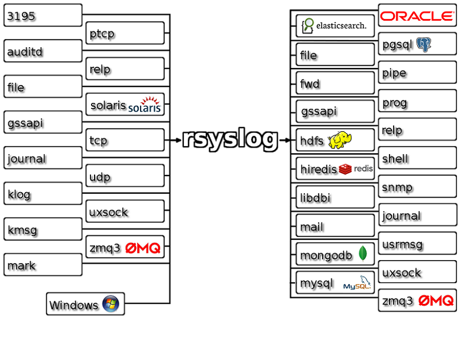
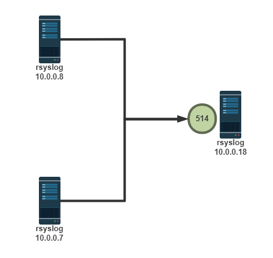
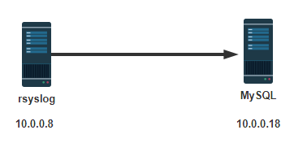

# 1 系统日志管理

## 1.1 系统日志介绍

在现实生活中，记录日志非常重要﹐比如:银行转账时会有转账记录﹔飞机飞行过程中的黑盒子（飞行数 据记录器）记录着飞机的飞行过程. 那么将系统和应用发生的事件记录至日志中，也很意义,常可以助于 排错和分析使用

日志记录的内容包括：

- 历史事件：时间，地点，人物，事件
- 日志级别：事件的关键性程度，Loglevel

### 1.1.1 sysklogd 系统日志服务

CentOS 5 之前版本采用的日志管理系统服务

- klogd: linux kernel 记录内核日志
- syslogd: system application 记录应用日志

事件记录格式：

​      日期时间 主机 进程[pid]: 事件内容 

​       C/S架构：通过TCP或UDP协议的服务完成日志记录传送，将分布在不同主机的日志实现集中管理

### 1.1.2 rsyslog 系统日志服务

rsyslog是CentOS 6 以后版本的系统管理服务.它提供了高性能，出色的安全性和模块化设计。 尽管 rsyslog最初是常规的syslogd，但已发展成为一种瑞士军刀式的记录工具，能够接受来自各种来源的输 入，并将其转换，然后输出到不同的目的地。

当应用有限的处理时，RSYSLOG每秒可以将超过一百万的消息传递到本地目的地。 即使在远程的目的地 和更精细的处理中，性能通常也被认为是“惊人的”。

官方网站:

```BASH
https://www.rsyslog.com/
```

rsyslog 特性:

- 多线程
- UDP, TCP, SSL, TLS, RELP
- MySQL, PGSQL, Oracle实现日志存储
- 强大的过滤器，可实现过滤记录日志信息中任意部分
- 自定义输出格式
- 适用于企业级中继链 



### 1.1.3 ELK

ELK：由Elasticsearch, Logstash, Kibana三个软件组成

- 非关系型分布式数据库
- 基于Apache软件基金会jakarta项目组的项目lucene
- Elasticsearch是个开源分布式搜索引擎，可以处理大规模日志数据，比如：Nginx、Tomcat、系统 日志等功能
- Logstash对日志进行收集、分析，过滤，并将其存储供以后使用
- Kibana 可以提供的日志分析友好的 Web 界面

## 1.2 Rsyslog 管理

### 1.2.1 系统日志术语

- facility：设施，从功能或程序上对日志进行归类

  ```BASH
  #内置分类
  auth, authpriv, cron, daemon,ftp,kern, lpr, mail, news, security(auth), 
  user(default), uucp, syslog
  #自定义的分类
  local0-local7
  ```

- Priority 优先级别，从低到高排序

  ```bash
  debug,info, notice, warn(warning), err(error), crit(critical), alert, 
  emerg(panic)
  ```

- 参看帮助： man 3 syslog，man logger

  ```bash
  [root@centos8 ~]#yum -y install man-pages
  [root@centos8 ~]#man 3 syslog
  ```

### 1.2.2 rsyslog 相关文件

- 程序包：rsyslog
- 主程序：/usr/sbin/rsyslogd
- Ubuntu: /usr/lib/systemd/system/rsyslog.service
- 配置文件：/etc/rsyslog.conf，/etc/rsyslog.d/*.conf
- 库文件： /lib64/rsyslog/*.so 

### 1.2.3 rsyslog配置文件

/etc/rsyslog.conf 配置文件格式：由三部分组成

- MODULES：相关模块配置
- GLOBAL DIRECTIVES：全局配置
- RULES：日志记录相关的规则配置

**RULES配置格式： **

```bash
facility.priority; facility.priority… target
```

**facility格式：**

```bash
*     #所有的facility  
facility1,facility2,facility3,...         #指定的facility列表
```

**priority格式：**

```bash
*: 所有级别
none：没有级别，即不记录
PRIORITY：指定级别（含）以上的所有级别
=PRIORITY：仅记录指定级别的日志信息
```

**target格式：**

```bash
文件路径：通常在/var/log/，文件路径前的-表示异步写入
用户：将日志事件通知给指定的用户，* 表示登录的所有用户
日志服务器：@host，把日志送往至指定的远程UDP日志服务器 @@host 将日志发送到远程TCP日志服务器
管道： | COMMAND，转发给其它命令处理
```

**通常的日志文件的格式：**

日志文件有很多，如： /var/log/messages,cron,secure等，基本格式都是类似的。格式如下

```bash
事件产生的日期时间 主机 进程(pid)：事件内容
```

范例：日志文件格式

```bash
[root@centos8 ~]#tail /var/log/messages
Nov 12 08:34:18 centos8 dnf[14114]: Metadata cache created.
Nov 12 08:34:18 centos8 systemd[1]: Started dnf makecache.
Nov 12 09:35:14 centos8 systemd[1]: Starting dnf makecache...
Nov 12 09:35:14 centos8 dnf[14249]: Metadata cache refreshed recently.
Nov 12 09:35:14 centos8 systemd[1]: Started dnf makecache.
Nov 12 10:21:22 centos8 systemd[1]: Starting man-db-cache-update.service...
Nov 12 10:21:22 centos8 systemd[1]: Reloading.
Nov 12 10:21:22 centos8 systemd[1]: Started man-db-cache-update.service.
[root@centos8 ~]#tail /var/log/secure
Nov 11 18:27:12 centos8 groupadd[11940]: group added to /etc/group: name=dhcpd, 
GID=177
Nov 11 18:27:12 centos8 groupadd[11940]: group added to /etc/gshadow: name=dhcpd
Nov 11 18:27:12 centos8 groupadd[11940]: new group: name=dhcpd, GID=177
Nov 11 18:27:12 centos8 useradd[11948]: new user: name=dhcpd, UID=177, GID=177, 
home=/, shell=/sbin/nologin
```

范例：启用高精度时间

```bash
#默认日志时间精确到秒，可以修改配置实现
[root@ubuntu2204 ~]#head /var/log/syslog
Oct 29 02:27:39 ubuntu2204 systemd-modules-load[521]: Inserted module 'msr'
Oct 29 02:27:39 ubuntu2204 systemd-modules-load[521]: Inserted module 
'ipmi_devintf'
Oct 29 02:27:39 ubuntu2204 lvm[506]:   1 logical volume(s) in volume group 
"ubuntu-vg" monitored
Oct 29 02:27:39 ubuntu2204 systemd[1]: Mounted FUSE Control File System.
Oct 29 02:27:39 ubuntu2204 systemd[1]: Mounted Kernel Configuration File System.
.....

[root@ubuntu2204 ~]#vi /etc/rsyslog.conf
###########################
#### GLOBAL DIRECTIVES ####
###########################
#将下面行注释
#$ActionFileDefaultTemplate RSYSLOG_TraditionalFileFormat

[root@ubuntu2204 ~]#systemctl restart rsyslog

#验证结果
[root@ubuntu2204 ~]#tail /var/log/syslog 
2022-12-09T19:21:21.717291+08:00 ubuntu2204 systemd[1]: Stopping System Logging 
Service...
2022-12-09T19:21:21.721852+08:00 ubuntu2204 rsyslogd: [origin 
software="rsyslogd" swVersion="8.2112.0" x-pid="818" xinfo="https://www.rsyslog.com"]
 exiting on signal 15.
2022-12-09T19:21:21.729966+08:00 ubuntu2204 systemd[1]: rsyslog.service: 
Deactivated successfully.
2022-12-09T19:21:21.730558+08:00 ubuntu2204 systemd[1]: Stopped System Logging 
Service.
2022-12-09T19:21:21.732955+08:00 ubuntu2204 systemd[1]: Starting System Logging 
Service...
```

范例：将ssh服务的日志记录至自定义的local的日志设备

```bash
#修改sshd服务的配置
Vim /etc/ssh/sshd_config
SyslogFacility local2
Service sshd reload

#修改rsyslog的配置
Vim /etc/rsyslog.conf
Local2.* /var/log/sshd.log

Systemctl  restart rsyslog 

#测试
Ssh登录后，查看/var/log/sshd.log有记录

#logger测试
logger -p local2.info "hello sshd"
tail /var/log/sshd.log有记录
```

### 1.2.4 启用网络日志服务

启用网络日志服务功能，可以将多个远程主机的日志，发送到集中的日志服务器，方便统一管理。



范例：CentOS 8 启用网络日志功能

```bash
[root@centos8 ~]#vim /etc/rsyslog.conf
## MODULES ####
...省略...
# Provides UDP syslog reception
# for parameters see http://www.rsyslog.com/doc/imudp.html
module(load="imudp") # needs to be done just once
input(type="imudp" port="514")
# Provides TCP syslog reception
# for parameters see http://www.rsyslog.com/doc/imtcp.html

module(load="imtcp") # needs to be done just once
input(type="imtcp" port="514")

#在客户端指定将日志发送到远程的TCP、UDP的日志服务器
[root@centos7 ~]#vim /etc/rsyslog.conf
*.info;mail.none;authpriv.none;cron.none               /var/log/messages
*.info;mail.none;authpriv.none;cron.none               @@10.0.0.18:514  #TCP
*.info;mail.none;authpriv.none;cron.none               @10.0.0.18:514   #UDP
```

范例：CentOS 7 和6 启用网络日志功能

```bash
vim /etc/rsyslog.conf
####MODULES####
# Provides UDP syslog reception
$ModLoad imudp
$UDPServerRun 514

# Provides TCP syslog reception
$ModLoad imtcp
$InputTCPServerRun 514
```

### 1.2.5 常见日志文件

- /var/log/secure，/var/log/auth.log：系统安全日志，文本格式，应周期性分析

- /var/log/btmp：当前系统上，用户的失败尝试登录相关的日志信息，二进制格式，lastb命令进行 查看

- /var/log/wtmp：当前系统上，用户正常登录系统的相关日志信息，二进制格式，last命令可以查看

  ```bash
  #显示系统关机项和运行级别更改
  last -x, --system 
  ```

- /var/log/lastlog:每一个用户最近一次的登录信息，二进制格式，lastlog命令可以查看

- /var/log/dmesg：CentOS7 之前版本系统引导过程中的日志信息，文本格式，开机后的硬件变化 将不再记录，也可以通过专用命令

  dmesg查看，可持续记录硬件变化的情况

- /var/log/boot.log 系统服务启动的相关信息，文本格式，Ubuntu无此文件

- /var/log/messages(红帽系统)，/var/log/syslog (Ubuntu) ：系统中大部分的信息

- /var/log/anaconda : anaconda的日志，Ubuntu无此文件

范例：找到失败登录的IP

```bash
[root@centos8 ~]#awk '/Failed password/{print $(NF-3)}' /var/log/secure
192.168.39.7
192.168.39.18
192.168.39.18
```

范例：找出失败登录次数最多的前10个IP

```bash
[root@centos8 ~]#lastb -f btmp-test1 | awk '{print $3}'|sort | uniq -c|sort -
nr|head
   8374 112.64.33.38
   7041 221.125.235.4
   6502 183.247.184.220
   5970 203.190.163.125
   5297 202.89.0.27
   3062 119.163.122.32
   2961 124.126.248.6
   2921 92.222.1.40
   2896 112.65.170.186
   1955 118.97.213.118
   
[root@centos8 ~]#lastb -f btmp-test2 | awk '{ip[$3]++}END{for(i in ip){print 
ip[i],i}}'|sort -nr|head 
86294 58.218.92.37
43148 58.218.92.26
18036 112.85.42.201
10501 111.26.195.101
10501 111.231.235.49
10501 111.204.186.207
10501 111.11.29.199
10499 118.26.23.225
6288 42.7.26.142
4236 58.218.92.30   
```

## 1.3 日志管理工具 journalctl

CentOS 7 以后版，利用Systemd 统一管理所有 Unit 的启动日志。带来的好处就是，可以只用  journalctl一个命令，查看所有日志（内核日志和应用日志）。

**日志的配置文件：**

```bash
/etc/systemd/journald.conf
```

**journalctl命令格式**

```bash
journalctl [OPTIONS...] [MATCHES...]
```

范例：journalctl用法

```bash
#查看所有日志（默认情况下 ，只保存本次启动的日志）
 journalctl
#查看内核日志（不显示应用日志）
 journalctl -k
#查看系统本次启动的日志
 journalctl -b
 journalctl -b -0
 
#查看指定时间的日志
 journalctl --since="2017-10-30 18:10:30"
 journalctl --since "20 min ago"
 journalctl --since yesterday
 journalctl --since "2017-01-10" --until "2017-01-11 03:00"
 journalctl --since 09:00 --until "1 hour ago"
 
#显示尾部的最新10行日志
 journalctl -n
 
#显示尾部指定行数的日志
 journalctl -n 20
 
 #实时滚动显示最新日志
 journalctl -f
 
#查看某个 Unit 的日志
 journalctl -u nginx.service
 journalctl -u nginx.service --since today
 
#实时滚动显示某个 Unit 的最新日志
 journalctl -u nginx.service -f
#合并显示多个 Unit 的日志
 journalctl -u nginx.service -u php-fpm.service --since today
 
 
#指定日志文件占据的最大空间
 journalctl --vacuum-size=1G
#指定日志文件保存多久
 journalctl --vacuum-time=1years 
```

# 2 实战案例：利用 MySQL 存储日志信息



## 2.1 目标

利用rsyslog日志服务，将收集的日志记录于MySQL中 

## 2.2 环境准备

```bash
两台主机
一台：rsyslog日志服务器，IP：10.0.0.8
一台：mariadb数据库服务器，IP：10.0.0.18
```

## 2.3 实现步骤

### 2.3.1 在rsyslog服务器上安装连接mysql模块相关的程序包

```bash
[root@centos8 ~]#yum -y install rsyslog-mysql 
[root@ubuntu2004 ~]#apt -y install rsyslog-mysql

[root@ubuntu2004 ~]#dpkg -L rsyslog-mysql
/.
/usr
/usr/lib
/usr/lib/x86_64-linux-gnu
/usr/lib/x86_64-linux-gnu/rsyslog
/usr/lib/x86_64-linux-gnu/rsyslog/ommysql.so
/usr/share
/usr/share/dbconfig-common
/usr/share/dbconfig-common/data
/usr/share/dbconfig-common/data/rsyslog-mysql
/usr/share/dbconfig-common/data/rsyslog-mysql/install
/usr/share/dbconfig-common/data/rsyslog-mysql/install/mysql
/usr/share/doc
/usr/share/doc/rsyslog-mysql
/usr/share/doc/rsyslog-mysql/copyright
/usr/share/rsyslog-mysql
/usr/share/rsyslog-mysql/rsyslog-mysql.conf.template
/usr/share/doc/rsyslog-mysql/NEWS.Debian.gz
/usr/share/doc/rsyslog-mysql/changelog.Debian.gz


#查看sql脚本文件内容
[root@ubuntu2204 ~]#cat /usr/share/dbconfig-common/data/rsyslogmysql/install/mysql
[root@ubuntu2004
 ~]#cat /usr/share/dbconfig-common/data/rsyslogmysql/install/mysql
[root@centos8
 ~]#cat /usr/share/doc/rsyslog/mysql-createDB.sql
CREATE DATABASE Syslog;  #Ubuntu22.04和20.04没有此行，需要手动创建数据库
USE Syslog;
CREATE TABLE SystemEvents
(
       ID int unsigned not null auto_increment primary key,
       CustomerID bigint,
       ReceivedAt datetime NULL,
       DeviceReportedTime datetime NULL,
       Facility smallint NULL,
       Priority smallint NULL,
       FromHost varchar(60) NULL,
       Message text,
       NTSeverity int NULL,
       Importance int NULL,
       EventSource varchar(60),
       EventUser varchar(60) NULL,
       EventCategory int NULL,
       EventID int NULL,
       EventBinaryData text NULL,
       MaxAvailable int NULL,
       CurrUsage int NULL,
       MinUsage int NULL,
       MaxUsage int NULL,
       InfoUnitID int NULL ,
       SysLogTag varchar(60),
       EventLogType varchar(60),
       GenericFileName VarChar(60),
       SystemID int NULL
);

CREATE TABLE SystemEventsProperties
(
       ID int unsigned not null auto_increment primary key,
       SystemEventID int NULL ,
       ParamName varchar(255) NULL ,
       ParamValue text NULL
);

#方法1:事先执行2.3.2步骤再执行下面指令
[root@ubuntu2204 ~]#mysql -ursyslog -p123456 -h10.0.0.202 Syslog < 
/usr/share/dbconfig-common/data/rsyslog-ysql/install/mysql
[root@ubuntu2204 ~]#mysql -ursyslog -p123456 -h10.0.0.202 Syslog -e "source 
/usr/share/dbconfig-common/data/rsyslog-ysql/install/mysql"

#方法2
#将sql脚本复制到数据库服库上
[root@centos8 ~]#scp /usr/share/doc/rsyslog/mysql-createDB.sql 10.0.0.18:/data
```

### 2.3.2 准备 MySQL

```bash
[root@centos8 ~]#yum install mysql-server
#在MySQL数据库服务器上创建相关数据库和表，并授权rsyslog能连接至当前服务器
[root@centos8 ~]#mysql -u 
mysql>source /data/mysql-createDB.sql
mysql>CREATE USER  'rsyslog'@'10.0.0.%' IDENTIFIED BY '123456';
mysql>GRANT ALL ON Syslog.* TO 'rsyslog'@'10.0.0.%' ;
```

### 2.3.3 配置日志服务器将日志发送至指定数据库

```bash
#配置rsyslog将日志保存到mysql中
[root@centos8 ~]#vim /etc/rsyslog.conf
#
####MODULES####
#在 MODULES 语言下面，如果是 Ubuntu22.04,20.04和CentOS8 加下面行
module(load="ommysql")
#在 MODULES 语言下面，如果是 CentOS 7，6 加下面行
$ModLoad ommysql 

#在RULES语句块加下面行的格式
#facility.priority   :ommysql:DBHOST,DBNAME,DBUSER, PASSWORD 
*.info :ommysql:10.0.0.18,Syslog,rsyslog,123456

[root@centos8 ~]#systemctl restart rsyslog.service

#Ubuntu 自动生成以下配置文件，只需要按环境修改
[root@ubuntu2004 ~]#cat /etc/rsyslog.d/mysql.conf
### Configuration file for rsyslog-mysql
### Changes are preserved

module (load="ommysql")
*.* action(type="ommysql" server="10.0.0.18" db="Syslog" uid="rsyslog" 
pwd="123456")
```

### 2.3.4 测试

```bash
#在日志服务器上生成日志
[root@centos8 ~]#logger "this is a test log"

#在数据库上查询到上面的测试日志
mysql>SELECT COUNT(*) FROM SystemEvents; 
```

# 3 Logrotate 日志转储

## 3.1 Logrotate 介绍

logrotate 程序是一个日志文件管理工具。用来把旧的日志文件删除，并创建新的日志文件，称为日志转 储或滚动。可以根据日志文件的大小，也可以根据其天数来转储，这个过程一般通过 cron 程序来执行

## 3.2 Logrotate 配置

软件包：logrotate

相关文件

- 计划任 务：/etc/cron.daily/logrotate，/lib/systemd/system/logrotate.service，/lib/systemd/system/l ogrotate.timer
- 程序文件：/usr/sbin/logrotate
- 配置文件： /etc/logrotate.conf
- 日志文件：/var/lib/logrotate/logrotate.status

配置文件主要参数如下：

| 配置参数                | 说明                                                         |
| ----------------------- | ------------------------------------------------------------ |
| compress                | 通过gzip压缩转储以后的日志                                   |
| nocompress              | 不压缩                                                       |
| copytruncate            | 用于还在打开中的日志文件，把当前日志备份并截断               |
| nocopytruncate          | 备份日志文件但是不截断                                       |
| create mode owner group | 转储文件，使用指定的权限，所有者，所属组创建新的日志文件     |
| nocreate                | 不建立新的日志文件                                           |
| delaycompress           | 和 compress 一起使用时，转储的日志文件到下一次转储时才压缩   |
| nodelaycompress         | 覆盖 delaycompress 选项，转储同时压缩                        |
| errors address          | 专储时的错误信息发送到指定的Email 地址                       |
| ifempty                 | 即使是空文件也转储，此为默认选项                             |
| notifempty              | 如果是空文件的话，不转储                                     |
| mail address            | 把转储的日志文件发送到指定的E-mail 地址                      |
| nomail                  | 转储时不发送日志文件                                         |
| olddir directory        | 转储后的日志文件放入指定目录，必须和当前日志文件在同一个文件 系统 |
| noolddir                | 转储后的日志文件和当前日志文件放在同一个目录下               |
| prerotate/endscript     | 在转储以前需要执行的命令，这两个关键字必须单独成行           |
| postrotate/endscript    | 在转储以后需要执行的命令，这两个关键字必须单独成行           |
| daily                   | 指定转储周期为每天                                           |
| weekly                  | 指定转储周期为每周                                           |
| monthly                 | 指定转储周期为每月                                           |
| rotate count            | 指定日志文件删除之前转储的次数，0 指没有备份，5 指保留5 个备份 |
| tabooext [+] list       | 让logrotate不转储指定扩展名的文件，缺省的扩展名是：.rpm-orig, .rpmsave, v, 和 ~ |
| size size               | 当日志文件到达指定的大小时才转储，bytes(缺省)及KB或MB        |
| sharedscripts           | 默认，对每个转储日志运行prerotate和postrotate脚本，日志文件 的绝对路径作为第一个参数传递给脚本。 这意味着单个脚本可以针对 与多个文件匹配的日志文件条目多次运行（例 如/var/log/example/*.log）。 如果指定此项sharedscripts，则无 论有多少个日志与通配符模式匹配，脚本都只会运行一次 |
| nosharedscripts         | 针对每一个转储的日志文件，都执行一次prerotate 和 postrotate脚 本，此为默认值 |
| missingok               | 如果日志不存在，不提示错误，继续处理下一个                   |
| nomissingok             | 如果日志不存在，提示错误，此为默认值                         |

## 3.3 Logroate 配置范例

范例：Ubuntu22.04 包文件内容

```bash
[root@ubuntu2204 ~]#dpkg -L logrotate
/.
/etc
/etc/cron.daily
/etc/cron.daily/logrotate
/etc/logrotate.conf
/etc/logrotate.d
/etc/logrotate.d/btmp
/etc/logrotate.d/wtmp
/lib
/lib/systemd
/lib/systemd/system
/lib/systemd/system/logrotate.service
/lib/systemd/system/logrotate.timer
/usr
/usr/sbin
/usr/sbin/logrotate
/usr/share
/usr/share/bug
/usr/share/bug/logrotate
/usr/share/bug/logrotate/script
/usr/share/doc
/usr/share/doc/logrotate
/usr/share/doc/logrotate/NEWS.Debian.gz
/usr/share/doc/logrotate/changelog.Debian.gz
/usr/share/doc/logrotate/copyright
/usr/share/man
/usr/share/man/man5
/usr/share/man/man8
/usr/share/man/man8/logrotate.8.gz
/var
/var/lib
/var/lib/logrotate
/usr/share/man/man5/logrotate.conf.5.gz


[root@ubuntu2204 ~]#cat /lib/systemd/system/logrotate.service
[Unit]
Description=Rotate log files
Documentation=man:logrotate(8) man:logrotate.conf(5)
RequiresMountsFor=/var/log
ConditionACPower=true

[Service]
Type=oneshot
ExecStart=/usr/sbin/logrotate /etc/logrotate.conf

# performance options
Nice=19
IOSchedulingClass=best-effort
IOSchedulingPriority=7

# hardening options
# details: https://www.freedesktop.org/software/systemd/man/systemd.exec.html
# no ProtectHome for userdir logs
# no PrivateNetwork for mail deliviery
# no NoNewPrivileges for third party rotate scripts
# no RestrictSUIDSGID for creating setgid directories
LockPersonality=true
MemoryDenyWriteExecute=true
PrivateDevices=true
PrivateTmp=true
ProtectClock=true
ProtectControlGroups=true
ProtectHostname=true
ProtectKernelLogs=true
ProtectKernelModules=true
ProtectKernelTunables=true
ProtectSystem=full
RestrictNamespaces=true
RestrictRealtime=true
```

范例:Rocky8包文件内容

```bash
[root@rocky8 ~]#rpm -ql logrotate
/etc/cron.daily
/etc/cron.daily/logrotate
/etc/logrotate.conf
/etc/logrotate.d
/etc/logrotate.d/btmp
/etc/logrotate.d/wtmp
/etc/rwtab.d/logrotate
/usr/lib/.build-id
/usr/lib/.build-id/b6
/usr/lib/.build-id/b6/596acebd8053c625902908d26e5ba3655ddaa7
/usr/sbin/logrotate
/usr/share/doc/logrotate
/usr/share/doc/logrotate/ChangeLog.md
/usr/share/licenses/logrotate
/usr/share/licenses/logrotate/COPYING
/usr/share/man/man5/logrotate.conf.5.gz
/usr/share/man/man8/logrotate.8.gz
/var/lib/logrotate
/var/lib/logrotate/logrotate.status

[root@rocky8 ~]#cat /etc/cron.daily/logrotate
#!/bin/sh
/usr/sbin/logrotate /etc/logrotate.conf
EXITVALUE=$?
if [ $EXITVALUE != 0 ]; then
   /usr/bin/logger -t logrotate "ALERT exited abnormally with [$EXITVALUE]"
fi
exit $EXITVALUE
```

范例： 定制设置nginx的日志转储

```bash
cat /etc/logrotate.d/nginx 
/var/log/nginx/*.log {
   daily
   rotate 100
   missingok
   compress
   delaycompress
   notifempty
   create 644 ngnix nginx
   postrotate
      if [ -f /app/nginx/logs/nginx.pid ]; then
          kill -USR1 `cat /app/nginx/logs/nginx.pid`
      fi
   endscript
}
```

范例： nginx安装内置转储规则

```bash
[root@ubuntu2204 ~]#cat /etc/logrotate.d/nginx
/var/log/nginx/*.log {
     daily
     missingok
     rotate 14
     compress
     delaycompress
     notifempty
     create 0640 www-data adm
     sharedscripts
     prerotate
         if [ -d /etc/logrotate.d/httpd-prerotate ]; then \
         run-parts /etc/logrotate.d/httpd-prerotate; \
         fi \
     endscript
     postrotate
     	invoke-rc.d nginx rotate >/dev/null 2>&1
     endscript
}

[root@rocky8 ~]#cat /etc/logrotate.d/nginx
/var/log/nginx/*log {
   create 0664 nginx root
   daily
   rotate 10
   missingok
   notifempty
   compress
   sharedscripts
   postrotate
       /bin/kill -USR1 `cat /run/nginx.pid 2>/dev/null` 2>/dev/null || true
   endscript
}
```

范例：Ubuntu22.04 日志转储

```bash
[root@ubuntu2204 ~]#mkdir -p /var/log/test /data 
[root@ubuntu2204 ~]#dd if=/dev/zero of=/var/log/test/test1.log bs=1M count=2
[root@ubuntu2204 ~]#ll /var/log/test/*
-rw-r--r-- 1 root root 2097152 11月 18 12:21 /var/log/test/test1.log

[root@ubuntu2204 ~]#cat /etc/logrotate.d/test1
/var/log/test/test1.log {
   daily
   rotate 5
   compress
   delaycompress
   missingok
   size 1M
   notifempty
   create 0640 bin daemon
   sharedscripts
   postrotate
 		echo `date +%F_%T` >> /data/test1.log
   endscript
}


#手动转储
[root@ubuntu2204 ~]#logrotate /etc/logrotate.d/test1


#查看结果
[root@ubuntu2204 ~]#ll /var/log/test/
总用量 2056
drwxr-xr-x  2  600 root      4096 11月 18 12:22 ./
drwxrwxr-x 12 root syslog    4096 11月 18 12:14 ../
-rw-r-----  1 bin daemon       0 11月 18 12:22 test1.log
-rw-r--r--  1 root root   2097152 11月 18 12:21 test1.log.1

#添加日志
[root@ubuntu2204 ~]#dd if=/dev/zero of=/var/log/test/test1.log bs=1M count=2

#手动转储
[root@ubuntu2204 ~]#logrotate /etc/logrotate.d/test1

#观察结果，发现延迟压缩
[root@ubuntu2204 ~]#ll /var/log/test/
总用量 2060
drwxr-xr-x  2  600 root      4096 11月 18 12:23 ./
drwxrwxr-x 12 root syslog    4096 11月 18 12:14 ../
-rw-r-----  1 bin daemon       0 11月 18 12:23 test1.log
-rw-r-----  1 bin daemon 2097152 11月 18 12:23 test1.log.1
-rw-r--r--  1 root root      2067 11月 18 12:21 test1.log.2.gz

[root@ubuntu2204 ~]#cat /data/test1.log
2022-11-18_12:22:40
2022-11-18_12:23:07

#修改全局配置
[root@ubuntu2204 ~]#vim /etc/logrotate.conf
#取消注释
dateext

#生成新日志
[root@ubuntu2204 ~]#dd if=/dev/zero of=/var/log/test/test1.log bs=1k count=1025

#使用全局配置
[root@ubuntu2204 ~]#logrotate /etc/logrotate.conf

#查看生成日志文件格式为时间后缀
[root@ubuntu2204 ~]#ll /var/log/test/
总计 2084
drwxr-xr-x  2 root root      4096  5月  8 17:13 ./
drwxrwxr-x 11 root syslog    4096  5月  8 17:00 ../
-rw-r-----  1 bin daemon 1049600  5月  8 17:13 test1.log
-rw-r-----  1 bin daemon 1049600  5月  8 17:10 test1.log.1
-rw-r-----  1 bin daemon    1052  5月  8 17:12 test1.log-20230508.gz
```

范例：对指定日志手动执行日志转储

```bash
#生成测试日志
[root@centos8 ~]#dd if=/dev/zero of=/var/log/test1.log bs=2M count=1
1+0 records in
1+0 records out
2097152 bytes (2.1 MB, 2.0 MiB) copied, 0.00291879 s, 719 MB/s
[root@centos8 ~]#dd if=/dev/zero of=/var/log/test2.log bs=2M count=1
1+0 records in
1+0 records out
2097152 bytes (2.1 MB, 2.0 MiB) copied, 0.00200561 s, 1.0 GB/s

#针对不同的日志创建转储配置文件
#Ubuntu需加下面两行
    su bin syslog
    sharedscripts
    
[root@centos8 ~]#cat /etc/logrotate.d/test1
/var/log/test1.log {
   daily
   rotate 5
   compress
   delaycompress
   missingok
   size 1M
   notifempty
   create 640 bin daemon
   postrotate
 echo `date +%F_%T` >> /data/test1.log
   endscript
}

[root@centos8 ~]#cat /etc/logrotate.d/test2
/var/log/test2.log {
   daily
   rotate 5
   compress
   delaycompress
   missingok
   size 1M
   notifempty
   create 644 root root
   postrotate
   echo `date +%F_%T` >> /data/test2.log
   endscript
}   


#针对一个测试日志，手动执行日志转储
[root@centos8 ~]#logrotate   /etc/logrotate.d/test1    
[root@centos8 ~]#ll /var/log/test*
-rw-r----- 1 bin daemon     0 Dec 14 16:38 /var/log/test1.log
-rw-r--r-- 1 root root 2097152 Dec 14 16:35 /var/log/test1.log.1
-rw-r--r-- 1 root root 2097152 Dec 14 16:36 /var/log/test2.log


[root@centos8 ~]#ls /data
test1.log
[root@centos8 ~]#cat /data/test1.log 
2019-11-12_14:00:14


#对所有日志进行手动转储
[root@centos8 ~]#logrotate   /etc/logrotate.conf 
[root@centos8 ~]#ll /var/log/test*
-rw-r--r-- 1 bin daemon     0 Nov 12 14:00 /var/log/test1.log
-rw-r--r-- 1 root root 2097152 Nov 12 13:59 /var/log/test1.log.1
-rw-r--r-- 1 root root       0 Nov 12 14:01 /var/log/test2.log
-rw-r--r-- 1 root root 2097152 Nov 12 13:59 /var/log/test2.log-20191112
[root@centos8 ~]#ls /data
test1.log test2.log
[root@centos8 ~]#cat /data/test1.log 
2019-11-12_14:01:51
```


