# 一：分布式链路追踪起源

## 1.1：分布式链路追踪系统起源

### 1.1.1：现状

- ```bash
  在较大型web集群和微服务环境中，客户端的一次请求可能需要经过多个不同的模块，多个不同中间件，多台不同机器的一起协作才能处理完成客户端请求，而在这一系列的请求过程中，处理流程可能是串行执行也有可能是并行执行的。那么如何确定客户端一次请求到结束的背后究竟调用了哪些应用以及哪些模块并经过哪些节点，且每个模块调用先后顺序是怎样的，每个模块处理的相应的性能如何？后期随着业务系统的不断增多，业务处理逻辑会越来越来复杂，而分布式系统中急需一套追踪(Trace)系统来解决这些痛点，从而让运维人员对整个业务系统一目了然，了如指掌。
  ```

- ```bash
  分布式服务跟踪系统是整个分布式系统中跟踪一个用户请求的完整过程，包括数据采集，数据传输，数据存储，数据分析和数据可视化，获取并存储和分享此类跟踪可以让运维清晰了解用户请求与业务系统交互背后的整个调用链的调用关系，链路追踪系统是针对微服务不可或缺。
  ```

### 1.1.2：google 链路追踪系统

- ```bash
  Dapper是google公司在2008年就开始内部使用经过生产环境验证的链路追踪系统。
  ```

- ```bash
  2010年Google发布的Dapper论文：https://static.googleusercontent.com/media/research.google.com/zh-CN//archive/papers/dapper-2010-1.pdf
  ```

  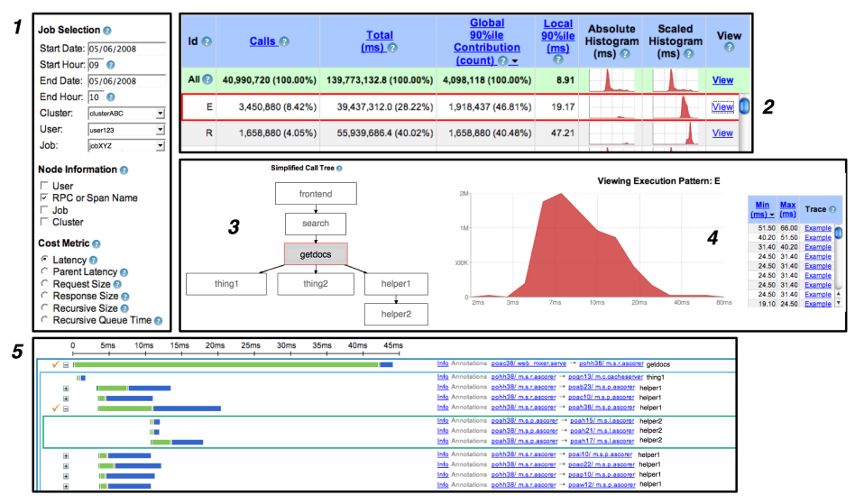

### 1.1.3：面临的业务环境

- ```bash
  业务系统是使用复杂的，大规模的分布式集群实现，并且由很多服务组成。
  
  每个服务可能使用不同的开发框架或者语言。
  
  服务可能运行在数千台服务器，并且分布在不同的数据中心，对管理和监控产生挑战。
  
  因此，需要专门的工具去追踪请求，理解整体系统的瓶颈。假如一个请求太慢，那么要通过工具快速找到rootcause。
  ```

- ```bash
  一个前端服务作为访问入口，用户的请求可能会被转发至多个后端服务处理，当出现系统响应慢的时候，运维工程师很难对各个请求了如指掌，因为其中每个服务都可能由不同的团队开发和维护的。而且不同的后端服务还可能被不同的前端进行调用。
  ```

  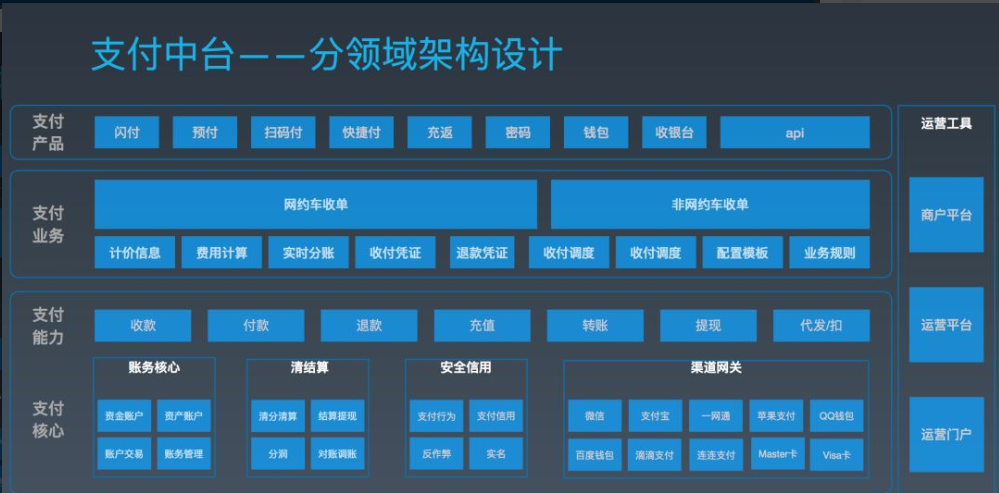

## 1.2：Dapper

### 1.2.1：设计要求

```bash
1、无处不在的部署： 任何服务都应该被监控到，任何服务出问题都要做到有据可查。

2、持续的监控：做到7*24小时全天候监控，任何时候出了问题都要基于监控数据追踪问题根源。
```

### 1.2.2：设计目标

```bash
1、低消耗：
  dapper跟踪系统对服务的影响做到最小，在一些高并发的场合，即使很小的影响也会导致服务出现延迟，负载变高或者不可用，从而导致业务团队可能会停止对dapper使用。
  
2、对应用透明
   应用程序对dapper无感知甚至不知道dapper系统存在，假如一个跟踪系统必须依赖于应用的开发者配合才能实现跟踪，也即需要在应用程序中植入跟踪代码，那么可能会因为代码产商bug或导致应用出问题。
   
3、可伸缩性
   针对未来众多的服务和大规模业务集群，dapper系统应该能满足未来在性能的压力和功能的需求。
```

### 1.2.3：dapper介绍--请求链路

```bash
  图中展现的是一个有5台服务器相关的一个服务，包括：前端（A），两个中间层（B和C），以及两个后端（D和E）。当一个用户发起一个请求，首先到达前端（A），然后发送两个RPC到服务B和C，B收到请求后，马上响应。但是C需要和后端D和E交互后返回A，由A响应最初的客户请求。
  对于这样一个请求，分布式跟踪就是为服务器每一次发送和接收动作来收集跟踪标识符和时间戳。
```

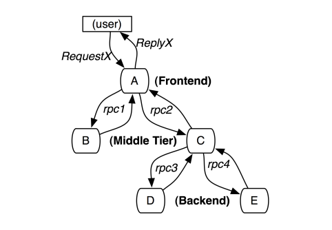

### 1.2.4：Dapper介绍--数据采集方法

分布式追踪的设计方案主要可以分为两类：` 黑盒法和标记法`

**黑盒法**：无需`任何侵入性代码，它的优势在于无需修改代码，缺点在于记录不是很准确，且需要大量数据才能推导出服务间的关系。

**标记法：**需要为每个请求打标记，并通过一个全局标识符将请求途径的所有服务信息串联，复盘整个链路。标记法记录准确，但它的缺点很明显，需要将标记代码注入每个服务中。

在Google，几乎所有应用都使用相同的threading model、control flow和RPC system，因此可以将打标记的工作集中在少量公共库，同样能够达到对应用透明的效果。

### 1.2.5：Dapper介绍--跟踪树和span

```bash
Span代表系统中具有开始时间和执行时长请求跨度，Span之间通过嵌套或者顺序排列建立逻辑因果关系。

在Dapper跟踪树结果中，树节点是整个架构的基本单元，是请求从前端到后端不同应用之间层级机构，而每一个节点又是对span引用，节点之间的连线表示span和fuqispan之间直接关系。

图中说明span在一个大的跟踪过程中是什么样的，Dapper记录了span的名称，以及每个span ID和父ID,以重建在一个追踪过程中不同span之间的关系。如果一个span没有父ID称为root span，所有span都挂在一个特定的跟踪上，也公用一个trace id.
```

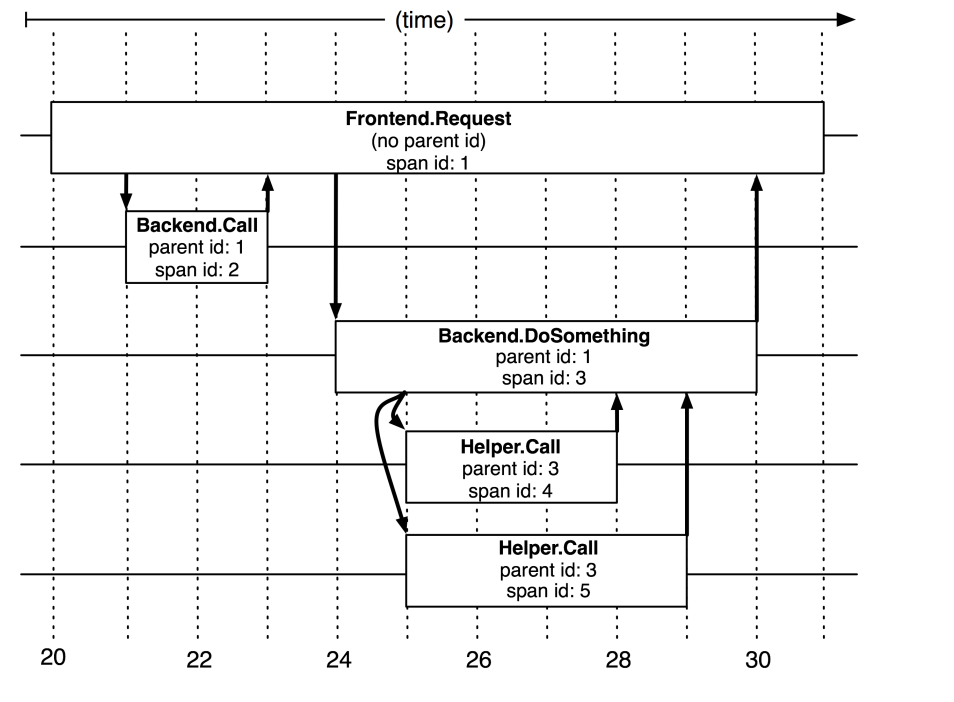

```bash
任何一个span可以包含来自不同的主机信息，这些也要记录下来，事实上每一个RPC span可以包含客户端和服务端两个过程注释，使得连接两个主机span会成为图中所说的span，由于client和server的时间戳来自不同的主机，还必须考虑到时间偏差，在分析工具就利用了时间偏差。即RPC客户端发送一个请求之后，服务器端才能接收到，对于响应也一样。这样server端就有一个开始和结束的时间戳，然后就可以计算出时间损耗。
```

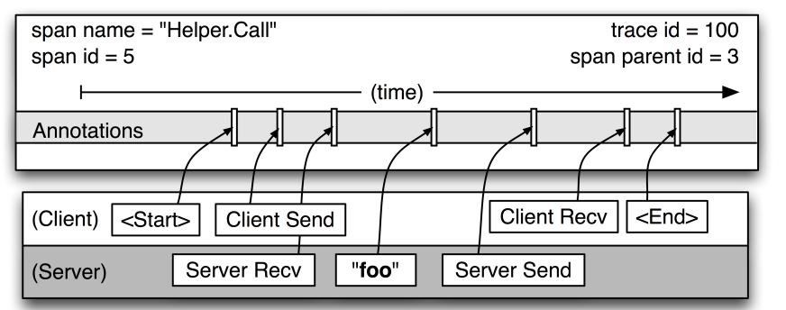

### 1.2.6：Dapper介绍---traceid、spanid、parentid示意图

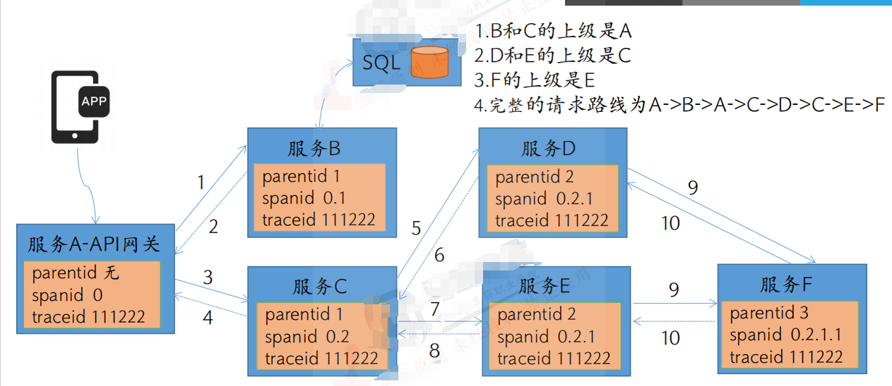

### 1.2.7：dapper介绍--植入点

Dapper可以实现对应用开发者近乎零侵入的成本，主要通过通用组件库实现；

当一个线程在处理跟踪请求链路的过程中，Dapper把这次跟踪的上下文在ThreadLocal进行存储，追踪上下文记录了SPanID和traceid。

几乎所有的Google的进程间通信是建立在一个用C++和Java开发的RPC框架。我们把跟踪植入该框架来定义RPC所有的span，spanid和traceid会从客户端发送到服务端。

### 1.2.8：dapper介绍--采样率

低损耗是Dapper的一个关键的设计目标，因为如果这个工具价值未被证实但又对性能有影响，就不会部署。

因此，除了把Dapper的收集对基本组件性能损耗限制尽可能小之外，我们还有进一步控制损耗的办法，那就是遇到大量请求只记录其中一小部分。

### 1.2.9：dapper介绍---跟踪收集的实现步骤

Dapper的跟踪记录和收集管道的过程分为三个阶段：

```bash
1、span数据写入本地日志文件
2、然后Dapper的守护进程和收集组件把这些数据从生产环境的主机读取
3、最终写到Dapper的数据仓库中

一次跟踪被设计成Bigtable的一行，每一列相当于一个span。
```

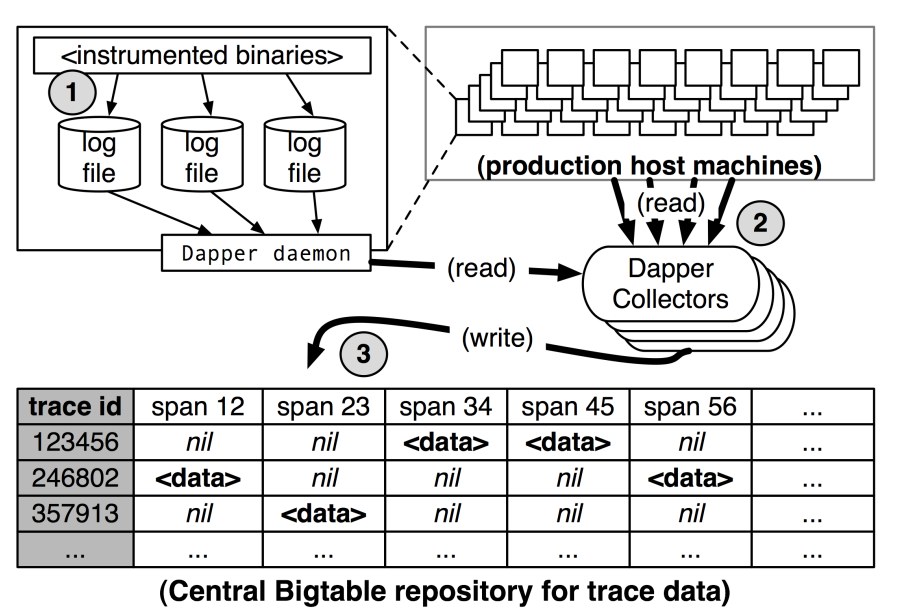

### 1.2.10：Dapper介绍-跟踪的代价

在生产环境的跟踪数据处理中，dapper的守护进程从来没有超过0.3%的单核cpu使用率，而且只有很少量的内存使用，另外还限制了Dapper守护进程为内核scheduler最低优先级。

Dapper也是一个带宽资源的轻量级消费者，每一个span在我们仓库传输只占了426byte.

创建root span：204纳秒，创建一般span：176纳秒

建立一个annotation：40纳秒

写到本地磁盘

Dapper本地进程：《0.3%CPU，《0.01%网络

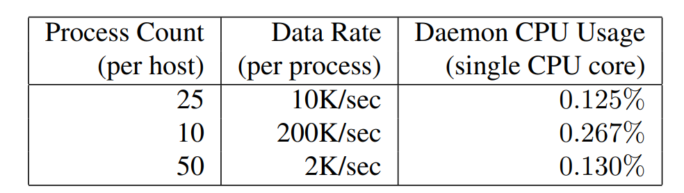

### 1.2.11：Dapper介绍---应用场景

性能分析：开发人员针对请求延迟的目标进行跟踪，并对容易优化的地方定位。

正确性分析：发现一些只读请求应该访问从库，但是却访问了主库类似的业务场景。

理解系统：全局优化系统，理解每个查询整体代价

测试新版本：发现新版本的bug和性能问题。

解决依赖问题：找到服务之间的依赖关系。

# 二：分布式链路追踪系统简介

## 2.1：APM概述

APM系统：即应用性能管理。

早期APM工具功能比较单一，主要监控CPU使用率，I/O，内存资源，网速等网络基础设施，后来随着中间件技术不断发展，APM也开始监控缓存，数据库，MQ等各种基础设施性能。

微服务兴起后，系统功能被模块化，再加上k8s与容器化的兴起及应用数量爆炸增长，各模块和服务的调用链路，响应时间，负载越来越不好通过传统的工具进行监控和统计，此时APM系统诞生。

## 2.2：APM开源产品

**1、CAT**

```bash
由国内美团点评开源的，基于java语言开发，目前提供java, c/c++,nodejs,ptrhon,go等语言的客户端，监控数据会全量统计，国内很多公司再用，例如美团点评，携程，拼多多。CAT需要开发人员手动在应用程序中埋点，对代码侵入性比较强。
```

**2、Zipkin**

```bash
由Twitter公司开发并开源，基于JAV语言实现，侵入性相对于CAT要低一点，需要对web.xml等相关配置文件修改，但依然对系统有一定侵入性，Zipkin可以轻松与sparing ckloud进行集成，也是spring cloud推荐的APM系统。
```

**3、Jaeger**

```bash
是Uber推出的一款开源分布式追踪系统，主要使用go语言开发，对业务代码侵入性较少。
```

**4、Pinpoint**

```bash
韩国团队开源的APM产品，运用了字节码增强技术，只需要在启动时添加启动参数可实现APM功能。
```

**5、SkyWalking**

```bash
是国人开发，2017年skywalking成为Apache国内个人孵化项目，2019年skywalking从Apache毕业成为顶级项目，目前skywalking支持java，go，python等探针，数据存储支持MYSQL，ElasticSearch等。对业务代码无侵入。
```

**6、开源的piwik**

```bash
https://piwik.com/
```

**7、商业：**

```ba
百度统计/growingio等
```

**8、APM对比**

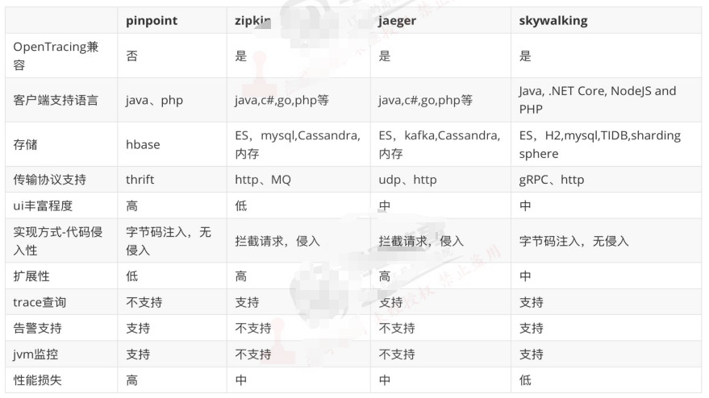

## 2.3：skywalking简介

### 2.3.1：特点

```bash
1、实现从请求追踪，指标收集和日志记录的完整信息记录。

2、多语言自动探针，支持Java,GO,PHP等客户端

3、内置服务网格可观察性，支持从Istio+Envoy Service mesh收集和分析数据

4、模块化架构，存储，集群管理，使用插件集合都可以进行自由选择。

5、支持告警。

6、优秀的可视化效果
```

### 2.3.2：组件

```bash
OAP平台（observability Analysis Platform,可观测性分析平台）或OAP server: 是一个高度件化的轻量级分析程序，兼容各种探针receiver，流失分析内核和查询内核三部分组成。

探针：基于无侵入式的收集，并通过HTTP或者GRPC方式发送数据到OAP Server

存储实现：支持多种存储并且提供了标准接口，可支持不同的存储后端。

UI：通过标准的GraphQL（Facebook在2012开源）协议进行统计数据查询和展示。
```

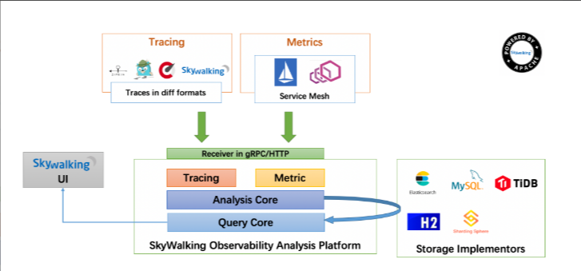

### 2.3.3：协议设计模式

面向协议设计：面向协议设计是skywalking从5.X开始严格遵守的首要设计原则，组件之间使用标准的协议进行数据交互。协议有探针协议和查询协议。

#### 2.3.3.1：探针协议

```bash
探针上报协议: 协议包括语言探针的注册，metrics数据上报，Tracing数据上报等标准，Java，Go等探针都需要严格遵守此协议的标准。

探针交互协议：因为分布式追踪环境，探针间需要借助HTTP header，MQ header在应用之间进行通信和交互，探针交互协议定义了交互的数据格式。

Service Mesh协议：是skywalking对service mesh抽象的专有协议，任何mesh类的服务都可以通过此协议直接上传指标数据，用于计算服务的指标数据和绘制拓扑图。

第三方协议：对大型的第三方开源项目，尤其是service mesh核心平台Istio和Envoy，提供核心协议适配，支持针对Istio+Envoy Service Mesh进行无缝对接。
```

#### 2.3.3.2：数据查询协议

```bash
元数据查询：查询在skywalking注册的服务，服务实例，Endpoint等元数据信息；

拓扑关系查询：查询全局，或者单个服务，endspoint的拓扑图及依赖关系

Metrics指标查询：查询指标数据

聚合指标查询：区间范围均值查询及Top N排名数据查询等

Trace查询：追踪数据的明细查询

告警查询：基于表达式，判断指标数据是否超出阈值。
```

### 2.3.4：skywalking设计

```bash
模块化设计：
   探针负责收集数据
   前端负责展示数据
   OAP Server负责从后端存储读写数据
   后端存储负责持久化数据
   
轻量化设计：
   skywalking在设计之初提出了轻量化设计理念，skywalking使用了最轻量级的jar包模式，实现了强大的数据处理和分析能力，可扩展能力和模块化能力。
```

### 2.3.5：优势

```bash
兼容性好：
支持传统的微服务部署架构dubbo和spring cloud，也支持云原生中的istio和envoy.

易于部署和后期维护：
组件化，可以自定义部署，后期横向扩容简单

高性能：
每天数T的数据无压力

易于二次开发：
标准的http和grpc协议，开源的项目，企业可以自主二次开发
```

# 三：部署skywalking

## 3.1：二进制部署-架构规划

```bash
skywalking-ui: 前端服务，端口号8080.

skywalking-oap：可观测性分析平台，11800为数据写入端口，12800为查询端口。

ES: 9200为elasticsearch的数据读写端口，sky walking支持的存储有es，h2，mysql，tidb，influxdb，postgresql等。

agent: app服务器部署skywalking-agent，用于收集app中的访问请求
```

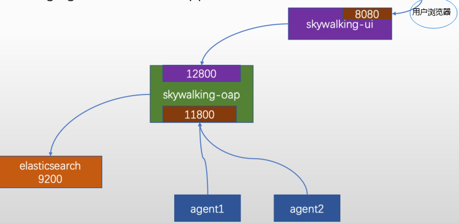

## 3.2：环境准备

```bash
skywalking（v9.4.0）： 192.168.58.152
ElasticSearch(v7.10.1)：192.168.58.156
```

## 3.3：部署ElasticSearch

```bash
~$ wget https://artifacts.elastic.co/downloads/elasticsearch/elasticsearch-7.10.1-amd64.deb
~$ wget https://artifacts.elastic.co/downloads/elasticsearch/elasticsearch-7.10.1-amd64.deb.sha512

~$ shasum -a 512 -c elasticsearch-7.10.1-amd64.deb.sha512  #校验deb包
elasticsearch-7.10.1-amd64.deb: OK

~$ dpkg -i elasticsearch-7.10.1-amd64.deb

# 修改配置文件
~$ vim /etc/elasticsearch/elasticsearch.yml
cluster.name: skywalking-es-cluster
node.name: node-1
path.data: /var/lib/elasticsearch
path.logs: /var/log/elasticsearch
network.host: 192.168.58.156
http.port: 9200
discovery.seed_hosts: ["192.168.58.156"]
cluster.initial_master_nodes: ["192.168.58.156"]

# 启动服务
~$ systemctl daemon-reload && systemctl restart elasticsearch.service && systemctl enable elasticsearch.service
```

### 3.3.1: 验证elasticsearch

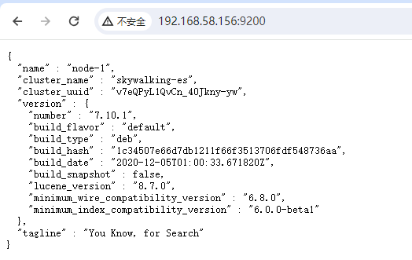

## 3.4：部署skywalking server

```bash
~$ apt install openjdk-11-jdk -y
~$ cd /apps
~$ wget https://dlcdn.apache.org/skywalking/9.4.0/apache-skywalking-apm-9.4.0.tar.gz
~$ tar xf apache-skywalking-apm-9.4.0.tar.gz
~$ cd apache-skywalking-apm-bin/
~$ vim config/application.yml
修改存储：
140 storage:
141   selector: ${SW_STORAGE:elasticsearch}
142   elasticsearch:
143     namespace: ${SW_NAMESPACE:"icloud2native"}
144     clusterNodes: ${SW_STORAGE_ES_CLUSTER_NODES:192.168.58.156:9200}


# 启动
root@sky-serv:/apps/apache-skywalking-apm-bin# ./bin/startup.sh 
SkyWalking OAP started successfully!
SkyWalking Web Application started successfully!
```

### 3.4.1: 验证skywalking Server

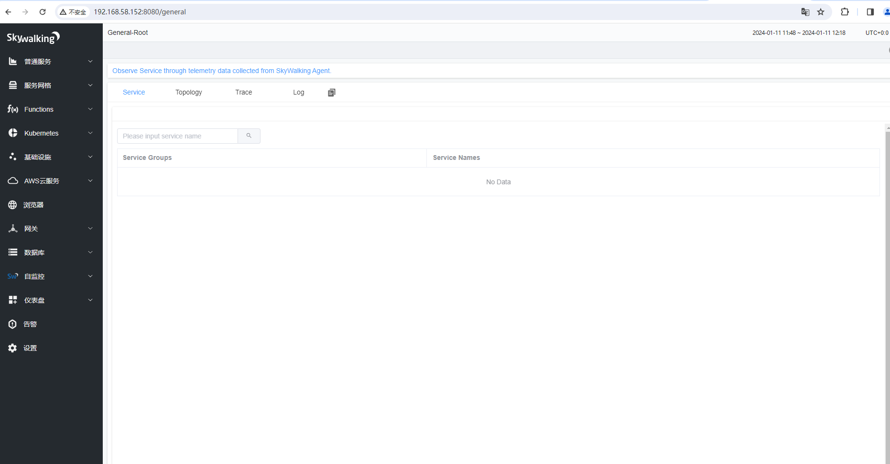

### 3.4.2：验证ElastricSearch数据

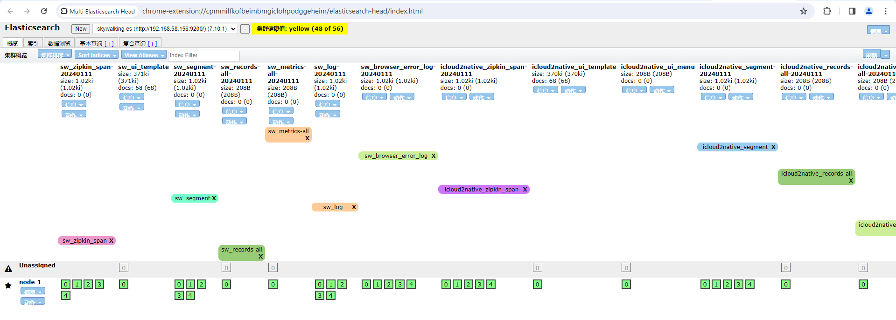

# 四：skywalking 案例

## 4.1：halo博客实现链路追踪案例

### 4.1.1：环境说明

```bash
skywalking server(v9.4.0): 192.168.58.152
halo(1.4.17): 192.168.58.153
```

### 4.1.2：部署skywalking java agent

```bash
~# apt install openjdk-11-jdk -y
~# cd /apps/
~# wget https://archive.apache.org/dist/skywalking/java-agent/9.0.0/apache-skywalking-java-agent-9.0.0.tgz
~# tar xf apache-skywalking-java-agent-9.0.0.tgz
~# vim /apps/skywalking-agent/config/agent.config
agent.service_name=${SW_AGENT_NAME:halo}
agent.namespace=${SW_AGENT_NAMESPACE:halo}
collector.backend_service=${SW_AGENT_COLLECTOR_BACKEND_SERVICES:192.168.58.152:11800}
```

### 4.1.2：部署halo app

```bash
~$ cd /apps
~$ wget https://dl.halo.run/release/halo-1.4.17.jar
```

### 4.1.3: 启动app

```bash
~$ java -javaagent:/apps/skywalking-agent/skywalking-agent.jar -jar /apps/halo-1.4.17.jar
```

### 4.1.4: halo登录注册

https://192.168.58.153:8090/admin

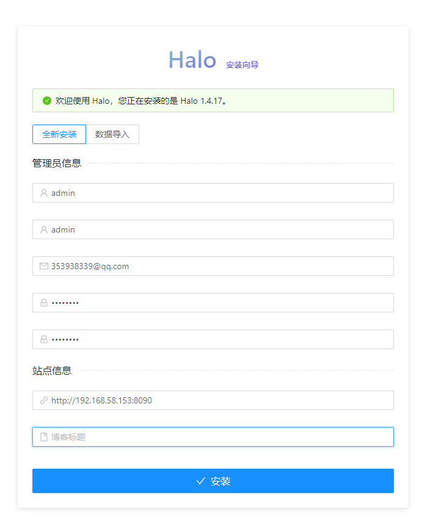

### 4.1.5：验证skywalking界面

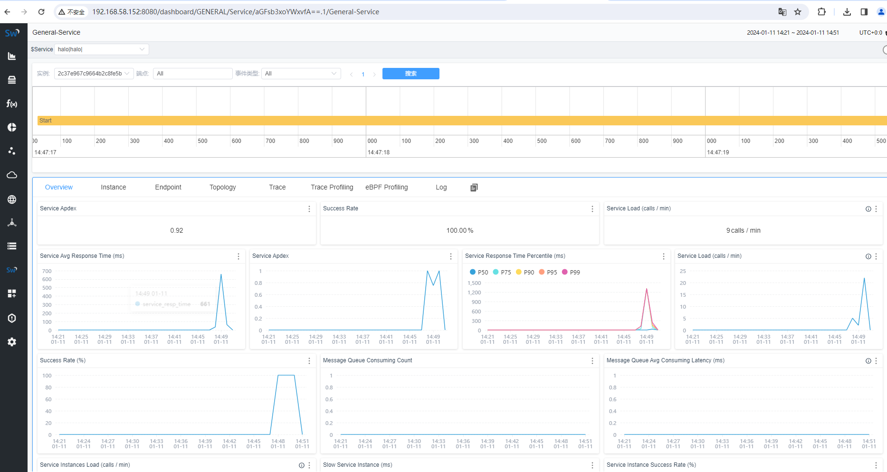

### 4.1.6：skywalking拓扑图

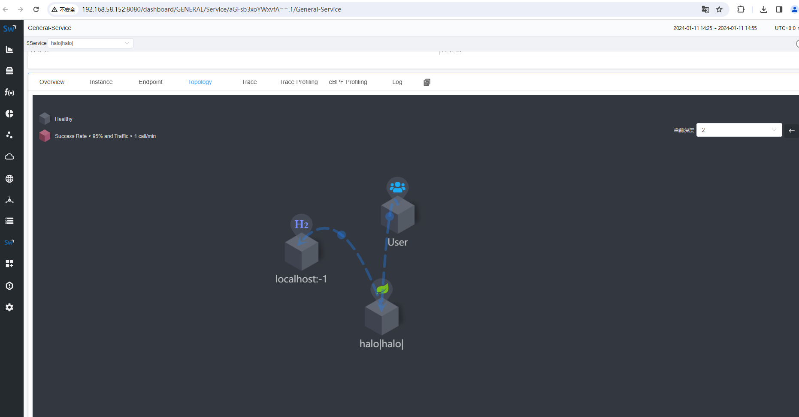

### 4.1.7：skywalking链路追踪图

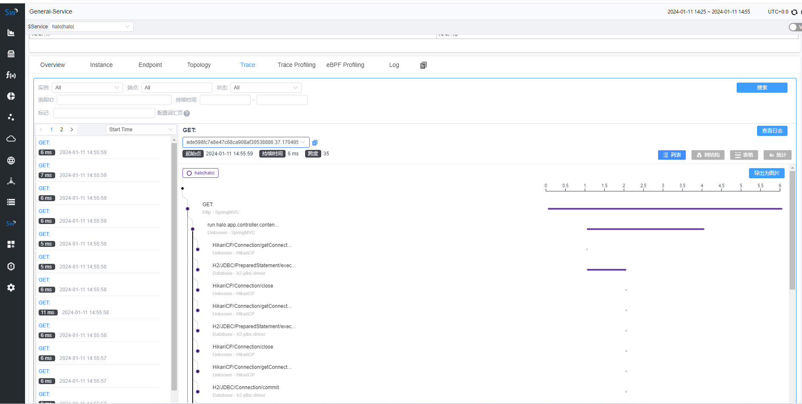

## 4.2：skywalking仪表盘

- Apdex全称是（Application P	erformance Index，应用性能指数），是由Apdex联盟开放的用于评估应用性能的标准，Apdex联盟起源于2004年，Apdex标准从用户角度出发，提供了一个统一的测量和报告用户体验的方法，将其量化为0-1的满意度评价，把最终用户的体验和应用性能作为一个完整的指标进行统一度量。
- 在网络中运行的任意一个应用，它的响应时间决定了用户的满意程度，用户等待所有交互完成时间的长短直接影响了用户对应用的满意程度，Apdex把完成这样一个任务所用的时间长短成为应用的”响应性“
- Apdex定义了应用响应时间的最优门槛为T，另外根据应用响应时间结合T定义了三种不同的性能表现：
  - **Satisfied(满意)**：应用响应时间小于或等于Apdex阈值，比如Apdex阈值为1s，则一个耗时0.6s或1s的响应结果都是满意的
  - **Tolerating（可容忍）**：应用响应时间大于Apdex阈值，但是小于4倍的Apdex阈值
  - **Frustrated(烦躁期)**：应用响应时间大于4倍的Apdex阈值
- 服务（service）表示对请求提供相同行为的工作负载（服务名称），在使用Agent或SDK的时候，可以自定义服务的名称，如果不定义skywalking将会使用你在平台（例如istio）上定义的名字。
- 服务实例（Instance）：上述的一组工作负载中的每一个工作负载成为一个实例，可以是一个pod或者虚拟机。
- 端点(endpoint) : 对于特定服务的请求路径，如/api/v1

## 4.3：Tomcat运行Jenkins并实现链路追踪

### 4.3.1：部署skywalking java agent

```bash
~# apt install openjdk-11-jdk -y
~# cd /apps/
~# wget https://archive.apache.org/dist/skywalking/java-agent/9.0.0/apache-skywalking-java-agent-9.0.0.tgz
~# tar xf apache-skywalking-java-agent-9.0.0.tgz
~# vim /apps/skywalking-agent/config/agent.config
agent.service_name=${SW_AGENT_NAME:tomcat}
agent.namespace=${SW_AGENT_NAMESPACE:tomcat}
collector.backend_service=${SW_AGENT_COLLECTOR_BACKEND_SERVICES:192.168.58.152:11800}
```

### 4.3.2: 部署tomcat

```bash
~$ cd /apps
~$ wget https://dlcdn.apache.org/tomcat/tomcat-8/v8.5.98/bin/apache-tomcat-8.5.98.tar.gz
~$ tar xf apache-tomcat-8.5.98.tar.gz

# 配置tomcat中的javaagent参数
~$ vim bin/catalina.sh
# -----------------------------------------------------------------------------
CATALINA_OPTS="$CATALINA_OPTS -javaagent:/apps/skywalking-agent/skywalking-agent.jar";export CATALINA_OPTS
```

### 4.3.3：部署jenkins

```bash
~$ cd /apps/apache-tomcat-8.5.98/webapps/
~$ wget https://get.jenkins.io/war-stable/2.426.2/jenkins.war
```

### 4.3.4: 启动tomcat

```bash
~$ /apps/apache-tomcat-8.5.98/bin/catalina.sh run
```

### 4.3.5: skywalking验证

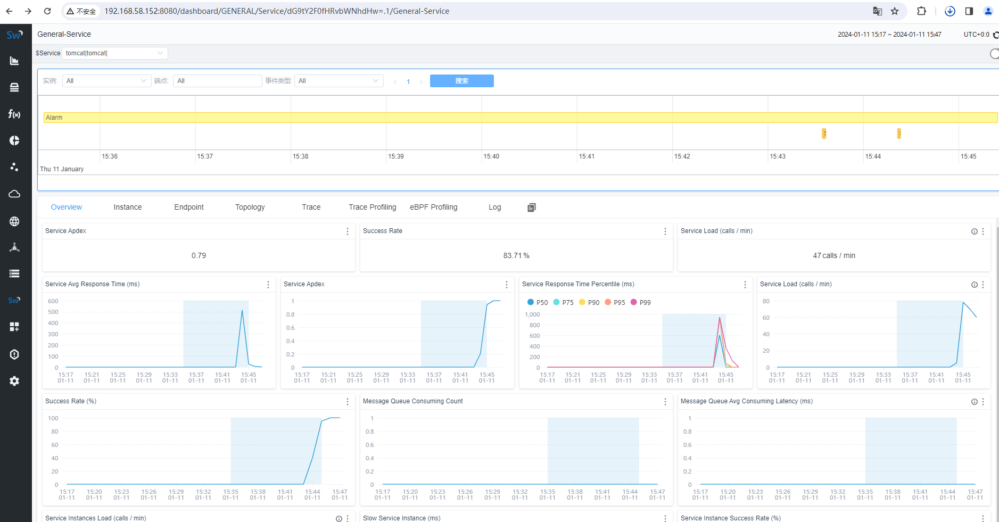

## 4.4：微服务链路追踪案例

### 4.4.1：环境说明

```bash
dubbo provider: 192.168.58.153
dubbo consumer: 192.168.58.154
zookeeper: 192.168.58.155
```

### 4.4.2: zookeeper 部署

```bash
~$ apt install openjdk-11-jdk -y
~$ wget https://dlcdn.apache.org/zookeeper/zookeeper-3.8.3/apache-zookeeper-3.8.3-bin.tar.gz
~$ tar xf apache-zookeeper-3.8.3-bin.tar.gz
~$ cd /apps/apache-zookeeper-3.8.3-bin/conf
~$ cp zoo_sample.cfg zoo.cfg


# 启动
~$ /apps/apache-zookeeper-3.8.3-bin/bin/zkServer.sh start
~$ /apps/apache-zookeeper-3.8.3-bin/bin/zkServer.sh status
/usr/bin/java
ZooKeeper JMX enabled by default
Using config: /apps/apache-zookeeper-3.8.3-bin/bin/../conf/zoo.cfg
Client port found: 2181. Client address: localhost. Client SSL: false.
Mode: standalone
```

### 4.4.3: dubbo-provider部署

```bash
~$ apt install openjdk-11-jdk -y
~$ vim /apps/skywalking-agent/config/agent.config
agent.service_name=${SW_AGENT_NAME:dubbo}
agent.namespace=${SW_AGENT_NAMESPACE:dubbo-provider}
collector.backend_service=${SW_AGENT_COLLECTOR_BACKEND_SERVICES:192.168.58.152:11800}

# dubbo-provider 配置连接zookeeper配置
~$ cat /apps/dubbo-demo-provider-2.1.5/conf/dubbo.properties
dubbo.container=log4j,spring
dubbo.application.name=demo-provider
dubbo.application.owner=
#dubbo.registry.address=multicast://224.5.6.7:1234
dubbo.registry.address=zookeeper://192.168.58.155:2181
#dubbo.registry.address=redis://127.0.0.1:6379
#dubbo.registry.address=dubbo://127.0.0.1:9090

# 启动provider
~$ java -javaagent:/apps/skywalking-agent/skywalking-agent.jar -Djava.awt.headless=true -Djava.net.preferIPv4Stack=true -server -Xms1024m -Xmx1024m -XX:PermSize=128m -XX:SurvivorRatio=2 -XX:+UseParallelGC -classpath /apps/dubbo-demo-provider-2.1.5/conf:/apps/dubbo-demo-provider-2.1.5/lib/cache-api-0.4.jar:/apps/dubbo-demo-provider-2.1.5/lib/commons-codec-1.4.jar:/apps/dubbo-demo-provider-2.1.5/lib/commons-logging-1.1.1.jar:/apps/dubbo-demo-provider-2.1.5/lib/commons-pool-1.5.5.jar:/apps/dubbo-demo-provider-2.1.5/lib/dubbo-2.1.5.jar:/apps/dubbo-demo-provider-2.1.5/lib/dubbo-demo-2.1.5.jar:/apps/dubbo-demo-provider-2.1.5/lib/dubbo-demo-provider-2.1.5.jar:/apps/dubbo-demo-provider-2.1.5/lib/fastjson-1.1.8.jar:/apps/dubbo-demo-provider-2.1.5/lib/gmbal-api-only-3.0.0-b023.jar:/apps/dubbo-demo-provider-2.1.5/lib/grizzly-core-2.1.4.jar:/apps/dubbo-demo-provider-2.1.5/lib/grizzly-framework-2.1.4.jar:/apps/dubbo-demo-provider-2.1.5/lib/grizzly-portunif-2.1.4.jar:/apps/dubbo-demo-provider-2.1.5/lib/grizzly-rcm-2.1.4.jar:/apps/dubbo-demo-provider-2.1.5/lib/hessian-4.0.7.jar:/apps/dubbo-demo-provider-2.1.5/lib/hibernate-validator-4.2.0.Final.jar:/apps/dubbo-demo-provider-2.1.5/lib/httpclient-4.1.2.jar:/apps/dubbo-demo-provider-2.1.5/lib/httpcore-4.1.2.jar:/apps/dubbo-demo-provider-2.1.5/lib/javassist-3.15.0-GA.jar:/apps/dubbo-demo-provider-2.1.5/lib/jedis-2.0.0.jar:/apps/dubbo-demo-provider-2.1.5/lib/jetty-6.1.26.jar:/apps/dubbo-demo-provider-2.1.5/lib/jetty-util-6.1.26.jar:/apps/dubbo-demo-provider-2.1.5/lib/jline-0.9.94.jar:/apps/dubbo-demo-provider-2.1.5/lib/log4j-1.2.16.jar:/apps/dubbo-demo-provider-2.1.5/lib/management-api-3.0.0-b012.jar:/apps/dubbo-demo-provider-2.1.5/lib/mina-core-1.1.7.jar:/apps/dubbo-demo-provider-2.1.5/lib/netty-3.2.5.Final.jar:/apps/dubbo-demo-provider-2.1.5/lib/servlet-api-2.5-20081211.jar:/apps/dubbo-demo-provider-2.1.5/lib/slf4j-api-1.6.2.jar:/apps/dubbo-demo-provider-2.1.5/lib/spring-2.5.6.SEC03.jar:/apps/dubbo-demo-provider-2.1.5/lib/validation-api-1.0.0.GA.jar:/apps/dubbo-demo-provider-2.1.5/lib/zookeeper-3.3.3.jar: com.alibaba.dubbo.container.Main
```

### 4.4.3: dubbo-consumer部署

```bash
~# apt install openjdk-11-jdk -y
~# cd /apps/
~# wget https://archive.apache.org/dist/skywalking/java-agent/9.0.0/apache-skywalking-java-agent-9.0.0.tgz
~# tar xf apache-skywalking-java-agent-9.0.0.tgz
~# vim /apps/skywalking-agent/config/agent.config
agent.service_name=${SW_AGENT_NAME:dubbo}
agent.namespace=${SW_AGENT_NAMESPACE:dubbo-consume}
collector.backend_service=${SW_AGENT_COLLECTOR_BACKEND_SERVICES:192.168.58.152:11800}


# dubbo-consume 配置连接zookeeper配置
~$ cat /apps/dubbo-demo-provider-2.1.5/conf/dubbo.properties
dubbo.container=log4j,spring
dubbo.application.name=demo-provider
dubbo.application.owner=
#dubbo.registry.address=multicast://224.5.6.7:1234
dubbo.registry.address=zookeeper://192.168.58.155:2181
#dubbo.registry.address=redis://127.0.0.1:6379
#dubbo.registry.address=dubbo://127.0.0.1:9090

# 启动consumer
~$ java -javaagent:/apps/skywalking-agent/skywalking-agent.jar -Djava.awt.headless=true -Djava.net.preferIPv4Stack=true -server -Xms1024m -Xmx1024m -XX:PermSize=128m -XX:SurvivorRatio=2 -XX:+UseParallelGC -classpath /apps/dubbo-demo-consumer-2.1.5/conf:/apps/dubbo-demo-consumer-2.1.5/lib/cache-api-0.4.jar:/apps/dubbo-demo-consumer-2.1.5/lib/commons-codec-1.4.jar:/apps/dubbo-demo-consumer-2.1.5/lib/commons-logging-1.1.1.jar:/apps/dubbo-demo-consumer-2.1.5/lib/commons-pool-1.5.5.jar:/apps/dubbo-demo-consumer-2.1.5/lib/dubbo-2.1.5.jar:/apps/dubbo-demo-consumer-2.1.5/lib/dubbo-demo-2.1.5.jar:/apps/dubbo-demo-consumer-2.1.5/lib/dubbo-demo-consumer-2.1.5.jar:/apps/dubbo-demo-consumer-2.1.5/lib/fastjson-1.1.8.jar:/apps/dubbo-demo-consumer-2.1.5/lib/gmbal-api-only-3.0.0-b023.jar:/apps/dubbo-demo-consumer-2.1.5/lib/grizzly-core-2.1.4.jar:/apps/dubbo-demo-consumer-2.1.5/lib/grizzly-framework-2.1.4.jar:/apps/dubbo-demo-consumer-2.1.5/lib/grizzly-portunif-2.1.4.jar:/apps/dubbo-demo-consumer-2.1.5/lib/grizzly-rcm-2.1.4.jar:/apps/dubbo-demo-consumer-2.1.5/lib/hessian-4.0.7.jar:/apps/dubbo-demo-consumer-2.1.5/lib/hibernate-validator-4.2.0.Final.jar:/apps/dubbo-demo-consumer-2.1.5/lib/httpclient-4.1.2.jar:/apps/dubbo-demo-consumer-2.1.5/lib/httpcore-4.1.2.jar:/apps/dubbo-demo-consumer-2.1.5/lib/javassist-3.15.0-GA.jar:/apps/dubbo-demo-consumer-2.1.5/lib/jedis-2.0.0.jar:/apps/dubbo-demo-consumer-2.1.5/lib/jetty-6.1.26.jar:/apps/dubbo-demo-consumer-2.1.5/lib/jetty-util-6.1.26.jar:/apps/dubbo-demo-consumer-2.1.5/lib/jline-0.9.94.jar:/apps/dubbo-demo-consumer-2.1.5/lib/log4j-1.2.16.jar:/apps/dubbo-demo-consumer-2.1.5/lib/management-api-3.0.0-b012.jar:/apps/dubbo-demo-consumer-2.1.5/lib/mina-core-1.1.7.jar:/apps/dubbo-demo-consumer-2.1.5/lib/netty-3.2.5.Final.jar:/apps/dubbo-demo-consumer-2.1.5/lib/servlet-api-2.5-20081211.jar:/apps/dubbo-demo-consumer-2.1.5/lib/slf4j-api-1.6.2.jar:/apps/dubbo-demo-consumer-2.1.5/lib/spring-2.5.6.SEC03.jar:/apps/dubbo-demo-consumer-2.1.5/lib/validation-api-1.0.0.GA.jar:/apps/dubbo-demo-consumer-2.1.5/lib/zookeeper-3.3.3.jar: com.alibaba.dubbo.container.Main
```

### 4.4.4: provider请求验证

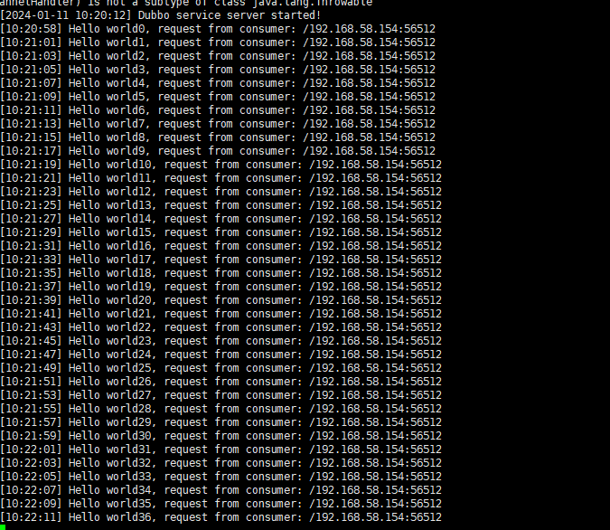

### 4.4.5：skywalking验证

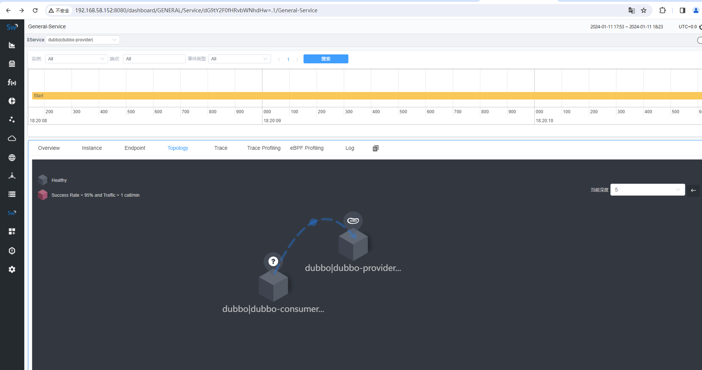

## 4.5：Python服务链路追踪案例

**skyWalking Python agent requires SkyWalking 8.0+ and Python 3.7+**

```bash
# 将django包导入
~$ cd /apps
~$ tar xf django-test.tgz
~$ cd django-test

# 安装模块
~$ apt install python3-pip
~$ pip3 install -r requirements.txt

# 创建django项目mysite
~$ django-admin startproject mysite

# 创建应用
~$ cd mysite
~$ python3 manage.py startapp myapp

# 初始化数据库
~$ python3 manage.py makemigrations
~$ python3 manage.py migrate

# 创建管理员，用于登录admin
~$ python3 manage.py createsuperuser

# skywaking环境变量
export SW_AGENT_NAME='python'
export SW_AGENT_NAMESPACE='python'
export SW_AGENT_COLLECTOR_BACKEND_SERVICES='192.168.58.152:11800'

# 修改配置
~$ vim mysite/settings.py
ALLOWED_HOSTS=['127.0.0.1','192.168.58.153']

# 启动app服务
~$ sw-python -d run python3 manage.py runserver 192.168.58.153:80

# 访问 http://192.168.58.153:80/admin
```

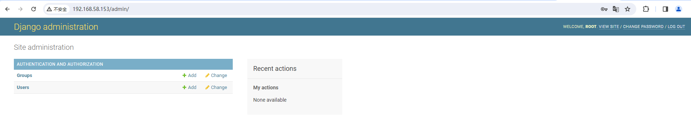

验证skywalking界面

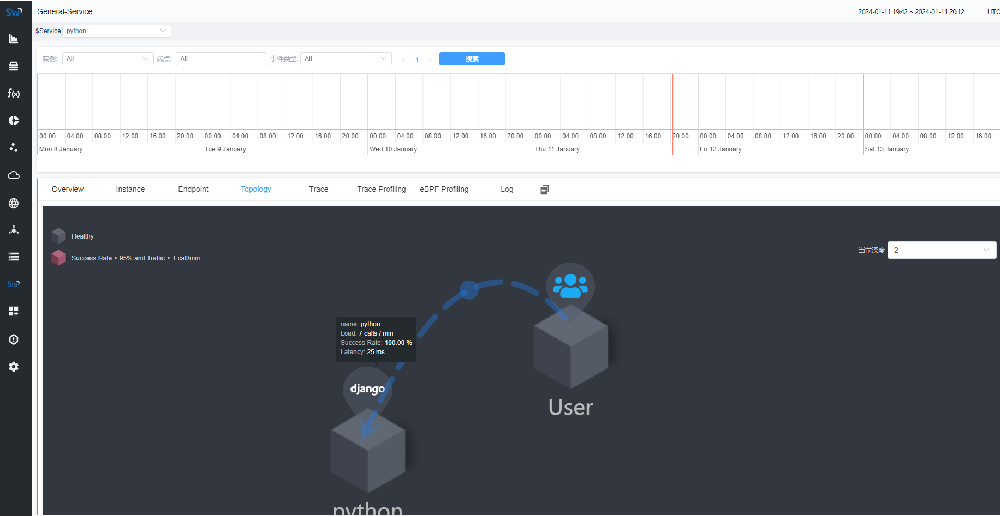

# 五：skywalking告警

https://github.com/apache/skywalking/blob/master/docs/en/setup/backend/backend-alarm.md

## 5.1：告警指标

```bash
~$ vim /apps/apache-skywalking-apm-bin/config/oal/core.oal
service_resp_time # 服务的响应时间
service_sla # 服务http请求成功率SLV，比如99%
service_cpm # 表示每分钟吞吐量
service_percentile # 指定响应时间百分比，即p99,p95,p75,p50的数据统计结果
service_apdex # 应用性能指数、

// Endpoint scope metrics
endpoint_cpm # 端点每分钟吞吐量
endpoint_resp_time # 端点响应时间
endpoint_sla # 端点http请求成功率SLA，比如99%
endpoint_percentile # 端点的最近多少数据范围内的响应时间百分比，即p99,p95,p75统计结果
```

## 5.2：告警配置

```bash
~$ vim /apps/apache-skywalking-apm-bin/config/alarm-settings.yml
rules:  #定义rule规则
  service_cpm_rule: #唯一的规则名称,必须以_rule结尾
    # Metrics value need to be long, double or int
    metrics-name: service_cpm  #指标名称
    op: ">" #操作符,>, >=, <, <=, ==
    threshold: 1 #指标阈值
    # The length of time to evaluate the metrics
    period: 2 #评估指标的间隔周期
    # How many times after the metrics match the condition, will trigger alarm
    count: 1 #匹配成功多少次就会触发告警
    # How many times of checks, the alarm keeps silence after alarm triggered, default as same as period.
    #silence-period: 3
    silence-period: 2 #触发告警后的静默时间
    message: dubbo-provider service_cpm 大于1了 #告警信息

dingtalkHooks:
  textTemplate: |-
    {
      "msgtype": "text",
      "text": {
        "content": "Apache SkyWalking Alarm: \n %s."
      }
    }
  webhooks:
    - url: https://oapi.dingtalk.com/robot/send?access_token=3f773a20ef885659112b0d49086ca60d575562a2b1f113fbe215703366bb66f9 
```

## 5.3：告警验证


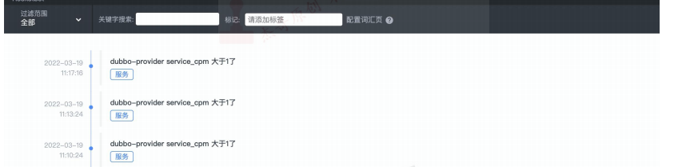
