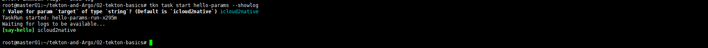
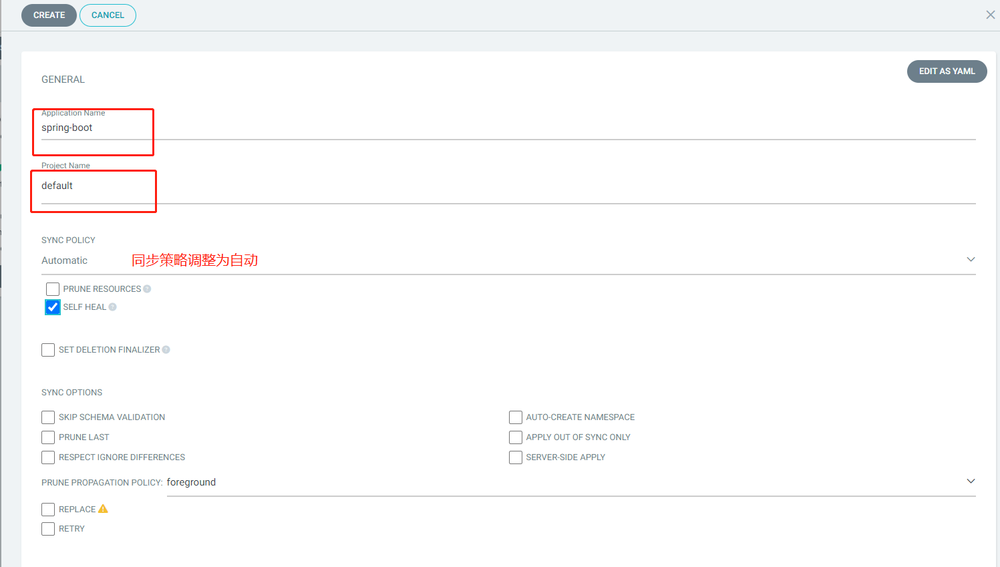
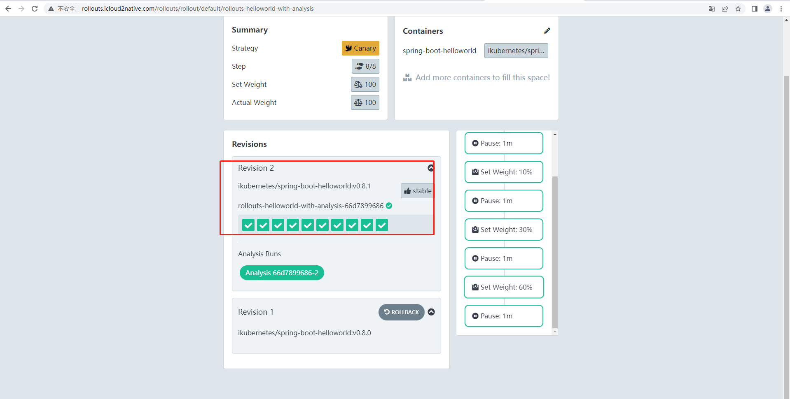

# 1 GitOps

## 1.1 GitOps简介

- [ ] 一套使用Git来管理基础架构和应用配置的实践，一项事关部署流程的技术：
- [ ] 在运行过程中以Git为声明性基础架构和应用的单一事实来源
- [ ] 使用Git拉取请求来自动管理基础架构的置备和部署
- [ ] Git存储库包含系统的全部状态，因此系统状态的修改痕迹既可查看也可审计
- [ ] 与DevOps相比，GitOps更侧重于基于工具和框架的实践
- [ ]  简单来说：GitOps = IaC + MRs + CI/CD
  - MRs：Merge Requests

## 1.2  典型GitOps Pipeline

- [ ] **GitOps模型中存在的两个Git仓库**
  - 代码仓库(code repo)：开发人员使用，推送代码变更；
  - 配置仓库(config repo)：运维人员使用，推送配置变更；
- [ ] **简要工作流程**
  - 开发人员推送代码变更至代码仓库
  - CI工具链完成测试构建
  - CD工具链完成测试交付（新镜像推送镜像仓库）
  - Config Update(即Deployment Automator)将image的变更信息推送到配置仓库
  - 随后，使用分支和发布策略，完成应用部署


## 1.3 GitOps的实施要点

- [ ] **GitOps强调的重心在于，它要求对应用程序、环境、部署操作和基础架构的所有变更，都应以声明式描述文件存在Git中**
  - 基础设施：例如，以Terraform模块或Cloudformation脚本形式存在的声明，此外，aws也支持使用Kops在基础
    设施上拉起一个集群等；
  - Kubernetes的资源配置: 主要包括Deployments、Services、StatefulSets、PVC和用到的镜像等相关的配置;
  - 环境配置：这里仍然是指Kubernetes配置，它主要包括Kubernetes上的ConfigMap资源对象；
  - 应用程序代码：存储于git之中，但需要通过声明式的Dockerfile打包为docker image
- [ ] **基于Pull Request完成所有变更(不允许SSH手动修改)**
  - master（或main）分支用于反映系统的当前状态；
  - 在master分支上打开新的PR即可完成可能需要的任何更新；
  - PR合并后，将触发CD/GitOps管道；回滚同样由PR触发；
- [ ] **自愈**
  - Git配置仓库保存有应用的预期状态，而Kubernetes上保存有应用的当前状态;
  - 需要一个专用的Operator来负责实现该功能;

## 1.4 如何实施GitOps

- 遵循GitOps的标准流程

-  基于OAM框架模型，DevOps团队协同管理声明式配置清单

- 选择合理的工具集

- 从变更频率高或易于中断的应用程序开始


## 1.5 GitOps工具集

除了Kubernetes集群外，GitOps的实施通常还依赖于如下工具：

- [ ] Git：显然是GitOps的基础和中心；GitHub、GitLab或任何形式的支持自动化Pipeline必要功能的Git Server均可；
- [ ] CI Server：CI Pipeline的基础设施，如Jenkins或者Tekton等;
- [ ] Agent Operator（Deployment Operator)：CD Pipeline的基础组件，GitOps中可用的解决方案包括ArgoCD,Flux等；
- [ ] Canary Deployer：flux提供的名为Flagger的Kubernetes Operator支持金丝雀发布。它能够结合Istio、Linkerd、App Mesh、NGINX、Skipper、Contour、Gloo或Traefik等自动实施流量路由和流量迁移，以及根据Prometheus实现Canary分析。

# 2 Tekton

## 2.1 基础概念

### 2.1.1 Tekton系统组件

- [ ] **Tekton Pipelines**
  - Tekton 最核心的组件，由一组CRD和相关的Operator、webhook组成，需要部署在kubernetes集群上

- [ ] **Tekton Triggers**
  - 触发器，可以触发pipeline的实例化

- [ ] **Tekton CLI**
  - 命令行客户端工具

- [ ] **Tekton dashboard**  
  - Tekton pipelines的web界面

- [ ] Tekton Catalog
  - 由社区贡献的Tekton构建块（building blocks，例如Tasks和Pipelines等），用户可直接使用
- [ ] Tekton Hub
  -  用于访问Catalog的图形界面，基于Web
- [ ] Tekton Operator

### 2.1.2 概念

#### 2.1.2.1 Step,Task 和Pipeline

Tekton Pipeline中的Pipeline模型中存在三个核心术语：Step，Task和Pipeline


- [ ] **Step**
  - CI/CD工作流中的一个具体操作，例如Java程序的编译操作
  - 每个step都会通过一个特定的container（pod中）运行
- [ ] **Task**
  - 由一组step组成的序列，按照定义的顺序依次运行在同一个pod的不同容器
  - 可共享一组环境变量，以及存储卷
- [ ] **Pipeline**
  - 由一组task组成的集合，可定义不同的运行方式：串行，并行，DAG
  - 一个Task的输出可由其后的Task引用

#### 2.1.2.2 TaskRun and PipelineRun

- [ ] **TaskRun and PipelineRun**
  - TaskRun代表Task的一次具体执行过程，类似地，PipelineRun代表Pipeline的一次具体执行过程
  - 具体运行时，Task和Pipeline连接至配置的Resource之上，进而创建出TaskRun和PipelineRun
  - 它们既可由用户手动创建，也可由Trigger自动触发
- [ ] **注意**
  - 实际上，PipelineRun自身并不执行任何具体任务，它是由按特定顺序运行的TaskRun组合而成

#### 2.1.2.3 Parameters

- [ ] **Parameters是按使得Task及Pipeline资源定义出的模板更加具有通用性**
- [ ] **具体使用逻辑**
  - 大多数CI Pipeline的起始位置都是从Git仓库中克隆代码，这通常会定义在一个Task，通过某个具体的Step运行
  - 显然，如果将git url硬编码在Task和Step中，就使得该Task失去了通用性
  - 于是，可以在Task中，可以定义为一个parameter，而在step的代码中引用这些参数作为操作对象
  - TaskRun对Task进行实例化的时候，可以向引用的Task定义的参数传值来完成实例化
- [ ] **实际应用中，我们一般是通过Pipeline基于Task来创建TaskRun对象的，而非直接创建TaskRun**
  - Pipeline可引用已有的Task，或者直接内嵌Task代码
  - 为了完成实例化，Pipeline需要向Task的Parameter进行赋值，但其值，也可以是对Pipeline级别的某个Parameter
    的引用
  - 而对Pipeline上的Parameter的赋值，则由PipelineRun进行

#### 2.1.2.4 Pipeline和Task上的数据共享

- [ ] **Pipeline上可能存在数据共享的需要**

  - 一个Task的多个step之间，前面的step生成的结果，需要由后面的某个step引用
  - 一个Pipeline的多个Task之间，前面的Task处理的结果由后面的某个Task引用。

- [ ] **常见的解决方案有2种**

  - Results

    由task申明，将task中的step生成的结果保存在临时文件(`/tekton/results/<NAME>`),而后由同一个Task中后面的Step引用，或者后面其它Task的step引用。其中文件名也能以变量引用：`$(results.<NAME>.path)`。但是仅仅适用于共享小于4096字节的数据。

  - Workspace

    由Task声明的，且需要由TaskRun在运行时提供的文件系统，通常对应于Kubernetes上的ConfigMap、Secret、emptyDir、静态PVC类型的卷，或者是VolumeClaimTemplate动态请求的PVC；emptyDir的生命周期与Pod相同，因此仅能在一个TaskRun的各Step间共享数据；若要跨Task共享数据，则需要使用PVC。

## 2.2 Pipeline

### 2.2.1 部署

官网：https://tekton.dev/docs/installation/pipelines/

- [ ] **部署Tekton Pipelines**

  - 根据Tekton Pipelines项目提供的配置文件完成部署

    ```sh
    kubectl apply --filename https://storage.googleapis.com/tekton-releases/pipeline/latest/release.yaml
    ```

  - Tekton Pipelines会部署两个controller和webhook两个应用

    ```sh
    kubectl get pods -n tekton-pipelines
    ```

    

- [ ] **部署Tekton dashboard**

  - 根据Tekton dashboard项目提供的配置文件完成部署

    ```sh
    kubectl apply --filename https://storage.googleapis.com/tekton-releases/dashboard/latest/tekton-dashboard-release.yaml
    ```

  - 查看pod

    

  - 将dashboard暴露在集群外，采用的是istio方式

    1. 部署istio

       官网:https://istio.io/latest/docs/setup/getting-started/

       ```sh
       cd /usr/local && curl -L https://istio.io/downloadIstio | sh -
       ```

       ```sh
       ln -sv istio-1.16.1 istio
       ```

       ```sh
       cp bin/istioctl /usr/local/bin/
       ```

       ```sh
       istioctl apply --set profile=demo
       ```

       

    2. 将dashboard暴露

       给istio-ingressgateway的svc绑定一个多余的IP（node02上ens33网卡上有多余ip）

       ```sh
       kubectl edit svc istio-ingressgateway -n istio-system
       ```

       

       ```sh
       kubectl get svc -n istio-system
       ```

       

       配置gateway、virtualservice、destionrule资源配置清单

       ```yaml
       ---
       apiVersion: networking.istio.io/v1beta1
       kind: DestinationRule
       metadata:
         name: tekton-dashboard
         namespace: tekton-pipelines
       spec:
         host: tekton-dashboard
         trafficPolicy:
           tls:
            mode: DISABLE
       ---
       apiVersion: networking.istio.io/v1beta1
       kind: Gateway
       metadata:
         name: tekton-dashboard-gateway
         namespace: istio-system
       spec:
         selector:
           app: istio-ingressgateway
         servers:
         - port:
             name: http
             number: 80
             protocol: HTTP
           hosts:
           - "tekton.icloud2native.com"
           - "ci.icloud2native.com"
       ---
       apiVersion: networking.istio.io/v1beta1
       kind: VirtualService
       metadata:
         name: tekton-dashboard-virtualservice
         namespace: tekton-pipelines
       spec:
         gateways:
         - istio-system/tekton-dashboard-gateway
         hosts:
         - "tekton.icloud2native.com"
         - "ci.icloud2native.com"
         http:
         - match:
           - uri:
               prefix: /
           route:
           - destination:
               host: tekton-dashboard
               port:
                 number: 9097
       ---
       ```

       ```sh
       kubectl apply -f 03-VirtualService-tekton-dashboard.yaml
       ```

       

       本机电脑配置域名解析

       

       修改hosts文件

       

    3.  浏览器打开dashboard

       

  - [ ] **客户端工具tkn**

    https://tekton.dev/docs/cli/

    - 从官网下载tkn的安装包

      ```sh
      wget https://github.com/tektoncd/cli/releases/download/v0.29.0/tektoncd-cli-0.29.0_Linux-64bit.deb
      ```

      ```sh
      dpkg -i tektoncd-cli-0.29.0_Linux-64bit.deb
      ```

      ```sh
      root@master01:~/tekton-and-Argo/02-tekton-basics# tkn version
      Client version: 0.29.0
      Pipeline version: v0.42.0
      Dashboard version: v0.31.0
      ```

  - [ ] **测试一个task**

    - 定义一个Task

      ```yaml
      apiVersion: tekton.dev/v1beta1
      kind: Task
      metadata:
        name: hello
      spec:
        steps:
          - name: say-hello
            image: alpine:3.15
            command: ['/bin/sh']
            args: ['-c', 'echo Hello World']
      ```

    - 运行task

      ```sh
      kubectl apply -f 01-task-hello.yaml
      ```

      ```sh
      tkn task list
      ```

    - 运行taskrun

      ```sh
      tkn task start --showlog hello
      ```

      
      
    - dashboard可以看到taskrun相关信息
    
      
    
    

### 2.2.2 Task使用

#### 2.2.2.1 Task使用parameters

- [ ] Task支持接收和传递参数，相关参数以对象定义在spec.params字段中，可嵌套的常用字段有：
  - name: 参数名称
  - type：参数类型，由string和arrray两种取值
  - description:参数的简要描述
  - default：参数的默认值

```yaml
apiVersion: tekton.dev/v1beta1
kind: Task
metadata:
  name: hello-params
spec:
  params:
  - name: target
    type: string
    description: name to greet
    default: icloud2native
  steps:
  - name: say-hello
    image: alpine:3.15
    command:
    - /bin/sh
    args: ['-c','echo $(params.target)']
```

**不加参数运行task，参数为默认值**

```sh
tkn task start hello-params --showlog
```



**添加自定义参数运行task**


#### 2.2.2.2 Task的Step使用脚本

- [ ] 需要在step中执行复杂操作时，可以使用“script”直接指定运行的脚本
  - 多行脚本，可以使用"|"启用
  - script同command互斥

```yaml
apiVersion: tekton.dev/v1beta1
kind: Task
metadata:
  name: script
spec:
  steps:
  - name: step-with-script
    image: alpine:3.15
    script: |
      #/bin/sh
      echo "step witk script start ..."
      echo "Installing necessary tools ..."
      apk add curl
      curl -s www.baidu.com && echo "Success" || echo "Failed"
      echo "All done"

```

运行该task

```sh
tkn task start script --showlog
```


#### 2.2.2.3 Task中使用多个step

- [ ] 在Task中定义多个step，它们按次序分别在同pod的不同容器中运行
  - 每个step定义一个要运行的容器，其格式遵循k8s的containerspec

```sh
apiVersion: tekton.dev/v1beta1
kind: Task
metadata:
  name: mulit-step
spec:
  steps:
  - name: first
    image: alpine:3.15
    command:
    - /bin/sh
    args: ['-c','echo first step']
  - name: second
    image: alpine:3.15
    command:
    - /bin/sh
    args: ['-c','echo second step']
```

运行task

```sh
tkn task start mulit-step --showlog
```


#### 2.2.2.4 Task中同时使用script和parameters

- [ ] 定义在Task上的Parameters，既可以被steps中的command或args引用，也可以被steps中的script引用

```yaml
apiVersion: tekton.dev/v1beta1
kind: Task
metadata:
  name: logger
spec:
  params:
  - name: text
    type: string
    description: something to logger
    default: "-"
  steps:
  - name: log
    image: alpine:3.15
    script: |
      #!/bin/sh
      apk add -q tzdata
      cp /usr/share/zoneinfo/Asia/Shanghai /etc/localtime
      DATETIME=$(date "+%F %T")
      echo [$DATETIME] - $(params.text)
```

运行该task

```sh
tkn task start logger -p text="Welcome to Littleboy" --showlog
```


### 2.2.2 Pipeline使用

#### 2.2.2.1 Pipeline定义

- [ ] Pipline CRD的资源规范定义
  - 在pipeline的资源规范中，仅task为必选字段，它以对象列表要引用各task
  - tasks字段中每个列表项使用taskRef字段以名称引用目标Task，且被引用的Task要事先存在

```yaml
apiVersion: tekton.dev/v1beta1
kind: Pipeline
metadata:
  name: pipeline-demo
spec:
  tasks:
  - name: first-task
    taskRef:
      name: hello
  - name: second-task
    taskRef:
      name: mulit-step
    # 定义task执行的顺序，第二个task要在第一个task执行完执行
    runAfter:
    - first-task

```

以tkn方式运行pipeline

```sh
tkn pipeline start pipeline-demo --showlog
```


以pipelinerun资源配置清单方式

```yaml
apiVersion: tekton.dev/v1beta1
kind: PipelineRun
metadata:
  name: pipeline-demo-run-xxxx
spec:
  pipelineRef:
    name: pipeline-demo
  serviceAccountName: default   # 为运行各taskrun的pod指定要使用的ServiceAccount  
  timeout: 1h0m0s  # 错误退出前的超时时间
```

```sh
kubectl apply -f 07-pipelinerun-demo.yaml
```


#### 2.2.2.2 Pipeline上使用parameters

- [ ] Pipeline上可定义执行参数
  - 所属的task都可以引用
  - task上若定义了同名的参数，优先级更高

```yaml
apiVersion: tekton.dev/v1beta1
kind: Pipeline
metadata:
  name: pipeline-demo-02
spec:
  params:
  - name: ptarget
    type: string
    default: "icloud2native"
  - name: ptext
    type: string
    default: "welcome to cloudnative"
  tasks:
  - name: first-task
    taskRef:
      name: hello-params
    params:
    - name: target
      value: $(params.ptarget)
  - name: second-task
    taskRef:
      name: logger
    params:
    - name: text
      value: $(params.ptext)

```

tkn运行该pipeline


#### 2.2.2.3 Pipelinerun上使用parameters

```yaml
apiVersion: tekton.dev/v1beta1
kind: PipelineRun
metadata:
  name: piplinerun-params-xxx
spec:
  params:
  - name: ptarget
    value: "cute littleboy"
  - name: ptext
    value: "someting happend"
  pipelineRef:
    name: pipeline-demo-02
  serviceAccountName: default
  timeout: 10m10s

```

```sh
kubectl apply -f 09-pipelinerun-params.yaml 
```


#### 2.2.2.4 定义Pipeline中各task的次序

- [ ] 实现下图task的执行顺序，利用runAfter控制顺序

  

```yaml
apiVersion: tekton.dev/v1beta1
kind: Pipeline
metadata:
  name: pipeline-task-ordering
spec:
  tasks:
    - name: task-a
      taskRef:
        name: logger
      params:
      - name: text
        value: "task-A executed"
    - name: task-b
      taskRef:
        name: logger
      params:
      - name: text
        value: "Executed after task-A"
      runAfter: ["task-a"]
    - name: task-c
      taskRef:
        name: logger
      params:
      - name: text
        value: "Executed after task-A"
      runAfter: ["task-a"]
    - name: task-d
      taskRef:
        name: logger
      params:
      - name: text
        value: "Executed after task-B and task-C"
      runAfter: ["task-b", "task-c"]
```

运行该pipeline

```sh
tkn pipeline start pipeline-task-ordering --showlog
```


### 2.2.3 Workspace

#### 2.2.3.1 Workspace介绍

- [ ] **Workspace是什么**
  - Workspace用于为Task的各step提供工作目录
  - TaskRun的实际运行形式为pod，因而，Workspace对应的实际组件为pod上的volume
    1. configmap和secrets：只读式的workspace
    2. PersistentVolumeClaim：支持跨task共享数据的workspace
    3. emptyDir: l临时工作目录，仅可适用于同一task的不同step之间.

- [ ] **Workspace的功能**
  - 跨Task共享数据
  - 借助secrets加载机密凭据
  - 借助于configmap加载配置数据
  - 持久化存储数据
  - 为Task提供缓存加速构建过程

#### 2.2.3.2 在Task上声明Workspace

- [ ] **在Task配置Workspace**
  - 定义在spec.wordspaces字段中
  - 支持嵌套如下字段
    1. name：必选字段，该workspace的唯一标识
    2. description：描述信息
    3. readOnly：是否为只读，默认为false
    4. optional：是否为可选，默认为false
    5. mountPath：在各容器里挂载的路径，默认为"/workspace/<name>"，其中<name>为当前workspace的名称

- [ ] **在Task中可用的workspace的变量**
  - $(workspaces.<name>.path)：指定的workspace的挂载的路经
  - $(workspaces.<name>.bound)：值为ture或false，用于表示指定的workspace是否已经绑定
  - $(workspaces.<name>.claim)：表示当前workspace所使用的pvc的名称
  - $(workspaces.<name>.volume)：表示当前workspce所使用的volume的名称

#### 2.2.3.3 在Task上Workspace使用示例

- [ ] **Workspace使用emptyDir存储卷的示例**

  ```yaml
  apiVersion: tekton.dev/v1beta1
  kind: Task
  metadata:
    name: workspace-demo
  spec:
    params:
    - name: target
      type: string
      default: ClouNative
    steps:
    - name: wrtite-message
      image: alpine:3.15
      script: |
        #!/bin/sh
        set -xe
        if [ "$(workspaces.message.bound)" == "true" ];then
           echo "Hello $(params.target)" > $(workspaces.message.path)/message
        fi
  
        echo "MountPath: $(workspaces.message.path)"
        echo "Volume Name: $(workspaces.message.volume)"
    workspaces:
    - name: message
      optional: true
      mountPath: /data   #自定义挂载点
  
  ```

  直接运行

  ```sh 
  tkn task start --showlog workspace-demo -p target="little boy" -w name=message,emptyDir=""
  ```

  

- [ ] **在多个step中访问共享的workspace**

  ```yaml
  apiVersion: tekton.dev/v1beta1
  kind: Task
  metadata:
    name: source-lister
  spec:
    params:
    - name: git-repo
      type: string
      description: Git repo to be cloned
    steps:
    - name: fit-clone
      image: alpine/git:v2.32.0
      script: git clone -v $(params.git-repo) $(workspaces.source.path)/source
    - name: list-file
      image: alpine:3.15
      command:
      - /bin/sh
      args:
      - '-c'
      - 'ls $(workspaces.source.path)/source'
    workspaces:
    - name: source
  ```

  直接运行

  ```sh
  tkn task start source-lister --showlog -p git-repo="https://gitee.com/mageedu/spring-boot-helloWorld.git" -w name=source,emptyDir=""
  ```

  

#### 2.2.3.4 在pipeline上使用workspace

- [ ] **在Pipeline资源配置上配置workspace和parameters**

  - 在spec.parameters上定义parameter，而后在task上引用赋值；
  - 在spec.workspaces上定义workspace，而后在Task上引用赋值

  ```yaml
  apiVersion: tekton.dev/v1beta1
  kind: Pipeline
  metadata:
    name: pipeline-source-lister
  spec:
    params:
    - name: git-url
      type: string
    workspaces:
    - name: codebase
    tasks:
    - name: git-clone
      taskRef:
        name: source-lister
      params:
      - name: git-repo
        value: $(params.git-url)
      workspaces:
      - name: source
        workspace: codebase
  ```

  运行pipeline

  ```sh
  tkn pipeline start --showlog pipeline-source-lister -p git-url="https://gitee.com/mageedu/spring-boot-helloWorld.git" -w name=codebase,emptyDir=""
  ```

  

#### 2.2.3.5 nfs-csi driver的设置以及StorageClass创建

对于不同的task之间需要共享数据，只能用workspace中的pvc存储卷类型，所以，首先部署一个nfs-csi driver用来动态生成pv. Reference :https://github.com/kubernetes-csi/csi-driver-nfs/blob/master/deploy/example/README.md

- [ ] **在kubernetes集群上部署一个nfs-server**

  1、创建一个nfs的namespace

  ```sh
  kubectl create ns nfs
  ```

  2、在kubernetes上部署nfs-server

  ```sh
  kubectl create -f https://raw.githubusercontent.com/kubernetes-csi/csi-driver-nfs/master/deploy/example/nfs-provisioner/nfs-server.yaml -n nfs
  ```

  

- [ ] **在k8s集群中部署nfs csi driver**

  ```sh
  curl -skSL https://raw.githubusercontent.com/kubernetes-csi/csi-driver-nfs/v3.1.0/deploy/install-driver.sh | bash -s v3.1.0 --
  ```

  

- [ ] **创建基于nfs的StorageClass**

  ```sh
  apiVersion: storage.k8s.io/v1
  kind: StorageClass
  metadata:
    name: nfs-csi
  provisioner: nfs.csi.k8s.io
  parameters:
    server: nfs-server.nfs.svc.cluster.local
    share: /
    # csi.storage.k8s.io/provisioner-secret is only needed for providing mountOptions in DeleteVolume
    # csi.storage.k8s.io/provisioner-secret-name: "mount-options"
    # csi.storage.k8s.io/provisioner-secret-namespace: "default"
  reclaimPolicy: Delete
  volumeBindingMode: Immediate
  mountOptions:
    - nfsvers=4.1
  ```

  

- [ ] **测试创建pvc，看能否动态绑定pv**

  ```sh
  kubectl create -f https://raw.githubusercontent.com/kubernetes-csi/csi-driver-nfs/master/deploy/example/pvc-nfs-csi-dynamic.yaml
  ```

  

#### 2.2.3.6 在pipelinerun上使用workspace(PVC)

```yaml
apiVersion: tekton.dev/v1beta1
kind: Pipeline
metadata:
  name: volume-share
spec:
  params:
  - name: git-url
    type: string
  workspaces:
  - name: codebase
  tasks:
  - name: fetch-from-source
    params:
    - name: url
      value: $(params.git-url)
    workspaces:
    - name: source
      workspace: codebase
    taskSpec:
      params:
      - name: url
      workspaces:
      - name: source
      steps:
      - name: git-clone
        image: alpine/git:v2.36.1
        script: git clone -v $(params.url) $(workspaces.source.path)/source
  - name: source-lister
    runAfter:
    - fetch-from-source
    workspaces:
    - name: source1
      workspace: codebase
    taskSpec:
      workspaces:
      - name: source1
      steps:
      - name: list-files
        image: alpine:3.16
        script: ls $(workspaces.source1.path)/source
---
apiVersion: tekton.dev/v1beta1
kind: PipelineRun
metadata:
  name: volume-share-run-xxx
spec:
  pipelineRef:
    name: volume-share
  params:
  - name: git-url
    value: https://gitee.com/mageedu/spring-boot-helloWorld.git
  workspaces:
  - name: codebase
    volumeClaimTemplate:
      spec:
        accessModes:
        - ReadWriteOnce
        resources:
          requests:
            storage: 1Gi
        storageClassName: nfs-csi
```

运行

```sh
 kubectl apply -f 04-pipeline-workspace-pvc.yaml
```

```sh
tkn pipelinerun logs volume-share-run-xxx
```


#### 2.2.3.7 实践案例之maven项目构建

- [ ] **Pipeline示例说明**

  - 包含两个task：fetch-from-source和build
  - 使用基于PVC的Workspace完成数据共享
  - 使用参数git-url接受用户具体的代码仓库地址

  ```yaml
  apiVersion: tekton.dev/v1beta1
  kind: Pipeline
  metadata:
    name: source-2-package
  spec:
    params:
      - name: git-url
        type: string
    workspaces:
      - name: codebase
    tasks:
      - name: fetch-from-source
        params:
          - name: url
            value: $(params.git-url)
        taskSpec:
          workspaces:
            - name: source
          params:
            - name: url
          steps:
            - name: git-clone
              image: alpine/git:v2.36.1
              script: git clone -v $(params.url) $(workspaces.source.path)/source
        workspaces:
          - name: source
            workspace: codebase
      - name: build-package
        runAfter:
          - fetch-from-source
        taskSpec:
          steps:
            - name: build
              image: maven:3.8-openjdk-11-slim
              workingDir: $(workspaces.source.path)/source
              script: |
                mvn clean install
          workspaces:
            - name: source
        workspaces:
          - name: source
            workspace: codebase
  ---
  apiVersion: tekton.dev/v1beta1
  kind: PipelineRun
  metadata:
    name: source-2-package-run-001
  spec:
    pipelineRef:
      name: source-2-package
    params:
      - name: git-url
        value: https://gitee.com/mageedu/spring-boot-helloWorld.git
    workspaces:
      - name: codebase
        volumeClaimTemplate:
          spec:
            accessModes:
              - ReadWriteOnce
            resources:
              requests:
                storage: 1Gi
            storageClassName: nfs-csi
  ```

  运行

  

#### 2.2.3.8 跨Pipelerun的数据共享之volume

- [ ] **Volume可显示定义要在Task和step上使用存储卷**

  - 例如，为maven指定cache
    1. 将下载的模块保存在指定的volume上，可由相关的task和step重复使用
    2. 即便不同的pipeline,也能够使用同一基于PVC等支持多个pod访问的存储卷
  - volume的定义与使用
    1. 在Task的spec.volumes的字段中定义存储卷列表
    2. 在step中使用volumeMounts进行引用

- [ ] **下面示例即位volume的使用示例**

  - 相关的PVC需要事先定义

    ```yaml
    apiVersion: v1
    kind: PersistentVolumeClaim
    metadata:
      name: maven-cache
    spec:
      storageClassName: nfs-csi
      accessModes:
        - ReadWriteMany
      resources:
        requests:
          storage: 5Gi
    ```

  - 定义基于volume的pipeline和pipelierun

    ```yaml
    apiVersion: v1
    kind: PersistentVolumeClaim
    metadata:
      name: maven-cache
    spec:
      storageClassName: nfs-csi
      accessModes:
        - ReadWriteMany
      resources:
        requests:
          storage: 1Gi
    ---
    apiVersion: tekton.dev/v1beta1
    kind: Pipeline
    metadata:
      name: source-2-package
    spec:
      params:
        - name: git-url
          type: string
      workspaces:
        - name: codebase
      tasks:
        - name: fetch-from-source
          params:
            - name: url
              value: $(params.git-url)
          taskSpec:
            workspaces:
              - name: source
            params:
              - name: url
            steps:
              - name: git-clone
                image: alpine/git:v2.36.1
                script: git clone -v $(params.url) $(workspaces.source.path)/source
          workspaces:
            - name: source
              workspace: codebase
        - name: build-package
          runAfter:
            - fetch-from-source
          taskSpec:
            steps:
              - name: build
                image: maven:3.8-openjdk-11-slim
                workingDir: $(workspaces.source.path)/source
                volumeMounts:
                - name: m2
                  mountPath: /root/.m2
                script: |
                  mvn clean install
            workspaces:
              - name: source
            volumes:
            - name: m2
              persistentVolumeClaim:
                claimName: maven-cache
          workspaces:
            - name: source
              workspace: codebase
    ---
    apiVersion: tekton.dev/v1beta1
    kind: PipelineRun
    metadata:
      name: source-2-package-run-002
    spec:
      pipelineRef:
        name: source-2-package
      params:
        - name: git-url
          value: https://gitee.com/mageedu/spring-boot-helloWorld.git
      workspaces:
        - name: codebase
          volumeClaimTemplate:
            spec:
              accessModes:
                - ReadWriteOnce
              resources:
                requests:
                  storage: 1Gi
              storageClassName: nfs-csi
    ```

  - 第一次运行，查看运行时间

    

  - 第二次运行，发现时间明显缩短，cache生效

    

#### 2.2.3.9 使用Result进行数据共享

- [ ] **Result简介**

  - Pipeline的Task之间使用同一共享的Workspace可以完成数据共享，但对于简单的字符串数据传递，可以使用Result传地

- [ ] **在Task中使用Result**

  - 以列表形式定义在spec.results字段中
  - Task将会为每个results条目自动创建一个文件进行保存，这些文件统一放置在/tektons/results目录下面
  - 在step中引用results条目的格式为: $(results.<resultName>.path)

- [ ] **在Task中引用Results**使用的变量

  - $(results.<resultName>.path)

- [ ] **Pipeline中引用Results使用的变量**

  - tasks.<taskName>.results.<resultName>

- [ ] **使用Results进行数据传递示例**

  - 前一个step生成日期时间
  - 后一个step将日期时间和版本号合并为build ID
  - build ID将作为后续Task中的镜像文件标签使用

  ```yaml
  apiVersion: tekton.dev/v1beta1
  kind: Task
  metadata:
    name: generate-buildid
  spec:
    params:
    - name: version
      type: string
      default: "v0.1"
    results:
    - name: datetime
    -  name: buildid
    steps:
    - name: generate-datetime
      image: ikubernetes/admin-box:v1.2
      script: |
        #!/bin/sh
        datetime=`date +%Y%m%d-%H%M%S`
        echo -n ${datetime} | tee $(results.datetime.path)
    - name: generate-buildid
      image: ikubernetes/admin-box:v1.2
      script: |
        #!/bin/sh
        buildDatetime=`cat $(results.datetime.path)`
        buildId=$(params.version)-${buildDatetime}
        echo -n ${buildId} | tee $(results.buildid.path)
  ```

  运行：

  ```sh
  tkn task start generate-buildid  --showlog -p version="0.2"
  ```

  

### 2.2.4 Pipeline 高级用法

- [ ] 使用taskRef或者taskSpec可将Task添加至pipeline，他们以列表的形式定义在spec.tasks字段中

- [ ] 对于这些Task的运行，允许用户：

  - 使用when表达式来为其添加执行条件
  - 使用timeout定义任务超时时长
  - 使用runAfter定义任务的执行顺序
  - 定义finally任务，定义一个最终任务
  - 使用retries定义重试次数

  ```yaml
  apiVersion: tekton.dev/v1beta1
  kind: Pipeline
  metadata:
    name: <PIPELINE_NAME>
  spec:
    description: ...
    params: [ ]
    workspaces: [ ]
    results: [ ]
    tasks:
     - name: <TASK_NAME_IN_PIPELINE>
       taskRef: <TASK_NAME> 
       taskSpec: {TASK_SPECIFICATION}
       runAfter: [ ]
       retires: ...
       when: [ ]Object
       timeout: ...
    finally: 
    - name: <TASK_NAME_IN_PIPELINE>
      taskRef: <TASK_NAME> 
      taskSpec: {TASK_SPECIFICATION}
  ```

#### 2.2.4.1 在Pipeline上使用when表达式

- [ ] **when表达式共有三个字段组成**

  - input: 支持使用静态值或变量
  - operator：比较操作符，仅支持in或notin两个
  - values：由字符串组成的列表，必须定义且不能为空值，允许使用静态值或变量

- [ ] **使用示例**

  - 示例一：

    ```yaml
    tasks:
    - name: first-create-file
      when:
      - input: "$(params.path)"
        operator: in
        values: ["README.md"]
      taskRef:
        name: first-create-file
    ---
    tasks:
    - name: echo-file-exists
      when:
       - input: "$(tasks.check-file.results.exists)"
         operator: in
         values: ["yes"]
      taskRef:
        name: echo-file-exists
    ---
    tasks:
    - name: deploy-in-blue
      when:
      - input: "blue"
        operator: in
        values: ["$(params.deployments[*])"]
      taskRef:
        name: deployment
    ---
    ```

  - 示例二

    ```yaml
    tasks:
    - name: manual-approval
      runAfter: tests
      when:
      - input: $(params.git-action)
        operator: in
        values: ['merge']
      taskRef:
        name: manual-approval
    - name: build-image
      when:
      - input: $(params.git-action)
        operator: in
        values: ['merge'] 
      runAfter: - manual-approval
      taskRef:
        name: build-image
    - name: deploy-image
      when:
       - input: $(params.git-action)
         operator: in
         values: ['merge']
      runAfter: - build-image
      taskRef:
        name: deploy-image
    ```

    

#### 2.2.4.2 在Pipeline上使用Finally Task

- [ ] **关于finally task**
  - 用于在tasks中个任务执行结束后运行
  - 定义格式与tasks字段相似
  - 支持嵌套定义多个task
  - 这些task支持使用parameters和Results
  - 支持使用when表达式
- [ ] **常用场景**
  - 发送通知：将任务执行结果邮件，钉钉或其他方式发送
  - 清理资源：清理此前任务遗留的资源

### 2.2.5 实战案例Source-2-Image

#### 2.2.5.1 Source to Image项目介绍

- **案例环境说明**

  - 示例项目：

     代码仓库：https://gitee.com/mageedu/spring-boot-helloWorld.git

     构建工具maven

  - pipeline各Task

    - git-clone：克隆项目的源代码

    - build-to-package: 代码测试，构建和打包

    - generate-build-id：生成build id

    - image-build-and-push：镜像构建和推送

    - deploy-to-cluster：将新版本的镜像部署到kubernetes集群

  - Workspace
    - 基于PVC，跨task数据共享

  

  

#### 2.2.5.2 pipeline完成Image构建，推送和部署

1. 01-git-clone的Task

   ```yaml
   apiVersion: tekton.dev/v1beta1
   kind: Task
   metadata:
     name: git-clone
   spec:
     description: Clone code to the workspace
     params:
     - name: url
       type: string
       description: git url to clone
       default: ""
     - name: branch
       type: string
       description: git branch to checkout
       default: "main"
     workspaces:
     - name: source
       description: The code repo will clone in the workspace
     steps:
     - name: git-clone
       image: alpine/git:v2.36.1
       script: git clone -b $(params.branch) -v $(params.url) $(workspaces.source.path)/source
   
   ```

2. 02--build-to-package.yaml

   ```yaml
   apiVersion: tekton.dev/v1beta1
   kind: Task
   metadata:
     name: build-to-package
   spec:
     workspaces:
     - name: source
       description: The code repo in the workspaces
     steps:
     - name: build
       image: maven:3.8-openjdk-11-slim
       workingDir: $(workspaces.source.path)/source
       volumeMounts:
       - name: m2
         mountPath: /root/.m2
       script: mvn clean install
     # 定义volume提供maven cache，但是前提得创建出来maven-cache的pvc
     volumes:
     - name: m2
       persistentVolumeClaim:
         claimName: maven-cache
   ```

   

3. 03-generate-build-id.yaml

   ```yaml
   apiVersion: tekton.dev/v1beta1
   kind: Task
   metadata:
     name: generate-build-id
   spec:
     params:
       - name: version
         description: The version of the application
         type: string
     results:
       - name: datetime
         description: The current date and time
       - name: buildId
         description: The build ID
     steps:
       - name: generate-datetime
         image: ikubernetes/admin-box:v1.2
         script: |
           #!/usr/bin/env bash
           datetime=`date +%Y%m%d-%H%M%S`
           echo -n ${datetime} | tee $(results.datetime.path)
       - name: generate-buildid
         image: ikubernetes/admin-box:v1.2
         script: |
           #!/usr/bin/env bash
           buildDatetime=`cat $(results.datetime.path)`
           buildId=$(params.version)-${buildDatetime}
           echo -n ${buildId} | tee $(results.buildId.path)
   
   ```

   

4. 04-build-image-push.yaml

   要想能推送镜像到镜像仓库，必须创建一个secret对象，挂在到kaniko的/kaniko/.docker目录下，具体创建secret的方法有两种：

   1、先在一台机器上login镜像仓库，这里以dockerhub为例，将会把认证文件保存在`~/.docker/config.json`:

   

   基于config,json创建sectet，这里的secret的类型选择generic

   ```sh
   kubectl create secret generic docker-config --from-file=/root/.docker/config.json
   ```

   2、先基于user/password创建一个base64：

   ```sh
   echo -n USER:PASSWORD | base64
   ```

   创建一个config.json，然后将创建出来的base64替换到下面xxxxxxxxxxxxxxx

   ```conf
   {
   	"auths": {
   		"https://index.docker.io/v1/": {
   			"auth": "xxxxxxxxxxxxxxx"
   		}
   	}
   }
   ```

   最后创建一个secret

   ```sh
   kubectl create secret generic docker-config --from-file=<path to .docker/config.json>
   ```

5. 05-deploy-task.yaml

   ```yaml
   apiVersion: tekton.dev/v1beta1
   kind: Task
   metadata:
     name: deploy-using-kubectl
   spec:
     workspaces:
       - name: source
         description: The git repo
     params:
       - name: deploy-config-file
         description: The path to the yaml file to deploy within the git source
       - name: image-url
         description: Image name including repository
       - name: image-tag
         description: Image tag
     steps:
       - name: update-yaml
         image: alpine:3.16
         command: ["sed"]
         args:
           - "-i"
           - "-e"
           - "s@__IMAGE__@$(params.image-url):$(params.image-tag)@g"
           - "$(workspaces.source.path)/source/deploy/$(params.deploy-config-file)"
       - name: run-kubectl
         image: lachlanevenson/k8s-kubectl
         command: ["kubectl"]
         args:
           - "apply"
           - "-f"
           - "$(workspaces.source.path)/source/deploy/$(params.deploy-config-file)"
   ```

   

6. 06-pipelinerun-s2i.yaml

   ```yaml
   apiVersion: tekton.dev/v1beta1
   kind: Pipeline
   metadata:
     name: source-to-image
   spec:
     params:
       - name: git-url
       - name: pathToContext
         description: The path to the build context, used by Kaniko - within the workspace
         default: .
       - name: image-url
         description: Url of image repository
       - name: deploy-config-file
         description: The path to the yaml file to deploy within the git source
         default: all-in-one.yaml
       - name: version
         description: The version of the application
         type: string
         default: "v0.10" 
     workspaces:
       - name: codebase
       - name: docker-config
     tasks:
       - name: git-clone
         taskRef:
           name: git-clone
         params:
           - name: url
             value: "$(params.git-url)"
         workspaces:
           - name: source
             workspace: codebase
       - name: build-to-package
         taskRef:
           name: build-to-package
         workspaces:
           - name: source
             workspace: codebase
         runAfter:
           - git-clone
       - name: generate-build-id
         taskRef:
           name: generate-build-id
         params:
           - name: version
             value: "$(params.version)"
         runAfter:
           - git-clone
       - name: image-build-and-push
         taskRef:
           name: image-build-and-push
         params:
           - name: image-url
             value: "$(params.image-url)"
           - name: image-tag
             value: "$(tasks.generate-build-id.results.buildId)"
         workspaces:
           - name: source
             workspace: codebase
           - name: dockerconfig
             workspace: docker-config
         runAfter:
           - generate-build-id
           - build-to-package
       - name: deploy-to-cluster
         taskRef:
           name: deploy-using-kubectl
         workspaces:
           - name: source
             workspace: codebase
         params:
           - name: deploy-config-file
             value: $(params.deploy-config-file)
           - name: image-url
             value: $(params.image-url)
           - name: image-tag
             value: "$(tasks.generate-build-id.results.buildId)"
         runAfter:
           - image-build-and-push
   
   ```

7. 07-rbac.yaml

   因为06task的容器要执行kubectl，所以，给这个pod要指定一个serviceaccount，这样才能操作集群的资源

   ```yaml
   ---
   apiVersion: v1
   kind: ServiceAccount
   metadata:
     name: helloworld-admin
   ---
   apiVersion: rbac.authorization.k8s.io/v1
   kind: ClusterRoleBinding
   metadata:
     name: helloworld-admin
   roleRef:
     apiGroup: rbac.authorization.k8s.io
     kind: ClusterRole
     name: cluster-admin
   subjects:
   - kind: ServiceAccount
     name: helloworld-admin
     namespace: default
   
   ```

   

8. 08-pipelinerun-s2i.yaml

   ```yaml
   apiVersion: tekton.dev/v1beta1
   kind: PipelineRun
   metadata:
     name: s2i-buildid-run-00002
   spec:
     serviceAccountName: default
     taskRunSpecs:
       - pipelineTaskName: deploy-to-cluster
         taskServiceAccountName: helloworld-admin
     pipelineRef:
       name: source-to-image
     params:
       - name: git-url
         value: https://gitee.com/mageedu/spring-boot-helloWorld.git
       - name: image-url
         value: icloud2native/spring-boot-helloworld
       - name: version
         value: v0.1.2
     workspaces:
       - name: codebase
         volumeClaimTemplate:
           spec:
             accessModes:
               - ReadWriteOnce
             resources:
               requests:
                 storage: 1Gi
             storageClassName: nfs-csi
       - name: docker-config
         secret:
           secretName: docker-config
   
   ```

   运行:

   ```sh
   kubectl apply -f .
   ```

   结果：

   1. 整个pipeline执行成功
   
      

   2. image推送到dockerhub
   
      
   
   3. 成功在集群部署
   
      
   

## 2.3 Trigger

### 2.3.1 部署

官方文档：https://tekton.dev/docs/triggers/install/

```sh
kubectl apply --filename \
https://storage.googleapis.com/tekton-releases/triggers/latest/release.yaml
kubectl apply --filename \
https://storage.googleapis.com/tekton-releases/triggers/latest/interceptors.yaml
```

查看是否部署成功


### 2.3.2 Trigger 基础

#### 2.3.2.1 Trigger 简介

- [ ] **Tekton Triggers简介 **

  - 监控特定的事件，并在满足条件时自动触发Tekton Pipeline; 例如：代码仓库上的创建pull request、push代码，以及合并pull request至main分支等；
  - Tekton Triggers为用户提供了一种声明式API
    1. 允许用户按需定义监视的事件，并将其与特定的Pipeline连接，从而实例化出PipelineRun;
    2. 还允许将事件中的某些属性值信息注入到Pipeline；

- [ ] **Tekton Triggers的关键组件（CRD）**

  - Trigger

  - TriggerBinding

  - TriggerTemplate

  - EventListener

  - Interceptor

    

#### 2.3.2.2 Triggers的关键组件

- [ ] **Trigger**
  - EventListener Pod 用于监视并筛选Event时使用的筛选条件
  - 由TriggerTemplate、TriggerBinding和ClusterInterceptor组成
- [ ] **TriggerTemplate**
  - 可由EventListener筛选出的Event触发，从而实例化完成资源创建，例如TaskRun或者PipelineRun;
  - 支持通过参数从TriggerBinding接受配置信息;
- [ ] **TriggerBinding和ClusterTriggerBinding**
  - 负责指定在事件上（由EventListener）感兴趣的字段，并从这些字段中取出数据传递给TriggerTemplate
  - 而后，TriggerTemplate将相应的数据赋值给关联的TaskRun或者PipelineRun;
- [ ] **EventListener**
  - 以Pod形式运行于kubernetes集群上，通过监听特定的端口接收Event；
  - event的过滤需要一到多个Trigger进行定义；
- [ ] **ClusterInterceptor**
  - 负责在Trigger进行事件筛选之前，接受特定平台的（如GitLab）的全部事件，进而支持一些预处理，例如内容过滤，校验转换等；
  - 预处理完成后的事件，由Triggeri进行筛选，符合条件的event将传递给TriggerBinding；

#### 2.3.2.3 Trigger各组件之间的逻辑关系

- [ ] EventListener Pod是Tekton Trigger的物理表现形式，它主要是由一到多个Trigger组成；

- [ ] Trigger CRD既可以单独定义，也可以内联方式定义；

- [ ] 每个Trigger可由一个template、一组binding以及一组interceptors构成

  - template可引用一个独立的TriggerTemplate资源，也可以内联定义；
  - bindings可引用一至多个独立的TriggerBinding资源，也可以内联定义；
  - interceptors的定义，，是引用ClusterInterceptor定义出的过滤规则

  

#### 2.3.2.4 Trigger、TriggerTemplate、TriggerBinding资源规范

https://tekton.dev/docs/triggers/interceptors/#gitlab-interceptors

- [ ] **TriggerTemplate CRD资源规范**

  - 遵循kubernetsAPI的规范，其spec字段主要由以下两个嵌套字段组成
    1. params: 
       - 当前TriggerTemplate的参数，从TriggerBinding接受传值
       - resourcetemplates中的资源模板参数，通过应用TriggerTemplate的参数值完成实例化，格式：$(tt.params.<NAME>)
    2. resourcetemplates:
       - 用于定义资源的模板
       - 在tekton环境中，通常用于定义pipelinrun或者taskrun；
       - 资源的名称通常使用generateName定义其前缀，而非使用name直接指定；

  - [ ]  **示例**

    

  - [ ] **TriggerBinding的资源规范**

    - 功能：主要用于将event中的特定属性值传递给TriggerTemplate上的参数，其中spec字段中主要定义params，name极为同一Trigger中引用TriggerTemplate上声明的某个参数的名称，value通常引用event中的特定属性，例如：$(body.repository.clone_url)

    - 这是gitlab的push hook 对应的请求体数据, 其他hook 对应的请求体结构可以查看 GitLab 文档说明。https://docs.gitlab.com/ee/user/project/integrations/webhook_events.html

      ```json
      { 
        "object_kind": "push", 
        "before": "95790bf891e76fee5e1747ab589903a6a1f80f22", 
        "after": "da1560886d4f094c3e6c9ef40349f7d38b5d27d7", 
        "ref": "refs/heads/master", 
        "checkout_sha": "da1560886d4f094c3e6c9ef40349f7d38b5d27d7", 
        "user_id": 4, 
        "user_name": "John Smith", 
        "user_username": "jsmith", 
        "user_email": "john@example.com", 
        "user_avatar": "https://s.gravatar.com/avatar/d4c74594d841139328695756648b6bd6?s=8://s.gravatar.com/avatar/d4c74594d841139328695756648b6bd6?s=80", 
        "project_id": 15, 
        "project":{ 
          "id": 15, 
          "name":"Diaspora", 
          "description":"", 
          "web_url":"http://example.com/mike/diaspora", 
          "avatar_url":null, 
          "git_ssh_url":"git@example.com:mike/diaspora.git", 
          "git_http_url":"http://example.com/mike/diaspora.git", 
          "namespace":"Mike", 
          "visibility_level":0, 
          "path_with_namespace":"mike/diaspora", 
          "default_branch":"master", 
          "homepage":"http://example.com/mike/diaspora", 
          "url":"git@example.com:mike/diaspora.git", 
          "ssh_url":"git@example.com:mike/diaspora.git", 
          "http_url":"http://example.com/mike/diaspora.git" 
        }, 
        "repository":{ 
          "name": "Diaspora", 
          "url": "git@example.com:mike/diaspora.git", 
          "description": "", 
          "homepage": "http://example.com/mike/diaspora", 
          "git_http_url":"http://example.com/mike/diaspora.git", 
          "git_ssh_url":"git@example.com:mike/diaspora.git", 
          "visibility_level":0 
        }, 
        "commits": [ 
          { 
            "id": "b6568db1bc1dcd7f8b4d5a946b0b91f9dacd7327", 
            "message": "Update Catalan translation to e38cb41.\n\nSee https://gitlab.com/gitlab-org/gitlab for more information", 
            "title": "Update Catalan translation to e38cb41.", 
            "timestamp": "2011-12-12T14:27:31+02:00", 
            "url": "http://example.com/mike/diaspora/commit/b6568db1bc1dcd7f8b4d5a946b0b91f9dacd7327", 
            "author": { 
              "name": "Jordi Mallach", 
              "email": "jordi@softcatala.org" 
            }, 
            "added": ["CHANGELOG"], 
            "modified": ["app/controller/application.rb"], 
            "removed": [] 
          }, 
          { 
            "id": "da1560886d4f094c3e6c9ef40349f7d38b5d27d7", 
            "message": "fixed readme", 
            "title": "fixed readme", 
            "timestamp": "2012-01-03T23:36:29+02:00", 
            "url": "http://example.com/mike/diaspora/commit/da1560886d4f094c3e6c9ef40349f7d38b5d27d7", 
            "author": { 
              "name": "GitLab dev user", 
              "email": "gitlabdev@dv6700.(none)" 
            }, 
            "added": ["CHANGELOG"], 
            "modified": ["app/controller/application.rb"], 
            "removed": [] 
          } 
        ], 
        "total_commits_count": 4 
      } 
      ```
      
      
  
  - [ ] **ClusterTriggerBinding CRD**
  
    - 集群级别的TriggerBinding，资源格式与TriggerBinding相似
    - 在Trigger上的spec.bindings字段中引用ClusterTriggerBindig时，要显式使用kind字段指明资源类别
  
  - [ ] **Trigger CRD资源规范**
  
    - EventListener上的额关键组件，主要由TriggerTemplate、TriggerBinding和Interceptor组成
      1. TriggerTemplate是必选组件，定义在spec.template字段
      2. TriggerBinding可选，定义在spec.bindings
      3. ClusterInterceptor可选，定义在spec.interceptors字段上。
    - 事实上，Trigger也可以完全能够以内联方式直接定义在EventListener之上，这种方式很常见。
  
  - [ ] **Trigger示例**
  
    

### 2.3.2 Tekton Trigger 实战案例

#### 2.3.2.1 Trigger案例简介

- [ ] 代码仓库位于GitLab之上

  - gitlab运行于kubernetes集群上
  - 示例代码仓库：root/spring-boot-helloworld

- [ ] EventListener

  - 通过webhook，接受代码仓库root/spring-boot-helloworld上的Push，Pull Request事件；

  - TriggerBinding资源gitlab-push-binding负责读取event，并完成参数赋值

    将event的checkout_sha属性的值传递给git-revision参数

    将事件中repository.git_http_url属性的值传递给git-repo-url参数

  - TriggerTemplate资源gitlab-trigger-template从gitlab-push-binding就接受传递的参数值，并根据resourcetemplater中定义的的资源模板完成TaskRun资源的实例化，即创建并运行TaskRun示例

#### 2.3.2.2 部署gitlab

1 、01-namespace.yaml

```yaml
apiVersion: v1
kind: Namespace
metadata:
  name: gitlab

```

2、02-redis.yaml 

```yaml
---
kind: Service
apiVersion: v1
metadata:
  name: gitlab-redis
  namespace: gitlab
  labels:
    app: gitlab-redis
spec:
  type: ClusterIP
  ports:
    - name: redis
      protocol: TCP
      port: 6379
      targetPort: redis
  selector:
    app: gitlab-redis
---
kind: Deployment
apiVersion: apps/v1
metadata:
  name: gitlab-redis
  namespace: gitlab
  labels:
    app: gitlab-redis
spec:
  replicas: 1
  selector:
    matchLabels:
      app: gitlab-redis
  template:
    metadata:
      name: gitlab-redis
      labels:
        app: gitlab-redis
    spec:
      containers:
      - name: gitlab-redis
        image: 'sameersbn/redis:4.0.9-3'
        ports:
        - name: redis
          containerPort: 6379
          protocol: TCP
        resources:
          limits:
            cpu: 500m
            memory: 1Gi
          requests:
            cpu: 200m
            memory: 1Gi
        livenessProbe:
          exec:
            command:
              - redis-cli
              - ping
          initialDelaySeconds: 5
          timeoutSeconds: 5
          periodSeconds: 10
          successThreshold: 1
          failureThreshold: 3
        readinessProbe:
          exec:
            command:
              - redis-cli
              - ping
          initialDelaySeconds: 5
          timeoutSeconds: 5
          periodSeconds: 10
          successThreshold: 1
          failureThreshold: 3
---

```

3、03-secret.yaml

```yaml
apiVersion: v1
kind: Secret
metadata:
  name: gitlab
  namespace: gitlab
data:
  db_pass: bWFnZWR1LmNvbQ==
  db_user: Z2l0bGFi
  gitlab_root_pass: bWFnZWR1LmNvbQ==
  # root pass: magedu.com
  gitlab_secrets_db_key_base: bE92U1NTcHMwSDJVU2tBTS9VajhZVUZMRjhPS25xUGhwTG5ocG41N0drTQ==
  gitlab_secrets_otp_key_base: aVZ6Z01OUFoybjFKRk1US1ltUUVUS3lYL3VpbWpKaDBMeVhFemlmTmhVNA==
  gitlab_secrets_secret_key_base: VFVFNWk3SW1wT0lQSzN6cnZCTnFUU09UWjI3ZjRkTm56cVNXejF6eW5BWQ==
type: Opaque
```

4、04-postgresql.yaml

```yaml
---
## Service
kind: Service
apiVersion: v1
metadata:
  name: gitlab-postgresql
  namespace: gitlab
  labels:
    app: gitlab-postgresql
spec:
  ports:
    - name: postgres
      protocol: TCP
      port: 5432
      targetPort: postgres
  selector:
    app: postgresql
  type: ClusterIP
---
## Deployment
kind: Deployment
apiVersion: apps/v1
metadata:
  name: gitlab-pgsql
  namespace: gitlab
  labels:
    app: postgresql
spec:
  replicas: 1
  selector:
    matchLabels:
      app: postgresql
  template:
    metadata:
      name: postgresql
      labels:
        app: postgresql
    spec:
      containers:
      - name: postgresql
        image: sameersbn/postgresql:12-20200524
        ports:
        - name: postgres
          containerPort: 5432
        env:
        - name: DB_USER
          valueFrom:
            secretKeyRef:
              name: gitlab
              key: db_user
        - name: DB_PASS
          valueFrom:
            secretKeyRef:
              name: gitlab
              key: db_pass
        - name: DB_NAME
          value: gitlabhq_production
        - name: DB_EXTENSION
          value: 'pg_trgm,btree_gist'
        resources: 
          requests:
            cpu: 200m
            memory: 256Mi
          limits:
            cpu: 2
            memory: 2Gi
        livenessProbe:
          exec:
            command: ["pg_isready","-h","localhost","-U","postgres"]
          initialDelaySeconds: 30
          timeoutSeconds: 5
          periodSeconds: 10
          successThreshold: 1
          failureThreshold: 3
        readinessProbe:
          exec:
            command: ["pg_isready","-h","localhost","-U","postgres"]
          initialDelaySeconds: 5
          timeoutSeconds: 1
          periodSeconds: 10
          successThreshold: 1
          failureThreshold: 3

```

05、05-gitlab.yaml

```yaml
---
## Service
kind: Service
apiVersion: v1
metadata:
  name: gitlab
  namespace: gitlab
  labels:
    app: gitlab
spec:
  ports:
    - name: http
      protocol: TCP
      port: 31080 
      targetPort: 80
    - name: ssh
      protocol: TCP
      port: 31022
      targetPort: 22
  selector:
    app: gitlab
  type: LoadBalancer
  externalTrafficPolicy: Cluster
---
## Service
kind: Service
apiVersion: v1
metadata:
  name: code
  namespace: gitlab
  labels:
    app: gitlab
spec:
  ports:
    - name: http
      protocol: TCP
      port: 80 
      targetPort: 80
    - name: ssh
      protocol: TCP
      port: 22
      targetPort: 22
  selector:
    app: gitlab
---
kind: Deployment
apiVersion: apps/v1
metadata:
  name: gitlab
  namespace: gitlab
  labels:
    app: gitlab
spec:
  replicas: 1
  selector:
    matchLabels:
      app: gitlab
  template:
    metadata:
      name: gitlab
      labels:
        app: gitlab
    spec:
      containers:
      - name: gitlab
        image: 'sameersbn/gitlab:14.8.2'
        ports:
        - name: ssh
          containerPort: 22
        - name: http
          containerPort: 80
        - name: https
          containerPort: 443
        env:
        - name: TZ
          value: Asia/Shanghai
        - name: GITLAB_TIMEZONE
          value: Asia/Shanghai
        - name: GITLAB_SECRETS_OTP_KEY_BASE
          # Be used to encrypt 2FA secrets in the database. "long-and-random-alpha-numeric-string"
          valueFrom:
            secretKeyRef:
              name: gitlab
              key: gitlab_secrets_otp_key_base
        - name: GITLAB_SECRETS_DB_KEY_BASE
          # Be used to encrypt CI secret variables, as well as import credentials, in the database.
          valueFrom:
            secretKeyRef:
              name: gitlab
              key: gitlab_secrets_db_key_base
        - name: GITLAB_SECRETS_SECRET_KEY_BASE
          # Be used for password reset links, and other 'standard' auth features.
          valueFrom:
            secretKeyRef:
              name: gitlab
              key: gitlab_secrets_secret_key_base
        - name: GITLAB_ROOT_PASSWORD
          valueFrom:
            secretKeyRef:
              name: gitlab
              key: gitlab_root_pass
        - name: GITLAB_ROOT_EMAIL 
          value: mage@magedu.com
        - name: GITLAB_HOST           
          value: 'code.gitlab.svc.cluster.local'
        - name: GITLAB_PORT        
          value: '80' 
        - name: GITLAB_SSH_PORT   
          value: '22'
        - name: GITLAB_NOTIFY_ON_BROKEN_BUILDS
          value: 'true'
        - name: GITLAB_NOTIFY_PUSHER
          value: 'false'
        - name: DB_TYPE             
          value: postgres
        - name: DB_HOST         
          value: gitlab-postgresql           
        - name: DB_PORT          
          value: '5432'
        - name: DB_USER        
          valueFrom:
            secretKeyRef:
              name: gitlab
              key: db_user
        - name: DB_PASS         
          valueFrom:
            secretKeyRef:
              name: gitlab
              key: db_pass
        - name: DB_NAME          
          value: gitlabhq_production
        - name: REDIS_HOST
          value: gitlab-redis              
        - name: REDIS_PORT      
          value: '6379'
        resources: 
          requests:
            cpu: 200m
            memory: 500Mi
          limits:
            cpu: 2
            memory: 8Gi
        livenessProbe:
          httpGet:
            path: /
            port: 80
          initialDelaySeconds: 300
          timeoutSeconds: 5
        readinessProbe:
          httpGet:
            path: /
            port: 80
          initialDelaySeconds: 30
          timeoutSeconds: 3
        volumeMounts:
        - name: localtime
          mountPath: /etc/localtime
      volumes:
      - name: localtime
        hostPath:
          path: /etc/localtime
```

06-virtualservice.yaml

```yaml
---
apiVersion: networking.istio.io/v1beta1
kind: DestinationRule
metadata:
  name: gitlab
  namespace: gitlab
spec:
  host: gitlab
  trafficPolicy:
    tls:
      mode: DISABLE
---
apiVersion: networking.istio.io/v1beta1
kind: Gateway
metadata:
  name: gitlab-gateway
  namespace: istio-system
spec:
  selector:
    app: istio-ingressgateway
  servers:
  - port:
      number: 80
      name: http
      protocol: HTTP
    hosts:
    - "gitlab.icloud2native.com"
    - "code.icloud2native.com"
---
apiVersion: networking.istio.io/v1beta1
kind: VirtualService
metadata:
  name: gitlab-virtualservice
  namespace: gitlab
spec:
  hosts:
  - "gitlab.icloud2native.com"
  - "code.icloud2native.com"
  gateways:
  - istio-system/gitlab-gateway
  http:
  - match:
    - uri:
        prefix: /
    route:
    - destination:
        host: gitlab
        port:
          number: 31080
---

```

7 、运行

```sh
kubectl apply -f .
```

8、访问gitlab


9、修改settings-Network


10、修改setting-general


11、新建项目--导入项目


#### 2.3.2.3 Trigger 与gitlab集成

1、创建gitlab的webhook token的secret

```yaml
apiVersion: v1
kind: Secret
metadata:
  name: gitlab-webhook-token
type: Opaque
stringData:
  # Generate by command "openssl rand -base64 12"
  webhookToken: "awgVqGL21wWUyNoR"

```

2、eventlistener的pod要访问集群中其他k8s的资源对象，所以需要给他绑定role:

```yaml
apiVersion: v1
kind: ServiceAccount
metadata:
  name: tekton-triggers-gitlab-sa
secrets:
- name: gitlab-webhook-token
---
kind: Role
apiVersion: rbac.authorization.k8s.io/v1
metadata:
  name: tekton-triggers-gitlab-minimal
rules:
  # Permissions for every EventListener deployment to function
  - apiGroups: ["triggers.tekton.dev"]
    resources: ["eventlisteners", "triggerbindings", "triggertemplates", "interceptors"]
    # resources: ["*"]
    verbs: ["get", "list"]
  - apiGroups: [""]
    # secrets are only needed for Github/Gitlab interceptors, serviceaccounts only for per trigger authorization
    resources: ["configmaps", "secrets", "serviceaccounts"]
    verbs: ["get", "list", "watch"]
  # Permissions to create resources in associated TriggerTemplates
  - apiGroups: ["tekton.dev"]
    resources: ["pipelineruns", "pipelineresources", "taskruns"]
    verbs: ["create"]
---
apiVersion: rbac.authorization.k8s.io/v1
kind: RoleBinding
metadata:
  name: tekton-triggers-gitlab-binding
subjects:
  - kind: ServiceAccount
    name: tekton-triggers-gitlab-sa
roleRef:
  apiGroup: rbac.authorization.k8s.io
  kind: Role
  name: tekton-triggers-gitlab-minimal
---
kind: ClusterRole
apiVersion: rbac.authorization.k8s.io/v1
metadata:
  name: tekton-triggers-gitlab-minimal
rules:
  - apiGroups: ["triggers.tekton.dev"]
    resources: ["clusterinterceptors"]
    verbs: ["get", "list"]
---
apiVersion: rbac.authorization.k8s.io/v1
kind: ClusterRoleBinding
metadata:
  name: tekton-triggers-gitlab-binding
subjects:
  - kind: ServiceAccount
    name: tekton-triggers-gitlab-sa
    namespace: default
roleRef:
  apiGroup: rbac.authorization.k8s.io
  kind: ClusterRole
  name: tekton-triggers-gitlab-minima
```

3、创建一个trggerbinding的对象

```yaml
apiVersion: triggers.tekton.dev/v1beta1
kind: TriggerBinding
metadata:
  name: gitlab-push-binding
spec:
  params:
  - name: git-revision
    value: $(body.checkout_sha)
  - name: git-repo-url
    value: $(body.repository.git_http_url)
```

4、创建一个triggertemplate的对象，参数值从trgiggerbinding掺入

```yaml
apiVersion: triggers.tekton.dev/v1beta1
kind: TriggerTemplate
metadata:
  name: gitlab-trigger-template
spec:
  params:  # 定义参数
  - name: git-revision
  - name: git-repo-url
  resourcetemplates:
  - apiVersion: tekton.dev/v1beta1
    kind: TaskRun
    metadata:
      generateName: gitlab-trigger-run-  # TaskRun 名称前缀
    spec:
      serviceAccountName: tekton-triggers-gitlab-sa
      params:
        - name: git-revision
          value: $(tt.params.git-revision)
        - name: git-repo-url
          value: $(tt.params.git-repo-url)
      workspaces:
        - name: source
          emptyDir: {}
      taskSpec:
        workspaces:
          - name: source
        params:
          - name: git-revision
          - name: git-repo-url
        steps:
          - name: fetch-from-git-repo
            image: alpine/git:v2.36.1
            script: |
              git clone -v $(params.git-repo-url) $(workspaces.source.path)/source
              cd $(workspaces.source.path)/source && git reset --hard $(params.git-revision)
          - name: list-files
            image: alpine:3.16
            script: ls -la $(workspaces.source.path)/source
```

5、创建一个eventlistener，里面包含，trigger

```yaml
apiVersion: triggers.tekton.dev/v1beta1
kind: EventListener
metadata:
  name: gitlab-event-listener
spec:
  serviceAccountName: tekton-triggers-gitlab-sa
  triggers:
  - name: gitlab-push-events-trigger
    interceptors:
    - ref:
        name: "gitlab"
      params:
      - name: "secretRef"
        value:
          secretName: gitlab-webhook-token
          secretKey: webhookToken
      - name: "eventTypes"
        # 定义多种event type
        value:
        - "Push Hook"
        - "Tag Push Hook"
        - "Merge Request Hook"
    bindings:
    - ref: gitlab-push-binding
    template:
      ref: gitlab-trigger-template

```

6、运行

```sh 
kubectl apply -f .
```

7、可以在k8s集群中看到一个eventlistener的pod和service，要把这个service手动注册到gitlab上面

```sh
kubectl get pods && kubectl get svc
```


把eventlistener的svc添加到gitlab的webhook上，因为eventlistener的8080端口，接受事件。具体操作：


取消启用SSL认证，点击add webhook


8、测试

- [ ] 推送Push event

  

​       发现触发taskrun的运行

​       

触发其他两中event，同样可以成功

## 2.4 Trigger +Pipeline 完整实战案例

GitHub 上别人案例：https://github.com/open-toolchain/hello-tekton/blob/master/.tekton/listener.yaml

### 2.4.1 案例环境说明

- 示例项目：http://code.icloud2native.com/root/spring-boot-helloWorld.git

- 触发机制:

  1. 用户推送代码至项目仓库
  2. 由Push Hook 自东触发pipeline的流水线的执行

  

### 2.4.2 项目实现

1、在k8s上部署一个gitlab，前面上节已经完成。

2、运行的任何一个eventlistener的webhook不允许匿名推事件，所以得生成gitlab webhook token的secret: 01-gitlab-token.yaml:

```yaml
apiVersion: v1
kind: Secret
metadata:
  name: gitlab-webhook-token
type: Opaque
stringData:
  # Generated by command "openssl rand -base64 12"
  webhookToken: "8/MDKoGoabPzFeZr"
```

3、eventlistener运行为pod的时候，要读取trgger等资源，所以需要授予RBAC : 02-gitlab-eventlistener-rbac.yaml

```yaml
apiVersion: v1 
kind: ServiceAccount
metadata:
  name: tekton-triggers-gitlab-sa
secrets:
- name: gitlab-webhook-token
---
kind: Role
apiVersion: rbac.authorization.k8s.io/v1
metadata:
  name: tekton-triggers-gitlab-minimal
rules:
  # Permissions for every EventListener deployment to function
  - apiGroups: ["triggers.tekton.dev"]
    resources: ["eventlisteners", "triggerbindings", "triggertemplates", "interceptors"]
    # resources: ["*"]
    verbs: ["get", "list"]
  - apiGroups: [""]
    # secrets are only needed for Github/Gitlab interceptors, serviceaccounts only for per trigger authorization
    resources: ["configmaps", "secrets", "serviceaccounts"]
    verbs: ["get", "list", "watch"]
  # Permissions to create resources in associated TriggerTemplates
  - apiGroups: ["tekton.dev"]
    resources: ["pipelineruns", "pipelineresources", "taskruns"]
    verbs: ["create"]
---
apiVersion: rbac.authorization.k8s.io/v1
kind: RoleBinding
metadata:
  name: tekton-triggers-gitlab-binding
subjects:
  - kind: ServiceAccount
    name: tekton-triggers-gitlab-sa
roleRef:
  apiGroup: rbac.authorization.k8s.io
  kind: Role
  name: tekton-triggers-gitlab-minimal
---
kind: ClusterRole
apiVersion: rbac.authorization.k8s.io/v1
metadata:
  name: tekton-triggers-gitlab-minimal
rules:
  - apiGroups: ["triggers.tekton.dev"]
    resources: ["clusterinterceptors"]
    verbs: ["get", "list"]
---
apiVersion: rbac.authorization.k8s.io/v1
kind: ClusterRoleBinding
metadata:
  name: tekton-triggers-gitlab-binding
subjects:
  - kind: ServiceAccount
    name: tekton-triggers-gitlab-sa
    namespace: default
roleRef:
  apiGroup: rbac.authorization.k8s.io
  kind: ClusterRole
  name: tekton-triggers-gitlab-minimal
```

4、最后一个task: deploy-task，需要部署到k8s集群，所以该pod需要一定的权限，定义RBAC: 03-task-deploy-to-cluster-rbac.yaml:

```yaml
---
apiVersion: v1
kind: ServiceAccount
metadata:
  name: helloworld-admin
---
apiVersion: rbac.authorization.k8s.io/v1
kind: ClusterRoleBinding
metadata:
  name: helloworld-admin
roleRef:
  apiGroup: rbac.authorization.k8s.io
  kind: ClusterRole
  name: cluster-admin
subjects:
- kind: ServiceAccount
  name: helloworld-admin
  namespace: default
```

5、基于maven构建的cache定义的pvc: 

```yaml
apiVersion: v1
kind: PersistentVolumeClaim
metadata:
  name: maven-cache
spec:
  accessModes:
  - ReadWriteMany
  resources:
    requests:
      storage: 1Gi
  storageClassName: nfs-csi
  volumeMode: Filesystem

```

6、将该项目所有的task定义在一个文件: 05-task-source-2-image.yaml:

```yaml
---
apiVersion: tekton.dev/v1beta1
kind: Task
metadata:
  name: git-clone
spec:
  description: Clone the code repository to the workspace. 
  params:
    - name: git-repo-url
      type: string
      description: git repository url to clone
    - name: git-revision
      type: string
      description: git revision to checkout (branch, tag, sha, ref)
  workspaces:
    - name: source
      description: The git repo will be cloned onto the volume backing this workspace
  steps:
    - name: git-clone
      image: alpine/git:v2.36.1
      script: | 
        git clone -v $(params.git-repo-url) $(workspaces.source.path)/source
        cd $(workspaces.source.path)/source && git reset --hard $(params.git-revision)
---
apiVersion: tekton.dev/v1beta1
kind: Task
metadata:
  name: build-to-package
spec:
  description: build application and package the files to image
  workspaces:
    - name: source
      description: The git repo that cloned onto the volume backing this workspace
  steps:
    - name: build
      image: maven:3.8-openjdk-11-slim
      workingDir: $(workspaces.source.path)/source
      volumeMounts:
        - name: m2
          mountPath: /root/.m2
      script: mvn clean install
  volumes:
    - name: m2
      persistentVolumeClaim:
        claimName: maven-cache
---
apiVersion: tekton.dev/v1beta1
kind: Task
metadata:
  name: generate-build-id
spec:
  params:
    - name: version
      description: The version of the application
      type: string
  results:
    - name: datetime
      description: The current date and time
    - name: buildId
      description: The build ID
  steps:
    - name: generate-datetime
      image: ikubernetes/admin-box:v1.2
      script: |
        #!/usr/bin/env bash
        datetime=`date +%Y%m%d-%H%M%S`
        echo -n ${datetime} | tee $(results.datetime.path)
    - name: generate-buildid
      image: ikubernetes/admin-box:v1.2
      script: |
        #!/usr/bin/env bash
        buildDatetime=`cat $(results.datetime.path)`
        buildId=$(params.version)-${buildDatetime}
        echo -n ${buildId} | tee $(results.buildId.path)
---
apiVersion: tekton.dev/v1beta1
kind: Task
metadata:
  name: image-build-and-push
spec:
  description: package the application files to image
  params:
    - name: dockerfile
      description: The path to the dockerfile to build (relative to the context)
      default: Dockerfile
    - name: image-url
      description: Url of image repository
    - name: image-tag
      description: Tag to apply to the built image
  workspaces:
    - name: source
    - name: dockerconfig
      mountPath: /kaniko/.docker
  steps:
    - name: image-build-and-push
      image: gcr.io/kaniko-project/executor:debug
      securityContext:
        runAsUser: 0
      env:
        - name: DOCKER_CONFIG
          value: /kaniko/.docker
      command:
        - /kaniko/executor
      args:
        - --dockerfile=$(params.dockerfile)
        - --context=$(workspaces.source.path)/source
        - --destination=$(params.image-url):$(params.image-tag)
---
apiVersion: tekton.dev/v1beta1
kind: Task
metadata:
  name: deploy-using-kubectl
spec:
  workspaces:
    - name: source
      description: The git repo
  params:
    - name: deploy-config-file
      description: The path to the yaml file to deploy within the git source
    - name: image-url
      description: Image name including repository
    - name: image-tag
      description: Image tag
  steps:
    - name: update-yaml
      image: alpine:3.16
      command: ["sed"]
      args:
        - "-i"
        - "-e"
        - "s@__IMAGE__@$(params.image-url):$(params.image-tag)@g"
        - "$(workspaces.source.path)/source/deploy/$(params.deploy-config-file)"
    - name: run-kubectl
      image: lachlanevenson/k8s-kubectl
      command: ["kubectl"]
      args:
        - "apply"
        - "-f"
        - "$(workspaces.source.path)/source/deploy/$(params.deploy-config-file)
```

7、将前面的task定义为pipeline资源：06-pipeine-s2i.yaml：

```yaml
apiVersion: tekton.dev/v1beta1
kind: Pipeline
metadata:
  name: source-to-image
spec:
  params:
    - name: git-repo-url
      type: string
      description: git repository url to clone
    - name: git-revision
      type: string
      description: git revision to checkout (branch, tag, sha, ref)
      default: main
    - name: image-build-context
      description: The path to the build context, used by Kaniko - within the workspace
      default: .
    - name: image-url
      description: Url of image repository
    - name: version
      description: The version of the application
      type: string
      default: "v0.9" 
    - name: deploy-config-file
      description: The path to the yaml file to deploy within the git source
      default: all-in-one.yaml
  workspaces:
    - name: codebase
    - name: docker-config
  tasks:
    - name: git-clone
      taskRef:
        name: git-clone
      params:
        - name: git-repo-url
          value: "$(params.git-repo-url)"
        - name: git-revision
          value: "$(params.git-revision)"
      workspaces:
        - name: source
          workspace: codebase
    - name: build-to-package
      taskRef:
        name: build-to-package
      workspaces:
        - name: source
          workspace: codebase
      runAfter:
        - git-clone
    - name: generate-build-id
      taskRef:
        name: generate-build-id
      params:
        - name: version
          value: "$(params.version)"
      runAfter:
        - git-clone
    - name: image-build-and-push
      taskRef:
        name: image-build-and-push
      params:
        - name: image-url
          value: "$(params.image-url)"
        - name: image-tag
          value: "$(tasks.generate-build-id.results.buildId)"
      workspaces:
        - name: source
          workspace: codebase
        - name: dockerconfig
          workspace: docker-config
      runAfter:
        - generate-build-id
        - build-to-package
    - name: deploy-to-cluster
      taskRef:
        name: deploy-using-kubectl
      workspaces:
        - name: source
          workspace: codebase
      params:
        - name: deploy-config-file
          value: $(params.deploy-config-file)
        - name: image-url
          value: $(params.image-url)
        - name: image-tag
          value: "$(tasks.generate-build-id.results.buildId)"
      runAfter:
        - image-build-and-push
```

8、最后将trigger, triggerbind, triggertemplate定义：07-eventlisten.yaml

```yaml
apiVersion: triggers.tekton.dev/v1beta1
kind: TriggerBinding
metadata:
  name: s2i-binding
spec:
  params:
  - name: git-revision
    value: $(body.checkout_sha)
  - name: git-repo-url
    value: $(body.repository.git_http_url)
  - name: image-url
    value: icloud2native/spring-boot-helloworld
  - name: version
    value: v0.10
---
apiVersion: triggers.tekton.dev/v1beta1
kind: TriggerTemplate
metadata:
  name: s2i-tt
spec:
  params:  # 定义参数
  - name: git-revision
  - name: git-repo-url
  - name: image-url
  - name: version
  resourcetemplates:
  - apiVersion: tekton.dev/v1beta1
    kind: PipelineRun
    metadata:
      generateName: s2i-trigger-run-  # TaskRun 名称前缀
    spec:
      serviceAccountName: default
      pipelineRef:
        name: source-to-image
      taskRunSpecs:
        - pipelineTaskName: deploy-to-cluster
          taskServiceAccountName: helloworld-admin
      params:
        - name: git-repo-url
          value: $(tt.params.git-repo-url)
        - name: git-revision
          value: $(tt.params.git-revision)
        - name: image-url
          value: $(tt.params.image-url)
        - name: version
          value: $(tt.params.version)
      workspaces:
        - name: codebase
          volumeClaimTemplate:
            spec:
              accessModes:
                - ReadWriteOnce
              resources:
                requests:
                  storage: 1Gi
              storageClassName: nfs-csi
        - name: docker-config
          secret:
            secretName: docker-config
---
apiVersion: triggers.tekton.dev/v1beta1
kind: EventListener
metadata:
  name: s2i-listener
spec:
  serviceAccountName: tekton-triggers-gitlab-sa
  triggers:
  - name: gitlab-push-events-trigger
    interceptors:
    - ref:
        name: "gitlab"
      params:
      - name: "secretRef"
        value:
          secretName: gitlab-webhook-token
          secretKey: webhookToken
      - name: "eventTypes"
        value:
          - "Push Hook"
          - "Tag Push Hook"
          - "Merge Request Hook"
    bindings:
    - ref: s2i-binding
    template:
      ref: s2i-tt
```

9、运行

```sh
kubectl apply -f .
```


10、在gitlab上增加eventlistener的webhook, 取消SSL验证


### 2.4.3 项目测试

本地修改main分支文件，然后push, 查看tekton的dashboard上是否会触发：

1、gitlab上已经push 到main分支：


2、查看是否触发tekton的pipeline执行


3、查看dockerhub以及kubernetes是否部署成功


# 3 ArgoCD

## 3.1 ArgoCD 概览

- [ ] Argo项目2017年由Applatix公司成立，2018年被Intuit收购，之后，BlackRock为Argo项目贡献了Argo Events这一项目；
- [ ] Argo所有组件都通过kubernetes CRD实现
- [ ] Argo生态目前主要由四个子项目组成
  - Argo Workflows ：第一个Argo项目
- [ ] Argo Events ：k8s上基于事件的依赖管理器，用于触发k8s中Argo工作流和其他操作
- [ ] Argo CD: 支持GitOps范式的声明式kubernetes资源管理
- [ ] Argo Rollouts: ArgoCD的高级交付策略工具，支持声明式渐进式交付策略，例如canary，blue-green等

### 3.1.1 ArgoCD简介

- [ ] 将应用程序部署到kubernetes之上的GitOps工具
- [ ] 核心组件：Application Controller及相关的一组CRD
- [ ] 基础工作模型
  - 以特定Repo（配置仓库）为应用程序部署和管理的唯一可信源，该Repo负责定义Application大人期望状态；
  - Application Controlller负责将repo定义的Application运行于一个特定目标i的Kubernetes Cluster上；
  - Application Controller持续监视，对比Application的期望状态和实际状态，并确保实际状态和期望状态一致


### 3.1.2 ArgoCD主要功能

- [ ] 可协同使用各种配置管理工具(如ksonnet/jsonnet、Helm和kustomize)确保应用程序的真实状态与GitOps中定义的期望状态一致
- [ ] 将应用程序部署到指定的目标环境
- [ ] 持续监控已部署的应用程序
- [ ] 基于web和CLI的操作接口，以及应用程序可视化
- [ ] 部署或回滚到gitrepo仓库中提交的应用程序任何状态
- [ ] preSync、Sync、PostSync Hooks以支持复杂的应用程序部署策略，例如:blue/green，canary等
- [ ] SSO集成
- [ ] WebHooks集成那个：与github,gitlab等
- [ ] 可以独立使用，也可以作为pipeline的一部分使用，例如与Argo Workflow，Jenkins 以及GitLab CI等配和使用

### 3.1.3 核心工作模型

- [ ] ArgoCD的两个核心概念为Applicatio和Project，他们可分别基于Application CRD和AppProject CRD创建

- [ ] Application从本质上讲，包含如下两部分：

  - 一组在kubernetes上部署和运行某个应用的资源配置文件，这组资源相关的source和destination:

    1. source: 定义从何处获取配置文件，包括repoUrL和配置文件所在的目录
    2. destination：定义这组资源的配置文件中定义的对象应该创建运行于何处。

    

  - 支持的配置管理工具

    Helm、Kustomize、Jsonnet

- [ ] Application还存在两个非常重要的属性:Sync Status和Health Status:

  - Sync Status: Application的实际状态与Git Repo中定义的期望状态是否一致；Synced为一致，OutOfSync为不一致

  - Health Status：Application的健康状态，是各资源的健康状态的聚合信息

    Healthy :健康

    Processing：处于尝试转为健康状态的进程中

    Degraded：降级

    Missing：缺失，即在gitrepo中存在资源定义，但并未完成部署

- [ ] Project

  - 能够将Application进行分组的逻辑组件
  - 主要用于Application彼此隔离，并且支持在project内进行细粒度的权限管控
  - 支持为内部Application上的Source和Destionation分别指定各自的黑名单
  
  


### 3.1.4 ArgoCD架构


### 3.1.5 ArgoCD组件

- [ ] ArgoCD API Server: 为Web UI、CLI，以及相关的CI/CD系统提供服务，相关功能包括:
  - 管理应用程序并报告其状态
  - 调用并发起应用程序的特定操作：例如sync、rollback以及用户其他行为
  - 管理repo和cluster相关的凭据
  - 将身份认证与授权功能委派给外部IdP服务
  - 强制实施RBAC
  - 监听及转发Git Webhook相关的事件

- [ ] Repository Server
  - 内部服务，用于为相关的Git仓库维护一个本地缓存
  - 负责生成kubernetes的资源配置
  
- [ ] Application Controller
  - 持续监控正在运行的应用程序，并将其当前的活动状态与定义在GitRepo中的期望状态进行比较
  - 确保活动状态不断逼近或等同于期望状态
  
- [ ] ApplicationSet Controller
  - 以模板化形式自动生成由ArgoCD管理的应用程序
  - 支持从多个不同的角度构建模板，例如不同的Git Repo，或者不同的kubernetes Clusterdeng
  
- [ ] Notification Controller
  - 持续监控ArgoCD管理的Application,并支持通过多种不同的方式将其状态变化通知给用户
  - 支持Trigger和Template】
  
- [ ] Redis和Dex-Server
  - Redis负责提供缓存服务
  - Dex-Server则用于提供in-memory Database
  
- [ ] Argo Rollouts

  - 可选组件，需要单独部署，由一个控制器和一组CRD组成
  - 与Ingress Controller和ServiceMesh集成，为Application提供高级部署功能，如blue-gree、canary、canary analysis和渐进式交付

  


## 3.2 ArgoCD部署

ArgoCD部署官网：https://argo-cd.readthedocs.io/en/stable/getting_started/

- [ ] ArgoCD有两种部署方式：多租户部署和核心化部署：

  - 多租户

    1. 常用于多个应用程序开发团队提供服务，并由平台团队维护的场景；

    2. 支持用户通过WEB UI或CLI访问；

    3. 支持集群级部署和名称空间级两种安装机制：

       配置文件install.yaml：具有集群管理员访问权限的集群级安装；

       配置文件namespace-install.yaml：仅需要名称空间级别的安装；

  - 核心化部署

    1. 安装的组件较小更易于维护，不包含API Server和UI，且不提供高可用机制；
    2. 仅适用于独立使用ArgoCD且不需要多租户特性的集群管理员
    3. 用户要通过kubernetes的访问权限来管理ArgoCD

- [ ] **在kubernetes集群上部署ArgoCD**

  1. 部署的环境说明

     部署的是多租户集群级别的ArgoCD；

  2. 部署在ArgoCD名称空间

     ```sh 
     kubectl create namespace argocd
     kubectl apply -n argocd -f https://raw.githubusercontent.com/argoproj/argo-cd/stable/manifests/install.yaml
     ```

     

  3. 在管理节点上安装ArgoCD CLI

     ```sh 
     wget https://github.com/argoproj/argo-cd/releases/download/v2.5.6/argocd-linux-amd64
     cp argocd-linux-amd64 /usr/local/bin/argocd
     chmod +x /usr/local/bin/argocd
     ```

  4. 将argocd的web UI利用istio的virtualservice暴露集群外

     ```sh
     apiVersion: networking.istio.io/v1beta1
     kind: Gateway
     metadata:
       name: argocd-dashboard-gateway
       namespace: istio-system
     spec:
       selector:
         app: istio-ingressgateway
       servers:
         - hosts:
             - "argocd.icloud2native.com"
           port:
             number: 80
             name: http
             protocol: HTTP
           tls:
             httpsRedirect: true
         - hosts:
             - "argocd.icloud2native.com"
           port:
             number: 443
             name: https
             protocol: HTTPS
           tls:
             mode: PASSTHROUGH
     ---
     apiVersion: networking.istio.io/v1beta1
     kind: VirtualService
     metadata:
       name: argocd-dashboard-virtualservice
       namespace: argocd
     spec:
       hosts:
       - "argocd.icloud2native.com"
       gateways:
       - istio-system/argocd-dashboard-gateway
       tls:
       - match:
         - port: 443
           sniHosts:
           - argocd.icloud2native.com
         route:
         - destination:
             host: argocd-server
             port:
               number: 443
     ```

     浏览器访问argocd.icloud2native.com：

     

  5. 使用ArgoCD CLI 或Web UI完成登录

     默认密码：

     ```sh
     # kubectl -n argocd get secret argocd-initial-admin-secret -o jsonpath="{.data.password}" | base64 -d; echo
     bZ6SKRV66melE47t
     ```

     登录：

     ```sh
     argocd login argocd.icloud2native.com
     ```

     

     修改密码(admin/adminadmin)

     ```sh 
     argocd account update-password
     ```

     

     

## 3.3 Application管理

先导入一个测试的repo在本地gitlab（gitlab.icloud2native.com），方便测试。


### 3.3.1 创建application

- [ ] **通过argocd cli创建application**

通过argocd 的命令行可以创建application

```sh
argocd app create guestbook --repo http://code.gitlab.svc.cluster.local/root/argocd-example-apps.git  --path guestbook --dest-server https://kubernetes.default.svc --dest-namespace default
```

从argocd WEB UI上查看是否创建成功：


命令行同样可以看到：

```sh
argocd app list
```

- [ ] **通过argocd web创建application**




点击创建


因为我们同步策略为auto，所以当修改配置文件，理论上会自动同步部署新版本，将image版本改为0.8.1


### 3.3.2 自动同步策略

- [ ] 自动同步策略允许ArgoCD在检测到GitRepo与实际状态之间存在差异时自动启动同步策略操作
  - Prune Resource（自动修剪）：集群上某个资源在GitRepo中找不到对应的的配置时，自动删除集群上的该资源；
  - Self Heal（自愈）：因各种原因（如手动修改）集群上的实时状态而导致与GitRepo不匹配时，自动将实际状态与GitRepo的期望状态同步；
- [ ] **注意事项**
  - 自动同步仅发生在applicatin处于OutOfSync状态时，ArgoCD并不会对处于synced或Error状态的Application执行自动同步；
  - 对于GitRepo上的一次提交，自动同步仅会执行一次，除非同时启用Self Heal机制；
  - 启用了自动同步的application不支持rollbacck


### 3.3.3 同步选项

- [ ] **同步选项(Sync Options)用于禁用或启用同步过程中的某些特性**

  - ApplyOutSyncOnly

    仅对那些处于OutOfSync状态的资源执行同步操作；

  - PrunePropagationPolicy

    资源修剪传播策略，默认使用foreground策略，另外可选的策略还有backgroud和orphan

  - PruneLast

    在同步操作的最后在执行修剪操作，即其他资源已经部署且转为健康状态后，进行修剪

  - Replace

    对资源的修改以replace方式进行，而非默认的apply

  - FailOnSharedResource

    默认的同步策略操作不会考虑GitRepo中定义的资源是否已经被其他Application所使用，将该选项设置为true，意味在发现资源已经被其他Application所使用时，将同步状态设置为fail

  - RespectIgnoreDifferences

    在同步阶段忽略期望状态的某些字段

  - CreateNamespaces

    创建缺失的名称空间

  - Validation

    是否执行资源规范格式的校验，相当于"kubectl apply --validate={true|false}"，默认为true

### 3.3.4 使用argocd CLI管理Application

- [ ] 管理Application的命令为"argocd app"
- [ ] 子命令
  - 基础命令：create、delete、edit、get、list
  - 日常管理命令：diff、logs、sync、rollback、history、terminate-op
  - 其他管理命令：manifests、delete-resource、patch、patch-resource、unset、wait
- [ ] 向ArgoCD上添加Application
  - argocd app create APPNAME [flags]
  - 常用的flags
    1. --repo string:   Git Repository URL
    2. --path string:   Git Repository中含有配置文件的子目录路径
    3. --directory-recurse：对目录进行递归
    4. --revision srting ：要使用的revision，通常指branch、tag、commit
    5. -f --file string：部署application用到的额配置文件，优先级高于--repo --path
    6. --release-name string: 部署为Helm Charts时，为其指定的release名称
    7. --project string：隶属的Project，默认为default
    8. --dest-server string : 目标kubernetes集群的URL(API Server的URL)
    9. --dest-namespace string: 目标名称空间

- [ ] Application示例

  - **手动执行sync**

    ```sh 
    argocd app sync <appname>
    ```

  - **设定同步策略**

    **启用自动同步**：

    ```sh
    argocd app set <APPNAME> --sync-policy automated
    ```

    **自动修剪**：

    ```sh
    argocd app set <APPname> --auto-prune
    ```

    **启动自我修复**:

    ```sh
    argocd app set <APPNAME> --self-heal
    ```

  - **设定同步选项**

    **禁止修剪特定的资源，可以子啊特定资源的yaml文件下面添加如下:**

    ```yaml
    metadata:
      annotations:
        argocd.argoproj.io/sync-options: Prune=false
    ```

    **禁用kubectl验证,可以在特定的资源的yaml文件下面添加如下:**

    ```yaml
    metadata:
      annotations:
         argocd.argoproj.io/sync-options: Validate=false
    ```

    **有选择性的执行同步(二选一):**

    1、命令：

    ```sh
    argocd app set <APPNAME> --sync-option ApplyOutOfSyncOnly={true|false}
    ```

    2、配置文件定义：

    ```yaml
    apiVersion: argoproj.io/v1alpha1
    kind: Application
    spec:
      syncPolicy:
        syncOptions: 
        - ApplyOutOfSyncOnly=true
    ```

    **资源修剪传播策略**

    命令：

    ```sh
    argocd app set <APPNAME> --sync-option PrunePropagationPolicy={foreground|background|orphan}
    ```

    **是否同步完在进行修剪**：

    命令：

    ```sh
    argocd app set <APPNAME> --sync-option PruneLast={true|false}
    ```

    **是否replace而非apply**

    ```sh
    argocd app set <APPNAME> --sync-option Replace={true|false}
    ```

    **若存在共享资源，是否将同步置为Fail**

    ```sh
    argocd app set <APPNAME> --sync-option FailOnSharedResource={true|false} 
    ```

     **是否忽略差异**

    ```
    argocd app set <APPNAME> --sync-option RespectIgnoreDifferences={true|false} 
    ```

    **是否自动创建名称空间**

    ```sh
    argocd app set <APPNAME> --sync-option CreateNamespace={true|false}
    ```

### 3.3.5 管理Git Repo

- [ ] 命令行添加repo

  - argocd repo add REPOURL [flags]

  - 常用选项

    ◆--name string：当前Repo的名称

    ◆--ssh-private-key-path string：用于访问Git Repo的SSH私钥文件路径

    ◆--insecure-ignore-host-key：不校验host key

    ◆--insecure-skip-server-verification：不校验host key和server certificate

    ◆--username string：用户名

    ◆--password string：密码

    ◆--project string：Repo所属的Project

    ◆--type string：Repo的类型

- [ ] argocd web ui 添加

  

### 3.3.6 管理Cluster

- [ ] 添加cluster

- argocd cluster add CONTEXT [flags]

- 常用选项

​			◆--name string：Cluster的标识

 			◆--in-cluster：ArgoCD自身运行在的Kubernetes集群，访问地址为https://kubernetes.default.svc； 

​			◆--kubeconfig string：使用指定的kubeconfig文件

​			◆--namespace stringArray：目标名称空间

​			◆--project string：所属的Project

​			◆--service-account string：使用的ServiceAccount

- [ ] 其它命令

- get 
- list
- rm
- rotate-auth

## 3.4 ArgoCD 各CRD资源配置文件规范

### 3.4.1 Application资源规范

- [ ] Application CRD的spec字段主要嵌套如下几个字段：

  - source <objecct>：配置仓库及相关的配置访问及使用方法；支持如下几种类型：
    1. kubernetets的原生配置文件
    2. Helm chart
    3. kustomize：由kustomize字段进行定义
    4. Jsonnet：由directory字段进行定义
  - destination <object>：应用程序要部署的目标位置：
    1. server：目标kubernetes集群的API server访问入口
    2. namespace: 目标名称空间
  - syncPolicy <object>：同步策略，可选字段
    1. automated <object>
    2. syncOptions <[]string>
    3. retry <object>
  - ignoreDifferences <[]object>: 在syncc中，要忽略的存在不同的资源列表

- [ ] **提示：** argocd相关的资源需要创建到argocd部署的名称空间之下

- [ ] **配置示例**

  - Application CRD资源创建在argocd的namespace
  - 而要部署的应用程序可以部署在其他namespace
  - 同步策略设置为自动同步，配置仓库的变更将直接反应到活动对象上

  ```yaml
  apiVersion: argoproj.io/v1alpha1
  kind: Application
  metadata:
    name: spring-boot-helloworld
    namespace: argocd
  spec:
    project: default
    source:
      repoURL: https://gitee.com/mageedu/spring-boot-helloworld-deployment.git
      targetRevision: HEAD
      path: deploy/kubernetes
    destination:
      server: https://kubernetes.default.svc
      namespace: helloworld
    syncPolicy:
      automated:
        prune: true
        selfHeal: true
      syncOptions:
      - Validate=false
      - CreateNamespace=true
      - PrunePro[agationPolicy=foreground
      - PruneLast=true
      retry:
        limit: 5
        backoff:
          duration: 5s
          factor: 2
          maxDuration: 3m
  
  ```

  

### 3.4.2 Project配置

- [ ] Project负责为Application提供逻辑分组，它主要实现如下功能：

  - 限制可以部署的内容（指定受信任的Git Repo仓库）；
  - 限制Application可以部署到的目标位置(指定目标cluster和namespace);
  - 限制能够及不能够部署的对象类型，例如RBAC，CRD，DeamonSet等

- [ ] ArgoCD的默认project

  - default project由ArgoCD自动部署，需要用户按需要修改，但不能被删除

    

- [ ] Project CRD资源规范的spec字段，可以嵌套多个字段:

  - 可读取资源配置的Repo

    1. sourceRepos <[]string>

  - 可用的资源类型

    clusterResourceBlacklist <[]Object>

    clusterResourceWhitelist <[]Object>

    namespaceResourceBlacklist <[]Object>

    namespaceResourceWhitelist <[]Object>

  - 可部署Application的目标集群和名称空间
    1. deatinations <[]Objects>
  - 其他可用配置
    1. description <string>：该project的描述信息
    2. roles <[]Object>：该project上的可用角色
    3. syncWindows <[]Object>：该资源的同步窗口

- [ ] 管理project的命令行操作

  - 创建Project：

    ```sh
    argocd proj create PROJECT -d,--dest stringArray -s,--src stringArray
    ```

  - 在project上添加使用的Repo:

    ```sh
    argocd proj add-source <PROJECT> <REPO>
    argocd proj remove-source <PROJECT> <REPO>
    ```

  - 在project上添加添加可以使用的目标cluster和namespace

    ```sh
    argocd proj add-destination <PROJECT> <CLUSTER>,<NAMESPACE>
    argocd proj remove-destination <PROJECT> <CLUSTER>,<NAMESPACE>
    ```

  - project上可用的资源类型

    ```sh
    argocd proj allow-cluster-resource <PROJECT> <GROUP> <KIND>
    argocd proj allow-namespace-resource <PROJECT> <GROUP> <KIND>
    argocd proj deny-cluster-resource <PROJECT> <GROUP> <KIND>
    argocd proj deny-namespace-resource <PROJECT> <GROUP> <KIND>
    ```

  - 将Application添加到指定的project上

    ```
    argocd app set <APPLICATION> --project <PROJECT>
    ```

### 3.4.3 ApplicationSet配置

#### 3.4.3.1 ApplicationSet CRD

- [ ] ApplicationSet CRD

  - ApplicationSet CRD用于定义可自动生成的Aplication的模板，从而能够在单一repo定义多个application或多个repo，以及跨cluster的场景
  - ApplicationSet CRD需要由专门的ApplicationSet控制器实现

- [ ] ApplicationSet可提供如下功能

  - 目标cluster的模板化，从而能够在单个资源配置文件中适配部署到多个kubernetes集群
  - 源Git配置仓库模板化

  

#### 3.4.3.2 ApplicationSet 控制器的工作模式

- ApplicationSet负责管理Application，因此，ApplicationSet控制器会生成或更新Application；
- 生成或更新的Application资源则由Application控制器确保期望状态和实际状态的一致
- 因此，ApplicationSet控制器仅负责确保ApplicationSet资源期望状态和实际状态的一致


#### 3.4.3.3 ApplicationSet 资源配置

- [ ] ApplicationSet CRD资源规范遵循kubernetes API规范，其spec内嵌如下三个字段：

  - generators <[]Object>

    1. 定义负责生成参数的生成器，这些参数会渲染template中的模板
    2. 生成器的关键作用在于，他们是模板参数的数据源
    3. ApplicationSet支持多种不同的generator

  - syncPolicy

    1. 资源同步策略
    2. 仅支持内嵌一个布尔型字段preserveResourcesOnDeletion

  - template

    1. Application资源模板，配置格式与Appliction规范相同，但他还有一些参数化的配置
    2. 通过将这些参数替换为generator生成的值，完成模板的实例化

    

- [ ] ApplicationSet配置示例

  - 使用了列表生成器(list generator)
    1. 有3个参数，分别为environment参数传递不同的值，该参数作为目标集群的名称及空间
  - Application  模板
    1. 给出了模板化的source
    2. 定义了模板化的destination
    3. 定义了公用的syncPolicy
  - ApplicationSet的syncPolicy
    1. preserveResourcesOnDeletion：是否在删除当前ApplicationSet资源时，一并删除由其创建的Application，即是否执行级联删除操作.
  - 目前有7种不同的generator可用，常用的有4种
    1. list generator
    2. cluster generstor
    3. git generstor
    4. matrix generator

  ```yaml
  apiVersion: argoproj.io/v1alpha1
  kind: ApplicationSet
  metadata:
    name: helloworld
    namespace: argocd
  spec:
    generators:
    - list:
        elements:
        - environment: dev
        - environment: staging
        - environment: prod
    template:
      metadata:
        name: 'helloworld-{{environment}}'
      spec:
        project: default
        source:
          repoURL: https://gitee.com/mageedu/spring-boot-helloworld-deployment.git
          targetRevision: HEAD
          path: helloworld/{{environment}}
        destination:
          server: https://kubernetes.default.svc
          namespace: '{{environment}}'
        syncPolicy:
          automated:
            prune: true
            selfHeal: true
          syncOptions:
          - Validate=false
          - CreateNamespace=true
          - PrunePro[agationPolicy=foreground
          - PruneLast=true
  
  ```

  

# 4 Argo Rollouts

## 4.1 Argo Rollouts 概览

- [ ] **Argo Rollouts**
  - 由一个控制器和一组CRD组成，可为kubernetes提供高级部署功能，包括：
    1. blue-green
    2. canary
    3. canary analysis
    4. experimentation
    5. progressive delivery
  - 支持与Ingress Controller 及 ServiceMesh 集成，利用他们的流量治理能力实现流量迁移过程；
  - 能够查询和解释来自多种指标系统(promethues, kubernetes jobs, web ,Datadog等)的指标来验证Blue-Green或Canary部署及如果，并根据结果自动决定升级或回滚
  - 几个相关的CRD：**Rollouts**、**AnalysisTemplate**、ClusterAnalysisTemplate和**AnalysisRun**
- [ ] **基本工作机制**
  - 与Deployment相似，Argo Rollouts控制器借助于ReplicaSet完成应用创建、缩放和删除；
  - ReplicaSet资源由Rollout的spec.template字段进行定义

### 4.1.1 Argo Rollouts 架构

- [ ] Argo Rollout主要由Argo Rollout Controller、Rollout CRD、Replicaset、Ingress/Service、AnalysisTemplate//AnalysisRun、Metric providers和CLI/GUI等组件构成

  

### 4.1.2 Argo Rollouts 组件

- [ ] Rollout Controller
  - 负责管理Rollout CRD资源对象
- [ ] Rollout CRD
  - 由Argo Rollout引入的自定义资源对象，与kubernetes Deployment兼容，但具有控制高级部署方法夫人阶段、阈值和方法的额外字段；
  - 并不会对kubernetes Deployment施加任何影响，用户需要手动将资源从Deployment迁移至Rollouts
- [ ] Ingress/Service
  - Argo Rollouts使用标准的kubernetes Service，但需要一些额外的元数据
  - 针对Canary部署，Rollouts支持多种不同的servicemesh和Ingress Controller，实现精细化的流量分割和迁移
- [ ] AnalysisTemplate和AnalysisRun
  - Analysis是将Rollout连接至特定的metric provider，并为其支持的某些指标定义特定的阈值的能力，于是这些指标的具体值将决定更新操作是否进行；
  - 若指标查询满足阈值，则继续进行；若不能满足，则执行回滚；若查询结果不确定，则暂停；
  - 为了执行Analysis，Argo Rolouts提供了AnalysisTemplate和AnalysisRun两个CRD;

### 4.1.3 部署Argo Rollouts

  https://argoproj.github.io/argo-rollouts/installation/

- [ ] **部署Argo Rollouts**

  ```sh
  kubectl create namespace argo-rollouts
  kubectl apply -n argo-rollouts -f https://github.com/argoproj/argo-rollouts/releases/latest/download/install.yaml
  ```

  

- [ ] 部署Dashboard

  ```sh
  kubectl apply -n argo-rollouts -f https://github.com/argoproj/argo-rollouts/releases/download/v1.4.0/dashboard-install.yaml
  ```

  

  将Argo Dashboard以Ingress gateway暴漏在集群外

  ```sh
  ---
  apiVersion: networking.istio.io/v1beta1
  kind: DestinationRule
  metadata:
    name: argo-rollouts-dashboard
    namespace: argo-rollouts
  spec:
    host: argo-rollouts-dashboard
    trafficPolicy:
      tls:
        mode: DISABLE
  ---
  apiVersion: networking.istio.io/v1beta1
  kind: Gateway
  metadata:
    name: argo-rollouts-dashboard-gateway
    namespace: istio-system
  spec:
    selector:
      app: istio-ingressgateway
    servers:
    - port:
        number: 80
        name: http
        protocol: HTTP
      hosts:
      - "argo-rollouts.icloud2native.com"
      - "rollouts.icloud2native.com"
  ---
  apiVersion: networking.istio.io/v1beta1
  kind: VirtualService
  metadata:
    name: argo-rollouts-dashboard-virtualservice
    namespace: argo-rollouts
  spec:
    hosts:
    - "argo-rollouts.icloud2native.com"
    - "rollouts.icloud2native.com"
    gateways:
    - istio-system/argo-rollouts-dashboard-gateway
    http:
    - match:
      - uri:
          prefix: /
      route:
      - destination:
          host: argo-rollouts-dashboard
          port:
            number: 3100
  ---
  ```

  访问dashboard

  

- [ ] **部署kubectl argo rollouts插件**

  - argo rollouts专用的kubectl插件为可选组件，但安装该组件能够非常便捷的使用Argo Rollouts

  - 安装

    ```sh
    wget https://github.com/argoproj/argo-rollouts/releases/latest/download/kubectl-argo-rollouts-linux-amd64
    chmod +x kubectl-argo-rollouts-linux-amd64
    mv kubectl-argo-rollouts-linux-amd64 /usr/local/bin/kubectl-argo-rollouts
    ```

  - 验证

    ```sh
    kubectl argo rollouts version
    ```

    

### 4.1.4  Rollouts CRD 资源规范

- [ ] Rollout的功能在很大程度上与Deploymet兼容，支持的字段也有不少相同之处
- [ ] Rollout的spec字段支持使用的字段包括：
  - replicas: 运行pod的实例数量，默认为1；
  - selector：筛选pod的标签选择器；
  - template：ReplicaSet模板对象；
  - revisionHistoryLimit: 更新历史中保留的RepicaSet Revision的数量；
  - minReadySeconds: 无容器crash的情况下，新建的pod被视为可用的最短时长，默默认为0，即立即转为ready；
  - paused：是否置为暂停状态；
  - progressDeadineSeconds: 更新过程中，更新步骤的最大等待时长，默认为600s；
  - progressDeadlineAbotr: 未使用analysis或experiment而progressDeadineSeconds超时的情况下，，是否中止更新，默认为否；
  - readyAt：重启pod的时刻，其值为UTC时间戳；
  - stratey：更新策略，支持canary和blueGreen两种；

## 4.2 Rollouts 更新策略之canary

- [ ] 通过spec.strategy.canary启用
- [ ] 支持内嵌的字段：
  - canaryService: 由控制器匹配到canary pods上的service, trafficRouting依赖该字段；
  - stableService: 由控制器匹配到stable pods上的service，trafficRouting依赖该字段；
  - canaryMetadata：需要添加到canary版本的pod上的元数据，仅存于canary更新期间，更新完后成为stable；
  - stableMetadata：需要添加到stable版本pod的元数据;
  - maxSurge：
  - maxUnavailable
  - scaleDownDelayRevisionLimit：保存RS的数量；
  - analysis：在滚动更新期间于后台运行的analysis，可选；
  - steps：canary更新期间要执行的步骤;
  - trafficRouting: 设定Ingress Controller或ServiceMesh如何动态调整配置以完成精细化的流量分割和流量迁移；

### 4.2.1 配置Canary 策略（一）

- [ ] 常用的step
  - pause：暂停step
    1. 用于暂停滚动过程；
    2. 可内嵌duration字段指定暂停时长，或留空一直暂停到用户手动执行；
  - setWeight：设定Canary版本RS激活的pod比例，以及调度到canary版本的流量比例；
  - setCanaryScale: 设定canary扩容期间pod扩增和流量扩增的对应关系，支持如下三种配置之一：
    1. replicas：明确设定canary的pod数量为该处指定的数量，不改变先前设定的流量比例；
    2. weight：明确设定canary的pod数量为该处设定的比例，但不改变先前设定的流量比例；
    3. matchTrafficWeight：设定Canary的pod规模与调度到这些pod的流量同比例滚动
  - analysis：内联定义或调用的analysis step：
    1. args
    2. dryRun
    3. templates
    4. measurementRetention
  - experiment:内联或定义调用experiment step
    1. analysis
    2. duration
    3. templates

### 4.2.2 配置Canary 策略（二）

- [ ] analysis的相关配置

  - args <[]Object>: Canary更新期间，要按需临时设定的参数
    1. name: 要动态设定参数的名称
    2. value：为相关参数指定一个值
    3. valueForm: 相关参数的值引用自其它属性或字段的值
  - templates：要引用的AnalysisTemplate
    1. clusterScope:
    2. templateName: 引用的AnalysisTemplate的名称
  - dryRun
  - startingStep
  - measurementRetention

  

### 4.2.3 配置Canary 策略（三）

- [ ] trafficRouting的相关配置

​		◼ istio <Object>：与Istio协同完成流量迁移

​				◆destinationRule <Object>：Canary期间要自动动态调整其配置以完成流量迁移的DestinationRule资源

​						⚫ name <string>：DestinationRule资源的名称

​						⚫ canarySubsetName <string>：DestinationRule中临时使用的Canary子集的名称

​						⚫ stableSubsetName <string>：DestinationRule中临时使用的Stable子集的名称

​				◆virtualService <Object>：Canary期间要自动动态调整其配置以完成流量迁移的的VirtualService资源

​						⚫ name <string>：VirtualService资源的名称

​						⚫ routes <[]string>：指定的VirtualService资源上要动态调整的路由条目的名称列表，仅有一个路由时可省略该字段

​						⚫ tlsRoutes <[]Object>：指定的VirtualService资源上要动态调整的tls路由条目列表

​				◆virtualServices <[]Object>：Canary期间要自动动态调整其配置以完成流量迁移的的VirtualService资源列表

​	◼ nginx <Object>：与Ingress Nginx协同完成流量迁移

​				◆additionalIngressAnnotations <map[string]string>

​				◆annotationPrefix <string>

​				◆stableIngress <string>：要调整的Stable Ingress资源的名称

### 4.2.4 实战案例1：结合service进行canary部署

- [ ] **案例环境说明**

  - 应用：spring-boot-hello-world
    1. 微服务，默认监听端口80/tcp
    2. 相关的path: /，/version，/hello
  - 使用argo rolouts提供的rollout资源编排运行该应用
    1. 使用canary策略
    2. 推出一个canary Pod后即暂停，需要用户手动promote


- [ ] 相关常用命令

  - 更新应用

    ```sh
    kubectl argo rollouts set image ROLLOUT_NAME CONTAINTER=NEW_IMAGE
    ```

  - 继续更新

    ```sh
    kubectl-argo-rollouts promote ROLLOUT_NAME [flags]
    ```

  - 中止更新

    ```sh
    kubectl-argo-rollouts abort ROLLOUT_NAME [flags]
    ```

  - 回滚

    ```sh
    kubectl-argo-rollouts undo ROLLOUT_NAME [flags]
    ```

    

```yaml
apiVersion: argoproj.io/v1alpha1
kind: Rollout
metadata:
  name: rollouts-spring-boot-helloworld
spec:
  replicas: 10
  strategy:
    canary:
      steps:
      - setWeight: 10
      - pause: {}
      - setWeight: 20
      - pause: {duration: 20}
      - setWeight: 30
      - pause: {duration: 20}
      - setWeight: 40
      - pause: {duration: 20}
      - setWeight: 60
      - pause: {duration: 20}
      - setWeight: 80
      - pause: {duration: 20}
  revisionHistoryLimit: 5
  selector:
    matchLabels:
      app: spring-boot-helloworld
  template:
    metadata:
      labels:
        app: spring-boot-helloworld
    spec:
      containers:
      - name: spring-boot-helloworld
        image: ikubernetes/spring-boot-helloworld:v0.8.0
        ports:
        - name: http
          containerPort: 80
          protocol: TCP
        resources:
          requests:
            memory: 32Mi
            cpu: 50m
        livenessProbe:
          httpGet:
            path: '/'
            port: 80
            scheme: HTTP
          initialDelaySeconds: 3
        readinessProbe:
          httpGet:
            path: '/'
            port: 80
            scheme: HTTP
          initialDelaySeconds: 5
---
apiVersion: v1
kind: Service
metadata:
  name: spring-boot-helloworld
spec:
  ports:
  - port: 80
    targetPort: http
    protocol: TCP
    name: http
  selector:
    app: spring-boot-helloworld
```

```sh
kubectl apply -f 01-argo-rollouts-demo.yaml
```

1、查看部署结果

```sh
 kubectl argo rollouts list rollouts
```


​     2、更新镜像版本，查看部署情况

     ```sh
     kubectl argo rollouts set image rollouts-spring-boot-helloworld spring-boot-helloworld=ikubernetes/spring-boot-helloworld:v0.8.1
     ```

 3、查看canary发布情况

```sh
kubectl argo rollouts get rollout rollouts-spring-boot-helloworld -w
```


4、由于更新的step中第一步暂停，需要手动去恢复

```sh
kubectl argo rollouts promote rollouts-spring-boot-helloworld
```

执行后，后续的step继续进行


### 4.2.5 实战案例2：结合istio进行canary流量迁移

- [ ] Istio环境中支持两种流量分割模式
  - 基于host进行流量分割
    1. Canary和Stable版本分别对应一个独立的Service
    2. 每个service对应一个host;
    3. 分别为canary和stable的pod添加rollouts-pod-template-hash标签，其值为相应的RS模板的hash值
    4. 动态调整VS上的route中canary service和stable service 的weight进行流量迁移
  - 基于subset进行流量分割(下面的示例就是这种方式)
    1. Canary和Stable版本共用一个Service
    2. 需要通过DestinationRule将Service的后端分别隶属于Canary和Stable的Pod划分到不同的subset
    3. pod上的子集划分依赖于一个动态变动的标签进行
    4. 分别为Canary和Stable对应的subset上的Pod设定rollouts-pod template-hash，其值为相应的RS模板的hash值；
    5. 动态调整VS上route中Canary subset和Stable subset的weight进行流量迁移。

**实战**

- [ ] 先部署istio，具体部署见istio文档，这里不在赘述。

- [ ] 给对应的namespace打上注入sidecar的label

  ```sh
  kubectl label namespace default istio-injection=enabled
  ```

- [ ] 定义资源配置文件

  ```yaml
  apiVersion: argoproj.io/v1alpha1
  kind: Rollout
  metadata:
    name: rollouts-helloworld-with-traffic-shifting
  spec:
    replicas: 10
    strategy:
      canary:
        trafficRouting:
          istio:
            virtualService:
              name: helloworld-rollout-vsvc   # required
              routes:
              - primary   # optional if there is a single route in Virtualservice, required otherwise
            destinationRule:
              name: helloworld-rollout-destrule  # requied
              canarySubsetName: canary # required
              stableSubsetName: stable # required
        steps:
        - setCanaryScale:
            matchTrafficWeight: true
        - setWeight: 5
        - pause: {duration: 1m}
        - setWeight: 10
        - pause: {duration: 1m}
        - pause: {duration: 20}
        - setWeight: 20
        - pause: {duration: 40}
        - setWeight: 40
        - pause: {duration: 20}
        - setWeight: 60
        - pause: {duration: 20}
        - setWeight: 80
        - pause: {duration: 20}
    revisionHistoryLimit: 5
    selector:
      matchLabels:
        app: spring-boot-helloworld
    template:
      metadata:
        labels:
          app: spring-boot-helloworld
      spec:
        containers:
        - name: spring-boot-helloworld
          image: ikubernetes/spring-boot-helloworld:v0.8.0
          ports:
          - name: http
            containerPort: 80
            protocol: TCP
          resources:
            requests:
              memory: 32Mi
              cpu: 50m
          livenessProbe:
            httpGet:
              path: '/'
              port: 80
              scheme: HTTP
            initialDelaySeconds: 3
          readinessProbe:
            httpGet:
              path: '/'
              port: 80
              scheme: HTTP
            initialDelaySeconds: 5
  ---
  apiVersion: v1
  kind: Service
  metadata:
    name: spring-boot-helloworld
  spec:
    ports:
    - port: 80
      targetPort: http
      protocol: TCP
      name: http
    selector:
      app: spring-boot-helloworld
  --- 
  apiVersion: networking.istio.io/v1beta1
  kind: VirtualService
  metadata:
    name: helloworld-rollout-vsvc
  spec:
    hosts:
    - spring-boot-helloworld
    http:
    - name: primary # referenced in canary.trafficRouting.istio.virtualService.routes
      route:
      - destination:
          host: spring-boot-helloworld
          subset: stable  # referenced in canary.trafficRouting.istio.destinationRule.stableSubsetName
        weight: 100
      - destination:
          host: spring-boot-helloworld
          subset: canary  # referenced in canary.trafficRouting.istio.destinationRule.canarySubsetName
        weight: 0
  ---
  apiVersion: networking.istio.io/v1beta1
  kind: DestinationRule
  metadata:
    name: helloworld-rollout-destrule
  spec:
    host: spring-boot-helloworld
    subsets:
    - name: canary   # referenced in canary.trafficRouting.istio.destinationRule.canarySubsetName
      labels:        # labels will be injected with canary rollouts-pod-template-hash value
        app: spring-boot-helloworld
    - name: stable   # referenced in canary.trafficRouting.istio.destinationRule.stableSubsetName
      labels:        # labels will be injected with stable rollouts-pod-template-hash value
        app: spring-boot-helloworld
  ---
  
  ```
  
  查看结果：
  
  
  
- [ ] 更新镜像，查看canary部署情况

  ```sh
  kubectl argo rollouts set image rollouts-helloworld-with-traffic-shifting spring-boot-helloworld=ikubernetes/spring-boot-helloworld:v0.8.1
  ```

- [ ] 查看是否按照canary部署部署

  

  

- [ ] 查看istio中canary和stable的weight是否按照rollouts的step的weight动态调整

  

### 4.2.6 实战案例3：结合prometheus指标进行analysis

- [ ] **Argo Rollouts中的分析（Analysis）是用于根据阶段性交付效果的测量结果来推动渐进式交付的机制**

  - 分析机制通过分析模板定义（AnalysisTemplate CRD)，而后在Rollout中调用它；
  - 运行某次特定的交付过程时，Argo Rollouts会将Rollout调用的AnalysisTemplate实例化为AnalysisRun(CRD)

- [ ] **AnalysisTemplate的spec的可用字段**

  - metrics：必选字段，定义对交付效果进行分析的指标，，常用的嵌套字段如下几个：

    1. name：指标名称必选字段

    2. provider：指标供应方，支持prometheus，web，jod等，使用prometheus支持嵌套如下字段：

       address：prometeus的访问入口

       query: 向prometheus服务发起的查询请求(PromQL)

    3. successCondition: 测试结果为“成功”的条件表达式

    4. interval：多次测试时的测试间隔时长

    5. count：总共测试的次数

  - args：模板参数，模板内部引用的格式为“{{args.NAME}}”；可在调用该模板对其赋值；

    1. name:
    2. value
    3. valueFrom

  - dryRun：运行于dryRun模式的metric列表，这些结果不会影响最终分析结果；

    1. metricName:

- [ ] **示例说明**

  - 定义一个名为service-name的参数：用于传递要测量服务的名称
  - 定义了success-rate指标：测试指定服务的请求成功率
  - 每隔20s查询一次prometheus服务，共执行三次；
  - 成功条件：第一个指标(下标为0)的结果值大于等于0.95
  - 遇到3此错误中止进一步测试

  ```yaml
  apiVersion: argoproj.io/v1alpha1
  kind: AnalysisTemplate
  metadata:
    name: success-rate
  spec:
    args:
    - name: service-name
    metrics:
    - name: success-rate
      # NOTE: prometheus queries return results in the form of a vector.
      # So it is common to access the index 0 of the returned array to obtain the value
      successCondition: result[0] >= 0.95
      interval: 20s 
      count: 3
      failureLimit: 3
      provider:
        prometheus:
          address: http://prometheus.istio-system.svc.cluster.local:9090
          query: |
            sum(irate(
              istio_requests_total{reporter="source",destination_service=~"{{args.service-name}}",response_code!~"5.*"}[1m]
            )) / 
            sum(irate(
              istio_requests_total{reporter="source",destination_service=~"{{args.service-name}}"}[1m]
            ))
  ---
  ```

- [ ] **实战案例说明**

1、先将istio部署到集群中；

2、将istio的addons部署在集群中

```sh
cd /usr/local/istio
kubectl apply -f samples/addons/
```


3、将prometheus以istio ingressgateway暴露出来

```yaml
apiVersion: networking.istio.io/v1beta1
kind: Gateway
metadata:
  name: prometheus-gateway
  namespace: istio-system
spec:
  selector:
    app: istio-ingressgateway
  servers:
  - port:
      number: 80
      name: http
      protocol: HTTP
    hosts:
    - "prom.icloud2native.com"
---
apiVersion: networking.istio.io/v1beta1
kind: VirtualService
metadata:
  name: prometheus-virtualservice
  namespace: istio-system
spec:
  hosts:
  - "prom.icloud2native.com"
  gateways:
  - prometheus-gateway
  http:
  - match:
    - uri:
        prefix: /
    route:
    - destination:
        host: prometheus
        port:
          number: 9090
---
apiVersion: networking.istio.io/v1beta1
kind: DestinationRule
metadata:
  name: prometheus
  namespace: istio-system
spec:
  host: prometheus
  trafficPolicy:
    tls:
      mode: DISABLE
---
```

访问prometheus的dashboard：


4、把prometheus作为analysis的provider，定义anslysisTemplate和Rollout资源对象

```yaml
apiVersion: argoproj.io/v1alpha1
kind: AnalysisTemplate
metadata:
  name: success-rate
spec:
  args:
  - name: service-name
  metrics:
  - name: success-rate
  # NOTE: prometheus queries return results in the form of a vector.
  # So it is common to access the index 0 of the returned array to obtain the value
    successCondition: result[0] >= 0.99
    interval: 20s
    count: 3
    failureLimit: 3
    provider:
      prometheus:
        address: http://prometheus.istio-system.svc.cluster.local:9090
        query: |
          sum(irate(
              istio_requests_total{reporter="source",destination_service=~"{{args.service-name}}",response_code!~"5.*"}[1m]
            )) /
          sum(irate(
              istio_requests_total{reporter="source",destination_service=~"{{args.service-name}}"}[1m]
            ))
---
apiVersion: argoproj.io/v1alpha1
kind: Rollout
metadata:
  name: rollouts-helloworld-with-analysis
spec:
  replicas: 10
  strategy:
    canary:
      trafficRouting:
        istio:
          virtualService:
            name: helloworld-rollout-vsvc
            routes:
            - primary
          destinationRule:
            name: helloworld-rollout-destrule
            canarySubsetName: canary
            stableSubsetName: stable
      analysis:
        templates:
        - templateName: success-rate
        args:
        - name: service-name
          # change this value to your service name
          value: spring-boot-helloworld.hello.svc.cluster.local   #这里专门写错，测试analysis是否生效
        startingStep: 2
      steps:
      - setWeight: 5
      - pause: {duration: 1m}
      - setWeight: 10
      - pause: {duration: 1m}
      - setWeight: 30
      - pause: {duration: 1m}
      - setWeight: 60
      - pause: {duration: 1m}
  revisionHistoryLimit: 5
  selector:
    matchLabels:
      app: spring-boot-helloworld
  template:
    metadata:
      labels:
        app: spring-boot-helloworld
    spec:
      containers:
      - name: spring-boot-helloworld
        image: ikubernetes/spring-boot-helloworld:v0.8.0
        ports:
        - name: http
          containerPort: 80
          protocol: TCP
        resources:
          requests:
            memory: 32Mi
            cpu: 50m
        livenessProbe:
          httpGet:
            path: '/'
            port: 80
            scheme: HTTP
        readinessProbe:
          httpGet:
            path: '/'
            port: 80
            scheme: HTTP
          initialDelaySeconds: 5
---
apiVersion: v1
kind: Service
metadata:
  name: spring-boot-helloworld
spec:
  ports:
  - port: 80
    targetPort: http
    protocol: TCP
    name: http
  selector:
    app: spring-boot-helloworld
---
apiVersion: networking.istio.io/v1beta1
kind: VirtualService
metadata:
  name: helloworld-rollout-vsvc
spec:
  #gateways:
  #- istio-rollout-gateway
  hosts:
  - spring-boot-helloworld
  http:
  - name: primary
    route:
    - destination:
        host: spring-boot-helloworld
        subset: stable
      weight: 100
    - destination:
        host: spring-boot-helloworld
        subset: canary
      weight: 0
---
apiVersion: networking.istio.io/v1beta1
kind: DestinationRule
metadata:
  name: helloworld-rollout-destrule
spec:
  host: spring-boot-helloworld
  subsets:
  - name: canary
    labels:
      app: spring-boot-helloworld
  - name: stable
    labels:
      app: spring-boot-helloworld
---

```

apply


5、更新应用版本

```sh
kubectl argo rollouts set image rollouts-helloworld-with-analysis  spring-boot-helloworld=ikubernetes/spring-boot-helloworld:v0.8.1
```

6、测试是否能按照预期，analysis失败，导致canary的pod rollback.


7、将value值改为正确，在进行测试，发现成功。

```sh
kubectl argo rollouts set image rollouts-helloworld-with-analysis  spring-boot-helloworld=ikubernetes/spring-boot-helloworld:v0.8.1
```

查看canary是否更新成功：


## 4.3 Rollouts更新策略之blueGreen

### 4.3.1 blueGreen具体配置参数

- [ ] **blueGreen**

  - spec.strategy.blueGreen

  - 支持内嵌的字段：

    1. activeService：当前活动状态，也是即将更新的服务

    2. previewService：预览版的服务，也就是要更新成的目标服务版本；

    3. autoPromotionEnabled: 是否允许自动进行promote

    4. autoPromotionSeconds：在指定时长后执行promote

    5. maxUnavailable :更新期间最多允许处于不可用的pod数量或百分比

    6. previewReplicaCount <integer>：preview版本RS应运行的Pod数，默认为100%

    7. previewMetadata <Object>：更新期间添加到preview版本相关Pod上的元数据

    8. prePromotionAnalysis <Object>：Promote操作之前要运行的Analysis，分析的结果决定了Rollout是进行流量切换，还是中止Rollout

        ⚫ args <[]Object>

        ⚫ templates <[]Object>

        ⚫ dryRun <[]Object>

         ⚫ measurementRetention <[]Object

    9.postPromotionAnalysis <Object>：Promote操作之后要运行的Analysis ，若分析运行失败或出错，则Rollout进入中止状态并将流量切换回之前的 稳定ReplicaSet

### 4.3.2 实战案例4：结合service进行Blue-Green部署

- [ ] **案例环境说明**

  - 应用：spring-boot-helloworld

    1. 微服务，默认监听80tcp
    2. 相关的path：/、/version、/hello

  - 使用Argo Rollouts提供的Rollouts资源编排运行该应用

    1. 使用bluegreen更新策略
    2. 更新后，preview Pod创建后暂停，需要用户手动promote

  - 更新应用命令

    ```sh
    kubectl argo rollouts set image ROLLOUT_NAME CONTAINER=NEW_IMAGE
    ```

  - 继续更新

    ```sh
    kubectl argo rollouts promote ROLLOUT_NAME [flags]
    ```

  - 中止更新

    ```sh
    kubectl argo rollouts abort ROLLOUT_NAME [flags]
    ```

  - 回滚

    ```sh
    kubectl argo rollouts undo ROLLOUT_NAME [flags]
    ```

- [ ] **实际操作**

  1. 先定义一个更新策略为bluegreen的rollouts资源

     ```yaml
     apiVersion: argoproj.io/v1alpha1
     kind: Rollout
     metadata:
       name: rollout-helloworld-bluegreen
     spec:
       replicas: 3
       revisionHistoryLimit: 5
       selector:
         matchLabels:
           app: rollout-helloworld-bluegreen
       template:
         metadata:
           labels:
             app: rollout-helloworld-bluegreen
         spec:
           containers:
           - name: spring-boot-helloworld
             image: ikubernetes/spring-boot-helloworld:v0.9.2
             ports:
             - containerPort: 80
       strategy:
         blueGreen: 
           activeService: spring-boot-helloworld
           previewService: spring-boot-helloworld-preview
           autoPromotionEnabled: false
     ---
     kind: Service
     apiVersion: v1
     metadata:
       name: spring-boot-helloworld
     spec:
       selector:
         app: rollout-helloworld-bluegreen
       ports:
       - protocol: TCP
         port: 80
         targetPort: 80
     
     ---
     kind: Service
     apiVersion: v1
     metadata:
       name: spring-boot-helloworld-preview
     spec:
       selector:
         app: rollout-helloworld-bluegreen
       ports:
       - protocol: TCP
         port: 80
         targetPort: 80
     
     ```

     apply 后:

     

  2.  更新镜像版本

     ```sh
     kubectl argo rollouts set image rollout-helloworld-bluegreen spring-boot-helloworld=ikubernetes/spring-boot-helloworld:v0.8.0
     ```

     

     会生成2个版本的pod，但是由于没有手动promote，所以流量还是在老版本

     

  3. 手动将流量切到新版本上面

     ```sh
     kubectl argo rollouts promote rollout-helloworld-bluegreen
     ```

  4. 查看流量是否切换

     

     

  5. 当发现新版本有问题，要回滚

     ```sh'
     kubectl argo rollouts undo rollout-helloworld-bluegreen
     kubectl argo rollouts promote rollout-helloworld-bluegreen
     ```

     

     

### 4.3.3 实战案例5：在blue-green部署上使用Analysis

- [ ] **案例说明**

  - 应用：spring-boot-heloworld
  - 使用argo rollouts提供的Rollouts资源编排运行该应用
    1. 使用blueGReen更新策略
    2. 更新后，首先推出所有的Preview Pod
    3. 紧接调用analysistemplate/success-rate进行分析（prePromotionAnalysis定义）；
    4. 满足成功条件自动进行Promote，从而将preview版本提升为stable，此时流量也由preview版本承载;
    5. 随后再次调用analysistemplate/success-rate进行分析(postPromotionAnalysis所定义)；
    6. 满足成功条件后自动缩减旧版的RS规模为0示例，否则将流量切回此前版本，旧版本重新变成stable；

- [ ] **实战**

  1. 定义analysistemplate和rollouts

     ```yaml
     ---
     apiVersion: argoproj.io/v1alpha1
     kind: AnalysisTemplate
     metadata:
       name: success-rate
     spec:
       args:
       - name: service-name
       metrics:
       - name: success-rate
         successCondition: result[0] >= 0.99
         interval: 20s 
         count: 5
         failureLimit: 5
         provider:
           prometheus:
             address: http://prometheus.istio-system.svc.cluster.local:9090
             query: |
               sum(irate(
                 istio_requests_total{reporter="source",destination_service=~"{{args.service-name}}",response_code!~"5.*"}[1m]
               )) / 
               sum(irate(
                 istio_requests_total{reporter="source",destination_service=~"{{args.service-name}}"}[1m]
               ))
     ---
     apiVersion: argoproj.io/v1alpha1
     kind: Rollout
     metadata:
       name: rollout-helloworld-bluegreen-with-analysis
     spec:
       replicas: 3
       revisionHistoryLimit: 5
       selector:
         matchLabels:
           app: rollout-helloworld-bluegreen
       template:
         metadata:
           labels:
             app: rollout-helloworld-bluegreen
         spec:
           containers:
           - name: spring-boot-helloworld
             image: ikubernetes/spring-boot-helloworld:v0.8.0
             ports:
             - containerPort: 80
       strategy:
         blueGreen: 
           activeService: spring-boot-helloworld
           previewService: spring-boot-helloworld-preview
           prePromotionAnalysis: 
             templates:
             - templateName: success-rate
             args:
             - name: service-name
               value: spring-boot-helloworld.default.svc.cluster.local
           postPromotionAnalysis:
             templates:
             - templateName: success-rate
             args:
             - name: service-name
               value: spring-boot-helloworld.default.svc.cluster.local
           autoPromotionEnabled: true
     ---
     kind: Service
     apiVersion: v1
     metadata:
       name: spring-boot-helloworld
     spec:
       selector:
         app: rollout-helloworld-bluegreen
       ports:
       - protocol: TCP
         port: 80
         targetPort: 80
     ---
     kind: Service
     apiVersion: v1
     metadata:
       name: spring-boot-helloworld-preview
     spec:
       selector:
         app: rollout-helloworld-bluegreen
       ports:
       - protocol: TCP
         port: 80
         targetPort: 80
     ```

     apply 后

     

  2.  更新版本

     ```sh
     kubectl argo rollouts set image rollout-helloworld-bluegreen-with-analysis spring-boot-helloworld=ikubernetes/spring-boot-helloworld:v0.8.1
     ```

     

     

## 4.4 在ArgoCD中使用Argo Rollouts

- [ ] 应用的部署操作使用Rollout定义，而后由ArgoCD完成从Git Repo至Cluster的同步

- [ ] 可实现完全意义上的自动化

  - ArgoCD自动进行Sync
  - Argo Rollouts部署应用基于分析的渐进式交付

  

### 4.4.1 实战案例6：ArgoCD和Argo Rollouts自动化部署应用

- [ ] **案例环境说明**

  - 使用Argo Rollouts部署spring-boot-helloworld应用
    1. 使用Rollout部署spring-boot-helloworld;
    2. 采用canary部署策略；
    3. 结合Analysis进行渐进式交付；
    4. 结合Istio VirtualService进行自动化流量分割和流量迁移
  - 使用ArgoCD进行自动化部署
    1. 使用Application监视Git Repository
    2. 自动在Repository和Destination之间进行同步

- [ ] **测试环境要求**

  - 可用的kubernetes集群；
  - 可用的Argo Rollouts环境；
  - 可用的Istio环境

- [ ] **具体实战**

  1. 先部署一个gitlab，并且将https://gitee.com/mageedu/spring-boot-helloworld-deployment.git  导入gitlab中
  
     
  
  2.  定义argocd的application资源
  
     ```yaml
     apiVersion: argoproj.io/v1alpha1
     kind: Application
     metadata:
       name: spring-boot-helloworld
       namespace: argocd
     spec:
       project: default
       source:
         repoURL: http://code.gitlab.svc.cluster.local/root/spring-boot-helloworld-deployment.git
         targetRevision: HEAD
         path: rollouts/helloworld-canary-with-analysis   # 定义rollout的资源配置文件
       destination:
         server: https://kubernetes.default.svc
         # This sample must run in demo namespace.
         namespace: demo
       syncPolicy:
         automated: 
           prune: true
           selfHeal: true
           allowEmpty: false
         syncOptions:
         - Validate=false
         - CreateNamespace=true
         - PrunePropagationPolicy=foreground
         - PruneLast=true
         - ApplyOutOfSyncOnly=true
         retry:
           limit: 5
           backoff:
             duration: 5s
             factor: 2
             maxDuration: 3m
       ignoreDifferences:
       - group: networking.istio.io
         kind: VirtualService
         jsonPointers:
         - /spec/http/0
     
     ```
  
     apply：
  
     
  
     
  
  3.  gitlab上更新镜像版本，看argocd是否能同步以及rollout是否能按照canary运行
  
     
  
  4.  查看argocd 和argo rollout是否能部署
  
  
  
  
  
