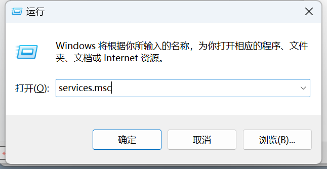
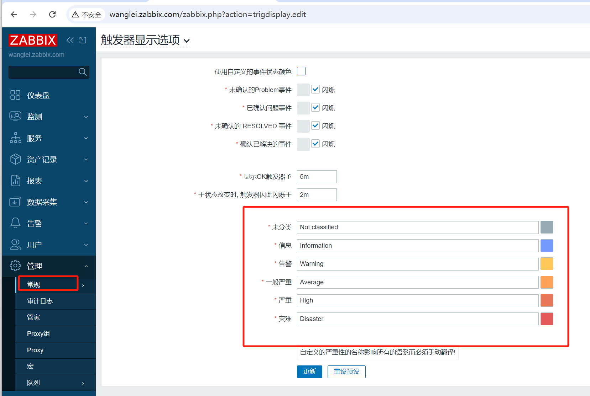
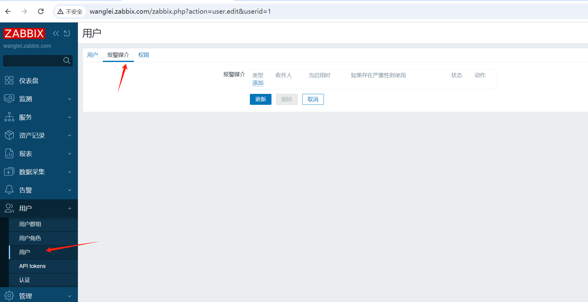
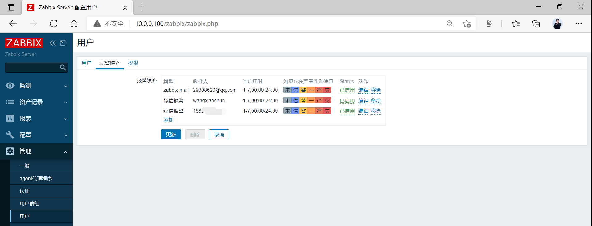
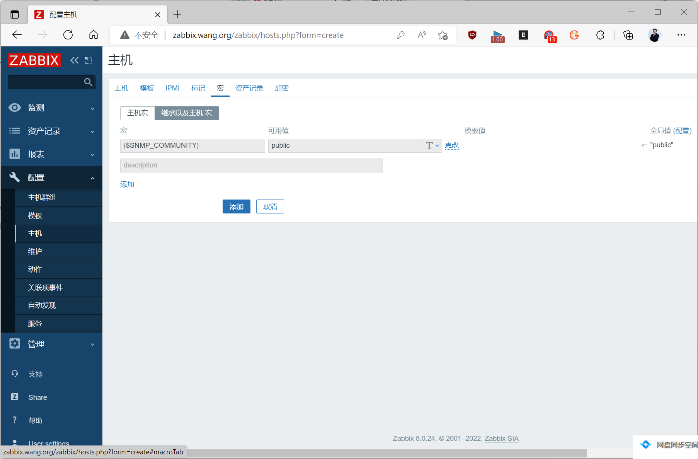
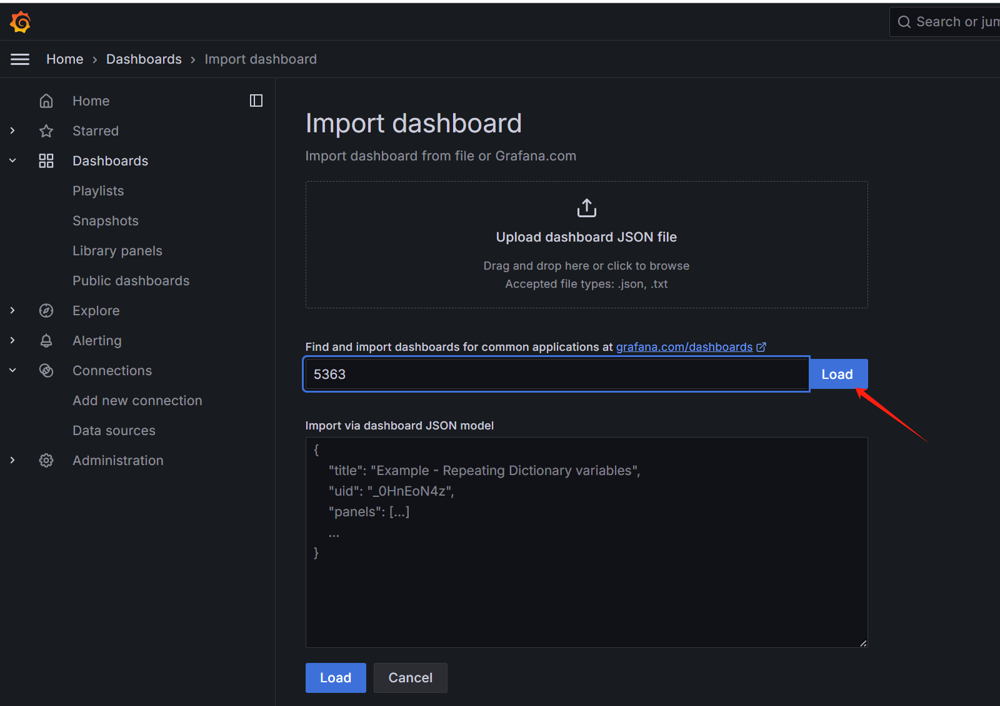
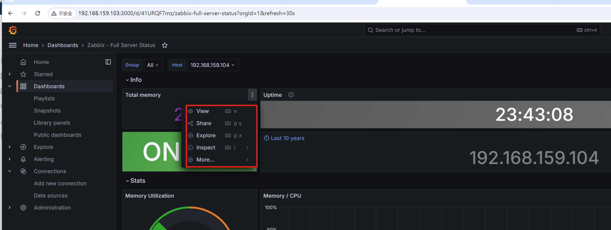
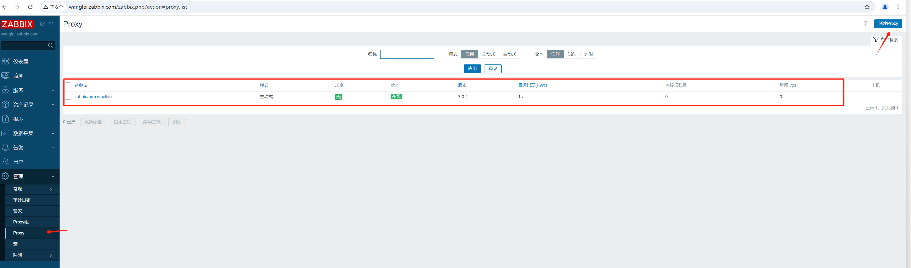
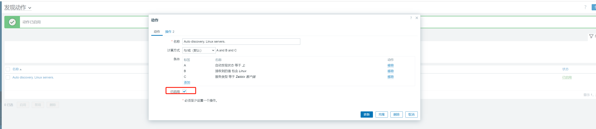
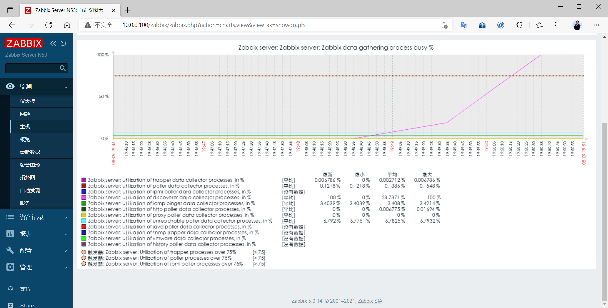

# 1 Zabbix 介绍和架构

## 1.1 为什么需要监控

运维行业有句话:“无监控、不运维”，监控俗称“第三只眼”。没了监控，基础运维，业务运维都是“瞎子”。 所以说监控是运维职业的根本。

尤其当前 DevOps 大行其道，用监控数据给自己撑腰，这显得更加必要，有人说运维是背锅侠，那么有 了监控，就有了充足的数据，一切以数据说话

所以作为一个运维工程师，如何构建一套监控系统是你的首要工作。

**监控功能**

- 在需要的时刻，提前预警即将出问题,避免故障发生
- 实时监控系统和业务,当出问题之后，通过发出告警,提醒相关人员,快速可以找到问题的根源,从而及 时处理问题
- 可以实现网站,应用或者服务器的故障自愈, 保证高可用性
- 以图形或易观察的方式呈现当前以及过往的状态,便于分析和预测系统发展趋势

## 1.2 需要监控什么

监控一切需要监控的资源,包括:服务器,网络设备,业务应用,云服务等


| 分类      | 实例内容                                                     |
| --------- | ------------------------------------------------------------ |
| 硬件 监控 | 通过远程控制卡: DeLL的iDRAC,HP的ILO和IBM的IMM等 使用IPMI来完成物理设备的监控工作。通常必须要监控包括温度、硬盘故障等 路由器，交换机(端口，光衰，日志)，打印机等 |
| 系统 监控 | cpu,内存,硬盘使用率，硬盘IO,系统负载，进程数                 |
| 服务 监控 | nginx,apache, php-fpm,mysql.memcache,redis ,tomcat,JVM,TCP连接数 |
| 性能 监控 | 网站性能，服务器性能，数据库性能，存储性能                   |
| 日志 监控 | 系统会产生系统日志，应用程序会有应用的访问日志、错误日志，服务有运行日志等， 可以使用ELK来进行日志监控 |
| 安全 监控 | 用户登录数,passwd文件变化，本地所有文件改动 Nginx+Lua编写一个WAF通过kibana可以图形化的展示不同的攻击类型的统计。 |
| 网络 监控 | IP,端口,URL,DB,ping包，IDC带宽网络流量，网络流出流出速率，网络入流量，网络出流 是.网络使用率，SMTP.POP3 |

**监控体系**

- 系统层监控

  系统监控:CPU、Load、Memory、Swap、Disk IO、Processes、Kernel Parameters、…

  网络监控:网络设备、工作负载、网络延迟、丢包率、…..

- 中间件及基础设施类系统监控

  Web服务容器:Tomcat和Jetty等;

  消息中间件:Kafka、RocketMQ和RabbitMQ等

  数据库及缓存系统: MySQL、PostgreSQL、MongoDB、ElasticSearch和Redis等;

  数据库连接池: Mycat、ShardingSphere等

  存储系统:NFS和Ceph等

- 应用层监控

  用于衡量应用程序代码的状态和性能

  通过 APM（Application Performance Monitor应用性能监控）能够提供代码级性能监控并对故障 快速定位

- 业务层监控

  用于衡量应用程序的价值，例如电子商务网站上的销售量

  QPs、DAU日活、转化率

  业务接口:登录数、注册数、订单量、搜索量和支付量等

## 1.3 监控工具

开源工具: cacti、nagios、zabbix、Prometheus、open-falcon 等,还有一些商业的监控方案


### 1.3.1 Cacti

Cacti是基于LAMP平台展现的网络流量监测及分析工具

通过SNMP技术或自定义脚本从目标设备/主机获取监控指标信息

其次还可以进行数据存储，调用模板将数据存到数据库，使用rrdtool存储和更新数据，通过rrdtoo1绘 制结果图形

最后进行数据展现，通过web方式将监控结果呈现出来，常用于在数据中心监控网络设备,比如交换机和 路由器

cacti是很老的一款监控工具，其实说它是一款流量监控工具更合适，对流量监控比较精准，但缺点很 多，出图不好看，不支持分布式，也没有告警功能，所以当前使用的用户越来越少。

缺点：告警不及时

官网： https://www.cacti.net

GitHub： https://github.com/Cacti/cacti

二次开发板：https://cactifans.org/

### 1.3.2 Nagios


Nagios是一款开源的免费监控工具，可以有效地监控Windows、Linux和Unix的主机状态，交换机路由 器等网络设置，打印机等。在系统或服务状态异常时发出邮件或短信报警第一时间通知网站运维人员， 在状态恢复后发出正常的邮件或短信通知

nagios主要的特征是监控告警，最强大的就是告警功能，可支持多种告警方式，但缺点是没有强大的数 据收集机制，并且数据出图也很简陋，当监控的主机越来越多时，添加主机也非常麻烦，配置文件都是 基于文本配置的，不支持web方式管理和配置，这样很容易出错，不易维护。

分层告警机制及自定义监控相对薄弱。

监控主机数量有限，承载能力较低

官网: https://www.nagios.org/

### 1.3.3 猎鹰 Open-falcon


open-falcon(猎鹰)是一款用golang和python写的监控系统，由小米公司启动了这个项目

相对zabbix在性能、扩展性、和用户的使用效率方面，都有较大优势

发布时间较短

不支持很多基础的服务监控插件,如lTomcat、 apache等

功能不完善,更新较缓慢

无专门运维支撑，社区运营有欠缺。

官网: http://www.open-falcon.org/ 

github: https://github.com/open-falcon

### 1.3.4 夜莺 Nightingale


夜莺（Nightingale）是滴滴基础平台联合滴滴云研发和开源的企业级监控解决方案。旨在满足云原生时 代企业级的监控需求

Nightingale 在Open-Falcon 的基础上，结合滴滴的最佳实践，在性能、可维护性、易用性方面做了大 量的改进

Nightingale 在产品完成度、系统高可用、以及用户体验方面，达到了企业级的要求，可满足不同规模用 户的场景，小到几台机器，大到数十万都可以完美支撑。兼顾云原生和裸金属，支持应用监控和系统监 控，插件机制灵活，插件丰富完善，具有高度的灵活性和可扩展性

Nightingale 作为集团统一的监控解决方案，支撑了滴滴内部数十亿监控指标，覆盖了从系统、容器、到 应用等各层面的监控需求，周活跃用户数千。五年磨一剑，取之开源，回馈开源

夜莺监控的核心开发团队，也是Open-Falcon项目原核心研发人员

当前社区比较活跃,升级较频繁

官网：

```http
https://n9e.github.io/
http://n9e.didiyun.com/
```


### 1.3.5 Zabbix


Zabbix 是一个基于WEB界面的提供分布式系统监视以及网络监视功能的企业级的开源解决方案。功能强 大,成熟可靠,使用者众多

官网: https://www.zabbix.com/

### 1.3.6 Prometheus


Prometheus 是一个开源的服务监控系统和时间序列数据库,主要在监控容器领域使用,可以实现容器的动 态发现和监控

官网: https://prometheus.io/

### 1.3.7 商业监控方案

商业监控的方案,可以实现从外部网络,如全国的不同运营商的网络访问指定服务,贴近实际用户的访问感 受,了解实现的访问情况.

```http
http://ping.chinaz.com/       站长之家
https://www.jiankongbao.com/   监控宝
https://www.toushibao.com/     透视宝
https://www.tingyun.com/       听云
```

### 1.3.8 云监控

云监控为云上用户提供开箱即用的企业级开放型一站式监控解决方案。云监控涵盖IT设施基础监控和外 网网络质量拨测监控，是基于事件、自定义指标和日志的业务监控，为您全方位提供更高效、全面、省 钱的监控服务。使用云监控，不但可以帮助您提升系统服务可用时长，还可以降低企业IT运维监控成 本。

云监控通过提供跨云服务和跨地域的应用分组管理模型和报警模板，帮助您快速构建支持几十种云服 务、管理数万实例的高效监控报警管理体系。

云监控用于监控各云服务资源的监控指标，探测云服务ECS和运营商站点的可用性，并针对指定监控指 标设置报警。使您全面了解阿里云上资源的使用情况和业务运行状况，并及时对故障资源进行处理，保 证业务正常运行。

```http
https://help.aliyun.com/document_detail/35170.html
https://cloud.tencent.com/document/product/248/13466
```

## 1.4 Zabbix 概述和架构


Zabbix 是一个企业级分布式开源监控解决方案，支持实时监控数干台服务器，虚拟机和网络设备，采集 百万级监控指标，适用于任何IT基础架构、服务、应用程序和资源的解决方案

Zabbix SIA 公司成立于2005年， 由CEO兼所有者Alexei Vladishev 创建，Zabbix 目前由此公司积极的 持续开发更新维护， 并为用户提供技术支持服务。

Zabbix 软件能够监控众多网络参数和服务器的健康度、完整性。Zabbix 使用灵活的告警机制，允许用 户为几乎任何事件配置基于邮件的告警。这样用户可以快速响应服务器问题。Zabbix 基于存储的数据提 供出色的报表和数据可视化功能。这些功能使得 Zabbix 成为容量规划的理想选择。

Zabbix 支持主动轮询（polling）和被动捕获（trapping）。Zabbix所有的报表、统计数据和配置参数都 可以通过基于 Web 的前端页面进行访问。基于 Web 的前端页面确保您可以在任何地方访问您监控的网 络状态和服务器健康状况。适当的配置后，Zabbix 可以在监控 IT 基础设施方面发挥重要作用。无论是 对于有少量服务器的小型组织，还是拥有大量服务器的大企业而言，同样适用。

Zabbix 是根据 GPL 通用公共许可证的第二版编写和发布的。这意味着产品源代码是免费发布的，可供 公共使用。

Zabbix公司还为全球用户提供专业的技术支持服务 。

### 1.4.2 Zabbix功能


Zabbix 是一个高度成熟完善的网络监控解决方案，包含了多种功能。


```http
https://www.zabbix.com/documentation/7.0/en/manual/introduction/features
```

[数据采集](https://www.zabbix.com/documentation/7.0/manual/config/items)

- 历史数据, 即记录每个监控项采集到的每个监控值
- 趋势数据, 主要保留某个监控项一个小时内历史数据的最大值、最小值和平均值以及该监控项一个 小时内所采集到的数据个数
- 可用性和性能检查；
- 支持 SNMP（包括主动轮询和被动捕获）、IPMI、JMX、VMware 监控；
- 自定义检查；
- 按照自定义的时间间隔采集需要的数据；
- 通过 Server/Proxy 和 Agents 来执行数据采集。

[灵活的阈值定义](https://www.zabbix.com/documentation/7.0/manual/config/triggers)

- 您可以参考后端数据库定义非常灵活的告警阈值，即触发器

[高度可配置的告警](https://www.zabbix.com/documentation/7.0/manual/config/notifications)

- 可以根据递增计划、接收者、媒介类型自定义发送告警通知；
- 使用宏变量可以使告警通知变得更加高效有用；
- 自动操作包含远程执行命令。

[实时图形](https://www.zabbix.com/documentation/7.0/manual/config/visualisation/graphs/simple)

- 使用内置图形功能可以将监控项实时绘制成图形。

[Web 监控功能](https://www.zabbix.com/documentation/7.0/manual/web_monitoring)

- Zabbix可以追踪模拟鼠标在 Web 网站上的点击操作，来检查 Web 网站的功能和响应时间。

[丰富的可视化选项](https://www.zabbix.com/documentation/7.0/manual/config/visualisation)

- 可以组合多个监控项到单个视图中，创建自定义图表；
- 网络拓扑图；
- 以仪表盘样式展示自定义聚合图形和幻灯片演示；
- 报表；
- 监控资源的更高层次展示视图（业务视图）。

[历史数据存储](https://www.zabbix.com/documentation/7.0/manual/installation/requirements#database_size)

- 存储在数据库中的数据；
- 历史配置；
- 内置数据管理机制

[配置简单](https://www.zabbix.com/documentation/7.0/manual/config/hosts)

- 将被监控设备添加为主机；
- 主机一旦添加到数据库中，就会采集数据用于监控；
- 将模板用于监控设备。

[使用模板](https://www.zabbix.com/documentation/7.0/manual/config/templates)

- 模板中分组检查；
- 模板可以关联模板，继承已关联模板的属性。

[网络发现](https://www.zabbix.com/documentation/7.0/manual/discovery)

- 自动发现网络设备；
- Zabbix Agent 发现设备后自动注册；
- 自动发现文件系统、网络接口和 SNMP OIDs 值。

[快捷的 Web 界面](https://www.zabbix.com/documentation/7.0/manual/web_interface)

- 基于 PHP 的 Web 前端；
- 可以从任何地方访问；
- 您可以定制自己的操作方式；
- 您可以通过审计日志来查看你的操作。

[Zabbix API](https://www.zabbix.com/documentation/7.0/manual/api)

- Zabbix API 为 Zabbix 提供可编程接口，用于批量操作、第三方软件集成和其他用途。

[权限管理系统](https://www.zabbix.com/documentation/7.0/manual/config/users_and_usergroups)

- 安全的用户身份验证；
- 指定的用户只能查看指定的权限范围内的视图。

[功能强大且易于扩展的 Zabbix Agent](https://www.zabbix.com/documentation/7.0/manual/concepts/agent)

- 部署于被监控对象上；
- 支持 Linux 和 Windows ；

[二进制守护进程](https://www.zabbix.com/documentation/7.0/manual/concepts/server)

- 为了更好的性能和更少的内存占用，采用 C 语言编写；
- 便于移植。

[适应更复杂的环境](https://www.zabbix.com/documentation/7.0/manual/distributed_monitoring)

- 使用 Zabbix Proxy 代理，可以轻松实现分布式远程监控

### 1.4.3 Zabbix 架构

Zabbix 由如下主要的功能组件组成


- SERVER

  Zabbix server 是 Zabbix 软件的核心组件

  Zabbix Agent 向其报告可用性、系统完整性信息和统计信息。

  Zabbix server也是存储所有配置信息、统计信息和操作信息的核心存储库。

  Zabbix server也是Zabbix监控系统的告警中心。在监控的系统中出现任何异常，将发出通知给管 理员。

  基本的 Zabbix Server 的功能分解成为三个不同的组件。他们是：Zabbix server、Web前端和数据 库。

  Zabbix 的所有配置信息都存储在 Server和Web前端进行交互的数据库中。例如，当你通过Web前 端（或者API）新增一个监控项时，它会被添加到数据库的监控项表里。然后，Zabbix server 以每 分钟一次的频率查询监控项表中的有效项，接着将它存储在 Zabbix server 中的缓存里。这就是为 什么 Zabbix前端所做的任何更改需要花费两分钟左右才能显示在最新的数据段的原因。 

- 数据库

  所有配置信息以及 Zabbix 采集到的数据都被持久存储在数据库中

  可以支持MySQL,PostgreSQL,Oracle 等多种数据库

- WEB 界面

  WEB 界面是 Zabbix server 的一部分，用于实现展示和配置的界面

  通常（但不一定）和 Zabbix server 运行在同一台物理机器上

  基于 Apache(Nginx)+PHP 实现,早期只支持LAMP架构,从Zabbix5.0开始支持LNMP

- AGENT

  Zabbix agents 部署在被监控目标上，用于主动监控本地资源和应用程序，并将收集的数据发送给  Zabbix server。从Zabbix5.0开始支技Zabbix Agent2

- PROXY

  Zabbix Proxy 可以代替 Zabbix Server 采集性能和可用性数据

  Zabbix Proxy 在 Zabbix 的部署是可选部分

  Zabbix Proxy 的部署可以很好的分担单个Zabbix server的负载

- Java 网关

  Zabbix 要监控 tomcat 服务器和其它JAVA程序，需要使用 Java gateway 做为代理,才能从JAVA程序 中获取数据

- 内部配置的数据流程

  Zabbix 内部的数据流对Zabbix的使用也很重要。首先，为了创建一个采集数据的监控项，就必须 先创建主机。其次，在任务的另外一端，必须要有监控项才能创建触发器（trigger），必须要有触 发器来创建动作（action）。因此，如果您想要收到类似“X个server上CPU负载过高”这样的告警， 您必须首先为 Server X 创建一个主机条目，其次创建一个用于监控其 CPU的监控项，最后创建一 个触发器，用来触发 CPU负载过高这个动作，并将其发送到您的邮箱里。虽然这些步骤看起来很繁 琐，但是使用模板的话，实际操作非常简单。也正是由于这种设计，使得 Zabbix 的配置变得更加 灵活易用。

### 1.4.4  Zabbix Server 启动进程


```bash
zabbix server 进程说明

Zabbix服务器端进程有多达二十多种
当在操作系统下用ps aux命令来查看时，往往看到很多zabbix系统进程，而这些系统进程在zabbix内部称
为实例。这些实例各处负责不同的工作，就形成了不同种类型的进程)，各种类型进程的说明如下:
报警器(alerter)——该类型的进程是用来发送报警通知的

配置同步器(configuration syncer)——用于将配置文件中的配置信息同步到内存中缓存

数据发送器(data sender)——服务器代理节点用于发送数据的进程（服务器端没有这类进程）

数据库看门狗(db watchdog)——该进程用于监视zabbix系统的数据库状态，当数据库状态变为不可用时，发
送警告信息（服务器代理端不支持这类型进程）。

自动发现器(discoverer)——用于自动发现设备的进程

步骤(escalator)——用于处理动作中的步骤的进程

心跳发送器(heartbeat sender)——服务器代理端用于发送心跳信息（服务器端没有这类型的进程）

历史数据同步器(history syncer)——用于写历史数据表

管家(housekeeper)——用于清理过期的历史数据的进程

HTTP 轮询器(http poller)——用于轮询web类的监控项目

Ping检查器(icmp pinger)——用于定期的进行ICMP PING检查

ipmi 轮询器（ipmi poller）——用于定期进行ipmi监控项目的检查

java 轮询器(java poller)——用于轮询java 监控项目

分布式节点看守器(node watcher)——用于在不同的分布式节点发送历史数据和配置信息更新的进程

轮询器(poller)——用于普通的被动监控项目的轮询

服务器代理轮询(proxy poller)——用于服务器代理的被动轮询

自我监控(self-monitoring)——用于收集Zabbix系统内部的监控信息

定时器(timer)——用于处理触发器中也时间相关的函数和维护模式的进程

陷入器(trapper)——用于处理主动采集、陷入以及分布式节点间或服务器代理的通信

不可到达轮询器(unreachable poller)——用于轮询不可到达到的设备

vmware 收集器(vmware collector)——负责从vmware服务进程中收集数据（服务器代理端不支持这种类
型的进程）；


可用的mode参数包括：
avg——指定类型所有进程的平均值
count——返回创建的指定类型进程的数量
max——最大值
min——最小值
——进程号，含义参见“描述”中所述的；
可用的state参数包括:
繁忙(busy)——表示处于繁忙状态的进程；
空闲(idle)——表示处于空闲状态的进程；
```

### 1.4.5 Zabbix 术语


被监控： 即 Zabbix 监控的主机或设备

监控项item：即 Zabbix 监控的相关指标，比如：CPU利用率，内存使用率，TCP连接数等

应用集Application：为方便管理众多的监控项，可将多个同类型的监控项进行归类，纳入一个集合中， 即应用集

触发器Trigger：是一个表达式，或者说一个条件，如磁盘利用率超过80%等，当触发条件后，会导致一 个触发事件，这个事件会执行一个或多个动作

动作Action：动作是触发器的条件被触发后的行为，可以是发送一条短信，微信或邮件，或是重启某个 服务

告警：当触发器和动作二者结合起来时，就构成了的告警机制，比如cpu的使用率达到80%以上，触发 了报警动作，系统将自动发送一封邮件到指定的邮箱。然后运维可以及时的去处理此错误。

Web 监测：对WEB服务进行检测，比如：访问指定网站是否可正常访问

模板 Template: 可以方便地应用于多个主机的一组实体的集合。而这些实体包括：

- items（监控项）
- applications（应用集）
- triggers（触发器）
- graphs（图形）
- screens (聚合图形,自Zabbix 2.0起)
- low-level discovery rules (自动发现规则 ,自Zabbix 2.0起）
- web scenarios (web场景, 自Zabbix 2.0起)。

由于现实中的许多主机是相同或类似的，所以，为一个主机创建的一组实体（项目，触发器，图形， …）可能对许多人有用。虽然可以将它们复制到每个新的主机上，但过程很繁琐。可以将需要的实体都 复制到一个模板，然后根据需要将模板应用于尽可能多的主机。

当模板链接到主机时，模板的所有实体（项目，触发器，图形，…）都将添加到主机。

模板通常用于为特定服务或应用程序（如Apache，MySQL，PostgreSQL，Postfix …）分组实体，然后 应用于运行这些服务的主机。

使用模板的另一个好处是当所有主机都需要更改时。只需要在模板上更改某些内容将会将更改应用到所 有链接的主机。

创建新模板时，链接的模板选项卡允许将一个或多个“嵌套”模板链接到此模板。所有实体（项目，触发 器，图表等）将从链接的模板继承。

因此，使用模板是减少工作量并简化Zabbix配置的好方法。

模板分为内置模板和自定义模板

内置模板参看: https://git.zabbix.com/projects/ZBX/repos/zabbix/browse/templates

### 1.4.6 Zabbix 各种组件的关系


# 2 Zabbix 部署

## 2.1 Zabbix 部署环境准备

### 2.1.1 Zabbix 版本选择

Zabbix 历史版本

```http
https://en.wikipedia.org/wiki/Zabbix
```

Zabbix 产品周期

```http
https://www.zabbix.com/cn/life_cycle_and_release_policy
```

**Zabbix 分为两种版本: LTS和标准版本**


### 2.1.2 Zabbix 部署架构


### 2.1.3 Zabbix 安装要求

安装官方要求

```http
https://www.zabbix.com/documentation/7.0/en/manual/installation/requirements
```


## 2.2 安装 Zabbix Server

### 2.2.1 Zabbix Server 安装方法介绍

Zabbix Server 提供了三种安装方法

- 二进制包安装: 官方提供了二进制包安装的方法,可以支持CentOS和Debian/Ubuntu的安装

- 源码编译安装: 部署繁琐,生产环境定制安装可以使用

- 基于容器安装: 测试环境使用,参考链接如下

  ```http
  https://www.zabbix.com/documentation/7.0/zh/manual/installation/containers
  ```

### 2.2.2 二进制包安装 Zabbix Server

官方提供对多种OS版本的Zabbix 安装

可以从 ZABBIX 官方的软件仓库或镜像网站安装Zabbix SIA 提供了官方的 RPM 和 DEB 发行包

注意：Ubuntu22.04 不支持 Zabbix Server 5.0,只支持 Zabbix Server 6.0以上版本

二进制包安装Zabbix官方参考文档: 

```http
#Zabbix7.0
https://www.zabbix.com/documentation/7.0/zh/manual/installation/install_from_packages
```

**官方和镜像仓库**

```http
#官方包仓库: 
https://repo.zabbix.com/
#镜像源
https://mirrors.aliyun.com/zabbix/
https://mirrors.tuna.tsinghua.edu.cn/zabbix/
```


Zabbix 相关二进制包介绍

```bash
zabbix-server-mysql    #Zabbix Server服务器包
zabbix-frontend-php    #Zabbix 前端Web服务包,本质为LAP
zabbix-apache-conf      #Zabbix 前端Web服务配置包,本质为LAP
zabbix-agent           #Zabbix 客户端包
zabbix-agent2          #Zabbix 客户端包
zabbix-get             #Zabbix 服务测试包
```

#### 2.2.2.1 安装 Zabbix Server 包

访问链接: https://www.zabbix.com/download 找到仓库的源


范例：在ubutun2204安装Zabbix Server 7.0

```bash
#安装zabbix repository
root@zabbix-server:~# wget https://repo.zabbix.com/zabbix/7.0/ubuntu/pool/main/z/zabbix-release/zabbix-release_7.0-2+ubuntu22.04_all.deb
root@zabbix-server:~# dpkg -i zabbix-release_7.0-2+ubuntu22.04_all.deb
root@zabbix-server:~# apt update


# 安装Zabbix server，Web前端，agent
root@zabbix-server:~# apt install zabbix-server-mysql zabbix-frontend-php zabbix-nginx-conf zabbix-sql-scripts zabbix-agent

#安装MySQL
root@zabbix-server:~# apt install mysql-server -y

#如果MySQL和ZabbixServer在同一台主机,此项可不改
root@zabbix-server:~# vim /etc/mysql/mysql.conf.d/mysqld.cnf
bind-address        = 0.0.0.0 

root@zabbix-server:~# systemctl restart mysql.service

#准备数据库和用户
root@zabbix-server:~# mysql -uroot
mysql> create database zabbix character set utf8mb4 collate utf8mb4_bin;
mysql> create user zabbix@localhost identified by '123456';
mysql> grant all privileges on zabbix.* to zabbix@localhost;
mysql> set global log_bin_trust_function_creators = 1;
mysql> quit


#初始化数据库中的表
root@zabbix-server:~# zcat /usr/share/zabbix-sql-scripts/mysql/server.sql.gz | mysql --default-character-set=utf8mb4 -uzabbix -p123456 zabbix

#修改Zabbix Server 连接MySQL 
root@zabbix-server:~# vim /etc/zabbix/zabbix_server.conf
DBPassword=123456

#修改PHP配置
root@zabbix-server:~# cat  /etc/zabbix/nginx.conf
server {
        listen          80;
        server_name     wanglei.zabbix.com;
}

# 启动Zabbix server和agent进程
root@zabbix-server:~# systemctl restart zabbix-server zabbix-agent nginx php8.1-fpm
root@zabbix-server:~# systemctl enable zabbix-server zabbix-agent nginx php8.1-fpm

#安装中文包
root@zabbix-server:~# apt -y install language-pack-zh-hans

#浏览器访问：
http://server_ip_or_name/zabbix
http://wanglei.zabbix.com/
```

#### 2.2.2.2 查看 Zabbix 相关服务

```bash
root@zabbix-server:~# ss -ntl
State                         Recv-Q                        Send-Q                                               Local Address:Port                                                  Peer Address:Port                        Process                        
LISTEN                        0                             4096                                                       0.0.0.0:10050                                                      0.0.0.0:*                                                          
LISTEN                        0                             4096                                                       0.0.0.0:10051                                                      0.0.0.0:*                                                          
LISTEN                        0                             128                                                      127.0.0.1:6010                                                       0.0.0.0:*                                                          
LISTEN                        0                             70                                                       127.0.0.1:33060                                                      0.0.0.0:*                                                          
LISTEN                        0                             128                                                        0.0.0.0:22                                                         0.0.0.0:*                                                          
LISTEN                        0                             511                                                        0.0.0.0:80                                                         0.0.0.0:*                                                          
LISTEN                        0                             151                                                        0.0.0.0:3306                                                       0.0.0.0:*                                                          
LISTEN                        0                             4096                                                 127.0.0.53%lo:53                                                         0.0.0.0:*                                                          
LISTEN                        0                             4096                                                          [::]:10050                                                         [::]:*                                                          
LISTEN                        0                             4096                                                          [::]:10051                                                         [::]:*                                                          
LISTEN                        0                             128                                                           [::]:22                                                            [::]:*                                                          
LISTEN                        0                             511                                                           [::]:80                                                            [::]:*                                                          
LISTEN                        0                             128                                                          [::1]:6010                                                          [::]:*                                                          


#查看进程
root@zabbix-server:~# ps aux|grep zabbix
zabbix       956  0.0  0.1  21552  5676 ?        S    07:24   0:00 /usr/sbin/zabbix_agentd -c /etc/zabbix/zabbix_agentd.conf
zabbix       957  0.0  0.0  21552  3052 ?        S    07:24   0:00 /usr/sbin/zabbix_agentd: collector [idle 1 sec]
zabbix       958  0.0  0.0  22092  5628 ?        S    07:24   0:00 /usr/sbin/zabbix_agentd: listener #1 [waiting for connection]
zabbix       959  0.0  0.0  22092  4784 ?        S    07:24   0:00 /usr/sbin/zabbix_agentd: listener #2 [waiting for connection]
zabbix       960  0.0  0.0  22092  4784 ?        S    07:24   0:00 /usr/sbin/zabbix_agentd: listener #3 [waiting for connection]
zabbix       961  0.0  0.0  22092  4784 ?        S    07:24   0:00 /usr/sbin/zabbix_agentd: listener #4 [waiting for connection]
zabbix       962  0.0  0.0  22092  4784 ?        S    07:24   0:00 /usr/sbin/zabbix_agentd: listener #5 [waiting for connection]
zabbix       963  0.0  0.0  22092  4784 ?        S    07:24   0:00 /usr/sbin/zabbix_agentd: listener #6 [waiting for connection]
zabbix       964  0.0  0.0  22092  4784 ?        S    07:24   0:00 /usr/sbin/zabbix_agentd: listener #7 [waiting for connection]
zabbix       965  0.0  0.0  22092  4784 ?        S    07:24   0:00 /usr/sbin/zabbix_agentd: listener #8 [waiting for connection]
zabbix       966  0.0  0.0  22092  4784 ?        S    07:24   0:00 /usr/sbin/zabbix_agentd: listener #9 [waiting for connection]
zabbix       967  0.0  0.0  22092  4784 ?        S    07:24   0:00 /usr/sbin/zabbix_agentd: listener #10 [waiting for connection]
zabbix       968  0.0  0.0  22092  4832 ?        S    07:24   0:00 /usr/sbin/zabbix_agentd: active checks #1 [idle 1 sec]
www-data     987  0.0  0.4 226892 26188 ?        S    07:24   0:00 php-fpm: pool zabbix
www-data     988  0.0  0.3 225692 21088 ?        S    07:24   0:00 php-fpm: pool zabbix
www-data     989  0.0  0.3 225692 18632 ?        S    07:24   0:00 php-fpm: pool zabbix
www-data     990  0.0  0.3 225692 22480 ?        S    07:24   0:00 php-fpm: pool zabbix
www-data     991  0.0  0.1 225692 10996 ?        S    07:24   0:00 php-fpm: pool zabbix
zabbix      1154  0.0  0.2 142968 14280 ?        S    07:24   0:00 /usr/sbin/zabbix_server -c /etc/zabbix/zabbix_server.conf
zabbix      1158  0.0  0.1  97472  7164 ?        S    07:24   0:00 /usr/sbin/zabbix_server: ha manager
zabbix      1159  0.0  0.1 142968  7376 ?        S    07:24   0:00 /usr/sbin/zabbix_server: service manager #1 [processed 0 events, updated 0 event tags, deleted 0 problems, synced 0 service updates, idle 5.005456 sec during 5.005536 sec]
zabbix      1160  0.2  0.3 145680 19372 ?        S    07:24   0:00 /usr/sbin/zabbix_server: configuration syncer [synced configuration in 0.013846 sec, idle 10 sec]
zabbix      1189  0.0  0.1 142968  7220 ?        S    07:24   0:00 /usr/sbin/zabbix_server: alert manager #1 [sent 0, failed 0 alerts, idle 5.005518 sec during 5.005717 sec]
zabbix      1190  0.0  0.0 142836  4948 ?        S    07:24   0:00 /usr/sbin/zabbix_server: alerter #1 started
zabbix      1191  0.0  0.0 142836  4944 ?        S    07:24   0:00 /usr/sbin/zabbix_server: alerter #2 started
zabbix      1192  0.0  0.0 142836  4948 ?        S    07:24   0:00 /usr/sbin/zabbix_server: alerter #3 started
zabbix      1193  0.0  0.2 370640 13152 ?        Sl   07:24   0:00 /usr/sbin/zabbix_server: preprocessing manager #1 [queued 2, processed 4 values, idle 5.251784 sec during 5.252036 sec]
zabbix      1194  0.0  0.0 142836  5068 ?        S    07:24   0:00 /usr/sbin/zabbix_server: lld manager #1 [processed 0 LLD rules, idle 5.004643sec during 5.004701 sec]
zabbix      1195  0.0  0.1 143304 10548 ?        S    07:24   0:00 /usr/sbin/zabbix_server: lld worker #1 [processed 1 LLD rules, idle 20.927574 sec during 20.938105 sec]
zabbix      1196  0.0  0.1 143308 10196 ?        S    07:24   0:00 /usr/sbin/zabbix_server: lld worker #2 [processed 1 LLD rules, idle 48.036152 sec during 48.041368 sec]
zabbix      1197  0.0  0.0 142836  4940 ?        S    07:24   0:00 /usr/sbin/zabbix_server: housekeeper [startup idle for 30 minutes]
zabbix      1198  0.0  0.1 142836  7520 ?        S    07:24   0:00 /usr/sbin/zabbix_server: timer #1 [updated 0 hosts, suppressed 0 events in 0.000737 sec, idle 59 sec]
zabbix      1199  0.0  0.1 142836  7524 ?        S    07:24   0:00 /usr/sbin/zabbix_server: http poller #1 [got 0 values in 0.000022 sec, idle 5 sec]
zabbix      1203  0.0  0.1 143244  7736 ?        S    07:24   0:00 /usr/sbin/zabbix_server: browser poller #1 [got 0 values in 0.000005 sec, idle 5 sec]
zabbix      1204  0.0  0.2 520132 15136 ?        Sl   07:24   0:00 /usr/sbin/zabbix_server: discovery manager #1 [processing 0 rules, 0 unsaved checks]
zabbix      1206  0.0  0.1 160520 10492 ?        S    07:24   0:00 /usr/sbin/zabbix_server: history syncer #1 [processed 1 values, 1 triggers in 0.000450 sec, idle 1 sec]
zabbix      1207  0.0  0.1 151732  8660 ?        S    07:24   0:00 /usr/sbin/zabbix_server: history syncer #2 [processed 0 values, 0 triggers in 0.000015 sec, idle 1 sec]
zabbix      1209  0.0  0.1 142980  7524 ?        S    07:24   0:00 /usr/sbin/zabbix_server: history syncer #3 [processed 0 values, 0 triggers in 0.000035 sec, idle 1 sec]
zabbix      1212  0.0  0.1 142980  7524 ?        S    07:24   0:00 /usr/sbin/zabbix_server: history syncer #4 [processed 0 values, 0 triggers in 0.000014 sec, idle 1 sec]
zabbix      1213  0.0  0.1 143384  7744 ?        S    07:24   0:00 /usr/sbin/zabbix_server: escalator #1 [processed 0 escalations in 0.001680 sec, idle 3 sec]
zabbix      1214  0.0  0.1 143384  7680 ?        S    07:24   0:00 /usr/sbin/zabbix_server: proxy poller #1 [exchanged data with 0 proxies in 0.000005 sec, idle 5 sec]
zabbix      1215  0.0  0.0 142836  4880 ?        S    07:24   0:00 /usr/sbin/zabbix_server: self-monitoring [processed data in 0.000031 sec, idle 1 sec]
zabbix      1217  0.0  0.1 142968  7524 ?        S    07:24   0:00 /usr/sbin/zabbix_server: task manager [processed 0 task(s) in 0.000243 sec, idle 5 sec]
zabbix      1223  0.0  0.1 143376  7740 ?        S    07:24   0:00 /usr/sbin/zabbix_server: poller #1 [got 0 values in 0.000029 sec, idle 5 sec]
zabbix      1224  0.0  0.1 143376  7740 ?        S    07:24   0:00 /usr/sbin/zabbix_server: poller #2 [got 0 values in 0.000003 sec, idle 5 sec]
zabbix      1225  0.0  0.1 143376  7740 ?        S    07:24   0:00 /usr/sbin/zabbix_server: poller #3 [got 0 values in 0.000084 sec, idle 5 sec]
zabbix      1226  0.0  0.1 143376  7740 ?        S    07:24   0:00 /usr/sbin/zabbix_server: poller #4 [got 0 values in 0.000025 sec, idle 5 sec]
zabbix      1227  0.0  0.1 143376  7740 ?        S    07:24   0:00 /usr/sbin/zabbix_server: poller #5 [got 0 values in 0.000005 sec, idle 5 sec]
zabbix      1228  0.0  0.1 143376  7740 ?        S    07:24   0:00 /usr/sbin/zabbix_server: unreachable poller #1 [got 0 values in 0.000031 sec, idle 5 sec]
zabbix      1229  0.0  0.1 143392 10016 ?        S    07:24   0:00 /usr/sbin/zabbix_server: trapper #1 [processed data in 0.000027 sec, waiting for connection]
zabbix      1230  0.0  0.1 143392 10016 ?        S    07:24   0:00 /usr/sbin/zabbix_server: trapper #2 [processed data in 0.000103 sec, waiting for connection]
zabbix      1231  0.0  0.1 143392 10016 ?        S    07:24   0:00 /usr/sbin/zabbix_server: trapper #3 [processed data in 0.000097 sec, waiting for connection]
zabbix      1232  0.0  0.1 143392 10692 ?        S    07:24   0:00 /usr/sbin/zabbix_server: trapper #4 [processed data in 0.000157 sec, waiting for connection]
zabbix      1233  0.0  0.1 143392 10016 ?        S    07:24   0:00 /usr/sbin/zabbix_server: trapper #5 [processed data in 0.000055 sec, waiting for connection]
zabbix      1234  0.0  0.0 142836  4944 ?        S    07:24   0:00 /usr/sbin/zabbix_server: icmp pinger #1 [got 0 values in 0.000022 sec, idle 5 sec]
zabbix      1235  0.0  0.1 142968  7344 ?        S    07:24   0:00 /usr/sbin/zabbix_server: alert syncer [queued 0 alerts(s), flushed 0 result(s) in 0.000002 sec, idle 1 sec]
zabbix      1236  0.0  0.1 143384  7740 ?        S    07:24   0:00 /usr/sbin/zabbix_server: history poller #1 [got 0 values in 0.000009 sec, idle 5 sec]
zabbix      1237  0.0  0.1 143384  7740 ?        S    07:24   0:00 /usr/sbin/zabbix_server: history poller #2 [got 0 values in 0.000048 sec, idle 5 sec]
zabbix      1238  0.0  0.1 143384  7740 ?        S    07:24   0:00 /usr/sbin/zabbix_server: history poller #3 [got 0 values in 0.000031 sec, idle 5 sec]
zabbix      1239  0.0  0.1 143384  7740 ?        S    07:24   0:00 /usr/sbin/zabbix_server: history poller #4 [got 0 values in 0.000033 sec, idle 5 sec]
zabbix      1240  0.0  0.1 143384  7740 ?        S    07:24   0:00 /usr/sbin/zabbix_server: history poller #5 [got 0 values in 0.000040 sec, idle 5 sec]
zabbix      1241  0.0  0.1 142968  7524 ?        S    07:24   0:00 /usr/sbin/zabbix_server: availability manager #1 [queued 0, processed 0 values, idle 5.004915 sec during 5.004946 sec]
zabbix      1242  0.0  0.1 142836  7524 ?        S    07:24   0:00 /usr/sbin/zabbix_server: trigger housekeeper [deleted 0 problems records in 0.000423 sec, idle for 60 second(s)]
zabbix      1243  0.0  0.1 143244  7740 ?        S    07:24   0:00 /usr/sbin/zabbix_server: odbc poller #1 [got 0 values in 0.000005 sec, idle 5 sec]
zabbix      1244  0.0  0.1 216568  7212 ?        Sl   07:24   0:00 /usr/sbin/zabbix_server: http agent poller #1 [got 0 values, queued 0 in 5 sec]
zabbix      1245  0.0  0.1 217124 10088 ?        Sl   07:24   0:00 /usr/sbin/zabbix_server: agent poller #1 [got 3 values, queued 2 in 5 sec]
zabbix      1246  0.0  0.1 216568  7156 ?        Sl   07:24   0:00 /usr/sbin/zabbix_server: snmp poller #1 [got 0 values, queued 0 in 5 sec]
zabbix      1247  0.0  0.1 142836  7620 ?        S    07:24   0:00 /usr/sbin/zabbix_server: configuration syncer worker [synced 0, updated 0 item names in 0.010047 sec, idle]
zabbix      1248  0.0  0.2 143376 11672 ?        S    07:24   0:00 /usr/sbin/zabbix_server: internal poller #1 [got 1 values in 0.000157 sec, idle 2 sec]
zabbix      1249  0.0  0.1 216704  7644 ?        Sl   07:24   0:00 /usr/sbin/zabbix_server: proxy group manager #1 started
```

#### 2.2.2.3 访问 Zabbix 的 Web 管理页面完成配置向导

```http
#基于Nginx
http://server_ip_or_name/
#基于Apache
http://server_ip_or_name/zabbix
```


检查环境


输入数据库信息


上面所填写的内容保存在下面文件中

```http
/usr/share/zabbix/conf/zabbix.conf.php
```

完成安装

Zabbix 前端已经就绪！第一次登录, 默认的用户名是 Admin，密码是zabbix


#### 2.2.2.7 中文及乱码

默认为英文,可修改为中文

```bash
#Ubuntu安装下面中文包
root@zabbix-server:~# apt -y install language-pack-zh-hans
```


因为字体兼容性的原因,在显示中文时可能会有乱码出现

**注意:乱码和语言环境无关,英语环境也支持中文显示,但会有乱码**


将中文字体上传到 Zabbix Server 的目录 /usr/share/zabbix/assets/fonts 下

```bash
#开源字体网站
http://fonts.top/
```

在Windows中找一个中文字体


将字体上传到 Zabbix Server

```bash
root@zabbix-server:~# ls
MSYHBD.TTC  MSYHL.TTC  MSYH.TTC

root@zabbix-server:~# dpkg -L zabbix-frontend-php |grep fonts
/usr/share/zabbix/assets/fonts
/usr/share/zabbix/fonts

root@zabbix-server:~# ll  /usr/share/zabbix/assets/fonts/graphfont.ttf
lrwxrwxrwx 1 root root 38 Oct  6 06:54 /usr/share/zabbix/assets/fonts/graphfont.ttf -> /etc/alternatives/zabbix-frontend-font
root@zabbix-server:~# ll /etc/alternatives/zabbix-frontend-font
lrwxrwxrwx 1 root root 47 Oct  6 06:54 /etc/alternatives/zabbix-frontend-font -> /usr/share/fonts/truetype/dejavu/DejaVuSans.ttf
root@zabbix-server:~# ll /usr/share/fonts/truetype/dejavu/DejaVuSans.ttf
-rw-r--r-- 1 root root 757076 Jul 30  2016 /usr/share/fonts/truetype/dejavu/DejaVuSans.ttf

root@zabbix-server:~# ls /usr/share/fonts/truetype/dejavu/
DejaVuMathTeXGyre.ttf       DejaVuSansCondensed-BoldOblique.ttf  DejaVuSansCondensed.ttf         DejaVuSansMono-Bold.ttf     DejaVuSans-Oblique.ttf      DejaVuSerif-Bold.ttf                 DejaVuSerifCondensed-Italic.ttf  DejaVuSerif.ttf
DejaVuSans-BoldOblique.ttf  DejaVuSansCondensed-Bold.ttf         DejaVuSans-ExtraLight.ttf       DejaVuSansMono-Oblique.ttf  DejaVuSans.ttf              DejaVuSerifCondensed-BoldItalic.ttf  DejaVuSerifCondensed.ttf
DejaVuSans-Bold.ttf         DejaVuSansCondensed-Oblique.ttf      DejaVuSansMono-BoldOblique.ttf  DejaVuSansMono.ttf          DejaVuSerif-BoldItalic.ttf  DejaVuSerifCondensed-Bold.ttf        DejaVuSerif-Italic.ttf

root@zabbix-server:~# mv /usr/share/fonts/truetype/dejavu/DejaVuSans.ttf{,.bak}

#找一个字体替换默认字体
root@zabbix-server:~# mv MSYH.TTC /usr/share/fonts/truetype/dejavu/DejaVuSans.ttf
```

再次查看Web 显示正常


### 2.2.3 编译安装 Zabbix Server

官方源码编译安装参考文档: 

```http
https://www.zabbix.com/documentation/7.0/en/manual/installation/install
```

#### 2.2.3.1 安装相关包

Ubuntu 安装相关包

```bash
[root@ubuntu1804 ~]#apt -y install apache2 apache2-bin apache2-data apache2-
utils fontconfig-config fonts-dejavu-core fping libapache2-mod-php libapache2-
mod-php7.2 libapr1 libapruti11 1ibaprutil1-dbd-sq7ite3 libaprutil1-ldap 
1ibfontconfig1 libgd3 libikseme13 libjbig0 libjpeg-turbo8 libjpeg8 liblua5.2-0 
libodbc1 libopenipmi0 libsensors4 libsnmp-base libsnmp30 libsodium23 1ibssh2-1 
1ibtiff5 7ibwebp6 1ibxpm4 php-bcmath php-common php-gd php7.2-common php7.2-gd 
php7.2-json php7.2-1dap php7.2-mbstring php7.2-mysq1 php7.2-opcache php7.2-
read1ine libxm12-dev libxm12 snmp libsnmp-dev libevent-dev openjdk-8-jdk 
libcurl4-openss1-dev php7.2-xm7 snmpd ss1-cert ttf-dejavu-core libmysqlclientdev
```

#### 2.2.3.2 创建用户和组

```bash
[root@zabbix-server ~]#groupadd zabbix
[root@zabbix-server ~]#useradd -g zabbix zabbix
```

#### 2.2.3.3 下载源码包

下载链接:

```http
https://www.zabbix.com/download_sources#70LTS
```

```bash
[root@zabbix-server ~]#cd /usr/local/src
[root@zabbix-server src]#wget 
https://cdn.zabbix.com/zabbix/sources/stable/6.0/zabbix-6.0.4.tar.gz
[root@zabbix-server src]#wget 
https://cdn.zabbix.com/zabbix/sources/stable/5.0/zabbix-5.0.14.tar.gz
[root@zabbix-server src]#wget 
https://cdn.zabbix.com/zabbix/sources/stable/4.0/zabbix-4.0.24.tar.gz
[root@zabbix-server src]#ll zabbix-4.0.24.tar.gz -h
-rw-r--r-- 1 root root 17M Aug 24 15:47 zabbix-4.0.24.tar.gz
```

#### 2.2.3.4 编译安装

范例: 

```bash
[root@zabbix-server src]#ls
zabbix-4.0.24.tar.gz
[root@zabbix-server src]#tar xf zabbix-4.0.24.tar.gz 
[root@zabbix-server zabbix-4.0.24]#./configure --prefix=/apps/zabbix_server --
enable-server --enable-agent   --enable-java --with-mysql --with-net-snmp --
with-libcurl --with-libxml

#选项说明
--prefix=/apps/zabbix #指定安装目录
--enab1e-server   #安装zabbix server
--enab1e-agent    #启用zabbix agent
--enable-agent2   #启用zabbix agent2（需要go环境)
--enab1e-proxy    #启用proxy的支持
--enable-java     #启用java-gateway支持
--with-mysql      #使用 MySQL 客户端库
--with-net-snmp   #启用Net-SNMP包
--with-libcurl    #启用curl包
--with-libxml     #启用libxml2客户端库


[root@zabbix-server zabbix-4.0.24]#make -j 2
[root@zabbix-server zabbix-4.0.24]#make install 
[root@zabbix-server ~]#ls /apps/zabbix_server/
bin etc lib sbin share

#创建软链接
[root@zabbix-server ~]#ln -s /apps/zabbix_server/sbin/* /usr/sbin/
[root@zabbix-server ~]#ln -s /apps/zabbix_server/bin/* /usr/bin/
[root@zabbix-server ~]#zabbix_<TAB><TAB>
zabbix_agentd zabbix_get     zabbix_sender zabbix_server 

#或者
[root@zabbix-server ~]#echo 'PATH=/apps/zabbix_server/bin:$PATH' > 
/etc/profile.d/zabbix.sh
[root@zabbix-server ~]#. /etc/profile.d/zabbix.sh
```

#### 2.2.3.5 准备数据库和相关表

注意:生产环境监控数据比较多，占用空间可能会达到T级别以上，数据库的磁盘需要预留足够的空间

##### 2.2.3.5.1 安装MySQL

```bash
# 安装MySQL8.0
root@zabbix-server:~# apt install mysql-server -y
root@zabbix-server:~# #mysql -uroot 
mysql> create database zabbix character set utf8 collate utf8_bin;
mysql> create user 'zabbix'@'10.0.0.%' identified by '123456';
mysql> grant all privileges on zabbix.* to 'zabbix'@'10.0.0.%';

#注意： 如果使用MySQL8.0和Zabbix不在同一主机，还需要执行下面
mysql>ALTER USER zabbix@'10.0.0.%' IDENTIFIED WITH mysql_native_password BY '123456';
#或者执行下面
[root@zabbix-mysql-master ~]#echo 'default-authenticationplugin=mysql_native_password'
 >> /etc/my.cnf.d/mysql-server.cnf
[root@zabbix-mysql-master ~]#systemctl restart mysqld
```

##### 2.2.3.5.2 初始化数据库

```bash
[root@zabbix-server ~]#ls /usr/local/src/zabbix-4.0.24/database/mysql/*.sql -1
/usr/local/src/zabbix-4.0.24/database/mysql/data.sql
/usr/local/src/zabbix-4.0.24/database/mysql/images.sql
/usr/local/src/zabbix-4.0.24/database/mysql/schema.sql


[root@zabbix-server ~]#mysql -uzabbix -p123456 -h10.0.0.101 zabbix < 
/usr/local/src/zabbix-4.0.24/database/mysql/schema.sql 
[root@zabbix-server ~]#mysql -uzabbix -p123456 -h10.0.0.101 zabbix < 
/usr/local/src/zabbix-4.0.24/database/mysql/images.sql 
[root@zabbix-server ~]#mysql -uzabbix -p123456 -h10.0.0.101 zabbix < 
/usr/local/src/zabbix-4.0.24/database/mysql/data.sql 

```

##### 2.2.3.5.3 验证数据库和相关表

```bash
[root@zabbix-server ~]#mysql -uzabbix -p123456 -h10.0.0.101 zabbix -e 'show 
tables;'
+----------------------------+
| Tables_in_zabbix           |
+----------------------------+
| acknowledges               |
| actions                   |
| alerts                     |
| application_discovery     |
| application_prototype     |
| application_template       |
```

#### 2.2.3.6 修改 Zabbix Server 配置文件

```bash
[root@zabbix-server ~]#vim /apps/zabbix-server/etc/zabbix_server.conf
[root@zabbix-server ~]#grep '^[^#]' /apps/zabbix-server/etc/zabbix_server.conf
LogFile=/tmp/zabbix_server.log
DBHost=10.0.0.101
DBName=zabbix
DBUser=zabbix
DBPassword=123456
DBPort=3306
#Timeout=4
#LogSlowQueries=3000
```

#### 2.2.3.7 启动相关服务

```bash
[root@zabbix-server ~]#zabbix_server -c /apps/zabbixserver/etc/zabbix_server.conf
[root@zabbix-server ~]#ss -ntl
State     Recv-Q               Send-Q       Local Address:Port       Peer 
Address:Port   
LISTEN    0                    128                0.0.0.0:22             
 0.0.0.0:*       启动httpd服务
查看进程
LISTEN    0                    100              127.0.0.1:25             
 0.0.0.0:*       
LISTEN    0                    128                0.0.0.0:10051           
0.0.0.0:*       
LISTEN    0                    128                   [::]:22                 
[::]:*       
LISTEN    0                    100                 [::1]:25                 
[::]:*  

[root@zabbix-server ~]#tail /tmp/zabbix_server.log 
 31096:20200825:144614.763 server #31 started [preprocessing worker #1]
 31098:20200825:144614.764 server #33 started [preprocessing worker #3]
 31097:20200825:144614.771 server #32 started [preprocessing worker #2]

```

启动httpd服务

```bash
[root@zabbix-server ~]#systemctl enable --now httpd
```

#### 2.2.3.8 配置php和初始化登录WEB页面

```bash
[root@zabbix-server ~]#mkdir /var/www/html/zabbix
[root@zabbix-server ~]#cp -a /usr/local/src/zabbix-4.0.24/frontends/php/. 
/var/www/html/zabbix/
[root@zabbix-server ~]#ls /var/www/html/zabbix/
actionconf.php                 assets             correlation.php             
image.php       overview.php       srv_status.php
.......
```

下面web初始化和包安装一样

#### 2.2.3.9 启动 zabbix agent

```bash
[root@zabbix-server ~]#zabbix_agentd
[root@zabbix-server ~]#lsof -i:10050
COMMAND   PID   USER   FD   TYPE DEVICE SIZE/OFF NODE NAME
zabbix_ag 2912 zabbix   7u IPv4  43326     0t0 TCP *:zabbix-agent (LISTEN)
zabbix_ag 2913 zabbix   7u IPv4  43326     0t0 TCP *:zabbix-agent (LISTEN)
zabbix_ag 2914 zabbix   7u IPv4  43326     0t0 TCP *:zabbix-agent (LISTEN)
zabbix_ag 2915 zabbix   7u IPv4  43326     0t0 TCP *:zabbix-agent (LISTEN)
zabbix_ag 2916 zabbix   7u IPv4  43326     0t0 TCP *:zabbix-agent (LISTEN)
zabbix_ag 2917 zabbix   7u IPv4  43326     0t0 TCP *:zabbix-agent (LISTEN)
```

#### 2.2.3.10 创建 service 文件

##### 2.2.3.10.1 Zabbix Server 的 service 文件

```bash
[root@zabbix-server ~]#killall zabbix_server
[root@zabbix-server ~]#cat /lib/systemd/system/zabbix-server.service
[Unit]
Description=Zabbix Server
After=syslog.target
After=network.target

[Service]
Environment="CONFFILE=/apps/zabbix_server/etc/zabbix_server.conf"
EnvironmentFile=-/etc/sysconfig/zabbix-server
Type=forking
Restart=on-failure
PIDFile=/tmp/zabbix_server.pid
KillMode=control-group
ExecStart=/apps/zabbix_server/sbin/zabbix_server -c $CONFFILE
ExecStop=/bin/kill -SIGTERM $MAINPID
RestartSec=10s
TimeoutSec=0

[Install]
WantedBy=multi-user.target

[root@zabbix-server ~]#systemctl daemon-reload 
[root@zabbix-server ~]#systemctl enable --now zabbix-server.service
```

##### 2.2.3.10.2 Zabbix agent 的 service 文件

```bash
[root@zabbix-server ~]#killall zabbix_agentd

[root@zabbix-server ~]#vim /lib/systemd/system/zabbix-agent.service 
[Unit]
Description=Zabbix Agent
After=syslog.target
After=network.target
[Service]
Type=forking
Restart=on-failure
PIDFile=/tmp/zabbix_agentd.pid
KillMode=control-group
ExecStart=/apps/zabbix_server/sbin/zabbix_agentd -c 
/apps/zabbix_server/etc/zabbix_agentd.conf
ExecStop=/bin/kill -SIGTERM $MAINPID
RestartSec=10s
User=zabbix
Group=zabbix
[Install]
WantedBy=multi-user.target

[root@zabbix-server ~]#systemctl daemon-reload 
[root@zabbix-server ~]#systemctl enable --now zabbix-agent.service
```

#### 2.2.3.12 实现中文界面

参考包安装

#### 2.2.3.13 解决乱码问题

参考包安装

### 2.2.4 容器安装 Zabbix Server

官方文档：

```http
https://www.zabbix.com/documentation/7.0/en/manual/installation/containers
```

范例：

```bash
#先安装docker,此步略

#1.创建专用于Zabbix组件容器的网络：
[root@ubuntu1804 ~]#docker network create --subnet 172.20.0.0/16 --ip-range 
172.20.240.0/20 zabbix-net

#2.启动空的MySQL服务器实例
#注意:此步官方文档有bug
[root@ubuntu1804 ~]#docker run --name mysql-server -t /
      --restart=unless-stopped /
      -e MYSQL_DATABASE="zabbix" /
      -e MYSQL_USER="zabbix" /
      -e MYSQL_PASSWORD="zabbix_pwd" /
      -e MYSQL_ROOT_PASSWORD="root_pwd" /
      --network=zabbix-net /
      -d mysql:8.0 /
      --character-set-server=utf8 --collation-server=utf8_bin /
      --default-authentication-plugin=mysql_native_password

#3.启动Zabbix Java gateway实例
[root@ubuntu1804 ~]#docker run --name zabbix-java-gateway -t /
      --network=zabbix-net /
      --restart=unless-stopped /
      -d zabbix/zabbix-java-gateway:alpine-5.0-latest

#4.启动Zabbix server实例并将该实例与创建的MySQL服务器实例链接
[root@ubuntu1804 ~]#docker run --name zabbix-server-mysql -t /
       e DB_SERVER_HOST="mysql-server" /
      -e MYSQL_DATABASE="zabbix" /
      -e MYSQL_USER="zabbix" /
      -e MYSQL_PASSWORD="zabbix_pwd" /
      -e MYSQL_ROOT_PASSWORD="root_pwd" /
      -e ZBX_JAVAGATEWAY="zabbix-java-gateway" /
      --network=zabbix-net /
      -p 10051:10051 /
      --restart=unless-stopped /
      -d zabbix/zabbix-server-mysql:alpine-5.0-latest

#5.启动Zabbix Web界面，并将实例与创建的MySQL服务器和Zabbix server实例链接
[root@ubuntu1804 ~]#docker run --name zabbix-web-nginx-mysql -t /
      -e ZBX_SERVER_HOST="zabbix-server-mysql" /
      -e DB_SERVER_HOST="mysql-server" /
      -e MYSQL_DATABASE="zabbix" /
      -e MYSQL_USER="zabbix" /
      -e MYSQL_PASSWORD="zabbix_pwd" /
      -e MYSQL_ROOT_PASSWORD="root_pwd" /
      --network=zabbix-net /
      -p 80:8080 /
      --restart=unless-stopped /
      -d zabbix/zabbix-web-nginx-mysql:alpine-5.0-latest

#6.启动Zabbix agent
docker run --name zabbix-agent       /
      -e ZBX_HOSTNAME="Zabbix server"   /
  -e ZBX_SERVER_HOST="127.0.0.1"   /
  --network container:zabbix-server-mysql       /
  --restart=unless-stopped   /
  -d zabbix/zabbix-agent:${TAG}
  
#访问本机的http服务即可,默认用户Admin,密码:zabbix,直接登录无需初始化过程
http://zabbix-server-ip/
```

## 2.3 安装 Zabbix Agent

#### 2.3.1.1 Linux 安装 Zabbix Agent

可以从官方或国内镜像站点下载

```bash
https://www.zabbix.com/cn/download
https://repo.zabbix.com/zabbix/
https://mirrors.aliyun.com/zabbix/zabbix/
https://mirror.tuna.tsinghua.edu.cn/zabbix/zabbix/
```

安装说明

```http
https://www.zabbix.com/cn/download
```


范例：在ubuntu22.04 安装 Zabbix Agent 7.0

```bash
root@ubutun2204-1:~# wget https://repo.zabbix.com/zabbix/7.0/ubuntu/pool/main/z/zabbix-release/zabbix-release_7.0-2+ubuntu22.04_all.deb

root@ubutun2204-1:~# dpkg -i zabbix-release_7.0-2+ubuntu22.04_all.deb

root@ubutun2204-1:~# apt update && apt -y install zabbix-agent

root@ubutun2204-1:~# systemctl restart zabbix-agent
root@ubutun2204-1:~# systemctl enable zabbix-agent

Executing: /lib/systemd/systemd-sysv-install enable zabbix-agent
root@ubutun2204-1:~# ss -ntl
State                         Recv-Q                        Send-Q                                               Local Address:Port                                                  Peer Address:Port                        Process                        
LISTEN                        0                             128                                                        0.0.0.0:22                                                         0.0.0.0:*                                                          
LISTEN                        0                             4096                                                 127.0.0.53%lo:53                                                         0.0.0.0:*                                                          
LISTEN                        0                             4096                                                       0.0.0.0:10050                                                      0.0.0.0:*                                                          
LISTEN                        0                             128                                                      127.0.0.1:6010                                                       0.0.0.0:*                                                          
LISTEN                        0                             128                                                           [::]:22                                                            [::]:*                                                          
LISTEN                        0                             128                                                          [::1]:6010                                                          [::]:*                                                          
LISTEN                        0                             4096                                                          [::]:10050                                                         [::]:*                                                          


root@ubutun2204-1:~# pstree -p |grep zabbix
           `-zabbix_agentd(3175)-+-zabbix_agentd(3176)
                                 |-zabbix_agentd(3177)
                                 |-zabbix_agentd(3178)
                                 |-zabbix_agentd(3179)
                                 |-zabbix_agentd(3180)
                                 |-zabbix_agentd(3181)
                                 |-zabbix_agentd(3182)
                                 |-zabbix_agentd(3183)
                                 |-zabbix_agentd(3184)
                                 |-zabbix_agentd(3185)
                                 |-zabbix_agentd(3186)
                                 `-zabbix_agentd(3187)

```

#### 2.3.1.2 Windows 上安装 Agent2

```http
https://www.zabbix.com/cn/download_agents?version=7.0+LTS&release=7.0.4&os=Windows&os_version=Any&hardware=amd64&encryption=OpenSSL&packaging=MSI&show_legacy=0
```





验证端口

```bsh
C:/Users/lbtoo>netstat -an| find "10050"
 TCP   0.0.0.0:10050         0.0.0.0:0             LISTENING
 TCP   [::]:10050             [::]:0                 LISTENING
```

### 2.3.2 二进制安装 Zabbix Agent

官方提供了针对不同的OS编译好的程序,进行配置后即可直接使用

官方下载链接:

```http
https://www.zabbix.com/download_agents?version=7.0+LTS&release=7.0.4&os=Linux&os_version=3.0&hardware=amd64&encryption=No+encryption&packaging=Archive&show_legacy=0
```


```bash
root@ubutun2204-1:~# wget https://cdn.zabbix.com/zabbix/binaries/stable/7.0/7.0.4/zabbix_agent-7.0.4-linux-3.0-amd64-static.tar.gz

root@ubutun2204-1:~# mkdir -p /apps/zabbix_agent
root@ubutun2204-1:~# tar xf zabbix_agent-7.0.4-linux-3.0-amd64-static.tar.gz -C /apps/zabbix_agent/
root@ubutun2204-1:~# tree /apps/zabbix_agent/
/apps/zabbix_agent/
├── bin
│   ├── zabbix_get
│   └── zabbix_sender
├── conf
│   ├── zabbix_agentd
│   │   ├── userparameter_examples.conf
│   │   └── userparameter_mysql.conf
│   └── zabbix_agentd.conf
└── sbin
    └── zabbix_agentd
root@ubutun2204-1:~# echo 'PATH=/apps/zabbix_agent/bin:/apps/zabbix_agent/sbin:$PATH' > /etc/profile.d/zabbix_agent.sh
root@ubutun2204-1:~# . /etc/profile.d/zabbix_agent.sh


#修改配置
root@ubutun2204-1:~# HOST=`hostname -I`
root@ubutun2204-1:~# sed -i.bak -e "s/Server=127.0.0.1/Server=192.168.159.103/" -e "s/Hostname=Zabbix server/Hostname=$HOST/" /apps/zabbix_agent/conf/zabbix_agentd.conf

# 启动服务
root@ubutun2204-1:~# /apps/zabbix_agent/sbin/zabbix_agentd -c /apps/zabbix_agent/conf/zabbix_agentd.conf 
Segmentation fault (core dumped)   #此方式在ubutun2204 上存在问题
```

### 2.3.2 二进制安装 Zabbix Agent

编译安装 zabbix agent 和 zabbix server 是同一个源码包,只需指定不同的编译选项即可

```bash
root@ubutun2204-1:~# apt install gcc libpcre3 libpcre3-dev make
root@ubutun2204-1:~# wget https://cdn.zabbix.com/zabbix/sources/stable/7.0/zabbix-7.0.4.tar.gz
root@ubutun2204-1:~#  tar xf zabbix-7.0.4.tar.gz 
root@ubutun2204-1:~# cd zabbix-7.0.4
root@ubutun2204-1:~/zabbix-7.0.4# ./configure --prefix=/apps/zabbix_agent --enable-agent


root@ubutun2204-1:~/zabbix-7.0.4# #make && make install
root@ubutun2204-1:~/zabbix-7.0.4# tree /apps/zabbix_agent/
/apps/zabbix_agent/
├── bin
│   ├── zabbix_get
│   └── zabbix_sender
├── etc
│   ├── zabbix_agentd.conf
│   └── zabbix_agentd.conf.d
├── lib
│   └── modules
├── sbin
│   └── zabbix_agentd
└── share
    └── man
        ├── man1
        │   ├── zabbix_get.1
        │   └── zabbix_sender.1
        └── man8
            └── zabbix_agentd.8
            
#修改配置
root@ubutun2204-1:~/zabbix-7.0.4# HOST=`hostname -I`
root@ubutun2204-1:~/zabbix-7.0.4# sed -i.bak -e "s/Server=127.0.0.1/Server=192.168.159.103/" -e "s/Hostname=Zabbix server/Hostname=$HOST/" /apps/zabbix_agent/etc/zabbix_agentd.conf

root@ubutun2204-1:~/zabbix-7.0.4# groupadd zabbix
root@ubutun2204-1:~/zabbix-7.0.4# useradd zabbix -g zabbix
root@ubutun2204-1:~/zabbix-7.0.4# id zabbix
uid=1001(zabbix) gid=1001(zabbix) groups=1001(zabbix)
#创建service文件
root@ubutun2204-1:~/zabbix-7.0.4# cat  /lib/systemd/system/zabbix-agent.service 
[Unit]
Description=Zabbix Agent
After=syslog.target
After=network.target

[Service]
Type=forking
Restart=on-failure
PIDFile=/tmp/zabbix_agentd.pid
KillMode=control-group
ExecStart=/apps/zabbix_agent/sbin/zabbix_agentd -c /apps/zabbix_agent/etc/zabbix_agentd.conf 
ExecStop=/bin/kill -SIGTERM $MAINPID
RestartSec=10s
User=zabbix
Group=zabbix
[Install]
WantedBy=multi-user.target


root@ubutun2204-1:~/zabbix-7.0.4# systemctl daemon-reload
root@ubutun2204-1:~/zabbix-7.0.4# systemctl restart zabbix-agent.service 
```

### 2.3.4 一键编译安装 Zabbix Agent 脚本

范例： CentOS和Ubuntu 通用

```bash
root@ubutun2204-1:#cat install_zabbix_agent_src.sh
#!/bin/bash

ZABBIX_VER=7.0.4
FILE=zabbix-${ZABBIX_VER}.tar.gz
INSTALL_DIR=/apps/zabbix_agent
SERVER=192.168.159.103
HOST=`hostname -I`

. /etc/os-release

color () {
    RES_COL=60
    MOVE_TO_COL="echo -en //033[${RES_COL}G"
    SETCOLOR_SUCCESS="echo -en //033[1;32m"
    SETCOLOR_FAILURE="echo -en //033[1;31m"
    SETCOLOR_WARNING="echo -en //033[1;33m"
    SETCOLOR_NORMAL="echo -en /E[0m"
    echo -n "$1" && $MOVE_TO_COL
    echo -n "["
    if [ $2 = "success" -o $2 = "0" ] ;then
        ${SETCOLOR_SUCCESS}
        echo -n $" OK "    
    elif [ $2 = "failure" -o $2 = "1" ] ;then 
        ${SETCOLOR_FAILURE}
        echo -n $"FAILED"
    else
        ${SETCOLOR_WARNING}
        echo -n $"WARNING"
     fi
    ${SETCOLOR_NORMAL}
    echo -n "]"
    echo 
}
   
check(){
    wget 
https://cdn.zabbix.com/zabbix/sources/stable/${ZABBIX_VER%.*}/zabbix-$ZABBIX_VER
.tar.gz
 [ -e ${FILE} ] || { color "$FILE 文件不存在,请检查" 1 ; exit 1; }
}

prepare (){
    if [ $ID = "centos" $ID = "rocky" ];then 
   yum -y install gcc make pcre-devel || { color "zabbix agent 相关包安装失
败,请检查" 1 ;exit; }
    else
 apt -y install gcc make || { color "zabbix agent 相关包安装失败,请检查" 1 
;exit; }
 fi
 id zabbix &> /dev/null || useradd -r zabbix
}

install() {
 tar xf $FILE
 cd zabbix-$ZABBIX_VER
 ./configure --prefix=${INSTALL_DIR} --enable-agent 
 make && make install
}

config () {
    sed -i.bak -e "s/Server=127.0.0.1/Server=$SERVER/"  -e "s/Hostname=Zabbix 
server/Hostname=$HOST/" ${INSTALL_DIR}/etc/zabbix_agentd.conf
    echo 'PATH=${INSTALL_DIR}/bin/:${INSTALL_DIR}/sbin/:$PATH' > 
/etc/profile.d/zabbix_agent.sh
}

service (){
 cat > /lib/systemd/system/zabbix-agent.service <<EOF
[Unit]
Description=Zabbix Agent
After=syslog.target
After=network.target
[Service]
Type=forking
Restart=on-failure
PIDFile=/tmp/zabbix_agentd.pid
KillMode=control-group
ExecStart=${INSTALL_DIR}/sbin/zabbix_agentd -c 
 ${INSTALL_DIR}/etc/zabbix_agentd.conf 
ExecStop=/bin/kill -SIGTERM $MAINPID
RestartSec=10s
User=zabbix
Group=zabbix
[Install]
WantedBy=multi-user.target
EOF
   systemctl daemon-reload 
 systemctl enable --now zabbix-agent.service 
   systemctl is-active zabbix-agent.service && color "Zabbix Agent 安装完成并启动" 
0
}

check
prepare
install
config
service
```

### 2.3.5 利用 zabbix_get 工具测试 Zabbix Agent 是否正常

利用 zabbix_get 工具可以测试 Zabbix Agent 是否正常

Zabbix Agent 内置的监控项

```http
https://www.zabbix.com/documentation/current/zh/manual/config/items/itemtypes/zabbix_agent
```

范例: Ubuntu22.04安装 Zabbix_get 

```bash
root@ubutun2204-1:~# wget https://repo.zabbix.com/zabbix/7.0/ubuntu/pool/main/z/zabbix-release/zabbix-release_7.0-2+ubuntu22.04_all.deb
root@ubutun2204-1:~# dpkg -i zabbix-release_7.0-2+ubuntu22.04_all.deb
root@ubutun2204-1:~# apt update
root@ubutun2204-1:~# apt -y install zabbix-get
root@ubutun2204-1:~# zabbix_get -V
zabbix_get (Zabbix) 7.0.4
Revision f383737f108 24 September 2024, compilation time: Sep 24 2024 06:23:01

Copyright (C) 2024 Zabbix SIA
License AGPLv3: GNU Affero General Public License version 3 <https://www.gnu.org/licenses/>.
This is free software: you are free to change and redistribute it according to
the license. There is NO WARRANTY, to the extent permitted by law.

This product includes software developed by the OpenSSL Project
for use in the OpenSSL Toolkit (http://www.openssl.org/).

Compiled with OpenSSL 3.0.2 15 Mar 2022
Running with OpenSSL 3.0.2 15 Mar 2022
```

范例： 使用zabbix_get 工具查看验证agent是否正常

```bash
#返回1表示正常
root@zabbix-server:~# zabbix_get -s 192.168.159.104 -p 10050 -k "agent.ping"
1
```

范例： 利用zabbix_get 获取指定的监控项

```BASH
root@zabbix-server:~# zabbix_get -s 192.168.159.104  -p 10050 -k "system.hostname"
ubutun2204-1
root@zabbix-server:~# zabbix_get -s 192.168.159.104  -p 10050 -k "system.uname"
Linux ubutun2204-1 5.15.0-112-generic #122-Ubuntu SMP Thu May 23 07:48:21 UTC 2024 x86_64


#检查端口是否打开
root@zabbix-server:~# zabbix_get -s 192.168.159.104  -p 10050 -k "net.tcp.port[,22]"
1
```

### 2.3.7 Zabbix Agent2 安装和配置

Agent2 使用说明

```http
https://www.zabbix.com/documentation/current/zh/manpages/zabbix_agent2
```

范例: 安装和配置Zabbix agent2

```bash
#如果已安装zabbix-agent，先停止agent防止端口10050/tcp冲突

# 安装
root@ubutun2204-1:~# wget https://repo.zabbix.com/zabbix/7.0/ubuntu/pool/main/z/zabbix-release/zabbix-release_7.0-2+ubuntu22.04_all.deb
root@ubutun2204-1:~# dpkg -i zabbix-release_7.0-2+ubuntu22.04_all.deb
root@ubutun2204-1:~# apt update
root@ubutun2204-1:~# apt install zabbix-agent2 zabbix-agent2-plugin-*

#配置文件和agent相同
root@ubutun2204-1:~# grep -vE '^$|#' /etc/zabbix/zabbix_agent2.conf 
PidFile=/var/run/zabbix/zabbix_agent2.pid
LogFile=/var/log/zabbix/zabbix_agent2.log
LogFileSize=0
Server=192.168.159.103    #修改此行
ServerActive=127.0.0.1
Hostname=Zabbix server
Include=/etc/zabbix/zabbix_agent2.d/*.conf
PluginSocket=/run/zabbix/agent.plugin.sock
ControlSocket=/run/zabbix/agent.sock
Include=/etc/zabbix/zabbix_agent2.d/plugins.d/*.conf
root@ubutun2204-1:~# systemctl restart zabbix-agent2

#在Zabbix Server测试
root@zabbix-server:~# zabbix_get -s 192.168.159.105 -k 'agent.ping'
1

#agent2是多线程
root@ubutun2204-1:~# pstree -p|grep zabbix_agent2
           `-zabbix_agent2(3224)-+-{zabbix_agent2}(3225)
                                 |-{zabbix_agent2}(3226)
                                 |-{zabbix_agent2}(3227)
                                 |-{zabbix_agent2}(3228)
                                 |-{zabbix_agent2}(3255)
                                 |-{zabbix_agent2}(3256)
                                 `-{zabbix_agent2}(3257)
                                 
#agent是多进程
root@ubutun2204-1:~# pstree -p|grep zabbix_agent
           `-zabbix_agentd(46767)-+-zabbix_agentd(46768)
                                  |-zabbix_agentd(46769)
                                  |-zabbix_agentd(46770)
                                  |-zabbix_agentd(46771)
                                  |-zabbix_agentd(46772)
                                  |-zabbix_agentd(46773)
                                  |-zabbix_agentd(46774)
                                  |-zabbix_agentd(46775)
                                  |-zabbix_agentd(46776)
                                  |-zabbix_agentd(46777)
                                  |-zabbix_agentd(46778)
                                  `-zabbix_agentd(46779)
                                
```

## 2.4 案例: 将Zabbix Server的 MySQL 数据库迁移到独立的 MySQL 服务器

```bash
# 停止 Zabbix 服务
[root@zabbix-server ~]#systemctl stop zabbix-server.service

#备份数据库
[root@zabbix-server ~]#mysqldump -uroot -A -F --single-transaction > /data/all.sql

[root@zabbix-server ~]#systemctl disable --now mysql


#在独立数据库服务器上安装并恢复数据库
[root@mysql-server ~]#apt update && apt -y install mysql-server
[root@mysql-server ~]#vim /etc/mysql/mysql.conf.d/mysqld.cnf
#注释两行
#bind-address       = 127.0.0.1
#mysqlx-bind-address   = 127.0.0.1
[root@mysql-server ~]#systemctl restart mysql

[root@mysql-server ~]#mysql < all.sql

#重新授权用户允许远程连接zabbix数据库
[root@mysql-server ~]#mysql 
mysql>create user zabbix@'10.0.0.%' identified by '123456';
mysql>grant all privileges on zabbix.* to zabbix@'10.0.0.%';

#将php的配置指向新的数据库服务器IP
[root@ubuntu2204 ~]#ll /usr/share/zabbix/conf/zabbix.conf.php
lrwxrwxrwx 1 www-data www-data 31  3月  8 20:23 
/usr/share/zabbix/conf/zabbix.conf.php -> /etc/zabbix/web/zabbix.conf.php

[root@zabbix-server ~]#vim /usr/share/zabbix/conf/zabbix.conf.php
$DB['SERVER']           = '10.0.0.101';


#将Zabbix Server的配置指向新的数据库服务器IP
[root@zabbix-server ~]#vim /etc/zabbix/zabbix_server.conf
DBHost=10.0.0.101
DBPort=3306 

#重启服务生效
[root@zabbix-server ~]#systemctl start zabbix-server.service
```

## 2.5 Helm部署zabbix

具体参考：

```http
https://github.com/zabbix-community/helm-zabbix
```

# 3 Zabbix 核心功能

## 3.1 使用现有模板和监控项监控主机和应用

内置模板参考链接: 

```http
https://git.zabbix.com/projects/ZBX/repos/zabbix/browse/templates
```

**使用现有模板和监控项监控主机流程**

- 在被监控的主机上安装Zabbix Agent，建议和Zabbix Server同一个版本

- 配置 Zabbix agent的配置文件关键两项,并重启服务生效

  ```http
  Server = <Zabbix_Server_IP>
  Hostname=<本机IP>
  ```

- 在Zabbix Server 上使用 zabbix_get 工具测试是否正常连接被监控主机

- 在Zabbix Server 添加被监控主机

- 在Zabbix WEB 添加已有的模板至被监控的主机

- 在Zabbix WEB 观察是否有新数据生成

### 3.1.1 监控LInux 主机

监控前先确保被监控主机已经安装好 Zabbix agent 并启动

Linux主机模板参考链接:

```http
 https://git.zabbix.com/projects/ZBX/repos/zabbix/browse/templates/os/linux
```

#### 3.1.1.1 添加主机

Zabbix Server 5.0 以上版本


#### 3.1.1.2 关联内置模板

模板是一些事先定义好的相关监控项的集合，直接关联模板，比一个一个加入监控项要方便很多

模板分为内置模板和自定义模板

内置模板参看: 

```http
https://git.zabbix.com/projects/ZBX/repos/zabbix/browse/templates
```

内置的监控项

```http
https://www.zabbix.com/documentation/7.0/zh/manual/config/items/itemtypes/zabbix_agent
```

关联内置模板: Template OS linux


#### 3.1.1.3 确认成功

等一会儿可以看到下面 ZBX 变绿色,表示成功


#### 3.1.1.4 查看监控数据


#### 3.1.1.5 修改自动发现的时间间隔

默认分区和网络的监控间隔较长,修改间隔到合适时长

通常生产中一个主机的监控项可能有100个左右，为了控制监控压力，在实现高可用的情况下，时间间 隔也不宜太短，一般使用5分钟的时间间隔较常见


### 3.1.2 监控 Windows 主机

注意: 要监控 Windows 需要提前关掉 Windows 防火墙和其它防火墙软件,如火绒等,否则可能会失败

#### 3.1.2.1 安装 Zabbix Agent2

参照`2.3.1.2 Windows 上安装 Agent2`

```bash
#修改配置文件 c:/zabbix_agents2/conf/zabbix_agent2.conf
...
Server=wanglei.zabbix.com
ServerActive=wanglei.zabbix.com
Hostname=wangleipc

#查看端口
netstat -an|find "10050"
```

在Zabbix Server 测试连接agent

```bash
root@zabbix-server:~# zabbix_get -s 192.168.159.1  -k agent.ping
1
```

#### 3.1.2.2 通过Web 配置 Zabbix Server 监控 Windows 主机

**关联内置模板 windows by Zabbix agent**


**稍等一分钟, ZBX字体变绿**


**查看最新数据**


**查看图形显示**


### 3.1.3 监控 Nginx 服务

nginx 模板参考：

```http
https://git.zabbix.com/projects/ZBX/repos/zabbix/browse/templates/app/nginx_http
```

#### 3.1.3.1 安装和配置nginx服务

```bash
#Ubuntu系统
root@ubutun2204-1:~# apt update && apt -y install nginx
root@ubutun2204-1:~# vim /etc/nginx/sites-enabled/default
server {
        ......
        location / {
                # First attempt to serve request as file, then
                # as directory, then fall back to displaying a 404.
                try_files $uri $uri/ =404;
        }
        #添加下面三行，Zabbix默认监控/basic_status,此处为/status，需要和zabbix的模板定义的路径要保持一致 
        location = /status {
                stub_status;

        }
}
root@ubutun2204-1:~# systemctl restart nginx
```


#### 3.1.3.2 查看 nginx 内置模板和修改宏定义

使用内置模板: Template App Nginx by HTTP (不需要安装zabbix agent)或者Template App Nginx by  Zabbix agent (需要安装zabbix agent)


**Zabbix 内置宏定义{$NGINX.STUB_STATUS.PATH}默认值为 basic_status**


**修改模板中的宏定义值status页面的URL**


#### 3.1.3.3 修改模板的时间间隔

为方便观察结果，修改模板中监控项的更新的时间间隔为1m


#### 3.1.3.4 添加监控的主机并关联模板

使用内置模板: Template App Nginx by HTTP 或者Template App Nginx by Zabbix agent


## 3.2 自定义模板 Templates 和监控项 Items

上面对Linux系统的监控是使用系统内置模板的监控项，虽然 Zabbix 内置的模板及其包括的监控项已经 很丰富

但是内置的监控项可能不一定适合当前环境,或者有些不需要的监控项,或者需要的监控项并没有提供

因此实际生产中仍可能需要通过自定义监控项来满足当前环境的监控需求

**自定义模板和监控项实现过程**

- 在Zabbix 被监控主机上编写自定义监控项的取值的脚本,并加执行权限
- 在Zabbix 被监控主机上的配置文件中添加自定义监控项,指定 key 和 对 key 赋值的脚本及参数
- 在Zabbix Server 上使用 zabbix_get 工具测试是否能取到自定义监控项信息
- 在Zabbix Web 创建模板,在模板中添加自定义监控项
- 在Zabbix Web 将模板关联至被监控的主机
- 导出自定义模板可以在其它 Zabbix Server 复用

除了自定义模板,也可以从zabbix网站查找适合自已的模板

```http
https://share.zabbix.com
```


### 3.2.1 自定义监控项

系统内置的监控项如下

```http
https://www.zabbix.com/documentation/7.0/zh/manual/config/items/itemtypes/zabbix_agent
```


客户端可以自定义监控项，在Zabbix Agent 配置文件添加内容,格式如下

```bash
#cat /etc/zabbix/zabbix_agentd.conf
#cat /etc/zabbix/zabbix_agent2.conf
UserParameter=<key>,<shell command>
Include=/etc/zabbix/zabbix_agentd.d/*.conf

#或者创建独立的自定义文件
#cat /etc/zabbix/zabbix_agentd.d/*.conf
#cat /etc/zabbix/zabbix_agent2.d/*.conf
UserParameter=<key>,<shell command>
```

说明：

- key 必须整个系统唯一。注意大小写是敏感的, Key名允许的字符如下

  ```bash
  0-9a-zA-Z_-.
  ```

  key 使用 [*] 用于定义该key接受括号内的参数。参数需在配置监控项时给出；参数禁止使用下列字 符：

  ```bash
  / ’ ” ` * ? [ ] { } ~ $ ! & ; ( ) <>
  ```

- Command：命令用于生成key对应的值。

  可以在命令中使用位置引用$1 … $9来引用监控项Key中的相应参数。Zabbix解析监控项Key的[]中 包含的参数，并相应地替换$1，…，$9。$0会替换为完整的原始命令（在对$0，…，$9执行替换之 前的命令）运行。不管位置参数（$0,…,$9)是用双引号( “ )还是单引号( ’ )括起来，都会解析位置引 用

**测试监控项**

在Zabbix Agent 上执行测试

```bash
#不需要重启服务：
zabbix_agentd -t "在客户端定义的key名[arg1,arg2,...]"
zabbix_agent2 -t "在客户端定义的key名[arg1,arg2,...]"
```

在Zabbix Server上可以使用zabbix_get工具获取自定义监控项

```bash
#需要重启服务：systemctl restart zabbix-agent2.service
zabbix_get -s 客户端IP -p 10050 -k "在客户端定义的key名[arg1,arg2,...]"
```

注意：

- 如果用脚本实现首行必须加shebang机制
- 如果编译安装的程序,需要写程序的完整路径

#### 3.2.1.2 宏Macros

另外 Zabbix 支持用户自定义宏,即支持变量定义

自定义宏格式为: {$macrosz_name}

官方文档：

```http
https://www.zabbix.com/documentation/7.0/zh/manual/appendix/macros
```

#### 3.2.1.3 自定义监控项配置案例

范例：取根文件系统的空间利用率

```bash
root@ubutun2204-1:~# vim /etc/zabbix/zabbix_agentd.d/test.conf
root@ubutun2204-1:~# vim /etc/zabbix/zabbix_agent2.d/test.conf
UserParameter=root_filesystem_use,df|awk -F' +|%' '$7 == "/" {print $5 }'

#客户端测试
root@ubutun2204-1:~# zabbix_agent2 -t root_filesystem_use
root@ubutun2204-1:~# zabbix_agentd -t root_filesystem_use
root_filesystem_use                           [t|47]

# 重启服务后服务器端才能获取数据
root@ubutun2204-1:~# systemctl restart zabbix-agent.service 

#服务器端测试
root@zabbix-server:~# zabbix_get -s 192.168.159.104  -p 10050 -k "root_filesystem_use"
47
```

范例：自定义监控项实现连接数

```bash
root@ubutun2204-1:~# vim /etc/zabbix/zabbix_agentd.d/tcp_estb.conf
UserParameter=tcp_state_estab,ss -ant|grep -c ESTAB

root@ubutun2204-1:~# systemctl restart zabbix-agent.service

root@zabbix-server:~# zabbix_get -s 192.168.159.104  -p 10050 -k "tcp_state_estab"
4
```

范例：实现自定义监控项的参数

```bash
root@ubutun2204-1:~# vim /etc/zabbix/zabbix_agentd.d/echo.conf
UserParameter=test[*],echo $1
root@ubutun2204-1:~# systemctl restart zabbix-agent.service 

root@zabbix-server:~# zabbix_get -s 192.168.159.104  -p 10050 -k "test[wanglei is a good boy]"
wanglei is a good boy
```

范例：利用自定义监控项的参数功能监控MySQL的存活状态

```bash
root@ubutun2204-1:~# apt install mysql-server

root@ubutun2204-1:~# mysql
mysql> create user test@'localhost' identified by '123456';

root@ubutun2204-1:~# mysqladmin -utest -p123456 ping
mysqladmin: [Warning] Using a password on the command line interface can be insecure.
mysqld is alive

root@ubutun2204-1:~# vim /etc/zabbix/zabbix_agentd.d/mysql.conf
UserParameter=mysql.ping[*],mysqladmin -u$1 -p$2 ping 2>/dev/null| grep -c alive
root@ubutun2204-1:~# systemctl restart zabbix-agent.service

root@zabbix-server:~# zabbix_get -s 192.168.159.104  -p 10050 -k "mysql.ping[test,123456]"
1

root@ubutun2204-1:~# systemctl stop mysql.service
root@zabbix-server:~# zabbix_get -s 192.168.159.104  -p 10050 -k "mysql.ping[test,123456]"
0
```

### 3.2.2 自定义模板

#### 3.2.2.1什么是模板

所谓模板,就是一些相关的监控项的集合,还可以在模板中包括图形,触发器等

为什么需要模板?

- 为每个主机单独添加相同的一组监控项比较麻烦，例如:100台主机增加一个tcp80的监控项
- 修改监控项比较麻烦，例如:100台服务器的监控项将80改成8080
- 删除每个主机的同一组监控项，例如:100台服务器的监控项删除
- 删除主机会连同主机的监控项一起被删除；不能复用监控项

所以可以使用模板的方式，来解决上述的一些问题

#### 3.2.2.2 自定义模板使用流程

- 创建模板，模板必须属于某个主机组(一般属于主机组Templates)
- 在模板中创建监控项、图形、触发器
- 创建需要监控的主机，然后关联对应的模板
- 更改模板的监控项目，所以使用模板的都会自动更改
- 导出模板，后期可以至其他系统继续使用

## 3.3 监控项的值映射 Value Mapping

```http
https://www.zabbix.com/documentation/7.0/zh/manual/config/items/mapping?hl=%E5%80%BC%E6%98%A0%E5%B0%84
```

### 3.3.1 什么是值映射

为了接收到的值能更“人性化”的显示，可以通过值映射方式，将数值与字符串之间进行关系绑定

示例: 

http 响应码 

'200' → 'OK' 

'403' → 'Forbidden'

 '404' → 'Not Found'

### 3.3.2 创建值映射

Zabbix 6.0 以上版本配置

要定义一个值映射:

- 打开主机或者模板配置表单
- 前往`值映射 `标签
- 点击 `增加 `来增加一个新映射
- 点击一个已存在的值映射名字来进行编辑


### 3.3.3 使用值映射

添加监控项时,在查看值处选中上面创建的值映射名称


查看结果


## 3.4 触发器 Triggers

### 3.4.1 触发器介绍

触发器其实就是一些条件的定义,一个触发器是根据一个监控项的返回值,将之与预先设置的阈值进行对 比，当监控项返回了不符合预定义的值范围后,就进行触发下一步操作的警戒线,一般要对创建的监控项设 置触发器以及触发方式和值的大小

可以在指定主机上创建触发器,只是针对指定主机有效

也可以在指定模板上创建触发器,则使用此模板的所有主机都有效,一个模板中可以有多触发器

触发器中使用的表达式是非常灵活的。可以使用它们去创建关于监控统计的复杂逻辑测试。

### 3.4.2 触发器严重性

触发器严重性表示触发器的重要程度

Zabbix支持下列6种触发器的严重程度：

| 严重性   | 颜色   |
| -------- | ------ |
| 未分类   | 灰色   |
| 信息     | 浅蓝色 |
| 警告     | 黄色   |
| 一般严重 | 橙色   |
| 严重     | 浅红色 |
| 灾难     | 红色   |

严重性功能

- 通过不同的颜色区分不同的严重程度
- 报警音频，不同的音频代表不同的严重程度
- 用户媒介，不同的用户媒介（通知渠道）代表不同的严重程度。例如，短信 - 高严重性，email - 其 他。
- 不同的严重性通过触发器执行对应的条件动作



### 3.4.3 触发器表达式格式

一个简单的表达式格式：

```http
 function(/host/key,parameter)<operator><constant>.
 
# 例如
min(/Zabbix server/net.if.in[eth0,bytes],5m)>100K
如果在最近五分钟期间接收到的网络字节数一直超过 100 KB 将触发。
```

触发器官方文档

```http
https://www.zabbix.com/documentation/7.0/zh/manual/appendix/functions
```

触发器表达式常用函数

| 函数名称 | 说明                        | 范例                                                         |
| -------- | --------------------------- | ------------------------------------------------------------ |
| avg()    | 监控项的平均值              | avg(#5) → 最新5个值的平均值 <br />avg(1h) → 最近一小时的平均值 <br />avg(1h,1d) → 一天前的一小时内的平均值 |
| min()    | 监控项的最小值              | CPU使用率最近5分钟的最小值大于6<br />system.cpu.load.min(5m)>6<br />CPU最近5次最小的值大于2<br />system.cpu.load.min(#5)>2 |
| max()    | 监控项的最大值              | max(#5) → 最新5个值的最大值 <br />max(1h) → 最近一小时的最大值 |
| last()   | 最后的第几个值              | 注意last的 #num 参数和在其它函数中的作用不同 <br />例如:返回值 3, 7, 2, 6, 9 <br />last() 通常等同于 last(#1) <br />last(#5) - 第五个最新值 ,注意:不是五个最新值<br /> last(#2)将返回值为7，last(#5)返回值为9 <br />last(#10,30) 表示每隔30s采样一次,取倒数第10个 值 |
| diff()   | 比对上一次文件的内容        | 返回值为1,表示发生变化,返回值为0,表示没有变化                |
| nodata() | 监控一段时间内是否返回数 据 | 时间不少于30秒，因为timer处理器每30秒调用一 次<br /> 返回1 - 指定评估期没有接收到数据<br /> 返回0 - 其它 |

**运算符**


not, and and or 运算符区分大小写，而且必须为小写。它们也必须被空格或括号包围。

所有运算符中, 除了 - 和 not ,都有左到右的关联性。 - 和 not是非结合的(意味着-(-1)和not (not 1)应该 用--1 and not not 1代替).

计算结果：

- <, <=, >, >=, =, <> 如果指定的关系为真，运算符将会在触发器表达式中产生‘1’。如果指定的关系为 假，则返回‘0’。如果至少有一个运算数未知，则结果未知；
- and 对于已知的运算对象，如果两个运算对象的比较不等于“0”，则运算符将会在触发器表达式中 产生“1”，否则，它产生“0”；对于未知的运算对象，如果两个运算对象的比较等于“0”，则会产生 “0”，否则，则会产生“Unknown”；
- or 对于已知的运算对象，如果其中任意一个运算对象的比较不等于“0”，则运算符会在触发器表达 式中产生“1”，否则，它产生“0”；对于未知的运算对象进行“or”运算，则只有当一个运算对象的比较 不等于“0”，才会产生“1”，否则，它会产生“Unknown”；
- 如果操作数的值不等于“0”，则已知操作数的逻辑否定运算符not的结果是“0”；如果操作数的值等于 “0”，则为“1”。对于未知的操作数not产生“Unknown”。

**官方触发器示例**

```http
https://www.zabbix.com/documentation/7.0/zh/manual/config/triggers/expression
```

```bash
#示例
Zabbix server 主机的处理器负载过高

last(/Zabbix server/system.cpu.load[all,avg1])>5 给出了被监控参数的简短名称。它指定了服务器
是“Zabbix server”，监控项的键值是“system.cpu.load[all,avg1]”。通过使用函数“last()”获取最新的值。最后，“>5”意味着当Zabbix server最新获取的处理器负载值大于5时触发器就会处于异常状态。


#示例
www.example.com overloaded。

last(/www.example.com/system.cpu.load[all,avg1])>5 or min(/www.example.com/system.cpu.load[all,avg1],10m)>2 
当前处理器负载大于5或者最近10分钟内最小值大于2，表达式为true。

#示例
/etc/passwd has been changed.

diff(/www.example.com/vfs.file.cksum[/etc/passwd])=1
当文件/etc/passwd的checksum值与最近的值不同时，表达式为true。

#示例
有用户正在从互联网上下载一个大文件

min(/www.example.com/net.if.in[eth0,bytes],5m)>100K
在过去5分钟内，eth0上接收字节数大于100kb时，表达式为true。


#示例
SMTP服务集群的两个节点都停止。 注意在一个表达式中使用两个不同的主机:

last(/smtp1.example.com/net.tcp.service[smtp])=0 and last(/smtp2.example.com/net.tcp.service[smtp])=0
当SMTP服务器smtp1.zabbix.com和smtp2.zabbix.com都停止，表达式为true

#示例
Zabbix agent需要升级

使用find()函数:

find(/example.example.com/agent.version,,"like","beta8")=1
如果Zabbix agent版本是beta8（可能是1.0beta8），则表达式为真

#示例
服务器无法访问

count(/example.example.com/icmpping,30m,,"0")>5
当主机“example.example.com”在30分钟内超过5次不可达，则表达式为真。

#示例
3分钟内没有心跳检查

使用nodata()函数:

nodata(/example.example.com/tick,3m)=1
如果在180秒内没有接收到数据，则触发值变为异常状态。

#示例
夜间的CPU负载

使用time()函数:
min(/Zabbix server/system.cpu.load[all,avg1],5m)>2 and time()<060000
仅在夜间(00:00-06:00)，触发器状态变可以变为真。


#示例
检查客户端本地时间是否与Zabbix服务器时间同步

使用fuzzytime()函数:

fuzzytime(/MySQL_DB/system.localtime,10s)=0
当MySQL_DB服务器的本地时间与Zabbix server之间的时间相差超过10秒，触发器将变为异常状态。

#示例
比较今天的平均负载和昨天同一时间的平均负载（使用第二个“时间偏移”参数）。

avg(/server/system.cpu.load,1h)/avg(/server/system.cpu.load,1h:now-1d)>2
如果最近一小时平均负载超过昨天相同小时负载的2倍，触发器将触发。


#示例
使用了另一个监控项的值来获得触发器的阈值：

last(/Template PfSense/hrStorageFree[{#SNMPVALUE}])<last(/Template PfSense/hrStorageSize[{#SNMPVALUE}])*0.1
如果剩余存储量下降到10%以下，触发器将触发。

#示例
使用评估结果获取超过阈值的触发器数量:

(last(/server1/system.cpu.load[all,avg1])>5) + (last(/server2/system.cpu.load[all,avg1])>5) + (last(/server3/system.cpu.load[all,avg1])>5)>=2
如果表达式中至少有两个触发器大于5，触发器将触发。
```

### 3.4.4 滞后

有时我们需要一个OK和问题状态之间的区间值，而不是一个简单的阈值。

例如，我们希望定义一个触发器，当机房温度超过20C时，触发器会出现异常，我们希望它保持在那种 状态，直到温度下降到15C以下。

为了做到这一点，我们首先定义`问题事件的触发器表达式`。然后在事件成功迭代中选择`‘恢复表达式’`，并 为OK事件输入恢复表达式。

注意，只有首先解决问题事件才会评估恢复表达式。如果问题条件仍然存在，则不能通过恢复表达式来 解决问题。

示例 1

机房温度过高。

问题表达式:

```bash
{server:temp.last()}>20
```

恢复表达式:

```bash
{server:temp.last()}<=15
```

示例 2

磁盘剩余空间过低。

问题表达式: it is less than 10GB for last 5 minutes

```bash
{server:vfs.fs.size[/,free].max(5m)}<10G
```

恢复表达式: it is more than 40GB for last 10 minutes

```bash
{server:vfs.fs.size[/,free].min(10m)}>40G
```

### 3.4.5 开启 Zabbix Server的声音提示


### 3.4.6 自定义触发器

#### 3.4.6.1 配置单条件触发器

自定义单条件触发器：设置内存低于 30% 进行告警，点击对应`主机`→ `创建触发器`获取内存还剩余的百 分比：

剩余 30% 可用，则需要告警通知；剩余 50% 可用，就算恢复；

编辑触发器表达式

```bash
#问题表达式: 
last(/Webserverb/mem_use_percent)<30

#恢复表达式:
last(/Webserverb/mem_use_percent)>60

#测试内存
dd if=/dev/zero of=/dev/null bs=1000M count=1024

```


当内存空闲率大于60%，报警恢复


#### 3.4.6.2 配置多条件触发器

自定义多条件触发器：设置空闲内存低于 30%并且swap使用大于1% 进行告警

```bash
#增加swap的自定义监控项
root@ubutun2204-1:~# vim /etc/zabbix/zabbix_agent2.d/swap_use.conf
UserParameter=swap_use,free |awk '/^Swap/{print $3*100/$2}'

#编辑触发器表达式
#问题表达式：
last(/Webserverb/mem_use_percent)<30 and {Web:swap_use.last()}>=1

#恢复表达式：
last(/Webserverb/mem_use_percent)>60

#使用命令压测
dd if=/dev/zero of=/dev/null bs=500M count=1024
#只满足内存低于30%，所以不会警告

dd if=/dev/zero of=/dev/null bs=1000M count=1024
#内存低于30%，并且swap使用超过1%
```

### 3.4.7 触发器依赖关系

#### 3.4.7.1 什么是触发器依赖

有时候一台主机的可用性依赖于另一台主机。如果一台路由器宕机，则路由器后端的服务器将变得不可 用。

如果这两者都设置了触发器，你可能会收到关于两个主机宕机的通知，然而只有路由器是真正故障的。

这就是主机之间某些依赖关系可能有用的地方，设置依赖关系的通知会被抑制，而只发送根本问题的通 知。

触发器依赖关系示例

例如，主机位于路由器2后面，路由器2在路由器1后面。

```bash
Zabbix - 路由器1 - 路由器2 - 主机
```

如果路由器1宕机，显然主机和路由器2也不可达，然而我们不想收到主机、路由器1和路由器2都宕机的 3条通知。

因此，在这种情况下我们定义了两个依赖关系：

```bash
'主机宕机' 触发器依赖于 '路由器2宕机' 触发器
'路由器2宕机' 触发器依赖于 '路由器1宕机' 触发器
```

#### 3.4.7.2 触发器依赖案例

##### 3.4.7.2.1 依赖场景环境说明

假设:充当R 路由节点，H 充当主机节点

- 模拟当H节点的80端口如果不存活，需要检查R节点的80端口是否存活
- 如果R路由节点的80端口存活，则触发H主机节点的80端口不存活警告
- 如果R路由节点的80端口不存活，则仅触发路由节点的警告，而不触发主机节点的警告

##### 3.4.7.2.2 定义触发器表达式

R路由节点：定义监控项，配置触发器

H主机节点：定义监控项，配置触发器

##### 3.4.7.2.3 模拟路由与主机故障

模拟R路由器、H主机节点同时障时，会同时收到两个告警，显然不符合预期效果

##### 3.4.7.2.4 配置触发器依赖关系

在H服务器节点上对应的触发器上配置依赖关系，依赖R路由节点对应的触发器

##### 3.4.7.2.5 再次模拟路由与节点故障

- 关闭 “路由器” 80端口，以及主机节点80端口；此时只有路由节点会警告
- 启用 “路由器” 80端口，关闭主机节点80端口，此时只有主机节点会警告

## 3.5 图形 Graphs

### 3.5.1 什么是图形

Zabbix采集到的大量监控数据，如果将这些数字通过可视化图形方式展示，那会让运维更容易了解发生 了什么事件以及未来发展的趋势

### 3.5.2 自定义图形

Zabbix 本身提供了一些图形,但用户也可以自定义图形

自定义图表，顾名思义，就是提供自定义定制的功能。

自定义图表需要人为配置，可以为某台主机、多台主机、某个模板创建自定义图表。

### 3.5.3 案例

#### 3.5.3.1 在模板中创建图形


创建图形


选中所有监控项


#### 3.5.3.2 模板关联至主机


#### 3.5.3.3 查看图形

过滤图形只显示自定义的图形


## 3.6 聚合图形 Screens （仪表盘）

**注意： Zabbix 6.0 取消 Screens ，使用 仪表盘 Dashboards替代**

Zabbix中一个图形只是包括相关监控项的一张图

如果想在一个界面里显示包含多组监控项的多个图形可以使用聚合图形

默认Zabbix 中已有的聚合图形如下


用户也可以自定义聚合图形 

### 3.6.1 创建聚合图形

如果想将同一个主机的多个监控项图形放在一个聚合图形,则执行下面操作

`配置`--`模板`--`在指定的模板-`-`聚合图形`（仪表盘Zabbix6.0）,此方式比较有局限性


## 3.7 用户 Users 和组 Groups 管理

用户组：指定可访问资源的范围，比如哪些主机可以被访问到

角色： 加入角色可以控制用户是否有管理能力，还有更多的细小权限分派，比如：具体某个菜单项的访 问

### 3.7.1 用户管理

系统默认有Admin和guest两个用户，其中guest，密码为空，且默认被禁用

创建新用户

`管理 `--- `用户`

创建新用户,指定群组


### 3.7.2 组管理

`用户` --- `用户组群`


### 3.7.3 权限和角色

```http
https://www.zabbix.com/documentation/7.0/zh/manual/config/users_and_usergroups/permissions
```

用户角色定义了 UI 的哪些部分、哪些 API 方法以及哪些操作可供用户使用。以下角色是预定义的在 Zabbix：

| 用户类 型       | 说明                                                         |
| --------------- | ------------------------------------------------------------ |
| guest访客角色   | 用户有权访问“监控”、“清单”和“报告”菜单部分，但无权执行任何操作。 |
| 用户角色        | 用户有权访问“监控”、“清单”和“报告”菜单部分。默认情况下，用户无权访问任何资 源。必须明确分配对主机组的任何权限。 |
| 管理员角色      | 用户有权访问“监控”、“库存”、“报告”和“配置”菜单部分。默认情况下，用户无权访问 任何主机组。必须明确授予对主机组的任何权限。 |
| 超级管 理员角色 | 用户有权访问所有菜单部分。用户具有对所有主机组的读写访问权限。不能通过拒绝 对特定主机组的访问来撤销权限。 |

具有超级管理员类型和适当权限的 Zabbix 用户可以修改或删除现有角色或创建新的自定义角色。

要创建新角色，请单击右上角的创建用户角色按钮。要更新现有角色，请按角色名称以打开配置表单。


**主机组权限**

只有在主机组级别上，只有组才能访问Zabbix中的任何主机数据。

这意味着个人用户不能直接被授予访问主机（或主机组）的权限。只有作为用户组的一部分，才能授予 它对主机的访问权限，该用户组被授予对包含该主机的主机组的访问权限。

## 3.8 告警通知

生产环境中，通常当达到一定的指标,比如硬盘使用率为80%左右时，会触发触发器的条件,而触发器可以 再触发动作,实现事件通知告警或执行指定命令等.要实现事件通知告警，就需要一个中间介质来发送告警 消息给运维.

Zabbix 有如下常见报警介质:

- E-mail
- 微信
- 短信
- Webhook

### 3.8.1 邮件告警

#### 3.8.1.1 邮箱开启 SMTP 功能

在邮箱上开启SMTP功能,利用此邮箱实现发送报警邮件

##### 3.8.1.1.1 QQ邮箱开启邮件通知功能


**获取授权码**


#### 3.8.1.2 创建报警媒介类型实现发信人功能

报警媒介类型是一种给运维工程师发送消息通知的渠道，即当zabbix的触发器触发一个事件后，怎么才 能把这个事件通过某些方式通知给运维工程师呢? 媒介类型就起到此作用，如果想要实现邮件告警功 能，那么对应的媒介类型就是配置用来发送告警邮件的发件人邮箱。

`告警`-->`媒介`-->`创建报警媒介类型`


##### 3.8.1.2.1 QQ 邮箱配置


添加消息模板用于发送信息


```bash
#可以修改两个消息模板
# 问题
主题: 告警: {EVENT.NAME}
告警主机：{HOST.NAME1}
告警服务: {ITEM.NAME1}
告警Key1: {ITEM.KEY1}：{ITEM.VALUE1}
告警Key2: {ITEM.KEY2}：{ITEM.VALUE2}
严重级别: {TRIGGER.SEVERITY}

# 恢复 Problem Recovery
主题: 恢复: {EVENT.DURATION}: {EVENT.NAME}
恢复主机：{HOST.NAME1}
恢复服务： {ITEM.NAME1}
恢复Key1：{ITEM.KEY1}：{ITEM.VALUE1}
恢复Key2: {ITEM.KEY2}：{ITEM.VALUE2}
```


创建完成，可以看到下面信息


测试是否邮件正常，


成功可以收下邮件


#### 3.8.1.3 给指定用户添加报警媒介实现收件人功能

媒介类型创建好之后，还需要在每个zabbix账户里面添加相应的收件配置，比如邮件类型的媒介类型要 给zabbix账户添加邮箱，如果是微信类型的媒介类型那么就要在zabbix账户设置微信号，短信类型的媒 介类型那就得给zabbix账户设置手机号用于接收报警消息内容。

在zabbix用户中添加报警媒介时，需要指定告警信息的收件人的邮件地址




**注意：下面图中一定要点击“更新”才能生效**


#### 3.8.1.4 创建和配置动作

动作可以实现当触发器被触发后可以执行哪些操作,一般可以是发送告警或执行命令

关于宏,即一些在Zabbix 中可以调用的变量

宏分为三种

- 系统内置的宏变量: {MACRO}
- 用户自定义的宏变量: {$MACRO}
- 低级别自动发现宏变量: {#MACRO}

##### 3.8.1.4.1 创建动作

指定动作即条件为事件的严重度为信息时就触发动作

`告警` --> `动作`


##### 3.8.1.4.2 配置操作

官方宏参考:

```http
https://www.zabbix.com/documentation/7.0/zh/manual/appendix/macros/supported_by_location
```

范例: 操作和恢复操作的定制消息主题和和内容

```bash
#操作主题
故障:{TRIGGER.STATUS} 服务器:{HOSTNAME1} 事件:{TRIGGER.NAME}故障!
#消息内容
告警主机:{HOSTNAME1} 
告警时间:{EVENT.DATE} {EVENT.TIME} 
告警等级:{TRIGGER.SEVERITY} 
告警信息:{TRIGGER.NAME} 
告警项目:{TRIGGER.KEY1} 
问题详情:{ITEM.NAME}:{ITEM.VALUE} 
当前状态:{TRIGGER.STATUS}:{ITEM.VALUE1} 
事件ID:{EVENT.ID}


#恢复操作主题
恢复:{TRIGGER.STATUS} 服务器:{HOSTNAME1} 事件:{TRIGGER.NAME}已恢复!
#恢复消息内容
告警主机:{HOSTNAME1} 
告警时间:{EVENT.DATE} {EVENT.TIME} 
故障持续时间:{EVENT.AGE} 
恢复时间:{EVENT.RECOVERY.TIME} 
告警等级:{TRIGGER.SEVERITY} 
告警信息:{TRIGGER.NAME} 
告警项目:{TRIGGER.KEY1} 
问题详情:{ITEM.NAME}:{ITEM.VALUE} 
当前状态:{TRIGGER.STATUS}:{ITEM.VALUE1} 
事件ID:{EVENT.ID}
```

范例: 配置操作

操作内容

```http
默认标题:业务报警 {EVENT.NAME}
消息内容:业务报警服务器:{HOST.NAME},IP:{HOST.IP},详情:{ITEM.NAME}:{ITEM.VALUE}
```

**步骤设为0时**,表示会不停的持续发送警报，一般建议1到3表示执行三次。

**步骤持续时间**表示如果有后续步骤执行时的间隔时长，默认为0表示使用默认时间1h后才会执行后续步 骤,此值最低不能低于60s,最大不能超过604800s，可以设为1到5m(分钟)比较合适


##### 3.8.1.4.3 配置故障恢复信息

恢复操作内容

```http
默认标题:业务恢复
信息内容:业务恢复服务器:{HOST.NAME},IP:{HOSTNAME1},详情:{ITEM.NAME}:{ITEM.VALUE}
```


#### 3.8.1.5 模拟故障验证邮件通知

利用之前创建的触发器实现邮件通知

停止nginx服务,触发邮件报警

```bash
root@ubutun2204-1:~# systemctl stop nginx.service
```


恢复nginx服务也会触发邮件报警

```bash
root@ubutun2204-1:~# systemctl start nginx.service 
```


在报表中可以看到动作日志如下面信息


#### 3.8.1.6 分级告警

当出现报警后,一般会根据组织的重要级别,按时间逐级分层向上报警,如下面常见分层报警

```http
初级运维/指定运维组--高级运维工程师/业务运维-—->架构师--->总监/CTO
```

要实现分级告警，必须确保有多个用户,并分别指定不同的邮箱

##### 3.8.1.6.1 配置DEV用户的邮箱


##### 3.8.1.6.2 另一个用户OPS使用不同的邮箱


##### 3 . 8 . 1 . 6 . 3  配 置 操 作 指 定 不 同 的 步 骤 发 邮 件 给 不 同 的 用 户

在原来操作基础上添加新的操作


添加操作，发送消息给OPS的邮箱


恢复告警只发给OPS


确认动作更新


##### 3.8.1.6.4  模拟故障测试验证分级告警

停止nginx服务，查看结果

```bash
root@ubutun2204-1:~# systemctl stop nginx.service
```

`DEV`收到告警邮件


`OPS`收到告警邮件


恢复nginx，发现只有OPS收到邮件

```bash
root@ubutun2204-1:~# systemctl start nginx.service
```


#### 3.8.1.7 邮件告警方法2

也可以利用脚本方式进行邮件告警

##### 3.8.1.7.1 安装邮件相关软件和配置邮件

范例: 利用 sendemail 工具实现邮件脚本

```bash
#!/bin/bash

email_send='18910838227@163.com'
email_passwd='PBpHRepU8brxeUZT'
email_smtp_server='smtp.163.com'

. /etc/os-release

msg_error() {
  echo -e "/033[1;31m$1/033[0m"
}

msg_info() {
  echo -e "/033[1;32m$1/033[0m"
}

msg_warn() {
  echo -e "/033[1;33m$1/033[0m"
}


color () {
    RES_COL=60
    MOVE_TO_COL="echo -en //033[${RES_COL}G"
    SETCOLOR_SUCCESS="echo -en //033[1;32m"
    SETCOLOR_FAILURE="echo -en //033[1;31m"
    SETCOLOR_WARNING="echo -en //033[1;33m"
    SETCOLOR_NORMAL="echo -en /E[0m"
    echo -n "$1" && $MOVE_TO_COL
    echo -n "["
    if [ $2 = "success" -o $2 = "0" ] ;then
        ${SETCOLOR_SUCCESS}
        echo -n $"  OK  "    
    elif [ $2 = "failure" -o $2 = "1"  ] ;then 
        ${SETCOLOR_FAILURE}
        echo -n $"FAILED"
    else
        ${SETCOLOR_WARNING}
        echo -n $"WARNING"
    fi
    ${SETCOLOR_NORMAL}
    echo -n "]"
    echo 
}


install_sendemail () {
    if [[ $ID =~ rhel|centos|rocky ]];then
        rpm -q sendemail &> /dev/null ||  yum install -y sendemail
    elif [ $ID = 'ubuntu' ];then
        dpkg -l |grep -q sendemail  || { apt update; apt install -y libio-socket-ssl-perl libnet-ssleay-perl sendemail ; } 
    else
        color "不支持此操作系统，退出!" 1
        exit
    fi
}

send_email () {
    local email_receive="$1"
    local email_subject="$2"
    local email_message="$3"
    sendemail -f $email_send -t $email_receive -u $email_subject -m $email_message -s $email_smtp_server -o message-charset=utf-8 -o tls=yes -xu $email_send -xp $email_passwd
    [ $? -eq 0 ] && color "邮件发送成功!" 0 || color "邮件发送失败!" 1 
}

if [ $# -ne 3 ];then 
    color "脚本参数不正确!" 1
    msg_info "Usage: `basename $0` <mail_address> <subject> <message>"
    exit 1
fi

install_sendemail 

send_email "$1" "$2" "$3"


[root@zabbix-server ~]# chmod +x /usr/lib/zabbix/alertscripts/mail.sh
```

##### 3.8.1.7.2 创建邮件报警媒介类型

脚本参数如下: 

```bash
{ALERT.SENDTO}
{ALERT.SUBJECT}
{ALERT.MESSAGE}
```


##### 3.8.1.7.3 将报警媒介关联用户


##### 3.8.1.7.4 创建动作和操作


##### 3.8.1.7.5 验证邮件告警

测试故障

```http
root@ubutun2204-1:~# systemctl stop nginx.service
```


### 3.8.2 微信告警

#### 3.8.2.1 注册企业微信

微信告警首先得注册一个企业微信，然后才能实现微信告警。

浏览器访问下面链接,注册企业微信

**现在企业微信注册审核，可能新注册的企业微信有问题**

```http
https://work.weixin.qq.com/
```


注册完成

#### 3.8.2.2 创建部门和人员

##### 3.8.2.2.1 创建部门


##### 3.8.2.2.2 加入人员

方法1: 直接微信邀请,让相关人员自行扫码加入


 方法2 手动添加人员


#### 3.8.2.3 将微信应用中添加相关的部门或人员


也可以只加特定用户


#### 3.8.2.4 将个人微信关联企业微信插件

可以使用手机号或邮箱邀请对应的员工加入此企业微信组织，之后员工用自已的微信扫下面的二维码就 可用微信接收企业微信的消息

下面界面扫二维码可以将个人微信关联企业微信


如果前面还没同意加入企业,则个人微信扫码后，看到下面图示


输入相关信息,进行验证才能加入企业微信

下一步会发信邮件或短信进行验证


输入上面收到的验证码，验证成功后可以在个人微信中看到下面提示


#### 3.8.2.5 创建微信应用并授权可信IP


上传Logo和指定应用名称,并选择范围


注意记下以下信息：

```http
应用的 AgentId值1000003
应用的 Secret的值ga621_Y3iMMDW61gm-2iUmTia6RayBbH4gTH0CrJyD8
```


```http
查看到企业ID的值为 ww644a0d95807e476b
```


**在应用中添加 企业可信IP** (最近添加的功能,必须配置IP白名单才能发微信,否则会出错)


#### 3 . 8 . 2 . 6  测 试 发 送 微 信 消 息

可以给加入的员工发送微信消息


员工个人微信可以收到以下信息


企业微信也可以收到信息


#### 3.8.2.7 测试API

访问企业微信接口调试工具,输入corpid和和corpsecret 可以测试请求参数是否正确

访问下面地址

```http
https://open.work.weixin.qq.com/wwopen/devtool/interface/combine
https://work.weixin.qq.com/api/devtools/devtool.php
```


#### 3.8.2.8 创建发送微信脚本

官方微信教程

```http
https://work.weixin.qq.com/api/doc/90000/90003/90487
```


官方微信API参考文档

```http
https://work.weixin.qq.com/api/doc/90000/90135/91039
```


发送微信可以使用各种语言,下面使用shell脚本实现

```bash
#查看zabbix server的配置文件
[root@zabbix-server ~]#grep AlertScriptsPath /etc/zabbix/zabbix_server.conf 
### Option: AlertScriptsPath
# AlertScriptsPath=${datadir}/zabbix/alertscripts
AlertScriptsPath=/usr/lib/zabbix/alertscripts

#实现发信微信的脚本
[root@zabbix-server alertscripts]#pwd
/usr/lib/zabbix/alertscripts
[root@zabbix-server alertscripts]#cat wechat.sh 
#!/bin/bash

CorpID="ww644a0d95807e476b"                             #我的企业下面的CorpID
Secret="cGp4gHUpHLL1KQZY5abM3panGp-uCrEZyrgDvOT0OZA"    #创建的应用那里的Secret
agentid=1000003                                         #改为 AgentId 在创建的应用可以查看
#PartyID=1                                              #通讯录中的部门ID,可选项
GURL="https://qyapi.weixin.qq.com/cgi-bin/gettoken?corpid=$CorpID&corpsecret=$Secret"
Token=$(/usr/bin/curl -s -G $GURL |awk -F/": '{print $4}'|awk -F/" '{print $2}')
#echo $Token
PURL="https://qyapi.weixin.qq.com/cgi-bin/message/send?access_token=$Token"
 
function body(){
    local userid=$1                                 #脚本的第1个参数为接收微信的企业用户帐号,在通讯录中可以查看
    #local partyid=$PartyID          
    local subject=$2                                #脚本的第2个参数,表示消息主题
    local msg=$(echo "$@" | cut -d" " -f3-)         #脚本的第3个参数,表示消息正文
    printf '{/n'
    printf '/t"touser": "'"$userid"/"",/n"
    #printf '/t"toparty": "'"$PartyID"/"",/n"
    printf '/t"msgtype": "text",/n'
    printf '/t"agentid": "'"$agentid"/"",/n"
    printf '/t"text": {/n'
    printf '/t/t"content": "'"$subject/n/n$msg"/""/n"
    printf '/t},/n'
    printf '/t"safe":"0"/n'
    printf '}/n'
}

/usr/bin/curl --data-ascii "$(body $*)" $PURL

#添加执行权限
[root@zabbix-server alertscripts]#chmod +x wechat.sh

#发送测试微信，其中wanglei为企业微信的帐号，并且不区分大小写,在通讯录的用户成员详情中可以看到帐号
[root@zabbix-server alertscripts]#./wechat.sh wanglei 微信告警测试标题 告警测试信息
```

#### 3.8.2.9 创建微信报警媒介类型


报警媒介类型为脚本,脚本参数为以下三项

```bash
{ALERT.SENDTO}--收件人媒介
{ALERT.SUBJECT}--通知主题,因为微信没有主题,此项无效,可以不填写
{ALERT.MESSAGE}--通知内容
```

官方宏参考:

```http
https://www.zabbix.com/documentation/7.0/zh/manual/appendix/macros/supported_by_
location
```

**注意: 此处可以只填写 {ALERT.SENDTO} 和 {ALERT.MESSAGE} 即可**


修改 Message Templates

```bash
#可以添加两个消息类型
# 问题
主题: 告警: {EVENT.NAME}
告警主机：{HOST.NAME1}
告警服务: {ITEM.NAME1}
告警Key1: {ITEM.KEY1}：{ITEM.VALUE1}
告警Key2: {ITEM.KEY2}：{ITEM.VALUE2}
严重级别: {TRIGGER.SEVERITY}

# 恢复 Problem Recovery
主题: 恢复: {EVENT.DURATION}: {EVENT.NAME}
恢复主机：{HOST.NAME1}
恢复服务： {ITEM.NAME1}
恢复Key1：{ITEM.KEY1}：{ITEM.VALUE1}
恢复Key2: {ITEM.KEY2}：{ITEM.VALUE2}
```


测试发微信消息


可以在个人微信收到下面信息


#### 3.8.2.10 给Zabbix用户添加报警媒介

对现在用户Admin编辑


添加微信报警媒介

注意: 此处的收件人是一个微信帐号,但实际上发送给应用的可见范围的所有用户


#### 3.8.2.11 创建动作

##### 3.8.2.11.1 编辑已有动作

如果已经创建动作，可以修改已有动作，如下所示


#### 3.8.2.12 测试微信报警

```bash
#模拟故障
[root@centos8 ~]#systemctl stop nginx
```


同时个人微信可以看到下面提示


恢复服务后

```bash
[root@centos8 ~]#systemctl start nginx
```

个人微信可以收到下面的提示


### 3.8.3 短信告警

#### 3.8.3.1 确定短信服务商和短信服务相关信息

##### 3.8.3.1.1 确定短信服务商

先确定一家短信服务平台,比如：阿里云,腾讯云等

```http
https://www.aliyun.com/product/sms
https://cloud.tencent.com/act/pro/csms
https://www.yunpian.com/
```

注意：一般的短信平台会需要注册用户帐号后实名认证，可能还会要求提交企业营业执照，个人身份 证，网站备案信息等信息

以阿里云为例

```http
#服务文档
https://help.aliyun.com/document_detail/59210.html?
spm=a2c4g.11174283.2.21.6b394c07W3s6kB
```

**短信服务流程**


##### 3.8.3.1.2 购买短信服务

到注册阿里云并且购买短信服务https://www.aliyun.com/product/sms


##### 3.8.3.1.3 创建 AccessKey

可以使用AccessKey构造一个API请求（或者使用云服务SDK）来操作资源。AccessKey包括AccessKey  ID和AccessKey Secret。

- AccessKey ID用于标识用户。
- AccessKey Secret是用来验证用户的密钥。**AccessKey Secret必须保密**

在阿里云基于安全目的，建议先创建RAM帐号（子帐号），生成AccessKey 

**操作步骤**

1. 使用云账号登录RAM控制台： https://ram.console.aliyun.com/overview
2.  在左侧导航栏的**身份管理**菜单下，单击用户。
3. 在**用户登录名称**列表下，单击目标RAM用户名称
4. 在**用户AccessKey**区域下，单击创建AccessKey


对生成的RAM用户进行授权


##### 3.8.3.1.4 创建短信签名

```bash
https://help.aliyun.com/document_detail/108072.html?
spm=a2c4g.11186623.2.20.245e4be5IFMXEF
```

注意：签名名称要和网站或公司名称相同，否则可能不能通过审核


##### 3.8.3.1.5 创建短信模板

```http
https://help.aliyun.com/document_detail/108086.html?
spm=a2c4g.11186623.6.574.3ca821f24wFBe7
```

创建两个模板:故障通知和恢复通知模板

注意:阿里云模板中的变量有较高的要求,比如一个变量不能存超过25个字节的内容等

创建故障通知模


创建恢复通知模板


注意模板的编号


#### 3.8.3.2 创建发送短信脚本

参考帮助实现短信脚本

```http
https://help.aliyun.com/document_detail/112147.html?
spm=a2c4g.11186623.6.672.2f7a5d1cf0jhs1
```


短信SDK

```http
https://help.aliyun.com/document_detail/55359.html?
spm=a2c4g.11186623.2.26.464e57cfuNqIcX
```


```bash
#ubuntu18.04
[root@zabbix-server ~]#apt -y install python3 python3-pip

#安装相关库
[root@zabbix-server ~]#pip3 install --upgrade pip
[root@zabbix-server ~]#pip3 install aliyun-python-sdk-core-v3
[root@zabbix-server ~]#cd /usr/lib/zabbix/alertscripts
[root@zabbix-server alertscripts]#cat send_sms.py 
#!/usr/bin/env python3
#coding=utf-8
import sys
import const
from aliyunsdkcore.client import AcsClient
from aliyunsdkcore.request import CommonRequest
client = AcsClient(const.ACCESS_KEY_ID, const.ACCESS_KEY_SECRET, 'ap-northeast1')

request = CommonRequest()
request.set_accept_format('json')
request.set_domain('dysmsapi.aliyuncs.com')
request.set_method('POST')
request.set_protocol_type('https') # https | http
request.set_version('2017-05-25')
request.set_action_name('SendSms')

phone_number = sys.argv[1]
templatecode = sys.argv[2]
string = sys.argv[3]

message = string.split(";")
print(message)

#用分号将第三个短信参数分隔为多个字符串
message = string.split(";")
print(message)

sms_dict = { }
#分号分隔的第1个字符串为时间
sms_dict['time'] = message[0][0:24]
#分号分隔的第2个字符串为告警内容
sms_dict['item'] = message[1][0:24]
#分号分隔的第3个字符串为事件ID
sms_dict['item_id'] = message[2][0:24]

request.add_query_param('PhoneNumbers', phone_number) 
request.add_query_param('SignName', "IT技术分享")  
request.add_query_param('TemplateCode', templatecode)
request.add_query_param('TemplateParam', sms_dict)  

response = client.do_action(request)
print(str(response, encoding = 'utf-8'))

[root@zabbix-server alertscripts]#chmod +x send_sms.py

#将AccessKey存放在独立文件中,比较安全
[root@zabbix-server alertscripts]#cat const.py 
ACCESS_KEY_ID = 'xxxxxxxxxxxxxxxxx'
ACCESS_KEY_SECRET ='yyyyyyyyyyyyyyyyyy'
[root@zabbix-server alertscripts]#chmod 600 const.py
[root@zabbix-server alertscripts]#chown zabbix.zabbix const.py

#测试执行脚本实现故障通知告警,第一个参数是手机号,第二个参数是模板code,第三个参数是短信内容
[root@zabbix-server alertscripts]#./send_sms.py 18600123456 SMS_220620057 
'test'
['test']
{"RequestId":"A9A1F98C-6F99-42F0-A688-
78480DD845C0","Message":"OK","BizId":"172222827010849369^0","Code":"OK"}

#测试执行脚本实现恢复通知告警
[root@zabbix-server alertscripts]#./send_sms.py   18600123456 SMS_220620137 
'test'
['test']
{"RequestId":"29D0783B-CCCA-4E9B-87E3-
76FC76EC6480","Message":"OK","BizId":"768401427010885196^0","Code":"OK"}
```

#### 3.8.3.3 创建短信媒介类型


脚本参数为以下两项

```http
{ALERT.SENDTO}
{ALERT.SUBJECT}
{ALERT.MESSAGE}
```


#### 3.8.3.4 给Zabbix用户添加报警媒介




#### 3.8.3.5 配置动作

创 建 新 动 作 或 修 改 原 有 动 作


配置动作对应的触发条件如下


创建异常操作

示例1：加一个字段

```bash
{ITEM.NAME}
```


示例2：加多个字段

```bash
{EVENT.DATE} {EVENT.TIME};{TRIGGER.NAME};{EVENT.ID}
```


创建恢复操作


多字段

```bash
{EVENT.DATE} {EVENT.TIME};{TRIGGER.NAME};{EVENT.ID}
```


总体配置如下


#### 3.8.3.6 测试短信报警

停止服务 模拟故障

```bash
[root@centos8 ~]#systemctl stop nginx
```


查看到手机收到短信


查看zabbix Serve服务器日志,可以看到下面信息

```bash
#注意需要修改日志级别才会看到下面日志
[root@zabbix-server ~]#grep ^DebugLevel /etc/zabbix/zabbix_server.conf
DebugLevel=4

[root@zabbix-server ~]#grep -A 3 sms /var/log/zabbix/zabbix_server.log
--
  1818:20210723:120953.133 /usr/lib/zabbix/alertscripts/send_sms.py 
'18600123680' 'SMS_220620057' 'Nginx: Number of processes running' output:
['Nginx: Number of processes running']
{"RequestId":"267B0BA1-0C87-4CED-8D45-
3FE03B1F6398","Message":"OK","BizId":"481300427013392932^0","Code":"OK"}
--
  1817:20210723:121248.947 In zbx_popen() 
command:'/usr/lib/zabbix/alertscripts/send_sms.py '18600123680' 'SMS_220620137' 
'Nginx: Number of processes running''
  1817:20210723:121248.947 End of zbx_popen():10
  1828:20210723:121248.947 End of zbx_ipc_socket_read():SUCCEED
  1828:20210723:121248.947 End of am_db_flush_results() flushed:0
```

## 3.9 实现故障自愈功能

当zabbix服务监控到指定的监控项异常时，可以通过指定的操作使故障自动恢复

以nginx服务为例,当nginx服务停止时,自动重启服务,实现故障自愈功能


### 3.9.1 Zabbix Agent 开启远程命令功能

配置远程命令的操作类似于发送消息，区别在于一个执行命令，一个发送消息

远程命令可以直接在ZabbixServer, ZabbixProxy和ZabbixAgent上执行。

但在Zabbix agent和Zabbix proxy上，远程命令默认是不开启的，它们可以通过以下方式启用：

```bash
在agent配置中添加AllowKey=system.run[*]、UnsafeUserParameters=1参数
在proxy配置中，将enableremotecommands参数设置为1
```

范例: 在故障自愈的客户端主机开启 Zabbix Agent 远程命令功能

```bash
#包安装路径
root@ubutun2204-1:~# vim /etc/zabbix/zabbix_agent2.conf
root@ubutun2204-1:~# vim /etc/zabbix/zabbix_agentd.conf
AllowKey=system.run[*] #开启执行功能，此项适合zabbix5.0版本以上,agent2默认没有配置,需要手工配置，用于代替早期版本的中EnableRemoteCommands
#EnableRemoteCommands=1 #开启远程执行命令,此指令在zabbix5.0版本以上淘汰

UnsafeUserParameters=1 #允许远程执行命令的时候使用不安全的参数(特殊字符串,如: / ' * ? [] {} ~ $ ! & ; ( ) < > 等 ) #1表示允许，默认为0不允许


root@ubutun2204-1:~# systemctl restart zabbix-agent.service
```

### 3.9.2 Zabbix Agent 对 Zabbix 用户授权管理权限

默认zabbix agent是使用zabbix用户启动的，有些特权命令zabbix用户是没有权限执行，会导致定义好 的自治愈策略因为权限拒绝而执行失败,所以需要事先对zabbix用户进行授权.

范例：Zabbix 以 root 身份运行

```bash
#包安装路径
root@ubutun2204-1:~# vim /etc/zabbix/zabbix_agentd.conf
AllowRoot=1 #开启此项,直接使用root进行远程管理,而无须对zabbix用户授权sudo权限，注意：agent2取消此配置

#配合修改如下zabbix agent服务的运行身份
root@ubutun2204-1:~# vi /lib/systemd/system/zabbix-agent.service
.......
#注释下面两行
#User=zabbix
#Group=zabbix
```

范例: 在 zabbix 用户进行 sudo 授权(推荐)

```bash
root@ubutun2204-1:~# vim /etc/sudoers
#注意:NOPASSWD:后面有空格
zabbix ALL=(ALL)   NOPASSWD: ALL

#检查语法
[root@centos8 ~]#visudo -c
/etc/sudoers: parsed OK
/etc/sudoers.d/README: parsed OK

#测试是否成功
root@ubutun2204-1:~# su -s /bin/bash zabbix -c "sudo systemctl restart mysql"
```

### 3.9.3 查看内置的模板及相关触发器


### 3.9.4 使用内置的模板关联需要监控的主机

使用内置模板`Nginx by HTTP`


### 3.9.5 添加脚本 

在Zabbix6.0 之前版本，直接在 `Action` 的 `Operations` 选项卡里填入对应的远程命令即可

从 6.0 版本开始，需要先在` 告警`—`Scripts` 里添加脚本，才能在` Operations` 选项卡里选中

Zabbix 6.0 之后版本将执行的脚本事先创建出来才能创建下面的故障自愈的动作


### 3.9.6 创建动作


**添加条件**


步骤为1和1表示只执行一次

步骤持续时间表示如果有多个步骤执行时的时间间隔，0表示使用默认步骤持续时间间隔


### 3.9.7 停止监控主机的服务测试自愈功能

停止nginx服务

```bash
root@ubutun2204-1:~# systemctl stop nginx
```

在监测页面可以看到动作执行


```bash
#可以看到nginx服务被重新启动
root@ubutun2204-1:~# systemctl status nginx
● nginx.service - A high performance web server and a reverse proxy server
     Loaded: loaded (/lib/systemd/system/nginx.service; enabled; vendor preset: enabled)
     Active: active (running) since Thu 2024-10-10 06:46:31 UTC; 1min 0s ago
       Docs: man:nginx(8)
    Process: 7304 ExecStartPre=/usr/sbin/nginx -t -q -g daemon on; master_process on; (code=exited, status=0/SUCCESS)
    Process: 7305 ExecStart=/usr/sbin/nginx -g daemon on; master_process on; (code=exited, status=0/SUCCESS)
   Main PID: 7306 (nginx)
      Tasks: 3 (limit: 2175)
     Memory: 3.3M
        CPU: 23ms
     CGroup: /system.slice/nginx.service
             ├─7306 "nginx: master process /usr/sbin/nginx -g daemon on; master_process on;"
             ├─7307 "nginx: worker process" "" "" "" "" "" "" "" "" "" "" "" "" "" "" "" "" "" "" "" "" "" "" "" "" "" "" ""
             └─7308 "nginx: worker process" "" "" "" "" "" "" "" "" "" "" "" "" "" "" "" "" "" "" "" "" "" "" "" "" "" "" ""

Oct 10 06:46:31 ubutun2204-1 systemd[1]: Starting A high performance web server and a reverse proxy server...
Oct 10 06:46:31 ubutun2204-1 systemd[1]: Started A high performance web server and a reverse proxy server.
```

在监测页面可以看到nginx服务恢复提示


## 3.10 Zabbix 主动与被动模式

Zabbix 有两种工作模式: 主动和被动模式

无论是主动模式还是被动模式，都是站在zabbix agent 角度来说的工作模式

### 3.10.1 Zabbix 的主动和被动模式工作原理


Zabbix 监控流程中 Agent 收集数据分为主动和被动两种模式

**主动模式和被动模式都是相对 zabbix agent 而言的**

Zabbix默认是被动模式，如果有100个监控项，被动模式需要 Zabbix Server找 Zabbix Agent要100次

主动模式是Zabbix Server给 Zabbix Agent发送一个包括100个监控项的任务清单，Zabbix Agent根据任 务清单，采集好100个监控项的值，主动汇报给 Zabbix Server这100个监控项，Zabbix Agent主动模式 只需要发送一次数据，大大提高了传输效率。

- 被动模式: Server 向 Agent 请求获取监控项的数据，Agent返回数据。此为默认模式,如果有100个 监控项,则需要100次交互
- 主动模式: Agent 请求 Server 获取主动的监控项列表，并主动将监控项内需要检测的数据提交给 server/proxy,如有100个监控项,只需要1次交互即可

注意: 两种模式可以在Zabbix Server上同时存在,可以将一部分监控项设为主动,其它设为被动模式

**被动监测通信过程如下:**

```http
Server打开一个TCP连接
Server发送请求agent.ping
Agent接收到请求并且响应<HEADER><DATALEN>
Server处理接收到的数据
关闭TCP连接
被动模式每获取一个监控项都需要打开一个tcp连接，这样当监控项越来越多时，Zabbix Server会打开很多
端口,就会出现server端性能瓶颈问题。
```

**主动模式监测通信过程如下:**

```http
zabbix agent 首先向ServerActive配置的IP请求获取active items，获取并提交active items数据
值给server或者proxy。

zabbix多久获取一次active items？
它会根据agent的配置文件中的RefreshActiveChecks的频率进行，如果获取失败，那么将会在60秒之后重
试。
```

**主动模式的流程分两个部分:**

- 获取ACTIVE ITEMS列表

  ```http
  Agent主动打开一个TCP连接（主动检测变成Agent打开）
  Agent请求items检测列表
  Server返回items列表
  Agent 处理响应
  关闭TCP连接
  Agent开始收集数据
  ```

- 主动检测提交数据过程

  ```http
  Agent建立TCP连接
  Agent批量提交items列表收集的所有监控项数据
  Server处理数据，并返回响应状态
  关闭TCP连接
  ```

### 3.10.1 被动模式

被动模式是指 zabbix agent 被动的接受zabbix server(或者Zabbix Proxy)周期性发送过来的数据收集指 令

此为默认的工作方式。

在被动模式之下，zabbix server会根据主机关联的模板中的监控项和数据采集间隔时间，周期性的打开 随机端口并向zabbix agent服务器的10050端口发起tcp连接，然后发送获取监控项数据的指令，即 zabbix server发送什么指令那么zabbix agent就收集什么数据，zabbix server什么时候发送指令， zabbix agent就什么时候采集，zabbix server不发送指令，zabbix agent就一直不响应，所以zabbix  agent也不用关心其监控项和数据采集周期间隔时间。

被动模式的优点就是配置简单，安装后即可使用，因此也成为zabbix的默认工作模式，但是被动模式的 最大问题就是会加大zabbix server的 负载，在数百甚至数千台服务器的环境下会导致zabbix server需 要轮训向每个zabbix agent发送数据采集指令，如果zabbix server负载过高还会导致不能及时获取到最新数据

被动模式因为性能的原因,一台 Zabbix Server 一般只能监控500台以下的主机,更多的主机建议使用主动 模式

Zabbix Server 通过Poller进程实现被动模式

```bash
root@zabbix-server:~# grep StartPollers /etc/zabbix/zabbix_server.conf 
### 此数量可以适当进行调整
# StartPollers=5

root@zabbix-server:~# ps ax|grep poller
     87 ?        I<     0:00 [edac-poller]
   7414 ?        S      0:01 /usr/sbin/zabbix_server: http poller #1 [got 0 values in 0.000019 sec, idle 5 sec]
   7415 ?        S      0:00 /usr/sbin/zabbix_server: browser poller #1 [got 0 values in 0.000024 sec, idle 5 sec]
   7425 ?        S      0:00 /usr/sbin/zabbix_server: proxy poller #1 [exchanged data with 0 proxies in 0.000029 sec, idle 5 sec]
   7428 ?        S      0:01 /usr/sbin/zabbix_server: poller #1 [got 1 values in 0.001306 sec, idle 5 sec]
   7429 ?        S      0:01 /usr/sbin/zabbix_server: poller #2 [got 0 values in 0.000012 sec, idle 5 sec]
   7430 ?        S      0:01 /usr/sbin/zabbix_server: poller #3 [got 0 values in 0.000022 sec, idle 5 sec]
   7431 ?        S      0:01 /usr/sbin/zabbix_server: poller #4 [got 0 values in 0.000013 sec, idle 5 sec]
   7432 ?        S      0:01 /usr/sbin/zabbix_server: poller #5 [got 0 values in 0.000041 sec, idle 5 sec]
```

范例: 查看被动模式下 Zabbix agent 进程和端口打开情况

```bash
root@ubutun2204-1:~# grep StartAgents /etc/zabbix/zabbix_agentd.conf
# Mandatory: yes, if StartAgents is not explicitly set to 0
### Option: StartAgents
# StartAgents=10 #被动模式的进程数量,默认为10个,可以适当修改

root@ubutun2204-1:~# ps ax | grep zabbix
   7058 ?        S      0:00 /usr/sbin/zabbix_agentd -c /etc/zabbix/zabbix_agentd.conf
   7059 ?        S      0:05 /usr/sbin/zabbix_agentd: collector [idle 1 sec]
   7060 ?        S      0:01 /usr/sbin/zabbix_agentd: listener #1 [waiting for connection]
   7061 ?        S      0:01 /usr/sbin/zabbix_agentd: listener #2 [waiting for connection]
   7062 ?        S      0:01 /usr/sbin/zabbix_agentd: listener #3 [waiting for connection]
   7063 ?        S      0:01 /usr/sbin/zabbix_agentd: listener #4 [waiting for connection]
   7064 ?        S      0:01 /usr/sbin/zabbix_agentd: listener #5 [waiting for connection]
   7065 ?        S      0:01 /usr/sbin/zabbix_agentd: listener #6 [waiting for connection]
   7066 ?        S      0:01 /usr/sbin/zabbix_agentd: listener #7 [waiting for connection]
   7067 ?        S      0:01 /usr/sbin/zabbix_agentd: listener #8 [waiting for connection]
   7068 ?        S      0:01 /usr/sbin/zabbix_agentd: listener #9 [waiting for connection]
   7069 ?        S      0:01 /usr/sbin/zabbix_agentd: listener #10 [waiting for connection]
   7070 ?        S      0:05 /usr/sbin/zabbix_agentd: active checks #1 [idle 1 sec]

root@ubutun2204-1:~# ss -nat|grep 10050
LISTEN    0      4096           0.0.0.0:10050         0.0.0.0:*           
TIME-WAIT 0      0      192.168.159.104:10050 192.168.159.103:36156       
LISTEN    0      4096              [::]:10050            [::]:* 

#被动模式下agent主机的日志中会提示以下错误
root@ubutun2204-1:~# tail /var/log/zabbix/zabbix_agentd.log 
  7066:20241010:061458.892 agent #8 started [listener #7]
  7067:20241010:061458.893 agent #9 started [listener #8]
  7068:20241010:061458.894 agent #10 started [listener #9]
  7069:20241010:061458.895 agent #11 started [listener #10]
  7070:20241010:061458.895 agent #12 started [active checks #1]
  7070:20241011:013547.384 Unable to connect to [192.168.159.103]:10051 [cannot connect to [[192.168.159.103]:10051]: connection timed out]
  7070:20241011:013547.385 Active check configuration update started to fail
  7070:20241011:013547.385 Unable to connect to [192.168.159.103]:10051 [cannot connect to address: [101] Network is unreachable]
  7070:20241011:013547.385 Unable to send heartbeat message to [192.168.159.103]:10051 [cannot connect to address: [101] Network is unreachable]
  7070:20241011:013600.932 Active check configuration update from [192.168.159.103:10051] is working again
```

### 3.10.2 主动模式

#### 3.10.2.1 主动模式介绍

主动模式是由每个zabbix agent 打开本机的随机端口, 主动向 Zabbix Server (或者Zabbix Proxy)的 10051端口发起tcp连接请求

主动模式下必须在zabbix agent配置文件中指定zabbix server的IP或者主机名(必须可以被解析为IP地址)

在连接到zabbix server之前zabbix agent是不知道自己要采集那些数据以及间隔多久采集一次数据的， 然后在连接到zabbix server以后获取到自己的监控项和数据采集间隔周期时间，之后再根据监控项采集 数据并返回给zabbix server

在主动模式下不再需要zabbix serve向zabbix agent发起连接请求，因此主动模式在一定程度上可减轻 zabbix server打开的本地随机端口和进程数，在一定程度就减轻了zabbix server的压力。经过优化后可 以轻松监控2000台，甚至5000以上的主机

以下场景下生产推荐使用主动模式

- Zabbix Server 出现性能瓶颈, 监控队列出现大量延迟的监控项,告警不及时
- 监控主机超过 500 台以上

**注意：主动模式模板Linux by Zabbix agent active的agent.ping监控项ZBX标记不会变绿，需要修改 为被动模式ZBX标记才能被绿**

#### 3.10.2.2 Zabbix Agent 实现主动模式

**注意: 下面使用Agent实现测试, 方便查看并行效果,使用Agent2看不到并行采集效果**

在Zabbix Agent 实现主动模式流程

- 在 Zabbix Agent 配置主动模式相关配置
- 在 Zabbix Server 创建配置有主动模式监控项的模板
- 关联主动模板至支持主动模式的 Agent 主机

**注意: 基于原被动模板克隆生成的主动模式模板,不是所有监控项都能改为主动模式,比如agent.ping 监 控项如果改为主动模式, ZBX 提示将无法变绿**

##### 3.10.2.2.1 在 Zabbix Agent 配置主动模式

Zabbix Server 主动和被动模式无需配置即可支持,还可以支持多个主动和被动模式的Zabbix Agent 同时 存在

Zabbix Server 通过 trapper 进程实现主动模式

```bash
root@zabbix-server:~# grep StartTrappers /etc/zabbix/zabbix_server.conf 
#进程数可以适当调整
# StartTrappers=5
root@zabbix-server:~# ps ax|grep trapper
   7434 ?        S      0:04 /usr/sbin/zabbix_server: trapper #1 [processed data in 0.000048 sec, waiting for connection]
   7435 ?        S      0:04 /usr/sbin/zabbix_server: trapper #2 [processed data in 0.000139 sec, waiting for connection]
   7436 ?        S      0:04 /usr/sbin/zabbix_server: trapper #3 [processed data in 0.000067 sec, waiting for connection]
   7437 ?        S      0:04 /usr/sbin/zabbix_server: trapper #4 [processed data in 0.000144 sec, waiting for connection]
   7438 ?        S      0:04 /usr/sbin/zabbix_server: trapper #5 [processed data in 0.000133 sec, waiting for connection]
```

Zabbix Agent 默认是被动模式，需要修改配置才能支持主动模式

Zabbix Agent 的关健配置有下面三项

```bash
Server=<Zabbix Server> #被动模式指向 Zabbix Server的IP或FQDN,默认模式，在主动模式此项可选的，建议配置，否则ZBX显示红色
ServerActive=<Zabbix Server>    #主动模式指向 Zabbix Server的IP或FQDN
Hostname=<当前主机IP>            #当前主机的IP,此项必须和Zabbix Server中设置的主机名称相同，默认使用本机的主机名
HostnameItem=system.hostname    #也可以使用此system.hostname监控项自动生成主机名称，默认就是使用本机的主机名
```

范例: Zabbix Agent配置主动模式配置

```bash
root@ubutun2204-1:~# grep '^[^#]' /etc/zabbix/zabbix_agentd.conf
PidFile=/run/zabbix/zabbix_agentd.pid
LogFile=/var/log/zabbix/zabbix_agentd.log
LogFileSize=0
AllowKey=system.run[*]
Server=192.168.159.103  #被动模式指向 Zabbix Server的IP或FQDN
ServerActive=192.168.159.103   #主动模式指向 Zabbix Server的IP或FQDN
Hostname=192.168.159.104 #当前主机的IP,此项必须和Zabbix Server中设置的主机名称相同
Include=/etc/zabbix/zabbix_agentd.d/*.conf
UnsafeUserParameters=1

root@ubutun2204-1:~# ss -ntl
State                         Recv-Q                        Send-Q                                               Local Address:Port                                                 Peer Address:Port                        Process                        
LISTEN                        0                             4096                                                       0.0.0.0:10050                                                     0.0.0.0:*                                                          
LISTEN                        0                             4096                                                 127.0.0.53%lo:53                                                        0.0.0.0:*                                                          
LISTEN                        0                             128                                                      127.0.0.1:6010                                                      0.0.0.0:*                                                          
LISTEN                        0                             128                                                      127.0.0.1:6011                                                      0.0.0.0:*                                                          
LISTEN                        0                             128                                                        0.0.0.0:22                                                        0.0.0.0:*                                                          
LISTEN                        0                             511                                                        0.0.0.0:80                                                        0.0.0.0:*                                                          
LISTEN                        0                             4096                                                          [::]:10050                                                        [::]:*                                                          
LISTEN                        0                             128                                                           [::]:22                                                           [::]:*                                                          
LISTEN                        0                             511                                                           [::]:80                                                           [::]:*                                                          
LISTEN                        0                             128                                                          [::1]:6011                                                         [::]:*                                                          
LISTEN                        0                             128                                                          [::1]:6010                                                         [::]:* 


#Zabbix agent主动模式对应的进程数量只有1个,不能调整
#Zabbix agent被动模式对应的进程数量默认10个,可以调整
root@ubutun2204-1:~# ps ax | grep zabbix
   7857 ?        S      0:00 /usr/sbin/zabbix_agentd -c /etc/zabbix/zabbix_agentd.conf
   7858 ?        S      0:00 /usr/sbin/zabbix_agentd: collector [idle 1 sec]
   7859 ?        S      0:00 /usr/sbin/zabbix_agentd: listener #1 [waiting for connection]
   7860 ?        S      0:00 /usr/sbin/zabbix_agentd: listener #2 [waiting for connection]
   7861 ?        S      0:00 /usr/sbin/zabbix_agentd: listener #3 [waiting for connection]
   7862 ?        S      0:00 /usr/sbin/zabbix_agentd: listener #4 [waiting for connection]
   7863 ?        S      0:00 /usr/sbin/zabbix_agentd: listener #5 [waiting for connection]
   7864 ?        S      0:00 /usr/sbin/zabbix_agentd: listener #6 [waiting for connection]
   7865 ?        S      0:00 /usr/sbin/zabbix_agentd: listener #7 [waiting for connection]
   7866 ?        S      0:00 /usr/sbin/zabbix_agentd: listener #8 [waiting for connection]
   7867 ?        S      0:00 /usr/sbin/zabbix_agentd: listener #9 [waiting for connection]
   7868 ?        S      0:00 /usr/sbin/zabbix_agentd: listener #10 [waiting for connection]
   7869 ?        S      0:00 /usr/sbin/zabbix_agentd: active checks #1 [idle 1 sec]
   
#观察日志可以看到以下信息
root@ubutun2204-1:~# tail /var/log/zabbix/zabbix_agentd.log
  8013:20241011:020917.652 agent #4 started [listener #3]
  8017:20241011:020917.653 agent #8 started [listener #7]
  8019:20241011:020917.654 agent #10 started [listener #9]
  8016:20241011:020917.654 agent #7 started [listener #6]
  8020:20241011:020917.655 agent #11 started [listener #10]
  8015:20241011:020917.656 agent #6 started [listener #5]
  8012:20241011:020917.656 agent #3 started [listener #2]
  8018:20241011:020917.657 agent #9 started [listener #8]
  8014:20241011:020917.658 agent #5 started [listener #4]
  8021:20241011:020917.658 agent #12 started [active checks #1]
```


##### 3.10.2.2.2 将主动模板关联到需要监控的主机

注意: Zabbix 5.0 以上内置了主动模式的模板 `Template OS Linux by Zabbix agent active` 无需修改


##### 3.10.2.2.3 验证结果和查看日志

被动模式的监控项采集时间是串行的


主动模式的监控项采集时间是并行的


注意: 观察和对比两种不同模式下最新数据中每个监控项的最近检查记录显示的时间

```bash
#打开日志debug的功能
root@ubutun2204-1:~# vim /etc/zabbix/zabbix_agentd.conf
### Option: DebugLevel
#       Specifies debug level:
#       0 - basic information about starting and stopping of Zabbix processes
#       1 - critical information
#       2 - error information
#       3 - warnings
#       4 - for debugging (produces lots of information)
#       5 - extended debugging (produces even more information)
#
# Mandatory: no
# Range: 0-5
# Default:
# DebugLevel=3
DebugLevel=4 #修改为4
root@ubutun2204-1:~# systemctl daemon-reload
root@ubutun2204-1:~# systemctl restart zabbix-agent.service

#观察日志
root@ubutun2204-1:~# tail /var/log/zabbix/zabbix_agentd.log
8971:20241011:022706.468 End of zbx_connect_to_server():SUCCEED
  8971:20241011:022706.468 zbx_comms_exchange_with_redirect() sending: {"request":"agent data","session":"17c3a0e57398b3330fceb78ea9a39917","version":"7.0.4","variant":1,"host":"192.168.159.104","data":[{"itemid":48361,"value":"0.000000","id":124,"clock":1728613621,"ns":457874713},{"itemid":48421,"value":"   14898     3565  1246426    96282    36389    32147  4224400    26958        0    84132   123241        0        0        0        0        0        0","id":125,"clock":1728613621,"ns":458369380},{"itemid":48362,"value":"0.075270","id":126,"clock":1728613622,"ns":459027665},{"itemid":48363,"value":"0.033453","id":127,"clock":1728613623,"ns":460122855},{"itemid":48365,"value":"1728613625","id":128,"clock":1728613625,"ns":466859811}],"clock":1728613626,"ns":468805752}
  8971:20241011:022706.470 zbx_comms_exchange_with_redirect() received: {"response":"success","info":"processed: 5; failed: 0; total: 5; seconds spent: 0.000122"}
  8971:20241011:022706.470 End of zbx_comms_exchange_with_redirect():SUCCEED
  8971:20241011:022706.470 In check_response() response:'{"response":"success","info":"processed: 5; failed: 0; total: 5; seconds spent: 0.000122"}'
  8971:20241011:022706.470 info from server: 'processed: 5; failed: 0; total: 5; seconds spent: 0.000122'
  8971:20241011:022706.470 End of check_response():SUCCEED
  8971:20241011:022706.470 OK
  8971:20241011:022706.470 End of send_buffer():SUCCEED


#利用zabbix_get测试zabbix agent是否正常
root@zabbix-server:~# zabbix_get -s 192.168.159.104 -p 10050 -k "agent.ping"
1


#同时会观察agent相关的日志
root@ubutun2204-1:~# tail /var/log/zabbix/zabbix_agentd.log
......
8971:20241011:022921.812 End of zbx_connect_to_server():SUCCEED
  8971:20241011:022921.813 zbx_comms_exchange_with_redirect() sending: {"request":"agent data","session":"17c3a0e57398b3330fceb78ea9a39917","version":"7.0.4","variant":1,"host":"192.168.159.104","data":[{"itemid":48376,"value":"[{/"fsname/":/"/sys/",/"fstype/":/"sysfs/",/"bytes/":{/"total/":0,/"free/":0,/"used/":0,/"pfree/":0.000000,/"pused/":0.000000},/"inodes/":{/"total/":0,/"free/":0,/"used/":0,/"pfree/":100.000000,/"pused/":0.000000},/"options/":/"rw,nosuid,nodev,noexec,relatime/"},{/"fsname/":/"/proc/",/"fstype/":/"proc/",/"bytes/":{/"total/":0,/"free/":0,/"used/":0,/"pfree/":0.000000,/"pused/":0.000000},/"inodes/":{/"total/":0,/"free/":0,/"used/":0,/"pfree/":100.000000,/"pused/":0.000000},/"options/":/"rw,nosuid,nodev,noexec,relatime/"},{/"fsname/":/"/dev/",/"fstype/":/"devtmpfs/",/"bytes/":{/"total/":950730752,/"free/":950730752,/"used/":0,/"pfree/":100.000000,/"pused/":0.000000},/"inodes/":{/"total/":232112,/"free/":231634,/"used/":478,/"pfree/":99.794065,/"pused/":0.205935},/"options/":/"rw,nosuid,relatime,size=928448k,nr_inodes=232112,mode=755,inode64/"},{/"fsname/":/"/dev/pts/",/"fstype/":/"devpts/",/"bytes/":{/"total/":0,/"free/":0,/"used/":0,/"pfree/":0.000000,/"pused/":0.000000},/"inodes/":{/"total/":0,/"free/":0,/"used/":0,/"pfree/":100.000000,/"pused/":0.000000},/"options/":/"rw,nosuid,noexec,relatime,gid=5,mode=620,ptmxmode=000/"},{/"fsname/":/"/run/",/"fstype/":/"tmpfs/",/"bytes/":{/"total/":202137600,/"free/":200765440,/"used/":1372160,/"pfree/":99.321175,/"pused/":0.678825},/"inodes/":{/"total/":246746,/"free/":245916,/"used/":830,/"pfree/":99.663622,/"pused/":0.336378},/"options/":/"rw,nosuid,nodev,noexec,relatime,size=197400k,mode=755,inode64/"},{/"fsname/":/"//",/"fstype/":/"ext4/",/"bytes/":{/"total/":10464022528,/"free/":4728872960,/"used/":5181501440,/"pfree/":47.716391,/"pused/":52.283609},/"inodes/":{/"total/":655360,/"free/":522631,/"used/":132729,/"pfree/":79.747162,/"pused/":20.252838},/"options/":/"rw,relatime/"},{/"fsname/":/"/sys/kernel/security/",/"fstype/":/"securityfs/",/"bytes/":{/"total/":0,/"free/":0,/"used/":0,/"pfree/":0.000000,/"pused/":0.000000},/"inodes/":{/"total/":0,/"free/":0,/"used/":0,/"pfree/":100.000000,/"pused/":0.000000},/"options/":/"rw,nosuid,nodev,noexec,relatime/"},{/"fsname/":/"/dev/shm/",/"fstype/":/"tmpfs/",/"bytes/":{/"total/":1010671616,/"free/":1010671616,/"used/":0,/"pfree/":100.000000,/"pused/":0.000000},/"inodes/":{/"total/":246746,/"free/":246745,/"used/":1,/"pfree/":99.999595,/"pused/":0.000405},/"options/":/"rw,nosuid,nodev,inode64/"},{/"fsname/":/"/run/lock/",/"fstype/":/"tmpfs/",/"bytes/":{/"total/":5242880,/"free/":5242880,/"used/":0,/"pfree/":100.000000,/"pused/":0.000000},/"inodes/":{/"total/":246746,/"free/":246743,/"used/":3,/"pfree/":99.998784,/"pused/":0.001216},/"options/":/"rw,nosuid,nodev,noexec,relatime,size=5120k,inode64/"},{/"fsname/":/"/sys/fs/cgroup/",/"fstype/":/"cgroup2/",/"bytes/":{/"total/":0,/"free/":0,/"used/":0,/"pfree/":0.000000,/"pused/":0.000000},/"inodes/":{/"total/":0,/"free/":0,/"used/":0,/"pfree/":100.000000,/"pused/":0.000000},/"options/":/"rw,nosuid,nodev,noexec,relatime,nsdelegate,memory_recursiveprot/"},{/"fsname/":/"/sys/fs/pstore/",/"fstype/":/"pstore/",/"bytes/":{/"total/":0,/"free/":0,/"used/":0,/"pfree/":0.000000,/"pused/":0.000000},/"inodes/":{/"total/":0,/"free/":0,/"used/":0,/"pfree/":100.000000,/"pused/":0.000000},/"options/":/"rw,nosuid,nodev,noexec,relatime/"},{/"fsname/":/"/sys/fs/bpf/",/"fstype/":/"bpf/",/"bytes/":{/"total/":0,/"free/":0,/"used/":0,/"pfree/":0.000000,/"pused/":0.000000},/"inodes/":{/"total/":0,/"free/":0,/"used/":0,/"pfree/":100.000000,/"pused/":0.000000},/"options/":/"rw,nosuid,nodev,noexec,relatime,mode=700/"},{/"fsname/":/"/proc/sys/fs/binfmt_misc/",/"fstype/":/"autofs/",/"bytes/":{/"total/":0,/"free/":0,/"used/":0,/"pfree/":0.000000,/"pused/":0.000000},/"inodes/":{/"total/":0,/"free/":0,/"used/":0,/"pfree/":100.000000,/"pused/":0.000000},/"options/":/"rw,relatime,fd=29,pgrp=1,timeout=0,minproto=5,maxproto=5,direct,pipe_ino=29981/"},{/"fsname/":/"/dev/mqueue/",/"fstype/":/"mqueue/",/"bytes/":{/"total/":0,/"free/":0,/"used/":0,/"pfree/":0.000000,/"pused/":0.000000},/"inodes/":{/"total/":0,/"free/":0,/"used/":0,/"pfree/":100.000000,/"pused/":0.000000},/"options/":/"rw,nosuid,nodev,noexec,relatime/"},{/"fsname/":/"/sys/kernel/tracing/",/"fstype/":/"tracefs/",/"bytes/":{/"total/":0,/"free/":0,/"used/":0,/"pfree/":0.000000,/"pused/":0.000000},/"inodes/":{/"total/":0,/"free/":0,/"used/":0,/"pfree/":100.000000,/"pused/":0.000000},/"options/":/"rw,nosuid,nodev,noexec,relatime/"},{/"fsname/":/"/dev/hugepages/",/"fstype/":/"hugetlbfs/",/"bytes/":{/"total/":0,/"free/":0,/"used/":0,/"pfree/":0.000000,/"pused/":0.000000},/"inodes/":{/"total/":0,/"free/":0,/"used/":0,/"pfree/":100.000000,/"pused/":0.000000},/"options/":/"rw,relatime,pagesize=2M/"},{/"fsname/":/"/sys/kernel/debug/",/"fstype/":/"debugfs/",/"bytes/":{/"total/":0,/"free/":0,/"used/":0,/"pfree/":0.000000,/"pused/":0.000000},/"inodes/":{/"total/":0,/"free/":0,/"used/":0,/"pfree/":100.000000,/"pused/":0.000000},/"options/":/"rw,nosuid,nodev,noexec,relatime/"},{/"fsname/":/"/sys/fs/fuse/connections/",/"fstype/":/"fusectl/",/"bytes/":{/"total/":0,/"free/":0,/"used/":0,/"pfree/":0.000000,/"pused/":0.000000},/"inodes/":{/"total/":0,/"free/":0,/"used/":0,/"pfree/":100.000000,/"pused/":0.000000},/"options/":/"rw,nosuid,nodev,noexec,relatime/"},{/"fsname/":/"/sys/kernel/config/",/"fstype/":/"configfs/",/"bytes/":{/"total/":0,/"free/":0,/"used/":0,/"pfree/":0.000000,/"pused/":0.000000},/"inodes/":{/"total/":0,/"free/":0,/"used/":0,/"pfree/":100.000000,/"pused/":0.000000},/"options/":/"rw,nosuid,nodev,noexec,relatime/"},{/"fsname/":/"/run/credentials/systemd-sysusers.service/",/"fstype/":/"ramfs/",/"bytes/":{/"total/":0,/"free/":0,/"used/":0,/"pfree/":0.000000,/"pused/":0.000000},/"inodes/":{/"total/":0,/"free/":0,/"used/":0,/"pfree/":100.000000,/"pused/":0.000000},/"options/":/"ro,nosuid,nodev,noexec,relatime,mode=700/"},{/"fsname/":/"/snap/core20/2379/",/"fstype/":/"squashfs/",/"bytes/":{/"total/":67108864,/"free/":0,/"used/":67108864,/"pfree/":0.000000,/"pused/":100.000000},/"inodes/":{/"total/":12049,/"free/":0,/"used/":12049,/"pfree/":0.000000,/"pused/":100.000000},/"options/":/"ro,nodev,relatime,errors=continue/"},{/"fsname/":/"/snap/snapd/21759/",/"fstype/":/"squashfs/",/"bytes/":{/"total/":40763392,/"free/":0,/"used/":40763392,/"pfree/":0.000000,/"pused/":100.000000},/"inodes/":{/"total/":651,/"free/":0,/"used/":651,/"pfree/":0.000000,/"pused/":100.000000},/"options/":/"ro,nodev,relatime,errors=continue/"},{/"fsname/":/"/snap/snapd/20671/",/"fstype/":/"squashfs/",/"bytes/":{/"total/":42467328,/"free/":0,/"used/":42467328,/"pfree/":0.000000,/"pused/":100.000000},/"inodes/":{/"total/":658,/"free/":0,/"used/":658,/"pfree/":0.000000,/"pused/":100.000000},/"options/":/"ro,nodev,relatime,errors=continue/"},{/"fsname/":/"/snap/lxd/27037/",/"fstype/":/"squashfs/",/"bytes/":{/"total/":91226112,/"free/":0,/"used/":91226112,/"pfree/":0.000000,/"pused/":100.000000},/"inodes/":{/"total/":959,/"free/":0,/"used/":959,/"pfree/":0.000000,/"pused/":100.000000},/"options/":/"ro,nodev,relatime,errors=continue/"},{/"fsname/":/"/snap/lxd/29351/",/"fstype/":/"squashfs/",/"bytes/":{/"total/":91357184,/"free/":0,/"used/":91357184,/"pfree/":0.000000,/"pused/":100.000000},/"inodes/":{/"total/":959,/"free/":0,/"used/":959,/"pfree/":0.000000,/"pused/":100.000000},/"options/":/"ro,nodev,relatime,errors=continue/"},{/"fsname/":/"/snap/core20/2105/",/"fstype/":/"squashfs/",/"bytes/":{/"total/":67108864,/"free/":0,/"used/":67108864,/"pfree/":0.000000,/"pused/":100.000000},/"inodes/":{/"total/":12041,/"free/":0,/"used/":12041,/"pfree/":0.000000,/"pused/":100.000000},/"options/":/"ro,nodev,relatime,errors=continue/"},{/"fsname/":/"/boot/",/"fstype/":/"ext4/",/"bytes/":{/"total/":1833099264,/"free/":1455484928,/"used/":265732096,/"pfree/":84.561383,/"pused/":15.438617},/"inodes/":{/"total/":116160,/"free/":115840,/"used/":320,/"pfree/":99.724518,/"pused/":0.275482},/"options/":/"rw,relatime/"},{/"fsname/":/"/proc/sys/fs/binfmt_misc/",/"fstype/":/"binfmt_misc/",/"bytes/":{/"total/":0,/"free/":0,/"used/":0,/"pfree/":0.000000,/"pused/":0.000000},/"inodes/":{/"total/":0,/"free/":0,/"used/":0,/"pfree/":100.000000,/"pused/":0.000000},/"options/":/"rw,nosuid,nodev,noexec,relatime/"},{/"fsname/":/"/run/snapd/ns/",/"fstype/":/"tmpfs/",/"bytes/":{/"total/":202137600,/"free/":200765440,/"used/":1372160,/"pfree/":99.321175,/"pused/":0.678825},/"inodes/":{/"total/":246746,/"free/":245916,/"used/":830,/"pfree/":99.663622,/"pused/":0.336378},/"options/":/"rw,nosuid,nodev,noexec,relatime,size=197400k,mode=755,inode64/"},{/"fsname/":/"/run/snapd/ns/lxd.mnt/",/"fstype/":/"nsfs/",/"bytes/":{/"total/":0,/"free/":0,/"used/":0,/"pfree/":0.000000,/"pused/":0.000000},/"inodes/":{/"total/":0,/"free/":0,/"used/":0,/"pfree/":100.000000,/"pused/":0.000000},/"options/":/"rw/"},{/"fsname/":/"/run/user/0/",/"fstype/":/"tmpfs/",/"bytes/":{/"total/":202133504,/"free/":202129408,/"used/":4096,/"pfree/":99.997974,/"pused/":0.002026},/"inodes/":{/"total/":49349,/"free/":49323,/"used/":26,/"pfree/":99.947314,/"pused/":0.052686},/"options/":/"rw,nosuid,nodev,relatime,size=197396k,nr_inodes=49349,mode=700,inode64/"}]","id":198,"clock":1728613756,"ns":798602682},{"itemid":48377,"value":"1466679296","id":199,"clock":1728613757,"ns":800110448},{"itemid":48378,"value":"72.561055","id":200,"clock":1728613758,"ns":801753162},{"itemid":48379,"value":"2021343232","id":201,"clock":1728613759,"ns":809045238}],"clock":1728613761,"ns":813002855}
......
```

## 3.11 监控 JAVA 程序

### 3.11.1 Zabbix Java Gateway 介绍

Zabbix 不支持直接监控JAVA应用

如果要监控JAVA程序比如Tomcat等，需要使用 Java gateway 做为代理,才能从JAVA应用中获取数据

Zabbix Java Gateway 通过监听10052/tcp 端口实现监控JAVA应用 

注意: JAVA应用要求开启JMX功能才被被监控


**Zabbix 监控JVM流程**

- zabbix-server 通知 zabbix-Java-Gateway需要获取监控主机的哪些监控项
- Zabbix-Java-Gateway 通过 JMX 协议请求采集 Java进程数据
- Java程序通过 JMX 协议返回数据给 zabbix-Java-Gateway 
- zabbix-Java-Gateway 最终返回数据给 zabbix-server
- zabbix-server 将采集的 JAVA 数据存储至数据库，然后进行 Web 展示

**Zabbix Java Gateway 架构**


### 3.11.2 实战案例: 监控 Java 应用 Tomcat 服务

#### 3.11.2.1 部署 tomcat 服务并开启 JMX 功能

##### 3.11.2.1.1 安装 tomcat

范例: 安装tomcat脚本

```bash
root@tomcat:~# cat install_tomcat.sh
#!/bin/bash

TOMCAT_VERSION=9.0.75
#TOMCAT_VERSION=9.0.73
#TOMCAT_VERSION=9.0.69
#JDK_VERSION=11.0.19
#JDK_VERSION=8u361

TOMCAT_FILE="apache-tomcat-${TOMCAT_VERSION}.tar.gz"
#TOMCAT_FILE="apache-tomcat-9.0.69.tar.gz"
#TOMCAT_FILE="apache-tomcat-9.0.64.tar.gz"
#TOMCAT_FILE="apache-tomcat-9.0.59.tar.gz"
#TOMCAT_FILE="apache-tomcat-8.5.64.tar.gz"

#JDK_FILE="jdk-${JDK_VERSION}-linux-x64.tar.gz"
#JDK_FILE="jdk-8u351-linux-x64.tar.gz"
#JDK_FILE="jdk-8u333-linux-x64.tar.gz"
#JDK_FILE="jdk-8u281-linux-x64.tar.gz"
#JDK_FILE="jdk-11.0.14_linux-x64_bin.tar.gz"
JDK_FILE="jdk-11.0.19_linux-x64_bin.tar.gz"

JDK_DIR="/usr/local"
TOMCAT_DIR="/usr/local"
DIR=`pwd`

color () {
    RES_COL=60
    MOVE_TO_COL="echo -en //033[${RES_COL}G"
    SETCOLOR_SUCCESS="echo -en //033[1;32m"
    SETCOLOR_FAILURE="echo -en //033[1;31m"
    SETCOLOR_WARNING="echo -en //033[1;33m"
    SETCOLOR_NORMAL="echo -en /E[0m"
    echo -n "$2" && $MOVE_TO_COL
    echo -n "["
    if [ $1 = "success" -o $1 = "0" ] ;then
        ${SETCOLOR_SUCCESS}
        echo -n $"  OK  "    
    elif [ $1 = "failure" -o $1 = "1"  ] ;then
        ${SETCOLOR_FAILURE}
        echo -n $"FAILED"
    else
        ${SETCOLOR_WARNING}
        echo -n $"WARNING"
    fi
    ${SETCOLOR_NORMAL}
    echo -n "]"
    echo                                                                                                                              
}


install_jdk(){
if  [ ! -f "$DIR/$JDK_FILE" ];then
    color 1 "$JDK_FILE 文件不存在" 
    exit; 
elif [ -d $JDK_DIR/jdk ];then
    color 1  "JDK 已经安装" 
    exit
else 
    [ -d "$JDK_DIR" ] || mkdir -pv $JDK_DIR
fi
tar xvf $DIR/$JDK_FILE  -C $JDK_DIR
cd  $JDK_DIR && ln -s jdk* jdk 

cat >  /etc/profile.d/jdk.sh <<EOF
export JAVA_HOME=$JDK_DIR/jdk
export PATH=/$PATH:/$JAVA_HOME/bin
#export JRE_HOME=/$JAVA_HOME/jre
#export CLASSPATH=.:/$JAVA_HOME/lib/:/$JRE_HOME/lib/
EOF
.  /etc/profile.d/jdk.sh
java -version && color 0 "JDK 安装完成" || { color 1  "JDK 安装失败" ; exit; }

}

install_tomcat(){
if [ ! -f "$DIR/$TOMCAT_FILE" ];then
    color 1 "$TOMCAT_FILE 文件不存在" 
    exit; 
elif [ -d $TOMCAT_DIR/tomcat ];then
    color 1 "TOMCAT 已经安装" 
    exit
else 
    [ -d "$TOMCAT_DIR" ] || mkdir -pv $TOMCAT_DIR
fi
tar xf $DIR/$TOMCAT_FILE -C $TOMCAT_DIR
cd  $TOMCAT_DIR && ln -s apache-tomcat-*/  tomcat
echo "PATH=$TOMCAT_DIR/tomcat/bin:"'$PATH' > /etc/profile.d/tomcat.sh
id tomcat &> /dev/null || useradd -r -s /sbin/nologin tomcat

cat > $TOMCAT_DIR/tomcat/conf/tomcat.conf <<EOF
JAVA_HOME=$JDK_DIR/jdk
EOF

chown -R tomcat.tomcat $TOMCAT_DIR/tomcat/

cat > /lib/systemd/system/tomcat.service  <<EOF
[Unit]
Description=Tomcat
#After=syslog.target network.target remote-fs.target nss-lookup.target
After=syslog.target network.target 

[Service]
Type=forking
EnvironmentFile=$TOMCAT_DIR/tomcat/conf/tomcat.conf
ExecStart=$TOMCAT_DIR/tomcat/bin/startup.sh
ExecStop=$TOMCAT_DIR/tomcat/bin/shutdown.sh
RestartSec=3
PrivateTmp=true
User=tomcat
Group=tomcat

[Install]
WantedBy=multi-user.target
EOF
systemctl daemon-reload
systemctl enable --now tomcat.service &> /dev/null
systemctl is-active tomcat.service &> /dev/null &&  color 0 "TOMCAT 安装完成" || { color 1 "TOMCAT 安装失败" ; exit; }

}

install_jdk 

install_tomcat

root@tomcat:~# bash install_tomcat.sh 

root@tomcat:~# systemctl status tomcat
● tomcat.service - Tomcat
     Loaded: loaded (/lib/systemd/system/tomcat.service; enabled; vendor preset: enabled)
     Active: active (running) since Fri 2024-10-11 02:49:08 UTC; 21s ago
    Process: 1633 ExecStart=/usr/local/tomcat/bin/startup.sh (code=exited, status=0/SUCCESS)
   Main PID: 1641 (java)
      Tasks: 35 (limit: 2176)
     Memory: 95.4M
        CPU: 3.628s
     CGroup: /system.slice/tomcat.service
             └─1641 /usr/local/jdk/bin/java -Djava.util.logging.config.file=/usr/local/tomcat/conf/logging.properties -Djava.util.logging.manager=org.apache.juli.ClassLoaderLogManager -Djdk.tls.ephemeralDHKeySize=2048 -Djava.protocol.handler.pkgs=org.>

Oct 11 02:49:08 tomcat systemd[1]: Starting Tomcat...
Oct 11 02:49:08 tomcat startup.sh[1633]: Tomcat started.
Oct 11 02:49:08 tomcat systemd[1]: Started Tomcat.

root@tomcat:~# ss -ntl
State                        Recv-Q                        Send-Q                                                    Local Address:Port                                               Peer Address:Port                       Process                       
LISTEN                       0                             4096                                                      127.0.0.53%lo:53                                                      0.0.0.0:*                                                        
LISTEN                       0                             128                                                             0.0.0.0:22                                                      0.0.0.0:*                                                        
LISTEN                       0                             128                                                           127.0.0.1:6010                                                    0.0.0.0:*                                                        
LISTEN                       0                             128                                                                [::]:22                                                         [::]:*                                                        
LISTEN                       0                             1                                                    [::ffff:127.0.0.1]:8005                                                          *:*                                                        
LISTEN                       0                             100                                                                   *:8080                                                          *:*                                                        
LISTEN                       0                             128                                                               [::1]:6010                                                       [::]:*          
```

##### 3.11.2.2.2 开启 JMX 监控

JMX（Java Management Extensions，即Java管理扩展）是一个为应用程序、设备、系统等植入管理功 能的框架。JMX可以跨越一系列异构操作系统平台、系统体系结构和网络传输协议，灵活的开发无缝集 成的系统、网络和服务管理应用。

JMX在Java编程语言中定义了应用程序以及网络管理和监控的体系结构、设计模式、应用程序接口以及 服务。通常使用JMX来监控系统的运行状态或管理系统的某些方面，比如清空缓存、重新加载配置文件 等

tomcat 开启远程 JMX 环境配置

```bash
#二进制安装tomcat
vim /usr/local/tomcat/bin/catalina.sh
CATALINA_OPTS="$CATALINA__OPTS
 -Dcom.sun.management.jmxremote                   #启用远程监控JMX
 -Djava.rmi.server.hostname=<JAVA主机IP>             #是tomcat主机的IP地址,不是zabbix服务器地址
 -Dcom.sun.management.jmxremote.port=XXXXX          #默认启动的JMX端口号
 -Dcom.sun.management.jmxremote.authenticate=false  #不使用用户名密码
 -Dcom.sun.management.jmxremote.ssl=false"         #不使用ssl认证
```

范例：Ubuntu22.04 包安装tomcat开启JMX功能

```bash
[root@ubuntu2204 ~]#apt install tomcat9 -y
[root@ubuntu2204 ~]#dpkg -L tomcat9-common |grep catalina.sh
/usr/share/tomcat9/bin/catalina.sh

#开启JMX功能
[root@ubuntu2204 ~]#vim /usr/share/tomcat9/bin/catalina.sh
......
CATALINA_OPTS="$CATALINA__OPTS -Dcom.sun.management.jmxremote -
Dcom.sun.management.jmxremote.port=12345 -
Dcom.sun.management.jmxremote.authenticate=false -
Dcom.sun.management.jmxremote.ssl=false -Djava.rmi.server.hostname=10.0.0.201"

# OS specific support. $var _must_ be set to either true or false.

[root@ubuntu2204 ~]#systemctl restart tomcat9

[root@ubuntu2204 ~]#ss -ntl|grep 12345
LISTEN 0      50                 *:12345           *:* 
```

范例: 二进制安装Tomcat 开启 JMX 功能

```bash
root@tomcat:~# vim /usr/local/tomcat/bin/catalina.sh
.......
# -----------------------------------------------------------------------------
#添加下一行
# -----------------------------------------------------------------------------
CATALINA_OPTS="$CATALINA__OPTS -Dcom.sun.management.jmxremote -Dcom.sun.management.jmxremote.port=12345 -Dcom.sun.management.jmxremote.authenticate=false -Dcom.sun.management.jmxremote.ssl=false -Djava.rmi.server.hostname=192.168.159.106"
# Control Script for the CATALINA Server
.......
# OS specific support. $var _must_ be set to either true or false.
.......

#查看端口12345是否打开
root@tomcat:~# systemctl restart tomcat.service 
root@tomcat:~# ss -ntl | grep 12345
LISTEN 0      50                      *:12345            *:*
```

##### 3.11.2.2.3 使用 java 客户端获取 JMX 信息 (可选)

cmdline-jmxclient-0.10.3.jar 是一个开源jar包，在zabbix 中常用于测试的一个工具，可以用来测试 jmx  是否配置正确。在监控方面后还可以对Tomcat各种属性进行监控。下面使用java客户端cmdlinejmxclient进行测试

下载链接

```http
https://github.com/qiueer/zabbix/blob/master/Tomcat/cmdline-jmxclient-0.10.3.jar
```

范例: 测试能否获取到java当前线程数和最大线程数

```bash
#先下载cmdline-jmxclient-0.10.3.jar文件
root@zabbix-server:~# ll cmdline-jmxclient-0.10.3.jar
-rw-r--r-- 1 root root 20124 Oct 11 03:06 cmdline-jmxclient-0.10.3.jar

#测试能否获取到java当前线程数和最大线程数:
#Ubuntu安装下面包
root@zabbix-server:~# apt install openjdk-8-jdk -y

root@zabbix-server:~# java -jar cmdline-jmxclient-0.10.3.jar - 192.168.159.106:12345 'Catalina:name="http-nio-8080",type=ThreadPool' currentThreadCount
10/11/2024 03:09:54 +0000 org.archive.jmx.Client currentThreadCount: 10

#测试能否获取到java最大线程数:
root@zabbix-server:~# java -jar cmdline-jmxclient-0.10.3.jar - 192.168.159.106:12345 'Catalina:name="http-nio-8080",type=ThreadPool' maxThreads
10/11/2024 03:10:34 +0000 org.archive.jmx.Client maxThreads: 200
```

#### 3.11.2.2 部署 Java Gateway 服务器

Java gateway 是一个独立于zabbix server和 zabbix agent的组件，默认使用端口10052/tcp, 所以java  gateway可以是单独的一台服务器，但是也可以和zabbix server或者zabbix agent 共用一台服务器

Java gatway 可以用两种方法安装

- 包安装
- 编译安装

**注意：**

- Zabbix Server 无需安装 JDK
- 但 Java gateway 本质就是一个JAVA程序，所以需要安装JDK

##### 3.11.2.2.1 包安装 Java gateway

范例：Ubuntu22.04 安装zabbix7 java gateway

```http
https://www.zabbix.com/download?zabbix=7.0&os_distribution=ubuntu&os_version=22.04&components=java_gateway&db=&ws=
```

```bash
root@zabbix-server:~# wget https://repo.zabbix.com/zabbix/7.0/ubuntu/pool/main/z/zabbix-release/zabbix-release_7.0-2+ubuntu22.04_all.deb
root@zabbix-server:~# dpkg -i zabbix-release_7.0-2+ubuntu22.04_all.deb
root@zabbix-server:~# apt update

#安装JDK(可选)
[root@ubuntu2204 ~]#apt -y install openjdk-11-jdk

#安装zabbix-java-gateway会自动安装JDK，
root@zabbix-server:~# apt install zabbix-java-gateway

root@zabbix-server:~# java -version
openjdk version "11.0.24" 2024-07-16
OpenJDK Runtime Environment (build 11.0.24+8-post-Ubuntu-1ubuntu322.04)
OpenJDK 64-Bit Server VM (build 11.0.24+8-post-Ubuntu-1ubuntu322.04, mixed mode, sharing)

#开机自启
root@zabbix-server:~# systemctl restart zabbix-java-gateway
root@zabbix-server:~# systemctl enable zabbix-java-gateway

root@zabbix-server:~# ss -ntlp | grep 10052
LISTEN 0      50                 *:10052            *:*    users:(("java",pid=20359,fd=12))
```

##### 3.11.2.2.2 编译安装 Java Gateway

编译安装使用的是zabbix agent，zabbix server 是同一个源码包,只需指定相关的编译选项即可

范例： 编译安装 zabbix java gateway 5.0

```bash
[root@centos8 ~]#tar xf zabbix-5.0.13.tar.gz
[root@centos8 ~]#wget https://cdn.zabbix.com/zabbix/sources/stable/5.0/zabbix5.0.13.tar.gz
[root@centos8
 ~]#cd zabbix-5.0.13/
[root@centos8 zabbix-5.0.13]#./configure --prefix=/apps/zabbix_java_gateway --
enable-java --with-net-snmp --with-mysql -with-ssh2
[root@centos8 zabbix-5.0.13]#make && make install
[root@centos8 zabbix5.0.13]#/apps/zabbix_java_gateway/sbin/zabbix_java/startup.sh

[root@centos8 ~]#ss -ntl
State     Recv-Q   Send-Q Local Address:Port     Peer Address:Port            
 
LISTEN     0        100         127.0.0.1:25            0.0.0.0:*      
LISTEN     0        128           0.0.0.0:22            0.0.0.0:*               
 
LISTEN     0        100           [::1]:25             [::]:*                
LISTEN     0        50                 *:10052             *:*                
LISTEN     0        128             [::]:22               [::]:*  

[root@centos8 ~]#ps aux|grep java
root        9253  2.1  2.9 2570612 54684 pts/1   Sl   09:29   0:00 java -server 
-classpath lib:lib/android-json-4.3_r3.1.jar:lib/logback-classic1.2.3.jar:lib/logback-core-1.2.3.jar:lib/slf4j-api-1.7.30.jar:bin/zabbix-javagateway-5.0.13.jar
-Dzabbix.pidFile=/tmp/zabbix_java.pid -
Dsun.rmi.transport.tcp.responseTimeout=3000 com.zabbix.gateway.JavaGateway
root        9270  0.0  0.0  12112   988 pts/0   S+   09:29   0:00 grep --
color=auto java
```

#### 3.11.2.3 配置 Zabbix Server 支持 Java gateway

##### 3.11.2.3.1 Zabbix Server 开启 Java gateway 功能

默认有关java的监控项是不支持的，配置下面后,java相关监控项会支持

```bash
#包安装zabbix server
root@zabbix-server:~# vim /etc/zabbix/zabbix_server.conf
JavaGateway=192.168.159.103   #指向JAVA gateway主机
StartJavaPollers=10 #指定开启的进程数,默认为0，即不开启,所以必须修改此行
JavaGatewayPort=10052    #指定端口,此为默认值,可不修改

root@zabbix-server:~# systemctl restart zabbix-server.service 

#查看进程
root@zabbix-server:~# ps aux | grep java
zabbix     20359  0.1  1.0 4006168 57724 ?       Sl   03:22   0:00 java -server -Dlogback.configurationFile=/etc/zabbix/zabbix_java_gateway_logback.xml -classpath lib:lib/android-json-4.3_r3.1.jar:lib/logback-classic-1.2.9.jar:lib/logback-core-1.2.9.jar:lib/slf4j-api-1.7.32.jar:bin/zabbix-java-gateway-7.0.4.jar -Dzabbix.pidFile=/var/run/zabbix/zabbix_java_gateway.pid -Dsun.rmi.transport.tcp.responseTimeout=3000 com.zabbix.gateway.JavaGateway
zabbix     20588  0.0  0.1 143388  7680 ?        S    03:30   0:00 /usr/sbin/zabbix_server: java poller #1 [got 0 values in 0.000003 sec, idle 5 sec]
zabbix     20589  0.0  0.1 143388  7680 ?        S    03:30   0:00 /usr/sbin/zabbix_server: java poller #2 [got 0 values in 0.000043 sec, idle 5 sec]
zabbix     20590  0.0  0.1 143388  7680 ?        S    03:30   0:00 /usr/sbin/zabbix_server: java poller #3 [got 0 values in 0.000011 sec, idle 5 sec]
zabbix     20591  0.0  0.1 143388  7680 ?        S    03:30   0:00 /usr/sbin/zabbix_server: java poller #4 [got 0 values in 0.000013 sec, idle 5 sec]
zabbix     20592  0.0  0.1 143388  7680 ?        S    03:30   0:00 /usr/sbin/zabbix_server: java poller #5 [got 0 values in 0.000016 sec, idle 5 sec]
zabbix     20593  0.0  0.1 143388  7680 ?        S    03:30   0:00 /usr/sbin/zabbix_server: java poller #6 [got 0 values in 0.000007 sec, idle 5 sec]
zabbix     20594  0.0  0.1 143388  7680 ?        S    03:30   0:00 /usr/sbin/zabbix_server: java poller #7 [got 0 values in 0.000011 sec, idle 5 sec]
zabbix     20595  0.0  0.1 143388  7680 ?        S    03:30   0:00 /usr/sbin/zabbix_server: java poller #8 [got 0 values in 0.000005 sec, idle 5 sec]
zabbix     20596  0.0  0.1 143388  7680 ?        S    03:30   0:00 /usr/sbin/zabbix_server: java poller #9 [got 0 values in 0.000005 sec, idle 5 sec]
zabbix     20597  0.0  0.1 143388  7680 ?        S    03:30   0:00 /usr/sbin/zabbix_server: java poller #10 [got 0 values in 0.000012 sec, idle 5 sec]
```

##### 3.11.2.3.2 使用系统内置模板监控 tomcat 主机

**如果 Java gateway 开启JMX功能,也可以直接监控 java gateway 自身**

**添加需要监控的java服务器,指定通过JMX接口实现**

**选中系统内置的模板: **

- Template App Generic Java JMX 
- Template App Apache Tomcat JMX


查看到 JMX 数据


##### 3.11.2.3.3 导入自定义模板

通过自定义的 JMX 模板,可以定制生产所需的监控项和阈值


##### 3.11.2.3.4 将自定义的模板关联到监控的tomcat主机


##### 3.11.2.3.5 验证使用自定义模板监控结果


## 3.12 监控网络设备 SNMP

### 3.12.1 SNMP 介绍和组成

#### 3.12.1.1 SNMP 介绍


SNMP 即 Simple Network Management Protocol 简单网络管理协议，属于TCP/IP五层协议中的应用 层协议，用于网络管理的协议，SNMP主要用于网络设备的管理。

SNMP的基本思想:为不同种类的设备、不同厂家生产的设备、不同型号的设备，定义为一个统一的接口 和协议，使得管理员可以是使用统一的外观面对这些需要管理的网络设备进行管理。通过网络，管理员 可以管理位于不同物理空间的设备，从而大大提高网络管理的效率，简化网络管理员的工作。

通常一线的网络硬件厂商的设备都支持SNMP协议,如:华为,华三,思科,锐捷等,另外 Linux,Unix,Windows,MacOS等也都支持

SNMP协议在1988年被制定，并被Internet体系结构委员会(IAB，Internet Architecture Board）采纳作 为一个短期的网络管理解决方案，由于SNMP的简单性，在Internet时代得到了蓬勃的发展，1992年发 布了SNMPv2版本，以增强SNMPv1的安全性和功能，SNMP的协议版本目前有SNMP v1、SNMPV 2c  和 SNMP v3三种版本，其具体差别如下:

SNMP v1采用团体名(Community Name)认证，团体名用来定义SNMP NMS和SNMP Agent的关系，如 果SNMP报文携带的团体名没有得到设备的认可，该报文将被丢弃，团体名起到了类似于密码的作用， 用来限制SNMP NMS对SNMP Agent的访问

SNMP v2c也采用团体名认证，它在兼容SNMP v1的同时又扩充了SNMP v1的功能，它提供了更多的操 作类型（批量获取GetBulk和通知请求InformRequest)、支持更多的数据类型(Counter64等)、提供了更 丰富的错误代码且能够更细致地区分错误。此版本使用较多.

SNMP v3提供了基于用户的安全模型(USM,User-Based Security Model)的认证机制，用户可以设置认 证和加密功能，认证用于验证报文发送方的合法性，避免非法用户的访问，加密则是对NMS和Agent之 间的传输报文进行加密，以免被窃听。通过有无认证和有无加密等功能组合，可以为SNMP NMS和 SNMP Agent之间的通信提供更高的安全性。此版本安全性高,但效率不高.

#### 3.12.1.2 SNMP 工作原理

SNMP网络设备分为NMS和Agent两种:

- NMS(Network Management Station，网络管理站)是SNMP网络的管理者,NMS是运行SNMP客户 端管理程序的工作站，能够提供友好的人机交互界面，方便网络管理员完成绝大多数的网络管理工 作。
- Agent是SNMP网络的被管理者。Agent是驻留在设备上的一个进程，负责接收、处理来自NMS的 请求报文。在一些紧急情况下，如接口状态发生改变等，Agent也会主动通知NMS。
- NMS和Agent之间通过SNMP协议来交互管理信息。

SNMP管理进程与代理进程之前为了交互信息，定义了5种报文:

```http
get-request操作:这个操作是由管理进程发起,向代理进程处请求提取一个或多个参数值。
get-next-request操作:这个操作是由管理进程发起,向从代理进程处提取一个或多个参数的下一个参数
值。
get-response操作:这个操作是由代理进程发出的,向管理进程返回的一个或多个参数值。
set-request操作:这个操作是由管理进程发起,对代理进程设置一个或多个参数值。
trap操作:这个操作是由代理进程主动发出的报文，通知管理进程有某些事情发生。
```


#### 3.12.1.3 SNMP 组成

基于TCP/IP的SNMP网络管理包含以下组成部分:

- 管理信息库MIB（Management Information Base）: 管理信息库包含所有代理进程的所有可被查 询和修改的参数。RFC 1213 [McCloghrie and Rose 1991]定义了第二版的MIB，叫做MIB-II。

  OID（object identifiers）: 是与对象相关联的用来无歧义地标识对象的全局唯一的值,一个OID是一 个唯一的键值对，用于标识具体某一个设备的某个具体信息(对象标识)，如端口信息、设备名称 等。即一个OID就是网络通信中对象的身份证。

- 管理信息结构SMI（Structure of Management Information）: 关于MIB的一套公用的结构和表示 符号。这个在RFC 1155 [Rose and McCloghrie 1990]中定义。SMI 是一种语言，是为了确保网络 管理数据的语法和语义明确和无二义性而定义的语言。它是定义被管理网络实体中特定数据的语 言。

  它定义了数据类型、对象模型，以及写入和修改管理信息的规则。比如: 支持INTEGER,OCTER  STRING,DisplayString,IpAddress等数据类型

- SNMP（Simple Network Management Protocol）: 管理进程和代理进程之间的通信协议，叫做 简单网络管理协议。在RFC 1157 [Case et al.1990]中定义。SNMP包括数据报交换的格式等。尽管 可以在运输层采用各种各样的协议，但是在SNMP中，用得最多的协议还是UDP。

上述三部分相互独立，每部分都定义了单独标准（RFC）。SNMP定义通信的方式和格式，但不指明具体 设备上的具体数据，每种设备的数据细节在MIB中定义，这样做达到了“控制与数据相分离”的目的，能提 供很好的兼容性和可扩展性。而SMI又为保持MIB的简单性和可扩展性提供了很好的支持。

#### 3.12.1.4 MIB 和 OID

管理信息库MIB可以分为公有MIB和私有MIB两种

- 公有MIB：一般由RFC定义，主要用来对各种公有协议进行结构化设计和接口标准化处理。例如： OSPF-MIB（RFC1850）/BGP4-MIB（RFC1657）都是典型的公有MIB。大多数的设备制造商都需 要按照RFC的定义来提供SNMP接口。
- 私有MIB：是公有MIB的必要补充，当公司自行开发私有协议或者特有功能时，可以利用私有MIB 来完善SNMP接口的管理功能，同时对第三方网管软件管理存在私有协议或特有功能的设备提供支 持。

MIB中存放了对每个对象都指定唯 一的对象标识OID, OID是一种数据类型，它指明一种“授权”命名的对 象。“授权”的意思就是这些标识不是随便分配的，它是由一些权威机构进行管理和分配的。对象标识是 一个整数序列，以点（“.”）分隔。这些整数构成一个树型结构，类似于DNS或Unix的文件系统。对象标 识从树的顶部开始，顶部没有标识，以root表示

树上的每个结点同时还有一个文字名。例如标识 .1.3.6.1.2.1和iso.org.dod.internet.memt.mib对应。 这主要是为了人们阅读方便。在实际应用中，也就是说在管理进程和代理进程进行数据报交互时，MIB 变量名是以对象标识来标识的，都是以1.3.6.1.2.1开头的。

一般情况下（如交换机、防火墙、PC）使用的路径如图中所示，iso-->org-->dod-->internet，所以这些 设备信息的oid必然以1.3.6.1开头，之后mgmt为公有库，包含了一些设备共同具备的信息，例如 1.3.6.1.2.1.1.5为主机名，而private为私有库，再根据不同的公司，MIB树继续扩展下去，最后到每一个 具体值的叶子节点，例如1.3.6.1.4.1.2021.4.3.0为Linux操作系统的交换区大小

下图显示了在SNMP中用到的这种树型结构。所有的MIB变量都从 .1.3.6.1.2.1这个标识开始。


#### 3.12.1.5 常见 OID

oid-info是一个内容丰富的网站，包含了大量公有或私有的MIB信息，在知道部分OID的情况，可以方便 的进行节点具体信息的查看。但是树太过庞大，仅仅从网站上查看效率十分低下，直接从设备商处获取 mib库是最方便的做法。

参考链接：

```http
http://www.oid-info.com/index.htm
#注意:查询时无需输入最前面的.
```

系统信息：

```http
sysDescr .1.3.6.1.2.1.1.1
sysobjectID .1.3.6.1.2.1.1.2
sysUpTime .1.3.6.1.2.1.1.3
syscontact .1.3.6.1.2.1.1.4
sysName .1.3.6.1.2.1.1.5
```

CPU负载:

```http
l minute Load: .1.3.6.1.4.1.2021.10.1.3.1
5 minute Load: .1.3.6.1.4.1.2021.10.1.3.2
15minute Load: .1.3.6.1.4.1.2021.10.1.3.3
```

CPU信息:

```http
percentage of user Cpu time: .1.3.6.1.4.1.2021.11.9.0
raw user cpu time: .1.3.6.1.4.1.2021.11.50.0
percentages of system Cpu time: .1.3.6.1.4.1.2021.11.10.0
raw system cpu time: .1.3.6.1.4.1.2021.11.52.0
percentages of idle Cpu time:.1.3.6.1.4.1.2021.11.11.0
raw idle cpu time:.1.3.6.1.4.1.2021.11.53.0
raw nice cpu time: .1.3.6.1.4.1.2021.11.51.0
```

内存使用:

```http
Total swap size:.1.3.6.1.4.1.2021.4.3.0
Available swap Space: .1.3.6.1.4.1.2021.4.4.0
Total RAM in machine: .1.3.6.1.4.1.2021.4.5.0
Total RAM used: .1.3.6.1.4.1.2021.4.6.0
Total RAMFree: .1.3.6.1.4.1.2021.4.11.0
Total RAM Shared: .1.3.6.1.4.1.2021.4.13.0
Tota7 RAM Buffered: .1.3.6.1.4.1.2021.4.14.0
Total cached Memory: .1.3.6.1.4.1.2021.4.15.0
```

磁盘使用：

```http
Path where the disk is mounted: .1.3.6.1.4.1.2021.9.1.2.1
Path of the device for the partition: .1.3.6.1.4.1.2021.9.1.3.1
Total size of the disk/partion (kBytes): .1.3.6.1.4.1.2021.9.1.6.1
Available space on the disk: .1.3.6.1.4.1.2021.9.1.7.1
Used space on the disk: .1.3.6.1.4.1.2021.9.1.8.1
Percentage of space used on disk: .1.3.6.1.4.1.2021.9.1.9.1
Percentage of inodes used on disk: .1.3.6.1.4.1.2021.9.1.10.1
```

### 3.12.2 使用 SNMP工具监控网络设备

#### 3.12.2.1 开启设备的SNMP

登录网络设备，找到如下图中的`设备管理`--`SNMP类似的设置界面`，`开启SNMP功能`，然后设置团体名称 即完成


设置`团体名`（验证功能，类似于密码）,默认可以使用 `Public `


#### 3.12.2.2 配置Zabbix Web监控

配 置 - - > 主 机 - - > 添 加 主 机 - - > 选 择 类 型 为 S N M P ， 输 入 路 由 器 设 备 的IP 地 址





关联以下三个模板

```bash
Template Module Etherlike-MIB SNMP
Template Module Generic SNMP
Template Module Interfaces SNMP
```

#### 3.12.2.3 查看网络设备的检测结果

`监 测` - - > `主 机` - - > `图 形`


### 3.12.3 利用 Zabbix 监控 Linux 主机

#### 3.12.3.1 在 Zabbix Agent 安装 SNMP 协议并配置

范例： Ubuntu 系统实现 SNMP

```bash
#在被监控端Ubuntu安装SNMP协议
#Ubuntu22.04
root@ubutun2204-1:~# apt -y install snmpd
root@ubutun2204-1:~# snmpd -v

NET-SNMP version:  5.9.1
Web:               http://www.net-snmp.org/
Email:             net-snmp-coders@lists.sourceforge.net

#修改配置文件
root@ubutun2204-1:~# vim /etc/snmp/snmpd.conf
agentaddress  0.0.0.0  #修改此行
#  system + hrSystem groups only
view   systemonly  included   .1.3.6.1.2.1.1
view   systemonly  included   .1.3.6.1.2.1.25.1
view   systemonly  included   .1 #加此行

#如果将社区名称public修改为123456，如下即可
# Read-only access to everyone to the systemonly view
#rocommunity  public default -V systemonly
#rocommunity6 public default -V systemonly
rocommunity  123456 default -V systemonly
rocommunity6 123456 default -V systemonly

root@ubutun2204-1:~# systemctl restart snmpd.service
root@ubutun2204-1:~# ss -ntulp | grep snmp
udp   UNCONN 0      0            0.0.0.0:161        0.0.0.0:*    users:(("snmpd",pid=9406,fd=6))
```

#### 3.12.3.2 测试 SNMP 是否可以访问

在 Zabbix Server (也可以在其它主机上)安装 SNMP工具 net-snmp-utils

此工具可以测试是否可以获取Zabbix Agent的SNMP数据

注意: 在实际生产环境中Zabbix Server 在进行 SNMP 监测时,无需在 Zabbix Server 安装此工具

snmpwalk 命令格式

```bash
USAGE:snmpwalk[OPTIONS]AGENT[OID]
-h:显示帮助。
-v:指定snmp的版本，1或者2c或者3。
-c:指定连接设备SNMP密码。
—r:指定重次次数.默认为0次
-l:指定安全级别: noAuthNoPriv|authNoPriv|authPriv。
-a:验证协议:MD5|SHA。只有-l指定为authNoPriv或authPriv时才需要。
-A∶验证字符串。只有-1指定为authNoPriv或authPriv时才需要
-x:加密协议:DES。只有-l指定为authPriv时才需要
-x:加密字符串。只有-l指定为authPriv时才需要
```

范例：snmpwalk 获取 SNMP代理端的信息

```bash
root@zabbix-server:~# apt -y install snmp

#获取主机名
root@zabbix-server:~# snmpwalk -v 2c -c123456 192.168.159.105 .1.3.6.1.2.1.1.5.0
iso.3.6.1.2.1.1.5.0 = STRING: "ubutun2204-1"

#获取系统信息
root@zabbix-server:~# snmpwalk -v 2c -c123456 192.168.159.105 1.3.6.1.2.1.1.1
iso.3.6.1.2.1.1.1.0 = STRING: "Linux ubutun2204-1 5.15.0-122-generic #132-Ubuntu SMP Thu Aug 29 13:45:52 UTC 2024 x86_64"

#获取内存
root@zabbix-server:~# snmpwalk -v 2c -c123456 192.168.159.105 .1.3.6.1.4.1.2021.4.5.0
iso.3.6.1.4.1.2021.4.5.0 = INTEGER: 1973996 KB

#获取接口信息
root@zabbix-server:~# snmpwalk -v 2c -c123456 192.168.159.105 .1.3.6.1.2.1.2.2.1.3
iso.3.6.1.2.1.2.2.1.3.1 = INTEGER: 24
iso.3.6.1.2.1.2.2.1.3.2 = INTEGER: 6

#获取接口当前带宽[bps]
root@zabbix-server:~# snmpwalk -v 2c -c123456 192.168.159.105 .1.3.6.1.2.1.2.2.1.5
iso.3.6.1.2.1.2.2.1.5.1 = Gauge32: 10000000
iso.3.6.1.2.1.2.2.1.5.2 = Gauge32: 1000000000

#取IP地址
root@zabbix-server:~# snmpwalk -v 2c -c123456 192.168.159.105 1.3.6.1.2.1.4.20.1.1
iso.3.6.1.2.1.4.20.1.1.127.0.0.1 = IpAddress: 127.0.0.1
iso.3.6.1.2.1.4.20.1.1.192.168.159.105 = IpAddress: 192.168.159.105
```

注意： 团体密码是明文传输的，可以抓包查看到


#### 3.12.3.3 创建主机

在配置中添加需要监控的SNMP代理端

指定客户端类型为SNMP

关联模板**Template OS Linux by SNMP**

指定SNMP代理端的地址和端口


**修改主机宏的值 {$SNMP_COMMUNITY}**


#### 3.12.3.4 验证结果

过一段时间,可以看到SNMP字体变绿


对应主机的图形


# 4 Zabbix 监控实战案例

Zabbix 的监控功能强大，还支持定制的自定义监控项,可以说能做到想监控什么就可以监控什么

以下实战案例中实现了对生产环境中各种资源的监控

## 4.1 监控内存使用情况

### 4.1.1 在客户端定义监控项

```bash
root@ubutun2204-1:~# vim /etc/zabbix/zabbix_agent2.d/mem.conf
UserParameter=mem_use_percent,free | awk 'NR==2{print $3/$2*100}'
UserParameter=mem_unuse_percent,free | awk 'NR==2{print 100-($3/$2*100)}'

#客户端测试
oot@ubutun2204-1:~# zabbix_agent2 -t mem_use_percent
mem_use_percent                               [s|17.9958]
root@ubutun2204-1:~# zabbix_agent2 -t mem_unuse_percent
mem_unuse_percent                             [s|82.3509]

root@ubutun2204-1:~# systemctl restart zabbix-agent2.service

#服务端测试
root@zabbix-server:~# zabbix_get -s 192.168.159.105 -p 10050 -k "mem_use_percent"
17.4906
root@zabbix-server:~# zabbix_get -s 192.168.159.105 -p 10050 -k "mem_unuse_percent"
82.5094
```

### 4.1.2 在 Zabbix Server 添加监控项


### 4.1.3 验证结果


## 4.2 监控TCP 十一种有限状态机

### 4.2.1 TCP 十一种有限状态机

TCP共十一种状态

```http
ESTABLISHED
SYN_SENT
SYN_RECV
FIN_WAIT1
FIN_WAIT2
TIME_WAIT
CLOSE
CLOSE_WAIT
LAST_ACK
LISTEN
CLOSING
```


### 4.2.2 实现自定义监控项

#### 4.2.2.1 案例1: 自定义监控项实现监控TCP当前ESTABLISHED状态的连接数

先准备脚本实现自定义监控项实现连接数

```bash
root@ubutun2204-1:~# vim /etc/zabbix/zabbix_agent2.d/tcp_state.conf
UserParameter=tcp_state_estab,netstat -ant|grep -c ESTABLISHED

root@ubutun2204-1:~# systemctl restart zabbix-agent2.service

root@zabbix-server:~# zabbix_get -s 192.168.159.105 -p 10050 -k "tcp_state_estab"
5
```

**在被监控主机添加监控项**


测试是否获取到值


验证结果


#### 4.2.2.2 案例2:自定义监控项实现监控TCP 状态的连接数

修改监控项的脚本为以下形式,可以实现一个脚本实现多个自定义监控项

```bash
root@ubutun2204-1:~# vim /etc/zabbix/zabbix_agent2.d/tcp_state.sh
#!/bin/bash
tcp_state () {
   netstat -atn|grep -c $1
}
tcp_state $1

root@ubutun2204-1:~# chmod +x /etc/zabbix/zabbix_agent2.d/tcp_state.sh
root@ubutun2204-1:~# vim /etc/zabbix/zabbix_agent2.d/tcp_state.conf
UserParameter=tcp_state[*],/etc/zabbix/zabbix_agent2.d/tcp_state.sh $1

root@ubutun2204-1:~# systemctl restart zabbix-agent2.service

root@zabbix-server:~# zabbix_get -s 192.168.159.105 -p 10050 -k "tcp_state[LISTEN]"
10
root@zabbix-server:~# zabbix_get -s 192.168.159.105 -p 10050 -k "tcp_state[ESTABLISHED]"
4

```

添加监控项，同上

### 4.2.3 自定义模板实现监控

对于主机和监控项众多时,直接将监控项关联至主机的方法,是比较繁琐的

可以通过将自定义的监控项加入到自定义的模板或已有的模板中,再将此模板关联至需要监控的主机,从而 提高效率


创建监控项tcp_state


在被监控主机重新关联自定义的模板


查看关联的模板及相关的监控项


导出自定义的模板


### 4.2.4 创建自定义触发器

#### 4.2.4.1 创建触发器

选择指定的模板中创建触发器


创建触发器


#### 4.2.4.2 查看是否触发消息


### 4.2.5 自定义图形

选择自定义模板，查看图形


创建图形-->在图形中添加监控项


在主机中验证结果


### 4.2.6 导出模板

将自定义的模板导出,可以在其它Zabbix Server导入进行复用


## 4.3监控 Redis 服务

### 4.4.1 客户端配置

```bash
root@ubutun2204-1:~# apt install redis
root@ubutun2204-1:~# key1="used_memory";redis-cli info |awk -F: -v key2=$key1 '$1==key2{print $2}'
873184
root@ubutun2204-1:~# key1="connected_clients";redis-cli info |awk -F: -v key2=$key1 '$1==key2{print $2}'
1

root@ubutun2204-1:~# vim /etc/zabbix/zabbix_agent2.d/redis.conf
UserParameter=redis.status[*],/etc/zabbix/zabbix_agent2.d/redis_status.sh "$1"
UserParameter=redis.config.maxclients,redis-cli -p 6379 config get maxclients | awk "NR==2"

root@ubutun2204-1:~# vim /etc/zabbix/zabbix_agent2.d/redis_status.sh
#!/bin/bash
KEY=$1
redis-cli -p 6379 info | grep "/<${KEY}/>" | awk -F ':' '{print $NF}'
root@ubutun2204-1:~# systemctl restart zabbix-agent2.service
root@ubutun2204-1:~# chmod +x /etc/zabbix/zabbix_agent2.d/redis_status.sh

#服务器测试
root@zabbix-server:~# zabbix_get -s 192.168.159.105 -k redis.status[used_memory]
873184

```

### 4.4.2 配置 Zabbix Web

- 创建自定义模板

- 在上面的模板中创建监控项

- 在模板上创建2个图形,最大连接数和当前连接数状态

  


- 创建触发器

  ```bash
  #当Redis连接数达到最大连接数的70%: 活跃连接数/最大连接数*100 >70
  #宏定义: {$REDIS.CLIENTS.MAX}=70
  #名称:Redis活跃连接数达到{$REDIS.CLIENTS.MAX}
  #问题形式:
  { Template Redis status :redis.status[connected_clients].avg(1m)}/{Template Redis 
  status:redis.config.maxclients.last()}*100 >={$REDIS.CLIENTS.MAX}
  ```

## 4.4 监控 Nginx 服务

### 4.4.1 自定义监控项监控 nginx 状态页

```bash
[root@rocky8 ~]#vim /etc/nginx/conf.d/default.conf
# 加入
location /nginx_status {
   stub_status;
   access_log off;
   allow 127.0.0.1;
   deny all;
}
# 重启服务
[root@rocky8 ~]#systemctl restart nginx
```

### 4.4.2 配置 agent

```bash
[root@rocky8 ~]#vim /etc/zabbix/zabbix_agentd.d/nginx_status.sh 
#!/bin/bash
# Description：zabbix监控nginx性能以及进程状态

HOST="127.0.0.1"
PORT="80"
URL=nginx_status

# 检测nginx进程是否存在
case $1 in 
ping)
   pidof nginx | wc -l
   ;;
# 检测nginx性能
active)
    curl -s "http://$HOST:$PORT/$URL/" | awk 'NR==1{print $NF}'
   ;;
    
reading)
    curl -s "http://$HOST:$PORT/$URL/" | awk 'NR==4{print $2}'
   ;;
 
writing)
    curl -s "http://$HOST:$PORT/$URL/" | awk 'NR==4{print $4}'
   ;;
   
waiting)
    curl -s "http://$HOST:$PORT/$URL/" | awk 'NR==4{print $6}'
   ;;
 
accepts)
    curl -s "http://$HOST:$PORT/$URL/" |awk 'NR==3{print $1}'
   ;;
 
handled)
    curl -s "http://$HOST:$PORT/$URL/" | awk 'NR==3{print $2}'
   ;;
    
requests)
    curl -s "http://$HOST:$PORT/nginx_status/" | awk 'NR==3{print $3}'
    ;;
*)
    echo "Usage `basename $0` {ping | active | reading | writing | waiting | 
accepts | handled | requests }"
esac

[root@rocky8 ~]#chmod +x /etc/zabbix/zabbix_agent2.d/nginx_status.sh

[root@rocky8 ~]#/etc/zabbix/zabbix_agent2.d/nginx_status.sh active
# 成功
1

#添加监控配置
[root@rocky8 ~]#vim /etc/zabbix/zabbix_agent2.d/nginx.conf
UserParameter=nginx.status[*],/etc/zabbix/zabbix_agent2.d/nginx_status.sh $1

#agent测试
[root@rocky8 ~]#zabbix_agent2 -t nginx.status[ping]
nginx.status[ping]                           [s|1]
[root@rocky8 ~]#zabbix_agent2 -t nginx.status[active]
nginx.status[active]                         [s|1]
[root@rocky8 ~]#systemctl restart zabbix-agent2.service

#服务器测试
[root@zabbix-server ~]#zabbix_get -s 10.0.0.8 -k nginx.status[ping]
1
[root@zabbix-server ~]#zabbix_get -s 10.0.0.8 -k nginx.status[active]
1
```

### 4.4.3 配置 Zabbix Web

- 创建模板
- 创建8个监控项
- 创建触发器（为ping设定监控项)
- 创建图形
- 关联对应主机

## 4.5 监控 Keepalived 集群的脑裂问题

生产中使用的 Keepalive集群 ，偶尔会出现两台 Keepalive 上都有 VIP 的情况，即经常所说的“脑裂”问 题，为避免对线上业务造成不可估量的损失,利用Zabbix 监控及时发现和解决这一问题

```bash
#自定义报警的key
root@ubutun2204-1:~# cat /apps/zabbix/etc/zabbix_agentd.conf.d/check_keepalived.conf
UserParameter=check_keepalived[*],/bin/bash /apps/zabbix/etc/zabbix_agentd.conf.d/check_vip.sh 

#自定义监控项脚本
root@ubutun2204-1:~# cat /apps/zabbix/etc/zabbix_agentd.conf.d/check_vip.sh
#!/bin/bash
#
VIP="10.0.0.10"
NET="eth0"
CHECK_MAC=$(arping -c 1 -I $NET $VIP|awk -F"[][]" '/Unicast/{print $2}'|wc -l)
if [[ $CHECK_MAC -gt 1 ]]
then
     result=1
else
     result=0
fi
echo $result
```

# 5 Zabbix 利用 Grafana 进行图形展示


虽然 Zabbix 自身带有图形功能，但是并不美观，而利用 Grafana 可以实现相当精美的 Web 图形显示

Grafana 是一款采用 go 语言编写的开源应用，主要用于大规模指标数据的可视化展现，是网络架构和 应用分析中最流行的时序数据展示工具，目前已经支持绝大部分常用的**时序数据库**

Grafana支持许多不同的数据源。每个数据源都有一个特定的查询编辑器,该编辑器定制的特性和功能是 公开的特定数据来源。 官方支持以下数据源:Zabbix，Graphite，Elasticsearch，InfluxDB， Prometheus，Cloudwatch，MySQL和OpenTSDB等。

官方站点: https://grafana.com/

使用 Grafana 显示Zabbix的监控数据过程

- 安装 grafana
- 安装zabbix插件
- 创建zabbix数据源
- 导入dashboard模板

**注意: 如果浏览器无法正常显示grafana的图形,可能是浏览器版本问题,建议更换浏览器再尝试**

## 5.1 安装 Grafana 包

 包下载链接:

````http
https://grafana.com/grafana/download
https://mirrors.tuna.tsinghua.edu.cn/grafana
````

两种版本： Enterprise 和 OSS 

```bash
The Enterprise Edition is the default and recommended edition. It includes all 
the features of the OSS Edition, can be used for free and can be upgraded to the 
full Enterprise feature set, including support for Enterprise plugins.
```


最新版本下载安装

范例：Ubuntu22.04 安装grafana

```bash
root@ubutun2204-1:~# sudo apt-get install -y adduser libfontconfig1 musl
root@ubutun2204-1:~# wget https://dl.grafana.com/oss/release/grafana_11.0.0_amd64.deb
root@ubutun2204-1:~# sudo dpkg -i grafana_11.0.0_amd64.deb
```

范例

```bash
#Ubuntu2204安装
root@zabbix-server:~# sudo apt-get install -y adduser libfontconfig1 musl
root@zabbix-server:~# wget https://dl.grafana.com/oss/release/grafana_11.0.0_amd64.deb
root@zabbix-server:~# sudo dpkg -i grafana_11.0.0_amd64.deb
```

## 5.2 开启 Grafana 服务

```bash
#无需修改配置文件,即可启动，默认监听3000/tcp端口
root@zabbix-server:~# systemctl enable --now grafana-server.service
root@zabbix-server:~# ss -ntl | grep 3000
LISTEN 0      4096               *:3000             *:*
```

## 5.3 首次登录 Grafana 的 Web 界面

首次浏览器访问 grafana的 web 界面

```http
http://grafana-server:3000/
```

**使用默认用户名和密码都是admin登录**


首次登录修改密码,也可以选择skip仍使用原初始密码


登录用户等信息保存在下面数据文件中

```bash
root@zabbix-server:~# file /var/lib/grafana/grafana.db
/var/lib/grafana/grafana.db: SQLite 3.x database, last written using SQLite version 3045001, file counter 707, database pages 304, cookie 0x223, schema 4, UTF-8, version-valid-for 707
```

## 5.4 在 Grafana 安装 Zabbix 插件

关于zabbix的插件官网地址

```http
https://grafana.com/grafana/plugins
```


```bash
https://grafana.com/grafana/plugins/alexanderzobnin-zabbix-app

#zabbix插件官方安装说明
https://grafana.com/grafana/plugins/alexanderzobnin-zabbix-app/?tab=installation
```

范例: 使用 grafana-cli 命令管理工具安装插件

```bash
#列出远程的可用插件
root@zabbix-server:~# grafana-cli plugins list-remote

#查看zabbix相关插件
root@zabbix-server:~# grafana-cli plugins list-remote|grep zabbix
id: alexanderzobnin-zabbix-app version: 4.5.5

#列出插件的版本
root@zabbix-server:~# grafana-cli plugins list-versions alexanderzobnin-zabbix-app
4.5.5
4.5.4
4.5.3
4.5.2
4.5.1
4.5.0
4.4.9
4.4.8
......

#安装zabbix插件，可指定版本,下载安装插件至/var/lib/grafana/plugins/目录
#如果在线下载比较慢,可以先下载相关插件的zip文件,复制到/var/lib/grafana/plugins/目录下,再解压缩也可以
#下链链接https://github.com/alexanderzobnin/grafana-zabbix/releases
root@zabbix-server:~# grafana-cli plugins install alexanderzobnin-zabbix-app 4.5.5
✔ Downloaded and extracted alexanderzobnin-zabbix-app v4.5.5 zip successfully to /var/lib/grafana/plugins/alexanderzobnin-zabbix-app

Please restart Grafana after installing or removing plugins. Refer to Grafana documentation for instructions if necessary.

#查看已安装的插件
root@zabbix-server:~# grafana-cli plugins ls
installed plugins:
alexanderzobnin-zabbix-app @ 4.5.5

#查看安装的插件的目录
root@zabbix-server:~# ls /var/lib/grafana/plugins/
alexanderzobnin-zabbix-app
root@zabbix-server:~# ls /var/lib/grafana/plugins/alexanderzobnin-zabbix-app/
CHANGELOG.md  datasource  go_plugin_build_manifest  img  LICENSE  MANIFEST.txt  module.js  module.js.map  panel-triggers  plugin.json  README.md  styles

#重新启动服务生效
root@zabbix-server:~# systemctl restart grafana-server.service
```

## 5.5 在 Grafana 中启用 Zabbix 插件


启用插件


## 5.6 添加Zabbix 数据源


选中zabbix


在URL填写以下信息

```httpo
#基于nginx
http://zabbix-server/api_jsonrpc.php
#基于apache
http://zabbix-server/zabbix/api_jsonrpc.php
```

输入Zabbix的用户和密码


测试连接


## 5.7 导入官网的 Grafana 模板

grafana官网提供了很多图形显示的模板,可以从下面地址查看

```bash
https://grafana.com/grafana/dashboards
```


**导入模板16238(适用于Zabbix6.0), 5363和7877**




## 5.8调整模板显示信息

当前导入的模板不一定都符合要求,可以进一步调整显示信息

默认导入的dashboard无法编辑



先将此dashboard设为允许编辑


## 5.9查看生成的 Dashboard


## 5.10 删除不需要的模板


## 5.11 自定义 Dashboard

先创建文件夹，然后在文件夹中创建各种图形

创建后记得save，否则刷新页面会导致数据丢失

### 5.12.1 创建文件夹

`Dashboards` ->`New folder` ->`填写名称（Zabbix`） ->` Create Dashboard`

### 5.12.2 创建CPU图形

Add an empty panel -> Data source -> 选择 zabbix

对CPU创建两个图形：CPU 平均负载和 CPU 时间

#### 5.12.2.1 CPU 平均负载

Query （数据查询）

- Group: Zabbix servers
- Host: Zabbix server
- Application: CPU
- Item: 获取负载的监控项，输入正则表达式 /Load/ ,注意大小写敏感
- Item: 获取时间的监控项，输入正则表达式 /time/,再创建另一个Panel 取时间的监控项

图形配置

- Title：CPU 平均负载
- Tooltip mode：ALL(展示所有指标的数据)、Single（展示选中的单个指标数据）
- Unit：CPU负载图形不需要单位（Misc-none）、CPU时间要显示为百分比（Misc-Percent 0- 100）


#### 5.12.2.2 CPU 时间

Query （数据查询）

- Group: Zabbix servers
- Host: Zabbix server
- Application: CPU
- Item: 获取时间的监控项，输入正则表达式 /time/, 创建CPU时间的监控项， ,注意大小写敏感

图形配置

- Title：CPU 时间
- Tooltip mode：ALL(展示所有指标的数据)、Single（展示选中的单个指标数据）
- CPU时间要显示为百分比（Misc-Percent 0-100）


### 5.12.3 创建内存图形

Query A

- Group: Zabbix servers
- Host: Zabbix server
- Application: Memory
- Item: Total memory

Query B

- Group: Zabbix servers
- Host: Zabbix server
- Application: Memory
- Item: Available memory

图形配置

- 选择 Pie chart 图形
- Title：内存使用百分比
- unit：单位选择：data -> bytes(IEC)
- Lable： 标签选择（Name、Value）
- Legend values：数据使用展示选择（Value、Percent）


### 5.12.4 创建流量图形

Query A

- Group: Zabbix servers
- Host: Zabbix server
- Application: Interface eth0
- Item: /Bits/

图形配置

- Title：网卡eth0流量
- unit：单位选择：data -> Unit/sec(SI)
- Legend values：数据使用展示选择（Last、Min、Max）


总图：


### 5.12.5 创建告警面板

将Zabbix的 Web 仪表板的告警加加入Grafana进行展示

Query Mode：Problems

Visualizations：Zabbix Problems

Title：Zabbix 告警信息


### 5.12.6 导出Dashboard


## 5.13 自定义变量实现自定义 Dashboard

以上都是单台Zabbix Server 服务器的图形比较容易展现，但需要展示多台服务器的图形就需要在从头 到位创建一次,过程比较繁琐

可以使用变量的方式获取对应的主机组，以及主机，然后基于变量来完成图形创建

### 5.13.1 创建变量

打开指定Dashboard --> Dashboard Settings --> Variables


设置主机组变量：


```bash
Name：定义名称Group
Data source：选择zabbix
Refresh： 跟随时间而变化 on time range
Query Type：选择Group
Group： 提取所有组的正则表达式：/.*/
Selection Options：全部打开
Preview of values：会自动显示当前所有的主机组
```

设置主机变量：


```bash
Name：定义名称Host
Data source：选择zabbix
Refresh： 跟随时间而变化 on time range
Query Type：选择Host
Group： 提取所有组的正则表达式：/.*/
Host： 提取所有主机的正则表达式：/.*/
Selection Options：全部打开
Preview of values：会自动显示当前所有的主机
```

设置完成后记得Save保存

### 5.13.2 使用变量

将此前创建的CPU负载图形，修改为变量方式，这样就会更加灵活


Query A

```bash
Group: $Group
Host： $Host
Application：CPU
Item: /Load/
```

Title：

```bash
$Group $Host CPU 平均负载
```

参考上面的,将CPU时间,内存使用百分比,网卡eth0流量都改为使用变量

# 6 Zabbix 分布式实现 Proxy

## 6.1 Zabbix Proxy 工作原理

### 6.1.1 Zabbix Proxy 概述

zabbix作为一个分布式监控系统(分布式监控解决方案)，支持通过代理(proxy)收集zabbix agent的监控 数据,然后由zabbix proxy再把数据发送给zabbix server，也就是zabbix proxy 可以代替zabbix server 收集监控数据，然后把数据汇报给zabbix server，所以zabbix proxy可以在一定程度上分担了zabbix  server的数据收集压力, 从而降低了数据的采集时间、也相应的增加了zabbix server的监控能力。

官方文档: 

```http
https://www.zabbix.com/documentation/7.0/zh/manual/distributed_monitoring/proxies/sync
```

### 6.1.2 Zabbix Proxy 使用场景

- 监控远程区域设备,尤其是多机房和多个云环境时
- 监控网络不稳定区域,避免跨网段监控的告警不及时
- 当需要监控设备众多时,使用它来减轻 Zabbix Server 的压力
- 简化分布式监控的维护,无需各位创建 Zabbix Server,统一管理策略

### 6.1.3 Zabbix Proxy 架构


### 6.1.4 Zabbix Proxy 功能列表

官方文档: 

```http
https://www.zabbix.com/documentation/7.0/zh/manual/distributed_monitoring/proxies
```

zabbix proxy 是一个数据收集器,它不计算触发器、不处理事件、不发送报警。有关proxy功能的概述， 如下表:

| 功能                                   | proxy支持状态 |
| -------------------------------------- | ------------- |
| 监控项（Items）                        |               |
| Zabbix agent checks                    | Yes           |
| Zabbix agent checks (active)           | Yes           |
| Simple checks                          | Yes           |
| Trapper items                          | Yes           |
| SNMP checks                            | Yes           |
| SNMP traps                             | Yes           |
| IPMI checks                            | Yes           |
| JMX checks                             | Yes           |
| 日志文件监控（Log file monitoring）    | Yes           |
| 内部检查（Internal checks）            | Yes           |
| SSH checks                             | Yes           |
| Telnet checks                          | Yes           |
| 外部检查（External checks）            | Yes           |
| 内置web监控（Built-in web monitoring） | Yes           |
| 网络发现(Network discovery)            | Yes           |
| 自动发现（Low-level discovery）        | Yes           |
| 触发器计算（Calculating triggers）     | No            |
| 处理事件（Processing events）          | No            |
| 发送报警（Sending alerts）             | No            |
| 远程命令（Remote commands）            | No            |

### 6.1.5 Zabbix Server 和 Zabbix Proxy 区别

**Zabbix Proxy 只执行数据收集,不运行触发器,无处理事件,也不发送告警,无Web管理界面**

**所以最终导致告警延时可能会比较长**

|            | zabbix server                         | zabbix proxy                         |
| ---------- | ------------------------------------- | ------------------------------------ |
| 轻量级     | 否                                    | 是                                   |
| 图形化     | 有                                    | 无                                   |
| 独立工作   | 是,可实现数据采集,存储,分析,展示      | 是,可实现数据采集和存储              |
| 维护       | 容易                                  | 很容易,配置完成后基本无需管理        |
| 独立数据库 | 有独立数据库,保留指定时间内的所有数据 | 每个Proxy都有独立数据库,保留部分数据 |
| 告警通知   | 支持邮件，短信，微信等告警机制        | 不支持                               |

### 6.1.6 Zabbix Proxy 的主动模式和被动模式

Zabbix Proxy 也分主动模式和被动模式，通信方式与zabbix server主动模式和被动模式一样

Zabbix Proxy的模式 是从Zabbix Proxy 角度来说的

zabbix proxy在主动模式下要主动地向zabbix server周期性的申请获取zabbix agent的监控项信息,此模 式可以大幅降低Zabbix Server的压力,生产推荐使用

Zabbix Proxy在被动模式下要被动地等待zabbix server的连接,并接受zabbix server发送的监控项指 令，然后再由zabbix proxy向zabbix agent发起请求获取数据。

**注意: Zabbix Proxy 的主动模式和被动模式和Agent的主动被动模式没有关系**

## 6.2 Zabbix Proxy 安装和配置

注意: Zabbix Proxy的大版本必须要和zabbix server版本相同，否则很可能会导致出现 zabbix server与 zabbix proxy不兼容问题

**安装环境准备**


**注意：所有主机的主机名要唯一，否则被动模式可能会影响数据采集**

| 地址            | 角色                        | 安装方法 | 系统        |
| --------------- | --------------------------- | -------- | ----------- |
| 192.168.159.103 | Zabbix Server,MySQL         |          | Ubuntu22.04 |
| 192.168.159.106 | Zabbix Proxy主动模式,MySQL  | 包安装   | Ubuntu22.04 |
| 192.168.159.107 | Zabbix Proxy 被动模式,MySQL | 编译安装 | Ubuntu22.04 |

官方安装文档：

```http
https://www.zabbix.com/documentation/7.0/zh/manual/installation/install_from_packages/debian_ubuntu
```

### 6.2.1 安装 Zabbix Proxy

可以通过包和编译两种方式进行安装

#### 6.2.1.1 二进制包安装

```bash
https://www.zabbix.com/cn/download?zabbix=7.0&os_distribution=ubuntu&os_version=22.04&components=proxy&db=mysql&ws=
```


范例：Ubuntu2204 安装 Zabbix Proxy 7.0

```bash
# 主动模式
root@zabbix-proxy-active:~# wget https://repo.zabbix.com/zabbix/7.0/ubuntu/pool/main/z/zabbix-release/zabbix-release_7.0-2+ubuntu22.04_all.deb
root@zabbix-proxy-active:~# dpkg -i zabbix-release_7.0-2+ubuntu22.04_all.deb
root@zabbix-proxy-active:~# apt update
root@zabbix-proxy-active:~# apt install zabbix-proxy-mysql zabbix-sql-scripts

```

#### 6.2.1.2 源码编译安装

```bash
# Ubuntu2204 安装
root@zabbix-proxy-passive:~# apt install gcc libpcre3 libpcre3-dev make

root@zabbix-proxy-passive:~# useradd zabbix

root@zabbix-proxy-passive:~# wget https://cdn.zabbix.com/zabbix/sources/stable/7.0/zabbix-7.0.0.tar.gz

root@zabbix-proxy-passive:~# tar xf zabbix-7.0.0.tar.gz 
root@zabbix-proxy-passive:~# cd zabbix-7.0.0/
root@zabbix-proxy-passive:~/zabbix-7.0.0# 

root@zabbix-proxy-passive:~/zabbix-7.0.0# ./configure --prefix=/apps/zabbix_proxy --enable-proxy --with-agent --with-net-snmp --with-mysql --with-ssh2 --with-libcurl --with-libxml2

root@zabbix-proxy-passive:~/zabbix-7.0.0# make && make install

#创建service文件
root@zabbix-proxy-passive:~/zabbix-7.0.0# vim /lib/systemd/system/zabbix-proxy.service
[Unit]
Description=Zabbix Proxy
After=syslog.target
After=network.target

[Service]
Environment="CONFFILE=/apps/zabbix_proxy/etc/zabbix_proxy.conf"
EnvironmentFile=-/etc/sysconfig/zabbix-proxy
Type=forking
Restart=on-failure
PIDFile=/tmp/zabbix_proxy.pid
KillMode=control-group
ExecStart=/apps/zabbix_proxy/sbin/zabbix_proxy  -c $CONFFILE
ExecStop=/bin/kill -SIGTERM $MAINPID
RestartSec=10s
TimeoutSec=0

[Install]
WantedBy=multi-user.target

root@zabbix-proxy-passive:~/zabbix-7.0.0# systemctl daemon-reload
```

### 6.2.2 准备数据库

为Zabbix Proxy 创建一个单独的数据库

注意：Zabbix server和Zabbix proxy不能使用相同的数据库。 如果它们安装在同一主机上，则proxy数 据库必须具有不同的名称

#### 6.2.2.1 为主动模式的 Proxy 准备独立的数据库

在MySQL 服务器上创建数据库和用户授权

```bash
root@zabbix-proxy-active:~# apt -y install mysql-server
root@zabbix-proxy-active:~# mysql
mysql> select version();
+-------------------------+
| version()               |
+-------------------------+
| 8.0.39-0ubuntu0.22.04.1 |
+-------------------------+
1 row in set (0.00 sec)

mysql> create database zabbix_proxy_active character set utf8 collate utf8_bin;
mysql> create user proxy@'localhost' identified by '123456';
mysql> grant all on zabbix_proxy_active.* to proxy@'localhost' ;
mysql> set global log_bin_trust_function_creators = 1;
mysql> quit

#从Proxy主机导入和zabbix Server不同的数据库和表
root@zabbix-proxy-active:~# cat /usr/share/zabbix-sql-scripts/mysql/proxy.sql | mysql -uproxy -p123456 zabbix_proxy_active

root@zabbix-proxy-active:~# mysql
mysql> set global log_bin_trust_function_creators = 0;
mysql> exit
```

#### 6.2.2.2 为被动模式的 proxy 准备独立的数据库

```bash
root@zabbix-proxy-passive:~/zabbix-7.0.0# apt -y install mysql-server
root@zabbix-proxy-passive:~/zabbix-7.0.0# mysql
mysql> create database zabbix_proxy_passive character set utf8 collate utf8_bin;
mysql> create user proxy@'localhost' identified by '123456';
mysql> grant all on zabbix_proxy_passive.* to proxy@'localhost' ;
mysql> set global log_bin_trust_function_creators = 1;
mysql> quit

#创建被动模式使用的数据库和表
root@zabbix-proxy-passive:~/zabbix-7.0.0# mysql -uproxy -p123456 zabbix_proxy_passive < database/mysql/schema.sql
```

### 6.2.3 主动模式配置

#### 6.2.3.1 修改proxy配置文件

```bash
root@zabbix-proxy-active:~# grep '^[^#]' /etc/zabbix/zabbix_proxy.conf
ProxyMode=0                         #主动模式为0，被动模式为1,默认为0即主动模式
Server=192.168.159.103                    #指向Zabbix Server
Hostname=zabbix-proxy-active              #此名称必须和后面Web管理页的agent代理程序名称相同

LogFile=/var/log/zabbix/zabbix_proxy.log 
LogFileSize=0
DebugLevel=4                        #指定日志级别，默认为3，值越大日志越详细

PidFile=/run/zabbix/zabbix_proxy.pid
SocketDir=/run/zabbix
EnableRemoteCommands=1              #开启远程命令，允许server到proxy上执行命令，在故障自愈时使用

DBHost=localhost                    #MySQL服务器地址
DBName=zabbix_proxy_active          #MySQL数据库名
DBUser=proxy                       #连接MySQL的用户
DBPassword=123456                   #连接MySQL的用户密码

ProxyLocalBuffer=360             #当proxy将数据发送给server后将数据仍在本地保存多少时间,默认不保留
ProxyOfflineBuffer=720           #当proxy和server无法连接时将数据在本地保存多长时间,默认1小时

HeartbeatFrequency=60            #server端用来检测proxy可用性的心跳信息的时间间隔,被动模式无效
ConfigFrequency=60               #每间隔多少时间到server获取监控项，在agent更新端监控项，只在主动模式有效,默认3600s
DataSenderFrequency=60           #数据发送的间隔时间，只在主动模式有效,默认1s,建议加长
JavaGateway=10.0.0.101           #指向JAVA gateway主机
StartJavaPollers=10              #指定开启的进程数,默认为0，即不开启

CacheSize=8M                      #当主机数量很多时，会将获取的监控项存放在缓存中，生产中设置2G
StartDBSyncers=4                  #启动多少个线程和数据库连接
HistoryCacheSize=16M              #保存agent发送过来的监控数据的内存空间大小，生产中设置2G 
HistoryIndexCacheSize=4M          #历史数据的索引

SNMPTrapperFile=/var/log/snmptrap/snmptrap.log
Timeout=30  #获取数据的最长等待时间
FpingLocation=/usr/bin/fping
Fping6Location=/usr/bin/fping6
LogSlowQueries=3000   #慢查询时长
StatsAllowedIP=127.0.0.1

#默认zabbix-proxy.service不自动启动，设置服务开机自启
root@zabbix-proxy-active:~# systemctl enable --now zabbix-proxy.service

#Zabbix Proxy 监听10051/tcp端口
root@zabbix-proxy-active:~# ss -ntlp | grep 10051
LISTEN 0      4096         0.0.0.0:10051      0.0.0.0:*    users:(("zabbix_proxy",pid=5431,fd=9),("zabbix_proxy",pid=5430,fd=9),("zabbix_proxy",pid=5429,fd=9),("zabbix_proxy",pid=5428,fd=9),("zabbix_proxy",pid=5427,fd=9),("zabbix_proxy",pid=5426,fd=9),("zabbix_proxy",pid=5421,fd=9),("zabbix_proxy",pid=5413,fd=9),("zabbix_proxy",pid=5412,fd=9),("zabbix_proxy",pid=5409,fd=9),("zabbix_proxy",pid=5408,fd=9),("zabbix_proxy",pid=5407,fd=9),("zabbix_proxy",pid=5406,fd=9),("zabbix_proxy",pid=5405,fd=9),("zabbix_proxy",pid=5403,fd=9),("zabbix_proxy",pid=5402,fd=9),("zabbix_proxy",pid=5401,fd=9),("zabbix_proxy",pid=5400,fd=9),("zabbix_proxy",pid=5398,fd=9),("zabbix_proxy",pid=5396,fd=9),("zabbix_proxy",pid=5395,fd=9),("zabbix_proxy",pid=5394,fd=9),("zabbix_proxy",pid=5393,fd=9),("zabbix_proxy",pid=5392,fd=9),("zabbix_proxy",pid=5391,fd=9),("zabbix_proxy",pid=5390,fd=9),("zabbix_proxy",pid=5389,fd=9),("zabbix_proxy",pid=5388,fd=9),("zabbix_proxy",pid=5387,fd=9),("zabbix_proxy",pid=5386,fd=9),("zabbix_proxy",pid=5385,fd=9),("zabbix_proxy",pid=5384,fd=9))                                
LISTEN 0      4096            [::]:10051         [::]:*    users:(("zabbix_proxy",pid=5431,fd=10),("zabbix_proxy",pid=5430,fd=10),("zabbix_proxy",pid=5429,fd=10),("zabbix_proxy",pid=5428,fd=10),("zabbix_proxy",pid=5427,fd=10),("zabbix_proxy",pid=5426,fd=10),("zabbix_proxy",pid=5421,fd=10),("zabbix_proxy",pid=5413,fd=10),("zabbix_proxy",pid=5412,fd=10),("zabbix_proxy",pid=5409,fd=10),("zabbix_proxy",pid=5408,fd=10),("zabbix_proxy",pid=5407,fd=10),("zabbix_proxy",pid=5406,fd=10),("zabbix_proxy",pid=5405,fd=10),("zabbix_proxy",pid=5403,fd=10),("zabbix_proxy",pid=5402,fd=10),("zabbix_proxy",pid=5401,fd=10),("zabbix_proxy",pid=5400,fd=10),("zabbix_proxy",pid=5398,fd=10),("zabbix_proxy",pid=5396,fd=10),("zabbix_proxy",pid=5395,fd=10),("zabbix_proxy",pid=5394,fd=10),("zabbix_proxy",pid=5393,fd=10),("zabbix_proxy",pid=5392,fd=10),("zabbix_proxy",pid=5391,fd=10),("zabbix_proxy",pid=5390,fd=10),("zabbix_proxy",pid=5389,fd=10),("zabbix_proxy",pid=5388,fd=10),("zabbix_proxy",pid=5387,fd=10),("zabbix_proxy",pid=5386,fd=10),("zabbix_proxy",pid=5385,fd=10),("zabbix_proxy",pid=5384,fd=10))
```

#### 6.2.3.2 修改Zabbix Agent 配置文件为主动模式的 Zabbix Proxy

```bash
root@web01:~# vim /etc/zabbix/zabbix_agentd.conf
Server=192.168.159.103,192.168.159.106 #指向Zabbix Server（可选）和Zabbix Proxy（必选）
ServerActive=192.168.159.106 #指向Zabbix Proxy
Hostname=192.168.159.104
root@web01:~# systemctl restart zabbix-agent.service

```

#### 6.2.3.3 在 Zabbix Server 上添加代理 Proxies

管理-- agent

注意：agent代理程序名称要和proxy 配置文件中Hostname指定的名称相同，否则会现 proxy "zabbixproxy-active" not found的日志提示



#### 6.2.3.4 在Zabbix Server 上配置 Zabbix Agent 使用主动代理


#### 6.2.3.5 验证主机状态


### 6.2.4 被动模式配置

配置文件说明

```bash
root@zabbix-proxy-passive:~# vim /apps/zabbix_proxy/etc/zabbix_proxy.conf
ProxyMode=1  #0为主动，1为被动,
Server=192.168.159.103 #zabbix server服务器的地址
Hostname=zabbix-proxy-passive #代理服务器名称，被动模式不要求和后面Web管理页的agent代理程序名称相同
DBHost=localhost   #数据库服务器地址
DBName=zabbix_proxy_passive #数据库库名称
DBUser=proxy #连接数据库的用户名称
DBPassword=123456 #数据库用户密码
DBPort=3306 #数据库端口

ListenPort=10051 #zabbix proxy监听端口
LogFile=/tmp/zabbix_proxy.log
Enab1eRemoteCommands=1 #允许zabbix server执行远程命令
ProxyLocalBuffer=720#已经提交到zabbix server的数据保留时间
ProxyofflineBuffer=720 #未提交到zabbix server的时间保留时间
ConfigFrequency=5 #间隔多少秒从zabbix server获取监控项信息，此横在被动模式无效
startPo1lers=20 #启动的数据采集器数量
javaGatewayPort=10052 #Java gateway服务端口
startJavaPollers=20 #启动多少个线程采集数据
cachesize=2G #保存监控项而占用的最大内存
Historycachesize=2G #保存监控历史数据占用的最大内存
HistoryIndexcachesize=128M #历史索引缓存的大小
Timeout=30 #监控项超时时间，单位为秒
LogslowQueries=3000 #毫秒，多久的数据库查询会被记录到日志
HeartbeatFrequency=60 #心跳间隔检测时间，默认60秒，范围0-3600秒，被动模式不使用
DatasenderFrequency=5 #数据发送时间间隔，默认为1秒，范围为1-3600秒，被动模式不使用
JavaGateway=10.0.0.102 #java gateway服务器地址，当需要监控java的时候必须配置否则监控不到数据


#默认zabbix-proxy.service不自动启动，设置服务开机自启
root@zabbix-proxy-passive:~# systemctl enable --now zabbix-proxy.service 
#查看是否打开10051/tcp端口,如果没有打开检查是否能连接MySQL
root@zabbix-proxy-passive:~# ss -ntlp | grep 10051
LISTEN 0      4096         0.0.0.0:10051      0.0.0.0:*    users:(("zabbix_proxy",pid=54142,fd=9),("zabbix_proxy",pid=54141,fd=9),("zabbix_proxy",pid=54140,fd=9),("zabbix_proxy",pid=54139,fd=9),("zabbix_proxy",pid=54138,fd=9),("zabbix_proxy",pid=54137,fd=9),("zabbix_proxy",pid=54136,fd=9),("zabbix_proxy",pid=54135,fd=9),("zabbix_proxy",pid=54128,fd=9),("zabbix_proxy",pid=54127,fd=9),("zabbix_proxy",pid=54126,fd=9),("zabbix_proxy",pid=54125,fd=9),("zabbix_proxy",pid=54124,fd=9),("zabbix_proxy",pid=54123,fd=9),("zabbix_proxy",pid=54122,fd=9),("zabbix_proxy",pid=54120,fd=9),("zabbix_proxy",pid=54119,fd=9),("zabbix_proxy",pid=54118,fd=9),("zabbix_proxy",pid=54117,fd=9),("zabbix_proxy",pid=54116,fd=9),("zabbix_proxy",pid=54115,fd=9),("zabbix_proxy",pid=54114,fd=9),("zabbix_proxy",pid=54113,fd=9),("zabbix_proxy",pid=54111,fd=9),("zabbix_proxy",pid=54110,fd=9),("zabbix_proxy",pid=54109,fd=9),("zabbix_proxy",pid=54108,fd=9),("zabbix_proxy",pid=54107,fd=9),("zabbix_proxy",pid=54106,fd=9),("zabbix_proxy",pid=54105,fd=9),("zabbix_proxy",pid=54103,fd=9))
```

#### 6.2.4.2 在 Zabbix Server 上添加代理 Proxies

**注意：选中被动模式和端口10051**


#### 6.2.4.3 在Zabbix Server 上配置Zabbix Agent 使用被动代理

**注意: 模板也要使用被动模板**


#### 6.2.4.4 修改Zabbix Agent 配置文件为被动模式的 Zabbix Proxy

```bash
root@web01:~# vim /etc/zabbix/zabbix_agentd.conf
......
Server=192.168.159.103,192.168.159.107 #必须指向Proxy代理地址,否则Proxy无法监控，Zabbix Server地址则是可选项
#ServerActive=192.168.159.107 #注释此行
Hostname=192.168.159.104
......

root@web01:~# systemctl restart zabbix-agent.service
```

#### 6.2.4.5 验证主机状态

**注意: 被动模式下变成绿色比较慢,有时需要等30分钟才能看到结果,但是最新数据可能比较快就能采集到, 如果不成功,可以删除后再重新添加监控的主机**


**时间不是一样的，证明了被动模式**

# 7 Zabbix 实现自动化运维

## 7.1 Zabbix 网络发现

### 7.1.1 Zabbix 网络发现介绍

之前都是手动一台一台主机的添加到 Zabbix 中进行监控,很是繁琐,可以利用自动发现功能,自动添加被监 控的主机

当众多的服务器都已经安装了agent或者snmp后，利用自动发现功能,Zabbix server 可以自动扫描预先 配置好的ip段，自动添加主机，自动关联模板，自动加到主机组里等等。

网络发现功能更快速的部署zabbix、简化zabbix管理、并且在经常变动的环境里面也不需要花太多的精 力，毕竟网络发现也能随时发现变化。

当然网络发现也不是万能的,虽然网络发现能干很多事情，但是它无法发现网络拓扑的变化。

由于自动发现效率比较低,严重消耗Zabbix Server资源和网络带宽,大规模环境中较少使用

自动发现虽然能自动完成发现并添加主机，但仍然存在一些问题

- 发现时间长，效率较低
- 扫描过程中容易漏扫
- 当IP地址不固定难以实现
- 无法实现不同类型主机关联不同模板

官方帮助

```http
https://www.zabbix.com/documentation/7.0/zh/manual/discovery/network_discovery
```

### 7.1.2 实现 Zabbix 网络发现

注意：需要事先在监控的主机上安装Agent并配置Zabbix server的地址信息

自动发现由两个步骤组成:

- 发现discovery: Zabbix周期性地扫描在"网络发现规则"中定义的IP段，发现满足规则的主机
- 动作action: 对这些主机完成动作，包括添加主机、添加模板、发送通知等等。

案例: 自动发现需求

```bash
发现有Zabbix agent运行的主机
每10分钟执行一次
如果主机正常运行时间超过2分钟，添加主机
将Linux主机添加到“Linux servers”组
链接模板Template OS Linux 到Linux主机
如果主机停机时间超过24小时，删除主机
```

#### 7.1.2.1 创建自动发现指定需要监控的网段

数据采集-- 自动发现-- 创建发现规则


指定名称,IP范围和逢动发现检查等信息


 可见名称为IP地址


#### 7.1.2.2 创建添加主机的自动发现动作

系统默认内置动作,也可以修改已有的被禁用自动发现动作


**启用此动作**



**也可以创建新的动作**


操作增加三个操作: 添加主机,添加群组,添加模板

也可以添加发送消息给Admin等操作

#### 7.1.2.3 创建删除主机的自动发现动作

主机下线，不会自动删除主机，可以创建删除主机的自动发现动作


#### 7.1.2.4 验证自动发现的结果

一段时间后,可以观察到下面结果,自动添加两台主机并关联相应的模板


将客户端关机后,过一天后,再观察是否自动删除此主机

## 7.2 Zabbix 自动注册

### 7.2.1 Zabbix 自动注册介绍

当客户端众多时,将每台主机手动添加到Zabbix,还手动添加关联模板,无疑是低效的.

但是利用网络发现实现,Zabbix Server 资源消耗又比较严重

利用Zabbix的自动注册功能,实现添加主机的自动化,可以大幅减少运维的工作量,减少Zabbix Server 的资 源消耗

此方式和自动发现不同,是由Active agent主动发起请求zabbix server将这些agent加到主机里。

**注意: Agent 必须使用主动模式才支持自动注册**

自动注册由于比自动发现效率更好,Zabbix Server资源消耗更少,更适合大规模及云环境IP地址不固定的 场景使用

官方帮助

```http
https://www.zabbix.com/documentation/7.0/zh/manual/discovery/auto_registration
```

在Zabbix agent 端的配置文件修改以下项目

```http
Server=<Zabbix Server IP>
ServerActive=<Zabbix Server IP> #客户端主动模式是实现自动注册的前提条件
Hostname=<agent IP>
#HostnameItem=system.hostname    
HostMetadata==<key>           #非必须项,可以做为添加主机的验证标识和分类,或者实现加入主机
的验证功能
HostMetadataItem=<监控项Item> #非必须项,监控项的值可以做为添加主机的验证标识和分类
```

### 7.2.2 案例: 实现 Linux 主机自动注册

#### 7.2.2.1 修改 Zabbix Agent 的配置

范例: 

```bash
root@ubutun2204-1:~# vim /etc/zabbix/zabbix_agentd.conf
Server=192.168.159.103
ServerActive=192.168.159.103
Hostname=web01  #指定主机名,要确保唯一，如果不指定,则Zabbix使用agent的系统主机名，Agent2不支持IP格式(否则服务无法启动),只能写主机名格式
#HostnameItem=system.hostname   #指定主机名
HostMetadata=123456
#HostMetadataItem=system.uname
root@ubutun2204-1:~# systemctl restart zabbix-agent.service

root@zabbix-server:~# zabbix_get -s 192.168.159.104 -k system.uname
Linux ubutun2204-1 5.15.0-122-generic #132-Ubuntu SMP Thu Aug 29 13:45:52 UTC 2024 x86_64
```

#### 7.2.2.2 在 Zabbix Server 配置动作

在告警---动作---选择自动注册动作


创建新动作


指定动作中条件的主机名的值


或者使用元数据添加


#### 7.2.2.3 验证结果

稍过一会儿,再观察可以看到下面显示添加主机成功


### 7.2.3 案例: 将 Windows 主动自动注册

#### 7.2.3.1 修改Agent 配置


重启服务

#### 7.2.3.2 创建自动注册动作

告警- - 动 作 - -  自 动 创 建 动 作  - -  创 建 动 作


#### 7.2.4.3 验证结果


## 7.3 Zabbix API 实现自动化运维

### 7.3.1 Zabbix API 介绍

API（Application Programming Interface，应用程序编程接口）是一些预先定义的函数，目的是提供 应用程序与开发人员基于某软件或硬件得以访问一组功能的能力，而又无需直接使用源代码，或理解内 部工作机制的细节。

Zabbix API允许你以编程方式检索和修改Zabbix的配置，并提供对历史数据的访问。它广泛用于:

- 创建新的应用程序以使用Zabbix
- 将Zabbix与第三方软件集成
- 自动执行常规任务

Zabbix API是基于Web的API，作为Web前端的一部分提供。它使用JSON-RPC 2.0协议，这意味着:

- 该API包含一组独立的方法
- 客户端和API之间的请求和响应使用JSON格式进行编码

官方参考文档

```http
https://www.zabbix.com/documentation/7.0/zh/manual/api
https://www.zabbix.com/documentation/7.0/zh/manual/api/reference
```

Zabbix 支持各种语言的开发库

```http
https://zabbix.org/wiki/Docs/api/libraries
```

Zabbix API 开始扮演着越来越重要的角色，尤其是在集成第三方软件和自动化日常任务时。很难想象管 理数千台服务器而没有自动化是多么的困难。Zabbix API 为批量操作、第三方软件集成以及其他作用提 供可编程接口。Zabbix API 是在 1.8 版本中开始引进并且已经被广泛应用。所有的 Zabbix 移动客户端 都是基于 API，甚至原生的 WEB 前端部分也是建立在它之上。Zabbix API 中间件使得架构更加模块化也 避免直接对数据库进行操作。

API 采用 JSON-RPC 实现。这意味着调用任何函数，都需要发送 POST 请求，输入输出数据都是以 JSON  格式。

Zabbix API由许多名义上分组的独立API方法组成。每个方法执行一个特定任务。

例如，方法 host.create 隶属于 host 这个API分组 ，用于创建新主机。API分组有时被称为“类”。

大多数API至少包含四种方法: get， create， update 和 delete ，分别是检索，创建，更新和删除数 据，但是某些API提供一套完全不同的一组方法。

**Zabbix 常用API**

```bash
user.login #用户登录
host.get(create|delete|update) #主机操作
hostgroup.get(create|delete|update) #主机组操作
item.get(create|delete|update) #监控项目操作
history.get #历史数据查询
event.get #事件查询
trigger.get #触发器查询
```

### 7.3.2 API 使用案例

**注意：API路径和Web服务器相关**

```bash
#如果是基于Nginx
http://${ZABBIX_SERVER}/api_jsonrpc.php 
#如果是基于Apache
http://${ZABBIX_SERVER}/zabbix/api_jsonrpc.php 
```

#### 7.3.2.1 获取 Token

在访问Zabbix内部的任何数据之前，需要登录并获得身份验证令牌。这可以使用`user.login`方法来完 成。

假设以Zabbix的Admin用户登录。那么JSON请求将是这样的:

```bash
root@zabbix-server:~# cat zabbix-api-token.sh
#!/bin/bash

ZABBIX_SERVER=wanglei.zabbix.com

curl -s -XPOST -H "Content-Type: application/json-rpc" -d '{"jsonrpc":"2.0","method":"user.login","params":{"username":"Admin","password":"zabbix"},"id":1}' http://${ZABBIX_SERVER}/api_jsonrpc.php


root@zabbix-server:~# bash zabbix-api-token.sh | jq .
{
  "jsonrpc": "2.0",
  "result": "75876c1b14e2a60562b9fb14936f50fa", #此为获取的Token
  "id": 1
}
```

#### 7.3.2.2 使用以上令牌获取所有主机信息

现在您有一个有效的用户认证令牌，可以用来访问 Zabbix 中的数据。例如，您可以使用 [host.get](https://www.zabbix.com/documentation/7.0/zh/manual/api/reference/host/get) 方法来检索所有配置的 [hosts](https://www.zabbix.com/documentation/7.0/zh/manual/api/reference/host/object) 的 ID、主机名和接口：

```bash
root@zabbix-server:~# vim zabbix-api-gethostlist.sh
#!/bin/bash

ZABBIX_SERVER=wanglei.zabbix.com
TOKEN=$(./zabbix-api-token.sh| awk -F'"' '{print $8}')

curl -s -XPOST -H "Content-Type: application/json-rpc" -H "Authorization: Bearer ${TOKEN}" -d '{"jsonrpc":"2.0","method":"host.get","params":{"output":["hostid","host"],"selectInterfaces":["interfaceid","ip"]},"id":2}' http://${ZABBIX_SERVER}/api_jsonrpc.php

root@zabbix-server:~# bash zabbix-api-gethostlist.sh | jq .
{
  "jsonrpc": "2.0",
  "result": [
    {
      "hostid": "10084",
      "host": "Zabbix server",
      "interfaces": [
        {
          "interfaceid": "1",
          "ip": "127.0.0.1"
        }
      ]
    },
    {
      "hostid": "10649",
      "host": "web01",
      "interfaces": [
        {
          "interfaceid": "43",
          "ip": "192.168.159.104"
        }
      ]
    }
  ],
  "id": 2
}
```

#### 7.3.2.3 获取指定主机信息

```bash
root@zabbix-server:~# cat zabbix-api-gethost.sh
#!/bin/bash

ZABBIX_SERVER=wanglei.zabbix.com
TOKEN=$(./zabbix-api-token.sh| awk -F'"' '{print $8}')
HOST="web01"

curl -s -XPOST -H "Content-Type: application/json-rpc" -H "Authorization: Bearer ${TOKEN}" -d '{"jsonrpc":"2.0","method":"host.get","params":{"filter":{"host":["'$HOST'"]}},"id":1}' http://${ZABBIX_SERVER}/api_jsonrpc.php

root@zabbix-server:~# bash zabbix-api-gethost.sh | jq .
{
  "jsonrpc": "2.0",
  "result": [
    {
      "hostid": "10649",
      "proxyid": "0",
      "host": "web01",
      "status": "0",
      "ipmi_authtype": "-1",
      "ipmi_privilege": "2",
      "ipmi_username": "",
      "ipmi_password": "",
      "maintenanceid": "0",
      "maintenance_status": "0",
      "maintenance_type": "0",
      "maintenance_from": "0",
      "name": "web01",
      "flags": "0",
      "templateid": "0",
      "description": "",
      "tls_connect": "1",
      "tls_accept": "1",
      "tls_issuer": "",
      "tls_subject": "",
      "custom_interfaces": "0",
      "uuid": "",
      "vendor_name": "",
      "vendor_version": "",
      "proxy_groupid": "0",
      "monitored_by": "0",
      "inventory_mode": "-1",
      "active_available": "1",
      "assigned_proxyid": "0"
    }
  ],
  "id": 1
}
```

#### 7.3.2.4 获取所有用户信息

```bash
root@zabbix-server:~# cat zabbix-api-getusers.sh 
#!/bin/bash

ZABBIX_SERVER=wanglei.zabbix.com
TOKEN=$(./zabbix-api-token.sh| awk -F'"' '{print $8}')

curl -s -XPOST -H "Content-Type: application/json-rpc" -H "Authorization: Bearer ${TOKEN}" -d '{"jsonrpc":"2.0","method":"user.get","params":{"output":"extend"},"id":1}' http://${ZABBIX_SERVER}/api_jsonrpc.php

root@zabbix-server:~# bash zabbix-api-getusers.sh | jq .
{
  "jsonrpc": "2.0",
  "result": [
    {
      "userid": "1",
      "username": "Admin",
      "name": "Zabbix",
      "surname": "Administrator",
      "url": "",
      "autologin": "1",
      "autologout": "0",
      "lang": "zh_CN",
      "refresh": "30s",
      "theme": "default",
      "attempt_failed": "0",
      "attempt_ip": "",
      "attempt_clock": "0",
      "rows_per_page": "50",
      "timezone": "default",
      "roleid": "3",
      "userdirectoryid": "0",
      "ts_provisioned": "0"
    },
    {
      "userid": "2",
      "username": "guest",
      "name": "",
      "surname": "",
      "url": "",
      "autologin": "0",
      "autologout": "15m",
      "lang": "default",
      "refresh": "30s",
      "theme": "default",
      "attempt_failed": "0",
      "attempt_ip": "",
      "attempt_clock": "0",
      "rows_per_page": "50",
      "timezone": "default",
      "roleid": "4",
      "userdirectoryid": "0",
      "ts_provisioned": "0"
    },
    {
      "userid": "3",
      "username": "wanglei",
      "name": "",
      "surname": "",
      "url": "",
      "autologin": "1",
      "autologout": "0",
      "lang": "default",
      "refresh": "30s",
      "theme": "default",
      "attempt_failed": "0",
      "attempt_ip": "",
      "attempt_clock": "0",
      "rows_per_page": "50",
      "timezone": "default",
      "roleid": "3",
      "userdirectoryid": "0",
      "ts_provisioned": "0"
    },
    {
      "userid": "4",
      "username": "DEV",
      "name": "",
      "surname": "",
      "url": "",
      "autologin": "0",
      "autologout": "0",
      "lang": "default",
      "refresh": "30s",
      "theme": "default",
      "attempt_failed": "0",
      "attempt_ip": "",
      "attempt_clock": "0",
      "rows_per_page": "50",
      "timezone": "default",
      "roleid": "3",
      "userdirectoryid": "0",
      "ts_provisioned": "0"
    },
    {
      "userid": "5",
      "username": "OPS",
      "name": "",
      "surname": "",
      "url": "",
      "autologin": "0",
      "autologout": "0",
      "lang": "default",
      "refresh": "30s",
      "theme": "default",
      "attempt_failed": "0",
      "attempt_ip": "",
      "attempt_clock": "0",
      "rows_per_page": "50",
      "timezone": "default",
      "roleid": "3",
      "userdirectoryid": "0",
      "ts_provisioned": "0"
    }
  ],
  "id": 1
}
```

#### 7.3.2.5 获取所有模板

```bash
root@zabbix-server:~# cat zabbix-api-gettemplates.sh 
#!/bin/bash

ZABBIX_SERVER=wanglei.zabbix.com
TOKEN=$(./zabbix-api-token.sh| awk -F'"' '{print $8}')

curl -s -XPOST -H "Content-Type: application/json-rpc" -H "Authorization: Bearer ${TOKEN}" -d '{"jsonrpc":"2.0","method":"template.get","params":{"output":"extend"},"id":1}' http://${ZABBIX_SERVER}/api_jsonrpc.php

root@zabbix-server:~# bash zabbix-api-gettemplates.sh | jq .
{
    "jsonrpc": "2.0",
    "result": [
       {
            "proxy_hostid": "0",
            "host": "Template OS Linux",
            "status": "3",
            "disable_until": "0",
            "error": "",
            "available": "0",
            "errors_from": "0",
            "lastaccess": "0",
            "ipmi_authtype": "-1",
            "ipmi_privilege": "2",
            "ipmi_username": "",
            "ipmi_password": "",
            "ipmi_disable_until": "0",
            "ipmi_available": "0",
            "snmp_disable_until": "0",
            "snmp_available": "0",
            "maintenanceid": "0",
            "maintenance_status": "0",
            "maintenance_type": "0",
            "maintenance_from": "0",
            "ipmi_errors_from": "0",
            "snmp_errors_from": "0",
            "ipmi_error": "",
            "snmp_error": "",
            ......
           
```

#### 7.3.2.6 获取指定的模板

```bash
root@zabbix-server:~# cat   zabbix-api-gettemplate.sh 
#!/bin/bash

ZABBIX_SERVER=wanglei.zabbix.com
TOKEN=$(./zabbix-api-token.sh| awk -F'"' '{print $8}')

curl -s -XPOST -H "Content-Type: application/json-rpc" -H "Authorization: Bearer ${TOKEN}" -d '{"jsonrpc":"2.0","method":"template.get","params":{"output":"extend","filter":{"host":["wanglei-template","Linux by Zabbix agent"]}},"id":1}' http://${ZABBIX_SERVER}/api_jsonrpc.php


root@zabbix-server:~# bash zabbix-api-gettemplate.sh | jq .
{
  "jsonrpc": "2.0",
  "result": [
    {
      "proxyid": "0",
      "host": "Linux by Zabbix agent",
      "status": "3",
      "ipmi_authtype": "-1",
      "ipmi_privilege": "2",
      "ipmi_username": "",
      "ipmi_password": "",
      "maintenanceid": "0",
      "maintenance_status": "0",
      "maintenance_type": "0",
      "maintenance_from": "0",
      "name": "Linux by Zabbix agent",
      "flags": "0",
      "templateid": "10001",
      "description": "This is an official Linux template. It requires Zabbix agent 7.0 or newer./r/n/r/nNotes on filesystem (FS) discovery:/r/n- The ext4/3/2 filesystem reserves space for privileged usage, typically set at 5% by default./r/n- BTRFS allocates a default of 10% of the volume for its own needs./r/n- To mitigate potential disasters, FS usage triggers are based on the maximum available space./r/n  - Utilization formula: 'pused = 100 - 100 * (available / total - free + available)'/r/n- The FS utilization chart, derived from graph prototypes, reflects FS reserved space as the difference between used and available space from the total volume./r/n/r/nYou can discuss this template or leave feedback on our forum https://www.zabbix.com/forum/zabbix-suggestions-and-feedback/387225-discussion-thread-for-official-zabbix-template-for-linux/r/n/r/nGenerated by official Zabbix template tool /"Templator/"",
      "tls_connect": "1",
      "tls_accept": "1",
      "tls_issuer": "",
      "tls_subject": "",
      "tls_psk_identity": "",
      "tls_psk": "",
      "custom_interfaces": "0",
      "uuid": "f8f7908280354f2abeed07dc788c3747",
      "vendor_name": "Zabbix",
      "vendor_version": "7.0-0",
      "proxy_groupid": "0",
      "monitored_by": "0"
    },
    {
      "proxyid": "0",
      "host": "wanglei-template",
      "status": "3",
      "ipmi_authtype": "-1",
      "ipmi_privilege": "2",
      "ipmi_username": "",
      "ipmi_password": "",
      "maintenanceid": "0",
      "maintenance_status": "0",
      "maintenance_type": "0",
      "maintenance_from": "0",
      "name": "wanglei-template",
      "flags": "0",
      "templateid": "10646",
      "description": "",
      "tls_connect": "1",
      "tls_accept": "1",
      "tls_issuer": "",
      "tls_subject": "",
      "tls_psk_identity": "",
      "tls_psk": "",
      "custom_interfaces": "0",
      "uuid": "d7bba2df06164c58923250c02c9ff5b0",
      "vendor_name": "",
      "vendor_version": "",
      "proxy_groupid": "0",
      "monitored_by": "0"
    }
  ],
  "id": 1
}

```

#### 7.3.2.7 更新指定主机

```bash
root@zabbix-server:~# cat zabbix-api-updatehost.sh
#!/bin/bash

ZABBIX_SERVER=wanglei.zabbix.com
TOKEN=$(./zabbix-api-token.sh| awk -F'"' '{print $8}')

# 0表示启用，1表示禁用
curl -s -XPOST -H "Content-Type: application/json-rpc" -H "Authorization: Bearer ${TOKEN}" -d '{"jsonrpc":"2.0","method":"host.update","params":{"hostid":"10649","status":1},"id":1}' http://${ZABBIX_SERVER}/api_jsonrpc.php

root@zabbix-server:~# bash zabbix-api-updatehost.sh | jq .
{
  "jsonrpc": "2.0",
  "result": {
    "hostids": [
      "10649"
    ]
  },
  "id": 1
}
```

#### 7.3.2.8 删除指定主机

```bash
root@zabbix-server:~# cat  zabbix-api-delhost.sh
#!/bin/bash

ZABBIX_SERVER=wanglei.zabbix.com
TOKEN=$(./zabbix-api-token.sh| awk -F'"' '{print $8}')


# 指定要删除的主机ID
curl -s -XPOST -H "Content-Type: application/json-rpc" -H "Authorization: Bearer ${TOKEN}" -d '{"jsonrpc":"2.0","method":"host.delete","params":["10649"],"id":1}' http://${ZABBIX_SERVER}/api_jsonrpc.php
```

#### 7.3.2.9 添加一台和批量添加多台新主机

API添加主机前,需要预先知道要添加的主机IP、此主机预先安装并配置好zabbix agent、预先知道要关联 的模板ID/组ID等信息，然后同API提交请求添加

```http
https://www.zabbix.com/documentation/7.0/zh/manual/api/reference/hostinterface/object#host-interface
```

范例: 

```bash
root@zabbix-server:~# cat ./zabbix-api-addhost.sh
#!/bin/bash

ZABBIX_SERVER=wanglei.zabbix.com
TOKEN=$(./zabbix-api-token.sh| awk -F'"' '{print $8}')
HOST=192.168.159.105

curl -s -XPOST -H "Content-Type: application/json-rpc" -H "Authorization: Bearer ${TOKEN}" -d '
{
	"jsonrpc": "2.0",
	"method": "host.create",
	"params": {
		"host": "'$HOST'", #创建主机名称
		"interfaces": [{
			"type": 1,  #类型为1表示agent，2是SNMP，3是IPMI，4是JMX
			"main": 1,  #主要接口
			"useip": 1,  #0是使用DNS，1是使用IP地址
			"ip": "'$HOST'",  #添加的zabbix agent的IP地址
			"dns": "",
			"port": "10050" #agent使用的端口
		}],
		"groups": [{
			"groupid": "50" #添加到的组的ID
		}],
		"templates": [{
			"templateid": "20045"  #关联的模板的ID
		}]
	},
	"id": 1
}' http://${ZABBIX_SERVER}/api_jsonrpc.php
```

范例: 批量添加主机

```bash
root@zabbix-server:~# cat ./zabbix-api-addhosts.sh
#!/bin/bash

ZABBIX_SERVER=wanglei.zabbix.com
TOKEN=$(./zabbix-api-token.sh| awk -F'"' '{print $8}')
NET=192.168.159

for HOST in $NET.{200..210};do

curl -s -XPOST -H "Content-Type: application/json-rpc" -H "Authorization: Bearer ${TOKEN}" -d '
{
	"jsonrpc": "2.0",
	"method": "host.create",
	"params": {
		"host": "'$HOST'", #创建主机名称
		"interfaces": [{
			"type": 1,  #类型为1表示agent，2是SNMP，3是IPMI，4是JMX
			"main": 1,  #主要接口
			"useip": 1,  #0是使用DNS，1是使用IP地址
			"ip": "'$HOST'",  #添加的zabbix agent的IP地址
			"dns": "",
			"port": "10050" #agent使用的端口
		}],
		"groups": [{
			"groupid": "50" #添加到的组的ID
		}],
		"templates": [{
			"templateid": "20045"  #关联的模板的ID
		}]
	},
	"id": 1
}' http://${ZABBIX_SERVER}/api_jsonrpc.php
done
```

#### 7.3.2.10 查看代理proxy主机

```bash
root@zabbix-server:~# cat ./zabbix-api-getproxy.sh
ZABBIX_SERVER=wanglei.zabbix.com
TOKEN=$(./zabbix-api-token.sh| awk -F'"' '{print $8}')

curl -s -XPOST -H "Content-Type: application/json-rpc" -H "Authorization: Bearer ${TOKEN}" -d '
{
	"jsonrpc": "2.0",
	"method": "proxy.get",
	"params": {
		"output": "extend",
		"selectInterface": "extend"
	},
	"id": 1
}' http://${ZABBIX_SERVER}/api_jsonrpc.php
```

#### 7.3.2.11 添加指定代理的主机

```bash
root@zabbix-server:~# cat zabbix-api-addhost_proxy.sh
#!/bin/bash

ZABBIX_SERVER=wanglei.zabbix.com
TOKEN=$(./zabbix-api-token.sh| awk -F'"' '{print $8}')
HOST=192.168.159.107

curl -s -XPOST -H "Content-Type: application/json-rpc" -H "Authorization: Bearer ${TOKEN}" -d '
{
	"jsonrpc": "2.0",
	"method": "host.create",
	"params": {
		"host": "'$HOST'", #创建主机名称
		"proxyid": 1 #指定代理的ID
		"interfaces": [{
			"type": 1,  #类型为1表示agent，2是SNMP，3是IPMI，4是JMX
			"main": 1,  #主要接口
			"useip": 1,  #0是使用DNS，1是使用IP地址
			"ip": "'$HOST'",  #添加的zabbix agent的IP地址
			"dns": "",
			"port": "10050" #agent使用的端口
		}],
		"groups": [{
			"groupid": "50" #添加到的组的ID
		}],
		"templates": [{
			"templateid": "20045"  #关联的模板的ID
		}]
	},
	"id": 1
}' http://${ZABBIX_SERVER}/api_jsonrpc.php
```

#### 7.3.2.12 批量添加指定代理的主机

```bash
root@zabbix-server:~#  cat ./zabbix-api-addhosts_proxy.sh
#!/bin/bash

ZABBIX_SERVER=wanglei.zabbix.com
TOKEN=$(./zabbix-api-token.sh| awk -F'"' '{print $8}')

IPLIST="
10.0.0.1
10.0.0.3
10.0.0.5
"

for HOST in $IPLIST ;do
curl -s -XPOST -H "Content-Type: application/json-rpc" -H "Authorization: Bearer ${TOKEN}" -d '
{
	"jsonrpc": "2.0",
	"method": "host.create",
	"params": {
		"host": "'$HOST'", #创建主机名称
		"proxyid": 1 #指定代理的ID
		"interfaces": [{
			"type": 1,  #类型为1表示agent，2是SNMP，3是IPMI，4是JMX
			"main": 1,  #主要接口
			"useip": 1,  #0是使用DNS，1是使用IP地址
			"ip": "'$HOST'",  #添加的zabbix agent的IP地址
			"dns": "",
			"port": "10050" #agent使用的端口
		}],
		"groups": [{
			"groupid": "50" #添加到的组的ID
		}],
		"templates": [{
			"templateid": "20045"  #关联的模板的ID
		}]
	},
	"id": 1
}' http://${ZABBIX_SERVER}/api_jsonrpc.php
done
```

# 8 Zabbix 优化

zabbix 监控主机和监控项比较少的时候,无需过度优化!

## 8.1 优化方法

官方文档：

```http
https://blog.zabbix.com/monitoring-how-busy-zabbix-processes-are/457/
```

如果主机和监控项众多, Zabbix Server 有可能会出现的性能问题，主要表现如下: 

- Web 管理页面操作卡顿，经常出现502错误
- 监控图形中图层断裂
- 监控告警不及时

可以查看队列了解 Zabbix 性能状态

`管理`---`队列`


**优化方法**

- 数据库: 写多读少,数据采集比较频繁,可以考虑 PostgreSQL
- 使用主动模式,减轻 Zabbix Server压力
- 如果需要监控远程主机,使用 Zabbix Proxy
- 删除无用监控项,建议使用自定义的模板和监控项
- 适当增加监控项的取值间隔,减少历史数据保存周期,此工作由housekeeper进程定时清理
- 针对 Zabbix历史数据和趋势图的数据表,进行周期性分表保存
- 对 Zabbix Server 进程调优,发现性能瓶颈的进程,加大它的进程数量
- 对 Zabbix Server 缓存调优,发现哪种缓存的剩余内存少,就加大它的缓存值

## 8.2 数据库空间估算

监控项的保留时长,历史数据默认1个月,趋势数据1年


占用的数据库磁盘空间可能会很大,如何估算空间占用?官方给出相关的公式

官方公式：

```http
https://www.zabbix.com/documentation/7.0/zh/manual/installation/requirements
```

下表包含可用于计算 Zabbix 系统所需磁盘空间的公式：

| 参数      | 磁盘空间的计算公式 （单位：字节）                            |
| --------- | ------------------------------------------------------------ |
| 配置文 件 | 通常为 10MB 或更少                                           |
| History   | days*(items/refresh rate)*24*3600*bytes <br/> items：监控项数量。<br/>  days：保留历史数据的天数。  <br/>refresh rate：监控项的更新间隔。 <br/> bytes：保留单个值所需要占用的字节数，依赖于数据库引擎，通常约为90 字节。 |
| Trends    | days*(items/3600)*24*3600*bytes  <br/> items：监控项数量。<br/> days：保留历史数据的天数。<br/> bytes：保留单个趋势数据所需要占用的字节数，依赖于数据库引擎，通常为 ~90 字 节。 |
| Events    | days*events*24*3600*bytes events：<br/>每秒产生的事件数量。假设最糟糕的情况下，每秒产生 1 个事件。<br/>days：保留历史数据的天数。 bytes：保留单个趋势数据所需的字节数，取决于数据库 引擎，通常为 ~170 字节。 |

根据使用 MySQL 后端数据库的实际统计数据中收集到的平均值，例如监控项为数值类型的值约 90 个字 节，事件约 170 个字节。

因此，所需要的磁盘总空间按下列方法计算：

**配置文件数据**+ **历史数据**+** 趋势数据** + **事件数据**

范例: 假设 100台主机,每个主机约有100个监控项，每个监控项每间隔60s获取一次数值

```bash
#历史数据：
days*(items/refresh rate)*24*3600*bytes
90*(10000/60)*24*3600*90=116173440000 字节 约共116GB

#趋势：
days*(items/3600)*24*3600*bytes
365*(10000/3600)*24*3600*90=5676480000 字节 约共5G

#事件：
days*events*24*3600*bytes
365*1*24*3600*170=5361120000 约5G

#合计：126GB
```

## 8.3 Zabbix Server 配置文件解析

```bash
AlertScriptsPath
默认值：/usr/local/share/zabbix/alertscripts
说明：告警脚本目录

AllowRoot
默认值：0 说明：是否允许使用root启动，0:不允许，1:允许，默认情况下她会使用zabbix用户来启动
zabbix进程，不推荐使用root


CacheSize
取值范围： 128K-8G
默认值：8M 
说明：配置缓存，用于存储host，item，trigger数据，2.2.3版本之前最大支持2G，目前最大支持
8G,zabbix5.0最大支持64G
Zabbix6.0 默认值32M

CacheUpdateFrequency
取值范围：1-3600
默认值：60
说明：多少秒更新一次配置缓存

DBHost
默认值：localhost
说明：数据库主机地址

DBName
默认值：无
必填：是

DBPassword：
默认值：无
说明：数据库密码

DBPort
取值范围：1024-65535
默认值:3306
说明：SQLite作为DB，这个选项请忽略，如果使用socket链接，也请忽略。

DBSchema
说明：Schema名称. 用于 IBM DB2 、 PostgreSQL.

DBSocket
默认值：/tmp/mysql.sock
说明：mysql sock文件路径

DebugLevel
取值范围：0-5
默认值：3
说明: 指定debug级别
0 - 基本信息
1 - critical信息
2 - error信息
3 - warnings信息
4 - 调试日志，日志内容很多，慎重使用
5 - 用于调试web和vmware监控

ExternalScripts
默认值： /usr/local/share/zabbix/externalscripts
说明： 外部脚本目录

Fping6Location
默认值：/usr/sbin/fping6
说明：fping6路径，如果zabbix非root启动，请给fping6 SUID

FpingLocation
默认值：/usr/sbin/fping
说明:和上面的一样

HistoryCacheSize
取值范围：128K-2G
默认值：8M
说明：
历史记录缓存大小，用于存储历史记录

HistoryTextCacheSize
取值范围：128K-2G
默认值：16M
说明：文本类型历史记录的缓存大小，存储character, text 、log历史记录.

HousekeepingFrequency
取值范围：0-24
默认值：1
说明：housekeep执行频率，默认每小时回去删除一些过期数据。如果server重启，那么30分钟之后才执行
一次，接下来，每隔一小时在执行一次。

Include
说明：include配置文件，可以使用正则表达式，例如：/usr/local/zabbix2.4.4/conf/ttlsa.com/*.conf

JavaGateway
说明：Zabbix Java gateway的主机名，需要启动Java pollers

JavaGatewayPort
取值范围：1024-32767
默认值：10052
Zabbix Java gateway监听端口

ListenIP
默认值：0.0.0.0
说明：监听地址，留空则会在所有的地址上监听，可以监听多个IP地址，ip之间使用逗号分隔，例如：
127.0.0.1,10.10.0.2

ListenPort
取值范围：1024-32767
默认值：10051
说明：监听端口

LoadModule
说明：加载模块，格式: LoadModule=，文件必须在指定的LoadModulePath目录下，如果需要加载多个模
块，那么写多个即可。
 
LoadModulePath
模块目录，参考上面
 
LogFile
日志文件，例如：/data/logs/zabbix/zabbix-server.log
 
LogFileSize
取值范围：0-1024
默认值：1
0表示禁用日志自动rotation，如果日志达到了限制，并且rotation失败，老日志文件将会被清空掉，重新
生成一个新日志。

LogSlowQueries
取值范围：0-3600000
默认值：0
多慢的数据库查询将会被记录，单位：毫秒，0表示不记录慢查询。只有在DebugLevel=3时，这个配置才有
效。
 
MaxHousekeeperDelete
取值范围： 0-1000000
默认值：5000
housekeeping一次删除的数据不能大于MaxHousekeeperDelete
 
PidFile
默认值：/tmp/zabbix_server.pid
PID文件
 
ProxyConfigFrequency
取值范围：1-604800
默认值：3600
proxy被动模式下，server多少秒同步配置文件至proxy。
 
ProxyDataFrequency
取值范围：1-3600
默认值:1
被动模式下，zabbix server间隔多少秒向proxy请求历史数据

SenderFrequency
取值范围：5-3600
默认值：30
间隔多少秒，再尝试发送为发送的报警
 
SNMPTrapperFile
默认值：/tmp/zabbix_traps.tmp
SNMP trap发送到server的数据临时存放文件。

SourceIP
出口IP地址
 
SSHKeyLocation
SSH公钥私钥路径
 
SSLCertLocation
SSL证书目录，用于web监控
 
SSLKeyLocation
SSL认证私钥路径、用于web监控
 
SSLCALocation
SSL认证,CA路径，如果为空，将会使用系统默认的CA
 
StartDBSyncers
取值范围：1-100
默认值：4
预先foke DB Syncers的数量，1.8.5以前最大值为64
 
StartDiscoverers
取值范围：0-250
默认值：1
pre-forked discoverers的数量，1.8.5版本以前最大可为255

StartPollers
# Mandatory: no
取值范围：0-1000
默认值：5
Number of pre-forked instances of pollers.
StartHTTPPollers
取值范围：0-1000
默认值：1
pre-forked HTTP pollers的数量，1.8.5以前最大255
 
StartIPMIPollers
取值范围：0-1000
默认值：0
pre-forked IPMI pollers的数量，1.8.5之前，最大为255

StartPollersUnreachable
取值范围：0-1000
默认值：1
pre-forked instances of pollers for unreachable hosts (including IPMI and Java)

Timeout
取值范围：1-30
默认值：3
agent，snmp，external check的超时时间，单位为秒
 
TmpDir
默认值：/tmp
 
TrapperTimeout
取值范围：1-300
默认值：300
处理trapper数据的超时时间

TrendCacheSize
取值范围：128K-2G
默认值：4M
历史数据缓存大小
 
UnavailableDelay
取值范围：1-3600
默认值：60
间隔多少秒再次检测主机是否可用
 
UnreachableDelay
取值范围：1-3600
默认值：15
间隔多少秒再次检测主机是否可达。
 
UnreachablePeriod
取值范围：1-3600
默认值：45
检测到主机不可用，多久将它置为不可达
 
User
默认值：zabbix
启动zabbix server的用户，在配置禁止root启动，并且当前shell用户是root得情况下有效。如果当前用
户是ttlsa，那么zabbix server的运行用户是ttlsa
 
ValueCacheSize
取值范围：0,128K-64G
默认值：8M
0表示禁用，history value缓存大小，当缓存超标了，将会每隔5分钟往server日志里面记录。养成看日志
的好习惯。
```

## 8.4 实战优化案例

### 8.4.1 案例

下图为 Zabbix 数据采集进程的繁忙度

监测 --- 主机 --- Zabbix Server --- 图形


修改自动发现规则


再次观察监控项,可以看到繁忙度大幅提高



修改 Zabbix Server 配置

```bash
[root@zabbix-server ~]#vim /etc/zabbix/zabbix_server.conf
StartDiscoverers=100    # StartDiscoverers=1 默认值为1,加大此值
[root@zabbix-server ~]#systemctl restart zabbix-agent.service
```


### 8.4.2 案例

缓存使用情况如下图


Zabbix Server 相关缓存的配置项

```bash
root@zabbix-server:~# grep -i cache /etc/zabbix/zabbix_server.conf 
### Option: VMwareCacheSize
#	Size of VMware cache, in bytes.
# VMwareCacheSize=8M
### Option: CacheSize
#	Size of configuration cache, in bytes.
# CacheSize=32M #此值不能太小,否则Zabbix Server 可能无法启动
### Option: CacheUpdateFrequency
#	How often Zabbix will perform update of configuration cache, in seconds.
# CacheUpdateFrequency=10
### Option: HistoryCacheSize
#	Size of history cache, in bytes.
# HistoryCacheSize=16M
### Option: HistoryIndexCacheSize
#	Size of history index cache, in bytes.
#	Shared memory size for indexing history cache.
# HistoryIndexCacheSize=4M
### Option: TrendCacheSize
#	Size of trend write cache, in bytes.
# TrendCacheSize=4M
### Option: TrendFunctionCacheSize
#	Size of trend function cache, in bytes.
# TrendFunctionCacheSize=4M
### Option: ValueCacheSize
#	Size of history value cache, in bytes.
#	Setting to 0 disables value cache.
# ValueCacheSize=8M
```

### 8.4.3 案例

利用API添加几百台监控的主机,因为CacheSize默认值8M太小 ,会造成Zabbix Server 不断的重启,可以看 到如下日志信息(**6.0版本之前会有，6.0后已经将默认改为32M**)

```bash
root@zabbix-server ~]#tail -f /var/log/zabbix/zabbix_server.log
......
  8588:20220617:213218.764 syncing trend data done
  8588:20220617:213218.764 Zabbix Server stopped. Zabbix 5.0.24 (revision 
313ff6504e3).
  8611:20220617:213228.800 Starting Zabbix Server. Zabbix 5.0.24 (revision 
313ff6504e3).
  8611:20220617:213228.800 ****** Enabled features ******
  8611:20220617:213228.800 SNMP monitoring:           YES
  8611:20220617:213228.800 IPMI monitoring:           YES
  8611:20220617:213228.800 Web monitoring:           YES
  8611:20220617:213228.800 VMware monitoring:         YES
  8611:20220617:213228.800 SMTP authentication:       YES
  8611:20220617:213228.800 ODBC:                     YES
  8611:20220617:213228.800 SSH support:               YES
  8611:20220617:213228.800 IPv6 support:             YES
  8611:20220617:213228.800 TLS support:               YES
8636:20220617:213239.302 ******************************
  8636:20220617:213239.302 using configuration file: 
/etc/zabbix/zabbix_server.conf
  8636:20220617:213239.306 current database version (mandatory/optional): 
05000000/05000005
  8636:20220617:213239.306 required mandatory version: 05000000
  8636:20220617:213239.315 server #0 started [main process]
  8637:20220617:213239.316 server #1 started [configuration syncer #1]
  8637:20220617:213239.535 __mem_malloc: skipped 0 asked 72 skip_min 
18446744073709551615 skip_max 0
  8637:20220617:213239.535 [file:dbconfig.c,line:96] __zbx_mem_malloc(): out of 
memory (requested 72 bytes)
  8637:20220617:213239.535 [file:dbconfig.c,line:96] __zbx_mem_malloc(): please 
increase CacheSize configuration parameter
  8637:20220617:213239.535 === memory statistics for configuration cache ===
  8637:20220617:213239.535 free chunks of size     24 bytes:       55
  8637:20220617:213239.535 free chunks of size     32 bytes:       11
  8637:20220617:213239.535 free chunks of size     40 bytes:        6
  8637:20220617:213239.535 free chunks of size     48 bytes:        5
  8637:20220617:213239.535 free chunks of size     56 bytes:        3
  8637:20220617:213239.535 min chunk size:         24 bytes
  8637:20220617:213239.535 max chunk size:         56 bytes
  8637:20220617:213239.535 memory of total size 7264040 bytes fragmented into 
70263 chunks
  8637:20220617:213239.535 of those,       2320 bytes are in       80 free 
chunks
  8637:20220617:213239.535 of those,    7261720 bytes are in    70183 used 
chunks
  8637:20220617:213239.535 of those,    1124192 bytes are used by allocation 
overhead
  8637:20220617:213239.535 ================================

#加大缓存
[root@zabbix-server ~]#vim /etc/zabbix/zabbix_server.conf
# CacheSize=8M
CacheSize=256M

#观察结果,发现Zabbix Server 服务启动成功
[root@zabbix-server ~]#systemctl is-active zabbix-server.service 
active
```

### 8.4.4 案例

由于添加了很多不可访问的主机,会出现unreachable poller进程繁忙的情况,原因是此进程只有一个

```bash
root@zabbix-server:~# ps aux|grep unreachable 
zabbix     20607  0.0  0.2 149828 11624 ?        S    Oct13   0:01 /usr/sbin/zabbix_server: unreachable poller #1 [got 0 values in 0.000046 sec, idle 5 sec]
```

修改配置,加大进程数

```bash
root@zabbix-server:~# vi /etc/zabbix/zabbix_server.conf
# StartPollersUnreachable=1
StartPollersUnreachable=100
[root@zabbix-server ~]#systemctl restart zabbix-server.service
[root@zabbix-server ~]#ps aux|grep unreachable |wc -l
101
```

### 8.4.5 案例

自动发现的进程只有一个

```bash
#默认进程是一个
root@zabbix-server:~# ps aux|grep discover
zabbix     20582  0.0  0.5 521180 32720 ?        Sl   Oct13   0:34 /usr/sbin/zabbix_server: discovery manager #1 [processing 0 rules, 0 unsaved checks]

```

多创建几个自动发现场景,缩短发现时间,配置如下


观察进程繁忙程度


出现告警


修改配置,加大进程数

```bash
[root@zabbix-server ~]#vi /etc/zabbix/zabbix_server.conf
# StartDiscoverers=1
StartDiscoverers=100
[root@zabbix-server ~]#systemctl restart zabbix-server.service
[root@zabbix-server ~]#ps aux|grep discoverer|wc -l
101
```

观察进程状态繁忙度大幅下降


### 8.4.6 案例

进程数加大,可能会导致数据库连接过多,超过最大值,导致 Zabbix 无法启动,解决方案,加大数据库的连接 数

```bash
#注意:如果无法启动,可能是数据库连接数不足
......
 20383:20220617:223102.021 server #162 started [unreachable poller #34]
 20386:20220617:223102.022 server #163 started [unreachable poller #35]
 20386:20220617:223102.023 [Z3001] connection to database 'zabbix' failed: 
[1040] Too many connections
 20386:20220617:223102.023 Cannot connect to the database. Exiting...
 20081:20220617:223102.024 One child process died (PID:20386,exitcode/signal:1). 
Exiting ......

[root@zabbix-server ~]#vim /etc/mysql/mysql.conf.d/mysqld.cnf
[mysqld]
max_connections=1000

[root@zabbix-server ~]#systemctl restart mysql
```

### 8.4.7 案例

```bash
#如果日志提示
[root@zabbix-server ~]#grep "Too many open files" 
/var/log/zabbix/zabbix_server.log
zabbix_server [27070]: failed to open log file: [24] Too many open files
zabbix_server [27070]: failed to write [cannot accept incoming IPC connection: 
[24] Too many open files] into log file

[root@zabbix-server ~]#tail -f /var/log/zabbix/zabbix_server.log

#修改配置
[root@zabbix-server ~]#vim /lib/systemd/system/zabbix-server.service
[Service]
.......
LimitNOFILE=100000

#生效
[root@zabbix-server ~]#systemctl daemon-reload
[root@zabbix-server ~]#systemctl status zabbix-server.service

#确认成功
[root@zabbix-server ~]#cat /proc/7089/limits |grep open
Max open files            100000               100000               files  
```

# 9 Zabbix 高可用

## 9.1 Zabbix 高可用性说明

在前面的部署架构中,Zabbix Server 和MySQL都有只有一台主机,存在单点问题

可以使用Keepalived 实现 Zabbix Server的高可用

基础架构为LAMP或LNMP环境，采用keepalived实现zabbix服务器高可用，保证主服务器或者Httpd宕 掉后能切换到从服务器

MySQL数据库做主主同步，保证两边服务器数据的一致性，实现数据库的高可用。

**Zabbix 6.0 以上HA概述**

注意: 从 Zabbix 6.0 官方提供了高可用解决方案

官方链接

```http
https://www.zabbix.com/documentation/7.0/zh/manual/concepts/server/ha
https://www.zabbix.com/documentation/7.0/zh/manual/concepts/server/ha#implementation-details
```


通常高可用性(HA)需要在几乎不需要停机的关键基础设施中使用。为了在服务出现任何失败故障时进行 故障转移，进行接管。

Zabbix提供了一个**本地**的高可用性解决方案，方便设置，不需要任何HA专业知识也可以完成。本地 Zabbix HA对于防止Zabbix server的软件/硬件故障或减少维护停机时间是有用的。

Zabbix高可用模式下，多台Zabbix server作为集群中的节点运行。 当集群中的一个Zabbix server 处于 active 时，其他服务器处于standy，随时准备在必要时接管。

启用高可用集群

##### 作为集群节点启动Zabbix server

在server[配置](https://www.zabbix.com/documentation/7.0/zh/manual/appendix/config/zabbix_server)中需要两个参数来启动Zabbix server作为集群节点:

- **HANodeName** 集群中每个zabbix server节点名称必须要有且唯一。

这是将在agent和proxy配置中引用server的名称 (例如： `zabbix-node-01` )。如果您没有指定 HANodeName，那么服务器将以standalone模式启动。

- **NodeAddress** 参数必须为每个节点指定。

NodeAddress参数(address:port)将被Zabbix前端用来连接到主server节点。NodeAddress必须匹配相 应Zabbix server的IP或FQDN名称。

Zabbix HA解决方案由多个zabbix_server实例或节点组成。每个节点独立配置，但数据库是使用同一个 实例。

Zabbix HA节点包括以下几种状态：

- active（活动）
- standby（备用）
- unavailable（不可用）
- stopped（停止）

在同一个Zabbix HA集群中，只有一个实例或节点处于active（活动）状态，standby（备用）节点不进 行数据收集、处理或其他任务，并且不监听端口，并保持一个最少的数据库连接

## 9.2 实战案例：实现 Zabbix Server 6.0 的高可用

**只是实现了zabbix-server的HA，如果要实现nginx的HA,还得引入keepalived ,参考：**

```http
https://blog.csdn.net/weixin_37073967/article/details/140563156
```


### 9.2.1 在MySQL创建用户并授权

```bash
#如果原有的数据库用户无远程连接权限，需要进行授权
[root@zabbix-server ~]#vi /etc/mysql/mysql.conf.d/mysqld.cnf
#注释下面两行
#bind-address       = 127.0.0.1
#mysqlx-bind-address   = 127.0.0.1

[root@zabbix-server ~]#systemctl restart mysql

[root@zabbix-server ~]#mysql
mysql> create user zabbix@'192.168.159.%' identified by '123456';
mysql> grant all on zabbix.* to zabbix@'192.168.159.%';
```

### 9.2.2 两个Zabbix Server 节点都修改配置文件

**注意：在没有完成集群配置前，不要同时启动多个Zabbix Server**

```bash
#主节点配置
vim /etc/zabbix/zabbix_server.conf
DBHost=localhost
DBName=zabbix
DBUser=zabbix
DBPassword=123456
## 以下两个参数是HA配置的参数
# HANodeName设置为当前节点主机名或者IP地址，需保证同一集群中唯一
HANodeName=zabbix-master
# NodeAddress设置为主节点IP:10051
NodeAddress=192.168.159.103:10051

#重启生效
systemctl restart zabbix-server.service 

#备用节点安装相关包
apt update && apt -y install zabbix-server-mysql zabbix-frontend-php zabbixnginx-conf
zabbix-agent

#如果nginx需要，修改Nginx配置
vim /etc/zabbix/nginx.conf 
#修改下面两行
server {
       listen          80;
       server_name     wanglei.zabbix.com;
......

#备用节点安装Zabbix server，并修改配置，指向同一个数据库
vim /etc/zabbix/zabbix_server.conf
DBHost=192.168.159.103
DBName=zabbix
DBUser=zabbix
DBPassword=123456
## 以下两个参数是HA配置的参数
# HANodeName设置为当前节点主机名或者IP地址，需保证同一集群中唯一
HANodeName=zabbix-slave
# NodeAddress设置为备用节点IP:10051
NodeAddress=192.168.159.102:10051

#备用节点初始化配置，修改php配置指向数据库
#初始化的的配置需要在所有Zabbix Server节点上完成，或者将已完成节点的配置文
件/etc/zabbix/web/zabbix.conf.php拷贝至其他节点

#默认没有此文件，需要创建
[root@ubuntu2204 ~]#touch /etc/zabbix/web/zabbix.conf.php
#或者从主节点复制文件也可以
[root@ubuntu2204 ~]#rsync -a <zabbix-master>:/etc/zabbix/web/zabbix.conf.php 
/etc/zabbix/web/zabbix.conf.php

[root@ubuntu2204 ~]#vim /etc/zabbix/web/zabbix.conf.php
$DB['TYPE']             = 'MYSQL';
$DB['SERVER']           = '192.168.159.103';
$DB['PORT']             = '0';
$DB['DATABASE']         = 'zabbix';
$DB['USER']             = 'zabbix';
$DB['PASSWORD']         = '123456';

#注意权限
[root@ubuntu2204 ~]#chown www-data.www-data /etc/zabbix/web/zabbix.conf.php
```

### 9.2.3 修改所有Agent的配置指向主和备用Zabbix Server

```bash
#配置Agent,Zabbix HA的方案需要在agent配置文件中将所有的Server节点地址同时都配置到Server和ServerActive中
[root@ubuntu2204 ~]#vim /etc/zabbix/zabbix_agent2.conf
Server=192.168.159.102,192.168.159.103
ServerActive=192.168.159.102,192.168.159.103

#重启生效
[root@ubuntu2204 ~]#systemctl restart zabbix-agent2.service
```

### 9.2.4 查看状态

查看HA状态有两种方式，一种是通过Web页面查看，另外一种是通过Runtime运行时的命令行查看

```bash
#通过Runtime运行时的命令行查看
在Zabbix Server节点上执行命令zabbix_server -R ha_status，并在日志文
件/var/log/zabbix/zabbix_server.log中查看HA状态

[root@zabbix-server ~]#zabbix_server -R ha_status
Failover delay: 60 seconds
Cluster status:
   # ID                       Name                     Address               
        Status     Last Access
   1. clc3bjuvi000145qn9dw080tx zabbix-master             192.168.159.103:10051       
        active     5s
   2. clc3bk2xf0001hedflh3t72rh zabbix-slave             192.168.159.102:10051       
        standby     2s


# 备用节节点执行如下提示
[root@ubuntu2204 ~]#zabbix_server -R ha_status
Runtime commands can be executed only in active mode

#查看启动状态
[root@ubuntu2204 ~]#systemctl is-active zabbix-server.service 
active

#备用节点不监听端口
[root@ubuntu2204 ~]#ss -nlt |grep 10051
```

报表Reports -> 系统信息System infomation-->可以查看HA状态


### 9.2.5 模拟故障

```bash
#停止主节点服务，模拟故障
[root@zabbix-server ~]#systemctl stop zabbix-server.service

#在备用节点执行下面命令，可以看到如下状态
[root@ubuntu2204 ~]#zabbix_server -R ha_status
Failover delay: 60 seconds
Cluster status:
   # ID                       Name                     Address               
        Status     Last Access
   1. clc3bjuvi000145qn9dw080tx zabbix-master            192.168.159.103:10051       
        stopped     7m 20s
   2. clc3bk2xf0001hedflh3t72rh zabbix-slave             192.168.159.102:10051       
        active     1s

#备用节点自动打开监听端口10051
[root@ubuntu2204 ~]#ss -nlt |grep 10051
LISTEN 0      4096         0.0.0.0:10051      0.0.0.0:*          
LISTEN 0      4096           [::]:10051         [::]:*  
```


备用节点的Web界面仍然可以看到新数据的采集


### 9.2.6 恢复原来的主 Zabbix Server

```bash
#恢复原主节点，自动成为备用节点
[root@zabbix-server ~]#systemctl start zabbix-server.service 
[root@zabbix-server ~]#zabbix_server -R ha_status
Runtime commands can be executed only in active mode

[root@ubuntu2204 ~]#zabbix_server -R ha_status
Failover delay: 60 seconds
Cluster status:
   # ID                       Name                     Address               
        Status     Last Access
   1. clc3bjuvi000145qn9dw080tx zabbix-master             192.168.159.103:10051       
        standby     7m 20s
   2. clc3bk2xf0001hedflh3t72rh zabbix-slave              192.168.159.102:10051       
        active     1s

```

## 9.3 实战案例：实现 Zabbix Server 5.0 的高可用

下面实现方式适合所有 Zabbix 版本


```bash
#在两个Zabbix Server 使用下面相同的配置
[root@ka1 ~]#grep -i SourceIP= /etc/zabbix/zabbix_server.conf 
SourceIP=10.0.0.10
[root@ka1 ~]#grep -i '^server=' /etc/zabbix/zabbix_agentd.conf 
Server=127.0.0.1,10.0.0.10

#不能同时启动 Zabbix Server
[root@ka1 ~]#systemctl enable zabbix-server.service
[root@ka2 ~]#systemctl disable zabbix-server.service

#keepalived相关配置
#ka1节点配置
[root@ka1 ~]#cat /etc/keepalived/keepalived.conf
! Configuration File for keepalived
global_defs {
   notification_email {
       root@wanglei.com
   }
   notification_email_from 29308620@qq.com
   smtp_server 127.0.0.1
   smtp_connect_timeout 30
   router_id ka1.wang.org
   vrrp_skip_check_adv_addr
   #vrrp_strict
   vrrp_garp_interval 0
   vrrp_gna_interval 0
   vrrp_mcast_group4 230.6.6.6
}
#指定检测脚本
vrrp_script check_zabbix_server{
   script "/usr/bin/killall -0 zabbix_server"
   interval 1
   weight -30
   fall 2
   rise 2
   timeout 2
}
include /etc/keepalived/conf.d/*.conf

[root@ka1 ~]#cat /etc/keepalived/conf.d/vip_zabbix.conf 
vrrp_instance VI_1 {
   state MASTER
   interface eth0
   virtual_router_id 66
   priority 100
   advert_int 1
   authentication {
       auth_type PASS
       auth_pass 123456
   }
   virtual_ipaddress {
        10.0.0.10/24 dev eth0 label eth0:1
   }
    #notify_master "systemctl start zabbix-server"
    #notify_backup "systemctl stop zabbix-server"
   track_script {
       check_zabbix_server
   }
}

#ka2节点框配置
[root@ka2 ~]#cat /etc/keepalived/conf.d/vip_zabbix.conf 
vrrp_instance VI_1 {
   state BACKUP
   interface eth0
   virtual_router_id 66
   priority 80
   advert_int 1
   authentication {
       auth_type PASS
       auth_pass 123456
   }
   virtual_ipaddress {
        10.0.0.10/24 dev eth0 label eth0:1
   }
   notify_master "systemctl start zabbix-server"
   notify_backup "systemctl stop zabbix-server"
   track_script {
    #   check_zabbix_server #在ka2节点不能启用脚本,否则会导致ka2节点也降低优先级,从而切
换失败
   }
}
```

# 10 常见面试题

- 添加1台需要监控的主机流程是什么?

- 添加100台需要监控的主机如何实现?

- 简述zabbix的部署架构和工作原理（或者其他监控报警系统）

- 有100个内存大小不一致的机器，想获取内存监控项，然后超过某个指标将报警，如何操作

- Zabbix 如何添加自定义监控项，有哪些告警方式，如何实现

- Zabbix监控哪些指标？

- Zabbix有过哪些报警，你怎么处理的?

- Zabbix都监控那些服务，监控项都有那些?

- Zabbix主动和被动模式什么区别?

- Zabbix监控脚本怎么写?

- Zabbix出现 0ut Of Memory，将原本2G内存加到8G还是Out 0f Memory

  


