# 1 LLMOPS快速入门介绍

## 1.1 LLMOPS, MLOPS,AIOPS

### 1.1.1 关于MLOPS

在生产环境中可靠、高效地部署和维护机器学习模型的实践体系，涵盖了机器学习的整个生命周期：

- **数据准备和管理**：收集、清洗、标注和版本控制数据
- **模型开发和训练**：实验，选择算法，训练模型，超参数调优
- **模型版本控制和管理**：跟踪不同版本的模型及其性能
- **模型部署：**将训练好的模型部署到生产环境，可以是API，批量推理或边缘设备
- **模型监控**：实时监控模型的性能。数据漂移，概念漂移和业务影响。
- **模型在训练和更新**：根据监控结果，触发模型的再训练和更新流程。
- **自动化和CICD**:将上述流程自动化，实现CICD


### 1.1.2 关于LLMOPS

- MLOPS的子集，专注管理和运维LLM

  

- LLMOPS涵盖了LLM的整个生命周期

  - 相较于MLOPS的关键变动
    - 重新训练整个模型几乎不可能
    - 运算设备从CPU转为GPU

  - LLOPS重点关注如下方面

    - **海量数据管理**：处理训练LLM所需的大规模文本和代码数据集

    - **模型微调与适配**：针对特定任务或领域对预训练LLM进行微调

    - **提示工程（prompt engineering**）：管理和优化用于与LLM交互的提示

    - **模型部署和推理优化**：高效部署和运行大模型，考虑计算资源和延迟

    - **模型监控和评估**：监控LLM的i性能，输出质量，安全性，偏见以及幻觉等问题

    - **成本管理**：优化LLM的训练和推理成本

    - **安全与合规性：**确保LLM的使用符合法规和道德规范

      

### 1.1.3 关于AIOPS

- AIOPS（智能运维）

  - 将人工智能应用于IT运维的实践
  - 核心思想是利用AI技术自动化和优化IT基础设施和服务管理
  - 关注的是整个IT系统的稳定性，性能和效率，而不是某个特定类型的模型

- AIOPS的主要目标

  - 自动化IT任务：自动执行重复性，繁琐的IT操作

  - 故障预测和预防：通过分析海量运维数据，预测潜在的系统故障并采取预防措施

  - 异常检测：实时识别系统中的异常行为，提高问题检测的效率

  - 根因分析：辅助IT人员快速定位问题的根本原因

  - 性能优化：持续优化IT系统的性能和资源利用率

  - 智能告警：减少告警噪音，提供更精确和有用的告警信息

    


### 1.1.4 MLOps vs LLMOps vs AIOps

| 特性       | MLOps                                   | LLMOps                                     | AIOps                                        |
| ---------- | --------------------------------------- | ------------------------------------------ | -------------------------------------------- |
| 关注点     | 机器学习模型的生命周期                  | 大预言模型的生命周期管理                   | IT基础设施和服务的自动化与优化               |
| 技术重点   | 特征工程，模型版本控制                  | 提示工程，模型压缩，分布式推理             | 日志分析，根因定位，自动修复                 |
| 范围       | 侠义，专注于机器学习模型                | MLOps的子集，专注于LLM的特殊挑战           | 广义，专注于整个IT系统的运维                 |
| 主要目标   | 高校交付传统机器模型                    | 解决LLM部署和运维的独特复杂性              | 用AI提升IT系统的稳定性                       |
| 数据类型   | 多样化数据（图像，文本，结构化数据等）  | 主要为文本数据和代码数据                   | IT系统产生的各种运维数据（日志，指标，事件） |
| 应用场景   | 推荐系统，图像识别，欺诈检测等ML应用    | 聊天机器人，内容生成，代码辅助，知识问答等 | IT监控，故障排查，性能管理，自动化运维       |
| 计算需求   | 中等（CPU/GPU混合）                     | 极高（千亿参数，需要GPU集群）              | 中等（实时流处理）                           |
| 典型工具   | MLflow、kubeflow                        | LangChain、LIamaindex、Hugging Face        | prometheus,elk                               |
| 主要使用者 | 数据科学家，机器学习工程师，MLOPS工程师 | 大语言模型研究员，NLP专家，MLOps工程师     | IT运维团队，SRE                              |

### 1.1.5 LLMOps的知识框架


### 1.1.6 LLMOps能力公式

- LLMOPS是"30%算法+40%工程+30%治理" 的符合能力
  - 30%算法
    - 这里的算法不单指传统的机器学习算法本身，而是更侧重于对大预言模型的理解，应用和优化能力
    - 强调对LLM本身及其应用方式的深入理解有优化能力
  - 40%工程
    - 这部分是MLOPS和LLMOPS的交集，但LLM的特殊性会对其提出更高i的要求
    - 这40%反映的是将LLM应用从结构概念变成现实所需的系统设计，开发和自动化能力
  - 30%治理
    - 确保LLM应用在生产环境安全，合规，负责任且可控运行的关键
    - 这部分在LLM时代变得尤为重要，因为LLM的强大能力也带来了新的风险
    - 这30%强调的是对LLM应用的全面监督，风险控制和长期维护
- LLMOPS不仅仅是技术层面的操作，更是一个需要多维度，跨领域知识和技能的综合学科
  - 要求哦既懂LLM，又会搭建

### 1.1.7 LLOPS能力模型

- [ ] 30%算法
  - 理解LLM原理和结构：理解Transformer架构，自注意力机制，预训练和微调原理
  - 模型的选择和评估：
  - 提示工程：这是与LLM交互的核心算法艺术，理解如何设计高效的提示词，运用零样本，少样本，思维梯度，以引导LLM产生预期输出，这需要对语言，逻辑和模型行为有深刻的理解
  - 微调与适配技术：掌握参数高效微调（PEFT,如LoRA, QLoRA）等技术，知道如何针对特定任务或数据对LLM进行微调，
  - 检索增强生成（RAG）等高级技术；理解如何将LLM与外部知识库结合，解决模型幻觉和知识过时问题，这涉及到信息检索和知识图谱等算法层面的考量
  - 模型可解释性基础：尽管LLM具有黑盒性质，但仍需了解一些方法来尝试理解其决策过程，以便调试和改进
- [ ] 40%工程
  - 数据工程：数据收集，清洗，标注，版本控制，质量校验以及构建高效的数据管道
  - 模型部署与服务化：docker, kubernetes, 负载均衡，弹性伸缩，模型版本管理（MLflow）等
  - 高效推理：模型量化，蒸馏，剪枝，以及利用vllm，sglang,TGI等专业推理引擎降低延迟和成本
  - 自动化和CICD
    - 自动化LLM的训练，微调，评估，部署和监控流程
    - 构建端到端的CICD管道，确保代码，模型，数据和配置的持续集成和持续交付、
  - 基础设施管理：管理用于LLM训练和推理的计算资源（如GPU集群），存储系统，网络配置等
  - API开发与集成：构建稳定，高性能的API接口，并确保LLM应用能与现有系统集成
  - 工具链与平台：熟练使用各种MLOPS工具（如MLflow, kubeflow）等
- [ ] 30%治理
  - 风险管理：识别和缓解LLM带来的潜在风险，如生成虚假信息，传播偏见，数据泄露剖等
  - 模型监控和警报：实时监控LLM的性能，行为，输入/输出漂移，幻觉率，安全漏洞，并建立有效的警报机制
  - 成本管理（FinOps for LLM）: 优化LLM的训练和推理成本，进行成本预测和预算控制，确保LLM投入产出比合理
  - 合规性和法律遵循：符合数据隐私法规，行业标准和内部政策
  - 可解释性和可审计性：尽可能提高LLM决策过程中的透明度，能够追踪其行为和输出，便于审计
  - 偏见检测和缓解：持续评估和缓解LLM中的潜在偏见，确保公平性
  - 负责任AI实践：将AI伦理原则（如公平性，透明性，可靠性，隐私和安全）融入LLM的整体生命周期
  - 回滚和故障恢复：当LLM出现问题，能够快速回滚到稳定版本并进行故障恢复

### 1.1.8 LLM 核心知识框架


### 1.1.9 模型部署/推理核心知识框架


## 1.2 AI演进历史时间线


### 1.2.1 AI演进史

- [ ] 1900-1950： 理论奠基期
  - 1900 - 特斯拉遥控船
  - 1920-机器人概念出现
  - 1938- 数字逻辑
  - 1948- 控制论
- [ ] 1950s：AI诞生与黄金时代
  - 1950 - 图灵测试
    - 发表了划时代论文《计算机机器与智能》
  - 1956 - AI术语诞生
    - 约翰. 麦卡锡等学者首次提出”人工智能概念“
  - 1957 - 感知机
    - 首个受生物神经元启发的机器学习模型，虽只是处理线性问题，却点燃神经网络研究人潮
  - 1957 - 首个AI程序逻辑理论家
    - 艾伦.纽厄尔等人开发的首个能自动证明数学定理的程序。
    - 这是世界上第一个人工智能程序
- [ ] 1960s - 1980s: 突破与寒冬交替
  - 1965 - ELIZA聊天机器人
  - 1965 - 首台工业机器人"Unimate"
  - 1982 - 霍普菲尔德网络
  - 1986 - 反向传播算法
  - 1989 - 卷积神经网络（CNN）
- [ ] 两次寒冬
  - 1st winter(1974 - -1980)：感知机缺陷暴露，政府消减AI经费
  - 2nd winter(1987 - 1993): 专家系统商业化失败，LISP机器市场崩溃
- [ ] 1990s- 2000s：实用化与低调复兴（统计方法崛起）
  - 1997 - IBM 深蓝击败卡斯帕洛夫
  - 1997 - LSTM（长短期记忆网络）
  - 2003-2005 DARPA自动驾驶挑战赛
  - 2006 - 深度信念网络

- [ ] 2010s - 深度学习大爆发
  - 2010 - APPLE Srri发布
  - 2012 - AlexNet
  - 2014 - 生成对抗网络(GAN)
  - 2017 - **Transformer**
  - 2017 - WareNet
- [ ] 2020s: 大模型与通用智能探索
  - 2020 - GPT-3（OPENAI）：1750亿参数模型
  - 2020 - DALL-E：文本生成图像
  - 2022 - CHATGPT：基于GPT-3.5的对话模型
  - 2024- Sora (OPENAI)：文生视频模型
  - 2024- 欧盟 《人工只能法案》
  - 2025 - DeepSeek在多个领域追平OpenAI

### 1.2.2 AI演化的技术风格

- [ ] 未来预测
  - AGI（通用人工智能）/ASI（超级智能）：理论中具备人类全面认知能力的系统
  - 奇点（Singularity）：假想中AI自我进化超越人类控制的临界点
  - 超级人类：AI与人类增强技术（脑机接口）融合的设想
- [ ] 当前挑战
  - 核心问题：偏见，隐私，就业冲击，对齐（AI目标与人类一致性问题）
- [ ] 技术脉络
  - 符号主义 - 连接主义（1980S神经网络）- 统计学习(1990s SVM) - 深度学习(2012后)- 大模型(2020后)

### 1.2.3 大模型类别

根据大模型的主要处理模态，底层架构，以及核心功能，可以将其分为以下几类：

- 大语言模型（LLMs）
  - 专注于处理和生成文本数据的大模型
  - 通过在海量文本语料上进行预训练，学习语言的统计规律，语法，语义，世界知识以及推理能力
  - 核心能力：文本生成，自然语言理解，推理与逻辑，多轮对话能力
- 大型视觉模型（LVMs）或大型图像模型（LIMs）
  - 专注于处理和生成图像，视频
  - 通过在海量图像上进行训练，学习视觉特征，物体概念，场景理解和图像生成能力
  - 核心能力：图形生成与编辑，图像理解与分析，视频生成与理解...
- 大型音频模型(LAMs)
  - 专注于处理和生成音频数据的大模型
  - 核心能力：语音识别，文本转语音，语音合成
- 大型多模态模型（LMMs）
  - 能够同时理解和处理两种以上不同模态数据（文本，图像，音频）的大模型
  - 用于弥合不同模态之间的语义鸿沟
  - 核心能力：跨模态理解，跨模态生成

## 1.3 AI、ML和DL基础概念

- [ ] 什么是人工智能？
  - 人工智能是研究，开发用于模拟，延申和扩展人类智能的理论，方法，技术及应用系统的技术科学
  - 它通过计算机程序或机器设备实现感知，学习，推理，决策等人类智能行为，核心目标是构建能够自主执行复杂任务的系统
- [ ] 人工智能的分支
  - 机器学习（ML）与深度学习（DL）
  - 自然语言处理（NLP）
  - 计算机视觉(CV)
  - 专家系统
  - 机器人技术
  - 智能控制与优化
  - 强化学习

### 1.3.1 人工智能与机器学习

- [ ] 人工智能是一种使计算机和机器能够模拟人类智能和解决问提能力的技术

  - 人类智能表现之一
    - 基于特定领域学习的”经验“，对同一领域中的未知事物做出预测或判定
    - 从错误中学习：若预测的结果同事实不相符，调整预测机制，以便更好的进行下一次预测
  - 机器学习是人工智能的一个分支
    - 致力于使用数据和算法使AI能够模仿人类学习方式，并逐步提高准确性
    - 在计算机系统中，经验通常以数据形式存在，因此机器学习研究的主要内容，是关于在计算机上从数据中产生”模型“的算法
    - ”学习算法“：能够从给定的经验数据中提炼出模型，该模型可对未知数据做出判断

- [ ] 机器学习的目的：将那些从经验数据中学习得到的”普遍规律“进行泛化应用

  

- [ ] 人类学习和机器学习

  

- [ ] 传统编程与机器学习

  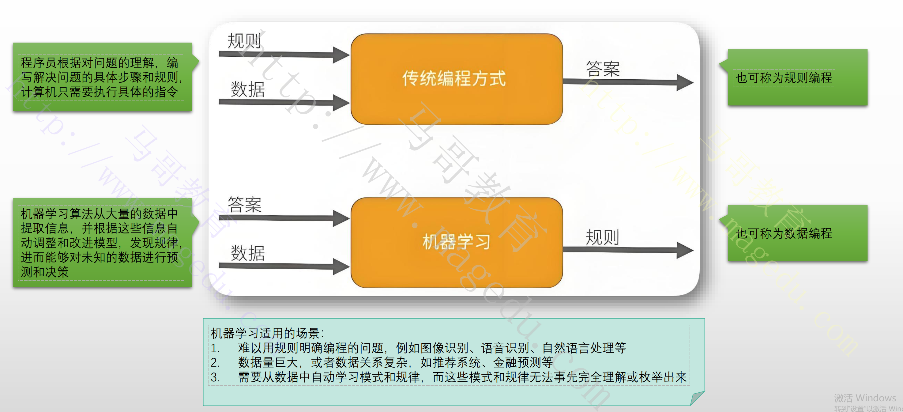

### 1.3.2 机器学习和深度学习

- [ ] 机器学习(ML)

  - 使用算法来解析数据，从中学习提炼模型，然后基于模型对真实世界中国的事件做出决策和预测
  - 机器学习的模型有很多种，例如线性回归，决策树，人工神经网络，贝叶斯分类，聚类和降维模型等

- [ ] 深度学习（DL）

  - 深度学习是机器学习的一种实现，它采用的是人工神经网络模型

  - 机器学习一般使用浅层神经网络，深度学习算法使用的是深度神经网络

    


- [ ] 对比

  


### 1.3.3 机器学习

- [ ] 机器学习的定义
  - 机器学习是人工智能的核心分支，属于多领域交叉学科
  - 其研究目标是：**通过算法使计算机系统能够从数据或历史经验中自动学习规律，并基于这些规律改进自身性能，从而完成特定任务或预测未来数据**
    - 融合概率论，统计学，逼近论，算法复杂度理论等多学科知识，专注构建能够模拟人类学习行为的计算机程序
    - 其核心逻辑是数据驱动，通过归纳与综合实现知识获取与优化
- [ ] 机器学习的研究对象与方法
  - 任务：如分类，回归，聚类，降维等
  - 经验：即训练数据，包括标注数据（监督学习）或无标注数据（无监督学习）
  - 性能度量：如准确率，召回率，损失函数，用于量化模型改进效果
- [ ] 机器学习的关键特征与应用
  - 技术特征
    - 数据依赖性：依赖大量数据训练模型，数据质量直接影响结果（如垃圾数据输入导致垃圾数据输出）
    - 自动优化：通过反向传播，梯度下降等算法自动调整模型参数，减少人工干预
    - 泛化能力：模型需在未见数据上保持良好性能，避免过拟合或欠拟合
  - 主要学习范式
    - 监督学习（如分类，回归）：使用标注数据训练，例如图像识别中的标签分类
    - 无监督学习（如聚类日，降维）：挖掘数据内在结构，例如用户行为分析中的群体划分
    - 强化学习：通过试错与奖励机制优化策略，例如AlphaGo的自我对弈训练
  - 发展阶段
    - 1950 - 1960年代：符号主义主导，研究基于规则的学习
    - 1980年代：统计学习方法兴起，支持向量机，决策树等算法出现
    - 21世纪：深度学习革命推动图像识别

### 1.3.4 深度学习

- [ ] 定义
  - 深度学习是机器学习的重要分支，特指基于**深层神经网络模型对数据进行表征学习**的算法
  - 核心是通过模拟人脑神经元网络的多层结构，自动从原始数据中**提取多层次抽象特征**，并利用这些特征完成分类，预测等任务
- [ ] 技术本质
  - 模型架构：以人工神经网络为基础，如CNN,RNN
  - 特征学习能力：深度学习**通过逐层非线性变换自动提取数据的分布式特征表示**，显著提升模型对复杂数据的刻画能力
  - 大数据驱动：依赖海量数据训练，通过反向传播算法优化网络参数，使模型逼近输入与输出的真是关联关系
- [ ] 与机器学习的关系
  - 从属关系：深度学习是机器学习的**子集**
  - 深度学习通过多层神经网络实现了从数据中自动学习高阶特征的革命性突破，是机器学习在复杂任务上的深化拓展
  - 传统机器学习解决“可解释性强，数据量小”的问题，而深度学习攻克“数据量大，特征复杂”的挑战

### 1.3.5 人工智能的目标任务

- [ ] 传统数据分析“四件套”，
  - 监督学习：从带标签的数据中学习，标签是已知的输出
    - 分类：预测样本的离散型类别标签（垃圾邮件识别，图像分类）
    - 回归：预测连续数值（如房价预测，温度预测）
  - 非监督学习：用于处理未标记数据，不存在事先预定义好的输出
    - 聚类：将数据分组，使组内相似，组间差异大（如用户分群，基因序列分析）
    - 降维：压缩数据维度，保留关键信息（如可视化，去噪）
- [ ] 相关的算法
  - 分类
    - 逻辑回归，支持向量机，决策树，神经网络等
  - 回归
    - 线性回归，多项式回归，神经网络等
  - 聚类
    - K-means，层次聚类，高斯混合模型
  - 降维
    - PCA等

## 1.4 机器学习和模型训练

### 1.4.1 机器学习过程


- [ ] Model requirement（模型需求）- 灰色阶段
  - 整个ML项目的起点，聚焦于将业务问题转化为可行的机器学习问题
  - 典型步骤
    - Business Value/Understanding（业务价值/理解）：明确项目的商业目标和价值，理解业务痛点，这是后续所有技术工作的出发点
    - QoM（模型质量）：在项目开始就确定对模型质量的预期和衡量表i准，包括性能指标，鲁棒性，公平性等
    - Reponsible AI（负责任的人工智能）：同样，从一开始就考虑AI的伦理，公平，透名，隐私和安全问题，确保项目符合负责任的AI原则
- [ ] Data Collection（数据收集）- 蓝色阶段
  - 关注数据的获取和可用性
  - 典型步骤
    - Data availabile（评估数据可用性）：确认所需要的数据源是否存在且可访问
    - Data Extraction（数据提取）：从各种数据源（数据库，API，文件系统等）提取原始数据
    - Data Transform（数据转换）：对提取的数据进行初步的格式转换，使其符合后续处理的需求
    - Data Loading（数据加载）：将转换后的数据加载到适合进行进一步处理和存储的平台（如数据湖，数据仓库）
- [ ] Data Preparation（数据准备）- 蓝色阶段
  - 这个阶段是数据处理的核心，旨在提升数据质量，使其适合模型训练
  - 典型步骤
    - Data Quality Checking（数据质量检查）：识别和处理数据中的错误，不一致，重复值和异常值
    - Data Cleaning（数据清洗）：修正或删除错误数据，处理缺失值（填充，删除）
    - Data Merging（数据合并）：将来自不同来源或表的数据合并，以形成完整的数据集
    - Data Matching（数据匹配）：在合并数据时，确保不同数据源之间的记录能正确匹配
    - Exploratory Data Analysis（探索性数据分析）：通过统计和可视化方法深入理解数据特征，分布，相关性，发现潜在的模式和问题
- [ ] Feature Engineering（特征工程）- 橙色阶段
  - 这是将原始数据转换为模型可理解且有意义特征的关键步骤
  - 典型步骤
    - Feature Selection & Extraction（特征选择与提取）：从现有数据中选择最相关，最有预测能力的特征，或从原始特征中提取新的特征
    - Feature Construction（特征构建）：基于现有特征创建新的，更高级的特征（如组合特征，多项式特征）
    - Feature Scaling（特征缩放）：对特征进行归一化或标准化，以确保它们在相似的尺度上，避免某些特征对模型训练的主导作用
    - Data Labeling（数据标准）：为监督学习任务提供准确的标签，这通常是人工密集型但至关重要的步骤
    - Feature Imputation（特征填充）：处理缺失的特征值，通常通过均值，中位数，众数或更复杂的而预测方法
- [ ] Model Traing（模型训练）- 橙色阶段
  - 利用准备好的特征来训练机器学习模型
  - 典型步骤
    - Model Selection（模型选择）：根据问题类型，数据特征和业务需求，选择最合适的机器学习算法或模型架构
    - Model Construction（模型构建）：使用选定的算法和特征，构建和初始化模型
    - Model Tuning（模型调优）：调整模型的超参数，以优化模型在验证机上的性能，常用的方法包括网格搜索，随即搜索，贝叶斯优化
- [ ] Model Evaluation（模型评估）- 浅黄色阶段
  - 评估训练好的模型，判断其是否满足预期的性能标准
  - 典型步骤
    - Model Testing（模型测试）：使用独立的测试集评估模型的泛化能力，避免过拟合
    - Result Evaluation（结果评估）：根据预先定义的性能指标（如准确率，召回率，F1-score，RMSE, AUC等）量化模型的性能
    - Business Value Review（业务价值审查）：评估模型在实际业务场景中可能带来的价值，并与初始的业务目标对比，可能会涉及与业务方再次确认，以确保模型能有效的解决实际问题
- [ ] System Deployment（系统部署）- 浅黄色阶段
  - 将训练并评估过的模型集成到生产环境，使其能够提供预测服务
  - 典型步骤
    - Deployment Planning（部署优化）：制定详细的部署策略，包括部署模式（在线/批量/边缘），资源需求，安全考虑等
    - Resource Preparation（资源准备）：准备和配置部署模型所需的计算资源（CPU/GPU）,存储，网络等基础设施
    - Integration Testing（集成测试）：测试模型服务与现有系统（如API网关，数据流通道）的集成是否顺畅
    - System Release（系统发布）：将模型服务发布到生产环境，使其可供外部系统或用户访问，这可能包括金丝雀发布，A/B测试等策略
- [ ] Model Monitoring（模型监控）- 浅黄色阶段
  - 模型部署后并非结束，持续监控至关重要，以确保模型性能的持续稳定
  - 典型步骤
    - Drift Detection（漂移检测）：数据漂移，概念飘逸，性能漂移
    - QoM Monitoring（模型质量监控）：持续跟踪模型在生产环境中的质量指标，确保其保持在可接受的范围内
    - Compliance（合规性）：监控模型操作是否符合法规和伦理要求
    - System Logging（系统日志）:收集模型服务的运行日志，错误日志，请求日志，用于故障排查和性能分析
    - Model Explanation（模型解释）：在生产环境中，持续提供模型决策的理解，这对于调试，审计和建立用户信任至关重要

### 1.4.2 模型训练流程


#### 1.4.2.1 特征工程的核心概念

- [ ] 特征（Feature）

  - 数据中用于描述样本属性的数值表示
  - 例如，在预测房价时，“房屋面积”，卧室数量，地理位置等都可以是特征

- [ ] 特征工程

  - 本质是将原始数据转化为机器学习算法可以更好的理解和利用的格式，以揭示数据中隐藏的模式和关系

  - 常见的操作

    - 从原始数据中提取信息：例如，从日期字符串中提取年份，月份，星期几
    - 组合现有特征：例如将房屋面积和卧室数量组合成“每卧室面积”
    - 转换特征尺度：例如将数值数据进行标准化和归一化
    - 处理非数值数据：例如将类别文本数据转化为数值编码

    

#### 1.4.2.2 特征工程的典型实践步骤

1. 理解数据和业务背景：特征工程的起点，也是最关键的一步
2. 缺失值处理：处理策略包括删除，填充等
3. 异常值处理：处理策略包括删除，修正和转换等
4. 特征编码（feature encioding）：将文本、类别等非数值特征转换为数值表示，以便于模型处理、
   1. 类别特征编码：独热编码，标签编码，频率编码
   2. 文本特征编码：词袋模型，TF-IDF, 词嵌入等
5. 特征缩放：改变特征尺寸，以适应模型需求
6. 特征构建/生成：从现有特征中创建新的，更有洞察力的特征
   1. 数值特征的组合和转换：比率，差值，求和/平均，对数转换等
   2. 日期时间特征：提取关键日期或时间单元
   3. 文本特征：文本长度，平均词长
7. 特征选择：特征数量过多，从中选择最相关，最重要，最有贡献的子集

#### 1.4.2.3 获取现有数据集

- [ ] 初学者从0准备数据集挑战过大，业界提供众多开箱即用的数据集
- [ ] 获取数据集的常用方式
  - 公开数据集平台（Public Dataset Platform）
    - Kaggle Datasets, UCI  Machine Learning Repository，Google Dataset Search
    - **Hugging Face Datasets、*****ModelScope Datasets**
  - 机器学习库自带数据集
    - Scikit-learn：提供了load_iris()等经典数据集
    - pytorch：torchvision.datasets，torchtext.datasets， torchaudio.datasets分别提供了针对图像，文本，音频的数据集
    - NLTK:  专注于NLP, 提供了大量的语料库和词典
  - 学术研究与论文的公开的专用数据集服务
  - 数据爬取
  - 通过API接口访问数据集服务
    - 例如社交媒体API，金融数据API，地图服务API，政府公开数据API
  - 企业内部数据
    - 关系型数据库，NoSQL数据据，数据仓库，数据湖中存储的数据
    - 可通过SQL查询，ETL(提取，转换，加载)工具，内部数据平台接口等方式获取

#### 1.4.2.4 特征工程的工具与库

- [ ] Python生态系统提供了丰富的库来支持特征工程
  - 数据操作：pandas
  - 数值计算：numpy（高效数组操作）
  - 数据预处理与特征生成：scikit-learn（提供了大量的预处理工具，如standardscaler、MinMaxScaler等）
  - 文本处理：nltk, spaCy, gensim(文本生词，词性标注，词嵌入等)
  - 图像处理：Pillow，OpenCV（图像加载，裁剪，缩放旋转等）
  - 可视化：matplotlib, seaborn（数据探索，异常值识别，特征分布可视化）
  - 自动化特征工程：Featuretools

#### 1.4.2.5 机器学习问题分类

- [ ] 机器学习问题通常可以分为几大类，每类都有不同的适用模型

  - 需要根据问题选择合适模型】
    - 监督学习问题：分类。回归
    - 非监督学习问题：聚类，降维

  

### 1.4.3 模型

- [ ] 模型在本质上是数据的一种简化，抽象和表示，是一个从数据中学习到的数学函数或一套规则

  - 这种潜在规则也称为“真相”或者“事实”，他代表一种预测能力
  - 机器学习的过程就是为了找出或者逼近这种真相

- [ ] “真相”的潜在规则背后的意义：机器学习的两种典任务

  - 代表“分类标准”：可将时间或对象按照其属性值划分为不同的类别，表现为**分类函数**
  - 代表“回归机制”：事件或对象基于属性值变动的演进逻辑，表现为**回归函数**

  

#### 1.4.3.1 模型的本质

- [ ] 数学函数/映射关系
  - 从数学角度看，机器学习模型可以被视为一个函数f，它将输入特征X映射到输出Y：Y=F(X)
  - 函数f的具体形式由所选的算法决定（例如，y=wx+b，或者复杂的神经网络结构）
  - 函数中的参数（上面w ,b，神经网络中的权重和偏置）的值要通过训练数据学习到
- [ ] 数据模式的总结和抽象
  - 对训练数据中观察到的模式，趋势和规律的总结和抽象
  - 是从数据中提取出的普遍适用于类似数据的底层结构
- [ ] 预测/决策的规则集
  - 模型可被视为一套用于进行预测或决策的**规则集**
  - 这些规则可以是显示的（如决策树的决策路径），也可以是隐式的（如神经网络中权重和激活函数的组合）
- [ ] 假设的验证与修正
  - 在训练过程中，模型可以被看做是在不断提出修正关于数据如何生成或如何关联的假设
  - 损失函数衡量了这些假设与真实情况的偏差，而优化器则指导模型如何调整其内部参数，以使这些假设更接近真实
- [ ] 解决特定问题的工具
  - 最终，机器学习模型将成为解决特定业务或研究问题的工具，它的价值在于其实用性和在实际应用中提供洞察力或自动化决策的能力

#### 1.4.3.2 模型选择考量要素

- 问题类型
  - 监督学习，无监督学习，推荐系统，强化学习
- 数据特性
  - 数据量，特征数量，特征类型，数据分布
- 模型复杂度和可解释性
  - 简单模型通常易于理解和解释，例如线性回归，逻辑回归，决策树等
  - 复杂模型的表达能力强，但可解释性差，例如神经网络，集成学习模型
- 训练速速与预测速度
- 模型鲁棒性
  - 模型对噪音，异常值和缺失数据的容忍度
- 超参数数量
  - 模型的超参数数量越多，调优过程越复杂

#### 1.4.3.3 根据要解决问题选择模型

- [ ] 模型选择时要考虑的问题

  - 是否有标记数据

    - 有--》监督学习
    - 无---》非监督学习

  - 对监督学习，预测值的类别？

    - 离散值---》分类
    - 连续值--》回归

  - 标记数据量

    - 少于1000样本---》简单模型
    - 超过100000样本---》复杂模型

  - 是否需要可解释

    - 是--》线性/树状模型等简单模型
    - 否-》任意模型

    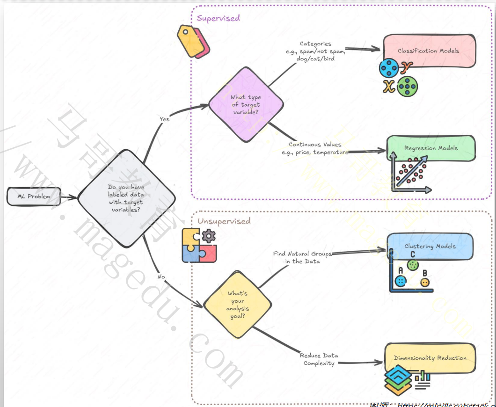

#### 1.4.3.4 模型的定义与配置

- [ ] 选定模型后，下一步就是定义和配置该模型，即设置**超参数**
  - 超参数是控制模型学习过程和结构的参数，需要在训练开始之前手动设置，无法通过学习自动获得
    - 神经网络：学习率（learning_rate）、层数、每层神经元数，激活函数，优化器类型
    - 决策树：最大深度，每个叶子节点所需要的最小样本数
    - SVM：核函数类型，正则化参数
  - 如何定义及配置模型？
    - 实例化模型：通常通过**调用库中对应的类**来实例化一个模型对象
    - 设置超参数：在实例化时作为参数传入，或者通过对象的方法进行设置
    - 参数调优：这是一个迭代过程，通过尝试不同的超参数组合，找到使模型在验证集上表现最佳的组合
- [ ] 参数调优的常见方法
  - 手动调优：凭经验和直觉调整参数，观察效果
  - 网格搜索：定义超参数的离散取值范围，然后遍历所有可能的组合
  - 随机搜索：在超参数空间中随机采样点，效率通常高于网格搜索
  - 贝叶斯优化：利用统计模型指导搜索，更高效的找到最优参数
  - 自动化机器学习：更高效的工具，可以自动搜索模型架构和超参数

#### 1.4.3.5 模型训练的关键步骤


- [ ] 模型训练是模型真正学习数据模式的过程，它主要包含以下几个典型步骤
  1. **初始化模型参数：**在训练开始前，模型的内部参数（如神经网络中的权重和偏置）通常会被随机初始化
  2. **前向传播：**模型接收训练数据作为输入，通过其内部结构（例如神经网络的层），计算并生成一个预测输出
  3. **计算损失：**将模型的预测输出与真实标签进行比较，计算出损失函数的值
     - 损失函数量化了模型预测与真实值之间的差异，值越小表示模型表现越好
     - 不同的任务有不同的损失函数，例如，回归任务常用均方误差（MSE），分类任务长哟个交叉熵损失
  4. **反向传播：**这是优化模型参数的关键步骤，通过计算损失函数相对于模型参数的梯度，反向传播算法能够确定每个参数对最终损失的贡献程度
  5. **迭代训练：**模型会重复前向传播，损失计算，反向传播和参数优化这些步骤，对整个训练数据集进行多轮迭代，知道模型收敛或达到预期的训练周期

#### 1.4.3.6：模型和损失函数

- [ ] 目标函数、成本函数、损失函数
  - 目标函数是训练模型时需要优化的函数，用于衡量模型在当前参数配置下的表现
  - 目标函数通常是根据模型的预测值和真实值之间的误差来定义，反映了模型的性能和预测误差
  - 常见的目标函数包括以下组成部分
    - 损失函数：用于衡量单个样本误差
    - 成本函数：通常是损失函数在整个数据集上的平均或总和，是模型在整个训练数据集上的表现度量
    - 正则化项：用于控制模型复杂度，防止过拟合
- [ ] 模型和损失函数关系
  - 模型是优化的兑现
  - 损失函数用于指导模型训练
  - 模型训练的最终目标是优化模型参数，使得损失函数达到最小值

#### 1.4.3.7 损失函数和成本函数

- [ ] 如何衡量目标函数优化的结果？
  - 目标函数用于定义机器学习算法的优化目标，可以根据不同的问题和任务进行定义
  - 在优化的过程中，用于衡量模型预测的准确性和误差的函数，则是损失函数和成本函数
- [ ] 损失函数
  - 用于计算标签值与预测值之差异的函数，通常针对的是单个样本进行的计算
  - 函数值越小，代表模型拟合越好
- [ ] 成本函数
  - 类似损失函数，也是用于计算标签值和预测值之间的差异的函数，但通常针对的是整个数据集进行计算
  - 通常是训练集上的损失函数之和加上一些模型复杂度惩罚（正则化）

#### 1.4.3.8 模型和优化算法

- [ ] 优化算法
  - 用于调整模型参数的数学方法和策略，其核心目标是最小化或最大化一个特定的函数（通常是模型的损失函数和成本函数）
  - 优化算法在训练中反复迭代，通过计算损失函数关于模型参数的导数，沿着损失函数最优方向更新参数，从而逼近最优解
  - 常用的算法：
    - 梯度下降法：包括批量梯度下降，随机梯度下降和小批量梯度下降
    - 自适应优化算法：能自动调整学习率，常见的算法包括Adam, AdamW
- [ ] 损失函数和优化算法的关系
  - 损失函数是优化算法的优化对象
    - 损失函数定义了模型的优化目标，而优化算法是实现这一目标的手段
    - 优化算法通过不断调整模型参数，使得损失函数值最小
  - 优化算法通过损失函数的梯度来更新参数
    - 优化算法根据目标函数的梯度信息来确定参数更新的方向和步长
  - 优化算法影响损失函数的收敛速度和效果

#### 1.4.3.9 过拟合和欠拟合

- [ ] 模型训练的目标

  - 从训练样本发现适用于所有潜在样本的普遍规律，这个功能也称为泛化
  - 模型在训练集上的误差，称为训练误差
  - 模型训练的目标，就在于将泛化误差降低至期望的范围内

- [ ] 过拟合和欠拟合

  - 过拟合
    - 模型在训练过程中，将训练集上特有特点当成了所有潜在样本上的普遍特点，进而导致了泛化性能下降
    - 通常是由于在使用了过于精细的规则所致
  - 欠拟合
    - 与过拟合相反，通常是由于使用了过于模糊或者通用的规则所致

  

#### 1.4.3.10 模型评估与调优

- [ ] 训练后的模型需要被严格评估，并进行必要的调整以提升性能
- [ ] 性能评估
  - 使用在训练阶段未见过的数据集（验证集）来评估模型的性能
  - 根据任务类型，选择合适的评估指标，例如
    - 分类问题：准确率，精确率，召回率，F1分数，混淆矩阵
    - 回归问题：均方误差，均方根误差，平均绝对误差
- [ ] 识别过拟合和欠拟合
  - 过拟合
    - 模型在训练集上表现很好，但在验证集和测试集表现很差
    - 这通常意味模型学习到了训练数据中的噪音或者特有模式
  - 欠拟合
    - 模型在训练集和测试集上都表现不佳
    - 这可能说明模型过于简单，无法捕捉数据中的复杂模式
- [ ] 超参数调优
  - 超参数是模型训练前设置的参数，它们不能拿通过训练得到，需要手动设置或通过自动化方法优化
  - 常见的优化方法包括网格搜索，随机搜索，贝叶斯优化等

#### 1.4.3.11 过拟合问题的解决方案

- [ ] 解决过拟合问题的核心思想是**降低模型复杂度**，或者**增加模型学习的泛化能力**
  - 增加训练数据
  - 简化模型
  - 正则化
  - 早停法
  - 集成学习

#### 1.4.3.12 欠拟合解决方案

- [ ] 解决欠拟合核心思想是**增加模型复杂度**，或者**让模型有能力学习更复杂的模式**
  - 增加模型复杂度
  - 减少正则化程度
  - 优化模型训练过程
  - 特征过程优化

#### 1.4.3.13 模型的性能验证方法

- [ ] 验证方法与流程

  - 数据集划分

    - 将数据划分为训练集（模型训练），验证集（用于调参）和测试集（最终性能评估），常用比例为7:2:1或8:2
    - 交叉验证：通过k-fold交叉验证减少随即划分的偏差，提高评估稳定性

  - 学习曲线分析

    - 绘制训练集与验证集的误差随样本量或迭代次数变化曲线，判断模型是否欠拟合或过拟合
    - 过拟合或欠拟合处理：通过正则化，数据增强或调整模型复杂度优化性能

  - 混淆矩阵与误差分析

    - 通过混淆矩阵可视化分类结果，计算各类别的TP,发票，同年，FN

      

#### 1.4.3.14 模型评估指标

- [ ] 分类任务的指标

  - 准确率

    - 衡量模型整体预测正确的比例，即正确预测的正类（TP）和负类（TN）占总样本比例

    - 其中，IP为真正例，TN为真负例，FP为假正例（误报），FN为假负例（漏报）

      

  - 精确率

    - 衡量模型预测为正类的样本中实际为正类的比例，关注“预测质量”

    - 在垃圾邮件分类实例中，精确率衡量的是被归类为垃圾邮件单子邮件中国实际就是垃圾邮件的比例

      

  - 召回率

    - 衡量实际为正类的样本中被正确预测的比例，关注“覆盖能力”

    - 假负例是指被误分类为负例的实际正例，因此会出现分母中

    - 在垃圾邮件分类实例中，召回率衡量的是被正确分类为垃圾邮件的垃圾邮件电子邮件的比例

      

- [ ] 指标间关系

  - 随着假正例的减少，精确率会提高；随着假负例的减少，召回率会提高
  - 精确率和召回率通常呈反函数关系，其中一个提高会降低另外一个

- [ ] ROC曲线

  - 显示具有不同决策阈值的二分类器的性能，它绘制了真正率（TPR）与假正率（FPR）的关系

  - 以假正率为横轴，真正率为纵轴绘制的曲线

    

  - 反应分类器在不同分类阈值下的性能

    

- [ ] 分类阈值

  - 概率机器学习模型负责预测特定类别或结果的概率，模型输出介于0到1之间的分数
  - 要将此概率分数转化为分类决策，需要设置一个阈值，即分类阈值

  

- [ ] ROC曲线的绘制方法

  - 通过调整分类阈值，计算不同阈值下的TPR和FPR，绘制曲线
  - 曲线越靠近左上角，模型性能越好（高TPR，低FPR）
  - 对角线(y=x)表示随机猜测模型的性能

  

- [ ] AUC

  - ROC曲线下的面积，衡量模型在不同阈值下区分正负类能力

  - 取值范围：0.5（无区分能力）和1（完美分类）

  - AUC与阈值无关，反应模型整体的排序能力

  - 适合评估类别分布不均匀的数据集

    

- [ ] F1 Score

  - 精确率和召回率的调和平均，用于平衡两者的权衡

    

  - 当需要同时关注精确率和召回率时使用

### 1.4.4 机器学习算法

- [ ] 监督学习：在已有标签的数据集上训练模型，通过数据-标签对学习映射关系
  - **分类：**用于对离散标签进行预测
    - 逻辑回归
    - 支持向量机
    - K近邻算法
    - 决策树
    - 随机森林
    - 梯度提升机
    - 朴素贝叶斯
    - **神经网络**
  - **回归：**用于对连续数值进行预测
    - 线性回归
    - 岭回归
    - 套索回归
    - 支持向量回归
    - 决策树回归
    - 随机森林回归
    - 梯度提升回归
- [ ] 无监督学习
  - 定义：在没有标签的数据集上训练模型，通过发现数据中的模式，结构或分布特征进行数据分析
  - **聚类：**将数据分为多个组，使得同组数据更相似
    - K均值聚类
    - 层次聚类
    - 密度聚类
    - 高斯混合模型
  - **降维：**将高维数据转换为低维表示，保留数据的主要特征
    - 主成分分析
    - 线性判别分析
    - t-SNE
    - UMAP
  - **异常检测：**用于检测数据中与众不同的异常样本
    - 孤立森林
    - 一类支持向量机
    - 高斯混合模型
- [ ] 半监督学习
  - 定义：结合了少量标签数据和大量无标签数据来训练模型，适合标记成本高的数据集
  - 常用算法
    - 自训练：通过迭代地使用模型的预测来标记未标注数据
    - 生成对抗网络：可用于生成新样本和数据增强
    - 图神经网络：在图结构数据上进行半监督学习
- [ ] 自监督学习
  - 定义：一种特殊的无监督学习，模型利用数据中的内在结构信息生成伪标签进行训练，常用于自然语言处理和计算机视觉
  - 语言模型（基于Transformer）
    - 掩蔽语言模型：如BERT模型，通过随机掩蔽文本中的部分词汇，让模型预测这些被掩蔽的词
    - 自回归语言模型：如GPT模型，通过预测当前词之后的词或句子，让模型逐步学习语言生成
    - 文本生成任务：如T5模型，通过指定任务的文本形式，让模型进行生成和抓换
  - 视觉模型
    - 图像掩蔽预测：如MAE和SimCLR模型
    - 对比学习：如SimCLR模型，MoCo模型

### 1.4.5 模型部署

- [ ] 常见的部署方式
  - 批处理预测
    - 模型离线运行，定期处理大批量数据并生成预测结果
    - 预测结果通常存储在数据库中，供其他系统查询或生成报告
    - 适用于对实时要求性不高，但需要处理大量数据的场景，如市场分析，库存预测，客户预测，客户分群，夜间报表生成等
  - 在线预测/实施预测
    - 模型作为服务部署，通过API接口接收单个或少量实时请求，并立即返回预测结果
    - 实现方式：
      - 独立的RESTFUL API服务：最为常见的部署方式，模型被封装为WEB服务，通过HTTP协议处理请求
      - 独立的RPC服务
      - serverless函数服务
      - 容器化
  - 边缘部署/设备端部署
    - 模型直接部署到终端设备，在设备上进行推理，而无需将数据发送到云端
    - 适用于数据隐私敏感，网络连接不稳定或延迟要求极低的场景，如智能助理
  - 模型即服务平台
    - 利用专门的MLOPS平台或云服务提供商的机器学习服务来管理和部署模型
    - 适用于快速部署，管理和扩展模型，以减少基础设施运维负担团队

#### 1.4.5.1 模型部署的关键流程与考虑因素

1. 模型序列化与反序列化
   - 将训练好的模型对象保存到磁盘（序列化），并在生产环境中重新加载到内存中（反序列化）
   - 常用的格式有pickle(Python)、ONNX，pytorch
2. 模型打包与依赖管理
   - 将模型代码，所有依赖项和配置文件一起打包，以确保在生产环境运行
   - 常用的工具包括Docker, python的虚拟环境conda等
3. API开发与集成
   - 为模型创建一个接口，以便其他应用程序能够通过网络与模型交互
4. 基础设施配置与伸缩
   - 选择和配置运行模型的服务器或云资源，并确保其他能够根据负载自动伸缩
   - 例如kubernete, serverless
5. 监控与日志
   - 部署后，持续跟踪模型的性能，健康状况和数据漂移
6. 模型版本管理与回滚

#### 1.4.5.2 模型监控

- [ ] 监控指标
  - 服务健康：CPU利用率，内存利用率，请求延迟，错误率，吞吐量
  - 模型性能：预测准确率，精确率，召回率，F1分数，RMSE等
  - 数据漂移：输入数据分布与训练数据分布的差异
  - 概念漂移：特征与目标变量之间的关系发生变化
- [ ] 日志
  - 记录模型输入，输出，错误事件，便于调试和分析
- [ ] 工具
  - Prometheus和Grafana
  - ELK

## 1.5 从线性回归模型学习模型训练

### 1.5.1 线性回归概念

- [ ] 回归

  - 统计学和机器学习中用于**研究变量间的关系**的分析方法
  - 核心目标是建立数学模型来描述**因变量**与一个或多个**自变量**之间的关系，用于预测和解释现象
  - 类型
    - 线性回归：变量关系通过线性方程描述
    - 非线性回归：如多项式回归，指数回归

- [ ] 线性回归

  - 线性关系是指变量之间的变化呈现出**一次方函数关系**（eg: y=kx+b）
  - 在更严格的定义中，仅截距为0的一次函数术语严格线性关系
  - 线性回归是一种回归分析方法，它假设因变量和自变量之间的关系是线性的
  - 模型形式
    - 一元线性回归：仅使用单个自变量
    - 多元线性回归：存在多个自变量

  

### 1.5.2 一元线性回归模型

- [ ] 一元线性回归模型函数y=wx+b的解释
  - w为权重(weight)
    - 表示自变量x对因变量y的影响程度，即回归系数、
    - 数学意义：x每增加1个单位,y平均变化量为w；若w>0，y随着x增加而增加，反之则减少
  - b为偏置
    - 是截距项，表示当x=0，Y的基准值
- [ ] 模型训练的目标
  - 给定一个数据集，我们的目标是寻找模型的w和b，使得根据模型做出预测基本符合数据里的真实价格
  - 无论使用什么手段来观察每个特征x和对应标签y，都可能会出现少量的观测误差
  - 线性回归的目标，就是**基于样本集找到一组w和b,可确保对新样本的预测结果误差尽可能小**

### 1.5.3 如何快速找到这组最优的w和b

- [ ] 依赖两个关键组件

  - 损失函数：用于度量模型的预测质量，即评估预测值与实际值的偏差有多大
  - 优化算法：用于更新模型以提高预测质量

- [ ] 回归任务的常用的损失函数

  - 均方误差

    

  - 平均绝对误差

    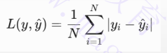

- [ ] 回归任务常用的优化算法

  - 梯度下降法
    - 批量梯度下降
    - 随机梯度下降
    - 小批量梯度下降
  - 最小二乘法

### 1.5.4 模型训练过程的原理与步骤

- [ ] 核心流程：预测，损失计算与参数调整

  1. 预测值计算

     - 对于每个样本的特征x，模型通过预测值:y=wx+b
     - 这一步称为前向传播，目的是将输入特征映射到预测结果

  2. 损失函数计算

     - 损失函数用于量化预测值和真实标签值之间的差异

       

  3. 参数调整

     - 通过梯度下降算法，模型根据损失函数的梯度方向更新参数w和b，使其逐步逼近最优值

     - 梯度计算

       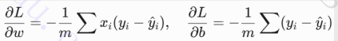

     - 参数更新

- [ ] 训练过程的细节

  - 数据分批处理
    - 实际训练中通常采用分批处理，每次选取一部分样本计算损失和梯度，而非逐样本处理
    - 这样即能节省内存，又能引入随机性，避免陷入局部最优
  - 反向传播与参数更新
    - 反向传播通过链式法则计算梯度
    - 参数更新时需要清零梯度，防止梯度累加影响结果
  - 迭代优化
    - 训练过程需要在多个epoch中重复一下步骤
      - 前向传播----》损失计算-----》反向传播----》参数更新
    - 随着迭代次数增加，损失值会逐渐少，参数w和b毕竟真实值；迭代停止条件
      - 最大迭代次数：预设固定的迭代伦茨
      - 损失收敛阈值：当损失变化量小于设定阈值
      - 梯度趋近于0

- [ ] 为什么参数调整能使损失变小

  - 梯度下降原理
    - 梯度方向是指向损失函数上升最快的方向，因此沿负梯度方向更新参数会使损失逐步减少

### 1.5.5 梯度下降算法

- [ ] 为何需要使用梯度下降算法求损失函数最小值？

  - 复杂模型具有高度非线性的特点，通常无法通过求导的倒闭和解
  - 模型具有大量的特征（高维输入）或大量的参数时，求导计算成本巨大，甚至不可行
  - 梯度下降可以根据部分数据的样本，不断更新模型参数，而不用等到整个数据集都被出处理完
  - 梯度下降支持通过设定学习率和迭代次数，允许用户在计算资源和模型精度之间进行权衡

- [ ] 梯度下降的关键概念

  - 梯度：梯度代表一个函数在某一个点变化最快的防线
  - 下降方向：沿着梯度反方向移动可以找到最小值
  - 步长（学习率）
    - 沿着梯度的反方向移动的距离称为步长
    - 该步长的大小也称为学习率

  

### 1.5.6 线性回归的损失函数推到

- [ ] 以一元线性回归函数y=wx+b为例，为了简化问题，假设偏置为0

  

- [ ] 为了推导一元线性模型的最佳权重w，需要最小均方误差损失函数

  

### 1.5.7 一元线性回归模型及其损失函数示意图

- [ ] 左图

  - 展示的时数据点和真实的一元线性模型的关系
  - 红色代表了真实的线性模型，数据点围绕红色线分布，并且由于噪音的存在，点不完全落在直线上

- [ ] 右图

  - 展示的是均方误差损失函数关于参数w的变化曲线，w越接近2，损失函数越小
  - 红色虚线标记了真实参数w=2的损失值最低点，这也是模型最优解的地方

  

- [ ] 权重取值为0.5,1,1.5,2.2.5.3和3.5时，一元线性函数及其对应的均方误差损失函数的对比示意图

  

- [ ] 偏置项使得线性函数的截距发生了变化，直线不在穿过原点

- [ ] 添加偏置后，模型能够灵活的拟合数据

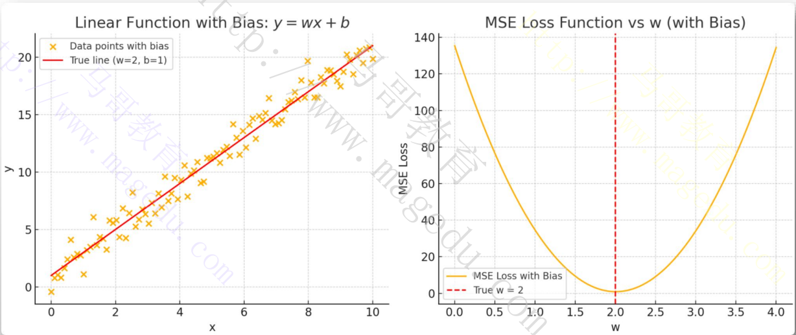

### 1.5.8 示例与验证

- [ ] 假设真实模型y=5.5x+3.7，通过随机初始化的w和b，经过多测迭代，参数会逐渐逼近真实值
  - 训练过程中，损失值的变化可通过以下曲线直观展示
    - 初始阶段：损失值越高，梯度将达，参数更新幅度越大
    - 后期阶段：损失值趋近于0，梯度变小，擦书收敛
- [ ] 模型训练的本质总结
  - 通过特征与标签的匹配，动态调整参数以最小损失函数
  - 这一过程通过前向传播，损失计算，反向传播和参数更新的循环迭代实现
  - 最终目标是使模型能够从数据中学习到特征与标签的潜在规律，从而对新数据做出准确预测

## 1.6 神经网络基础

### 1.6.1 神经网络

- [ ] 人工神经网络，是目前主流的建模方式之一

  - 神经网络的强大之处在于它们具有通用逼近定理所描述的能力
  - 理论上只要层数足够多，能逼近任何连续的目标函数
    - 关键在于它使用了**非线性激活函数**

- [ ] 生物神经网络的基本工作机制

  - 神经元“兴奋”时，会向相连的神经元发送化学物质，改变其电位
  - 若神经元的电位超过一个**阈值**，就会被激活，变得兴奋起来，向其他神经元发送化学物质

- [ ] 人工神经网络

  - 1943年，McCulloch和Pitts将生物神经网络抽象出了简单的神经元模型，被称为“M-P神经元模型”，为神经网络奠定了理论基础
  - 1957年，Rosenblatt在M-P神经元模型”的基础上发明了感知机（下图），它能够进行简单的模式识别，但仅限于**线性分类**问题

  


### 1.6.2 神经网络基础

- [ ] 基础概念

  - 神经网络又称为人工神经网络（ANN），是一种基于人脑功能模型的计算架构
  - 神经网络由一组称为“节点”的处理单元组成，这些节点称为神经元
  - 这些节点相互传递数据，就像大脑中的神经元相互传递电脉冲一样

- [ ] 神经网络是现代人工智能技术的核心

  - 大语言模型（LLM）（如ChatGPT）和AI图像生成器（如DALL-E）等模型都在一定程度上依赖于神经网络

  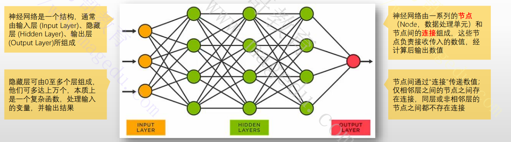

### 1.6.3 现代人工神经元

- [ ] 现代人工神经元，在旧版人工神经元的基础上，分别在输入端和输出端各引入一个组件

  - 输入端：偏置(bias)

    - 也称为偏差，偏移量或者截距
    - 用于帮助确定，当所有特征取值为0，预测值为多少
    - 它还代表着神经元被激活的难易程度

  - 输出端：激活函数（Activation Function）

    - 使用数学函数代表了旧版中的“求和结果与目标值进行比较判断最终输出”的步骤
    - 激活函数是一个执行非线性运算函数，它是防止神经网络坍塌的关键组件
    - 常见的激活函数由**Sigmoid**, TanH, **ReLu**, Leaky ReLU , MAXOUT 和ELU等

    

### 1.6.4 为何需要多层神经网络？

- [ ] 多层感知器
  - 类似生物神经元，人工神经元也可以连接起来，其每个输入来自另外一个输出
    - 输入层因为没有神经元，因此不计入网络层数
  - 通常，每层神经元只从前一层获得输入，并且只将输出送至下一层
    - 神经元通常不会与同一层神经元通信，也不会跨层通信
  - 这种结构称为多层感知器，他们通常会**逐层处理数据**
- [ ] 将神经元按特定的架构组合在一起，就可以组合它们的决策边界，从而能够学习复杂的非线性决策边界
  - 添加更多层单元，就可以在输入和输出之间进行非线性运算
  - 多层感知器是由许多感知器以分层连接的方式组成的第一款人工神经网络
  - 需要注意的是，若没有**激活函数**，神经网路的功能等同于单个神经元

### 1.6.5 神经网络的分类

- [ ] 神经网络的节点和层数没有限制，根据隐藏层的数量，伸进网络大体分为两类

  - 浅层神经网络（SNN）：通常只有少量（0-2）隐藏层，只能进行浅层学习

    - 所需的处理能力低，执行速度快
    - 从数据中学习复杂模式能力有限
    - 浅层学习算法包括线性回归，逻辑回归，决策树，k-最近邻和支持向量机等

  - 深度神经网络（DNN）:有2个以上的隐藏层

    - 需要的处理能力高，执行速度慢
    - 网络层数越多，神经网络就更加复杂和深入，学习也更加准确
    - 深度网络的结构是每层将前一层的两两单元进行异或，最后到一个输出，能够减少神经元个数，从而减少计算量

    

### 1.6.6 神经网络的学习过程

- [ ] 神经网络的“学习”，是指其从样本数据中自动获得**最优权重**的过程

  

- [ ] 神经网络训练过程

  - 初始化：随机初始化网络中所有参数
  - 前向传播：将样本的个特征值作为输入，逐层计算后，由最后的输出层生成最终的预测结果
  - 计算损失：将网络的输出值同样本的标签值进行比较，计算出损失函数的值
    - 常用的损失函数有均方误差，交叉熵等
  - 反向传播：通过链式法则，计算损失函数对每个参数的梯度；梯度代表损失函数在当前参数点处变化最快方向
  - 参数更新：根据计算得到的梯度，使用优化算法来更新网络中的参数（权重）
  - 重复以上步骤

- [ ] 神经网络训练的注意事项

  - 神经网络的最优化问题非常难，因为参数空间非常复杂，且大型网络的参数量非常庞大，因此，优化器的选择至关重要
  - 权重的初始值至关重要，甚至会关系到网络的学习能否成功
    - **Xavier初始化**是目前训练神经网络之前对网络权重进行初始化的常用方法，核心思想：使每一层神经元的输出具有相同的方差
    - 权值衰减法：以减少权重值为目的的进行学习的方法

### 1.6.7 神经网络的结构属性

- [ ] 输入层的神经元数量：取决于输入数据的特征维度

  - 输入层的神经元数量等于输入数据的 特征维度
    - 结构化数据：例如一个包含年龄，身高，体重等10个特征的样本，输入层需设置10个神经元
    - 图像数据：对于尺寸为28 * 28的灰度图，输入层神经元数量为784（即28 * 28像素）
    - 序列数据：若处理长度为100的文本词向量（每个词用300维向量表示），输入层通常需要100 * 300=30000个神经元
  - 输入层负责将原始数据转换为神经网络可处理的数值形式，每个神经元对应一个独立的特征或数据维度
  - 输入特征的数量需在模型设计时固定，否则需调整网络结构

- [ ] 输出层的神经元数量：由任务类型决定

  - 回归任务
    - 输出层仅需要1个神经元，直接预测连续值
    - 若需要同时预测多个连续值（如物体的位置坐标X和Y），输出层神经元数量等于目标变量数
  - 分类任务
    - 二分类
      - 常用1个神经元配和Sigmoid激活函数，输出概率值（如判断是否为垃圾邮件）
    - 多分类
      - 输出层神经元数量等于类别数，配合Softmax激活函数输出概率分布

- [ ] 输入输出层与其他层关系

  - 输入层与隐藏层

    - 输入层仅传递数据，不做非线性变化（无激活函数）
    - 隐藏层通过激活函数（如ReLU）引入非线性，其神经元数量需通过实验调整（例如输入特征数的1.5-2倍）

  - 输出层与损失函数

    - 输出层激活函数需与损失函数匹配

    - Sigmoid ---> 交叉熵损失（二分类）

      - Softmax ----> 交叉熵损失（多分类）
      - 线性激活  ---》 均方误差（回归）

      

- [ ] 设计建议

  - 输入层和输出层的结构通常由数据特性直接确定
  - 隐藏层的深度和宽度需根据任务复杂度，数据集大小及计算资源优化调整

### 1.6.8 常见的神经网络类型

- [ ] 基于神经网络的学习模型有很多，它们根据不同的任务需求，数据类型和结构特点进行设计

  - **前馈神经网络**（Feedforward Neural Network, FNN）
  - **卷积神经网络**（Convolutional Neural Network, CNN）
  - **循环神经网络**（Recurrent Neural Network, RNN）
  - 自编码器（Autoencoder）
  - **生成对抗网络**（Generative Adversarial Network, GAN）
  - **注意力机制**（Attention Mechanism）
  - **Tansformer**

  

#### 1.6.8.1 FNN

- [ ] **前馈神经网络**（Feedforward Neural Network, FNN）
  - 最基本的神经网络类型，由一个输入层，多个隐藏层和一个输出层组成
  - 每个神经元与下一层的所有神经元相连接，信息从流入流向输出
  - 没有任何反馈连接，信息无法从后一层回流至前面的层
  - 自1990开始，发现**反向传播算法**方才变得实用和流行
- [ ] 优缺点
  - 适用于监督学习，适用于分类和回归
  - 难以处理复杂的数据关系
  - 高度依赖与特征，不适用于顺序数据，对数据图像处理也不好
- [ ] 需要说明的是，多层神经网络难以直接用经典算法进行训练，因为误差在多个隐藏层内反向传播时存在梯度消失或者爆炸问题


#### 1.6.8.2 CNN

- [ ] **卷积神经网络**（Convolutional Neural Network, CNN）

  - 是一种强大的，为**处理图像数据**而设计的神经网络
    - CNN出现之前，人们通常使用耗时的人工特征抽取的方法识别图像中的对象
    - CNN利用线性代数原理（特别是矩阵乘法）来识别图像中的图案，是一种无监督学习机制
    - 对计算力要求很高，可能需要图像处理单元（GPU）来训练模型
  - 无监督逐层训练
    - 每次只训练一层的 隐藏节点，训练时将前一层的输出作为本层 的输入，而本层的输入作为下一隐藏层的输出，这种训练机制称为预训练（pre-traing）
    - 在预训练完成后，再对整个网络进行微调(fine-tunning)训练
  - 卷积神经网络的结构
    - 卷积层：自动抽取图像特征；是CNN的核心构建块，负责执行大部分计算，主要由过滤器和特征图组成
    - 池化层：非线性降维采样层，用于降低数据空间大小，从而降低参数数量和所需要的计算量
    - 全连接层：卷积层和池化层的神经元连接非为全连接，因此全连接层则由多层全连接的神经元组成，支持仿射变换，进而实现回归或者分类功能
  - 注意：CNN不需要对图片有任何实际的理解就可以识别其中的物体，它只是处理由图片像素构成的统计数据

  

**经典的CNN模型：**

- [ ] LeNet-5

  - 由Yann LeCun于1998年推出，是首批CNN架构之一，也是最为著名的CNN架构
  - 专为手写数字识别而设计，由卷积层，池化层和全连接层组成
  - 输入特征图尺寸为32 * 32 * 1的灰色图像，后跟两对步长为1的卷积层和步长为2的平均池化层

  

- [ ] AlexNet

  - 较之LeNet-5，它采用了更深的架构，以ReLU作为激活函数，并基于Dropout进行正则化
    - 5个卷积层和3个全连接层
    - 包含大约6000万个参数
  - 最初在两个Nvdia Geforce GTX 580 GPU上训练，因此网络被分为两个管道

  

#### 1.6.8.3 RNN

- [ ] **循环神经网络**（Recurrent Neural Network, RNN）

  - 序列数据

    - CNN中的每个样本彼此独立，同其他样本无关
    - 但有些场景中数据存在关联关系，例如人类自然语言中的字，单词，词语等元素，视频中的前后帧等

  - 基于记忆序列元素的方法处理**序列数据**的神经网络模型，即为循环神经网络(RNN)

    - RNN最主要也是最重要的特征就是它的**隐藏状态**
    - 隐藏状态可以被视为网络再当前时刻的记忆，它保存了之前所有输入的信息
      - FNN和CNN都不具备记忆功能
    - 隐藏状态可以捕捉到序列中的长期依赖关系，例如再自然语言处理中，可以捕捉句子中的语法结构，语义信息等
    - 通过将隐藏状态作为输入，可以生成新的序列数据，例如文本生成，机器翻译

    

- [ ] RNN如何处理输入的语句

  1. 单词嵌入：文本预处理
     - 分词：首先输入的语句切分为词语，单词等，切分后的每个元素称为一个token（词元）
     - 嵌入：将每个token转换为一个稠密向量表示，该类向量中保存有token间的予以和语法关系
       - 大部分元素为非0的向量，即为稠密向量；反之称为稀疏向量
  2. 序列输入
     - 将每个token向量按照其在语句中的顺序，逐一输入到RNN中
     - RNN咋每一个时间步骤中接收一个token向量
  3. 隐藏状态
     - RNN再每一个时间步骤中都会维护一个隐藏状态
     - 该隐藏状态是RNN在当前时间步骤对过去信息的记忆，他会随着时间推移不断更新
  4. 循环连接
     - 当前时间步骤的隐藏状态不仅取决于当前输入的token向量，还取决于前一个时间步骤的隐藏状态
     - 这种循环连接使得RNN能够捕捉序列中的依赖关系
  5. 输出
     - RNN的输出可以是多个时间步的输出的组合，也可以是最终时间步的输出

  RNN就像一个阅读文章的人，逐字逐句的阅读句子，并根据已经读过的内容来理解当前的单词，最终得出对整个句子的理解。

##### 1.6.8.3.1 RNN工作机制示意图

- [ ] 对于每个时间点，RNN加载一个样本（例如一个token），计算隐藏状态，并生成输出
  - 处理第一个输出时，RNN会首先初始化隐藏状态
    - 全零初始化，随机初始化和预训练初始化
  - 每个时间步骤的隐藏状态由当前输入和前一个时间步骤的隐藏步骤决定
- [ ] RNN主要使用Sigmoid, tanh和ReLU几种激活函数

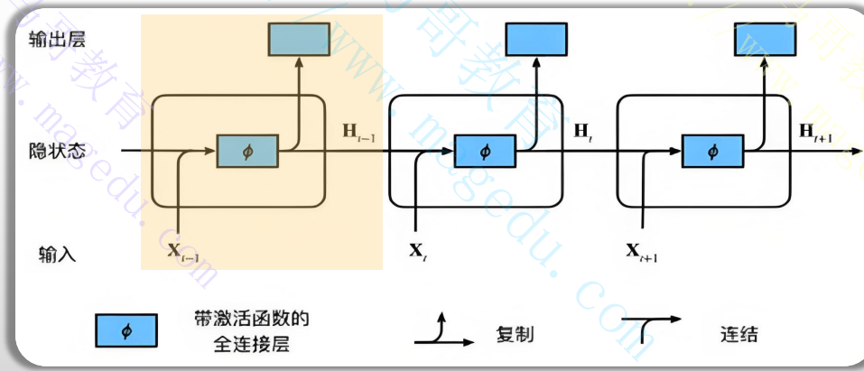

##### 1.6.8.3.2 RNN的著名变体--- LSTM

- [ ] RNN的局限性

  - 在实践中，传统的RNN的记忆时长大概**5到10个时间步**
  - 受限于梯度消失和梯度爆炸问题，难以处理较长的时间依赖序列，例如长文生成等

- [ ] LSTM(长短期基于网络)

  - 是对RNN的改进版本，引入了**cell state**作为贯穿整个事件序列的记忆单元，基于门控制机制完成保存，更新和传递长时间序列的重要信息
  - 引入门控机制（输入门，遗忘门，输出门），控制信息的保留和丢弃，缓解了梯度消失的问题
    - 遗忘门：决定哪些过去的信息应该被以往
    - 输入门：决定哪些新的信息应该被记住
    - 输出门：决定当前时间步的输出
  - 基于门控机制，LSTM能够保留数百个甚至上千个时间步信息

  

##### 1.6.8.3.3 RNN的著名变体--- GRU

- [ ] GRU

  - LSTM的简化版本，仅用两个门控制信息更新和遗忘：重置门和更新门
  - 不使用cell state，而是将隐藏状态作为唯一的记忆单元

- [ ] GRU的门控机制

  - 重置门
    - 基于当前时间步输入和之前的隐藏状态，决定当前时间步应该从之前隐藏状态中忘记哪些信息
    - 有助于捕获序列中的短期依赖关系
  - 更新门
    - 根据当前时间步的输入和隐藏信息，决定当前时间步应该保留那些信息
    - 有助于捕获序列中的长期依赖关系

  

##### 1.6.8.3.4 RNN的类型

- [ ] RNN根据输入和输出的序列长度不同，可以分为多种不同类型，分别适用于不同的任务场景

  

- [ ] 一对一（One-to-One）

  - 输入和输出都是单个数据，没有明显的序列特征，不具备序列处理能力
  - 最简单的RNN形式，等同于传统的神经网络，常用于分类和回归任务
  - 示例场景：对一张图像进行分类i，输入一张图片，输出一个类别

- [ ] 一对多（One-to-Many）

  - 输入是一个单独的值或向量，输出是一个序列
  - 常用于序列生成任务，例如图像描述，音乐生成，文本生成等
  - 示例场景：图像描述生成需求，输入是一张图片，输出是对这张图片的文本描述

- [ ] 多对一（Many-to-One）

  - 输入是一个序列，输出是一个单一的数据点
  - 常用于序列分类任务，对整个序列进行分类
  - 示例场景：情感分析，文本分类

- [ ] 多对多（Many-to-Many）

  - 输入和输出都是序列，且序列长度可以相等或不相等
  - **等长序列：**常用于序列标注任务，如命名实体识别
  - **不等长序列：**常用于机器翻译，输入和输出的序列长度可能不同
    - 通常被称为序列或序列模型（**seq2seq**）,包含了两个部分：编码器(Encoder)和解码器（Decoder）
    - 编码器和解码器个是一个独立的RNN
    - 序列重构：编辑器用于将输入序列编码为固定维度的上下文向量，再通过解码器重构原始序列或生成新的序列

##### 1.6.8.3.5 RNN的输入格式

- [ ] 输入数据需组织为（序列长度，批量大小，特征维度）的**三维张量**

  - **三维张量**
    - **序列长度**（Sequence Length）：时间步数，如句子中单词的数量
    - **批量大小**（Batch Size）：同时处理的样本数（如一次训练输入10个句子）
    - **特征维度**（Feature Dimension）:每个时间步的特征向量维度（如词嵌入维度）
  - 示例
    - 输入句子“I love AI” 分词后为3个词，批量大小为2，词向量维度为100，则输入矩阵形状（3，2，100）

- [ ] RNN的输入处理示例

  

### 1.6.9 NLP的基础概念

- [ ] 为了让机器能够理解和处理人类语言，诞生并发展了许多关键技术
  1. 文本预处理与特征工程：NLP任务的起点，用于将原始文本转换为机器可处理的格式
     - **分词（Tokenization）**:将连续的文本切分为有意义的单元
     - 词性标注：识别词语的语法角色（名词，动词，形容词等）
     - 命名实体识别：识别文本中的专有名词，如人名，地名，组织机构名，日期等
     - 句法分析：分析句子的语法结构，例如生成依存树或短语结构树
     - **文本向量化/特征提取**：将文本转换为数值表示，这也是机器理解文本的基础；早期的技术包括：
       - 词袋模型（Bow）: 统计词语在文档中出现的频率，忽略词序
       - TF-TDF: 在词频基础上考虑词语在整个语料库中的重要性
  2. 词汇和句法表示学习：将词语和句子编码成有意义的向量，以便机器理解其予以和句法信息
     - 离散符号表示
       - 独热编码（One-Hot Encoding）：每个词都是一个独立的，正交的向量，无法捕捉语义相似性
     - 分布式表示/静态词向量
       - Word2Vec: 通过预测上下文词或中心词，从大规模预料中学习词语的低维稠密向量，捕捉词语的语义相似性
       - GloVe：结合了全局词共现统计信息来学习词向量
     - **上下文敏感的词向量**
       - ELMo: 使用双向LSTM根据上下文动态生成词向量，解决了多义词的问题
       - BERT：基于Transformer架构，通过掩码语言模型和下一句预测等预训练任务，学习深度双向的上下文敏感词向量
       - GPT系列：同样基于Transformer，但采用单向（从左到右）的语言模型进行预训练，擅长文本生成
  3. 序列模型与注意力机制：这类技术是处理文本序列和捕捉长距离依赖关系的关键
     - 循环神经网络（RNN）：擅长处理序列数据，通过记忆过去的信息来预测未来
       - 长短期记忆网络（LSTM）和门倥循环单元（GRU）：解决了传统RNN的梯度消失/爆炸问题，能更好的捕捉长距离依赖
     - **注意力机制：**允许模型在处理序列时，动态的关注输入序列中最重要的部分，提高了模型处理句子的能力和解释性
     - **Transformer**
       - 完全摒弃了RNN的循环结构，纯粹依靠注意力机制和前馈神经网络来捕捉序列中的依赖关系
       - 其并行化能力和强大的建模能力，使其成为当前NLP模型（如BERT,GPT）的基石
       - 架构类型：
         - Encoder-only模型（编码器架构）
         - Decoder-only模型（解码器架构）
         - Encoder-Decoder（Seq2Seq2架构）
  4. 语言模型与预训练：语言模型旨在计算一个词语序列的概念，而大规模预训练是当前NLP成功的核心
     - 统计语言模型
       - N-gram模型：基于词频统计，预测下一个词的概率，简单但有稀疏性问题和长距离依赖限制
     - 神经网络语言模型（NNLM）
       - 利用神经网络学习词语序列的概率，克服了N-gram的许多缺点
     - **预训练语言模型（PLMs）**
       - 在海量无标注文本数据上进行大规模的无监督学习（例如，BERT,GPT,T5等）
       - 通过预训练学习通用的语言知识和表示，然后只需要在特定任务上进行微调（Fine-tuning），就能达到很好的效果，极大地降低了数据标注和训练成本
     - **大预言模型（LLMs）**
       - 参数量极其庞大的预训练语言模型（如GPT-3/4，PaLM，Llama等）
       - 在海量数据上训练后展现出惊人的涌现能力，如复杂的推理，代码生成，多模态理解和生成，遵循指令等。、

### 1.6.10 句子组织为矩阵的具体步骤

- [ ] 分词与索引化
  - **分词（Tokenization）**: 将句子拆分为词或子词
    - 示例：句子“Machine learing is fun”分词为["[CLS]", "machine","learing,"is","fun", "[SEP]"](添加特殊标记)
  - 索引映射：通过词汇表将词转换为唯一ID
    - 如“machine” --》100，“learing“ --》200，形成索引序列[101,100,200,300,400,102]
- [ ] 填充与截断
  - 统一序列长度：通过填充或截断使所有样本长度一致
    - 示例：设定最大长度为5，短序列填充0，长序列截断
    - 填充后索引序列：[101,100,200,300,400,102]  --》 [101,100,200,300,400]
- [ ] **词嵌入与矩阵化**
  - 词嵌入层：将索引映射为高维向量（如300维词向量）
    - 示例：索引100 --》向量[0.2 ,-0.5,...,0.7](维度由模型定义)
  - 构建输入矩阵：将所有词向量按顺序排列为矩阵
    - 结果：序列长度为5，词向量维度300 ---》 矩阵形状（5，300）

### 1.6.11 分词

#### 1.6.11.1 分词机制

- [ ] 为什么要”分词“？
  - 结构化语义表达
    - 自然语言具有离散型和上下文依赖性，分词通过将连续文本拆分为离散单元（词，子词，或字符），将非结构化的文本转化为模型可处理的序列数据
  - 降低计算复杂度
    - 直接处理字符级输入会导致序列过长（如中文字符数远多于次数），增加模型计算负担
    - 子词分词（如BPE）通过平衡词汇与序列长度提升效率
  - 适配模型输入结构
    - RNN等模型依赖时序数据输入，分词后的序列可通过**词向量映射为数值矩阵**，适配模型对结构化数据的需求
- [ ] 常用的分词机制
  - 规则分词：基于预定义词典与规则切分文本
  - 统计分词：利用统计模型学习词边界概率
  - 子词分词：适用于预训练大模型与跨语言任务，一下为常用的算法
    - BPE: 合并高频字符对生成子词（如 "un + "happy" --> "unhappy"）
    - WordPiece：类似BPE, 但基于概率合并
    - SentencePiece：支持无空格语言的多语言分词

#### 1.6.11.2 词嵌入

- [ ] 词嵌入将高维稀疏的词汇映射为低维稠密的向量

  - 例如，词汇表中每个词被表示为多维空间的一个点，语义相近的词在向量空间中距离更近
  - 这种映射基于词的上下文分布假设：出现在相似上下文的词具有相似含义

  

- [ ] 词嵌入使NLP模型理解语言的核心工具，其通过低维向量表示词汇的语义和语法信息，解决了传统方法的高维稀疏性问题，并为RNN,Transformer等模型提供了高效的输入表示

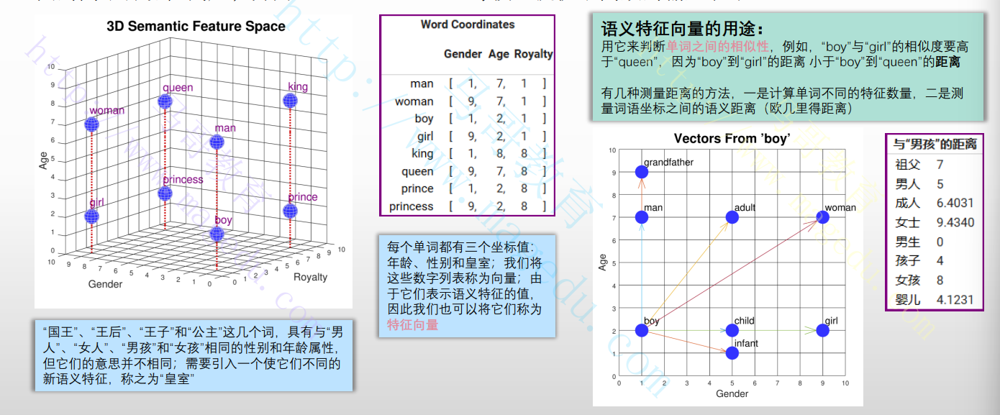

#### 1.6.11.3 主流的词嵌入算法

- [ ] 传统文本表示方法（非神经网络）
  - One-Hot Encoding
    - ，每个词用长度为词表大小的向量表示，仅一个位置为1，其他为0
  - 每个词用长度为词表大小的向量表示，仅一个位置为1，其余为0
    - 通过词频和逆文档频率加权，突出重要词汇（如 世界杯在体育类文本中权重高）
- [ ] 静态词嵌入（上下文无关）
  - Word2Vec
    - 基于神经网络的无监督模型，通过上下文预测目标词或根据上下文预测中心词
  - GloVe
    - 结合全局词共现矩阵与局部上下文，通过矩阵分解优化词向量
- [ ] 上下文相关词嵌入
  - ELMo
    - 基于双向LSTM的语言模型，生成动态词向量
  - BERT
    - 基于Transformer的双向预训练模型，通过掩码语言模型和下一句预测学习上下文敏感嵌入

## 1.7 大模型中的Python编程

- [ ] Python是ML和DL领域事实上的标准语言
  - 几乎所有主流的大模型框架，库，和工具都优先支持Python
  - 若想从事大模型领域，熟练掌握python必不可少
- [ ] Python拥有极其丰富且活跃的科学计算和机器学习生态系统
  - 深度学习框架
    - Python和TensorFlow是目前最流行的两大深度学习框架
    - 这是模型定义，训练，推理等核心操作的必要组件
  - Hugging Face Transformer库
    - 大模型领域的瑞士军刀，提供了海量的预训练模型，微调工具和推理接口
  - 数据科学库
    - NumPy，Pandas, SciPy等库在数据预处理，特征工程等方面至关重要
  - MLOps
    - 许多MLOps工具，如MLflow，DVC, Streamlit, Gradio等，也都是用python实现
  - LLM应用开发框架
    - LangChain, LlamaIndex等新兴框架，用于构建复杂的LLM应用（如RAG，Agent）
- [ ] 模型训练与微调
  - 大模型训练和微调过程中，需要使用python脚本编写训练脚本，定义模型架构，加载数据集，配置训练参数，实现评估逻辑等
  - 对python的熟练程度直接影响开发和调试这些复杂过程的效率
- [ ] 模型部署与推理优化
  - 在大模型部署阶段，Python依然扮演重要角色
  - 可基于Python构建模型服务接口（如基于FastAPI），进行模型量化，剪枝等推理优化，或者使用vLLM，TGI等高性能推理框架的Python Api
- [ ] 快速原型开发与实验
  - Python的简洁性和丰富的库是它非常适合于快速原型开发和实验
  - 在大模型开发中，需要频繁尝试不同模型，Prompt，微调策略，Python可助力高效地迭代这些实验
- [ ] 自动化脚本编写
  - 从数据管道的自动化模型部署流程的CICD集成，Python都是理想选择

### 1.7.1 Python环境设定

#### 1.7.1.1 Conda和虚拟Python环境

- [ ] Conda

  - 开源包管理器和环境管理器
  - 包管理
    - 类似python的pip，支持安装，升级，卸载和管理各种软件包
    - 支持多种语言，包括Python,R，Julia和Scala等
  - 环境管理

- [ ] Conda, Anaconda和Miniconda

  - Conda是底层工具，是后两者的核心组件
  - Anaconda:
    - 大型的python和R语言的发行版
    - 专为数据科学，机器学习和科学计算而设计
    - 开箱即用，自带conda
  - MIniconda：
    - 精简版的Anaconda
    - 只包含conda解释器，python解释器及少量核心包

  

#### 1.7.1.2 安装Miniconda

- [ ] 下载程序包

  - https://www.anaconda.com/docs/getting-started/miniconda/install

- [ ] 根据提示完成安装过程

  ```shell
  # 下载程序文件
  root@ubutun2204:~# cd /usr/local/src/
  root@ubutun2204:/usr/local/src# wget https://repo.anaconda.com/miniconda/Miniconda3-latest-Linux-x86_64.sh
  
  # 安装
  root@ubutun2204:/usr/local/src# bash Miniconda3-latest-Linux-x86_64.sh 
  
  Welcome to Miniconda3 py313_25.9.1-3
  
  In order to continue the installation process, please review the license
  agreement.
  Please, press ENTER to continue
  >>> root@ubutun2204:/usr/local/src# bash Miniconda3-latest-Linux-x86_64.sh 
  
  Welcome to Miniconda3 py313_25.9.1-3
  
  In order to continue the installation process, please review the license
  agreement.
  Please, press ENTER to continue
  >>> 按回车健
  ......
  Do you accept the license terms? [yes|no]
  >>> yes
  Miniconda3 will now be installed into this location:
  /root/miniconda3
  
    - Press ENTER to confirm the location
    - Press CTRL-C to abort the installation
    - Or specify a different location below
  
  [/root/miniconda3] >>>按回车
  ......
  Thank you for installing Miniconda3!
  
  
  # 关闭并重新打开终端窗口以使安装完全生效
  root@ubutun2204:~# source ~/.bashrc
  (base) root@ubutun2204:~#
  
  # 运行检查安装是否成功
  (base) root@ubutun2204:~# conda list
  ```

#### 1.7.1.3 环境管理

- 列出所有已经创建的环境

  ```bash
  (base) root@ubutun2204:~# conda env list
  ```

- 创建新环境

  ```bash
  # 这种默认创建的env path: environment location: /root/miniconda3/envs/alblue
  # conda create -n <env_name> [python=<version>] [package1] [package2]...
  (base) root@ubutun2204:~# conda create -n alblue python=3.12
  
  
  # -p 可以指定env path
  # conda create -p <env_local_path> [python=<version>] [package1] [package2]...
  ```

- 激活环境

  ```bash
  # conda activate <env_name> | <env_local_path>
  (base) root@ubutun2204:~# conda activate alblue
  (alblue) root@ubutun2204:~#
  ```

- 退出当前激活的环境

  ```bash
  conda deactivate
  ```

- 删除指定的环境

  ```bash
  conda remove -n <env_name> | -p <env_local_path> --all
  ```

- 导出并保存环境

  ```bash
  conda env export > environment.yaml
  ```

- 导入保存的环境

  ```bash\
  conda env create -f environment.yaml
  ```

#### 1.7.1.4 包管理

- [ ] 常用的管理操作

  - 安装包

    ```bash
    conda install <package_name> <packag2>...
    
    # 需要指定版本号，使用“package=version”格式即可，命名pytorch=2.5.2
    ```

  - 更新包

    ```bash
    conda update <package_name>
    ```

  - 更新环境中所有的包

    ```bash
    conda update --all
    ```

  - 卸载包

    ```bash
    conda remove <package_name>
    ```

  - 搜索包

    ```bash
    conda search <package_name>
    ```

  - 列出当前环境中的已安装的包

    ```bash
    conda list
    ```

### 1.7.2 JupyterLab

- [ ] 关于Jupyter Notebook
  - 基于Web的交互式计算环境，支持创建和共享包含实时代码，方程，可视化和叙述性文本的文档
  - 这些文档被称为“Notebook”，文件扩展名为**.ipynb**
  - 核心特点：
    - 单元格(Cells)：Notebook是由一系列独立的单元格组成，主要分为代码单元格和Markdown单元格两种
    - 交互性：可修改一小段代码并立即执行，而无需运行整个程序
    - 富媒体输出：支持文本，图标，HTML，JavaScript，图片，视频等
    - 易于共享：.ipynb文件是JSON 格式的文本文件
- [ ] JupyterLab是Jupyter Notebook的下一代用户界面
  - 核心特点
    - 多文档工作区
    - 集成终端：可直接打开命令终端
    - 集成代码编辑器：包含一个全功能的代码编辑器
    - 实时协作：开发中，尚未实现

#### 1.7.2.1 安装并启动Jupyter

- [ ] 在conda环境中安装Jupyter

  - 创建专用的环境并激活

    ```bash
    (alblue) root@ubutun2204:~# conda create -n jupyterlab python=3.12
    (alblue) root@ubutun2204:~# conda activate jupyterlab
    ```

  - 安装JupyterLab

    ```bash
    (jupyterlab) root@ubutun2204:~# conda install jupyter
    ```

  - 安装中文插件

    ```bash
    (jupyterlab) root@ubutun2204:~# pip install jupyterlab-language-pack-zh-CN 
    ```

- [ ] 启动Jupyter

  - 命令格式

    ```bash
    jupyter [--config-dir] [--data-dir] [subcommand]
    ```

  - 启动JUpyterLab服务命令：jupyter-lab

  - 启动Jupyter Notebook服务的命令：jupyter-notebook

    - 默认监听8888端口，可使用--port-PORT选项自定义
    - 默认监听127.0.0.1，可使用--ip=IP选项使用
    - 默认不使用root用户身份运行，可使用--allow-root选项忽略

  ```bash
  (jupyterlab) root@ubutun2204:~# jupyter-lab --ip=0.0.0.0 --allow-root
  ```

  打开web: http://192.168.121.128:8888lab?token=f61fafc12a43235a8fcfb618dbbcdf12ab9c093ef0c1c28d 

  

#### 1.7.2.2 配置文件

- [ ] 生成配置文件

  - jupyter-lab --generate-config
    - ~/.jupyter/jupyter_lab_config.py
  - jupyter-notebook --generate-config
    - ~/.jupyter/jupyter_notebook_config.py

- [ ] JupyterLab的常用配置参数

  ```bash
  c.ServerApp.ip='*'  #允许监听的ip地址
  c.ServerApp.port=8888  #监听的端口，默认8888
  c.ServerApp.open_browser = False #设定禁止自动打开浏览器
  c.ServerApp.root_dir = '/data/projects'  #设置工作目录
  c.ServerApp.allow_root = True #是否允许以root用户的身份运行
  c.ServerApp.allow_origin = '*' #允许来自哪些地址客户端访问
  ```

#### 1.7.2.3 基础使用

- [ ] 命令模式(Command Mode)
  - 触发方式：按Esc激活，单元格边框变为灰色
  - 核心功能
    - 单元格操作：复制（C）,剪切（X），粘贴（V）,删除(D,D)，合并(shift +M)
    - 模式切换：代码（Y）,Markdown(M)， 纯文本（R）
    - 导航控制：上下移动单元格(J/K或方向键)，插入单元格(上方A/下方B)
- [ ] 编辑模式 （Edit Mode）
  - 触发方式：按照Enter健激活，单元格变成蓝色或者绿色，光标闪烁
  - 核心功能
    - 内容编辑：代码/文本输入，删除字符，缩进
    - 智能辅助：代码补全（Tab）,提示文档(shift-Tab)，注释(Ctrl -[)
- [ ] 命令模式管理单元格结构（如顺序，类型），编辑模式管理单元格内容（如代码，文本）

#### 1.7.2.4 Jupyter Notebook

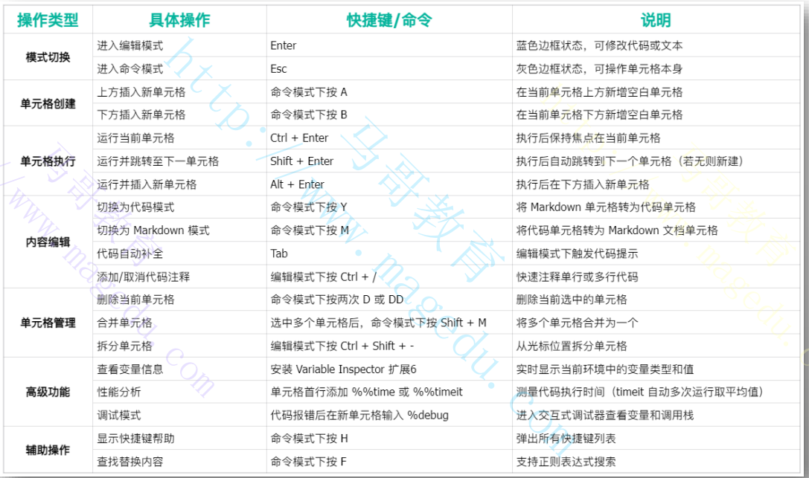

# 2 机器学习基础

- [ ] 机器学习中常用的核心Python库
  - NumPy
    - Python科学计算的基础库
    - 提供了高性能的多维数组对象（ndarray）以及用于处理这些数组的工具
    - 几乎所有其他科学计算和机器学习库都将NumPy数组作为其基本数据结构
  - Pandas
    - 建立在NumPy之上，提供了一系列用于数据操作和分析的高级数据结构，如**Seris**（一维带标签数组）和**DataFrame**(二维带标签表格数据)
    - 是数据清洗，转换和探索的必备工具
  - Matplotlib
    - 常用于创建静态，动态和交互式可视化的库
    - 常用于数据探索（如绘制散点图，直方图）和模型评估（如绘制学习曲线，混淆矩阵）
  - Scikit-learn
    - Python中最流行且功能最全面的机器学习库之一
    - 包含了大量的监督学习和无监督学习（如分类，回归，聚类，降维等），以便模型选择，预处理和评估的工具
    - 高度依赖NumPy和SciPy(科学计算库，通常与NumPy一起使用)
  - PyTorch
    - 由facebook开发的开源机器学习库，主要用于机器学习

## 2.1 线性代数

- [ ] 线性代数的定义
  - 数学分支之一
  - 它主要研究向量，向量空间，线性变换，以及由这些概念演生出来的线性方程组，矩阵，行列式等
- [ ] 具体含义
  - 研究“线性“关系
    - ”线性“是线性代数的核心概念：简单来说，如果一个关系可以用一条直线来表示，那么这个关系就是线性的
  - 核心研究对象
    - 向量
    - 向量空间
    - 线性变换
    - 矩阵
    - 线性方程组

### 2.1.1 核心研究对象

- [ ] 向量
  - 不仅仅是物理学带方向的量，在线性代数中，向量可以看作是数字的有序列表，用来表示空间的点，或数据中的一个样本
  - 例如，一个人的年龄，身高，体重可以组成一个三维向量
- [ ] 向量空间
  - 所有符合特定规则的向量的集合
  - 它提供了一个抽象的框架，使得我们可以在其中进行向量的加法和标量乘法运算，例如三维空间
- [ ] 线性变换
  - 是指一种特殊的函数，能够将一个向量空间中的向量映射到另一个空间向量中的向量，并且保持线性关系不变
  - 例如，旋转，缩放，投影等操作都是线性变换
  - **所有的线性变换都可以用矩阵乘法表示：T(x)=Ax，其中A是变换矩阵**
- [ ] 矩阵
  - 矩阵表示线性变换，线性方程组以及数据集合的强大工具
  - 任何线性变换都可以用一个矩阵来表示，而矩阵的乘法就对应着线性变换的组合

### 2.1.3 线性变换

- [ ] 缩放

  - 沿坐标轴方向按比例拉伸或压缩

  - 可以是均匀的，也可以是非均匀的

    

- [ ] 投影（Project）

  - 将高维空间中的向量或图形”投射“到低维子空间
  - 例如，将三维物体在二维平面投下影子
  - 降低了维度，通常会损失信息

  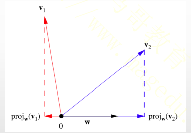

- [ ] 剪切

  - 将图形的一个维度沿着另外一个维度的方向进行推移：就像推到一叠扑克牌，虽然高度不变，但牌堆倾斜
  - 保持面积或体积不变，但改变了形状和角度

  

- [ ] 反射

  - 将向量或图形沿着一条直线或一个平面进行镜像翻转：就像照镜子一样
  - 保持向量的长度和图形的形状不变，但改变了方向

  

- [ ] 旋转

  - 将向量图形绕着一个固定点或轴进行旋转
  - 保持向量的长度和图形的形状不变，只改变方向

  

### 2.1.4 向量，矩阵和张量

- [ ] 标量，向量，矩阵和张量构成了线性代数的核心框架，他们分别对应不同维度额数学对象
  - 标量
    - 仅具有大小而无方向的数学量，通常用单个数值表示，如温度，质量，时间等
    - 它是所有数学对象中最基础的形式，术语零阶向量
    - 标量遵循基本的算术运算规则，结果仍为标量
  - 向量
    - 既有大小又有方向的量，可视为有序排列的标量集合，通常表示为列或行列式
    - 向量术语一阶张量，常用于描述位移，速度等物理现象
    - 向量支持加减法
  - 矩阵
    - 由标量构成的二维数组，可视为向量的扩展，属于二阶张量
    - 矩阵广泛应用于线性变换，数据表示等领域
  - 张量
    - 张量是标量，向量和矩阵的高位推广，可表示任意维度的数据，属于多维数组
    - 例如彩色图像（三维张量），视频（四维张量）
- [ ] 张量是标量，向量和矩阵的高维推广，可表示任意维度的数据，属于多维数组


#### 2.1.4.1 矩阵

- [ ] 定义

  - 矩阵是由m * n个数按矩形排列成的二维数组，用大写字母表示，是线性代数的核心工具

  - 其数学形式如下：

    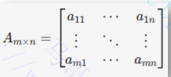

  - 其中，a{i,j}表示第i行j列的元素

  - 矩阵最初用于表示线性方程组的系数和常数项

  - 它的维度由行数和列数决定，元素的类型可以是实数，复数和其他数学对象

#### 2.1.4.2 矩阵基本运算

- [ ] 加减法：仅适用于同型矩阵，对应元素相加减

- [ ] 数乘：标量乘以矩阵所有元素，保持维度不变

- [ ] 乘法（点积）

  - 条件：左矩阵列数等于右矩阵行数

  

- [ ] 转置：行列互换

  

- [ ] 特征值和特征向量

  - 假设有一个n *n的方阵A
    - 特征向量是指一个非零向量v，当它经过矩阵A的线性变换，其方向保持不换，仅仅长度被缩放了
    - 特征值是指这个缩放因子
    - 数学表示：Av=rv
      - r是一个标量，称为矩阵A的特征值

## 2.2 NumPy科学计算库

- [ ] NumPy
  - python中用于科学计算的核心库，提供了对多维数组对象（ndarry）的支持，以及用于处理这些数组的各种高效函数
  - 是python数据科学的基石，其他重要的库（Pandas, TensorFlow，Pytorch）都建立在其上
- [ ] 核心功能
  - 高性能的多维数组对象（ndarray）
    - 相比较Python原生的列表，ndarray在存储和计算方面有显著性能优势，尤其在处理大量数据时，支持创建和使用任意维度的数组
  - 广播功能
    - 进行两个数组逐元素运算时，例如加减，乘，通常要求它们的形状完全相同
    - 广播机制会自动复制或拉伸数组，使得这类原本不匹配的计算能够自动进行
  - 向量化运算：对整个数组进行数学，逻辑运算，无需编写python循环
  - 大量的数学函数：提供了大量的数学函数库，直接应用整个数组
    - 算术运算：加，减，乘，除，幂运算
    - 三角运算：sin ,cos,tan
    - 指数和对数运算:exp,log
    - 统计函数：mean, median,std,sum,max,min
    - 线性代数运算：矩阵乘法，求逆，行列式，特征值分解等
    - 傅里叶变换：离散傅里叶变换等
  - 索引与切片：灵活强大的数组元素访问
  - 线性代数：矩阵乘法，分解，求逆，特征值
  - 随机数生成
    - Numpy的random模块提供了随机数功能
    - 常用于模拟，统计分析和机器学习中
  - 文件读写
    - 支持将数组保存到二进制文件(.npy)或文本文件，以及从这些文件加载数据

### 2.2.1 在机器学习领域额应用

- [ ] 机器学习和深度学习
  - 数据预处理：将原始数据转换为模型所需要的格式
  - 特征工程：对原始特征进行组合，转换，创建新的特征
  - 算法实现：许多机器学习算法都是基于Numpy数组操作
  - 模型训练与评估：可以使用Numpy来实现梯度下降等优化算法，并计算模型性能指标
  - 深度学习框架：吴坤Pytorch还是TensorFlow，都是基于Numpy实现

### 2.2.2 Numpy的逻辑功能及常用的子模块

- [ ] 核心Numpy命名空间（主模块）
  - import numpy as np时，大部分核心功能都会在这个np空间下
  - 关键组成部分
    - ndarray对象
    - 数组创建函数：提供了多种创建数组的方式
    - 数组操作：连接/分割，索引和切片等
    - 通用函数：算术运算，比较运算，三角函数
    - 聚合函数
- [ ] numpy.random模块：生成伪随机数
- [ ] numpy.linalg模块：提供线性代码相关的函数
- [ ] numpy.fft模块：离散傅里叶
- [ ] numpy.polynomial模块：多项式创建，操作和计算

### 2.2.3 核心概念/数据结构

- [ ] ndarray

  - 是numpy的核心数据结构
  - 具有shape(维度大小), dtype（数据类型），ndim（维度数量），size（总元素数）等属性
    - ndarray.ndim：数组的维度数量
    - ndarray.shape：例如(n,m)表示n行m列
    - ndarray.size：数组中元素的总数
    - ndarray.dtype: 数组中元素类型的对象
    - ndarray.itemsize：数据中每个元素占用的字节数
    - ndarray.data: 包含数组实际元素的而缓冲区
    - ndarray.T：数组的转置

- [ ] numpy提供了操作ndarray的多种函数

  - 数组创建函数
  - 数组操作函数
  - 通用数学函数
  - 聚合函数

  

- [ ] 创建数组

  - np.array()：从python列表或元组创建数组
  - np.zeros()，np.ones()：创建全零或全一数组
  - np.empty()：创建未初始化内容的数组
  - np.arange()：创建等差序列数组
  - np.linspace()：创建指定数量的等间隔数值序列
  - np.full（）：创建填充指定值的数组
  - np.eye()：创建单位矩阵

  

### 2.2.4 数组操作与形状变化

- [ ] 形状操作相关的函数
  - reshape()：改变形状
  - flatten()：返回一个展平后的一维数组，且总是返回副本
  - ndarray.ravel（）：返回一个展平后的一维数组，且尽可能返回视图
  - transpose()：数组转置，即行和列互换
  - resize()：返回新形状数组
- [ ] 连接/分割
  - concatenate(): 沿指定的轴连接数组，所有数组除了连接轴之外维度必须相同
  - stack()：沿新轴连接数组，所有数组形状必须相同
  - np.hstack(tup)/np.vstack(tup)：沿水平列或垂直行推爹数组
  - split()：沿指定轴将数组分割成多个子数组
  - hsplit()/vsplit()：沿水平列/垂直行分割数组
- [ ] 索引和切片

### 2.2.5 矩阵运算

- [ ] numpy.linalg模块
  - 提供了线性代数相关的函数
  - 常用的方法
    - np.linalg.det()：计算矩阵行列式
    - np.linalg.inv()：计算矩阵的逆
    - np.linalg.solve()：求解线性方程组
    - np.linalg.eig(): 计算方阵特征值和特征向量
    - np.linalg.svd(): 进行奇异值分解
    - np.dot()或@运算符：矩阵乘法

### 2.2.6 示例

- [ ] 一些numpy的示例，在jupyter中打开

  (https://github.com/iKubernetes/llm-in-practise/blob/main/ML_Basics/NumPy%E7%A4%BA%E4%BE%8B.ipynb)

## 2.3 Matplotlib图形库

### 2.3.1 Matplotlib概念

- [ ] Matplotlib
  - Python生态中最核心的2D(以及有限的3D)绘图库，专注于生成静态，动态和交互式的高质量图标
  - 现已成为数据科学，工程和科研领域的标准可视化工具，也是其他许多高级库（如seaborn）的底层依赖
- [ ] 核心功能
  - 丰富的图表类型支持
    - 基础图表：折线图(plt.plot())，柱状图(plt.bar())，散点图(plt.scatter())，饼图(plt.pie())等，覆盖90%的日常数据展示需求
    - 高级图表：3D曲线面，等高线图，热力图，极坐标图，适用于科学计算和工程仿真
    - 统计图表：直方图(plt.hist())用于数据分布分析，箱线图(plt.boxplot())检测离群值
  - 高度定制化
    - 样式调整：通过参数控制线条颜色(color='red')，线形(linestyle='---')，标记符号(marker='o')等细节
    - 坐标轴控制：设置刻度范围(plt.xlim(0,10))，添加网格线(plt.grid(True))，调整标签字体和大小
  - 多图布局和子图管理
    - 子图排列：使用plt.subplots()创建多子图布局（如2 * 2网格），支持复杂数据对比
    - 双Y轴：通过twinx()在同一图中展示两种量纲的数据（如销售额和增长率）
  - 与其他库深度集成
    - 与NumPy结合：直接基于ndarray数组生成图表（如绘制三角函数曲线）
    - 与Pandas联动：从DataFrame直接调用plot()方法生成图表，简化数据分析流程
  - 输出与交互功能
    - 保存图像：支持导出PNG, JPG/JPEG, EPS, PDF, SVG	等格式(plt.savefig('plot.png'))，可满足出版要求
    - 交互式操作：在Jupyter Notebook中实时缩放，平移图形，动态探索数据

### 2.3.2 Matplotlib图像组成元素

- [ ] Matplotlib的图像由多个层次化的元素构成，这些元素共同协作以生成完整的可视化图表

  - 顶级容器：Figure(画布)
  - 绘图区域: Axes（子图）
  - 坐标轴：Axis（X/Y轴）
  - 核心辅助元素
    - 标题与轴标签
    - 图例(Legend)
    - 网格线(Grid)
    - 刻度与刻度标签
  - 图形元素: Artist

  

#### 2.3.2.1 Figure（画布）

- [ ] 顶级容器Figure

  - 所有绘制元素的容器，相当于一张空白画布，可设置整体尺寸，分辨率，背景色等参数

- [ ] **plt.figure()**

  - Matplotlib中创建新画布的核心函数，用于初始化绘图环境，控制图形全局属性

  - 支持如下关键参数：

    - figsize：画布尺寸(宽，高，单位英寸)，默认(6.4,4,8)
    - dpi：分辨率，默认100，高分辨率适合打印输出
    - facecolor: 背景颜色
    - edgecolor：边框颜色
    - num：画布编号，用于多窗口管理

  - 示例

    

#### 2.3.2.2 Axes（子图）

- [ ] 关于Axes

  - 是实际绘图区域，包含坐标轴，数据图形等
  - 一个Figure可包含多个Axes

- [ ] **plt.subplots()**

  - 批量创建子图网格，返回画布(fig)和子图对象数组(axes)，适用于复杂图标布局

  - 支持共享坐标轴，灵活调整子图间距

  - 支持如下几个关键参数

    - nrows/ncols：子图行数/列数
    - sharex/sharey：共享x/y轴范围(True 或 all)
    - fig_kw：传递至plt.figure()的参数
    - gridspec_kw: 控制子图间距(wspace, hspace)

  - 示例：

    

    

#### 2.3.2.3 Axis （坐标轴：X/Y轴）

- [ ] 关于Axis

  - 控制数据范围，刻度位置及标签

  - 每个Axis包含两个Axis对象(X/Y轴)

  - 配置方法

    - plt.xlim()：手动设置x轴的最小值和最大值
    - plt.xticks()：指定刻度位置和对应标签，支持旋转和字体调整
    - plt.ylim()：手动设置y轴的最大值和最小值
    - plt.yticks()：自定义刻度位置和标签，支持科学技术法

  - 示例

    

    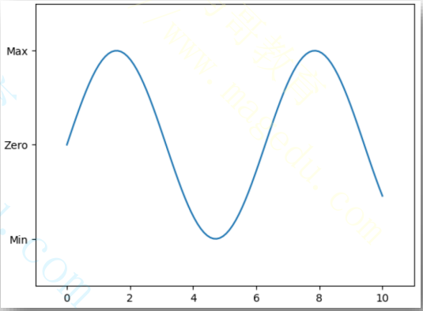

#### 2.3.2.4 标题与轴标签

- [ ] 标题

  - 描述图表主题，通过set_title()设置

- [ ] 轴标签

  - 解释坐标轴含义，通过set_xlabel()和set_ylabel()设置

- [ ] 示例

  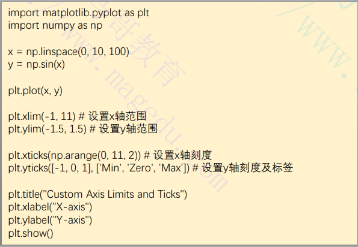

  

#### 2.3.2.5 图例(Legend)

- [ ] 关于图例

  - 用于标识不同的数据系列，通过legend()添加

  - 关键参数

    - loc: 图例位置，支持字符串和数字代码，如下表示：

      

    - fontsize：标签字体大小，支持数字或xx-small, x-small等可用值

    - titile: 图里标题

    - frameon：是否显示边框

    - facecolor：背景颜色

    - edgecolor：边框颜色

    - shadow：是否添加阴影

    - fancybox：是否使用圆角边框

    - ncol：图里列数

- [ ] 示例

  

  

### 2.3.3 Matplotlib的两种绘图风格

- [ ] plt风格(pyplot风格/过程式风格)
  - 状态机模型：通过pyplot模块(通常缩写为plt)管理当前图形和坐标轴，用户无需显示创建对象
  - 代码简洁：适合快速绘图，社和简单脚本
  - 隐式作用域：函数调用(plt.plot(),plt.title())自动作用于“当前”图形或坐标轴
- [ ] 面向对象风格（OO风格）
  - 显示对象控制：直接操作Figure, Axes等底层对象
  - 精细定制：每个图像元素均为独立对象
  - 无全局状态

#### 2.3.3.1 折线图

##### 2.3.3.1.1 折线图(Pyplot风格)

- [ ] plt.plot

  - 用于绘制二维线图，点图及组合图形

  - 语法：plt.plot(x,y,[fmt],**kwargs)

    - x: 横坐标数据（可选，默认0,1,2,3, ....）
    - y: 纵坐标数据，必选
    - fmt: 格式字符串：用于设置颜色，线型，标记，格式为："[color][marker][line]"

  - 关键参数

    

- [ ] 格式化字符串

  - fmt是快速设置样式的快捷方式，格式为[color] [maker] [line]
  - 示例
    - plt.plot(x,y,'ro--') :红色圆点标记 + 虚线
    - plt.plot(x,y,'g^:'): 绿色三角标记 + 点线
  - 也可以分别使用color, maker，和Line 三个参数定义

- [ ] 示例：

  


##### 2.3.3.1.2 折线图(OOP风格)

- [ ] 使用方法
  - 使用fig, ax =plt.subplots() 创建Figure和Axes对象后，可以直接调用ax.plot()在特定的Axes上绘图
  - 支持参数同plt.plot()相同

   


#### 2.3.3.2 散点图

- [ ] plt.scatter() （Pyplot风格）

  - 绘制散点图，其中每个点都可以有独立的大小和颜色
  - 常用参数
    - x,y: 数据点的坐标
    - s: 散点的大小，可以是单个值，也可以是与x,y长度相同的数组
    - c: 散点的颜色，可以是单个颜色，也可以是与x,y长度相同的数组，用于颜色映射
    - alpha：透明度(0到1之间)
    - cmap：颜色映射(c参数为数组时使用)，如'viridis', 'plasma','coolwarm'

- [ ] 示例

  

  

#### 2.3.3.3 直方图(Histogram)

- [ ] plt.hist() （Pyplot风格）

  - 计算并绘制数据的频数分布
  - 常用的参数
    - x: 要分析的数据数组
    - bins: 直方图的箱子数量或边缘
    - color: 柱子的颜色
    - alpha: 透明度
    - edgecolor: 柱子边框颜色
    - density: 如果为True，则绘制PDF

- [ ] 示例

  

  

  

#### 2.3.3.4 柱状图(bar)

- [ ] plt.bar() （Pyplot风格）

  - 绘制垂直的柱状图
  - 常用参数
    - x: 柱子的x坐标
    - height: 柱子的高度(对应的值)
    - width: 柱子的宽度(默认为0.8)
    - color: 柱子的颜色
    - align: 柱子对齐方式(center或edge)

- [ ] 示例

  

  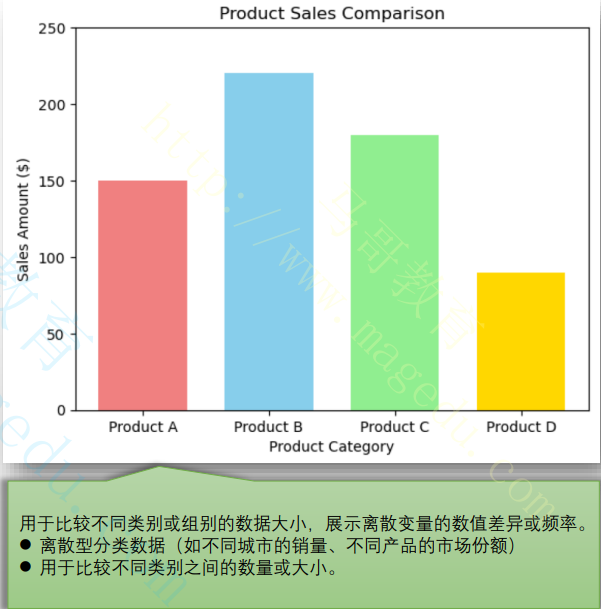

#### 2.3.3.5 饼图(pie)

- [ ] plt.pie() (Pyplot风格)

  - 绘制圆形统计图，显示数据比例关系
  - 常用参数：
    - x: 每个扇形大小
    - labels: 每个扇形标签
    - autopct: 格式化显示百分比的字符串或函数(如 '%1.1f%%')
    - explode: 用于爆炸某个扇形，使其突出显示
    - shadow：是否添加阴影
    - startangle: 饼图的起始角度
    - colors：每个扇形的颜色

- [ ] 示例：

  

  

#### 2.3.3.6 子图（subplots）

- [ ] plt.subplot()

  - Pyplot风格，每次调用激活一个子图，后续的plt.plot()等绘图函数作用于该子图

  - 语法：plt.subplot(nrows,ncols,index)

    - nrows/ncols: 行数，列数
    - index: 子图的位置(从1开始)

  - 示例：

    

    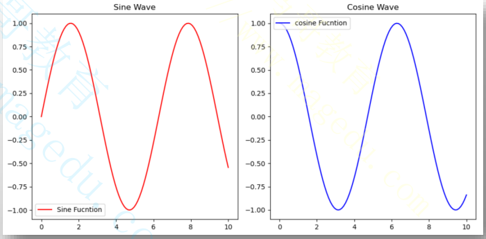

- [ ] plt.subplots()

  - Pyplot风格，一次性创建所有子图，通过数组索引操作子图

  - 语法：fig, axes = plt.subplots(nrows,ncols, **kwargs)

    - 返回Figure对象和Axes对象数组
    - 参数sharex/sharey可共享坐标轴

  - 示例：

    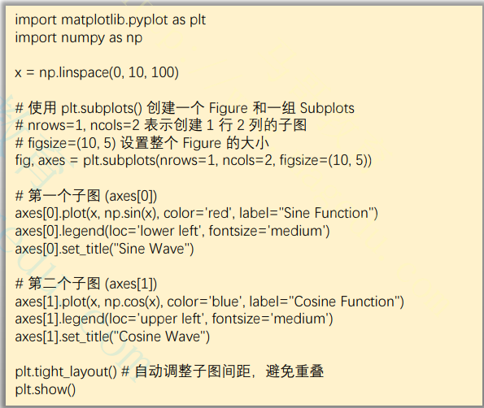

    

- [ ] fig.add_subplot()

  - OOP风格，显式绑定子图到Figure，索引规则同plt.subplot()

  - 语法：ax = fig.add_subplot(nrows,ncols,indez)

  - 示例：

    

    

### 2.3.4 保存图表

- [ ] plt.savefig(fname, **kwargs)

  - 保存图表到指定位置
  - 常用参数：
    - fname: 路径/文件名，支持.png,.jpg,.pdf,.svg等格式
    - format=None：显示指定扩展名
    - dpi=: 分辨率
    - bbox_inches=None: 裁剪白边：tight自动裁剪,loose保留更多空白
    - transparent=False：透明背景

- [ ] 示例：

  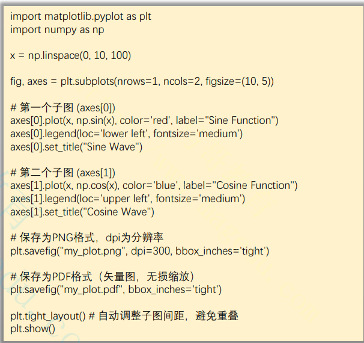

### 2.3.5 案例代码

上面案例代码：

- https://github.com/iKubernetes/llm-in-practise/blob/main/ML_Basics/Matplotlib_Bascis.ipynb
- https://github.com/iKubernetes/llm-in-practise/blob/main/ML_Basics/Matplotlib.ipynb

可以在Jupyter notebook中打开

## 2.4 Pandas数据处理库

- [ ] Pandas库介绍
  - Python生态中专为结构化数据分析设计的核心工具库，基于NumPy构建
  - 提供高性能，易用的数据结构和分析功能，广泛应用于数据清洗，转换，探索性分析和机器学习预处理等领域
- [ ] 核心数据结构
  - **Series:** 带标签的一维数组，类似于带索引的NumPy数组或字典
  - **DataFrame:**
    - 带标签的二维表格型数据结构，包含有序的列，每列可以是不同的数据类型
    - 可以看作是共享相同索引的Series的集合，是Pandas最核心的数据结构
- [ ] 安装
  - pip install pandas
- [ ] 关键特性与功能
  - 数据读写：支持多种格式的数据导入导出(CSV, Excel, SQL, JSON, HDF%, Parquet等)
  - 数据选择与过滤：强大的索引(loc, iloc)，布尔索引，条件选择
  - 数据清洗：处理缺失值(isnull, fillna, dropna),重复值
  - 数据转换：数据类型转换，应用函数，数据标准化等
  - 数据合并与连接: 类SQL的数据合并(merge), 连接(join),拼接(concat)
  - 分组聚合：强大的groupby操作，实现数据的分组，聚合，转换，过滤
  - 时间序列处理：专门针对时间序列数据的索引，重采样，窗口函数，日期偏移等功能
  - 数据重塑：数据透视表，堆叠/拆堆

### 2.4.1 Series

- [ ] Series
  - 带标签的一维数组，可以存储任何数据类型（整数，浮点数，字符串，Python对象等）
  - 主要的组成部分
    - **数据（Data）:** 存储的实际值
    - **索引(Index): ** 与数据关联的标签，若未指定索引，默认从0开始的整数索引
  - 支持索引和切片，可以使用索引标签或位置进行元素访问
  - 支持各种数学运算，这些运算会应用到每个元素上（广播），而且Series之间的运算会根据索引自动对齐
- [ ] 创建Series
  - 可以从多种来源创建series，包括列表，带有索引的列表、字典、Numpy数组等
  - 语法格式：pandas.Series(data=None, index=None, dtype=None, name=None, copy=False)
    - data: 列表/元组数据（必选）
    - Index：自定义索引（长度需与data一致，默认为[0,1,2,3,4,...]）
    - dtype:强制指定数据类型(如float, str)
  - 示例
    - s = pd.Series([1,2,3,4],index=['a','b','c','d'])
    - s = pd.Series({'a':1, 'b':2, 'c':3, 'd':4})
    - s = pd.Series(np.array([1,2,3]))

#### 2.4.1.1 Series数据选择与访问

- [ ] Series支持基于索引和位置的访问方式

  - 通过索引访问
    - 单个值：s['index']
    - 多个值: s[['index1', 'index2']]
    - 切片：s[start:end]
    - 也可以使用s.loc[index]的方式进行访问
  - 通过位置访问
    - s.iloc[0]：返回第一个值
    - s.iloc[0:2]: 切片，前两个值
  - 条件筛选
    - s[s OP v]: 例如s[s>2]表示筛选大于2的元素
  - 快速访问值
    - s.at['a']：快速定位单个值
  - 获取Series对象的靠前或靠后的元素
    - s.head()：返回Series的前n个元素
    - s.tail()：返回Series的后N个元素

  

#### 2.4.1.2 Series的数据清洗操作

- [ ] Series提供多种方法处理缺失值，重复值等问题

  - 检查缺失值
    - s.isna()或s.isnull()：检查缺失值，返回一个布尔类型的Series，标记每个元素是否为NaN
    - s.notnull()：检查非缺失值，返回一个布尔型Series，标记每个元素是否不为NaN
  - 处理缺失值
    - s.dropna(): 删除Series中的NaN值
    - s.fillna(value)：用指定值填充缺失值
    - s.interpolate()：插值填充，插值利用相邻非缺失值的分布模型进行估算
  - 处理重复值
    - s.duplicated()：检查重复值，返回一个布尔型Series，标记每个元素是否子Series存在重复
    - s.drop_duplicates(): 删除重复值
  - 替换值：
    - s.replace(old,new)：替换指定值

  


#### 2.4.1.3 Series数据操作与转换

- [ ] Series支持灵活的元素操作和转换

  - 基本运算
    - 标量运算（广播式）: s + 2, s * 3
    - 元素级运算：s1 + s2（对其索引后运算）
      - 若series长度不同，则运算结果中，超出sries索引值的运算结果为“NaN”
  - 排序
    - s.sort_vales()：按值对series排序
    - s.sort_index(): 按索引对series进行排序
    - s.rank()：计算每个值的排名
  - 应用函数
    - s.map(func):对每个元素应用指定的函数
  - 字符串操作
    - s.str.lower()：转换为小写
    - s.str.replace('old','new')：字符转替换

  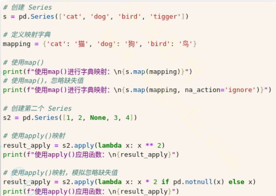

#### 2.4.1.4 Series统计，聚合和时间序列处理

- [ ] Series提供丰富的统计方法，适合快速分析
  - 基本统计
    - s.sum()，s.mean(), s.median(), s.std()：求和，均值，中位数，标准差
    - s.min()/s.max(), s.quantile(0.25)：最小/最大值，分位数
    - s.deacribe()：返回统计汇总
  - 唯一值和计数
    - s.unique()：返回唯一值数组
    - s.value_counts()：统计每个值出现的次数
- [ ] 时间序列
  - 转换为时间类型: pd.to_datetime(s) : 将series转换为datetime
  - 时间组件提取： s.dt.year, s.dt.month等
  - 时间偏移：s.shift(1)：向前或向后偏移


#### 2.4.1.5 数据可视化与其他实用操作

- [ ] Series内置绘图功能，基于Matplotlib，适合快速可视化

  - 折线图：s.plot(kind="line")
  - 柱状图：s.plot(kind="bar")
  - 直方图：s.plot(kind="hist")

- [ ] 其他实用操作

  - 索引操作
    - s.index: 查看索引
    - s.reindex(new_index): 重新设置索引
  - 类型转换
    - s.astype(): 将series转换为指定的数据类型(flat,int32)
    - s.to_numeric()：将series转化为数值类型
    - s.to_datetime():将series转换为日期时间类型
    - s.to_string():将series转换为字符串类型
  - 布尔操作、
    - s.isin(values)：检查值是否在指定列表中
  - 滚动计算
    - s.rolling(window=3).mean():计算移动平均，即以指定数量的元素为窗口，对相关窗口内的元素进行计算的运算

  

#### 2.4.1.6 Series的常用方法

- [ ] 排序与排名
  - s.sort_values(): 按值对Series排序
  - s.sort_index()：按索引对Series进行排序
  - s.rank()：计算每个值的排名
- [ ] 类型转换
  - s.astype(): 将series转换为指定的数据类型(flat,int32)
  - s.to_numeric()：将series转化为数值类型
  - s.to_datetime():将series转换为日期时间类型
  - s.to_string():将series转换为字符串类型
- [ ] 其他常用方法
  - s.head()：返回Series的前N个元素
  - s.tail(): 返回Series的后N个元素
  - s.rename()：重命名Series的索引或本身

### 2.4.2 DataFrame

- [ ] DataFrame

  - 二维带标签的数据结构，具有不同类型的列
  - 可以将其视为电子表格，SQL或Series对象的字典
  - 组成元素
    - 数据(Data): 存储在表格中的实际值
    - 行索引(Index)：标识每一行的标签
    - 列索引(Columns)：标识每一列的标签（列名）

  

- [ ] 创建DataFrame的方法

  - 语法：pd.DataFrame(data=None, index=None,columns=None, dtype=None, copy=False)
    - **data:** 数据源（必选），支持字典，列表，数组
    - index: 自定义行索引(默认为整数序列)
    - **columns:** 自定义列名（默认为整数序列或字典健）
    - dtype: 强制统一数据类型
    - **copy:** 是否复制输入数据（默认为False，直接引用数据）
  - 常用的创建方法
    - 基于字典创建
    - 基于列表/二维数组创建
    - 基于NumPy数组创建
    - 基于嵌套字典创建
    - 从文件导入创建
    - 特殊方法创建，例如空DataFrame

#### 2.4.2.1 DF数据读取与保存

- [ ] 加载公开数据集

  - Scikit-learn或Seaborn的内置数据集
    - Scikit-learn的load_DATASETS()：例如load_iris()加载鸢尾花数据集
    - Seaborn的load_datasets(DATASETS)：例如sns.load_datasets('tips')
  - 在线数据集:pd.read_csv("https://gist.githubusercontent.com/netj/8836201/raw/6f9306ad21398ea43cba4f7d537619d0e07d5ae3/iris.csv")

- [ ] 读取数据

  - pd.read_csv('file.csv'): 读取csv文件
  - pd.read_excel('file.xslsx')：读取Excel文件
  - pd.read_sql_table(...):从SQL数据库中读取表
  - pd.read_json('file.json')：读取JSON文件
  - pd.read_html(url): 从HTML网页读取表格数据

- [ ] 保存数据

  - df.to_csv('file.csv')：写入csv文件
  - df._to_excel('file.xlsx')：写入Excel文件
  - df.to_sql(...)：写入SQL数据库
  - df.to_json('file.json')：写入JSON文件

  

#### 2.4.2.2 DF数据查看与基本操作

- [ ] 查看数据概况

  - df.index: 获取或设置DataFrame的行索引
  - df.columns：获取或设置DataFrame的列标签
  - df.values: 返回DataFrame的NumPy数组表示
  - df.dtypes：返回每列的数据类型
  - df.shape：返回DataFrame的维度（行数，列数）
  - df.info(): 打印DataFrame的简洁摘要，包括索引，列，非空值数量和内存使用情况
  - df.describe(): 生成数值列的描述性统计摘要
  - df.head(n)：返回DataFrame的前n行，默认为5
  - df.tail(n): 返回DataFrame的后n行，默认为5

  

- [ ] 数据选择与切片

  - .loc[]：基于标签（索引和列名）选择数据
    - df.loc[row_label,co_label]
    - df.loc[row_slice, col_slice]
  - .iloc[]：基于整数位置选择数据
    - df.iloc[row_pos, col_pos]
    - df.iloc[row_slice,col_slice]
  - .at[]: 通过单个标签快速访问单个元素
  - .iat[]：通过单个整数位置快速访问单个元素
  - []:可以用于选择单列，多列，或进行布尔索引
    - df['column'] : 选择单列
    - df[['col1, 'col2']]: 选择多列

#### 2.4.2.3 DF的数运算与统计

- [ ] 算术与统计
  - DataFrame可以直接进行各种算术运算，会对齐索引
  - df['column'].sum(axis=0|1): 对指定的行或列计算总和
  - df['column'].std(axis=0|1): 计算标准差
  - df['column'].var(axis=0|1): 计算方差
  - df['column'].count(axis=0|1): 计算非空元素的数量
  - df['column'].corr(): 计算列之间的相关系数矩阵
  - df['column'].cov(): 计算列之间的协方差矩阵
- [ ] 应用函数
  - df.apply(func)：对行/列应用自定义函数
  - df['column'].map(func)：对列的每个元素应用函数
  - df.applymap(func): 对整个数据框的每个元素应用函数

```python
import pandas as pd
df = pd.DataFrame([[1,2,3,4],[5,6,7,8],[10,20,30,40]], index=['row0', 'row1', 'row2'], columns=['col0', 'col1', 'col2', 'col3'])
print(df.head())

# 对所有行或所有列求和：df.sum(axis=0|axis=1)
print(f"对列求和（以行为轴）:\n{df.sum(axis=0)}")
print(f"对行求和（以列为轴）:\n{df.sum(axis=1)}")

# 对指定列求和：df['col_name'].sum()
print(f"对指定的列求和：\n{df['col0'].sum()}")

# 对指定的行（使用行标签）求和：df.loc['row_label'].sum()
print(f"对指定的行求和：\n{df.loc['row0'].sum()}")

# 对指定的行（使用行索引）求和：df.iloc[index].sum()
print(f"对指定的行求和：\n{df.iloc[1].sum()}")

print("对指定范围内的多行求和")
print(df.iloc[[0, 1]].sum(axis=1))

print("对指定范围内的多行求和之后，再求总和")
print(df.iloc[[0, 1]].sum(axis=1).sum())

# 求所有数值列之间的相关系数
print("\n所有数值列之间的相关系数:")
print(df.corr())

# 指定的两个列之间的相关系数
print("\n指定的两个数值列之间的相关系数:")
print(df['col1'].corr(df['col2']))

# 求所有数值列之间的协方差
print("\n所有数值列之间的协方差:")
print(df.cov())

# 指定的两个列之间的协方差
print("\n指定的两个数值列之间的协方差:")
print(df['col1'].cov(df['col2']))
```

#### 2.4.2.4 相关系数矩阵与协方差矩阵

- [ ] 相关系数矩阵

  - 衡量DataFrame数值列之间两两线性相关性的矩阵
  - 使用Pearson相关系数（默认）或Spearman, kendall等方法
  - 值范围：[-1,1],其中：
    - 1: 完全正相关
    - -1: 完全负相关
    - 0: 无线性相关性
  - Pandas方法：df.corr(method='person')

- [ ] 协方差矩阵

  - 衡量DataFrame数值列之间两两变量的共同变化程度
    - 正值：变量同方向变化
    - 负值：变量反方向变化
    - 值为0：变量无线性关联
  - 区别于相关系数：协方差受量纲影响，值的大小与变量的单位相关，而相关系数是标准化的（无量纲）
  - Pandas方法: df.cov()

  

#### 2.4.2.5 DF数据操作与转换

- [ ] 筛选与过滤

  - df[df['column'] > value]: 基于条件过滤行
  - df.query('column > value'): 使用字符串表达式过滤

- [ ] 排序

  - df.sort_values(by, aix=0,ascending=True)：按列的值对DataFrame进行排序
    - by: 可以是单个列名或列名列表
  - df.sort_index(aix=0|1, ascending=True)： 按索引对DataFrame进行排序

- [ ] 分组聚合

  - df.groupby(by, aix=0)：根据一个或多个健对DataFrame进行分组，返回一个DataFrameGroupBy对象
    - by: 指定用于分组的列名，列表，字典，函数
    - axis：默认0（按列分组）
    - 分组后可以进行各种聚合操作，如sum()等

- [ ] 分组与聚合功能

  - 分组
    - 按照指定列将数据分组，生成一个groupby对象，允许对每组数据进行独立操作
  - 聚合
    - 对分组后的数据应用聚合函数，如mean(),sum(),count()等
  - 常见用法
    - 单列分组： df.groupby('column')
    - 多列分组： df.groupby(['col1', 'col2'])
    - 单聚合函数：df.groupby('column').agg_func()
    - 多聚合函数：df.groupby('column').agg_func({'col1': 'function'})

  

#### 2.4.2.6 DF数据清洗

- [ ] 数据处理与清洗

  - df.isnull():返回一个布尔型的DataFrame，表示每个元素是否为NaN
  - df.notnull(): 返回一个布尔型的DataFrame，表示每个元素是否不为NaN
  - df.dropna(axis=0|1, how='any'|'all'): 删除包含NaN值的行或列
    - axis=0（默认）：删除包含NaN的行
    - axis=1：删除包含NaN的列
    - how='any'(默认)：只要有任何NaN就删除
    - how='all'(默认)：当所有值为NaN就删除
  - df.fillna(value,method='ffill'|'bfill'):用指定的值或方法填充NaN的值
    - method='ffill'：用前一个非空值填充
    - method='bfill'：用后一个非空值填充
  - df.interpolate(): 插值填充缺失值
  - df.replace(old,new): 替换DataFrame中的值
  - df.drop(labes, axis=0|1)：删除行或列
  - df.duplicated(subset=None, keep='first'|'last'|'False')：标记重复的行
  - df.drop_duplicated(subset=None, keep='first'|'last'|'False')：删除重复的行
  - df['column'].astype(type):转换列的数据类型

  ```python
  import pandas as pd
  from sklearn.datasets import load_iris
  import numpy as np
  
  # 加载 iris 数据集
  iris = load_iris()
  df = pd.DataFrame(data=iris.data, columns=iris.feature_names)
  df['species'] = iris.target_names[iris.target]  # 添加种类列
  
  # 查看基本信息
  print("=== 数据集基本信息 ===")
  print(df.info())
  print("\n前 5 行数据：")
  print(df.head())
  
  # 创建脏数据副本
  df_dirty = df.copy()
  
  # 1. 随机引入缺失值
  np.random.seed(42)
  mask = np.random.choice([True, False], size=df.shape, p=[0.1, 0.9])  # 10% 概率缺失
  df_dirty[mask] = np.nan
  
  # 2. 添加重复行
  df_duplicate = pd.concat([df_dirty, df_dirty.iloc[:5]], ignore_index=True)
  
  # 3. 引入异常值（将部分 sepal length 设置为负值或极值）
  df_dirty.loc[0:2, 'sepal length (cm)'] = -1.0  # 负值异常
  df_dirty.loc[3, 'sepal length (cm)'] = 100.0   # 极值异常
  
  # 4. 引入不一致的种类名称
  df_dirty.loc[5:7, 'species'] = 'SETOSA'  # 大写不一致
  
  # 查看脏数据
  print("\n=== 脏数据前 10 行 ===")
  print(df_dirty.head(10))
  print("\n脏数据信息：")
  print(df_dirty.info())
  
  # 检查缺失值
  print("\n=== 缺失值统计 ===")
  print(df_dirty.isnull().sum())
  
  # 填充数值列的缺失值（使用均值）
  df_cleaned = df_dirty.copy()
  numeric_cols = ['sepal length (cm)', 'sepal width (cm)', 'petal length (cm)', 'petal width (cm)']
  for col in numeric_cols:
      df_cleaned[col] = df_cleaned[col].fillna(df_cleaned[col].mean())
  
  # 填充分类列的缺失值（使用众数）
  df_cleaned['species'] = df_cleaned['species'].fillna(df_cleaned['species'].mode()[0])
  
  print("\n=== 填充后缺失值统计 ===")
  print(df_cleaned.isnull().sum())
  
  # 检查重复行（基于 df_duplicate）
  print("\n=== 重复行数量 ===")
  print(df_duplicate.duplicated().sum())
  
  # 删除重复行
  df_duplicate_cleaned = df_duplicate.drop_duplicates()
  print("\n=== 删除重复行后的形状 ===")
  print(df_duplicate_cleaned.shape)
  
  # 检测负值异常
  print("\n=== 负值异常（sepal length） ===")
  print(df_cleaned[df_cleaned['sepal length (cm)'] < 0])
  
  # 替换负值为均值
  mean_sepal_length = df_cleaned['sepal length (cm)'][df_cleaned['sepal length (cm)'] > 0].mean()
  df_cleaned.loc[df_cleaned['sepal length (cm)'] < 0, 'sepal length (cm)'] = mean_sepal_length
  
  # 检测极值（例如，sepal length > 10）
  print("\n=== 极值异常（sepal length） ===")
  print(df_cleaned[df_cleaned['sepal length (cm)'] > 10])
  
  # 替换极值为均值
  df_cleaned.loc[df_cleaned['sepal length (cm)'] > 10, 'sepal length (cm)'] = mean_sepal_length
  
  print("\n=== 异常值处理后前 5 行 ===")
  print(df_cleaned.head())
  ```

#### 2.4.2.7 DF的时间序列操作

- [ ] 时间序列
  - 时间索引
    - df.set_index('date')：将日期列设置为索引
      - 首先使用pd.to_datetime()将字符串或时间列转换为datetime64类型
    - pd.date_range(start=, end=,freq=)：生成时间序列索引，可以指定开始时间，结束时间和概率
      - 常用频率参数：Q(每季度末)，M（每月末），D（每天）等
  - 时间操作
    - 提取时间组件：若DataFrame的列或索引是datetime类型，可以通过.dt访问器提取时间组件
    - 时间差计算：使用diff()或直接使用减法
  - 重新采样与聚合
    - 重采样：df.resample(rule).agg_func()
      - rule:频率，如D， M，H
      - agg_func：聚合函数
  - 滚动与移动窗口
    - df.rolling(window,win_type='time').agg_func()

#### 2.4.2.8 DF的高级操作

- [ ] 函数应用
  - df.apply(func, axis=0|1): 对DataFrame的行或列应用一个函数
    - axis=0: 函数作用于每列，返回一个series或DataFrame
    - axis=0: 函数作用于每行，返回一个series或DataFrame
  - df.applymap(func): 对DataFrame每个元素应用一个函数
  - df.pipe(func): 将DataFrame作为第一个参数传递给一个函数
- [ ] 数据合并与连接
  - pd.concat([df1,df2],axis=0|1):沿着指定轴拼接Pandas对象
  - pd.merge(left,right,on=None,how='inner'|'outer'|'left'|'right'):通过一个或多个健将DataFrame连接起来
  - df.join(other_df)：基于索引连接DataFrame
- [ ] 数据重塑与透视
  - .pivot(index, columns,values)：重塑DataFrame，将一个或多个列中的唯一值转换为新的列
  - pd.pivot_table(data,values,index,columns,aggfunc)：创建数据透视表，用于汇总和交叉分析数据
  - .stack(): 将DataFrame的列转换为行
  - .unstack(): 将DataFrame的行转换为列
  - .melt(id_vars,values_vars,var_name,values_name): 将DataFrame从宽格式转换为长格式


#### 2.4.2.9 DF数据连接与合并

- [ ] Pandas的数据合并与连接功能主要用于以下场景

  - 拼接：沿指定轴（行或者列）将多个DataFrame拼接在一起，适合简单堆叠
    - 具体实现：pd.concat()
  - 合并(merge)：基于健（如列值）将两个DataFrame按特定规则组合，类似于SQL表连接
    - 具体实现：pd.merge()，是最常用且功能最强大的合并方法之一
  - 连接(join)：基于索引或键列快速连接两个DataFrame，通常用于索引对齐场景
    - 具体实现：df.join()

- [ ] 拼接

  - 语法：pd.concat(objs, axis=0,join='outer',ignore_index=False)
    - objs: 要拼接DataFrame或Series的列表
    - axis: 拼接轴(0为行，1为列)
    - join: 连接方式('outer' 或 "'inner')，用于处理连接时轴不匹配的情况
      - outer: 默认，保留所有轴的所有标签，不匹配位置用NaN填充
      - inner: 只保留所有DataFrame连接轴共享的标签
    - ignore_index：是否重置索引

  

- [ ] 合并（merge）

  - 语法：pd.merge(left,right,how='inner',on=None,left_on=None,right_on=None,left_index=False,right_index=False,suffxes('__x',"__y)),validate=None)
    - left: 左侧的DataFrame
    - right：右侧的DataFrame
    - how: 连接类型：inner, left,right, outer
    - on: 用于合并的健（列名），必须在两个DataFrame都存在
    - left_on/right_on: 当健列名不同时，分别指定左右DataFrame键列
    - left_index/right_index: 是否使用索引作为健
    - suffxes: 处理重名列时添加的后缀
    - validate: 验证合并的唯一性
  - 连接类型
    - inner：仅保留两个DataFrame匹配的行
    - left: 保留左侧DataFrame的所有行，右侧不匹配的填充NaN
    - right: 保留右侧DataFrame的所有行，左侧不匹配的行填充NaN
    - outer：保留两个DataFrame所有行，不匹配的填充NaN

  

- [ ] 连接（join）

  - 语法：DataFrame.join(other,on=None,how='left', lsuffix='', rsuffix='')
    - other: 要连接的DataFrame
    - on: 指定左侧DataFrame的健列（默认使用索引）
    - how: 连接类型（inner, left,right, outer）
    - lsuffix/rsuffix：处理重名列的后缀
  - 注意事项
    - 默认基于索引连接，效率高于merge
    - 如果列名冲突，必须指定lsuffix/rsuffix

  

## 2.5 Scikit-learn机器学习库基础

- [ ] 关于Scikit-Learn

  - 建立在NumPy, SciPy和Matplotlib之上的开源机器学习库
  - 内置了大量分类，回归，聚类，降维，模型选择和数据预处理相关的算法
  - 因其简洁，一致的API设计和高效的实现而著称

- [ ] 主要特点

  - 统一的API：所有算法都遵循相同的fit()和predict()(或transform())方法接口，极大降低了学习成本
  - 高效性：底层实现部分使用了C/C++，确保了算法运行效率
  - 丰富性：涵盖了绝大多数主流的机器学习算法
  - 易用性：文档详尽，示例丰富，社区活跃
  - 模块化：功能被组织成不同的模块，方便查找和使用

- [ ] 安装

  pip install scikit-learn

### 2.5.1 Scikit-Learn的核心模块

- [ ] sklearn.datasets
  - 提供用于测试和学习内置的数据集（如Iris, Boston Housing等）
  - 包含生成合成数据集的工具(如make_classification, make_regression)
- [ ] sklearn.preprocessing
  - 数据预处理工具，用于数据清洗和转换
  - 包括标准化(StandardScaler)，归一化（MinMaxScaler），编码(LabelEncoder,OneHotEncoder)等
- [ ] sklearn.model_selection
  - 模型选择与评估工具
  - 提供交叉验证(cross_val_score), 网格搜索(GridSearchCV), 数据拆分(train_test_split)等功能
- [ ] sklearn.estimator
  - 核心模块，包含各种机器学习算法的实现
  - 包括分类（如LogisticRegression, SVC）,回归(如LinearRegression)，聚类(如KMeans)等
- [ ] sklearn.metrics
  - 模型评估指标
  - 提供分类(accuracy_score, precision_score)， 回归(mean_squaerd_error)，聚类(silhouette_score)等评价函数
- [ ] sklearn.pipeline
  - 用于构建机器学习工作流
  - 通过pipeline和make_pipeline实现数据预处理和模型训练的自动化组合
- [ ] sklearn.feature_selection
  - 特征选择工具，用于降维和提高模型性能
  - 包括递归特征消除(RFE), 方差选择（Variance Threshold）等
- [ ] sklearn.ensemble
  - 集成学习方法（组合多个基模型，如决策树，线性模型等形成的复合模型）
  - 包括随机森林(RandomForestClassifier)，梯度提升（GradientBoostingClassifier）等
- [ ] sklearn.cluster
  - 聚类算法
  - 包括K-Means, DBSCAN, 层次聚类等
- [ ] sklearn.decompositiom
  - 降维与特征提取
  - 包括主成分分析（PCA），因子分析（FactorAnalysis）等
- [ ] sklearn.linear_model
  - 提供各类线性模型的实现
  - 包括线性回归，逻辑回归，Lasso回归，Ridge回归等
- [ ] sklearn.neighbors
  - 包含基于邻居的算法
  - 包括K-近邻（KNeighborsClassifier）和最近邻(NearestNeighbors)搜索
- [ ] sklearn.tree
  - 提供决策树相关的算法
  - 包括决策树分类(DecisionTreeClassifier)，决策树回归(DecisionTreeRegressor)等
- [ ] sklearn.svm
  - 提供向量机相关的算法
  - 包括SVC和SVR

### 2.5.2 典型的分类任务工作流

- [ ] 典型场景：预测离散类别（如垃圾邮件分类，图像分类）
- [ ] 工作流步骤
  - 数据加载(sklearn.datasets)
    - 使用load_iris()或fetch_openml()等加载数据集
  - 数据预处理(sklearn.preprocessing)
    - 标准化特征：StandardScaler或MinMaxScaler
    - 处理缺失值：impute.SimpleImputer
    - 编码分类变量：LabelEncoder或OneHotEncoder
  - 数据集拆分(sklearn.model_selection)
    - 使用train_test_split()划分训练集和测试集
  - 特征选择（sklearn.feature_selection）
    - 使用SelectKBest或RFE选择重要特征
  - 模型训练(sklearn.linear_model, sklearn_svm, sklearn.ensemble等)
    - 选择分类算法，如LogisticRegression, SVC或RandomForestClassifier等
  - 模型评估(sklearn.metrics)
    - 使用accuracy_score, classification_report或confusion_matrix评估模型性能
  - 超参数调优(sklearn.model_selection)
    - 使用GridSearchCV 或RandomizedSearchCV优化模型参数

#### 2.5.2.1 分类任务代码示例

- [ ] 数据集介绍

  - Scikit-Learn内置的数据集load_digits
  - 手写数字数据集，包含1797个样本，每个样本是8 * 8像素的图像（展平为64维特征向量），目标是0-9的数字类别
  - 专用于分类任务

- [ ] 任务介绍

  - 展示了scikit-learn在分类任务中的典型工作流，涵盖数据加载，预处理，拆分，模型训练，超参数调优和评估等
  - 选择的算法是LogisticRegression
  - 基于GridSearchCV 优化LogisticRegression的性能，搜索C和solver的组合，体现了典型分类工作流的完整性

  

### 2.5.3 典型的回归任务工作流

- [ ] 典型场景：预测连续值（如房价预测，销量预测）
- [ ] 工作流步骤
  - 数据加载(sklearn.datasets)：如load_boston()或自定义数据集
  - 数据预处理(sklearn.preprocessing)：标准化特征，处理缺失值
  - 数据集拆分(sklearn.model_selection)：train_test_split()
  - 特征选择（sklearn.feature_selection: 如SelectFromModel
  - 模型训练(sklearn.linear_model, sklearn_svm, sklearn.ensemble等): 选择回归算法，如LineRegression, RandomForestRegressor或SVR等
  - 模型评估(sklearn.metrics)：使用mean_squares_error, r2_score等回归算法专有的方式进行模型评估
  - 超参数调优(sklearn.model_selection)： 使用GridSearchCV 或RandomizedSearchCV优化模型参数

#### 2.5.3.1 回归任务示例代码

- [ ] 数据集介绍
  - Scikit-Learn内置的数据集load_diabetes
  - 糖尿病数据集：包含442个样本，10个特征，目标是一个连续值，表示糖尿病进展的量化指标
  - 专用于回归任务
- [ ] 任务介绍
  - 展示了scikit-learn在回归任务中的完整工作流，涵盖数据加载，预处理，拆分，训练，超赞数调优和评估
  - 选择的回归算法是RandomForestRegressor
  - 使用GridSearchCV 搜索n_estimators, max_depth和min_samples_split的组合，通过5折交叉验证选择最佳参数，优化模型性能


### 2.5.4 Scikit-Learn的通用API接口

- [ ] Scikit-Learn的设计哲学之一是提供一致的API接口，这使用户可以轻松切换不同的算法

- [ ] 核心设计理念

  - 一致性：所有对象（预处理，模型，评估等）共享相似的接口，方法名和参数设计统一
  - 模块化：功能被拆分为独立的模块，但接口保持一致
  - 简单性：API设计直观，易于上手，适合快速原型开发
  - 可组合型：支持通过pipeline和其他工具组合多个步骤

- [ ] Scikit-Learn的核心对象通常是Estimators（估计器），它实现了以下主要方法：

  - fit(X, y=None)：用于训练模型，X是特征数据，y是目标变量（对于监督学习）
  - predict(X)：用于对新数据进行预测（分类和回归）
  - predict_proba(X)：对于分类器，返回每个类别的概率
  - transform(X)：对于预处理器和降维器，用于转换数据
  - fit_transforme(X, y=None)：同时执行fit和transform，通常更高效
  - score(X, y):返回模型在给定测试集上的性能得分

- [ ] 下面的代码展示了Scikit-Learn API的一致性，无论分类，回归还是聚类，调用方式类似

  

#### 2.5.4.1 核心概念与统一API

- [ ] 统一API

  - Scikit-Learn的设计围绕一个统一的API，这使的不同模型之间可以轻松互换
  - 其核心概念Estimators，几乎所有的Scikit-Learn对象都遵循相同的模式

- [ ] 估计器Estimators

  - 所有算法和预处理工具的基类(如LinearRegression, StandardScaler)
  - 任何实现了fit()方法的类都可以称为Estimators
  - 分类
    - 预测器（predictor）：用于监督学习任务：通常fit()和predict()方法
    - 转换器（transformer）： 用于数据预处理或特征工程，通常实现fit()和transform()方法，有时还包括fit_transform()
  - 所有的Estimators都遵循"fit-then-use"的工作流程，即先**通过fit()学习**数据特性, **再通过predict()或transform()应用**这些特性

  

- [ ] fit()方法

  - Estimators的核心方法，用于从训练数据中学习模型参数或数据转换规则，是模型训练或数据预处理的起点

  - 作用

    - 对于预测器，fit()会根据输入的训练数据(X)和标签(y)来调整模型参数
    - 对于转换器，fit()会学习数据的统计特性，例如均值，方差或主成分

  - 输入

    - 预测器：fit(X,y)
    - 转换器: fit(X)

  - 输出

    - fit()方法通常返回Estimator对象本身

      

- [ ] predict()方法

  - 用于对新数据进行预测，仅在预测器类型的Estimator中实现，它利用fit()学习到的模型参数对输入数据进行预测

  - 作用

    - 根据训练好的模型，predict()会返回新数据的预测结果；必须在fit()调用
    - 例如，对于分类任务，返回类别标签，对于回归任务，返回连续值；

  - 输入X

    - X:待预测的数据，形状与训练数据一致(n_sample,n_feature)

  - 输出

    - 预测结果，通常是一个一维数组

  - 注意

    - predict()仅适用于预测器（如LogisticRegression， DecisionTreeClassifier ），而不适用于转换器

    

- [ ] transform()方法

  - 用于对数据进行转换，仅在转换器类型的Estimator中实现，它利用fit()学习到的参数对输入数据进行变换

  - 作用

    - 将输入数据转换为新的表示形式，例如标准化（StanardardScaler），降维(PCA) 或特征提取(CountVectorizer)
    - 转换器通常用于数据预处理或特征工程

  - 输入

    - X：待转换的数据，形状与训练数据保持一致

  - 输出

    - 转换后的数据，通常是一个新的二维数组

  - 注意

    - transform()只能在fit()之后调用，因为它依赖fit()学习到的参数

    

- [ ] fit_transform()

  - 是fit()和transform()的组合方法，仅在转换器中实现

  - 先调用fit()学习参数，然后立即调用调用transform()对输入数据进行转换

  - 输入

    - X: 训练数据
    - y: 可选，某些转换器可能需要标签

  - 输出

    - 转换后的数据，与transform()输出一致

  - 注意

    - fit_transform()通常只用于训练数据，对于测试数据，应单独调用transform()，以确保使用相同的转换参数（避免数据泄露）

    

### 2.5.5 典型工作流程

- [ ] 核心API间的关系

  - Estimator是基础
    - 所有模型和预处理器都是Estimator的子类，统一了接口设计
    - 预测器和转换器是Estimator的两种主要类型，分别实现predict()和transform()
  - fit()方法是起点
    - fit()是所有Estimator的核心方法，用于学习数据特性或模型参数
    - 无论是预测器还是转换器，fit()都是第一步
  - predict()和transform()是应用阶段
    - predict()用于预测器，生成预测结果
    - transform()用于转换器，生成转换后的数据
    - fit_transform()结合了fit()和transform()，仅适用于转换器
    - 两者都依赖fit()学习到的参数

- [ ] 典型工作流程、

  - 数据预处理：使用转换器(如 StandardScaler)对训练数据调用fit_transform(), 对测试数据调用transform()
  - 模型训练：使用预测器（如LinearRegression）对训练数据调用fit()
  - 模型预测：对测试数据调用predict()生成预测结果

  

### 2.5.6 Scikit-Learn Pipeline

- [ ] Pipeline

  - 将数据预处理，特征工程和模型训练等多个步骤封装为单一对象的工具

    - Pipeline可被视为一个单独的Estimator，并能够将其传递给任何接受Estimator作为参数的函数，如cross_val_score

  - 它通过顺序连接多个处理步骤（如标准化，降维，分类器），实现端到端的自动化机器学习流程

    

  - 功能

    - 将多个数据处理步骤和机器学习模型组合成一个统一的流程
    - 通过将数据预处理（转换器）和模型训练（预测器）串联起来，简化机器学习工作流的实现，确保代码简洁，流程一致，并避免常见错去
    - pipeline是一个可复用的对象，可以保存和加载，方便在不同数据集或场景中使用

#### 2.5.6.1 Pipeline的定义

- [ ] Pipeline的定义

  - Pipline是一个Scikit-Learn中的一个类，位于sklearn.pipeline模块，负责将多个Estimator按顺序组合成一个工作流
  - 每个步骤由一个元组(name, estimator)组成，其中
    - name是步骤的名称
    - estimator是一个实现了fit()和transform()的Estimator对象
  - Pipline按顺序执行每个步骤
    - 前面的步骤通常是数据预处理（调用fit()和transform()）
    - 最后一步可以是模型训练或进一步转换

- [ ] 示例

  

#### 2.5.6.2 Pipeline的任务示例

- [ ] 任务说明

  - 基于糖尿病数据集的回归任务
  - 基于pipeline将StandardScaler和RandomRegressor整合为一个对象，自动按顺序执行预处理和模型训练
  - 在GridSearchCV中，超参数网格使用mode_前缀（如model_n__estimator）来指定pipeline中RandomForestRegressor的参数
  - pipeline本身也是一个Scikit-Learn的估计器，遵循通用API，支持fit,predict和score方法

- [ ] 示例

  

## 2.6 Scikit-Learn机器学习库进阶

### 2.6.1 模型选择与评估

- [ ] 机器学习工作流中的核心步骤，旨在选择最适合特定任务的模型并评估其性能
  - 训练模型只是第一步，更关键的是如何选择最佳模型，调整及其参数，并准确评估其在未知数据上的性能
  - 模型选择
    - 功能：从多个候选模型或同一模型的不同超参数配置中，挑选性能最佳的模型
    - 方法：通过比较不同模型在验证数据上的表现，或通过优化超参数（如正则化强度，树深度）来确定最佳配置
    - 常见工具：交叉验证，网格搜索，随机搜索等
  - 模型评估
    - 功能：量化模型在未见数据上的性能，确保其泛化能力
    - 方法：使用评估指标（如准确率，均方误差）在测试集或通过交叉验证评估模型
    - 目的：判断模型是否过拟合，欠拟合，或是否满足任务需求
- [ ] 模型选择与评估的实现
  - Scikit-Learn提供了丰富的工具来支持模型选择和评估，涵盖**数据集拆分，** **交叉验证，** **超参数调优，** **性能评估**
  - 主要的相关模块
    - 模型评估：sklearn.metrics
    - 模型选择：sklearn.model_selection

### 2.6.2 数据集拆分

- [ ] 数据集拆分

  - 为了评估模型的泛化能力，通常将数据集分为训练集，验证集（可选）和测试集
  - Scikit-Learn的实现：sklearn.model_selection.train_test_split

- [ ] train_test_split()

  - 功能：将数据集随机拆分为训练集和测试集（也可包含验证集）
  - 常用的参数
    - test_size: 测试集比例或样本数（如0.2表示20%），整数值表示测试集的样本数量
    - train_size: 训练集的比例或样本数，格式同test_size
    - shuffle：是否在拆分前随机打乱数据，默认为True
    - random_state:控制随机种子，确保可重现性
    - stratify: 用于分层采样，确保训练集和测试集中目标变量的类别分布与原始数据一致，主要用于分类任务
  - 返回值：一个列表，包括拆分后的数组，按输入顺序成对返回
    - 例如，train_test_split(X,y)返回[X_train, X_test, y_trian,y_test]

- [ ] 各子集的用途

  - 训练集：用于模型训练(fit), 让模型学习数据中的模式
  - 测试集：评估模型在未见过数据上的性能（调用predict和评估指标），以估计模型的泛化能力
  - 验证集（可选）：用于超参数调优或模型选择，通常通过多次调用train_test_split或结合交叉验证实现

- [ ] 注意事项

  - 避免数据泄露
    - 确保测试集不参与任何训练或预处理（如标准化时只用训练集计算均值和方差）
    - 使用Pipeline可以避免预处理中的数据泄露
  - 对不平衡数据集分类时进行分层采样
    - 分类任务中，建议使用stratify=y确保类别分布一致，尤其是不平衡数据集
  - 测试集大小
    - 常见比例为20%~30%（如test_size=0.2），但视数据量和任务需求调整
    - 数据量小时（如<1000），测试集比例可适当减少，或使用交叉验证

- [ ] 示例：拆分为训练集，测试集和验证集

  

### 2.6.3 交叉验证

- [ ] 交叉验证（Coss-Valicaton, CV）

  - 通过将数据集分为多个子集（称为“折”，folds），在不同子集上重复训练和评估模型，以获得更稳健的性能估计

  - 核心思想

    - 将数据分为训练集和验证集，训练集用于模型拟合，验证集用于评估
    - 通过多次划分和评估，平均性能指标（如准确率，均方误差）以减少随即拆分的偏差
    - 相比单次train_test_split，交叉验证能更好的估计模型的泛化能力，尤其在数据量较小时

    

#### 2.6.3.1 Scikit-Learn的交叉验证机制

- [ ] Scikit-Learn提供了多种交叉验证工具，主要集中在sklearn.model_selection模块，包括**核心函数**和**交叉验证策略类**
  - 核心函数：Scikit-Learn提供了两个主要函数用于交叉验证
    - cross_val_score: 对模型进行K折交叉验证，返回每次折叠的评分数组
    - cross_validate: 扩展版的cross_val_score, 返回更详细的信息，包括训练集【评分，训练时间等
    - cross_val_predict：用于生成伪预测标签，分析模型预测行为或进行后续处理（如堆叠模型）
  - 交叉验证策略：Scikit-Learn支持多种交叉验证策略，在核心函数上通过cv参数指定，可以是整数，交叉验证生成器或迭代器
    - KFold: 将数据分为K折，随即划分，适合回归或非分层数据
    - StratifiedKFold: 分层K折交叉验证，确保每折的类别分布与原始数据一致，适合分类任务
    - ShuffleSplit: 随机抽样划分训练集和验证集，允许自定义训练集和测试集比例
    - TimeSeriesSplit: 按时间顺序划分数据，适合时间序列任务，避免未来数据泄露
    - GroupKFold: 按组划分，适合分组数据（如不同用户的数据）
    - StratifiedShuffleSplit: 分层随机抽样，结合StratifiedKFold 和ShuffleSplit
    - LeaveOneOut: 每次留一个样本作为验证集，适合小数据集但计算成本高

#### 2.6.3.2 交叉验证函数

- [ ] cross_val_score

  - 对模型进行K折交叉验证，返回每次折叠的评分数组；快速评估模型性能，获取平均评分和标准差
  - 语法：cross_val_score(estimator, X, y=None, scoring=None, n_jobs=None, ...)
    - estimator: 模型对象（如LogisticRegression(）),需实现fit和predict方法
    - X:  特征矩阵
    - y:  目标变量
    - cv: 交叉验证策略，可以是整数（如5表示5折交叉验证）或交叉验证生成器（如KFold对象）
    - scoring: 评估指标
    - n_jobs: 并行计算的CPU核心数，-1表示使用所有核心
    - groups数组指定每个样本所属的组

- [ ] 返回值：每次折叠的评分数组（长度为cv）

  

- [ ] cross_validate

  - 扩展版的cross_val_score，返回更详细的信息，包括训练集评分，训练时间

  - 语法：cross_validate(estimator, X, y=None, cv=None,  scoring=None, return_train_score=False, ...)

    - 支持各参数与cross_val_score类似，额外增加return_train_score（是否返回训练集评分）
    - scoring支持多指标

  - 返回值：字典，包含fit_time（训练时间），score_time（评分时间），test_<scoring>（验证集评分），train__<scoring>（训练集评分，若启用）

  - 示例

    

#### 2.6.3.3 交叉验证策略

- [ ] KFold

  - 将数据拆分为K折，随机划分，适合回归或非分层数据

  - 参数

    - n_splits: 折数（如5）
    - shuffle:是否打乱数据，默认False
    - random_state:随机种子

  - 示例

    

- [ ] StratifiedKFold

  - 分层K折交叉验证，确保每折的类别分布与原始数据一致，适合分类任务
  - 参数：类似KFold

- [ ] ShuffleSplit

  - 随机抽样划分训练集和验证集，允许自定义训练集和测试集比例

  - 参数：n_split（迭代次数）,test_size, train_size, random_state

  - 示例

    

- [ ] TimeSeriesSplit

  - 按时间顺序划分数据，适合时间序列任务，避免未来数据泄露

  - 参数：n_split，最大训练集大小

  - 示例

    

- [ ] GroupKFold

  - K折交叉验证的变种，专门设计用于分组数据，确保同一组的数据在训练集和验证集中不会同时出现
  - 根据指定的组标签将数据拆分为K折，每折的验证集和训练集不包含相同组的数据

- [ ] StratifiedShuffleSplit

  - 随机抽样交叉验证策略，结合了分层抽样和随即划分的特点，适合分类任务
  - 每次迭代随机抽取一部分数据作为训练集和验证集，同时请确保训练集和验证集的类别分布与原始数据一致
  - 与StratifiedKFold不同，它不要求所有样本都被用作验证集

- [ ] LeaveOneOut(LOO)

  - 一种特殊的交叉验证策略，每次将一个样本作为验证集，剩余所有样本作为训练集，重复直到每个样本都被用作验证集一次

#### 2.6.3.4 交叉验证与pipeline相结合

- [ ] Pipeline被视作标准的Estimator，就像LogisticRegression或RandomForestClassifier一样

  - 可以将pipeline直接传给接受Estimator作为参数的函数
  - 例如cross_val_score, 甚至更高级别的GridSearchCV 或RandomSearchCV

- [ ] pipeline与交叉验证相结合的工作流程：

  1. 数据集划分：将原始数据集X和Y划分为K个大小相似的子集
  2. K次迭代：对每一次迭代
     1. 训练阶段(fit())
        - pipeline接收当前折叠的训练数据集，并执行流水线中定义与训练相关的步骤
        - 在此阶段，模型和所有预处理步骤只能看到当前折叠的训练数据集
     2. 验证阶段(transform()/predict())
        - pipeline会接收当前折叠的验证数据集，并执行流水线定义的各步骤
        - 但各步骤不会再执行fit()，而是直接利用训练阶段fit()后的结果进行transform()/predict()
        - 验证数据被预处理和预测时，使用的参数完全是从独立的训练数据中学习到
     3. 结果聚合
        - 完成K次迭代后，cross_val_score会返回这K个折叠的性能指标列表
        - 通常我们会计算这些值的平均值或标准差，以获得对模型泛化能力更稳健的估计

- [ ] pipeline与交叉验证相结合的示例

  

### 2.6.4 超参数调优

- [ ] 超参数调优

  - 超参数是模型训练前需要手动设置的参数（如SVN的正则化参数C，随机森林的树数量n_estimators）,他们无法通过训练数据学习得到
  - 超参数调优的目标：在**超参数空间**中搜索一组参数，使得模型在验证集上的性能达到最优
  - 核心思想
    - 通过系统性（网格搜索）或随机（随机搜索）的方式，尝试不同的超参数组合
    - 使用交叉验证评估每个组合的性能，确保结果反映模型的泛化能力
    - 选择性能最佳的超参数组合，并用其训练最终模型

- [ ] Scikit-Learn提供的超参数调优机制

  - 主要通过sklearn.model_selection模块中的GridSearchCV 或RandomSearchCV实现
  - 结合交叉验证评估每个超参数组合
  - 支持Pipeline

  

#### 2.6.4.1 网格搜索

- [ ] GridSearchCV 
  - 对指定的超参数网格进行穷尽搜素，结合交叉验证评估所有可能的参数组合，选择性能最佳组合
  - 语法：GridSearchCV (estimator, param_grid, cv=None,scoring=None,n_jobs=None,refit=True,...)
  - 参数
    - estimator:模型对象（如LogisticRegression()），需实现fit和predict方法
    - param_grid：超参数网格，字典或字典列表，键为参数名，值为候选值列表
      - 示例：{'C': [0.1,1,10], 'kernel': ['linear,'rbf']}
    - cv: 交叉评估策略，整数（如5表示5折交叉验证）或交叉验证生成器（如KF old）
    - scoring: 评估指标
    - n_jobs: 并行计算的CPU核数，-1表示使用所有核心
    - refit: 布尔值，默认为True，表示找到最佳参数后用全部训练数据重新拟合模型
    - verbose：整数，控制输出详细程度（如1表示打印进度）
  - 工作流程
    - 根据param_grid生成所有的参数组合
    - 对每个组合，使用cv指定的交叉验证策略评估性能
    - 选择scoring指标最高的参数组合
    - 如果refit=True，用最佳参数在全部训练数据上重新训练模型

#### 2.6.4.2 随机搜索

- [ ] RandomSearchCV
  - 从参数分布中随机抽样一定数量的超参数组合，结合交叉验证评估，适合大规模参数空间
  - 语法：RandomSearchCV(estimator, param_distributions, n_inter=10, cv=None,scoring=None,n_jobs=None,refit=True,...)
  - 可用参数与GridSearchCV 类似，区别在于
    - param_distributions：参数分布，字典形式
    - n_inter：随机抽样的参数组合数，默认10
  - 返回值与GridSearchCV 类似，提供best_params_,best_score_,best_eatimator_, cv_results_等
  - 工作流程
    - 从param_distributions中随机抽取n_inter个参数组合
    - 对每个组合使用交叉验证评估性能
    - 选择最佳参数组合并重新拟合模型
  - 优缺点
    - 优点：高效，适合大规模参数空间，通过随机抽样减少计算量
    - 缺点：不保证找到全局最优解，可能错过最佳参数组合

#### 2.6.4.3 模型的超参数

- [ ] 如何确定param_grid的可用参数？

  - param_grid的超参数取决于模型类型和Pipeline组件（预处理步骤或特征选择步骤的超参数）

  - 要查看某个模型的可用超参数，可以使用`get_params()`方法

    

- [ ] 分类模型的超参数介绍

  - LogisticRegression(sklearn.linear_model)
    - C: 正则化强度的倒数，控制模型复杂度或过拟合
    - penalty: 正则化类型，影响模型稀疏性
    - solver: 优化算法
    - max_inter: 最大迭代次数
  - SVC(sklearn.svm)
    - C: 正则化参数，支持向量机的错误惩罚
    - kernel: 核函数：决定决策边界类型
    - gamma：核函数系数
    - degree: 多项式核的次数
  - RandomForestClassifier(sklearn.ensemble)
    - n_estimators: 树的数量
    - max_depth: 树的最大深度
    - min_samples_split: 节点分裂的最小样本数
    - min_samples_leaf: 叶节点的最小样本数
    - max_features：每次分裂考虑的特征数

- [ ] 回归模型的超参数

  - LineRegression(sklearn.linear_model)
    - alpha: 正则化强度
  - SVR (sklearn.svm)
    - C, kernel和gramma的意义和SVC相同
  - RandomForestRegressor (sklearn.ensemble)
    - 与RandomForestClassifier类似

#### 2.6.4.4 超参数调优与交叉验证

- [ ] 超参数调优和交叉验证结合，可共同解决机器学习模型选择和评估的两个关键问题：选择最佳超参数和可靠的估计模型泛化能力

  - 稳健的超参数选择
    - 超参数调优需要评估不同参数组合的性能
    - 交叉验证通过多次划分数据，计算每个参数组合的平均性能，确保结果更可靠
  - 避免过拟合验证集
    - 如果仅在固定验证集上调优超参数，模型可能对该验证集过拟合
    - 交叉验证通过在不同折上评估，降低对特定验证集的依赖
  - 数据效率
    - 交叉验证允许在有限数据上多次训练和验证，适合小数据集场景
  - 泛化能力评估
    - 交叉验证提供性能的均值和方差，帮助判断超参数组合的稳定性和泛化能力

- [ ] GridSearchCV 和RandomSearchCV内置了交叉验证机制

  - 实例化GridSearchCV 时，通过cv参数指定交叉验证的折数
  - 也可以传入一个交叉验证生成器对象（如KFold）来自定义分割策略

  

- [ ] 循环嵌套交叉验证

  - 外层循环为超参数搜索，内层循环为交叉验证
  - 如下图所示
    - cv_inner = KFold(n_splits=4)
    - cv_outer = KFold(n_splits=5)
  - 对于每个内部交叉验证分割（图右侧索引），该程序在所有红色样本上训练模型并评估绿色样本上的超参数的质量
  - 对于每个外部交叉验证分割（图左侧索引），根据验证分数选择最佳超参数，并在红色和绿色样本重新拟合
  - 然后再蓝色样本上评估来自外部CV循环的5个重新拟合模型的泛化性能以获得最终分数

  

#### 2.6.4.5 超参数调优与交叉验证工作流程（以GridSearchCV 为例）

1. GridSearchCV 会生成param_grid中所有可能的超参数组合
2. 对于每一个超参数组合，GridSearchCV都会执行一个完整的K折交叉验证过程
   1. 数据划分：将原始训练数据集随机划分为K个子集
   2. K次迭代
      - 每一次迭代中，选择其中一个子集作为验证集，其余为训练集
      - 使用当前超参数组合，在当前训练集上训练模型
      - 在当前验证集上评估模型性能
      - 记录下这次迭代的评估分数
   3. 计算平均分数：完成K次迭代后，计算K个评估分数的平均值，它代表了该超参数组合在交叉验证下的性能
3. 选择最佳超参数：在所有超参数组合的交叉验证平均分数计算完成年后，GridSearchCV 会找出得分最高的超参数组合，即模型在该数据集上最可能泛化的超参数配置
4. 最终模型训练
   - GridSearchCV内部会存储最佳超参数组合
   - 访问grid_search.best_estimator_时，scikit-learn会自动使用这个最佳超参数组合，在原始整个训练数据集上重新训练一个模型
   - 这个最终训练好的模型才是用来对真正的测试集进行最终的评估

- [ ] 示例

  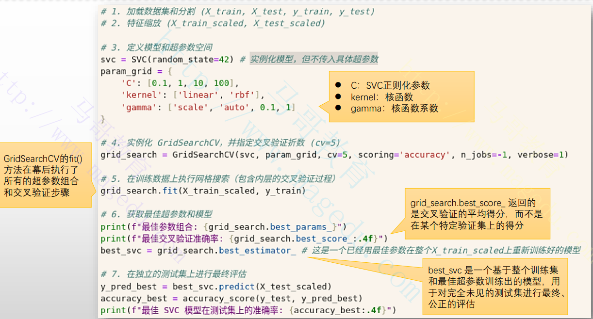

#### 2.6.4.6 超参数调优，交叉验证与Pipeline相结合

- [ ] pipeline作为标准的Estimator，也可以传递给GridSearchCV或RandomSearchCV

- [ ] 工作流程

  - 构建Pipeline，例如：

    

  - 定义超参数搜索空间

    - 使用param_grid指定预处理和模型的超参数

    - 参数名格式为 **步骤名_参数名**

    - 示例

      

  - 设置交叉验证策略

    - 通过cv参数指定交叉验证方式

  - 执行超参数调优

    - 和交叉验证超参数过程一样

  - 重新拟合模型

  - 最终评估

    - 最终使用独立测试集评估最终模型性能

- [ ] 示例

  

### 2.6.5 模型选择与评估

- [ ] 学习曲线
  - 基本原理
    - 学习曲线能够显示模型在不同训练集大小下，训练得分和交叉验证得分的变化趋势
    - 是诊断模型是否存在过拟合或欠拟合的重要工具
    - 实现：sklearn.model_selection.learning_curve函数
  - 优缺点
    - 优点：直观的帮助选择单个超参数的最佳值
    - 缺点：每次只能针对一个超参数进行分析

#### 2.6.5.1 性能指标

- [ ] 基本原理

  - 性能指标用于量化模型在特定任务（分类，回归）上的表现
  - 选择合适的指标至关重要，因为直接反应了模型是否满足业务目标

- [ ] 工作方式

  - 这些函数通常接受真实的目标值和模型的预测值或预测概率作为输入，然后根据定义的公式计算相应的指标值

- [ ] 主要分类任务指标

  - 准确率(Accuracy Score)：

    - 原理：正确预测的样本数占总样本数的比例
    - 适用场景：类别的分布均衡，且所有类别的错误同等重要
    - 缺点：对不平衡数据集不适用

  - 混淆举证

    - 原理：一个矩阵，显示真阳性（TP），真阴性（TN），假阳性（FP）和假阴性（FN）的数量
    - 适用场景：理解模型在各个类别上的预测情况
    - 下图为二分类混淆矩阵

    

  - 精确率:

    - 原理：TP/(TP+FP)

  - 召回率（Recall Score）:

    - 原理：TP/（TP+FN）

- [ ] 主要回归任务指标

  - 均方误差(MSE): mean_squaerd_error(y_true,y_pred)
    - 原理：预测值与真实值之差的平方的平均值，惩罚大误差
  - 均方根误差（RMSE）：np.sqrt(mean_squaerd_error(y_true,y_pred))
    - 原理：MSE的平方根
  - 平均绝对误差(MAE): mean_absolute_error(y_true,y_pred)
    - 原理：预测值与真实值之差的绝对值的平均值，对异常值不敏感
  - R平方：r2_score(y_true,y_pred)

# 3 神经网络和pytorch

## 3.1 神经网络（ANN）

- [ ]  基础概念

  - 神经网络又称为人工神经网络（ANN）,是一种基于人脑功能模型的计算架构
  - 神经网络由一组称为“节点”的处理单元组成，这些节点也称为“神经元”
  - 这些节点相互传递数据，就像大脑中的神经元相互传递电脉冲一样

- [ ] 神经网络是现代人工智能（AI）技术的核心

  - 大型语言模型（LLM）（如ChatGPT）和AI图像生成器（如DALL-E）等模型都在一定程度上依赖于神经网络

  

- [ ] 现代人工神经元，在旧版人工神经元的基础上，分别在输入端和输出端各引入了一个组件：

  - 输入端：偏置(Bias)

    - 也称为偏差，偏移量或者截距
    - 用于帮助确定，当所有特征值为0时，预测值应该是多少
    - 它还代表着神经元被激活的难易程度

  - 输出端：激活函数

    - 使用数学函数代替了旧版中的将“求和结果与目标值进行比较来判定最终输出”的步骤

    - 激活函数是一个执行非线性运算函数，它是防止神经网络坍塌的关键组件

    - 常见的激活函数有 **Sigmoid,** TanH, **ReLu,** leaky ReLU, Maxout和ELU等

      

- [ ] 多层感知机

  - 类似生物神经元，人工神经元也可以连接起来，其每个输入来自另一个神经元的输出

    - 输入层因为没有神经元，因此不计入网络层数

  - 通常，每层神经元只从前一层获得输入，并且只将输出送至下一层

    - 神经元通常不会与同一层上的神经元通信，也不会跨层进行通信

  - 这种类型的结构称为多层感知器，它们通常会**逐层处理数据**

  - 多层感知器也称为**前馈人工神经网络**（仅允许向前单向流动）

    

- [ ] 关键价值

  - 单个人工神经元几乎没有太多价值，因为现实世界的数据集大多不是线性的
  - 但是，将成千上万个小单元组装成层，并使用一些巧妙地算法来训练他们，通过合作，它们能够进行语音识别，照片分类等高级功能，甚至能够在逻辑和技能游戏中击败人类

### 3.1.1 神经网络学习过程

- [ ] 神经网络地“学习”，是指其从样本数据中自动获得**最优权重**地过程

  

- [ ] 神经网络训练过程

  1. 初始化：随机初始化网格中地所有参数
  2. 前向传播：将样本各特征值作为输入，逐层计算后，由最后地输出层生成最终地预测结果
  3. 计算损失：将网格输出值和样本地标签值进行比较，计算出损失函数的值
     - 常用的损失函数有均方误差，交叉熵等
  4. 反向传播：通过链式法则，计算损失函数对每个参数的梯度；梯度代表着损失函数在当前参数点处变化最快的方向
  5. 参数更新：根据计算得到的梯度，使用优化算法来更新网格中的参数（权重）
     - 常用的优化算法：随机梯度下降法（SGD）,Momentum, AdaGrad和Adam等
  6. 重复以上步骤

- [ ] 神经网络训练的注意事项

  - 神经网络的最优化问题非常难，因为参数空间非常复杂，且大型网络中参数量非常庞大，因此优化器的选择至关重要
  - 权重的初始值同样也至关重要，甚至会关系到网络的学习能否成功

### 3.1.2 神经网络的结构属性

- [ ] 输入层的神经元数量：取决于输入数据的特征维度
  - 输入层的神经元数量等于输入数据的特征维度
    - 结构化数据：例如一个包含年龄，身高，体重等10个维度的样本，输入层需设置10个神经元
    - 图像数据：对于尺寸28 * 28的灰度图，输入层神经元数量为784(即28 * 28像素)
    - 序列数据：若处理长度为100的文本词向量（每个词用300维向量表示），输入层需100 * 300个神经元
  - 输入层负责将原始数据转换为神经网络可处理的数值格式，每个神经元对应一个独立的特征
  - 输入特征的数量需要在模型设计时固定，否则需要调整网络结构
- [ ] 输出层的神经元数量：由任务类型决定
  - 回归任务
    - 输出层仅需要1个神经元，直接预测连续值
    - 若需同时预测多个连续值（如物体的位置坐标x和y），输出层的神经元数量等于目标变量数
  - 分类任务
    - 二分类
      - 常用1个神经元配合Sigmoid激活函数，输出概率值
    - 多分类
      - 输出层神经元数等于类别数，配合softmax激活函数输出概率分布（如手写数字识别需10个神经元对应0-9类别）

### 3.1.3 前向传播

- [ ] 前向传播运算的三阶段

  1. 从输入层到第一隐藏层(l=1)
     - **输入特征矩阵：** 输入维度取决于输入层神经元数量和样本数量
     - **隐藏层权重矩阵：**输入维度取决于隐藏层神经元数量和输入层神经元数量
  2. 从l-1层到第l层隐藏层（1<l<=L-1）
     - 输入和输出维度相同，都是隐藏层权重矩阵维度
  3. 从最后一隐藏层到输出层(l=L)
     - 输入维度取决于隐藏层权重矩阵
     - **输出层权重矩阵：**输出维度取决于输出层神经元数量和样本数量

- [ ] 矩阵维度

  - 输入特征矩阵：
    - batch_size是输入的样本批次大小
  - 隐藏层权重矩阵：
  - 输出层权重矩阵：
  - 预测输出矩阵：

  

#### 3.1.3.1 单个样本的前向传播运算

   

- [ ] 符号定义

  

- [ ] 步骤1：从输入层到隐藏层

  - 用于将输入数据x转换为隐藏层的激活输出

    1. 线性变换（加权和偏置)

    

    2. 非线性激活

       

- [ ] 步骤2：从隐藏层到输出层

  - 负责将激活函数转换为最终的预测输出y

    1. 线性变换（加权与偏置）

       

    2. 非线性激活（或输出层特有激活）

       

#### 3.1.3.2 一组样本（小批次）的前向转播运算


- [ ] 符号定义（批量处理）

  

- [ ] 步骤1：从输入层到隐藏层（批量处理）

  

- [ ] 步骤2：从隐藏层到输出层（批量处理）

  

### 3.1.4 反向传播

#### 3.1.4.1 神经网络的函数形式与反向传播的链式法则


#### 3.1.4.2 概念

- [ ] 关于反向传播

  - 反向传播是训练神经网络的核心算法，它的目标是利用链式法则(Clain Rule)来高效的**计算损失函数关于所有参数（权重和偏置）的导数**，从而使用**梯度下降法**优化参数
  - 反向传播完整整个链式梯度传导后，由优化器统一对所有层参数进行更新
    1. 通过前后传播计算输出层的误差：首先计算预测输出与真实标签之间的误差
    2. 逐层反向转递误差：这个误差会根据链式法则逐层反向传递，计算每一层神经元对总误差的“贡献”（即梯度）；所有梯度会暂存于内存中
    3. 优化器更新：一旦所有梯度都准备好，优化器会一次性的使用这些梯度来更新所有层的权重参数
  - 反向传播 = 链式法则 + 梯度下降

- [ ] 示例

  

#### 3.1.4.3 反向传播的简单示例


#### 3.1.4.4 前向转播与反向传播关键步骤

##### 3.1.4.4.1 单样本

- [ ] 以下是将线性模型`y=wx + b`配和MSE损失函数的前向传播与反向传播的关键步骤，操作表达式和计算含义整理成的对照表格

  

##### 3.1.4.4.2 多样本


##### 3.1.4.4.3 多层网络


### 3.1.5 改为使用pytorch的实现


### 3.1.6 构建并训练神经网络需要的组件


## 3.2 pytorch 深度学习框架

- [ ] 为何需要深度学习框架？

  - 神经网络的构建和训练涉及大量的数学运算，如矩阵乘法，卷积，梯度计算等
  - 手动从零开始编写代码来实现这些复杂的计算过程，工作量巨大，极易出错，而且也难以充分利用现代硬件（如GPU和TPU）的计算能力

- [ ] 深度学习框架

  - 一套高度优化，预先构建好的软件库和工具集，能够大大简化深度学习模型的开发，训练和部署的全过程
  - 负责将底层复杂的数学运算，内存管理，硬件加速（如GPU并行计算），自动微分等功能进行封装和抽象，并为用户提供一套高级且易于使用的API
    - 张量操作
    - 自动微分
    - 神经网络层
    - 优化器
    - 损失函数
    - 模型构建与管理
    - 数据处理工具
    - GPU/TPU加速
    - 分布式训练
    - 模型部署

  

### 3.2.1 Pytorch起源和发展

- [ ] Torch
  - 2002年首次发布，是一个基于Lua语言的开源科学计算框架
  - 提供了强大的GPU加速能力和自动微分功能，在学术界和工业界有一定的使用基础
- [ ] PyTorch
  - Python编程语言成为深度学习的主流语言后，FAIR基于Torch的核心思想，从零构建一个以python为先的新的深度学习框架

### 3.2.2 计算图

- [ ] 计算图

  - 用于表示数学运算和数据流的有向图结构
  - 是深度学习框架（如PyTorch, TensorFlow等）用于实现自动求导(Autograd)和模型计算的核心工具

- [ ] 计算图类型

  - 静态计算图
    - 在定义阶段就固定了计算图的结构，运行时不可修改（如TensorFlow 1.x）
    - 适合优化和部署，但灵活性较低
  - 动态计算图
    - 计算图在运行时自动生成，每次前向传播都会重新构建（如pytorch）
    - 更灵活，适合调试和动态模型设计

- [ ] 计算图的作用

  - 前向传播：按照计算图的拓扑顺序计算输出的结果
  - 反向传播：利用计算图自动计算梯度，用于优化模型参数

- [ ] 计算图的实现

  - 简单来说，计算图就是将需要定义和执行的所有数学计算（前向传播和反向传播）以图形化的方式表示出来，清晰的展示了数据如何流动的一系列操作

  - 将计算过程抽象为有向无环图，节点（Node）表示操作（如加法，矩阵乘法）或数据（如输入，参数），边（Edges）表示数据流动的路径

       

  - 例如， y =Wx + b可以表示为一个包含两个操作（矩阵乘法和加法）的计算图，其中张量x，张量W和张量b是输入边的源头，中间结果Wx 是一个边，最终输出张量y是图的输出边

### 3.2.3 Pytorch的计算图

- [ ] Pytorch采用动态计算图，也称为即时执行（**Eager Execution**）模式，主要特点如下

  - 动态性
    - 计算图在代码运行时动态构建：每次执行前向传播时，pytorch都会根据实际的运算过程实时构建计算图
    - 灵活，直观，调试方便，但运行时开销略高
  - 自动求导(Autograd)机制
    - 通过其Autograd引擎自动跟踪张量（Tensor）的操作，记录每个操作依赖关系，形成一个有向无环图（DAG）
    - 核心组件
      - Tensor: 张量对象存储数据，并通过requies_grad=True标记需要计算梯度的变量
      - Function: 每个操作（加法，乘法）都会生成一个Function对象，记录前向计算的逻辑和反向传播的梯度计算方式
      - Gradients: 通过调用tensor.backward(), pytorch利用链式法则自动计算每个requies_grad=True的张量相对于损失函数的梯度
  - 内存管理与优化
    - 默认情况下会在反向传播完成后自动释放中间结果（如中间张量的梯度），以节省内存
    - 若需要多次反向传播，可以通过retain_graph=True保留计算图

- [ ] pytorch计算图示例

  

- [ ] 示例解析：从底部（通常是损失）向上分析

  - MseLossBackward() (灰色方框)
    - 均方误差(MSE)损失函数进行反向传播的节点
    - 在pytorch中调用loss.backward()时，loss对象就是这个计算图的根
    - MseLossBackward()会计算损失相对于其输入的梯度
  - ReluBackward()（灰色方框）
    - ReLU激活函数进行反向传播的节点，会根据ReLU的导数计算其输入的梯度
  - AddBackward()（灰色方框）
    - 加法操作进行反向传播的节点，根据链式法则，加法操作的梯度会将其上游传来的梯度直接传给所有输入
  - MmBackward()（灰色方框）
    - 矩阵乘法进行反向传播的节点
  - PermuteBackward() （灰色方框）
    - permute操作（张量维度转置/重新排列）进行反向传播的节点
  - AccumulateGrad （灰色方框，有三个）
    - Pytorch自动求导机制中的一个特殊节点，他代表一个叶子张量的梯度累积点

### 3.2.4 pytorch模型训练的整体流程

1. 数据准备阶段
   - 将原始数据转换为pytorch的格式
     - Dataset
     - Load Dataset into Tensors
     - Encapsulate to Dataloader
     - Tensors (output)
2. 模型构建阶段
   - 定义和初始化神经网络
     - Model Selection(Cross Validation)
     - Create Network(torch.nn.Module)
3. 训练循环阶段
   - 迭代优化模型参数
     - forward()
     - Backpropagation
       - optimizer.zero_grad()
       - train_loss.backgroud()
       - optimizer.step()


- [ ] 数据准备阶段
  1. Dataset
     - 原始数据集，时模型将要学习的数据来源
     - 可以是图像，文字，音频，表格数据等任何形式
     - 通常对应于继承 torch.utils.data.Dataset的自定义类，它负责提供如何读取和获取单个数据样本的逻辑
  2. Load Dataset into Tensors
     - 将原始数据从文件系统或内存加载到pytorch的张量(torch.Tensor)中
     - 数据预处理的一部分，可能包括数据清洗，归一化，编码等操作
     - 实现： torch.tensor(), torch.form_numpy()等
  3. Encapsulate to Dataloader
     - 将处理好的张量数据封装到Dataloader中
     - Dataloader是pytorch的一个强大工具，负责批处理，数据打乱，多进程加载等功能
     - 提供了一个可迭代的对象，每次迭代返回一个批次的输入数据和对应的标签
     - pytorch对应的组件:torch.utils.data.Dataloader
  4. Tensors (output)
     - 这是Dataloader每次迭代的输出，即一个批次的输入张量和目标张量
     - 这些批次化的张量将作为forward()函数的输入
- [ ] 模型构建阶段
  1. Model Selection(Cross Validation)
     - 深度学习项目中，选择合适的模型架构和超参数至关重要
     - 交叉验证（Cross Validation）是一种评估模型泛化能力的方法，他将数据集划分多个子集，轮流用作训练集和验证集，以便稳健的评估模型的性能，并指导模型选择
     - 实现方法：这通常在代码外部，通过实验，调参和使用sklearn.mode_selection等工具实现
  2. 
- [ ] 模型循环阶段
  1. forward()
     - 神经网络的前向传播过程
     - 接收输入批次数据，通过定义的网络层进行计算，并产生预测输出(y_pred)
  2. Backpropagation
     - 神经网络的反向传播过程，用于计算损失函数相对于模型参数的梯度，并利用这些梯度更新参数以最小损失
     - 是pytorch自动求导的核心
     - optimizer.zero_grad()
       - 每次反向传播之前，清除模型参数之前累积的梯度
       - 是非常重要的一步，因为pytorch默认会累积梯度
       - 如果不清零，每次backend()调用会在旧梯度基础上累计新梯度，导致训练错误
     - train_loss.backgroud()
       - 执行反向传播
       - 从损失值开始，pytorch的自动求导引擎（autograd）会沿着计算图向后遍历，计算每个可训练参数的梯度，并将其存储在参数的.grad属性中
       - pytorch的对应：loss.backend()
     - optimizer.step()
       - 根据loss.backend()计算出的梯度，优化器按照其特定的算法来更新模型的参数（权重和偏置），使损失函数向着最小化的方向移动
       - pytorch中对应：optimizer.step()

### 3.2.5 构建并训练神经网络时需要定义的组件

1. 数据相关的组件
   - 输入特征的维度
   - 输出目标的维度
   - 训练批次大小（Batch Size）
   - **数据加载器**  (Dataloader)
   - **数据集**  (Dataset)
2. 模型结构相关的组件
   - **网络结构**
   - **层**
   - **激活函数**
3. 训练流程相关的组件
   - **参数初始化**
   - 前向传播
   - **损失函数**
   - 反向传播
   - **优化器**
4. 训练管理与监控组件
   - Epochs（训练次数）
   - **学习率调度器**
   - **正则化**
   - 模型保存与加载
   - 指标评估
   - 验证集
   - 测试集


#### 3.2.5.1 组件说明

1. 数据加载器
   - 用于高效的加载数据，通常包括以下功能：
     - 批处理：将数据集划分为为指定大小的批次
     - 数据打乱：在每个epoch开始时随机打乱数据，确保模型不会学习到数据的顺序，提高泛化能力
     - 多进程加载
   - pytorch组件：torch.utils.data.DataLoader
2. 数据集
   - 封装了数据集的存储和访问逻辑，提供了一种标准方式来获取单个样本及其对应的标签
   - pytorch组件：torch.utils.data.Dataset， 需要自定义继承并实现__ len __ 和 __ getitem __方法
3. 网络结构
   - 定义神经网络的整体布局，包括层的数量，每层的类型（如全连接层，卷积层，循环层），以及它们之间的连接方式
   - pytorch组件：通过继承torch.nn.Module自定义类，并在__ init __中定义层，在forward中定义数据流
4. 层
   - 神经网络的基本构建块，执行特定的数学运算
   - 常见类型
     - 线性层(Linear/Dense Layer)：nn.Linear，执行矩阵乘法和偏置加法
     - 卷积层（Convolutional Layer）：一维，二维，三维卷积，用于图像处理。通过滑动窗口提取特征
     - 池化层（Pooling Layer）：最大，平均和自适应池化，用于降低维度，提取主要特征，减少计算量
     - 循环神经网络层(Recurrent Layer)：nn.RNN, nn.LSTM和nn.GRU，用于处理序列数据
     - 嵌入层(Embedding Layer): nn.Embedding ，将离散的类别特征映射为连续向量
     - 归一化层: nn.BatchNorm2d, nn.LayerNorm,稳定训练过程，加速收敛
     - 非线性激活函数
     - Dropout层：一种正则化技术，用于防止过拟合
     - 注意力机制：用于处理序列数据中的依赖关系，尤其是Transformer模型的核心
5. 激活函数
   - 引入非线性，使神经网络能够学习和逼近复杂的非线性关系
   - 它们都定义在torch.nn模块中，以“层”组件的方式提供
6. 参数初始化
   - 在训练开始前为模型的权重和偏置赋初始值；合适的初始化能帮助模型更快收敛，并避免梯度消失或爆炸
     - 常见的方法：随机初始化，这些方法会考虑层的输入输出维度，保持激活值或梯度的方差稳定
   - pytorch组件
     - nn.Linear等层在实例化时已经有默认的初始化策略
     - 也可以手动使用nn.init模块进行更精细的控制
7. 前向传播
   - 将输入数据通过神经网络层层传递，直到生成最终的预测输出；这是模型推理的过程
   - 在pytorch中：nn.Module类中实现**forward(self,x)方法**
8. 损失函数
   - 衡量模型预测输出与真实标签之间的差异
   - 在pytorch中：支持众多损失函数，定义在torch.nn模块中，例如nn.MSELoss, nn.CrossEntropyLoss等
9. 反向传播
   - 根据损失函数计算出的误差，利用链式法则计算网络中所有参数（权重和偏置）相对于损失的梯度
   - 在pytorch中：通过调用loss.backward()自动完成，由torch.autograd引擎负责
10. 优化器
    - 根据反向传播计算出的梯度来更新模型的权重和偏置，从而最小化损失函数
    - 在pytorch中：定义在torch.optim模块中
    - 核心参数：学习率
11. 学习率调度器、
    - 在训练过程中动态调整学习率
    - pytorch组件:torch.optim.lr_scheduler模块提供了多种调度策略
12. 正则化
    - 防止模型过拟合训练数据，提供模型的泛化能力
    - Dropout以"层"的方式定义在torch.nn模块中
    - L1正则化通过损失函数间接实现，L2正则化通过优化器实现，通过“归一化层”实现隐式正则化
13. 模型保存与加载
    - 保存训练好的模型参数或整个模型结构，以便后续进行推理，部署或继续训练
    - pytorch的方法
      - torch.save(model.state_dict(),path):推荐方式，只保存模型学习到的参数
      - model.load_state_dict(torch.load(path))：加载参数到新实例化的模型

## 3.3 pytorch的张量及自动求导

### 3.3.1 关于张量（Tensor）

- [ ] 张量的定义

  - 张量是一个多维数组，可以表示标量（0维），向量（1维），矩阵（2维）以及更高维的数据结构
  - 使pytorch进行数值运算，深度学习模型训练和推理的基础，类似于NUmpy的多维数组，但张量具有额外的功能，例如支持GPU加速，自动求导等
    - 由torch.Tensor类实现，存储的数据可以是整数，浮点数或其他类型
    - 所有张量操作都围绕Tensor展开
    - 张量可以存储在CPU或GPU上，并支持自动求导以构建计算图

- [ ] NumPy与Tensor

  

### 3.3.2 Tensor的创建方式

- [ ] Tensor支持多种创建方式

  

- [ ] 从文件加载Tensor

  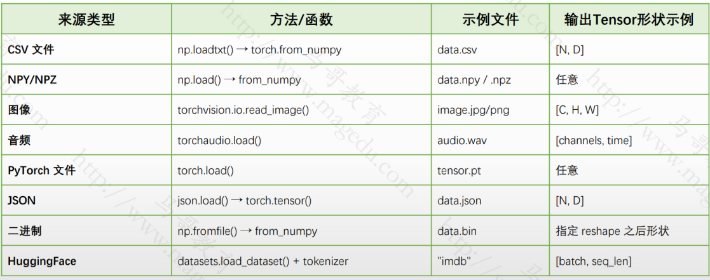

### 3.3.3 张量的属性

- [ ] 关于张量属性
  - 张量的属性是描述张量本身特征的数据，它们是张量对象的一部分，可以直接访问，而无需调用任何函数
  - 属性通常存储关于张量“是什么”的信息
    - 描述性信息：提供关于张量形状，数据类型，存储位置等的基本信息
    - 直接访问：可以通过tensor.attribute_name的形式直接访问
    - 通常是只读的：大多数张量属性都是只读的，意味着你不能直接修改它们来改变张量本身
- [ ] 张量的常用属性
  - tensor.shape或tensor.size：张量的形状（维度）
  - tensor.dtype: 张量中元素的数据类型
  - tensor.device:张量所在的设备（例如cpu ,cuda:0）
  - tensor.is_cuda: 布尔值，表示张量是否存储在GPU上
  - tensor.ndim或tensor.dim()：张量的维度数量
  - tensor.requires_grad：布尔值，表示是否需要计算该张量的梯度
  - tensor.grad: 张量的梯度
  - tensor.grad_fn: 记录创建张量的操作，用于构建计算图
  - tensor.T:快速转置，仅适用于2D张量

### 3.3.4 张量支持的操作

- [ ] 关于张量支持的操作

  - 张量支持的操作是可以对张量执行的计算或变换，定义了张量可以“做什么”
  - 它们是函数或方法，接受2一个或多个张量作为输入，并产生一个新的张量作为输出
    - 行为或功能：执行计算，变换，重塑，聚合等任务
    - 函数调用：需要通过函数调用（例如torch.add(a,b)）来执行
    - 返回新张量或原地修改：大多数操作会返回一个新的张量，而一些操作（通常以_ 结尾，如add_）会原地修改张量

- [ ] 常见的操作

  - 形状操作：view(), reshape(), transpose(dim0,dim1), flatten(), unsqueeze(dim), repear()等
  - 索引或切片: x[i], ...
  - 算术运算： +, -, *, /
  - 聚合运算： sum(), mean(), std(),var(), max(), min(), argmax(), argmin(),prod()
  - 矩阵运算：@或matmul(), mm(),bmm(),dot(),cross()
  - 比较与逻辑运算：>, <. >=,<=
  - 类似转换： x.float(), x.double(), x.long(),x.bool(),x.cpu(),x.to(cuda)
  - 复制，拼接，拆分: clone(), cat([a,b],dim=0), chunk(x,n,dim=0), split(x,size,dim=0)
  - 其他高级操作：广播机制，in-place操作，自动求导

- [ ] Tensor的形状操作方法总结

  

- [ ] NumPy与tensor的联系与区别

  

### 3.3.5 Tensor与Device

- [ ] 将Tensor移至指定设备的方法
  - .to(device)方法
    - 最常用的方法，用于将Tensor移动到指定的设备
    - 参数device可以是字符串（如“cpu”, "cuda"）或torch.device对象
    - 示例：tensor = torch.randn(3,3).to("cuda")
  - .cuda()方法
    - 专门用于将Tensor移动到GPU
    - 默认移动到默认GPU（通常是cuda:0）,可以通过参数指定设备索引
  - .cpu()方法
    - 将Tensor移动到CPU
  - 创建时指定设备
    - 在创建Tensor时，可以通过device参数直接指定存储设备
    - 示例：tensor = torch.randn(3,3, device="cuda")
  - 使用torch.device对象
    - 通过torch.device显示定义设备，结合.to()使用
    - 示例
      - device = torch.device("cuda" if torch.cuda.is_available() else "cpu")
      - tensor = torch.randn(3,3).to(device)
- [ ] 引用GPU的方法
  - 设备字符串
    - 使用字符串指定GPU设备，例如“cuda”, "cuda:0", "cuda:1" 等
  - torch.device对象
    - 显式创建torch.device对象
  - .cuda()方法
  - 检查GPU可用性
    - 使用torch.cuda.is_available() 检查是否有可用的GPU
  - 多GPU支持
    - 使用torch.cuda.device_count()获取可用的GPU数量
  - 设置默认设备
    - 使用torch.cuda.set_device(device)设置默认的GPU设备

### 3.3.6 pytorch的自动求导

- [ ] 关于自动求导机制

  - 自动求导是一种在程序运行时**自动计算函数梯度**的方法
  - 基于**计算图，**在前向传播时记录操作，在反向传播时按链式法则反向计算每个变量的梯度
  - pytorch的自动求导由其**autograd模块**实现

- [ ] ptorch的自动求导

  - 核心机制：动态图加计算图

    - 每一个Tensor都可以设置requires_grad=True,即启用自动求导功能
    - 所有对该Tensor的操作都会被记录为计算图（DAG格式）
    - 反向传播时自动按链式法则求导

  - 基本使用方法示例

    

- [ ] 自动求导的核心是计算图

  - 每当在requires_grad=True的张量上执行一个操作，pytorch都会在后台构建一个有向无环图
    - 节点（Nodes）：代表张量和操作
    - 边（Edges）: 表示数据流向和操作的依赖关系
  - 调用loss.backward()时，Autograd会从损失张量开始，沿着计算图反向遍历，自动计算图中所有requires_grad=True的张量的梯度

- [ ] grad_fn属性

  - 每个具有requires_grad=True的张量都有一个grad_fn属性

  

- [ ] grad属性

  - Loss.backward()被调用后，requires_grad=True的叶子张量的.grad属性会累积其梯度值

  - 示例

    

- [ ] 自动求导的工作原理

  1. 正向传播
     - 执行张量上的操作
     - 构建计算图，记录每个操作的输入，输出以及如何计算其反向梯度（通过grad_fn）
  2. 反向传播
     - Autograd从损失张量开始，沿着计算图反向遍历
     - 对于图中每个操作节点，Autograd会调用对应的grad_fn来计算该操作的输入张量的梯度
     - 这些梯度会链式法则累积到前一个节点的梯度
     - 这个过程一直持续到所有requires_grad=True的叶子张量，它们的梯度将被累积到tensor.grad属性中

- [ ] 示例

  - 两层神经网络，隐藏层使用ReLU激活函数: y = W2 * ReLU(W1 * X + b1) +b2，其可以拆分如下步骤

    

- [ ] 梯度累积和清零

  - pytorch的梯度是默认累积的
    - 在多次backward()调用之间不手动清零梯度，新的梯度值会与旧的梯度值相加
    - 梯度清零： zero() 或 optomizer.sero_grad()
  - 在大多数情况下，需要在每个优化步骤前清零梯度

- [ ] 控制梯度流

  - with torch.no_grad():
    - 在模型推理阶段或某些特定操作中不需要计算梯度时，可以使用with torch.no_grad():上下文管理器
    - 在此上下文中所有操作都不会i构建计算图，也不会跟踪梯度，从而节省内存并提高计算速度
    - 适用场景：模型评估，验证或部署时非常哟用
  - tensor.detach()
    - 该方法会返回一个新的张量，这个新张量与原始张量共享底层数据，但不会计算在计算图中

- [ ] 梯度与非标量输出

  - 若调用backward()方法的y是非标量（如向量/矩阵），需先聚合为标量（如y.sum().backwartd()），否则会报错
  - 这意味着，backward()在非标量输出上调用，需要提供一个grdient参数，它表示“外部梯度”的向量

## 3.4 构建和训练神经网络

- [ ] 基本流程

  

### 3.4.1 神经网络构建基础

- [ ] 神经网络的基本结构回顾

  - 输入层：接收数据
  - 隐藏层：由多个线性层+激活函数组成
  - 输出层：输出最终结果

- [ ] 常见构成单元

  - 线性层：全连接层，进行线性变换: y=WX + b
    - nn.Linear
  - 激活函数：非线性变换
    - nn.ReLU, nn.Sigmoid, nn.Tanh
  - 损失函数：评估损失
    - nn.MSEloss, nn.CrossEntropyLoss
  - 正则/Dropout: 防止过拟合
    - nn.Dropout

- [ ] 构建神经网络的基本步骤

  - 定义网络结构：继承nn.Module类，定义网络的层和前向传播逻辑
  - 准备数据：使用torch.utils.data加载和预处理数据
  - 初始化网络：设置层的参数（如输入/输出维度）和激活函数
  - 选择损失函数和优化器：如交叉熵损失和SGD优化器
  - 训练网络：通过前向传播，计算损失，反向传播和参数更新完成训练
  - 评估模型：在测试集上验证模型性能

- [ ] 构建一个简单的全连接神经网络，用于分类任务（例如手写数字识别，MNIST数据集）

  

### 3.4.2 torch.nn模块

- [ ] 关于torch.nn
  - pytorch的核心模块之一，提供了构建神经网络所需要的各种工具
  - 核心理念是模块化设计，所有神经网络组件都继承**nn.Module类，**以方便用户自定义和组织复杂的网络结构
    - nn.Module: 所有神经网络模块的基类，其核心作用在于提供一套标准的接口和管理机制，使得构建，组织和管理神经网络变的高效和便捷
    - 自定义网络需继承此类并实现**forward()**方法
  - nn.Parameter: 张量子类，用于标记可学习参数（如权重和偏置）
- [ ] torch.nn提供的关键组件
  - **层：**如全连接层（nn.linear），卷积层(nn.Conv2d),池化层(nn.MaxPool2d)等
  - **激活函数：**如ReLU（nn.ReLU）, Sigmoid(nn.Sigmoid)
  - **损失函数：**如均方误差(nn.MSELoss),交叉熵损失(nn.CrossEntropyLoss)等
  - 容器：nn.Module用于定义神经网络结构
  - 其他工具：正则化，归一化

### 3.4.3 nn.Module

#### 3.4.3.1 nn.Module的作用

- [ ] 在构建和管理神经网络时扮演着核心角色
  - 结构化和模块化
    - 提供了一个清晰的抽象层次定义神经网络，从而可以将复杂的模型分解为可重用的模块
    - 通过继承**nn.Module**,可以轻松定义自定义网络结构，并将其与其他模块组合
  - 参数管理
    - 自动跟踪模块内的参数(torch.nn.Parameter)和子模块，方便优化器访问和管理
  - 设备管理
    - 提供了to()方法，例如model.to("cuda")
  - 前向传播的统一接口
    - 要求实现forward方法，定义前向传播的逻辑
    - 这种统一接口使得模型调用简洁（通过model(input)自动调用forward）
  - 支持自动求导
    - 与pytorch的自动求导系统无缝集成，自动计算梯度，简化反向传播的实现
  - 内置功能与扩展性
    - 提供训练/评估模式切换(model.train()和model.eval())
  - 序列化（保存与加载）:state_dict() (保存模型)和load_state_dict()(加载参数)

#### 3.4.3.2 nn.Module的使用要点

1. 继承nn.Module

   - 所有自定义的神经网络结构都必须继承nn.Module

2. __ init __方法：定义网络层和子模块

   - 在__ init __方法中，需要定义网络中将使用的所有层和子模块
   - 这些层通常是nn.Module的实例(例如nn.Linear)
   - 提示：
     - 不要在__ init __中执行计算操作
     - 若激活函数带有可学习参数，则应在__ init __定义为nn.Module的实例
     - 若激活函数不带可学习参数（例如ReLU），可以选择在__ init __中定义nn.ReLU()实例，或者在forward方法中直接使用F.relu函数

   

3. forward方法：定义数据流

   - forward方法是nn.Module的核心，它定义了数据如何从输入层网络流向输出层
   - 提示：
     - forward方法只接受一个输入张量x，并返回一个输出张量
     - 所有的计算操作都在这里进行，可利用__ init __中定义的层来处理输入数据

   

4. 实例化模型和访问参数

   - 实例化网络类后，就可以得到一个模型对象
   - 随后可通过model.parameters()访问所有可学习的参数

   

5. 设备管理(.to()方法)

   - 若要在GPU上进行计算，需要将模型及其所有的输入数据移动到GPU上

     

6. 模型模式（train() 和 eval()）

   - 在训练和评估（或推理）阶段
   - model.train()：将模型设置为训练模式
     - Dropout层会随机丢弃神经元
     - BatchNorm层会计算并更新批统计量
   - model.eval()：将模型设置为评估模式
     - Dropout层会关闭
     - BatchNorm层会使用其在训练期间学习到的全局均值和方差

   

7. 模型组合(nn.Sequential 和nn.modulelist/nn.ModuleDict)

   

#### 3.4.3.3 torch.nn模块中的层

- [ ] 层是神将网络中构建模型的基本单元

  

## 3.5 主流激活函数

- [ ] 关于激活函数

  - 是指神经网络中用于在每一层神经元输出上引入非线性变换的数学函数，是神经网络的核心组件
  - 它决定神经元是否被激活（即输出信号是否被传递到下一层），以及输出的具体形式
  - 常见的激活函数包括Sigmoid, ReLU, Tanh, Softmax等

- [ ] 激活函数的作用

  - 引入非线性
    - 现实世界的数据通常是非线性的，若没有激活函数，网络的每一层只是输入的线性变换（例如，矩阵乘法和加法）
    - 激活函数通过引入非线性（如ReLu的截断等），使神经网络能够建模复杂的函数，从而解决非线性问题
  - 增强模型表达能力
    - 非线性激活函数使神经网络能够表示复杂的函数，理论上可以逼近任意连续函数
    - 这使得神经网络能够处理多样化的任务，比如分类，回归和生成模型
  - 控制信号传播
    - 激活函数可以控制神经元的输出范围，这种控制有助于稳定训练，防止输出值过大或国小
  - 梯度传播与优化
    - 激活函数影响反向传播中梯度计算
  - 稀疏激活
    - 某些激活函数（如ReLU）会使部分神经元的输出为0，产生稀疏性
    - 这种稀疏性可以减少计算量，提高模型效率，并有助于防止过拟合

- [ ] 激活函数的演进

  - 经历了**从线性到非线性，再到正则化友好，梯度稳定**的发展过程
  - 是一个不断平衡**非线性能力，训练稳定性与计算效率**的过程

  

### 3.5.1 早期的激活函数- Sigmoid


### 3.5.2 早期的激活函数- Tanh


### 3.5.3 早期的激活函数- ReLu


### 3.5.4 早期的激活函数- LReLu


### 3.5.5 早期的激活函数- PReLu

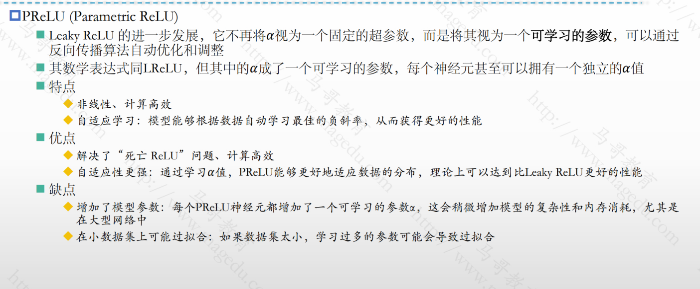

### 3.5.6 常用的激活函数 - ELU


### 3.5.7 常用的激活函数 - GELU


### 3.5.8 常用的激活函数 - Swish


### 3.5.9 各激活函数的适用场景


### 3.5.10 特殊的激活函数 - Softmax


### 3.5.11 主流激活函数的特性总结


## 3.6 主流的损失函数

- [ ] 损失函数的定义

  - 也称为成本函数或目标函数
  - 用于衡量模型预测结果与真实值差异

- [ ] 损失函数是神经网络训练的核心驱动力之一，它主要作用有两个方面

  - 量化误差：提供一个明确的，可计算的数值，来衡量预测值和真实值之间的差异
  - 指导模型优化：训练时，优化器通过最小损失函数的值不断调整模型参数，使得预测结果逐渐逼近真实值

- [ ] 损失函数，成本函数，评价指标

  

### 3.6.1 损失函数的梯度与参数优化

- [ ] 损失函数和损失曲面

  - 模型的所有参数（权重和偏置）共同构成了一个高维空间
  - 该空间中每个点都对应着一组特定的参数值，也对应着在该组参数下计算出的总损失值
  - 我们可以把这个高维空间的点及其对应的损失值想象成一个“损失曲面”
  - 参数的优化目标是在这个高维的损失曲面上找到最低点，也就是总损失最小的那一组参数值

- [ ] 损失函数的作用

  - 对于当前的参数组合，它计算出的损失值告诉我们在曲面的当前位置有多“高”
  - 而且，通过计算损失函数对参数的梯度，我们可以知道当前位置的“坡度”和“方向” （梯度）
    - 在数学上，梯度指向函数值上升最快的方向
    - 梯度的**反方向**则指向损失减少最快的方向
      - 优化方向= 负梯度方向
    - 优化器（如SGD）正是利用这个梯度的反方向类更新参数
      - 每次更新，都朝着降低损失的方向迈进一小步

- [ ] 所以，损失函数必须要可微

  

### 3.6.2 损失函数与反向传播


### 3.6.3 常用的损失函数及其实现

- [ ] 使用pytorch损失函数计算损失的步骤

  - 定义损失函数
    - 根据任务选择合适的损失函数，并初始化
    - 例如：criterion = nn.MSELoss(reduction='mean')
  - 准备输入数据
    - 确保模型的预测输出（input, 作为损失函数的输入）和真实标签准备好
    - 二者要确保：形状匹配，数据均为浮点型，在input上启用了梯度（若需要反向传播）
  - 计算损失
    - 调用损失函数对象，传入input和target即可计算损失，例如loss = criterion(input, target)

- [ ] 常用的损失函数及其实现

  

### 3.6.4 回归任务的常用损失函数 - MSE

- [ ] torch.nn.MSELoss()
  - pytorch模块，继承自torch.nn.Module，可以像神经网络层一样被实例化和使用
  - **reduction**参数：指定用于处理批次中所有单个损失的聚合方式
    - ‘mean(默认值)’: 计算批次中所有样本损失的平均值
    - 'sum:' 计算批次中所有样本损失的总和
    - 'none:' 不进行任何聚合，而是返回一个与输入张量形状相同的张量，其中每个元素是对应位置的平方误差
  - 初始化损失函数的示例：
    - criterion = nn.MSELoss() # 默认
  - 调用损失函数示例
    - 输入: input(预测值) 和 target (真实值) 是两个形状相同的张量
    - 输出：
      - 如果reduction='mean' 或 'sum'， 返回一个标量(torch.Tensor类型)
      - 如果reduction='none' ，返回一个与输入形状相同的张量，表示逐元素的平方差
- [ ] 注意
  - 如果使用了GPU，要确保Input， target和模型在同一设备上

### 3.6.5 回归任务的常用损失函数 - MAE

- [ ] torch.nn.L1Loss()

  - pytorch模块，继承自torch.nn.Module，同样可以像神经网络层一样被实例化和使用
  - reduction参数的使用和MSELoss()相同

- [ ] 示例

  

### 3.6.6 回归任务的常用损失函数 - Huber损失


### 3.6.7 熵和交叉熵


### 3.6.8 pytorch支持的分类任务的损失函数


### 3.6.9 分类任务的常用损失函数- 二元交叉熵损失


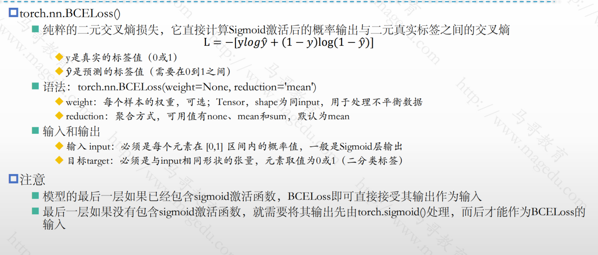


### 3.6.10 分类任务的常用损失函数- 负似然对数损失


### 3.6.11 分类任务的常用损失函数- 交叉熵损失


## 3.7 DataSet和Dataloader

### 3.7.1 pytorch加载数据集的方式

- [ ] 加载数据集的组件

  - torch.utils.data模块中的Dataset和DataLoader类，二者协同工作，可以构建出强大的数据管道
  - 专为深度学习模型训练设计，高效支持批量加载，数据打乱，多线程预取和数据增强

  

### 3.7.2 定义Dataset

- [ ] Dataset是pytorch中表示数据集的抽象基类
  - 负责定义如何获取单个数据样本的统一接口
  - 通过实现__ len __ 和 __ getitem __ 方法，可以将任何类型的数据封装成pytorch可以理解的格式
  - 同Dataloader结合使用时，Dataset能够实现高效的批处理，并行加载和灵活的数据预处理/增强
- [ ] 我们需要创建一个继承自torch.utils.data.Dataset的自定义类，并包含以下三种方法
  - __ init __ (self, ...): 初始化数据集，加载数据路径，标签和预处理逻辑
  - __ len __ (self)： 返回数据集的总体样本数
  - __ getitem __ (self,index) :根据索引返回单个样本（通常是数据和标签的元组）
    - DataLoader需要一个批次的数据时，它会多次调用Dataset的__ getitem __(idx)方法来获取足够多的单个样本，然后将它们组合成一个批次


### 3.7.3 Dataloader

- [ ] Dataset 和DataLoader

  - Dataset负责定义如何获取单个数据样本，DataLoader负责将这些单个样本有效的组织成批次，并以最优化的方式送入模型进行训练
  - DataLoader的核心功能
    - 批量加载：将数据集分成小批次，便于模型训练
    - 数据打乱：随机打乱数据顺序，增强模型泛化能力
    - 多线程加载：通过并行加载数据，减少I/O瓶颈
    - 自定义处理：支持灵活的批量合并和采样策略，适配复杂数据类型

  

- [ ] DataLoader的核心参数

  

#### 3.7.3.1 DataLoader的工作过程

1. DataLoader初始化：将一个Dataset传递给DataLoader
2. 创建worker进程：如果num_workers > 0, DataLoader会启动指定数量的子进程作为数据加载的worker
3. 迭代开始：在训练循环中开始迭代DataLoader(**for batch_idx, (data,target) in enumerate(train_loader):**)
   - worker请求样本：worker进程会向Dataset请求样本数据，他们会调用Dataset的__ getitem __(idx)方法，根据shuffle的设置，获取不同索引的单个样本
   - 预处理/增强：在__ getitem __内部，数据会被加载，预处理和应用数据增强
   - 样本返回：处理好的单个样本被worker返回
   - 主进程收集：主进程的DataLoader会收集来自各个worker的单个样本
   - 合并批次：收集到足够多的样本（达到batch_size）后，DataLoader会使用默认的或自定义的collate_fn来将这些单个样本合并成一个批次的Tensor
   - 内存固定（如果开启）：如果pin_memory=True，这个批次数据会被复制到CUDA固定内存
   - 返回批次：最终的批次Tensor会被传递到主训练循环，共模型使用

- [ ] 注意
  - 这个过程是高度并行的：在GPU处理当前批次时，cpu的worker进程已经可以预取和预处理下一批次的数据，从而最大化资源利用率，减少训练时间

### 3.7.4 数据集处理的问题及pytorch的方案


### 3.7.5 torchvision内置的数据集

- [ ] torchvision.datasets模块

  - 包含许多流行的**计算机视觉数据集，**如MNIST, CIFAR10, ImageNet等
  - 核心特点
    - 多样性：涵盖图像分类，目标检测，语义分割，视频等任务
    - 开箱即用：这些数据集都是Dataset的子类，可以直接与Dataloader配合使用
    - 自动下载与解压：大部分数据集都支持通过设置download=True参数来自动从互联网下载数据并进行解压
    - 集成转换(Transforms)：数据集类通常接受一个transform参数，可在加载数据时实时应用torchvision.transforms模块中定义的各种数据预处理和数据增强操作，例如图像缩放，裁剪，归一化，随机反转等

- [ ] torchvision.datasets的基本用法

  

- [ ] torchvision.datasets数据增强

  - torchvision.transforms提供丰富的图像变换功能，常用于数据增强
    - transforms.Resize :调整图像大小
    - transforms.RandomHorizontalFlip: 随机水平翻转
  - transforms.Colorjitter： 调整宽度，对比度等
    - transforms.ToTensor：将PIL图像或Numpy数组转换为Tensor
    - transforms.Normalize: 标准化图像

- [ ] 几个常用数据集说明

  - MNIST
    - 手写数字数据集，包含0-9灰度图像；60000训练图像，10000测试图像，10个类别
  - CIFAR-10/CIFAR-100
    - 自然图像数据集，包含小型彩色图像；50000训练图像，10000测试图像；名称中数字代表类别数
  - ImageNet
    - 大规模图像分类数据集，包含自然场景图像；约140万训练图像，50000验证图像；类别1000

## 3.8 训练循环和MLP模型

### 3.8.1 关于训练循环

- [ ] 关于训练循环

  - 模型的“训练”是赋予模型能力的学习过程，而“训练循环”则是实现这个学习过程的具体执行框架

  - 通过嵌套**Epoch**  和 **Batch**循环，结合前向传播，损失计算，反向传播和参数更新等核心步骤，让模型能够利用迭代优化的方式从数据中学习参数，从而逐步提升性能

- [ ] 训练循环的构成

  - 外部循环（Epoch Loop）
    - 循环次数通常是由num_epochs(总训练轮数)决定
    - 每个执行一次Epoch ，意味这模型会遍历整个训练数据集一次
  - 内部循环(Batch loop)
    - 循环的次数由训练数据大小和batch_size决定
    - 每次内部循环处理一个mini-batch的数据
  - 单次迭代：这是处理一个min-batch的完整流程
    - 数据加载：从Dataloader获取一个batch的输入数据和真实标签
    - 设备转移：将数据和模型移动到相同的计算设备(CPU或GPU)
    - 梯度清零--》前向传播--》计算损失--》反向传播--》参数更新

### 3.8.2 训练循环的核心组成部分

1. 数据准备
   - 数据集和DataLoader：加载数据集并使用DataLoader进行批量加载，打乱和并行数据处理
   - 数据预处理：对输入数据进行必要的转换（如归一化，数据增强等）
2. 模型初始化
   - 定义神经网络模型（继承 torch.nn.Module ）
   - 将模型移动到指定设备
   - 初始化模型参数（通常由pytorch自动完成，或手动设置）
3. 优化器和损失函数
   - 优化器：选择优化算法并设置学习率，动量等超参数
   - 损失函数：选择适合任务的损失函数
4. 训练循环
   - 遍历 epoch: 设置训练的轮数，每个epoch遍历一次整个训练数据集
   - 批量处理
     - 从Dataloader获取批量数据（inputs和labels）
     - 将数据移动到指定设备
   - 前向传播
     - 将输入数据送入模型，计算预测输出（output=model(input)）
     - 计算损失(loss = criterion(output,lables))
   - 反向传播
     - 清空梯度，避免梯度累加
     - 调用loss.backward()计算梯度
   - 参数更新
     - 使用优化器更新模型参数
5. 验证/测试
   - 在每个epoch或特定间隔，使用验证集评估模型性能
   - 设置模型为评估模式(model.eval())
   - 计算验证损失或评估指标（如准确率，F1分数）
   - 使用torch.no_grad()上下文管理器避免计算梯度，节省内存
6. 日志记录与监控
   - 记录训练过程中的损失，准确率等指标（使用Tensorboard）
   - 可视化训练进展，检查过拟合或欠拟合
7. 数据保存与加载
   - 保存模型权重(torch.save(model.state_dict(), 'model.pth'))
   - 加载模型权重(model.load_state_dict(torch.load('model.pth')))以进行推理或继续训练
8. 学习率调度
   - 使用torch.optim.lr_scheduler动态调整学习率，以提高训练效果
9. 异常处理与早停
   - 监控验证损失，若长时间未改善则停止训练
   - 处理可能的异常（如NaN损失或数据问题）

### 3.8.3 训练循环代码示例


### 3.8.4 MLP模型

#### 3.8.4.1 关于MLP模型

- [ ] MLP

  - 一种经典的人工神经网络模型，是FNN的子集
  - 通过多层全连接的神经元结构，能够学习输入数据与输出数据的复杂非线性关系，广泛用于分类，回归等任务

- [ ] MLP的基本结构

  - 输入层

    - 负责接收原始数据，每个节点（神经元）代表输入数据的一个特征
    - 不执行任何计算，仅仅将数据传递给下一层

  - 隐藏层

    - MLP至少含有一个隐藏层，也可以有多个隐藏层
    - 每个神经元都与前一层所有神经元连接
    - 神经元基于激活函数进行非线性转换

  - 输出层

    - 负责产生模型的最终预测结果
    - 神经元数量取决于任务类型
      - 回归问题：一个神经元
      - 二分类问题：一个神经元，由Sigmoid函数激活
      - 多分类问题：多个神经元，由softmax函数转换为概率分布

    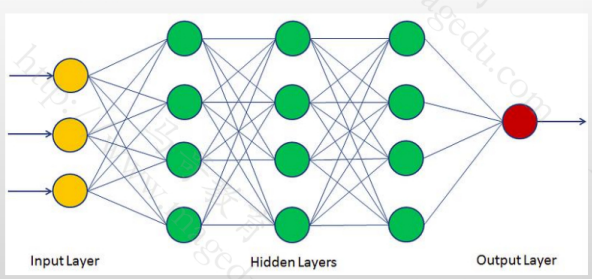

#### 3.8.4.2 隐藏层神经元数量


#### 3.8.4.3 MLP的优点与缺点


#### 3.8.4.4 MLP在深度学习中的应用


